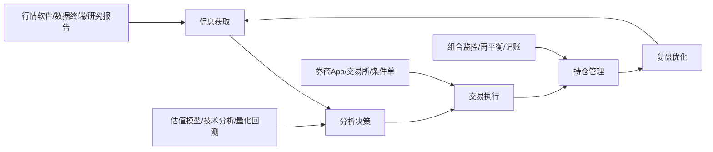
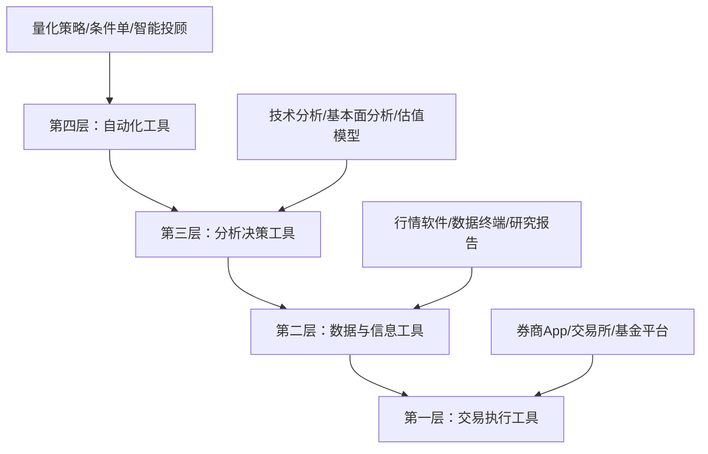
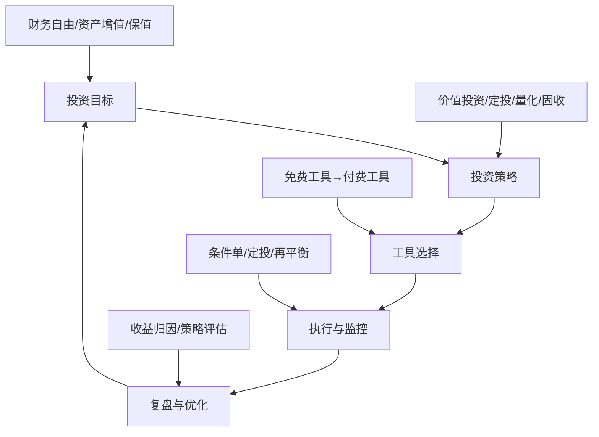

# 第十四章：投资工具与平台

> "工欲善其事，必先利其器。" —— 孔子

投资工具是将投资理论转化为实际收益的桥梁。一个价值投资者需要基本面分析工具来筛选被低估的股票，一个量化交易者需要数据API和回测平台来验证策略，一个普通基民需要定投工具来执行纪律化投资。工具不是万能的，但没有合适的工具，再好的投资理念也难以落地。

本章按照投资流程（信息获取→分析决策→交易执行→持仓管理）和资产类别两个维度，系统梳理主流投资工具与平台。每个工具不仅介绍功能，更着重说明适用场景、选择逻辑和实操要点。



---

## 14.1 工具选择的核心原则

在逐一介绍工具之前，先建立选择工具的底层逻辑。

### 14.1.1 投资工具的分层体系

投资工具可以分为四个层级，从基础到高级依次递进：



| 层级 | 名称 | 核心功能 | 所需技能 | 适合人群 |
|------|------|----------|----------|----------|
| 第一层 | 交易执行 | 买卖下单、资金划转 | 基本App操作 | 所有投资者 |
| 第二层 | 数据信息 | 行情查看、新闻阅读 | 信息筛选能力 | 从入门就需要 |
| 第三层 | 分析决策 | 估值建模、技术分析 | 财务知识、统计学 | 进阶投资者 |
| 第四层 | 自动化 | 量化回测、程序化交易 | 编程、数学建模 | 专业投资者 |

**核心建议**：先用免费工具建立投资体系，当免费工具成为瓶颈时再升级付费版本。很多人买了高级数据终端却只用了其中10%的功能，这是极大的浪费。投资能力的提升永远优先于工具的升级——一个理解估值原理的人用免费工具做出的判断，远胜于一个不懂估值的人用Wind终端做的决策。

### 14.1.2 选择工具的五个维度

| 维度 | 关键问题 | 权重 | 验证方法 |
|------|----------|------|----------|
| 功能匹配 | 这个工具能否解决我的核心问题？ | ★★★★★ | 列出你的核心需求，逐一对照 |
| 学习成本 | 我需要花多少时间才能上手？ | ★★★★☆ | 试用免费版，记录上手时间 |
| 费用性价比 | 免费版能否满足80%的需求？ | ★★★☆☆ | 列出付费版独有功能，评估使用频率 |
| 数据质量 | 数据来源是否可靠、更新是否及时？ | ★★★★★ | 与权威数据源交叉验证 |
| 生态兼容 | 能否与其他工具配合使用？ | ★★★☆☆ | 检查API/导出/导入功能 |

**实操建议**：每年做一次"工具审计"——列出所有正在使用的付费工具，标注过去一个月的使用次数。使用频率低于每周一次的付费工具，果断取消订阅。把省下的钱投入本金，长期复利效应远超工具带来的边际收益。

### 14.1.3 避免工具陷阱

常见的工具使用误区：

- **工具崇拜**：认为有了好工具就能赚钱。工具只是放大器，放大的是你的投资逻辑——如果逻辑本身有问题，工具只会让你亏得更快。一个用Excel做估值分析但逻辑正确的人，远胜于用Bloomberg终端但盲目追涨杀跌的人。
- **功能焦虑**：总觉得自己的工具不够好，频繁切换工具。实际上，熟练使用一个工具比浅尝辄止十个工具更有价值。通达信用户花一年时间精通自编公式，比同时用五个软件更有产出。
- **数据迷信**：过度依赖工具给出的数据和信号，忽略常识判断。任何数据都有局限性——历史估值分位在公司基本面发生质变时可能失效，技术指标在极端行情中可能集体失灵。工具的输出需要人工验证。
- **忽视成本**：订阅多个付费平台，费用加起来远超投资收益。假设年订阅总费用5000元，而你的投资本金是10万元，仅工具成本就占了5%——这意味着你的投资收益率必须超过5%才能覆盖工具费用。
- **过早复杂化**：新手一上来就搭建量化系统、买Level 2行情，却不理解基本的估值原理。先学会用免费工具做出正确判断，再考虑用付费工具提升效率。

---

## 14.2 股票投资工具

股票投资工具是最成熟的投资工具生态，覆盖从信息获取到交易执行的完整链条。

### 14.2.1 行情与资讯软件

行情软件是股票投资者的"眼睛"，选择标准因投资风格而异。

#### 主流行情软件对比

| 特性 | 同花顺 | 东方财富 | 通达信 | 雪球 |
|------|--------|----------|--------|------|
| **核心定位** | 综合交易终端 | 资讯+社区+券商 | 技术分析利器 | 投资社区 |
| **A股行情** | ✅ 实时 | ✅ 实时 | ✅ 实时 | ✅ 实时（延迟约3秒） |
| **港美股** | ✅ 支持 | ✅ 支持 | ❌ 不支持 | ✅ 支持 |
| **技术分析** | ★★★★☆ | ★★★☆☆ | ★★★★★ | ★★☆☆☆ |
| **自编公式** | ✅ 支持 | ❌ 不支持 | ✅ 最强 | ❌ 不支持 |
| **资讯深度** | ★★★☆☆ | ★★★★★ | ★★☆☆☆ | ★★★★☆ |
| **社区互动** | ★★★☆☆ | ★★★★☆（股吧） | ★☆☆☆☆ | ★★★★★ |
| **券商接入** | 多家券商 | 仅东方财富证券 | 多家券商 | 多家券商 |
| **Level 2行情** | ~30元/月 | ~30元/月 | 视券商 | 不支持 |
| **手机端体验** | ★★★★★ | ★★★★☆ | ★★★☆☆ | ★★★★★ |
| **适合人群** | 通用型 | 资讯驱动型 | 技术分析型 | 价值投资型 |

**选择建议**：

- **新手入门**：东方财富——资讯全面、股吧社区可以帮助你快速了解市场，且东方财富证券佣金较低（万2.5左右）。App内嵌的Choice数据终端基础版已经够用。
- **技术分析派**：通达信——自编公式功能最强，支持编写复杂的技术指标和选股公式，运行速度快、占用资源少。很多职业交易员只用通达信。公式编写语法接近Excel，学习曲线平缓。
- **综合使用**：同花顺——功能最全面，支持最多券商接入，手机端体验最好。i问财功能支持自然语言选股（输入"ROE大于15%且PE低于20"即可筛选），非常适合不擅长编程的投资者。
- **价值投资者**：雪球——社区质量最高，深度分析文章多，投资组合管理功能强。适合长期持有、注重基本面分析的投资者。组合功能可以公开分享并跟踪收益率。

**实用技巧**：

- **多屏方案**：职业投资者通常使用通达信做技术分析 + 东方财富看资讯 + 券商App下单。三个软件各司其职，避免单一软件崩溃影响全部工作。
- **Level 2是否值得买**：对于日内交易者（T+0策略、打板策略），Level 2的十档行情和逐笔成交数据是必要的。对于中长线投资者，免费行情完全够用。不要因为"别人有我也要有"的心理购买Level 2。
- **自选股管理**：建议按行业分组管理自选股（如银行、消费、科技、周期），而不是把所有关注的股票堆在一起。这样在板块轮动时能快速判断机会。每组控制在10只以内，自选股总数不超过50只——超过这个数量你根本看不过来。
- **预警设置**：利用行情软件的预警功能，设置关键价位提醒。例如某股票跌到你的目标买入价时自动弹窗提醒，避免错过机会。

### 14.2.2 基本面分析工具

基本面分析工具帮助你读懂一家公司的"体检报告"。

#### 理杏仁（lixinger.com）

理杏仁是国内最专注估值分析的工具，核心价值在于提供**历史估值数据的可视化查询**。

**核心功能**：
- **估值图表**：PE、PB、PS、EV/EBITDA等指标的历史走势图，可以直观看到当前估值处于历史什么位置。支持自定义时间范围，最长可追溯10年以上。
- **估值分位**：显示当前估值在历史数据中的百分位。例如"PE分位15%"意味着当前PE比历史上85%的时间都低。这是判断估值高低最直观的量化指标。
- **行业对比**：同行业公司的估值横向对比，快速发现行业中的低估标的。可以同时对比5-10家公司的关键指标。
- **财务数据**：ROE、毛利率、资产负债率等核心财务指标的趋势图。支持杜邦分析拆解ROE的驱动因素。
- **指数估值**：提供主要宽基指数和行业指数的估值数据，是指数基金定投的重要参考。

**实操场景**：假设你想判断某只股票是否值得买入。在理杏仁中搜索该股票，查看PE分位——如果低于30%，说明估值处于历史低位区间，结合基本面分析可以考虑建仓；如果高于70%，则需要谨慎。进一步查看ROE趋势——如果ROE连续5年稳定在15%以上且呈上升趋势，说明公司盈利能力强且在改善，低PE可能是被错杀。

**费用**：基础功能免费，高级版约199元/年（解锁更多指标和历史数据）。对于价值投资者来说，这个价格非常值得——相当于一顿火锅的钱，换来一年的估值分析能力。

#### 乌龟量化（guorn.com）

乌龟量化是一个轻量级的数据查询工具，适合快速查阅。

**核心功能**：
- 股票、基金、指数的历史数据查询和下载（支持CSV导出）
- 财务报表数据（利润表、资产负债表、现金流量表），支持季度和年度数据
- 多只股票的对比分析（最多同时对比10只）
- 估值指标查询（PE、PB、PS、股息率等）
- 行业数据汇总（行业平均PE、PB等）

**与理杏仁的区别**：乌龟量化更侧重数据查询和导出，理杏仁更侧重估值分析和可视化。如果你需要下载数据到Excel做进一步分析，乌龟量化更方便；如果你需要直观地看估值分布，理杏仁更好用。两者可以配合使用——用理杏仁做定性判断，用乌龟量化做定量分析。

#### 同花顺i问财（iwencai.com）

i问财是同花顺旗下的智能选股工具，支持**自然语言查询**。

**使用方式**：直接输入类似"连续3年ROE大于15%且PE低于20且市值大于100亿"这样的自然语言条件，系统自动筛选符合条件的股票并生成列表。

**典型查询示例**：
- "近3年净利润增速大于20%且PEG小于1"——寻找高成长且估值合理的股票
- "股息率大于5%且连续5年分红"——寻找稳定高分红股票
- "近1个月北向资金增持且股价创新高"——跟随聪明资金
- "所属行业为半导体且研发投入占比大于15%"——筛选高研发投入的科技股

**注意事项**：i问财的结果是基于历史财务数据筛选的，不能预测未来。筛选结果只是"候选名单"，还需要进一步人工分析公司的竞争优势、行业前景、管理层质量等定性因素。

#### 财报阅读实操指南

工具只是手段，读懂财报才是核心能力。以下是使用工具辅助阅读财报的流程：

**第一步：现金流量表（排雷优先）**

在东方财富或同花顺中打开现金流量表，关注以下关键指标：
- 经营活动现金流净额是否持续为正且大于净利润。如果净利润很高但经营现金流为负，要警惕利润质量——公司可能通过应收账款虚增收入。
- 自由现金流（经营活动现金流 - 资本支出）是否为正。自由现金流为负的公司需要持续融资才能维持运营。
- 收现比（销售商品收到的现金 / 营业收入）是否大于1。低于0.8说明大量收入是"纸面收入"，实际现金没有收回。

**第二步：利润表（看盈利能力）**

在理杏仁中查看ROE趋势：
- 连续5年ROE>15%的公司通常具有较强的盈利能力
- 用杜邦分析拆解ROE：ROE = 净利率 × 资产周转率 × 权益乘数。靠高杠杆（权益乘数高）驱动的ROE质量较低，靠高净利率驱动的ROE质量最高
- 关注毛利率趋势——毛利率持续下降可能意味着竞争加剧或产品竞争力下降

**第三步：资产负债表（看财务健康）**

- 资产负债率超过70%的公司需要额外谨慎（金融行业除外）
- 有息负债率（有息负债/总资产）超过50%说明公司杠杆过高
- 商誉占净资产比例超过30%需要警惕——大量商誉意味着此前进行了高溢价收购，存在减值风险
- 应收账款周转天数持续增加说明回款能力在恶化

**第四步：成长性分析（看未来）**

- 查看营收和净利润的增长率趋势，注意区分周期性增长和持续性增长
- 将增长率与行业平均对比——跑赢行业平均的公司通常有竞争优势
- 关注研发投入占比——高研发投入的公司未来增长潜力更大（科技行业尤为重要）
- 查看在建工程和固定资产增长率——产能扩张是未来营收增长的先行指标

### 14.2.3 技术分析工具

技术分析工具用于研究价格走势和交易量模式。技术分析的本质是通过历史价格和成交量数据，识别市场参与者的群体行为模式，从而推测未来价格走势的概率。

#### 通达信自编公式

通达信最强大的功能是支持用户自编技术指标公式。以下是一个实用的选股公式示例——选出均线多头排列且放量的股票：

```text
{均线多头排列且放量选股}
MA5 := MA(CLOSE, 5);
MA10 := MA(CLOSE, 10);
MA20 := MA(CLOSE, 20);
MA60 := MA(CLOSE, 60);

{均线多头排列}
DUOTOU := MA5 > MA10 AND MA10 > MA20 AND MA20 > MA60;

{放量：当日成交量大于5日均量的1.5倍}
VOLMA5 := MA(VOL, 5);
FANGLIANG := VOL > VOLMA5 * 1.5;

{选股条件}
DUOTOU AND FANGLIANG;
```

在通达信中，通过"功能→公式系统→公式管理器"可以新建和管理自定义公式。

**公式编写入门**：

通达信公式语言的常用函数：

| 函数 | 用途 | 示例 |
|------|------|------|
| MA(X, N) | N日移动平均 | MA(CLOSE, 20) — 20日均线 |
| EMA(X, N) | N日指数移动平均 | EMA(CLOSE, 12) — 12日EMA |
| CROSS(A, B) | A上穿B | CROSS(MA5, MA20) — 5日线上穿20日线 |
| REF(X, N) | N日前的值 | REF(CLOSE, 1) — 昨日收盘价 |
| HHV(X, N) | N日内最高值 | HHV(HIGH, 60) — 60日最高价 |
| LLV(X, N) | N日内最低值 | LLV(LOW, 60) — 60日最低价 |
| COUNT(X, N) | N日内满足X条件的天数 | COUNT(CLOSE>MA20, 10) — 10日内收在20日线上的天数 |
| EVERY(X, N) | N日内X条件是否一直成立 | EVERY(CLOSE>MA20, 5) — 连续5日收在20日线上 |

**更多实用公式示例**：

MACD底背离选股（股价创新低但MACD不创新低）：
```text
{MACD底背离}
DIFF := EMA(CLOSE, 12) - EMA(CLOSE, 26);
DEA := EMA(DIFF, 9);
MACD := (DIFF - DEA) * 2;

{寻找近期低点}
LOW1 := LLV(LOW, 20);  {20日内最低价}
LOW2 := LLV(LOW, 60);  {60日内最低价}

{股价创新低但MACD不创新低}
BEAR := LOW < REF(LOW1, 1) AND MACD > REF(LLV(MACD, 20), 1);
BEAR;
```

#### 常用技术指标使用要点

| 指标 | 适用场景 | 关键参数 | 常见误区 | 正确用法 |
|------|----------|----------|----------|----------|
| MACD | 趋势判断、背离信号 | 12/26/9 | 金叉不等于买入信号，需结合趋势 | 0轴上方金叉比0轴下方金叉更可靠；背离信号比金叉/死叉更有参考价值 |
| KDJ | 超买超卖判断 | 9/3/3 | 钝化现象严重，强势股中KDJ长期高位 | KDJ在20以下金叉买入比80以上金叉更安全；钝化时忽略KDJ |
| RSI | 超买超卖、背离 | 14日 | 单独使用准确率低，需配合其他指标 | RSI<30且出现底背离时的买入信号较可靠 |
| 布林带 | 波动率、支撑压力 | 20日/2倍标准差 | 收窄后不一定突破，需等确认 | 布林带收窄后放量突破上轨，是较可靠的买入信号 |
| 成交量 | 趋势确认、量价关系 | 5日/10日均量 | 放量不等于要涨，缩量不等于要跌 | 上涨放量+下跌缩量=健康趋势；上涨缩量+下跌放量=趋势转弱 |
| 均线系统 | 趋势方向、支撑压力 | 5/10/20/60/120/250 | 均线太多反而混乱 | 中长线看60日和120日均线；短线看5日和10日均线 |

**核心原则**：技术指标是滞后指标，它们描述的是过去的价格行为，不是预测未来。使用技术指标的关键是**多重确认**——至少2-3个指标给出相同信号时再行动。单一指标的胜率通常只有40%-55%，多重确认可以将胜率提升到60%-70%。

### 14.2.4 券商选择与交易工具

#### 券商选择要点

选择券商的核心考量：

| 维度 | 重要说明 | 怎么比较 |
|------|----------|----------|
| **佣金费率** | 目前主流券商佣金在万2-万3之间，通过线上开户或与客户经理谈判可以拿到更低费率。注意区分全佣（含规费）和净佣。 | 在交割单中查看实际扣费 |
| **交易软件** | 券商自有App的体验差异很大。华泰的涨乐财富通、东方财富证券的App体验较好。部分券商支持同花顺/通达信下单。 | 试用开户App |
| **融资融券** | 如果需要两融业务，注意比较融资利率。目前主流利率在6%-8%之间，部分券商可以做到5%以下。 | 直接询问客户经理 |
| **研报服务** | 大型券商（中信、中金、华泰等）的研报质量较高，部分券商向客户提供免费研报阅读。 | 查看研报数量和质量 |
| **线下网点** | 开通创业板、科创板、期权等业务可能需要临柜办理，选择有便利网点的券商。 | 搜索附近网点 |
| **打新额度** | 沪市和深市的打新额度分别计算，选择在两个市场都有持仓的券商。 | 开户后查看 |
| **理财产品** | 部分券商提供收益凭证、报价回购等固收类产品，收益率通常高于银行。 | 比较在售产品 |

**佣金谈判技巧**：直接在App开户通常拿到默认佣金（万3左右）。想要更低佣金，可以：
1. 联系券商客户经理，告知你的资金量和交易频率
2. 资金量50万以上通常可以谈到万1.5
3. 资金量100万以上可以尝试谈万1
4. 如果当前券商不给降，威胁转户往往有效
5. 新开户时选择互联网券商（如东方财富证券、富途证券），默认佣金通常较低

**佣金的实际影响**：假设每年交易200次（买卖各100次），平均每次交易金额10万元：
- 万3佣金：200 × 100000 × 0.0003 × 2 = 12000元/年
- 万1.5佣金：200 × 100000 × 0.00015 × 2 = 6000元/年
- 差额：6000元/年

6000元的年差异看似不大，但如果每年省下6000元投入指数基金（年化8%），10年后这笔钱累积到约8.6万元。佣金差异的复利效应不容忽视。

#### 条件单功能

条件单是"预设交易计划"的执行工具，让你不必时刻盯盘。

**常用条件单类型**：

| 类型 | 功能 | 典型用法 | 适用场景 |
|------|------|----------|----------|
| 价格条件单 | 股价触及预设价格时自动下单 | 止损单（跌破某价位卖出）、止盈单（涨到某价位卖出） | 所有投资者 |
| 时间条件单 | 在指定时间自动下单 | 尾盘集合竞价买入、开盘卖出 | 有时间规律的策略 |
| 涨跌幅条件单 | 涨跌幅达到预设值时触发 | 涨停板打开时自动卖出、跌幅超过5%止损 | 短线交易者 |
| 网格条件单 | 设定价格区间和网格间距，自动高抛低吸 | 在10-12元区间每0.2元一格交易 | 震荡行情 |
| 指标条件单 | 技术指标满足条件时触发 | MACD金叉时买入 | 技术分析派 |

**使用注意事项**：
- 条件单不是万能的，极端行情（如连续跌停）可能无法成交
- 设定条件单后仍需定期检查，避免因公司停牌等原因导致条件单长期挂起
- 不要设置过于密集的条件单，频繁交易会产生大量手续费
- 条件单的有效期要注意——大部分券商的条件单有效期最长为30天或90天，到期需要重新设置
- 建议先用模拟盘测试条件单的触发逻辑，确认符合预期后再实盘使用

#### 量化交易入门

量化交易是用程序替代人工执行交易策略，核心优势是**纪律性**和**速度**。

**入门路径**：


**关键环节详解**：

**1. Python基础**

需要掌握的核心库：

| 库 | 用途 | 学习时间 | 优先级 |
|----|------|----------|--------|
| pandas | 数据处理、时间序列 | 2-3周 | ★★★★★ |
| numpy | 数值计算、矩阵运算 | 1-2周 | ★★★★☆ |
| matplotlib | 数据可视化、K线图 | 1周 | ★★★☆☆ |
| datetime | 日期时间处理 | 2-3天 | ★★★★☆ |

不需要成为编程专家，能写简单的数据处理脚本即可。推荐学习资源：《利用Python进行数据分析》（Wes McKinney著），这本书覆盖了pandas和numpy的核心用法。

**2. 数据获取**

常用免费数据源：

| 数据源 | 费用 | 数据范围 | 更新频率 | 特色 |
|--------|------|----------|----------|------|
| Tushare | 基础免费，Pro需积分 | A股全量+港股+期货+宏观 | 实时/日频 | 数据最全面，社区活跃 |
| AKShare | 完全免费 | A股+港股+美股+期货+外汇 | 日频 | 开源，数据源多样 |
| BaoStock | 完全免费 | A股全量历史 | 日频 | 数据质量高，适合回测 |
| Yahoo Finance | 免费 | 全球股票 | 实时 | 美股分析首选 |

Tushare示例代码：
```python
import tushare as ts

# 初始化（需要在tushare.pro注册获取token）
pro = ts.pro_api('your_token')

# 获取日线数据
df = pro.daily(ts_code='000001.SZ', start_date='20230101', end_date='20231231')

# 获取财务数据
income = pro.income(ts_code='000001.SZ', period='20231231')

# 获取指数成分股
members = pro.index_weight(index_code='000300.SH', start_date='20231201')
```

AKShare示例代码：
```python
import akshare as ak

# 获取个股历史行情
df = ak.stock_zh_a_hist(symbol="000001", period="daily",
                         start_date="20230101", end_date="20231231")

# 获取实时行情
realtime = ak.stock_zh_a_spot_em()

# 获取基金净值
fund = ak.fund_open_fund_info_em(symbol="110011", indicator="累计净值走势")
```

**3. 策略回测平台**

| 平台 | 费用 | 特色 | 适合人群 |
|------|------|------|----------|
| 聚宽（JoinQuant） | 免费版有限额 | 国内最主流，数据全，社区活跃 | 入门学习 |
| 米筐（RiceQuant） | 免费版有限额 | 界面简洁，回测速度快 | 快速验证想法 |
| 优矿（Uqer） | 付费 | 数据质量高，机构级 | 机构用户 |
| Backtrader | 免费开源 | 本地运行，完全可控 | 有编程基础的用户 |
| vnpy | 免费开源 | 支持实盘交易，扩展性强 | 想做实盘的用户 |

**4. 实盘接口**

如果策略验证有效，可以通过券商提供的API接口进行实盘交易：

| 券商 | API名称 | 特色 |
|------|---------|------|
| 华泰证券 | MATIC | 接口稳定，文档完善 |
| 国信证券 | TradeStation | 支持多策略 |
| 中泰证券 | XTP | 速度极低延迟 |
| 掘金量化 | Myquant | 支持多券商接入 |

**一个完整的均线策略示例**（Python + Tushare）：

```python
import tushare as ts
import pandas as pd
import matplotlib.pyplot as plt

# 获取数据
pro = ts.pro_api('your_token')
df = pro.daily(ts_code='000001.SZ', start_date='20200101', end_date='20231231')
df = df.sort_values('trade_date')
df['close'] = df['close'].astype(float)

# 计算均线
df['ma5'] = df['close'].rolling(5).mean()
df['ma20'] = df['close'].rolling(20).mean()

# 生成信号：5日均线上穿20日均线买入，下穿卖出
df['signal'] = 0
df.loc[df['ma5'] > df['ma20'], 'signal'] = 1   # 持有
df.loc[df['ma5'] <= df['ma20'], 'signal'] = 0  # 空仓

# 计算策略收益
df['strategy_return'] = df['signal'].shift(1) * df['close'].pct_change()
df['benchmark_return'] = df['close'].pct_change()

# 累计收益对比
(df['strategy_return'] + 1).cumprod().plot(label='策略')
(df['benchmark_return'] + 1).cumprod().plot(label='基准')
plt.legend()
plt.title('双均线策略回测')
plt.show()
```

**量化交易的常见误区**：

| 误区 | 表现 | 正确做法 |
|------|------|----------|
| 过度拟合 | 历史回测收益极高但实盘亏损 | 用样本外数据验证；限制参数数量 |
| 忽视交易成本 | 回测年化50%但实盘只有10% | 回测时加入万分之三的手续费和千分之一的滑点 |
| 幸存者偏差 | 回测结果远好于实际 | 使用包含退市股票的全量数据 |
| 忽视资金容量 | 小资金有效但大资金失效 | 测试策略在不同资金规模下的表现 |
| 过度交易 | 每天交易数十次 | 控制交易频率，交易成本与策略收益要匹配 |
| 忽略市场状态 | 牛市策略用在熊市 | 检测市场状态（趋势/震荡），动态调整策略 |

---

## 14.3 基金投资工具

基金投资工具的核心需求是：选基金、买基金、管基金。

### 14.3.1 基金销售平台

#### 主流平台对比

| 特性 | 天天基金 | 蛋卷基金 | 支付宝基金 | 且慢 | 京东金融 |
|------|----------|----------|------------|------|----------|
| **基金数量** | 最全 | 较全 | 较全 | 较全 | 较全 |
| **申购费率** | 1折起 | 1折起 | 1折起 | 1折起 | 1折起 |
| **核心特色** | 数据最全面 | 组合投资 | 便捷性 | 策略跟投 | 京东生态 |
| **选基工具** | ★★★★★ | ★★★☆☆ | ★★☆☆☆ | ★★★★☆ | ★★★☆☆ |
| **定投功能** | 智能定投 | 智能定投 | 智能定投 | 自动跟投 | 智能定投 |
| **社区交流** | 基金吧 | 雪球社区 | 无 | 且慢社区 | 无 |
| **适合人群** | 需要全面数据的投资者 | 喜欢组合投资的投资者 | 追求便捷的新手 | 喜欢策略跟投的投资者 | 京东用户 |

**选择建议**：

- **自己选基金**：天天基金——数据最全面，筛选工具最强，适合有一定研究能力的投资者。
- **不想选基金**：蛋卷基金或且慢——提供现成的基金组合方案，一键跟投。
- **偶尔买基金**：支付宝——最方便，不需要额外开户，但选基工具较弱。
- **定投为主**：四个平台都支持智能定投，差异不大。关键在于定投策略而非平台。

**费率说明**：目前主流平台的基金申购费率都已降至1折。但要注意以下几点：
- C类基金本身不收申购费（但有销售服务费，通常0.2%-0.8%/年），持有超过30天的基金买C类可能更划算
- 赎回费随持有时间递减——持有超过2年通常免赎回费
- 不同平台的同一只基金可能对应不同份额（A类/C类），注意区分
- 货币基金和部分债券基金免申购费

### 14.3.2 基金分析与筛选工具

#### 晨星网（morningstar.com/cn）

晨星是全球最权威的基金评级机构，其评级体系被广泛使用。

**核心功能**：
- **晨星评级**：基于基金的风险调整后收益（晨星风险调整后收益MRAR），给出1-5星评级。3年以上的基金才有评级。评级每季度更新一次。
- **风格箱**：将股票基金按照投资风格（价值/混合/成长）和市值（大/中/小）分为9个格子，帮助你理解基金的投资风格。风格箱每季度更新。
- **基金筛选器**：按晨星评级、基金类型、费率、业绩等多个维度筛选基金。支持导出筛选结果。
- **投资组合分析**：输入你持有的基金，分析整体组合的风险收益特征、行业分布、风格集中度。
- **费用比率分析**：详细展示基金的各项费用（管理费、托管费、销售服务费、交易佣金等），帮助你比较同类基金的真实成本。

**使用技巧**：
- 晨星评级是**回顾性**的，反映的是过去的表现，不代表未来。5星基金未来不一定表现好。但长期维持4-5星的基金，说明基金经理的风格一致性较好。
- 重点关注**晨星风格箱**——如果你发现自己持有的多只基金都在同一个格子里（比如都是大盘成长），说明你的组合分散化不足。理想的组合应该覆盖风格箱的不同格子。
- 晨星的**费用比率**分析很有价值——同类型基金中，费率低的基金长期表现往往更好。这是因为费率是确定的成本，而收益是不确定的。
- 晨星的**基金经理分析**功能可以查看基金经理的任职年限、管理规模、历史业绩、投资风格，帮助你判断基金经理是否值得信赖。

#### 好买基金研究中心

好买基金提供更本土化的基金分析工具，适合A股基金研究。

**核心功能**：
- 基金筛选：按业绩、风险、费率等维度筛选，筛选条件比晨星更符合A股特点
- 基金对比：多只基金的业绩、风险、持仓对比，最多同时对比5只
- 基金经理分析：基金经理的投资风格、历史业绩、管理规模、重仓股变动
- 投顾服务：提供专业的基金投资顾问服务（有额外费用）
- 私募基金数据：好买在私募基金领域数据覆盖全面

#### 天天基金的选基工具

天天基金作为国内最大的基金销售平台，其选基工具非常实用：

- **基金排行**：按不同时间区间（1月/3月/6月/1年/3年/5年）排行，支持按类型筛选
- **基金筛选**：多维度筛选（类型、规模、成立时间、费率、评级等）
- **基金比较**：最多比较4只基金的各项指标
- **基金诊断**：输入基金代码，自动给出综合评分和诊断建议
- **定投排行**：按定投收益排行，帮助选择定投标的

#### 基金筛选实操流程

无论使用哪个工具，选基金的核心流程是：

**第一步：确定类型**

先确定你需要什么类型的基金：

| 类型 | 风险等级 | 适合场景 | 代表指数/基金 |
|------|----------|----------|---------------|
| 货币基金 | 极低 | 现金管理 | 余额宝、零钱通 |
| 纯债基金 | 低 | 稳健配置 | 短债基金、中长期纯债基金 |
| 混合债基（二级债基） | 中低 | 固收增强 | 可投资少量股票的债券基金 |
| 偏债混合 | 中 | 稳健增值 | 股票仓位20%-40% |
| 偏股混合 | 中高 | 长期投资 | 股票仓位60%-80% |
| 股票型 | 高 | 进攻配置 | 主动管理型、指数型 |
| 指数基金 | 高 | 被动投资 | 沪深300、中证500、创业板ETF |

**第二步：初筛**

按以下条件筛选：
- 成立时间 > 3年（太短没有足够业绩参考）
- 基金规模 > 2亿（太小有清盘风险）但 < 100亿（太大影响操作灵活性，主动型基金尤甚）
- 基金经理任职 > 2年（太短说明经理刚接手）
- 排除C类份额（避免重复计算）
- 排除机构持有比例 > 80%的基金（机构集中赎回风险大）

**第三步：业绩筛选**

- 看3年、5年的年化收益，不看1年短期业绩
- 看同类排名百分位，排名前30%的基金值得重点关注
- 看最大回撤——回撤控制好的基金持有体验更好
- 看夏普比率——收益相同时，夏普比率越高说明风险调整后收益越好
- 看信息比率——衡量基金经理相对于基准的超额收益能力

**第四步：深入分析**

- 查看持仓集中度——前十大持仓占比超过50%的基金风险较高
- 查看换手率——换手率过高说明基金经理频繁交易，增加成本
- 查看基金规模变化——规模短期内大幅增长可能影响基金表现（"冠军魔咒"）
- 查看基金经理的投资风格是否漂移——风格漂移说明基金经理可能在追热点
- 查看基金的行业配置——是否与你的整体组合重复

### 14.3.3 定投工具与策略

定投（定期定额投资）是最适合普通投资者的基金投资方式。定投的核心逻辑是**平均成本法**——通过在不同时间点买入，平滑市场波动对成本的影响。

#### 基础定投 vs 智能定投

| 维度 | 基础定投 | 智能定投 |
|------|----------|----------|
| **投资金额** | 固定金额 | 根据市场情况调整 |
| **投资时机** | 固定日期 | 可根据信号调整 |
| **执行难度** | 极低 | 低至中等 |
| **适合人群** | 所有人 | 有一定判断能力的投资者 |
| **历史表现** | 长期有效 | 可能优于基础定投5%-15% |
| **心理压力** | 极低（完全自动化） | 需要信任策略（少投时焦虑） |

#### 三种智能定投策略详解

**策略一：均线偏离法**

原理：当指数价格低于均线时，说明市场相对便宜，增加定投金额；高于均线时减少定投金额。

具体操作：
- 选择参考均线（通常用250日均线，即年线）
- 计算偏离度 = (当前价格 - 均线价格) / 均线价格 × 100%
- 偏离度 < -10%：定投金额 × 1.5（多投）
- 偏离度 -10% ~ 0%：定投金额 × 1.2（略多投）
- 偏离度 0% ~ 10%：定投金额 × 1.0（正常投）
- 偏离度 > 10%：定投金额 × 0.8（少投）

优势：逻辑简单清晰，自动实现"低买高卖"。不需要判断估值，只需要看价格与均线的关系。
缺点：均线有滞后性，在快速上涨行情中可能过早减少投入。

**策略二：估值法**

原理：根据指数的估值水平调整定投金额。估值低时多投，估值高时少投或暂停。

具体操作：
- 选择估值指标（通常用PE市盈率）
- 查看当前PE在历史中的百分位（可在理杏仁、中证指数官网查询）
- PE百分位 < 30%：定投金额 × 1.5（低估，多投）
- PE百分位 30%~50%：定投金额 × 1.2（正常偏低）
- PE百分位 50%~70%：定投金额 × 1.0（正常）
- PE百分位 > 70%：定投金额 × 0.5（高估，少投）
- PE百分位 > 90%：暂停定投，开始分批止盈

优势：基于基本面估值，逻辑更合理。在高估区域减少投入，避免在泡沫中大量买入。
缺点：部分行业（如周期行业、银行、地产）PE会失真，需要用PB等其他指标。有些指数长期处于低PE不代表低估（如银行股长期PE低是因为市场对其增长预期悲观）。

**估值法适用的指数**：
- 沪深300、中证500：用PE百分位效果好
- 创业板、科创板：用PE百分位效果一般（波动大、历史数据短）
- 银行、证券：用PB百分位更合适
- 消费、医药：用PE百分位效果好

**策略三：目标市值法**

原理：设定一个目标资产市值增长曲线，定期调整投入金额，使实际市值趋近目标。

具体操作：
- 设定每月目标增加市值M（如每月增加5000元市值）
- 每月末检查实际持仓市值
- 如果实际市值 < 目标市值：补足差额
- 如果实际市值 > 目标市值：不投入或减少投入

计算示例：
- 第1月目标：5000元，实际持仓4000元，投入1000元
- 第2月目标：10000元，实际持仓6000元（第1月投入+市场涨跌），投入4000元
- 第3月目标：15000元，实际持仓18000元（市场大涨），投入0元

优势：目标明确，执行纪律性强。本质上是"市值平均法"，比固定金额定投更科学。
缺点：在持续下跌市场中需要不断补仓，可能超出预算。需要设定合理的月度目标，目标太高会导致压力过大。

#### 定投计算器使用

各大平台都提供定投计算器，核心输入参数：
- **定投标的**：选择基金或指数
- **定投金额**：每次投入的金额
- **定投频率**：周投、双周投、月投（频率越高，平滑效果越好，但操作更繁琐。实测周投和月投的长期差异很小）
- **定投周期**：开始日期和结束日期
- **分红方式**：红利再投（推荐）或现金分红

**回测建议**：用定投计算器回测时，至少覆盖一个完整的牛熊周期（通常5-7年），这样才能看到策略在不同市场环境下的表现。只看牛市期间的回测结果没有意义。

**关键提醒**：定投不是"傻瓜式投资"。定投的成功有三个前提：
1. 选对标的——长期向上的指数或优质基金
2. 坚持投入——至少3年以上，跨过一个完整牛熊周期
3. 会卖——有明确的止盈策略（见下一节）

### 14.3.4 止盈策略与工具

基金定投"会买的是徒弟，会卖的才是师傅"。

#### 四种止盈策略

**策略一：目标收益率止盈**

设定一个目标收益率（如30%、50%），达到后全部或分批卖出。

优点：简单明确，容易执行。
缺点：可能在牛市初期就止盈，错过后续涨幅。

改进方案——分批止盈：
- 达到30%卖出1/3
- 达到50%再卖出1/3
- 剩余1/3继续持有或设置回撤止盈

**策略二：最大回撤止盈**

先设定一个止盈目标（如30%），达到后不急着卖出，而是设定一个回撤阈值（如从最高点回撤10%）。如果收益从最高点回撤超过阈值，则止盈卖出。

优点：可以让利润充分奔跑，不会过早止盈。
缺点：需要经常关注收益变化，心理压力较大（眼看着利润回吐）。

操作示例：
- 定投累计收益率达到30%，启动回撤止盈模式
- 设置回撤阈值为10%
- 收益率继续涨到50%，此时回撤止盈线为40%（50%-10%）
- 收益率涨到60%，止盈线调整为50%
- 收益率回落到48%，触发止盈，卖出

**策略三：估值止盈**

当指数PE百分位超过80%时开始分批卖出。

优点：基于估值，避免在低估时卖出。逻辑上最合理。
缺点：估值指标有局限性，且高估可以持续很长时间（如2019-2021年的消费股）。

操作方案：
- PE百分位 80%-90%：卖出1/3
- PE百分位 90%-95%：再卖出1/3
- PE百分位 > 95%：清仓

**策略四：时间止盈**

定投满一定时间（如3年、5年）后，根据当时的收益情况决定是否止盈。

优点：简单，适合退休规划等有明确时间目标的场景。
缺点：如果止盈时市场正好处于低谷，收益会不理想。

改进方案：时间+收益双重条件——定投满3年且收益率>15%时止盈。如果3年后收益率低于15%，继续持有等待。

#### 止盈后的资金处理

止盈卖出后的资金如何处理？常见方案：

| 方案 | 操作 | 适合场景 |
|------|------|----------|
| 转入债基 | 买入债券基金 | 等待下次低估机会 |
| 转入货基 | 买入货币基金 | 短期观望 |
| 重新定投 | 择机重新开始定投 | 估值再次回到低位时 |
| 分散投资 | 配置到其他资产 | 资产再平衡 |

#### 止盈执行工具

- **手动止盈**：最灵活，但需要纪律性。适合有经验的投资者。
- **条件单止盈**：在券商App中设置条件单，当基金净值触及目标价时自动赎回。适合目标收益率止盈。
- **平台智能止盈**：部分平台（如蛋卷基金、且慢）提供智能止盈功能，自动监控收益并在达到条件时提醒或执行。
- **Excel/Google Sheets追踪**：建立一个定投追踪表，记录每次定投的时间、金额、净值、份额，计算累计收益率，设置条件格式提醒。

---

## 14.4 固收与债券投资工具

债券和固收产品是资产配置中的"压舱石"，工具需求与权益类投资不同。固收投资的核心关注点是：信用风险、利率风险、流动性风险，以及相对收益的比较。

### 14.4.1 债券数据与分析

#### 集思录（jisilu.cn）

集思录是国内最专业的固收投资社区，核心价值在于**可转债和分级基金的套利机会挖掘**。

**核心功能**：
- **可转债数据**：转股溢价率、到期收益率、强赎条件、下修条件等关键指标。数据更新及时，覆盖所有存续可转债。
- **套利机会**：实时监控折价/溢价套利机会。对于可转债，重点展示转股溢价率为负的标的（存在套利空间）。
- **计算器**：可转债收益计算器（计算持有到期的年化收益率）、打新收益计算器（估算中签收益）。
- **社区**：固收投资者社区，讨论质量较高。很多资深投资者分享可转债分析框架和实操经验。
- **债券比较**：将可转债按照到期收益率排序，快速找到保底性强的标的。

**可转债筛选实操**：在集思录的可转债页面，可以按以下条件筛选：
- 到期收益率 > 0（保底不亏——前提是公司不违约）
- 转股溢价率 < 20%（跟涨能力强）
- 剩余规模 > 1亿（流动性好）
- 评级 > AA（信用风险低）
- 剩余年限 > 1年（避免到期前的不确定性）

**可转债投资的三大策略**：

| 策略 | 操作 | 适合场景 | 风险 |
|------|------|----------|------|
| 双低策略 | 买入价格低+溢价率低的可转债 | 稳健投资者 | 信用风险 |
| 摊大饼策略 | 分散买入10-20只低价可转债 | 分散风险 | 整体下跌时仍会亏损 |
| 打新策略 | 申购新发行的可转债 | 所有投资者 | 中签率低 |

#### 中国债券信息网（chinabond.com.cn）

中央国债登记结算公司的官方网站，提供最权威的债券市场数据：
- 国债收益率曲线（1年、3年、5年、10年、30年等关键期限）
- 债券估值数据（中债估值，是机构投资者的定价基准）
- 债券发行信息（国债、地方政府债、政策性金融债的发行计划）
- 市场统计数据（债券存量、成交额、换手率等）

**实操用途**：通过国债收益率曲线可以判断利率环境——收益率曲线陡峭（长端利率远高于短端）通常意味着经济向好预期；收益率曲线平坦甚至倒挂（长端利率低于短端）可能预示经济衰退。

#### 中国货币网（chinamoney.com.cn）

银行间债券市场的官方数据平台：
- 银行间债券市场行情数据
- 同业存单信息
- 资金面数据（Shibor、DR007等利率指标）
- 外汇市场数据

### 14.4.2 国债逆回购

国债逆回购是一种短期理财工具，本质是把钱借给别人，用国债做抵押，到期收回本金和利息。国债逆回购的安全性等同于国债，是安全性最高的短期理财工具之一。

**操作要点**：
- **交易场所**：沪深交易所。沪市代码204开头（门槛10万），深市代码131开头（门槛1000元）。
- **操作方式**：在券商App中选择"国债逆回购"，输入代码和金额即可。操作与买股票类似——选择"卖出"（不是"买入"，因为你是把钱借出去）。
- **最佳时机**：季末（3月、6月、9月、12月）、年末、长假前，资金面紧张时收益率会飙升（有时可达年化10%以上）。
- **期限选择**：1天期（GC001/R-001）最灵活，适合闲钱管理。7天期适合周末和短假期。
- **计息规则**：国债逆回购按资金实际占用天数计息。周四做1天期逆回购，资金周五可用但下周一才能取出，实际占用3天（周五、周六、周日），按3天计息。

**注意**：国债逆回购的收益率是年化的。如果1天期逆回购显示年化5%，你借出10万元，实际收益约为 100000 × 5% / 365 ≈ 13.7元。

**逆回购操作时间线**：
```text
交易日 9:30-15:30  可以操作逆回购
T日操作 → T+1日资金可用（可以买股票或基金）→ T+2日资金可取（可以转出到银行卡）
```

### 14.4.3 固收理财产品平台

| 平台 | 产品类型 | 起投金额 | 预期收益 | 安全性 |
|------|----------|----------|----------|--------|
| 银行理财子公司App | 固定收益理财、现金管理 | 1元起 | 2%-4% | 高（不保本但风险低） |
| 券商收益凭证 | 固定收益凭证 | 5万起 | 3%-5% | 高（券商信用背书） |
| 天天基金/蚂蚁财富 | 债券基金、货币基金 | 1元起 | 2%-6%（债券基金波动） | 中高 |
| 蛋卷基金 | 固收类基金组合 | 1000元起 | 视组合配置 | 中高 |
| 保险资管 | 养老年金、增额终身寿 | 1000元起 | 3%-3.5%（预定利率） | 高 |

**固收产品选择逻辑**：
- 随时可能用的钱：货币基金（余额宝、零钱通），流动性最好
- 3个月-1年不用的钱：短债基金或银行现金管理类产品
- 1-3年不用的钱：中长期纯债基金或券商收益凭证
- 3年以上不用的钱：增额终身寿险或养老年金（锁定长期利率）

---

## 14.5 房产投资工具

房产投资具有金额大、流动性低、交易成本高的特点，工具选择直接影响决策质量。一套房产的买卖涉及数十万到数百万的资金，交易税费通常占房价的3%-8%，因此每一次决策都需要充分的数据支撑。

### 14.5.1 房产信息平台

#### 主流平台对比

| 特性 | 贝壳找房 | 链家 | 房天下 | 安居客 |
|------|----------|------|--------|--------|
| **房源真实性** | ★★★★★ | ★★★★★ | ★★★☆☆ | ★★★☆☆ |
| **成交数据** | 最全面 | 全面 | 一般 | 一般 |
| **小区信息** | 详细 | 详细 | 基础 | 基础 |
| **覆盖城市** | 全国 | 主要城市 | 全国 | 全国 |
| **核心优势** | 数据+真房源 | 品牌+服务 | 资讯+覆盖 | 房源量大 |
| **适合场景** | 买房决策参考 | 买房交易 | 市场研究 | 租房 |

**贝壳找房深度使用技巧**：

- **查历史成交价**：贝壳的"成交记录"功能可以查到同小区的历史成交价格，这是判断当前挂牌价是否合理的核心依据。关注近期成交价（近3个月）比挂牌价低多少——如果挂牌价普遍高于成交价10%以上，说明卖家定价偏高，有议价空间。
- **看带看量**：关注某小区最近30天的带看次数。带看量突然放大，可能意味着该区域有政策利好或市场预期变化。带看量持续低迷则说明市场冷淡。
- **关注挂牌量变化**：如果某小区挂牌量持续增加但成交不活跃，说明卖方市场正在转向买方市场，有议价空间。挂牌量持续减少则说明业主惜售，可能有涨价预期。
- **利用VR看房**：贝壳的VR看房功能可以在线查看房屋内部结构，节省线下看房时间。但VR看房无法替代实地考察——采光、噪音、周边环境等需要亲身体验。
- **查看小区详情**：贝壳的小区详情页包含容积率、绿化率、物业费、车位比、建成年代等信息，这些直接影响居住品质和房产价值。

### 14.5.2 房贷计算与分析

#### 房贷计算器使用

房贷计算器是最基础但最重要的房产投资工具。核心输入参数：

- **贷款金额**：总价 - 首付
- **贷款利率**：以LPR为基准，首套和二套利率不同
- **贷款期限**：通常10年、20年、30年
- **还款方式**：等额本息或等额本金

**等额本息 vs 等额本金对比**（以贷款100万、利率4.2%、期限30年为例）：

| 维度 | 等额本息 | 等额本金 |
|------|----------|----------|
| **月供特点** | 每月固定 | 逐月递减 |
| **首月月供** | 4,890元 | 6,278元 |
| **末月月供** | 4,890元 | 2,787元 |
| **总利息** | 76.0万元 | 63.2万元 |
| **利息差额** | 基准 | 节省12.8万元 |
| **适合人群** | 收入稳定、预算紧张 | 收入较高、预期下降 |
| **提前还款** | 前期还的主要是利息，提前还款意义大 | 每月还的本金相同，提前还款意义相对小 |

**选择建议**：如果月供压力不大且预期未来收入会下降（如临近退休），选等额本金更划算。如果预算紧张或预期未来收入会增加，选等额本息更稳妥。

**提前还款决策**：是否提前还房贷取决于一个核心比较——房贷利率 vs 你的投资收益率。如果房贷利率4.2%而你能稳定获得6%以上的投资收益，不提前还贷更划算；如果房贷利率高于你的投资收益率，提前还贷相当于"无风险收益"。

#### 租金回报率计算

租金回报率是判断房产是否值得投资的关键指标。

**计算公式**：
- 毛租金回报率 = 年租金 / 房价 × 100%
- 净租金回报率 = (年租金 - 物业费 - 维修费 - 空置损失 - 贷款利息) / 房价 × 100%

**参考标准**（考虑当前低利率环境）：

| 毛租金回报率 | 评价 | 建议 |
|-------------|------|------|
| < 1.5% | 极低 | 不建议纯投资，除非有强烈增值预期 |
| 1.5% - 2.5% | 偏低 | 一二线城市常见，需靠增值弥补 |
| 2.5% - 4% | 合理 | 可以考虑，兼顾现金流和增值 |
| > 4% | 较好 | 值得关注，多见于三四线城市或商铺 |

**重要提醒**：很多城市的住宅毛租金回报率只有1.5%-2%，这意味着如果不考虑房价增值，纯靠租金需要50年以上才能回本。房产投资的收益主要来自房价增值而非租金收入——这与股票投资靠分红+增值的逻辑完全不同。

### 14.5.3 房价走势分析

#### 关键数据来源

- **国家统计局**（stats.gov.cn）：70个大中城市住宅销售价格指数，每月发布，最权威。
- **中指研究院**（fdc.fang.com）：提供百城房价指数、土地市场数据、房企销售排名。数据颗粒度比统计局更细。
- **贝壳研究院**：基于贝壳平台数据的市场分析报告，数据颗粒度细到城市和区域。
- **各城市房管局官网**：二手房网签数据、新房预售信息。是最原始的一手数据。
- **Wind金融终端**：提供房价指数的历史数据和可视化分析，适合做量化研究。

#### 分析框架

判断一个城市的房价走势，需要综合考虑以下因素：

| 因素 | 数据来源 | 判断标准 |
|------|----------|----------|
| 人口流动 | 各城市统计局常住人口数据 | 人口净流入=需求增加=房价支撑 |
| 产业发展 | GDP、产业结构、高新技术企业数量 | 高薪岗位多=购买力强 |
| 土地供应 | 自然资源局土地出让数据 | 供应紧张=易涨难跌 |
| 政策环境 | 限购/限贷/限售政策 | 放松=利好，收紧=利空 |
| 库存去化周期 | 新房库存/月均销售量 | <12个月=健康，>18个月=承压 |
| 居民杠杆率 | 居民负债/可支配收入 | 杠杆率过高=购买力透支 |
| 人均住房面积 | 统计局数据 | 接近饱和=增量需求有限 |

---

## 14.6 加密货币工具

加密货币市场7×24小时交易、波动性极高、监管不确定性大，对工具的要求与传统投资有显著差异。中国大陆目前禁止加密货币交易所运营，本节内容仅供了解和海外合规地区参考。

### 14.6.1 行情与数据工具

#### 主流数据平台对比

| 特性 | CoinMarketCap | CoinGecko | 非小号 | DefiLlama |
|------|---------------|-----------|--------|-----------|
| **核心定位** | 行业标准数据源 | DeFi/NFT数据最全 | 中文用户首选 | DeFi TVL追踪 |
| **币种覆盖** | 最全 | 全面 | 全面 | DeFi协议全覆盖 |
| **DeFi数据** | ★★★☆☆ | ★★★★★ | ★★☆☆☆ | ★★★★★ |
| **NFT数据** | ★★★☆☆ | ★★★★★ | ★★☆☆☆ | ❌ |
| **中文支持** | 一般 | 一般 | ★★★★★ | 英文为主 |
| **API质量** | ★★★★★ | ★★★★☆ | ★★★☆☆ | ★★★★☆ |
| **适合人群** | 通用型 | DeFi/NFT投资者 | 中文用户 | DeFi深度研究 |

**CoinGecko的DeFi数据价值**：如果你关注DeFi领域，CoinGecko的DeFi板块提供TVL（总锁仓量）、收益率、协议排名等关键数据，是DeFi投资决策的重要参考。

### 14.6.2 交易工具

#### 中心化交易所选择

| 交易所 | 手续费 | 安全性 | 合规性 | 法币入金 | 特色 |
|--------|--------|--------|--------|----------|------|
| Binance | 现货0.1% | 高 | 多国牌照 | 支持 | 交易量最大，币种最全 |
| OKX | 现货0.1%起 | 高 | 多国牌照 | 支持 | 衍生品丰富，Web3钱包 |
| Coinbase | 0.5%-1.5% | 高 | 美国上市 | 支持 | 合规性最强，适合新手 |
| Bybit | 0.1% | 中高 | 部分牌照 | 支持 | 衍生品交易体验好 |
| Kraken | 0.16%-0.26% | 高 | 美国合规 | 支持 | 安全记录好，欧洲用户多 |

**交易所选择核心考量**：
- 安全性优先：查看交易所的安全记录（是否被黑客攻击过）、资金储备证明（Proof of Reserves）、是否购买了保险
- 合规性：是否持有运营地区的金融牌照
- 流动性：交易量大的交易所滑点更低
- 费率：不同交易所的费率结构不同，有些提供平台币折扣（如BNB抵扣Binance手续费）

**安全建议**：
- 大额资产（超过1万美元）应存储在硬件钱包中，而非交易所
- 启用双因素认证（2FA），使用Authenticator App而非短信验证（短信可能被SIM卡劫持）
- 不要在多个交易所使用相同密码
- 定期检查API密钥权限，删除不再使用的密钥
- 警惕钓鱼网站——始终通过书签或官方App访问交易所

#### 钱包选择

加密货币钱包分为热钱包（联网）和冷钱包（离线），安全性递增：

| 钱包类型 | 代表产品 | 安全性 | 便捷性 | 适合场景 |
|----------|----------|--------|--------|----------|
| 浏览器插件钱包 | MetaMask | 中 | 高 | 日常DeFi交互 |
| 手机钱包 | Trust Wallet、imToken | 中 | 高 | 移动端操作 |
| 桌面钱包 | Exodus、Electrum | 中高 | 中 | 电脑端管理 |
| 硬件钱包 | Ledger、Trezor | 最高 | 低 | 大额长期存储 |
| 多签钱包 | Gnosis Safe | 最高 | 低 | 团队/DAO资金管理 |

**核心原则**：Not your keys, not your coins（不是你的私钥，就不是你的币）。交易所可能被黑客攻击或倒闭（如FTX事件），只有将资产转移到自己控制私钥的钱包中，才算真正拥有这些资产。

**助记词（Seed Phrase）安全存储**：
- 将12/24个助记词写在纸上（不要截图、不要存在电脑/手机中）
- 存放在至少2个不同的安全地点（如家中保险柜+银行保管箱）
- 不要告诉任何人你的助记词
- 考虑使用金属助记词板（防火防水）

### 14.6.3 链上分析工具

链上数据分析是加密货币投资的独特优势——传统金融市场中，散户很难获得机构级别的数据。

| 工具 | 核心功能 | 费用 | 适合场景 |
|------|----------|------|----------|
| Dune Analytics | 自定义SQL查询链上数据，生成可视化图表 | 免费（基础版） | 深度链上研究 |
| Etherscan | 以太坊区块链浏览器，查询交易/地址/合约 | 免费 | 基础链上查询 |
| DefiLlama | DeFi数据聚合，TVL/收益率/跨链桥数据 | 完全免费 | DeFi投资决策 |
| Glassnode | 专业链上指标（MVRV/SOPR/NUPL） | 基础免费，高级付费 | 宏观链上分析 |
| Nansen | 聪明钱追踪、地址标签分析 | 付费 | 跟踪大户行为 |
| Arkham | 地址实体识别、资金流向追踪 | 基础免费 | 反洗钱/资金追踪 |

**实用场景**：

- **通过Etherscan查看某Token的大户持仓分布**——如果前10个地址持有超过80%的Token，说明筹码高度集中，存在大户砸盘风险。
- **通过Glassnode查看MVRV指标**——MVRV（Market Value to Realized Value）>3.5通常意味着市场过热，<1意味着市场可能见底。
- **通过DefiLlama比较各协议的TVL**——TVL持续下降的协议可能存在安全风险或用户流失。
- **通过Dune Analytics追踪交易所资金流入流出**——大量BTC流入交易所可能预示抛售压力。

### 14.6.4 DeFi工具

去中心化金融（DeFi）是加密货币生态的重要组成部分，涉及借贷、交易、衍生品等金融服务。

| 工具类型 | 代表协议 | 功能 | 风险 |
|----------|----------|------|------|
| DEX（去中心化交易所） | Uniswap、SushiSwap | 代币兑换、流动性提供 | 无常损失、智能合约风险 |
| 借贷协议 | Aave、Compound | 抵押借贷、闪电贷 | 清算风险、协议风险 |
| 收益聚合器 | Yearn Finance | 自动寻找最优收益策略 | 策略风险、智能合约风险 |
| 跨链桥 | Multichain、Wormhole | 跨链资产转移 | 桥被黑客攻击的风险高 |
| 流动性质押 | Lido、Rocket Pool | 质押ETH获取流动性代币 | 脱锚风险、验证者罚没风险 |

**DeFi风险提示**：
- 智能合约风险：代码漏洞可能导致资金损失。优先选择经过多次审计、运行时间长的协议。
- 无常损失：在DEX提供流动性时，代币价格变动可能导致比直接持有更多的损失。
- Rug Pull：项目方卷款跑路，小市值新项目风险尤其高。
- 监管风险：DeFi的监管框架尚不明确，可能面临政策变化。

### 14.6.5 加密货币投资的风险提示

加密货币投资的风险远高于传统金融资产，务必注意：

- **监管风险**：各国对加密货币的监管态度差异很大且可能随时变化。中国大陆目前禁止加密货币交易所运营。
- **安全风险**：黑客攻击、钓鱼诈骗、私钥丢失等安全事件频发。2022年加密货币行业因黑客攻击损失超过30亿美元。
- **波动风险**：单日涨跌幅超过20%很常见，杠杆交易可能瞬间爆仓。BTC在历史上经历过多次80%以上的回撤。
- **项目风险**：大量项目是骗局或最终归零，需要深入研究项目基本面（团队、技术、经济模型、社区活跃度）。
- **流动性风险**：小市值Token可能在需要卖出时找不到买家。
- **交易所风险**：交易所可能倒闭（如FTX）、被黑客攻击、或限制提币。

**投资建议**：
- 只用你能承受全部亏损的资金投资加密货币
- 不要加杠杆
- 分散持仓，不要All in单一币种
- 大额资产使用硬件钱包存储
- 持续学习，理解你投资的项目

---

## 14.7 综合理财工具

### 14.7.1 资产配置与规划工具

#### 资产配置模型

**标准普尔家庭资产配置模型**（1234法则）：

| 账户 | 比例 | 用途 | 对应工具 | 特征 |
|------|------|------|----------|------|
| 要花的钱 | 10% | 3-6个月生活费 | 货币基金、银行活期 | 高流动性、低风险 |
| 保命的钱 | 20% | 保险保障 | 重疾险、医疗险、意外险 | 杠杆保障、必须配置 |
| 生钱的钱 | 30% | 高风险高收益投资 | 股票、股票基金、加密货币 | 高波动、高收益 |
| 保本的钱 | 40% | 稳健增值 | 债券、债券基金、银行理财 | 低波动、稳定收益 |

**适用性说明**：这个模型是一个参考框架，实际比例应根据年龄、收入、风险承受能力调整。年轻人可以适当提高"生钱的钱"比例（因为有时间承受波动），临近退休的人应提高"保本的钱"比例。

**年龄配置法**：股票类资产比例 = 100 - 年龄。30岁时股票占70%，60岁时股票占40%。这是一个简化的参考，实际应根据个人情况调整。对于有稳定收入来源的年轻人，股票比例可以更高（如80%）；对于即将退休且没有其他收入来源的人，股票比例应该更低（如30%）。

**再平衡策略**：资产配置不是设定一次就不动了。建议每半年或每年进行一次再平衡——当某类资产的实际比例偏离目标比例超过5%时，卖出超配的资产、买入低配的资产。再平衡的本质是纪律性的"高卖低买"。

#### 财务自由计算器

财务自由的核心公式：

**财务自由所需资金 = 年支出 × 25**

这个公式基于"4%法则"——假设投资年化收益率为7%，通胀率为3%，实际收益率约4%。每年取出投资组合的4%用于生活支出，理论上可以永续使用。

**示例**：如果年支出为20万元，财务自由所需资金 = 20万 × 25 = 500万元。

**使用计算器时的注意事项**：
- 年支出要包括所有支出（含房贷、保险、教育等），不能只算日常消费
- 投资收益率假设要保守（5%-7%），不要用10%以上的乐观假设
- 通货膨胀要考虑（建议假设3%）
- 医疗费用会随年龄增加，要预留余量
- 不要忘记税务影响——投资收益可能需要缴税

**4%法则的局限性**：
- 这个法则基于美国股市的历史数据（1926-1992），不完全适用于中国市场
- 在低利率环境下，4%的提取率可能过高
- 市场连续下跌时（如熊市前3年就取出12%），投资组合可能快速缩水
- 建议将提取率降低到3%-3.5%，增加安全边际

### 14.7.2 记账与预算工具

投资的前提是知道自己的钱花在哪里。

| 工具 | 核心特色 | 费用 | 适合人群 |
|------|----------|------|----------|
| 随手记 | 功能最全面 | 基础免费 | 需要详细记账的用户 |
| 钱迹 | 简洁无广告 | 免费 | 追求简洁的用户 |
| 鲨鱼记账 | 界面美观 | 基础免费 | 年轻用户 |
| YNAB | 零基预算法 | 付费（约70元/月） | 深度预算管理 |
| MoneyWiz | 多平台同步、多币种 | 付费 | 有海外账户的用户 |
| Excel/Google Sheets | 完全自定义 | 免费 | 喜欢DIY的用户 |

**记账的核心目的**不是记录每一笔支出，而是：
1. 了解自己的消费结构（钱花在哪里了）
2. 发现不必要的支出（哪些可以砍掉）
3. 计算储蓄率（收入 - 支出 = 可投资资金）
4. 为财务自由计算提供数据支撑

**记账实操建议**：
- 不要记到分——记录到百元即可，过度精细反而增加负担
- 按大类分类：餐饮、交通、住房、娱乐、学习、医疗、其他
- 每月月底回顾一次消费结构，找出可以优化的类别
- 设定月度预算上限，用工具追踪预算执行情况
- 记账3个月以上才能发现真实的消费模式

### 14.7.3 财经信息获取

投资决策的质量取决于信息的质量和及时性。

#### 财经资讯平台

| 平台 | 特色 | 费用 | 适合人群 | 信息速度 |
|------|------|------|----------|----------|
| 华尔街见闻 | 全球视野，分析深度 | 基础免费，高级~300元/年 | 关注全球市场的投资者 | 快 |
| 财联社 | 电报快讯，速度最快 | 免费 | 需要实时资讯的投资者 | 最快 |
| 第一财经 | 国内财经，电视+App | 基础免费 | 关注国内市场的投资者 | 中 |
| 36氪 | 创投科技 | 基础免费 | 关注科技行业的投资者 | 中 |
| 彭博（Bloomberg） | 全球金融市场数据 | 付费（约2万美元/年） | 机构投资者 | 最快 |

**信息获取效率建议**：
- 不要实时盯盘——设定固定的看盘时间（如开盘前30分钟、午盘、收盘后），避免频繁查看影响工作和心态
- 精选2-3个信息源，不要被信息洪流淹没
- 关注一级信息源（公司公告、政策文件）而非二级信息源（分析师解读、媒体报道）
- 使用RSS阅读器（如Feedly）聚合关注的信息源

#### 研究报告

- **萝卜投研**：聚合各大券商研报，支持全文搜索。基础版免费，高级版约500元/年。
- **慧博投研**：与萝卜投研类似，研报覆盖面广。
- **东方财富Choice**：专业数据终端，功能强大但价格较高（约5000元/年），适合机构或专业投资者。
- **Wind**：国内最专业的金融数据终端（数万元/年），机构标配。
- **各券商官方微信公众号**：免费获取核心研报摘要。

**研报使用技巧**：
- 看研报重点看**逻辑**而非结论。券商研报的买入/卖出评级参考价值有限（利益相关），但研报中的行业分析、公司调研信息很有价值。
- 关注研报中的**关键假设**。很多研报的乐观结论建立在过于乐观的假设之上，检查假设是否合理比看结论更重要。
- 交叉对比不同券商对同一家公司的研报，如果多家券商的逻辑和结论一致，可信度更高。

### 14.7.4 投资社区与学习

#### 社区平台

| 平台 | 特色 | 内容质量 | 适合人群 | 注意事项 |
|------|------|----------|----------|----------|
| 雪球 | 投资社区，长文多 | ★★★★☆ | 价值投资者 | 警惕晒单和荐股 |
| 集思录 | 固收+套利 | ★★★★★ | 固收投资者 | 高质量社区 |
| 知乎 | 问答+深度分析 | ★★★☆☆ | 学习入门 | 鱼龙混杂 |
| 豆瓣 | 书籍+课程评价 | ★★★☆☆ | 学习选书 | 书评质量高 |
| Reddit | 英文社区，讨论广泛 | ★★★☆☆ | 海外投资 | 信息噪音大 |
| Twitter/X | 实时讨论，KOL多 | ★★☆☆☆ | 快速获取观点 | 谨防FOMO |

**社区使用的注意事项**：
- 社区内容质量参差不齐，要学会辨别"大V"和"水军"
- 不要盲目跟从任何人的投资建议，包括所谓的"大V"——他们晒的可能是模拟盘，或者只晒盈利不晒亏损
- 社区最大的价值是获取不同的投资视角，而非具体的买卖建议
- 警惕"晒单"行为——只晒盈利不晒亏损是社区的常态
- 在做任何投资决策前，先问自己：如果这个建议错了，我能承受最大多少亏损？

---

## 14.8 编程与数据工具

对于想深入研究数据的投资者，编程工具可以大幅提升分析效率。编程不是投资的必要条件，但它能帮你做到三件人力难以做到的事：处理海量数据、自动化重复工作、消除情绪干扰。

### 14.8.1 Python金融数据分析栈

| 库 | 用途 | 说明 | 学习难度 |
|-----|------|------|----------|
| pandas | 数据处理 | 金融数据分析的基础库，处理时间序列数据 | ★★★☆☆ |
| numpy | 数值计算 | 矩阵运算、统计计算 | ★★★☆☆ |
| matplotlib/seaborn | 数据可视化 | 绘制K线图、收益曲线、热力图等 | ★★★☆☆ |
| tushare | A股数据获取 | 国内最全面的金融数据API | ★★☆☆☆ |
| akshare | 数据获取 | 免费开源，数据源多样 | ★★☆☆☆ |
| backtrader | 策略回测 | Python量化回测框架，文档完善 | ★★★★☆ |
| zipline | 策略回测 | Quantopian开源的回测引擎 | ★★★★☆ |
| statsmodels | 统计分析 | 回归分析、时间序列分析、假设检验 | ★★★★☆ |
| scikit-learn | 机器学习 | 因子挖掘、预测模型、聚类分析 | ★★★★☆ |
| ta-lib | 技术指标 | 200+技术指标的Python封装 | ★★☆☆☆ |
| vnpy | 量化交易 | 支持多交易所的量化交易框架 | ★★★★★ |

### 14.8.2 Excel/Google Sheets

不需要编程也能做很多数据分析：

- **数据透视表**：快速汇总和分析持仓数据，按行业/市值/时间维度聚合
- **XIRR函数**：计算不规则现金流的内部收益率（比简单的收益率计算更准确）。用法：`=XIRR(现金流列, 日期列)`
- **条件格式**：用颜色标记涨跌幅，直观监控持仓
- **Google Finance函数**：`=GOOGLEFINANCE("AAPL","price")`可以实时获取股票价格。支持的属性包括price、volume、pe、marketcap等
- **数据验证**：设置下拉菜单，方便选择基金代码、股票代码等
- **图表功能**：用折线图展示净值曲线，用饼图展示资产配置

**Excel投资追踪模板**：

建议建立一个包含以下工作表的Excel文件：
1. **持仓总览**：所有持仓的资产类型、数量、成本、市值、盈亏
2. **交易记录**：每笔交易的时间、品种、数量、价格、手续费
3. **定投记录**：每次定投的时间、金额、净值、份额
4. **收益分析**：年化收益率、最大回撤、夏普比率（用公式计算）
5. **预算管理**：月度收入、支出、储蓄率

### 14.8.3 数据获取方案对比

| 数据源 | 费用 | 数据范围 | 更新频率 | 适合场景 | 接口方式 |
|--------|------|----------|----------|----------|----------|
| Tushare Pro | 基础免费，积分制 | A股全量+港股+期货 | 实时/日频 | 量化回测、全面分析 | REST API |
| AKShare | 完全免费 | A股+港股+美股+期货 | 日频 | 快速获取、学习 | Python库 |
| BaoStock | 完全免费 | A股全量历史 | 日频 | 历史回测 | REST API |
| Yahoo Finance | 免费 | 全球股票 | 实时 | 美股分析 | Python库 |
| Alpha Vantage | 免费（有频率限制） | 全球股票+外汇+加密 | 实时 | 全球市场 | REST API |
| Wind | 付费（数万/年） | 全量金融数据 | 实时 | 机构级分析 | 专用客户端 |
| 东方财富Choice | 付费（~5000/年） | A股全量 | 实时 | 专业投资者 | 专用客户端 |
| Quandl | 基础免费 | 宏观经济+另类数据 | 日频 | 宏观研究 | REST API |

### 14.8.4 AI辅助投资工具

2024年以来，AI工具在投资领域的应用迅速扩展。以下是目前可用的AI辅助投资工具：

| 工具类型 | 代表产品 | 功能 | 适用场景 |
|----------|----------|------|----------|
| AI选股 | 同花顺i问财 | 自然语言选股 | 快速筛选标的 |
| AI研报解读 | 各大券商AI助手 | 自动摘要、提取关键数据 | 提高研报阅读效率 |
| AI量化 | 聚宽AI因子 | 机器学习因子挖掘 | 量化策略研发 |
| AI财经新闻 | 财联社AI摘要 | 自动生成新闻摘要 | 快速获取信息 |
| LLM辅助分析 | ChatGPT/Claude | 分析公司财报、解释财务指标 | 学习和辅助分析 |

**AI工具的正确使用姿势**：
- AI是辅助工具，不是决策工具——最终的投资决策必须由你自己做出
- AI擅长处理大量信息和发现模式，但不擅长预测未来
- 不要信任AI给出的具体股票推荐——AI没有内幕信息，其推荐基于公开数据的模式识别
- 用AI来提高效率（如快速理解一家公司的商业模式），而非替代思考

---

## 14.9 工具组合方案

不同类型的投资者需要不同的工具组合。以下是几种典型场景的推荐方案。

### 14.9.1 场景一：新手入门（零成本方案）

适合刚开始投资、预算有限的新手。

| 用途 | 推荐工具 | 费用 |
|------|----------|------|
| 行情查看 | 东方财富App | 免费 |
| 基金投资 | 支付宝基金 | 免费 |
| 记账 | 钱迹 | 免费 |
| 财经资讯 | 财联社 | 免费 |
| 数据查询 | 乌龟量化 | 免费 |
| 债券投资 | 国债逆回购（券商App） | 免费 |

**总成本**：0元/年

**新手使用路径**：
1. 第1个月：下载东方财富App，开通券商账户，熟悉行情界面
2. 第2个月：用支付宝开始基金定投（选一只宽基指数基金）
3. 第3个月：开始记账，了解自己的消费结构和储蓄率
4. 第4-6个月：用乌龟量化查询感兴趣的公司数据，学习基本分析
5. 第7-12个月：逐步扩展到债券、可转债等其他资产

### 14.9.2 场景二：进阶投资者（性价比方案）

适合有一定经验、愿意为工具付费的投资者。

| 用途 | 推荐工具 | 费用 |
|------|----------|------|
| 行情分析 | 通达信/同花顺 | 免费 |
| 估值分析 | 理杏仁高级版 | ~199元/年 |
| 基金投资 | 天天基金 | 免费 |
| 基金研究 | 晨星网 | 免费 |
| 可转债 | 集思录高级版 | ~299元/年 |
| 研究报告 | 萝卜投研 | 免费（基础版） |
| 财经资讯 | 华尔街见闻 | 免费（基础版） |
| 数据分析 | Tushare Pro | 免费（积分制） |
| 记账 | 随手记 | 免费 |

**总成本**：约500元/年

### 14.9.3 场景三：专业投资者

适合全职投资或资金量较大的投资者。

| 用途 | 推荐工具 | 费用 |
|------|----------|------|
| 行情分析 | 通达信 + 同花顺Level 2 | ~360元/年 |
| 数据终端 | 东方财富Choice | ~5000元/年 |
| 估值分析 | 理杏仁 | ~199元/年 |
| 量化研究 | 聚宽Pro | ~2000元/年 |
| 基金研究 | 晨星高级版 | ~1000元/年 |
| 研究报告 | 萝卜投研高级版 | ~500元/年 |
| 加密货币 | CoinGecko API | 按量付费 |
| 链上分析 | Nansen | ~150美元/月 |

**总成本**：约1万-2万元/年

### 14.9.4 场景四：量化交易者

适合有编程基础、想做量化交易的投资者。

| 用途 | 推荐工具 | 费用 |
|------|----------|------|
| 数据获取 | Tushare Pro + AKShare | 免费（积分制） |
| 策略开发 | Python + backtrader | 免费 |
| 回测验证 | 聚宽 | 免费（有限额） |
| 实盘交易 | vnpy + 券商API | 免费 |
| 行情监控 | 通达信 | 免费 |
| 服务器 | 云服务器（阿里云/腾讯云） | ~500元/年 |

**总成本**：约500元/年（不含云服务器）

---

## 14.10 学习资源推荐

### 书籍

| 书名 | 作者 | 适合阶段 | 核心内容 |
|------|------|----------|----------|
| 《聪明的投资者》 | 本杰明·格雷厄姆 | 入门必读 | 价值投资的基石，安全边际概念 |
| 《漫步华尔街》 | 伯顿·马尔基尔 | 入门必读 | 投资理论全景，被动投资的逻辑 |
| 《投资中最简单的事》 | 邱国鹭 | 入门 | A股投资实践，价值投资本土化 |
| 《周期》 | 霍华德·马克斯 | 进阶 | 理解市场周期，逆向投资 |
| 《量化投资策略》 | 理查德·托托里罗 | 进阶 | 量化投资方法论，因子投资 |
| 《Python金融大数据分析》 | 伊夫·希尔皮斯科 | 进阶 | Python金融编程，数据处理 |
| 《主动投资组合管理》 | 格里纳德&卡恩 | 高级 | 组合构建、风险模型、因子模型 |
| 《期权、期货及其他衍生品》 | 约翰·赫尔 | 高级 | 衍生品定价，风险管理 |

### 在线课程

| 平台 | 课程 | 费用 | 适合人群 |
|------|------|------|----------|
| Coursera | 耶鲁大学《金融市场》（Robert Shiller） | 免费旁听 | 入门学习 |
| 聚宽社区 | 量化策略教程和代码 | 免费 | 量化入门 |
| B站 | 搜索"量化投资入门""Python金融分析" | 免费 | 入门学习 |
| Tushare社区 | 数据获取和使用的实战教程 | 免费 | 数据分析 |
| edX | MIT《金融工程》 | 免费旁听 | 进阶学习 |
| Udemy | Python for Financial Analysis | 付费（约100元） | 编程学习 |

### 常用工具网站

| 工具 | 网址 | 核心功能 |
|------|------|----------|
| 理杏仁 | lixinger.com | 估值分析 |
| 集思录 | jisilu.cn | 固收+套利 |
| 晨星中国 | morningstar.com/cn | 基金评级 |
| Tushare | tushare.pro | 数据API |
| AKShare | akshare.akfamily.xyz | 免费数据 |
| CoinGecko | coingecko.com | 加密货币数据 |
| DefiLlama | defillama.com | DeFi数据 |
| 乌龟量化 | guorn.com | 数据查询 |
| 萝卜投研 | robo.datayes.com | 研报聚合 |
| i问财 | iwencai.com | 智能选股 |

---

## 本章小结

投资工具的选择和使用，本质上是**效率优化**问题。好的工具应该：

1. **降低信息不对称**：帮助你获取更全面、更及时的信息
2. **提高分析效率**：帮助你更快地做出判断
3. **强化执行纪律**：帮助你严格按照计划执行（如条件单、定投）
4. **控制使用成本**：免费工具能满足80%的需求时，不为20%的额外功能支付高额费用

最后，记住一个原则：**工具服务于策略，策略服务于目标**。先明确你的投资目标和策略，再选择支持这些目标和策略的工具。不要本末倒置——先有了锤子再去找钉子，往往不是好主意。



**核心行动清单**：

| 阶段 | 行动 | 工具 | 成本 |
|------|------|------|------|
| 立即开始 | 开通券商账户、下载行情App | 东方财富/同花顺 | 0元 |
| 第1个月 | 开始基金定投 | 支付宝/天天基金 | 定投金额 |
| 第3个月 | 开始记账 | 钱迹/随手记 | 0元 |
| 第6个月 | 学习基本面分析 | 理杏仁/乌龟量化 | 0-199元/年 |
| 第1年 | 建立完整投资体系 | 组合方案 | 视情况 |
| 第2年+ | 根据需要升级工具 | 按需付费 | 视需求 |
