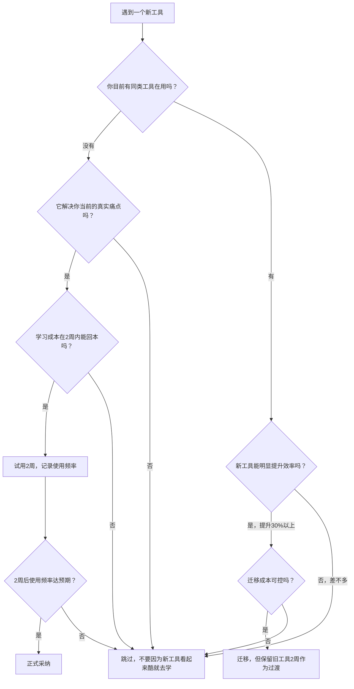
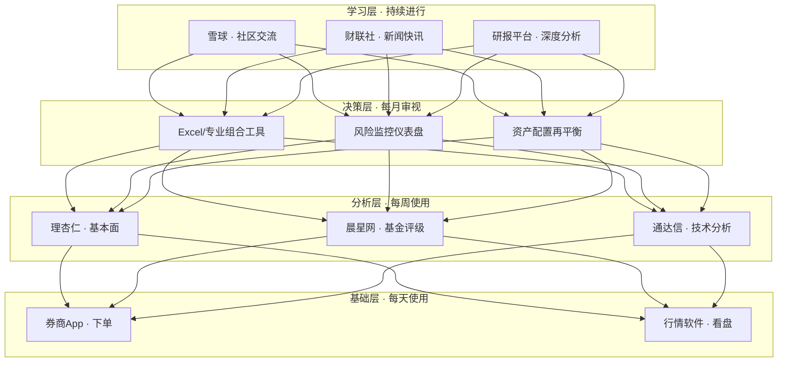

# 第14章 投资工具与平台

> "工欲善其事，必先利其器。"——《论语·卫灵公》

## 一、本章在全书中的位置

在前13章中，你已经建立了从财富认知到投资理财基础、从股票房产到加密货币、从个人财务管理到创业副业的完整知识体系。第5章讲了投资理财的基本原理（风险与收益、资产配置、复利效应），第6-12章分别深入了股票、房产、基金、加密货币等具体投资品种的"道"与"法"。但有一个关键问题一直被搁置——**用什么工具来落地这些知识？**

这就是本章的定位：**投资工具与平台是连接"知道"和"做到"之间的桥梁。** 第13章帮你搭建了个人财务管理的基础设施（记账、预算、信用管理），本章则在此基础上更进一步——当你的钱准备好投资之后，用什么软件看行情？在哪个平台买基金？如何用工具分析房产价值？量化交易需要哪些技术栈？

如果把投资比作打仗，前面几章教的是战略和战术，本章教的是武器装备的使用。一个精通兵法但不会用枪的士兵，在战场上毫无胜算。

### 1.1 与前置章节的衔接关系

本章不是孤立的，它与前面每一章都有明确的知识衔接：

| 前置章节 | 提供的知识基础 | 本章如何承接 |
|----------|---------------|-------------|
| 第5章 投资理财基础 | 风险收益关系、资产配置理论、复利计算 | 工具帮你量化风险指标、自动计算配置比例、可视化复利增长曲线 |
| 第6章 股票投资 | K线、基本面分析、技术分析的"道" | §2理论+§1技巧教你用软件看K线、用理杏仁查财务数据 |
| 第7章 房产投资 | 租售比、房贷原理、区域分析方法 | §4理论+§3技巧教你用贝壳找房做数据分析、用房贷计算器对比方案 |
| 第8章 基金投资 | 基金类型、评价指标、定投策略 | §3理论+§2技巧教你选平台、筛基金、设定投 |
| 第9章 加密货币 | 区块链原理、交易逻辑、风险特征 | §5理论+§4技巧教你用交易所、管钱包、查链上数据 |
| 第10-12章 其他投资 | ETF、REITs、可转债等品种特性 | §7-§10技巧覆盖这些品种的专用工具 |
| 第13章 个人财务 | 记账、预算、信用管理 | 本章在此基础上扩展到投资执行层 |

**关键认知**：如果你跳过了前面的章节直接学习工具，就像一个人拿着一把枪但不知道该瞄准哪里。工具是"术"和"器"，前面的章节是"道"和"法"。道法术器缺一不可，但顺序不能颠倒。

## 二、为什么投资工具是"搞钱"的基础设施

### 2.1 从手工到智能：投资工具的四次革命

投资的本质是决策：买什么、什么时候买、买多少、什么时候卖。每一个决策都需要**信息输入→分析处理→执行落地**三个环节。投资工具的演化史，就是这三个环节不断被技术革新的历史。

| 时代 | 信息获取 | 分析处理 | 交易执行 | 典型特征 |
|------|----------|----------|----------|----------|
| **纸质时代**（1990年以前） | 翻阅纸质年报、证券报刊、交易所公告栏 | 手绘K线图、笔算财务指标 | 电话委托、柜台填单 | 信息延迟数天，分析依赖个人经验，执行需要数小时 |
| **PC时代**（1990-2010） | 行情软件实时推送、财务数据库查询 | 技术指标自动计算、财务数据可视化 | 网上交易、条件单 | 信息延迟缩短到分钟级，分析效率提升百倍 |
| **移动互联网时代**（2010-2020） | 手机实时行情、社交媒体舆情监控 | 智能选股、量化回测 | 手机一键下单、程序化交易 | 信息触手可及，执行秒级完成 |
| **AI时代**（2020至今） | AI研报摘要、自然语言数据查询、多模态信息融合 | 大模型辅助分析、AI投顾、智能风控 | 算法交易、智能条件单、跨平台自动执行 | 分析从"人看指标"转向"AI给建议"，决策效率再次跃升 |

以一个具体的数字来感受这个变化：1995年，一个散户要完成一次完整的股票投资决策（从获取信息到下单），平均需要3-5天。2025年，同样的决策流程在手机上10分钟就能完成。这不是效率提升了几倍——而是几个数量级。

### 2.2 AI时代的投资工具新范式

2023年以来，大语言模型（LLM）的普及正在深刻改变投资工具的形态。这不是噱头，而是实实在在的工具进化。以下是AI在投资工具中的四种实际应用：

**信息获取层的AI革命**

传统方式：打开东方财富→搜索"贵州茅台"→点击"公告"→逐条阅读→手动提取关键数据。AI方式：直接问"茅台最近一个季度的营收增速和毛利率变化趋势是什么？"——AI从结构化数据库中直接给出答案。

这不仅仅是"省时间"的问题。传统方式下，一个普通投资者每天能跟踪5-10只股票的基本面变化。借助AI信息工具，同样的时间内可以跟踪50只以上。信息覆盖范围的扩大，直接影响投资决策的质量。

**分析决策层的AI辅助**

AI不能替你做投资决策，但它能做两件人类不擅长的事：
- **大规模并行比较**：同时对比50只候选股票的20个财务指标，筛出符合条件的标的。人类做这件事需要数小时，AI只需几秒。
- **模式识别**：在历史数据中识别类似当前市场环境的时期，统计这些时期各类资产的表现。这种"在100年数据中找相似场景"的能力，是人类大脑做不到的。

**AI工具的使用边界（重要）**

AI在投资领域有两个明确的限制：
1. **不能预测未来**：AI基于历史数据训练，它的"预测"本质是"历史上类似情况下发生了什么"。黑天鹅事件（如2020年疫情、2022年俄乌冲突）不在历史模式中，AI无法预见。
2. **不能替代投资逻辑**：如果你不理解为什么买一只股票，AI给你的"买入建议"只是一个概率数字，你无法判断这个概率是否适合你的风险承受能力和投资目标。

**结论**：AI工具是信息处理和分析效率的倍增器，但投资的"道"（投资哲学、风险管理、心理纪律）仍然需要人来掌握。本章后续会标注哪些工具已经融入了AI功能，以及如何正确使用这些功能。

### 2.3 投资工具解决的四个核心问题

无论你投资什么品种，投资工具的核心价值都可以归结为四个维度：

**信息获取：消除信息不对称**

投资市场的本质是信息博弈。在没有互联网的时代，机构投资者比散户多出的信息优势是碾压级的——他们能提前拿到研报、能实时监控全球市场、能用彭博终端获取专业数据。而散户只能翻报纸、听消息、看邻居买了什么。

现代工具彻底改变了这一格局。免费的行情软件（同花顺、东方财富）已经能提供过去需要花数万元购买的专业数据。任何人都可以实时查看全球主要市场的行情、财务数据、资金流向。信息不对称被大幅压缩——当然，不是完全消除。

一个具体的例子：2024年某上市公司发布重大利好公告，机构投资者通过专业信息终端在公告发布后3秒内就看到了内容并做出反应。使用同花顺Level-2行情的散户在30秒内看到推送。使用免费行情的散户可能在5-10分钟后才从新闻中得知。这3秒到10分钟的差距，在短线交易中意味着完全不同的买入价格。

**分析决策：从感性到量化**

人类大脑天生不擅长处理概率和统计。一个典型的散户决策过程是："这只股票最近涨了很多，应该还会涨"——这是典型的趋势外推谬误，行为金融学中称为"近因效应"和"代表性启发"。

分析工具的价值在于，它能帮你把感性判断转化为量化指标：市盈率处于历史什么分位？MACD是否出现金叉？与同行业公司相比估值是否合理？这些工具不替你做决策，但能帮你在决策时看到更多维度的信息，减少认知偏差。

**交易执行：从手动到自动化**

"明明设好了止损线，但跌到那个位置时犹豫了没卖"——这是无数投资者的痛苦回忆。人类在面对损失时会产生"损失厌恶"心理（Kahneman和Tversky的前景理论），导致在应该止损时死扛、在应该止盈时贪婪。

条件单和程序化交易的价值在于，它把你的投资纪律"固化"成了机器指令。设好止损价10元，股价跌破10元系统自动卖出，没有犹豫的余地。这不是"冷血"，而是用机制对抗人性弱点。

**风险管理：实时监控与预警**

一个持有20只股票的投资者，如果只靠人脑监控，每天至少需要花2小时盯盘。而且人脑有注意力极限——当所有股票同时下跌时，你根本来不及逐一评估。组合分析工具可以实时计算你的整体持仓风险（波动率、最大回撤、行业集中度、个股相关性），在风险超过阈值时自动预警。

### 2.4 工具是"放大器"，不是"印钞机"

这里必须强调一个关键认知：**工具放大的是你的能力，也放大的是你的错误。**

一个投资逻辑正确的投资者，用工具能执行得更快、更准、更省力。但一个投资逻辑错误的投资者，用工具能亏得更快、更多、更彻底。量化交易领域有句名言："如果你没有正期望值的策略，程序化交易只是让你自动化地亏钱。"

一个简单的验证方法：**如果你不理解某个工具背后的原理，那这个工具对你来说就不是"工具"，而是"赌博机器"。** 本章理论基础篇的核心目的，就是让你理解每一个工具背后的"为什么"。

## 三、本章的核心问题

本章围绕五个核心问题展开，每个问题对应一个投资领域：

| 核心问题 | 对应领域 | 关键工具类型 | 本章位置 |
|----------|----------|-------------|----------|
| 如何选择行情软件和分析工具？ | 股票投资 | 行情软件、技术分析工具、基本面分析工具、条件单系统 | 理论 §2、核心技巧 §1 |
| 如何选择基金销售平台和筛选工具？ | 基金投资 | 销售平台、基金评级工具、定投工具、ETF工具 | 理论 §3、核心技巧 §2、§8 |
| 如何利用工具进行房产投资决策？ | 房产投资 | 信息平台、房贷计算器、租金回报分析工具 | 理论 §4、核心技巧 §3 |
| 如何使用加密货币工具进行投资？ | 加密货币 | 行情平台、交易所、钱包、链上分析工具 | 理论 §5、核心技巧 §4 |
| 如何利用综合工具进行理财规划？ | 综合理财 | 量化平台、组合管理工具、保险/银行理财工具、海外投资工具 | 理论 §6、§11-§13、核心技巧 §5、§11 |

这五个问题不是孤立的，它们共享一个底层逻辑：**信息→分析→执行→复盘**。无论你投资什么品种，工具的使用范式都是相通的。掌握这个范式后，面对新工具时你就能快速上手。

## 四、工具评估方法论：选工具的三把尺子

在进入具体工具之前，你需要一个评估框架。市面上的投资工具数以百计，如果没有方法论，你就会陷入"功能焦虑"——总觉得有更好的工具，不断切换，从未精通。

### 4.1 维度一：适合度（是否匹配你的投资阶段和品种）

| 投资阶段 | 核心需求 | 工具选择策略 |
|----------|----------|-------------|
| **新手期**（0-1年） | 学习基础、低试错成本 | 选界面友好、学习资源丰富的工具（同花顺、天天基金） |
| **成长期**（1-3年） | 效率提升、多品种覆盖 | 选功能全面、可自定义的工具（通达信、理杏仁） |
| **成熟期**（3年以上） | 专业分析、策略执行 | 选专业级工具（Wind、量化平台、组合管理系统） |

一个常见错误是新手期就上Wind终端——就像一个刚拿到驾照的人去开F1赛车，车再好你也驾驭不了。Wind的信息密度和操作复杂度对新手来说是信息过载，反而降低效率。

### 4.2 维度二：效率（是否真正节省你的时间）

判断工具是否提高效率的唯一标准是：**它帮你节省的时间是否大于你学习它的时间。** 一个需要花20小时学习但每天只节省5分钟的工具，你需要连续使用240天才能"回本"——如果这个工具只在特定场景下使用，那它的效率就是负的。

实操建议：给每个新工具设定一个"试用期"（通常2周）。在这2周内，记录你使用工具的频率和节省的时间。如果2周后发现使用频率低于预期，果断放弃，不要有沉没成本心理。

### 4.3 维度三：成本（总拥有成本，不仅仅是价格）

投资工具的成本远不止"购买价格"。完整的成本模型包括：

| 成本类型 | 说明 | 典型案例 |
|----------|------|----------|
| **显性成本** | 购买费用、订阅费、交易佣金 | Wind终端年费数万元、Level-2行情月费30元 |
| **隐性成本** | 学习时间、数据迁移成本、习惯切换成本 | 从同花顺切换到通达信需要重新学习操作逻辑 |
| **机会成本** | 使用A工具意味着放弃B工具的某些功能 | 券商App自带行情免费但分析功能弱，专业软件付费但分析强 |
| **风险成本** | 工具故障、数据延迟导致的交易损失 | 条件单因券商系统故障未触发导致止损失败 |

**费率的长期影响（关键数据）**：假设你投资100万元，年化收益8%，投资30年。如果每年费率从0.5%优化到0.2%（差0.3%），30年后资产差距约为：

```text
费率0.5%：100万 × (1+7.5%)^30 = 875万
费率0.2%：100万 × (1+7.8%)^30 = 952万
差距：77万（占终值的8%）
```

看似微小的费率差异，在复利作用下会放大到惊人的规模。理论基础 §8 会详细讲解各品种的费率优化方法。

### 4.4 工具选择决策流程图

当你面对一个新工具时，用下面这个流程图做决策：



**决策的核心原则**：永远是"解决真实痛点"驱动，而不是"这个工具很强大"驱动。强大的工具如果不能解决你当前的问题，就是噪音。

## 五、全章知识地图

本章共 48 个文件，分为四个大的知识板块。下面是完整的内容结构图，帮助你建立全局视野：

```mermaid
graph TD
    A[第14章 投资工具与平台] --> B[理论基础 13篇]
    A --> C[核心技巧 14篇]
    A --> D[实战案例 12篇]
    A --> E[章末总结与拓展 4篇]

    B --> B1[投资工具的本质]
    B --> B2[股票投资工具理论]
    B --> B3[基金投资工具理论]
    B --> B4[房产投资工具理论]
    B --> B5[加密货币工具理论]
    B --> B6[量化交易理论]
    B --> B7[费率深度分析]
    B --> B8[风险提示与FAQ]
    B --> B9[保险/银行/海外工具]

    C --> C1[股票工具使用技巧]
    C --> C2[基金工具使用技巧]
    C --> C3[房产工具使用技巧]
    C --> C4[加密货币工具技巧]
    C --> C5[量化交易入门技巧]
    C --> C6[信息获取技巧]
    C --> C7[ETF/REITs/可转债工具]
    C --> C8[组合管理工具]
    C --> C9[常见误区与学习路径]

    D --> D1[股票投资者工具箱]
    D --> D2[基金定投实践]
    D --> D3[房产投资分析]
    D --> D4[量化交易入门]
    D --> D5[加密货币/ETF/可转债案例]
    D --> D6[海外投资实践]
    D --> D7[工具选择清单]

    E --> E1[常见误区]
    E --> E2[练习方法]
    E --> E3[本章小结]
    E --> E4[深度拓展]
```



### 理论基础篇（13 篇）

理论基础篇解决的是"为什么"和"是什么"的问题。不急于教你操作，而是先帮你建立投资工具的认知框架。理解原理的价值在于：当工具更新迭代、界面改版、功能变化时，你不会手足无措——因为你理解的是底层逻辑，而不是操作步骤。

| 文件 | 核心内容 | 阅读价值 |
|------|----------|----------|
| §1 投资工具的本质 | 工具的价值（信息/分析/执行/风险管理）、按功能和品种的分类体系、选择三原则（适合/效率/成本） | 建立全局认知框架，后续所有工具选择的理论基础 |
| §2 股票投资工具理论 | 行情软件的功能框架（核心功能+进阶功能）、技术分析/基本面分析/量化分析三大流派的工具原理、券商选择标准和条件单原理 | 理解股票工具的底层逻辑，避免盲目使用 |
| §3 基金投资工具理论 | 直销/代销/第三方平台的商业模式差异、基金评级体系（晨星/理柏/济安金信）、筛选四维度（业绩/风险/经理/费率）、定投策略理论 | 选平台和选基金的决策框架 |
| §4 房产投资工具理论 | 房产信息平台的价值（信息获取+数据分析）、房贷计算原理（等额本息 vs 等额本金）、租金回报率计算与判断标准 | 房产投资决策的量化基础 |
| §5 加密货币工具理论 | 行情工具（CoinMarketCap/CoinGecko/非小号）、CEX vs DEX的优劣对比、热/冷/硬件钱包安全模型、链上分析工具（Etherscan/Dune/Nansen/Glassnode） | 加密货币工具全景图 |
| §6 量化交易理论 | 量化交易的定义与优势、策略分类（趋势跟踪/均值回归/套利/因子）、交易频率分级、入门路径和国内平台 | 量化投资的认知入门 |
| §7 本节总结 | 理论基础核心要点梳理 | 快速回顾，查漏补缺 |
| §8 费率深度分析 | 交易佣金、管理费、申购赎回费等费率的详细拆解和优化方法 | 省钱就是赚钱，费率对长期收益的影响巨大 |
| §9 投资工具风险提示 | 工具层面的风险（系统故障、数据延迟、安全漏洞）和使用层面的风险 | 避坑指南 |
| §10 常见问题解答 | 理论学习阶段的典型疑问 | 按需查阅 |
| §11 保险理财工具 | 保险产品的投资属性分析和工具使用 | 拓展保险投资认知 |
| §12 银行理财工具 | 银行理财产品的分类、收益计算和选择工具 | 拓展银行理财认知 |
| §13 海外投资工具 | 港股/美股的投资渠道和工具、汇率风险 | 拓展全球投资视野 |

**理论基础篇的学习建议**：§1-§6 是核心内容，建议按顺序通读。§7-§10 是辅助内容，可按需查阅。§11-§13 是拓展内容，根据你的投资方向选读。

### 核心技巧篇（14 篇）

核心技巧篇解决的是"怎么做"的问题。从理论到实操，手把手教你使用各类投资工具。每个小节都包含具体的操作步骤和截图级说明，目标是"看完就能上手"。

| 文件 | 核心内容 | 技能等级 |
|------|----------|----------|
| §1 股票投资工具使用技巧 | 行情软件选择矩阵、K线图使用、技术指标组合（MA/MACD/RSI/布林带）、基本面分析（理杏仁）、条件单实战 | ⭐⭐ 入门-进阶 |
| §2 基金投资工具使用技巧 | 平台对比（天天基金/蚂蚁财富/蛋卷/且慢）、基金筛选五维度、晨星网使用、智能定投设置（均线偏离法/估值法）、止盈策略 | ⭐⭐ 入门-进阶 |
| §3 房产投资工具使用技巧 | 贝壳找房深度使用、数据分析方法、房贷计算实操 | ⭐⭐ 入门-进阶 |
| §4 加密货币工具使用技巧 | 交易所使用流程、钱包安全管理、链上数据查询实操 | ⭐⭐⭐ 进阶 |
| §5 量化交易入门技巧 | Python环境搭建、数据获取、策略编写、回测实操、模拟交易 | ⭐⭐⭐⭐ 高级 |
| §6 信息获取技巧 | 新闻/公告/研报的信息源选择、信息筛选方法、避免信息过载 | ⭐ 入门 |
| §7 本节总结 | 核心技巧要点梳理 | - |
| §8 ETF投资工具详解 | ETF的选择方法、交易技巧、套利机制 | ⭐⭐ 入门-进阶 |
| §9 REITs投资工具 | 公募REITs的特点、收益分析、选择方法 | ⭐⭐⭐ 进阶 |
| §10 可转债投资工具 | 可转债的定价原理、筛选方法、交易策略 | ⭐⭐⭐ 进阶 |
| §11 投资组合管理工具 | 组合构建方法、再平衡策略、风险监控工具 | ⭐⭐⭐ 进阶 |
| §12 投资工具使用常见误区 | 6大误区的识别和纠正 | ⭐ 入门（必读） |
| §13 投资工具学习路径 | 从新手到高手的分阶段学习计划 | ⭐ 入门（必读） |
| §14 常见问题解答 | 核心技巧阶段的典型疑问 | 按需查阅 |

**核心技巧篇的学习建议**：

- **投资新手**：先读 §12（误区）和 §13（学习路径），建立正确预期，然后从 §1、§2、§6 开始实操。
- **有一定基础的投资者**：按你投资的品种直接跳转到对应小节。股票投资者读 §1，基金投资者读 §2+§8，房产投资者读 §3。
- **想进阶的投资者**：§5（量化交易）、§9（REITs）、§10（可转债）、§11（组合管理）是进阶内容，建议在基础扎实后再学习。

### 实战案例篇（12 篇）

实战案例篇解决的是"怎么用"的问题。通过真实场景演示，把理论和技巧串联成完整的操作流程。案例是本章最有价值的部分之一——因为工具知识最大的特点是"看了不等于会了"。不要只"看"案例，要"做"案例。

| 文件 | 案例场景 | 覆盖技能 |
|------|----------|----------|
| 案例一：股票投资者的工具箱 | 从零搭建股票投资工具体系 | 行情软件+分析工具+交易工具的组合使用 |
| 案例二：基金定投工具实践 | 完整的基金定投操作流程 | 平台选择+基金筛选+定投设置+止盈操作 |
| 案例三：房产投资分析 | 一套房产的投资价值分析全流程 | 信息收集+价格分析+租金回报计算+贷款方案对比 |
| 案例四：量化交易入门 | 一个简单量化策略的完整实现 | Python环境+数据获取+策略编写+回测+模拟 |
| 案例五：加密货币工具使用 | 加密货币投资的工具使用流程 | 交易所注册+入金+交易+钱包管理+链上查询 |
| 案例六：ETF定投实践 | ETF定投的完整操作流程 | ETF选择+定投设置+组合构建 |
| 案例七：可转债投资入门 | 可转债投资的入门操作 | 筛选+分析+交易的完整流程 |
| 案例八：海外投资工具实践 | 港股/美股投资的工具使用 | 开户+入金+交易+税务处理 |
| 案例总结 | 各案例的关键要点回顾 | 跨案例对比和总结 |
| 投资工具选择总结 | 不同场景下的工具选择决策框架 | 综合决策能力 |
| 投资工具使用常见错误 | 案例中的典型错误和纠正 | 避坑能力 |
| 投资工具选择实操清单 | 可直接使用的选择检查清单 | 落地执行 |

### 章末总结与拓展（4 篇）

| 文件 | 核心内容 | 适合人群 |
|------|----------|----------|
| 04-常见误区 | 6大误区的深度分析：过度依赖工具、忽视学习成本、选择不适合的工具、忽视工具局限性、盲目追求付费工具、忽视数据安全 | 所有人（建议通读） |
| 05-练习方法 | 7套渐进式练习：行情软件实操、基金筛选、房产分析、量化入门、组合管理、信息获取、工具体系构建 | 想动手实操的人 |
| 06-本章小结 | 全章核心要点回顾、各领域工具速查表、关键决策框架 | 复习回顾 |
| 07-深度拓展 | 投资平台的技术架构、交易系统的核心组件、数据传输机制、安全体系 | 对技术细节感兴趣的进阶读者 |

## 六、各投资品种工具速查表

下面这张表汇总了本章涉及的所有投资品种及其核心工具，方便你在需要时快速定位。每个品种的工具分为四层：行情/信息工具（看数据）、分析工具（做判断）、交易工具（执行操作）和学习资源（提升能力）。

| 投资品种 | 行情/信息工具 | 分析工具 | 交易工具 | 免费/付费情况 | 本章详细位置 |
|----------|--------------|----------|----------|--------------|-------------|
| A股股票 | 同花顺、东方财富、雪球 | 理杏仁、通达信 | 券商App（华泰/中信/招商等） | 行情免费，Level-2约30元/月，理杏仁基础版免费 | 理论 §2、技巧 §1、案例 §1 |
| 场内基金/ETF | 同花顺、天天基金 | 晨星网、理杏仁 | 券商App（场内）、基金平台（场外） | 大部分免费 | 理论 §3、技巧 §2/§8、案例 §2/§6 |
| REITs | 同花顺、交易所官网 | 基金公司公告、招募说明书 | 券商App | 免费 | 技巧 §9 |
| 可转债 | 同花顺、集思录 | 集思录、宁稳网 | 券商App | 集思录基础免费，高级版约200元/年 | 技巧 §10、案例 §7 |
| 房产 | 贝壳找房、链家、安居客 | 房贷计算器、租金回报计算 | 中介平台 | 免费 | 理论 §4、技巧 §3、案例 §3 |
| 加密货币 | CoinMarketCap、CoinGecko、非小号 | Dune、Nansen、Glassnode、Etherscan | Binance、OKX、Coinbase（CEX）；Uniswap（DEX） | 行情免费，Nansen/Glassnode付费（$49-799/月） | 理论 §5、技巧 §4、案例 §5 |
| 保险理财 | 保险比价平台、各保险公司官网 | 产品对比工具 | 保险公司/经纪平台 | 免费 | 理论 §11 |
| 银行理财 | 各银行App、中国理财网 | 收益计算器 | 银行App | 免费 | 理论 §12 |
| 港股/美股 | 富途牛牛、老虎证券、雪盈证券 | 理杏仁（港美股）、Seeking Alpha | 富途/老虎/雪盈券商App | 行情免费，部分高级数据付费 | 理论 §13、案例 §8 |
| 量化交易 | 聚宽、米筐、优矿 | Python（pandas/numpy/backtrader） | 聚宽/米筐模拟盘、券商API | 聚宽/米筐基础免费，实盘API需券商支持 | 理论 §6、技巧 §5、案例 §4 |

## 七、阅读路线图

不同背景的读者，本章有不同的最佳阅读路径。下面提供四条推荐路线，覆盖最常见的读者类型：

### 路线A：投资新手（完全没用过投资工具）


**预计时间**：3-5 天，每天 1-2 小时

**路线说明**：先建立认知框架（§1），了解常见坑（§12），明确学习路径（§13），然后从最常用的股票和基金工具入手，通过案例和练习巩固。重点是"先用起来"，不要追求一步到位。

**关键里程碑**：完成本路线后，你应该能独立完成一次基金定投操作，并能看懂一只股票的基本面数据。

### 路线B：有一定基础的投资者（用过但想系统化）


**预计时间**：2-3 天，每天 1-2 小时

**路线说明**：你已经会用基本工具，需要的是系统化和进阶。先梳理理论框架（可能有盲区），然后重点学习 ETF、REITs、可转债等进阶工具，最后整合到组合管理中。

**关键里程碑**：完成本路线后，你应该能构建一个包含3个以上品种的投资组合，并用工具进行系统化管理。

### 路线C：技术背景投资者（想学量化交易）


**预计时间**：5-7 天，每天 2-3 小时

**路线说明**：量化交易是本章技术含量最高的部分。先理解量化理论，再通过 Python 实操入门，结合股票工具知识和费率分析优化策略，最后整合到组合管理框架中。

**关键里程碑**：完成本路线后，你应该能用 Python 编写一个简单的均线交叉策略，并在回测平台上完成从数据获取到策略评估的全流程。

### 路线D：全局浏览型（想了解全貌再深入）


**预计时间**：1 天，2-3 小时

**路线说明**：适合时间有限、想先建立全局视野的读者。快速浏览概览和速查表，了解本章覆盖的工具全貌，然后根据自己的投资方向深入对应章节。

## 八、工具体系的分层构建方法

投资工具不是一个个孤立的软件，而是一个分层的体系。初学者最容易犯的错误是试图一次性搭建完整的四层体系——结果每个工具都停留在浅尝辄止的水平。



| 层级 | 功能定位 | 典型工具 | 使用频率 | 建议投入时间 |
|------|----------|----------|----------|-------------|
| **基础层** | 日常看盘、下单执行 | 券商App、同花顺 | 每天使用 | 1-2天掌握核心功能 |
| **分析层** | 深度研究、估值分析 | 理杏仁、晨星网、通达信 | 每周使用 | 1-2周逐步学习 |
| **决策层** | 组合管理、风险监控 | Excel、专业组合工具 | 每月审视 | 1个月建立体系 |
| **学习层** | 信息获取、社区交流 | 雪球、财联社、研报平台 | 持续进行 | 长期积累 |

**构建原则**：先精通基础层（至少1个月），再逐步加入分析层。决策层和学习层在你持有3个以上品种时再搭建也不迟。**每一层的工具，宁可少而精，不要多而杂。**

## 九、数据安全与工具风险管理

投资工具涉及你的真金白银和隐私信息。这一节从安全角度出发，帮你建立工具使用的风险意识——这是很多投资者最容易忽视、却代价最高的领域。

### 9.1 账户安全：你的第一道防线

| 安全措施 | 操作方法 | 不做的后果 |
|----------|----------|-----------|
| **强密码** | 每个平台使用不同的16位以上密码（含大小写+数字+特殊字符），用密码管理器（1Password/Bitwarden）管理 | 一个平台泄露，所有平台沦陷（撞库攻击） |
| **二次验证（2FA）** | 所有投资平台开启TOTP验证（Google Authenticator/Authy），不要用短信验证 | 短信可被SIM卡劫持，2023年多起加密货币盗窃通过SIM swap实现 |
| **设备隔离** | 投资操作只在专用设备上进行，不安装来路不明的软件 | 恶意软件可以截屏、记录键盘、篡改交易地址 |
| **网络隔离** | 不在公共WiFi下进行交易操作，必要时使用VPN | 公共网络可被中间人攻击，交易数据可被截获 |

### 9.2 加密货币安全：额外的注意事项

加密货币的安全要求比传统投资高一个数量级，因为没有"银行帮你找回密码"的选项：

- **私钥管理**：私钥是你资产的唯一凭证。丢失私钥=永久丢失资产。建议使用硬件钱包（Ledger/Trezor）存储大额资产，助记词用金属板刻录（不要存在电脑或手机里）。
- **交易所风险**：不要把所有资产放在交易所。2022年FTX暴雷导致用户损失超过80亿美元。"Not your keys, not your coins"是加密圈的铁律。
- **钓鱼防范**：永远通过书签或手动输入URL访问交易所，不要点击邮件/社交媒体中的链接。钓鱼网站可以做到和真网站一模一样。
- **小额测试**：任何大额转账前，先发一笔小额测试交易确认地址正确。加密货币转账不可逆，发错地址意味着永久丢失。

### 9.3 平台选择的安全标准

选择投资平台时，用以下标准做安全评估：

| 评估维度 | 安全标准 | 危险信号 |
|----------|----------|----------|
| **监管资质** | 持有金融监管机构颁发的牌照 | 无牌照、注册在离岸小岛 |
| **资金托管** | 用户资金由第三方银行托管 | 资金直接进入平台公司账户 |
| **数据加密** | 全站HTTPS、敏感数据加密存储 | HTTP明文传输、无加密标识 |
| **历史记录** | 运营5年以上、无重大安全事故 | 频繁更名、有安全事件未妥善处理 |
| **透明度** | 公开公司信息、审计报告 | 匿名团队、无公开信息 |

### 9.4 工具故障应急预案

任何工具都可能出故障。关键不是"永远不出问题"，而是"出问题时你有预案"：

1. **备选工具清单**：为每一类关键功能准备至少一个备选工具。主用同花顺？备用东方财富。主用A券商？确保B券商也已开户。
2. **离线备份**：关键数据（持仓记录、交易策略、分析模板）定期导出备份到本地。不要完全依赖云端。
3. **电话委托**：记住券商的电话委托号码和操作流程。当App无法登录时，电话委托是最后的交易通道。
4. **紧急联系人**：记录券商客服热线、平台技术支持的联系方式。问题发生时能第一时间找到人。

## 十、学习目标

完成本章全部内容的学习和练习后，你将能够：

1. **认知层面**：理解投资工具的本质（信息获取→分析决策→交易执行→风险管理），建立工具选择的三维评估框架（适合/效率/成本）。
2. **技能层面**：熟练使用至少一款行情软件、一款分析工具和一款交易平台，并能根据投资品种组合搭配不同工具。
3. **决策层面**：能够独立评估一个投资工具的优劣，选择适合自己的工具组合，而不是盲目跟风。
4. **进阶层面**：理解量化交易的基本原理，能够用 Python 编写和回测简单的交易策略。
5. **体系层面**：构建起分层的投资工具体系（基础层/分析层/决策层/学习层），并根据自己的投资阶段持续优化。
6. **安全层面**：建立完整的工具安全意识，包括账户安全、数据备份、应急方案，能够在工具故障时快速切换到备用方案。

## 十一、适合人群

本章面向所有层级的投资者，但不同背景的读者关注重点不同：

- **投资零基础**：从理论基础 §1 开始，建立对投资工具的整体认知，然后进入核心技巧篇学习具体工具的使用方法。重点关注 §12（常见误区）和 §13（学习路径），避免走弯路。
- **有投资经验但工具使用零散**：跳过基础认知部分，重点学习核心技巧篇的系统化方法，特别是组合管理工具（§11）和学习路径（§13），把零散的工具使用整合成体系。
- **想学习量化交易**：重点关注理论基础 §6（量化理论）和核心技巧 §5（量化入门技巧），配合实战案例 §4（量化交易入门）完成从理论到实操的完整闭环。
- **想拓展投资品种**：根据你感兴趣的新品种，选读对应的理论和技巧小节。比如想投资可转债就看技巧 §10+案例 §7，想投资海外就看理论 §13+案例 §8。

## 十二、本章的三个核心认知

在进入具体内容之前，先建立三个贯穿全章的核心认知：

### 认知一：工具放大的是你的能力，也放大的是你的错误

如果一个投资策略的期望值为负，工具只是帮你自动化地亏钱。工具的价值前提是你拥有正期望值的投资逻辑。在学习工具之前，先确保你的投资"道"和"法"是正确的——这是前面章节的任务，也是本章的前提。

一个真实的反面案例：某投资者在2021年用量化平台编写了一个追涨策略，回测数据漂亮（年化30%+），于是投入50万实盘。2022年市场转熊，策略连续亏损，因为回测用的是2019-2021年牛市数据，策略从未经历过真正的熊市。3个月亏损12万后被迫停用。工具没问题，量化平台没问题，问题出在策略本身——它只在牛市有效。这就是"工具放大错误"的典型案例。

### 认知二：最好的工具是你能熟练使用的

投资工具市场存在严重的"功能焦虑"——总有更强大的工具、更丰富的指标、更高级的算法在诱惑你。很多人花大量时间比较工具、切换工具、学习新工具，却从来没有真正把任何一个工具用好。

**一个真实的对比案例**：

| 投资者 | 工具使用方式 | 结果 |
|--------|-------------|------|
| 投资者A | 同时使用同花顺、东方财富、通达信、理杏仁、雪球五个平台，每个只用了20%的功能 | 信息分散在5个平台，分析需要来回切换，决策效率低 |
| 投资者B | 只用同花顺一个平台，把80%的功能吃透 | 信息集中，分析高效，决策清晰 |

**工具选择的黄金法则**：先深入精通一个工具，再考虑扩展。熟练度永远比功能数量更重要。一个人用一把磨得锋利的刀，比十把钝刀更有战斗力。

### 认知三：工具体系需要分层构建

不要试图一步到位。初学者从基础层开始，逐步向上构建。每一层至少稳定使用1个月后，再考虑加入下一层。贪多嚼不烂，是工具学习中最常见的陷阱。

## 十三、重要提醒

开始学习之前，请牢记以下几点：

1. **工具是辅助，决策靠自己。** 不要期望任何工具能替你做出正确的投资决策。工具的价值在于提高效率和减少信息不对称，最终的判断权必须掌握在你手里。
2. **从简单开始，逐步深入。** 不要一开始就追求功能最全、最复杂的工具。先用好一个基础工具，再根据需要扩展。
3. **实践是最好的老师。** 看十遍教程不如自己动手操作一遍。本章的练习方法篇提供了详细的实操练习，建议认真完成。
4. **警惕数据安全。** 投资工具涉及你的资金和隐私信息。选择正规平台，设置强密码，开启二次验证，不要在公共网络下进行交易操作。加密货币领域尤其要注意私钥管理——丢失私钥等于丢失资产，没有任何"找回密码"的选项。（详见第九节"数据安全与工具风险管理"）
5. **费率影响巨大。** 别小看每年 1-2% 的费率差异，在复利的作用下，30 年后的资产差距可能超过 30%。理论基础 §8 会详细讲解费率的优化方法。
6. **免费工具已经足够好。** 对于绝大多数投资者来说，免费工具的功能完全够用。不要因为"付费=更好"的心理去花钱。付费工具的真正价值在于特定场景下的效率提升——如果你还不确定自己的投资方向，免费工具就是最好的起点。
7. **工具会更新，原理不会变。** 同花顺可能改版，某个交易所可能关闭，但"信息→分析→执行→复盘"的范式永远不会过时。本章教你的不是具体操作步骤（那些会变），而是底层原理（那些不变）。当你理解原理后，面对任何新工具都能快速上手。

## 十四、工具生态更新提醒

投资工具的更新速度远超传统金融教材的出版周期。以下信息在你阅读时可能已经发生变化：

| 信息类型 | 变化频率 | 建议应对方式 |
|----------|----------|-------------|
| 平台费率 | 每年调整1-2次 | 使用前到官网确认最新费率 |
| App界面/功能 | 每季度更新 | 以底层逻辑（本章教的原理）为准，界面变化不影响理解 |
| 监管政策 | 不定期变化 | 关注证监会、银保监会公告 |
| 加密货币交易所 | 高度不确定 | 关注CoinDesk/The Block等行业媒体 |
| AI功能 | 每月迭代 | 本章标注的AI功能仅作参考，以工具最新版本为准 |
| 量化平台 | 每半年变化 | 代码示例可能需要适配最新API版本 |

**应对策略**：不要等到所有信息都"最新"才开始学习。工具的底层逻辑不会过时，具体的操作细节可以边用边更新。本章的价值在于帮你建立框架和思维方式，而不是充当一本"操作手册"。

## 十五、阅读建议

1. **先通读本概览**，建立全章的全局视野。知道这一章讲什么、怎么讲、讲到什么深度。花30分钟通读概览，比直接跳入某个小节能节省数小时的来回翻阅。
2. **按路线图选择自己的路径**，不要试图一次读完所有内容。选择最匹配你当前阶段的路线，集中精力学透。
3. **边学边做**，每学完一个工具就打开电脑实际操作一遍。工具类知识的最大特点是"看了不等于会了"。建议准备一个"工具实验笔记本"，记录每个工具的操作步骤和心得。
4. **建立自己的工具笔记**，记录每个工具的核心功能、使用心得、注意事项。这份笔记会成为你长期的投资参考。一个好的工具笔记模板包括：工具名称、核心功能（3-5个）、使用场景、优缺点、费用、替代方案。
5. **定期回顾和更新**，投资工具更新迭代很快。建议每半年回顾一次自己的工具体系，看看是否有更好的替代方案。但"回顾"不等于"换工具"——只有当新工具能明显提升效率时才值得切换。
6. **与实际投资结合**，不要为了学工具而学工具。每学一个工具，想想"这对我当前的投资有什么帮助？"如果答案是"暂时没有"，可以先跳过，等需要时再回来学。

---

> 投资工具的世界浩如烟海，但核心范式只有一个：**信息→分析→执行→复盘**。掌握了这个范式，任何新工具你都能快速上手。本章要做的，就是帮你建立这个范式，并在主要投资领域中反复演练，直到它成为你的思维习惯。

下面，让我们从投资工具的本质开始，进入本章的学习。
