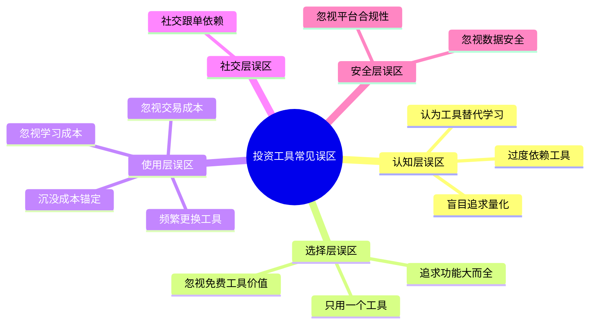
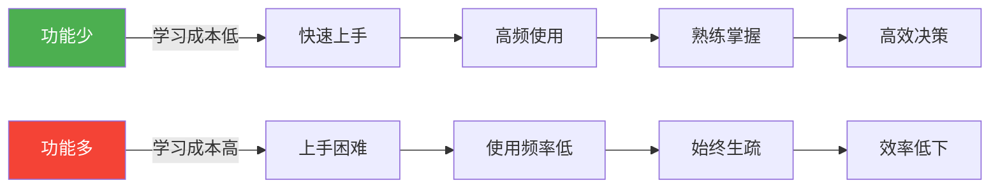
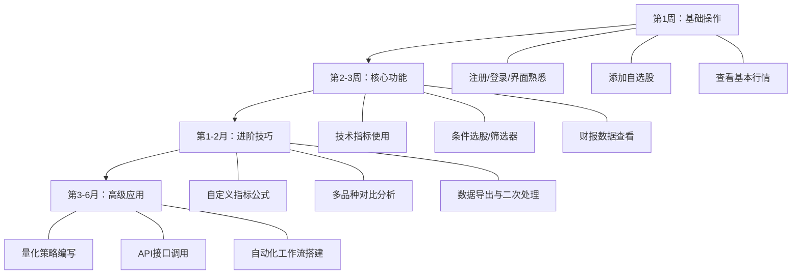
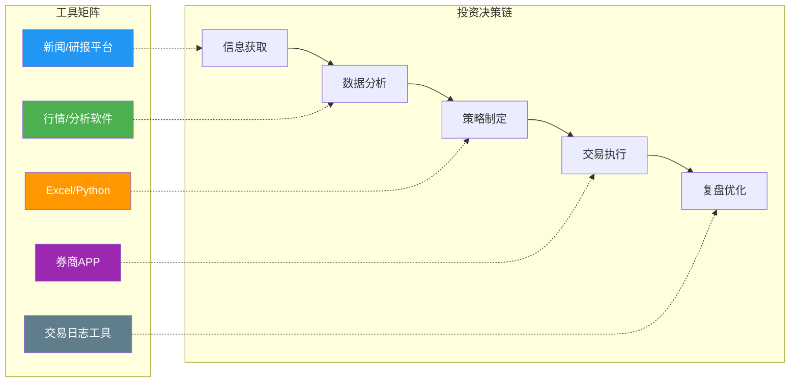
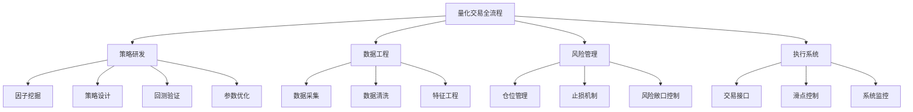

# 第14章 投资工具与平台——常见误区

投资工具是放大认知的杠杆，但如果使用姿势不对，杠杆同样会放大亏损。工具本身是中性的——一把好的手术刀在外科医生手中能救人，在没有医学知识的人手中只会伤人。本章系统梳理投资者在选择、使用和依赖投资工具过程中最常踩的十三个坑，每个误区从**现象描述→心理根源→真实后果→正确认知→实操纠正**五个层次展开，帮你建立工具使用的元认知框架。

> **阅读指南**：每个误区都设计为可独立阅读。如果你时间有限，先看「误区全景图」和「本节总结」的对照表，找到与自己最相关的2-3个误区精读，其余可略读。

## 误区全景图



**误区的五个层次**决定了你踩坑的深度：

| 层次 | 核心问题 | 后果严重度 | 修复难度 |
|------|---------|-----------|---------|
| 认知层 | 对工具本质的理解偏差 | ★★★★★ | 高（需要认知升级） |
| 选择层 | 选了不合适的工具 | ★★★ | 中（换工具即可） |
| 使用层 | 用法不当、习惯不好 | ★★★★ | 低（改习惯即可） |
| 社交层 | 把决策权让渡给他人 | ★★★★ | 中（需要建立独立思考习惯） |
| 安全层 | 忽视安全和合规底线 | ★★★★★ | 低（配置即可） |

---

## 误区一：过度依赖工具——把拐杖当成腿

### 典型表现

这类投资者常说：

- "MACD金叉了，肯定要涨。"
- "这个量化策略回测年化50%，实盘肯定也行。"
- "研报评级买入，那就买。"
- "AI选股推荐了三只股，直接买。"

他们把工具输出的信号等同于确定性结论，将决策权完全让渡给算法和指标。更隐蔽的表现是：每次做投资决策前，必须先看某个工具的"信号"才敢行动，没有信号就完全不敢判断——这意味着工具已经从"辅助"变成了"依赖"。

### 心理根源：权威偏见与自动化偏见

过度依赖工具背后有两个心理学机制：

**权威偏见（Authority Bias）**：人天然倾向于信任权威来源的信息。工具、算法、数据在投资者眼中具有"科学"光环，容易被赋予过高可信度。2008年金融危机前，大量机构依赖VaR（风险价值）模型，而模型假设市场波动服从正态分布，完全低估了尾部风险，最终导致系统性崩溃。Nassim Taleb在《黑天鹅》中将这种现象称为"Ludic谬误"——用已知概率模型去套未知的真实世界。

**自动化偏见（Automation Bias）**：当人和机器共同决策时，人倾向于过度信任机器的判断，即使机器判断明显有误。NASA研究发现，飞行员过度依赖自动驾驶系统后，手动操控能力显著退化。投资领域同理——长期依赖工具信号，你的独立判断力会逐渐萎缩。这种"认知肌肉萎缩"是渐进的，等你意识到的时候往往已经很严重了。

**确认偏见（Confirmation Bias）的叠加效应**：投资者倾向于只关注工具给出的、符合自己已有判断的信号，忽略那些与自己判断相矛盾的信号。当工具和你的直觉一致时，你会更加确信；当两者矛盾时，你倾向于选择相信工具——因为"数据不会骗人"。但问题是，数据不会骗人，而解读数据的模型可能是错的。

### 真实后果

**案例一：回测陷阱**

2019年某量化社区流传一个"神奇策略"——基于5日均线和20日均线交叉买卖沪深300ETF，回测2005-2019年年化收益18%。大量投资者直接实盘使用。2020年疫情暴跌期间，该策略在底部发出卖出信号，随后市场V型反弹，实盘投资者完美踏空。回测表现优异是因为恰好匹配了过去15年的市场节奏，而非策略本身具有预测能力。

**案例二：研报依赖**

某投资者严格按照券商研报评级操作，2022年某白酒龙头股被5家券商同时给予"买入"评级，投资者满仓买入。此后一年股价下跌40%。事后复盘发现，研报发布时该股估值已处于历史高位，任何独立判断都能看出风险，但"权威评级"四个字让他放弃了思考。

**案例三：AI选股的幻觉**

2023年某AI选股App宣称"AI模型战胜95%的基金经理"，用户付费订阅后按推荐操作。半年后用户发现，App推荐的股票整体跑输沪深300指数。原因很简单：AI模型在样本外数据上的表现远不如回测展示的样本内表现，而App展示给用户的恰恰是最优的样本内结果。

### 正确认知

工具的本质是**信息处理加速器**，不是**决策替代器**。具体来说：

| 工具擅长的 | 工具不擅长的 |
|-----------|-------------|
| 快速处理海量数据 | 判断宏观政策拐点 |
| 发现统计规律和相关性 | 区分因果关系和伪相关 |
| 严格执行既定规则 | 应对黑天鹅事件 |
| 消除情绪干扰 | 理解管理层能力和企业文化 |
| 7×24小时监控市场 | 做出需要常识和直觉的判断 |
| 标准化重复计算 | 处理"模糊地带"的灰色决策 |

**核心原则**：工具输出的是"输入"，不是"结论"。就像医生看X光片——X光片是工具输出的影像，但诊断需要医生的专业判断。一个合格的投资者应该能回答："如果这个工具明天消失了，我还知道该怎么投资吗？"如果答案是"不能"，你需要补充知识而不是寻找更好的工具。

### 纠正方法

建立"工具建议→人工复核→独立决策"的三步流程：

1. **拿到工具信号后，强制等待30分钟再操作**。这30分钟用于独立思考：这个信号的逻辑是什么？当前市场环境是否符合信号的前提假设？有没有信号可能失效的风险因素？把这30分钟当作"决策冷却期"。

2. **建立"否决清单"**。列举工具信号可能失效的场景（如政策突变、流动性危机、黑天鹅事件），每次收到信号时逐条检查。否决清单示例：
   - 当前是否处于重大政策窗口期？（两会、央行议息、重大改革）
   - 市场是否出现异常波动？（单日跌幅超3%、连续涨停/跌停）
   - 该信号的历史胜率在当前市场环境下是否成立？
   - 是否有重大事件尚未被市场消化？

3. **定期做"盲测"**。遮住工具的结论，仅看原始数据，练习自己得出结论，再与工具结论对比。如果长期偏差很大，说明你对工具的依赖已经超过了健康水平。

4. **建立"工具失灵日记"**。每次工具信号给出错误判断时，记录下来。积累20-30条记录后，你会对工具的局限性有更清醒的认识。

---

## 误区二：追求功能大而全——用航母打蚊子

### 典型表现

- "我要找一个集行情、分析、交易、社交于一体的平台。"
- "这个软件有200个技术指标，肯定比只有50个的好。"
- "别人推荐的专业终端一年3万，我咬咬牙也买一个。"
- 在功能对比表中逐项比较，纠结于"这个平台有DMI指标但那个没有"这种细节。

### 心理根源：选择悖论与沉没成本

**选择悖论（Paradox of Choice）**：心理学家Barry Schwartz的研究表明，选项越多，人越容易焦虑，做出选择后也越容易后悔。面对功能繁多的工具，投资者花在"选哪个功能"上的时间远超实际使用时间。更严重的是，功能太多会导致"决策瘫痪"——你有200个指标可用，但不知道该用哪个，最终一个都不用。

**沉没成本效应**：花大价钱买了专业终端后，即使发现80%的功能用不上，也会因为"已经花了钱"而强迫自己使用，反而降低了效率。某投资者花了3.6万/年订阅Wind终端，日常只用自选股和F10功能——这两项功能在免费的同花顺上就有。

**禀赋效应（Endowment Effect）**：你拥有的东西，你会高估它的价值。买了专业终端后，你会不自觉地为它辩护——"虽然现在用不上，但将来可能用得上""这些高级功能是为我进阶准备的"。这种心理让你很难承认"这笔钱花亏了"，于是继续付费，继续用不上。

### 功能复杂度与使用效率的关系



功能数量与实际使用效率之间存在"倒U型"关系：功能太少，无法满足需求；功能太多，认知负荷过重，每个功能都用不精。对大多数个人投资者而言，核心需求不超过5-8个功能。

**帕累托法则在工具使用中的体现**：你实际使用的功能占总功能数的比例通常不到20%。一个拥有200个功能的平台，你日常使用的可能只有15-30个。而这15-30个功能，在一个只有50个功能的平台上可能全部具备——而且后者的界面更简洁、上手更快、价格更低。

### 不同投资风格的工具需求矩阵

| 投资风格 | 核心需求 | 不需要的功能 | 推荐工具层级 | 月预算参考 |
|---------|---------|-------------|-------------|-----------|
| 长期价值投资 | 基本面数据、财报分析、估值计算 | 分时图、Level2行情、高频指标 | 免费/低价工具即可 | 0-50元 |
| 趋势跟踪 | 均线系统、成交量分析、板块轮动 | 深度财务分析、期权定价 | 中等价位工具 | 50-200元 |
| 波段交易 | 技术指标、资金流向、龙虎榜 | 长期估值模型 | 中等价位工具 | 100-300元 |
| 量化交易 | 历史数据API、回测引擎、策略框架 | 主观分析工具 | 专业量化平台 | 200-500元 |
| 基金投资 | 基金筛选、业绩归因、费率对比 | 个股分析工具 | 基金平台免费功能 | 0-100元 |

### 纠正方法

**"需求倒推法"选工具**：

1. 列出你过去30天实际做过的所有投资操作（不是想做的，是实际做的）
2. 将每项操作拆解为具体步骤（如"查看某股票市盈率"→"打开财报"→"计算PE"）
3. 每个步骤标注"必须用工具完成"还是"手动也能做"
4. 只看"必须用工具"的步骤，选择能满足这些步骤的最简单工具
5. 用这个最小工具集试运行2周，确认是否真的覆盖了你的核心需求

**"80/20筛选法"**：

任何工具你实际使用的功能不超过20%。在购买付费工具前，先用免费版试用14天，记录你实际使用的功能清单。如果这些功能在免费工具中都能实现，就没有必要付费。实操模板：

```text
工具功能使用记录表
日期：____
使用功能：____
用途：____
是否有免费替代：是/否
```

坚持记录14天后，统计"高频使用功能"（≥5次/周），这才是你真正需要的功能。其余功能，无论多"高大上"，都是干扰项。

---

## 误区三：忽视工具学习成本——买了钢琴就会弹

### 典型表现

- 下载了同花顺iFinD，打开后对着200个菜单发呆
- 买了Wind终端，三个月后还在用"自选股"功能
- 注册了量化平台，发现不会写代码，搁置了半年
- 把"学不会工具"归咎于工具不好用，而不是自己没投入时间

### 心理根源：习得性无助与即时满足偏好

**习得性无助（Learned Helplessness）**：当你多次尝试学习工具功能却失败后，会产生"我就是学不会"的信念，即使后面的功能其实并不难。这种心理障碍比技术障碍更难克服——你需要先打破"我学不会"的自我认知，才能真正开始学习。

**即时满足偏好（Present Bias）**：学习工具的收益是延迟的（几周后才能感受到效率提升），而学习的成本是即时的（现在就要花时间、面对挫折）。人脑天然偏好即时满足，所以你更容易选择"先用笨办法凑合"而不是"花时间学高效方法"。

### 学习曲线的真实数据

以常见投资工具为例，从零基础到熟练使用的时间投入：

| 工具类型 | 基础功能上手 | 核心功能熟练 | 高级功能精通 | 日均维护时间 | 学习投入回报比 |
|---------|-------------|-------------|-------------|-------------|-------------|
| 券商APP | 1-2小时 | 1-2天 | 1周 | 5分钟 | 极高 |
| 同花顺/东方财富 | 2-4小时 | 1周 | 1个月 | 15分钟 | 高 |
| 理杏仁/乌龟量化 | 4-8小时 | 2周 | 2个月 | 10分钟 | 高 |
| Python量化（backtrader） | 1-2周 | 2-3个月 | 6-12个月 | 1-2小时 | 中（需持续投入） |
| Wind/Choice终端 | 1周 | 1-3个月 | 6个月+ | 30分钟 | 中（取决于使用频率） |

### 为什么学习投资是"磨刀不误砍柴工"

假设你每天花1小时做投资分析。使用Excel手动计算vs使用Python自动化：

- **手动方式**：分析一家公司财报需要2小时，一个月分析5家=10小时
- **工具方式**：学习Python pandas需要40小时（一次性投入），之后分析一家公司只需15分钟，一个月5家=1.25小时
- **回本周期**：40 ÷ (10-1.25) ≈ 4.6个月

40小时的一次性学习投入，换来此后每月8.75小时的永久性时间节省。这就是"学习是投资"的数学证明。而且随着你分析的公司数量增加，节省的时间是线性增长的——10家公司每月节省17.5小时，20家公司每月节省35小时。

**更深层的价值**：学习工具的过程本身会加深你对投资的理解。当你用Python写一个PE筛选器时，你会被迫思考"PE的合理范围是多少""不同行业的PE差异有多大""PE为负意味着什么"——这些思考比单纯的工具使用更有价值。

### 纠正方法：阶梯式学习路径



**具体执行建议**：

1. **第一周只学3个功能**。不要贪多，先掌握最常用的3个功能（查看行情、查看财报、设置自选股），确保每天都在用
2. **每天固定15分钟"工具练习时间"**。就像练琴一样，固定时间、固定时长，形成习惯。把这个时间写入日历，设置提醒
3. **遇到问题先查文档再问人**。培养自己解决问题的能力，这个能力比工具本身更有价值。大多数投资工具都有完善的帮助文档和社区FAQ
4. **建一个"工具使用笔记"**。记录常用功能的操作路径、快捷键、踩过的坑。一个月后你会发现，80%的操作都能从笔记中找到答案。推荐用Notion或飞书文档，方便搜索
5. **找一个"学习伙伴"**。两个人一起学同一个工具，互相提问、互相教，学习效率比独自摸索高3倍以上
6. **每学完一个功能就立刻用它做一次真实分析**。学了条件选股？立刻筛选一次股票。学了财报对比？立刻对比两家公司。"用"是最好的"学"

---

## 误区四：频繁更换工具——永远在学新软件的路上

### 典型表现

- "这个行情软件K线不好看，换一个。"
- "某大V推荐了新的选股工具，我也试试。"
- "这个平台的社区氛围不好，换一个。"
- 电脑上装了8个行情软件，手机上有5个投资APP，每个都只用了皮毛
- 每隔2-3个月就"发现"一个"更好的工具"，然后花一周时间学习，用两周，再发现下一个

### 心理根源：新奇偏见与完美主义

**新奇偏见（Novelty Bias）**：人脑对新事物天然有更高的兴奋度。新工具的"新鲜感"会制造一种"用了新工具就能改善投资业绩"的幻觉，实际上工具换了，你的认知水平并没有提升。这是"用战术上的勤奋掩盖战略上的懒惰"的典型表现。

**完美主义陷阱**：总想找到"完美的工具"，于是在工具选择上无限循环。现实是没有任何工具能满足100%的需求，你需要的是接受"足够好"。完美主义者往往忽略了一个事实：花在寻找完美工具上的时间，如果用于深度使用一个"足够好"的工具，产出要高得多。

**社交传染**：投资社区中经常有人分享"发现了一个超好用的工具"，这种分享会激发你的FOMO（错失恐惧）情绪。但你要意识到，分享者可能只是处于"新工具蜜月期"，三个月后他可能也换了。

### 频繁更换的真实成本

假设每次更换工具需要2周学习时间，一年换4次工具：

- 直接成本：8周学习时间 × 每周5小时 = 40小时
- 间接成本：每次更换期间的决策质量下降（不熟悉工具导致的信息遗漏）
- 机会成本：40小时如果用于深度学习投资知识，效果远超换工具

更隐蔽的成本是**数据断层**——你在旧工具中积累的历史标记、笔记、筛选条件、自定义公式，换到新工具后全部归零。这些"数据资产"的价值往往远超工具本身的费用。

举个具体例子：某投资者在同花顺上积累了两年的自定义条件选股公式、200只自选股的分组管理、以及500条个股笔记。换到东方财富后，这些数据全部无法迁移，等于两年的积累化为乌有。

**工具切换的隐性成本计算模型**：

```text
年度工具切换总成本 = 直接学习成本 + 数据迁移成本 + 决策质量下降成本 + 机会成本

其中：
直接学习成本 = 切换次数 × 每次学习时间 × 时薪
数据迁移成本 = 历史数据价值（难以量化，但通常被严重低估）
决策质量下降成本 = 切换期天数 × 日均决策质量下降 × 决策影响金额
机会成本 = 总学习时间 × 用于投资知识学习的预期收益
```

### 什么情况下才应该换工具

不是不能换，而是要有明确的判断标准：

| 应该换的情况 | 不应该换的情况 |
|-------------|---------------|
| 核心需求无法满足（如需要API但平台不提供） | 界面不好看 |
| 数据质量有硬伤（频繁出错、延迟严重） | 某个非核心功能缺失 |
| 平台存在安全隐患或合规问题 | 朋友推荐了新工具 |
| 费用大幅上涨超出预算 | 学习曲线太陡（这是正常现象） |
| 平台停止维护或面临倒闭 | 偶尔出现bug |
| 客服态度恶劣且问题长期未解决 | 与其他工具不兼容（可能是你没找到方法） |

### 纠正方法：工具选择的"三年承诺"

1. **选择前花2周充分调研**。试用3-5个候选工具，列出功能对比表，不要被营销话术左右。对比表应包含：核心功能、数据质量、价格、学习成本、社区活跃度、导出能力
2. **选定后承诺至少使用6个月**。除非出现上表中"应该换"的情况，6个月内不换。把这6个月当作"试婚期"，给工具和自己足够的磨合时间
3. **每次想换工具时，先问自己三个问题**：
   - 是工具本身的问题，还是我不会用？（80%的情况是后者）
   - 换工具能解决我当前的投资问题吗？（大概率不能）
   - 我愿意为新工具投入多少学习时间？（如果答案是"越少越好"，说明你想逃避学习）
4. **年度工具审计**。每年年底花1小时盘点：当前工具用了哪些功能？哪些需求未满足？是否值得更换？用数据而非感觉做决策
5. **导出你的数据资产**。定期将自选股列表、自定义公式、笔记等导出为CSV/文本文件备份。这样即使将来必须换工具，你的核心数据资产不会丢失

---

## 误区五：忽视免费工具的价值——花钱买了个寂寞

### 典型表现

- "免费的数据肯定不准。"
- "专业投资者都用Wind，我也得买。"
- "这个软件一年3000，肯定比免费的好。"
- 对免费工具的评价标准异常苛刻（免费的有一个小bug就不能忍），对付费工具却异常宽容（花了钱的，缺点也能接受）

### 心理根源：价格=质量启发式

**价格-质量启发式（Price-Quality Heuristic）**：人脑有一种简化决策的捷径——用价格判断质量。这个启发式在很多场景下有效（贵的餐厅通常比便宜的好吃），但在软件工具领域经常失效。因为软件的边际成本几乎为零，免费工具的质量完全可以媲美甚至超越付费工具。

**双重标准心理**：投资者对免费工具和付费工具使用完全不同的评价标准。免费工具出现一个数据延迟就"不靠谱"，付费工具出现同样的问题却"可以理解"。这种心理偏差导致你系统性地低估免费工具、高估付费工具。

### 免费工具的真实能力

很多人不知道，主流免费工具在某些维度上已经足够强大：

**同花顺/东方财富免费版**：

- 实时行情（沪深A股、港股、美股）
- 完整的F10公司资料
- 基本的技术指标和画线工具
- 财报数据（季报/年报）
- 龙虎榜、大宗交易等公开数据
- 条件选股功能
- 板块分析和行业对比
- 公告速递和新闻聚合

**免费数据源的准确性**：

A股行情数据来源于沪深交易所的Level 1行情，所有券商APP和主流免费平台拿到的都是同一份数据源。所谓"数据不准"通常是指Level 2逐笔委托数据（付费），但对于大多数投资者来说，Level 1行情完全够用。你真的需要看到每一笔挂单吗？如果答案是"不确定"，那你大概率不需要。

**一个反直觉的事实**：很多专业投资者的核心工具栈中，免费工具占了一半以上。他们付费购买的只是少数真正产生差异化的功能（如专业研报库、高频数据API），其余环节全部用免费方案。这不是因为缺钱，而是因为他们清楚地知道哪些环节值得付费、哪些不值得。

### 什么情况下值得付费

| 付费场景 | 付费工具示例 | 年费参考 | 值不值 | 理由 |
|---------|-------------|---------|--------|------|
| 需要深度财务数据（如10年财报对比） | 理杏仁专业版 | 200-500元 | ✅ 对价值投资者值 | 省去大量手动整理时间 |
| 需要API接口做量化 | Tushare Pro | 0-2000元 | ✅ 对量化交易者值 | 免费版有调用限制 |
| 需要Level 2逐笔数据 | 券商Level 2 | 300-800元/年 | ⚠️ 大多数人不需要 | Level 1对普通投资者已足够 |
| 需要专业研报库 | Wind/Choice | 1-5万/年 | ❌ 个人投资者通常不值 | 大部分研报可在东方财富免费看摘要 |
| 需要实时资金流向 | 同花顺SuperView | 500-1000元/年 | ⚠️ 仅供参考，不可作为主要依据 | 资金流向数据的预测价值有限 |
| 需要程序化交易接口 | QMT/PTrade | 免费（需开通券商权限） | ✅ 对程序化交易者值 | 部分券商免费提供 |

### 免费工具的能力边界

为了帮你做出更明智的付费决策，以下是免费工具在各维度的能力边界：

| 维度 | 免费工具能做到 | 免费工具做不到 | 需要付费的门槛 |
|------|-------------|-------------|-------------|
| 行情数据 | 实时行情、日K/周K/月K | 分钟级Tick数据、Level 2逐笔 | 月付30-80元 |
| 基本面 | 近3年财报、核心指标 | 10年+历史财报、自定义指标计算 | 年付200-500元 |
| 选股筛选 | 基础条件选股（PE/PB/市值等） | 多因子复合筛选、自定义公式 | 年付300-1000元 |
| 研报 | 摘要和标题 | 全文阅读、深度报告 | 年付数千至数万 |
| 量化回测 | 简单策略回测 | 全量历史数据、高性能回测引擎 | 年付500-2000元 |
| 交易执行 | 基本下单、条件单 | 程序化交易、算法交易 | 需开通券商特殊权限 |

### 纠正方法：先免费后付费的三阶段策略

**第一阶段（1-3个月）**：只用免费工具。如果免费工具能满足你80%的需求，就不要付费。这个阶段的目标是"搞清楚自己到底需要什么"。

**第二阶段（3-6个月）**：明确瓶颈。记录每次"要是有XX功能就好了"的具体场景，一个月后统计频率。如果某个痛点每月出现10次以上，说明值得付费解决。推荐用手机备忘录随手记录：

```text
日期：2026-03-15
痛点：想看某公司10年PE趋势图，理杏仁免费版只有3年
频率：本月第3次出现类似需求
评估：值得付费（年费300元，省去手动整理10年数据的时间）
```

**第三阶段（6个月+）**：精准付费。只购买解决具体痛点的功能，不买"全家桶"。很多工具支持按功能模块付费，不需要的功能坚决不买。付费前再做一次"14天免费试用"，确认付费版确实解决了你的痛点。

---

## 误区六：只用一个工具——拿着锤子看什么都像钉子

### 典型表现

- "我就用东方财富，别的不用。"
- "券商APP能看行情能交易，够了。"
- "切换工具太麻烦，一个搞定。"
- 所有投资分析都在券商APP里完成，从不使用外部工具

### 心理根源：单一工具的"功能锚定"

每类工具有其设计哲学和功能边界，就像你不会只用一把螺丝刀修整栋房子。更隐蔽的问题是**功能锚定**——你习惯了一个工具的界面和操作逻辑后，会不自觉地用它的"思维方式"看待所有投资问题。用同花顺的人倾向于技术分析，用理杏仁的人倾向于基本面分析——不是因为一种方法更好，而是因为工具塑造了你的思维习惯。



单一工具的最大风险是**功能盲区**：你以为某个功能不存在，实际上只是你用的工具没有，换个工具就有了。更严重的是，单一工具的设计思路会影响你的投资思维——如果一个工具的核心卖点是"AI选股"，你就会不自觉地倾向于AI驱动的投资方式，而忽略了其他可能更适合你的方法。

### 推荐的工具组合模板

根据投资风格，以下是经过验证的工具组合：

**入门级组合（免费为主，适合新手，月成本0元）**：

| 环节 | 工具 | 用途 | 替代方案 |
|------|------|------|---------|
| 行情查看 | 券商APP | 实时行情、下单交易 | 同花顺免费版 |
| 基本面分析 | 东方财富网页版 | 财报数据、F10资料 | 同花顺网页版 |
| 信息获取 | 雪球/东方财富社区 | 市场讨论、投资笔记 | 新浪财经 |
| 数据记录 | Excel/WPS表格 | 持仓记录、收益统计 | 腾讯文档 |

**进阶级组合（适度付费，适合有1-3年经验的投资者，月成本50-200元）**：

| 环节 | 工具 | 用途 | 替代方案 |
|------|------|------|---------|
| 行情与技术分析 | 同花顺/通达信 | 技术指标、条件选股 | 东方财富Choice |
| 基本面深度分析 | 理杏仁 | 估值分析、财务指标对比 | 乌龟量化 |
| 信息与研报 | 东方财富Choice | 研报、公告、行业数据 | 慧博投研 |
| 数据处理 | Python + Jupyter | 自定义分析、数据可视化 | Excel高级功能 |
| 交易执行 | 券商APP | 下单、条件单 | — |
| 复盘记录 | Notion/飞书 | 交易日志、决策记录 | 有道笔记 |

**专业级组合（适合全职投资者或量化交易者，月成本200-500元）**：

| 环节 | 工具 | 用途 | 替代方案 |
|------|------|------|---------|
| 数据源 | Tushare Pro / AKShare | 全量历史数据API | 聚宽数据 |
| 量化平台 | 聚宽/米筐/优矿 | 策略编写、回测、模拟 | 本地backtrader |
| 深度分析 | Wind/Choice终端 | 专业级财务和宏观数据 | 理杏仁专业版 |
| 交易执行 | QMT/PTrade | 程序化交易 | 券商条件单 |
| 监控与复盘 | 自建Dashboard | 实时监控、策略绩效分析 | Grafana+数据库 |

### 工具组合设计的核心原则

1. **每个环节选"最擅长"的工具**。券商APP最擅长交易执行，那就只用它交易；理杏仁最擅长估值分析，那就只用它分析估值。不要用券商APP做深度财务分析（它不是为这个设计的），也不要用理杏仁看实时行情（它不是为这个设计的）。

2. **确保数据流通**。工具之间要有数据流转的通道——最常见的方式是CSV导出/导入。如果A工具的数据无法导入B工具，数据孤岛会严重影响效率。优先选择支持CSV/Excel导出的工具。

3. **画出你的"投资决策链"**。从信息获取到交易执行到复盘，每一步用什么工具？有没有断层？有没有重复？有没有工具承担了不属于它的职责？

### 纠正方法

1. **审计当前工具链**。列出你过去一周的每一个投资操作，标注每步用了什么工具。找出"用A工具做了B工具更擅长的事"的情况。
2. **补充缺失环节**。最常见的缺失是"复盘工具"——很多投资者交易做了，但从不系统复盘。一个简单的Excel交易日志就能填补这个空白。
3. **每个工具只用它的"杀手级功能"**。把这句话贴在显示器旁边。

---

## 误区七：忽视数据安全——你的账户比你想象的脆弱

### 典型表现

- 密码用生日或"123456"
- 所有投资平台用同一个密码
- 没有开启双重验证（2FA）
- 在公共WiFi下登录交易账户
- 点击不明链接进入"券商官网"
- 将交易密码告诉"投资顾问"
- 手机不设锁屏密码，投资APP处于免密登录状态

### 真实安全威胁

**钓鱼攻击**：假冒券商APP或网站，诱导输入账号密码。2023年国内破获的一起案件中，犯罪团伙仿造了某知名券商的APP界面，通过短信链接传播，累计盗取超过2000个账户，涉案金额超过5000万元。钓鱼APP的界面与正版几乎一模一样，普通用户很难分辨。

**撞库攻击**：你在A平台泄露的密码，会被黑客拿去尝试B平台。如果你所有投资平台用同一个密码，一个泄露就意味着全部沦陷。2022年某知名论坛数据泄露，涉及上亿条账户信息，其中大量账户的密码被用于尝试登录金融平台。

**SIM卡劫持**：如果短信验证码是你唯一的2FA方式，黑客可以通过社会工程学手段复制你的SIM卡，截获所有验证码。这种攻击在国内已有真实案例。

**内部人员风险**：你信任的"投资顾问"或"理财经理"也可能成为安全漏洞。他们的电脑可能被入侵，他们也可能主动违规操作你的账户。

**公共充电陷阱（Juice Jacking）**：在机场、商场使用公共充电桩时，恶意充电桩可以通过USB接口读取你手机中的数据，或植入恶意软件。如果你的手机上有免密登录的投资APP，攻击者可以直接获取你的账户信息。

### 安全等级自查表

| 检查项 | 低风险 ✅ | 中风险 ⚠️ | 高风险 ❌ |
|--------|----------|----------|----------|
| 密码强度 | 16位以上，含大小写+数字+特殊字符 | 8-12位，含字母和数字 | 纯数字或常见单词 |
| 密码管理 | 每个平台独立密码，使用密码管理器 | 3-5组密码分散使用 | 所有平台同一密码 |
| 2FA方式 | 硬件密钥（YubiKey）或认证器App | 短信验证码 | 未开启 |
| 登录环境 | 专用设备，私人网络 | 个人设备，公共网络需VPN | 公共设备，公共网络 |
| 钓鱼防范 | 从不点击链接，手动输入网址 | 核对域名后点击 | 直接点击邮件/短信链接 |
| 账户监控 | 每日检查登录记录和资金变动 | 每周检查 | 从不检查 |
| 设备安全 | 手机/电脑有锁屏+生物识别 | 有锁屏但无生物识别 | 无锁屏 |
| 社交工程防范 | 从不在电话中透露任何账户信息 | 只在确认身份后透露基本信息 | 随意告诉他人密码或验证码 |

**评分标准**：8项全部为"低风险"= 优秀；有1-2项中风险 = 合格；任何一项高风险 = 需要立即整改。

### 具体安全配置指南

**密码管理**：

1. 使用密码管理器（推荐Bitwarden免费版或1Password），为每个投资平台生成独立的随机密码
2. 主密码设为20位以上的"密码短语"，如"MyDog!Eats2Apples@Morning"——足够长、有逻辑、容易记
3. 绝不在浏览器中保存投资平台密码（浏览器密码管理的安全性远低于专业密码管理器）
4. 每年更换一次核心平台的密码

**双重验证配置**：

1. 优先使用认证器App（Google Authenticator、Microsoft Authenticator、Authy），而非短信验证码
2. 备份恢复密钥：将每个平台的2FA恢复密钥打印出来，存放在安全的地方（如保险箱）
3. 如果平台支持硬件密钥（如YubiKey），这是最安全的选项
4. 不要只依赖短信验证码作为唯一的2FA方式——SIM卡劫持攻击可以绕过它

**日常安全习惯**：

1. 永远手动输入券商官网地址，不从搜索引擎结果点击
2. 交易前确认网址栏有HTTPS和正确的域名（注意区分：`www.eastmoney.com` 是真的，`www.eastm0ney.com` 是假的）
3. 不在公共WiFi下进行任何涉及资金的操作（如果必须，使用VPN）
4. 每月检查一次各平台的登录记录，发现异常立即修改密码并联系平台
5. 不在社交媒体上晒持仓截图（截图中的账户信息可能被利用）
6. 手机丢失后第一时间远程锁定并修改所有金融App密码
7. 不使用公共充电桩给手机充电，随身携带充电宝

---

## 误区八：盲目追求量化交易——不是所有人都需要造火箭

### 典型表现

- "量化交易是未来的趋势，我必须学。"
- "我不懂编程，但量化能赚钱，我要硬学。"
- "某量化基金年化30%，我也用同样策略。"
- "回测收益很高，直接上实盘。"
- 把"量化"等同于"自动赚钱机器"

### 量化交易的真相

量化交易不是"点一下按钮就赚钱"的魔法。它是一整套系统工程：



每一个环节都需要专业知识。一个完整的量化策略从研发到稳定运行，个人投资者通常需要6-12个月。而且，即使策略研发成功，维护和迭代也需要持续投入——市场环境在变，去年有效的策略今年可能失效。

### 量化交易的常见失败原因

| 失败原因 | 具体表现 | 占比（估计） | 如何避免 |
|---------|---------|-------------|---------|
| 过拟合 | 回测收益极高，实盘严重亏损 | 40% | 使用样本外数据验证，限制参数数量 |
| 交易成本被低估 | 回测没算滑点、冲击成本 | 20% | 在回测中加入保守的成本假设 |
| 策略容量不足 | 小资金有效，稍大就失效 | 15% | 测试不同资金量下的策略表现 |
| 市场环境变化 | 牛市策略在熊市失效 | 15% | 在多种市场环境下测试策略 |
| 技术故障 | 程序bug、网络中断、接口异常 | 10% | 充分测试，设置熔断机制 |

**过拟合是头号杀手**。举个例子：你发现"周一买入、周五卖出"在2018-2023年的A股回测中收益显著。但这只是数据巧合——6年数据中存在无数个"看起来有效"的规律，绝大多数都是随机噪声。如果你在100个策略中挑出回测最好的那个，它大概率只是过拟合了历史数据。

**过拟合的识别方法**：

1. **样本外测试**：用2015-2020数据训练，用2021-2025数据验证。如果验证集表现显著差于训练集，大概率过拟合
2. **参数敏感性测试**：把策略参数微调±10%，如果收益变化剧烈，说明策略对参数过于敏感，是过拟合的信号
3. **逻辑检验**：策略背后有没有经济学逻辑？如果"周二下午2点买入"比"周三上午10点买入"收益高30%，这就是数据挖掘的结果，不是有效的策略逻辑

### 什么人适合做量化

| 适合 | 不适合 |
|------|--------|
| 有编程基础（Python/Java/C++） | 完全不懂编程 |
| 有金融基础知识 | 对金融市场了解甚少 |
| 能接受策略长期不赚钱甚至亏损 | 期望量化立即带来收益 |
| 享受研究和调试的过程 | 只想"一键赚钱" |
| 有足够的时间投入（每天2小时以上） | 只有碎片化时间 |
| 有数学/统计学基础 | 对概率和统计完全陌生 |

### 量化交易的"降级替代方案"

如果你不适合做全量化，但又想借助系统化方法，有以下替代方案：

1. **半量化**：用工具筛选候选股票（如ROE>15%、PE<20、营收增速>10%），但最终买入决策由人工判断。这结合了工具的效率和人的判断力
2. **条件单**：大多数券商APP支持条件单功能（股价跌破X元自动卖出），不需要编程就能实现简单的自动化规则
3. **指数定投**：最简单的"量化策略"——定期定额买入宽基指数基金，用时间分散风险，不需要任何编程能力

### 纠正方法

**如果你决定尝试量化**：

1. **先学Python基础（4-6周）**。不需要精通，但要能读懂代码、写简单脚本。推荐《Python for Finance》或"聚宽社区"的入门教程
2. **用现成的回测平台**。不要从零搭建系统，先用聚宽、米筐、优矿等在线平台，它们提供了数据、回测引擎和社区支持
3. **从最简单的策略开始**。比如均线策略、动量策略。先跑通全流程（数据→策略→回测→分析），再考虑复杂策略
4. **回测时严格遵守规则**：
   - 使用样本外数据（用2015-2020数据训练，用2021-2023数据验证）
   - 计入所有交易成本（佣金+印花税+滑点）
   - 不要反复调参直到回测结果好看（这是过拟合的典型做法）
   - 在不同市场环境下测试（牛市、熊市、震荡市）
5. **模拟盘至少跑3个月**。策略在模拟盘上的表现要与回测结果相近，才能考虑小资金实盘
6. **实盘初期只用总资金的10%**。即使模拟盘表现良好，实盘也可能因为各种未知因素（滑点、情绪、系统延迟）表现不同

**如果你不适合做量化**：

不要觉得遗憾。量化交易的超额收益正在被竞争不断压缩。2023年中国量化私募的平均收益约为8%，扣除管理费和业绩报酬后，投资者到手约5%——这个收益水平，买个宽基指数基金长期持有也能达到，而你需要投入的精力几乎为零。把省下的时间用于提升本职工作能力，收入增长带来的投资本金增加，可能比量化收益更可观。

---

## 误区九：忽视交易成本——温水煮青蛙

### 典型表现

- "佣金万2.5，一次交易才几十块钱，无所谓。"
- "印花税是国家收的，没办法。"
- "做T（日内交易）成本可以忽略。"
- 从不计算单次交易的总成本，只看盈亏金额

### 交易成本的全景拆解

很多投资者只知道"佣金"，实际上交易成本是一个完整的体系：

| 成本类型 | A股 | 基金 | 说明 |
|---------|-----|------|------|
| 券商佣金 | 万1-万3（可谈判） | 通常为0 | 买卖双向收取，最低5元/笔 |
| 印花税 | 0.05%（卖出单向） | 0 | 2023年8月下调 |
| 过户费 | 0.001% | 0 | 双向收取 |
| 基金申购费 | — | 0-1.5% | C类基金免申购费 |
| 基金赎回费 | — | 0-1.5% | 持有时间越长越低 |
| 基金管理费 | — | 0.5-1.5%/年 | 每日从净值中扣除 |
| 基金托管费 | — | 0.05-0.25%/年 | 每日从净值中扣除 |
| 滑点成本 | 约0.05-0.2% | — | 实际成交价与预期价的差异 |
| 冲击成本 | 视资金量而定 | — | 大额交易推动价格变动 |

**注意"最低5元"这个陷阱**：佣金万2.5，但最低收取5元。这意味着交易金额低于2万元时，实际佣金率远高于万2.5。比如买入1万元股票，佣金5元，实际费率是万5。频繁小额交易的投资者，这个隐性成本非常可观。

### 复利视角下的成本影响

假设初始资金10万元，年化收益10%，不同交易频率下30年后的资产差异：

| 场景 | 年交易次数 | 年交易成本 | 30年后资产 | 成本侵蚀 |
|------|-----------|-----------|-----------|---------|
| 低频（买入持有） | 4次 | 0.2% | 1,586,359元 | 基准 |
| 中频（月度调仓） | 24次 | 1.2% | 1,229,482元 | -22.5% |
| 高频（周度交易） | 100次 | 5.0% | 709,608元 | -55.3% |

**关键发现**：高频交易者的30年资产只有低频交易者的44.7%，差距超过87万元。这87万元不是亏在市场里，而是白白蒸发在交易成本中。

**更直观的理解**：假设你每次交易的成本是0.15%（佣金+印花税+滑点），一年交易100次，年交易成本就是15%。这意味着你的投资收益需要先达到15%才能打平——而A股市场的长期年化收益约为8-10%。也就是说，高频交易者大概率是**在亏钱的同时给券商和国家打工**。

### 隐性成本：你可能没注意到的"暗税"

1. **基金的管理费+托管费+销售服务费**：一只主动管理基金每年综合费率约1.5%-2.0%。持有10万元基金，每年要交1500-2000元费用，即使基金亏损也要交。这就是为什么巴菲特推荐指数基金——费率通常只有0.1%-0.5%。

2. **频繁申赎基金的惩罚性赎回费**：持有不到7天赎回，很多基金收取1.5%的惩罚性费用。10万元7天内赎回就要交1500元。有些投资者频繁"基金搬家"（从A基金换到B基金），每次搬家都交一次赎回费+申购费，累计成本惊人。

3. **打新/可转债的隐性成本**：为了获得打新资格而维持的底仓，如果底仓亏损远超打新收益，这个"资格费"是巨大的隐性成本。

4. **信息成本**：为了做出交易决策而购买的付费工具、研报、数据服务，这些费用也应该计入交易成本。如果你一年花5000元买工具，但只做了10笔交易，每笔交易的信息成本就是500元。

5. **时间成本**：频繁交易需要大量时间盯盘、分析、决策。如果你的时间值100元/小时，每天花2小时盯盘，一年的时间成本就是约5万元。这笔"成本"虽然不体现在账户里，但它是真实存在的机会成本。

6. **心理成本**：频繁交易带来的焦虑、后悔、兴奋等情绪波动，会影响你的生活质量。虽然难以量化，但它是真实存在的负效用。

### 纠正方法

**第一步：谈判佣金**

目前行业最低佣金约万1（含规费），很多券商对新客户或大资金客户可以给到。打电话给你的券商客服，说"我要调低佣金，否则我转户"，通常能拿到更低的费率。谈判话术模板：

> "你好，我是你们的老客户了，目前佣金是万X，我了解到现在很多券商可以给到万1，我希望调到这个水平。如果不行的话，我考虑转到其他券商。"

**第二步：选择低成本产品**

| 替代方案 | 原方案 | 每年节省（10万资金） |
|---------|--------|---------------------|
| 指数基金（费率0.15%） | 主动基金（费率1.5%） | 1,350元 |
| ETF（场内交易） | 场外基金（申购费1.2%） | 首次节省1,200元 |
| C类基金（短期持有） | A类基金（短期持有） | 视持有期而定 |

**第三步：减少不必要的交易**

- 设定"交易冷静期"：想卖出时强制等待24小时
- 用"交易成本计算器"：每次交易前计算这次操作的总成本（佣金+印花税+滑点），问问自己"这个成本值不值"
- 建立"调仓纪律"：只在季度/半年度进行调仓，不做日内或周内频繁操作
- 记录每笔交易的成本，月末汇总。看到累计数字后，你会自然地减少交易频率

**第四步：计算你的"盈亏平衡点"**

用这个公式计算你需要多少收益才能覆盖交易成本：

```text
年交易成本率 = 单次交易成本 × 年交易次数 × 2（买卖各一次）
盈亏平衡收益 = 年交易成本率 + 无风险收益率（约2%）
```

举例：佣金万2+印花税0.05%+滑点0.1%=单次约0.17%，年交易50次（买卖各25次），年交易成本率=0.17%×50×2=17%。你需要年化19%的收益才能打平——这几乎是不可能的。

---

## 误区十：认为工具可以替代学习——买了健身卡不等于健身

### 典型表现

- "我买了最好的终端，投资能力自然就提升了。"
- "这个AI选股工具能告诉我买什么，我不需要学分析。"
- "跟着大V操作就行，不需要自己懂。"
- 把"拥有工具"等同于"拥有能力"

### 心理根源：替代效应与禀赋幻觉

**替代效应（Substitution Effect）**：人倾向于用"容易做的事"替代"应该做的事"。学投资知识很难、很枯燥，而"买一个工具"很容易、很有仪式感。于是你用"购买工具"这个简单行为替代了"学习知识"这个困难行为，还误以为自己在"提升投资能力"。

**禀赋幻觉（Illusory Endowment）**：购买工具后，你会产生一种"我已经做了准备工作"的满足感，降低了后续学习的动力。就像买了健身卡后，你会觉得"我已经为健身做了投资"，反而更不愿意去健身房——因为"我已经付出了"。

### 为什么工具无法替代知识

工具解决的是"怎么做"的问题，但投资更关键的是"做什么"和"为什么做"的问题。一个不理解市盈率含义的人，即使有最精确的PE计算器，也不知道15倍PE是贵还是便宜——因为判断贵贱需要理解行业特征、增长预期、利率环境等上下文知识。

**知识-工具矩阵**：

|  | 有工具 | 无工具 |
|--|--------|--------|
| **有知识** | 高效决策（理想状态） | 决策慢但方向对 |
| **无知识** | 高效犯错（最危险） | 决策慢且方向错 |

最危险的状态不是"没有工具"，而是"有工具但没知识"。因为工具让你犯错的速度更快、规模更大。一个不懂风险管理的人用了杠杆工具，亏损会成倍放大。

**一个类比**：给一个不懂医学的人一台CT机，他能看到影像但无法诊断疾病。更糟糕的是，他可能自以为看懂了影像，做出错误的"诊断"，延误真正需要的治疗。投资工具也是如此——没有知识的人看到MACD金叉，自以为"看懂了"，满仓买入，结果可能是灾难性的。

### 投资者应该掌握的核心知识体系

不求精通，但至少要理解基本概念和逻辑：

**基础层（必学，约40小时）**：
- 财务三表基础：利润表、资产负债表、现金流量表怎么看
- 核心估值指标：PE、PB、PS、PEG的含义和适用场景
- 宏观经济基础：利率、通胀、GDP与股市的关系
- 常见投资品种：股票、债券、基金、ETF、可转债的基本特征
- 交易规则：T+1、涨跌停、熔断等基本规则

**进阶层（建议学，约80小时）**：
- 行业分析框架：如何判断一个行业的竞争格局和增长前景
- 技术分析基础：趋势、支撑阻力、成交量的含义
- 投资组合理论：分散化、相关性、风险收益比
- 行为金融学：常见认知偏误和应对方法
- 风险管理：仓位控制、止损策略、最大回撤

**高阶层（选学）**：
- 期权定价和策略
- 宏观对冲逻辑
- 量化因子投资
- 另类投资（REITs、大宗商品、加密资产）

### 纠正方法："工具+知识"双轮驱动学习法


具体步骤：

1. **先学概念，再找工具**。比如学"市盈率"这个概念，先理解它的计算公式、含义、局限性，然后打开理杏仁或东方财富，找10家公司的PE数据，用真实数据加深理解。
2. **用工具验证知识**。学了"低PE策略"后，不要只停留在理论层面，用工具回测一下这个策略在A股过去10年的表现。实践会让你发现理论的边界。
3. **建立"投资知识+工具技能"的双线学习计划**。每周花2小时学投资知识（看书、读研报），1小时学工具使用。两者交替进行，互相促进。
4. **定期"脱离工具"做判断练习**。每月选一只股票，不看任何工具数据，仅凭公开信息（年报、新闻）做出买卖判断，然后与工具数据对比。这个练习能有效防止工具依赖。
5. **建立"学习成果→投资决策"的因果链**。每次做出投资决策后，记录"这个决策基于什么知识"和"用了什么工具辅助"。如果某个决策只有工具输出而没有知识支撑，标记为"高风险决策"，后续重点复盘。

---

## 误区十一：忽视平台合规性——你的资金去哪了

这个误区可能是所有误区中最致命的一个——因为它涉及的不是"赚多赚少"的问题，而是"本金是否安全"的问题。

### 典型表现

- 使用境外平台交易，不了解平台是否有监管牌照
- 在不知名的"投资社区"中跟单交易
- 使用宣称"高收益"的"智能投顾"平台
- 将资金打入"第三方托管"但无法核实的平台
- 被"低佣金""零佣金"吸引到不知名小券商
- 通过微信群、QQ群中的链接下载投资APP

### 真实风险

2020-2023年间，国内监管部门公布的非法证券期货平台超过300家，涉案金额超过100亿元。这些平台的共同特征是：

- 承诺高收益、低风险（"月化收益10%，保本保息"）
- 没有证监会或银保监会的牌照
- 资金没有真正的第三方托管
- 提现时设置各种障碍（"需要缴纳保证金""需要达到一定交易量"）
- 平台域名注册时间很短（通常不到1年）
- 客服只有微信或QQ，没有400电话

**典型骗局模式**：

1. **"老师带单"骗局**：在微信群里有所谓"老师"每天推荐股票，前期确实能赚（因为推荐的是热门股），建立信任后引导你到"合作平台"开户入金，最终平台卷款跑路
2. **"高收益理财"骗局**：承诺年化15-30%的"稳健收益"，用后来者的资金支付先来者的利息（庞氏骗局），资金链断裂后崩盘
3. **"虚拟盘"骗局**：你看到的交易界面是假的，你的"交易"根本没有进入真实市场。平台通过后台操控让你"亏损"，亏损的钱直接进了平台口袋

### 合规性检查清单

在使用任何投资平台前，完成以下检查：

1. **查牌照**：在证监会官网（www.csrc.gov.cn）或基金业协会官网（www.amac.org.cn）查询平台是否有合法牌照。正规券商和基金公司都能在这些网站查到备案信息
2. **查托管**：确认资金是否由正规银行或券商托管，而非平台自持。正规平台会在官网明确标注托管银行名称
3. **查历史**：搜索平台名称+投诉/骗局/跑路等关键词，看看有没有负面信息
4. **查提现**：先用小额资金（如100元）测试提现流程，确认可以正常到账
5. **查费率**：如果平台费率明显低于市场平均水平，要警惕——它可能从其他地方"赚"你的钱
6. **查域名**：用whois查询工具查看平台域名的注册时间。如果注册不到1年，高度警惕
7. **查地址**：正规平台都有实体办公地址，可以在工商系统中查到。如果只有"香港XX大厦"或"海外注册"，要特别小心

### 如何辨别正规平台

| 特征 | 正规平台 | 可疑平台 |
|------|---------|---------|
| 监管牌照 | 证监会/银保监会备案可查 | 无牌照或自称"海外牌照" |
| 资金托管 | 明确标注托管银行 | 资金打入个人账户或不明公司 |
| 客服渠道 | 400电话+APP内客服+营业部 | 只有微信或QQ |
| 收益承诺 | 提示风险，不承诺收益 | "保本保息""月化10%" |
| 域名年龄 | 5年以上 | 不到1年 |
| 办公地址 | 可查的实体地址 | 无地址或虚假地址 |
| APP来源 | 官方应用商店可下载 | 只能通过链接下载 |

### 纠正方法

1. **只使用持牌机构**。券商选排名前20的，基金公司选知名度高的。宁可多付一点佣金，也不要贪图"低佣金"去不知名小平台
2. **不从任何链接下载APP**。只从苹果App Store、华为应用市场、小米应用商店等官方渠道下载
3. **警惕任何"保证收益"的承诺**。在金融领域，没有"保证收益"这回事——如果有人说"保证年化X%"，要么是骗子，要么是对风险一无所知
4. **分散平台风险**。不要把所有资金放在一个平台上，即使它是正规的。极端情况下（如平台系统故障），你需要有备用的交易渠道

---

## 误区十二：社交跟单依赖——别人的脑子不是你的

### 典型表现

- "这个大V的持仓我全跟，他买什么我买什么。"
- "雪球上这个组合年化30%，我直接复制。"
- "群里老师说的股票，我都买了。"
- 每天花大量时间看投资社区，但不花时间学习基础知识
- 把投资决策外包给"有经验的人"或"社区共识"

### 心理根源：从众效应与责任转移

**从众效应（Bandwagon Effect）**：当大量人持同一观点时，个体倾向于放弃自己的判断，跟随群体。在投资社区中，当一个大V推荐某只股票并获得大量点赞时，你很难保持独立判断——"这么多人认同，应该没错吧"。但问题是，群体共识往往是滞后的，当一个观点已经成为"共识"时，它很可能已经被市场定价了。

**责任转移心理**：跟单投资的本质是把决策责任转移给他人。如果跟单赚钱了，你会觉得是自己的"选择"好（选对了跟谁）；如果亏钱了，你会怪大V"推荐错了"。这种心理机制让你永远不会从自己的投资决策中学习，因为你从不认为决策是自己做的。

**幸存者偏差（Survivorship Bias）**：你看到的"成功大V"只是幸存者。投资社区中有大量曾经辉煌但后来爆仓的"大V"，他们已经消失了，你看不到。你看到的只是"活下来的人"，而他们的成功可能只是运气而非能力。

### 真实后果

**案例一：大V塌房事件**

2021年某知名雪球大V（粉丝超50万）长期展示其重仓某地产股的持仓，声称"这是十年一遇的机会"。大量粉丝跟单买入，合计跟单金额估计超过10亿元。2022年该地产股暴雷退市，大V本人通过其他账户早已减仓，但跟单粉丝损失惨重，部分投资者亏损超过70%。事后调查发现，该大V的"历史收益"有很大水分——他只展示盈利的持仓，亏损的持仓悄悄清仓后从不提及。

**案例二：社区共识的陷阱**

2023年某投资社区对一只新能源股票形成"一致性看多"的共识，相关帖子获得数千点赞。大量投资者跟风买入。然而，当"一致性看多"形成时，该股票已经被机构资金推至高位，社区共识恰恰成为了机构出货的"接盘信号"。此后半年股价下跌60%。

**案例三：信息延迟的代价**

社交平台上的投资信息存在天然延迟——大V发帖时，他的实际操作可能已经完成了一天甚至更久。你看到帖子后再操作，已经错过了最佳时机。更有甚者，部分大V会利用这种信息差进行"反向操作"——先建仓，再发帖推荐，等粉丝跟风推高股价后卖出。

### 社交跟单的结构性缺陷

| 缺陷 | 具体表现 | 后果 |
|------|---------|------|
| 信息延迟 | 看到帖子时大V可能已操作完 | 买入价高于大V成本 |
| 持仓不透明 | 不知道大V的真实仓位比例 | 跟单10%仓位，你可能满仓 |
| 风险承受力不同 | 大V能承受50%回撤，你可能20%就崩溃 | 同样的策略，结果天差地别 |
| 资金量差异 | 大V分散在20只股票，你只跟了3只 | 风险集中度完全不同 |
| 退出时机不明 | 大V何时卖出？你不知道 | 你永远在等"大V说卖" |
| 幸存者偏差 | 你只看到成功的大V | 失败的已消失，你以为成功率很高 |

### 正确认知

投资社区和大V的内容，正确的使用方式是**信息源**而非**决策源**：

| 正确用法 | 错误用法 |
|---------|---------|
| 从大V的分析中学习思考框架 | 直接复制大V的持仓 |
| 用社区讨论发现被忽略的投资标的 | 用社区共识作为买入依据 |
| 将大V观点作为"反方论据"来检验自己的判断 | 把大V观点当作"权威结论" |
| 关注大V的分析逻辑而非结论 | 只看结论不看逻辑 |

### 纠正方法

1. **建立"观点隔离"原则**。在看到任何社交平台的投资观点后，强制隔离24小时再做决策。24小时后如果你仍然认同这个观点，并且能用自己的逻辑解释"为什么这个观点是对的"，才考虑行动。

2. **只跟"逻辑"不跟"结论"**。大V说"某股票好"不重要，重要的是"为什么好"。如果他的分析逻辑你能理解并且认同，你可以用这个逻辑去分析其他股票；如果他的逻辑你理解不了，那就不应该跟。

3. **建立"独立分析→社交验证"的工作流**。先独立分析一只股票，得出自己的结论，然后去社交平台看看有没有你遗漏的信息或反面观点。这与"先看社交平台再做决定"的工作流完全相反，但效果好得多。

4. **限制社交平台的使用时间**。每天投资社区浏览时间不超过30分钟。把省下的时间用于阅读年报、学习财务分析——这些"慢信息"比社交平台上的"快信息"有价值得多。

5. **建立"跟单复盘"机制**。如果你确实跟了某个大V的操作，完整记录：跟单时间、大V成本（如果公开的话）、你的成本、持仓比例、卖出时间、最终收益。三个月后回顾，你会发现跟单的实际收益远不如你想象的那么好。

---

## 误区十三：移动端工具的隐性陷阱——手机不是投资的最佳载体

### 典型表现

- 所有投资操作都在手机上完成，从不使用电脑端
- 手机屏幕太小，看不清K线细节却不知道
- 习惯在地铁、排队等碎片时间做投资决策
- 被APP的推送通知"牵着鼻子走"
- 用手指在手机上划来划去，误触导致错误下单

### 移动端工具的设计陷阱

投资APP的设计目标是**让你多使用**，而不是**让你多赚钱**。很多APP的设计细节会潜移默化地增加你的交易频率：

**推送通知的设计**：APP会在股价大幅波动时推送通知，制造紧迫感。但99%的短期波动对长期投资者来说没有意义。每一次推送都在试图把你从"持有"状态拉回"交易"状态——因为平台的收入与你的交易频率正相关。

**界面设计的行为诱导**：
- 首页突出显示"涨幅排行""热门股票"，诱导你关注短期表现
- "一键买入"按钮比"一键卖出"按钮更大、颜色更醒目
- 交易确认页面缺少成本提示（佣金、印花税的金额不显示或字号很小）
- 持仓页面用红色显示亏损、绿色显示盈利（A股配色），每次打开APP都触发损失厌恶情绪

**碎片化决策的陷阱**：手机让你可以在任何时间、任何地点做投资决策。但这恰恰是问题所在——投资决策应该是深思熟虑的，而不是在地铁上花30秒做出的。碎片化环境下的决策质量远低于专注环境下的决策质量。

### 移动端与桌面端的决策质量对比

| 维度 | 移动端 | 桌面端 |
|------|--------|--------|
| 信息展示面积 | 有限，需要频繁翻页 | 充足，一屏展示多维数据 |
| 分析深度 | 浅层，适合查看行情 | 深层，适合财报分析、多股对比 |
| 决策环境 | 碎片化，容易分心 | 专注，适合深度思考 |
| 操作精度 | 手指操作，容易误触 | 鼠标操作，精确度高 |
| 数据导出 | 通常不支持 | 方便导出CSV/Excel |
| 适合的操作 | 查看行情、简单下单 | 深度分析、策略制定、复盘 |

### 纠正方法

1. **把"分析"和"交易"分离**。分析在电脑上做（屏幕大、环境专注），交易可以在手机上执行（操作简单）。不要在手机上做深度分析——屏幕限制会让你遗漏关键信息。

2. **关闭所有非必要的推送通知**。只保留"委托成交确认"和"资金变动提醒"，关闭"行情异动""热门推荐""社区动态"等推送。推送通知是APP争夺你注意力的武器，不是帮你投资的工具。

3. **设定"手机投资时间"**。规定自己只在固定时间段（如早上9:00-9:30、下午14:30-15:00）打开投资APP。其余时间不看行情——这不仅减少冲动交易，还能降低焦虑感。

4. **使用"灰度模式"**。将手机屏幕调为灰度模式（去除颜色），这样持仓页面的红绿配色就不会触发你的情绪反应。iOS和Android都支持这个功能。

5. **重大决策只在电脑上做**。买入、卖出、调仓等重大决策，强制要求自己在电脑上完成。这个小小的摩擦力可以过滤掉大量冲动决策。

---

## 本节总结

### 误区全景对照表

| 序号 | 误区 | 核心问题 | 正确认知 | 一句话纠正 |
|------|------|---------|---------|-----------|
| 1 | 过度依赖工具 | 把决策权让渡给算法 | 工具是信息加速器，不是决策替代器 | 信号来了一定要独立复核 |
| 2 | 追求功能大而全 | 用航母打蚊子 | 适合你的才是最好的 | 用"需求倒推法"选工具 |
| 3 | 忽视学习成本 | 买了钢琴就会弹 | 学习是投资，不是成本 | 阶梯式学习，每天15分钟 |
| 4 | 频繁更换工具 | 永远在学新软件 | 更换有成本，选择要慎重 | 选定后至少用6个月 |
| 5 | 忽视免费工具 | 花钱买了个寂寞 | 免费工具在很多场景已足够 | 先免费后付费，精准付费 |
| 6 | 只用一个工具 | 拿着锤子找钉子 | 不同环节需要不同工具 | 构建覆盖决策链的工具组合 |
| 7 | 忽视数据安全 | 账户比你想象的脆弱 | 安全是投资的基础设施 | 独立密码+认证器App+手动输入网址 |
| 8 | 盲目追求量化 | 不是所有人都需要造火箭 | 量化是系统工程，不是一键赚钱 | 没有编程基础就不要硬上 |
| 9 | 忽视交易成本 | 温水煮青蛙 | 成本通过复利效应被指数级放大 | 谈佣金+选低成本产品+减少交易频率 |
| 10 | 认为工具万能 | 买了健身卡不等于健身 | 知识是地基，工具是杠杆 | 双线学习：知识+工具并行 |
| 11 | 忽视平台合规性 | 你的资金可能根本不在正规账户 | 合规是投资的前提条件 | 用之前查牌照、查托管、查提现 |
| 12 | 社交跟单依赖 | 别人的脑子不是你的 | 社交平台是信息源，不是决策源 | 独立分析→社交验证，不跟结论 |
| 13 | 移动端隐性陷阱 | 手机不是投资的最佳载体 | APP设计目标是让你多交易，不是多赚钱 | 分析用电脑，交易用手机，关推送 |

### 工具使用的元认知框架

最后，给你一个万能的"工具使用自检清单"，在使用任何投资工具时定期回顾：

1. **为什么用这个工具？** ——如果答不上来，说明你可能在为用而用
2. **这个工具的输出我能不能独立验证？** ——如果不能，你的依赖程度过高
3. **如果这个工具明天消失了，我还能投资吗？** ——如果不能，你需要补充知识
4. **这个工具我用了哪些功能？** ——如果不到30%，说明你为不需要的功能付费了
5. **我的投资账户安全吗？** ——密码、2FA、登录环境是否都达标
6. **这个平台有合法牌照吗？** ——如果不能确认，立即核查
7. **我为这个工具/平台投入的总成本是多少？** ——把年费、时间成本、机会成本都算进去
8. **我的决策是自己做的还是"跟"别人做的？** ——如果是后者，你在外包思考
9. **我是在电脑上做的深度分析还是手机上的碎片化判断？** ——后者更容易出错

### 一页纸速查卡

把下面这张表打印出来贴在显示器旁边：

```text
┌─────────────────────────────────────────────┐
│          投资工具使用速查卡                    │
├─────────────────────────────────────────────┤
│ ✅ 工具信号 → 等30分钟 → 独立复核 → 再操作    │
│ ✅ 选工具 → 需求倒推 → 最简单 → 免费优先       │
│ ✅ 学工具 → 每天15分钟 → 阶梯式 → 记笔记       │
│ ✅ 换工具 → 先问3个问题 → 至少用6个月          │
│ ✅ 付费 → 先免费3个月 → 记录痛点 → 精准付费    │
│ ✅ 工具链 → 每个环节用最擅长的 → 确保数据流通   │
│ ✅ 安全 → 独立密码+2FA+手动输入网址             │
│ ✅ 量化 → 没有编程基础就不要硬上               │
│ ✅ 成本 → 谈佣金+选低费产品+减少交易频率       │
│ ✅ 学习 → 知识和工具双线并行                   │
│ ✅ 合规 → 用之前查牌照、查托管、查提现          │
│ ✅ 跟单 → 只跟逻辑不跟结论 → 独立分析优先      │
│ ✅ 手机 → 分析用电脑 → 关推送 → 设固定看盘时间  │
└─────────────────────────────────────────────┘
```

工具是死的，人是活的。投资中最重要的工具永远是你的大脑。善用工具而不依赖工具，保持学习而不迷信工具，注意安全而不因噎废食，警惕社交陷阱而不闭门造车，才是正确的投资姿势。
