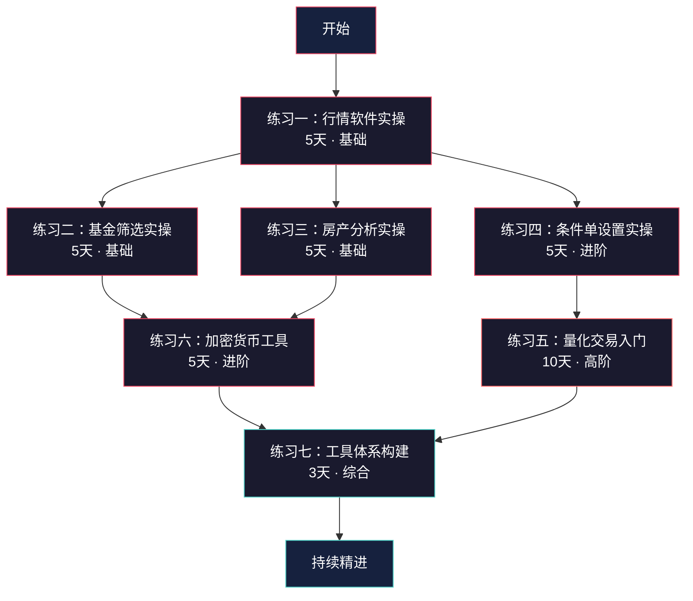
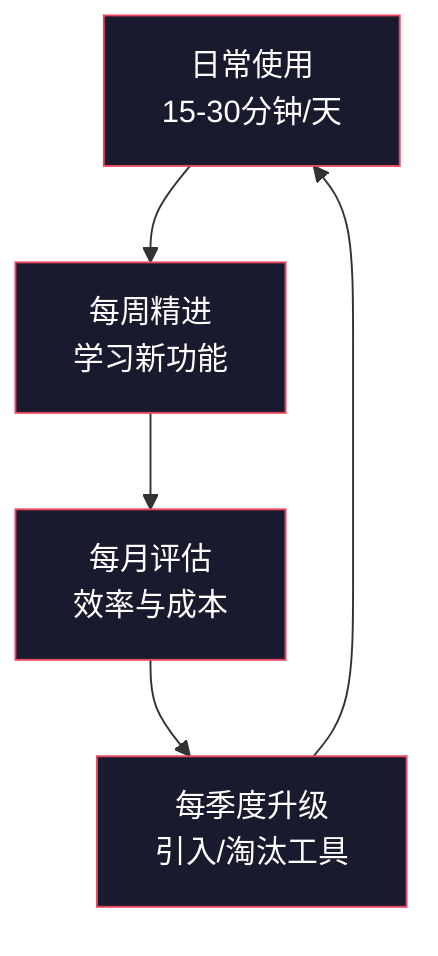

# 第14章 投资工具与平台——练习方法

> "纸上得来终觉浅，绝知此事要躬行。"——陆游《冬夜读书示子聿》

投资工具的知识，看十遍不如动手做一遍。本章理论基础和核心技巧已经帮你建立了认知框架和操作方法论，但知识停留在"知道"层面是没有价值的——只有转化为"能做到"，才能真正在投资决策中发挥作用。

本篇提供七套渐进式练习，覆盖从基础行情查看到完整工具体系构建的全流程。每套练习都遵循"目标→准备→步骤→验收→排错"五段式结构，确保你不是"跟着做了一遍"，而是"真正学会了"。

## 学习路径全景

七套练习的设计逻辑是**螺旋上升**：从最基础的行情查看（零门槛），到需要编程能力的量化交易（高门槛），最后整合为个人工具体系（综合运用）。下图展示了完整的学习路径和推荐顺序：



**路径说明**：
- **必修**：练习一（所有投资者）→ 练习七（所有投资者）
- **按需选修**：练习二至六，根据你的投资品种选择
- **并行可能**：练习二和练习三可以同时进行（基金和房产互不依赖）
- **串行必须**：练习四必须在练习一之后（需要看盘基础），练习五必须在练习四之后（需要理解交易逻辑）

## 练习方法论：费曼学习法在投资工具中的应用

在开始具体练习之前，先理解这套练习背后的学习逻辑。我们的练习设计基于费曼学习法的四个步骤：


**在投资工具练习中的具体应用**：

1. **选择概念**：每套练习聚焦一个工具模块，不贪多求全
2. **教授他人**：每完成一个步骤，用自己的话写下操作要点——如果你写不清楚，说明你还没真正理解
3. **发现盲区**：练习中的"排错指南"专门针对常见卡点设计，遇到问题不要跳过，解决它
4. **简化复述**：每套练习的最后，用不超过三句话总结这套工具的核心价值和使用场景

### 练习的基本原则

| 原则 | 说明 | 违反后果 |
|------|------|----------|
| **用模拟资金，不用真金白银** | 所有涉及交易的练习，必须先在模拟环境完成 | 真金白银试错成本太高，恐惧和贪婪会干扰学习 |
| **记录每一步操作** | 准备一个练习笔记，记录操作步骤、遇到的问题、解决方法 | 不记录就无法复盘，下次遇到同样问题还要重新摸索 |
| **遇到报错不要跳过** | 报错是最好的学习机会，搞清楚为什么报错比成功执行更有价值 | 跳过报错 = 跳过学习，积累的盲区最终会反噬 |
| **完成一个再做下一个** | 七套练习按顺序进行，不要同时开始多套 | 多线程学习导致每样都学个皮毛，没有一个真正掌握 |
| **每天投入1-2小时即可** | 不需要一口气做完，每套练习3-5天完成是合理节奏 | 连续高强度操作会导致疲劳和厌倦，反而降低学习效果 |
| **先跑通再理解** | 第一遍练习以"跟着做"为目标，先确保每步都能跑通；第二遍再思考"为什么这样做" | 试图一遍就理解所有细节会导致进度停滞和挫败感 |

### 练习笔记模板

建议用Notion、Obsidian或Excel建立统一的练习笔记。以下是一个标准模板：

```markdown
# 练习X：[练习名称]

## 日期：YYYY-MM-DD

### 今日目标
- [ ] 目标1
- [ ] 目标2

### 操作记录
1. 步骤描述
   - 实际操作：___
   - 遇到的问题：___
   - 解决方法：___

### 关键发现
- （记录你"原来如此"的瞬间）

### 明日计划
- （提前写下明天要做的事）

### 三句话总结
1. ___
2. ___
3. ___
```

### 练习中的常见错误方式

以下是练习者最容易犯的错误，提前了解可以避免走弯路：

| 错误方式 | 具体表现 | 正确做法 |
|----------|----------|----------|
| **眼高手低** | "这个功能我知道了"就跳过实际操作 | 必须亲手操作至少一遍，知道和做到之间有巨大鸿沟 |
| **贪多求快** | 一天做完3天的练习内容，但都是浮光掠影 | 按节奏走，每天1-2小时，消化吸收比速度重要 |
| **只做不记** | 操作了一遍但没有记录步骤和心得 | 每步都记录，这是你后续复盘和速查的资料库 |
| **遇到困难就放弃** | 卡在一个步骤超过30分钟就放弃整套练习 | 30分钟卡住就先跳过这一步，继续后面的步骤，回头再解决 |
| **忽略验收标准** | 做完步骤就认为完成了，不对照验收清单自查 | 逐项对照验收标准，未达标的项目要补练 |
| **练习环境和真实环境混淆** | 在练习中投入真实资金，心态被盈亏干扰 | 练习阶段只用模拟资金，真实资金等练习完成且肌肉记忆形成后再投入 |
| **孤立练习** | 每套练习做完就扔，不与前后练习关联 | 每套练习结尾的"三句话总结"要认真写，练习七会用到 |

---

## 练习一：行情软件实操（5天）

### 学习目标

通过5天的系统练习，达到以下能力水平：

- **基础能力**：能独立打开行情软件，在30秒内找到任意一只A股的实时行情
- **分析能力**：能叠加至少3种技术指标，并对指标信号做出基本解读
- **数据能力**：能查询个股的财务数据，并计算出PE、PB等核心估值指标
- **筛选能力**：能使用条件选股功能，根据自定义条件筛选出候选股票

### 前置准备

| 准备事项 | 具体要求 | 预计时间 |
|----------|----------|----------|
| 软件安装 | 下载同花顺（推荐，功能最全）或东方财富（界面更简洁），二者选一即可 | 10分钟 |
| 账号注册 | 注册并登录，建议绑定手机号以便同步自选股 | 5分钟 |
| 硬件要求 | 电脑端优先（屏幕大，操作方便），手机端作为辅助 | - |
| 知识储备 | 阅读本章理论基础§2（股票投资工具理论）和核心技巧§1（股票工具使用技巧） | 30分钟 |

### Day 1：界面熟悉与基础行情（1.5小时）

**操作步骤**：

1. **认识主界面布局**
   - 打开同花顺/东方财富电脑版，花10分钟观察界面分区：顶部菜单栏、左侧功能导航、中间行情显示区、下方信息栏
   - 找到"自选股"入口，添加贵州茅台（600519）、宁德时代（300750）、中国平安（601318）三只股票到自选
   - 切换"分时图"和"日K线"两种视图，理解它们分别展示什么信息

2. **查看指数行情**
   - 搜索并查看上证指数（000001）、深证成指（399001）、创业板指（399006）
   - 观察三个指数的联动关系：通常是同涨同跌，但涨跌幅可能不同
   - 理解"红涨绿跌"的显示规则（注意：美股是绿涨红跌，A股相反）

3. **查看个股行情**
   - 点击贵州茅台，查看分时图：白色线是股价，黄色线是均价
   - 查看右侧的买卖五档盘口：买一到买五的价格和数量，卖一到卖五的价格和数量
   - 理解"委比"指标：(委买-委卖)/(委买+委卖)×100%，正值表示买方力量强

4. **K线图基础**
   - 切换到日K线，观察每根K线的构成：开盘价、收盘价、最高价、最低价
   - 阳线（收盘>开盘，通常红色）和阴线（收盘<开盘，通常绿色）的含义
   - 切换不同周期：1分钟、5分钟、15分钟、30分钟、60分钟、日线、周线、月线——理解周期越长，趋势越可靠

**Day 1 验收标准**：
- [ ] 能在10秒内通过搜索找到任意一只股票
- [ ] 能区分分时图和K线图展示的信息差异
- [ ] 能看懂买卖五档盘口的基本含义
- [ ] 能切换K线的不同时间周期

**常见问题排错**：
- **Q：搜索股票时找不到怎么办？** A：确认输入的是股票代码（如600519）而非名称。如果代码也找不到，可能是该股票已停牌或退市。
- **Q：K线图上有些K线是空心的，有些是实心的，有什么区别？** A：空心K线通常表示阳线（上涨），实心表示阴线（下跌）。不同软件的配色方案可能不同，以图例说明为准。
- **Q：分时图上的黄色虚线是什么？** A：黄色虚线是均价线，表示当天从开盘到当前时刻的加权平均价格。股价在均价线上方说明买方力量较强，反之则卖方力量较强。
- **Q：为什么有时候盘口数据刷新很慢？** A：免费行情软件通常有3-5秒的延迟（Level 1行情）。如果需要实时数据，需要购买Level 2行情服务（约几十元/月）。练习阶段Level 1完全够用。

### Day 2：技术指标应用（1.5小时）

**操作步骤**：

1. **均线系统（MA）**
   - 在K线图上叠加MA指标，观察默认的5日、10日、20日、60日均线
   - 手动添加120日（半年线）和250日（年线）均线
   - 观察股价与均线的位置关系：股价在均线上方运行表示趋势偏强，下方运行表示偏弱
   - 观察短期均线和长期均线的交叉：金叉（短期上穿长期，看涨信号）和死叉（短期下穿长期，看跌信号）

2. **MACD指标**
   - 叠加MACD指标（通常在K线图下方独立窗口显示）
   - 认识MACD的三个组成部分：DIF线（快线）、DEA线（慢线）、柱状图（MACD柱）
   - 在贵州茅台的K线图上找到至少2个金叉和2个死叉位置，观察信号发出后股价的实际走势
   - 理解"顶背离"（股价创新高但MACD没有创新高）和"底背离"（股价创新低但MACD没有创新低）的形态

3. **RSI指标**
   - 叠加RSI指标（相对强弱指数），默认参数为6日、12日、24日
   - 理解RSI的数值含义：>80为超买区（可能回调），<20为超卖区（可能反弹）
   - 找一只近期波动较大的股票（如东方财富300059），观察RSI在超买超卖区的表现
   - 注意：RSI在趋势行情中可能长期处于超买或超卖区，单独使用容易误判

4. **布林带（BOLL）**
   - 叠加布林带指标，观察三条线：中轨（20日均线）、上轨、下轨
   - 理解布林带的收窄和扩张：收窄表示波动率降低，可能即将出现大行情；扩张表示波动率增大
   - 观察股价触及上轨和下轨后的反应——这不意味着一定要反转，但可以作为参考信号

**Day 2 验收标准**：
- [ ] 能在K线图上同时显示均线和MACD
- [ ] 能找到MACD金叉/死叉信号，并对照股价走势验证
- [ ] 能用RSI判断超买超卖区域
- [ ] 能用布林带判断波动率变化

**指标组合速查表**：

| 指标 | 核心作用 | 优势 | 局限 | 适用场景 |
|------|----------|------|------|----------|
| MA均线 | 趋势方向 | 简单直观，适合趋势行情 | 滞后性强，震荡行情信号频繁 | 判断中长期趋势 |
| MACD | 趋势+动量 | 兼顾趋势和动量，信号可靠 | 震荡行情假信号多 | 趋势确认和背离分析 |
| RSI | 超买超卖 | 震荡行情表现好 | 趋势行情中长期钝化 | 震荡行情的买卖点 |
| 布林带 | 波动率 | 能捕捉波动率变化 | 单边行情中容易被突破 | 判断突破时机 |
| KDJ | 超买超卖+转折 | 对短期转折敏感 | 频繁发出信号，假信号多 | 短线交易辅助 |
| 成交量（VOL） | 资金态度 | 量价配合是最可靠的信号之一 | 单独使用信息量不足 | 验证其他指标信号的可靠性 |

**指标组合使用原则**：
- **趋势确认组合**：MA + MACD——均线判断方向，MACD确认趋势强度
- **震荡行情组合**：RSI + 布林带——RSI判断超买超卖，布林带判断波动区间
- **量价验证组合**：任意指标 + 成交量——放量突破比缩量突破更可靠
- **不要叠加超过4个指标**——指标太多会产生信号冲突，反而干扰判断

### Day 3：财务数据查询（1.5小时）

**操作步骤**：

1. **基础财务数据**
   - 进入贵州茅台的个股页面，找到"财务"或"F10"入口
   - 查看三大财务报表摘要：资产负债表、利润表、现金流量表
   - 重点关注几个核心数据：营业收入、净利润、毛利率、净利率、资产负债率

2. **估值指标查询**
   - 查看PE（市盈率）= 股价 / 每股收益——PE越低，理论上越"便宜"，但要结合行业对比
   - 查看PB（市净率）= 股价 / 每股净资产——PB适用于重资产行业（银行、地产）
   - 查看股息率 = 每股分红 / 股价——高股息率是价值投资的重要参考

3. **数据对比练习**
   - 对比贵州茅台和五粮液的PE、PB、毛利率——同行业对比才有意义
   - 对比贵州茅台和招商银行的PE——不同行业的PE差异很大，银行PE通常5-8倍，白酒可能20-30倍
   - 在同花顺中查看PE百分位（或去理杏仁查看）：当前PE处于近5年的什么位置

4. **财务数据记录**
   - 用Excel或笔记记录3只股票的核心财务指标
   - 格式：股票名称 | 营收(亿) | 净利润(亿) | 毛利率 | PE | PB | 股息率
   - 这份记录就是你个人股票数据库的起点

**Day 3 验收标准**：
- [ ] 能在个股页面找到F10财务数据入口
- [ ] 能正确理解PE、PB、股息率的含义和计算方式
- [ ] 能对比同行业不同公司的估值指标
- [ ] 建立了至少3只股票的财务数据记录

**财务数据速查口诀**：

> "PE看贵贱，PB看家底，股息看回报，ROE看能力，负债看风险"

| 指标 | 公式 | 含义 | 参考范围 |
|------|------|------|----------|
| PE（市盈率） | 股价/每股收益 | 多少年能回本 | 银行5-8倍，消费15-30倍，科技30-60倍 |
| PB（市净率） | 股价/每股净资产 | 相对净资产的溢价 | <1可能是低估，>5需要高成长支撑 |
| ROE（净资产收益率） | 净利润/净资产 | 股东资金的赚钱效率 | >15%为优秀，>20%为卓越 |
| 毛利率 | (营收-成本)/营收 | 产品定价能力 | >50%有护城河，<20%是苦生意 |
| 资产负债率 | 负债/总资产 | 债务风险 | <60%正常，>70%需要警惕 |
| 股息率 | 每股分红/股价 | 现金分红回报 | >3%有吸引力，>5%非常慷慨 |

### Day 4：选股功能实操（1.5小时）

**操作步骤**：

1. **条件选股入门**
   - 找到同花顺的"智能选股"或"条件选股"功能入口
   - 第一次筛选：设置条件为"PE<20 且 ROE>15% 且 营收增长率>10%"，运行筛选
   - 记录筛选结果数量——如果结果太少（<10只），放宽条件；如果太多（>100只），收紧条件

2. **技术面选股**
   - 设置条件为"股价站上20日均线 且 MACD金叉 且 成交量大于5日均量"
   - 这类选股逻辑是"趋势启动"信号，结果中的股票可能正在开启一轮上涨
   - 注意：技术面选股是短期信号，需要结合基本面验证

3. **综合选股**
   - 将基本面和技术面条件组合："PE<30 且 ROE>10% 且 股价站上60日均线 且 近5日涨幅<10%"
   - 最后一个条件（近5日涨幅<10%）是为了排除已经大幅上涨的股票，避免追高
   - 对筛选结果逐个查看，排除ST股、次新股（上市不满1年）等特殊情况

4. **建立候选股票池**
   - 从筛选结果中选出5-10只感兴趣的股票，加入自选股
   - 为每只股票标注入选理由（估值低？趋势好？行业龙头？）
   - 这个股票池就是你后续深入研究的起点

**Day 4 验收标准**：
- [ ] 能使用条件选股功能设置基本面筛选条件
- [ ] 能使用条件选股功能设置技术面筛选条件
- [ ] 能组合基本面和技术面条件进行综合选股
- [ ] 建立了包含5-10只股票的候选股票池

**选股条件模板库**（可直接在同花顺中使用）：

| 策略类型 | 条件组合 | 适用场景 | 预期筛选结果 |
|----------|----------|----------|-------------|
| 低估值蓝筹 | PE<15 且 ROE>15% 且 市值>500亿 且 股息率>3% | 稳健型投资者，追求分红和安全边际 | 约20-50只 |
| 成长股初筛 | 营收增长率>20% 且 净利润增长率>30% 且 ROE>12% | 成长型投资者，追求高增长 | 约30-80只 |
| 趋势启动 | 股价站上20日均线 且 5日均量>10日均量 且 MACD柱由负转正 | 趋势交易者，追求短期动量 | 约20-60只 |
| 深度价值 | PB<1 且 PE<10 且 ROE>8% 且 连续3年分红 | 深度价值投资者，捡烟蒂策略 | 约10-30只 |
| 防御配置 | 股息率>4% 且 PE<20 且 近1年最大回撤<20% | 保守型投资者，追求低波动和稳定回报 | 约15-40只 |

### Day 5：综合复习与能力自测（1小时）

**自测题目**：

1. **速度测试**：计时操作——从打开软件到找到贵州茅台的MACD金叉位置，能否在2分钟内完成？
2. **数据测试**：查询宁德时代当前PE，判断处于近3年的什么分位水平
3. **选股测试**：设置一个"低估值+技术面走强"的选股条件，运行并记录结果
4. **综合测试**：选择一只你感兴趣的股票，写一段200字的分析——包括估值水平、技术面状态、基本面亮点和风险点

**评分标准**：
- 4项全部完成且质量合格 → 掌握行情软件基础使用
- 3项完成 → 基本掌握，继续练习薄弱环节
- 2项及以下 → 需要回头重做Day 2-Day 4的练习

---

## 练习二：基金筛选实操（5天）

### 学习目标

- **平台能力**：能在主流基金平台（天天基金、蚂蚁财富、蛋卷基金）中独立操作
- **筛选能力**：能使用多维度筛选条件找到符合需求的基金
- **分析能力**：能读懂基金的核心数据指标（收益率、最大回撤、夏普比率、基金经理等）
- **定投能力**：能独立设置定投计划并理解不同定投策略的差异

### 前置准备

| 准备事项 | 具体要求 |
|----------|----------|
| 平台注册 | 注册天天基金账号（推荐，数据最全）或蚂蚁财富（支付宝内嵌，操作更方便） |
| 知识储备 | 阅读理论基础§3（基金投资工具理论）和核心技巧§2（基金工具使用技巧） |
| 工具辅助 | 准备晨星网账号（用于基金评级查询），免费版足够 |

### Day 1：平台熟悉与基金分类（1小时）

**操作步骤**：

1. **认识基金分类体系**
   - 按投资方向分：股票型（≥80%仓位投股票）、混合型（灵活配置）、债券型（≥80%仓位投债券）、货币型（类似余额宝）
   - 按运作方式分：开放式（随时申赎）、封闭式（有封闭期）、定期开放式
   - 按交易场所分：场内基金（ETF/LOF，用券商App买卖）、场外基金（在天天基金等平台申赎）

2. **天天基金平台实操**
   - 进入基金超市页面，浏览左侧的基金分类导航
   - 点击"股票型基金"，观察有多少只——A股市场有数千只基金，手动筛选不现实，这就是为什么需要筛选工具
   - 随意点开3只基金，浏览其详情页的结构：基本信息、净值走势、持仓明细、基金经理、费率信息

3. **基金详情页核心字段解读**
   - **基金代码**：6位数字，如110011（易方达中小盘），是基金的唯一标识
   - **基金类型**：股票型/混合型/债券型——决定了基金的风险收益特征
   - **基金规模**：规模太小（<2亿）有清盘风险，太大（>100亿）可能影响操作灵活性
   - **成立日期**：越老越好——至少3年以上的历史业绩才有参考价值
   - **基金经理**：管理年限和历史业绩是核心参考——频繁更换经理的基金要警惕

**Day 1 验收标准**：
- [ ] 能区分股票型、混合型、债券型、货币型基金的风险收益差异
- [ ] 能在天天基金平台上找到基金分类导航
- [ ] 能读懂基金详情页的基本信息字段

### Day 2：多维度筛选实操（1.5小时）

**操作步骤**：

1. **收益维度筛选**
   - 设置筛选条件：基金类型=股票型，近3年收益率排名前30%
   - 观察筛选结果——收益率高的基金可能集中在某些热门行业（如新能源、半导体），这说明"高收益"可能是行业beta而非基金经理alpha

2. **风险维度筛选**
   - 在结果中进一步筛选：近3年最大回撤<30%
   - 最大回撤衡量的是"最坏情况下你会亏多少"——一只基金涨了100%但中间最大回撤60%，你真的能扛住吗？
   - 计算收益回撤比：年化收益率 / 最大回撤——这个比值越大越好，>1说明风险收益比不错

3. **费率维度筛选**
   - 对比筛选结果中基金的管理费和托管费：主动型基金管理费通常1.5%/年，指数基金0.5%/年
   - 计算费率差异对长期收益的影响：

   | 持有年限 | 1.5%费率终值 | 0.5%费率终值 | 差异 |
   |----------|-------------|-------------|------|
   | 10年 | 2.37万 | 2.59万 | 9.3% |
   | 20年 | 5.60万 | 6.73万 | 20.2% |
   | 30年 | 13.3万 | 19.0万 | 42.9% |

   *假设初始投资1万元，年化收益10%，不同费率下的终值对比*

4. **综合筛选模板**
   - 建立你自己的筛选模板，建议条件：
     - 基金类型：股票型/混合型
     - 成立年限：≥3年
     - 基金规模：5亿-100亿
     - 近3年收益率：同类前30%
     - 近3年最大回撤：<35%
     - 基金经理任职年限：≥2年

**Day 2 验收标准**：
- [ ] 能使用多条件组合筛选基金
- [ ] 能计算收益回撤比并判断风险收益质量
- [ ] 理解费率对长期收益的复利影响
- [ ] 建立了自己的基金筛选模板

### Day 3：晨星网深度分析（1小时）

**操作步骤**：

1. **晨星评级查询**
   - 登录晨星网（cn.morningstar.com），搜索你在Day 2筛选出的基金
   - 查看晨星评级（1-5星）：3星以上值得进一步关注
   - 理解晨星评级的含义——它是基于风险调整后收益的相对排名，同类基金中排名前10%为5星

2. **晨星风格箱**
   - 查看基金的晨星风格箱（3×3矩阵）：大盘/中盘/小盘 × 价值/平衡/成长
   - 理解风格箱的意义：大盘成长型基金和小盘价值型基金的风险收益特征截然不同
   - 对比你筛选出的3只基金的风格箱，看看它们是同质化还是互补

3. **基金经理分析**
   - 查看基金经理的从业年限、管理规模、历史业绩
   - 关键判断标准：管理同一基金≥3年且业绩稳定 > 短期业绩爆发但频繁跳槽
   - 查看基金经理的持仓风格是否稳定——如果持仓风格频繁漂移（名义上是消费基金却重仓科技），要警惕

**Day 3 验收标准**：
- [ ] 能在晨星网上查询基金评级和风格箱
- [ ] 能通过风格箱判断基金的风险收益特征
- [ ] 能评估基金经理的稳定性和投资风格

### Day 4：基金对比分析（1小时）

**操作步骤**：

1. **建立对比框架**
   - 从Day 2-3的筛选结果中选出3只基金进行深度对比
   - 对比维度：收益率（近1/3/5年）、最大回撤、夏普比率、基金规模、基金经理、费率

2. **使用天天基金的对比功能**
   - 天天基金有"基金对比"功能，可同时对比多只基金的各项指标
   - 将3只基金加入对比，逐项比较
   - 重点关注：在牛市中谁涨得多？在熊市中谁跌得少？——前者决定收益上限，后者决定你能不能拿得住

3. **填写对比记录表**

   | 对比维度 | 基金A | 基金B | 基金C | 你的偏好 |
   |----------|-------|-------|-------|----------|
   | 近1年收益 | | | | |
   | 近3年收益 | | | | |
   | 近5年收益 | | | | |
   | 最大回撤 | | | | |
   | 夏普比率 | | | | |
   | 基金经理年限 | | | | |
   | 管理费率 | | | | |
   | 晨星评级 | | | | |

4. **做出选择**
   - 根据对比结果选出你认为最优的1-2只基金
   - 写下选择理由（至少3点）——这能帮你理清思路，也为后续复盘提供参照

**Day 4 验收标准**：
- [ ] 完成了3只基金的多维度对比记录
- [ ] 能说出每只基金的核心优势和劣势
- [ ] 做出了有理有据的选择决策

### Day 5：定投计划设置（1小时）

**操作步骤**：

1. **定投频率选择**
   - 周定投 vs 月定投：历史数据回测显示，周定投和月定投的长期收益差异极小（<1%），选择你能坚持的频率即可
   - 建议新手选择月定投（每月固定日期扣款），减少操作频率，降低心理压力

2. **定投金额设定**
   - 原则：定投金额 = 月收入 × 10%-20%，确保不影响日常生活
   - 如果月薪8000元，建议定投800-1600元/月
   - 不要一开始就定太高——定投的核心是"坚持3年以上"，金额太大会让你在市场下跌时因恐惧而中断

3. **智能定投策略（进阶）**
   - **均线偏离法**：当指数低于250日均线时多投（比如1.5倍），高于时少投（比如0.5倍）
   - **估值法**：当指数PE低于历史30%分位时多投，高于70%分位时少投
   - 天天基金和蚂蚁财富都支持智能定投设置，选择一种策略启用

4. **止盈策略设定**
   - 目标止盈法：设定目标收益率（如30%），达到后赎回
   - 估值止盈法：当PE高于历史70%分位时分批赎回
   - 回撤止盈法：从最高点回撤10%时赎回
   - 建议新手使用目标止盈法，简单明确，容易执行

**Day 5 验收标准**：
- [ ] 设置了一个完整的定投计划（基金+频率+金额）
- [ ] 理解至少一种智能定投策略的原理
- [ ] 设定了明确的止盈规则

**定投常见误区**：

| 误区 | 错误做法 | 正确做法 |
|------|----------|----------|
| 市场下跌就停止定投 | 看到亏损就暂停扣款，等"行情好了再投" | 下跌正是低成本积累筹码的机会，应该坚持甚至加码 |
| 定投后天天看收益 | 每天打开App查看盈亏，影响心情和判断 | 定投是长期策略，建议每月或每季度查看一次即可 |
| 只投一只基金 | 把所有定投资金都投到一只基金 | 分散到2-3只不同类型/风格的基金，降低单一基金风险 |
| 赚了就跑，不设止盈 | 涨了30%不卖，涨了50%还不卖，结果回撤到原点 | 设定明确的止盈规则，到点执行，不贪心 |

---

## 练习三：房产分析实操（5天）

### 学习目标

- 能使用贝壳找房等平台获取完整的房产市场数据
- 能分析特定区域的房价走势和供需状况
- 能计算租金回报率和房贷月供
- 能对一套房产做出初步的投资价值判断

### 前置准备

| 准备事项 | 具体要求 |
|----------|----------|
| 平台准备 | 下载贝壳找房App（数据最全）+ 安居客App（作为对比数据源） |
| 知识储备 | 阅读理论基础§4（房产投资工具理论）和核心技巧§3（房产工具使用技巧） |
| 目标城市 | 选择你所在城市或你有投资意向的1-2个城市 |

### Day 1：平台功能全面熟悉（1小时）

1. **贝壳找房核心功能**
   - 二手房源搜索：按区域、价格、面积、户型筛选
   - 新房楼盘查看：在售楼盘信息、户型图、价格
   - 小区详情页：均价、建成年代、物业公司、容积率、绿化率
   - 成交数据查看：历史成交价格和成交时间（这是议价的重要参考）

2. **关键数据字段解读**
   - **挂牌均价**：业主想卖的价格，通常高于实际成交价
   - **成交均价**：实际成交的价格，是市场真实价格的反映
   - **挂牌量/成交量**：挂牌量>成交量3倍以上说明市场供过于求，议价空间大
   - **带看量**：每月带看次数，反映市场热度

**Day 1 验收标准**：
- [ ] 能在贝壳找房上搜索任意区域的房源
- [ ] 能找到小区的历史成交数据
- [ ] 理解挂牌价和成交价的关系

### Day 2：区域房价走势分析（1.5小时）

1. **选择3个目标区域**
   - 选择标准：你熟悉的区域 > 有发展潜力的区域 > 纯投资热门区域
   - 每个区域选2-3个代表性小区作为观察对象

2. **房价走势数据收集**
   - 在贝壳找房查看每个小区的近3年成交均价变化
   - 用Excel或笔记记录季度均价数据，手动绘制走势线
   - 对比3个区域的走势——如果某个区域持续跑赢其他区域，分析原因（交通规划？学区？商业配套？）

3. **供需分析**
   - 查看每个区域的当前挂牌量和近3个月成交量
   - 计算去化周期 = 挂牌量 / 月均成交量——>12个月说明市场偏冷，<6个月说明市场偏热
   - 偏冷市场是买方市场，议价空间大；偏热市场是卖方市场，要快速决策

**Day 2 验收标准**：
- [ ] 完成3个区域的房价走势数据收集
- [ ] 能计算去化周期并判断市场冷热
- [ ] 对至少一个区域的房价走势做出趋势判断

### Day 3：房源筛选与信息记录（1小时）

1. **设置筛选条件**
   - 面积：60-120㎡（刚需户型流动性最好）
   - 楼层：避开1楼和顶楼（转手难度大）
   - 建成年代：2005年以后（太老的房子贷款受限）
   - 总价：设定你能承受的预算范围

2. **建立房源档案**
   - 对筛选出的5-10套房源建立档案卡，记录：

   | 字段 | 记录内容 |
   |------|----------|
   | 小区名称 | |
   | 户型/面积 | |
   | 挂牌价 | |
   | 挂牌单价（元/㎡） | |
   | 小区均价 | 挂牌价 vs 均价对比 |
   | 同户型近期成交价 | |
   | 建成年代 | |
   | 物业费 | |
   | 距地铁距离 | |

**Day 3 验收标准**：
- [ ] 建立了包含5-10套房源的档案
- [ ] 每套房源都有完整的数据记录
- [ ] 能判断挂牌价相对市场均价是否合理

### Day 4：价格分析与议价策略（1.5小时）

1. **价格合理性判断**
   - 对比挂牌价与同小区同户型近期成交价——挂牌价比成交价高10%-15%是正常的议价空间
   - 如果挂牌价比成交价高20%以上，说明业主期望过高或该房源有特殊优势（装修好、楼层好）
   - 计算单价，与区域均价对比——如果低于区域均价20%以上，要调查原因（可能是凶宅、噪音大、产权问题等）

2. **议价空间评估**
   - 挂牌时间越长（>6个月），议价空间越大
   - 市场越冷（去化周期>12个月），议价空间越大
   - 业主急售（如换房、资金周转），议价空间更大
   - 经验法则：首次报价在成交价基础上降5%-10%，留出谈判空间

3. **房贷月供计算**
   - 使用贝壳找房内置的房贷计算器
   - 输入总价、首付比例（首套30%/二套40%-70%）、贷款年限（最长30年）、利率
   - 对比等额本息（每月还款相同）和等额本金（逐月递减）两种方式：
     - 等额本息：月供固定，适合收入稳定的购房者，总利息较多
     - 等额本金：前期月供高、逐月减少，总利息较少，适合收入较高且预期会增长的购房者

**Day 4 验收标准**：
- [ ] 能判断房源挂牌价的合理性
- [ ] 能评估议价空间并制定谈判策略
- [ ] 能计算房贷月供并对比两种还款方式

### Day 5：租金回报率计算与投资评估（1小时）

1. **租金数据收集**
   - 在贝壳找房/链家查看同小区同户型的租金水平
   - 如果该小区没有出租房源，参考同区域同档次小区的租金
   - 记录月租金（注意区分"到手租金"和"含物业费租金"）

2. **租金回报率计算**
   - **毛租金回报率** = 年租金 / 房价 × 100%
   - **净租金回报率** = (年租金 - 物业费 - 维修费 - 空置损失) / 房价 × 100%
   - 国内一线城市毛租金回报率通常1.5%-2.5%，如果低于1.5%，纯靠租金回本的周期过长
   - 国际通行标准：毛租金回报率>5%被认为是良好的房产投资

3. **综合投资评估**
   - 填写投资评估卡：

   | 评估维度 | 你的数据 | 判断标准 | 结论 |
   |----------|----------|----------|------|
   | 毛租金回报率 | ?% | >2%为及格，>3%为良好 | |
   | 去化周期 | ?个月 | <6个月热，>12个月冷 | |
   | 房价走势 | 近3年?% | 年化>5%为增值良好 | |
   | 首付压力 | ?万 | 不超过流动资产50% | |
   | 月供/收入比 | ?% | <40%为安全线 | |

**Day 5 验收标准**：
- [ ] 能计算毛租金回报率和净租金回报率
- [ ] 完成至少一套房产的综合投资评估
- [ ] 能做出"值不值得投资"的初步判断

---

## 练习四：条件单设置实操（5天）

### 学习目标

- 理解条件单的类型、原理和适用场景
- 能设置价格条件单、止损单、止盈单
- 能在实际交易中运用条件单进行纪律性交易
- 理解条件单的局限性和常见陷阱

### 前置准备

| 准备事项 | 具体要求 |
|----------|----------|
| 券商App | 确保你已开通证券账户，券商App支持条件单功能（华泰、中信、招商等主流券商均支持） |
| 模拟交易 | 如果券商支持模拟交易，优先在模拟环境练习 |
| 知识储备 | 阅读核心技巧§1中的条件单部分 |

### Day 1：条件单类型全解（1小时）

**条件单的本质**：你提前设定一个条件（触发条件）和一个动作（委托指令），当市场满足条件时，系统自动帮你下单。它解决的核心问题是——你不可能24小时盯盘。

**条件单类型对照表**：

| 类型 | 触发条件 | 执行动作 | 适用场景 | 风险提示 |
|------|----------|----------|----------|----------|
| 价格条件单 | 价格达到目标价 | 买入或卖出 | 低吸高抛 | 价格瞬间触及又回落，可能触发在不利位置 |
| 止损单 | 价格跌破止损线 | 卖出 | 防止亏损扩大 | 跳空低开时可能以远低于止损价的价格成交 |
| 止盈单 | 价格达到止盈目标 | 卖出 | 锁定利润 | 锁定了利润也锁定了继续上涨的可能 |
| 时间条件单 | 到达指定时间 | 买入或卖出 | 定期调仓 | 市场价格可能在指定时间波动剧烈 |
| 涨跌停条件单 | 触及涨停或跌停 | 买入或卖出 | 涨停打板/跌停逃命 | 涨跌停可能无法成交（封板量大） |
| 组合条件单 | 多个条件同时满足 | 买入或卖出 | 复杂策略 | 逻辑越复杂，出错概率越高 |

**Day 1 验收标准**：
- [ ] 能说出5种条件单类型的触发条件和适用场景
- [ ] 理解每种条件单的风险点
- [ ] 在券商App中找到条件单功能入口

### Day 2：价格条件单实操（1小时）

**操作步骤**：

1. **买入条件单设置**
   - 选择一只你关注的股票（建议用股价较低的股票练手，如5-20元区间的）
   - 设置买入条件单：当股价跌至XX元时，自动买入YY股
   - 关键参数设置：
     - 触发价格：低于当前价5%-10%（比如当前10元，设置9.5元触发）
     - 委托价格：触发价或略高于触发价（确保能成交）
     - 有效期：当日有效（长期有效可能在你不注意时触发）

2. **卖出条件单设置**
   - 选择自选股中你持有（或模拟持有）的股票
   - 设置卖出条件单：当股价涨至XX元时，自动卖出YY股
   - 关键参数设置：
     - 触发价格：高于当前价5%-10%
     - 委托价格：触发价或略低于触发价
     - 委托数量：全部卖出或分批卖出

3. **条件单管理**
   - 查看已设置的条件单列表
   - 学会修改和撤销条件单
   - 理解"当日有效"和"长期有效"的区别

**Day 2 验收标准**：
- [ ] 成功设置一个买入条件单和一个卖出条件单
- [ ] 能修改和撤销已设置的条件单
- [ ] 理解委托价格和触发价格的区别

### Day 3：止损单实操（1.5小时）

**操作步骤**：

1. **止损逻辑建立**
   - 止损的核心目的：控制单笔交易的最大亏损
   - 常用止损方法：
     - **固定比例止损**：亏损达到买入价的X%时止损（常用7%-10%）
     - **均线止损**：股价跌破关键均线（如20日均线）时止损
     - **支撑位止损**：股价跌破重要支撑位时止损
     - **ATR止损**：基于平均真实波幅（ATR）设定止损距离，适应不同波动率的股票

2. **止损单设置**
   - 模拟持有一只股票（假设买入价15元）
   - 设置止损单：当股价跌至13.5元（亏损10%）时自动卖出
   - 计算你的最大亏损金额 = 持仓数量 × (买入价 - 止损价)
   - 确认：这个亏损金额你是否能承受？如果不能，说明仓位过重

3. **止损的常见心理障碍**
   - "再等等，也许会涨回来"——这是沉没成本谬误。股价不关心你的成本价，该跌还会跌
   - "止损了万一涨回来怎么办"——止损的目的是保住本金。10次止损中哪怕有3次止损后股价涨回来，另外7次避免了更大的亏损，整体来看就是值得的
   - "我的股票基本面好，不需要止损"——好公司也会遇到系统性风险（如2015年股灾、2020年疫情），基本面好不等于股价不跌

**Day 3 验收标准**：
- [ ] 能设置止损条件单
- [ ] 能计算最大亏损金额并评估是否可承受
- [ ] 理解止损的心理障碍并有应对策略

**止损方法对比**：

| 止损方法 | 计算方式 | 优点 | 缺点 | 适用场景 |
|----------|----------|------|------|----------|
| 固定比例 | 买入价 × (1 - X%) | 简单明确，易于执行 | 不考虑个股波动率差异 | 新手入门，简单策略 |
| 均线止损 | 跌破20日/60日均线 | 顺应趋势，自适应 | 信号滞后，震荡行情频繁触发 | 趋势交易者 |
| 支撑位止损 | 跌破前期低点/关键价位 | 符合技术分析逻辑 | 需要技术分析能力 | 有技术分析基础的投资者 |
| ATR止损 | 买入价 - N × ATR | 根据波动率自适应 | 计算稍复杂 | 量化交易者 |

### Day 4：止盈单实操（1小时）

**操作步骤**：

1. **止盈策略选择**
   - **目标收益率止盈**：设定盈利目标（如20%、30%），达到就卖
   - **跟踪止盈**：股价创新高后从最高点回撤X%时卖出——这种策略能在趋势行情中吃到更多利润
   - **分批止盈**：达到第一个目标（如15%）卖出1/3，达到第二个目标（如30%）再卖1/3，剩余1/3用跟踪止盈

2. **止盈单设置**
   - 设定盈利目标为20%，计算目标价 = 买入价 × 1.2
   - 设置止盈条件单：当股价达到目标价时自动卖出

3. **分批止盈的设置**
   - 假设持有1000股，买入价15元
   - 止盈单1：股价涨至17.25元（+15%）时卖出300股
   - 止盈单2：股价涨至19.5元（+30%）时卖出300股
   - 剩余400股设置跟踪止盈：从最高点回撤8%时卖出

**Day 4 验收标准**：
- [ ] 能设置目标收益率止盈单
- [ ] 理解跟踪止盈的逻辑和优势
- [ ] 能设置分批止盈方案

### Day 5：综合场景演练（1小时）

**场景一：低吸高抛策略**
- 选择一只股价在10-20元之间的股票
- 同时设置：价格跌至XX元时买入 + 价格涨至YY元时卖出
- 形成一个自动化的"网格交易"逻辑

**场景二：持仓保护策略**
- 模拟持有某只股票（成本价15元，持有1000股）
- 同时设置：
  - 止损单：跌至13.5元（-10%）全部卖出
  - 止盈单1：涨至17.25元（+15%）卖出300股
  - 止盈单2：涨至19.5元（+30%）卖出400股
  - 剩余300股不设条件单，让利润奔跑

**场景三：事件驱动策略**
- 某只股票即将发布财报（你知道日期）
- 设置时间条件单：财报发布后第一个交易日开盘价附近买入
- 或设置条件单：财报发布后如果股价上涨5%则追入

**场景四：网格交易策略（进阶）**
- 选择一只股价在10-15元之间波动的股票
- 每下跌0.5元设置一个买入条件单（10元、9.5元、9元、8.5元各买入一份）
- 每上涨0.5元设置一个卖出条件单（11元、11.5元、12元各卖出一份）
- 这种策略在震荡行情中效果好，单边行情中可能被套

**Day 5 验收标准**：
- [ ] 能根据投资策略设置组合条件单
- [ ] 理解条件单之间的配合逻辑
- [ ] 能在实际交易场景中设计条件单方案

---

## 练习五：量化交易入门（10天）

### 学习目标

> **注意**：本练习需要一定的编程基础。如果你完全没有编程经验，建议先花2-3天学习Python基础语法（推荐"Python菜鸟教程"runoob.com/python3），再开始本练习。

- 理解量化交易的基本流程：数据获取→策略编写→回测验证→模拟交易
- 能使用聚宽（JoinQuant）平台获取股票数据
- 能编写一个简单的双均线交易策略
- 能运行回测并分析回测结果
- 理解回测结果的陷阱（过拟合、幸存者偏差、未来函数）

### 前置准备

| 准备事项 | 具体要求 | 预计时间 |
|----------|----------|----------|
| Python基础 | 变量、条件判断、循环、函数、列表/字典操作 | 2-3天（如已有基础可跳过） |
| 平台注册 | 注册聚宽账号（joinquant.com），熟悉平台界面 | 30分钟 |
| 知识储备 | 阅读理论基础§6（量化交易理论）和核心技巧§5（量化交易入门技巧） | 30分钟 |

### Day 1-2：聚宽平台与Python基础（每天1.5小时）

**Day 1 操作**：

1. **平台入门**
   - 登录聚宽，进入"我的研究"→"Notebook"（类似Jupyter Notebook的在线编程环境）
   - 运行第一个代码：

   ```python
   # 获取贵州茅台的日线数据
   data = get_price('600519.XSHG', start_date='2024-01-01', end_date='2024-12-31', frequency='daily')
   print(data.head(10))
   print(f"数据形状: {data.shape}")
   ```

   - 观察返回数据的字段：open（开盘价）、close（收盘价）、high（最高价）、low（最低价）、volume（成交量）

2. **数据可视化**
   ```python
   import matplotlib.pyplot as plt
   
   # 绘制K线图（简化版：用收盘价折线图代替）
   plt.figure(figsize=(14, 6))
   plt.plot(data.index, data['close'], label='收盘价')
   plt.title('贵州茅台 2024年日K线')
   plt.xlabel('日期')
   plt.ylabel('价格')
   plt.legend()
   plt.show()
   ```

3. **计算技术指标**
   ```python
   # 计算5日均线和20日均线
   data['MA5'] = data['close'].rolling(window=5).mean()
   data['MA20'] = data['close'].rolling(window=20).mean()
   
   # 绘制均线
   plt.figure(figsize=(14, 6))
   plt.plot(data.index, data['close'], label='收盘价', alpha=0.7)
   plt.plot(data.index, data['MA5'], label='MA5', linewidth=1.5)
   plt.plot(data.index, data['MA20'], label='MA20', linewidth=1.5)
   plt.title('贵州茅台 均线系统')
   plt.legend()
   plt.show()
   ```

**Day 2 操作**：

1. **多股票数据获取**
   ```python
   # 获取多只股票数据
   stocks = ['600519.XSHG', '000858.XSHE', '002304.XSHE']
   names = ['贵州茅台', '五粮液', '洋河股份']
   
   for stock, name in zip(stocks, names):
       df = get_price(stock, start_date='2024-01-01', end_date='2024-12-31', frequency='daily')
       print(f"{name}: 最新价 {df['close'].iloc[-1]:.2f}, 年涨幅 {(df['close'].iloc[-1]/df['close'].iloc[0]-1)*100:.2f}%")
   ```

2. **数据处理基础**
   - 学会用pandas进行数据筛选、排序、聚合
   - 计算收益率、波动率等基础统计量

**Day 1-2 验收标准**：
- [ ] 能使用聚宽API获取任意股票的日线数据
- [ ] 能用matplotlib绘制K线图和均线图
- [ ] 能计算5日和20日均线

### Day 3-4：双均线策略编写（每天1.5小时）

**策略逻辑**：
- 当5日均线上穿20日均线（金叉）时买入
- 当5日均线下穿20日均线（死叉）时卖出
- 这是最简单的趋势跟踪策略，不需要任何主观判断

**Day 3：策略代码编写**

```python
def initialize(context):
    """策略初始化"""
    context.stock = '600519.XSHG'  # 交易标的
    context.short_period = 5       # 短期均线周期
    context.long_period = 20       # 长期均线周期
    context.is_holding = False     # 是否持仓

def handle_data(context, data):
    """每个交易日执行"""
    # 获取历史数据
    df = get_price(context.stock, end_date=context.current_dt, 
                   count=context.long_period + 1, frequency='daily')
    
    # 计算均线
    ma_short = df['close'].iloc[-context.short_period:].mean()
    ma_long = df['close'].iloc[-context.long_period:].mean()
    
    # 买入条件：短均线上穿长均线且未持仓
    if ma_short > ma_long and not context.is_holding:
        order_target_percent(context.stock, 0.9)  # 买入90%仓位
        context.is_holding = True
        log.info(f"买入 {context.stock}, MA5={ma_short:.2f}, MA20={ma_long:.2f}")
    
    # 卖出条件：短均线下穿长均线且已持仓
    elif ma_short < ma_long and context.is_holding:
        order_target_percent(context.stock, 0)  # 清仓
        context.is_holding = False
        log.info(f"卖出 {context.stock}, MA5={ma_short:.2f}, MA20={ma_long:.2f}")
```

**Day 4：代码理解与调试**
- 逐行理解每段代码的含义
- 尝试修改参数：把MA5/MA20改成MA10/MA30，观察策略行为变化
- 加入日志输出，理解策略在每个交易日的决策逻辑

**Day 3-4 验收标准**：
- [ ] 能独立编写双均线策略代码
- [ ] 理解策略中每个参数的含义
- [ ] 能修改参数并解释参数变化对策略的影响

### Day 5-6：回测运行与结果分析（每天1.5小时）

**Day 5：运行回测**

在聚宽平台上设置回测参数：

| 参数 | 设置值 | 说明 |
|------|--------|------|
| 起始日期 | 2020-01-01 | 至少3-5年的回测周期 |
| 结束日期 | 2024-12-31 | |
| 初始资金 | 100,000元 | 10万元起 |
| 基准 | 沪深300指数 | 用来对比你的策略和"买大盘"谁更好 |
| 频率 | 每日 | 每天运行一次策略逻辑 |

**Day 6：回测结果分析**

回测完成后，重点关注以下指标：

| 指标 | 含义 | 合格标准 |
|------|------|----------|
| 年化收益率 | 策略每年的平均收益 | >10%（跑赢通胀） |
| 最大回撤 | 从最高点到最低点的最大亏损幅度 | <30%（你能否承受） |
| 夏普比率 | 每承担1单位风险获得的超额收益 | >1.0（风险调整后收益合格） |
| 胜率 | 盈利交易次数占比 | >40%（趋势策略通常40%-60%） |
| 盈亏比 | 平均盈利金额 / 平均亏损金额 | >1.5（趋势策略的核心优势） |
| 交易次数 | 总交易次数 | 适中，过多说明策略过于敏感 |
| 基准对比 | 策略收益 vs 沪深300收益 | 策略应该跑赢基准 |

**Day 5-6 验收标准**：
- [ ] 成功运行回测并获取结果
- [ ] 能读懂回测报告中的所有核心指标
- [ ] 能判断策略是否合格（对照上述标准）

### Day 7-8：回测陷阱与策略优化（每天1小时）

**常见回测陷阱**：

1. **过拟合（Overfitting）**
   - 现象：在历史数据上表现极好（年化50%+），但实盘表现远不如回测
   - 原因：策略参数过度适配了历史数据的特定模式，而这种模式不会重现
   - 解决：将数据分为训练集（2018-2022）和测试集（2023-2024），如果测试集表现显著差于训练集，说明过拟合

2. **幸存者偏差**
   - 现象：回测结果很好，因为只测试了当前还在上市的股票
   - 原因：退市、ST的股票被自动排除了，而这些恰恰是最差的股票
   - 解决：使用包含退市股票的数据源

3. **未来函数**
   - 现象：策略使用了"未来才知道"的数据来做出"过去"的决策
   - 原因：比如用当天收盘价来决定当天开盘时是否买入——在实际交易中你不可能提前知道收盘价
   - 解决：检查每个信号的时间戳，确保信号发出时使用的数据在当时是已知的

4. **忽略交易成本**
   - 现象：回测收益扣除了0.1%的佣金，但实际还有印花税（卖出0.05%）、滑点（实际成交价和理论价格的差异）
   - 解决：在回测中设置更保守的交易成本假设（如单边0.15%）

**策略优化方向**：
- 加入成交量过滤：只在放量金叉时买入
- 加入止损逻辑：跌破20日均线一定比例时止损
- 换标的测试：同样的策略在不同股票上表现如何

**Day 7-8 验收标准**：
- [ ] 能识别回测中的过拟合、幸存者偏差、未来函数
- [ ] 理解交易成本对策略收益的影响
- [ ] 能对策略进行至少一项优化

### Day 9-10：模拟交易与复盘（每天1小时）

**Day 9：模拟交易**
- 在聚宽平台上开启模拟交易
- 观察策略在实时行情中的表现
- 记录策略发出的每个买卖信号

**Day 10：复盘与总结**
- 回顾整个量化入门过程，写下你对量化交易的理解
- 回答以下问题：
  1. 量化交易的优势是什么？劣势是什么？
  2. 双均线策略适合什么市场环境？不适合什么环境？
  3. 你愿意把多少比例的资金交给量化策略管理？
  4. 你会继续深入学习量化交易吗？如果是，下一步学什么？

**Day 9-10 验收标准**：
- [ ] 成功开启模拟交易并运行至少3天
- [ ] 记录了模拟交易期间的所有信号
- [ ] 完成了量化入门总结（不少于500字）

### 量化交易进阶方向

完成入门练习后，如果你对量化交易产生了兴趣，以下是进一步学习的方向：

| 阶段 | 学习内容 | 推荐资源 | 预计时间 |
|------|----------|----------|----------|
| 初级进阶 | 多因子选股、动量策略、均值回归 | 聚宽社区策略库、《打开量化投资的黑箱》 | 1-2个月 |
| 中级进阶 | 机器学习选股、自然语言处理（NLP）舆情分析、高频数据处理 | 《Advances in Financial Machine Learning》 | 3-6个月 |
| 本地框架 | 使用backtrader/vnpy搭建本地回测和交易系统 | backtrader官方文档、vnpy社区 | 2-3个月 |
| 实盘部署 | 策略实盘运行、风控系统、监控告警 | 券商API对接、服务器部署 | 1-2个月 |

**本地量化框架对比**：

| 框架 | 语言 | 特点 | 适用场景 | 学习曲线 |
|------|------|------|----------|----------|
| Backtrader | Python | 功能完善，文档齐全，社区活跃 | 回测为主，模拟交易 | 中等 |
| VNPY | Python | 国产框架，支持实盘交易，扩展性强 | 回测+实盘，国内市场 | 较高 |
| Zipline | Python | Quantopian开源，被广泛引用 | 回测学习 | 中等 |
| Rqalpha | Python | 米筐开源，国内数据源支持好 | 回测+国内数据 | 较低 |

**实盘部署注意事项**：
- **先模拟再实盘**：模拟交易至少运行1个月，确认策略稳定后再投入真实资金
- **小资金试水**：实盘初期用不超过总资金10%的金额测试
- **风控优先**：设置每日最大亏损限额（如总资金的2%），超过自动停止交易
- **监控告警**：部署邮件/微信告警，策略发出信号或异常时及时通知
- **定期复盘**：每周回顾策略表现，每月评估是否需要调整参数

---

## 练习六：加密货币工具使用（5天）

### 学习目标

> **重要提示**：加密货币投资风险极高，本练习仅教授工具使用方法，不构成投资建议。练习阶段请勿投入真实资金。

- 能使用行情工具查看加密货币市场数据
- 了解中心化交易所（CEX）和去中心化交易所（DEX）的操作流程
- 能设置加密钱包并理解私钥/助记词的安全管理
- 了解链上数据查询工具的基本使用

### 前置准备

| 准备事项 | 具体要求 |
|----------|----------|
| 网络环境 | 确保能正常访问国际网站（CoinMarketCap、MetaMask等） |
| 知识储备 | 阅读理论基础§5（加密货币工具理论）和核心技巧§4（加密货币工具使用技巧） |
| 心理准备 | 加密货币7×24小时交易，波动巨大——做好"一天涨跌20%"的心理预期 |

### Day 1：行情工具使用（1小时）

1. **CoinMarketCap实操**
   - 注册CoinMarketCap账号，浏览首页的加密货币市值排名
   - 理解核心数据字段：价格、24小时涨跌幅、市值（Market Cap）、24小时交易量（Volume）
   - 点击比特币（BTC），查看详细页面：历史价格走势、流通量、最大供应量
   - 使用"对比"功能，对比BTC、ETH、BNB的核心数据

2. **非小号（中文行情工具）**
   - 访问非小号（feixiaohao.com），体验中文界面的数据查询
   - 查看"概念板块"分类：DeFi、NFT、Layer2、Meme——理解加密货币市场的概念炒作逻辑

**Day 1 验收标准**：
- [ ] 能在CoinMarketCap上查看任意加密货币的行情数据
- [ ] 理解市值、流通量、交易量的含义
- [ ] 了解加密货币市场的概念板块分类

### Day 2：交易所注册与操作（1.5小时）

1. **选择交易所**
   - 国际交易所：Binance（全球最大）、OKX、Coinbase（美国合规交易所）
   - 选择标准：交易量大（流动性好）、支持的币种多、安全记录好、手续费合理

2. **KYC认证**
   - 准备身份证/护照，按交易所要求完成身份验证
   - 理解KYC（Know Your Customer）的必要性——合规交易所都要求实名认证

3. **交易界面熟悉**
   - 认识现货交易界面：买入/卖出挂单、市价单、限价单
   - 限价单：你设定一个价格，只有达到这个价格才会成交
   - 市价单：按当前市场最优价立即成交，适合快速买入/卖出
   - 查看交易对：BTC/USDT表示用USDT（美元稳定币）买卖BTC

**Day 2 验收标准**：
- [ ] 完成交易所注册和KYC认证
- [ ] 理解限价单和市价单的区别
- [ ] 能在交易界面找到买卖入口

### Day 3：钱包设置与安全管理（1.5小时）

1. **MetaMask钱包安装**
   - 在Chrome浏览器安装MetaMask插件
   - 创建新钱包，**务必备份助记词**（12个英文单词）
   - 助记词 = 你的资产钥匙。丢失助记词 = 永久丢失资产。泄露助记词 = 资产被盗

2. **助记词安全存储**
   - **正确做法**：手写在纸上，存放在安全的地方（保险箱/防火袋）
   - **错误做法**：截图保存在手机相册、存在云盘、发给自己微信、存在电脑记事本
   - 绝对不要在任何联网设备上以明文形式存储助记词

3. **钱包基本操作**
   - 查看钱包地址（一串以0x开头的十六进制字符串）
   - 理解公钥（钱包地址，可以公开）和私钥（必须保密）的关系
   - 从交易所小额提币到钱包（如果需要真实操作，建议金额极小，如10美元等值）

**Day 3 验收标准**：
- [ ] 成功安装并创建MetaMask钱包
- [ ] 助记词已安全备份（手写在纸上）
- [ ] 理解公钥和私钥的区别

### Day 4：安全设置强化与DeFi工具（1.5小时）

1. **交易所安全设置**
   - 开启Google Authenticator二次验证（比短信验证更安全）
   - 设置资金密码（与登录密码不同）
   - 绑定白名单地址（提币只能提到白名单内的地址）
   - 开启登录和提币的邮件/短信通知

2. **安全风险清单**

   | 风险类型 | 描述 | 防范措施 |
   |----------|------|----------|
   | 钓鱼网站 | 仿冒交易所或钱包网站，骗取登录信息 | 手动输入网址，不点击邮件/短信中的链接 |
   | 助记词泄露 | 助记词被他人获取 | 离线存储，不以任何数字形式保存 |
   | 恶意授权 | 在DeFi应用中授权了恶意合约 | 定期检查并撤销不必要的合约授权 |
   | 社工攻击 | 通过社交手段获取你的账户信息 | 不在社交媒体透露持仓信息 |
   | 交易所风险 | 交易所被黑客攻击或跑路 | 大额资产转移到个人钱包，不放在交易所 |
   | Rug Pull | DeFi项目方卷款跑路 | 不参与未经审计的新项目，分散投资 |

3. **DeFi基础工具入门**
   - **Uniswap**（去中心化交易所）：连接MetaMask钱包，体验代币兑换（用极小金额如5美元测试）
   - **Etherscan授权检查**：访问 etherscan.io/tokenapprovalchecker，查看并撤销不必要的合约授权
   - **DeFi Llama**（defillama.com）：查看各链TVL（总锁仓量），了解DeFi生态的整体规模和趋势

**Day 4 验收标准**：
- [ ] 交易所已开启二次验证
- [ ] 理解6种主要安全风险及防范措施
- [ ] 完成安全设置检查清单
- [ ] 了解Uniswap和DeFi Llama的基本功能

### Day 5：链上数据查询与模拟操作（1小时）

1. **Etherscan基础使用**
   - 访问etherscan.io，搜索以太坊上的任意交易哈希（TxHash）
   - 理解交易详情：发送方、接收方、转账金额、Gas费（手续费）、确认数
   - 查看某个地址的交易历史和资产余额

2. **链上分析工具进阶**
   - **Dune Analytics**（dune.com）：查看链上数据的可视化仪表盘（如交易所流入流出量、稳定币供应量）
   - **Nansen**（付费工具，有免费试用）：追踪"聪明钱"（Smart Money）的钱包地址和交易行为
   - **Token Terminal**（tokenterminal.com）：查看区块链项目的收入、用户数等基本面数据

3. **模拟交易练习**
   - 使用交易所的模拟交易功能（如有）进行买卖操作
   - 记录模拟交易的买入价、卖出价、盈亏
   - 体验加密货币市场的波动——一分钟内涨跌2%是常态

**Day 5 验收标准**：
- [ ] 能在Etherscan上查询交易和地址信息
- [ ] 完成至少3次模拟买卖操作
- [ ] 理解Gas费的含义和影响因素

**加密货币工具速查表**：

| 类别 | 工具名称 | 功能 | 费用 | 推荐指数 |
|------|----------|------|------|----------|
| 行情 | CoinMarketCap | 全球加密货币市值排名、行情数据 | 免费 | ★★★★★ |
| 行情 | 非小号 | 中文行情数据、概念板块分类 | 免费 | ★★★★☆ |
| 交易所 | Binance | 全球最大交易所，币种齐全 | 交易手续费0.1% | ★★★★★ |
| 交易所 | OKX | 合约交易体验好，功能丰富 | 交易手续费0.1% | ★★★★☆ |
| 钱包 | MetaMask | 以太坊生态最常用钱包 | 免费 | ★★★★★ |
| 钱包 | Trust Wallet | 多链支持，移动端体验好 | 免费 | ★★★★☆ |
| 链上数据 | Etherscan | 以太坊交易查询、合约验证 | 免费 | ★★★★★ |
| 链上数据 | Dune Analytics | 链上数据可视化仪表盘 | 基础免费 | ★★★★☆ |
| DeFi | Uniswap | 去中心化代币兑换 | 交易手续费0.3% | ★★★★★ |
| DeFi | DeFi Llama | DeFi TVL追踪、协议对比 | 免费 | ★★★★☆ |

---

## 练习七：投资工具体系构建（3天）

### 学习目标

前面六套练习分别训练了单一工具的使用能力，本练习是"收尾之作"——帮你把所有工具整合成一个完整的、可长期维护的投资工具体系。

- 能根据自己的投资品种和风格，选择合适的工具组合
- 能建立分层的工具体系（基础层/分析层/决策层/学习层）
- 能制定工具使用的日常/周常/月常习惯
- 能定期评估和优化工具体系

### Day 1：工具盘点与需求分析（1.5小时）

1. **个人投资画像**
   - 填写以下问卷，明确你的投资需求：

   | 问题 | 你的回答 |
   |------|----------|
   | 你主要投资什么品种？ | 股票/基金/房产/加密货币/综合 |
   | 你的投资风格？ | 价值投资/趋势交易/定投/量化 |
   | 你每天能花多少时间在投资上？ | <30分钟/30-60分钟/>60分钟 |
   | 你的技术水平？ | 零基础/会基本操作/有编程基础 |
   | 你目前在用哪些工具？ | 列出所有正在使用的工具 |

2. **工具需求矩阵**
   - 根据你的投资画像，确定你需要的工具类型：

   | 功能层 | 股票投资者 | 基金投资者 | 房产投资者 | 综合投资者 |
   |--------|-----------|-----------|-----------|-----------|
   | 基础层（每天用） | 券商App | 基金平台App | 贝壳找房 | 券商App+基金平台 |
   | 分析层（每周用） | 行情软件+理杏仁 | 晨星网 | 房贷计算器 | 行情软件+理杏仁 |
   | 决策层（每月用） | Excel记录 | Excel记录 | Excel记录 | 组合管理工具 |
   | 学习层（持续） | 雪球+财联社 | 天天基金资讯 | 房产论坛 | 综合信息平台 |

3. **工具去重与精简**
   - 检查你目前使用的工具，是否有功能重叠？比如同花顺和东方财富功能高度重叠，保留一个即可
   - 原则：同一功能层最多2个工具，超过则精简。工具太多 = 信息分散 = 决策低效

**Day 1 验收标准**：
- [ ] 完成个人投资画像问卷
- [ ] 确定了你需要的工具组合（不超过8个工具）
- [ ] 清除了功能重叠的工具

### Day 2：建立个人投资工作流（1.5小时）

1. **设计日常工作流**

```text
   每日工作流（15-30分钟）：
   ├── 08:30  查看隔夜市场（美股、加密货币如有投资）
   ├── 09:25  查看A股集合竞价情况
   ├── 09:30  开盘后查看持仓股票/基金的实时行情
   ├── 12:00  午间快速浏览财经新闻
   ├── 15:05  收盘后记录当日操作和盈亏
   └── 20:00  查看条件单执行情况，调整次日策略
   ```

2. **设计每周工作流**

```text
   每周工作流（1-2小时，建议周末）：
   ├── 复盘本周交易：盈亏分析、策略执行质量
   ├── 更新自选股：剔除不再关注的，加入新发现的
   ├── 阅读研报：关注重点行业的深度分析
   ├── 检查定投执行：确认定投扣款正常
   └── 学习新功能：每次深入学习一个工具的新功能
   ```

3. **设计每月工作流**

```text
   每月工作流（2-3小时，建议月初）：
   ├── 组合检视：持仓比例是否偏离目标配置
   ├── 再平衡：如果某类资产占比过高，考虑卖出部分
   ├── 费率检查：对比当前使用的平台费率是否有更低的替代
   ├── 工具评估：使用的工具是否仍然适合？是否有更好替代？
   └── 绩效报告：计算月度收益率，对比基准指数
   ```

4. **建立投资记录模板**
   - 创建一个Excel或Notion模板，包含：
     - 持仓记录表（股票代码、买入价、当前价、盈亏比例）
     - 交易日志表（日期、标的、买卖方向、价格、数量、理由）
     - 月度绩效表（月收益率、最大回撤、胜率）

**Day 2 验收标准**：
- [ ] 设计了日/周/月三级工作流
- [ ] 建立了投资记录模板
- [ ] 工作流的时间投入合理（每天<30分钟基础操作）

### Day 3：工具体系评估与优化（1小时）

1. **工具体系自评表**

   | 评估维度 | 评分(1-5) | 你的理由 |
   |----------|-----------|----------|
   | 覆盖度：是否覆盖了你投资所需的所有功能 | | |
   | 效率度：获取信息和执行操作是否足够高效 | | |
   | 成本度：工具的使用成本是否合理 | | |
   | 易用度：是否容易上手和日常使用 | | |
   | 安全度：资金和个人信息是否安全 | | |
   | 成长度：工具是否支持你投资能力的成长 | | |

   评分标准：4分以上为良好，3-4分为及格，3分以下需要优化

2. **技能自评矩阵**
   - 对照以下矩阵，评估你在各工具上的掌握程度：

   | 技能项 | 入门（知道是什么） | 进阶（能独立操作） | 精通（能教别人） | 你的水平 |
   |--------|-------------------|-------------------|-----------------|----------|
   | 行情软件使用 | 看K线和指标 | 条件选股+指标组合 | 自定义公式编写 | |
   | 基金筛选分析 | 看基金排名 | 多维度筛选+对比 | 构建基金组合策略 | |
   | 房产数据分析 | 看房价和租金 | 区域分析+投资评估 | 建立房产估值模型 | |
   | 条件单/自动化 | 设置单个条件单 | 组合条件单策略 | 设计完整交易系统 | |
   | 量化交易 | 运行示例策略 | 编写自定义策略 | 策略优化+实盘部署 | |
   | 加密货币工具 | 看行情+交易所操作 | 钱包管理+DeFi交互 | 链上分析+项目研究 | |
   | 工具体系管理 | 使用单个工具 | 工具组合+工作流 | 持续优化+工具评估 | |

3. **优化行动计划**
   - 针对评分低于3分的维度，制定具体的改进措施
   - 列出3个月内要学习的新工具或新功能
   - 设定工具体系的定期检查节点（建议每季度一次）

4. **三句话总结**
   - 用三句话概括你的投资工具体系：
     1. 我主要用___做___（核心工具+用途）
     2. 我的工具体系最大的优势是___
     3. 我的工具体系最需要改进的是___

**Day 3 验收标准**：
- [ ] 完成工具体系自评表
- [ ] 完成技能自评矩阵
- [ ] 制定了优化行动计划
- [ ] 写出了三句话总结

---

## 七套练习总览

### 练习顺序与难度对照

| 顺序 | 练习名称 | 时间 | 难度 | 适用人群 | 核心收获 |
|------|----------|------|------|----------|----------|
| 1 | 行情软件实操 | 5天 | ★☆☆☆☆ | 所有投资者 | 掌握行情查看、技术指标、财务数据、选股功能 |
| 2 | 基金筛选实操 | 5天 | ★★☆☆☆ | 基金投资者 | 掌握基金筛选、对比分析、定投设置 |
| 3 | 房产分析实操 | 5天 | ★★☆☆☆ | 房产投资者 | 掌握房价分析、租金回报计算、投资评估 |
| 4 | 条件单设置实操 | 5天 | ★★★☆☆ | 股票投资者 | 掌握止损止盈、条件单策略、纪律性交易 |
| 5 | 量化交易入门 | 10天 | ★★★★☆ | 有编程基础者 | 掌握数据获取、策略编写、回测分析 |
| 6 | 加密货币工具 | 5天 | ★★★☆☆ | 加密货币投资者 | 掌握行情工具、交易所、钱包安全、链上查询 |
| 7 | 工具体系构建 | 3天 | ★★☆☆☆ | 所有投资者 | 整合工具体系、建立工作流、持续优化 |

### 三条推荐执行路线

**路线A：保守型投资者（基金定投为主）**
```text
练习一（5天）→ 练习二（5天）→ 练习七（3天）
总时间：13天，每天1-2小时
```

**路线B：积极型投资者（股票为主）**
```text
练习一（5天）→ 练习四（5天）→ 练习七（3天）
可选加：练习五（10天，如果有编程兴趣）
总时间：13天（不含量化）
```

**路线C：全能型投资者（多品种配置）**
```text
练习一（5天）→ 练习二（5天）→ 练习三（5天）→ 练习四（5天）→ 练习六（5天）→ 练习七（3天）
可选加：练习五（10天）
总时间：28天（不含量化）
```

**路线D：量化极客型（技术向）**
```text
练习一（5天）→ 练习四（5天）→ 练习五（10天）→ 练习七（3天）
可选加：练习六（5天，了解加密货币市场）
总时间：23天（含量化）
```

### 持续提升框架

完成七套练习后，投资工具的学习并没有结束。工具在迭代，市场在变化，你的投资能力在成长——工具体系也需要随之进化。

**日常习惯**：
- 每天花15-30分钟使用工具看盘、复盘，形成肌肉记忆
- 遇到新的投资想法时，先想"我的工具箱里有没有能帮我分析这个想法的工具"
- 关注你使用的工具的更新日志，新功能往往意味着新的分析维度

**每周精进**：
- 复盘本周工具使用中遇到的问题，寻找解决方案
- 学习一个工具的新功能——每周一个，一年就是50+个新功能
- 在雪球、集思录等社区看看别人是怎么使用同类工具的

**每月评估**：
- 检查工具使用效率：哪些工具用得多？哪些几乎没用？
- 评估工具成本：是否为不需要的付费功能买了单？
- 更新工具笔记：记录本月新学到的使用技巧和避坑经验

**每季度升级**：
- 评估是否需要引入新工具（投资品种扩展、分析需求深化）
- 评估是否需要淘汰旧工具（功能被替代、不再适合当前阶段）
- 对比同类型投资者的工具选择，看看自己有没有盲区



---

## 常见练习问题解答

### Q1：练习需要投入真实资金吗？

**不需要。** 所有练习都设计为模拟环境完成。行情软件和分析工具本身就是免费的查看工具，条件单和量化策略可以在模拟盘中测试。基金定投可以先用极低金额（如10元/周）体验流程。加密货币练习中明确禁止投入真实资金。

**什么时候可以投入真实资金？** 当你完成相关练习，并且对工具的使用已经形成肌肉记忆（不用想就能操作），再考虑用小金额真实资金实践。

### Q2：每套练习真的需要5天吗？

5天是建议节奏，不是硬性要求。如果你有充足的时间，3天集中完成也可以。如果工作日较忙，延长到7-10天也完全没问题。关键不是速度，而是每个步骤都真正理解了、做到了。

**自测方法**：完成一套练习后，尝试不看教程独立操作一遍。如果能流畅完成，说明你真的学会了；如果还需要反复查教程，说明需要更多练习。

### Q3：练习中遇到技术问题怎么办？

1. **优先自查**：截图错误信息，搜索"同花顺+你的问题"或"聚宽+你的问题"
2. **查看官方文档**：大部分平台都有详细的帮助文档和FAQ
3. **社区求助**：在雪球、知乎、V2EX等平台提问，附上截图和操作步骤
4. **记录问题**：无论问题是否解决，都记录在你的练习笔记中——这是最宝贵的学习资料

### Q4：我已经会用其中某些工具了，还需要做对应练习吗？

如果你已经熟练掌握了某个工具，可以跳过对应的练习。但建议快速浏览练习内容，看看有没有你遗漏的功能或技巧——很多人"会用"工具，但只用了30%的功能。

### Q5：做完这些练习后，我的投资能力能提升多少？

练习提升的是**工具使用能力**，这是投资能力的一部分（但不是全部）。工具能力 = 你能多快、多准地获取信息、分析数据、执行交易。但投资的最终收益还取决于你的投资逻辑、心理素质、资金管理能力——这些需要在其他章节学习和实践中逐步积累。

一个形象的比喻：工具能力是"驾驶技术"，投资逻辑是"方向选择"。驾驶技术再好，方向选错了也到不了目的地；但方向选对了，驾驶技术差也会浪费时间甚至出事故。两样都要练。

### Q6：练习笔记应该记录什么？

练习笔记是整个学习过程中最有价值的产出物之一。建议记录以下内容：

| 记录类别 | 具体内容 | 示例 |
|----------|----------|------|
| 操作步骤 | 每个功能的操作路径和关键点击 | "同花顺→智能选股→技术面→设置MACD金叉" |
| 遇到的问题 | 问题描述 + 报错信息截图 | "聚宽获取数据报错：权限不足" |
| 解决方法 | 最终解决的完整步骤 | "需要在账号设置中开通数据权限" |
| 关键发现 | 意外发现的功能或技巧 | "原来同花顺F10可以直接看机构持仓变化" |
| 概念理解 | 用自己的话解释核心概念 | "PE百分位就是当前PE在历史中的排位" |
| 对比心得 | 不同工具/平台的差异 | "东方财富的基金对比功能比天天基金更直观" |

### Q7：所有练习做完大概需要多长时间？

按推荐节奏（每天1-2小时）：
- **路线A（保守型）**：13天，约2周
- **路线B（积极型）**：13天（不含量化），约2周
- **路线C（全能型）**：28天（不含量化），约4周
- **路线D（量化极客型）**：23天，约3周

如果每天能投入更多时间（2-3小时），上述时间可以缩短30%-50%。但不建议连续高强度学习超过3小时/天，疲劳会显著降低学习效果。

---

> 投资工具的学习，本质上是把"知道"转化为"能做到"的过程。七套练习做完，你就完成了这个转化。接下来，就是把工具能力融入到日常投资决策中，让它成为你投资体系中不可分割的一部分。知行合一，方能致远。
