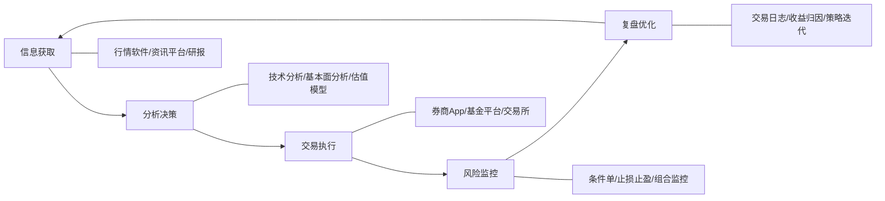
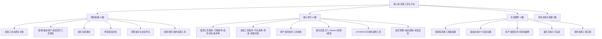
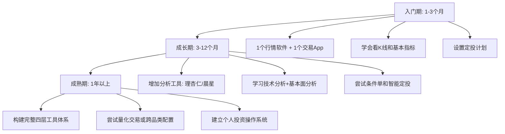

# 第14章 投资工具与平台——本章小结

## 本章定位与核心范式

投资工具不是投资本身，它是投资效率的放大器。本章围绕一个贯穿始终的核心范式展开——**信息→分析→执行→复盘**，覆盖了从股票、基金、房产到加密货币、量化交易、保险理财、银行理财、海外投资的全品类投资工具体系。48个文件从理论基础、核心技巧、实战案例、常见误区四个维度，构建了一套完整的投资工具知识架构。



无论你投资什么品种，工具的使用范式都是相通的。掌握了这个范式，面对任何新工具都能快速上手。本章要做的，就是帮你在主要投资领域中反复演练这个范式，直到它成为你的思维习惯。

### 范式的深层逻辑：为什么是这四个环节

这四个环节不是随意排列的，而是投资决策链条中不可跳过的四个阶段。跳过任何一个环节，投资就会出现系统性漏洞：

| 跳过的环节 | 后果 | 典型案例 |
|-----------|------|---------|
| 信息获取 | 基于片面信息做决策，成为"信息劣势方" | 听朋友推荐买股票，不知道公司已连续3季度亏损 |
| 分析决策 | 凭感觉买卖，无法区分运气和能力 | "这只股票涨了很多，应该还会涨"——典型趋势外推谬误 |
| 交易执行 | 计划完美但执行变形，被情绪左右 | 设好止损线但跌到位时犹豫没卖，最终亏损扩大3倍 |
| 复盘优化 | 重复犯同样的错误，投资水平原地踏步 | 每年都追热点板块，每年都高位站岗，却从不总结为什么 |

真正的投资高手和新手的区别，不在于他们用了多高级的工具，而在于他们是否把这四个环节形成了闭环。新手往往只做"信息获取→交易执行"的两步跳——看到消息就买，看到下跌就卖。高手则是完整的四步循环——每笔交易都有分析依据，每次执行都有纪律约束，每次结束后都有复盘总结。

### 范式在不同投资品种中的应用差异

虽然范式相同，但不同品种的侧重点差异很大：

| 投资品种 | 信息重点 | 分析重点 | 执行重点 | 复盘重点 |
|---------|---------|---------|---------|---------|
| 股票 | 财务数据、行业研报、资金流向 | 基本面估值+技术面择时 | 条件单、分批建仓/减仓 | 收益归因（选股vs择时vs仓位） |
| 基金 | 基金经理风格、持仓变动、费率 | 业绩归因、风险指标、同类排名 | 定投纪律、止盈策略 | 定投收益率vs一次性买入收益率 |
| 房产 | 区域规划、人口流入、成交数据 | 租金回报率、杠杆收益、持有成本 | 谈判策略、贷款方案选择 | 持有总收益（租金+增值-成本） |
| 加密货币 | 链上数据、项目进展、监管动态 | 链上指标、社区活跃度、技术路线 | 冷热钱包分离、小额测试 | 安全事件复盘、仓位管理评估 |
| 量化 | 历史数据、因子数据、另类数据 | 策略回测、参数优化、风险控制 | 模拟→小资金→逐步放量 | 策略衰减监控、因子有效性检验 |

## 全章知识架构总览



本章的四大板块遵循"知→学→练→悟"的递进逻辑：

- **理论基础篇（13篇）**：解决"是什么"和"为什么"的问题。先建立认知框架，理解每个工具背后的原理。当工具更新迭代、界面改版时，你不会手足无措——因为你理解的是底层逻辑，而不是操作步骤。
- **核心技巧篇（14篇）**：解决"怎么做"的问题。从理论到实操，手把手教你使用各类投资工具。每个小节都包含具体的操作步骤，目标是"看完就能上手"。
- **实战案例篇（12篇）**：解决"怎么用"的问题。通过真实场景演示，把理论和技巧串联成完整的操作流程。工具知识最大的特点是"看了不等于会了"——不要只"看"案例，要"做"案例。
- **章末总结与拓展（3篇）**：解决"怎么记住"和"怎么深入"的问题。常见误区帮你避坑，练习方法帮你巩固，深度拓展满足进阶读者的好奇心。

## 一、投资工具的本质认知

### 1.1 工具的四大功能维度

投资工具的本质是**信息获取、分析决策、交易执行、风险管理**四大功能的载体。理解这一点，才能避免两个极端：一是完全不用工具，凭感觉投资；二是过度依赖工具，把工具当决策者。

| 功能维度 | 工具能做的 | 工具不能做的 | 实际案例 |
|----------|-----------|-------------|---------|
| 信息获取 | 实时行情、财务数据、研报推送、链上数据 | 判断信息的真实权重和市场影响 | 同花顺能告诉你某公司PE是15倍，但不能告诉你这个PE是被一次性收益拉低的还是可持续的 |
| 分析决策 | 自动计算指标、可视化估值分位、因子回测 | 判断宏观政策拐点、区分因果和伪相关 | 理杏仁能展示历史PE分位，但不能预判"这次不一样"的政策变量 |
| 交易执行 | 一键下单、条件单自动触发、量化程序化执行 | 应对黑天鹅事件、判断管理层能力 | 条件单能在跌破10元时自动卖出，但无法在财务造假曝光的瞬间做出反应 |
| 风险管理 | 止损止盈、组合监控、回撤预警 | 控制你的情绪、替你做出正确决策 | 组合监控能告诉你回撤已达15%，但不能阻止你在恐慌中清仓 |

**关键认知**：工具是望远镜，不是方向盘——它让你看得更远，但往哪走还得自己决定。

这个认知在本章的学习中至关重要。很多人学完工具后产生一种幻觉："我掌握了理杏仁的所有功能，所以我能做好价值投资了"——这是典型的把工具能力等同于投资能力。理杏仁帮你看到了数据，但从数据到决策之间还有认知、判断、纪律三个环节，这些是工具无法替代的。

### 1.2 工具选择的三维框架

| 维度 | 核心原则 | 实操建议 | 常见反模式 |
|------|----------|----------|-----------|
| 适合原则 | 匹配自身投资风格、技术水平和预算 | 新手从同花顺+天天基金起步，不追大而全 | 新手买Wind终端，80%功能用不上，每年白花数万元 |
| 效率原则 | 功能满足需求即可，熟练比功能多更重要 | 吃透3个核心工具比浅尝10个工具更有价值 | 同时用5个行情软件，信息分散在5个平台，决策效率反而下降 |
| 成本原则 | 免费工具通常够用，付费要看性价比 | 免费版已覆盖90%需求，先用3个月再决定是否付费 | 还没搞清自己需要什么就买了年费会员，3个月后发现功能闲置 |

**适合原则的深层含义**：不是"好的工具"就适合你，而是"匹配你当前阶段的工具"才是好工具。一个刚入市的新手用Wind终端，就像一个刚拿驾照的人开F1赛车——车再好，你的能力驾驭不了，反而增加风险。Wind的信息密度和操作复杂度对新手来说是信息过载，会导致"分析瘫痪"——看了太多数据，反而不知道怎么决策。

**效率原则的量化验证**：以一个真实场景为例——投资者A同时用同花顺看盘、东方财富看资讯、通达信做技术分析、理杏仁看基本面、雪球看社区讨论。每次做决策需要在5个平台之间切换，平均耗时40分钟。投资者B只用同花顺一个平台（它也有资讯、技术分析、基本面数据功能），每次决策平均耗时15分钟。假设每周做3次决策，一年下来B比A节省：(40-15)×3×52 = 3,900分钟 = 65小时。这65小时用来学习投资知识，回报远高于多看几个平台的边际信息。

### 1.3 工具体系的分层构建

投资工具不是一个个孤立的软件，而是一个分层的体系。初学者从基础层开始，逐步向上构建：

| 层级 | 功能定位 | 典型工具 | 使用频率 | 建议学习投入 | 进入下一层的前提 |
|------|----------|----------|----------|-------------|----------------|
| 基础层 | 日常看盘、下单 | 券商App、同花顺、天天基金 | 每天 | 1-2天掌握核心功能 | 能独立完成一次完整的买卖操作 |
| 分析层 | 深度研究、估值分析 | 理杏仁、晨星网、通达信 | 每周 | 1-2周逐步学习 | 能看懂PE/PB分位、技术指标的含义 |
| 决策层 | 组合管理、风险监控 | Excel/专业组合工具 | 每月审视 | 1个月建立体系 | 持有3个以上品种，需要系统化管理 |
| 学习层 | 信息获取、社区交流 | 雪球、财联社、研报平台 | 持续 | 长期积累 | 形成自己的信息筛选习惯，不被信息流淹没 |

**黄金法则**：先深入精通一个工具，再考虑扩展。熟练度永远比功能数量更重要。一个投资者同时用5个平台各用20%功能，不如只用1个平台用到80%功能——后者效率更高、决策更清晰。

这个法则背后有一个心理学原理——**注意力残留效应**（Attention Residue）。当你从一个平台切换到另一个平台时，你的注意力不会立即跟着切换，而是有一部分"残留"在上一个平台的信息上。频繁切换平台会导致注意力碎片化，降低决策质量。专注使用一个工具，你的注意力是完整的，决策质量自然更高。

## 二、各品类投资工具体系速查

### 2.1 股票投资工具链

股票投资的工具链覆盖了从信息获取到交易执行的完整流程。核心工具分为行情软件、分析工具、交易工具三个层级：

**行情软件对比**：

| 软件 | 核心优势 | 适合人群 | 费用 | 隐藏功能亮点 |
|------|----------|----------|------|-------------|
| 同花顺 | 界面友好，功能全面，新手门槛最低 | 入门投资者 | 免费 | "问财"智能选股、条件单、模拟炒股 |
| 东方财富 | 资讯最全，社区活跃，旗下天天基金可直接买基金 | 信息驱动型投资者 | 免费 | 资金流向分析、龙虎榜数据、股吧舆情 |
| 通达信 | 技术分析功能最强，自定义指标灵活 | 技术派投资者 | 免费 | 公式选股、多周期联动、自编指标 |
| 雪球 | 深度内容多，社区质量高，适合学习 | 价值投资者 | 免费 | 组合追踪、模拟盘、深度长文 |

**选择建议**：不要同时装4个软件。根据你的投资风格选1-2个就够了。如果你是技术派，选通达信；如果你是价值派，选雪球+理杏仁；如果你不确定自己是什么派，先从同花顺开始——它的覆盖面最广，等你形成自己的投资风格后再切换到专业工具。

**分析工具矩阵**：

| 工具 | 功能定位 | 核心能力 | 最佳使用场景 |
|------|----------|----------|-------------|
| 理杏仁 | 基本面分析 | PE/PB历史分位、行业对比、财务数据可视化 | 判断一只股票当前估值是贵还是便宜 |
| 通达信 | 技术分析 | 自定义指标、公式选股、多周期联动 | 判断买卖时机，寻找技术面入场点 |
| 晨星网 | 基金/股票评级 | 全球权威评级体系、风险指标、持仓分析 | 评估基金质量，了解基金经理的投资风格 |

**技术指标组合推荐**：

| 组合方案 | 指标配置 | 适用场景 | 原理解释 |
|----------|----------|----------|---------|
| 趋势判断 | MA5+MA20+MA60 + MACD | 判断中长期趋势方向 | 短期均线上穿长期均线为多头排列，MACD柱状图由负转正确认趋势反转 |
| 超买超卖 | RSI(14) + KDJ | 判断短期买卖时机 | RSI>70为超买区（可能回调），RSI<30为超卖区（可能反弹），KDJ交叉确认信号 |
| 波动区间 | 布林带(20,2) + ATR | 判断价格波动范围 | 价格触及布林带上轨可能回落，触及下轨可能反弹，ATR衡量波动幅度 |
| 多指标共振 | 以上指标综合 | 提高信号可靠性到65%-75% | 当2-3个不同类型的指标同时发出信号时，信号可靠性显著提升 |

**关键提醒**：技术分析是概率工具，不是预测工具。单一指标胜率通常在50%-60%之间，多指标共振可提升到65%-75%，但仍无法达到100%。结合基本面分析使用，效果更佳。

为什么单一指标胜率只有50%-60%？因为市场是一个复杂适应系统，任何单一维度的指标都无法捕捉市场的全部信息。就像用温度计预测天气——温度是重要指标，但不考虑湿度、气压、风向，你的预测准确率就不会太高。多指标共振的本质是"多维度交叉验证"，从不同角度观察同一个市场，减少单一维度的盲区。

### 2.2 基金投资工具链

基金投资的工具链围绕"选基—买基—管基"三个环节展开：

**基金销售平台对比**：

| 平台 | 核心优势 | 费率折扣 | 适合人群 | 资金到账速度 |
|------|----------|----------|----------|-------------|
| 天天基金 | 基金种类最全，数据最丰富，筛选功能强大 | 1折起 | 基金研究者 | T+1确认 |
| 蚂蚁财富 | 与支付宝深度整合，操作最便捷 | 1折起 | 支付宝用户 | T+1确认 |
| 蛋卷基金 | 组合投资工具，支持一键跟投组合 | 1折起 | 组合投资者 | T+1确认 |
| 且慢 | 策略丰富，自动跟投，有"长钱账户"等策略 | 1折起 | 策略投资者 | T+1确认 |

**平台选择的决策逻辑**：如果你只是定投几只指数基金，天天基金和蚂蚁财富没有本质区别——费率都是1折起，基金品种都覆盖主流产品。选择的关键不是平台之间的微小差异，而是你是否能坚持使用一个平台。频繁切换平台会导致定投记录分散、操作习惯不连贯，反而增加管理成本。

**基金筛选五维模型**：

| 维度 | 关键指标 | 筛选标准 | 数据来源 | 容易踩的坑 |
|------|----------|----------|----------|-----------|
| 业绩 | 近3年/5年收益率 | 同类前30% | 天天基金/晨星 | 只看短期业绩（近1年），忽略长期稳定性 |
| 风险 | 最大回撤、夏普比率 | 回撤<同类平均，夏普>1 | 晨星网 | 忽视回撤指标，只追求高收益 |
| 基金经理 | 从业年限、管理规模 | 从业>5年，规模10-100亿 | 理杏仁 | 忽视基金经理是否更换，只看基金名称 |
| 规模 | 基金总规模 | 2-100亿 | 天天基金 | 买规模<1亿的迷你基金，面临清盘风险 |
| 费率 | 管理费+托管费+申购赎回费 | <同类平均 | 基金平台 | 只看申购费折扣，忽视管理费差异 |

**为什么规模太小或太大都不好**：

- **规模<2亿**：基金面临清盘风险。根据监管规定，基金连续60个工作日规模低于5000万元，基金公司有权召开持有人大会决定是否清盘。清盘期间资金被锁定，无法赎回，且清盘过程中的交易成本由持有人承担。
- **规模>100亿**：基金经理调仓困难。假设一只100亿的基金要卖出某只持仓5%的股票（5亿元），如果该股票日均成交额只有1亿元，需要5个交易日才能完成卖出，期间会持续压低股价，产生显著的市场冲击成本。这就是"大基金难掉头"的根本原因。

**智能定投策略对比**：

| 策略 | 原理 | 操作方式 | 优势 | 劣势 | 适用指数 |
|------|------|----------|------|------|---------|
| 均线偏离法 | 价格偏离均线时调整投入 | 低于250日均线多投，高于少投 | 跟踪趋势，操作简单 | 均线滞后，可能错过快速反弹 | 宽基指数（沪深300、中证500） |
| 估值法 | 估值高低决定投入多少 | PE分位<30%多投，>70%少投 | 基于价值，逻辑清晰 | 估值修复周期不确定，可能长期低估 | 估值数据充足的指数 |
| 目标市值法 | 设定每月目标持仓市值 | 低于目标补仓，高于目标减仓 | 仓位管理清晰 | 需要持续关注，手动操作较多 | 所有品种 |

**定投的核心收益来源**：很多人以为定投的收益来自"低买高卖"，其实定投的核心收益来源是**纪律性**和**平均成本效应**。定投通过固定时间、固定金额的机械操作，避免了"择时"这个大多数人都做不好的难题。数据显示，坚持定投3年以上的投资者，盈利概率超过80%——不是因为定投策略有多高明，而是因为大多数人根本没有能力在市场底部买入、顶部卖出，定投用纪律替代了判断。

### 2.3 房产投资工具

**核心分析框架**：

| 分析维度 | 关键指标 | 数据来源 | 决策意义 | 容易忽略的细节 |
|----------|----------|----------|---------|--------------|
| 区域分析 | 发展规划、人口流入、产业布局 | 政府规划网站、统计局 | 判断长期增值潜力 | 规划落地时间表（规划≠已落地，5年规划和1年规划差异巨大） |
| 价格分析 | 历史成交价、挂牌价、带看量 | 贝壳找房、链家 | 判断当前价格合理性 | 挂牌价≠成交价，关注实际成交价和成交周期 |
| 租金分析 | 租金回报率 | 租房平台、贝壳 | 判断投资回报 | 空置期（通常每年1-2个月空置）会拉低实际回报率 |
| 贷款分析 | 月供、利息总额、还款方式 | 房贷计算器 | 评估资金压力 | 提前还款违约金、利率调整周期（LPR每年重定价） |

**租金回报率评估标准**：

| 回报率区间 | 评级 | 投资建议 | 背后的计算逻辑 |
|------------|------|----------|---------------|
| 2%以下 | 低 | 不建议纯投资目的购买，自住另算 | 年租金2万÷房价100万=2%，甚至跑不赢银行理财 |
| 2%-4% | 一般 | 需要依赖房价增值才能获得合理回报 | 租金勉强覆盖月供利息部分，本金还需额外贴补 |
| 4%-6% | 较好 | 租金收入可观，可作为稳定现金流 | 租金能覆盖月供的大部分，现金流压力小 |
| 6%以上 | 高 | 优质投资标的，但需警惕高回报背后的风险 | 租金完全覆盖月供还有盈余，但需排查：是否凶宅？是否即将拆迁？物业是否极差？ |

**真实案例**：以一线城市一套总价500万、月租金8,000元的房产为例：

```text
年租金收入：8,000 × 12 = 96,000元
扣除空置期（1.5个月）：96,000 - 12,000 = 84,000元
扣除物业费/维修基金：84,000 - 12,000 = 72,000元
实际租金回报率：72,000 ÷ 5,000,000 = 1.44%
```

这个1.44%的实际回报率，比银行活期存款利率高不了多少。但如果同一时期房价从500万涨到600万，你的总投资回报率就是（72,000 + 1,000,000）÷ 5,000,000 = 21.44%。这就是为什么说"2%以下的租金回报率需要依赖房价增值"——纯靠租金，连资金成本都覆盖不了。

**房贷计算要点**：以100万贷款、30年期、利率4.2%为例——等额本息月供约4,890元，总利息约76万；等额本金首月约6,278元，逐月递减，总利息约63万。等额本金比等额本息少付约13万利息，但前期月供压力多出约1,400元。收入稳定选等额本息，收入较高且预期未来收入下降选等额本金。

**一个常被忽略的决策**：在利率下行周期中，等额本息可能比等额本金更划算。因为等额本息的前期还款中利息占比高、本金占比低，如果未来利率继续下降（LPR重定价后），你实际上是在用"更便宜的钱"还贷。而等额本金前期还的本金多，享受利率下降红利的空间更小。

### 2.4 加密货币工具体系

加密货币工具分为行情数据、交易执行、资产存储、链上分析四大类：

**工具配置清单**：

| 功能 | 工具 | 特点 | 安全等级 | 使用建议 |
|------|------|------|----------|---------|
| 行情 | CoinMarketCap / CoinGecko | 全球权威，数据覆盖广，API友好 | 高 | 日常查看价格和市值排名，CoinGecko的社区评分更可靠 |
| 交易（CEX） | Binance / OKX / Coinbase | 流动性好，交易对全，支持法币 | 中（需信任交易所） | 大额交易选流动性好的CEX，但不要在CEX存放超过10%的总资产 |
| 交易（DEX） | Uniswap / SushiSwap | 去中心化，自己掌控资产 | 高 | Gas费高的时候不要交易，等Gas费低谷期操作 |
| 钱包（热） | MetaMask | 最主流的以太坊钱包 | 中（联网风险） | 只放日常交易需要的少量资金，定期检查授权合约 |
| 钱包（冷） | Ledger / Trezor | 硬件钱包，离线存储 | 最高 | 买入后立即转移，不要拖延 |
| 链上分析 | Etherscan / Dune Analytics | 查交易/合约，自定义SQL查询 | 高 | 学会查看合约验证状态和持仓分布 |
| 聪明钱追踪 | Nansen / Glassnode | 链上指标、大户动向 | 高 | 关注大户钱包的异常动向，作为辅助决策参考 |

**CEX vs DEX的本质区别**：

| 对比维度 | 中心化交易所（CEX） | 去中心化交易所（DEX） |
|---------|-------------------|---------------------|
| 资产控制 | 交易所代为保管（"不是你的私钥，不是你的币"） | 自己通过钱包控制（完全自主） |
| 交易速度 | 毫秒级，链下撮合 | 秒到分钟级，取决于链上确认速度 |
| 手续费 | 固定费率（通常0.1%） | Gas费（随网络拥堵波动，可能很高） |
| 交易对 | 丰富，支持法币出入金 | 仅限链上代币，无法直接用法币 |
| 安全风险 | 交易所被黑、跑路风险 | 智能合约漏洞、钓鱼风险 |
| 适合场景 | 大额交易、频繁交易、法币兑换 | 长期持有、去中心化需求、新代币首发 |

**安全操作清单（五条铁律）**：

1. **资产分层存储**：日常交易用热钱包（<总资产10%），长期持有用冷钱包（>90%）。这条原则的本质是"最小权限原则"——只暴露你需要用到的资金，其余全部离线保护。历史上几乎所有重大资产被盗事件（Mt.Gox 85万BTC、FTX客户资产冻结），都是因为用户把全部资产存放在交易所。
2. **助记词管理**：手写在纸上，存放在至少2个物理位置（比如家里保险箱+银行保管箱），绝不拍照、截图或存储在联网设备上。助记词是你资产的唯一密钥，任何数字化存储方式都存在被黑客获取的风险。2022年有多起案例是用户将助记词存在手机备忘录中，手机被入侵后资产全部被盗。
3. **双重验证**：所有交易所账号必须开启Google Authenticator，不用短信验证。短信验证存在SIM卡劫持（SIM Swapping）风险——黑客通过社工手段让运营商将你的手机号转移到新的SIM卡上，从而接收你的验证码。Google Authenticator的验证码存储在本地设备上，不通过网络传输，安全性远高于短信。
4. **防钓鱼**：收藏交易所官方网址，不点击任何邮件/短信中的链接。钓鱼攻击是加密货币资产被盗最常见的原因之一。攻击者会伪造与官方几乎一模一样的网站（域名可能只差一个字母），诱导你输入账号密码或助记词。养成手动输入网址或使用书签的习惯，可以规避99%的钓鱼风险。
5. **小额测试**：每次转账先发小额测试（比如10美元等值），确认到账后再发大额。区块链转账是不可逆的——一旦发送到错误地址，没有任何"撤回"按钮。小额测试的成本（几美元的Gas费）远低于发错地址的损失（可能是全部资产）。

### 2.5 量化交易入门体系

量化交易是投资工具的高级形态，将交易策略程序化、系统化：


**量化策略分类**：

| 策略类型 | 原理 | 难度 | 适合人群 | 历史表现特点 |
|----------|------|------|----------|-------------|
| 趋势跟踪 | 跟随市场趋势，涨时买入跌时卖出 | 低 | 入门者 | 趋势行情中盈利丰厚，震荡行情中反复止损 |
| 均值回归 | 价格偏离均值后回归，偏离越大回归概率越高 | 中 | 有统计基础者 | 震荡行情中稳定盈利，趋势行情中可能大幅亏损 |
| 套利策略 | 利用不同市场/品种的价差获利 | 高 | 有编程和金融基础者 | 收益稳定但单次利润小，需要高频执行或大资金量 |
| 因子投资 | 基于价值、动量、质量等因子选股 | 中 | 有基本面分析经验者 | 长期有效但短期可能大幅偏离基准，需要耐心持有 |

**趋势跟踪为什么在震荡行情中亏损**：趋势跟踪的核心假设是"市场存在趋势"，但实际市场中约60%-70%的时间处于震荡状态，只有30%-40%的时间存在明显趋势。在震荡行情中，价格围绕均值上下波动，趋势跟踪策略会反复发出"买入→止损→卖出→止损"的信号，每次损失一点，积累起来就是可观的亏损。这就是为什么趋势跟踪策略的胜率通常只有30%-40%，但靠少数大赚的交易覆盖多次小亏——前提是你能在震荡期坚持执行策略，不因连续亏损而放弃。

**国内量化平台对比**：

| 平台 | 核心优势 | 编程语言 | 费用 | 数据质量 |
|------|----------|----------|------|---------|
| 聚宽（JoinQuant） | 社区活跃，教程丰富，数据全面 | Python | 免费基础版 | A股数据质量高，支持分钟级数据 |
| 米筐（RiceQuant） | 专业级回测引擎，机构用户多 | Python | 免费基础版 | 回测引擎精确度高，支持多策略并行 |
| 优矿（Uqer） | 通达信旗下，数据质量高 | Python | 免费基础版 | 与通达信生态互通，技术指标数据丰富 |

**量化交易的三个关键认知**：

1. **回测不等于实盘**：回测表现优异的策略，实盘可能因为滑点、流动性、市场结构变化而大打折扣。回测年化50%的策略，实盘能有20%已经很好。这种差距来自三个方面：(a) 回测假设你总能以收盘价成交，但实际交易中存在滑点（尤其是大额交易）；(b) 回测不考虑交易佣金和印花税的累积影响；(c) 市场结构在变化——一个在过去10年有效的策略，可能因为越来越多人使用而失效（策略拥挤效应）。
2. **没有永远有效的策略**：市场在变化，任何策略都有失效的时候。持续监控策略表现、及时调整是量化交易的日常工作。一个实用的方法是设定"策略衰减预警线"——当策略的夏普比率从回测时的2.0下降到1.0以下时，暂停策略并重新评估。
3. **量化不是"躺赚"**：量化交易是一种更系统化的投资方式，但仍然需要持续优化、风险管理和对市场的理解。那些宣传"量化躺赚"的课程或产品，大概率是在收割韭菜。真正的量化交易者花在监控和优化策略上的时间，可能比手动交易者花在看盘上的时间还多。

## 三、进阶投资工具

### 3.1 ETF投资

ETF（交易所交易基金）兼具基金的分散性和股票的交易灵活性，是本章重点推荐的入门投资品种之一：

| ETF类型 | 代表品种 | 特点 | 适合策略 | 选择要点 |
|---------|----------|------|----------|---------|
| 宽基ETF | 沪深300ETF、中证500ETF | 覆盖大盘/中盘，分散风险 | 长期定投 | 选规模大（>50亿）、费率低（<0.5%）的品种 |
| 行业ETF | 半导体ETF、新能源ETF | 聚焦特定行业，波动较大 | 行业轮动 | 需要对行业有判断能力，不适合新手 |
| 跨境ETF | 纳斯达克100ETF、恒生科技ETF | 跨境投资，分散地域风险 | 全球配置 | 注意汇率风险和交易时间差异 |
| 商品ETF | 黄金ETF、豆粕ETF | 跟踪商品价格，对冲通胀 | 资产配置 | 黄金ETF适合避险配置，豆粕ETF波动极大 |

**ETF定投实操要点**：选择流动性好（日成交额>1亿）的ETF，避免买卖价差过大侵蚀收益。定投频率选周投或月投差异不大，关键是坚持。

**ETF vs 普通开放式基金的核心区别**：

| 对比维度 | ETF | 普通开放式基金 |
|---------|-----|--------------|
| 交易方式 | 场内实时买卖，价格实时变动 | 场外申赎，按当日收盘净值成交 |
| 交易费用 | 佣金（约0.02%-0.05%） | 申购费（通常1%-1.5%，打折后0.1%-0.15%） |
| 管理费 | 较低（被动型0.1%-0.5%） | 主动型较高（0.5%-1.5%） |
| 透明度 | 每日公布持仓 | 季度公布持仓 |
| 流动性 | 取决于成交量 | 不存在流动性问题（直接申赎） |

**ETF套利机制**：ETF特有的一级二级市场价差套利机会——当二级市场价格高于净值时，在一级市场申购ETF份额然后在二级市场卖出；反之亦然。但这个操作门槛很高（通常需要50万以上资金），且需要实时监控价差和快速执行，适合进阶投资者和机构。

### 3.2 REITs投资

REITs（不动产投资信托基金）让普通投资者也能参与商业地产投资，门槛从几百万元降低到1000元：

| 特性 | 说明 | 投资者需要知道的 |
|------|------|----------------|
| 投资门槛 | 最低1000元起（公募REITs） | 比直接买商铺低了几个数量级 |
| 收益来源 | 租金分红 + 价格涨跌 | 分红是主要收益来源，价格涨跌是次要的 |
| 分红要求 | 强制分红不低于可供分配金额的90% | 这是REITs最大的吸引力——强制把利润分给投资者 |
| 风险特征 | 介于股票和债券之间，受利率和地产政策影响大 | 利率上升时REITs价格通常下跌（资金流向更高收益的固收产品） |
| 流动性 | 场内REITs可随时交易，但部分品种流动性较差 | 交易量小的REITs可能出现买卖价差大、难以成交的情况 |

**REITs的底层资产类型**：不同底层资产的REITs风险收益特征差异很大：

| 底层资产 | 代表品种 | 收益特点 | 风险特点 |
|---------|----------|---------|---------|
| 产业园 | 华安张江光大REIT | 租金收入稳定 | 受科技产业景气度影响 |
| 高速公路 | 浙商沪杭甬REIT | 收费收入可预测 | 受车流量和政策影响 |
| 仓储物流 | 中金普洛斯REIT | 长期租约，收入稳定 | 受电商发展和供应链变化影响 |
| 保障性住房 | 华夏北京保障房REIT | 政策支持，需求刚性 | 收益率相对较低 |

### 3.3 可转债投资

可转债是"下有保底、上不封顶"的投资品种（理论上）：

| 特性 | 说明 | 深层解释 |
|------|------|---------|
| 债券属性 | 持有到期可拿回本金+利息，有保底 | 前提是发行公司不违约——2022年以来已有多只可转债出现信用风险事件 |
| 股权属性 | 正股上涨时可转股获利，收益无上限 | 转股价在发行时确定，正股涨得越多，转股价值越高 |
| 关键指标 | 转股溢价率、到期收益率、正股基本面 | 转股溢价率低=股性强（跟随正股波动），到期收益率高=债性强（有保底） |
| 入门策略 | 低价可转债摊大饼（分散买入100-110元的可转债） | 分散买入10-20只低价可转债，靠概率取胜——大部分会涨到130元以上 |
| 风险提示 | 正股退市或违约时，可转债也会大幅亏损 | "下有保底"的前提是发行公司有偿付能力，这个前提在信用风险事件中可能不成立 |

**可转债的三个核心指标**：

- **转股溢价率** = (转债价格 ÷ 转股价值 - 1) × 100%。溢价率越低，可转债跟随正股上涨的能力越强。溢价率为负（折价）时，存在套利机会——买入转债→转股→卖出股票。
- **到期收益率** = 按当前价格买入并持有到期的年化收益率。到期收益率为正，意味着即使正股不涨，你持有到期也能获得正收益——这就是"下有保底"的数学基础。
- **正股基本面** = 发行公司的经营状况。可转债的信用风险最终取决于公司的偿债能力。远离财务状况恶化的公司发行的可转债，无论价格多低。

### 3.4 保险理财与银行理财

本章还覆盖了两类常被忽视但实际使用广泛的投资工具：

**保险理财**：年金险、增额终身寿险等产品兼具保障和理财功能。安全性最高（五星），但收益性和流动性最低。适合养老规划、教育金储备等长期资金。核心指标是IRR（内部收益率），优质增额终身寿IRR在2.5%-3.0%之间。

**IRR的真实含义**：IRR不是保险公司宣传的"保额增长率"。保额增长率3.5%≠实际收益率3.5%。IRR才是你实际拿到手的年化收益率——扣除所有费用后的真实回报。计算IRR时，把每年交的保费当作现金流流出，把退保能拿回的现金价值当作现金流流入，用Excel的IRR函数就能算出来。

**银行理财**：从保本型（已退出市场）到净值型产品的转型。R1-R5五个风险等级，R2（稳健型）是主流选择。注意：银行理财不再保本，净值波动是正常现象。

**R1-R5风险等级详解**：

| 风险等级 | 名称 | 投资范围 | 预期收益 | 适合人群 |
|---------|------|---------|---------|---------|
| R1 | 货币型 | 货币市场工具 | 1.5%-2.5% | 保守型，随时可能用钱 |
| R2 | 稳健型 | 债券为主，少量权益 | 2.5%-4.5% | 稳健型，1年以上投资期 |
| R3 | 平衡型 | 债券+权益均衡配置 | 3%-6% | 平衡型，能接受小幅波动 |
| R4 | 进取型 | 权益为主，少量债券 | 5%-10% | 进取型，能接受较大波动 |
| R5 | 激进型 | 高风险资产 | 不确定 | 激进型，能接受本金损失 |

**工具定位对比**：

| 维度 | 保险理财 | 银行理财 | 基金 | 股票 |
|------|----------|----------|------|------|
| 安全性 | ★★★★★ | ★★★★☆ | ★★★☆☆ | ★★☆☆☆ |
| 收益性 | ★★☆☆☆ | ★★★☆☆ | ★★★★☆ | ★★★★★ |
| 流动性 | ★☆☆☆☆ | ★★★☆☆ | ★★★★☆ | ★★★★★ |
| 保障功能 | ★★★★★ | ☆☆☆☆☆ | ☆☆☆☆☆ | ☆☆☆☆☆ |

**选择建议**：这四类工具不是"选哪个"的关系，而是"各占多少比例"的关系。一个合理的资产配置可能同时包含这四类——保险理财保障底线（养老、教育金），银行理财稳定收益（短期资金），基金增长财富（中期投资），股票追求高收益（长期投资+能承受波动的资金）。

## 四、工具选择与组合构建

### 4.1 工具选择评估框架

选择投资工具时，从五个维度综合评估：

| 评估维度 | 权重 | 评估标准 | 评估方法 | 一票否决条件 |
|----------|------|----------|----------|-------------|
| 功能满足度 | 30% | 是否覆盖核心投资需求 | 列出需求清单，逐项核对 | 核心功能缺失 |
| 易用性 | 25% | 上手难度、操作效率 | 试用1-2周，记录操作耗时 | 操作逻辑混乱，学习成本过高 |
| 费用 | 20% | 免费/付费、费率高低 | 对比同类工具费用 | 费用远超同类工具且无独特价值 |
| 数据质量 | 15% | 数据准确性、及时性 | 交叉验证关键数据 | 数据经常出错或延迟严重 |
| 安全性 | 10% | 资金安全、数据隐私 | 查看资质、用户评价 | 无合法牌照、无资金托管 |

**权重的调整逻辑**：上面的权重是通用参考，你需要根据自己的情况调整。比如投资加密货币时，安全性的权重应该从10%提升到30%以上——因为加密货币领域平台安全事件频发，一个不安全的平台可能让你损失全部资产。又比如做量化交易时，数据质量的权重应该提升到25%以上——因为错误的数据会导致错误的回测结果，进而导致实盘亏损。

### 4.2 不同投资者的工具组合

| 投资者类型 | 核心工具 | 辅助工具 | 年预算 | 学习周期 | 升级信号 |
|------------|----------|----------|--------|----------|---------|
| 股票新手 | 同花顺 + 券商App | 雪球 | 0元 | 1-2周 | 开始关注估值和基本面分析时 |
| 基金定投 | 天天基金/蚂蚁财富 | 晨星网 | 0元 | 3-5天 | 定投金额超过5万、持有超过3只基金时 |
| 价值投资 | 理杏仁 + 雪球 | 同花顺 | 0-500元/年 | 1-2月 | 需要行业对比和历史分位数据时 |
| 房产投资 | 贝壳找房 | 房贷计算器 | 0元 | 1-2周 | 无（房产低频交易，工具需求简单） |
| 加密货币 | CoinMarketCap + Binance | MetaMask + Ledger | 硬件钱包500-1000元 | 2-4周 | 持仓超过1万元时必须买硬件钱包 |
| 量化交易 | 聚宽 + Python | 同花顺 | 0元（平台免费） | 3-6月 | 需要更高频数据或实盘API时 |
| 海外投资 | 富途/老虎证券 | 理杏仁（港美股） | 0元 | 2-4周 | 需要更多美股数据和分析工具时 |
| 保守理财 | 银行App + 保险经纪 | Excel | 0元 | 1周 | 需要计算IRR或对比多款产品时 |

**升级信号的意义**：很多人要么过早升级工具（功能闲置），要么过晚升级工具（效率瓶颈）。上面列出的升级信号是实用的判断标准——当你的需求超出了当前工具的能力范围时，就是升级的最佳时机。不要因为"别人在用"而升级，要因为"我需要"而升级。

### 4.3 工具组合的进阶路径



**每个阶段的核心任务**：

- **入门期（1-3个月）**：目标不是"学会所有功能"，而是"能独立完成一次投资操作"。选1个行情软件+1个交易App，学会看K线图和3个基本技术指标（MA、MACD、RSI），设置一个基金定投计划。这个阶段最重要的是"用起来"，不要追求完美。
- **成长期（3-12个月）**：目标是"从会用到善用"。增加分析工具（理杏仁、晨星网），学习技术分析和基本面分析的系统方法，尝试条件单和智能定投。这个阶段最重要的是"形成自己的投资方法论"，而不是"学会更多工具"。
- **成熟期（1年以上）**：目标是"从善用到体系化"。构建完整的四层工具体系（基础层→分析层→决策层→学习层），尝试量化交易或跨品类资产配置，建立个人投资操作系统（包括投资清单、复盘模板、组合监控仪表盘）。这个阶段最重要的是"投资系统化"——让工具成为你投资系统的组件，而不是一个个孤立的软件。

## 五、费率——被低估的收益杀手

费率是本章理论基础篇的重要专题，也是很多投资者忽视的关键因素。每年1%-2%的费率差异，在复利作用下，30年后的资产差距可能超过30%。

### 5.1 交易成本全拆解

**显性成本**（你能直接看到的费用）：

| 成本类型 | 费率 | 征收方式 | 优化方法 |
|---------|------|---------|---------|
| 佣金 | 约0.02%-0.03%（互联网券商） | 买卖双向收取 | 选择互联网券商（华泰、东方财富等），协商更低佣金 |
| 印花税 | 0.1%（A股） | 仅卖出时征收 | 无法优化，但可以通过减少交易频率降低总支出 |
| 过户费/经手费/证管费 | 合计约0.002% | 双向收取 | 极低，无需优化 |

**隐性成本**（你看不到但实际在扣的钱）：

| 成本类型 | 影响程度 | 说明 | 如何量化 |
|---------|---------|------|---------|
| 买卖价差（Bid-Ask Spread） | 大盘股0.05%-0.1%，小盘股可达0.5% | 你买入的价格比中间价高，卖出的价格比中间价低 | 对比买入价和卖出价的中间值 |
| 市场冲击成本 | 大额交易时显著 | 你的大额买单推高了价格，大额卖单压低了价格 | 大额交易拆分成小单，观察价格变化 |
| 时机成本 | 视情况而定 | 从决定交易到实际成交之间的价格变化 | 使用限价单而非市价单 |

**持有成本（基金）**：

| 成本类型 | 主动基金 | 被动基金（指数/ETF） | 差异影响 |
|---------|---------|-------------------|---------|
| 管理费 | 0.5%-1.5%/年 | 0.1%-0.5%/年 | 100万投资30年，差0.5%管理费→终值差距约50万 |
| 托管费 | 0.1%-0.25%/年 | 0.05%-0.1%/年 | 差异较小但长期累积可观 |
| 隐性交易成本 | 高（高换手率） | 低（低换手率） | 主动基金年换手率200%-300%意味着额外0.2%-0.6%的成本 |

### 5.2 降低交易成本的五条策略

1. **选择低佣金券商**：互联网券商佣金远低于传统券商。以每笔交易10万元为例——佣金万三（0.03%）和万八（0.08%）的差异是每笔50元。如果你每月交易10次，一年下来就是6,000元。这笔钱足够买一台新手机了。
2. **减少交易频率**：交易频率越高的投资者，平均收益越低。这不是观点，是有充分学术研究支撑的结论——Barber和Odean在2000年的经典论文《Trading Is Hazardous to Your Wealth》中分析了66,465个家庭账户，发现交易最频繁的20%投资者年化收益比最不活跃的20%低7个百分点。原因很简单：每次交易都有成本，频繁交易让这些小成本累积成巨大的收益侵蚀。
3. **使用限价单**：控制成交价格，避免市价单滑点。市价单保证成交但不保证价格，限价单保证价格但不保证成交。对于非紧急交易，限价单几乎总是更好的选择。
4. **选择低成本基金**：指数基金和ETF费率远低于主动管理基金。以管理费为例——沪深300指数基金管理费0.5%，而同类主动基金管理费1.5%，差1%。100万投资30年、年化8%的条件下，这个1%的差异导致终值差距约180万。而且数据显示，80%以上的主动基金长期跑不赢指数——你付了更高的费用，却得到了更差的回报。
5. **优化交易时机**：避开开盘收盘高峰期，选择流动性好的时段。开盘前30分钟和收盘前30分钟的买卖价差通常最大，因为此时市场情绪最集中、订单最拥挤。上午10:00-11:00和下午1:30-2:30通常是流动性最好的时段。

## 六、投资平台的安全性评估

安全性是工具选择的底线，不是加分项。本章深度拓展篇从监管合规、资金安全、技术安全、运营安全四个维度构建了评估框架：

### 6.1 安全性评估四维度

| 维度 | 关键检查点 | 验证方法 | 红线（发现即排除） |
|------|-----------|----------|-----------------|
| 监管合规 | 是否持有合法金融牌照、是否受权威监管 | 查询监管机构官网（证监会、银保监会、FCA等） | 无任何监管牌照、注册地在避税天堂 |
| 资金安全 | 客户资金是否隔离存放、是否有银行托管 | 查看平台公告和资质、查看是否有银行存管 | 资金无隔离存放、无银行托管 |
| 技术安全 | 数据加密、多因素认证、安全审计 | 查看安全白皮书、ISO认证、HTTPS证书 | 不支持2FA、无HTTPS |
| 运营安全 | 内控制度、风险管理系统、应急预案 | 试用体验、用户评价、历史安全事件 | 曾发生重大安全事故且无合理解释 |

### 6.2 常见安全风险与应对

| 风险类型 | 表现 | 应对措施 | 损失评估 |
|----------|------|----------|---------|
| 平台跑路 | 不合规平台卷款跑路 | 选择有监管、有牌照的平台 | 可能损失全部资产，且追回概率极低 |
| 黑客攻击 | 资金被盗、数据泄露 | 开启2FA、使用冷钱包、定期更换密码 | 取决于资产存放方式，冷钱包资产不受影响 |
| 系统故障 | 交易无法执行、数据异常 | 选择技术实力强的平台，备用方案 | 通常可恢复，但可能错过交易时机 |
| 合规风险 | 平台被监管处罚 | 关注监管动态，分散平台使用 | 资金通常安全，但可能需要转移平台 |

**一个实用的安全检查清单**（适用于任何投资平台）：

```text
□ 是否持有合法金融牌照？（查询监管机构官网）
□ 客户资金是否有银行存管/托管？
□ 是否支持双因素认证（2FA）？
□ 网站是否使用HTTPS？
□ 是否有历史安全事故记录？
□ 网上用户评价如何？（搜索"平台名+跑路/安全/出金"）
□ 出金流程是否顺畅？（先小额测试出金）
□ 客服响应是否及时？
```

## 七、常见误区与纠正

本章常见误区篇系统梳理了投资者在工具使用中最常踩的十个坑，从现象→心理根源→真实后果→正确认知→实操纠正五个层次展开。以下是核心误区速查：

| 误区 | 典型表现 | 心理根源 | 真实后果 | 纠正方法 |
|------|----------|----------|---------|----------|
| 过度依赖工具 | "MACD金叉了，肯定要涨" | 权威偏见、自动化偏见 | 在震荡行情中反复止损，累计亏损超过20% | 建立"工具建议→人工复核→独立决策"三步流程 |
| 工具越多越好 | 同时装5个行情软件 | 功能焦虑 | 注意力碎片化，决策效率下降 | 精简到3-5个核心工具，吃透功能 |
| 免费不如付费 | 盲目购买付费工具/数据 | 价格-质量偏见 | 花了几千元，功能闲置率超过80% | 先用免费工具3个月，有明确需求再付费 |
| 依赖单一指标 | 只看MACD或只看PE做决策 | 确认偏误 | 错失重要信号（基本面恶化但技术面正常） | 多指标交叉验证，降低误判概率 |
| 忽视学习成本 | 买了工具不会用，功能闲置 | 乐观偏见 | 浪费金钱和时间 | 新工具投入1-2周学习时间，设试用期 |
| 频繁更换工具 | 不断换工具、调参数 | 行动偏见 | 每个工具都停留在浅层，从未精通 | 工具稳定使用3个月以上再评估 |
| 忽视交易成本 | 频繁交易，忽略费率影响 | 短视偏见 | 年化收益被费率侵蚀1%-3% | 计算TCO（总拥有成本），减少交易频率 |
| 忽视安全 | 助记词拍照存手机、不用2FA | 侥幸心理 | 资产被盗且无法追回 | 严格执行安全操作清单 |
| 回测迷信 | 回测年化50%，直接实盘 | 幸存者偏差 | 实盘亏损，回测利润完全消失 | 回测→模拟→小资金实盘，三步验证 |
| 盲目追求量化 | 不懂编程也要搞量化 | 技术崇拜 | 被"量化课程"收割，策略实盘亏损 | 先掌握基本面分析，再考虑量化 |

**误区背后的心理学解释**：

这十个误区不是随机出现的，它们根植于人类的认知偏差。了解这些偏差，才能从根本上避免犯错：

- **确认偏误（Confirmation Bias）**：人类倾向于寻找支持自己已有观点的证据，忽略反面证据。在投资中表现为"只看支持买入的指标，忽略提示卖出的信号"。纠正方法：每次做决策前，强迫自己列出至少3个反对理由。
- **沉没成本谬误（Sunk Cost Fallacy）**：已经投入的时间和金钱会影响你对未来的判断。在工具使用中表现为"已经花了3个月学习这个工具，即使不好用也舍不得换"。纠正方法：只考虑"未来的收益和成本"，不考虑"已经投入的成本"。
- **行动偏见（Action Bias）**：人类在不确定环境中倾向于采取行动，即使不行动可能是更好的选择。在投资中表现为"市场跌了必须做点什么"、"工具不好用必须换一个"。纠正方法：在行动前问自己"如果不做任何改变，会发生什么？"
- **锚定效应（Anchoring Effect）**：第一个接触到的数字会成为后续判断的"锚点"。在工具评估中表现为"这个工具年费2000元，比另一个贵1000元，所以不好"——但没有考虑工具带来的效率提升是否值这1000元。纠正方法：评估工具时先列出自己的需求清单，再比较价格，而不是先看价格再找理由。

## 八、信息获取体系

投资决策的质量取决于信息的质量。构建系统化的信息获取渠道至关重要：

| 信息类型 | 推荐来源 | 获取频率 | 用途 | 筛选标准 |
|----------|----------|----------|------|---------|
| 宏观经济 | 国家统计局、央行网站 | 月度 | 判断经济周期 | 关注GDP、CPI、PMI、社融四大指标 |
| 行业动态 | 行业研报（慧博、萝卜投研） | 周度 | 判断行业趋势 | 优先看头部券商的深度研报 |
| 公司公告 | 巨潮资讯、券商App | 实时 | 跟踪持仓公司 | 设置持仓公司的公告推送 |
| 市场情绪 | 雪球、东方财富股吧 | 日度 | 感知市场温度 | 当市场情绪极度一致时（全部看多或全部看空），往往是反转信号 |
| 专业分析 | 知名投资人访谈、深度研报 | 月度 | 学习投资思维 | 关注投资逻辑而非结论 |
| 海外市场 | 富途牛牛、华尔街见闻 | 日度 | 全球视野 | 关注美联储政策和全球风险事件 |

**信息过载的应对策略**：不是信息越多越好。建议每天固定30分钟浏览核心信息源，不刷实时新闻流。关注3-5个高质量信息源，比关注20个低质量源更有效。建立"信息筛选漏斗"：广度浏览→快速过滤→深度阅读→形成决策。

**信息筛选漏斗的实操方法**：

1. **广度浏览（5分钟）**：快速扫描当天的标题新闻和公告，只看标题不看正文。目的不是获取信息，而是判断"今天有没有需要深入了解的内容"。
2. **快速过滤（10分钟）**：对筛选出的2-3条重要信息，快速阅读摘要或导语，判断是否与自己的持仓或投资计划相关。
3. **深度阅读（10分钟）**：对真正相关的信息，仔细阅读全文，提取关键数据和观点。
4. **形成决策（5分钟）**：将信息转化为投资决策——是否需要调整持仓？是否需要进一步研究？是否只是噪音？

**关键原则**：信息获取的目的是"减少不确定性"，而不是"消除不确定性"。即使你获取了所有公开信息，市场仍然存在不可预测的部分。不要追求"信息完备"，而是追求"信息足够做出决策"。

## 九、关键指标速查表

| 指标 | 计算公式 | 含义 | 参考区间 | 常见误用 |
|------|----------|------|----------|---------|
| PE分位 | 当前PE在历史中的百分位 | 估值高低 | <30%低估，>70%高估 | 不同行业PE差异巨大，不能跨行业比较 |
| PB分位 | 当前PB在历史中的百分位 | 资产估值 | <30%低估，>70%高估 | 轻资产公司PB意义不大 |
| ROE | 净利润/净资产×100% | 盈利能力 | >15%为优 | 高杠杆公司ROE虚高，需看ROA |
| 最大回撤 | 区间内最大跌幅 | 风险大小 | 越小越好，同类对比 | 不同时间区间回撤不可比 |
| 夏普比率 | (收益率-无风险利率)/波动率 | 风险调整后收益 | >1为佳，>2为优 | 单一时期夏普比率可能失真，需看3年以上 |
| 租金回报率 | 年租金/房价×100% | 房产投资回报 | 2%-4%一般，4%-6%较好 | 需扣除空置期和维护成本才是真实回报率 |
| 转股溢价率 | (转债价/转股价值-1)×100% | 可转债股性 | 越低股性越强 | 负溢价不等于"肯定涨"，需考虑正股风险 |
| 到期收益率 | 持有到期的年化收益率 | 可转债债性 | 正数有保底 | 前提是公司不违约 |
| IRR | 内部收益率 | 保险/年金真实收益 | 优质增额寿2.5%-3.0% | 保额增长率≠IRR，必须用现金流计算 |
| TCO | 显性+隐性+持有期成本率 | 投资总成本 | 越低越好 | 大多数人只看显性成本，忽略隐性成本 |

## 十、行动清单

### 立即行动（今天）

- [ ] 根据自己的投资类型，选定1个行情软件（同花顺或东方财富）
- [ ] 根据自己的投资品种，选定1个交易/投资平台（券商App或天天基金）
- [ ] 花30分钟熟悉选定工具的基本界面和核心功能
- [ ] 检查你现有投资平台的安全设置：是否开启2FA？密码是否足够强？

### 短期行动（本周）

- [ ] 学会查看K线图和3个基本技术指标（MA、MACD、RSI）
- [ ] 学会使用基金筛选功能，按"五维模型"筛选3-5只候选基金
- [ ] 设置1个基金定投计划（金额不重要，重要的是开始）
- [ ] 完成一次安全检查清单（参考第六节的8项检查）

### 中期行动（本月）

- [ ] 学会使用条件单，为持仓设置止损/止盈条件单
- [ ] 学会查看财务数据（PE、PB、ROE），理解估值分位的含义
- [ ] 建立个人资产总表（Excel），记录所有投资品种的持仓信息
- [ ] 构建个人信息获取体系，收藏3-5个核心信息源
- [ ] 计算一次自己的投资TCO（总交易成本），识别隐性成本

### 长期行动（持续）

- [ ] 每月做一次资产配置检视，检查持仓比例是否偏离目标
- [ ] 每季度评估一次工具组合，是否需要增加或更换工具
- [ ] 持续学习新工具和新策略，但不频繁更换已验证的工具
- [ ] 如果对量化交易感兴趣，开始学习Python基础（推荐聚宽免费教程）
- [ ] 每半年回顾一次费率结构，确认仍在使用最优方案

## 十一、自我评估：你掌握了本章的多少？

完成本章学习后，用下面这个清单评估自己的掌握程度。每个问题回答"是"得1分：

**基础认知（满分3分）**：
- [ ] 你能说出投资工具的四大功能维度吗？
- [ ] 你能解释"工具是放大器，不是印钞机"的含义吗？
- [ ] 你能描述工具体系的四层结构吗？

**工具选择（满分3分）**：
- [ ] 你能说出选择工具的三维框架吗？
- [ ] 你能根据自己的投资类型推荐2-3个核心工具吗？
- [ ] 你能解释为什么"先精通一个工具再扩展"比"同时用多个工具"更好吗？

**费率意识（满分2分）**：
- [ ] 你能说出A股交易的显性成本有哪些吗？
- [ ] 你能用具体数字说明费率差异对长期收益的影响吗？

**安全意识（满分2分）**：
- [ ] 你能说出加密货币安全操作的五条铁律吗？
- [ ] 你能用8项检查清单评估一个投资平台的安全性吗？

**评分标准**：
- 8-10分：优秀。你已经建立了系统的投资工具认知框架，可以进入实操阶段。
- 5-7分：良好。核心概念已经掌握，建议回顾薄弱环节后再进入实操。
- 3-4分：及格。基本概念有了，但理解不够深入，建议重读理论基础篇。
- 0-2分：需要加强。建议从理论基础§1开始重新学习。

## 十二、推荐学习资源

### 书籍

| 书名 | 作者 | 适用方向 | 推荐理由 | 阅读建议 |
|------|------|----------|----------|---------|
| 《聪明的投资者》 | 本杰明·格雷厄姆 | 价值投资 | 投资圣经，建立正确的投资思维 | 先读第8章和第20章（安全边际和市场先生），再通读全书 |
| 《指数基金投资指南》 | 银行螺丝钉 | 基金定投 | 国内指数基金定投入门最佳读物 | 配合天天基金的实际操作一起学习 |
| 《量化投资策略》 | 理查德·托托里罗 | 量化交易 | 量化投资入门，策略框架清晰 | 需要基本的统计知识 |
| 《Python金融大数据分析》 | 伊夫·希尔皮斯科 | 量化编程 | Python金融分析实战指南 | 建议先学完Python基础再读 |
| 《基金投资的16堂课》 | 肖璟 | 基金投资 | 基金投资系统入门 | 适合纯新手，语言通俗易懂 |

### 在线平台

| 平台 | 网址 | 功能定位 | 推荐指数 |
|------|------|----------|---------|
| 同花顺 | 10jqka.com.cn | 行情看盘 | ★★★★★ |
| 东方财富 | eastmoney.com | 行情+资讯+基金 | ★★★★★ |
| 理杏仁 | lixinger.com | 基本面分析 | ★★★★☆ |
| 晨星网 | cn.morningstar.com | 基金评级分析 | ★★★★☆ |
| 聚宽 | joinquant.com | 量化交易学习 | ★★★★☆ |
| 贝壳找房 | ke.com | 房产数据分析 | ★★★★☆ |
| CoinMarketCap | coinmarketcap.com | 加密货币行情 | ★★★★☆ |
| 集思录 | jisilu.cn | 可转债/分级基金数据 | ★★★★☆ |
| 中国理财网 | chinawealth.com.cn | 银行理财产品查询 | ★★★☆☆ |

## 十三、常见问题解答

### Q1：工具太多，不知道从哪个开始？

**A**：从你当前最需要的投资品种开始。股票投资者从同花顺+券商App起步；基金投资者从天天基金或蚂蚁财富起步；什么都不确定的，先从同花顺开始——它覆盖了股票、基金、期货等多种品种。记住：一个用熟的工具胜过十个浅尝辄止的工具。

**更具体的建议**：如果你是完全的新手，我建议你第一周只做三件事——(1) 下载同花顺，学会看K线图；(2) 在券商App开户，学会买卖操作；(3) 在天天基金设置一个100元/周的定投计划。不需要更多了。第一周的目标是"用起来"，不是"学全面"。

### Q2：免费工具真的够用吗？什么时候需要付费？

**A**：对90%的个人投资者，免费工具完全够用。需要付费的三个场景：(1) 需要深度财务数据对比时，考虑理杏仁付费版（年费约300元，提供详细的财务数据对比和历史分位分析）；(2) 需要专业级技术分析时，考虑通达信付费版（提供Level-2行情和更多自定义指标）；(3) 量化交易需要更高质量数据时，考虑付费数据源（分钟级tick数据、基本面因子数据）。

**判断标准**：如果你使用免费版3个月后，经常遇到"想看某个数据但免费版没有"的情况，那就值得付费。如果只是偶尔觉得"付费版好像更好"但说不出具体需求，那免费版就是你的最佳选择。

### Q3：量化交易需要什么基础？普通人能学会吗？

**A**：需要两方面基础：(1) Python编程基础（2-4周可入门）；(2) 基本的金融知识和统计概念。普通人完全可以学会，但需要3-6个月的持续学习。建议路径：聚宽平台免费教程→跟教程写第一个策略→历史数据回测→模拟交易验证→小资金实盘。

**关键提醒**：不要期望量化交易能"躺赚"，它是一种更系统化的投资方式，但仍需要持续优化和风险管理。那些宣传"学了量化就能财务自由"的课程，99%是在收割焦虑。量化交易的真正价值不是"自动赚钱"，而是"用数据和逻辑替代情绪和直觉"。

### Q4：加密货币工具安全吗？如何防止资产被盗？

**A**：工具本身是安全的，风险在于使用方式。核心安全原则：大额资产用冷钱包，助记词手写存2个物理位置，所有账号开Google Authenticator（不用短信验证），收藏官方网址不点链接，转账先小额测试。做到这5点，资产安全性可以提升到99%以上。

**真实案例**：2022年FTX交易所暴雷，约80亿美元客户资产被挪用。在FTX存放大量资产的用户遭受了巨大损失。而使用冷钱包自行保管资产的用户，完全不受影响。这个案例的教训很清楚——"不是你的私钥，不是你的币"（Not your keys, not your coins）。如果你在加密货币领域的投资超过1万元，硬件钱包（Ledger或Trezor，约500-1000元）是必须的投入。

### Q5：不同投资品种的工具可以通用吗？

**A**：部分可以，但不建议完全通用。同花顺和东方财富覆盖了股票、基金、期货等多个品种，可以作为统一的行情入口。但分析工具通常是专用的：股票分析用理杏仁，基金分析用晨星网，房产分析用贝壳找房，加密货币分析用CoinMarketCap。交易工具更是严格分离。建议构建"统一行情入口+专用分析工具+分离交易平台"的工具体系。

**具体工具体系示例**：

```text
统一行情入口：同花顺（覆盖股票、基金、ETF、可转债、期货）
专用分析工具：
  ├── 股票：理杏仁（基本面分析）
  ├── 基金：晨星网（基金评级和筛选）
  ├── 房产：贝壳找房+房贷计算器
  ├── 加密货币：CoinMarketCap + Etherscan
  └── 可转债：集思录
分离交易平台：
  ├── A股：券商App（华泰/中信/招商）
  ├── 基金：天天基金/蚂蚁财富
  ├── 加密货币：Binance + MetaMask + Ledger
  └── 海外：富途/老虎证券
```

### Q6：费率差异真的有那么大影响吗？

**A**：以100万投资、年化收益8%、投资30年为例：总费率1%时，终值约812万；总费率2%时，终值约574万；总费率3%时，终值约432万。1%和3%的费率差异，30年后资产差距达380万。费率优化是投资中最确定、最可控的收益来源。

**为什么费率是"最确定"的收益来源**：市场涨跌不可预测，择时能力因人而异，选股能力难以验证——但费率节省是100%确定的。从万八佣金换成万三佣金，每笔交易节省0.05%，这是白纸黑字写在交割单上的收益，没有不确定性。在所有投资优化手段中，费率优化的风险收益比是最高的——零风险、确定收益。

### Q7：海外投资需要什么工具？

**A**：核心工具包括：(1) 港股通/沪港通（通过A股券商直接操作，最便捷，不需要额外开户）；(2) QDII基金（通过基金公司间接投资海外，适合不想开户的投资者）；(3) 海外券商（富途/老虎/雪盈，投资标的最丰富但需要境外银行卡）。

**需注意的三个风险**：(a) 汇率风险——人民币升值会侵蚀你的海外投资收益，反之亦然。可以用部分对冲或分散投资来降低汇率风险。(b) 时区差异——美股交易时间是北京时间晚上9:30到凌晨4:00，需要适应夜间交易。(c) 税务处理——不同国家的股息税和资本利得税差异大。美股股息预扣10%（中美税收协定税率），港股无资本利得税但有股息税。

## 本章核心洞见

> **洞见一**：工具是投资的基础设施，不是投资的核心竞争力。真正的竞争力来自投资认知、风险管理和情绪控制。工具能放大你的能力，但不能替代你的判断。选择适合自己的工具，熟练掌握，持续迭代——这才是工具使用的正确姿势。

> **洞见二**：不要在工具选择上花太多时间。很多人花几周比较各种行情软件，却不愿意花几小时学习基本面分析。工具的差异远小于使用者能力的差异。先用起来，在使用中优化，比在选择中纠结更有效。

> **洞见三**：费率是唯一确定的收益来源。市场涨跌不可预测，但费率节省是100%确定的。在同等条件下，选择费率更低的工具和平台，是最容易被忽视但最有效的投资优化。

> **洞见四**：安全是工具选择的底线。再好用的工具，如果安全不过关，就不应该使用。特别是在加密货币和海外投资领域，安全性评估应该排在所有其他维度之前。

> **洞见五**：投资工具的学习路径应该是"先用后学"，而不是"先学后用"。很多人试图把所有理论知识学完再开始实操，结果永远停留在学习阶段。正确的方法是：先用起来（哪怕只用20%的功能），在使用中发现问题，带着问题去学习（针对性地掌握你需要的功能），然后再用——形成"用→学→用"的正向循环。

## 下一章预告

在下一章中，我们将深入探讨**法律与合规**，包括：

1. **创业法律基础**：公司注册、合同管理、知识产权保护
2. **投资法律风险**：证券法规、房产法规、加密货币监管
3. **税务合规**：个人所得税、投资收益税务处理、跨境税务
4. **劳动法与副业**：竞业限制、知识产权归属、副业合规性
5. **隐私与数据保护**：个人信息保护法、数据安全、网络安全

投资工具是搞钱的手段，法律合规是搞钱的底线。掌握了工具，下一步是确保所有操作都在法律框架内进行——这才是可持续的搞钱之道。
