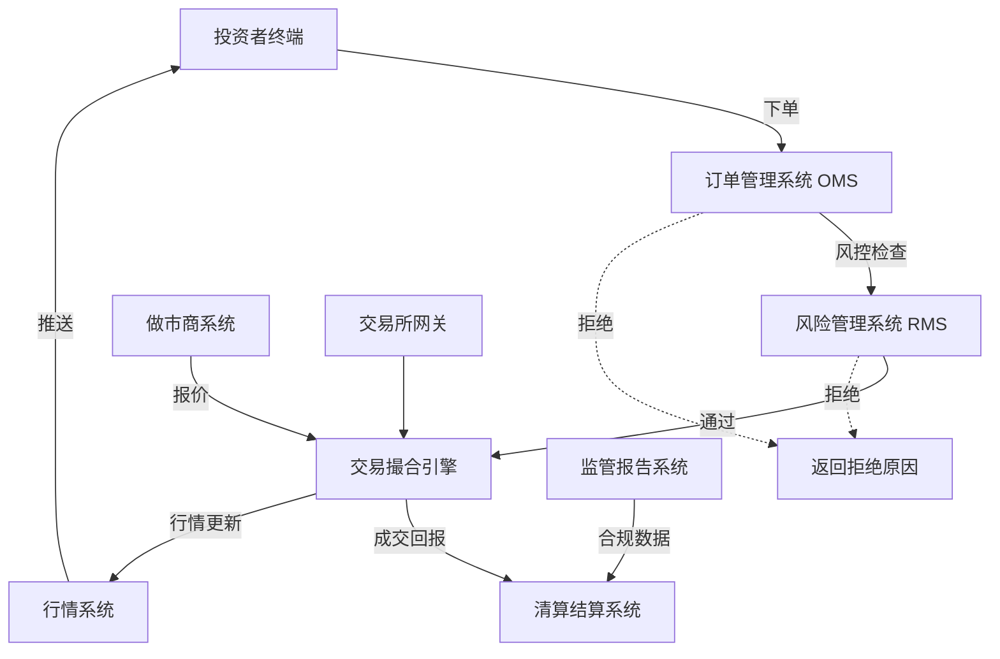
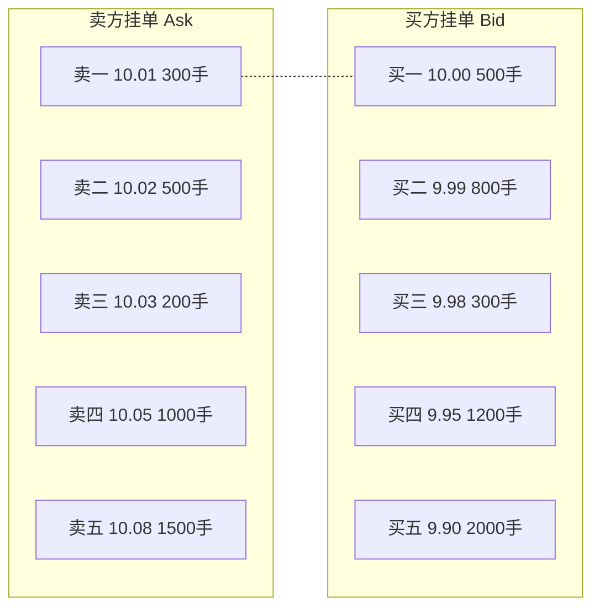
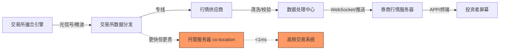
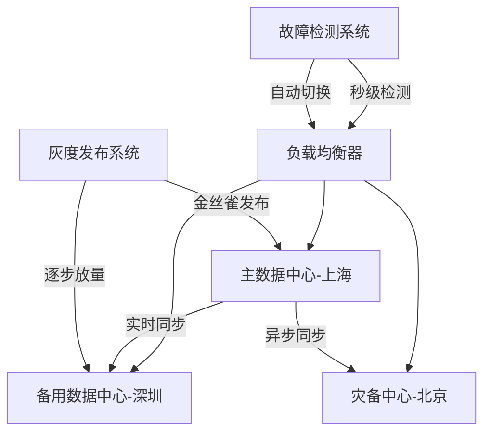
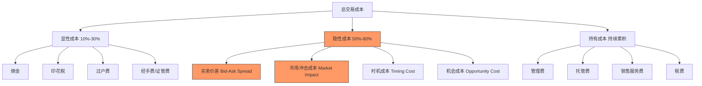
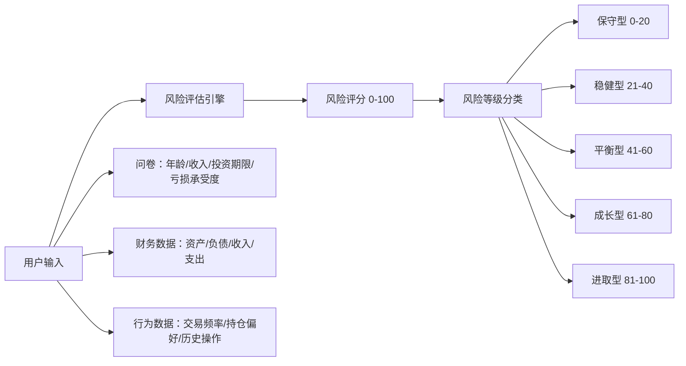
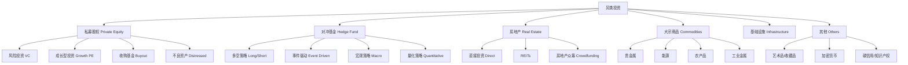
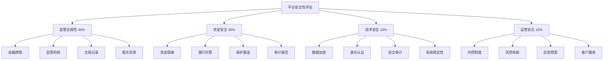
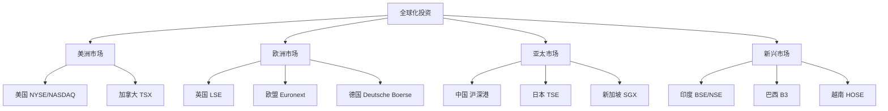

# 第14章 深度拓展：投资工具与平台的进阶知识

> "知其然，更要知其所以然。"——投资工具的深度认知，决定了你在市场中的生存能力。

本章是第14章的"天花板"内容，面向已经掌握投资工具基础用法、想要理解底层原理和进阶策略的读者。我们将深入七个核心领域：交易系统的内部机制与订单簿原理、交易成本的完整图谱与量化拆解、智能投顾的算法黑箱与评估体系、另类投资的参与路径与风险定价、平台安全的评估方法与实战清单、全球化投资的渠道与工具、以及投资科技的未来趋势与应对策略。

学习建议：本章内容密度较高，建议分模块阅读。每个模块独立成篇，可以根据你的兴趣和需求选择性深入。如果你是量化交易者，重点关注第一、二章；如果你是长期投资者，第三、四、六章更值得精读；如果你关心资金安全，第五章是必读内容。

***

## 一、投资平台的技术架构

### 1.1 为什么投资者需要理解技术架构

大多数投资者认为"技术架构是程序员的事"，但这种认知会让你在关键时刻付出代价。理解交易平台的技术架构，本质上是在理解你的交易指令如何被执行、你的资金如何被保护、你的数据如何被处理。

**三个真实场景说明为什么架构知识至关重要：**

**场景一：延迟即损失。** 2015年股灾期间，部分券商系统响应延迟从平时的50毫秒飙升到数秒甚至宕机。在这几秒钟内，股价可能已经变动了数个百分点。一个持有100万元仓位的投资者，如果因为系统延迟导致止损单晚执行了3秒，可能多损失2-5万元。高频交易领域更是如此——Citadel Securities的做市系统延迟低于10微秒，而普通券商的延迟在50-200毫秒之间，差距达到5000-20000倍。

**场景二：系统故障=真实损失。** 2020年3月美股多次熔断期间，Robinhood系统多次宕机，用户无法交易。美国金融业监管局（FINRA）的数据显示，仅2020年3月2日一天，Robinhood的系统故障就影响了约430万活跃用户的交易能力。Robinhood最终向受影响用户支付了超过7000万美元的赔偿。

**场景三：数据质量影响决策精度。** 行情数据的延迟、缺失、错误都会影响技术分析和决策。Level 1行情延迟3-5秒，而Level 2行情是实时推送。如果你用Level 1数据做日内交易策略回测，回测结果与实际交易的偏差可能达到10%-30%——这意味着你的策略在实盘中可能完全失效。

### 1.2 交易平台的核心系统

现代投资交易平台是一个复杂的分布式系统，由五个核心子系统协同工作：



#### 1.2.1 订单管理系统（OMS）

OMS是交易平台的"入口"，负责接收、验证、路由和管理客户订单。一个高性能OMS每秒需要处理数十万甚至上百万笔订单，同时保证每笔订单的精确性和可追溯性。

**OMS的核心职责：**

- **订单验证**：检查账户余额、持仓、交易权限、委托数量是否符合交易所规则（如A股最低100股、科创板最低200股等）。验证失败的订单会被立即拒绝并返回明确的错误码。
- **订单路由**：将订单发送到正确的交易所或撮合引擎。在美股市场，由于存在多个交易所（NYSE、NASDAQ、BATS等），智能订单路由（SOR）会根据价格、流动性和延迟选择最优执行场所。
- **订单状态管理**：跟踪订单的完整生命周期——从"待报"到"已报"，再到"部成"（部分成交）或"已成"（全部成交），以及"已撤"（已撤销）状态。每个状态变更都会记录精确到微秒的时间戳。
- **订单类型处理**：支持市价单、限价单、止损单、止盈单、冰山单、TWAP（时间加权平均价格）、VWAP（成交量加权平均价格）等多种订单类型。

**高性能OMS的关键指标：**

| 指标 | 含义 | 优秀标准 | 一般标准 | 你的券商大概率是多少 |
|------|------|----------|----------|---------------------|
| 订单延迟 | 从接收订单到返回确认的时间 | <1ms | <10ms | 50-200ms |
| 吞吐量 | 每秒处理的订单数 | >100万笔/秒 | >10万笔/秒 | 1-5万笔/秒 |
| 可用性 | 系统正常运行时间占比 | 99.99%（年停机52分钟） | 99.9%（年停机8.7小时） | 99.5%-99.9% |
| 并发连接 | 同时在线的用户数 | >100万 | >10万 | 数十万 |

> **投资者行动指南**：关注券商是否提供VIP交易通道。大多数券商为资产超过50万-100万的客户提供专用交易服务器，延迟可以从普通通道的100-200ms降低到10-30ms。虽然不能和专业机构比，但比普通通道快3-10倍。

#### 1.2.2 交易撮合引擎

撮合引擎是交易平台的"心脏"，负责将买卖订单进行匹配。理解撮合引擎的工作原理，能帮助你理解为什么限价单有时不成交、为什么开盘价的形成方式与盘中不同。

**撮合规则（以A股为例）：**

1. **价格优先**：买入时，出价高的优先成交；卖出时，出价低的优先成交
2. **时间优先**：同一价格的订单，先提交的优先成交
3. **大单优先**（部分市场）：同一价格、同一时间的订单，大单优先成交

**一个具体例子理解撮合过程：**

假设某股票当前买一价10.00元（挂单500手），卖一价10.01元（挂单300手）。此时：

- 你提交一笔"买入10.01元×400手"的限价单 → 立即以10.01元成交300手（吃掉卖一），剩余100手挂在买一位置等待
- 如果你提交的是"买入10.00元×400手" → 不会立即成交，而是挂在买一位置排队等待
- 如果有人随后提交"市价卖出400手" → 你的10.00元×400手将被全部成交

**撮合引擎的三种模式：**

| 模式 | 特点 | 适用场景 | 典型市场 | 对投资者的影响 |
|------|------|----------|----------|---------------|
| 连续竞价 | 实时撮合，价格随供需变化 | 股票、期货的正常交易时段 | A股、美股、港股 | 价格实时反映市场供需 |
| 集合竞价 | 在特定时间点集中撮合，形成开盘/收盘价 | 开盘、收盘 | A股开盘（9:15-9:25） | 大单可能影响开盘价 |
| 做市商报价 | 做市商提供买卖报价，投资者与做市商成交 | 流动性较低的市场 | 新三板、部分债券市场 | 价差由做市商决定 |

**订单簿（Order Book）深度解析：**

订单簿是撮合引擎的可视化表达，展示了所有未成交的买卖委托。理解订单簿能帮你判断市场深度和短期价格走势。



**如何解读订单簿：**

- **买卖价差（Spread）**：卖一价与买一价的差（10.01-10.00=0.01元）。价差越小，流动性越好。A股主板股票的价差通常为1个最小变动单位（0.01元），而一些小盘股或港股的价差可能达到数个百分点。
- **市场深度（Depth）**：买方和卖方挂单的总量。深度越大，大单对价格的冲击越小。如果卖方在10.01-10.03之间累积了大量挂单，说明上方有强阻力。
- **大单分析**：如果买方突然出现一笔大额挂单（如买三位置出现10000手），可能是主力在建仓；如果挂单很快被撤走（挂而不买），可能是诱多手法。

#### 1.2.3 风险管理系统（RMS）

RMS是交易平台的"守门员"，在交易执行前后进行风险控制。它不仅保护平台免受极端损失，也保护投资者免受"乌龙指"等操作失误的影响。

**事前风控（Pre-trade Check）——下单时的实时检查：**

| 检查项 | 检查内容 | 拒绝条件示例 | 保护作用 |
|--------|----------|-------------|----------|
| 资金检查 | 账户可用资金是否足够 | 买入金额 > 可用资金的90% | 防止透支 |
| 持仓检查 | 卖出时是否有足够持仓 | 卖出数量 > 可卖数量 | 防止裸卖空 |
| 权限检查 | 是否有该品种的交易权限 | 未开通创业板却买入300xxx股票 | 合规保护 |
| 价格偏离检查 | 委托价格是否偏离当前价格过大 | 委托价偏离最新价超过2%（可调） | 防止乌龙指 |
| 频率检查 | 单位时间内下单次数是否超过限制 | 1秒内下超过50笔订单 | 防止程序错误 |
| 数量检查 | 委托数量是否超过单笔上限 | 单笔委托超过流通股的1% | 防止操纵 |

**事中风控（Intra-trade Monitoring）——交易过程中的实时监控：**

- 实时监控持仓集中度：单只股票持仓不超过总资产的30%（机构标准）
- 监控保证金使用率：期货保证金使用率不超过80%（接近会被强制平仓）
- 监控异常交易行为：频繁撤单（撤单率超过80%会被关注）、对敲交易、尾盘拉升等

**事后风控（Post-trade Analysis）——交易后的分析与报告：**

- 交易行为分析：生成交易日志，分析交易模式
- 风险敞口计算：计算当前组合的VaR、最大回撤等指标
- 合规报告生成：向监管机构提交必要的报告

> **真实案例**：2013年8月16日，光大证券的策略交易系统出现异常，在2秒内生成了234亿元的巨量买单，导致上证指数瞬间暴涨5.96%。这被称为"光大证券乌龙指事件"。事后调查显示，光大证券的OMS缺少关键的价格偏离检查和单笔金额上限检查。这个事件直接推动了中国证券行业加强事前风控的标准化。

#### 1.2.4 清算结算系统

清算结算系统是交易平台的"后台"，负责交易后的资金和证券交割。投资者感知不到它的存在，但它决定了你的交易是否真正完成。

**三个关键概念的区别：**

- **清算（Clearing）**：计算交易双方的应收应付金额和证券数量。想象你一天买卖了10只股票，清算系统会在日终帮你算清楚：你总共应该收到多少证券、付出多少钱。
- **结算（Settlement）**：实际执行资金和证券的转移。清算确定了"谁欠谁多少"，结算则是"实际付钱交货"。
- **交收（Delivery）**：完成证券和资金的最终交付，交易正式完成。

**中国A股的清算结算流程：**

```text
T日  09:30-15:00  交易撮合，成交回报实时推送
T日  15:00-18:00  日终清算：计算各券商的应收应付
T日  18:00-次日   中国结算公司发送清算数据
T+1日 09:00前     完成资金交收（净额交收模式）
T+1日 09:00前     完成证券交收（A股实行T+1交收）
T+1日 09:30       交收完成的证券可卖出
```

**全球主要市场的结算制度对比：**

| 市场 | 结算周期 | 结算方式 | 特点 |
|------|----------|----------|------|
| 中国A股 | T+1 | 净额交收 | 当天买入次日才能卖出 |
| 美股 | T+1（2024年5月起） | 净额交收 | 原为T+2，已缩短 |
| 港股 | T+2 | 净额交收 | 结算周期较长 |
| 日本 | T+2 | 净额交收 | 与中国类似 |
| 印度 | T+1 | 净额交收 | 2023年已缩短至T+1 |

#### 1.2.5 行情系统

行情系统负责接收、处理和分发市场行情数据，是投资者获取市场信息的基础。行情数据的质量直接决定了技术分析和量化策略的有效性。

**行情数据的层级：**

| 层级 | 内容 | 延迟 | 费用 | 适用人群 | 数据量级 |
|------|------|------|------|----------|---------|
| Level 1 | 最优五档买卖价、最新成交价 | 3-5秒 | 免费 | 普通投资者 | 小 |
| Level 2 | 全部委托队列、逐笔成交、十档行情 | 实时 | 付费（约几百元/月） | 活跃交易者 | 中 |
| Tick数据 | 每笔成交的详细信息（价格、数量、时间戳） | 实时 | 较贵（数千元/月） | 量化交易者 | 大 |
| 全委托簿 | 所有未成交的挂单详情 | 实时 | 极贵（机构级） | 做市商、高频交易 | 极大 |

**行情数据从交易所到你的屏幕的完整路径：**



> **投资者须知**：你从手机APP上看到的行情，可能已经比交易所的实际价格延迟了50-200毫秒。对于普通投资者来说，这个延迟通常可以接受。但如果你做日内交易或量化交易，这个延迟可能导致你的策略失效。券商的Level 2行情服务（通常月费30-50元）能将延迟降低到接近实时，且能看到十档行情和逐笔成交数据。

### 1.3 低延迟架构：每一微秒都是钱

延迟是交易平台最核心的性能指标。在高频交易领域，速度就是一切——Virtu Financial在2014年的IPO文件中披露，他们在1238个交易日中只有1天亏损，很大程度上归功于其超低延迟的交易系统。

**低延迟技术手段：**

| 技术 | 原理 | 效果 | 成本 | 谁在用 |
|------|------|------|------|--------|
| 内存计算 | 将核心数据存储在内存中，避免磁盘I/O | 延迟降低10-100倍 | 中等 | 大多数现代券商 |
| 零拷贝技术 | 减少数据在内存中的复制次数 | 延迟降低2-5倍 | 低 | 中型券商 |
| 内核旁路 | 绕过操作系统内核，直接进行网络I/O（如DPDK、Solarflare） | 延迟降低5-10倍 | 高 | 高频交易公司 |
| FPGA硬件加速 | 使用可编程门阵列实现关键路径的硬件加速 | 延迟降低100-1000倍 | 极高（单卡数万-数十万美元） | 顶级做市商 |
| 共享内存 | 多个进程共享同一块内存，避免进程间通信 | 延迟降低5-10倍 | 中等 | 交易所内部 |
| 微波传输 | 使用微波信号代替光纤传输数据 | 延迟降低30-40% | 极高 | 跨数据中心的高频交易 |

**一个真实的延迟对比：**

| 交易方式 | 典型延迟 | 交易者类型 |
|----------|----------|-----------|
| 电话下单 | 30-60秒 | 机构大宗交易 |
| 普通券商APP | 100-500毫秒 | 普通散户 |
| VIP交易通道 | 10-50毫秒 | 大户、活跃交易者 |
| 专业交易终端（如恒生UF20） | 1-10毫秒 | 私募、专业交易者 |
| Co-location托管 | 10-100微秒 | 高频交易公司 |
| FPGA硬件交易 | 1-10微秒 | 顶级做市商 |

### 1.4 高可用架构：保证交易永不停歇

交易平台需要保证极高的可用性，因为任何停机都可能造成巨大的经济损失。上交所的交易系统设计目标是99.999%可用性（年停机不超过5.26分钟）。



**高可用架构的核心策略：**

- **多活部署**：在多个地理位置的数据中心同时运行，互为备份。上交所和深交所都有异地灾备中心。
- **故障自动切换**：当主节点故障时，自动切换到备用节点。切换时间通常在1-3秒内完成，投资者几乎感知不到。
- **数据一致性保障**：使用分布式一致性算法（如Raft、Paxos）保证主备节点的数据完全一致。
- **灰度发布**：新功能先在1%的流量上测试，确认无误后逐步扩大到100%，避免全量发布导致的系统风险。

### 1.5 安全架构：抵御网络攻击

交易平台面临的安全威胁日益严峻。2022年，全球金融行业遭受的网络攻击同比增长了238%。

**安全架构的五层防护：**

| 层次 | 防护内容 | 具体措施 | 验证方式 |
|------|----------|----------|----------|
| 网络安全 | 抵御外部攻击 | 多层防火墙、IDS/IPS、DDoS防护、WAF | 查看是否通过ISO 27001认证 |
| 应用安全 | 防止代码漏洞 | 输入验证、SQL注入防护、XSS防护、CSRF防护 | 查看安全审计报告 |
| 数据安全 | 保护敏感数据 | TLS 1.3传输加密、AES-256存储加密、密钥轮换 | 查看安全白皮书 |
| 身份安全 | 防止账号盗用 | MFA多因素认证、设备绑定、异地登录检测 | 实际体验认证流程 |
| 审计安全 | 事后追溯 | 操作日志、安全审计、定期渗透测试、Bug赏金计划 | 查看漏洞报告平台 |

### 1.6 投资者如何利用技术架构知识

| 你的需求 | 关注什么 | 具体行动 |
|----------|----------|----------|
| 选择券商 | 系统稳定性、行情数据质量 | 查看券商是否有宕机历史（搜索新闻）；测试交易延迟（同时在两个券商下单，对比确认时间） |
| 极端行情 | 系统承载能力 | 提前了解券商的熔断机制和异常处理流程；设置条件单和止损单，减少手动操作 |
| 量化交易 | API质量、延迟 | 测试券商API的延迟和稳定性；了解是否有FIX协议支持；确认数据推送频率 |
| 资金安全 | 风控系统、资金隔离 | 确认券商是否有第三方存管；了解投资者保护基金的覆盖范围 |
| 选择行情服务 | 数据层级、延迟 | Level 1足够做长线投资；日内交易至少需要Level 2；量化策略需要Tick数据 |

***

## 二、交易成本的深度分析

### 2.1 交易成本的完整图谱

投资交易的总成本远不止表面的佣金费用。大多数投资者只关注佣金，却忽略了占总成本50%-80%的隐性成本。理解完整的成本图谱，是提高净收益的第一步。



#### 2.1.1 显性成本详解

显性成本是投资者能够直接看到的费用，通常在交易确认单上明确列出。虽然它们只占总成本的一小部分，但也不能忽视——尤其是高频交易者。

**A股交易的完整显性成本：**

| 费用类型 | 计算方式 | A股标准 | 收取方 | 最低收费 |
|----------|----------|---------|--------|---------|
| 佣金 | 交易金额×费率 | 0.02%-0.03% | 券商 | 5元 |
| 印花税 | 交易金额×税率 | 0.05%（仅卖出） | 国家税务局 | 无 |
| 过户费 | 交易金额×费率 | 0.001% | 中国结算 | 无 |
| 经手费 | 交易金额×费率 | 0.00341%（沪深）/ 0.0125%（北交所） | 交易所 | 无 |
| 证管费 | 交易金额×费率 | 0.002% | 证监会 | 无 |

> **注意**：2023年8月28日起，A股印花税从0.1%下调至0.05%（仅卖出收取），这是自2008年以来的首次下调。

**全球主要市场显性成本对比：**

| 费用类型 | A股 | 美股 | 港股 | 日股 |
|----------|-----|------|------|------|
| 佣金 | 0.02%-0.03% | $0（零佣金已成主流） | 0.03%-0.05% | 0.1%-0.2% |
| 印花税 | 0.05%（仅卖出） | 无 | 0.13% | 0.1% |
| 交易所费 | 0.00541% | $0.000166/股（SEC费） | 0.005% | 0.001% |
| 结算费 | 0.001% | $0.003/股（TAF费） | 0.002% | 无 |

#### 2.1.2 隐性成本详解——你可能从未注意到的"隐形税"

隐性成本是投资者不容易直接感知，但确实影响收益的成本。研究表明，对于主动交易者来说，隐性成本通常是显性成本的2-5倍。

**买卖价差（Bid-Ask Spread）**

买卖价差是最常见的隐性成本。当你以"市价"买入时，你支付的是卖一价（较高）；当你以"市价"卖出时，你收到的是买一价（较低）。这个差额就是你支付给市场的流动性成本。

**价差成本的具体计算：**

假设某股票买一价10.00元，卖一价10.02元，你买入10000股：

```text
买入价差成本 = (卖一价 - 中间价) × 数量 = (10.02 - 10.01) × 10000 = 100元
卖出价差成本 = (中间价 - 买一价) × 数量 = (10.01 - 10.00) × 10000 = 100元
往返总价差成本 = 200元 / 100,100元 ≈ 0.2%
```

**不同品种的价差差异巨大：**

| 品种 | 典型价差 | 价差成本（往返） | 影响 |
|------|----------|-----------------|------|
| 沪深300成分股 | 0.01-0.02元 | 0.02%-0.04% | 较小 |
| 中小盘股 | 0.02-0.05元 | 0.05%-0.1% | 中等 |
| 新三板股票 | 1%-5% | 2%-10% | 极大 |
| 港股小盘股 | 1%-3% | 2%-6% | 很大 |
| 美股（如AAPL） | $0.01 | 0.01%-0.02% | 极小 |

**市场冲击成本（Market Impact）**

大额交易会对市场价格产生影响——你的买单会推高价格，卖单会压低价格。这就是市场冲击成本。它与交易规模和市场流动性密切相关。

**市场冲击成本的估算公式（简化版）：**

```text
市场冲击成本 ≈ 交易金额 / 日均成交额 × 波动率 × 冲击系数
其中冲击系数通常为0.3-1.0，取决于市场深度
```

**举例说明：**

某中小盘股日均成交额5000万元，日波动率2%。你计划买入200万元：

```text
市场冲击 ≈ 200万 / 5000万 × 2% × 0.5 = 0.04%
```

这意味着你的买单会将股价平均推高约0.04%。对于200万元的交易来说，额外成本约800元。但如果你交易的是2000万元，冲击成本就变成了0.4%（约8万元），这就非常显著了。

**时机成本（Timing Cost）**

时机成本是指从做出交易决策到订单实际执行之间的价格变化。在快速波动的市场中，即使几秒钟的延迟也可能导致显著的成本。

```text
时机成本 = 实际成交价 - 决策时的价格
```

**机会成本**

机会成本是指由于资金占用、交易限制或执行失败而错失的投资收益。

最常见的例子：你挂了一个限价买入单，价格比市价低3%，结果股价没有跌到你的限价就涨上去了。你错失了股价上涨的收益，这就是机会成本。

#### 2.1.3 持有成本——长期投资者必须关注的"慢性毒药"

持有成本是投资者持有资产期间持续产生的费用。它们看似微小，但在复利的作用下，长期影响巨大。

**基金持有成本的完整清单：**

| 费用类型 | 适用产品 | 年化费率范围 | 收取方式 | 你能感知到吗 |
|----------|----------|--------------|----------|-------------|
| 管理费 | 基金、理财产品 | 0.1%-2%/年 | 每日从净值中扣除 | 不能 |
| 托管费 | 基金、理财产品 | 0.05%-0.25%/年 | 每日从净值中扣除 | 不能 |
| 销售服务费 | C类基金份额 | 0.2%-0.8%/年 | 每日从净值中扣除 | 不能 |
| 交易佣金 | 基金内部交易（换手产生的） | 0.05%-0.5%/年 | 反映在净值中 | 不能 |
| 指数使用费 | 指数基金 | 0.02%-0.1%/年 | 从基金资产中扣除 | 不能 |

> **关键认知**：基金净值是已经扣除了所有持有成本之后的数字。你看到的基金收益率是费后收益率。但费率的差异会直接体现在净值增长的差异上。两只投资策略相同的基金，费率差0.5%，10年后的净值差距可能达到5%-8%。

### 2.2 交易成本的量化分析

#### 2.2.1 总交易成本率（TCO）

TCO是评估投资总成本的综合指标，也是比较不同投资方案的统一标准。

```text
TCO = 显性成本率 + 隐性成本率 + 持有期成本率（年化）
```

**不同投资品种的真实TCO：**

| 投资品种 | 显性成本（每笔） | 隐性成本（每笔） | 持有成本（年化） | 综合TCO |
|----------|-----------------|-----------------|-----------------|---------|
| A股主动交易（月均5次） | 0.15%-0.2% | 0.1%-0.3% | 0% | 7.5%-15%/年 |
| A股ETF | 0.03%-0.05% | 0.02%-0.05% | 0.1%-0.5%/年 | 0.15%-0.6%/年 |
| A股主动基金 | 申购1.5%，赎回0.5% | 0（场外） | 1.5%-2.5%/年 | 2%-4%/年（首年更高） |
| A股指数基金 | 申购1.0%，赎回0.5% | 0 | 0.5%-0.8%/年 | 0.7%-1.5%/年 |
| 美股主动交易 | $0（零佣金） | 0.01%-0.05% | 0% | 视频率而定 |
| 美股指数基金（如VOO） | $0 | 0.01% | 0.03%/年 | 0.04%/年 |

#### 2.2.2 费率对长期收益的毁灭性影响

费率看似微小，但在复利的作用下，长期影响巨大。这是投资中最反直觉的事实之一。

**假设初始投资100万元，年化收益率8%，投资期限30年：**

| 年费率 | 30年后资产 | 相比0费率的损失 | 损失比例 | 等同于多少年白干 |
|--------|------------|----------------|----------|-----------------|
| 0% | 1,006万 | - | 0% | 0年 |
| 0.2% | 962万 | 44万 | 4.4% | 1.3年 |
| 0.5% | 905万 | 101万 | 10.0% | 3.0年 |
| 1.0% | 811万 | 195万 | 19.4% | 5.8年 |
| 1.5% | 726万 | 280万 | 27.8% | 8.3年 |
| 2.0% | 650万 | 356万 | 35.4% | 10.6年 |

**结论触目惊心**：每降低1%的年费率，30年后资产增加约14%。2%的费率会让你在30年后少赚356万元——相当于10.6年的投资回报白白送给了基金公司和券商。

> **误区与纠正**：很多投资者认为"管理费高的基金一定更好"。事实恰恰相反——晨星（Morningstar）的大量研究反复证明，费率是预测基金未来表现最可靠的指标之一：低费率基金的长期业绩大概率优于高费率基金。这不是因为便宜的基金经理更聪明，而是因为费率是确定性地从你的收益中扣除的。

### 2.3 降低交易成本的六大策略

#### 策略一：选择低成本券商

互联网券商的佣金通常低于传统券商，但需要注意服务质量的差异。2023年以来，A股佣金战持续升级，部分互联网券商已经将佣金降至万1.5甚至更低。

| 券商类型 | 佣金水平 | 服务质量 | 适用人群 | 代表券商 |
|----------|----------|----------|----------|---------|
| 传统大型券商 | 0.02%-0.03% | 研报、投顾、网点服务 | 重视研究和服务的投资者 | 中信、中金、华泰 |
| 互联网券商 | 0.01%-0.015% | 线上服务为主 | 成本敏感的投资者 | 东方财富、国金 |
| 低佣券商 | 0.005%-0.01% | 基础服务 | 高频交易者 | 部分小券商 |

> **实操建议**：如果你当前的佣金在万2.5以上，可以直接联系券商客服要求调低，通常可以降到万1.5-万2。如果被拒绝，换一家券商的成本很低（线上开户30分钟内完成）。

#### 策略二：减少交易频率

每次交易都会产生成本。降低交易频率是降低交易成本最直接有效的方法。加州大学的研究表明，交易频率越高的投资者，平均收益越低。

**交易频率对年化成本的影响（假设每次交易成本0.2%）：**

| 月交易次数 | 年交易次数 | 年化交易成本 | 对8%收益的侵蚀 |
|-----------|-----------|-------------|---------------|
| 1次 | 12次 | 2.4% | 30%的收益被成本吃掉 |
| 2次 | 24次 | 4.8% | 60%的收益被成本吃掉 |
| 5次 | 60次 | 12% | 超过收益，净亏损 |
| 10次 | 120次 | 24% | 严重亏损 |

#### 策略三：善用限价单

限价单可以控制成交价格，避免市价单的滑点成本。但限价单的核心风险是可能无法成交。

| 订单类型 | 优点 | 缺点 | 最佳使用场景 |
|----------|------|------|-------------|
| 市价单 | 成交确定性高 | 价格不确定，可能有滑点 | 流动性好的品种、需要立即成交 |
| 限价单 | 价格确定 | 可能无法成交 | 对价格敏感、不急于成交 |
| 对手价限价单 | 介于两者之间 | 大单可能滑点 | 大多数交易场景 |

#### 策略四：优化交易时段

避开开盘和收盘的高峰期交易，选择流动性较好的时段交易：

| 时段 | 特点 | 价差 | 建议 |
|------|------|------|------|
| 09:25-09:30（开盘前） | 集合竞价定开盘价 | N/A | 避免在此时下单 |
| 09:30-10:00 | 波动大、价差大、信息密集 | 宽 | 避免大额交易 |
| 10:00-11:00 | 流动性较好、价差较小 | 窄 | **最佳交易时段** |
| 11:00-11:30 | 午盘前流动性下降 | 窄→宽 | 一般 |
| 13:00-14:00 | 流动性较好 | 窄 | **最佳交易时段** |
| 14:30-15:00 | 收盘前机构调仓、波动增大 | 窄→宽 | 避免跟风 |

#### 策略五：选择低成本基金

指数基金和ETF的费率通常远低于主动管理基金。长期来看，费率差异对收益的影响非常显著。

| 基金类型 | 管理费 | 托管费 | 综合年化费率 | 10年费率影响（对比ETF） |
|----------|--------|--------|-------------|----------------------|
| 主动股票基金 | 1.5% | 0.25% | 2%-3% | 多扣15%-25% |
| 指数基金（场外） | 0.5% | 0.1% | 0.6%-1.5% | 多扣3%-10% |
| ETF（场内） | 0.15%-0.5% | 0.05%-0.1% | 0.2%-0.6% | 基准 |
| 货币基金 | 0.15%-0.33% | 0.05%-0.08% | 0.2%-0.4% | 接近ETF |

#### 策略六：利用基金费率结构

A类和C类基金份额的选择策略：

| 因素 | 选A类 | 选C类 |
|------|-------|-------|
| 持有时间 | >1年 | <1年 |
| 申购费 | 有（1%-1.5%，常有折扣） | 无 |
| 销售服务费 | 无 | 有（0.2%-0.8%/年） |
| 赎回费 | 持有>2年通常免 | 持有>7天通常免 |
| 综合成本 | 长期更低 | 短期更低 |

### 2.4 交易成本的实战计算

**案例：一次完整A股交易的成本拆解**

投资者小王买入10万元贵州茅台，持有3个月后以相同价格卖出（假设股价不变）：

**显性成本明细：**

| 成本项目 | 买入 | 卖出 | 合计 | 计算公式 |
|----------|------|------|------|---------|
| 佣金（万2.5） | 25元 | 25元 | 50元 | 100000×0.025%=25 |
| 印花税（0.05%） | 0元 | 50元 | 50元 | 100000×0.05%=50 |
| 过户费（0.001%） | 1元 | 1元 | 2元 | 100000×0.001%×2 |
| 经手费（0.00341%） | 3.41元 | 3.41元 | 6.82元 | 100000×0.00341%×2 |
| 证管费（0.002%） | 2元 | 2元 | 4元 | 100000×0.002%×2 |
| **显性成本合计** | **31.41元** | **81.41元** | **112.82元** | |

**隐性成本估算：**

| 隐性成本项目 | 计算 | 金额 |
|-------------|------|------|
| 买卖价差（0.03%） | 100000 × 0.03% × 2 | 60元 |
| 市场冲击（0.02%） | 100000 × 0.02% × 2 | 40元 |
| **隐性成本合计** | | **100元** |

**总成本**：112.82 + 100 = 212.82元
**总成本率**：212.82 / 100,000 = 0.21%

**结论**：即使是10万元这样较小的交易规模，一次完整的买卖交易总成本也约为0.21%。如果小王每月交易10次，年化交易成本约为25%——相当于每年从投资收益中扣掉四分之一。这就是为什么巴菲特说"不要频繁交易"的数学原因。

***

## 三、智能投顾的算法原理

### 3.1 智能投顾的定义与价值

智能投顾（Robo-Advisor）是基于算法自动提供投资建议和资产管理服务的平台。它通过量化模型替代人工投顾，将投资顾问服务的门槛从"百万起步"降低到"百元起投"。

**智能投顾 vs 传统投顾 vs 自主投资：**

| 维度 | 智能投顾 | 传统投顾 | 自主投资 |
|------|----------|----------|----------|
| 费用 | 0.25%-0.5%/年 | 1%-2%/年 | 无顾问费（但可能有更高的交易成本） |
| 最低投资 | 100-1000元 | 50万-100万元 | 无限制 |
| 客观性 | 基于算法，无情绪偏差 | 可能有利益冲突（推荐高佣金产品） | 完全依赖个人判断 |
| 个性化 | 根据问卷和数据定制 | 深度个性化沟通 | 完全自主 |
| 自动化 | 自动再平衡、税收优化 | 需要主动沟通 | 完全手动 |
| 适合人群 | 没有时间或专业知识的投资者 | 高净值、需求复杂的投资者 | 有经验、有时间的投资者 |

### 3.2 智能投顾的核心算法

#### 3.2.1 风险评估算法

风险评估是智能投顾的第一步，目的是将用户映射到特定的风险等级。评估的准确性直接决定了后续资产配置的合理性。



**四种风险评估方法的深度对比：**

| 方法 | 原理 | 优点 | 缺点 | 可靠性 |
|------|------|------|------|--------|
| 基于问卷的评分模型 | 对每个问题的答案赋予分数，加总得到风险评分 | 简单直观、易于实施 | 用户可能不真实回答（倾向于高估自己的风险承受能力） | 中等 |
| 基于行为数据的评估 | 通过分析用户的实际投资行为来推断风险偏好 | 更真实、不受自我认知偏差影响 | 需要足够的行为数据积累期 | 较高 |
| 基于机器学习的评估 | 使用历史数据训练模型，预测用户的风险承受能力 | 更精准、能发现非线性关系 | 模型可解释性差、可能有数据偏差 | 高（需大量数据） |
| 基于财务状况的评估 | 根据收入、资产、负债等财务数据评估风险承受能力 | 客观、可验证 | 可能忽略心理因素和投资经验 | 较高 |

> **误区与纠正**：很多人认为智能投顾的风险评估很"科学"。实际上，问卷评估有一个根本性缺陷——大多数人在面对"你能承受多少亏损？"这个问题时，会高估自己的风险承受能力。2020年3月美股暴跌时，大量原本被评估为"成长型"的用户恐慌性赎回，暴露了问卷评估的局限性。更好的方法是结合行为数据和压力测试情景（"假设你的10万元在一个月内变成6万元，你会：A.加仓 B.持有 C.卖出"）。

#### 3.2.2 资产配置算法

资产配置是智能投顾的核心，决定了投资组合80%-90%的收益差异。以下是主流算法的深度对比：

| 算法 | 发明者/年份 | 核心原理 | 优点 | 缺点 | 代表产品 |
|------|-----------|----------|------|------|---------|
| 均值-方差优化（MVO） | Markowitz, 1952 | 在给定风险水平下最大化预期收益 | 理论基础扎实，诺贝尔奖级成果 | 对输入参数非常敏感，"垃圾进垃圾出" | 学术基准 |
| Black-Litterman模型 | Fischer Black & Robert Litterman, 1990 | 在市场均衡的基础上融入投资者的主观观点 | 解决MVO对输入参数敏感的问题 | 实现复杂，主观观点难以量化 | 高盛、贝莱德 |
| 风险平价（Risk Parity） | Ray Dalio（桥水）, 1996 | 使每类资产对组合风险的贡献相等 | 不依赖预期收益率估计 | 可能导致高杠杆（债券配置过多） | 桥水全天候基金 |
| 目标日期基金策略 | Fidelity, 1990s | 根据退休日期逐步降低风险资产比例 | 简单易懂，"一劳永逸" | 不够个性化，忽略个人差异 | Fidelity Freedom系列 |
| 因子投资 | Fama-French, 1992+ | 基于风险因子（价值、动量、质量等）构建组合 | 可解释性强，有学术支持 | 因子可能长期失效 | 贝莱德iShares |

**MVO算法的具体工作流程：**

```text
输入：
  - 各资产的预期收益率 E(Ri)
  - 各资产的波动率 σi
  - 各资产之间的相关系数矩阵 Σ
  - 投资者的风险厌恶系数 λ

优化目标：max [E(Rp) - λ/2 × σ²p]
约束条件：权重之和=1，各权重≥0

输出：
  - 最优资产权重向量 w*
  - 组合预期收益率 E(Rp)
  - 组合预期波动率 σp
```

**为什么MVO在实践中经常失败？** 因为它对输入参数极度敏感。如果预期收益率估计偏差1%，最优配置可能完全改变。这就是为什么Black-Litterman模型在实务中更受欢迎——它从市场均衡出发，只对投资者有强烈观点的资产进行调整，大幅降低了参数敏感性。

#### 3.2.3 再平衡算法

再平衡是智能投顾的关键功能，确保投资组合的风险收益特征保持稳定。没有再平衡，一个初始配置60%股票/40%债券的组合，在牛市后可能变成80%/20%，风险大幅偏离投资者的承受能力。

| 再平衡策略 | 触发条件 | 优点 | 缺点 | 推荐场景 |
|------------|----------|------|------|---------|
| 定期再平衡 | 按固定周期（如每季度）进行再平衡 | 简单可预测 | 可能错过最佳时机 | 入门投资者 |
| 阈值再平衡 | 当某类资产偏离目标比例超过设定阈值（如5%）时触发 | 更及时响应市场变化 | 频繁交易增加成本 | 大多数投资者 |
| 税收感知再平衡 | 考虑税收影响，优先卖出亏损头寸实现税收抵扣 | 降低税负 | 实现复杂 | 美国投资者（有资本利得税） |
| 动态再平衡 | 根据市场波动率调整再平衡频率和阈值 | 更灵活 | 算法复杂 | 高级投资者 |
| 现金流再平衡 | 利用新增资金（如定投）来调整比例，而非卖出再买 | 减少交易成本 | 需要持续的现金流 | 有稳定收入的投资者 |

### 3.3 智能投顾的评估指标体系

评估智能投顾不能只看收益率，需要一个完整的指标体系来全面衡量其表现。

#### 收益指标

| 指标 | 计算公式 | 含义 | 优秀标准 |
|------|----------|------|---------|
| 累计收益率 | (期末净值-期初净值)/期初净值 | 投资期间的总收益 | 超越基准指数 |
| 年化收益率 | (1+累计收益率)^(365/投资天数)-1 | 折算为年度收益率 | 长期跑赢通胀5%以上 |
| 超额收益（Alpha） | 投资收益 - 基准收益 | 相对于基准的超额收益 | 年化2%-5% |
| 信息比率 | 超额收益 / 跟踪误差 | 承担单位跟踪风险获得的超额收益 | >0.5 |

#### 风险指标

| 指标 | 计算公式 | 含义 | 参考标准 |
|------|----------|------|---------|
| 年化波动率 | 收益率标准差 × √252 | 收益的不确定性 | 取决于风险等级 |
| 最大回撤 | (最高点-最低点)/最高点 | 最大亏损幅度 | 保守型<10%，进取型<30% |
| VaR（95%） | 在95%置信水平下的最大日损失 | 极端风险 | <2%（保守型），<5%（进取型） |
| CVaR | 超过VaR的平均损失 | 尾部风险 | 与VaR配合使用 |

#### 风险调整收益指标——真正衡量"好不好"的标准

| 指标 | 计算公式 | 含义 | 优秀标准 |
|------|----------|------|---------|
| 夏普比率 | (Rp-Rf)/σp | 承担单位总风险获得的超额收益 | >1为优秀，>2为卓越 |
| 索提诺比率 | (Rp-Rf)/σd | 只考虑下行风险的风险调整收益 | >1.5为优秀 |
| 卡玛比率 | 年化收益/最大回撤 | 收益与回撤的比值 | >1为可接受，>3为优秀 |
| 特雷诺比率 | (Rp-Rf)/βp | 承担单位系统性风险获得的超额收益 | >市场超额收益为佳 |

> **投资者须知**：夏普比率是最常用的综合评估指标。一个夏普比率为1.5的智能投顾，在同等风险水平下，其表现已经超过了80%的专业基金经理。如果你的智能投顾长期夏普比率低于0.5，可能不如直接买指数基金。

### 3.4 国内智能投顾平台深度对比

| 平台 | 最低投资额 | 管理费 | 投资策略 | 底层资产 | 适合人群 |
|------|------------|--------|----------|---------|---------|
| 蛋卷基金 | 100元 | 0%-0.5% | 多种组合策略 | 基金组合 | 想要策略多样性的投资者 |
| 且慢 | 100元 | 0%-0.5% | 策略驱动（长赢/稳稳的幸福等） | 基金组合 | 希望了解策略逻辑的投资者 |
| 蚂蚁帮你投 | 800元 | 0.5% | 全球资产配置 | 基金组合 | 想要全球配置的投资者 |
| 摩羯智投 | 2万元 | 0.6% | 大类资产配置 | 基金组合 | 银行偏好、稳健需求的投资者 |

> **选择建议**：如果你的资金在10万元以下，蛋卷基金和且慢都是不错的起点。如果你有100万元以上且想要更专业的服务，建议考虑券商的智能投顾服务或直接咨询持牌投顾。

***

## 四、另类投资工具

### 4.1 另类投资的定义与分类

另类投资（Alternative Investments）是指传统的股票、债券、现金之外的投资类别。它们通常具有低流动性、高门槛、低相关性的特征，是投资组合多元化的重要组成部分。

**为什么需要另类投资？**

诺贝尔经济学奖得主哈里·马科维茨说过："分散化是投资中唯一的免费午餐。"另类投资与传统资产的相关性通常在0.1-0.4之间（1.0表示完全同步，0表示完全无关），这意味着在股市暴跌时，另类投资可能仍然保持稳定甚至上涨。



### 4.2 私募股权（PE）深度解析

私募股权是投资于非上市公司的股权，通过企业成长或上市退出获取收益。它是另类投资中历史最悠久、规模最大的类别。全球私募股权行业管理的资产规模在2023年超过8万亿美元。

| 类型 | 投资阶段 | 风险收益特征 | 典型投资期限 | 代表机构 | 典型回报倍数 |
|------|----------|-------------|-------------|---------|-------------|
| 风险投资（VC） | 种子期-成长期 | 高风险、高收益（幂律分布） | 5-10年 | 红杉、IDG、经纬、真格 | 10%项目贡献90%回报 |
| 成长型投资 | 成熟期 | 中风险、中高收益 | 3-7年 | 高瓴、KKR、华平 | 2-5倍 |
| 收购基金 | 成熟期 | 中风险、中收益 | 5-10年 | 黑石、凯雷、KKR | 1.5-3倍 |
| 不良资产投资 | 困境期 | 高风险、高收益 | 3-5年 | 鼎晖、橡树资本 | 2-4倍 |

**VC投资的幂律法则：**

一个典型的VC基金投资100个项目，最终的收益分布可能是：
- 50个项目亏损或打平（-100%到0%）
- 30个项目获得1-3倍回报
- 15个项目获得3-10倍回报
- 4个项目获得10-50倍回报
- 1个项目获得50-100倍以上回报（如早期投资字节跳动、拼多多）

这意味着VC投资的本质是"广撒网、赌大鱼"。作为个人投资者，你无法通过投资单一VC项目来获得稳定的回报——你必须投资VC基金来获得分散化。

### 4.3 对冲基金策略详解

对冲基金采用多种投资策略追求绝对收益（即无论市场涨跌都能赚钱）。但"对冲"并不意味着"无风险"——许多对冲基金策略的风险并不低于股票。

| 策略 | 原理 | 风险特征 | 典型年化收益 | 与股市相关性 | 代表基金 |
|------|------|----------|-------------|------------|---------|
| 多空策略 | 同时买入低估资产、卖空高估资产 | 中等 | 8%-15% | 0.3-0.6 | 桥水、文艺复兴 |
| 事件驱动 | 基于并购、重组、破产等事件进行投资 | 中高 | 10%-20% | 0.2-0.5 | 保尔森、佩里 |
| 宏观策略 | 基于宏观经济判断进行全球资产配置 | 高 | 10%-25% | 0.1-0.4 | 索罗斯、达里奥 |
| 量化策略 | 使用数学模型和算法进行投资 | 中等 | 8%-15% | 0.2-0.5 | DE Shaw、Two Sigma |
| 套利策略 | 利用市场定价错误获取低风险收益 | 低 | 5%-10% | 0.1-0.3 | Citadel、千禧年 |

> **投资者须知**：对冲基金的高收益数据存在严重的"幸存者偏差"。大量表现不好的对冲基金已经清盘，不在统计样本中。实际投资对冲基金的平均回报远低于上表数据。此外，对冲基金通常收取"2+20"的费率结构（2%管理费+20%业绩报酬），这意味着基金必须先赚到足够多的钱才能让投资者获得有竞争力的回报。

### 4.4 房地产投资路径

房地产投资是另类投资中最常见的类别，也是大多数中国人最熟悉的另类投资方式。

| 投资方式 | 门槛 | 流动性 | 收益来源 | 风险特征 | 适合人群 |
|----------|------|--------|----------|----------|---------|
| 直接购房 | 高（数十万-数百万） | 极低 | 租金+资本增值 | 高（政策、市场、流动性风险） | 有足够资金和经验的投资者 |
| REITs | 低（数百元起） | 高（场内交易） | 租金分红+价格波动 | 中等 | 所有投资者 |
| 房地产众筹 | 中（数千元起） | 低 | 项目分红 | 高（项目风险、平台风险） | 中等风险承受能力的投资者 |
| 房地产基金 | 中（数万元起） | 中 | 基金分红+净值增长 | 中等 | 想要专业管理的投资者 |

**中国公募REITs投资要点：**

中国公募REITs于2021年6月正式上市，目前已有30余只产品。投资中国公募REITs需要关注：

- **底层资产类型**：产业园、高速公路、仓储物流、保障性租赁住房、生态环保等
- **分红收益率**：通常在3%-8%之间
- **估值指标**：P/FFO（价格/运营资金比率），类似股票的PE
- **流动性**：上市后可在场内交易，但部分REITs的日均成交额较低

### 4.5 大宗商品投资

大宗商品与传统资产的相关性较低，在通胀环境下通常表现较好，可以作为分散投资的工具。

| 类别 | 代表品种 | 投资方式 | 收益特征 | 与通胀关系 | 与股市相关性 |
|------|----------|----------|----------|-----------|------------|
| 贵金属 | 黄金、白银 | 实物、ETF、期货 | 避险属性、抗通胀 | 正相关 | 负相关（-0.1至-0.3） |
| 能源 | 原油、天然气 | 期货、ETF | 周期性强 | 正相关 | 正相关（0.3-0.5） |
| 农产品 | 大豆、玉米、小麦 | 期货、ETF | 季节性强、受天气影响 | 正相关 | 低相关 |
| 工业金属 | 铜、铝、锌 | 期货、ETF | 经济周期敏感 | 中等 | 正相关（0.4-0.6） |

**黄金投资的三种方式对比：**

| 方式 | 门槛 | 持有成本 | 优缺点 |
|------|------|----------|--------|
| 实物金条 | 数千元起 | 存储费+保险 | 拿在手里的安全感，但流动性差 |
| 黄金ETF（如518880） | 100元起 | 管理费0.5%/年 | 流动性好、成本低、跟踪误差小 |
| 黄金期货 | 数万元起 | 保证金+展期成本 | 可加杠杆，但有爆仓风险 |

### 4.6 另类投资的配置建议

**按风险偏好的配置比例建议：**

| 风险偏好 | 另类投资占比 | 推荐配置方向 | 预期作用 |
|----------|-------------|-------------|---------|
| 保守型 | 5%-10% | 黄金ETF、REITs | 降低组合波动 |
| 稳健型 | 10%-20% | REITs、商品ETF、低波动对冲基金 | 分散风险+稳定收益 |
| 平衡型 | 20%-30% | 私募股权FOF、对冲基金、房地产 | 提升长期收益 |
| 成长型 | 30%-40% | 私募股权、VC基金、加密货币 | 追求高增长 |
| 进取型 | 40%-50% | 私募股权、VC、另类策略 | 高风险高回报 |

**配置原则：**

1. **控制总比例**：另类投资总比例不超过投资组合的30%（除非你是专业投资者）
2. **分散投资**：不同类型另类投资之间也要分散，不要把所有另类投资额度都放在房地产上
3. **匹配期限**：另类投资的锁定期（通常3-10年）要与资金使用计划匹配。用短期资金投资有长期锁定的产品是大忌
4. **了解底层**：投资前要了解底层资产和运作机制。"看不懂的不要投"在另类投资中尤其重要
5. **持续监控**：定期评估另类投资的表现和风险，但不要因为短期波动就频繁调整

***

## 五、投资平台的安全性评估

### 5.1 安全性评估的四维框架

选择投资平台时，安全性是最重要的考量因素。一个不安全的平台，即使收益率再高也可能让你血本无归。P2P行业的全军覆没就是一个惨痛的教训——数以万计的投资者因为忽视平台安全性而遭受巨大损失。



#### 维度一：监管合规性（权重40%）

监管合规是平台安全性的第一道防线。受权威机构监管的平台，即使出现经营问题，投资者也有追索渠道。

| 评估要点 | 具体内容 | 验证方法 | 重要性 |
|----------|----------|----------|--------|
| 金融牌照 | 是否持有合法的金融牌照 | 查询证监会/银保监会官网 | 至关重要 |
| 监管机构 | 是否受到权威监管机构的监管 | 了解监管机构的权威性和执法力度 | 至关重要 |
| 合规记录 | 是否有违规处罚记录 | 查询监管机构处罚公告、中国裁判文书网 | 重要 |
| 股东背景 | 股东是否有实力、是否涉及关联交易 | 查看企业信用信息公示系统 | 重要 |

**中国主要金融监管机构：**

| 监管机构 | 监管范围 | 查询网址 |
|----------|----------|---------|
| 中国证监会 | 证券、期货、基金 | www.csrc.gov.cn |
| 中国银保监会 | 银行、保险、信托 | www.cbirc.gov.cn |
| 中国人民银行 | 支持机构、反洗钱 | www.pbc.gov.cn |
| 地方金融监管局 | 小额贷款、融资担保 | 各省市官网 |

#### 维度二：资金安全（权重30%）

| 评估要点 | 具体内容 | 验证方法 | 红线 |
|----------|----------|----------|------|
| 资金隔离 | 客户资金是否与平台自有资金隔离存放 | 查看平台公告或协议 | 未隔离=高风险 |
| 银行托管 | 是否有银行托管或第三方存管 | 查询托管银行信息 | 无托管=需要警惕 |
| 投资者保护基金 | 是否有投资者保护机制 | 了解保护基金的规模和覆盖范围 | 有保护更好 |
| 出入金安全 | 出入金流程是否安全便捷 | 实际体验出入金流程（先小额测试） | 出金困难=立即撤离 |

> **关键教训**：P2P平台的崩盘告诉我们，没有银行存管的平台在跑路时，投资者几乎无法追回资金。而有银行存管的平台，至少能保证资金不被平台挪用。选择任何投资平台时，资金存管是第一个要确认的事情。

#### 维度三：技术安全（权重15%）

| 评估要点 | 具体内容 | 验证方法 |
|----------|----------|----------|
| 数据加密 | 是否使用TLS 1.3加密传输、AES-256加密存储 | 查看安全白皮书、检查网站HTTPS证书 |
| 身份认证 | 是否支持MFA（短信/Google Authenticator/生物识别） | 实际体验认证流程 |
| 安全审计 | 是否有定期的安全审计和渗透测试 | 查看ISO 27001、SOC 2等安全认证 |
| 灾难恢复 | RPO（数据恢复点目标）和RTO（恢复时间目标） | 了解备份机制和历史故障处理 |

#### 维度四：运营安全（权重15%）

| 评估要点 | 具体内容 | 验证方法 |
|----------|----------|----------|
| 内控制度 | 是否有完善的内部控制制度 | 了解管理制度和合规团队 |
| 风控系统 | 是否有实时风险监控系统 | 了解风控机制和历史风控事件 |
| 应急预案 | 是否有应急预案和演练记录 | 了解应急处理流程 |
| 客户服务 | 客户服务是否专业及时 | 实际体验客服服务（工作日/周末/夜间） |

### 5.2 常见安全风险与应对

#### 风险一：平台跑路风险

| 预警信号 | 严重程度 | 应对策略 |
|----------|----------|----------|
| 承诺高收益（年化>15%的"稳赚"产品） | 🔴 极高 | 立即远离 |
| 提现困难或提现延迟 | 🔴 极高 | 立即停止投资，尝试全部提现 |
| 频繁更换法人或高管 | 🟠 高 | 密切关注，准备撤离 |
| 负面新闻增多 | 🟠 高 | 分散投资，不要把所有资金放在一个平台 |
| 业务萎缩或裁员 | 🟡 中 | 关注平台动态，评估是否需要调整 |

#### 风险二：黑客攻击风险

| 攻击类型 | 影响 | 防护措施 |
|----------|------|----------|
| DDoS攻击 | 系统无法访问 | 选择有DDoS防护的平台 |
| 数据泄露 | 个人信息泄露 | 使用强密码、不同平台不同密码、开启MFA |
| 资金盗窃 | 资金损失 | 选择有资金保险的平台、启用大额交易短信确认 |
| 钓鱼攻击 | 账号被盗 | 不点击可疑链接、验证网站域名、不安装来路不明的APP |

**个人安全最佳实践：**

```text
□ 每个投资平台使用不同的密码（使用密码管理器如1Password/Bitwarden）
□ 所有投资平台都开启MFA（优先使用TOTP而非短信验证）
□ 定期检查账户登录记录和交易记录
□ 不在公共WiFi下进行交易操作
□ 不在他人设备上登录投资账户
□ 定期更新手机和电脑的操作系统和安全补丁
```

### 5.3 国内主要投资平台安全性对比

| 平台类型 | 代表平台 | 监管强度 | 资金安全 | 技术安全 | 综合评级 | 注意事项 |
|----------|----------|----------|----------|----------|---------|---------|
| 持牌券商 | 华泰、中信、招商、国泰君安 | ⭐⭐⭐⭐⭐ | 第三方存管 | 高 | ⭐⭐⭐⭐⭐ | 选择AA级以上评级 |
| 互联网券商 | 东方财富、富途、老虎 | ⭐⭐⭐⭐⭐ | 第三方存管 | 高 | ⭐⭐⭐⭐⭐ | 海外券商注意合规 |
| 基金平台 | 天天基金、蚂蚁财富 | ⭐⭐⭐⭐⭐ | 银行托管 | 高 | ⭐⭐⭐⭐⭐ | 资金走基金托管银行 |
| 银行理财 | 各银行App | ⭐⭐⭐⭐⭐ | 银行体系 | 高 | ⭐⭐⭐⭐⭐ | 注意区分银行自营和代销 |
| 期货公司 | 永安、中信期货 | ⭐⭐⭐⭐⭐ | 保证金监控中心 | 高 | ⭐⭐⭐⭐⭐ | 选择A类以上评级 |
| 信托公司 | 中信信托、华润信托 | ⭐⭐⭐⭐ | 银行托管 | 中高 | ⭐⭐⭐⭐ | 关注项目底层资产 |
| 加密货币交易所 | 币安、OKX、Coinbase | ⭐⭐ | 自行保管 | 中 | ⭐⭐⭐ | 中国境内交易不受法律保护 |

***

## 六、全球化投资工具比较

### 6.1 全球主要市场概览

全球化投资可以让你分享全球经济增长的红利，分散单一市场的风险。以下是全球主要市场的投资机会：



#### 美国市场——全球最大、最成熟的资本市场

| 交易所 | 特点 | 主要产品 | 交易时间（北京时间） | 市值规模 |
|--------|------|----------|---------------------|---------|
| NYSE | 全球最大交易所 | 蓝筹股、ETF | 21:30-04:00 | ~28万亿美元 |
| NASDAQ | 科技股聚集地 | 科技股、成长股 | 21:30-04:00 | ~25万亿美元 |
| CBOE | 全球最大期权交易所 | 期权、VIX期货 | 21:30-04:00 | - |
| CME | 全球最大期货交易所 | 期货、期权 | 06:00-次日05:00 | - |

**美股的独特优势：**
- 交易佣金已降至零（Robinhood引领的革命）
- 无印花税，交易成本极低
- T+1结算（2024年5月起），资金使用效率高
- 产品极其丰富：股票、ETF、期权、期货、REITs等
- 信息披露制度完善，透明度高

#### 亚太市场——增长潜力最大

| 市场 | 交易所 | 特点 | 估值水平 | 增长潜力 |
|------|----------|------|---------|---------|
| 中国A股 | 上交所、深交所、北交所 | 全球第二大股票市场 | PE 10-15x | 中高 |
| 港股 | 香港交易所 | 国际化程度高、估值洼地 | PE 8-12x | 中高 |
| 日本 | 东京证券交易所 | 全球第三大市场 | PE 15-20x | 中 |
| 新加坡 | 新加坡交易所 | 东南亚金融中心、REITs发达 | PE 12-16x | 中 |
| 印度 | BSE、NSE | 人口红利、增长潜力大 | PE 20-25x | 高 |

### 6.2 中国投资者的跨境投资渠道

| 渠道 | 投资范围 | 门槛 | 优点 | 缺点 | 适合人群 |
|------|----------|------|------|------|---------|
| 港股通 | 港股通标的（约500只） | 50万元 | 操作便捷、资金不出境 | 投资标的有限 | 有港股投资经验的大户 |
| QDII基金 | 全球市场 | 100元起 | 专业管理、分散投资、门槛低 | 费率较高、额度有限 | 普通投资者 |
| 海外券商 | 全球市场 | 因券商而异 | 投资标的最丰富 | 开户复杂、资金需出境 | 有经验的投资者 |
| 跨境ETF | 跟踪海外市场 | 100元起 | 简单便捷、场内交易 | 产品有限、可能有溢价 | 所有投资者 |

**港股通投资详解：**

| 项目 | 内容 | 注意事项 |
|------|------|---------|
| 开通条件 | 证券账户+资金账户余额≥50万元 | 20个交易日日均资产计算 |
| 投资范围 | 港股通标的（约500只，包括恒生综合大型/中型/小型股指数成分股） | 并非所有港股都能买 |
| 交易时间 | 与港股交易时间一致（9:30-12:00, 13:00-16:00） | 注意A股和港股交易时间差异 |
| 结算方式 | T+2交收 | 比A股慢一天 |
| 汇率风险 | 按当日结算汇兑比例结算 | 人民币升值时不利于港股投资收益 |
| 股息税 | 通过港股通投资，H股20%红利税、非H股20%红利税 | 高于A股（A股持有>1年免税） |
| 额度限制 | 每日额度520亿元（沪港通+深港通） | 极端情况下可能用尽额度 |

**QDII基金选择指南：**

| QDII类型 | 跟踪标的/投资方向 | 代表产品 | 费率 | 适合场景 |
|----------|------------------|---------|------|---------|
| 美股指数 | 标普500/纳斯达克100 | 博时标普500ETF联接、华夏纳斯达克100 | 0.6%-0.8% | 看好美国经济 |
| 全球股票 | 全球精选股票 | 易方达全球精选 | 1.0%-1.5% | 全球分散配置 |
| 债券 | 全球债券 | 鹏华全球高收益债 | 0.8%-1.2% | 追求稳定收益 |
| 商品 | 黄金/原油等 | 华安黄金易ETF联接 | 0.5%-0.8% | 通胀对冲 |

### 6.3 全球化投资的四大风险

#### 风险一：汇率风险

汇率波动是跨境投资最不可控的风险因素。即使你的海外投资本身赚了10%，但如果外币对人民币贬值了15%，你的实际收益还是亏损5%。

| 风险类型 | 描述 | 影响程度 | 应对策略 |
|----------|------|---------|---------|
| 交易风险 | 从决策到结算期间的汇率变化 | 中等 | 使用外汇对冲工具（如银行远期结售汇） |
| 折算风险 | 将海外资产折算为本币时的汇率变化 | 中等 | 选择本币计价产品（如人民币QDII） |
| 经济风险 | 汇率变化对海外资产基本面的长期影响 | 高 | 分散投资多个货币区 |

**历史案例**：2020-2022年，人民币兑美元从7.1升值到6.3（升值约11%）。如果你在2020年初投资了10万美元的美股指数基金，到2022年初即使美股涨了30%，换回人民币的实际收益只有约17%（30% - 11%的汇率损失 + 两者的复利交叉影响）。

#### 风险二：时区差异

| 市场 | 交易时间（北京时间） | 与A股重叠 | 影响 |
|------|---------------------|-----------|------|
| A股 | 09:30-15:00 | - | 基准 |
| 港股 | 09:30-16:00 | 完全重叠 | 方便 |
| 日本 | 08:00-14:00 | 大部分重叠 | 方便 |
| 欧洲 | 15:00-23:30 | 部分重叠 | 需要晚间关注 |
| 美股 | 21:30-04:00 | 无重叠 | 需要夜间交易或设置条件单 |

#### 风险三：税务考量

不同国家的税收政策差异很大，会直接影响实际收益。

| 市场 | 股息税 | 资本利得税 | 税收协定 |
|------|--------|-----------|---------|
| 中国A股 | 持有>1年免税；≤1年20% | 免税 | - |
| 港股（港股通） | 20%红利税 | 免税 | 内地与香港有税收安排 |
| 美股 | 非居民10%（有税收协定） | 免税（非居民） | 中美税收协定 |
| 日本 | 非居民15.315% | 免税（非居民） | 中日税收协定 |

> **税务提示**：通过港股通投资港股的红利税为20%，这比直接在港股账户投资的税率（10%）要高。如果你持有大量高分红港股，长期累积的税差可能非常显著。

#### 风险四：信息获取难度

| 挑战 | 具体表现 | 应对策略 |
|------|----------|---------|
| 语言障碍 | 英文公告和研报难以理解 | 使用翻译工具；关注富途牛牛、雪球等平台的中文资讯 |
| 信息延迟 | 海外信息获取可能有延迟 | 使用Bloomberg终端（专业级）或富途/老虎APP（零售级） |
| 文化差异 | 对当地市场和企业文化理解不足 | 阅读当地媒体；关注Seeking Alpha等英文分析平台 |
| 数据质量 | 海外数据可能不如国内完整 | 使用多个数据源交叉验证（如Yahoo Finance + Google Finance） |

### 6.4 全球化投资工具推荐

**行情与信息工具：**

| 工具 | 功能 | 覆盖市场 | 费用 | 特色功能 |
|------|------|----------|------|---------|
| 富途牛牛 | 行情、交易、社区、资讯 | 港股、美股 | 基础免费 | 社区讨论活跃、支持暗盘交易 |
| 老虎证券 | 行情、交易、社区 | 港股、美股 | 基础免费 | 美股期权交易 |
| 雪球 | 行情、资讯、社区 | A股、港股、美股 | 免费 | 中文投资社区最好 |
| Investing.com | 全球行情、新闻、经济日历 | 全球市场 | 免费 | 经济数据日历非常实用 |
| TradingView | 技术分析、图表、社交 | 全球市场 | 基础免费 | 图表分析功能最强大 |

**交易工具：**

| 工具 | 投资范围 | 佣金 | 最低入金 | 特色 |
|------|----------|------|----------|------|
| 盈透证券（IBKR） | 全球150+市场 | $0.005/股起 | 无 | 专业级、全球覆盖最广 |
| 富途证券 | 港股、美股 | 0佣金（美股）/0.03%（港股） | 无 | 中文服务好 |
| 老虎证券 | 港股、美股 | 0佣金（美股）/0.03%（港股） | 无 | 期权交易支持好 |
| 嘉信理财（Schwab） | 美股 | $0 | 无 | 美国本土最大零售券商 |

**分析工具：**

| 工具 | 功能 | 覆盖市场 | 费用 |
|------|------|----------|------|
| 理杏仁 | 基本面分析（PE/PB/ROE历史分位等） | A股、港股、美股 | 部分付费 |
| Morningstar | 基金评级和分析 | 全球市场 | 部分付费 |
| Seeking Alpha | 深度股票分析和研报 | 美股 | 基础免费 |
| TradingView | 技术分析和图表 | 全球市场 | 基础免费 |
| Macrotrends | 宏观经济数据和公司财务数据 | 全球 | 免费 |

***

## 七、投资工具的未来趋势

### 7.1 人工智能对投资的深度重塑

AI正在从根本上改变投资行业的每个环节。从研究分析到交易执行，从风险管理到客户服务，AI的影响无处不在。

**AI在投资领域的四大应用：**

| 应用领域 | 核心技术 | 具体应用 | 成熟度 | 对投资者的影响 |
|----------|----------|----------|--------|---------------|
| 智能投顾 | 深度学习、NLP | 个性化投资建议、自动化组合管理 | 成熟 | 降低投资顾问门槛 |
| 量化交易 | 强化学习、GPT、Transformer | 策略生成、因子挖掘、信号优化 | 成熟 | 提高策略开发效率 |
| 风险管理 | 异常检测、图神经网络 | 实时风险预警、反欺诈、关联交易识别 | 成熟 | 提高风控精度 |
| 投资研究 | NLP、大语言模型 | 自动研报分析、舆情监控、财报解读 | 发展中 | 研究民主化 |

**大语言模型（LLM）对投资研究的革命性影响：**

2023年以来，以GPT-4、Claude为代表的大语言模型正在改变投资者获取和分析信息的方式：

- **财报自动解读**：上传一份100页的年报，AI可以在30秒内提炼出关键财务指标、业务亮点和风险点
- **舆情实时监控**：AI可以实时分析社交媒体、新闻、论坛的舆情，识别可能影响股价的信号
- **跨语言信息获取**：AI翻译的准确度已经接近人类水平，消除了语言障碍
- **策略逻辑验证**：你可以用自然语言描述一个投资策略，AI帮你进行逻辑验证和回测

> **投资者须知**：AI是工具，不是圣杯。AI生成的投资建议可能有"幻觉"（即看似合理但实际错误的信息）。永远不要盲目相信AI的结论，将其作为辅助工具使用。

### 7.2 区块链与去中心化金融（DeFi）

区块链技术正在重塑金融基础设施。虽然加密货币的投机属性让很多人望而却步，但底层的区块链技术在金融领域的应用价值是实实在在的。

| 应用领域 | 核心技术 | 具体应用 | 成熟度 | 风险等级 |
|----------|----------|----------|--------|---------|
| 去中心化交易 | 智能合约（AMM机制） | 无需中介、透明、24/7交易 | 成熟 | 高（智能合约风险） |
| 借贷协议 | 智能合约 | 无需信用审查、超额抵押 | 成熟 | 高（清算风险） |
| 资产代币化 | 证券型通证（STO） | 房地产、艺术品等的碎片化交易 | 发展中 | 中高 |
| 跨境支付 | 区块链结算 | 降低成本、提高速度 | 成熟 | 中 |
| 央行数字货币（CBDC） | 区块链/分布式账本 | 数字人民币（e-CNY） | 试点中 | 低 |

**数字人民币（e-CNY）对投资者的潜在影响：**

- **支付效率提升**：数字人民币支持离线支付和智能合约，可能改变资金流转方式
- **跨境支付便利化**：未来可能简化跨境投资的资金通道
- **货币政策工具**：央行可能通过数字人民币实现更精准的货币投放

### 7.3 监管科技（RegTech）

| 应用领域 | 核心技术 | 价值 | 典型应用 |
|----------|----------|------|---------|
| 反洗钱（AML） | 机器学习、知识图谱 | 提高检测效率、降低误报率 | 交易监控系统 |
| 了解客户（KYC） | OCR、人脸识别、活体检测 | 简化开户流程、降低欺诈风险 | 券商远程开户系统 |
| 合规报告 | 自动化、RPA | 降低合规成本、提高报告准确性 | 监管报告系统 |
| 风险监控 | 实时分析、流计算 | 及时发现异常交易和风险 | 风控预警系统 |

### 7.4 投资者如何应对技术变革

**持续学习的路径建议：**

| 学习阶段 | 学习内容 | 推荐资源 | 时间投入 |
|----------|----------|---------|---------|
| 入门 | 了解AI、区块链等技术的基本概念 | 《AI时代的投资策略》、各平台投资者教育 | 每周2-3小时 |
| 进阶 | 学习使用AI工具辅助投资分析 | 实操各AI投资工具、学习Prompt Engineering | 每周5-8小时 |
| 专业 | 学习量化投资、编程基础 | Python金融分析、聚宽/米筐量化平台 | 每周10-20小时 |

**拥抱变化的三个原则：**

1. **试用新工具，但不盲从**：新技术层出不穷，保持好奇心去试用，但不要因为"新"就认为"好"
2. **关注监管动态**：监管政策可能突然改变某个领域的游戏规则（如2021年中国加密货币禁令）
3. **保持独立判断**：无论技术如何先进，投资的核心逻辑不变——理解价值、控制风险、长期持有

***

## 八、本章小结

投资工具与平台是投资者参与市场的桥梁。深入理解其底层原理，能帮助你做出更明智的选择。

**核心要点回顾：**

| 主题 | 核心要点 | 实践建议 |
|------|----------|---------|
| 技术架构 | 交易系统由OMS、撮合引擎、RMS、清算系统、行情系统五大子系统组成 | 选择系统稳定、延迟低的券商；极端行情时使用条件单 |
| 交易成本 | 显性成本只占总成本的10%-30%，隐性成本（价差、冲击、时机）才是大头 | 降低交易频率、使用限价单、选择低成本基金 |
| 智能投顾 | 核心算法包括风险评估、资产配置和再平衡三大模块 | 选择算法透明、费率低、历史业绩稳定的平台 |
| 另类投资 | 私募股权、对冲基金、房地产、大宗商品等，与传统资产低相关 | 控制配置比例（不超过30%）、了解底层资产、匹配资金期限 |
| 安全评估 | 监管合规性（40%）、资金安全（30%）、技术安全（15%）、运营安全（15%） | 使用四维评估框架；确认资金存管；开启MFA |
| 全球化投资 | 港股通、QDII、海外券商等渠道各有优劣 | 关注汇率风险和税务成本；从QDII基金起步最稳妥 |
| 未来趋势 | AI、区块链、RegTech正在重塑投资行业 | 持续学习；试用AI工具但不盲从；关注监管动态 |

**投资者行动清单：**

1. **评估当前平台**：使用本章的四维评估框架，评估你正在使用的投资平台的安全性
2. **计算真实成本**：计算你过去一年的总交易成本（包括显性+隐性），看看有多少收益被成本吃掉了
3. **优化工具组合**：根据本章内容，选择更低费率的基金、更低佣金的券商
4. **拓展投资视野**：考虑是否需要配置另类投资或全球化投资来分散风险
5. **安全加固**：为所有投资账户开启MFA、使用独立密码、定期检查账户安全
6. **持续学习**：关注投资工具和平台的最新发展，保持对新技术的敏感度

> 投资工具的世界在不断进化，但核心原则不变：**理解原理、控制成本、管理风险、持续学习**。掌握了这些原则，无论工具如何变化，你都能做出明智的选择。
