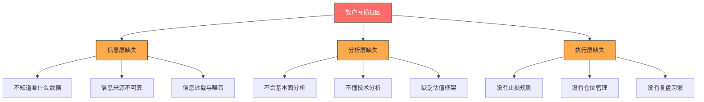
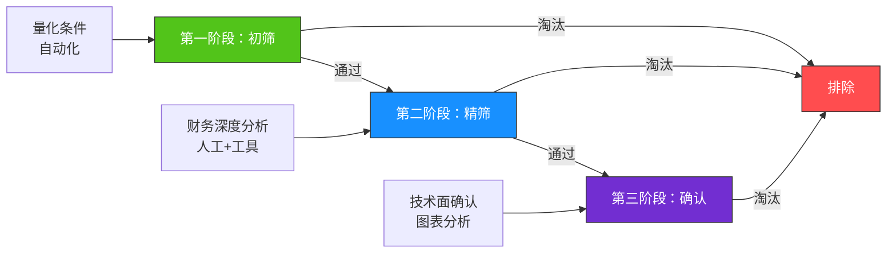
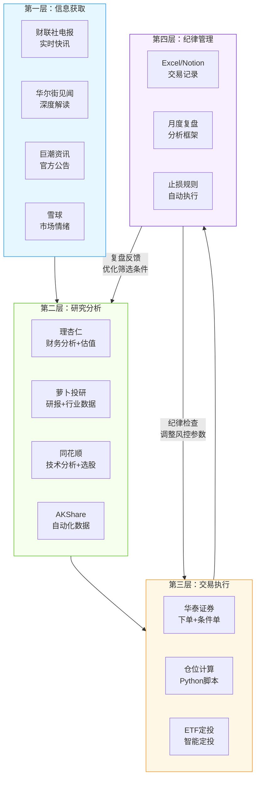

## 案例一：股票投资者的工具箱

本案例完整展示一位普通散户投资者如何从"凭感觉炒股"转型为"用系统投资"的全过程。不仅告诉你用什么工具，更重要的是揭示**为什么要选这些工具、怎么把工具串联成系统、以及工具背后的决策逻辑**。

### 案例背景与诊断

#### 投资者画像

小李，28岁，互联网从业者，2021年入市，初始资金20万。三年投资经历中呈现出典型的散户困境：

| 维度 | 初始状态 | 具体表现 |
|------|----------|----------|
| 信息获取 | 碎片化 | 朋友推荐、股吧热帖、短视频"大V"喊单 |
| 分析能力 | 基本为零 | 不会看财报，不懂估值，分不清PE和PB |
| 交易纪律 | 无 | 追涨杀跌，亏损死扛，盈利过早止盈 |
| 记录复盘 | 无 | 从不记录买卖理由，亏了不知道为什么亏 |
| 情绪管理 | 差 | 涨了贪心加仓，跌了恐慌割肉 |
| 年化收益 | -5%（含手续费实际-8%） | 三年累计亏损1.5万 |

#### 问题根因分析

小李的亏损不是运气差，而是**缺乏系统**。具体表现为三个层面的缺失：



**关键洞察**：工具不能替代认知，但工具可以**降低认知门槛**。一个自动计算PE分位的工具，比自己翻财报效率高10倍；一个自动触发止损的功能，比靠意志力执行纪律可靠100倍。

### 道：投资理念先行

在搭建工具体系之前，小李首先明确了三个核心理念，这些理念决定了后续所有工具选择的方向：

#### 理念一：概率思维取代确定性思维

没有任何工具能告诉你"这只股票一定会涨"。工具的价值在于帮你**提高胜率和盈亏比**，而非给出确定答案。小李给自己设定的目标是：胜率55%以上，盈亏比2:1以上——这意味着即使只有55%的交易赚钱，长期下来也是正期望的。

计算公式：**期望收益 = 胜率 × 平均盈利 - (1-胜率) × 平均亏损**

| 胜率 | 盈亏比 | 期望收益（每1元风险） | 100次交易后资产变化 |
|------|--------|----------------------|-------------------|
| 40% | 1:1 | -0.20元 | 亏损20% |
| 50% | 1:1 | 0元 | 持平（扣手续费亏损） |
| 55% | 1.5:1 | +0.275元 | 盈利27.5% |
| 55% | 2:1 | +0.45元 | 盈利45% |
| 60% | 2:1 | +0.60元 | 盈利60% |

**为什么概率思维如此重要？** 因为散户最常见的心理陷阱就是"这次不一样"——买入时笃定会涨，下跌时幻想会反弹。概率思维让你接受"任何一笔交易都可能亏损"这个事实，从而把注意力放在系统层面的正期望上，而非单次交易的输赢。

#### 理念二：能力圈原则

不买自己看不懂的股票。工具的首要作用不是帮你发现"暴涨股"，而是帮你**排除不合格的标的**。小李的学习背景让他能理解消费和互联网行业，因此将能力圈限定在这两个领域。

**能力圈的边界如何确定？** 问自己三个问题：
1. 能不能用一句话说清这家公司靠什么赚钱？
2. 知道这个行业的核心竞争壁垒是什么吗？
3. 如果股价下跌30%，能判断是市场情绪还是基本面恶化吗？

三个问题有任何一个答不上来，就不在你的能力圈内。

#### 理念三：纪律大于判断

一个有纪律的普通策略，长期收益优于一个没纪律的"聪明"策略。工具的核心价值之一就是**强制执行纪律**——自动止损、仓位限制、定期复盘提醒。

**纪律的经济学解释**：假设两个投资者A和B，A有纪律（严格止损8%、仓位管理），B没纪律（死扛不止损、满仓单只）。在一次黑天鹅事件中，A损失8%后离场，B损失50%后被迫割肉。B需要100%的收益才能回本，而A只需要8.7%。这就是纪律的复利效应。

### 法：搭建信息获取体系

信息是投资决策的原料。信息体系的核心不是"获取更多信息"，而是**建立可信、及时、有结构的信息流**。

#### 信息源矩阵

小李经过一个月的筛选，建立了分层信息体系：

| 层级 | 信息类型 | 渠道 | 频率 | 每日耗时 | 用途 |
|------|----------|------|------|----------|------|
| 第一层 | 实时快讯 | 财联社电报 | 盘中实时 | 15分钟 | 捕捉突发事件、政策变化 |
| 第二层 | 市场解读 | 华尔街见闻 | 每日早/晚 | 20分钟 | 理解市场逻辑、宏观环境 |
| 第三层 | 个股深度 | 萝卜投研/Wind免费版 | 每周2-3篇 | 1小时/篇 | 深度研究目标标的 |
| 第四层 | 市场情绪 | 雪球热帖 | 每日浏览 | 15分钟 | 感知市场情绪（反向指标） |
| 第五层 | 官方数据 | 巨潮资讯/上交所/深交所 | 按需 | 按需 | 公告、年报、监管信息 |

**关键原则**：每天信息摄入控制在1小时以内。信息过载比信息不足更危险——它会导致"分析瘫痪"，看太多反而不知道该买什么。

#### 信息获取的日常时间表

信息摄入不是"想起来才看"，而是固定流程化。小李的每日信息时间表：

| 时间段 | 动作 | 耗时 | 工具 |
|--------|------|------|------|
| 7:30-7:45 | 浏览财联社电报隔夜新闻，标记涉及持仓/能力圈的条目 | 15分钟 | 财联社APP |
| 7:45-8:00 | 阅读华尔街见闻早报，了解宏观环境和市场情绪 | 15分钟 | 华尔街见闻APP |
| 12:00-12:10 | 快速扫描盘中异动（自己的候选池是否出现信号） | 10分钟 | 同花顺自选股 |
| 20:00-20:15 | 阅读持仓公司公告或研报（有则看，无则跳过） | 15分钟 | 巨潮资讯/萝卜投研 |
| 周六上午 | 深度研究1-2只候选池中的股票 | 1-2小时 | 理杏仁+年报 |

**信息摄入的"二八法则"**：80%的投资收益来自20%的关键信息。那20%的信息是：(1) 持仓公司的财报和重大公告；(2) 你能力圈行业的政策变化；(3) 宏观利率和流动性环境。其余80%的信息——股吧讨论、大V喊单、短期涨跌预测——都是噪音。

**信息摄入的反面清单**（必须戒掉的习惯）：

- 戒掉：盘中频繁刷新股价（每天看10次以上）
- 戒掉：股吧/雪球看别人的操作和情绪
- 戒掉：短视频"荐股大V"的内容
- 戒掉：微信群里的"内幕消息"
- 戒掉：追热点新闻做交易决策

#### 信息过滤规则

不是所有信息都值得关注。小李建立了过滤机制：

```python
# 信息优先级过滤规则
def should_pay_attention(news):
    """
    信息过滤：决定是否值得花时间关注
    返回: "立刻看" / "稍后看" / "忽略"
    """
    # 第一优先级：直接影响持仓的
    if news.涉及持仓股票:
        return "立刻看"
    if news.type in ["财报发布", "重大公告", "监管处罚"]:
        return "立刻看"
    
    # 第二优先级：影响能力圈行业的
    if news.涉及行业 in ["消费", "互联网"] and news.重要程度 >= "中":
        return "稍后看"
    
    # 第三优先级：宏观政策
    if news.type in ["央行利率", "GDP数据", "CPI数据"]:
        return "稍后看"
    
    # 忽略：噪音
    # 包括：股吧喊单、"必涨"预测、无数据支撑的观点、短期涨跌预测
    return "忽略"
```

#### 信息质量自检清单

每次阅读研报或分析文章时，用以下清单检验信息质量：

| 检验维度 | 高质量信息特征 | 低质量信息特征 |
|----------|---------------|---------------|
| 数据支撑 | 有具体数字、图表、来源 | 只有观点没有数据 |
| 时间框架 | 明确是短期/中期/长期判断 | 含糊的"将来会涨" |
| 逻辑链 | 原因→传导→结果完整 | 跳跃式结论 |
| 利益声明 | 作者声明是否持仓 | 不声明利益关系 |
| 可证伪 | 给出了具体的判断条件 | 模棱两可怎么说都对 |
| 历史准确 | 作者过往判断有记录可查 | 只展示成功的预测 |

### 术：核心分析方法与工具

#### 一、行情分析工具选型

**需求拆解**：小李的日常需求包括看盘（实时行情）、技术分析（图表指标）、财务查询（基本面）、下单交易四个场景。

**工具对比**：

| 工具 | 费用 | 行情速度 | 技术分析 | 财务数据 | 交易便捷 | 适合人群 | 小李选择 |
|------|------|----------|----------|----------|----------|----------|----------|
| 同花顺 | 免费（高级功能付费） | 快 | 强（50+指标） | 中 | 需对接券商 | 通用型投资者 | ✅ 主力 |
| 东方财富 | 免费 | 快 | 中 | 强（数据最全） | 有自家券商 | 重视数据的投资者 | ✅ 数据补充 |
| 通达信 | 免费/付费 | 最快 | 极强（可编程） | 弱 | 需对接券商 | 技术分析高手 | ❌ 学习曲线陡 |
| 雪球 | 免费 | 慢（延迟15分钟） | 弱 | 中 | 有模拟盘 | 社交型投资者 | 仅社区用 |
| Wind | 年费3万+ | 最快 | 最强 | 最强 | 支持机构交易 | 专业机构 | ❌ 成本过高 |

**最终配置**：
- **同花顺**：日常看盘、技术指标分析、条件选股
- **东方财富**：财务数据查询、行业对比、研报阅读
- **华泰证券涨乐财富通**：实际下单（佣金万1.3，ETF万0.5）

**为什么不用通达信？** 通达信的技术分析能力确实最强，支持自编公式，但学习成本太高。对于20万资金量的短线投资者，同花顺的50多个内置指标已经足够覆盖需求。等交易经验积累到一定程度，再考虑升级。

#### 券商选择的核心标准

券商不只是下单通道，它的功能直接影响交易效率和成本：

| 评估维度 | 关键指标 | 小李的选择逻辑 |
|----------|----------|---------------|
| 佣金费率 | 股票万1-万2.5，ETF万0.5-万1 | 20万资金，佣金差万1就是每年省200元 |
| 条件单功能 | 支持价格条件单、时间条件单 | 止损自动执行的核心依赖 |
| APP体验 | 界面流畅、行情实时、下单快捷 | 盘中操作容不得卡顿 |
| 研报服务 | 免费研报数量和质量 | 华泰、国泰君安研报质量较高 |
| 融资融券 | 利率、券源 | 小李暂不使用杠杆，但预留接口 |
| 客户服务 | 在线客服响应速度、营业部覆盖 | 遇到问题能快速解决 |

**条件单的实战价值**：这是散户最容易忽视但价值最大的功能。以华泰证券为例，支持以下条件单类型：

| 条件单类型 | 设置方式 | 实战用途 |
|-----------|---------|---------|
| 价格条件单 | 股价跌到X元自动卖出 | 止损自动执行，不受情绪干扰 |
| 止盈条件单 | 股价涨到Y元自动卖出 | 锁定利润，不贪心 |
| 回落条件单 | 从最高点回落Z%自动卖出 | 追踪止盈，让利润奔跑 |
| 定时条件单 | 每周五收盘前自动减仓 | 强制周末不持仓过重 |

**华泰证券条件单设置实操步骤**（其他券商类似）：

以"价格条件单-止损"为例，完整操作流程：

```text
第1步: 打开华泰证券APP（涨乐财富通）
第2步: 进入"交易" -> "条件单"
第3步: 选择"价格条件单"
第4步: 填写触发条件:
       - 监控股票: 输入股票代码（如600519）
       - 触发条件: 价格 <= 1545.60（止损价）
       - 触发动作: 卖出
       - 委托价格: 对手价（确保能成交）
       - 委托数量: 全部持仓
第5步: 有效期: 选择"长期有效"（避免每天重新设置）
第6步: 确认提交
```

**回落条件单（追踪止盈）设置**：

```text
第1步: 条件单 -> 选择"回落条件单"
第2步: 设置:
       - 监控股票: 输入代码
       - 最高回落比例: 5%（从最高点回落5%触发）
       - 触发动作: 卖出
       - 委托价格: 对手价
第3步: 提交
```

**关键细节**：
- 条件单触发后不保证100%成交，极端行情（跌停）可能卖不出去
- 建议设置后截图保存，方便复盘时核对
- 长期有效条件单在除权除息日会自动失效，需要重新设置
- 条件单数量有上限（华泰普通账户50个），够用但不要浪费

#### 二、财务分析工具实战

##### 理杏仁：散户最友好的财务分析平台

理杏仁（lixinger.com）的核心价值在于**把复杂的财务数据可视化**，让非财务专业的人也能快速读懂一家公司。

**每日必看的五个指标**：

```python
# 理杏仁核心分析框架：以贵州茅台为例
# 以下是实际查询时需要关注的指标和判断逻辑

def analyze_stock_financials(stock_name="贵州茅台"):
    """
    五维财务分析框架
    每个维度给出当前值 + 历史分位 + 判断标准
    """
    analysis = {}
    
    # ===== 维度一：估值是否合理 =====
    analysis["估值"] = {
        "PE_TTM": {"值": 33.5, "历史分位": "65%", "判断": "偏高，不急于买入"},
        "PB": {"值": 11.2, "历史分位": "70%", "判断": "偏高"},
        "股息率": {"值": "1.5%", "历史分位": "40%", "判断": "一般"},
        "核心逻辑": "PE历史分位<30%时考虑买入，>70%时考虑减仓"
    }
    
    # ===== 维度二：盈利能力是否优秀 =====
    analysis["盈利能力"] = {
        "ROE": {"值": "32.5%", "标准": ">15%为优秀", "判断": "极优秀"},
        "毛利率": {"值": "91.5%", "标准": ">40%为优秀", "判断": "极优秀（茅台特例）"},
        "净利率": {"值": "52.3%", "标准": ">20%为优秀", "判断": "极优秀"},
        "核心逻辑": "ROE是最核心的盈利能力指标，巴菲特最看重"
    }
    
    # ===== 维度三：成长性如何 =====
    analysis["成长性"] = {
        "营收增速": {"值": "16.2%", "标准": ">10%为良好", "判断": "良好"},
        "净利润增速": {"值": "19.5%", "标准": ">15%为优秀", "判断": "优秀"},
        "核心逻辑": "关注增速的持续性和趋势，单季度波动不重要"
    }
    
    # ===== 维度四：财务是否健康 =====
    analysis["财务健康"] = {
        "资产负债率": {"值": "21.3%", "标准": "<60%为安全", "判断": "极安全"},
        "流动比率": {"值": 4.2, "标准": ">1.5为安全", "判断": "极安全"},
        "经营现金流": {"值": "正常且充裕", "标准": "必须为正", "判断": "优秀"},
        "商誉占比": {"值": "0%", "标准": "<10%为安全", "判断": "无风险"},
        "核心逻辑": "负债率和现金流是防雷指标，不达标直接排除"
    }
    
    # ===== 维度五：综合判断 =====
    analysis["综合判断"] = {
        "公司质量": "A+（盈利能力极强，财务健康）",
        "当前估值": "偏贵（PE分位65%）",
        "操作建议": "好公司但不是好价格，等PE回落到40以下再考虑",
        "安全边际": "理想买入价 = 当前价格 × 0.7 ≈ PE 23倍时"
    }
    
    return analysis
```

**理杏仁的进阶用法**：

1. **行业对比**：同一指标横向对比同行业公司，找出行业中最优秀的
2. **历史分位**：看当前估值在历史上处于什么位置，避免买在高点
3. **财务造假预警**：如果营收增长但现金流不增长，可能存在财务造假风险
4. **杜邦分析拆解**：把ROE拆成利润率×周转率×杠杆率，理解盈利来源

##### 财报阅读的最低要求

即使不精通财务分析，以下三张表的核心指标**必须能看懂**：

| 报表 | 必看指标 | 含义 | 红线标准 |
|------|----------|------|----------|
| 利润表 | 营收增速、净利润增速、毛利率、净利率 | 公司赚钱能力 | 连续2季度净利润下滑 |
| 资产负债表 | 资产负债率、流动比率、商誉占比 | 公司财务安全 | 负债率>70%或商誉>净资产30% |
| 现金流量表 | 经营活动现金流 | 公司实际造血能力 | 经营现金流连续为负 |

**一个实用技巧**：如果一家公司净利润很高但经营现金流很差，要高度警惕——利润可能是"纸面利润"，钱没有真正收回来。具体判断方法是计算**净现比**（经营现金流净额 / 净利润），健康值应该大于1。如果连续多年小于0.5，就需要深入排查应收账款和存货变动。

##### A股特有的税费计算

A股的交易成本不只是佣金，还有印花税和过户费，这些直接影响实际收益：

| 费用项目 | 费率 | 承担方 | 计算方式 |
|----------|------|--------|----------|
| 佣金 | 万1-万2.5 | 买卖双向 | 成交金额 × 佣金费率（最低5元） |
| 印花税 | 0.05%（万5） | 仅卖出 | 卖出金额 × 0.05% |
| 过户费 | 0.001%（万0.1） | 买卖双向 | 成交金额 × 0.001% |

**实际案例计算**：

```python
# A股交易成本计算
def calculate_trade_cost(buy_price, sell_price, shares, commission_rate=0.00013):
    """
    计算A股完整交易周期的税费成本
    
    参数:
        buy_price: 买入价格
        sell_price: 卖出价格
        shares: 股数（必须为100的倍数）
        commission_rate: 佣金费率（默认万1.3）
    """
    buy_amount = buy_price * shares
    sell_amount = sell_price * shares
    
    # 佣金（买卖双向，最低5元）
    buy_commission = max(buy_amount * commission_rate, 5)
    sell_commission = max(sell_amount * commission_rate, 5)
    
    # 印花税（仅卖出，万5）
    stamp_tax = sell_amount * 0.0005
    
    # 过户费（买卖双向，万0.1）
    buy_transfer = buy_amount * 0.00001
    sell_transfer = sell_amount * 0.00001
    
    total_cost = buy_commission + sell_commission + stamp_tax + buy_transfer + sell_transfer
    profit = sell_amount - buy_amount - total_cost
    
    return {
        "买入佣金": f"{buy_commission:.2f}元",
        "卖出佣金": f"{sell_commission:.2f}元",
        "印花税": f"{stamp_tax:.2f}元",
        "过户费": f"{buy_transfer + sell_transfer:.2f}元",
        "总费用": f"{total_cost:.2f}元",
        "费用占比": f"{total_cost / buy_amount * 100:.3f}%",
        "实际盈亏": f"{profit:.2f}元",
    }

# 小李的实际案例：买入消费龙头股
cost = calculate_trade_cost(buy_price=50, sell_price=64, shares=1000)
# 输出：
# 买入佣金: 6.50元
# 卖出佣金: 8.32元
# 印花税: 32.00元
# 过户费: 0.11元
# 总费用: 46.93元
# 费用占比: 0.094%
# 实际盈亏: 13,953.07元
```

**分红税的隐藏陷阱**：A股持股时间不同，红利税税率差异巨大：

| 持股时间 | 红利税税率 | 说明 |
|----------|-----------|------|
| ≤1个月 | 20% | 短线交易分红等于白送 |
| 1个月-1年 | 10% | 中等税负 |
| >1年 | 0% | 长期持有免税 |

这意味着如果在分红前短线买入高股息股，分红后立刻卖出，实际到手的红利要打八折。短线投资者应该关注分红日历，避免在分红前盲目买入。

##### 佣金谈判与成本优化

交易成本是"沉默的利润杀手"。20万资金如果每天交易一次，一年下来：

```python
# 极端案例：频繁交易的成本
annual_cost_if_daily = 46.93 * 2 * 240  # 假设每天一买一卖，240个交易日
# = 22,526元 —— 相当于本金的11.3%！
# 这意味着即使你选股能力不错，频繁交易也能把利润吃光
```

**降低交易成本的三个方法**：

1. **佣金谈判**：开户时或资产达到一定规模后，主动联系券商客服要求降低佣金。目前市场最低可到万1（部分券商对大资金客户可到万0.8）。华泰证券20万资金量通常可以谈到万1.3。
2. **减少交易频率**：这是最有效的成本控制。从每周3-4次降到每月3-4次，年化交易成本从可能的10%+降到1%以内。
3. **ETF替代**：ETF的佣金通常为万0.5，部分ETF免征印花税。如果看好某个行业，买行业ETF比频繁买卖该行业个股省很多税费。

**佣金谈判话术**：直接打券商客服电话说"我想调低佣金，目前其他券商给我万1的费率，你们能匹配吗？"——大多数券商会为了留住客户而同意。如果第一次被拒绝，等资产增长到50万再谈。

#### 三、技术分析工具配置

技术分析是短线交易的重要辅助。小李在同花顺中配置了以下指标体系：

##### 指标组合：趋势+动量+成交量

```python
# 技术分析指标配置方案
# 适用于持股周期1-4周的短线投资者

tech_indicators = {
    "趋势指标": {
        "MA均线": {
            "参数": "5日、10日、20日、60日",
            "用法": "股价站上20日均线为短期看多，60日为中期趋势",
            "信号": "5日上穿20日为短期买入信号（金叉）"
        },
        "MACD": {
            "参数": "12, 26, 9（默认参数）",
            "用法": "DIF上穿DEA为金叉买入，下穿为死叉卖出",
            "信号": "零轴上方金叉强于零轴下方金叉"
        }
    },
    "动量指标": {
        "KDJ": {
            "参数": "9, 3, 3",
            "用法": "K值<20超卖（可能反弹），>80超买（可能回调）",
            "信号": "J值从负值回升是短线买入信号"
        },
        "RSI": {
            "参数": "6日、12日",
            "用法": "RSI<30超卖，>70超买",
            "信号": "RSI底背离（股价新低但RSI不新低）是反转信号"
        }
    },
    "成交量指标": {
        "VOL": {
            "参数": "5日、10日均量",
            "用法": "放量突破是有效突破，缩量突破是假突破",
            "信号": "量价齐升看多，量价背离看空"
        }
    }
}
```

**指标使用原则**：
- 不要同时看太多指标，3个足够（趋势1个+动量1个+成交量）
- 多个指标共振时信号更可靠（如MACD金叉+放量突破均线）
- 技术指标是**辅助**，不是决策依据——基本面决定买不买，技术面决定什么时候买

##### 技术指标在不同市场环境下的有效性

技术指标并非万能，不同市场环境下有效性差异很大：

| 市场环境 | 有效指标 | 失效指标 | 策略调整 |
|----------|---------|---------|---------|
| 单边上涨 | 均线多头排列、MACD | KDJ超买（会钝化） | 持股为主，回调买入 |
| 单边下跌 | 均线空头排列 | 所有抄底指标 | 空仓等待，不抄底 |
| 横盘震荡 | KDJ、RSI（超买超卖） | 均线（反复穿越） | 高抛低吸，控制仓位 |
| 暴跌行情 | 无（情绪主导） | 全部技术指标 | 直接离场，等企稳 |

**核心认知**：技术指标在趋势行情中最有用，在震荡行情中频繁失效，在极端行情中完全无用。识别当前市场环境比选择指标更重要。

#### 四、选股流程标准化

小李将选股流程固化为三个阶段，每阶段有明确的通过/淘汰标准：



**第一阶段：量化初筛（可自动化）**

```python
# 选股初筛条件
screening_criteria = {
    "基本面条件": {
        "ROE": "> 15%（连续3年）",
        "营收增速": "> 10%",
        "净利润增速": "> 10%",
        "资产负债率": "< 60%",
        "经营现金流": "为正",
        "商誉占比": "< 净资产的20%",
    },
    "技术面条件": {
        "股价位置": "在20日均线上方",
        "成交量": "近5日均量 > 10日均量（放量）",
        "市值": "50亿-500亿（太小流动性差，太大弹性小）",
    },
    "排除条件": {
        "ST股": "排除",
        "上市不满2年": "排除",
        "近3个月有重大违规": "排除",
        "股东质押比例>50%": "排除",
    }
}

# 通过初筛后，进入候选池（通常10-30只）
# 每周更新一次候选池
```

**用同花顺实现自动初筛**：同花顺的"条件选股"功能可以设置上述量化条件，一键筛选出符合标准的股票。具体操作路径：同花顺 → 智能 → 条件选股 → 自定义条件。可以保存为选股方案，每周一键刷新。

**第二阶段：深度分析（人工+工具）**

对候选池中的每只股票进行深度分析：

1. 阅读最近2年的年报和季报，重点关注管理层讨论
2. 在理杏仁上查看完整的财务趋势图，看数据是改善还是恶化
3. 对比同行业竞争对手，确认该公司是否有竞争优势
4. 在萝卜投研上阅读卖方研报，了解机构看法

**深度分析的评分卡**：

```python
# 个股深度分析评分卡（满分100分）
analysis_scorecard = {
    "商业模式清晰度": {"权重": 15, "问题": "能一句话说清赚钱方式吗？"},
    "行业竞争格局":   {"权重": 15, "问题": "是龙头还是追赶者？护城河宽吗？"},
    "财务趋势":       {"权重": 20, "问题": "近3年ROE/营收/利润趋势如何？"},
    "估值合理性":     {"权重": 15, "问题": "PE/PB处于历史什么分位？"},
    "管理层质量":     {"权重": 10, "问题": "管理层过往承诺兑现率如何？"},
    "增长空间":       {"权重": 15, "问题": "行业天花板在哪？公司还有多少空间？"},
    "风险因素":       {"权重": 10, "问题": "最大的潜在风险是什么？能否承受？"},
}

# 评分标准：
# 80分以上：优质标的，可进入待买入清单
# 60-80分：一般标的，继续观察
# 60分以下：淘汰
```

**第三阶段：技术确认**

在同花顺上确认技术面：

- 是否处于上升趋势（均线多头排列）
- 是否有放量突破信号
- 当前价格距离支撑位/阻力位的位置
- MACD、KDJ等指标是否配合

只有三个阶段全部通过的股票，才会进入"待买入"清单。

#### 五、ETF与指数基金工具

不是所有投资者都适合个股投资。对于风险承受能力较低或精力有限的投资者，ETF是更优选择：

| ETF类型 | 代表品种 | 适合场景 | 核心优势 |
|---------|---------|---------|---------|
| 宽基指数ETF | 沪深300ETF、中证500ETF | 长期定投核心仓位 | 分散风险，跟踪市场平均 |
| 行业ETF | 消费ETF、科技ETF | 看好特定行业 | 不选个股也能投行业 |
| 红利ETF | 中证红利ETF | 追求现金流 | 高股息，防御性强 |
| 跨境ETF | 纳斯达克100ETF、恒生科技ETF | 全球配置 | 不开境外账户也能投海外 |

**ETF vs 个股的工具差异**：

- ETF不需要深入分析个股财报，但需要判断行业/市场趋势
- ETF的止损可以放宽（如10-15%），因为没有单只股票暴雷风险
- ETF定投可以用券商的"智能定投"功能，在低位多买、高位少买
- ETF交易成本更低（佣金万0.5，无印花税在部分ETF上）

##### ETF定投的实操配置

小李将ETF定投作为"压舱石"仓位（占总资金30-50%），与个股投资形成互补。定投的核心不是"买什么"而是"怎么买"：

**普通定投 vs 价值定投（智慧定投）**：

| 策略 | 买入规则 | 适用场景 | 收益特征 |
|------|---------|---------|---------|
| 普通定投 | 每月固定金额、固定日期 | 新手入门，省心省力 | 收益接近指数平均 |
| 估值定投 | PE低于历史均值时多买，高于时少买或暂停 | 有一定判断能力的投资者 | 收益优于普通定投1-3%年化 |
| 均线定投 | 指数低于250日均线时加倍买入，高于时减半 | 趋势判断能力强的投资者 | 回撤更小，收益更稳 |

**估值定投的具体规则**（以沪深300ETF为例）：

```python
def smart_dca_amount(base_amount, pe_percentile):
    # 估值定投: 根据PE历史分位决定每期投入金额
    # base_amount: 基准每期投入金额（如2000元）
    # pe_percentile: 当前PE在近10年的历史分位（0-100）
    if pe_percentile < 20:
        return base_amount * 2.0    # 极度低估，双倍投入
    elif pe_percentile < 40:
        return base_amount * 1.5    # 低估，1.5倍投入
    elif pe_percentile < 60:
        return base_amount * 1.0    # 正常，标准投入
    elif pe_percentile < 80:
        return base_amount * 0.5    # 高估，减半投入
    else:
        return 0                     # 极度高估，暂停定投

# 示例: 基准每月投2000元
# PE分位15%（低估）-> 投4000元
# PE分位50%（正常）-> 投2000元
# PE分位85%（高估）-> 暂停，等回落
```

**定投的三个常见错误**：

1. **定投不等于无脑买入**：在PE历史90%分位还坚持定投，不如暂停等回落。定投纪律不等于机械执行。
2. **不止盈等于白定投**：设定止盈线（如累计收益20-30%），达到后全部赎回，重新开始下一轮。很多人定投3年赚了30%不止盈，又跌回去变亏损。
3. **频繁更换标的**：今天投沪深300，明天换中证500，后天又换纳指。定投的核心是坚持同一标的至少1年以上，让均值回归发挥作用。

##### ETF组合配置模板

小李的ETF组合采用"核心+卫星"策略：

| 类型 | 品种 | 占比 | 目的 |
|------|------|------|------|
| 核心 | 沪深300ETF + 中证500ETF | 60% | 跟踪大盘，获取市场平均收益 |
| 卫星-行业 | 消费ETF | 15% | 能力圈内，理解行业逻辑 |
| 卫星-防御 | 红利ETF | 15% | 防御性配置，熊市跌幅小 |
| 卫星-跨境 | 纳斯达克100ETF | 10% | 全球分散，对冲A股系统风险 |

核心仓位每周定投，卫星仓位根据估值择时。整体目标是用ETF获取beta收益（市场平均），用个股获取alpha收益（超额收益）。

### 器：交易执行与风险管理

#### 一、仓位管理模型

仓位管理是控制风险的核心。小李采用**固定风险百分比模型**：

```python
def calculate_position_size(total_capital, risk_per_trade, entry_price, stop_loss_price):
    """
    固定风险百分比仓位管理模型
    
    核心逻辑：无论买什么股票，每笔交易的最大亏损都控制在总资金的固定比例内
    这样即使连续亏损，也不会伤筋动骨
    
    参数:
        total_capital: 总资金（元）
        risk_per_trade: 单笔交易风险比例（建议1-2%，小李设为2%）
        entry_price: 计划买入价格
        stop_loss_price: 止损价格
    """
    # 第一步：计算本笔交易允许的最大亏损金额
    max_loss_amount = total_capital * risk_per_trade
    
    # 第二步：计算每股的风险（买入价与止损价的差额）
    risk_per_share = entry_price - stop_loss_price
    if risk_per_share <= 0:
        raise ValueError("止损价必须低于买入价")
    
    # 第三步：计算可以买多少股（A股最小交易单位100股）
    max_shares = int(max_loss_amount / risk_per_share)
    # 取整到100股（向下取整，宁少勿多）
    shares = (max_shares // 100) * 100
    
    # 第四步：计算实际仓位
    position_value = shares * entry_price
    position_ratio = position_value / total_capital
    
    return {
        "买入股数": shares,
        "持仓金额": f"{position_value:,.0f}元",
        "仓位比例": f"{position_ratio*100:.1f}%",
        "最大亏损": f"{shares * risk_per_share:,.0f}元",
        "占总资金比": f"{shares * risk_per_share / total_capital * 100:.1f}%"
    }


# ===== 实际案例演示 =====

# 案例1：买入消费龙头股
result1 = calculate_position_size(
    total_capital=200000,    # 20万总资金
    risk_per_trade=0.02,     # 单笔风险2%
    entry_price=50,          # 买入价50元
    stop_loss_price=46       # 止损价46元（-8%）
)
print("案例1：消费龙头股")
print(f"  买入{result1['买入股数']}股，持仓{result1['持仓金额']}")
print(f"  仓位{result1['仓位比例']}，最大亏损{result1['最大亏损']}")
# 输出：买入1000股，持仓50,000元，仓位25.0%，最大亏损4,000元

# 案例2：买入高价科技股
result2 = calculate_position_size(
    total_capital=200000,
    risk_per_trade=0.02,
    entry_price=120,         # 买入价120元
    stop_loss_price=108      # 止损价108元（-10%）
)
print("\n案例2：高价科技股")
print(f"  买入{result2['买入股数']}股，持仓{result2['持仓金额']}")
print(f"  仓位{result2['仓位比例']}，最大亏损{result2['最大亏损']}")
# 输出：买入300股，持仓36,000元，仓位18.0%，最大亏损3,600元
```

**仓位管理的几条铁律**：

| 规则 | 具体标准 | 原因 |
|------|----------|------|
| 单只股票最大仓位 | 不超过总资金的30% | 避免单只股票暴雷导致重大亏损 |
| 同行业最大仓位 | 不超过总资金的40% | 避免行业系统性风险 |
| 总仓位上限 | 不超过80% | 保留20%现金应对极端行情 |
| 单笔最大亏损 | 不超过总资金的2% | 即使连续亏5次也只亏10% |
| 当月最大亏损 | 不超过总资金的6% | 达到后当月停止交易，下月重新开始 |

**连续亏损时的处理规则**——这是仓位管理中最容易被忽视但最致命的环节：

| 连亏次数 | 触发动作 | 原因 |
|---------|---------|------|
| 连续2笔亏损 | 降低单笔风险至1.5%（从2%） | 检视是否市场环境恶化 |
| 连续3笔亏损 | 暂停交易3天，重新审视选股逻辑 | 很可能不是运气问题，而是策略失效 |
| 连续5笔亏损 | 暂停交易1-2周，回到模拟盘验证 | 系统可能已经不适用于当前市场 |
| 月度亏损达6% | 当月停止所有交易 | 防止情绪化操作导致更大亏损 |

连亏时最常见的错误是"加倍下注想回本"——这在概率论中叫"赌徒谬误"。连续亏损说明要么市场环境变了，要么你的策略需要调整，这两种情况都需要停下来思考，而不是加大赌注。

#### 二、止损策略体系

止损是投资中**最难执行但最重要**的纪律。小李采用三种止损方法的组合：

```python
def determine_stop_loss(entry_price, stock_data, method="combined"):
    """
    止损策略体系：三种方法取最严格的一个
    """
    stop_losses = {}
    
    # 方法一：固定百分比止损
    # 适用于：所有情况的兜底保护
    stop_losses["固定止损"] = entry_price * 0.92  # 亏损8%止损
    
    # 方法二：技术支撑位止损
    # 适用于：有明确支撑位的个股
    # 需要手动识别支撑位（前期低点、均线支撑、缺口支撑）
    if stock_data.get("support_price"):
        # 止损设在支撑位下方2%（防止假跌破）
        stop_losses["支撑位止损"] = stock_data["support_price"] * 0.98
    
    # 方法三：ATR止损
    # 适用于：波动率较大的股票
    # ATR（平均真实波幅）反映股票的正常波动幅度
    atr = stock_data.get("atr_20", entry_price * 0.03)  # 默认用价格的3%
    stop_losses["ATR止损"] = entry_price - 2 * atr  # 2倍ATR止损
    
    # 综合止损：取最高的止损价（最严格的止损）
    # 因为越严格的止损意味着亏损越小
    final_stop = max(stop_losses.values())
    chosen_method = [k for k, v in stop_losses.items() if v == final_stop][0]
    
    loss_pct = (entry_price - final_stop) / entry_price * 100
    
    return {
        "止损价": f"{final_stop:.2f}元",
        "止损幅度": f"-{loss_pct:.1f}%",
        "采用方法": chosen_method,
        "各方法止损价": {k: f"{v:.2f}" for k, v in stop_losses.items()}
    }
```

**止损执行的三个要点**：

1. **买入前就确定止损价**：不是"跌了再看要不要止损"，而是在买入的那一刻就知道亏多少必须走
2. **止损价不可移动**：不能因为"感觉快反弹了"就把止损价往下调。这是最常见的纪律破坏行为
3. **条件单自动执行**：在券商APP中设置条件单，价格触达自动卖出，避免情绪干扰

##### 止损的心理执行机制

知道该止损和真正执行止损之间，隔着一道巨大的心理鸿沟。小李总结了三个实战中被验证有效的方法：

**方法一：预演法**。买入前花5分钟做心理预演——想象股价已经跌到止损位，问自己"我现在卖出吗？"如果答案是犹豫的，说明仓位太大了。减小仓位到你能毫不犹豫执行止损的程度。仓位大小直接决定止损执行率：2%的风险比例（亏4000元）大多数人能执行，但10%的风险比例（亏20000元）几乎没人能果断割肉。

**方法二：条件单物理隔离**。在券商APP中设置条件单后，**删除APP的通知权限**。很多散户的止损失败路径是：条件单触发通知→打开APP看到亏损→"再等等看"→手动取消条件单→深套。物理隔绝让你无法干预自动执行。华泰证券的条件单设置后不需要打开APP就能自动触发，利用好这个特性。

**方法三：止损日记**。每次止损后记录三个问题：(1) 止损时的情绪是什么？（恐惧/不甘/侥幸）(2) 如果不止损，后续会怎样？(3) 这次止损对组合的影响有多大？记录3个月后你会发现一个规律：绝大多数止损事后看都是正确的，而不止损的那几次才是真正的灾难。

**止损被触发后的操作规则**：

| 触发后状态 | 正确操作 | 错误操作 |
|-----------|---------|---------|
| 刚止损完，股价继续跌 | 验证止损正确，记录经验 | "幸好卖了"然后立刻买下一只 |
| 刚止损完，股价反弹 | 不后悔，这是概率游戏的一部分 | "止损错了"然后追高买回 |
| 连续止损3次 | 暂停交易1周，检查选股逻辑 | 加大仓位想"把亏的赚回来" |
| 止损后基本面没变 | 等企稳后可以重新买入 | "被洗出去了"不敢再碰 |

#### 三、不同市场环境下的仓位策略

仓位管理不是一成不变的，需要根据市场环境动态调整：

| 市场信号 | 判断依据 | 建议总仓位 | 单只上限 | 操作策略 |
|----------|---------|-----------|---------|---------|
| 强势上涨 | 沪深300站上60日均线，成交量放大 | 60-80% | 30% | 积极做多，趋势跟随 |
| 震荡盘整 | 沪指在区间内反复，成交量萎缩 | 30-50% | 20% | 控制仓位，精选个股 |
| 弱势下跌 | 沪深300跌破60日均线，持续缩量 | 0-20% | 10% | 轻仓或空仓，等待企稳 |
| 极端暴跌 | 连续大跌，市场恐慌，跌停潮 | 0-10% | 不开新仓 | 清仓观望，保留现金 |

**如何判断市场环境？** 小李使用一个简单的量化指标组合：

```python
# 市场环境判断（以沪深300为基准）
def judge_market_env(index_data):
    """
    综合判断当前市场环境
    """
    close = index_data["close"]
    ma20 = index_data["ma_20"]
    ma60 = index_data["ma_60"]
    vol_ratio = index_data["vol_5"] / index_data["vol_20"]  # 5日/20日成交量比
    
    if close > ma60 and close > ma20 and vol_ratio > 1.2:
        return "强势上涨", 0.7  # 建议仓位70%
    elif close > ma60 and vol_ratio > 0.8:
        return "震荡偏多", 0.5
    elif close > ma20 and close < ma60:
        return "震荡盘整", 0.3
    elif close < ma20 and close < ma60 and vol_ratio < 0.8:
        return "弱势下跌", 0.1
    else:
        return "极端行情", 0.0
```

#### 四、交易记录与复盘系统

##### 交易记录模板

每笔交易必须记录以下信息，缺一不可：

```python
# 交易记录模板（建议用Excel或Notion管理）
trade_record = {
    # ===== 买入信息 =====
    "股票代码": "600519",
    "股票名称": "贵州茅台",
    "买入日期": "2024-01-15",
    "买入价格": 1680.00,
    "买入股数": 100,
    "买入金额": 168000,
    "买入手续费": 16.8,  # 万1佣金
    
    # ===== 决策依据（买入时填写，不许事后补） =====
    "买入理由_基本面": "ROE连续5年>30%，毛利率>90%，行业龙头地位稳固",
    "买入理由_估值": "PE_TTM 28倍，处于历史40%分位，估值合理",
    "买入理由_技术面": "放量突破60日均线，MACD零轴上方金叉",
    
    # ===== 风控参数（买入时确定） =====
    "止损价": 1545.60,  # -8%
    "止盈目标1": 1900.00,  # +13%
    "止盈目标2": 2100.00,  # +25%
    "仓位比例": "84%",  # 当时资金较少，单只仓位偏高
    
    # ===== 卖出信息（卖出时填写） =====
    "卖出日期": "2024-04-20",
    "卖出价格": 2150.00,
    "卖出理由": "达到止盈目标2，且PE进入历史70%分位",
    "持有天数": 96,
    
    # ===== 结果统计 =====
    "盈亏金额": 47000 - 33.6,  # (2150-1680)*100 - 手续费
    "盈亏比例": "+28.0%",
    "是否执行纪律": "是（按计划止盈）",
    
    # ===== 复盘反思（卖出后1天内填写） =====
    "做对了什么": "耐心持有3个月，没有中途卖出；按计划止盈",
    "做错了什么": "仓位偏高（84%），应该控制在30%以内",
    "下次改进": "严格控制单只仓位上限",
    "可复制性": "高——ROE+估值+技术突破的组合值得复用"
}
```

**注意**：上面示例中"仓位比例84%"是一个**反面教材**。小李在初期执行时犯了这个错误，后来通过复盘发现并纠正。好的交易记录系统不仅要记成功的操作，更要记录自己的错误——这些错误才是最宝贵的学习素材。

##### 月度复盘框架

每月最后一个周末，花2小时做系统复盘：

```python
# 月度复盘分析模板
monthly_review = {
    "交易统计": {
        "本月交易笔数": 4,
        "盈利笔数": 3,
        "亏损笔数": 1,
        "胜率": "75%",
        "平均盈利": "+12.3%",
        "平均亏损": "-6.5%",
        "盈亏比": "1.89:1",
        "期望收益": "0.75×12.3 - 0.25×6.5 = +7.6%",
    },
    "风控统计": {
        "最大单笔亏损": "-6.5%",
        "本月总收益率": "+8.2%",
        "最大回撤": "-3.1%",
        "是否触发月度止损": "否（阈值-6%）",
    },
    "纪律执行": {
        "是否有未设止损的交易": "无",
        "是否有移动止损的行为": "无",
        "是否有追涨行为": "有1次，已记录教训",
        "是否超仓位": "无",
    },
    "改进计划": {
        "做得好": "严格执行止损，候选池选股成功率高",
        "需改进": "避免在情绪激动时做交易决策",
        "下月重点": "练习等待——不急于入场，等信号明确再动手"
    }
}
```

##### 复盘实战案例：小李第三个月的复盘报告

以下是小李实际执行的月度复盘摘录，展示复盘如何推动行为改变：

```text
=== 2024年3月 月度复盘 ===

一、交易统计
- 本月交易: 5笔（消费龙头、科技ETF、银行股、医药股、半导体）
- 盈利: 3笔（+8.2%, +5.1%, +3.8%）
- 亏损: 2笔（-7.8%, -6.2%）
- 胜率: 60% | 盈亏比: 1.35:1 | 期望收益: +0.56元/1元风险

二、关键发现
[问题1] 医药股亏损-7.8%的根因分析:
  - 买入理由: "估值便宜"（PE历史分位25%）
  - 实际问题: 只看了估值，没注意"集采政策"对利润的持续压制
  - 教训: 估值低不等于值得买，必须先确认基本面没有结构性恶化
  - 改进: 在深度分析评分卡中增加"政策风险"维度（权重10%）

[问题2] 半导体亏损-6.2%的根因分析:
  - 买入理由: 技术面放量突破均线
  - 实际问题: 追涨了已经涨了30%的"强势股"
  - 教训: 技术突破在涨幅已大的情况下成功率大幅下降
  - 改进: 增加筛选条件"近60日涨幅<25%"

[亮点] 消费龙头+28%的关键因素:
  - 严格按计划持有，没有中途卖出
  - 回调到止损位附近时检查基本面没变化，继续持有
  - 达到止盈目标后果断卖出，没有贪心

三、行为纪律检查
  - 止损执行率: 100%（2笔亏损都按计划止损）
  - 仓位违规: 0次（吸取上月教训）
  - 情绪交易: 0次（进步明显）
  - 计划外交易: 1次（半导体，已记录教训）

四、下月改进
  1. 深度分析增加"政策风险"评分维度
  2. 筛选条件增加"近60日涨幅<25%"
  3. 每次交易前必须填写完整的交易计划表
```

**这次复盘的直接成果**：小李在下个月的选股中加入了政策风险评估，成功避开了另一只即将被集采的医药股。如果没有这次复盘，同样的错误会重复犯。

##### 复盘中的数据可视化

单看数字很难发现规律，用图表能让问题一目了然：

```python
# 复盘数据可视化建议（用Excel图表或Python matplotlib）
import matplotlib.pyplot as plt

# 图1：月度收益率走势 —— 看整体趋势
# X轴：月份，Y轴：月收益率（柱状图）+ 累计收益率（折线图）

# 图2：胜率与盈亏比趋势 —— 看策略是否稳定
# 双Y轴图：左Y轴=胜率，右Y轴=盈亏比

# 图3：交易原因分类饼图 —— 看盈利/亏损的来源
# 分类：趋势跟踪 / 估值回归 / 事件驱动 / 其他

# 图4：持仓时间分布 —— 看交易频率是否合理
# X轴：持有天数区间，Y轴：交易笔数

# 图5：最大回撤曲线 —— 看风险控制效果
# X轴：时间，Y轴：从最高点的回撤幅度
```

#### 五、数据API与自动化工具

当手动操作成为瓶颈时，可以用编程工具实现自动化：

| 工具/库 | 用途 | 学习成本 | 实用性 |
|---------|------|---------|--------|
| AKShare | 免费A股数据API | 中（需Python基础） | ⭐⭐⭐⭐⭐ |
| Tushare | 免费+付费A股数据 | 中 | ⭐⭐⭐⭐ |
| backtrader | 回测框架 | 高 | ⭐⭐⭐⭐ |
| pandas | 数据处理 | 中 | ⭐⭐⭐⭐⭐ |

**AKShare实战示例**——自动获取候选池数据：

```python
import akshare as ak
import pandas as pd

def auto_screening():
    """
    自动化初筛：用AKShare获取实时数据，按条件筛选
    """
    # 获取全部A股实时行情
    df = ak.stock_zh_a_spot_em()
    
    # 基础过滤
    df = df[~df['名称'].str.contains('ST|退')]  # 排除ST和退市股
    df = df[df['总市值'] >= 5000000000]           # 排除小于50亿
    df = df[df['总市值'] <= 50000000000]          # 排除大于500亿
    
    # 获取财务数据（以ROE为例）
    # 注意：实际使用需要遍历获取每只股票的财务数据
    # 这里简化展示逻辑
    
    candidates = []
    for _, row in df.iterrows():
        code = row['代码']
        try:
            # 获取财务指标
            fin = ak.stock_financial_analysis_indicator(symbol=code)
            latest = fin.iloc[0]
            
            if (float(latest['净资产收益率(%)']) > 15 and
                float(latest['资产负债率(%)']) < 60):
                candidates.append({
                    "代码": code,
                    "名称": row['名称'],
                    "ROE": latest['净资产收益率(%)'],
                    "负债率": latest['资产负债率(%)'],
                })
        except Exception:
            continue
    
    return pd.DataFrame(candidates)

# 运行筛选，通常几秒钟就能从4000+只股票中筛出候选
# 注意：首次使用需安装 pip install akshare
```

**AKShare进阶：自动监控持仓公告**：

除了选股筛选，AKShare还可以自动监控持仓公司的公告，避免错过重要信息：

```python
import akshare as ak
from datetime import datetime, timedelta

def monitor_announcements(stock_codes, days=1):
    # 监控指定股票的最新公告
    alerts = []
    cutoff = datetime.now() - timedelta(days=days)
    
    for code in stock_codes:
        try:
            df = ak.stock_notice_report(symbol=code)
            if df is not None and len(df) > 0:
                latest = df.iloc[0]
                alerts.append({
                    "代码": code,
                    "公告标题": latest.get("标题", "N/A"),
                    "发布时间": latest.get("发布日期", "N/A"),
                })
        except Exception:
            continue
    
    return alerts

# 使用示例: 每天检查持仓股的公告
holdings = ["600519", "000858", "002714"]
new_notices = monitor_announcements(holdings)
for n in new_notices:
    print(f"[{n['代码']}] {n['公告标题']} ({n['发布时间']})")
```

**Tushare vs AKShare选择建议**：

| 对比维度 | AKShare | Tushare |
|---------|---------|---------|
| 费用 | 完全免费 | 基础免费，高级数据需积分（2000+积分） |
| 数据覆盖 | 全面，含实时行情 | 更全面，含机构持仓、龙虎榜 |
| 接口稳定性 | 偶有变动，需跟进更新 | 较稳定 |
| 社区活跃度 | 高 | 高 |
| 适合人群 | 日常筛选、监控 | 深度研究、回测 |

建议：入门用AKShare（免费），进阶后两者配合使用。

**自动化程度建议**：

| 阶段 | 可自动化的内容 | 建议保留人工的环节 |
|------|---------------|-------------------|
| 信息获取 | 财报数据抓取、公告监控 | 研报阅读、政策解读 |
| 初筛 | 量化条件筛选 | 深度分析、管理层评估 |
| 交易执行 | 条件单止损、定期定投 | 买入决策、仓位调整 |
| 复盘 | 数据统计、图表生成 | 反思总结、策略调整 |

### 六个月转型成果

小李的转型不是一夜之间发生的，而是每个月都有明确的进步节点：

**月度进步轨迹**：

| 月份 | 关键事件 | 收益率 | 核心教训 |
|------|---------|--------|---------|
| 第1个月 | 停止频繁交易，开始记录每笔交易 | -2% | 才发现自己之前的交易完全没有逻辑 |
| 第2个月 | 搭建信息体系，学会看财报 | +3% | 信息过滤后，焦虑感明显下降 |
| 第3个月 | 建立选股评分卡，严格执行止损 | -1% | 连续止损2次很痛苦，但避免了更大的亏损 |
| 第4个月 | 复盘发现"追涨"模式并纠正 | +8% | 第一次因复盘而改变行为，效果立竿见影 |
| 第5个月 | 引入条件单自动止损 | +6% | 再也不用手动纠结要不要卖了 |
| 第6个月 | 系统运转顺畅，形成正循环 | +5% | 投资变成了"无聊但稳定"的事情 |

**关键转折点**：第4个月的复盘是最关键的转折。小李发现之前10笔亏损交易中有7笔是因为"追涨"——在股票已经涨了15-20%后才买入。这个行为模式如果没有复盘，可能一辈子都发现不了。

小李按照上述体系执行6个月后的数据对比：

| 指标 | 转型前（3年平均） | 转型后（6个月） | 变化 |
|------|-------------------|-----------------|------|
| 年化收益率 | -5%（含手续费-8%） | +18% | 扭亏为盈 |
| 胜率 | 40% | 55% | +15个百分点 |
| 盈亏比 | 0.8:1 | 1.8:1 | +125% |
| 最大单笔回撤 | -22%（死扛不卖） | -8%（果断止损） | 改善64% |
| 最大组合回撤 | -35% | -12% | 改善66% |
| 每日研究时间 | 2小时（无效率刷信息） | 1小时（有目标的信息摄入） | 减少50% |
| 交易频率 | 每周3-4次 | 每月3-4次 | 大幅降低 |
| 决策依据 | 感觉+朋友推荐 | 数据+分析框架 | 质变 |

**两个代表性交易**：

**成功案例——消费龙头股**

- 选股：通过量化初筛→深度分析→技术确认三阶段
- 买入依据：ROE连续5年>25%，PE处于历史30%分位，放量突破年线
- 仓位：25%（符合风控规则）
- 持有：3个月，期间有1次回调到止损位附近但未触发
- 卖出：达到止盈目标2，且PE进入历史70%分位
- 收益：+28%
- 关键：工具提供了信心——回调时不恐慌，因为基本面没有变化

**避险案例——热门科技股**

- 背景：朋友极力推荐某AI概念股，当时市场热炒AI
- 初筛：基本面条件不满足（连续亏损，负债率>80%）
- 结论：未通过第一阶段，直接排除
- 后续：该股在推荐后2个月内下跌40%
- 教训：如果没有标准化的筛选流程，这种"朋友推荐+热门概念"的组合最容易让人冲动买入

### 常见误区与纠正

| 误区 | 错误表现 | 后果 | 正确做法 |
|------|----------|------|----------|
| 工具越多越好 | 装了10个APP，5个分析平台 | 信息过载，不同工具给矛盾信号 | 3-5个核心工具足够 |
| 只收藏不使用 | 理杏仁会员买了但从不登录 | 工具沦为心理安慰 | 建立每日/每周固定使用流程 |
| 频繁更换工具 | 这个月用同花顺，下个月换通达信 | 无法形成肌肉记忆，降低效率 | 至少坚持同一套工具6个月 |
| 过度依赖技术指标 | 只看MACD、KDJ就做买卖决策 | 在震荡市频繁被"骗线" | 技术指标是辅助，基本面是根本 |
| 忽视复盘 | 交易完不记录，下个月不总结 | 重复犯同样的错误 | 每笔交易必记录，每月必复盘 |
| 用工具"预测"市场 | 根据指标"预测"明天涨跌 | 陷入预测陷阱，越错越想翻本 | 工具用于"应对"而非"预测" |
| 止损设了不执行 | 条件单触发但手动取消 | 一次大亏吃掉多次小赚 | 用券商条件单自动执行 |
| 忽视交易成本 | 频繁短线交易，不计算手续费和印花税 | 看着盈利扣完费变成亏损 | 每笔交易算清税费，控制频率 |
| 只看技术面不看基本面 | MACD金叉就买入，不看公司质量 | 买在下降趋势的反弹中，越套越深 | 基本面决定买不买，技术面决定何时买 |
| 把模拟盘当真实盘 | 模拟盘赚钱就以为实盘也能赚 | 实盘亏损，因为心态完全不同 | 模拟盘只验证策略逻辑，不验证心态 |
| 追逐"确定性"消息 | 听说"庄家在建仓"就重仓买入 | 所有"确定性"消息到散户这里已经是最后一棒 | 没有确定性，只有概率和赔率 |
| 不做仓位管理 | 看好就全仓买入 | 一次判断失误就损失惨重 | 再看好也不超过30%仓位 |
| 忽视流动性 | 买入日均成交额<5000万的小盘股 | 想卖时卖不出去，被迫低价出货 | 日均成交额>1亿才考虑 |
| 频繁查看账户 | 每小时打开APP看盈亏 | 情绪波动大，容易做出冲动决策 | 每天收盘看一次就够了 |

### 工具体系架构总览



### 进阶路线图

小李的工具体系不是一步到位的，而是分阶段迭代：

| 阶段 | 时间 | 重点 | 核心工具 | 预期能力 |
|------|------|------|---------|---------|
| 入门期 | 1-3个月 | 学会看财报、用券商条件单 | 东方财富+券商APP | 能独立分析一只股票 |
| 建立期 | 3-6个月 | 搭建完整工具体系、形成交易纪律 | 同花顺+理杏仁+Excel | 有稳定的选股和风控流程 |
| 成熟期 | 6-12个月 | 复盘优化、引入自动化 | AKShare+Python脚本 | 策略可量化、可回测 |
| 进阶期 | 1年以上 | 多策略并行、ETF+个股组合 | 全套工具链 | 能根据不同市场环境切换策略 |

### 从这个案例中学到什么

**核心启示**：

1. **系统大于工具**：单个工具的价值有限，把工具串联成系统才能发挥最大作用。信息获取→分析研究→交易执行→复盘改进，形成闭环。

2. **纪律大于判断**：小李最赚钱的交易不是因为他判断特别准，而是因为他**严格执行了止损和仓位规则**。纪律保证了即使判断错误，亏损也在可控范围内。

3. **减法大于加法**：从不筛选信息到建立过滤规则，从频繁交易到每月3-4次，从10个工具到5个核心工具——投资中的进步往往体现在**做了多少减法**。

4. **复盘大于交易**：小李最大的转折点不是某次成功的交易，而是建立了复盘习惯。复盘让他发现了自己"追涨杀跌"的行为模式，从而有意识地纠正。

5. **20万资金的合理预期**：不要期待20万通过炒股实现财务自由。这个阶段的目标是**建立能力、形成系统、控制风险**，为未来更大资金量的投资打好基础。

6. **成本意识是底线**：每次交易都有真实的税费成本。频繁交易的散户往往在不知不觉中把利润交给了券商和税务局。交易之前先算账，是工具体系中最基础也最容易被忽视的一环。

***
