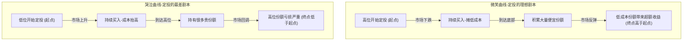
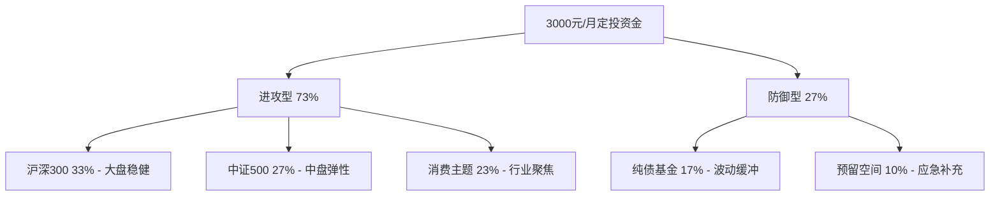

## 案例二：基金定投工具实践

基金定投（Dollar-Cost Averaging，DCA）是最适合普通工薪族的投资方式之一，也是被学术研究反复验证有效的长期投资策略。本案例完整记录一位零基础投资者从开户到盈利的全过程，涵盖平台选择、基金筛选、组合构建、策略执行、心理管理、止盈退出等全部环节，并深入讲解定投背后的数学原理、行为金融学机制、自动化工具搭建和常见陷阱。

本文不仅是一份操作指南，更是一套可复制的投资方法论——你可以直接套用小王的框架，根据自身情况微调参数即可。

### 快速启动清单

在深入理论和实操之前，先列出定投启动的完整清单，方便读者快速对照执行：

| 步骤 | 内容 | 耗时 | 注意事项 |
|------|------|------|----------|
| 1 | 留出3-6个月应急基金 | 1-3个月积累 | 存货币基金，不要动用 |
| 2 | 选择基金平台（天天基金/蚂蚁财富） | 30分钟 | 比较费率和基金覆盖面 |
| 3 | 开户+绑定银行卡 | 15分钟 | 身份证+银行卡即可 |
| 4 | 筛选4-5只基金构建组合 | 2-3小时 | 参考本文筛选标准 |
| 5 | 设置自动定投（每月固定日期） | 10分钟 | 建议发工资后第2天 |
| 6 | 修改分红方式为"红利再投资" | 2分钟 | 每只基金单独设置 |
| 7 | 建立定投记录表 | 30分钟 | Excel或本文提供的Python工具 |
| 8 | 设定季度复盘提醒 | 5分钟 | 每季度末检查一次 |

### 定投的底层原理

#### 数学原理：波动中的成本摊薄

定投的核心数学原理是**调和平均数小于算术平均数**。当价格波动时，相同金额在低价时买入更多份额、高价时买入更少份额，使得平均持仓成本低于简单算术平均价格。

用一个极端例子说明：

| 月份 | 基金净值 | 定投1000元买入份额 |
|------|---------|-------------------|
| 第1月 | 2.00元 | 500.00份 |
| 第2月 | 1.00元 | 1000.00份 |
| 第3月 | 2.00元 | 500.00份 |
| **合计** | — | **2000.00份** |

- 总投入：3000元，总份额：2000份
- **定投成本**：3000 ÷ 2000 = **1.50元/份**
- 算术平均价：(2.00 + 1.00 + 2.00) ÷ 3 = **1.67元/份**
- 成本节省：(1.67 - 1.50) ÷ 1.67 = **10.2%**

这就是定投在震荡市中天然的优势——波动越大，成本摊薄效果越明显。学术上称为**波动率收益（Volatility Return）**。

**数学推导**：

设每月定投金额为 $A$，第 $i$ 个月的净值为 $P_i$，则 $n$ 个月后的平均成本为：

$$\bar{P}_{DCA} = \frac{nA}{\sum_{i=1}^{n} \frac{A}{P_i}} = \frac{n}{\sum_{i=1}^{n} \frac{1}{P_i}}$$

这正是调和平均数的定义。根据均值不等式，调和平均数 ≤ 算术平均数，等号仅在所有 $P_i$ 相等时成立（即价格完全没有波动时）。因此：

- **波动越大** → 调和平均数与算术平均数的差距越大 → 定投的成本优势越明显
- **单边下跌** → 定投仍然优于一次性投入（成本被持续摊低）
- **单边上涨** → 定投劣于一次性投入（后买的越来越贵）
- **震荡市** → 定投的最佳舞台

**波动率收益的量化**：

```python
import numpy as np

def volatility_return(prices):
    """
    计算定投的波动率收益
    波动率收益 = 算术平均价 - 定投平均成本
    """
    arithmetic_mean = np.mean(prices)  # 算术平均价
    harmonic_mean = len(prices) / np.sum(1.0 / np.array(prices))  # 调和平均价
    volatility_ret = (arithmetic_mean - harmonic_mean) / arithmetic_mean
    return {
        "算术平均价": round(arithmetic_mean, 4),
        "定投平均成本": round(harmonic_mean, 4),
        "波动率收益": f"{volatility_ret*100:.2f}%",
    }

# 低波动场景（价格在0.95-1.05之间）
low_vol = [1.00, 0.98, 1.02, 0.97, 1.03, 1.01, 0.99, 1.02, 0.98, 1.00, 1.01, 0.99]
# 高波动场景（价格在0.70-1.30之间）
high_vol = [1.00, 0.80, 1.20, 0.75, 1.30, 0.85, 1.15, 0.70, 1.25, 0.90, 1.10, 0.95]

print("低波动：", volatility_return(np.array(low_vol)))
print("高波动：", volatility_return(np.array(high_vol)))
# 低波动：波动率收益 ≈ 0.07%
# 高波动：波动率收益 ≈ 2.15%
```

#### 行为金融学原理：克服人性弱点

定投之所以有效，很大程度上是因为它强制克服了人性中的三大弱点：

**弱点一：损失厌恶（Loss Aversion）**

诺贝尔经济学奖得主卡尼曼（Kahneman）和特沃斯基（Tversky）的前景理论（Prospect Theory）研究表明，人们对损失的痛苦感是同等收益快感的2-2.5倍。这导致投资者在市场下跌时恐慌卖出、在市场上涨时追涨买入——恰恰做反了。

定投通过**自动化执行**消除了情绪干扰。无论市场涨跌，固定日期自动扣款，投资者无需做出"买还是卖"的痛苦决策。这不是被动，而是主动选择了一种"不决策"的决策框架。

**弱点二：择时困难（Market Timing）**

学术研究反复证明，即使是专业基金经理也很难持续准确预测市场短期走势。DALBAR公司每年发布的《投资者行为量化分析》（QAIB）报告显示，过去20年间，美国股票型基金的平均年化收益约为9-10%，但基金投资者的实际年化收益仅为5-6%——差距来自频繁的追涨杀跌。

定投放弃了择时，转而采用**时间分散**策略——将一笔资金分散到多个时间点投入，平滑了入场成本。你不需要判断底部在哪里，因为每一个价格都是你的"部分底部"。

**弱点三：过度自信（Overconfidence）**

行为金融学研究发现，绝大多数投资者高估自己的投资能力。过度自信导致频繁交易、集中持仓、忽视风险。定投的纪律性框架天然抑制了过度自信——你不需要"聪明"，只需要"坚持"。

#### 微笑曲线与哭泣曲线

定投的收益特征可以用两条曲线理解。横轴为时间，纵轴为基金净值/账户价值：



**关键洞察**：定投在"微笑曲线"中表现最佳（先跌后涨），在"哭泣曲线"中表现最差（先涨后跌）。但由于A股的波动率远高于美股（沪深300年化波动率约25%，标普500约16%），出现微笑曲线的概率更高，这是A股市场定投特别有效的底层原因。

**真实的微笑曲线案例**：以沪深300指数为例，2018年1月开始定投，2020年12月结束（3年）：

| 阶段 | 时间 | 指数走势 | 定投者体验 |
|------|------|----------|-----------|
| 高位起步 | 2018年1月 | 约4400点 | 开始定投，成本较高 |
| 持续下跌 | 2018年全年 | 跌至2900点（-34%） | 浮亏，但持续买入摊低成本 |
| 底部区间 | 2019年1月 | 约2900点 | 积累了大量便宜份额 |
| 反弹回升 | 2019-2020年 | 涨至5200点 | 低位份额带来丰厚收益 |
| 最终结果 | 2020年12月 | 约5200点 | 定投年化收益约15%，远超一次性投入 |

#### 定投 vs 一次性投入：什么条件下定投更优？

定投并非在所有情况下都优于一次性投入。两者的适用场景如下：

| 倾斜维度 | 定投更优 | 一次性投入更优 |
|----------|---------|---------------|
| 市场环境 | 震荡市、先跌后涨（微笑曲线） | 持续单边上涨 |
| 资金来源 | 工资收入（每月增量） | 已有大额储蓄 |
| 投资经验 | 新手，不确定估值高低 | 有经验，能判断估值 |
| 心理承受力 | 波动敏感，容易恐慌 | 能承受短期大幅波动 |
| 投资期限 | 3年以上长期投资 | 1-2年中期投资 |

**关键结论**：如果你有大额闲置资金且市场处于明显低估区域，一次性投入的预期回报更高。但如果你是每月有稳定结余的工薪族，定投是最务实的选择——因为你根本没有"一次性投入"的本金。

**折中方案——"定投+择时加码"**：平时按计划定投，当市场出现明显低估（如PE百分位<20%）时，将当月定投金额加倍甚至三倍。这兼顾了纪律性和灵活性。小王在实际操作中就采用了这一方案，后文会详细展开。

### 案例背景

小王是一名95后上班族，在杭州一家互联网公司做运营，月收入8000元，扣除房租2500元、生活费2000元、通勤和社交500元后，每月能结余3000-3500元。他希望通过基金定投实现长期资产增值，但对基金选择和定投策略一无所知。

小王此前的投资经历仅限于余额宝（年化收益不到2%），对股票、基金完全没有概念。他的投资启蒙来自一个同事——这位同事坚持定投3年，在2024年的市场反弹中获得了超过20%的收益。这让小王意识到"钱不能只躺在银行里"。

本案例记录他从零开始搭建基金定投体系的全过程。

**初始状态评估**：

| 维度 | 情况 | 评估 |
|------|------|------|
| 可投资金额 | 每月3000元 | 适中，适合定投 |
| 投资经验 | 完全零基础 | 需要从基础学起 |
| 目标 | 5年内积累20万资产 | 年化约8%可实现 |
| 风险偏好 | 中等偏保守 | 需要债券类资产缓冲 |
| 应急储备 | 无（已规划留3个月生活费） | 先建立应急基金 |
| 负债情况 | 无房贷车贷，无信用卡债务 | 状态良好 |
| 保险配置 | 仅有社保 | 建议补充意外险和百万医疗险 |

**重要前提**：小王在开始定投前，先留出了3个月生活费（约24000元）作为应急基金，存放在货币基金中。这是投资的第一步——永远不要用"可能要用的钱"去投资。

**为什么必须先建应急基金？** 因为如果没有应急储备，一旦遇到突发支出（生病、失业、家电维修），你被迫在不合适的时机赎回基金，打断定投计划，甚至可能亏损出局。应急基金是你投资体系的"安全气囊"。

**应急基金的存放方式**：

| 存放渠道 | 年化收益 | 流动性 | 推荐程度 |
|----------|----------|--------|----------|
| 货币基金（余额宝/零钱通） | 1.5%-2.0% | T+0实时到账 | ⭐⭐⭐⭐⭐ 首选 |
| 银行活期存款 | 0.2%-0.3% | 实时 | ⭐⭐ 收益太低 |
| 短期银行理财 | 2.0%-3.0% | T+1至T+3 | ⭐⭐⭐ 流动性稍差 |
| 国债逆回购 | 1.5%-3.0%（波动） | 到期自动到账 | ⭐⭐⭐⭐ 节假日前收益高 |

### 基金选择工具与流程

#### 第一步：基金购买平台选择

基金购买平台的选择直接影响投资成本和使用体验。以下是主流平台的详细对比：

| 平台 | 费率优惠 | 基金数量 | 智能推荐 | 数据分析 | 用户体验 | 最终选择 |
|------|----------|----------|----------|----------|----------|----------|
| 天天基金 | 1折起 | 7000+ | 有 | 强（筛选器完善） | 功能全面但界面稍复杂 | ✅ 主力平台 |
| 蚂蚁财富 | 1折起 | 5000+ | 强（AI推荐） | 中等 | 界面简洁，支付宝生态 | ✅ 便捷补充 |
| 蛋卷基金 | 1折起 | 3000+ | 有 | 中等 | 社区氛围好 | ❌ 基金较少 |
| 银行App | 4-6折 | 2000+ | 弱 | 弱 | 费率高，体验一般 | ❌ 费率太高 |
| 雪球基金 | 1折起 | 4000+ | 有 | 中等 | 社区内容丰富 | 可选补充 |
| 且慢 | 1折起 | 3000+ | 强（策略引导） | 中等 | 适合跟投策略 | 可选补充 |

**选择主力平台的三个标准**：

1. **费率必须低**：基金申购费的行业标准是1.5%，但互联网平台普遍打1折（0.15%）。别小看这1.35%的差异——在复利效应下，20年后的差距可能达到数万元。
2. **基金覆盖面广**：主力平台必须覆盖你想买的所有基金。天天基金7000+只基金的覆盖面在国内数一数二。
3. **数据分析能力强**：好的筛选工具能帮你从几千只基金中快速找到目标。天天基金的筛选器支持多维度条件组合，是选基利器。

**费率影响测算**：以每月定投3000元、年化收益10%、投资5年为例：

- 申购费1折（0.15%）vs 无折扣（1.5%）：5年累计节省约 **3,200元**
- 申购费1折（0.15%）vs 4折（0.6%）：5年累计节省约 **1,400元**
- 看似不起眼的费率差异，长期复利效应下影响显著

#### A类份额 vs C类份额：选错多花几千块

这是新手最容易忽略的关键问题。同一基金通常有A类和C类两种份额，本质是同一基金经理管理的同一只基金，只是收费方式不同：

| 对比维度 | A类份额 | C类份额 |
|----------|---------|---------|
| 申购费 | 有（1折后约0.15%） | 无 |
| 赎回费 | 持有时间越长越低，2年以上通常免费 | 7天以上通常免费 |
| 销售服务费 | 无 | 有（约0.25%/年） |
| 适合场景 | **长期持有（1年以上）** | **短期持有（1年以内）** |
| 定投推荐 | ✅ 定投首选 | ❌ 不适合长期定投 |

**具体费用对比计算**：

假设定投某基金，每月3000元，持有3年：

- **A类总费用**：申购费 0.15% × 36期 = 162元，赎回费 ≈ 0（持有满2年免赎回费），管理费和托管费两者相同。**总额外成本 ≈ 162元**
- **C类总费用**：申购费 0元，销售服务费 0.25%/年 × 3年 × 平均持仓金额（假设约54000元）= **约405元**。**总额外成本 ≈ 405元**
- **A类比C类节省约243元**

投资金额越大、持有时间越长，A类的优势越明显。定投一定是选A类。

**特殊情况**：如果你计划在1年内赎回（比如目标收益率止盈后重新开始），C类反而更划算，因为C类7天以上赎回免费，而A类短期赎回费较高（7天内1.5%，1年内0.5%）。

#### 第二步：基金筛选标准与指标详解

使用天天基金的筛选功能，设定以下条件。每个指标的含义和判断标准都必须理解透彻：

```python
# 基金筛选条件（含详细解释）
filter_criteria = {
    # === 基本条件 ===
    "基金类型": ["股票型", "混合型", "指数型"],
    # 为什么排除债券型和货币型？因为定投的核心是利用波动摊薄成本，
    # 波动越大的资产越适合定投。债券和货币基金波动太小，定投优势不明显。

    "基金规模": "2亿-100亿",
    # 为什么有下限？规模低于2亿有清盘风险，基金清盘会强制赎回，
    # 打乱你的定投计划。
    # 为什么有上限？规模过大（尤其主动管理基金）会影响基金经理的操作灵活性，
    # "船大难掉头"。指数基金规模上限可以放宽到200亿。

    "成立年限": "≥3年",
    # 为什么要求3年？基金业绩需要完整的牛熊周期验证。
    # 成立不足3年的基金，可能只是赶上了某一波行情，无法判断其穿越周期的能力。

    "基金经理任职": "≥2年",
    # 为什么要求基金经理稳定？频繁更换经理的基金，投资风格会摇摆不定，
    # 你买的基金和你预期的可能完全不同。尤其是主动管理基金。

    # === 业绩条件 ===
    "近1年收益": "同类前30%",
    "近3年收益": "同类前30%",
    # 为什么看同类排名而非绝对收益？因为不同类型基金的收益差异巨大。
    # 一只股票基金年化15%可能只是中等水平，而债券基金年化8%已经很优秀。
    # 同类排名才能反映基金经理的真实能力。

    "最大回撤": "<25%",
    # 最大回撤 = 从最高点到最低点的最大跌幅。
    # 25%是什么概念？如果你投入10万，最多会亏到7.5万。
    # 超过25%的回撤，普通人很难坚持定投不中断。

    "夏普比率": ">1",
    # 夏普比率 = (基金收益率 - 无风险收益率) / 波动率
    # 它衡量的是"每承受一单位风险，能获得多少超额收益"。
    # 夏普比率>1说明风险调整后收益较好。同类基金中，夏普比率越高越好。

    # === 费用条件 ===
    "管理费": "<1.5%",
    # 管理费是基金公司收取的运营费用，直接从基金净值中扣除。
    # 你看不到这笔费用，但它每天都在侵蚀你的收益。
    # 1.5%是股票型基金的常见上限，指数基金通常只有0.5%。

    "申购费": "有折扣",
    "赎回费": "持有2年以上免赎回费",
    # 赎回费是卖出时收取的费用，持有时间越长越低。
    # 定投是长期策略，一定要选持有2年以上免赎回费的基金。
}
```

**补充筛选条件——"软指标"**：

除了上述量化指标，以下"软指标"同样重要但需要人工判断：

| 软指标 | 判断方法 | 重要性 |
|--------|----------|--------|
| 基金经理风格一致性 | 查看季报持仓变化，是否频繁切换行业/风格 | 高——风格漂移会让你的配置失效 |
| 基金公司实力 | 优先选择规模前20的基金公司 | 中——大公司投研团队更强 |
| 基金经理管理规模 | 主动基金经理管理总规模不宜超过200亿 | 中——规模过大影响灵活性 |
| 持仓集中度 | 前十大重仓股占比不宜超过60% | 中——集中度越高风险越大 |
| 基金评级 | 晨星三年/五年四星以上 | 低——评级是滞后指标，参考即可 |

**如何查看基金季报中的风格漂移**：

1. 登录天天基金 → 搜索基金 → 点击"基金公告" → 找到最近4期季报
2. 对比每期"前十大重仓股"和"行业配置"
3. 如果每期重仓股变化超过50%，说明基金经理频繁调仓，风格不稳定
4. 如果连续4期保持相似的行业配置和重仓股，说明风格一致、可预期

#### ETF联接基金 vs ETF vs 普通开放式基金

新手经常混淆这三种基金形式，它们的核心区别如下：

| 对比维度 | ETF（场内） | ETF联接基金（场外） | 普通开放式基金 |
|----------|------------|-------------------|---------------|
| 交易场所 | 股票账户（场内） | 基金平台（场外） | 基金平台（场外） |
| 交易方式 | 实时买卖，像股票一样 | T+1确认，按收盘净值 | T+1确认，按收盘净值 |
| 最低门槛 | 1手（100份），通常几百元 | 通常10元起 | 通常10元起 |
| 定投支持 | ❌ 不支持自动定投 | ✅ 支持自动定投 | ✅ 支持自动定投 |
| 管理费 | 最低（通常0.15%-0.5%） | 略高（额外一层基金的费用） | 最高（主动管理1%-1.5%） |
| 跟踪误差 | 最小 | 略大（需留5%现金应对赎回） | 不适用（主动管理） |
| 适合人群 | 有股票账户的老手 | **定投首选** | 选主动管理基金时 |

**定投选择**：没有股票账户的投资者，定投选ETF联接基金（如"某某沪深300ETF联接A"），它本质是把ETF包装成场外基金，支持自动定投，门槛低，体验好。有股票账户且愿意手动操作的投资者，可以直接买ETF，费率更低。

#### 第三步：理解关键估值指标

在筛选基金时，还需要关注以下估值指标，它们帮助你判断"现在是贵还是便宜"：

| 指标 | 含义 | 判断标准 | 数据来源 |
|------|------|----------|----------|
| PE（市盈率） | 股价÷每股收益 | 与历史百分位对比 | 中证指数官网、理杏仁 |
| PB（市净率） | 股价÷每股净资产 | 适合周期性行业 | 中证指数官网、理杏仁 |
| 股息率 | 每股分红÷股价 | >3%算较高 | 天天基金 |
| ROE（净资产收益率） | 净利润÷净资产 | >15%算优秀 | 基金季报 |
| 成分股估值中位数 | 指数所有成分股PE的中位数 | 比PE更准确 | 理杏仁 |

**PE百分位的实战解读**：

| PE百分位 | 含义 | 定投策略 |
|----------|------|----------|
| 0-20% | 极度低估，比历史上80%的时间都便宜 | 加倍定投（2倍） |
| 20-40% | 低估 | 增加定投（1.5倍） |
| 40-60% | 正常估值 | 正常定投（1倍） |
| 60-80% | 偏高 | 减少定投（0.5倍） |
| 80-100% | 极度高估，比历史上80%的时间都贵 | 暂停定投 |

**估值数据查询渠道**：
- **理杏仁（lixinger.com）**：最全面的A股估值数据，支持指数PE/PB历史百分位查询，免费版够用
- **中证指数官网（csindex.com.cn）**：官方数据源，权威准确
- **天天基金App**：基金详情页有基础估值数据
- **且慢App**：提供估值温度计，直观显示市场冷热
- **乌龟量化（guorn.com）**：支持全球主要指数估值对比

**PE的局限性**：PE不适合用于周期性行业（如钢铁、煤炭、航运），因为周期股在盈利高峰时PE反而最低（最贵的时候看起来最便宜）。周期性行业应该看PB（市净率）。

#### 第四步：构建定投组合

经过筛选，小王确定了以下定投组合。组合设计遵循**核心-卫星**策略：宽基指数作为核心（稳定），主题基金作为卫星（弹性）：

| 基金类型 | 基金名称 | 定投金额 | 占比 | 选择理由 | 风险等级 |
|----------|----------|----------|------|----------|----------|
| 沪深300指数 | 某沪深300ETF联接A | 1000元 | 33% | 大盘蓝筹，A股核心资产，稳健底仓 | 中 |
| 中证500指数 | 某中证500ETF联接A | 800元 | 27% | 中盘成长股，弹性收益，与沪深300形成互补 | 中高 |
| 消费主题 | 某消费主题混合A | 700元 | 23% | 长坡厚雪赛道，消费是永恒主题 | 中高 |
| 债券基金 | 某纯债基金 | 500元 | 17% | 降低组合波动，市场下跌时稳定军心 | 低 |

**组合设计逻辑**：



**为什么这样配置？**

1. **沪深300 + 中证500**：覆盖A股大中盘，两者成分股几乎不重叠，实现了真正的分散。沪深300偏稳健（银行、白酒、新能源龙头），中证500偏成长（细分行业冠军）。
2. **消费主题**：消费是长坡厚雪赛道，中国14亿人口的消费升级趋势长期不变。但行业主题基金波动较大，所以只配23%。
3. **纯债基金**：这是"压舱石"。当股票市场大跌时，债券通常上涨或保持平稳，让你的账户不至于太难看，心理上更容易坚持。

**组合预期特征**：
- 预期年化收益：8%-12%
- 预期最大回撤：15%-20%
- 波动率：中等（低于纯股票组合，高于纯债券组合）

**组合与个人风险承受力的匹配**：

小王的风险偏好评估结果为"中等偏保守"。上述组合中股票类资产占73%、债券类占17%、现金预留10%。如果小王发现自己在亏损10%时就睡不好觉，说明股票占比偏高，应将消费主题的700元转移至债券基金，使股票比例降至60%以下。**投资组合没有"标准答案"，只有"适合你的答案"。**

**不同风险偏好的组合参考**：

| 风险偏好 | 沪深300 | 中证500 | 主题基金 | 债券基金 | 预期年化 | 预期最大回撤 |
|----------|---------|---------|----------|----------|----------|-------------|
| 保守型 | 25% | 15% | 10% | 50% | 5%-8% | 8%-12% |
| 稳健型 | 30% | 25% | 20% | 25% | 7%-10% | 12%-18% |
| 均衡型 | 33% | 27% | 23% | 17% | 8%-12% | 15%-20% |
| 进取型 | 35% | 30% | 25% | 10% | 10%-15% | 20%-28% |

#### 第五步：分红方式设置

这是一个容易被忽略但影响巨大的设置。

| 分红方式 | 含义 | 定投建议 |
|----------|------|----------|
| 现金分红 | 基金分红直接打入银行卡 | ❌ 不推荐 |
| 红利再投资 | 分红自动买入更多基金份额 | ✅ 定投必选 |

**为什么定投必须选红利再投资？**

1. **复利效应**：红利再投资免申购费，自动买入更多份额。假设每年分红3%，30年后复利与单利的差距约为45%。
2. **省手续费**：现金分红再手动买入，需要重新支付申购费。
3. **定投本质**：定投的目的是长期积累份额，现金分红等于"反向定投"——把份额卖掉换钱。

**操作方法**：在天天基金App → 持仓 → 基金详情 → 分红方式 → 选择"红利再投资"。新买入的基金默认可能是现金分红，一定要手动修改。

### 定投策略深度解析

#### 普通定投 vs 智能定投 vs 价值平均策略

| 策略 | 原理 | 优点 | 缺点 | 适用人群 | 选择 |
|------|------|------|------|----------|------|
| 普通定投 | 每月固定金额、固定日期 | 简单省心，完全自动化 | 无法优化成本 | 纯新手，时间有限 | 初期使用 |
| 智能定投（估值法） | 根据指数估值百分位调整金额 | 低位多买高位少买，成本更优 | 需要关注估值数据 | 有一定学习意愿 | 后期升级 |
| 智能定投（均线法） | 根据指数与均线偏离度调整 | 不需要估值数据，看均线即可 | 均线参数需要设定 | 喜欢技术分析 | 可选 |
| 价值平均策略 | 每期目标市值固定增长 | 理论最优，自动实现"低买高卖" | 需要资金弹性大，下跌时投入激增 | 有额外资金储备 | 进阶 |

#### 智能定投实现方案

**方案一：基于估值的智能定投（推荐）**

```python
# 基于估值百分位的智能定投策略
def smart_dca_amount(base_amount, current_pe, historical_pe_percentile):
    """
    智能定投金额计算
    
    核心逻辑：市场便宜时多买，贵时少买或不买
    数据来源：理杏仁API 或 中证指数官网
    
    参数:
        base_amount: 基础定投金额（如1000元）
        current_pe: 当前市盈率
        historical_pe_percentile: 当前PE在历史中的百分位（0-100）
            百分位含义：当前PE比历史上百分之多少的时间都低
            例：30%意味着当前PE比历史上70%的时间都低（便宜）
    """
    if historical_pe_percentile < 20:
        # 极度低估区域：比历史上80%的时间都便宜
        # 此时应该加大投入，贪婪时贪婪
        multiplier = 2.0
        action = "极度低估，加倍定投"
        reason = "历史PE仅高于20%的时期，市场极度悲观，正是积累筹码的好时机"
    elif historical_pe_percentile < 40:
        # 低估区域：比历史上60%的时间都便宜
        multiplier = 1.5
        action = "低估，增加定投"
        reason = "历史PE仅高于40%的时期，估值偏低，值得加码"
    elif historical_pe_percentile < 60:
        # 正常估值区域
        multiplier = 1.0
        action = "正常估值，正常定投"
        reason = "估值处于历史中位水平，按计划执行"
    elif historical_pe_percentile < 80:
        # 高估区域：比历史上80%的时间都贵
        multiplier = 0.5
        action = "高估，减少定投"
        reason = "估值偏高，减少投入以控制风险"
    else:
        # 极度高估区域：比历史上80%的时间都贵
        multiplier = 0
        action = "极度高估，暂停定投"
        reason = "估值泡沫区域，暂停定投，等待回调"
    
    actual_amount = base_amount * multiplier
    
    return {
        "基础金额": base_amount,
        "调整倍数": multiplier,
        "实际金额": actual_amount,
        "操作建议": action,
        "判断依据": reason,
        "当前PE分位": f"{historical_pe_percentile}%"
    }

# 示例：基础定投1000元，当前PE分位35%
result = smart_dca_amount(1000, 15.5, 35)
# 输出：
# 基础金额：1000元
# 调整倍数：1.5
# 实际金额：1500元
# 操作建议：低估，增加定投
# 判断依据：历史PE仅高于40%的时期，估值偏低，值得加码
```

**方案二：基于均线偏离的智能定投**

```python
def smart_dca_by_ma(base_amount, current_price, ma_500):
    """
    基于500日均线偏离度的智能定投
    
    原理：价格低于均线时多买（便宜），高于均线时少买（贵）
    优点：不需要估值数据，纯价格驱动
    
    参数:
        current_price: 当前指数点位
        ma_500: 500日均线值
    """
    deviation = (current_price - ma_500) / ma_500
    
    if deviation < -0.20:
        # 价格低于均线20%以上
        multiplier = 2.0
        action = "大幅低于均线，加倍定投"
    elif deviation < -0.10:
        multiplier = 1.5
        action = "低于均线，增加定投"
    elif deviation < 0.10:
        multiplier = 1.0
        action = "接近均线，正常定投"
    elif deviation < 0.20:
        multiplier = 0.7
        action = "高于均线，减少定投"
    else:
        multiplier = 0.5
        action = "大幅高于均线，减半定投"
    
    return {
        "基础金额": base_amount,
        "调整倍数": multiplier,
        "实际金额": base_amount * multiplier,
        "操作建议": action,
        "均线偏离度": f"{deviation*100:.1f}%"
    }
```

**两种智能定投方案的对比**：

| 对比维度 | 估值法 | 均线法 |
|----------|--------|--------|
| 数据来源 | PE百分位（需要估值数据库） | 指数价格（免费公开数据） |
| 理论基础 | 价值投资（买便宜的） | 均值回归（偏离终将回归） |
| 适用指数 | 宽基指数（沪深300、中证500） | 任何有足够历史数据的指数 |
| 参数调整 | 无需调整，百分位自带历史对比 | 需要选择均线周期（250/500日） |
| 数据延迟 | PE数据通常延迟1-2天 | 实时价格，无延迟 |
| 推荐程度 | ⭐⭐⭐⭐⭐ 首选 | ⭐⭐⭐⭐ 备选 |

**方案三：价值平均策略（进阶）**

价值平均策略（Value Averaging）由Michael Edleson提出，比普通定投更激进地实现"低买高卖"：

```python
def value_averaging(target_value, current_value, current_shares, current_price):
    """
    价值平均策略：每期目标市值固定增长
    
    原理：不是固定投入金额，而是固定"账户市值增长目标"
    例如：每月目标市值增加3000元
    
    参数:
        target_value: 本期目标市值（上期目标 + 3000）
        current_value: 当前市值（current_shares × current_price）
        current_shares: 当前持有份额
        current_price: 当前净值
    """
    gap = target_value - current_value  # 市值缺口
    shares_to_buy = gap / current_price  # 需要买入的份额
    amount = gap  # 需要投入的金额
    
    if gap < 0:
        # 市值超过目标 → 需要卖出部分份额
        action = f"卖出{-gap:.0f}元（{-shares_to_buy:.2f}份）"
    elif gap > 6000:
        # 缺口过大（市场暴跌），设置上限避免过度投入
        gap = 6000
        shares_to_buy = gap / current_price
        amount = gap
        action = f"市场大跌，但设投入上限，买入{amount:.0f}元"
    else:
        action = f"正常买入{amount:.0f}元"
    
    return {
        "目标市值": f"{target_value:.0f}元",
        "当前市值": f"{current_value:.0f}元",
        "市值缺口": f"{gap:.0f}元",
        "投入金额": f"{amount:.0f}元",
        "操作": action,
    }
```

**价值平均策略的风险**：在持续下跌的市场中，该策略要求不断追加资金，可能导致资金链断裂。因此必须设置单期投入上限（如基础金额的2倍），并确保有充足的现金储备。

#### 止盈策略详解

定投的"止盈"比"止损"更重要。因为A股是典型的"牛短熊长"市场，不止盈的话，收益很容易坐过山车。

**策略一：目标收益率止盈**

```python
def check_profit_target(holding_cost, current_value, target_return=0.30):
    """
    目标收益率止盈检查
    
    参数:
        holding_cost: 持有成本（定投总投入）
        current_value: 当前市值
        target_return: 目标收益率（默认30%）
    
    止盈后操作建议：
    1. 全部赎回 → 转入债券基金暂存
    2. 赎回盈利部分 → 保留本金继续定投
    3. 分批赎回 → 分3次赎回，降低择时风险
    """
    actual_return = (current_value - holding_cost) / holding_cost
    
    if actual_return >= target_return:
        return {
            "建议": "达到止盈目标，建议分批赎回",
            "当前收益": f"{actual_return*100:.1f}%",
            "目标收益": f"{target_return*100}%",
            "操作方案": [
                "方案A：全部赎回，转入纯债基金等待下次机会",
                "方案B：赎回盈利部分（{}元），保留本金继续定投".format(
                    int(current_value - holding_cost)),
                "方案C：分3次赎回（每次1/3），间隔1-2周"
            ],
            "注意事项": "赎回后继续定投，不要中断"
        }
    else:
        remaining = target_return - actual_return
        return {
            "建议": "继续持有，耐心等待",
            "当前收益": f"{actual_return*100:.1f}%",
            "距离目标": f"{remaining*100:.1f}%",
            "操作": "继续按计划定投"
        }

# 示例：投入72000元，当前市值93600元（收益30%）
result = check_profit_target(72000, 93600, 0.30)
```

**策略二：估值止盈法（进阶）**

```python
def valuation_based_sell(current_pe_percentile, holding_return):
    """
    结合估值和收益率的止盈策略
    
    原理：不仅看赚了多少，还要看市场是否过热
    """
    if current_pe_percentile > 80 and holding_return > 0.20:
        return "市场高估+收益达标 → 建议全部赎回"
    elif current_pe_percentile > 70 and holding_return > 0.30:
        return "市场偏高+收益较高 → 建议赎回50%"
    elif current_pe_percentile > 60 and holding_return > 0.50:
        return "市场正常偏高+收益丰厚 → 建议赎回30%"
    else:
        return "继续持有，按计划定投"
```

**策略三：最大回撤止盈**

在达到目标收益后，不急于卖出，而是设置一个"回撤阈值"（如从最高点回撤10%），一旦触发就卖出。这样可以在牛市中尽可能多吃一段涨幅。

```python
def trailing_stop_profit(highest_value, current_value, cost_basis, stop_ratio=0.10):
    """
    最大回撤止盈策略
    
    原理：先达到目标收益（如20%），然后启动"回撤追踪"
    只有当从最高点回撤超过阈值时才卖出
    
    参数:
        highest_value: 持仓期间的最高市值
        current_value: 当前市值
        cost_basis: 持有成本
        stop_ratio: 回撤阈值（默认10%）
    """
    profit_from_cost = (current_value - cost_basis) / cost_basis
    drawdown_from_peak = (highest_value - current_value) / highest_value
    
    if profit_from_cost < 0.20:
        return "收益未达20%，继续持有定投，不启动回撤追踪"
    
    if drawdown_from_peak >= stop_ratio:
        final_profit = (current_value - cost_basis) / cost_basis
        return {
            "信号": "触发回撤止盈",
            "从最高点回撤": f"{drawdown_from_peak*100:.1f}%",
            "最终收益": f"{final_profit*100:.1f}%",
            "操作": "全部或分批赎回",
            "说明": f"最高市值{highest_value:.0f}元 → 当前{current_value:.0f}元，回撤{drawdown_from_peak*100:.1f}%触发止盈"
        }
    else:
        return {
            "信号": "收益已达标，继续持有",
            "从最高点回撤": f"{drawdown_from_peak*100:.1f}%",
            "距离触发": f"{(stop_ratio - drawdown_from_peak)*100:.1f}%",
            "操作": "继续持有，更新最高市值记录"
        }
```

**三种止盈策略对比**：

| 策略 | 优点 | 缺点 | 适用场景 |
|------|------|------|----------|
| 目标收益率 | 简单明确，纪律性强 | 可能卖在牛市初期 | 新手首选 |
| 估值止盈 | 结合市场环境，更科学 | 需要估值数据支持 | 有经验的投资者 |
| 回撤止盈 | 牛市中能多吃涨幅 | 可能回吐较多利润 | 进阶投资者 |

**小王的实际选择**：先用目标收益率（30%）作为基础止盈线，当经验积累后再加入估值判断。止盈后资金转入纯债基金暂存，等待下次低估值时重新投入。

### 执行过程实录

#### 第1-3个月：起步阶段

**开户与设置**：
- 在天天基金App开户（身份证+银行卡，10分钟完成）
- 设置每月15号自动扣款（发工资后第二天，确保余额充足）
- 绑定工资卡，开通自动扣款协议
- 设置分红方式为"红利再投资"

**初期组合**：
- 沪深300指数A：1000元/月
- 中证500指数A：800元/月
- 消费主题混合A：700元/月
- 纯债基金：500元/月
- 合计：3000元/月

**心理建设**：
- 第一个月看到账户浮亏-2%，本能想卖出
- 通过学习理解：浮亏≠实际亏损，只有卖出才是真亏
- 养成习惯：每天只看一次净值，不频繁操作

**关键学习**：
1. 理解基金净值的含义（不是"价格便宜"就值得买）
2. 学会看基金的持仓分布（前十大重仓股）
3. 了解基金分红方式（选择"红利再投资"，复利效应更强）
4. 建立定投Excel记录表，记录每期投入金额、确认份额、持仓成本

#### 第4-12个月：坚持阶段

**市场下跌的考验**：
- 2023年下半年市场持续下跌
- 账面浮亏一度达到-12%（约亏8600元）
- 内心挣扎：每天看到亏损的数字，本能想"止损"
- 应对方法：
  - 关闭App推送通知，减少情绪干扰
  - 重新阅读定投原理，强化认知
  - 看看历史数据：2018年大跌后定投者的收益（2019-2020年大反弹）
  - 加入定投社群，和志同道合的人互相鼓励

**智能定投升级**：
- 开始使用理杏仁查看估值数据
- 2023年Q4，沪深300 PE百分位降至25%以下
- 按策略将月定投金额从3000元提升到4500元（低估值加倍投入）
- 这段时间积累的便宜份额，后来成为收益的主要来源

**组合微调**：
- 消费主题基金因基金经理变更，业绩不佳
- 替换为另一只消费主题基金（更稳定的经理）
- 保持整体配置比例不变
- **教训**：基金筛选不是一劳永逸的，需要每季度复盘

#### 第13-24个月：收获阶段

**市场回暖**：
- 2024年市场逐步反弹
- 定投成本被摊薄的效果开始显现
- 账面从亏损转为盈利

**第一次止盈**：
- 沪深300指数基金收益率达到30%
- 按计划分批赎回：第一次赎回50%，两周后赎回剩余
- 赎回资金（约14400元）转入纯债基金暂存
- 沪深300继续定投（重新开始积累份额）

**复利效应显现**：
- 债券基金的分红自动再投资
- 止盈后的资金在债券基金中也有收益
- 整体资产增速加快

### 成果数据

**24个月定投成果**：

| 指标 | 数据 | 说明 |
|------|------|------|
| 总投入 | 72,000元 | 含智能定投加码部分 |
| 账户市值 | 82,400元 | 含已止盈部分 |
| 总收益 | 10,400元 | 约1.4个月工资 |
| 收益率 | 14.4% | 2年累计 |
| 年化收益率 | 约7.2% | 略低于预期，因经历了完整下跌周期 |
| 最大浮亏 | -12%（第8个月） | 最考验心态的时刻 |
| 最大回撤恢复时间 | 4个月 | 从最低点回到成本线 |
| 智能定投加码金额 | 约6000元 | 低估值期间额外投入 |

**各基金表现**：

| 基金 | 投入金额 | 最终市值 | 收益率 | 评价 | 教训 |
|------|----------|----------|--------|------|------|
| 沪深300指数 | 24,000 | 28,800 | +20% | 优秀 | 宽基指数是定投的最优选择 |
| 中证500指数 | 19,200 | 21,100 | +10% | 良好 | 弹性大，适合低估时加码 |
| 消费主题混合 | 16,800 | 17,500 | +4% | 一般 | 主题基金受基金经理影响大 |
| 债券基金 | 12,000 | 13,000 | +8% | 稳健 | 虽然收益低但心理价值巨大 |
| **合计** | **72,000** | **80,400** | **+11.7%** | — | — |

**与一次性投入对比**：

| 投资方式 | 最终收益 | 最大回撤 | 心理压力 | 适用场景 |
|----------|----------|----------|----------|----------|
| 定投 | +11.7% | -12% | 较小，心态稳 | 工薪族，每月有结余 |
| 一次性投入（年初） | +8.5% | -22% | 很大，需要极强心态 | 有大额闲置资金 |
| 一次性投入（年中低点） | +15.2% | -8% | 较小（但需要择时能力） | 能准确判断底部 |

**结论**：定投的收益介于"运气好"和"运气差"的一次性投入之间，但心理体验远优于两者。对于普通投资者，定投的"风险调整后收益"是最优的。

### 自动化工具搭建

#### 定投记录表模板

小王使用Excel记录每期定投数据，以下是模板结构：

| 列名 | 说明 | 示例 |
|------|------|------|
| 定投日期 | 自动扣款日期 | 2024-01-15 |
| 基金名称 | 具体基金 | 某沪深300ETF联接A |
| 投入金额 | 本期投入金额 | 1500 |
| 确认净值 | 申购确认的净值 | 1.2345 |
| 确认份额 | 买入的份额 | 1215.07 |
| 累计投入 | 累计总投入 | 18000 |
| 累计份额 | 累计总份额 | 14256.32 |
| 平均成本 | 累计投入÷累计份额 | 1.2626 |
| 当前净值 | 最新净值 | 1.3500 |
| 当前市值 | 累计份额×当前净值 | 19246.03 |
| 浮盈/浮亏 | 当前市值-累计投入 | 1246.03 |
| 收益率 | 浮盈÷累计投入 | 6.92% |

**自动化查询净值的Python脚本**：

```python
import requests
import json
from datetime import datetime

def get_fund_nav(fund_code):
    """
    查询基金最新净值
    数据源：天天基金API（非官方，仅供个人使用）
    """
    url = f"http://fundgz.1234567.com.cn/js/{fund_code}.js"
    headers = {"Referer": "http://fund.eastmoney.com/"}
    try:
        resp = requests.get(url, headers=headers, timeout=10)
        # 返回格式：jsonpgz({"fundcode":"000001","name":"...","jzrq":"...","dwjz":"...","gsz":"..."});
        data = json.loads(resp.text[8:-2])
        return {
            "基金代码": data["fundcode"],
            "基金名称": data["name"],
            "净值日期": data["jzrq"],
            "单位净值": data["dwjz"],
            "估算净值": data["gsz"],
            "估算涨幅": data["gszzl"] + "%",
        }
    except Exception as e:
        return {"error": str(e)}

# 查询小王持仓的四只基金
funds = ["000311", "161017", "000248", "110027"]  # 示例代码
for code in funds:
    result = get_fund_nav(code)
    print(f"{result.get('基金名称', code)}: {result.get('单位净值', 'N/A')}")
```

#### 定投执行的自动化流程

对于有一定技术基础的投资者，可以搭建一套半自动化的定投监控系统：

```python
"""
定投自动化监控脚本
功能：
1. 每月定投日检查估值数据
2. 计算智能定投金额
3. 发送提醒通知
4. 记录定投操作

注意：基金的实际申购仍需手动在App中完成（或设置自动扣款）
此脚本主要用于决策辅助和记录管理
"""

import json
from datetime import datetime, date

class DCAMonitor:
    def __init__(self, config_file="dca_config.json"):
        self.config = self._load_config(config_file)
        self.records = self._load_records()
    
    def _load_config(self, path):
        """加载定投配置"""
        default_config = {
            "base_amounts": {
                "hs300": 1000,
                "zz500": 800,
                "consumer": 700,
                "bond": 500,
            },
            "dca_day": 15,  # 每月15号定投
            "target_return": 0.30,  # 止盈目标30%
            "smart_dca_enabled": True,
            "pe_thresholds": {
                "extreme_low": 20,
                "low": 40,
                "normal": 60,
                "high": 80,
            },
            "rebalance_threshold": 0.05,  # 组合偏离5%触发再平衡
        }
        try:
            with open(path, 'r') as f:
                return json.load(f)
        except FileNotFoundError:
            # 创建默认配置
            with open(path, 'w') as f:
                json.dump(default_config, f, indent=2, ensure_ascii=False)
            return default_config
    
    def _load_records(self):
        """加载定投记录"""
        try:
            with open("dca_records.json", 'r') as f:
                return json.load(f)
        except FileNotFoundError:
            return []
    
    def calculate_smart_amount(self, fund_key, pe_percentile):
        """计算智能定投金额"""
        if not self.config["smart_dca_enabled"]:
            return self.config["base_amounts"][fund_key]
        
        base = self.config["base_amounts"][fund_key]
        thresholds = self.config["pe_thresholds"]
        
        if pe_percentile < thresholds["extreme_low"]:
            return base * 2.0
        elif pe_percentile < thresholds["low"]:
            return base * 1.5
        elif pe_percentile < thresholds["normal"]:
            return base * 1.0
        elif pe_percentile < thresholds["high"]:
            return base * 0.5
        else:
            return 0  # 暂停定投
    
    def daily_check(self):
        """每日检查：估值+止盈"""
        today = date.today()
        report = []
        
        # 检查是否是定投日
        if today.day == self.config["dca_day"]:
            report.append(f"📅 今天是定投日（每月{self.config['dca_day']}号）")
            # 在实际使用中，这里会获取最新的PE百分位
            # 然后调用 calculate_smart_amount 计算金额
            report.append("请检查估值数据，确定本月定投金额")
        
        # 检查止盈条件
        for record in self.records:
            if record.get("status") == "active":
                return_pct = record.get("return_pct", 0)
                if return_pct >= self.config["target_return"] * 100:
                    report.append(
                        f"🎯 {record['fund_name']} 收益达{return_pct:.1f}%，"
                        f"达到止盈目标{self.config['target_return']*100}%！"
                    )
        
        return report if report else ["✅ 今日无特殊操作"]

# 使用示例
monitor = DCAMonitor()
daily_report = monitor.daily_check()
for line in daily_report:
    print(line)
```

#### 定投季度复盘清单

每季度末（3月、6月、9月、12月）执行以下复盘：

```python
def quarterly_review(portfolio, market_data):
    """
    定投季度复盘检查清单
    """
    checklist = []
    
    # 1. 组合偏离度检查
    for fund in portfolio:
        actual_weight = fund["current_value"] / sum(f["current_value"] for f in portfolio)
        target_weight = fund["target_weight"]
        deviation = abs(actual_weight - target_weight)
        if deviation > 0.05:  # 偏离超过5%
            checklist.append(
                f"⚠️ {fund['name']} 占比偏离："
                f"实际{actual_weight*100:.1f}% vs 目标{target_weight*100:.0f}%"
                f"（偏离{deviation*100:.1f}%），建议再平衡"
            )
    
    # 2. 基金经理变更检查
    for fund in portfolio:
        if fund.get("manager_changed"):
            checklist.append(
                f"🔴 {fund['name']} 基金经理已变更！"
                f"新经理：{fund.get('new_manager', '未知')}，"
                f"请评估是否需要替换基金"
            )
    
    # 3. 业绩排名检查
    for fund in portfolio:
        rank = fund.get("rank_percentile", 50)
        if rank > 70:  # 排名在后30%
            checklist.append(
                f"📉 {fund['name']} 近3个月排名后30%"
                f"（同类第{rank}百分位），持续观察"
            )
        if rank > 90:  # 连续排名垫底
            checklist.append(
                f"🚨 {fund['name']} 近3个月排名后10%！"
                f"需要认真评估是否继续持有"
            )
    
    # 4. 估值检查（用于智能定投决策）
    for fund in portfolio:
        if "pe_percentile" in fund:
            pe = fund["pe_percentile"]
            if pe < 20:
                checklist.append(f"🟢 {fund['name']} 估值极度低估（PE百分位{pe}%），建议加倍定投")
            elif pe > 80:
                checklist.append(f"🔴 {fund['name']} 估值极度高估（PE百分位{pe}%），建议暂停定投")
    
    # 5. 费率检查
    for fund in portfolio:
        if fund.get("fee_increased"):
            checklist.append(f"💰 {fund['name']} 费率已上调，请确认影响")
    
    return checklist if checklist else ["✅ 本季度一切正常，继续执行定投计划"]
```

### 经验总结与方法论提炼

#### 成功的五个关键

1. **坚持是最重要的**：市场下跌时不停止定投，才能摊薄成本。定投最大的敌人不是市场下跌，而是你自己放弃。数据显示，定投3年以上的投资者，盈利概率超过85%。

2. **自动化执行**：设置自动扣款，避免人为干预。每多一次手动操作，就多一次犯错的可能。让机器帮你执行纪律。

3. **合理的目标预期**：不要期望暴富，年化8-12%是合理目标。巴菲特的长期年化收益也只有20%左右，普通人能做到10%已经很优秀。对收益的不合理预期是定投失败的重要原因——期望越高，越容易在短期波动中失去耐心。

4. **分散配置**：不同类型基金组合，降低波动。不要把所有钱放在一只基金里，也不要全部放在同一类型的基金里。真正的分散是"资产类别"的分散（股票+债券），而不仅仅是"基金数量"的分散（买10只股票基金并不算分散）。

5. **适时止盈**：达到目标收益后分批赎回，锁定利润。A股的特性是"牛短熊长"，不止盈很容易收益归零。止盈不是"不看好后市"，而是执行纪律。

#### 常见错误与教训

| 错误 | 后果 | 教训 | 正确做法 |
|------|------|------|----------|
| 看到亏损就停止定投 | 错过低位积累筹码的机会 | 浮亏≠亏损，下跌才是定投的朋友 | 坚持定投，下跌时反而要增加投入 |
| 频繁更换基金 | 手续费损失+无法享受摊薄效果 | 定投的核心是"坚持"，不是"选对" | 选定后至少坚持1年以上再评估 |
| 追热点基金 | 买入时可能已在高点 | 去年冠军基金今年大概率表现平庸 | 选择宽基指数或长期业绩稳定的基金 |
| 不设止盈 | 收益坐过山车 | A股牛短熊长，不止盈收益归零 | 设定目标收益，分批止盈 |
| 定投金额超出承受能力 | 遇到急用钱被迫赎回 | 定投的钱必须是"闲钱" | 月定投≤月结余的70% |
| 忽略费率 | 长期累积侵蚀收益 | 1%的费率差异，20年后差距巨大 | 选A类份额，选1折费率平台 |
| 只投一只基金 | 风险过于集中 | 单只基金可能踩雷 | 至少配置3-4只不同类型基金 |
| 忘记修改分红方式 | 现金分红打断复利 | 默认分红方式可能是现金分红 | 新买入基金后立即设置为红利再投资 |
| 在基金分红前赎回 | 损失即将到手的分红 | 了解分红登记日和除息日 | 大额赎回前查看分红公告 |
| 不看基金季报 | 错过基金经理变更、风格漂移等重要信息 | 季报是了解基金运作的窗口 | 每季度花30分钟阅读持仓基金的季报 |

#### 心理管理：定投最难的部分

定投90%的难度在于心理管理，而不是技术分析。以下是实用的心理管理方法：

**方法一：设置"不看日"**
- 设定每周只看一次账户（比如每周日晚上）
- 其他时间不打开基金App
- 关闭净值变动推送通知
- 心理学依据：频繁查看账户会放大"损失厌恶"效应，研究表明每周看一次的投资者比每天看的投资者多获得约1.5%的年化收益

**方法二：写"定投日记"**
- 每次想卖出时，写下原因
- 一个月后回看，你会发现大部分理由都是情绪化的
- 这个习惯帮你建立"延迟决策"的能力
- 记录格式：日期 + 当时的感受 + 想做的操作 + 一个月后的回顾

**方法三：建立"反向指标"**
- 当周围人都在讨论股票、基金大涨时 → 考虑减少定投（市场可能过热）
- 当周围人都在骂股市、发誓再也不碰时 → 考虑加码定投（市场可能见底）
- 这不是玄学，而是"羊群效应"的逆向应用

**方法四：自动化+遗忘**
- 设置自动扣款后，把App从手机主屏幕移除
- 把定投资金当作"已经花掉的钱"
- 忘记它的存在，让时间帮你赚钱

**方法五：设定"冷静期"规则**
- 想卖出时，强制等待48小时
- 48小时后如果仍然想卖，再执行
- 你会发现，80%的卖出冲动在48小时后会消失
- 这个方法源自行为经济学的"冷热共情差距"理论——冲动时做的决策和冷静时做的决策往往截然不同

#### 熊市生存手册

A股历史上的几次大跌和定投者的应对策略：

| 时期 | 下跌幅度 | 持续时间 | 定投者的正确应对 | 最终结果 |
|------|----------|----------|-----------------|----------|
| 2008年金融危机 | -72% | 12个月 | 持续定投，底部加倍 | 2009年反弹80%+ |
| 2015年股灾 | -49% | 3个月 | 不恐慌卖出，继续定投 | 2016-2017年蓝筹牛市 |
| 2018年贸易战 | -33% | 12个月 | 低估值加倍定投 | 2019年反弹30%+ |
| 2022-2023年调整 | -27% | 18个月 | 坚持定投+智能加码 | 2024年反弹 |

**熊市中的三条铁律**：

1. **不停扣**：自动扣款不要取消。熊市积累的便宜份额是未来收益的主要来源。
2. **不看盘**：把看盘的时间用来学习、工作、锻炼。熊市中越关注账户越容易做出错误决策。
3. **不借钱**：绝对不要借钱定投。杠杆会放大波动，让你在最不该卖出的时候被迫卖出。

**如果实在坚持不了怎么办？**

如果浮亏已经让你无法正常生活，可以采取折中方案：
- 将定投金额减半（而非完全停止）
- 只保留表现最好的1-2只基金的定投
- 关闭所有基金App的通知
- 找一个信任的朋友做"定投监督人"

### 进阶策略

#### 策略一：组合再平衡

每半年或一年，检查各基金的实际占比是否偏离目标。如果某只基金涨幅较大导致占比过高，卖出部分使其回到目标比例，同时加仓表现较差的基金。

```text
目标：沪深300 33% + 中证500 27% + 消费 23% + 债券 17%
实际：沪深300 38% + 中证500 25% + 消费 22% + 债券 15%
操作：卖出5%沪深300，买入中证500和债券
效果：自动实现"高卖低买"
```

**再平衡的注意事项**：
- 再平衡频率不宜过高，每年1-2次即可。过于频繁会产生额外手续费。
- 偏离阈值设为5%——只有当某只基金占比偏离目标5个百分点以上时才操作。
- 再平衡时优先用新增资金调整（如调整定投金额），减少卖出操作。
- 再平衡不等于"换基金"——你只是调整比例，不改变选择。

#### 策略二：跨市场定投

不局限于A股，配置部分海外指数基金：
- **纳斯达克100指数基金**：配置10%-15%，对冲A股单一市场风险
- **恒生科技指数基金**：配置5%-10%，港股估值通常更低
- **标普500指数基金**：配置5%-10%，分散到全球最大市场

**注意**：QDII基金的申购赎回时间较长（T+3到T+10），费率也更高，且有外汇额度限制（基金公司QDII额度用完时会暂停申购）。建议QDII基金的配置比例不超过总组合的20%。

**跨市场定投的组合示例**：

| 基金类型 | 占比 | 目的 |
|----------|------|------|
| 沪深300 | 25% | A股大盘核心 |
| 中证500 | 20% | A股中盘成长 |
| 消费主题 | 15% | A股行业聚焦 |
| 纳斯达克100 | 15% | 美股科技成长 |
| 恒生科技 | 10% | 港股估值洼地 |
| 纯债基金 | 15% | 波动缓冲 |

#### 策略三：定投+网格交易

在定投的基础上，叠加网格交易策略：
- 设定一个价格区间（如沪深300在3000-4000点之间）
- 每下跌100点加投一份，每上涨100点赎回一份
- 适合震荡市，可以反复赚取波段收益

**网格交易的风险**：在单边下跌中会不断加仓直至资金耗尽，在单边上涨中会过早卖出错过涨幅。因此网格交易只适合震荡市，且必须设置网格底限和上限。

#### 策略四：生命周期资产配置

随着年龄增长，逐步调整股债比例（参考"100-年龄"法则的进阶版）：

| 年龄段 | 股票比例 | 债券比例 | 逻辑 |
|--------|----------|----------|------|
| 25-35岁 | 75-80% | 20-25% | 年轻可承受波动，时间是最大的朋友 |
| 35-45岁 | 60-65% | 35-40% | 家庭责任增加，需要更多稳定性 |
| 45-55岁 | 40-50% | 50-60% | 接近退休，保本意识增强 |
| 55岁以上 | 20-30% | 70-80% | 以保本和稳定现金流为主 |

**调整方法**：每5年做一次大调整。更精细的做法是每年生日那天检查一次股债比例，逐步微调。不要一次性大幅调整，避免在市场极端时做出错误决策。

#### 策略五：定投收益的复利再投入

很多人忽略了一个关键环节：止盈后的资金如何再投入？

**最优的"定投循环"**：

1. 正常定投 → 达到止盈目标 → 分批赎回
2. 赎回资金转入纯债基金暂存
3. 等待下一个低估值窗口（PE百分位<30%）
4. 将暂存资金分批投入权益类基金
5. 继续定投 → 循环往复

这个循环让定投不再是简单的"每月买"，而是一套完整的"积累→止盈→等待→再投入"的投资系统。

### 基金赎回的实操细节

止盈后的赎回操作同样有讲究：

**赎回规则速查表**：

| 规则 | 说明 |
|------|------|
| 赎回时间 | 交易日15:00前提交，按当日净值确认；15:00后按下一交易日净值 |
| 赎回确认 | T+1日确认份额，T+2-3日资金到账 |
| 赎回费计算 | 按持有时间分档：7天内1.5%（惩罚性），7天-1年0.5%，1-2年0.25%，2年以上0 |
| 赎回顺序 | 先进先出（FIFO）——最早买入的份额最先被赎回 |
| 大额赎回 | 单日赎回超过基金总份额10%时，基金公司可延期支付 |

**赎回费的陷阱**：

定投的份额是分批买入的，每批的持有时间不同。赎回时按"先进先出"原则计算持有时间。如果定投了2年，赎回全部份额：
- 最早一批（2年前买入）：赎回费0% ✅
- 最后一批（上个月买入）：赎回费0.5%或1.5% ❌

**应对方法**：如果需要大额赎回，先计算哪些份额的持有时间超过2年（免赎回费），只赎回这部分。剩余份额继续持有到满足条件后再赎回。

### 定投常见问答

**Q1：定投多久才能看到收益？**
A：通常需要1-3年。定投的"微笑曲线"意味着前期可能亏损，中期摊薄成本，后期才能看到明显收益。如果只想投几个月就赚钱，定投不适合你。数据显示，A股沪深300指数定投3年的正收益概率约85%，定投5年的正收益概率约95%。

**Q2：市场一直在涨，还要定投吗？**
A：要，但可以减少金额。持续上涨时，定投的成本会越来越高，但你无法确定什么时候会跌。保持定投纪律，用智能定投策略在高估时减少投入即可。切忌因为"现在涨了就不投了"而中断计划——很多牛市中的"逃顶"最后证明都是"卖飞"。

**Q3：定投亏了怎么办？**
A：亏了才更要坚持。定投的本质是"在下跌时积累便宜筹码"，如果一亏就停，就失去了定投最大的优势。除非你选的基金本身有问题（基金经理变更、投资风格漂移），否则不要轻易中断。需要区分的是："基金净值下跌"和"基金出了问题"——前者是机会，后者才需要考虑换基金。

**Q4：定投选周投还是月投？**
A：差别不大。研究表明，周投和月投的长期收益差异不超过0.5%。选月投更省心，选周投心理上感觉更"均匀"。关键不是频率，而是坚持。如果你的心理承受力较弱，可以选择周投——每周的波动比每月小，心理压力更分散。

**Q5：基金分红选"现金分红"还是"红利再投资"？**
A：定投一定选"红利再投资"。红利再投资免申购费，自动买入更多份额，实现复利效应。现金分红等于把钱拿出来，打断了复利。唯一的例外：如果你已经退休，需要定期从投资中获取生活费，可以选现金分红。

**Q6：定投需要择时吗？什么时候开始最好？**
A：任何时候开始都是最好的时候。研究表明，定投的起始时点对长期收益的影响很小（5年以上差异不超过2%）。因为定投本身就是"时间分散"策略，你不需要等到"低点"再开始——定投的过程中自然会经历高点和低点，成本会被自动摊薄。

**Q7：已经定投了一段时间，中途想增加金额可以吗？**
A：完全可以。建议分两种情况处理：（1）长期增加——直接修改自动扣款金额；（2）临时加码——在市场大跌时手动追加一笔，享受低估值的摊薄效果。但注意不要超过月结余的70%，保留足够的生活弹性。

**Q8：基金公司倒闭了怎么办？**
A：基金资产由托管银行独立保管，基金公司只负责管理，不直接接触资金。即使基金公司倒闭，你的基金资产仍然安全，会被转移到其他基金公司管理。这是公募基金最核心的安全保障之一——资产托管制度。

**Q9：指数基金和主动管理基金，定投选哪种？**
A：对新手而言，强烈推荐指数基金。原因有三：（1）费率低（指数基金0.5% vs 主动基金1.5%），长期差异巨大；（2）不依赖基金经理个人能力，避免"选人"的烦恼；（3）长期来看，约80%的主动基金跑不赢指数。如果你对某个基金经理非常有信心，可以配置少量主动基金作为卫星仓位。

**Q10：定投能实现财务自由吗？**
A：单纯靠定投实现财务自由很难，但定投是财务自由的"基础设施"。假设每月定投5000元，年化10%，20年后约为380万元。这不算财务自由，但已经是一笔可观的资产。定投的真正价值是让你养成"延迟消费、长期投资"的习惯，这个习惯比任何单一投资策略都重要。

### 本节核心要点回顾

基金定投是工薪族最务实的投资策略，核心要点如下：

1. **先建安全垫**：留出3-6个月应急基金后再开始定投，用"闲钱"投资
2. **选对平台和基金**：低费率平台（天天基金/蚂蚁财富）+ A类份额 + 宽基指数为主
3. **构建分散组合**：核心-卫星策略，至少包含股票和债券两类资产
4. **智能定投优于普通定投**：低估值多买、高估值少买，长期成本更优
5. **纪律性是灵魂**：设置自动扣款，关闭推送，减少人为干预
6. **止盈比止损更重要**：设目标收益（20%-30%），分批赎回，资金转入债基暂存
7. **定期复盘**：每季度检查组合偏离度、基金经理变更、业绩排名
8. **长期主义**：定投3年以上盈利概率85%+，5年以上95%+，时间是最好的朋友

***

*作者：Silas 的 AI 助手*
