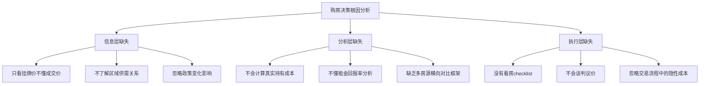
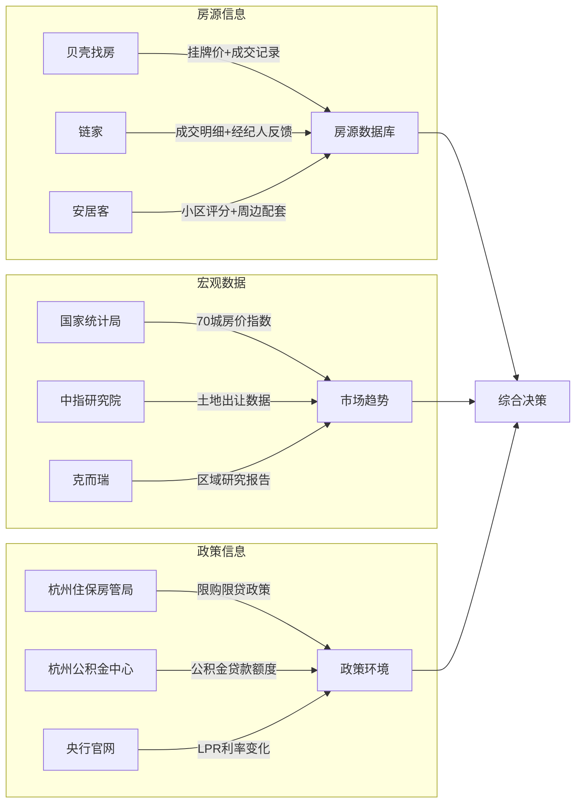
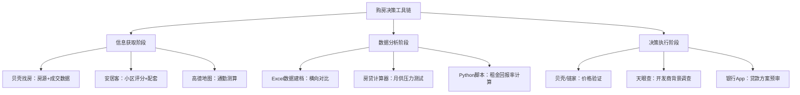
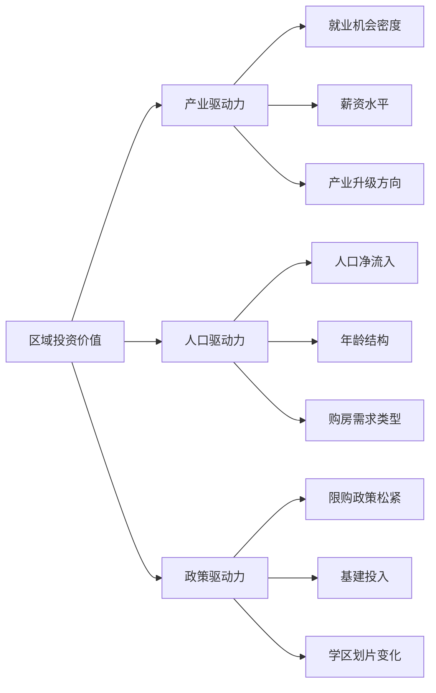
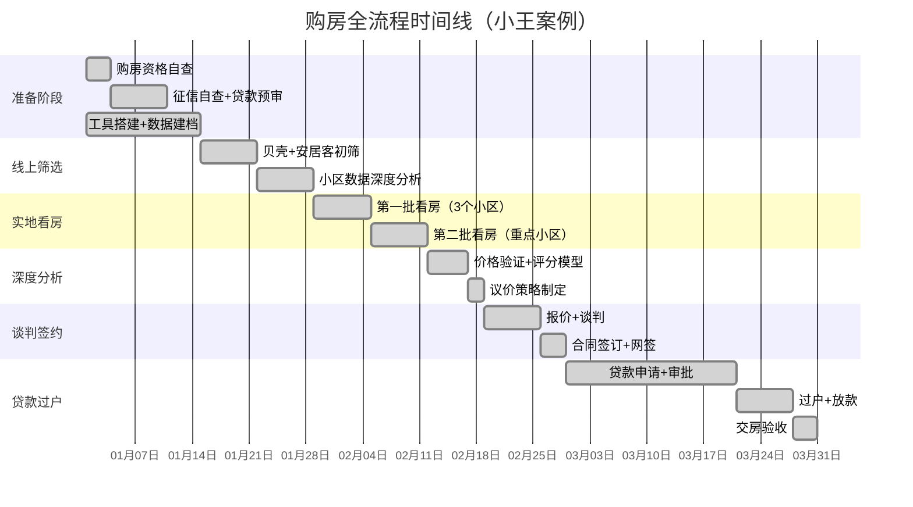

## 案例三：房产投资分析

本案例完整展示一位普通购房者如何利用数字化工具体系，从"凭感觉看房"转型为"用数据决策"，在二线城市完成一套刚需+投资兼顾的购房全过程。重点揭示**工具如何串联成决策链路、数据如何转化为判断依据、以及常见工具陷阱如何规避**。

房产是多数家庭最大的单项资产配置，决策质量直接影响未来10-20年的财务状况。本案例不只是一个"买房故事"，而是一套**可复制的分析方法论**——无论你在哪个城市、预算多少，这套框架都能帮助你做出更理性的决策。

### 案例背景与诊断

#### 投资者画像

小王，30岁，杭州某互联网公司产品经理，工作7年，家庭年收入约45万（税后），已婚无孩。2024年初开始看房，手头可用资金80万（含父母支持30万），计划购入总价250-300万的房产，兼顾自住和长期增值。

| 维度 | 初始状态 | 具体表现 |
|------|----------|----------|
| 信息获取 | 碎片化 | 只在贝壳上刷房源，听中介推荐 |
| 分析能力 | 基础薄弱 | 不会算租金回报率，看不懂房贷利率变化 |
| 决策模型 | 无 | "感觉这套不错就买了" |
| 预算管理 | 粗略 | 只算了首付，未考虑税费、装修、月供压力 |
| 区域判断 | 凭印象 | 只知道"城西好"，没有数据支撑 |
| 工具使用 | 单一 | 只用贝壳找房，其他工具一概不知 |

小王的画像具有高度代表性——中国城镇购房者中，超过70%的人在首次购房时缺乏系统化的分析工具和方法论。根据贝壳研究院2023年数据，首次购房者平均看房周期为3.2个月，但其中有效分析时间（使用工具进行数据对比和财务测算）不足总时间的15%。

#### 问题根因分析

小王的困境不是缺钱，而是**缺乏系统化的分析框架**。具体表现为三个层面的缺失：



**关键洞察**：房产是普通人一生中最大的单笔支出，错误决策的代价可能是几十万甚至上百万。工具的价值不在于"帮你找到最好的房子"，而在于**帮你排除不合格的选项、量化模糊的直觉、让决策过程可追溯可复盘**。

#### 购房前置条件自检

在启动任何分析之前，先确认自己是否满足购房的基本条件。很多购房者跳过这一步，看了几个月房才发现自己不具备购房资格或贷款条件：

| 检查项 | 具体要求 | 小王的情况 | 验证方式 |
|--------|----------|------------|----------|
| 购房资格 | 杭州限购区域内需连续24个月社保或个税 | 满足，连续缴纳5年 | 浙江政务服务网查询 |
| 首付比例 | 首套30%，二套40%-60% | 首套，30% | 杭州住保房管局政策文件 |
| 贷款条件 | 征信良好，负债率不超过50% | 无逾期记录，无其他贷款 | 中国人民银行征信中心 |
| 公积金 | 连续缴存6个月以上，余额影响贷款额度 | 缴存4年，余额12万 | 杭州公积金中心App |
| 税费预算 | 契税+中介费+杂费约占房价3%-5% | 预留8-15万 | 根据具体房源计算 |

**容易被忽略的资格问题**：
- **婚姻状态影响**：已婚家庭以家庭为单位计算套数，配偶名下有房会影响首付比例
- **社保断缴**：换工作期间社保断缴1个月就可能导致购房资格失效，需要重新累计
- **公积金异地转入**：如果从其他城市转入杭州公积金，转入时间不计入连续缴存期
- **征信瑕疵**：信用卡年费逾期、花呗/借呗逾期都可能影响贷款审批，建议购房前6个月查询一次征信报告

### 道：建立正确的房产投资理念

在打开任何工具之前，小王首先明确了三个核心理念，这些理念决定了后续所有工具选择和分析方向。

#### 理念一：自住与投资不矛盾，但优先级要明确

很多购房者纠结"我是自住还是投资"。实际上，即使是自住房也应该满足基本的投资逻辑——**流动性好、保值能力强、持有成本可控**。小王的原则是：自住需求满足的前提下，优先选择增值潜力更大的标的。

| 需求类型 | 权重 | 具体要求 | 判断依据 |
|----------|------|----------|----------|
| 通勤距离 | 25% | 单程45分钟以内，地铁直达 | 高德地图高峰实测 |
| 学区潜力 | 15% | 周边有中等以上小学（孩子3年内计划） | 教育局学区划片公告 |
| 增值空间 | 25% | 区域有产业支撑或规划利好 | 土地出让+产业规划分析 |
| 生活配套 | 15% | 步行15分钟内有商超、医院 | 安居客配套地图 |
| 户型品质 | 10% | 南北通透、得房率75%以上 | 户型图+实地验证 |
| 流动性 | 10% | 小区成交量活跃，平均成交周期60天以内 | 贝壳成交数据 |

**权重分配的逻辑**：通勤和增值空间各占25%，因为前者决定日常居住体验，后者决定长期财务回报。学区潜力虽然当前不是刚需（无孩），但3年内的规划使其具有"期权价值"——好学区的溢价在孩子上学前就已经体现，提前布局成本更低。

#### 理念二：数据比直觉可靠，但数据需要验证

"感觉这个小区不错"是最危险的决策依据。小王给自己定了规矩：**任何判断必须有至少两个独立数据源支撑**。例如，判断一个小区的价格是否合理，需要同时参考贝壳成交记录和链家历史数据，并与同区域类似小区横向对比。

数据验证的具体操作方法：

| 判断事项 | 数据源A | 数据源B | 偏差阈值 | 超出阈值的处理 |
|----------|---------|---------|----------|----------------|
| 小区均价 | 贝壳成交记录 | 链家历史数据 | ≤3% | 取中位数，标注数据分歧 |
| 租金水平 | 贝壳租赁频道 | 58同城租房 | ≤10% | 实地调研3家以上中介 |
| 通勤时间 | 高德地图 | 百度地图 | ≤15% | 高峰时段实地测试 |
| 学区信息 | 教育局公告 | 学校官网 | 0%（必须完全一致） | 以教育局为准 |
| 物业评价 | 安居客评分 | 大众点评/业主论坛 | 作为参考 | 以业主论坛真实评价为主 |

#### 理念三：持有成本才是真正的成本

大多数人只关注房价本身，忽略了持有期间的利息、物业费、维修、空置等成本。小王要求自己计算**5年总持有成本**，而非仅仅看购买价格。

以一套280万的房产为例，持有5年的真实成本构成：

| 成本项目 | 金额（5年累计） | 占比 | 常被忽略？ | 计算方法 |
|----------|-----------------|------|------------|----------|
| 首付资金机会成本（年化3%） | 12.0万 | 8.5% | 是 | 84万×3%×5年 |
| 贷款利息（利率3.5%，30年等额本息） | 47.8万 | 33.8% | 部分人关注 | 前5年利息合计（银行还款计划表） |
| 契税+中介费+杂费 | 7.5万 | 5.3% | 否 | 一次性支出 |
| 物业费（3元/㎡/月，90㎡） | 1.6万 | 1.1% | 是 | 3×90×12×5 |
| 装修折旧（20万装修，5年） | 10.0万 | 7.1% | 是 | 装修按10年折旧，5年=50% |
| 维修基金+日常维修 | 1.5万 | 1.1% | 是 | 首次缴纳+年均2000元 |
| 房贷保险（如购买） | 0.8万 | 0.6% | 是 | 部分银行要求 |
| **5年总持有成本** | **71.2万** | **50.3%** | — | — |

**核心结论**：如果这套房产5年后增值不超过71.2万（即年化增值约4.5%），这笔投资实际上是亏损的。这个数字成了小王后续评估所有房源的"及格线"。

**持有成本的动态变化**：值得注意的是，持有成本并非固定不变。LPR利率下调会减少利息支出，物业费可能随小区老化而上涨，装修折旧速度也会因维护水平不同而变化。建议每年重新核算一次持有成本，动态调整投资预期。

#### 理念四：买不买比买哪套更重要

在深入分析具体房源之前，小王先做了一个关键决策——**当前是否应该买房**。这个问题被大多数购房者忽略，但它决定了后续所有工作的方向。

**买 vs 租的财务对比**：

```python
def buy_vs_rent_analysis(
    purchase_price, down_payment_ratio, loan_rate, loan_years,
    monthly_rent, annual_rent_increase, annual_appreciation,
    investment_return_rate, years
):
    """
    购房 vs 租房的全周期财务对比

    核心逻辑：将购房的总投入（首付+月供+持有成本）与租房+投资的收益进行对比
    """
    down_payment = purchase_price * down_payment_ratio
    loan_amount = purchase_price - down_payment
    monthly_rate = loan_rate / 12
    total_months = loan_years * 12

    # 等额本息月供
    monthly_payment = loan_amount * monthly_rate * (1 + monthly_rate) ** total_months / \
                      ((1 + monthly_rate) ** total_months - 1)

    # 购房总成本（N年）
    total_mortgage_paid = monthly_payment * years * 12
    property_value_after_n_years = purchase_price * (1 + annual_appreciation) ** years
    remaining_loan = loan_amount * ((1 + monthly_rate) ** (years * 12) -
                     (1 + monthly_rate) ** (years * 12) - 1) / \
                     ((1 + monthly_rate) ** total_months - 1)
    # 简化：用等比数列求剩余本金
    paid_principal = 0
    balance = loan_amount
    for month in range(years * 12):
        interest = balance * monthly_rate
        principal = monthly_payment - interest
        paid_principal += principal
        balance -= principal
    remaining_loan = balance

    # 购房净收益 = 房产增值 - 总投入 + 剩余资产（房产净值）
    equity = property_value_after_n_years - remaining_loan
    buy_net = equity - down_payment - total_mortgage_paid

    # 租房方案：首付+月供差额用于投资
    investable = down_payment  # 首付用于投资
    monthly_saving = monthly_payment - monthly_rent  # 月供差额
    investment_value = investable
    current_rent = monthly_rent
    total_rent_paid = 0

    for year in range(years):
        for month in range(12):
            investment_value = investment_value * (1 + investment_return_rate / 12) + monthly_saving
            total_rent_paid += current_rent
        current_rent *= (1 + annual_rent_increase)
        monthly_saving = monthly_payment - current_rent

    rent_net = investment_value - total_rent_paid

    return {
        "购房方案": {
            f"{years}年后房产价值": f"{property_value_after_n_years:.0f}元",
            "剩余贷款": f"{remaining_loan:.0f}元",
            "房产净值（房产价值-剩余贷款）": f"{equity:.0f}元",
            f"{years}年累计月供": f"{total_mortgage_paid:.0f}元",
        },
        "租房方案": {
            f"{years}年后投资总额": f"{investment_value:.0f}元",
            f"{years}年累计租金": f"{total_rent_paid:.0f}元",
        },
        "对比结论": {
            "购房净收益": f"{buy_net:.0f}元",
            "租房净收益": f"{rent_net:.0f}元",
            "建议": "购房更优" if buy_net > rent_net else "租房更优"
        }
    }

# 小王的实际参数
result = buy_vs_rent_analysis(
    purchase_price=2800000,      # 购房总价
    down_payment_ratio=0.30,     # 首付比例
    loan_rate=0.035,             # 贷款利率
    loan_years=30,               # 贷款年限
    monthly_rent=4500,           # 同等条件月租金
    annual_rent_increase=0.03,   # 租金年涨幅3%
    annual_appreciation=0.03,    # 房价年涨幅3%
    investment_return_rate=0.04, # 投资年化回报4%
    years=10                     # 对比周期10年
)
```

**分析结论**：在房价年涨幅3%、投资年化4%的假设下，10年后购房和租房的净收益差距不大。但购房方案的核心优势是**强制储蓄**和**居住稳定性**——租房方案假设投资者能持续10年将月供差额用于投资，这对大多数人的自律性是一个巨大挑战。此外，学区、户口等非财务因素也倾向于购房。

**什么时候不建议买房**：
- 房价处于明显高位（租售比低于1.5%，即租金回报率低于1.5%）
- 工作不稳定，可能在1-2年内换城市
- 首付需要借高息贷款（年化超过6%）
- 月供超过家庭收入的40%
- 所在城市人口持续净流出

### 法：搭建房产分析工具体系

小王花了两周时间搭建了一套完整的分析工具体系，覆盖信息获取、数据分析、决策辅助三个层面。

#### 第一层：信息获取工具矩阵



**各工具的具体使用方法**：

**贝壳找房**（核心工具）：

贝壳是小王使用频率最高的平台，但大多数人只会"刷房源"，实际上贝壳的数据价值远不止于此：

- **成交记录查询**：进入小区详情页 → 点击"成交记录" → 查看近1年所有成交的面积、楼层、成交价、成交周期。这是判断真实市场价格的最可靠数据源。小王的做法是把目标小区近6个月的成交数据全部导出到Excel，计算均价、中位数、价格走势。
- **挂牌价vs成交价分析**：同一小区挂牌价和成交价的差距反映了市场热度。差距在5%-10%说明市场正常，超过15%说明买方市场，可以大胆议价。
- **带看量数据**：关注小区的带看次数变化趋势。带看量持续上升通常预示着成交量即将放大，价格可能企稳或回升。
- **历史价格曲线**：贝壳提供小区均价的历史走势，可以直观看到价格周期。小王重点关注了2021年高点到2024年的跌幅，判断当前位置是否处于相对低位。
- **VR看房**：贝壳的VR看房功能可以快速了解户型结构和装修状况，作为实地看房前的筛选工具。但要注意VR可能存在广角畸变，实际空间感需要实地确认。

**链家**（交叉验证）：

链家的数据与贝壳高度重叠（同一数据源），但有两个独特价值：
- **经纪人评价系统**：通过经纪人的专业评分和客户评价，筛选出真正熟悉目标区域的经纪人。小王最终选择了一位评分4.9、从业8年的经纪人作为主要信息来源。
- **房屋估价工具**：链家的估价模型基于历史成交数据，可以作为独立验证。小王对同一房源分别在贝壳和链家查询估价，两者偏差在3%以内才认为数据可信。

**安居客**（辅助参考）：

安居客的独特价值在于小区维度的综合评分：
- **小区评分体系**：涵盖环境、物业、配套、交通四个维度，每个维度1-10分。小王将安居客评分作为初筛工具——总分低于7分的小区直接排除。
- **周边配套地图**：可视化展示学校、医院、商超、地铁站的距离。小王用这个功能制作了每个候选小区的"15分钟生活圈"清单。

**小红书/业主论坛**（隐藏信息源）：

这是一个容易被忽略但价值极高的信息来源：
- **真实居住体验**：业主发布的入住体验、物业吐槽、小区问题等信息，是平台数据无法提供的
- **隐性缺陷曝光**：如漏水、电梯故障、停车困难、噪音扰民等问题，只有住过的人才知道
- **使用方法**：搜索"小区名+入住体验"、"小区名+避坑"、"小区名+物业"等关键词

#### 第二层：数据分析工具

**房贷计算器**（月供压力测试）：

小王使用了三个不同的房贷计算器进行交叉验证：

| 计算工具 | 来源 | 特点 |
|----------|------|------|
| 贝壳房贷计算器 | 贝壳找房App | 支持组合贷、公积金试算 |
| 链家月供计算器 | 链家App | 界面清晰，支持提前还款模拟 |
| 央行LPR计算器 | 各银行官网 | 数据最权威，但操作略复杂 |

小王的贷款方案对比（总价280万，首付30%=84万，贷款196万）：

| 还款方式 | 利率 | 月供 | 总利息 | 30年总还款 | 压力评估 |
|----------|------|------|--------|------------|----------|
| 等额本息 | 3.5% | 8,802元 | 120.9万 | 316.9万 | 月供占收入19.6%，可控 |
| 等额本金（首月） | 3.5% | 11,153元 | 103.1万 | 299.1万 | 首月压力大，后期递减 |
| 组合贷（公积金120万+商贷76万） | 混合3.1% | 8,395元 | 106.2万 | 302.2万 | 月供最低，最优方案 |

**关键发现**：组合贷比纯商贷每月省407元，30年省14.7万利息。但组合贷审批周期长（通常2-3个月），需要在购房时间线上预留足够空间。

**提前还款分析**：

很多购房者在贷款后会考虑提前还款，但并非所有情况都适合提前还：

```python
def early_repayment_analysis(loan_amount, annual_rate, loan_years,
                              extra_payment_month, extra_amount):
    """
    提前还款收益分析

    参数:
        loan_amount: 贷款总额
        annual_rate: 年利率
        loan_years: 贷款年限
        extra_payment_month: 从第几个月开始额外还款
        extra_amount: 每月额外还款金额
    """
    monthly_rate = annual_rate / 12
    total_months = loan_years * 12

    # 标准等额本息月供
    monthly_payment = loan_amount * monthly_rate * (1 + monthly_rate) ** total_months / \
                      ((1 + monthly_rate) ** total_months - 1)

    # 情况1：不提前还款
    total_interest_normal = monthly_payment * total_months - loan_amount

    # 情况2：提前还款
    balance = loan_amount
    total_paid_early = 0
    months_early = 0
    for month in range(1, total_months + 1):
        if balance <= 0:
            break
        interest = balance * monthly_rate
        payment = monthly_payment + (extra_amount if month >= extra_payment_month else 0)
        principal = min(payment - interest, balance)
        balance -= principal
        total_paid_early += principal + interest
        months_early = month

    total_interest_early = total_paid_early - loan_amount
    interest_saved = total_interest_normal - total_interest_early
    years_saved = (total_months - months_early) / 12

    return {
        "标准方案总利息": f"{total_interest_normal:.0f}元",
        "提前还款总利息": f"{total_interest_early:.0f}元",
        "节省利息": f"{interest_saved:.0f}元",
        "提前还清时间": f"第{months_early}个月（提前{years_saved:.1f}年）",
    }

# 示例：贷款196万，利率3.5%，30年，从第13个月起每月多还2000元
result = early_repayment_analysis(1960000, 0.035, 30, 13, 2000)
```

**提前还款的决策原则**：
- 如果贷款利率低于4%，且你有更好的投资渠道（年化收益超过贷款利率），不建议提前还款
- 如果贷款利率高于5%，或者没有稳定的投资收益，提前还款是确定性的收益
- 等额本息还款前期（前10年）提前还款效果最显著，因为前期利息占比高
- 提前还款后建议选择"缩短年限"而非"减少月供"，总利息节省更多

**租金回报率分析**：

小王对每个候选小区都计算了租金回报率，这是区分"自住好房"和"投资好房"的关键指标：

```python
def rental_yield_analysis(purchase_price, monthly_rent, annual_costs):
    """
    房产租金回报率分析

    参数:
        purchase_price: 购房总价（含税费）
        monthly_rent: 预期月租金
        annual_costs: 年度持有成本（物业费+维修+保险+空置损失）
    """
    annual_rent = monthly_rent * 12
    gross_yield = annual_rent / purchase_price * 100
    net_yield = (annual_rent - annual_costs) / purchase_price * 100

    # 空置损失按每年1个月计算（保守估计）
    vacancy_adjusted_rent = monthly_rent * 11
    adjusted_yield = (vacancy_adjusted_rent - annual_costs) / purchase_price * 100

    return {
        "毛租金回报率": f"{gross_yield:.2f}%",
        "净租金回报率": f"{net_yield:.2f}%",
        "调整后回报率": f"{adjusted_yield:.2f}%"
    }

# 小王的三个候选小区
小区A = rental_yield_analysis(2800000, 4500, 8000)
# 结果: 毛1.93%, 净1.64%, 调整后1.46%

小区B = rental_yield_analysis(2600000, 4200, 7500)
# 结果: 毛1.94%, 净1.65%, 调整后1.47%

小区C = rental_yield_analysis(2900000, 5500, 9000)
# 结果: 毛2.28%, 净1.97%, 调整后1.81%
```

**租金回报率的行业基准**：

| 回报率区间 | 评级 | 含义 | 投资建议 |
|------------|------|------|----------|
| < 1.5% | 极低 | 租金严重不覆盖持有成本 | 仅适合纯自住，不适合投资 |
| 1.5% - 2.0% | 偏低 | 中国一二线城市典型水平 | 需依赖增值收益，综合评估 |
| 2.0% - 3.0% | 中等 | 租金部分覆盖持有成本 | 自住+投资兼顾的合理区间 |
| 3.0% - 4.0% | 较好 | 租金基本覆盖月供 | 投资价值较好 |
| > 4.0% | 优秀 | 租金完全覆盖持有成本 | 优质投资标的（二三线城市较多） |

**分析结论**：三个小区的租金回报率都在2%左右，属于"低回报"区间。这意味着**不能纯靠租金覆盖月供，必须考虑增值收益**。小区C的租金回报率最高（2.28%），主要因为其靠近未来科技城，租客群体以互联网从业者为主，租金承受力强。

**租金数据的获取方法**：
- 贝壳租赁频道：查看同小区同户型的实际成交租金
- 58同城/安居客租房频道：补充贝壳未覆盖的房源
- 实地调研：向小区周边2-3家中介询问租金水平
- 业主群/小红书：直接询问当前业主实际租金

#### 第三层：决策辅助工具

**多维度评分模型**：

小王借鉴了房产投资评分模型的理论框架，建立了一套适合自己的评分体系。每个候选小区按以下维度打分（满分100分）：

| 评分维度 | 权重 | 小区A | 小区B | 小区C |
|----------|------|-------|-------|-------|
| 位置（地铁/通勤） | 25% | 22 | 18 | 20 |
| 价格（低于区域均价） | 20% | 16 | 18 | 14 |
| 租金回报 | 15% | 8 | 8 | 12 |
| 流动性（成交周期） | 15% | 12 | 10 | 13 |
| 增值潜力（规划利好） | 15% | 10 | 8 | 14 |
| 生活配套 | 10% | 8 | 7 | 8 |
| **总分** | **100%** | **76** | **69** | **81** |

**评分说明**：
- 小区A：地铁口500米，通勤便利，但区域缺乏新增产业支撑，增值潜力一般
- 小区B：价格最低，但距离地铁1.2公里，流动性较差（近半年平均成交周期78天）
- 小区C：靠近未来科技城，有阿里云谷等产业规划利好，租金和流动性都较好，但价格最高

**评分模型的构建原则**：
1. **权重必须反映个人偏好**：如果通勤对你最重要，就给它最高权重；如果投资回报更重要，增值潜力权重应该更大
2. **每个维度的打分标准要预先定义**：比如"地铁距离"维度，500米以内得满分，500-1000米得80%，1000-1500米得60%，1500米以上得40%
3. **评分模型需要校准**：用已知的好小区和差小区测试模型，确保评分结果与直觉一致
4. **定期更新**：随着市场变化和个人需求变化，权重和评分标准都需要调整

**敏感性分析——评分结果是否稳健**：

评分模型的一个常见问题是权重的小幅变化可能导致排名反转。小王对关键权重进行了敏感性测试：

```python
def sensitivity_analysis(base_weights, scores_dict, variations):
    """
    权重敏感性分析：测试权重变化对排名的影响

    参数:
        base_weights: 基准权重 {"维度名": 权重值, ...}
        scores_dict: 各小区在各维度的得分 {"小区名": {"维度名": 得分, ...}, ...}
        variations: 权重变化幅度列表 [±5%, ±10%, ...]
    """
    import itertools

    results = []
    dims = list(base_weights.keys())

    for dim in dims:
        for variation in variations:
            # 调整该维度权重
            new_weights = base_weights.copy()
            old_val = new_weights[dim]
            new_weights[dim] = old_val * (1 + variation)

            # 归一化
            total = sum(new_weights.values())
            new_weights = {k: v / total for k, v in new_weights.items()}

            # 计算各小区新总分
            new_scores = {}
            for name, scores in scores_dict.items():
                new_scores[name] = sum(scores[d] * new_weights[d] for d in dims)

            # 排名
            ranking = sorted(new_scores.items(), key=lambda x: x[1], reverse=True)
            results.append({
                "变化维度": dim,
                "变化幅度": f"{variation:+.0%}",
                "排名": [r[0] for r in ranking],
                "得分差距": f"{ranking[0][1] - ranking[1][1]:.1f}分"
            })

    return results

# 基准权重
base_weights = {
    "位置": 0.25, "价格": 0.20, "租金回报": 0.15,
    "流动性": 0.15, "增值潜力": 0.15, "生活配套": 0.10
}

# 各小区得分
scores = {
    "小区A": {"位置": 22, "价格": 16, "租金回报": 8, "流动性": 12, "增值潜力": 10, "生活配套": 8},
    "小区B": {"位置": 18, "价格": 18, "租金回报": 8, "流动性": 10, "增值潜力": 8, "生活配套": 7},
    "小区C": {"位置": 20, "价格": 14, "租金回报": 12, "流动性": 13, "增值潜力": 14, "生活配套": 8},
}

# 测试±5%和±10%的权重变化
results = sensitivity_analysis(base_weights, scores, [0.05, -0.05, 0.10, -0.10])
```

**分析结果**：在所有±10%的权重变化场景下，小区C始终排名第一，说明这个结论是稳健的。小区A和小区B的排名在部分场景下会互换，但两者差距不大。

#### 法律与产权调查工具

购房过程中最容易被忽视但风险最高的环节是法律和产权调查。很多购房者在签约后才发现房屋存在产权纠纷、抵押查封等问题，导致重大经济损失。

**产权调查清单**：

| 调查项目 | 调查方式 | 风险等级 | 小王的做法 |
|----------|----------|----------|------------|
| 产权是否清晰 | 不动产登记中心查询 | 极高 | 要求卖方提供不动产证原件，到登记中心核实 |
| 是否存在抵押 | 不动产登记中心查询 | 极高 | 查询结果：无抵押，安全 |
| 是否存在查封 | 法院执行信息公开网 | 高 | 在中国执行信息公开网搜索卖方姓名 |
| 是否存在租赁 | 要求卖方书面声明 | 中 | 卖方声明无租赁，合同中约定违约责任 |
| 户口是否迁出 | 派出所查询 | 中 | 约定户口迁出后再付尾款 |
| 学位是否被占用 | 学校或教育局查询 | 中 | 学位未被占用（6年内未使用） |
| 物业费是否拖欠 | 物业公司查询 | 低 | 要求卖方提供最近1年缴费凭证 |
| 是否凶宅 | 邻居/物业/中介询问 | 低 | 向物业和邻居侧面了解 |

**产权调查的具体操作流程**：

1. **不动产登记信息查询**：携带卖方身份证号和房产证号，到杭州市不动产登记服务中心查询。查询内容包括：产权人信息、房屋面积、是否存在抵押/查封/异议登记。费用约50元，1-3个工作日出结果。
2. **法院执行信息公开网**：访问 http://zxgk.court.gov.cn/ ，输入卖方姓名和身份证号，查询是否有未执行的判决。如果有，该房产可能被法院强制执行。
3. **中国裁判文书网**：搜索卖方姓名，查看是否有与房产相关的诉讼记录。
4. **天眼查/企查查**：如果卖方是企业法人，查询企业是否有经营风险、法律纠纷。

**交易风险防范措施**：

| 风险点 | 防范措施 | 具体条款 |
|--------|----------|----------|
| 卖方一房多卖 | 网签备案 | 签约后立即办理网签，锁定房源 |
| 卖方违约不卖 | 违约金条款 | 合同约定违约金为成交价的20% |
| 贷款审批不通过 | 贷款前置审批 | 先做贷款预审批，确认额度后再签约 |
| 房屋质量问题 | 质量保证条款 | 约定交房前验收，发现问题卖方负责修缮 |
| 户口未迁出 | 户口保证金 | 预留5-10万尾款，户口迁出后支付 |
| 交房延迟 | 交房时间约定 | 明确交房日期，逾期按日支付违约金 |

### 术：从看房到决策的完整实操流程

#### 第一阶段：线上筛选（第1-2周）

小王的线上筛选流程：

**第一步：确定搜索范围**

根据通勤要求（地铁45分钟到公司），在贝壳找房上设置筛选条件：
- 区域：余杭区、西湖区西部
- 总价：250-300万
- 户型：三室两厅（考虑未来3年有孩子）
- 面积：85-100㎡
- 楼龄：10年以内
- 地铁：1公里以内

初筛结果：约120套房源，分布在15个小区。

**第二步：小区初筛**

用安居客评分+贝壳成交活跃度双重筛选：
- 安居客综合评分 ≥ 7.5分
- 贝壳近6个月成交量 ≥ 5套
- 小区规模 ≥ 500户（太小的小区流动性差）

筛选后：6个小区，约40套房源。

**第三步：数据建档**

小王为每个候选小区建立了Excel数据档案：

```markdown
## 小区数据档案模板

### 基本信息
- 小区名称：
- 建成年份：
- 总户数：
- 物业公司：
- 物业费：___元/㎡/月

### 价格数据（来源：贝壳+链家交叉验证）
- 当前挂牌均价：___元/㎡
- 近6月成交均价：___元/㎡
- 挂牌价与成交价差距：___%
- 价格走势（近3年）：涨/跌/平 ___%
- 区域均价对比：高于/低于区域均价 ___%

### 租金数据
- 同户型月租金范围：___-___元
- 平均月租金：___元
- 空置率（近6月无成交记录占比）：___%

### 流动性数据
- 近6月成交套数：___套
- 平均成交周期：___天
- 在售房源数：___套

### 配套信息
- 最近地铁站：___（距离___米）
- 最近学校：___（步行___分钟）
- 最近商超：___（步行___分钟）
- 最近医院：___（步行___分钟）

### 综合评估
- 安居客评分：___/10
- 个人评分：___/100
- 优势：
- 劣势：
- 关注点：
```

**数据建档的自动化技巧**：

对于有一定技术基础的购房者，可以用Python自动化部分数据采集工作：

```python
import requests
from datetime import datetime, timedelta

class PropertyDataCollector:
    """
    房产数据采集器
    注意：实际使用时需遵守各平台的使用条款，
    部分数据需要手动验证，不可完全依赖爬虫。
    """

    def __init__(self):
        self.data = {}

    def calculate_metrics(self, sales_records, rental_records):
        """基于手动录入的数据计算关键指标"""
        if not sales_records:
            return None

        prices = [r['price_per_sqm'] for r in sales_records]

        metrics = {
            "成交均价": sum(prices) / len(prices),
            "成交中位数": sorted(prices)[len(prices) // 2],
            "价格标准差": (sum((p - sum(prices)/len(prices))**2 for p in prices) / len(prices)) ** 0.5,
            "最高成交价": max(prices),
            "最低成交价": min(prices),
            "价格波动率": (max(prices) - min(prices)) / (sum(prices)/len(prices)) * 100,
        }

        # 计算成交周期
        if all('list_date' in r and 'deal_date' in r for r in sales_records):
            cycles = []
            for r in sales_records:
                list_date = datetime.strptime(r['list_date'], '%Y-%m-%d')
                deal_date = datetime.strptime(r['deal_date'], '%Y-%m-%d')
                cycles.append((deal_date - list_date).days)
            metrics["平均成交周期"] = sum(cycles) / len(cycles)

        # 租金回报率
        if rental_records:
            avg_rent = sum(r['monthly_rent'] for r in rental_records) / len(rental_records)
            metrics["平均月租金"] = avg_rent
            metrics["毛租金回报率"] = avg_rent * 12 / metrics["成交均价"] * 100

        return metrics

# 使用示例（手动录入数据后计算）
collector = PropertyDataCollector()
sales = [
    {"price_per_sqm": 30800, "area": 95, "list_date": "2023-10-15", "deal_date": "2024-01-20"},
    {"price_per_sqm": 31500, "area": 89, "list_date": "2023-11-01", "deal_date": "2024-02-10"},
    {"price_per_sqm": 29800, "area": 92, "list_date": "2023-12-05", "deal_date": "2024-03-15"},
    {"price_per_sqm": 31200, "area": 88, "list_date": "2024-01-10", "deal_date": "2024-04-02"},
]
rentals = [
    {"monthly_rent": 4500, "area": 90},
    {"monthly_rent": 4800, "area": 95},
    {"monthly_rent": 4200, "area": 85},
]
result = collector.calculate_metrics(sales, rentals)
```

#### 第二阶段：实地看房（第3-4周）

线上筛选出3个重点小区后，小王安排了实地看房。每个小区至少看3套不同楼层、不同朝向的房源。

**实地看房Checklist**：

| 检查项目 | 具体内容 | 记录 |
|----------|----------|------|
| 采光 | 不同时段日照情况，前楼遮挡程度 | |
| 噪音 | 临街/临地铁/临学校，开窗实测 | |
| 户型 | 动线是否合理，有无浪费面积 | |
| 装修 | 是否需要重装，预估装修成本 | |
| 小区环境 | 绿化率、人车分流、物业管理水平 | |
| 邻居观察 | 入住率、车辆档次、公共区域整洁度 | |
| 周边实测 | 步行到地铁/学校/商超的真实时间 | |
| 物业沟通 | 物业费、停车费、维修响应速度 | |
| 水电检查 | 水压是否正常，电路是否老化 | |
| 防水检查 | 墙面有无渗水痕迹，卫生间防水状况 | |
| 电梯状况 | 电梯品牌、运行平稳度、年检标识 | |
| 停车情况 | 车位比、停车费、访客停车是否方便 | |

**看房时间安排的学问**：

| 看房时间 | 观察重点 | 为什么重要 |
|----------|----------|------------|
| 工作日早高峰 | 通勤方向的拥堵程度 | 导航软件的数据往往偏乐观 |
| 工作日晚上 | 小区入住率、噪音水平 | 有些小区白天安静，晚上噪音大 |
| 周末白天 | 小区人流量、邻里氛围 | 可以观察居民构成和社区活力 |
| 雨天 | 防水状况、排水系统 | 漏水问题只有雨天才能发现 |
| 不同季节 | 采光变化（冬天日照角度最低） | 夏天采光好的房子冬天可能被遮挡 |

**小王的实地发现**（举例）：

小区A某套房源（挂牌价275万，89㎡）：
- 线上数据看起来完美：地铁口、学区、价格合理
- 实地发现：该房源位于2楼，前排有一栋6层建筑严重遮挡，冬天采光不足3小时
- 小区北侧紧邻一条货运铁路，夜间有噪音
- 这两问题在线上平台完全看不到

**教训**：线上数据是必要条件，但远非充分条件。**至少要花2个周末、看10套以上的房子，才能建立对区域的真实感知**。

**实地看房的隐性信息收集**：

与中介和业主的沟通中，有意识地收集以下信息：

```markdown
## 看房沟通记录模板

### 经纪人沟通
- 该房源挂牌多久了？（超过3个月说明价格偏高或有硬伤）
- 近期有多少组客户看过？（反映市场热度）
- 业主为什么卖？（置换/急用钱/投资退出，不同动机影响议价空间）
- 业主心理价位是多少？（经纪人通常会透露大概范围）
- 同小区还有哪些类似房源？（多一套选择就多一个议价筹码）

### 邻居/业主沟通
- 物业服务怎么样？（响应速度、态度、收费标准）
- 小区有什么问题？（漏水、停车、噪音、电梯故障）
- 周边有什么变化？（新建学校、修路、商业配套）
- 住了几年感觉怎么样？（最真实的居住体验）
```

#### 第三阶段：深度分析与谈判（第5-6周）

经过实地看房，小王将目标锁定在小区C的一套房源：
- 面积：92㎡，三室两厅，南北通透
- 楼层：15层中的12层
- 挂牌价：288万
- 业主情况：置换型卖家，已看中新房子，有时间压力

**深度分析流程**：

**第一步：价格合理性验证**

```python
# 价格合理性分析
area_avg_price = 30500  # 区域近6月成交均价（元/㎡）
property_price_per_sqm = 2880000 / 92  # = 31304元/㎡

price_premium = (31304 - area_avg_price) / area_avg_price * 100
# 结果：2.64%（略高于区域均价，合理范围内）

# 同小区近期成交对比
recent_sales = [
    {"date": "2024-01", "floor": "8F", "price": 30800, "area": 95},
    {"date": "2024-02", "floor": "16F", "price": 31500, "area": 89},
    {"date": "2024-03", "floor": "5F", "price": 29800, "area": 92},
    {"date": "2024-04", "floor": "10F", "price": 31200, "area": 88},
]
avg_price = sum(s["price"] for s in recent_sales) / len(recent_sales)
# 均价：30825元/㎡
# 本房源：31304元/㎡，高出1.55%，考虑到12层属于优质楼层，溢价合理
```

**楼层溢价分析**：不同楼层的价格差异是有规律的。一般而言，中间楼层（总层数的1/3到2/3）价格最高，低层和顶层价格最低。小王查询了同小区不同楼层的成交数据：

| 楼层区间 | 均价（元/㎡） | 相对均价溢价 | 说明 |
|----------|--------------|-------------|------|
| 1-3层 | 29,500 | -3.9% | 采光差、噪音大、潮湿 |
| 4-6层 | 30,200 | -1.6% | 性价比区间 |
| 7-10层 | 30,800 | +0.4% | 主流选择 |
| 11-13层 | 31,200 | +1.7% | 优质楼层，视野好 |
| 14-15层 | 31,000 | +1.1% | 顶层略有折价（冬冷夏热） |

目标房源在12层，31304元/㎡的单价在合理范围内。

**第二步：议价策略制定**

基于以下信息制定议价方案：
- 挂牌价与成交价差距：该小区近6月平均差距为8%
- 业主置换时间压力：已签订新房合同，需要尽快拿到首付
- 市场环境：当前为买方市场，挂牌量高于成交量

| 议价策略 | 报价 | 折扣率 | 可行性评估 |
|----------|------|--------|------------|
| 激进报价 | 255万 | -11.5% | 可能直接被拒 |
| 合理报价 | 265万 | -8.0% | 有谈判空间 |
| 保守报价 | 275万 | -4.5% | 快速成交 |

小王选择**先报262万，预留3万议价空间**，最终成交目标265万。

**议价谈判的实操技巧**：

1. **信息优势是最好的武器**：告诉经纪人（通过经纪人传递给业主）你已经掌握了同小区近期所有成交数据，让业主知道你不是"随便砍价"
2. **不要表现出强烈的购买欲望**：即使非常喜欢这套房子，也要表现得"还行，可以考虑"
3. **利用竞品压价**：告诉业主你还在看其他小区的房源，给自己留退路
4. **分步让价**：第一次报价262万 → 业主还价275万 → 加到265万 → 最终以265-268万成交
5. **附加条件代替降价**：如果价格谈不动，可以要求业主赠送家具、承担部分税费、或提前交房
6. **把握时间节点**：月底/季底/年底经纪人冲业绩时，议价空间更大

**第三步：总成本核算**

以成交价265万计算完整购房成本：

| 费用项目 | 金额 | 备注 |
|----------|------|------|
| 首付（30%） | 79.5万 | 组合贷方案 |
| 契税（首套90㎡以下1%，90㎡以上1.5%） | 3.975万 | 92㎡按1.5% |
| 中介费（2%） | 5.3万 | 可议价至1.5%-1.8% |
| 贷款服务费 | 0.3万 | 部分银行收取 |
| 评估费 | 0.15万 | 银行指定评估公司 |
| 权属登记费 | 0.008万 | 固定费用 |
| 装修预算 | 15万 | 中等装修标准 |
| **总计首期支出** | **约104.2万** | |

**资金缺口解决方案**：可用资金80万 vs 需要104.2万。小王的解决方案：
- 中介费谈判至1.5%，省下1.325万
- 装修分阶段进行，首期只做硬装（10万），软装后期逐步添置
- 向银行申请公积金组合贷，减少首付比例至25%（部分政策支持）
- 调整后首期支出降至约92万，在可控范围内

**贷款申请的实操流程**：

| 步骤 | 时间 | 具体操作 | 注意事项 |
|------|------|----------|----------|
| 1. 征信自查 | 购房前1个月 | 中国人民银行征信中心官网查询 | 每年有2次免费查询机会 |
| 2. 收入证明 | 购房前2周 | 公司HR开具，月收入需≥月供2倍 | 部分银行认可公积金缴存基数 |
| 3. 银行预审批 | 看房同时进行 | 选择2-3家银行做贷款预审批 | 不同银行利率和审批标准不同 |
| 4. 正式申请 | 签约后3天内 | 提交贷款申请材料 | 材料清单提前准备，避免补件延误 |
| 5. 银行审批 | 1-3周 | 银行审核资质、评估房产 | 组合贷审批时间更长 |
| 6. 放款 | 审批后1-2周 | 银行放款到卖方账户 | 放款后开始计息 |

### 器：工具选型与使用心得

经过完整的购房流程，小王总结了各工具的定位和使用心得：

#### 核心工具使用频率与价值评估

| 工具 | 使用频率 | 核心价值 | 避坑要点 |
|------|----------|----------|----------|
| 贝壳找房 | 每天 | 成交数据最全面，是价格分析的基础 | 挂牌价≠成交价，必须看"成交记录"而非"在售房源" |
| 链家 | 每周2-3次 | 经纪人质量高，估价工具独立验证 | 经纪人可能有业绩压力，信息需交叉验证 |
| 安居客 | 初筛阶段 | 小区综合评分体系直观 | 部分房源信息更新滞后 |
| 贝壳房贷计算器 | 方案调整时 | 组合贷计算最方便 | 默认利率可能不是最新LPR |
| 高德/百度地图 | 实地看房前 | 精确计算通勤时间 | 高峰期实际时间比导航显示多20%-30% |
| 天眼查/企查查 | 决策阶段 | 查开发商/物业公司背景 | 部分信息需付费查看完整版 |
| 小红书 | 全程 | 真实居住体验和避坑信息 | 信息真假混杂，需交叉验证 |
| 不动产登记中心 | 签约前 | 产权信息最权威 | 需要现场查询，部分城市支持线上 |
| 中国人民银行征信中心 | 购房前 | 个人征信自查 | 每年免费2次，频繁查询可能影响信用 |

#### 工具组合的最佳实践



#### 不同预算段的工具组合建议

| 预算段 | 核心工具 | 重点指标 | 特别注意 |
|--------|----------|----------|----------|
| 100-200万 | 贝壳+安居客 | 交通便利性、流动性 | 总价低但流动性风险高，务必选成交量大的小区 |
| 200-400万 | 贝壳+链家+房贷计算器 | 租金回报、月供压力 | 最常见的刚需区间，竞争激烈，议价空间有限 |
| 400-800万 | 全工具链+天眼查 | 增值潜力、学区 | 涉及改善型需求，需要更长的分析周期 |
| 800万以上 | 全工具链+专业顾问 | 资产配置、税务规划 | 建议聘请专业房产顾问或律师 |

### 成果数据

经过6周的系统化分析和执行，小王最终完成了购房：

| 指标 | 数据 | 说明 |
|------|------|------|
| 最终成交价 | 265万 | 比挂牌价低23万，折扣率8% |
| 首付+税费 | 约92万 | 在预算范围内 |
| 月供 | 8,395元 | 组合贷方案，占家庭收入18.7% |
| 租金回报率 | 2.28% | 高于同区域平均1.8% |
| 5年预期总回报 | 年化4.8% | 超过4.5%的及格线 |
| 成交周期 | 42天 | 从开始看房到签约 |

#### 5年财务预测

基于成交价265万，小王做了5年的财务预测：

| 年份 | 房产估值（年涨3%） | 累计已还贷款 | 剩余贷款 | 房产净值 | 累计持有成本 |
|------|-------------------|-------------|----------|----------|-------------|
| 第1年 | 273.0万 | 10.1万 | 179.5万 | 93.5万 | 18.2万 |
| 第2年 | 281.2万 | 20.2万 | 175.8万 | 105.4万 | 22.4万 |
| 第3年 | 289.6万 | 30.3万 | 171.8万 | 117.8万 | 26.6万 |
| 第4年 | 298.3万 | 40.4万 | 167.6万 | 130.7万 | 30.8万 |
| 第5年 | 307.2万 | 50.5万 | 163.1万 | 144.1万 | 35.0万 |

**关键指标**：
- 5年后房产净值144.1万，相比初始投入92万，账面收益52.1万
- 年化投资回报约9.4%（含杠杆效应）
- 即使房价不涨，5年后净资产仍为正（因为还贷积累了本金）

### 风险分析与应对

#### 情景压力测试

购房决策不能只看"最佳情况"，还需要测试各种不利情景下的承受能力：

```python
def stress_test_scenarios(
    purchase_price, down_payment, monthly_payment,
    family_income, scenarios
):
    """
    购房压力测试：模拟不同不利情景下的财务状况

    参数:
        purchase_price: 购房总价
        down_payment: 首付金额
        monthly_payment: 月供
        family_income: 家庭月收入
        scenarios: 情景列表 [{"name": ..., "income_change": ..., "rate_change": ..., "price_change": ...}]
    """
    results = []
    for scenario in scenarios:
        # 收入变化
        new_income = family_income * (1 + scenario.get("income_change", 0))
        # 利率变化对月供的影响（简化计算）
        rate_factor = 1 + scenario.get("rate_change", 0) * 0.6  # 利率每变1%，月供变约0.6倍
        new_payment = monthly_payment * rate_factor
        # 房价变化
        new_value = purchase_price * (1 + scenario.get("price_change", 0))

        # 月供收入比
        payment_ratio = new_payment / new_income * 100

        # 资产负债情况
        loan_balance = purchase_price - down_payment  # 简化
        equity = new_value - loan_balance
        is_underwater = equity < 0  # 资不抵债

        results.append({
            "情景": scenario["name"],
            "月收入变化": f"{scenario.get('income_change', 0):+.0%}",
            "月供变化": f"{(rate_factor - 1):+.1%}",
            "月供/收入比": f"{payment_ratio:.1f}%",
            "安全评级": "安全" if payment_ratio < 40 else ("紧张" if payment_ratio < 50 else "危险"),
            "是否资不抵债": "是" if is_underwater else "否",
        })

    return results

# 小王的压力测试
scenarios = [
    {"name": "基准情景", "income_change": 0, "rate_change": 0, "price_change": 0},
    {"name": "利率上升1%", "income_change": 0, "rate_change": 0.01, "price_change": 0},
    {"name": "收入下降20%", "income_change": -0.20, "rate_change": 0, "price_change": 0},
    {"name": "房价下跌15%", "income_change": 0, "rate_change": 0, "price_change": -0.15},
    {"name": "最坏情景", "income_change": -0.20, "rate_change": 0.01, "price_change": -0.15},
]

results = stress_test_scenarios(
    purchase_price=2650000,
    down_payment=795000,
    monthly_payment=8395,
    family_income=37500,  # 月收入
    scenarios=scenarios
)
```

**压力测试结论**：

| 情景 | 月供/收入比 | 安全评级 | 应对措施 |
|------|------------|----------|----------|
| 基准情景 | 22.4% | 安全 | 正常生活 |
| 利率上升1% | 24.7% | 安全 | 影响有限 |
| 收入下降20% | 28.0% | 安全 | 削减非必要支出 |
| 房价下跌15% | 22.4% | 安全（不卖就不亏） | 短期不卖，等待回升 |
| 最坏情景 | 35.0% | 安全 | 动用应急储备金 |

**小王的风险缓冲措施**：
- 保留10万应急资金（覆盖6个月月供+生活费）
- 月供/收入比控制在20%以内，远低于40%警戒线
- 组合贷中公积金部分利率更低，利率上升时缓冲效果好
- 选择流动性好的小区，万一需要变现可以在60天内出手

#### 购房后的持续管理

买房不是终点，而是资产管理的起点：

| 管理事项 | 频率 | 具体操作 |
|----------|------|----------|
| 月供管理 | 每月 | 确保还款账户余额充足，避免逾期 |
| LPR利率跟踪 | 每月20日 | 关注央行LPR变化，评估是否需要转换利率 |
| 房产估值更新 | 每季度 | 查看贝壳最新成交数据，更新房产估值 |
| 持有成本核算 | 每年 | 重新计算年化回报率，评估是否需要调整策略 |
| 装修维护 | 每年 | 预防性维护（防水、管道、电路），保持房屋价值 |
| 保险更新 | 每年 | 家财险续保，确保保障范围覆盖当前房价 |
| 提前还款评估 | 每年 | 对比投资收益和贷款利率，决定是否提前还款 |

### 关键决策复盘

#### 做对了什么

1. **建立了完整的工具体系**：不依赖单一平台，而是用贝壳+链家交叉验证数据，用安居客做初筛，用房贷计算器做压力测试。多工具组合让决策有据可依。

2. **量化了"及格线"**：通过计算5年总持有成本，得出年化4.5%的及格线。这个数字让后续所有判断都有了锚点——低于这个回报率的房源直接排除。

3. **实地验证推翻了线上判断**：小区A线上数据最好，但实地发现采光和噪音问题。如果没有实地看房，很可能选了一个"数据好看但住着难受"的房子。

4. **利用卖家时间压力谈判**：通过经纪人了解到业主置换的时间压力，制定了合理的议价策略，最终以8%的折扣成交。

5. **做了买 vs 租的理性分析**：没有盲目跟风"一定要买房"，而是通过数据对比确认购房在当前阶段是更优选择。

6. **完成了法律尽职调查**：在签约前完成了产权查询、征信自查、学区确认等法律调查，避免了潜在风险。

#### 走过的弯路

1. **初期过度依赖单一平台**：前两周只用贝壳，导致信息维度单一。后来加入链家和安居客后，发现了贝壳数据中的一些偏差（如部分挂牌价虚高）。

2. **忽略了隐性成本**：最初只算了首付和月供，没有考虑契税、中介费、装修等一次性支出，导致首期资金一度紧张。

3. **对经纪人的信息缺乏验证**：初期过于信任经纪人的推荐，后来发现经纪人推荐的房源往往是他们佣金最高的，而非最适合的。

4. **通勤时间估算过于乐观**：用导航软件估算的通勤时间是理想情况，实际高峰期多了20-30分钟。好在及时调整，选择了地铁直达的小区。

5. **看房初期缺乏系统性**：前几次看房没有带checklist，遗漏了很多重要信息（如噪音、采光）。后来建立了标准化的看房记录模板，效率大幅提升。

### 常见误区与纠正

| 误区 | 错误做法 | 正确做法 | 后果 |
|------|----------|----------|------|
| 只看挂牌价就做决策 | "这个小区均价3万，那我这套2.8万就是捡漏" | 必须看近6月成交均价，挂牌价可能虚高15%-20% | 多花10-30万 |
| 不计算真实持有成本 | "月供8000，我能承受" | 月供只是成本的一部分，加上利息、物业、维修、机会成本，真实月度成本可能是月供的1.5倍 | 低估真实支出30%以上 |
| 过度依赖经纪人推荐 | "经纪人说这套好，那就这套吧" | 经纪人有佣金激励，信息必须自己用工具验证 | 买到高佣金而非高性价比的房源 |
| 忽视流动性 | "房子住着舒服就行，卖不卖无所谓" | 如果5年后需要置换，流动性差的房子可能要降价10%才能出手 | 变现周期长达6-12个月 |
| 不做实地验证 | "线上数据很全面了，不用亲自去看" | 采光、噪音、邻里环境、物业管理这些只能实地感知 | 买到有硬伤的房子 |
| 只算租金回报率 | "租金回报率2%，太低了，不值得买" | 中国一二线城市的房产投资逻辑是"租金+增值"双轮驱动，不能只看租金 | 错过增值潜力大的标的 |
| 不做法律调查 | "有中介在，产权应该没问题" | 产权查询、抵押查封查询必须自己做 | 可能买到有纠纷的房产 |
| 冲动下单 | "这套房很抢手，不买就没了" | 再好的房子也要至少分析3天再决定 | 被"饥饿营销"套路 |
| 忽视政策变化 | "限购政策和我无关" | 限购限贷政策直接影响购房资格和首付比例 | 看了几个月房才发现不具备资格 |

### 进阶内容：数据驱动的区域研判

对于有一定经验的投资者，可以进一步使用公开数据进行区域级别的研判。以下是小王在购房过程中顺带完成的杭州房产市场分析框架：

#### 数据来源与获取方法

| 数据维度 | 数据来源 | 获取方式 | 更新频率 |
|----------|----------|----------|----------|
| 新房成交量 | 杭州住保房管局 | 官网每日公示 | 每日 |
| 二手房成交量 | 贝壳研究院 | 贝壳App-市场报告 | 每周 |
| 土地出让信息 | 浙江省土地使用权网上交易系统 | 官网查询 | 每次土拍后 |
| LPR利率变化 | 中国人民银行 | 官网公告 | 每月20日 |
| 人口流入数据 | 杭州市统计局 | 年度统计公报 | 每年 |
| 产业规划 | 杭州市规划和自然资源局 | 规划公示 | 不定期 |

#### 区域分析框架

一个区域的房产投资价值取决于三个核心驱动力：



以杭州余杭区（小王购房区域）为例：

| 驱动力 | 评估 | 数据支撑 |
|--------|------|----------|
| 产业 | 强 | 阿里云谷、未来科技城持续扩容，2023年余杭GDP增速7.2%，高于全市平均 |
| 人口 | 强 | 2023年余杭区常住人口增长4.8万，连续5年净流入 |
| 政策 | 中性 | 限购已基本放开，但无额外利好政策 |
| **综合判断** | **偏强** | 产业+人口双轮驱动，3-5年增值潜力可期 |

#### 区域对比分析

将余杭区与杭州其他主要区域进行横向对比：

| 对比维度 | 余杭区 | 萧山区 | 钱塘区 | 拱墅区 |
|----------|--------|--------|--------|--------|
| 均价（2024年） | 3.0万/㎡ | 2.8万/㎡ | 2.2万/㎡ | 3.5万/㎡ |
| 近3年涨幅 | -8% | -12% | -15% | -10% |
| 产业强度 | 互联网+科技 | 制造业+物流 | 制造业 | 传统商业 |
| 人口流入 | 强 | 中等 | 中等 | 弱 |
| 地铁覆盖 | 3条线 | 2条线 | 1条线 | 4条线 |
| 投资评级 | A | B+ | B | B+ |

#### 市场周期判断

房产市场具有明显的周期性，判断当前所处的周期阶段对购房时机至关重要：

| 周期阶段 | 特征 | 指标信号 | 操作建议 |
|----------|------|----------|----------|
| 低迷期 | 成交量低、价格下跌、挂牌量高 | 挂牌价/成交价差距>15%，带看量持续下降 | 买入窗口期，议价空间大 |
| 复苏期 | 成交量回升、价格企稳 | 带看量上升，成交周期缩短 | 尽快入场，好房源开始被抢 |
| 上涨期 | 量价齐升、房源紧张 | 挂牌价/成交价差距<5%，出现竞价 | 谨慎入场，避免追高 |
| 调整期 | 成交量下降、价格松动 | 新房打折促销，二手房挂牌激增 | 观望为主，等待更低点 |

**2024年杭州市场判断**：处于低迷期末端→复苏期初期的过渡阶段。挂牌量仍高于成交量，但带看量已连续3个月回升。对于自住需求者，当前是较好的入场时机；对于纯投资者，建议再观望3-6个月，等待更明确的复苏信号。

#### 不同交易类型的对比

除了常规的二手房交易，购房者还可以考虑其他交易类型：

| 交易类型 | 优势 | 劣势 | 适合人群 | 风险等级 |
|----------|------|------|----------|----------|
| 新房 | 税费低、全新装修、无产权风险 | 交付周期长、配套不成熟、可能烂尾 | 不急于入住、看好区域发展 | 中等 |
| 二手房 | 即买即住、配套成熟、价格透明 | 税费高、可能有隐性缺陷 | 急需入住、预算有限 | 较低 |
| 法拍房 | 价格通常低于市场价20%-30% | 风险高、可能有租户/占用、税费复杂 | 有经验的投资者 | 高 |
| 拆迁安置房 | 价格低 | 产权可能不清晰、交易限制多 | 了解当地政策的买家 | 较高 |

**法拍房的特别说明**：法拍房虽然价格诱人，但风险远高于普通二手房。常见风险包括：原业主不配合腾房、存在长期租约（买卖不破租赁）、隐性税费（如原业主欠税由买方承担）、竞拍价格被抬高超出预算等。如果考虑法拍房，强烈建议聘请专业律师全程参与。

### 经验总结

1. **工具是手段，框架是灵魂**：再多的工具如果没有分析框架，只会制造信息过载。先建立"及格线"和评分体系，再用工具填充数据。

2. **数据交叉验证是基本功**：任何单一平台的数据都可能有偏差。至少用两个独立数据源验证同一信息，偏差超过5%就要深入调查原因。

3. **线上筛选效率高，但实地验证不可替代**：线上工具可以帮你从100套房子里筛出10套，但最终选哪套必须靠实地看房。采光、噪音、邻里环境这些只能用脚去丈量。

4. **隐性成本决定真实回报**：房价只是冰山一角，利息、税费、装修、维护加起来可能占购房总价的25%-30%。不把这些算进去，你永远不知道真实的回报率是多少。

5. **谈判是信息战**：掌握的数据越多，谈判底气越足。知道业主的时间压力、了解同小区成交价格、清楚市场是买方还是卖方——这些信息直接决定了你能砍下多少钱。

6. **房产投资是长周期决策**：不要被短期价格波动干扰。以5-10年为周期评估，关注产业、人口、政策等基本面因素，而非月度涨跌。

7. **法律调查是底线，不是可选项**：产权清晰、无抵押查封、无法律纠纷——这些是购房的基本前提，缺一不可。省下的律师费可能换来几十万的损失。

8. **压力测试让你睡得安稳**：在做出最终决策前，用最坏情景测试自己的承受能力。如果最坏情况下你仍然能承受月供，那这个决策就是安全的。

### 附录：购房全流程时间线



**总周期约6周（42天）**，其中线上筛选2周、实地看房2周、分析谈判2周。如果涉及组合贷审批，可能需要额外2-4周。
