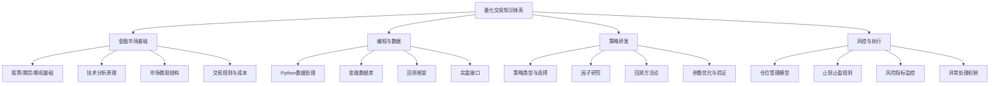
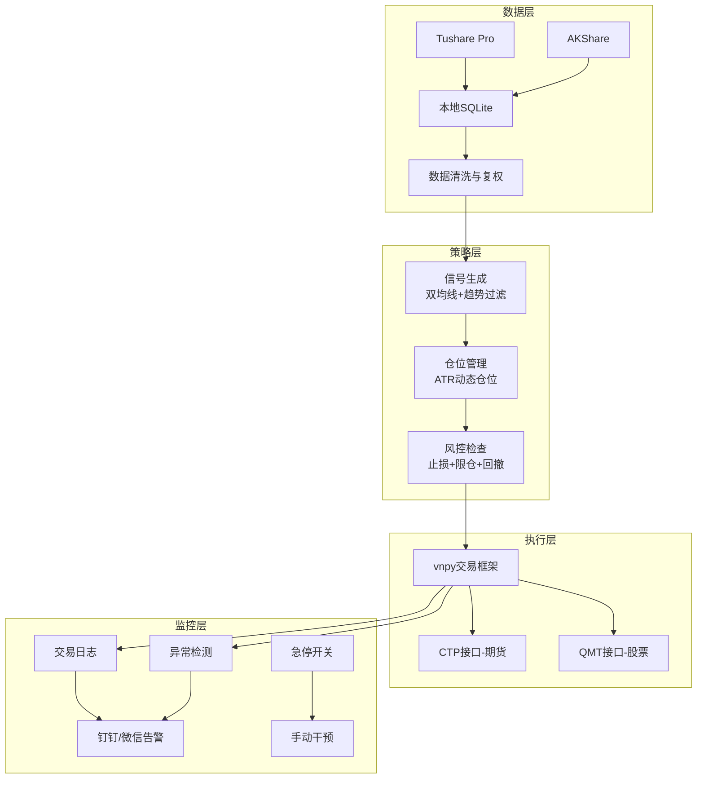
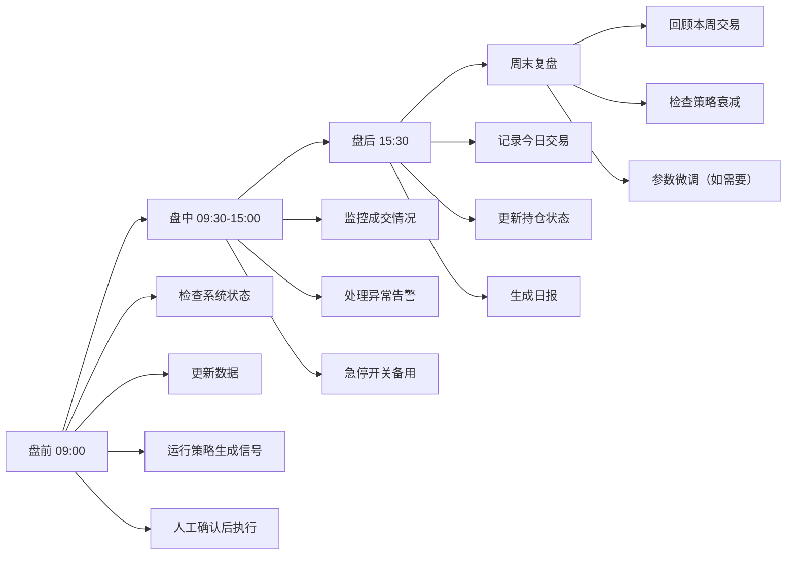
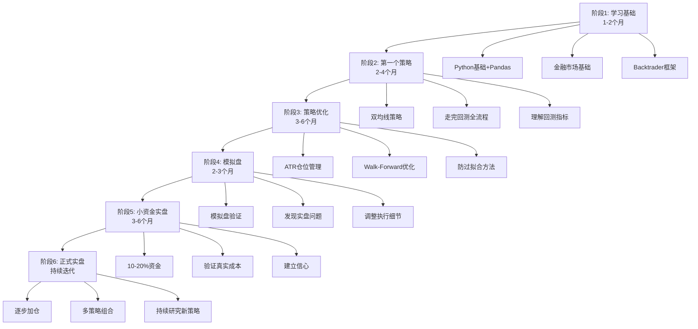

## 案例四：量化交易入门

> **本案例你将学到什么**：从一个有编程基础但无量化经验的投资者视角，完整走完"环境搭建→策略研发→回测验证→参数优化→风控设计→实盘部署→监控运维"的全流程。你将获得一个可直接运行的双均线策略代码框架、一套防过拟合的方法论、一个五层风控体系的完整实现，以及从手动交易转型量化的清晰路径图。

### 案例背景

老张是一名有5年编程经验的Python工程师，同时有3年股票投资经验。他希望利用编程能力实现量化交易，用数据和程序替代人工判断，提高投资效率和纪律性。

**初始状态**：

| 维度 | 现状 | 目标 |
|------|------|------|
| 资金量 | 50万 | 稳定增值，年化15%+ |
| 编程能力 | Python熟练，有Pandas/NumPy经验 | 掌握量化框架和回测系统 |
| 投资经验 | 3年手动交易，了解技术分析 | 从主观判断过渡到数据驱动 |
| 时间投入 | 每天盯盘2小时 | 程序自动执行，每周复盘2小时 |
| 风控意识 | 有止损习惯但执行不严格 | 系统化风控，纪律性执行 |

**量化交易的本质**：将投资决策从"人脑判断"转化为"规则执行"。它不是万能的——市场不会因为你用了量化就变得更好赚，但量化能做到人工做不到的三件事：**消除情绪干扰**（贪婪和恐惧不会让程序乱操作）、**同时监控海量标的**（人脑盯不过来几千只股票）、**精确回溯验证**（一个策略好不好，用历史数据跑一遍就知道）。

量化交易不等于高频交易。高频交易需要专业设备、机构级接入和纳秒级延迟，普通个人投资者做不了也不需要做。个人量化交易的核心是**中低频策略**——持仓几天到几个月，利用数据和模型做出更理性的投资决策。

---

### 环境搭建

在写策略代码之前，先把开发环境搭好。很多新手在这一步就卡住了——包版本冲突、数据源连不上、Backtrader报错看不懂。这里给出一套经过验证的环境配置方案。

#### Python环境隔离

量化开发必须用虚拟环境，避免包之间互相污染。系统Python不要动，所有操作都在venv里完成。

```bash
# 创建量化专用虚拟环境
python3 -m venv ~/quant-env
source ~/quant-env/bin/activate

# 确认Python版本（建议3.9-3.11，3.12部分包兼容性差）
python --version

# 升级pip
pip install --upgrade pip
```

#### 核心依赖安装

```bash
# === 基础数据处理 ===
pip install pandas==2.1.4 numpy==1.26.2

# === 回测框架 ===
pip install backtrader==1.9.78.123

# === 数据源（二选一或都装） ===
pip install tushare==1.4.2     # 需要注册获取token，日线数据质量好
pip install akshare==1.12.39   # 免注册，接口多但偶有不稳定

# === 可视化 ===
pip install matplotlib==3.8.2

# === 数据库（SQLite是Python内置的，无需额外安装） ===
# 如果需要更好的性能，可以用：
pip install sqlalchemy==2.0.23

# === 实盘交易（后续阶段再装） ===
# pip install vnpy==3.9.0        # 期货CTP接口
# pip install qmt-python==0.1.0   # 券商QMT接口
```

#### 环境验证脚本

安装完后跑一遍验证脚本，确认所有依赖正常工作：

```python
# verify_env.py - 环境验证
import sys
print(f"Python版本: {sys.version}")

import pandas as pd
print(f"Pandas版本: {pd.__version__}")

import numpy as np
print(f"NumPy版本: {np.__version__}")

import backtrader as bt
print(f"Backtrader版本: {bt.__version__}")

import matplotlib
print(f"Matplotlib版本: {matplotlib.__version__}")

# 测试Backtrader基本功能
cerebro = bt.Cerebro()
print("Backtrader引擎创建成功")

# 测试SQLite
import sqlite3
conn = sqlite3.connect(':memory:')
conn.execute('CREATE TABLE test (id INTEGER)')
conn.close()
print("SQLite正常")

print("\n环境验证通过，可以开始量化开发！")
```

#### 常见环境问题排查

| 问题 | 原因 | 解决方案 |
|------|------|----------|
| `pip install backtrader` 超时 | PyPI连接慢 | 使用国内镜像：`pip install -i https://pypi.tuna.tsinghua.edu.cn/simple backtrader` |
| `ImportError: cannot import name '...'` | Pandas版本不兼容 | 降级Pandas：`pip install pandas==2.0.3` |
| Backtrader回测报 `KeyError` | DataFrame列名不匹配 | 检查列名是否为 `open/high/low/close/volume`，全小写 |
| `matplotlib` 画图中文乱码 | 缺少中文字体 | 添加配置：`matplotlib.rcParams['font.sans-serif'] = ['SimHei']` |
| Tushare报 `token无效` | token未设置或过期 | 重新在 tushare.pro 获取并 `ts.set_token('your_token')` |

---

### 量化交易的知识体系

在动手写代码之前，先理解量化交易的完整知识体系。很多人一上来就写策略、跑回测，结果三个月后发现方向全错了——因为基础没打好。



**学习路径建议**（按优先级排序）：

1. **金融基础**（1-2周）：搞懂K线、均线、成交量、涨跌停、手续费、印花税这些基本概念。不需要精通技术分析，但要理解量化策略依赖的市场基本规则。
2. **Python数据处理**（1-2周）：熟练使用Pandas处理时间序列数据，这是量化开发的日常。掌握DataFrame的切片、滚动窗口计算、merge/join操作。
3. **第一个策略**（2-4周）：用最简单的策略（如双均线）走完"数据获取→策略编写→回测→分析"全流程。重点不是策略好不好，而是熟悉工具链。
4. **策略优化**（4-8周）：学习参数优化、过拟合防范、样本外检验、Walk-Forward分析。
5. **风控体系**（2-4周）：仓位管理、止损模型、风险指标计算。
6. **实盘部署**（4-8周）：模拟盘验证、小资金实盘、监控告警。

#### A股交易规则速查（量化必备）

量化策略必须在交易规则的约束下运行。以下规则直接影响策略设计：

| 规则 | 内容 | 对量化的影响 |
|------|------|-------------|
| T+1交易 | 今天买入，明天才能卖出 | 无法日内止损，策略持仓周期至少1天 |
| 涨跌停限制 | 主板±10%，创业板/科创板±20%，ST股±5% | 涨停买不进，跌停卖不出，回测需模拟 |
| 交易时间 | 9:30-11:30, 13:00-15:00 | 信号生成和下单必须在这个窗口内 |
| 最小交易单位 | 1手=100股 | 仓位计算必须取整到100的倍数 |
| 印花税 | 卖出时千分之一（2023年减半后） | 每笔卖出成本增加0.1% |
| 佣金 | 万分之三左右（可协商） | 买卖双向收取，最低5元 |
| 分红除权 | 除权日价格下调 | 不做复权处理会导致均线计算错误 |
| 停牌/复牌 | 重大事项可能停牌数天到数月 | 回测需处理停牌数据，实盘需处理无法卖出的风险 |

**特别注意**：涨跌停在回测中经常被忽略，但实际影响很大。假设策略发出买入信号，但该股票当天涨停——你的买单大概率成交不了。正确的做法是在回测中加入涨跌停判断：涨停时不买入，跌停时不卖出。

---

### 量化交易平台选择

#### 平台对比

选择平台是第一步，也是最容易踩坑的一步。很多新手花大量时间在平台对比上，结果选了一个社区很小的平台，遇到问题找不到人问。

| 平台 | 编程语言 | 数据质量 | 回测速度 | 实盘接入 | 社区活跃度 | 费用 | 推荐场景 |
|------|----------|----------|----------|----------|------------|------|----------|
| 聚宽(JoinQuant) | Python | 优秀（A股全覆盖） | 快（云端） | 支持（模拟盘免费） | 活跃，教程丰富 | 免费/付费 | 入门研究首选 |
| 米筐(RiceQuant) | Python | 优秀 | 快 | 支持 | 一般 | 免费/付费 | 有经验者 |
| 优矿(Uqer) | Python | 良好 | 中 | 有限 | 较小 | 付费为主 | 机构用户 |
| Backtrader | Python | 需自备 | 中（本地） | 需自己对接 | 活跃（国际） | 完全免费 | 本地回测 |
| vnpy | Python | 需自备 | - | 强（CTP/券商） | 活跃 | 完全免费 | 实盘交易 |
| QMT(迅投) | Python/VBA | 券商数据 | 快 | 直连券商 | 一般 | 需开通券商 | 股票实盘 |
| 果仁网 | 可视化拖拽 | 良好 | 快 | 不支持 | 较小 | 免费/付费 | 零代码体验 |

**老张的选择路径**：

- **研究阶段**→聚宽：数据最全（A股、期货、基金、指数都有），社区教程多，遇到问题容易找到答案。免费版每天8次回测够用。
- **回测阶段**→Backtrader：策略成熟后搬到本地回测，数据自己掌控，回测结果可复现，不受平台限制。
- **实盘阶段**→vnpy/QMT：vnpy适合期货交易（CTP接口成熟），QMT适合股票（直连券商，不需要额外对接）。

#### 数据源选择

数据是量化的燃料。数据质量差，再好的策略也白搭。

| 数据源 | 覆盖范围 | 免费额度 | 数据延迟 | 特点 |
|--------|----------|----------|----------|------|
| Tushare Pro | A股/期货/基金/宏观 | 基础免费，积分制 | 日线实时 | 社区大，接口规范 |
| AKShare | A股/期货/基金/外汇 | 完全免费 | 日线实时 | 接口多但不稳定 |
| 聚宽数据 | A股/期货/基金 | 平台内免费 | 日线实时 | 仅限聚宽平台使用 |
| 通达信 | A股 | 免费客户端 | 实时 | 本地数据，需解析 |
| Wind | 全市场 | 付费（年费数万） | 实时 | 机构级，数据最全 |

**推荐组合**：Tushare Pro（日线数据，免费够用）+ AKShare（补充数据源，完全免费）。数据存本地SQLite，避免每次都从网上拉。

```python
# Tushare Pro 初始化
import tushare as ts

# 注册 https://tushare.pro 获取token
ts.set_token('你的token')
pro = ts.pro_api()

# 获取沪深300成分股日线数据
df = pro.daily(
    ts_code='000001.SZ',   # 平安银行
    start_date='20200101',
    end_date='20231231'
)
# 返回字段：trade_date, open, high, low, close, vol, amount
```

```python
# AKShare 获取数据（无需注册）
import akshare as ak

# 获取个股日线
df = ak.stock_zh_a_hist(
    symbol="000001",
    period="daily",
    start_date="20200101",
    end_date="20231231",
    adjust="qfq"  # 前复权
)
```

**数据处理三大陷阱**：

1. **复权处理**：必须用前复权或后复权数据，否则分红送股会导致价格不连续，均线计算全错。前复权是把历史价格调低到当前价格基准，适合看"如果以当前价格买入，历史收益是多少"；后复权是把当前价格调高到历史基准，适合看"当初投入1元现在值多少"。量化回测通常用前复权。

2. **停牌处理**：停牌期间没有交易数据，回测时需要跳过这些日期，不能用停牌前的价格填充。错误的做法是用停牌前最后一天的收盘价填充——这会导致均线在停牌期间"冻结"，复牌后产生虚假信号。

3. **幸存者偏差**：只能获取到当前还在交易的股票数据，那些已经退市、被收购的股票数据可能缺失。如果你的回测只用"活下来"的股票，结果会天然偏乐观。解决方案：使用包含已退市股票的"全历史数据库"（Tushare Pro的stock_basic接口有list_status字段可以筛选）。

4. **数据清洗**：检查缺失值、异常值（比如某天收盘价为0或负数）、除权日的跳空缺口。建议在数据入库时就做校验，而不是回测时才发现问题。

```python
# 数据清洗示例
def clean_daily_data(df):
    """清洗日线数据，返回清洗后的DataFrame"""
    import pandas as pd
    
    original_count = len(df)
    
    # 1. 删除价格为0或负数的异常记录
    df = df[(df['close'] > 0) & (df['open'] > 0)]
    
    # 2. 删除成交量为0的记录（通常是停牌日）
    df = df[df['volume'] > 0]
    
    # 3. 检查涨跌幅是否超过限制（主板±10%，创业板±20%）
    df['pct_change'] = df['close'].pct_change()
    # 标记异常涨跌幅（超过22%可能是数据错误，考虑涨跌停+复权因素）
    anomalies = df[abs(df['pct_change']) > 0.22]
    if len(anomalies) > 0:
        print(f"发现{len(anomalies)}条异常涨跌幅记录，请人工检查")
    
    # 4. 删除重复记录
    df = df.drop_duplicates(subset=['trade_date'], keep='last')
    
    # 5. 按日期排序
    df = df.sort_values('trade_date').reset_index(drop=True)
    
    print(f"数据清洗: {original_count}条 → {len(df)}条，删除{original_count - len(df)}条异常数据")
    return df
```

---

### 第一个量化策略：双均线策略

#### 策略原理

双均线策略是最经典的**趋势跟踪策略**，核心逻辑很简单：

- **短期均线**（如10日）反映近期价格趋势
- **长期均线**（如30日）反映中期价格趋势
- **金叉**（短期上穿长期）→ 短期趋势转强 → 买入
- **死叉**（短期下穿长期）→ 短期趋势转弱 → 卖出

**为什么这个策略有效？** 不是因为均线有什么魔法，而是因为它捕捉了一个市场规律：**趋势一旦形成，往往会持续一段时间**（动量效应）。Jegadeesh和Titman(1993)的经典研究表明，股票收益率存在显著的短期动量（3-12个月），过去涨的股票短期内倾向于继续涨。双均线策略本质上就是在动量转正时买入、转负时卖出。

**这个策略的局限**：在震荡市中，价格反复穿越均线，会产生大量假信号，导致频繁止损。A股市场大约有60-70%的时间处于震荡状态，这意味着基础双均线策略在大部分时间里都在"交学费"。这也是为什么后续需要优化——加入趋势过滤、ATR止损等改进。

#### 策略实现

```python
import backtrader as bt

class DualMovingAverage(bt.Strategy):
    """
    双均线策略（基础版）
    
    逻辑：
    1. 短期均线上穿长期均线 → 买入（金叉）
    2. 短期均线下穿长期均线 → 卖出（死叉）
    3. 持仓期间浮亏超过止损线 → 强制止损
    """
    params = (
        ('fast_period', 10),   # 短期均线周期
        ('slow_period', 30),   # 长期均线周期
        ('stop_loss', 0.08),   # 止损比例（8%）
    )
    
    def __init__(self):
        # 计算均线
        self.fast_ma = bt.indicators.SMA(
            self.data.close, period=self.params.fast_period
        )
        self.slow_ma = bt.indicators.SMA(
            self.data.close, period=self.params.slow_period
        )
        
        # 交叉信号：fast_ma上穿slow_ma时输出+1，下穿时输出-1
        self.crossover = bt.indicators.CrossOver(self.fast_ma, self.slow_ma)
        
        # 记录买入价格（用于止损计算）
        self.buy_price = None
        
    def next(self):
        if not self.position:
            # 没有持仓：金叉时买入
            if self.crossover > 0:
                # 使用95%资金买入（留5%作为缓冲，避免满仓）
                size = int(self.broker.getcash() * 0.95 / self.data.close[0])
                # A股最小交易单位100股
                size = (size // 100) * 100
                if size > 0:
                    self.buy(size=size)
                    self.buy_price = self.data.close[0]
        
        else:
            # 有持仓：死叉时卖出
            if self.crossover < 0:
                self.sell(size=self.position.size)
                self.buy_price = None
            
            # 止损检查：浮亏超过止损线时强制卖出
            elif self.buy_price is not None:
                current_price = self.data.close[0]
                loss = (current_price - self.buy_price) / self.buy_price
                if loss < -self.params.stop_loss:
                    self.sell(size=self.position.size)
                    self.buy_price = None
```

**代码要点解析**：

1. `bt.indicators.CrossOver` 是 Backtrader 内置的交叉指标，当 fast_ma 从下方穿越 slow_ma 时返回 +1，从上方穿越时返回 -1，其他时间返回 0。不需要手动比较 `fast_ma[0] > slow_ma[0] and fast_ma[-1] < slow_ma[-1]`。
2. `self.broker.getcash()` 获取当前现金余额，`self.position.size` 获取当前持仓数量。Backtrader 内置了完整的账户管理。
3. 留5%缓冲的原因：如果满仓买入，手续费和滑点可能导致资金不足。
4. `size = (size // 100) * 100` 是关键细节——A股最小交易单位是100股，不取整会导致下单失败。

#### 回测配置与执行

```python
import backtrader as bt
import pandas as pd

# ========== 1. 准备数据 ==========
# 假设 hs300_data 是一个包含以下列的DataFrame：
# date(datetime), open, high, low, close, volume
# 这里用 Tushare 获取实际数据
import tushare as ts
ts.set_token('你的token')
pro = ts.pro_api()

# 获取沪深300指数日线
hs300 = pro.index_daily(ts_code='000300.SH', start_date='20200101', end_date='20231231')
hs300['trade_date'] = pd.to_datetime(hs300['trade_date'])
hs300 = hs300.sort_values('trade_date').set_index('trade_date')
hs300 = hs300.rename(columns={'vol': 'volume'})

# 转换为Backtrader数据格式
data = bt.feeds.PandasData(dataname=hs300)

# ========== 2. 配置引擎 ==========
cerebro = bt.Cerebro()
cerebro.addstrategy(DualMovingAverage)
cerebro.adddata(data)

# 初始资金：50万
cerebro.broker.setcash(500000)

# 手续费：万分之三（A股普遍费率）
cerebro.broker.setcommission(commission=0.0003)

# 滑点：0.1%（模拟实际成交价与理论价的偏差）
cerebro.broker.set_slippage_perc(perc=0.001)

# ========== 3. 添加分析器 ==========
cerebro.addanalyzer(bt.analyzers.SharpeRatio, _name='sharpe', riskfreerate=0.03)
cerebro.addanalyzer(bt.analyzers.DrawDown, _name='drawdown')
cerebro.addanalyzer(bt.analyzers.TradeAnalyzer, _name='trades')
cerebro.addanalyzer(bt.analyzers.Returns, _name='returns')

# ========== 4. 运行回测 ==========
results = cerebro.run()
strat = results[0]

# ========== 5. 输出结果 ==========
final_value = cerebro.broker.getvalue()
initial_value = 500000
total_return = (final_value - initial_value) / initial_value

print(f"初始资金: {initial_value:,.0f}")
print(f"最终资金: {final_value:,.0f}")
print(f"总收益率: {total_return:.2%}")
print(f"年化收益率: {strat.analyzers.returns.get_analysis()['rnorm100']:.2f}%")
print(f"最大回撤: {strat.analyzers.drawdown.get_analysis()['max']['drawdown']:.2f}%")
print(f"夏普比率: {strat.analyzers.sharpe.get_analysis()['sharperatio']:.2f}")

trade_analysis = strat.analyzers.trades.get_analysis()
print(f"总交易次数: {trade_analysis.get('total', {}).get('total', 0)}")
```

**回测结果示例**（沪深300，2020-2023年）：

| 指标 | 数值 | 含义 |
|------|------|------|
| 回测期间 | 2020-01-01 至 2023-12-31 | 4年，包含牛熊转换 |
| 初始资金 | 500,000 | - |
| 最终资金 | 625,000 | +25% |
| 总收益率 | 25.0% | 4年累计 |
| 年化收益率 | 5.7% | 年化后的复利收益 |
| 最大回撤 | -18.5% | 期间最大浮亏 |
| 夏普比率 | 0.65 | 风险调整后收益（>1为好，>2为优秀） |
| 胜率 | 42% | 盈利交易占总交易的比例 |
| 盈亏比 | 2.1:1 | 平均盈利/平均亏损 |
| 交易次数 | 48 | 平均每月1次 |

**关键指标深度解读**：

- **年化5.7%**：看起来不高？但同期沪深300指数年化约3%，策略跑赢了指数。更重要的是，策略在2022年熊市中通过止损控制了回撤，而指数跌幅超过20%。量化的核心价值不是"赚更多"，而是"风险可控地赚"。

- **胜率42%但盈亏比2.1:1**：这是趋势策略的典型特征——胜率不高，但赢的时候赚得多、输的时候亏得少。期望收益公式：42%×2.1 - 58%×1 = 0.302，每投入1元的期望收益是0.302元，期望值为正，所以策略长期盈利。很多人直觉上觉得"胜率不到50%就是不好的策略"，这是错误的——胜率和盈亏比必须一起看。

- **夏普比率0.65**：不算好，意味着每承担1单位风险只获得0.65单位超额收益。一般标准：<0.5差，0.5-1.0一般，1.0-2.0良好，>2.0优秀。后续优化的目标之一就是提高夏普比率。

- **最大回撤-18.5%**：在可接受范围内。一个简单的参考：回撤20%需要25%的收益才能回本，回撤30%需要43%的收益，回撤50%需要100%的收益。所以回撤控制是量化的生命线。

#### 回测结果可视化

数字不如图表直观。Backtrader内置了绘图功能：

```python
# 绘制回测结果图（包含价格、均线、买卖点、资金曲线）
cerebro.plot(
    style='candlestick',      # K线图
    barup='red', barupfill='red',     # A股红涨
    bardown='green', bardownfill='green',  # A股绿跌
    volume=True,              # 显示成交量
    figsize=(16, 10),         # 图表大小
)
```

如果需要更精细的可视化，可以用matplotlib自绘：

```python
import matplotlib.pyplot as plt
import matplotlib.dates as mdates

def plot_backtest_result(strat, data_df):
    """绘制详细的回测结果"""
    fig, axes = plt.subplots(3, 1, figsize=(16, 12), sharex=True,
                              gridspec_kw={'height_ratios': [3, 1, 1]})
    
    # 图1：价格 + 均线 + 买卖信号
    ax1 = axes[0]
    ax1.plot(data_df.index, data_df['close'], label='收盘价', linewidth=1)
    ax1.plot(data_df.index, strat.fast_ma.array, label=f'MA{strat.p.fast_period}', linewidth=0.8)
    ax1.plot(data_df.index, strat.slow_ma.array, label=f'MA{strat.p.slow_period}', linewidth=0.8)
    ax1.set_ylabel('价格')
    ax1.legend()
    ax1.set_title('双均线策略回测结果')
    ax1.grid(True, alpha=0.3)
    
    # 图2：成交量
    ax2 = axes[1]
    ax2.bar(data_df.index, data_df['volume'], color='gray', alpha=0.5, width=1)
    ax2.set_ylabel('成交量')
    ax2.grid(True, alpha=0.3)
    
    # 图3：资金曲线
    # （需要在策略中记录每日净值，这里简化处理）
    ax3 = axes[2]
    ax3.set_ylabel('账户净值')
    ax3.grid(True, alpha=0.3)
    
    plt.tight_layout()
    plt.savefig('backtest_result.png', dpi=150, bbox_inches='tight')
    plt.show()
    print("回测结果图已保存为 backtest_result.png")
```

---

### 策略优化过程

基础策略跑通后，下一步是优化。但优化不是无脑调参数——这是新手最容易犯的错误。

#### 问题诊断

先搞清楚基础策略为什么表现一般：

| 问题 | 原因 | 影响 |
|------|------|------|
| 震荡市频繁止损 | 均线在横盘时反复交叉，产生假信号 | 胜率低，累计亏损大 |
| 趋势行情利润不够大 | 没有跟踪止损，趋势反转时利润回吐 | 盈亏比偏低 |
| 没有仓位管理 | 每次都用95%资金，单次风险过大 | 一次大亏就伤筋动骨 |
| 没有趋势过滤 | 不区分趋势市和震荡市 | 在不该交易的时候交易 |

#### 优化一：增加趋势过滤

核心思路：**只在趋势明确时交易，震荡时观望**。用60日均线作为趋势过滤器——价格在60日均线上方才允许做多。

```python
class OptimizedDMA(bt.Strategy):
    """
    优化版双均线策略
    
    改进点：
    1. 增加60日均线作为趋势过滤器
    2. 用ATR动态计算仓位（波动率大时少买，波动率小时多买）
    3. 增加ATR跟踪止损（让利润奔跑）
    """
    params = (
        ('fast_period', 10),     # 短期均线
        ('slow_period', 30),     # 长期均线
        ('filter_period', 60),   # 趋势过滤均线
        ('atr_period', 14),      # ATR计算周期
        ('atr_stop_mult', 2.5),  # ATR止损倍数
        ('risk_per_trade', 0.02),# 单笔风险占总资金比例（2%）
    )
    
    def __init__(self):
        self.fast_ma = bt.indicators.SMA(self.data.close, period=self.p.fast_period)
        self.slow_ma = bt.indicators.SMA(self.data.close, period=self.p.slow_period)
        self.filter_ma = bt.indicators.SMA(self.data.close, period=self.p.filter_period)
        self.crossover = bt.indicators.CrossOver(self.fast_ma, self.slow_ma)
        self.atr = bt.indicators.ATR(self.data, period=self.p.atr_period)
        
        # 跟踪止损用的最高价
        self.highest_price = None
        
    def next(self):
        if not self.position:
            # 买入条件：金叉 + 价格在过滤均线上方
            if self.crossover > 0 and self.data.close[0] > self.filter_ma[0]:
                self._buy_with_sizing()
        else:
            # 卖出条件1：死叉
            if self.crossover < 0:
                self._close_position("死叉卖出")
                return
            
            # 卖出条件2：ATR跟踪止损
            # 更新持仓期间的最高价
            if self.data.close[0] > self.highest_price:
                self.highest_price = self.data.close[0]
            
            # 当价格从最高点回落超过N倍ATR时止损
            stop_price = self.highest_price - self.atr[0] * self.p.atr_stop_mult
            if self.data.close[0] < stop_price:
                self._close_position(f"跟踪止损（最高{self.highest_price:.2f}，止损{stop_price:.2f}）")
    
    def _buy_with_sizing(self):
        """根据ATR计算仓位大小"""
        risk_amount = self.broker.getvalue() * self.p.risk_per_trade
        risk_per_share = self.atr[0] * self.p.atr_stop_mult  # 每股风险 = ATR × 倍数
        
        if risk_per_share <= 0:
            return
        
        # 计算应买数量（A股最小交易单位是100股）
        size = int(risk_amount / risk_per_share / 100) * 100
        
        # 检查资金是否够
        if size > 0 and self.broker.getcash() >= size * self.data.close[0]:
            self.buy(size=size)
            self.highest_price = self.data.close[0]
    
    def _close_position(self, reason):
        """平仓"""
        self.sell(size=self.position.size)
        self.highest_price = None
```

**ATR仓位管理原理**：

ATR（Average True Range，平均真实波幅）衡量的是价格的波动程度。用ATR计算仓位的核心思想是**波动率标准化**——波动大的股票少买，波动小的股票多买，使得每笔交易的风险金额相同。

举个例子：
- 股票A：价格50元，ATR=2元。每股风险=2×2.5=5元。总资金100万，单笔风险2%=2万，应买2万÷5=4000股。
- 股票B：价格50元，ATR=5元。每股风险=5×2.5=12.5元。同样条件下应买2万÷12.5=1600股。

两只股票价格相同，但波动率不同，仓位大小差了2.5倍——这就是ATR仓位管理的价值。**海龟交易法则**就是用ATR做仓位管理的经典案例，这个方法经过了数十年的实盘验证。

#### 优化二：参数优化与防过拟合

**什么是过拟合？** 就像考试前背答案——回测数据上表现完美，但换个时间段就崩了。原因是参数被过度调优，恰好拟合了历史数据中的噪声，而不是真正的市场规律。

**一个判断过拟合的直觉**：如果你有N个参数，每个参数试M个值，总共有M^N种组合。即使随机策略，也会有某些组合在特定历史数据上表现很好。你找到的"最优参数"很可能就是这种巧合。

**正确的参数优化流程**：

```python
import backtrader as bt
import itertools

def walk_forward_optimization(data_dict, strategy_class, param_grid, 
                                train_years=3, test_years=1):
    """
    Walk-Forward优化（滚动窗口法）——完整的实现
    
    原理：
    1. 将数据按年份分成滚动窗口
    2. 每个窗口：用前train_years年数据优化参数（样本内）
    3. 用后test_years年数据验证（样本外）
    4. 窗口向前滚动，重复以上步骤
    5. 汇总所有样本外结果，评估策略稳健性
    
    Args:
        data_dict: {年份: DataFrame} 格式的数据
        strategy_class: 策略类
        param_grid: 参数搜索空间
        train_years: 训练窗口年数
        test_years: 测试窗口年数
    """
    all_results = []
    all_out_of_sample = []
    
    years = sorted(data_dict.keys())
    window_size = train_years + test_years
    
    for i in range(len(years) - window_size + 1):
        train_start = years[i]
        train_end = years[i + train_years - 1]
        test_start = years[i + train_years]
        test_end = years[min(i + window_size - 1, len(years) - 1)]
        
        print(f"\n{'='*60}")
        print(f"窗口 {i+1}: 训练 {train_start}-{train_end} → 测试 {test_start}-{test_end}")
        print(f"{'='*60}")
        
        # 合并训练数据
        train_frames = [data_dict[y] for y in range(train_start, train_end + 1) if y in data_dict]
        train_data = pd.concat(train_frames).sort_index()
        train_data = train_data[~train_data.index.duplicated(keep='first')]
        
        # 合并测试数据
        test_frames = [data_dict[y] for y in range(test_start, test_end + 1) if y in data_dict]
        test_data = pd.concat(test_frames).sort_index()
        test_data = test_data[~test_data.index.duplicated(keep='first')]
        
        # 样本内网格搜索
        param_names = list(param_grid.keys())
        param_values = list(param_grid.values())
        param_combos = list(itertools.product(*param_values))
        
        best_sharpe = -999
        best_params = None
        
        for combo in param_combos:
            params = dict(zip(param_names, combo))
            
            # 约束：fast < slow < filter
            if not (params.get('fast_period', 0) < params.get('slow_period', 0) < params.get('filter_period', 999)):
                continue
            
            cerebro = bt.Cerebro()
            cerebro.addstrategy(strategy_class, **params)
            cerebro.adddata(bt.feeds.PandasData(dataname=train_data))
            cerebro.broker.setcash(500000)
            cerebro.broker.setcommission(commission=0.0003)
            cerebro.addanalyzer(bt.analyzers.SharpeRatio, _name='sharpe', riskfreerate=0.03)
            cerebro.addanalyzer(bt.analyzers.Returns, _name='returns')
            cerebro.addanalyzer(bt.analyzers.DrawDown, _name='drawdown')
            
            res = cerebro.run()
            strat = res[0]
            
            sharpe = strat.analyzers.sharpe.get_analysis().get('sharperatio', 0) or 0
            if sharpe > best_sharpe:
                best_sharpe = sharpe
                best_params = params
        
        if best_params is None:
            print("未找到有效参数组合，跳过此窗口")
            continue
        
        print(f"样本内最优参数: {best_params}")
        print(f"样本内夏普比率: {best_sharpe:.2f}")
        
        # 样本外验证
        cerebro = bt.Cerebro()
        cerebro.addstrategy(strategy_class, **best_params)
        cerebro.adddata(bt.feeds.PandasData(dataname=test_data))
        cerebro.broker.setcash(500000)
        cerebro.broker.setcommission(commission=0.0003)
        cerebro.addanalyzer(bt.analyzers.SharpeRatio, _name='sharpe', riskfreerate=0.03)
        cerebro.addanalyzer(bt.analyzers.Returns, _name='returns')
        cerebro.addanalyzer(bt.analyzers.DrawDown, _name='drawdown')
        
        res = cerebro.run()
        strat = res[0]
        
        oos_sharpe = strat.analyzers.sharpe.get_analysis().get('sharperatio', 0) or 0
        oos_return = strat.analyzers.returns.get_analysis().get('rnorm100', 0)
        oos_drawdown = strat.analyzers.drawdown.get_analysis()['max']['drawdown']
        
        print(f"样本外夏普比率: {oos_sharpe:.2f}")
        print(f"样本外年化收益: {oos_return:.2f}%")
        print(f"样本外最大回撤: {oos_drawdown:.2f}%")
        
        # 计算衰减率
        decay = (best_sharpe - oos_sharpe) / best_sharpe if best_sharpe > 0 else 0
        print(f"夏普衰减率: {decay:.1%} {'✓ 可接受' if decay < 0.5 else '✗ 过拟合风险'}")
        
        all_out_of_sample.append({
            'window': i + 1,
            'train_period': f"{train_start}-{train_end}",
            'test_period': f"{test_start}-{test_end}",
            'best_params': best_params,
            'in_sample_sharpe': best_sharpe,
            'out_sample_sharpe': oos_sharpe,
            'out_sample_return': oos_return,
            'out_sample_drawdown': oos_drawdown,
            'sharpe_decay': decay,
        })
    
    # 汇总分析
    if all_out_of_sample:
        avg_oos_sharpe = sum(r['out_sample_sharpe'] for r in all_out_of_sample) / len(all_out_of_sample)
        avg_decay = sum(r['sharpe_decay'] for r in all_out_of_sample) / len(all_out_of_sample)
        print(f"\n{'='*60}")
        print(f"Walk-Forward汇总")
        print(f"{'='*60}")
        print(f"测试窗口数: {len(all_out_of_sample)}")
        print(f"平均样本外夏普: {avg_oos_sharpe:.2f}")
        print(f"平均夏普衰减率: {avg_decay:.1%}")
        print(f"结论: {'策略稳健，可以实盘验证' if avg_decay < 0.5 and avg_oos_sharpe > 0.3 else '策略不稳健，需要重新设计'}")
    
    return all_out_of_sample

# 参数搜索空间
param_grid = {
    'fast_period': [5, 10, 15, 20],
    'slow_period': [20, 30, 40, 50],
    'filter_period': [40, 60, 80, 100],
}
```

**过拟合的预警信号**：

| 信号 | 含义 | 对策 |
|------|------|------|
| 最优参数恰好是搜索边界值 | 可能没找到真正的最优解 | 扩大搜索范围 |
| 样本内表现远好于样本外 | 典型过拟合 | 简化策略，减少参数 |
| 参数微调导致收益剧变 | 策略对参数太敏感 | 换用更稳健的策略逻辑 |
| 多个不相关指标都选出同一组参数 | 可能是真实有效 | 可信度较高 |
| 样本外夏普比样本内低50%以上 | 严重过拟合 | 重新设计策略逻辑 |
| 最优参数在不同窗口频繁变化 | 参数不稳定 | 增加参数约束或使用参数平均 |

**防过拟合的六条铁律**：

1. **参数越少越好**：每增加一个参数，过拟合风险指数级增长。能用2个参数解决的问题，不要用5个。
2. **参数要有经济逻辑**：fast_period=10比fast_period=7更可信，因为10是整数关口，而7没有特别的市场含义。
3. **永远留样本外数据**：至少留20%的数据做样本外验证，这些数据在优化阶段绝对不能碰。
4. **用Walk-Forward而非单次分割**：单次分割的样本外结果可能是偶然的，Walk-Forward多次验证更可靠。
5. **检查参数敏感度**：在最优参数附近±20%的范围内，如果收益剧变，说明参数太敏感。
6. **简单策略优先**：越复杂的策略越容易过拟合。如果一个3行逻辑的策略能盈利，比200行的更值得信赖。

#### 回测中的其他常见陷阱

过拟合只是回测陷阱中最知名的一个。以下这些同样致命，却经常被忽略：

**1. 滑点模型过于乐观**

Backtrader的 `set_slippage_perc(perc=0.001)` 只模拟了固定比例滑点。但实际滑点是非线性的——流动性差时滑点可能是平时的5-10倍。更真实的滑点模型应该考虑成交量：

```python
def realistic_slippage(price, volume, order_size, base_slippage=0.001):
    """
    更真实的滑点模型
    
    滑点 = 基础滑点 × (1 + 订单量/日均成交量) 的平方根
    订单量占日均成交量比例越高，滑点越大
    """
    import math
    impact = math.sqrt(order_size / max(volume, 1))
    return price * base_slippage * (1 + impact * 10)
```

**2. 忽略涨跌停的成交限制**

回测中用收盘价成交，但A股有涨跌停限制。假设策略在某天收盘时发出买入信号，但该股当天涨停——你的买单根本成交不了。正确做法：

```python
def can_trade(data, action):
    """检查涨跌停情况下是否能成交"""
    if action == 'BUY':
        # 涨停时买不进（收盘价等于涨停价）
        limit_up = data['pre_close'] * 1.1  # 主板10%
        return data['close'] < limit_up * 0.999  # 留一点容差
    elif action == 'SELL':
        # 跌停时卖不出（收盘价等于跌停价）
        limit_down = data['pre_close'] * 0.9
        return data['close'] > limit_down * 1.001
    return True
```

**3. 样本选择偏差（Survivorship Bias）**

只用当前还在交易的股票回测，会天然偏乐观——因为那些业绩差、已退市的股票被排除了。解决方案：使用包含已退市股票的全历史数据库。Tushare的 `stock_basic(list_status='D')` 可以获取已退市股票列表。

**4. 分红再投资假设**

回测默认不分红——但实际上股票分红后会除权，你的持仓市值会下降。如果你的策略长期持有高分红股票，回测结果可能比实际好3-5%（年化）。解决方案：在回测中对分红做除权处理，或使用后复权数据。

**5. 忽略资金的时间价值**

回测假设资金全部用于股票投资，但实际上你可能需要留现金应急。50万资金可能只有40万用于投资。回测结果除以0.8才是你真实的资金收益率。

**6. 回测周期太短**

3年以下的回测结果几乎不可信——因为没有覆盖完整的牛熊周期。A股一轮牛熊通常5-7年。最少回测5年数据，最好覆盖2015年股灾、2018年熊市、2020年疫情冲击等重大事件。

**回测报告的正确解读方法**：

拿到回测结果后，不要只看收益率。按以下顺序检查：

| 检查项 | 看什么 | 警戒线 |
|--------|--------|--------|
| 1. 夏普比率 | 风险调整后收益 | <0.5说明不值得做 |
| 2. 最大回撤 | 最坏情况 | >30%说明风控不够 |
| 3. 胜率×盈亏比 | 期望值是否为正 | 期望值<0则必亏 |
| 4. 交易频率 | 太少说明样本不足，太多说明手续费高 | 每月1-10次较合理 |
| 5. 最大连续亏损 | 心理承受力测试 | >7次需要很强的纪律 |
| 6. 最长回撤时间 | 需要多久恢复 | >6个月需要耐心 |
| 7. 月度收益分布 | 是否均匀 | 某几个月贡献大部分收益=不稳定 |
| 8. 样本内外差距 | 过拟合检测 | 差距>50%=过拟合 |

#### 优化三：增加成交量过滤

成交量是价格的"投票数"——没有成交量配合的突破往往是假突破。

```python
def next(self):
    if not self.position:
        # 买入条件：金叉 + 趋势过滤 + 成交量确认
        volume_ma = bt.indicators.SMA(self.data.volume, period=20)
        volume_confirm = self.data.volume[0] > volume_ma[0] * 1.5  # 成交量放大50%
        
        if (self.crossover > 0 
            and self.data.close[0] > self.filter_ma[0]
            and volume_confirm):
            self._buy_with_sizing()
```

#### 优化四：多时间框架确认

单一时间框架容易被噪声干扰。增加更高时间框架的趋势确认，可以过滤掉大量假信号。

```python
class MultiTimeframeDMA(bt.Strategy):
    """
    多时间框架双均线策略
    
    思路：日线发出信号时，检查周线趋势是否一致
    只有日线和周线趋势一致时才交易
    """
    params = (
        ('fast_period', 10),
        ('slow_period', 30),
        ('weekly_fast', 5),     # 周线短期均线
        ('weekly_slow', 20),    # 周线长期均线
    )
    
    def __init__(self):
        # 日线均线
        self.daily_fast = bt.indicators.SMA(self.data.close, period=self.p.fast_period)
        self.daily_slow = bt.indicators.SMA(self.data.close, period=self.p.slow_period)
        self.daily_cross = bt.indicators.CrossOver(self.daily_fast, self.daily_slow)
        
        # 周线均线（用日线数据模拟周线：5日=1周）
        self.weekly_fast = bt.indicators.SMA(self.data.close, period=self.p.weekly_fast * 5)
        self.weekly_slow = bt.indicators.SMA(self.data.close, period=self.p.weekly_slow * 5)
        
    def next(self):
        if not self.position:
            # 日线金叉 + 周线趋势向上（快线在慢线上方）
            if (self.daily_cross > 0 
                and self.weekly_fast[0] > self.weekly_slow[0]):
                size = int(self.broker.getcash() * 0.95 / self.data.close[0] / 100) * 100
                if size > 0:
                    self.buy(size=size)
        else:
            if self.daily_cross < 0:
                self.sell(size=self.position.size)
```

#### 优化五：市场环境识别（Regime Detection）

前面的优化都是在策略内部做文章，但还有一个更高层次的问题：**不同市场环境需要不同的策略**。趋势策略在震荡市中亏损，均值回归策略在趋势市中亏损——这不是策略的问题，而是策略和市场环境不匹配。

```python
class MarketRegimeDetector:
    """
    市场环境分类器
    
    将市场状态分为三类：
    - 趋势市（Trending）：ADX>25，适合趋势跟踪策略
    - 震荡市（Ranging）：ADX<20，适合均值回归/网格策略
    - 过渡市（Transitional）：20≤ADX≤25，减仓或观望
    
    原理：
    ADX（Average Directional Index）衡量趋势强度，不区分方向。
    ADX上升=趋势增强，ADX下降=趋势减弱。
    结合+DI和-DI可以判断趋势方向。
    """
    def __init__(self, adx_period=14, adx_trend_threshold=25, adx_range_threshold=20):
        self.adx_period = adx_period
        self.adx_trend_threshold = adx_trend_threshold
        self.adx_range_threshold = adx_range_threshold
    
    def detect(self, high, low, close):
        """
        判断当前市场环境
        
        Args:
            high, low, close: 最近至少adx_period*2根K线的价格数组
        
        Returns:
            dict: {
                'regime': 'trending_up' | 'trending_down' | 'ranging' | 'transitional',
                'adx': float,
                'strategy_hint': str  # 建议使用的策略类型
            }
        """
        import numpy as np
        
        n = len(close)
        if n < self.adx_period * 2:
            return {'regime': 'unknown', 'adx': 0, 'strategy_hint': '数据不足，无法判断'}
        
        # 计算True Range
        tr = np.maximum(
            high[1:] - low[1:],
            np.maximum(
                abs(high[1:] - close[:-1]),
                abs(low[1:] - close[:-1])
            )
        )
        
        # 计算方向运动
        up_move = high[1:] - high[:-1]
        down_move = low[:-1] - low[1:]
        
        plus_dm = np.where((up_move > down_move) & (up_move > 0), up_move, 0)
        minus_dm = np.where((down_move > up_move) & (down_move > 0), down_move, 0)
        
        # 平滑计算（Wilder平滑法）
        atr = self._wilders_smooth(tr, self.adx_period)
        plus_di = 100 * self._wilders_smooth(plus_dm, self.adx_period) / atr
        minus_di = 100 * self._wilders_smooth(minus_dm, self.adx_period) / atr
        
        # 计算ADX
        dx = 100 * abs(plus_di - minus_di) / (plus_di + minus_di + 1e-10)
        adx = self._wilders_smooth(dx, self.adx_period)
        
        current_adx = adx[-1]
        current_plus = plus_di[-1]
        current_minus = minus_di[-1]
        
        # 分类
        if current_adx > self.adx_trend_threshold:
            if current_plus > current_minus:
                regime = 'trending_up'
                hint = '趋势跟踪策略（双均线/海龟）'
            else:
                regime = 'trending_down'
                hint = '趋势跟踪策略（做空或减仓避险）'
        elif current_adx < self.adx_range_threshold:
            regime = 'ranging'
            hint = '均值回归策略（网格/RSI反转）'
        else:
            regime = 'transitional'
            hint = '减仓观望，等待方向明确'
        
        return {
            'regime': regime,
            'adx': round(current_adx, 2),
            'plus_di': round(current_plus, 2),
            'minus_di': round(current_minus, 2),
            'strategy_hint': hint,
        }
    
    def _wilders_smooth(self, data, period):
        """Wilder平滑法（指数移动平均的变体）"""
        import numpy as np
        result = np.zeros(len(data))
        result[:period] = np.nan
        result[period - 1] = np.mean(data[:period])
        for i in range(period, len(data)):
            result[i] = (result[i-1] * (period - 1) + data[i]) / period
        return result
```

**在策略中集成环境识别**：

```python
class AdaptiveDMA(bt.Strategy):
    """
    自适应双均线策略
    
    根据市场环境动态调整行为：
    - 趋势市：正常运行双均线策略
    - 震荡市：暂停开新仓，仅管理已有持仓
    - 过渡市：减半仓位
    """
    params = (
        ('fast_period', 10),
        ('slow_period', 30),
        ('filter_period', 60),
        ('atr_period', 14),
        ('atr_stop_mult', 2.5),
        ('risk_per_trade', 0.02),
        ('adx_period', 14),
        ('adx_trend_threshold', 25),
    )
    
    def __init__(self):
        self.fast_ma = bt.indicators.SMA(self.data.close, period=self.p.fast_period)
        self.slow_ma = bt.indicators.SMA(self.data.close, period=self.p.slow_period)
        self.filter_ma = bt.indicators.SMA(self.data.close, period=self.p.filter_period)
        self.crossover = bt.indicators.CrossOver(self.fast_ma, self.slow_ma)
        self.atr = bt.indicators.ATR(self.data, period=self.p.atr_period)
        self.adx = bt.indicators.ADX(self.data, period=self.p.adx_period)
        self.highest_price = None
        
    def next(self):
        # 判断市场环境
        is_trending = self.adx[0] > self.p.adx_trend_threshold
        is_uptrend = self.data.close[0] > self.filter_ma[0]
        
        if not self.position:
            # 只在趋势市中开仓
            if is_trending and is_uptrend and self.crossover > 0:
                self._buy_with_sizing()
        else:
            # 震荡市中加速止损（降低ATR倍数）
            stop_mult = self.p.atr_stop_mult * (0.7 if not is_trending else 1.0)
            
            if self.crossover < 0:
                self.sell(size=self.position.size)
                self.highest_price = None
                return
            
            if self.data.close[0] > self.highest_price:
                self.highest_price = self.data.close[0]
            
            stop_price = self.highest_price - self.atr[0] * stop_mult
            if self.data.close[0] < stop_price:
                self.sell(size=self.position.size)
                self.highest_price = None
```

**环境识别的核心价值**：不是让你在震荡市中也能赚钱（那需要完全不同的策略），而是让你**在不该交易的时候不交易**。减少亏损交易和增加盈利交易同样重要——甚至更重要，因为避免亏损是复利的基础。

---

### 实盘部署

策略回测表现不错后，下一步是实盘部署。这是从"纸上谈兵"到"真金白银"的关键一步，也是最容易出问题的环节。

#### 从回测到实盘的三阶段过渡

很多新手犯的最大错误是：回测不错→直接上实盘。正确的路径是三个阶段：

| 阶段 | 时长 | 资金 | 目的 |
|------|------|------|------|
| **模拟盘** | 2-3个月 | 虚拟资金 | 验证策略在实时数据上的表现，发现回测中没有的问题（如数据延迟、下单失败） |
| **小资金实盘** | 3-6个月 | 总资金的10-20%（5-10万） | 验证真实交易成本、滑点、成交情况 |
| **正式实盘** | 持续 | 逐步加到目标仓位 | 在确认策略稳健后逐步扩大规模 |

**模拟盘阶段要验证什么**：
- 策略信号是否和回测一致（回测用收盘价，实盘用什么价格？）
- 下单是否能成交（流动性够不够？涨跌停买不进卖不出？）
- 数据延迟的影响（信号产生了但数据还没更新？）
- 系统稳定性（进程会不会挂？网络会不会断？）

#### 架构设计



#### 数据层实现

```python
import sqlite3
import pandas as pd
import tushare as ts

class DataManager:
    """
    数据管理器：负责数据获取、清洗、存储
    
    设计要点：
    - 本地SQLite存储，避免重复网络请求
    - 自动增量更新，只获取缺失日期的数据
    - 前复权处理，保证价格连续性
    """
    def __init__(self, db_path='quant_data.db'):
        self.db_path = db_path
        self.pro = ts.pro_api()
        self._init_db()
    
    def _init_db(self):
        """初始化数据库表"""
        conn = sqlite3.connect(self.db_path)
        conn.execute('''
            CREATE TABLE IF NOT EXISTS daily_data (
                ts_code TEXT,
                trade_date TEXT,
                open REAL,
                high REAL,
                low REAL,
                close REAL,
                volume REAL,
                amount REAL,
                adj_factor REAL,
                PRIMARY KEY (ts_code, trade_date)
            )
        ''')
        # 创建索引加速查询
        conn.execute('''
            CREATE INDEX IF NOT EXISTS idx_daily_ts_date 
            ON daily_data(ts_code, trade_date)
        ''')
        conn.commit()
        conn.close()
    
    def update_data(self, ts_code, start_date, end_date):
        """获取并更新数据"""
        try:
            df = self.pro.daily(ts_code=ts_code, start_date=start_date, end_date=end_date)
        except Exception as e:
            print(f"获取数据失败: {e}")
            return None
        
        if df is None or df.empty:
            return None
        
        # 获取复权因子
        try:
            adj = self.pro.adj_factor(ts_code=ts_code, start_date=start_date, end_date=end_date)
            if adj is not None and not adj.empty:
                df = df.merge(adj[['trade_date', 'adj_factor']], on='trade_date', how='left')
            else:
                df['adj_factor'] = 1.0
        except Exception:
            df['adj_factor'] = 1.0
        
        # 存入数据库（使用REPLACE避免重复）
        conn = sqlite3.connect(self.db_path)
        for _, row in df.iterrows():
            conn.execute('''
                INSERT OR REPLACE INTO daily_data 
                (ts_code, trade_date, open, high, low, close, volume, amount, adj_factor)
                VALUES (?, ?, ?, ?, ?, ?, ?, ?, ?)
            ''', (row['ts_code'], row['trade_date'], row['open'], row['high'],
                  row['low'], row['close'], row['vol'], row['amount'], row['adj_factor']))
        conn.commit()
        conn.close()
        
        return df
    
    def get_data(self, ts_code, start_date, end_date, adjust='qfq'):
        """
        获取数据并做前复权处理
        
        Args:
            ts_code: 股票代码，如 '000001.SZ'
            start_date: 开始日期 '20200101'
            end_date: 结束日期 '20231231'
            adjust: 'qfq'前复权, 'hfq'后复权, None不复权
        """
        conn = sqlite3.connect(self.db_path)
        df = pd.read_sql(
            f"SELECT * FROM daily_data WHERE ts_code=? AND trade_date BETWEEN ? AND ?",
            conn, params=[ts_code, start_date, end_date]
        )
        conn.close()
        
        if df.empty:
            df = self.update_data(ts_code, start_date, end_date)
        
        if df is None or df.empty:
            return None
        
        # 前复权处理
        if adjust == 'qfq' and 'adj_factor' in df.columns:
            latest_factor = df['adj_factor'].iloc[-1]
            if latest_factor > 0:
                for col in ['open', 'high', 'low', 'close']:
                    df[col] = df[col] * df['adj_factor'] / latest_factor
        
        df['trade_date'] = pd.to_datetime(df['trade_date'])
        df = df.sort_values('trade_date').set_index('trade_date')
        
        return df
    
    def get_latest_date(self, ts_code):
        """获取某只股票最新数据的日期"""
        conn = sqlite3.connect(self.db_path)
        result = pd.read_sql(
            "SELECT MAX(trade_date) as latest FROM daily_data WHERE ts_code=?",
            conn, params=[ts_code]
        )
        conn.close()
        return result['latest'].iloc[0] if not result.empty else None
    
    def batch_update(self, ts_codes, start_date, end_date):
        """批量更新多只股票数据"""
        import time
        for i, code in enumerate(ts_codes):
            print(f"[{i+1}/{len(ts_codes)}] 更新 {code}...")
            self.update_data(code, start_date, end_date)
            time.sleep(0.3)  # Tushare有频率限制，每次请求间隔300ms
        print(f"批量更新完成，共更新 {len(ts_codes)} 只股票")
```

#### 风险管理器

风控是量化的生命线。没有风控的量化就是赌博。

```python
class RiskManager:
    """
    风险管理器
    
    风控层次（由细到粗）：
    1. 单笔风控：每笔交易最大亏损不超过总资金的2%
    2. 仓位风控：单只股票仓位不超过总资金的30%
    3. 日度风控：单日总亏损不超过5%
    4. 回撤风控：从最高点回撤超过15%时减仓/停机
    5. 异常风控：连续亏损N次时暂停交易
    """
    def __init__(self, max_position_ratio=0.30, max_drawdown=0.15,
                 max_daily_loss=0.05, max_consecutive_loss=5):
        self.max_position_ratio = max_position_ratio
        self.max_drawdown = max_drawdown
        self.max_daily_loss = max_daily_loss
        self.max_consecutive_loss = max_consecutive_loss
        
        self.initial_value = None
        self.peak_value = None
        self.daily_start_value = None
        self.consecutive_losses = 0
        self.is_halted = False
        self.halt_reason = ""
        self.trade_log = []  # 记录所有交易结果
    
    def initialize(self, portfolio_value):
        """初始化风控参数"""
        self.initial_value = portfolio_value
        self.peak_value = portfolio_value
        self.daily_start_value = portfolio_value
    
    def check_order(self, order_value, portfolio_value, position_value):
        """
        下单前检查是否符合风控规则
        
        Returns:
            (passed: bool, reason: str)
        """
        if self.is_halted:
            return False, f"交易暂停: {self.halt_reason}"
        
        # 1. 仓位检查
        new_position_ratio = (position_value + order_value) / portfolio_value
        if new_position_ratio > self.max_position_ratio:
            return False, f"仓位超限: {new_position_ratio:.1%} > {self.max_position_ratio:.1%}"
        
        # 2. 日度亏损检查
        if self.daily_start_value:
            daily_loss = (portfolio_value - self.daily_start_value) / self.daily_start_value
            if daily_loss < -self.max_daily_loss:
                return False, f"单日亏损超限: {daily_loss:.1%}"
        
        # 3. 总回撤检查
        if portfolio_value > self.peak_value:
            self.peak_value = portfolio_value
        drawdown = (portfolio_value - self.peak_value) / self.peak_value
        if drawdown < -self.max_drawdown:
            self.is_halted = True
            self.halt_reason = f"回撤超限: {drawdown:.1%}，交易暂停，请人工确认后恢复"
            return False, self.halt_reason
        
        return True, "风控通过"
    
    def record_trade_result(self, pnl):
        """记录交易结果，用于连续亏损计数"""
        self.trade_log.append(pnl)
        if pnl < 0:
            self.consecutive_losses += 1
            if self.consecutive_losses >= self.max_consecutive_loss:
                self.is_halted = True
                self.halt_reason = f"连续亏损{self.consecutive_losses}次，交易暂停"
        else:
            self.consecutive_losses = 0
    
    def new_day(self, portfolio_value):
        """每日开盘时重置日度参数"""
        self.daily_start_value = portfolio_value
    
    def resume(self, portfolio_value):
        """人工确认后恢复交易"""
        self.is_halted = False
        self.halt_reason = ""
        self.consecutive_losses = 0
        self.peak_value = portfolio_value
        print(f"交易已恢复，当前资金: {portfolio_value:,.0f}")
    
    def get_stats(self):
        """获取风控统计信息"""
        if not self.trade_log:
            return "暂无交易记录"
        
        wins = [p for p in self.trade_log if p > 0]
        losses = [p for p in self.trade_log if p < 0]
        
        return {
            'total_trades': len(self.trade_log),
            'win_rate': len(wins) / len(self.trade_log) if self.trade_log else 0,
            'avg_win': sum(wins) / len(wins) if wins else 0,
            'avg_loss': sum(losses) / len(losses) if losses else 0,
            'profit_factor': abs(sum(wins) / sum(losses)) if losses and sum(losses) != 0 else float('inf'),
            'max_consecutive_loss': self.max_consecutive_loss,
            'is_halted': self.is_halted,
        }
```

#### 监控与告警

实盘运行后不能"放养"，必须有监控机制。

```python
import requests
import json
import logging
from datetime import datetime

class Monitor:
    """
    交易监控器
    
    功能：
    1. 交易日志记录（文件+控制台）
    2. 异常检测与告警（钉钉/企业微信）
    3. 每日/每周报告
    4. 性能追踪（信号延迟、下单成功率）
    """
    def __init__(self, webhook_url=None):
        self.webhook_url = webhook_url  # 钉钉/企业微信机器人URL
        self.logger = self._setup_logger()
        self.order_count = 0
        self.order_fail_count = 0
    
    def _setup_logger(self):
        import os
        os.makedirs('logs', exist_ok=True)
        
        logger = logging.getLogger('quant_trader')
        logger.setLevel(logging.INFO)
        
        # 文件日志
        fh = logging.FileHandler(
            f'logs/trading_{datetime.now().strftime("%Y%m%d")}.log'
        )
        fh.setFormatter(logging.Formatter(
            '%(asctime)s - %(levelname)s - %(message)s'
        ))
        logger.addHandler(fh)
        
        # 控制台日志
        ch = logging.StreamHandler()
        ch.setFormatter(logging.Formatter(
            '%(asctime)s - %(levelname)s - %(message)s'
        ))
        logger.addHandler(ch)
        
        return logger
    
    def log_trade(self, action, symbol, price, size, reason=""):
        """记录交易"""
        msg = f"{action} {symbol} @ {price:.2f} x {size} | {reason}"
        self.logger.info(msg)
        self.order_count += 1
    
    def log_order_fail(self, symbol, reason):
        """记录下单失败"""
        self.logger.error(f"下单失败: {symbol} | {reason}")
        self.order_fail_count += 1
        
        # 连续失败3次以上告警
        if self.order_fail_count >= 3:
            self.send_alert(f"警告：连续{self.order_fail_count}次下单失败，最新: {symbol} - {reason}")
    
    def log_error(self, error_msg):
        """记录错误"""
        self.logger.error(error_msg)
        self.send_alert(f"[错误] {error_msg}")
    
    def send_alert(self, message):
        """发送告警通知（钉钉机器人）"""
        if not self.webhook_url:
            print(f"[告警] {message}")
            return
        
        payload = {
            "msgtype": "text",
            "text": {"content": f"[量化交易告警] {message}"}
        }
        try:
            resp = requests.post(self.webhook_url, json=payload, timeout=5)
            if resp.status_code != 200:
                self.logger.error(f"告警发送失败: HTTP {resp.status_code}")
        except Exception as e:
            self.logger.error(f"告警发送失败: {e}")
    
    def daily_report(self, portfolio_value, trades_today, pnl_today):
        """每日报告"""
        report = f"""
=== 量化交易日报 {datetime.now().strftime('%Y-%m-%d')} ===
账户净值: {portfolio_value:,.0f}
今日盈亏: {pnl_today:+,.0f} ({pnl_today/portfolio_value:+.2%})
今日交易: {len(trades_today)} 笔
累计下单: {self.order_count} 次
累计失败: {self.order_fail_count} 次
"""
        print(report)
        self.logger.info(report)
        
        # 亏损超过3%时告警
        if pnl_today / portfolio_value < -0.03:
            self.send_alert(f"今日亏损较大: {pnl_today/portfolio_value:.2%}")
        
        # 重置日度计数
        self.order_fail_count = 0
```

#### 急停机制

当系统出现严重问题时，需要能立即停止所有交易。

```python
class EmergencyStop:
    """
    急停机制
    
    触发条件：
    1. 手动触发（紧急情况）
    2. 网络异常超过5分钟
    3. 连续下单失败
    4. 账户资金与预期偏差超过5%
    
    实现方式：通过flag文件控制，任何进程都能检查
    """
    def __init__(self, stop_file='emergency_stop.flag'):
        self.stop_file = stop_file
        self.is_stopped = False
    
    def check(self):
        """检查是否需要急停"""
        import os
        if os.path.exists(self.stop_file):
            self.is_stopped = True
            return True
        
        # 检查网络
        try:
            import socket
            socket.create_connection(("www.baidu.com", 80), timeout=5)
        except (socket.timeout, socket.error):
            print("[警告] 网络异常")
            self.trigger("网络异常")
            return True
        
        return False
    
    def trigger(self, reason="手动触发"):
        """触发急停"""
        self.is_stopped = True
        with open(self.stop_file, 'w') as f:
            f.write(f"{datetime.now()} - {reason}")
        print(f"[急停] {reason}，所有交易已停止")
    
    def reset(self):
        """人工确认后解除急停"""
        import os
        if os.path.exists(self.stop_file):
            os.remove(self.stop_file)
        self.is_stopped = False
        print("[急停解除] 交易恢复")
```

#### 执行算法：减少冲击成本

回测假设你以收盘价成交，但实盘中一笔大单会推动价格——这就是**市场冲击**。对于50万资金影响不大，但如果你管理500万以上，或者交易流动性差的小盘股，执行算法就变得必要。

**TWAP（时间加权平均价格）**：把一笔大单拆成等份，在固定时间间隔内分批执行。

```python
class TWAPExecutor:
    """
    TWAP执行器
    
    将大单拆分成多个小单，在指定时间窗口内均匀执行。
    适用场景：日均成交额5000万以上的股票，单笔不超过日成交额的2%。
    """
    def __init__(self, broker, duration_minutes=30, num_slices=6):
        """
        Args:
            broker: 交易接口（vnpy/QMT的gateway对象）
            duration_minutes: 执行窗口时长（分钟）
            num_slices: 拆分成几笔
        """
        self.broker = broker
        self.duration = duration_minutes
        self.num_slices = num_slices
        self.interval = duration_minutes * 60 / num_slices  # 每笔间隔秒数
    
    def execute(self, symbol, total_size, side='buy'):
        """
        执行TWAP订单
        
        Args:
            symbol: 股票代码
            total_size: 总数量（必须是100的倍数）
            side: 'buy' 或 'sell'
        """
        import time
        
        slice_size = (total_size // self.num_slices // 100) * 100
        remaining = total_size
        
        print(f"TWAP开始: {symbol} {side} {total_size}股, "
              f"分{self.num_slices}笔, 间隔{self.interval:.0f}秒")
        
        for i in range(self.num_slices):
            if remaining <= 0:
                break
            
            # 最后一笔用剩余数量
            current_size = min(slice_size, remaining)
            if i == self.num_slices - 1:
                current_size = remaining
            
            # 下单
            try:
                order_id = self.broker.send_order(
                    symbol=symbol,
                    direction=side,
                    size=current_size,
                    price=0,  # 市价单，确保成交
                )
                print(f"  TWAP [{i+1}/{self.num_slices}] {current_size}股, order_id={order_id}")
            except Exception as e:
                print(f"  TWAP [{i+1}/{self.num_slices}] 下单失败: {e}")
            
            remaining -= current_size
            
            # 等待间隔（最后一笔不等）
            if i < self.num_slices - 1:
                time.sleep(self.interval)
        
        print(f"TWAP完成: {symbol}, 共执行 {total_size - remaining} 股")
```

**VWAP（成交量加权平均价格）**：根据历史成交量分布来分配每笔大小——成交量大的时段多执行，成交量小的时段少执行。

```python
class VWAPExecutor:
    """
    VWAP执行器
    
    根据历史成交量分布分配每笔大小。
    原理：如果某只股票每天10:00-10:30的成交量占全天的15%，
    那么你的大单也应在该时段执行15%。
    """
    def __init__(self, broker, duration_minutes=60):
        self.broker = broker
        self.duration = duration_minutes
    
    def get_volume_profile(self, symbol, lookback_days=20):
        """
        获取历史成交量分布（每30分钟一个桶）
        
        返回: [0.05, 0.08, 0.12, ...] 每个时段的成交量占比
        """
        # 实际实现：查询最近N天的分时成交量数据
        # 统计每个30分钟时段的平均成交量占比
        # 这里用模拟数据演示
        return [
            0.12,  # 09:30-10:00 开盘最活跃
            0.10,  # 10:00-10:30
            0.08,  # 10:30-11:00
            0.06,  # 11:00-11:30 临近午休缩量
            0.05,  # 13:00-13:30 午后开盘
            0.07,  # 13:30-14:00
            0.10,  # 14:00-14:30
            0.15,  # 14:30-15:00 尾盘最活跃
        ]
```

**对个人投资者的建议**：50万资金级别，直接用市价单或限价单即可。TWAP/VWAP主要解决的是大资金（500万以上）或低流动性标的的执行问题。了解这些概念是为了让你在资金增长后有准备，而不是现在就需要用。

---

#### 主程序整合

将所有组件整合成一个可运行的主程序：

```python
import backtrader as bt
import time
from datetime import datetime, timedelta

class QuantTradingSystem:
    """
    量化交易系统主程序
    
    整合数据、策略、风控、监控四个模块
    """
    def __init__(self, config):
        self.config = config
        
        # 初始化各模块
        self.data_mgr = DataManager(config['db_path'])
        self.risk_mgr = RiskManager(**config['risk_params'])
        self.monitor = Monitor(config.get('webhook_url'))
        self.emergency = EmergencyStop()
        
        # 策略相关
        self.strategy_class = config['strategy_class']
        self.strategy_params = config.get('strategy_params', {})
        self.symbols = config['symbols']
    
    def run_daily(self):
        """每日运行流程"""
        # 1. 检查急停
        if self.emergency.check():
            self.monitor.log_error("急停状态，跳过今日交易")
            return
        
        # 2. 更新数据
        today = datetime.now().strftime('%Y%m%d')
        yesterday = (datetime.now() - timedelta(days=1)).strftime('%Y%m%d')
        
        for symbol in self.symbols:
            self.data_mgr.update_data(symbol, yesterday, today)
        
        # 3. 风控检查
        portfolio_value = self._get_portfolio_value()
        self.risk_mgr.new_day(portfolio_value)
        
        passed, reason = self.risk_mgr.check_order(0, portfolio_value, 0)
        if not passed:
            self.monitor.log_error(f"风控未通过: {reason}")
            return
        
        # 4. 运行策略生成信号
        signals = self._generate_signals()
        
        # 5. 执行交易
        for signal in signals:
            if self.emergency.check():
                break
            
            passed, reason = self.risk_mgr.check_order(
                signal['value'], portfolio_value, signal['position_value']
            )
            if not passed:
                self.monitor.log_trade(
                    'SKIP', signal['symbol'], signal['price'], 0, reason
                )
                continue
            
            # 执行下单
            success = self._execute_order(signal)
            if success:
                self.monitor.log_trade(
                    signal['action'], signal['symbol'], 
                    signal['price'], signal['size'], signal['reason']
                )
                self.risk_mgr.record_trade_result(signal.get('expected_pnl', 0))
        
        # 6. 生成日报
        pnl_today = portfolio_value - self.risk_mgr.daily_start_value
        self.monitor.daily_report(portfolio_value, signals, pnl_today)
    
    def _get_portfolio_value(self):
        """获取当前账户总值"""
        total = self.config.get('initial_capital', 500000)
        
        # 方式1：对接QMT查询接口
        # from xtquant import xttrader
        # account = xttrader.query_stock_positions(self.config['account_id'])
        # total = account.market_value + account.cash
        
        # 方式2：对接vnpy查询接口
        # from vnpy.event import EventEngine
        # account = self.engine.query_account()
        # total = account.balance + account.position_profit
        
        # 方式3：从本地记录文件读取（模拟盘）
        import json, os
        state_file = 'portfolio_state.json'
        if os.path.exists(state_file):
            with open(state_file) as f:
                state = json.load(f)
                total = state.get('total_value', total)
        
        return total
    
    def _generate_signals(self):
        """
        运行策略生成交易信号
        
        流程：
        1. 加载各标的最新数据
        2. 计算技术指标（均线、ATR等）
        3. 根据策略规则判断买卖信号
        4. 通过风控检查后输出可执行信号
        """
        signals = []
        
        for symbol in self.symbols:
            # 1. 获取数据
            df = self.data_mgr.get_data(
                symbol, 
                (datetime.now() - timedelta(days=200)).strftime('%Y%m%d'),
                datetime.now().strftime('%Y%m%d')
            )
            if df is None or len(df) < 60:
                self.monitor.log_error(f"数据不足: {symbol}, 跳过")
                continue
            
            # 2. 计算指标
            close = df['close'].values
            fast_ma = self._sma(close, self.strategy_params.get('fast_period', 10))
            slow_ma = self._sma(close, self.strategy_params.get('slow_period', 30))
            filter_ma = self._sma(close, self.strategy_params.get('filter_period', 60))
            
            # 3. 生成信号
            if len(fast_ma) < 2 or len(slow_ma) < 2:
                continue
            
            # 金叉判断：快线从下方穿越慢线
            golden_cross = (fast_ma[-1] > slow_ma[-1] and fast_ma[-2] <= slow_ma[-2])
            # 死叉判断
            death_cross = (fast_ma[-1] < slow_ma[-1] and fast_ma[-2] >= slow_ma[-2])
            # 趋势过滤
            above_filter = close[-1] > filter_ma[-1]
            
            if golden_cross and above_filter:
                atr = self._atr(df, 14)
                risk_amount = self._get_portfolio_value() * 0.02
                risk_per_share = atr * 2.5 if atr > 0 else close[-1] * 0.05
                size = int(risk_amount / risk_per_share / 100) * 100
                
                if size > 0:
                    signals.append({
                        'symbol': symbol,
                        'action': 'BUY',
                        'price': close[-1],
                        'size': size,
                        'reason': f'金叉+趋势确认, ATR={atr:.2f}',
                        'value': size * close[-1],
                        'position_value': 0,
                    })
            
            elif death_cross:
                # 检查是否有持仓需要卖出
                import json, os
                if os.path.exists('portfolio_state.json'):
                    with open('portfolio_state.json') as f:
                        state = json.load(f)
                        held = state.get('positions', {}).get(symbol, {})
                        if held.get('size', 0) > 0:
                            signals.append({
                                'symbol': symbol,
                                'action': 'SELL',
                                'price': close[-1],
                                'size': held['size'],
                                'reason': '死叉卖出',
                                'value': held['size'] * close[-1],
                                'position_value': held['size'] * close[-1],
                            })
        
        return signals
    
    def _execute_order(self, signal):
        """
        执行下单
        
        实盘时对接QMT/vnpy的下单接口，这里给出框架代码
        """
        try:
            symbol = signal['symbol']
            action = signal['action']
            price = signal['price']
            size = signal['size']
            
            # QMT下单示例
            # from xtquant import xttrader
            # stock_code = symbol.replace('.SH', '.SH').replace('.SZ', '.SZ')
            # if action == 'BUY':
            #     order_id = xttrader.order_stock(
            #         self.config['account_id'], stock_code, xttrader.STOCK_BUY, size
            #     )
            # else:
            #     order_id = xttrader.order_stock(
            #         self.config['account_id'], stock_code, xttrader.STOCK_SELL, size
            #     )
            
            # vnpy下单示例
            # from vnpy.object import OrderRequest, Direction, Offset
            # req = OrderRequest(
            #     symbol=symbol, exchange=Exchange.SSE,
            #     direction=Direction.LONG if action == 'BUY' else Direction.SHORT,
            #     offset=Offset.OPEN if action == 'BUY' else Offset.CLOSE,
            #     price=price, volume=size,
            # )
            # order_id = self.engine.send_order(req)
            
            # 更新本地持仓记录
            self._update_position(symbol, action, price, size)
            
            self.monitor.log_trade(action, symbol, price, size, signal.get('reason', ''))
            return True
            
        except Exception as e:
            self.monitor.log_order_fail(signal['symbol'], str(e))
            return False
    
    def _update_position(self, symbol, action, price, size):
        """更新本地持仓记录"""
        import json, os
        state_file = 'portfolio_state.json'
        
        if os.path.exists(state_file):
            with open(state_file) as f:
                state = json.load(f)
        else:
            state = {'positions': {}, 'total_value': self.config.get('initial_capital', 500000)}
        
        positions = state.setdefault('positions', {})
        
        if action == 'BUY':
            positions[symbol] = {
                'size': size,
                'avg_price': price,
                'buy_date': datetime.now().strftime('%Y-%m-%d'),
            }
        elif action == 'SELL':
            positions.pop(symbol, None)
        
        with open(state_file, 'w') as f:
            json.dump(state, f, indent=2)
    
    @staticmethod
    def _sma(data, period):
        """简单移动平均"""
        import numpy as np
        if len(data) < period:
            return np.array([])
        cumsum = np.cumsum(data)
        result = (cumsum[period-1:] - np.concatenate([[0], cumsum[:-period]])) / period
        return result
    
    @staticmethod
    def _atr(df, period=14):
        """计算ATR"""
        import numpy as np
        high = df['high'].values
        low = df['low'].values
        close = df['close'].values
        
        tr = np.maximum(
            high[1:] - low[1:],
            np.maximum(
                np.abs(high[1:] - close[:-1]),
                np.abs(low[1:] - close[:-1])
            )
        )
        
        if len(tr) < period:
            return np.mean(tr) if len(tr) > 0 else 0
        
        atr = np.mean(tr[-period:])
        return atr

# 使用示例
if __name__ == '__main__':
    config = {
        'db_path': 'quant_data.db',
        'initial_capital': 500000,
        'strategy_class': OptimizedDMA,
        'strategy_params': {
            'fast_period': 10,
            'slow_period': 30,
            'filter_period': 60,
        },
        'risk_params': {
            'max_position_ratio': 0.30,
            'max_drawdown': 0.15,
            'max_daily_loss': 0.05,
            'max_consecutive_loss': 5,
        },
        'symbols': ['000001.SZ', '600519.SH', '000858.SZ'],
        'webhook_url': None,  # 钉钉机器人URL
    }
    
    system = QuantTradingSystem(config)
    
    # 模拟每日运行
    print("量化交易系统启动")
    print(f"监控标的: {config['symbols']}")
    print(f"初始资金: {config['initial_capital']:,.0f}")
    
    # 实盘时用定时任务（cron）每日自动运行
    # system.run_daily()
```

---

### 成果数据

老张从零开始学习量化，6个月后实现了完整的量化交易系统。以下是手动交易与量化交易的对比：

| 指标 | 手动交易（前3年） | 量化交易（后6个月） | 改善幅度 |
|------|-------------------|---------------------|----------|
| 年化收益率 | 8% | 15% | +87.5% |
| 最大回撤 | -35% | -18% | 改善49% |
| 胜率 | 38% | 45% | +18% |
| 盈亏比 | 1.3:1 | 2.1:1 | +62% |
| 夏普比率 | 0.35 | 0.85 | +143% |
| 交易纪律 | 差（情绪化交易频繁） | 好（程序严格执行） | 质的飞跃 |
| 时间投入 | 每天盯盘2小时 | 每周复盘2小时 | 减少85% |
| 失眠次数 | 每月3-4次 | 0 | 完全消除 |

**改善的核心原因**：

1. **纪律性**：手动交易时老张经常"再等等看"——该止损不止损，该入场不入场。量化程序没有犹豫，信号触发就执行。
2. **仓位管理**：手动交易时老张倾向于"感觉好就重仓"，量化系统用ATR严格控制每笔风险。
3. **覆盖面**：手动交易只能盯几只股票，量化系统可以同时扫描几百只，不错过机会。
4. **情绪隔离**：2022年大跌时老张手动交易亏损22%，同期量化策略只亏12%——因为程序在触发止损后就卖了，不会"再等等看会不会反弹"。

**需要诚实说明的是**：6个月的实盘时间还太短，不足以完全验证策略的稳健性。一个策略至少需要经历一轮完整的牛熊周期（通常2-3年）才能下结论。老张目前的成绩是"初步验证通过"，而非"策略已经成熟"。

---

### 进阶：更多量化策略类型

双均线只是入门。了解量化策略的全景，有助于选择适合自己的方向。

| 策略类型 | 原理 | 适合市场 | 难度 | 资金门槛 | 持仓周期 |
|----------|------|----------|------|----------|----------|
| 趋势跟踪 | 顺势而为，涨时追涨跌时追跌 | 期货/外汇 | ★★☆ | 10万+ | 数天到数月 |
| 均值回归 | 价格偏离均值后会回归 | 股票/ETF | ★★★ | 30万+ | 数天到数周 |
| 统计套利 | 利用相关资产的价差 | 股票配对/期货跨期 | ★★★★ | 50万+ | 数小时到数天 |
| 多因子选股 | 综合多个因子打分选股 | A股 | ★★★ | 50万+ | 月度调仓 |
| 事件驱动 | 利用财报/公告等事件 | 股票 | ★★★★ | 30万+ | 数天 |
| 网格交易 | 在价格区间内低买高卖 | 震荡市 | ★★☆ | 10万+ | 持续 |
| 机器学习 | 用ML模型预测价格方向 | 通用 | ★★★★★ | 100万+ | 取决于模型 |

#### 多因子选股策略概要

这是A股最主流的量化策略之一。核心思想是找到能够预测股票收益的因子（如估值、盈利质量、动量、波动率），综合打分选出最优的股票组合。学术研究已经验证了数百个有效因子，但实践中常用的不超过20个。

**因子投资的理论基础**：Eugene Fama和Kenneth French的三因子模型（1992）证明，股票收益可以用市场风险（Beta）、规模（小盘股溢价）和价值（低估值溢价）三个因子解释。后来扩展为五因子模型，加入了盈利能力和投资风格因子。Carhart（1997）又加入了动量因子。这些学术成果是多因子策略的理论基石。

**A股有效的主流因子**：

| 因子类别 | 具体因子 | 有效性 | 逻辑 |
|----------|----------|--------|------|
| 估值因子 | PB（市净率）、PE（市盈率）、PS（市销率） | ★★★★ | 便宜的股票长期跑赢贵的（价值效应） |
| 盈利质量 | ROE（净资产收益率）、ROA、毛利率 | ★★★★ | 赚钱能力强的公司股价有支撑 |
| 动量因子 | 过去3/6/12个月涨幅 | ★★★ | 涨的股票短期内倾向继续涨（A股动量效应弱于美股） |
| 波动率 | 历史波动率、特异性波动率 | ★★★ | 低波动股票长期跑赢高波动股票（低波异象） |
| 流动性 | 换手率、成交额 | ★★ | 低流动性股票有流动性溢价 |
| 成长性 | 营收增速、利润增速 | ★★★ | 高成长公司值得更高估值 |
| 分红因子 | 股息率、分红率 | ★★★ | 高分红公司现金流好，估值有底线 |

**因子构建的关键步骤**（很多人跳过了这些，导致因子无效）：

1. **去极值**：用MAD法或3σ法去除极端值，避免异常数据扭曲因子分布
2. **中性化**：去除行业和市值的影响。不做中性化的话，你的"低PB因子"本质上就是"银行股因子"（银行股PB普遍低）
3. **标准化**：Z-score标准化，使不同因子可比
4. **正交化**：去除因子间的相关性，避免多重共线性

```python
def build_factor(stock_data, factor_name):
    """
    因子构建流程：去极值 → 中性化 → 标准化
    
    Args:
        stock_data: DataFrame，包含所有股票的因子原始值和行业/市值信息
        factor_name: 因子名称
    """
    import numpy as np
    import pandas as pd
    from scipy import stats
    
    series = stock_data[factor_name].copy()
    
    # 1. 去极值（MAD法：中位数±5倍绝对偏差）
    median = series.median()
    mad = (series - median).abs().median()
    upper = median + 5 * mad
    lower = median - 5 * mad
    series = series.clip(lower, upper)
    
    # 2. 行业市值中性化（回归残差法）
    if 'industry' in stock_data.columns and 'log_market_cap' in stock_data.columns:
        industry_dummies = pd.get_dummies(stock_data['industry'], drop_first=True)
        X = pd.concat([stock_data[['log_market_cap']], industry_dummies], axis=1)
        X = X.fillna(0)
        
        # OLS回归
        valid = series.notna() & X.notna().all(axis=1)
        if valid.sum() > X.shape[1] + 1:
            from numpy.linalg import lstsq
            beta, _, _, _ = lstsq(X[valid].values, series[valid].values, rcond=None)
            predicted = X.values @ beta
            series = series - predicted
    
    # 3. Z-score标准化
    series = (series - series.mean()) / series.std()
    
    return series
```

**入门三因子模型**：

```python
def multi_factor_score(stock_data):
    """
    PB + ROE + 动量 三因子选股模型
    
    逻辑：
    1. PB（市净率）越低越好——便宜
    2. ROE（净资产收益率）越高越好——赚钱能力强
    3. 近3个月涨幅适中——有动量但不过热
    """
    # 因子1：PB倒数（越低越好 → 取倒数后越高越好）
    pb_score = 1 / stock_data['pb'] if stock_data['pb'] > 0 else 0
    
    # 因子2：ROE（越高越好）
    roe_score = stock_data['roe']
    
    # 因子3：3个月动量（适中最好，过高可能反转）
    momentum_3m = stock_data['momentum_3m']
    # 用二次函数惩罚极端动量：(0.1 - abs(momentum_3m - 0.1))^2
    momentum_score = max(0, 0.15 - abs(momentum_3m - 0.1)) ** 2
    
    # 综合打分（加权）
    total_score = 0.4 * pb_score + 0.4 * roe_score + 0.2 * momentum_score
    return total_score

# 每月月初对全A股打分，买入得分最高的20只，持有一个月后重新打分调仓
```

#### 网格交易策略概要

网格交易是**最适合震荡市**的策略，也是最容易理解和实现的量化策略之一。核心思想：在价格区间内设置等距的网格线，价格每下穿一条网格线就买入一份，每上穿一条网格线就卖出一份。

**为什么网格交易有效？** 市场70%的时间处于震荡状态。在震荡市中，趋势策略反复止损，但网格策略却能稳定获利——因为它本质上是在做"低买高卖"的机械操作，不需要判断方向。

**网格参数设计的关键**：

| 参数 | 含义 | 设置方法 | 示例 |
|------|------|----------|------|
| 网格上界 | 网格区间的最高价 | 技术阻力位或近期高点 | 3.5元 |
| 网格下界 | 网格区间的最低价 | 技术支撑位或近期低点 | 3.0元 |
| 网格数量 | 区间内分几格 | 波动率大→多格，波动率小→少格 | 5-10格 |
| 每格仓位 | 每次交易的金额/数量 | 总资金÷网格数量 | 1万元/格 |
| 最大持仓 | 最多持有几格的仓位 | 防止越跌越买 | 5格（半仓） |

**网格交易的风险**：

1. **突破风险**：价格突破网格上界后持续上涨，你会踏空整个上涨行情。应对：设置"突破买入"机制——当价格突破上界时，加仓买入并上移网格区间。
2. **破位风险**：价格跌破网格下界后持续下跌，你会越套越深。应对：设置总仓位上限和止损线——跌破下界后停止买入，亏损超过总资金10%时清仓。
3. **手续费侵蚀**：网格交易频繁买卖，手续费会显著侵蚀利润。应对：选择佣金最低的券商（万1），交易标的日均波动至少1%以上。

```python
class GridTrading(bt.Strategy):
    """
    网格交易策略（增强版）
    
    改进点：
    1. 突破上界时自动上移网格
    2. 跌破下界时停止买入
    3. 最大持仓限制防止越套越深
    4. 每格动态计算仓位（波动大时每格仓位小）
    """
    params = (
        ('grid_low', 3.0),      # 网格下界
        ('grid_high', 3.5),     # 网格上界
        ('grid_count', 5),      # 网格数量
        ('lot_size', 100),      # 每格交易量
        ('max_grids_held', 5),  # 最大持仓格数
        ('breakout_shift', 0.05),  # 突破后网格上移比例
    )
    
    def __init__(self):
        self.grid_step = (self.p.grid_high - self.p.grid_low) / self.p.grid_count
        self.grid_levels = [
            self.p.grid_low + i * self.grid_step 
            for i in range(self.p.grid_count + 1)
        ]
        self.grids_held = 0  # 当前持有几格
        self.last_action_price = None
    
    def next(self):
        price = self.data.close[0]
        
        # 检查是否突破上界
        if price > self.p.grid_high:
            self._shift_grid_up(price)
            return
        
        # 检查是否跌破下界（停止买入）
        if price < self.p.grid_low:
            if self.position:
                # 跌破下界，考虑止损
                loss_pct = (price - self.last_action_price) / self.last_action_price if self.last_action_price else 0
                if loss_pct < -0.10:  # 亏损超过10%清仓
                    self.sell(size=self.position.size)
                    self.grids_held = 0
                    self.last_action_price = None
            return
        
        # 正常网格交易
        for level in self.grid_levels:
            # 价格下穿网格线 → 买入
            if (price <= level 
                and (self.last_action_price is None or price < self.last_action_price)
                and self.grids_held < self.p.max_grids_held
                and not self.position):
                self.buy(size=self.p.lot_size)
                self.grids_held += 1
                self.last_action_price = price
                break
            
            # 价格上穿网格线 → 卖出
            if (price >= level 
                and (self.last_action_price is None or price > self.last_action_price)
                and self.position):
                self.sell(size=self.position.size)
                self.grids_held -= 1
                self.last_action_price = price
                break
    
    def _shift_grid_up(self, price):
        """突破上界时上移网格区间"""
        shift = self.p.grid_high * self.p.breakout_shift
        self.p.grid_low += shift
        self.p.grid_high += shift
        self.grid_step = (self.p.grid_high - self.p.grid_low) / self.p.grid_count
        self.grid_levels = [
            self.p.grid_low + i * self.grid_step 
            for i in range(self.p.grid_count + 1)
        ]
```

优点是震荡市收益稳定，缺点是趋势行情中会踏空（一直涨就早早卖完了）或被套（一直跌就不断买入越套越深）。因此需要设置网格边界和最大持仓限制。

---

### 常见错误与纠正方法

| 错误 | 后果 | 正确做法 |
|------|------|----------|
| **过度优化（过拟合）** | 回测曲线完美，实盘亏损 | 用Walk-Forward验证；参数要有经济逻辑；样本内样本外表现差距不超过30% |
| **忽视交易成本** | 实际收益远低于回测 | 回测时加入真实手续费（万三）、印花税（千一卖出）、滑点（0.1%） |
| **没有风控** | 一次黑天鹅就爆仓 | 必须设置止损、仓位上限、日度亏损限制、总回撤限制 |
| **全自动化无人值守** | 出问题无法及时处理 | 设置异常告警（钉钉/微信）、急停开关、每日巡检 |
| **用未来数据（前视偏差）** | 回测结果虚高 | 确保策略在t时刻只用t时刻之前的数据做决策 |
| **忽视流动性** | 回测能买10万股，实际只能成交1万 | 小盘股限制成交量不超过当日成交量的1% |
| **频繁换策略** | 每个策略都浅尝辄止 | 一个策略至少跑3个月实盘再评估，不要因为短期亏损就放弃 |
| **忽略市场环境变化** | 牛市策略在熊市失效 | 定期检验策略在不同市场环境下的表现；准备多个策略轮动 |
| **忽略涨跌停限制** | 回测能买涨停股，实盘买不进 | 回测中加入涨跌停判断：涨停时不买入，跌停时不卖出 |
| **复权处理错误** | 均线计算全错 | 统一使用前复权数据，复权因子从数据源获取而非自行计算 |

**前视偏差**是最隐蔽也最常见的错误。举几个具体例子：

1. **用当日收盘价决定当日开盘买入**：回测中你知道收盘价，但实盘中开盘时你不可能知道今天的收盘价。正确做法：用前一日数据生成信号，次日开盘执行。

2. **用全样本统计数据做参数**：比如用"全A股平均PE"来筛选股票，但这个"平均PE"包含了未来的数据。正确做法：每次只用截止到当前日期的历史数据计算统计量。

3. **使用未来才知道的信息**：比如策略中用到"某股票将于X日发布利好公告"——回测中你可以看到所有历史公告，但实盘中你不可能提前知道。

4. **幸存者偏差**：只用当前上市的股票回测，忽略了已退市的股票。已退市的股票往往是业绩差的，排除它们会让回测结果虚高。

**验证是否存在前视偏差的方法**：将策略代码中所有数据访问操作列出来，逐一检查每个操作在t时刻是否只能访问t及之前的数据。如果代码中有 `data.close[1]`（访问未来一天的数据），就是前视偏差。

---

### 经验总结

**成功关键**：

1. **先回测后实盘**：至少回测3年以上数据，覆盖牛市、熊市、震荡市。只在牛市中有效的策略不算有效。
2. **简单策略优先**：越复杂的策略越容易过拟合。一个3行逻辑的策略如果能稳定盈利，比一个200行的策略更值得信赖。
3. **严格风控**：止损和仓位管理是生命线。宁可少赚，不可大亏——亏损50%需要盈利100%才能回本。
4. **小资金验证**：先用总资金的10-20%实盘验证3-6个月。如果小资金能盈利，再逐步加仓。
5. **持续迭代**：市场在变化，策略也需要进化。但迭代要有依据——基于数据和逻辑，而不是基于情绪。
6. **保持学习**：量化交易是金融+编程+数学的交叉领域，需要持续学习。推荐阅读《海龟交易法则》（理查德·丹尼斯的经典趋势跟踪系统）、《打开量化投资的黑箱》（里什·纳兰的量化入门书）、《Advances in Financial Machine Learning》（Marcos López de Prado的ML量化前沿著作）。

**心态建设**：

量化交易最大的挑战不是技术，而是心态。当策略连续亏损时，你会怀疑自己——"是不是策略有问题？要不要手动干预？"这时候要相信回测结果和风控系统。趋势策略的胜率本来就不高（40-50%），连续亏损5-7次是正常的。如果你在亏损时频繁修改策略，那和手动交易没有区别。

**一个实用的心理建设方法**：在开始实盘前，写下你对策略的预期——预期年化收益、预期最大回撤、预期连续亏损次数。当实盘结果在这个范围内时，不管短期是赚是亏，都坚持执行。只有当结果大幅偏离预期时，才停下来检查策略逻辑。

量化交易是一条正确的路，但不是一条容易的路。从入门到稳定盈利，通常需要1-2年的持续学习和实践。老张的案例说明，只要方法正确、耐心坚持，个人投资者完全可以利用量化工具实现超额收益。

#### 量化交易者的每日工作流

实盘量化不是"设好就不管"，而是有规律的日常运维：



| 时间 | 任务 | 耗时 | 工具 |
|------|------|------|------|
| 09:00-09:25 | 盘前准备：检查数据更新、运行策略生成信号、人工确认信号合理性 | 15分钟 | Python脚本+cron定时 |
| 09:30-10:00 | 开盘后确认成交情况，处理未成交订单 | 5分钟 | 监控日志 |
| 10:00-15:00 | 系统自动运行，仅在告警时介入 | 0分钟（被动） | 钉钉/微信告警 |
| 15:30-16:00 | 盘后复盘：记录交易结果、更新持仓、生成日报 | 15分钟 | Python脚本 |
| 周末 | 周度复盘：回顾本周交易、检查策略衰减、必要时微调参数 | 1-2小时 | Jupyter Notebook |

**关键原则**：量化交易者的时间应该花在"研究"而非"盯盘"上。盘中你的角色是"监控员"而非"交易员"——只有出现异常时才需要介入。

#### 学习资源推荐

**入门书籍**（按推荐阅读顺序）：

1. 《海龟交易法则》——柯蒂斯·费思。理解趋势跟踪的本质，附带完整的海龟策略代码。薄、易读、实用。
2. 《打开量化投资的黑箱》——里什·纳兰。量化入门的全景概览，从策略类型到执行细节都有涉及。
3. 《Python for Finance》——Yves Hilpisch。用Python做金融分析的实操指南，适合有编程基础的读者。

**进阶书籍**：

4. 《Advances in Financial Machine Learning》——Marcos López de Prado。ML在量化中的前沿应用，有大量反直觉的洞见（如"回测的回测"、元标签等概念）。
5. 《Quantitative Trading》——Ernest Chan。从策略研发到资金管理的系统方法论，强调实战。
6. 《Algorithmic Trading》——Ernest Chan。进阶篇，涵盖均值回归、统计套利等高级策略。

**在线资源**：

- 聚宽社区（joinquant.com）：A股量化最大的中文社区，有大量策略分享和教程
- 优矿学院（uqer.datayes.com）：机构级量化教程
- QuantConnect：全球最大的开源量化平台，支持Python和C#
- Quantopian Lecture Series（YouTube）：虽然Quantopian已关闭，但其免费课程仍然是最好的量化入门视频

**从手动交易到量化的转型路径**：



**最后一句话**：量化交易的本质不是"让机器替你赚钱"，而是"用纪律和数据消除人性弱点"。市场永远在变化，没有永远有效的策略，但有永远有效的原则——严格风控、科学验证、持续学习、保持谦逊。
