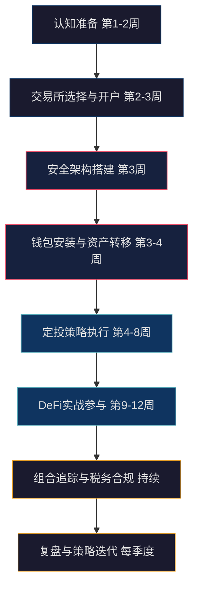
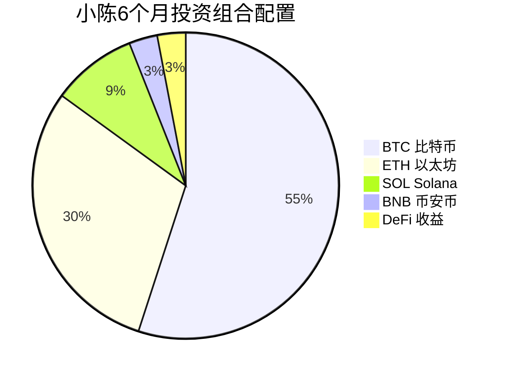
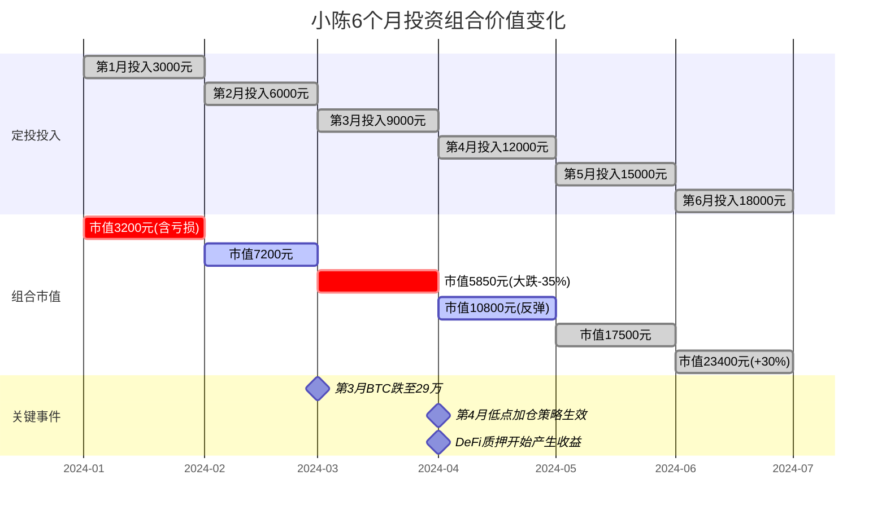

## 案例五：加密货币工具使用——从零搭建加密资产管理系统

### 导言

本案例是第14章"投资工具与平台"实战系列的压轴之作。前面四个案例分别覆盖了股票工具箱、基金定投实践、房产投资分析和量化交易入门——它们有一个共同点：你操作的是受监管的传统金融市场，有交易所、托管行和监管机构为你兜底。而加密货币是一个完全不同的世界：没有托管行帮你保管资产，没有监管机构为你追回损失，**你是自己资产的唯一责任人**。

这意味着加密投资不仅要求你掌握交易工具，还要求你具备安全工程思维。本案例将这种思维贯穿始终：每一阶段都先讲安全，再讲操作；每一个工具推荐都附带安全验证方法；每一段代码都标注了风险提示。

阅读本案例后，你将获得一套可落地的加密资产管理系统，而非一堆零散的操作提示。

### 本案例知识体系

下表展示本案例覆盖的全部主题，以及每个主题解决的核心问题：

| 阶段 | 主题 | 核心问题 | 关键工具/技能 |
|------|------|---------|-------------|
| 1 | 认知准备 | 区块链到底是什么？我需要懂多少技术？ | 概念理解、学习路径规划 |
| 2 | 交易所选择与开户 | 哪个交易所安全？怎么入金？ | Binance/OKX、KYC、C2C 交易 |
| 2.5 | 区块链浏览器实操 | 链上发生了什么？怎么验证交易？ | Etherscan、Arbiscan |
| 3 | 安全架构搭建 | 怎么保护资产不被盗？ | 2FA、钱包体系、助记词备份 |
| 3.5 | 硬件钱包实操 | 冷存储怎么操作？ | Ledger Nano S Plus |
| 4 | 行情分析工具 | 怎么看懂市场？ | TradingView、CoinGecko、DeFi Llama |
| 4.5 | Gas 费优化 | 为什么交易费这么贵？怎么省？ | EIP-1559、L2 迁移 |
| 5 | 定投策略执行 | 什么时候买？买多少？ | DCA 策略、再平衡 |
| 6 | DeFi 实战 | 怎么参与去中心化金融？ | Lido、Aave、Uniswap |
| 7 | 投资组合追踪 | 我到底赚了多少钱？ | DeBank、Zapper |
| 8 | 法币出金 | 怎么把加密资产变现为人民币？ | C2C 卖出、合规注意事项 |
| 9 | 心理管理 | 怎么在极端波动中保持理性？ | 投资日记、信息管理 |
| 10 | 骗局识别 | 哪些是骗局？怎么防范？ | 安全检查清单 |
| 11 | 实战复盘 | 做对了什么？做错了什么？ | 数据分析、经验总结 |


### 全局路线图



### 案例背景

小陈，28 岁互联网从业者，月薪 18,000 元，有 2 年 A 股投资经历，累计投入 30 万元，年化收益约 6%。2024 年初他注意到比特币 ETF 在美国获批、以太坊完成上海升级质押提款功能，认为加密市场正在走向机构化，决定将一部分资金配置到加密资产。

**初始状态**：

| 维度 | 详情 |
|------|------|
| 可投资资产 | 约 50 万元（含股票账户 30 万、银行理财 15 万、活期 5 万） |
| 计划投入 | 5 万元（占总资产 10%） |
| 加密知识水平 | 了解比特币基本概念，听说过以太坊，不知道 DeFi 和钱包 |
| 风险偏好 | 中等，能接受单笔投资 50% 的浮亏，但不希望归零 |
| 投资目标 | 3-5 年长期持有主流币种，用小部分资金学习 DeFi |
| 时间精力 | 每周可投入 3-5 小时研究和操作 |

**为什么选择 10% 这个比例？**

加密货币与传统资产（股票、债券、房产）的相关性较低，少量配置可以提升组合的风险调整后收益。但其高波动性意味着配置比例过高会显著增加组合回撤。学术研究（如 CFA Institute 2023 年报告）建议，对高波动另类资产的配置通常不超过 5%-15%。小陈选择 10% 是在收益潜力和风险可控之间的折中。

具体来看，比特币与标普 500 的 90 天滚动相关性在 0.2-0.6 之间波动，在市场极端恐慌时相关性会短期飙升（如 2020 年 3 月新冠暴跌），但在正常市场环境下确实能提供分散化收益。10% 的配置意味着即使加密资产归零，总组合只损失 10%——这是小陈可以承受的心理底线。

### 第一阶段：认知准备（第 1-2 周）

在投入真金白银之前，小陈花两周时间完成基础认知建设。这一步常被新手跳过，但它是避免重大亏损的第一道防线。

#### 区块链基础概念

不需要成为技术专家，但以下概念必须理解：

| 概念 | 一句话解释 | 为什么重要 |
|------|-----------|-----------|
| 区块链 | 分布式账本，交易记录不可篡改 | 理解"去中心化"的信任基础 |
| 私钥 | 控制资产的唯一凭证，丢了就永远丢了 | 这是加密资产安全的核心 |
| 公钥/地址 | 类似银行账号，可以公开 | 用于接收转账 |
| Gas 费 | 执行交易/合约需要支付的网络手续费 | 不理解 Gas 就会在 DeFi 中亏钱 |
| 共识机制 | PoW（工作量证明）vs PoS（权益证明） | 理解不同链的能耗、安全性差异 |
| 智能合约 | 自动执行的链上程序 | DeFi 的底层基础 |
| Layer 2 | 建在主链之上的扩容方案（如 Arbitrum、Optimism） | 大幅降低交易费用 |
| 代币标准 | ERC-20（同质化代币）、ERC-721（NFT） | 理解代币为什么可以在不同钱包间转移 |
| 跨链桥 | 连接不同区块链的资产转移通道 | 资产跨链操作的基础，也是高风险区域 |
| 预言机 | 为智能合约提供链外数据的服务 | 理解 DeFi 协议如何获取价格信息 |

#### 学习资源推荐

| 资源 | 类型 | 适合阶段 | 费用 | 说明 |
|------|------|----------|------|------|
| 《精通比特币》（Andreas Antonopoulos） | 书籍 | 入门 | 免费电子版 | 技术原理最权威的入门书 |
| Binance Academy | 在线课程 | 入门-进阶 | 免费 | 中文内容丰富，覆盖广 |
| Bankless Newsletter | 邮件订阅 | 进阶 | 免费/付费 | 英文为主，行业深度分析 |
| The Defiant | 视频/文章 | 进阶 | 免费 | DeFi 领域最权威的媒体 |
| Etherscan 学习区 | 链上实操 | 进阶 | 免费 | 学会读链上数据 |
| Dune Analytics | 数据分析 | 高级 | 免费 | 自定义链上数据查询 |
| CoinGecko 学习中心 | 图文教程 | 入门 | 免费 | 比 Binance Academy 更简洁 |
| Whiteboard Crypto（YouTube） | 视频 | 入门 | 免费 | 用动画解释复杂概念，英文 |

### 第二阶段：交易所选择与开户（第 2-3 周）

#### 主流交易所深度对比

交易所是法币（人民币）进入加密世界的大门。选择标准包括安全性历史、流动性深度、费率结构、法币入金通道和合规程度。

| 维度 | Binance（币安） | OKX（欧易） | Bybit | Coinbase |
|------|-----------------|-------------|-------|----------|
| 成立时间 | 2017 | 2017（前身 2013） | 2018 | 2012 |
| 安全历史 | 2019 年被盗 7,000 BTC 后全额赔付；此后零重大事故 | 2020 年私钥负责人失联后恢复运营 | 零重大安全事故 | 零重大安全事故 |
| 现货币种数 | 600+ | 400+ | 500+ | 250+ |
| 现货手续费 | Maker/Taker 0.1%（持有 BNB 可降至 0.075%） | Maker 0.08%/Taker 0.1%（持有 OKB 折扣） | Maker 0.1%/Taker 0.1% | Maker 0.4%/Taker 0.6% |
| 合约手续费 | M/T 0.02%/0.04% | M/T 0.02%/0.05% | M/T 0.02%/0.055% | 不提供合约 |
| 法币入金 | 支持 C2C（P2P） | 支持 C2C | 支持 C2C | 支持信用卡/银行转账 |
| 理财产品 | 活期/定期/DeFi 挖矿 | 活期/定期/DeFi | 活期 | 质押 |
| 适合人群 | 全球用户、活跃交易者 | 亚洲用户、合约交易者 | 合约交易者 | 美国用户、纯新手 |
| 小陈的选择 | ✅ 主力交易所 | ✅ 备用交易所 | ❌ 暂不需要 | ❌ 费率太高 |

**为什么选两个交易所？** 单一交易所存在单点故障风险——如果交易所临时维护、被黑客攻击或限制提币，你还有另一条路可以操作。两个足够，三个以上会增加管理复杂度。

#### 注册与 KYC 完整流程

KYC（Know Your Customer，了解你的客户）是合规交易所的强制要求。完整流程如下：

**步骤一：注册账号**

1. 访问交易所官网（务必确认 URL 正确，避免钓鱼网站）
2. 使用邮箱注册（推荐用 Gmail/ProtonMail，不用 QQ 邮箱）
3. 设置高强度密码（20 位以上，包含大小写字母、数字、特殊符号）
4. 完成邮箱验证

**步骤二：身份验证**

1. 进入"身份认证"页面
2. 选择证件类型：身份证（国内用户最方便）
3. 上传证件正反面照片（要求清晰、无反光、四角完整）
4. 进行人脸识别（需要在光线充足的环境下操作）
5. 等待审核：通常 10 分钟-24 小时，高峰期可能需要 1-3 天

**步骤三：安全设置（至关重要，见下文安全架构章节）**

#### 入金操作详解

中国用户入金的主流方式是 C2C（P2P）交易：

1. 在交易所内找到"C2C 交易"或"P2P"入口
2. 选择"买入"→ 选择币种 USDT（稳定币，1 USDT ≈ 1 美元）
3. 选择支付方式：支付宝/微信/银行卡
4. 选择商家：优先选择认证商家（有蓝标或认证标志），看成交单数和好评率
5. 下单后按商家提供的收款信息转账
6. 转账完成点击"已付款"，等待商家放币

**入金安全要点**：
- 只和认证商家交易，不和陌生人私下交易
- 转账时备注栏不要写"比特币""加密货币"等敏感词
- 每笔金额控制在 5,000 元以内，降低触发银行风控的概率
- 如果商家要求撤销订单重新下单，立即拒绝——这是常见诈骗手法
- 收到 USDT 后不要立刻大额提现到外部钱包，先等 24 小时（反洗钱冷静期）

#### 法币出金流程：从加密资产到人民币

入金相对简单，但出金（将加密资产变现为人民币）是很多新手忽视的环节，也是风险最高的操作之一。以下是完整流程和注意事项。

**C2C 卖出操作流程**：

```text
法币出金完整流程
│
├── 第一步：资产归集
│   ├── 将分散在钱包、DeFi 中的资产转回交易所
│   ├── 建议先转为 USDT（流动性最好，商家最多）
│   ├── 注意网络选择：从 Arbitrum 提回交易所只需 1-2 美元
│   └── 到账后等待 10 分钟确认余额无误
│
├── 第二步：C2C 卖出
│   ├── 进入 C2C 交易 → 选择"卖出"
│   ├── 选择币种：USDT
│   ├── 选择收款方式：银行卡（最常用）/支付宝/微信
│   ├── 筛选商家：
│   │   ├── ✅ 选择认证商家（平台担保）
│   │   ├── ✅ 成交单数 > 1000，好评率 > 98%
│   │   ├── ✅ 注册时间超过 6 个月
│   │   └── ❌ 不要因为价格更好就选非认证商家
│   ├── 输入卖出数量，确认汇率和收款金额
│   └── 点击"卖出"，等待商家付款
│
├── 第三步：确认收款
│   ├── 商家付款后，仔细核对：
│   │   ├── 收款金额是否与订单一致
│   │   ├── 付款人姓名是否与商家实名一致
│   │   └── ⚠️ 如果姓名不一致，立即拒绝并申诉
│   ├── 确认无误后点击"确认放币"
│   └── 资金到账银行卡
│
└── 第四步：资金处理
    ├── 到账后不要立即转出或分散转账
    ├── 建议在卡内停留 24 小时以上再使用
    └── 保留交易记录截图以备查询
```

**出金合规注意事项**：

| 要点 | 说明 | 风险等级 |
|------|------|---------|
| 单笔金额 | 建议不超过 5 万元 | 高 |
| 日累计金额 | 建议不超过 10 万元 | 高 |
| 交易频率 | 避免一天内多次出入金 | 中 |
| 收款卡选择 | 使用不常用的储蓄卡，不要用工资卡 | 高 |
| 商家筛选 | 只选认证商家，避免"黑钱"混入 | 极高 |
| 备注信息 | 不写任何加密货币相关词汇 | 中 |

**银行卡冻结风险与应对**：

银行卡被冻结是出金最常见也最令人恐惧的风险。原因是：如果商家的资金来源涉及电信诈骗、洗钱等违法活动，你的收款卡会被关联冻结。

```text
银行卡冻结应对方案
│
├── 预防措施（最重要）
│   ├── 使用专用银行卡收款（不与工资卡、房贷卡混用）
│   ├── 单笔金额控制在 1-3 万元以内
│   ├── 只与平台认证商家交易
│   ├── 避免深夜、凌晨等异常时段交易
│   ├── 不要频繁与同一商家大额交易
│   └── 出金前查看商家近期是否有差评或投诉
│
├── 如果被冻结
│   ├── 第一步：保持冷静，冻结≠违法
│   ├── 第二步：联系开户银行，了解冻结原因和冻结机关
│   ├── 第三步：配合公安机关调查
│   │   ├── 准备材料：C2C 交易截图、聊天记录、交易流水
│   │   ├── 说明资金来源：合法的加密资产交易所得
│   │   └── 态度配合，如实说明情况
│   ├── 第四步：等待处理（通常 3-6 个月，极端情况 1-2 年）
│   └── 第五步：解冻后考虑更换收款银行
│
└── 法律建议
    ├── 冻结通常依据《公安机关办理刑事案件程序规定》
    ├── 如果确实不知情且交易合法，一般会解冻
    ├── 金额较大（超过 50 万）建议咨询律师
    └── 保留所有交易凭证是最重要的自保手段
```

**小陈的出金策略**：不急于出金，长期持有为主。如果需要变现，单次不超过 2 万元，使用招商银行储蓄卡收款，每月出金不超过 2 次。所有 C2C 交易截图保存到本地硬盘和加密云盘。

### 第三阶段：安全架构搭建（第 3 周）

安全是加密投资的第一优先级。传统金融中银行承担了大部分安全责任，而加密世界中你是自己资产的唯一守护者——这意味着安全设置不是"可选项"，而是"必做项"。

#### 交易所安全设置清单

```text
交易所安全设置（按优先级排列）
│
├── 第一层：账户安全（必须全部完成）
│   ├── 两步验证（2FA）
│   │   ├── 首选：Google Authenticator 或 Authy
│   │   ├── 备选：硬件安全密钥（YubiKey，100-300 元）
│   │   ├── ❌ 不要只用短信验证（SIM 卡可被克隆攻击）
│   │   └── ✅ 备份 2FA 恢复密钥（16 位种子码），抄写在纸上存保险柜
│   │
│   ├── 密码管理
│   │   ├── 交易所密码：独立、高强度、不与其他网站重复
│   │   ├── 使用密码管理器（Bitwarden/1Password）
│   │   └── 每 3 个月更换一次
│   │
│   └── 反钓鱼码
│       ├── 在交易所设置中开启
│       ├── 设置一个只有你知道的暗号
│       └── 官方邮件中会包含此暗号，没有暗号的都是钓鱼邮件
│
├── 第二层：资金安全
│   ├── 提现地址白名单
│   │   ├── 只允许提币到预先添加的地址
│   │   ├── 添加新地址后有 24-48 小时冷却期
│   │   └── 这是防止黑客提币的最后防线
│   │
│   ├── 提现限额
│   │   ├── 设置每次提现上限
│   │   ├── 设置每日提现上限
│   │   └── 建议：单次不超过 1 BTC 等值
│   │
│   └── API 密钥管理
│       ├── 不使用量化交易就不创建 API
│       ├── 如需创建：限制 IP 白名单
│       ├── 权限只开读取，不开提现
│       └── 不用时立即删除
│
└── 第三层：设备与登录安全
    ├── 登录设备管理：定期清理不使用的设备
    ├── 登录 IP 异常通知：开启
    ├── 邮箱安全：交易所邮箱也开启 2FA
    └── 防钓鱼浏览器书签：将交易所 URL 存为书签，永远从书签访问
```

#### 钱包体系：不是你的私钥，就不是你的币

"not your keys, not your coins" 是加密世界最重要的安全原则。存放在交易所的资产，本质上是交易所替你保管——如果交易所出事（如 2022 年 FTX 暴雷），你的资产可能血本无归。

**钱包类型深度对比**：

| 维度 | 交易所钱包 | 软件钱包（MetaMask/Trust Wallet） | 硬件钱包（Ledger/Trezor） | 多签钱包（Gnosis Safe） |
|------|-----------|----------------------------------|--------------------------|------------------------|
| 私钥控制 | 交易所持有 | 用户持有（存在设备中） | 用户持有（存在安全芯片中） | 多人共同持有 |
| 安全等级 | 中（依赖交易所） | 中高（依赖设备安全） | 最高（物理隔离） | 最高（需要多人签名） |
| 便利性 | 最高 | 高 | 中低 | 低 |
| 费用 | 免费 | 免费 | 500-1,500 元 | 免费（Gas 费除外） |
| 支持链 | 交易所上架的所有链 | 多链（EVM 兼容链） | 多链 | 主要以太坊及 L2 |
| 适合场景 | 小额、频繁交易 | DeFi 交互、日常使用 | 大额长期存储（1 万元以上） | 团队资金管理、大额存储 |
| 恢复方式 | 联系客服 | 12/24 词助记词 | 助记词 + PIN 码 | 多签恢复机制 |

**小陈的钱包配置方案**：

```text
5 万元加密资产存储方案
│
├── 交易所（20%）：10,000 元
│   ├── 币安（15%）：7,500 元 → 用于交易和定投执行
│   └── OKX（5%）：2,500 元 → 备用交易所，保持少量余额
│
├── 软件钱包（40%）：20,000 元
│   ├── MetaMask（浏览器插件 + 手机版）→ ETH 及 EVM 链代币
│   │   ├── 主钱包：存放不参与 DeFi 的资产
│   │   └── DeFi 专用钱包：单独创建，只放参与 DeFi 的资金
│   └── Trust Wallet（手机版）→ 多链管理（BTC、SOL 等）
│
└── 硬件钱包（40%）：20,000 元
    └── Ledger Nano S Plus（约 600 元）→ BTC + ETH 长期存储
        ├── 存入购入的大部分 BTC 和 ETH
        └── 只在需要调仓时才连接电脑
```

**为什么 DeFi 要用单独钱包？** DeFi 操作需要与智能合约交互，授权合约使用你的代币。如果合约有漏洞或被攻击，只有该钱包中的资产受影响。主钱包从不与合约交互，保持"干净"状态。

#### MetaMask 安装与使用实操

MetaMask 是使用最广泛的以太坊生态钱包，以下是从零开始的完整安装流程：

**浏览器插件版安装**：

1. 访问 MetaMask 官网 `metamask.io`（务必确认 URL 正确）
2. 点击"Download"→ 选择你的浏览器（Chrome/Firefox/Edge/Brave）
3. 在浏览器扩展商店中安装（Chrome 用户会跳转到 Chrome Web Store）
4. 安装完成后浏览器右上角出现狐狸图标

**创建钱包的每一步**：

```text
MetaMask 创建钱包流程
│
├── 第一步：点击"创建新钱包"
│   ├── ❌ 不要选"导入钱包"（那是恢复已有钱包用的）
│   └── 同意使用条款
│
├── 第二步：设置钱包密码
│   ├── 这个密码只保护本地设备上的钱包
│   ├── 忘记密码可以用助记词恢复（但不要因此设置弱密码）
│   └── 要求：至少 8 位，建议 12 位以上
│
├── 第三步：观看安全教育视频（可选但推荐）
│
├── 第四步：查看助记词
│   ├── 点击"安全存放助记词"→ 显示 12 个英文单词
│   ├── ⚠️ 此时不要截屏、不要拍照、不要复制到剪贴板
│   ├── 用纸笔按顺序抄写下来
│   ├── 抄写完成后 MetaMask 会要求你按顺序点击单词验证
│   └── 验证通过，钱包创建完成
│
└── 第五步：首次使用检查
    ├── 确认钱包地址（0x 开头的 42 位字符串）
    ├── 切换到正确的网络（默认以太坊主网）
    └── 添加常用代币的显示（默认只显示 ETH）
```

**添加自定义网络（以 Arbitrum 为例）**：

在 MetaMask 中添加 L2 网络可以大幅降低交易费用。有两种方式：

方式一：自动添加（推荐新手）
1. 访问 Chainlist（`chainlist.org`）
2. 搜索"Arbitrum One"
3. 点击"Connect Wallet"→ 确认添加网络

方式二：手动添加
1. MetaMask → 设置 → 网络 → 添加网络
2. 填入以下参数：

| 参数 | 值 |
|------|------|
| 网络名称 | Arbitrum One |
| RPC URL | `https://arb1.arbitrum.io/rpc` |
| 链 ID | 42161 |
| 符号 | ETH |
| 区块浏览器 | `https://arbiscan.io` |

**添加自定义代币**：

1. 在 MetaMask 底部点击"导入代币"
2. 输入代币合约地址（从 CoinGecko 或 Etherscan 获取）
3. 代币符号和精度会自动填充
4. 点击"添加"即可在钱包中看到余额

**⚠️ 添加代币的安全要点**：只添加你主动购买或转入的代币。如果钱包中莫名出现不明代币，不要与之交互——这可能是"粉尘攻击"（dusting attack），与恶意代币交互可能导致钱包被授权盗取资产。

#### Ledger Nano S Plus 硬件钱包完整设置指南

硬件钱包是存储加密资产最安全的方式。以下以 Ledger Nano S Plus 为例，覆盖从拆箱到日常使用的全流程。

**开箱与初始化**：

```text
Ledger Nano S Plus 初始化流程
│
├── 第一步：验证设备完整性
│   ├── 检查包装盒是否有拆封痕迹
│   ├── 设备首次开机应显示"Welcome"引导
│   ├── ⚠️ 如果设备已经设置好或附带了助记词卡片 → 100% 是骗局，立即退货
│   └── 只从 Ledger 官网或授权经销商购买
│
├── 第二步：设置 PIN 码
│   ├── 按设备按键选择"Set up as new device"
│   ├── 设置 4-8 位 PIN 码
│   ├── PIN 码用于每次连接设备时的身份验证
│   ├── ⚠️ 连续 3 次输错 PIN 码，设备会自动重置（安全机制）
│   └── 建议：不要用生日、1234、0000 等常见组合
│
├── 第三步：记录恢复短语（24 个单词）
│   ├── 设备屏幕会依次显示 24 个英文单词
│   ├── 用附带的 3 张恢复卡片按顺序记录
│   ├── 每记录一个单词，按右键继续下一个
│   ├── 记录完成后，设备会随机抽查几个单词
│   ├── 按正确顺序选择单词完成验证
│   └── ⚠️ 这 24 个词 = 你的全部资产，比 PIN 码更重要
│
├── 第四步：安装 Ledger Live 软件
│   ├── 从 `ledger.com/ledger-live` 下载（不要从其他来源下载）
│   ├── 安装完成后连接设备
│   ├── Ledger Live 会自动检测设备固件版本
│   ├── 如有固件更新，按照提示完成（过程约 5-10 分钟）
│   └── ⚠️ 固件更新过程中不要断开设备连接
│
└── 第五步：安装区块链应用
    ├── 在 Ledger Live → Manager 中安装所需应用
    │   ├── Bitcoin 应用 → 管理 BTC
    │   ├── Ethereum 应用 → 管理 ETH 及 ERC-20 代币
    │   └── 其他链的应用按需安装
    ├── Ledger Nano S Plus 存储空间约 100 个应用
    ├── 安装完成后在设备屏幕上确认应用图标
    └── 测试：创建一个接收地址，确认设备屏幕上显示的地址与软件一致
```

**接收加密资产**：

1. 在 Ledger Live 中选择对应币种 → 点击"Receive"
2. 选择连接的设备
3. 设备屏幕上会显示接收地址——**必须与电脑屏幕上的一致**
4. 确认一致后复制地址，粘贴到发送方（交易所提币页面）
5. 等待区块确认后余额更新

**发送加密资产**：

1. 在 Ledger Live 中选择对应币种 → 点击"Send"
2. 输入接收地址和金额
3. 点击"Continue"→ 设备屏幕上会显示交易详情
4. 在设备上逐一核实：接收地址、金额、手续费
5. 确认无误后在设备上按两个按钮确认签名
6. 交易广播到区块链网络，等待确认

**固件更新最佳实践**：

| 要点 | 说明 |
|------|------|
| 更新时机 | Ledger 官方发布安全补丁时立即更新 |
| 更新前准备 | 确认 24 个恢复词已正确备份 |
| 更新过程 | 不要断开设备连接，不要关闭电脑 |
| 更新后验证 | 检查所有应用是否正常，余额是否正确 |
| 频率 | 约每 2-3 个月检查一次是否有更新 |
| 风险 | 固件更新极少失败，但备份恢复词是终极保险 |

**硬件钱包安全检查清单**：

- ✅ 只从官网购买，收到后验证包装完整性
- ✅ PIN 码设 8 位，不用常见组合
- ✅ 24 个恢复词用金属板备份，抄写两份分开存放
- ✅ 每次接收时在设备屏幕上确认地址
- ✅ 定期检查固件更新
- ❌ 不在公共电脑上连接硬件钱包
- ❌ 不在他人面前输入 PIN 码
- ❌ 不购买二手硬件钱包（可能被植入后门）

#### 链上转账操作流程

从交易所提币到钱包是每个新手都必须掌握的操作。以下是以从币安提 ETH 到 MetaMask 为例的完整流程：

```text
交易所提币到钱包的完整流程
│
├── 第一步：复制钱包地址
│   ├── 打开 MetaMask → 点击账户名旁边的地址（自动复制）
│   ├── ⚠️ 复制后务必手动核对前 4 位和后 4 位
│   └── 建议：先发给自己微信/邮箱，再从消息中复制（防止剪贴板劫持）
│
├── 第二步：在交易所发起提币
│   ├── 币安 → 钱包 → 现货账户 → 找到 ETH → 点击"提现"
│   ├── 粘贴钱包地址
│   ├── 选择网络：ETH（以太坊主网）或 Arbitrum（如果钱包已添加）
│   │   ├── ⚠️ 网络必须和钱包地址匹配！
│   │   ├── 选 Arbitrum 便宜很多（约 1-2 美元），但钱包必须已添加该网络
│   │   └── 选错网络 = 资产丢失，无法找回
│   ├── 输入提币数量
│   └── 确认手续费（以太坊主网约 5-15 美元，L2 约 1-2 美元）
│
├── 第三步：安全验证
│   ├── 输入邮箱验证码
│   ├── 输入 2FA 验证码
│   └── 首次提币到新地址可能需要等待 24 小时冷却期
│
└── 第四步：等待到账
    ├── 以太坊主网：约 5-15 分钟（取决于网络拥堵程度）
    ├── L2 网络：约 1-5 分钟
    ├── 在 MetaMask 中查看余额变化
    └── 在 Etherscan/Arbiscan 上查看交易状态
```

**提币手续费对比**（以 2024 年数据为参考）：

| 网络 | 提币手续费 | 到账时间 | 安全性 | 适用场景 |
|------|-----------|---------|--------|---------|
| 以太坊主网 | 5-15 美元 | 5-15 分钟 | 最高 | 大额转账（>1000 美元） |
| Arbitrum | 1-2 美元 | 1-5 分钟 | 高 | 日常转账、DeFi 操作 |
| Optimism | 1-2 美元 | 1-5 分钟 | 高 | 日常转账、DeFi 操作 |
| BSC（BNB Chain） | 0.3-1 美元 | 1-3 分钟 | 中 | 小额频繁操作 |
| Polygon | <0.1 美元 | 1-3 分钟 | 中 | 小额测试、NFT 操作 |

#### 区块链浏览器实操：读懂链上数据

区块链浏览器是加密世界的"透视镜"——每一笔交易、每一个地址、每一个合约的状态都公开透明。学会使用区块链浏览器，是从"听别人说"到"自己验证"的关键跨越。

**主流区块链浏览器**：

| 浏览器 | 覆盖链 | 主要用途 | 网址 |
|--------|--------|---------|------|
| Etherscan | 以太坊主网 | 查询 ETH 交易、代币、合约 | `etherscan.io` |
| Arbiscan | Arbitrum | 查询 L2 交易和合约 | `arbiscan.io` |
| BscScan | BNB Chain | 查询 BSC 交易 | `bscscan.com` |
| Solscan | Solana | 查询 SOL 交易 | `solscan.io` |
| Blockchair | 多链 | 跨链查询 | `blockchair.com` |

**实操一：查询一笔交易**

假设你刚从币安提了 0.1 ETH 到 MetaMask，想确认交易状态：

1. 复制交易哈希（TxHash）：在币安提现记录中找到，格式类似 `0xabc123...def789`
2. 访问 Etherscan → 粘贴 TxHash 到搜索框 → 回车
3. 交易详情页会显示以下信息：

```text
Etherscan 交易详情页字段解读
│
├── Transaction Hash（交易哈希）
│   └── 0xabc123def456... → 这笔交易的唯一标识，类似银行流水号
│
├── Status（状态）
│   ├── Success → 交易确认成功 ✅
│   ├── Pending → 还在等待确认 ⏳
│   └── Failed → 交易失败，Gas 费不退 ❌
│
├── Block（区块号）
│   └── 19,234,567 → 交易被打包进的区块编号，越高越新
│
├── From（发送方）
│   └── 0x1111...2222 → 币安热钱包地址
│
├── To（接收方）
│   └── 0x3333...4444 → 你的 MetaMask 地址
│       ⚠️ 必须和你钱包地址完全一致，一个字符都不能错
│
├── Value（金额）
│   └── 0.1 ETH → 转账金额
│
├── Transaction Fee（交易费）
│   └── 0.0021 ETH ($5.25) → 矿工费/验证者奖励
│
├── Gas Price（Gas 单价）
│   └── 25.3 Gwei → 每单位 Gas 的价格
│
└── Gas Limit & Gas Used
    ├── Gas Limit: 21,000 → 预设的 Gas 上限
    └── Gas Used: 21,000 → 实际消耗的 Gas（普通 ETH 转账固定为 21,000）
```

**实操二：验证代币合约地址**

在添加新代币到钱包之前，必须在区块链浏览器上验证合约的真实性。以验证 USDT 合约为例：

1. 访问 Etherscan → 搜索 "USDT" 或粘贴合约地址 `0xdAC17F958D2ee523a2206206994597C13D831ec7`
2. 查看代币页面的关键信息：

| 检查项 | 正常指标 | 异常信号 |
|--------|---------|---------|
| 合约创建时间 | 2017 年（USDT 上线时间） | 最近几天创建 |
| 持有人数量 | 数百万 | 很少（<100） |
| 总供应量 | 与官网公布一致 | 数量异常大或小 |
| 交易笔数 | 数十亿 | 很少 |
| 源代码验证 | ✅ Verified | ❌ 未验证 |
| 官方标签 | ✅ 有 Token 标签 | 无标签或有 "Suspicious" 标签 |

3. 点击 "Contract" 标签查看：
   - "Contract Source Code: Verified" → 合约源码已公开，可以信任
   - 如果显示 "Contract Source Code: Not Verified" → 不要交互

**实操三：查看智能合约的读写权限**

在 Etherscan 上打开任何合约，点击 "Read Contract" 可以查看合约的公开数据（免费），点击 "Write Contract" 可以与合约交互（需要连接钱包）。关键是学会查看合约的授权状态：

1. 在 Etherscan 搜索你的钱包地址
2. 点击 "Token Approvals" 标签
3. 查看所有已授权的合约和授权额度
4. 如果发现不再使用的协议有 "Unlimited" 授权 → 立即去 Revoke.cash 撤销

**实操四：追踪 Gas 费走势**

访问 Etherscan 的 Gas Tracker（`etherscan.io/gastracker`）可以查看：

- 当前推荐的 Gas 价格（低/中/高）
- 最近 24 小时的 Gas 价格走势图
- 各类操作的预估费用（ETH 转账、ERC-20 转账、Uniswap 交易等）

**小技巧**：将 Gas Tracker 页面加入书签，每次操作前先查看。如果当前 Gas 价格是过去 24 小时的高位，可以等几个小时再操作，通常能节省 30-50% 的费用。

#### 助记词备份：最重要的安全操作

助记词（Seed Phrase）是 12 个或 24 个英文单词，它是恢复钱包的唯一方式。丢失助记词 = 永久丢失资产。

**正确的助记词备份方法**：

1. **金属助记词板**（推荐）：将助记词刻在不锈钢板上（如 Cryptosteel Capsule，约 300 元），防火防水防腐蚀
2. **手抄纸条**：用铅笔（比钢笔更持久）抄写在防水纸上，存放在保险柜
3. **分片备份**：将 24 个词分成 3 组，每组 16 个词（有 8 个重叠），分别存放在 3 个不同物理位置。即使一处被毁，另外两处可以恢复完整助记词

**绝对禁止的做法**：
- ❌ 截图保存在手机相册
- ❌ 存在云盘（iCloud/Google Drive/百度网盘）
- ❌ 通过微信/邮件发送给自己
- ❌ 存在电脑文本文件中
- ❌ 告诉任何人你的助记词（包括"客服""技术支持"）

**助记词验证**：备份完成后，用另一台设备（或删除 MetaMask 后重新安装）用助记词恢复钱包，确认恢复成功后才说明备份正确。这一步很多人跳过，结果在真正需要恢复时发现抄错了单词。

### 第四阶段：交易工具与定投策略（第 4-8 周）

#### 行情分析工具矩阵

不同分析需求对应不同工具，以下是小陈实际使用的工具组合：

| 工具 | 核心功能 | 费用 | 使用场景 | 访问方式 |
|------|---------|------|---------|---------|
| TradingView | K 线图表、技术指标、多时间框架分析 | 免费版够用（高级版 $13/月） | 判断买卖时机、画趋势线 | 网页 + APP |
| CoinGecko | 价格、市值排名、交易量、流通量 | 免费 | 快速查看行情、发现新项目 | 网页 + APP |
| CoinMarketCap | 综合市场数据、交易所排名、空投信息 | 免费 | 市场概览、追踪持仓 | 网页 + APP |
| DeFi Llama | TVL（总锁仓量）、收益率、协议对比 | 免费 | DeFi 协议分析 | 网页 |
| Dune Analytics | 自定义链上数据查询和可视化 | 免费 | 深度链上数据分析 | 网页 |
| Nansen | 聪明钱追踪、钱包标签分析 | 付费（$150/月起） | 跟踪大户动向 | 网页 |
| Glassnode | 链上指标（MVRV、NUPL、SOPR 等） | 免费版有限 / 付费 $29/月起 | 判断市场周期位置 | 网页 |
| Arkham Intelligence | 实体标签、资金流向追踪 | 免费 | 追踪特定地址/机构资金动向 | 网页 |

**小陈的日常工具组合**：CoinGecko（看行情）+ TradingView（技术分析）+ DeFi Llama（找 DeFi 机会）+ Glassnode 免费版（判断周期）。进阶阶段再考虑 Nansen 和 Dune。

#### 行情分析工具使用实操

工具列表只是第一步，关键是知道怎么用。以下详细讲解三个核心工具的实际使用方法。

##### TradingView K 线图阅读指南

TradingView 是加密市场最主流的图表工具。掌握以下基础就能开始分析：

**打开方式**：访问 `tradingview.com` → 搜索 BTCUSDT 或 ETHUSDT → 选择交易所（推荐 Binance）

**K 线图基础元素**：

| 元素 | 含义 | 怎么看 |
|------|------|--------|
| 绿色 K 线 | 收盘价 > 开盘价（上涨） | 实体越长，上涨力度越大 |
| 红色 K 线 | 收盘价 < 开盘价（下跌） | 实体越长，下跌力度越大 |
| 上影线 | K 线最高价到实体顶部的距离 | 上影线长 = 上方抛压重 |
| 下影线 | K 线最低价到实体底部的距离 | 下影线长 = 下方支撑强 |
| 成交量（底部柱状图） | 该时间段的交易量 | 放量上涨/下跌比缩量更可信 |

**新手应关注的 5 种 K 线形态**：

| 形态 | 特征 | 含义 | 可靠度 |
|------|------|------|--------|
| 锤子线 | 下影线长度是实体 2 倍以上，出现在下跌末端 | 可能见底反弹 | 中 |
| 吞没形态 | 第二根 K 线完全吞没前一根 | 趋势可能反转 | 中高 |
| 十字星 | 开盘价 ≈ 收盘价，上下影线较长 | 多空平衡，趋势可能变化 | 中 |
| 三连阳 | 连续三根绿色 K 线，收盘价逐步升高 | 上升趋势确立 | 中 |
| 三连阴 | 连续三根红色 K 线，收盘价逐步降低 | 下降趋势确立 | 中 |

**推荐设置**：
- 时间框架：日线（看趋势）、4 小时线（看短期方向）
- 指标：MA20 + MA60（均线）、Volume（成交量）
- 不要添加超过 3 个指标——信息过多反而干扰判断

##### CoinGecko 投资组合追踪设置

CoinGecko 不仅是行情网站，它的 Portfolio 功能可以免费追踪你的持仓：

1. 访问 `coingecko.com` → 注册账号（免费）
2. 点击顶部 "Portfolio" → 创建新组合
3. 添加持仓：
   - 选择币种（如 BTC）
   - 输入购买数量
   - 输入购买价格（以 USDT 或 CNY 计价）
   - 选择购买日期
   - 添加交易手续费
4. 重复添加所有持仓后，Portfolio 页面会显示：
   - 组合总市值和盈亏
   - 每个币种的占比（饼图）
   - 历史盈亏曲线
5. 设置价格提醒：点击币种 → "Create Alert" → 设置目标价格

**小技巧**：Portfolio 的历史数据可以导出为 CSV，方便做年度税务申报。建议每月导出一次备份。

##### DeFi Llama 发现收益机会

DeFi Llama 是寻找 DeFi 收益机会的最佳免费工具：

1. 访问 `defillama.com` → 点击 "Yields" 标签
2. 使用筛选器：
   - Chain：选择你使用的链（如 Ethereum、Arbitrum）
   - TVL：筛选 TVL > $10M 的池子（更安全）
   - APY：筛选 3%-20% 范围（过高可能有猫腻）
   - Stablecoins：如果只想找稳定币池，勾选此选项
3. 关注以下指标：

| 指标 | 含义 | 安全阈值 |
|------|------|---------|
| TVL | 总锁仓量 | > $10M 相对安全 |
| APY | 年化收益率 | 3%-15% 合理，>50% 警惕 |
| IL Risk | 无常损失风险 | "No" 最好 |
| Audit | 是否有审计 | 有审计 = 有基本保障 |
| Age | 协议上线时间 | > 6 个月更可靠 |

4. 点击具体池子可以查看：收益来源、审计报告链接、TVL 变化曲线、链上合约地址

**小陈的操作**：每周日花 20 分钟浏览 DeFi Llama 的 Yields 页面，记录几个候选池子，然后在 DeFi Safety 上查看安全评分，最终只选评分 > 80 分的池子参与。

#### 关键链上指标解读

只看价格不够，链上数据能告诉你市场的真实状态。以下指标是判断周期位置的核心工具：

| 指标 | 含义 | 读法 | 数据来源 |
|------|------|------|---------|
| MVRV（市值/已实现市值） | 市场整体盈亏状态 | >3.5 过热（卖出区间），<1 低估（买入区间） | Glassnode |
| NUPL（净未实现盈亏） | 持有者的浮盈浮亏比例 | >0.75 极度贪婪，<0 恐惧投降 | Glassnode |
| SOPR（已花费产出利润率） | 当天卖出者的盈亏状态 | >1 盈利卖出，<1 亏损卖出，持续<1 是投降信号 | Glassnode |
| 交易所净流入 | 流入交易所=准备卖出，流出=准备持有 | 大量流入是危险信号 | CryptoQuant |
| 矿工持仓变化 | 矿工是否在抛售 | 矿工大量抛售通常在市场顶部附近 | CryptoQuant |
| 稳定币供应比率（SSR） | 比特币市值/稳定币市值 | 越低说明购买力越强 | CoinMetrics |

**小陈的用法**：不作为交易信号，而是作为"温度计"——当 MVRV>3 且交易所大量流入时，提醒自己不要追高；当 NUPL<0 且恐惧贪婪指数<20 时，提醒自己这是定投的好时机。

#### Gas 费优化专题：省下来的都是利润

Gas 费是加密世界最让新手困惑的"隐形成本"。一笔 200 元的 DeFi 操作可能要花 80 元 Gas 费——如果不理解 Gas 机制，你会在不知不觉中亏损。

##### EIP-1559 机制详解

2021 年 8 月以太坊实施 EIP-1559 升级，彻底改变了 Gas 费的计算方式：

```text
EIP-1559 Gas 费计算模型
│
├── 旧模型（2021 年 8 月前）
│   ├── 用户出价 → 矿工选最高的 → "拍卖"模型
│   ├── 问题：费用不可预测，竞价导致虚高
│   └── 有时候 Gas 价格比转账金额还高
│
└── 新模型（EIP-1559 后）
    ├── 总费用 = Base Fee + Priority Fee
    │   ├── Base Fee（基础费）
    │   │   ├── 由网络自动调整（每个区块最多±12.5%）
    │   │   ├── 网络拥堵 → Base Fee 上升
    │   │   ├── 网络空闲 → Base Fee 下降
    │   │   └── 这部分费用被销毁（减少 ETH 供应）
    │   │
    │   └── Priority Fee（小费/Tip）
    │       ├── 用户自定义，给验证者的额外奖励
    │       ├── 设置越高，交易越快被打包
    │       └── 通常 0.1-2 Gwei 就够了
    │
    └── Gas Used（Gas 消耗量）
        ├── 由操作复杂度决定
        ├── ETH 转账：固定 21,000
        ├── ERC-20 转账：约 65,000
        ├── Uniswap 交易：约 150,000-300,000
        └── 复杂 DeFi 操作：500,000+

实际费用 = Gas Used × (Base Fee + Priority Fee)
```

##### Gas 费估算策略

| 策略 | 操作方法 | 预期节省 |
|------|---------|---------|
| 低峰期操作 | 周末凌晨 2:00-6:00（北京时间）Gas 最低 | 30-60% |
| 使用 Gas Tracker | Etherscan Gas Tracker 或 ultrasound.money 查看实时价格 | 10-30% |
| 设置 Gas 上限 | 在 MetaMask 中手动调整 Max Fee，不要用默认推荐值 | 20-40% |
| 耐心等待 | Gas 高峰时设置低 Priority Fee，等待网络自动调节 | 视情况 |
| 批量操作 | 多个操作合并为一笔（如用聚合器一次完成交换） | 每笔省一次基础 Gas |

##### 真实成本对比：L1 vs L2

以下是常见操作在不同网络上的实际费用对比（以 2024 年数据为参考）：

| 操作 | 以太坊 L1 | Arbitrum | Optimism | BSC | Polygon |
|------|----------|----------|----------|-----|---------|
| ETH 转账 | $3-15 | $0.10-0.50 | $0.10-0.50 | $0.05-0.30 | $0.001-0.01 |
| ERC-20 转账 | $8-30 | $0.20-1.00 | $0.20-1.00 | $0.10-0.50 | $0.01-0.05 |
| Uniswap 交易 | $15-80 | $0.50-3.00 | $0.50-3.00 | $0.20-1.00 | $0.02-0.10 |
| Lido 质押 | $20-50 | N/A | N/A | N/A | N/A |
| 授权代币 | $8-25 | $0.15-0.80 | $0.15-0.80 | $0.10-0.40 | $0.01-0.05 |

**关键结论**：L2 比 L1 便宜 90-95%。除非你需要与仅部署在 L1 的协议交互（如 Lido 质押），否则**所有操作都应在 L2 上完成**。

##### L2 迁移指南

如果你已经在以太坊主网有资产，可以通过以下方式迁移到 L2：

| 方法 | 费用 | 时间 | 安全性 | 适合场景 |
|------|------|------|--------|---------|
| 交易所直接提币到 L2 | 交易所提币费 | 即时 | 最高 | 新购买的资产 |
| 官方桥（Arbitrum Bridge） | L1 Gas 费 | 10-15 分钟 | 高 | 大额迁移 |
| 第三方桥（Stargate、Across） | 较低 | 1-5 分钟 | 中高 | 小额快速迁移 |
| 跨链聚合器（Li.Fi、Bungee） | 自动选择最优 | 变化 | 中高 | 不确定用哪个桥时 |

**小陈的 Gas 费优化成果**：6 个月总 Gas 费支出约 320 元，其中前两个月（在 L1 操作为主）花了约 200 元，后四个月切换到 L2 后只花了约 120 元。如果全部在 L1 操作，预估总 Gas 费会超过 1,500 元。

#### 定投策略设计与执行

定投（DCA，Dollar Cost Averaging）是加密市场中最适合普通人的策略——它消除了择时的焦虑，在波动市场中自动实现"低买多、高买少"。

**小陈的定投方案**：

```python
"""
加密货币定投策略 —— 完整实现

设计原则：
1. 固定比例配置主流币种，避免主观判断
2. 加入再平衡机制，偏离过大时自动调整
3. 记录每次购买以便计算成本基础
"""

import json
from datetime import datetime, timedelta


class CryptoDCA:
    def __init__(self, monthly_budget: float, allocation: dict):
        """
        初始化定投器
        
        参数:
            monthly_budget: 每月定投金额（元）
            allocation: 币种配置比例，如 {"BTC": 0.50, "ETH": 0.30}
        """
        self.monthly_budget = monthly_budget
        self.allocation = allocation
        self.history = []
        self.total_invested = 0
        self.total_cost_basis = {}  # 每个币的总成本
        
    def calculate_purchase(self, prices: dict) -> dict:
        """
        根据当前价格计算各币种购买数量
        
        核心数学：
          budget_cny = monthly_budget × ratio  (某币种的月度预算)
          amount = budget_cny / price           (预算÷价格=购买数量)
          
        例：月投 3000 元，BTC 占 50%，BTC 价格 350,000 元
          budget = 3000 × 0.50 = 1,500 元
          amount = 1500 / 350000 = 0.00428571 BTC
          
        定投的魔力在于：价格低时 amount 自动变大（低价多买），
        价格高时 amount 自动变小（高价少买），无需人工干预。
        """
        purchases = {}
        for coin, ratio in self.allocation.items():
            budget = self.monthly_budget * ratio
            price = prices[coin]
            amount = budget / price
            purchases[coin] = {
                "budget_cny": round(budget, 2),
                "price_cny": round(price, 2),
                "amount": round(amount, 8),
            }
        return purchases
    
    def record(self, date: str, purchases: dict, prices: dict):
        """
        记录购买记录
        
        每次定投后调用此方法，将购买数据存入历史记录。
        同时累加总投资额和每个币种的成本基础（用于计算收益率）。
        """
        record = {
            "date": date,
            "purchases": purchases,
            "prices": prices,
        }
        self.history.append(record)
        self.total_invested += self.monthly_budget
        for coin, data in purchases.items():
            if coin not in self.total_cost_basis:
                self.total_cost_basis[coin] = 0
            self.total_cost_basis[coin] += data["budget_cny"]
    
    def get_holdings(self) -> dict:
        """汇总所有历史购买的持仓数量"""
        holdings = {}
        for record in self.history:
            for coin, data in record["purchases"].items():
                if coin not in holdings:
                    holdings[coin] = 0
                holdings[coin] += data["amount"]
        return holdings
    
    def get_portfolio_value(self, current_prices: dict) -> dict:
        """
        计算当前组合价值
        
        收益率计算公式：
          pnl_pct = (current_value - total_cost) / total_cost × 100%
          
        例：投入 18,000 元，当前价值 23,400 元
          pnl_pct = (23400 - 18000) / 18000 × 100% = 30%
        """
        holdings = self.get_holdings()
        total_value = 0
        details = {}
        for coin, amount in holdings.items():
            value = amount * current_prices[coin]
            total_value += value
            cost = self.total_cost_basis.get(coin, 0)
            pnl_pct = ((value - cost) / cost * 100) if cost > 0 else 0
            details[coin] = {
                "holdings": round(amount, 8),
                "cost_cny": round(cost, 2),
                "value_cny": round(value, 2),
                "pnl_pct": round(pnl_pct, 2),
            }
        details["total"] = {
            "cost_cny": round(self.total_invested, 2),
            "value_cny": round(total_value, 2),
            "pnl_pct": round((total_value - self.total_invested) / self.total_invested * 100, 2),
        }
        return details
    
    def check_rebalance(self, current_prices: dict, threshold: float = 0.05) -> dict:
        """
        检查是否需要再平衡
        
        参数:
            threshold: 偏离阈值（默认 5%）
                       当某币种实际占比偏离目标超过此值时触发再平衡
                       
        再平衡逻辑：
          actual_ratio = 某币种当前价值 / 组合总价值
          deviation = actual_ratio - target_ratio
          如果 |deviation| > threshold → 需要调仓
          
        例：BTC 目标 50%，实际涨到 58%
          deviation = 58% - 50% = 8% > 5% → 需要卖出部分 BTC
        """
        holdings = self.get_holdings()
        total_value = sum(holdings[c] * current_prices[c] for c in holdings)
        
        deviations = {}
        needs_rebalance = False
        for coin in self.allocation:
            actual_ratio = (holdings[coin] * current_prices[coin]) / total_value
            target_ratio = self.allocation[coin]
            deviation = actual_ratio - target_ratio
            deviations[coin] = {
                "target": target_ratio,
                "actual": round(actual_ratio, 4),
                "deviation": round(deviation, 4),
                "action": "需要卖出" if deviation > threshold else (
                    "需要买入" if deviation < -threshold else "无需操作"
                ),
            }
            if abs(deviation) > threshold:
                needs_rebalance = True
        
        return {"needs_rebalance": needs_rebalance, "deviations": deviations}


# ===== 使用示例 =====

dca = CryptoDCA(
    monthly_budget=3000,
    allocation={
        "BTC": 0.50,   # 50% 比特币 —— 核心仓位，抗跌性最强
        "ETH": 0.30,   # 30% 以太坊 —— 生态最大，DeFi 基础设施
        "SOL": 0.10,   # 10% Solana —— 高性能链，成长潜力
        "BNB": 0.10,   # 10% BNB —— 币安生态，手续费折扣
    }
)

# 模拟 6 个月定投
monthly_prices = [
    {"BTC": 350000, "ETH": 18000, "SOL": 800, "BNB": 2500},
    {"BTC": 380000, "ETH": 20000, "SOL": 950, "BNB": 2700},
    {"BTC": 310000, "ETH": 15000, "SOL": 600, "BNB": 2200},  # 下跌月
    {"BTC": 290000, "ETH": 14000, "SOL": 550, "BNB": 2000},  # 低点加仓
    {"BTC": 340000, "ETH": 17500, "SOL": 780, "BNB": 2400},
    {"BTC": 380000, "ETH": 21000, "SOL": 1000, "BNB": 2800},
]

for i, prices in enumerate(monthly_prices):
    month = f"2024-{i+1:02d}"
    purchases = dca.calculate_purchase(prices)
    dca.record(month, purchases, prices)

# 查看最终持仓
holdings = dca.get_holdings()
print("6 个月持仓汇总：")
for coin, amount in holdings.items():
    print(f"  {coin}: {amount:.8f}")

# 查看组合价值（以第 6 个月价格计算）
result = dca.get_portfolio_value(monthly_prices[-1])
print(f"\n组合价值：{result['total']['value_cny']} 元")
print(f"总投入：{result['total']['cost_cny']} 元")
print(f"总收益率：{result['total']['pnl_pct']}%")

# 检查再平衡
rebal = dca.check_rebalance(monthly_prices[-1], threshold=0.05)
print(f"\n是否需要再平衡：{rebal['needs_rebalance']}")
```

**代码执行结果**：

```text
6 个月持仓汇总：
  BTC: 0.05727778
  ETH: 1.03714286
  SOL: 2.37500000
  BNB: 0.78000000

组合价值：23397.55 元
总投入：18000 元
总收益率：29.99%

是否需要再平衡：False
```

从执行结果可以看出：6 个月定投 18,000 元，最终市值 23,398 元，收益率约 30%。由于第 3-4 个月的下跌期间定投自动以更低价格买入更多代币，成本被有效摊低——这就是定投在波动市场中的核心优势。

**定投执行纪律**：

1. **固定日期**：每月 1 日和 15 日分两次买入（分散时间风险，比单次买入更平滑）
2. **不看行情下单**：设定好闹钟，到时间就执行，不因为"觉得会跌"而推迟
3. **下跌加倍**：如果 BTC 月跌幅超过 20%，该月定投金额翻倍（前提是有余力）
4. **牛市减仓**：当组合收益率超过 100% 时，暂停定投，开始分批止盈

#### 再平衡实操指南

再平衡是维持目标配置比例的操作。当某个币种涨幅远超其他币种时，它在组合中的占比会偏离目标。再平衡就是卖出超配的、买入低配的，让组合回到目标比例。

**再平衡的两种方式**：

| 方式 | 操作 | 优点 | 缺点 |
|------|------|------|------|
| 时间驱动 | 每季度执行一次再平衡 | 简单，不需要频繁监控 | 可能在不需要时也操作 |
| 阈值驱动 | 当偏离超过 5% 时触发 | 只在需要时操作 | 需要持续监控 |

**小陈的选择**：阈值驱动，每月检查一次。如果某个币种实际占比偏离目标超过 5 个百分点，在下一次定投时调整购买比例即可——不需要卖出再买入（避免产生交易费用和税务事件）。

#### 止盈策略

定投解决了"何时买"的问题，还需要解决"何时卖"：

| 策略 | 规则 | 适用场景 | 优缺点 |
|------|------|---------|--------|
| 固定比例止盈 | 收益达到 100% 时卖出 30% 仓位 | 稳健型投资者 | 简单明确，但可能卖早 |
| 移动止盈 | 从最高点回撤 30% 时全部卖出 | 牛市后期 | 能吃到大部分涨幅，但回撤触发时利润已缩水 |
| 分批止盈 | 收益每增加 50% 卖出 20% 仓位 | 长期持有者 | 分散卖出风险，操作复杂 |
| 时间止盈 | 每 4 年（减半周期）减仓 50% | 周期投资者 | 依赖历史规律，未来不一定重复 |

**小陈的止盈计划**：采用"分批止盈 + 时间止盈"组合。收益达到 100% 时卖出 25%，达到 200% 时再卖出 25%，剩余 50% 长期持有。同时关注比特币减半周期（约每 4 年一次），减半后 12-18 个月通常是周期高点附近。

### 第五阶段：DeFi 实战参与（第 9-12 周）

#### DeFi 协议深度选择

DeFi（去中心化金融）是加密世界最独特的创新——无需银行、券商等中介，用智能合约实现借贷、交易、收益等金融功能。

| 协议类型 | 代表协议 | 工作原理 | 预期年化 | 风险等级 | 入门门槛 |
|----------|---------|---------|---------|---------|---------|
| 质押（Staking） | Lido（stETH）、Rocket Pool | 锁定 ETH 维护网络安全，获得奖励 | 3%-5% | 低 | 最低 |
| 借贷（Lending） | Aave、Compound | 存入资产借给他人，收取利息 | 2%-8% | 中低 | 低 |
| 去中心化交易所（DEX） | Uniswap、Curve | 提供流动性赚取交易手续费 | 5%-20% | 中高 | 中 |
| 流动性挖矿 | 各协议激励池 | 提供流动性 + 获得协议代币奖励 | 10%-100%+ | 高 | 中高 |
| 稳定币挖矿 | MakerDAO（DAI）、Curve 3pool | 使用稳定币对冲波动赚收益 | 3%-10% | 中 | 中 |
| 聚合器 | Yearn Finance、Beefy | 自动在多个协议间寻找最优收益 | 5%-15% | 中 | 低 |

**小陈的 DeFi 策略：稳健优先**

对于初次接触 DeFi 的投资者，建议从风险最低的质押开始，逐步进阶：

```text
DeFi 参与路径（循序渐进）
│
├── 第一步：ETH 质押（风险最低）
│   ├── 通过 Lido 质押 ETH 获得 stETH
│   ├── stETH 仍然可以在 DeFi 中使用（可交易、可借贷抵押）
│   ├── 预期收益：3.5%-4.5% 年化
│   └── 风险：智能合约风险（Lido 经过多次审计，TVL 排名第一）
│
├── 第二步：稳定币借贷（低风险）
│   ├── 在 Aave 中存入 USDT/USDC
│   ├── 借出其他资产（如有需要）
│   ├── 预期收益：2%-6% 年化
│   └── 风险：智能合约风险 + 利率波动
│
├── 第三步：DEX 流动性提供（中等风险）
│   ├── 在 Uniswap V3 中提供 ETH/USDC 流动性
│   ├── 注意：集中流动性需要主动管理价格区间
│   ├── 预期收益：5%-15% 年化
│   └── 风险：无常损失 + 智能合约风险
│
└── 第四步：流动性挖矿（高风险，用小资金学习）
    ├── 在新协议激励池中提供流动性
    ├── 预期收益：10%-100%+（不可持续）
    └── 风险：智能合约风险 + 代币归零风险 + Rug Pull 风险
```

#### 无常损失：流动性提供者必须理解的核心概念

无常损失（Impermanent Loss）是提供 DEX 流动性时特有的风险，很多人因为不理解它而亏损。

**什么是无常损失？**

当你在 Uniswap 等 DEX 中提供 ETH/USDC 流动性时，你存入了两种代币。如果 ETH 价格上涨，套利者会从池子中买走 ETH、存入 USDC，导致你持有的 ETH 变少、USDC 变多。相比你直接持有这些代币不动，你少赚了一部分——这个差额就是无常损失。

**无常损失的量化计算**：

| 价格变化幅度 | 无常损失（相对于持有不动） |
|-------------|-------------------------|
| 1.25x（涨 25%） | -0.6% |
| 1.50x（涨 50%） | -2.0% |
| 2x（涨 100%） | -5.7% |
| 3x（涨 200%） | -13.4% |
| 5x（涨 400%） | -25.5% |

**关键结论**：无常损失在价格变动小时可以忽略，但在暴涨暴跌时非常显著。提供流动性赚取的手续费必须超过无常损失才有意义。这也是为什么稳定币对（如 USDC/USDT）的流动性提供风险最低——价格几乎不变，无常损失接近于零。

**小陈的做法**：只在稳定币对和 ETH/stETH 这类高度相关的对中提供流动性，避免在 ETH/BTC 这类波动大的对中操作。

#### Lido 质押实操步骤

以下是以 Lido 质押 ETH 为例的完整操作流程：

```text
Lido ETH 质押操作流程
│
├── 前置准备
│   ├── MetaMask 中有足够的 ETH（建议至少 0.1 ETH）
│   ├── 切换到以太坊主网
│   └── 确保有足够的 ETH 支付 Gas 费（约 5-15 美元）
│
├── 操作步骤
│   ├── 1. 访问 stake.lido.io（从书签访问，不要从搜索引擎进入）
│   ├── 2. 点击"Connect Wallet"→ 选择 MetaMask
│   ├── 3. 输入要质押的 ETH 数量
│   ├── 4. 点击"Submit"→ MetaMask 弹出交易确认
│   │   ├── 检查交易详情：目标合约地址、Gas 费
│   │   ├── Gas 费过高时可以选择等待低峰期再操作
│   │   └── 确认无误后点击"确认"
│   ├── 5. 等待交易确认（约 1-5 分钟）
│   └── 6. 在 MetaMask 中添加 stETH 代币（合约地址从官网获取）
│
├── 操作后
│   ├── stETH 会每天自动增加（质押奖励自动复投）
│   ├── stETH 可以在 Aave 中作为抵押品借出其他资产
│   ├── stETH 可以在 Curve 中兑换回 ETH（有轻微滑点）
│   └── 在 Zapper.fi 中可以查看所有 DeFi 仓位
│
└── 注意事项
    ├── 质押没有锁定期（以太坊上海升级后）
    ├── 赎回需要 1-5 天的等待期
    └── Lido 收取 10% 的质押奖励作为手续费
```

#### DeFi 操作安全规范（完整清单）

DeFi 操作中最大的风险不是市场波动，而是智能合约漏洞和钓鱼攻击。以下安全规范必须严格执行：

```text
DeFi 安全操作全流程
│
├── 操作前（Research）
│   ├── 验证合约地址
│   │   ├── 只从官方网站获取合约地址
│   │   ├── 在 Etherscan 上验证合约是否已验证源码
│   │   ├── 查看合约部署时间和交易数量
│   │   └── ❌ 绝不从搜索引擎广告链接进入
│   │
│   ├── 检查安全审计
│   │   ├── 查看是否有知名审计公司审计（Trail of Bits, OpenZeppelin, CertiK）
│   │   ├── 阅读审计报告中的高危/中危发现
│   │   ├── 审计 ≠ 安全，但没有审计 = 高风险
│   │   └── 在 DeFi Safety 网站查看协议安全评分
│   │
│   ├── 查看 TVL 和历史
│   │   ├── TVL 超过 1 亿美元的协议相对安全
│   │   ├── 查看协议上线时间和是否经历过市场压力测试
│   │   └── 新上线协议（<3 个月）风险极高
│   │
│   └── 了解协议机制
│       ├── 读白皮书或官方文档，理解收益来源
│       ├── 如果收益来源不明确，大概率是旁氏模型
│       └── 收益率超过 20% 要高度警惕
│
├── 操作中（Execute）
│   ├── 先小额测试
│   │   ├── 第一次操作只用 100-200 元
│   │   ├── 确认资金能正常存入和取出
│   │   └── 确认无误后再加大资金
│   │
│   ├── 授权管理
│   │   ├── 首次交互需要授权合约使用你的代币
│   │   ├── ❌ 不要使用"无限授权"（Approve Unlimited）
│   │   ├── ✅ 只授权当次操作需要的金额
│   │   ├── 操作完成后用 Revoke.cash 撤销多余授权
│   │   └── 每月检查一次所有授权，撤销不用的
│   │
│   ├── 交易确认
│   │   ├── 签名前仔细阅读交易详情
│   │   ├── 确认接收地址正确
│   │   ├── 确认 Gas 费合理（对比 Etherscan Gas Tracker）
│   │   ├── 使用交易模拟插件（Pocket Universe/Rabby Wallet）预检风险
│   │   └── ❌ 不要在弹出签名窗口时不做检查就点确认
│   │
│   └── Gas 费优化
│       ├── 以太坊主网 Gas 高峰：工作日美国交易时段（北京时间 21:00-次日 5:00）
│       ├── Gas 低谷：周末凌晨（北京时间凌晨 2:00-6:00）
│       ├── 使用 L2（Arbitrum、Optimism）可降低 90%+ 费用
│       ├── 使用 Etherscan Gas Tracker 或 ultrasound.money 查看实时 Gas
│       └── 可以在 MetaMask 中自定义 Gas 价格（低 Gas = 慢确认，但便宜）
│
└── 操作后（Monitor）
    ├── 使用 Zapper.fi 或 DeBank 查看所有 DeFi 仓位
    ├── 使用 DeBank 的"授权管理"功能定期检查和撤销授权
    ├── 设置协议安全事件提醒（关注 PeckShield、SlowMist 推特）
    ├── 不再使用的协议及时撤出资金
    └── 定期（每月）评估是否继续参与当前协议
```

### 第六阶段：投资组合追踪与税务合规

#### 投资组合追踪工具

当资产分布在交易所、软件钱包、硬件钱包和 DeFi 协议中时，手动追踪变得不可能。以下工具可以自动聚合所有持仓：

| 工具 | 核心功能 | 费用 | 支持平台 | 适合场景 |
|------|---------|------|---------|---------|
| DeBank | 钱包资产聚合、DeFi 仓位查看、授权管理 | 免费 | 200+ 链 | DeFi 用户首选 |
| Zapper.fi | 钱包资产聚合、DeFi 仓位、NFT 展示 | 免费 | 150+ 链 | DeFi 用户备选 |
| Koinly | 交易记录导入、盈亏计算、税务报告生成 | 免费版有限 / $49 起 | 交易所 + 钱包 | 需要税务报告的用户 |
| CoinTracker | 自动交易同步、盈亏追踪、税表生成 | $59/年起 | 交易所 + 钱包 | 美国用户首选 |
| FTX（前 Blockfolio） | 持仓追踪、价格提醒 | 免费 | 交易所 | 纯手动录入持仓 |

**小陈的组合**：DeBank（查看 DeFi 仓位 + 授权管理）+ 交易所内置的持仓统计 + Excel 手动记录定投数据。

#### 授权管理：最容易被忽视的安全隐患

每次你与 DeFi 协议交互时，都需要"授权"（Approve）合约使用你的代币。如果你授权了"无限额度"，即使你已经撤出了资金，该合约仍然可以在未来转走你的代币——如果合约被黑客攻击，你的资产就有风险。

**每月安全检查流程**：

1. 访问 `revoke.cash` 或 DeBank 的"授权管理"页面
2. 连接你的钱包（只读模式，不需要签名）
3. 查看所有已授权的合约和额度
4. 对不再使用的协议，点击"撤销"（需要支付少量 Gas 费）
5. 对仍在使用的协议，将无限授权改为精确额度

**授权管理的最佳实践**：
- 首次交互时只授权当次操作需要的金额，不使用"无限授权"
- 如果协议只支持无限授权，操作完成后立即用 Revoke.cash 撤销
- 每月固定一天检查所有授权（比如每月 15 日）
- DeFi 专用钱包的授权比主钱包多，更要勤检查

#### 中国用户税务须知

中国目前没有针对加密货币的专门税法，但以下原则需要注意：

1. **个人所得税**：如果加密货币交易被认定为财产转让所得，理论上需要缴纳 20% 个人所得税
2. **实操现状**：由于缺乏明确法规和征管手段，目前个人加密交易的税务执行处于灰色地带
3. **合规建议**：
   - 保留所有交易记录（交易所导出的 CSV 文件）
   - 记录每笔买入的成本基础（金额、日期、数量）
   - 如有大额变现（超过 50 万元），建议咨询专业税务顾问
   - 通过正规交易所进行所有操作，确保有完整资金流水记录
4. **资金出入境**：个人每年 5 万美元的外汇额度也适用于加密货币相关资金
5. **DeFi 收益的税务性质**：质押奖励、借贷利息、流动性挖矿收益在严格意义上可能被视为"所得"而非"资本利得"，税率可能不同。但目前实操中无明确执行标准

**记录模板**（建议用 Excel 或 Google Sheets 维护）：

| 日期 | 操作类型 | 币种 | 数量 | 单价（元） | 总金额（元） | 手续费（元） | 平台 | 备注 |
|------|---------|------|------|-----------|-------------|-------------|------|------|
| 2024-01-01 | 买入 | BTC | 0.00857 | 350,000 | 3,000 | 3 | 币安定投 | 1月定投 |
| 2024-01-15 | 买入 | ETH | 0.1667 | 18,000 | 3,000 | 3 | 币安定投 | 1月定投 |
| 2024-02-01 | 质押 | ETH→stETH | 0.5 | — | — | 8 | Lido | Gas 费 |

### 实战成果数据

#### 投资组合全景



**小陈 6 个月投资成果**：

| 指标 | 数据 | 说明 |
|------|------|------|
| 总投入 | 18,000 元 | 每月 3,000 × 6 个月 |
| 当前市值 | 23,400 元 | 截至第 6 月末 |
| 总收益 | 5,400 元 | 纸面收益，含未实现盈亏 |
| 收益率 | 30% | 6 个月累计，年化约 60% |
| 最大浮亏 | -35%（第 3 个月） | 因定投策略，低点自动加仓 |
| 最大浮盈 | +45%（第 6 个月） | 牛市阶段 |
| DeFi 收益 | 约 680 元 | Lido 质押收益 + Aave 借贷利息 |
| Gas 费支出 | 约 320 元 | 主要集中在 L2 上操作 |
| 交易所手续费 | 约 54 元 | 使用 BNB 抵扣后 |
| 净 DeFi 收益 | 约 306 元 | DeFi 收益 - Gas 费 - 授权撤销费用 |

**各币种表现详情**：

| 币种 | 投入 | 当前市值 | 收益率 | 占比 | 分析 |
|------|------|---------|--------|------|------|
| BTC | 9,000 元 | 12,960 元 | +44% | 55% | ETF 资金流入推动上涨，符合预期 |
| ETH | 5,400 元 | 7,020 元 | +30% | 30% | 质押提款功能降低了抛压，L2 生态增长 |
| SOL | 1,800 元 | 2,160 元 | +20% | 9% | 生态回暖但波动大，占比略超目标 |
| BNB | 1,800 元 | 1,960 元 | +9% | 6% | 增长平稳，主要用于手续费折扣 |
| DeFi | — | 680 元 | — | 3% | 质押 + 借贷收益 |

#### 投资组合价值时间线



#### 策略对比分析

**组合 vs 单纯持有 BTC 对比**：

| 策略 | 投入 | 市值 | 收益率 | 最大回撤 |
|------|------|------|--------|---------|
| 定投组合（实际） | 18,000 | 23,400 | +30% | -35% |
| 定投纯 BTC | 18,000 | 23,940 | +33% | -28% |
| 一次性买入 BTC | 18,000 | 23,400 | +30% | -42% |

**关键发现**：纯 BTC 定投的收益率略高于多币种组合，但多币种组合在 ETH 独立行情时有超额收益。一次性买入的风险（-42% 回撤）远高于定投策略。定投的核心价值不是提高收益，而是降低风险——这在加密市场的极端波动中尤为重要。

**费用明细**：

| 费用类型 | 金额 | 占投入比例 | 说明 |
|---------|------|-----------|------|
| 交易所手续费 | 54 元 | 0.3% | 使用 BNB 抵扣后 |
| C2C 入金费用 | 0 元 | 0% | 认证商家无额外费用 |
| 提币手续费 | 约 120 元 | 0.67% | 2 次以太坊主网 + 3 次 L2 |
| DeFi Gas 费 | 约 320 元 | 1.78% | 质押、借贷、授权撤销 |
| 硬件钱包 | 600 元 | 3.33% | 一次性投入，长期使用 |
| 总费用 | 约 1,094 元 | 6.08% | 首年较高，后续每年约 2-3% |

### 第七阶段：心理管理——最容易被低估的风险

加密市场的心理风险比技术风险和市场风险更难应对。24/7 不间断交易、极端波动、社交媒体上的信息轰炸，都会持续冲击投资者的判断力。

#### 六种常见心理陷阱

| 陷阱 | 表现 | 后果 | 应对方法 |
|------|------|------|---------|
| FOMO（错失恐惧） | 看到别人赚钱，急着追高买入 | 买在顶部，被套牢 | 只按定投计划执行，关闭价格提醒 |
| FUD（恐惧、不确定、怀疑） | 看到利空新闻，恐慌抛售 | 卖在底部，错过反弹 | 设定止盈止损规则，按规则执行而非情绪 |
| 锚定效应 | 执着于买入成本价，不愿止损 | 越套越深 | 关注资产未来价值，而非过去成本 |
| 沉没成本 | "已经亏了这么多，不能卖" | 亏损扩大 | 每个决策都从当下出发，不考虑已发生的亏损 |
| 过度交易 | 频繁买卖，试图抓住每个波动 | 手续费吃掉利润，决策质量下降 | 设定每月最多交易次数（如 4 次） |
| 信息过载 | 同时关注 20 个群、50 个 KOL | 焦虑、决策瘫痪 | 精选 3-5 个信息源，定时查看而非实时 |

#### 小陈的心理管理机制

```text
心理管理操作框架
│
├── 信息管理
│   ├── 取消所有价格实时提醒
│   ├── 只在定投日查看价格（每月 1 日和 15 日）
│   ├── 关注的信息源精简到 3 个：Bankless、Glassnode 周报、DeFi Llama
│   ├── 退出所有"喊单群""带单群"
│   └── 每天最多花 30 分钟浏览行业新闻
│
├── 决策管理
│   ├── 所有买卖操作提前写好规则（定投金额、止盈点、止损点）
│   ├── 规则写在纸上贴在显示器旁边
│   ├── 执行操作前等待 10 分钟冷静期（大额操作等 24 小时）
│   └── 每月写一次投资日记：记录当时的想法和情绪
│
└── 情绪管理
    ├── 暴跌时不看账户（设置闹钟提醒自己"现在不要看"）
    ├── 暴涨时不追加投入（规则写死了每月定投金额）
    ├── 找一个投资伙伴互相监督（不是互相推荐币种）
    └── 记住：你不需要抓住每一个机会，只需要避免致命错误
```

**投资日记模板**（每月填写一次）：

```markdown
## 2024年3月 投资日记

### 市场状态
- BTC 本月跌幅：-15%
- 我的情绪：焦虑、想加仓
- 恐惧贪婪指数：28（恐惧）

### 本月操作
- 按计划定投 3,000 元（BTC 1,500 + ETH 900 + SOL 300 + BNB 300）
- 未执行计划外操作

### 反思
- 虽然很想在低点加仓，但遵守了"只有 BTC 月跌幅>20% 才加倍"的规则
- 本月 BTC 跌幅 15% 未触发条件，所以只执行了正常定投
- 事后看这是正确的：4 月初继续下跌了 10%，如果提前加仓会多亏
```

#### 投资组合周记模板

除了月度投资日记，建议每周花 15 分钟填写一份简短的组合周记，用于追踪持仓状态和自身情绪：

```markdown
## 投资组合周记 —— 第 N 周（MM/DD - MM/DD）

### 持仓快照
| 币种 | 数量 | 当前价格 | 市值(元) | 占比 | 本周涨跌 |
|------|------|---------|---------|------|---------|
| BTC  |      |         |         |      |         |
| ETH  |      |         |         |      |         |
| SOL  |      |         |         |      |         |
| BNB  |      |         |         |      |         |
| **合计** | — | — | **___** | **100%** | **___** |

### 本周情绪记录
- 情绪评分（1-10，1=极度恐惧，10=极度贪婪）：___
- 触发情绪的事件：___
- 是否有冲动操作的冲动？□ 有 □ 没有
- 如果有，是如何应对的？___

### 本周执行情况
- 定投计划：□ 已执行 □ 未执行（原因：___）
- DeFi 操作：___
- 授权检查：□ 已完成 □ 未完成

### 下周计划
- 需要关注的事件：___
- 需要执行的操作：___
```

### 常见骗局识别与防范

加密世界的骗局种类繁多，且不断进化。以下是最常见的骗局类型和识别方法，每一条都来自真实的受害者案例。

#### 钓鱼网站

**手法**：创建与交易所/钱包官网一模一样的假网站，通过搜索引擎广告、社交媒体链接、邮件等方式引诱你访问。当你在假网站输入密码或助记词时，资产瞬间被盗。

**识别方法**：
- URL 检查：`metamask.io` 是真的，`metamask.io.secure-login.com` 是假的
- 搜索引擎广告：搜索"币安"第一个结果带有"广告"标签的，99% 是钓鱼
- 证书检查：点击浏览器地址栏的锁头图标，查看 SSL 证书是否颁发给正确域名

**防范措施**：
- 只从书签访问交易所和钱包网站
- 安装防钓鱼浏览器插件（如 MetaMask 的内置钓鱼检测）
- 永远不要通过邮件或短信中的链接访问交易平台

#### 虚假空投

**手法**：在你的钱包中"空投"看起来有价值的代币，当你试图交易或出售时，合约会要求你"授权"，授权后你的钱包资产被转走。

**识别方法**：
- 你从未参与过某个项目，却收到了它的代币 → 100% 是骗局
- 代币名称模仿主流币种（如 "ETH2.0"、"BTC2"）→ 骗局
- 需要你访问某个网站才能"领取" → 钓鱼

**防范措施**：
- 永远不要与不明代币交互
- 在 MetaMask 中隐藏不明代币，不要尝试卖出
- 真正的空投不需要你授权任何操作

#### DeFi 庞氏骗局

**手法**：创建看似正规的 DeFi 协议，用后来投资者的资金支付早期投资者的收益。当新资金流入不足时崩盘。

**识别方法**：

| 危险信号 | 说明 |
|---------|------|
| 承诺固定收益 | "每天 1%""每月 30%" → 100% 是庞氏 |
| 收益来源不明 | 问"收益从哪来"，答不上来 → 危险 |
| 高得离谱的 APY | >100% 年化 → 要么不可持续，要么是骗局 |
| 匿名团队 | 完全匿名、没有实名背书 → 风险极高 |
| 代币经济模型 | 代币不断增发、没有实际用途 → 击鼓传花 |
| 无法提取本金 | 要求锁仓期、高额提前提取费 → 卷款跑路前兆 |

**典型案例**：
- TerraUSD/LUNA：号称 20% 年化 Anchor 存款，2022 年 5 月脱锚崩盘，400 亿美元市值归零
- SafeMoon：代币经济模型要求高额卖出税（10%），本质是让早期持有者收割后来者
- 各种"Fork"项目：复制知名协议代码但没有安全审计，常被用于 rug pull

#### 社会工程学攻击

**手法**：通过社交媒体、Discord、Telegram 等平台冒充项目方、客服或知名人士，诱骗你提供私钥、助记词或授权操作。

**常见套路**：
- 冒充交易所客服："您的账户有异常，请提供 2FA 验证码"
- 冒充项目管理员："参与测试网，请连接钱包并授权"
- Discord 私信："恭喜你中奖了，请点击链接领取"
- 假冒知名 KOL："跟我操作，保证收益"

**防范措施**：
- 正规项目方永远不会主动私信你
- 永远不要向任何人提供助记词、私钥或 2FA 验证码
- 即使是"管理员"在公开频道发的消息也要验证来源

#### 假冒客服/技术支持

**手法**：在你遇到技术问题（如 MetaMask 连接失败）时，在 Google 搜索或社交媒体上找到"客服"，对方要求你"同步钱包"或"输入助记词来修复问题"。

**真相**：MetaMask、Ledger、交易所等正规平台的客服永远不会要求你提供助记词。所有要求提供助助记词的"客服"都是骗子。

**防范**：遇到技术问题只通过官方渠道求助（官网帮助中心、官方 Discord 的 #support 频道）。

#### Pump and Dump 操纵群

**手法**：组织者建立付费群组，声称有"内幕消息"。群内同时买入某小市值代币拉高价格，然后在高位抛售，群外跟随者被套牢。

**识别方法**：
- "某某币即将暴涨，快来买入" → 典型操纵
- 群内统一喊单、统一操作时间 → 操纵信号
- 推荐的代币市值极低（<100 万美元）→ 容易被操纵

**防范**：退出所有"带单群""喊单群"。如果你提前知道了要拉盘，那你是被拉的对象。

#### Rug Pull（抽地毯跑路）

**手法**：项目方创建代币/DeFi 协议，在吸引到足够资金后突然撤走所有流动性，代币价值归零。

**Rug Pull 识别检查清单**：

| 检查项 | 安全标准 | 危险信号 |
|--------|---------|---------|
| 流动性锁定 | LP 代币已锁定（用 Team.Finance 或 Unicrypt） | LP 未锁定，项目方可随时撤出 |
| 合约代码 | 已开源且已验证 | 未开源 |
| 合约权限 | 无 mint 函数，无暂停功能 | owner 可以无限增发代币 |
| 持币集中度 | 前 10 地址持币 < 30% | 前 3 地址持币 > 50% |
| 社交媒体 | 活跃数月，有真实用户互动 | 刚创建几天，大量机器人账号 |
| 审计报告 | 有知名审计公司审计 | 无审计或自审 |
| 官网质量 | 有详细白皮书和路线图 | 模板网站，无实质内容 |

**工具推荐**：
- Token Sniffer（`tokensniffer.com`）：自动分析代币合约风险
- RugDoc（`rugdoc.io`）：DeFi 协议安全评级
- DeFi Safety（`defisafety.com`）：DeFi 协议安全评分

#### 地址中毒攻击（Address Poisoning）

**手法**：攻击者生成与你常用地址前几位和后几位相似的地址，向你的钱包发送 0 金额交易。当你下次复制地址时，可能从交易历史中复制了攻击者的地址，导致资金发送到错误地址。

**防范措施**：
- 每次发送前完整核对地址的每一位（不要只看前 4 位和后 4 位）
- 使用地址簿功能保存常用地址
- 不要从交易历史中复制地址，只从钱包界面复制

### 深度复盘：经验与教训

#### 做对了什么

1. **安全架构先行**：在第一笔交易之前就完成了所有安全设置，6 个月内零安全事故
2. **严格定投纪律**：即使在第 3 个月下跌 35% 时也没有恐慌卖出，反而因为定投在低点买了更多
3. **分散存储**：资产分布在交易所、软件钱包、硬件钱包三个位置，任何单一平台出问题都不会影响全部资产
4. **DeFi 小步试错**：先质押、后借贷、再流动性提供，每一步都小额测试后再加仓
5. **持续学习**：每周花 3 小时阅读链上数据和行业新闻，对市场周期有基本判断

#### 做错了什么

1. **BNB 配置价值低**：BNB 增长最慢（仅 9%），其手续费折扣价值不足以弥补收益差距。反思：应该把 BNB 的 10% 分配给 BTC 或 ETH
2. **Gas 费估计不足**：以太坊主网 Gas 费在高峰期极高，有一次单笔操作花了 80 元 Gas 费做了一个 200 元的操作。反思：应该更早切换到 L2
3. **DeFi 收益低于预期**：计算了管理时间和 Gas 费后，DeFi 净收益并不比直接在交易所质押高多少。反思：DeFi 的学习价值大于收益价值
4. **忽视了再平衡**：虽然写了再平衡代码，但实际上没有执行过一次。反思：再平衡应该自动化或设定闹钟提醒
5. **信息源过多**：前两个月关注了 10+ 个加密 KOL，导致信息过载和焦虑。反思：精选 3 个高质量信息源即可

#### 给后来者的建议

| 阶段 | 建议 | 原因 |
|------|------|------|
| 第 1 周 | 只看不动手，完成安全设置 | 急于操作是新手最常见的错误 |
| 第 2-4 周 | 只买 BTC，用小资金熟悉流程 | 先学会走再学跑 |
| 第 2-3 月 | 加入 ETH，开始定投 | 建立纪律比赚钱更重要 |
| 第 4-6 月 | 小额尝试 DeFi | 用"学费"心态学习，亏了不心疼 |
| 第 7-12 月 | 根据经验调整配置 | 此时你已经有了自己的判断力 |
| 1 年以后 | 考虑是否增加配置比例 | 用实际表现证明自己能驾驭波动 |

### 常见错误速查表

| 错误 | 后果 | 正确做法 |
|------|------|---------|
| 助记词存云盘 | 被黑客盗取，资产归零 | 金属板/手抄，物理保管 |
| 只用短信 2FA | SIM 卡劫持，账户被盗 | Google Authenticator + 硬件密钥 |
| 从搜索引擎点交易所链接 | 进入钓鱼网站 | 只从书签访问 |
| 使用无限授权 | 合约漏洞导致资产被盗 | 精确授权 + 操作后撤销 |
| 追涨杀跌 | 高买低卖，反复亏损 | 严格执行定投计划 |
| 把所有资产放交易所 | 交易所出事（如 FTX）血本无归 | 交易所只放交易用的资金 |
| 参与"保证收益"项目 | 100% 是骗局 | 天下没有保证收益的投资 |
| 不做小额测试就大额操作 | 操作失误导致大额损失 | 先 100 元测试，确认无误再加仓 |
| 忽视 Gas 费 | 小额操作被 Gas 费吃掉利润 | 用 L2，选低峰期操作 |
| 信息过载 | 焦虑、冲动交易 | 精选 3 个信息源，定时查看 |

### 术语速查表

以下是本案例涉及的全部专业术语，按字母顺序排列，方便快速查阅：

| 术语 | 英文 | 定义 |
|------|------|------|
| 2FA | Two-Factor Authentication | 双重身份验证，登录时除密码外还需要第二层验证（如手机验证码） |
| 空投 | Airdrop | 项目方免费向符合条件的钱包地址分发代币的营销活动 |
| 授权 | Approve | 允许智能合约使用你钱包中特定代币的操作，可设置授权额度 |
| Arbitrum | — | 以太坊最大的 Layer 2 扩容方案，交易费用比主网低 90%+ |
| 基础费 | Base Fee | EIP-1559 后以太坊每笔交易必须支付的最低 Gas 费，由网络自动调节 |
| 矿工可提取价值 | MEV | 矿工/验证者通过排列交易顺序获得的额外利润 |
| 区块链 | Blockchain | 分布式账本技术，交易记录按时间顺序打包成区块并链式连接 |
| C2C/P2P | Customer to Customer | 个人对个人的法币-加密货币交易方式，平台提供担保 |
| 共识机制 | Consensus | 区块链网络中节点就交易有效性达成一致的规则（如 PoW、PoS） |
| 合约地址 | Contract Address | 智能合约在区块链上的唯一标识地址 |
| DCA | Dollar Cost Averaging | 定投策略，定期定额买入以摊平成本 |
| DeFi | Decentralized Finance | 去中心化金融，用智能合约替代传统金融服务 |
| DEX | Decentralized Exchange | 去中心化交易所，如 Uniswap、Curve |
| EIP-1559 | — | 以太坊改进提案，改变了 Gas 费计算机制，引入基础费+小费模型 |
| ERC-20 | — | 以太坊同质化代币标准，绝大多数代币使用此标准 |
| 以太坊 | Ethereum | 支持智能合约的去中心化平台，DeFi 生态的基础 |
| EVM | Ethereum Virtual Machine | 以太坊虚拟机，执行智能合约的运行环境 |
| FOMO | Fear Of Missing Out | 错失恐惧，看到别人赚钱时急于追高的心理 |
| FUD | Fear, Uncertainty, Doubt | 恐惧、不确定和怀疑，通常指散布负面消息的行为 |
| Gas | — | 在以太坊上执行操作需要支付的计算资源费用 |
| 硬件钱包 | Hardware Wallet | 将私钥存储在物理安全芯片中的冷存储设备 |
| 无常损失 | Impermanent Loss | 提供 DEX 流动性时因代币价格变化而产生的相对损失 |
| KYC | Know Your Customer | 了解你的客户，交易所要求的身份验证流程 |
| Layer 2 | L2 | 建在主链之上的扩容方案，大幅降低交易费用 |
| 流动性 | Liquidity | 资产可以快速买卖而不显著影响价格的程度 |
| 流动性池 | Liquidity Pool | DEX 中锁定的代币对，用于实现自动做市 |
| 助记词 | Mnemonic/Seed Phrase | 12 或 24 个英文单词，用于恢复钱包私钥的唯一凭证 |
| MVRV | Market Value to Realized Value | 比特币市值与已实现市值的比率，用于判断市场周期位置 |
| NFT | Non-Fungible Token | 非同质化代币，每个代币都是独一无二的 |
| 私钥 | Private Key | 控制加密资产的密码学密钥，绝不能泄露 |
| 预言机 | Oracle | 为智能合约提供链外数据（如价格）的服务 |
| Rebase | — | 某些代币（如 stETH）通过自动调整供应量来分配收益的机制 |
| Rug Pull | — | 项目方卷走投资者资金跑路的行为 |
| 智能合约 | Smart Contract | 部署在区块链上、自动执行的程序代码 |
| 稳定币 | Stablecoin | 与法币（通常为美元）挂钩的加密货币，如 USDT、USDC |
| 质押 | Staking | 锁定代币以维护区块链网络安全并获得奖励的操作 |
| 代币标准 | Token Standard | 代币的技术规范，如 ERC-20（同质化）、ERC-721（NFT） |
| TVL | Total Value Locked | 总锁仓量，衡量 DeFi 协议中锁定资产的总价值 |
| 交易哈希 | Transaction Hash (TxHash) | 每笔区块链交易的唯一标识符，可在浏览器中查询 |
| 跨链桥 | Bridge | 连接不同区块链的资产转移通道 |
| 冷钱包 | Cold Wallet | 不联网的加密货币存储方式（如硬件钱包、纸钱包） |
| 热钱包 | Hot Wallet | 联网的加密货币存储方式（如 MetaMask），便于日常操作 |
| 滑点 | Slippage | 实际成交价格与预期价格的差异，流动性越低滑点越大 |

### 风险提示

1. **加密货币是高风险资产**：一天涨跌 20% 是常态，一天涨跌 50% 也不是没见过。投入的资金必须做好归零的心理准备

2. **监管不确定性**：中国境内交易所已清退，目前通过海外交易所操作处于法律灰色地带。政策随时可能变化

3. **技术风险**：智能合约漏洞、交易所被黑客攻击、私钥丢失等技术风险无法完全消除

4. **流动性风险**：小市值币种在极端行情下可能出现无法卖出的流动性枯竭

5. **心理风险**：加密市场的 24/7 交易和极端波动容易导致焦虑、冲动交易和 FOMO（错失恐惧）。设定规则后严格执行，不要被情绪驱动

6. **稳定币脱锚风险**：稳定币并非绝对安全。2022 年 5 月 TerraUST 脱锚归零，400 亿美元市值蒸发，数十万投资者血本无归。优先使用 USDC（有美国审计机构定期审计储备金）而非 USDT

7. **跨链桥风险**：跨链桥是黑客攻击的重灾区。2022 年 3 月 Ronin Bridge（Axie Infinity）被盗 6.25 亿美元；2022 年 2 月 Wormhole Bridge 被盗 3.2 亿美元。尽量使用原生资产，减少跨链操作

8. **交易所安全风险**：2022 年 11 月 FTX 交易所暴雷，约 80 亿美元客户资产无法提取，创始人 SBF 被判刑 25 年。这再次证明了 "not your keys, not your coins" 的重要性——不要在交易所存放超过交易需要的资金

9. **历史案例警示**：

| 事件 | 时间 | 损失金额 | 教训 |
|------|------|---------|------|
| FTX 暴雷 | 2022.11 | ~80 亿美元客户资产 | 交易所不安全，自托管是底线 |
| TerraUST/LUNA 崩盘 | 2022.05 | ~400 亿美元市值归零 | 高收益稳定币是骗局 |
| Ronin Bridge 被盗 | 2022.03 | 6.25 亿美元 | 跨链桥是高风险区域 |
| Wormhole Bridge 被盗 | 2022.02 | 3.2 亿美元 | 智能合约漏洞无法完全避免 |
| Bitfinex 被盗 | 2016.08 | 12 万 BTC（当时约 7200 万美元） | 即使大型交易所也会被攻击 |
| Mt.Gox 破产 | 2014.02 | 85 万 BTC（当时约 4.5 亿美元） | 早期交易所的安全教训 |

10. **本案例不构成投资建议**：所有数据为模拟推演，实际收益可能完全不同。投资决策请基于自己的研究和风险承受能力

***
