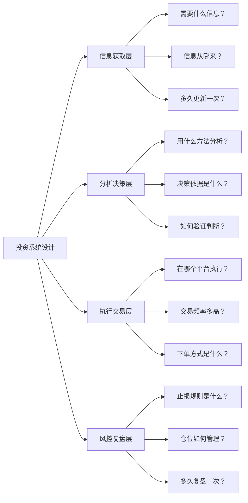
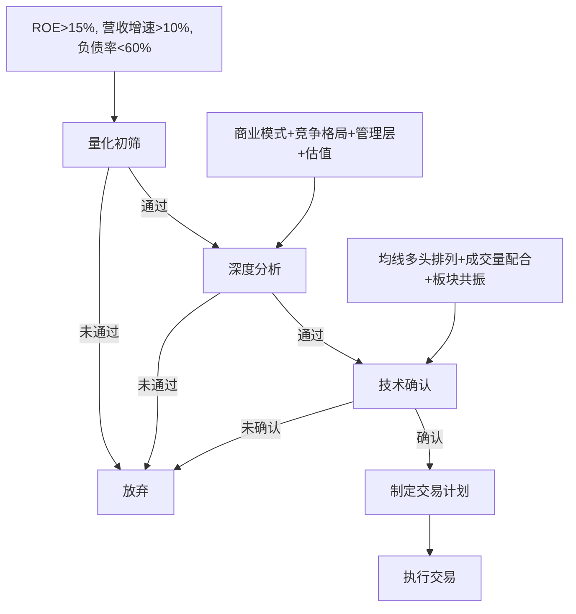
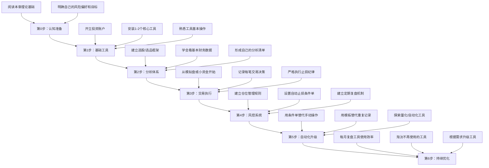
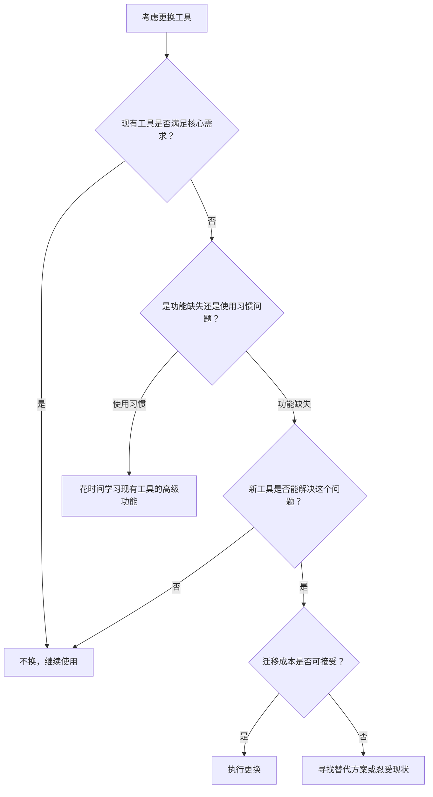

## 案例总结：五大投资场景的工具选择方法论

前面五个实战案例分别展示了股票投资、基金定投、房产分析、量化交易和加密货币五个领域的完整工具体系。本节对五个案例进行横向对比和纵向提炼，总结出**跨场景通用的投资工具选择方法论**——无论你未来面对什么新的投资品类，都可以用这套框架快速建立自己的工具体系。

这不是简单的"回顾要点"。本节要做三件事：第一，从五个案例中提炼出可复用的决策框架；第二，为不同类型的投资者提供即拿即用的工具配置方案；第三，指出大多数人最容易犯的错误及其纠正方法。读完本节，你将拥有一套完整的投资工具搭建蓝图。

***

### 一、五个案例的全景回顾

先用一张表快速回顾五个案例的核心要素：

| 维度 | 案例一：股票 | 案例二：基金定投 | 案例三：房产 | 案例四：量化交易 | 案例五：加密货币 |
|------|-------------|----------------|-------------|----------------|----------------|
| **投资者画像** | 28岁互联网从业者，20万本金 | 零基础工薪族，月投3000 | 有购房需求的家庭 | Python工程师，50万本金 | 28岁互联网从业者，5万配置 |
| **核心痛点** | 追涨杀跌、无系统 | 不懂选基金、怕亏 | 信息不对称、算不清账 | 主观判断效率低 | 安全风险、工具复杂 |
| **工具数量** | 6-8个 | 3-4个 | 5-6个 | 4-5个框架+多个数据源 | 5-7个 |
| **每日耗时** | 1小时 | 5分钟 | 按需 | 2小时复盘 | 30分钟 |
| **学习曲线** | 中等（2-3个月） | 低（1-2周） | 中等（1-2个月） | 高（3-6个月） | 高（1-3个月） |
| **年化目标** | 15-20% | 8-12% | 租金回报3-5%+增值 | 15-25% | 高波动，不设固定目标 |
| **最大风险** | 个股暴雷 | 选错基金、中途放弃 | 流动性差、杠杆风险 | 过度拟合、黑天鹅 | 安全事故、交易所风险 |
| **工具成熟度** | 优（生态完善） | 优（平台集成度高） | 中（数据分散） | 中（需自建较多） | 中低（变化快、工具迭代频繁） |

#### 五个案例的共性与差异

**共性**：五个案例无论投资品类如何不同，工具体系都遵循相同的四层架构——信息获取、分析决策、执行交易、风控复盘。这不是巧合，而是投资活动本身的内在逻辑决定的。任何投资行为都可以拆解为"获取信息→做出判断→执行操作→控制风险"这四个环节，工具的使命就是在每个环节提供支撑。

**差异**：主要体现在三个维度：

- **技术门槛**：基金定投的工具门槛最低（一个APP搞定），量化交易的门槛最高（需要编程能力+数据源+回测环境）
- **时间投入**：从每天5分钟（基金定投）到每天2小时（量化复盘），差距高达24倍
- **工具迭代速度**：传统金融工具（券商APP、基金平台）迭代缓慢，工具稳定可靠；加密货币工具迭代极快，半年不关注就有新工具取代旧工具

这三点差异直接决定了不同投资者应该采取不同的工具策略——技术门槛高的品类需要更长的学习周期，时间投入少的品类需要更多的自动化，迭代速度快的品类需要更频繁的工具评估。

***

### 二、跨案例提炼：工具选择的六条铁律

从五个案例中可以提炼出六条适用于所有投资场景的工具选择原则。这些原则不是理论推导，而是五个真实案例反复验证后的实战经验。

#### 铁律一：先建系统，再选工具

五个案例的共同起点都不是"选什么工具"，而是**先想清楚自己要什么系统**。



**为什么系统优先于工具？** 因为工具是手段，系统是目的。没有系统的投资者就像没有地图的旅行者——手里拿着各种交通工具（工具），却不知道要去哪里。股票案例的投资者在建立系统之前，下载了十几个APP，每天在各平台之间跳来跳去，结果一年下来不仅没赚到钱，反而因为信息过载做出了更多错误决策。

**正确的系统设计流程**：

1. **明确投资目标**：你追求的是绝对收益还是相对收益？年化目标是多少？最大回撤容忍度是多少？
2. **确定投资策略**：你用什么方法选股/选品？基本面分析、技术分析、还是量化模型？
3. **设计执行规则**：什么条件下买入？什么条件下卖出？仓位如何分配？
4. **建立风控框架**：单笔最大亏损多少？总仓位上限多少？什么情况下暂停交易？

只有完成这四步之后，才需要问"用什么工具来实现这个系统"。

**五个案例的系统设计对比**：

| 系统层次 | 股票案例 | 基金定投案例 | 房产案例 | 量化案例 | 加密货币案例 |
|---------|---------|-------------|---------|---------|-------------|
| 信息层 | 财联社+东方财富+理杏仁 | 天天基金+晨星 | 贝壳+链家+统计局 | Tushare+Wind API | CoinGecko+CoinMarketCap |
| 分析层 | 五维财务框架+技术指标 | 4433选基法+估值分位 | 租售比+现金流测算 | Python回测框架+因子模型 | 链上数据分析+项目基本面 |
| 执行层 | 券商APP条件单 | 支付宝自动定投 | 中介对接+贷款审批 | 实盘API自动下单 | 交易所+钱包 |
| 风控层 | 固定风险百分比模型 | 止盈不止损+动态调整 | 现金流压力测试 | 最大回撤控制+异常熔断 | 冷钱包+多签+白名单 |

**反面教训**：很多新手的做法是先下载一堆APP，注册一堆平台，然后在各个平台之间跳来跳去，既浪费时间又学不到东西。正确顺序是：先设计系统框架，再按需选择工具。

#### 铁律二：工具数量遵循"最小必要"原则

工具不是越多越好。每个层次选择1-2个主力工具即可，多了反而增加管理成本和信息噪音。

**理论依据**：认知心理学中的"选择过载"（Choice Overload）效应表明，当选项超过一定数量时，人的决策质量反而下降。投资工具也是如此——当你同时使用5个行情软件时，不同软件显示的微小差异会让你产生不必要的焦虑和犹豫。

**各案例的"最小工具集"**：

- **股票投资**（最少3个）：行情分析1个（同花顺）+ 财务数据1个（理杏仁）+ 交易执行1个（券商APP）
- **基金定投**（最少2个）：基金筛选1个（天天基金/晨星）+ 定投执行1个（支付宝/蛋卷）
- **房产分析**（最少3个）：市场数据1个（贝壳）+ 财务测算1个（自建Excel）+ 政策信息1个（当地住建局网站）
- **量化交易**（最少4个）：数据源1个（Tushare）+ 回测框架1个（Backtrader）+ 编程环境1个（Jupyter）+ 实盘接口1个（券商API）
- **加密货币**（最少4个）：行情聚合1个（CoinGecko）+ 交易所1个（Binance/OKX）+ 钱包1个（MetaMask）+ 链上分析1个（Etherscan）

**一个判断工具是否过多的简单标准**：如果你每天在不同工具之间切换的时间超过了投资分析本身的时间，说明工具太多了。

**工具精简的实操方法**：

1. **列出当前使用的所有工具**，标注每个工具的具体用途
2. **识别功能重叠**——如果两个工具的用途有50%以上的重叠，保留一个
3. **识别使用频率**——连续两周没打开的工具，大概率可以删除
4. **评估替代关系**——如果工具A能覆盖工具B的全部功能，删掉B

#### 铁律三：免费工具能满足80%的需求

五个案例中，绝大多数使用的都是免费工具或免费功能。只有在特定需求下才需要付费。

| 场景 | 免费方案 | 付费方案 | 何时需要付费 |
|------|---------|---------|-------------|
| 股票行情 | 同花顺/东方财富免费版 | Level-2行情（年费约300-500元） | 日内高频交易需要看买卖盘口 |
| 财务数据 | 理杏仁免费功能+巨潮资讯 | Wind金融终端（年费3万+） | 机构级研究、量化因子库 |
| 基金筛选 | 天天基金+晨星免费版 | 专业基金评价系统 | 私募基金尽调 |
| 房产数据 | 贝壳/链家公开数据 | 中指院/克而瑞报告 | 开发商投资决策 |
| 量化数据 | Tushare免费积分 | Wind/聚宽付费数据 | 高频因子、另类数据 |
| 加密行情 | CoinGecko/CoinMarketCap | Nansen/Dune Pro | 链上巨鲸追踪、高级分析 |

**关键原则**：先用免费工具跑通整个流程，确认自己真的需要某项付费功能后再升级。很多新手花几千块买了高级工具，结果只用了免费功能。

**付费决策的"三次法则"**：当你第三次因为免费工具的功能限制而无法完成某个操作时，才值得付费升级。如果只是偶尔遇到限制，说明这个需求对你的投资体系并不重要。

**免费工具的能力边界**：

免费工具能满足以下所有需求（很多人不知道）：
- **自动止损止盈**：所有主流券商APP都支持条件单，免费功能
- **指数估值监控**：理杏仁、且慢、蛋卷都有免费估值数据
- **财务数据查询**：巨潮资讯（官方）、东方财富、同花顺都免费提供完整财报
- **回测验证**：聚宽（JoinQuant）提供免费的策略回测环境
- **链上数据查询**：Etherscan、BscScan等区块链浏览器完全免费

#### 铁律四：自动化是终极目标

五个案例的进阶路径都指向同一个方向——**尽可能多地用自动化替代人工操作**。

| 阶段 | 人工占比 | 自动化占比 | 典型表现 |
|------|---------|-----------|---------|
| 入门期 | 100% | 0% | 手动看盘、手动下单、手动记录 |
| 成长期 | 60% | 40% | 条件单自动止损、定投自动扣款、模板化记录 |
| 成熟期 | 30% | 70% | 量化策略自动执行、预警系统自动推送、报表自动生成 |
| 专家期 | 10% | 90% | 全自动交易系统、AI辅助分析、异常自动处理 |

**各案例的自动化实践**：

- **股票**：券商条件单自动止损止盈，Excel公式自动计算仓位，定期自动生成持仓报告
- **基金定投**：支付宝/银行自动扣款，估值分位自动监控提醒
- **房产**：租金收入自动记账，还贷日期自动提醒，房价变动自动追踪
- **量化**：策略代码自动运行，信号自动生成，订单自动提交
- **加密货币**：网格交易机器人、自动再平衡工具、价格预警通知

**自动化的核心价值不是省时间，而是消除情绪干扰**。人手动操作时，贪婪和恐惧会干扰决策；程序自动执行时，规则就是规则。行为金融学的研究反复证明：投资者最大的敌人不是市场，而是自己的情绪。自动化工具本质上是一种"承诺机制"（Commitment Device）——在你理性的时候设定规则，在你情绪化的时候强制执行规则。

**自动化升级的优先级排序**：

1. **最高优先级**：止损/止盈的自动执行（防止情绪化抗单）
2. **高优先级**：定期投资的自动扣款（防止择时冲动）
3. **中优先级**：数据监控的自动预警（防止信息遗漏）
4. **低优先级**：报告生成的自动化（锦上添花）

#### 铁律五：安全优先于收益

这条铁律在加密货币案例中最为突出，但其实适用于所有投资场景。

**各场景的安全要点**：

| 场景 | 核心安全风险 | 防护措施 | 损失不可逆性 |
|------|-------------|---------|-------------|
| 股票 | 账户被盗、误操作 | 开启二次验证、交易密码与资金密码分开、设置单笔限额 | 中（可申诉追回部分） |
| 基金 | 平台风险、产品风险 | 选择持牌平台、分散持仓、不买不懂的产品 | 中（持牌平台有保障） |
| 房产 | 合同陷阱、产权纠纷 | 核验产权证、聘请律师审查合同、资金走监管账户 | 高（金额大、周期长） |
| 量化 | 程序Bug导致巨亏 | 先用模拟盘跑3个月、设置全局止损、代码review | 高（瞬间发生、难以逆转） |
| 加密货币 | 私钥丢失、交易所被盗 | 冷钱包存储大额资产、启用Google验证器、不点可疑链接 | 极高（几乎无法追回） |

**通用安全原则**：

1. **永远不要把所有资产放在同一个地方**——分散是免费的保险。股票不要只开一个券商账户，加密货币不要只用一个交易所，基金不要只买一个平台的产品
2. **先用小资金验证，再逐步加仓**——所有案例都是从最小投入开始。量化案例先用模拟盘跑了3个月，加密案例先用1000元试水
3. **定期备份关键数据**——交易记录、私钥、API密钥都要有备份。加密案例中，私钥的备份采用"3-2-1"原则：3个备份、2种介质、1个异地存放
4. **警惕"高收益零风险"的承诺**——五个案例中没有一个是靠"稳赚"成功的。如果有人告诉你某个工具或策略能"稳赚"，那要么是骗子，要么是他自己还没经历过完整的市场周期

**安全投入的ROI计算**：

很多人觉得安全措施"浪费时间"。我们来算一笔账：

假设你有20万投资本金，花2小时设置安全措施（二次验证、冷钱包、备份等）能将被盗风险从0.5%降到0.05%。那么：

- **安全措施的期望收益**：20万 × (0.5% - 0.05%) = 900元/年
- **时间成本**：2小时（一次性）
- **折合时薪**：450元/小时

这个时薪远高于绝大多数人的工资水平。安全措施不是成本，是回报率极高的投资。

#### 铁律六：复盘是提升的唯一途径

五个案例的投资者都在建立复盘机制后实现了质的飞跃。这不是巧合——复盘是将经验转化为能力的唯一有效方式。

**复盘的理论基础**：心理学家安德斯·埃里克森（Anders Ericsson）的"刻意练习"理论指出，单纯的重复不会带来能力提升，只有包含"反馈-调整"循环的刻意练习才能持续进步。投资复盘就是投资领域的"刻意练习"——每笔交易都是一次练习，复盘就是获取反馈、调整策略的过程。

**复盘的核心框架**（适用于所有投资场景）：

```python
# 通用投资复盘模板
review_template = {
    "周期": "月度/季度/年度",
    
    "收益回顾": {
        "总收益率": "本周期收益率",
        "基准对比": "跑赢/跑输基准多少",
        "收益归因": "收益来自哪里（选股/择时/运气）",
    },
    
    "决策复盘": {
        "做得好的决策": "具体是哪些决策、为什么好",
        "做得差的决策": "具体是哪些决策、错在哪里",
        "错过的机会": "应该做但没做的决策",
        "侥幸逃脱": "做了但不该做的决策（运气好没亏）",
    },
    
    "系统检查": {
        "信息质量": "信息来源是否可靠、是否遗漏重要信息",
        "分析质量": "分析框架是否需要调整",
        "执行质量": "是否严格执行了计划、有无情绪化操作",
        "风控质量": "止损是否及时、仓位是否合理",
    },
    
    "改进计划": {
        "继续保持": "做得好的地方继续坚持",
        "需要改进": "具体改进措施和时间节点",
        "需要学习": "欠缺的知识和技能",
    }
}
```

**复盘中最重要的四个问题**：

1. **这笔交易的决策依据是什么？** ——如果答不清楚，说明你在凭感觉交易
2. **如果重新来过，我会做出不同的决策吗？** ——如果不会，说明决策过程是合理的，即使结果亏损
3. **这笔交易的收益/亏损中，有多少是运气成分？** ——区分运气和能力是复盘最核心的价值
4. **我的投资体系中，哪个环节最薄弱？** ——找到短板，集中改进

**复盘频率建议**：

| 复盘类型 | 频率 | 耗时 | 核心内容 |
|---------|------|------|---------|
| 交易日志 | 每笔交易后 | 5-10分钟 | 记录决策依据、情绪状态、执行情况 |
| 周复盘 | 每周 | 30分钟 | 检查本周交易是否符合规则 |
| 月度复盘 | 每月 | 1-2小时 | 收益归因、系统检查、策略微调 |
| 季度复盘 | 每季度 | 2-4小时 | 深度分析、策略调整、工具评估 |
| 年度复盘 | 每年 | 半天 | 全面回顾、系统重构、下年规划 |

***

### 三、五类投资者的工具配置方案

基于五个案例的经验，为不同类型投资者提供即拿即用的工具配置方案。

#### 方案一：保守型工薪族（月结余3000-8000）

**画像**：风险承受能力低，追求稳定增值，不愿花太多时间研究。典型特征是工作忙碌、对投资了解有限、希望"设好就忘"。

| 工具 | 用途 | 费用 | 重要程度 |
|------|------|------|---------|
| 支付宝/天天基金 | 指数基金定投 | 免费（申购费1折） | 核心 |
| 且慢/蛋卷 | 跟投策略组合 | 免费功能足够 | 辅助 |
| 理杏仁（免费版） | 偶尔查看指数估值 | 免费 | 辅助 |

**核心策略**：每月自动定投2-3只宽基指数基金（沪深300+中证500+纳斯达克100），利用估值分位决定定投金额——低估多投、高估少投。每季度花1小时复盘一次。

**具体操作流程**：

1. 在支付宝设置每月15日自动扣款3000元
2. 按估值分位分配：沪深300（40%）、中证500（30%）、纳斯达克100（30%）
3. 每季度第一个周末，登录理杏仁查看各指数PE分位
4. 如果某指数PE分位低于30%，下季度该基金定投金额增加50%
5. 如果某指数PE分位高于70%，下季度该基金定投金额减少50%
6. 每年做一次年度复盘，检查是否需要调整基金品种

**预期结果**：年化8-12%，每天耗时接近零。历史上，沪深300指数的长期年化收益约为10%，加上估值择时的增强效果，8-12%是合理预期。

#### 方案二：积极型投资者（本金10-50万）

**画像**：有一定投资基础，愿意花时间研究，希望获得超额收益。典型特征是对财务数据有基本理解、能看懂财报、有2年以上投资经验。

| 工具 | 用途 | 费用 | 重要程度 |
|------|------|------|---------|
| 同花顺 | 行情分析+技术指标 | 免费 | 核心 |
| 理杏仁 | 财务分析+估值分位 | 基础版免费，高级版298元/年 | 核心 |
| 东方财富 | 财务数据+研报 | 免费 | 辅助 |
| 券商APP（华泰/中信） | 交易执行+条件单 | 佣金万1.3左右 | 核心 |
| Excel/Notion | 交易记录+复盘 | 免费 | 核心 |

**核心策略**：建立选股三阶段流程（量化初筛→深度分析→技术确认），严格执行仓位管理和止损纪律。每天投入1小时。

**选股三阶段流程**：



**预期结果**：年化15-20%（需要2年以上经验积累）。注意：这个收益率不是每年都能达到，而是长期平均值。好的年份可能30%+，差的年份可能亏损，关键是长期坚持系统。

#### 方案三：技术型量化投资者（本金50万+）

**画像**：有编程基础，希望通过数据和程序提升投资效率。典型特征是有Python/编程经验、理解统计学基础、愿意投入较多时间。

| 工具 | 用途 | 费用 | 重要程度 |
|------|------|------|---------|
| Tushare/聚宽 | 数据获取 | 免费积分/付费 | 核心 |
| Backtrader/聚宽 | 策略回测 | 免费 | 核心 |
| Jupyter Notebook | 开发环境 | 免费 | 核心 |
| 券商API | 实盘交易 | 部分券商免费 | 核心 |
| Git | 代码版本管理 | 免费 | 辅助 |

**核心策略**：先在模拟盘验证策略至少3个月，实盘从小资金开始（不超过总资金10%），逐步验证后扩大规模。每周投入5-10小时。

**量化策略开发的完整流程**：

1. **策略构思**：基于投资逻辑（而非数据挖掘）提出假设
2. **数据准备**：获取历史数据，清洗、对齐、处理缺失值
3. **回测验证**：在历史数据上测试策略，重点关注夏普比率、最大回撤、胜率
4. **样本外测试**：用回测期间之外的数据验证策略稳健性
5. **模拟盘运行**：在模拟环境中运行至少3个月，观察实际表现
6. **小资金实盘**：用不超过总资金10%进行实盘验证
7. **逐步扩大**：确认策略稳定后，逐步增加资金

**预期结果**：年化15-25%（取决于策略质量和市场环境）。量化交易的核心优势不是追求更高收益，而是**收益的可重复性和可控制性**。

#### 方案四：另类资产配置者（总资产100万+）

**画像**：已有成熟的传统投资体系，希望通过另类资产分散风险。典型特征是股票/基金/房产已有配置，寻求降低组合相关性。

| 工具 | 用途 | 费用 | 重要程度 |
|------|------|------|---------|
| CoinGecko | 加密货币行情聚合 | 免费 | 辅助 |
| Binance/OKX | 交易执行 | 交易手续费0.1% | 核心 |
| MetaMask/Trust Wallet | 链上资产管理 | 免费 | 核心 |
| Etherscan | 链上数据查询 | 免费 | 辅助 |
| Ledger/Trezor | 硬件冷钱包 | 500-1500元 | 核心 |

**核心策略**：另类资产配置不超过总资产的10-15%，以BTC和ETH为主（占另类配置的70%以上），严格使用冷钱包存储大额资产。

**安全操作清单**：

- 硬件钱包购买后立即验证固件完整性
- 助记词手写在金属板上，存放在两个不同的物理位置
- 交易所账户启用Google Authenticator（不用短信验证）
- 设置提现白名单，新地址24小时后才能生效
- 大额转账先发小额测试，确认到账后再转大额

**预期结果**：不设固定收益目标，核心目的是降低组合相关性。当股票市场下跌时，加密资产可能不相关甚至负相关，从而平滑整体组合的波动。

***

### 四、案例对比中的关键发现

通过对五个案例的深入分析，有几个值得特别强调的发现。

#### 发现一：工具的学习成本与投资金额不成正比

很多人认为"钱少就不需要好工具"，这是错误的。工具的价值在于**降低错误率**，而错误率对小资金和大资金的影响是一样的。

| 投资金额 | 一次追涨杀跌的亏损 | 一年内如果重复5次 |
|---------|------------------|-----------------|
| 5万 | 5000-8000元 | 25000-40000元（本金的50-80%） |
| 20万 | 20000-32000元 | 100000-160000元（本金的50-80%） |
| 100万 | 100000-160000元 | 500000-800000元（本金的50-80%） |

无论本金多少，错误操作的相对亏损比例是一样的。因此，**本金越小越需要工具保护**——因为小资金的容错空间更小。5万本金亏50%是2.5万，对工薪族来说可能是几个月的积蓄；100万本金亏50%虽然绝对金额更大，但至少还有50万可以东山再起。

#### 发现二：免费工具的能力边界被严重低估

这一点在铁律三中已经详细展开，这里补充一个实际数据：五个案例中，付费工具的使用占比不到15%。以下功能在免费工具中就能实现，但很多人不知道：

- **自动止损止盈**：所有主流券商APP都支持条件单，免费功能
- **指数估值监控**：理杏仁、且慢、蛋卷都有免费估值数据
- **财务数据查询**：巨潮资讯（官方）、东方财富、同花顺都免费提供完整财报
- **回测验证**：聚宽（JoinQuant）提供免费的策略回测环境
- **链上数据查询**：Etherscan、BscScan等区块链浏览器完全免费

#### 发现三：心理因素比工具因素重要10倍

五个案例中，导致亏损的最大原因都不是"工具不好"，而是**没有按规则执行**：

- 股票案例：有止损规则但手动操作时犹豫不执行
- 基金定投案例：市场大跌时恐慌停止定投
- 房产案例：被市场情绪影响做出冲动决策
- 量化案例：回测结果好但实盘时手动干预策略
- 加密案例：看到暴涨就追加投入、打破配置比例

**行为金融学的解释**：诺贝尔经济学奖得主丹尼尔·卡尼曼（Daniel Kahneman）的研究表明，人类在面对损失时的痛苦感是获得同等收益时快乐感的2-2.5倍（损失厌恶）。这意味着当投资亏损时，你的大脑会强烈驱动你做出非理性的决策——割肉止损、停止定投、追涨杀跌。

**解决方案**：尽可能用自动化替代手动操作。条件单、自动定投、量化程序这些工具的核心价值不是"更高效"，而是**强制执行纪律**。当你把决策权交给预先设定的规则时，当下的情绪就无法干扰执行。

#### 发现四：跨界知识产生最大价值

最有价值的投资洞察往往来自跨领域的知识迁移：

- 量化案例的投资者将**编程思维**（调试、测试、版本控制）引入投资，效率大幅提升
- 股票案例的投资者从**行为金融学**中理解了自己为什么会追涨杀跌
- 基金定投案例的投资者用**概率思维**取代了"这次一定涨"的确定性思维
- 加密案例的投资者从**信息安全**领域引入了冷存储、多重验证等安全实践
- 房产案例的投资者从**会计学**中学会了现金流分析和资产负债表思维

**为什么跨界知识如此重要？** 因为投资本身就是一个交叉学科——它涉及经济学、心理学、数学、计算机科学、法学等多个领域。只从"投资"这一个角度看问题，视野是狭窄的。当你引入其他领域的思维模型时，往往能看到别人看不到的机会和风险。

查理·芒格（Charlie Munger）将这种能力称为"多元思维模型"（Latticework of Mental Models）。他强调：一个人如果只有一把锤子，那看什么都像钉子。投资者需要的不是更多的投资技巧，而是更多元的思维框架。

***

### 五、从案例到行动：你的投资工具搭建路线图

最后，将五个案例的经验浓缩为一个可执行的行动路线图。无论你目前处于什么阶段，都可以按这个路线图逐步搭建自己的投资工具体系。



**每个阶段的预期时间投入**：

| 阶段 | 预计时间 | 核心产出 | 关键里程碑 |
|------|---------|---------|-----------|
| 第0步：认知准备 | 1-2周 | 明确投资目标、风险偏好、可用时间 | 能用一句话说清自己的投资策略 |
| 第1步：基础工具 | 1-2周 | 完成开户、安装工具、熟悉操作 | 能独立完成一次完整的买入操作 |
| 第2步：分析体系 | 2-4周 | 建立自己的分析框架和筛选标准 | 有自己的选股/选品清单（至少5个条件） |
| 第3步：交易执行 | 1-3个月 | 完成至少20笔有记录的交易 | 交易记录完整，每笔都有决策依据 |
| 第4步：风控系统 | 持续进行 | 形成稳定的仓位管理和止损规则 | 连续3个月严格执行止损纪律 |
| 第5步：自动化升级 | 3-6个月 | 80%的操作实现自动化 | 止损、定投、预警全部自动化 |
| 第6步：持续优化 | 永不停止 | 定期淘汰低效工具、引入高效工具 | 每季度评估一次工具体系 |

**每个阶段的具体行动清单**：

**第0步——认知准备（1-2周）**：
- 做一次完整的风险承受能力评估（券商APP或基金平台都有免费测试）
- 明确你的投资目标：是养老、购房、还是财富增值？
- 确定你每天/每周能投入多少时间
- 阅读本章的理论基础部分，理解投资系统的四层架构

**第1步——基础工具（1-2周）**：
- 开立一个证券账户（选择佣金低、APP体验好的券商）
- 安装1-2个核心工具（根据你选择的投资品类）
- 花3天时间熟悉工具的基本操作
- 不要急着交易，先用模拟功能或观察模式学习

**第2步——分析体系（2-4周）**：
- 学习基本的财务指标（PE、PB、ROE、营收增速）
- 建立自己的选股/选品框架（至少包含5个筛选条件）
- 用理杏仁或东方财富免费版练习分析10只股票
- 形成自己的"分析清单"——每次分析新标的时按清单逐项检查

**第3步——交易执行（1-3个月）**：
- 从模拟盘或最小资金开始（建议不超过总资金的10%）
- 每笔交易都记录决策依据、情绪状态、执行情况
- 严格执行止损纪律（先设好止损位，再买入）
- 完成至少20笔有记录的交易后，做第一次深度复盘

**第4步——风控系统（持续进行）**：
- 建立仓位管理规则（单只不超过总仓位的20%）
- 设置自动止损条件单（券商APP免费功能）
- 建立定期复盘机制（每周30分钟，每月2小时）
- 记录每次违反规则的情况，分析原因

**第5步——自动化升级（3-6个月）**：
- 用条件单替代所有手动止损止盈操作
- 用模板替代重复的记录工作（Excel/Notion模板）
- 探索量化工具（如果走量化路线）或智能定投工具（如果走基金路线）
- 目标：80%的日常操作实现自动化

**第6步——持续优化（永不停止）**：
- 每月复盘工具使用效率——哪些工具高频使用，哪些基本没打开
- 淘汰不再使用的工具——不要让工具库存膨胀
- 根据投资策略的变化升级工具——从股票扩展到基金时，需要增加基金筛选工具
- 每年做一次全面的工具体系评估

***

### 六、常见误区与纠正

在总结五个案例的过程中，发现以下误区反复出现。每个误区都配有具体的纠正方法，不是空泛的建议。

| 误区 | 具体表现 | 正确做法 | 为什么这个误区有害 |
|------|---------|---------|------------------|
| 工具崇拜 | 花大量时间研究各种工具，却不实际投资 | 先用最简单的工具开始实践，遇到瓶颈再升级 | 研究工具会给你"在做准备"的错觉，实际上是在逃避真正的风险 |
| 一步到位 | 一开始就搭建最完整的工具体系 | 按需逐步搭建，每个工具用熟后再加新的 | 过于复杂的工具体系会增加维护成本，降低执行效率 |
| 忽视免费 | 认为付费工具一定比免费的好 | 先穷尽免费方案，确认需求后再付费 | 付费工具的心理"沉没成本"会让你更难放弃不适合的工具 |
| 只看不做 | 花大量时间看教程但从不实操 | 学完一个功能就立刻用一次，实践出真知 | 纸上谈兵的知识在真实市场压力下不堪一击 |
| 盲目跟风 | 别人用什么工具就跟着用 | 根据自己的投资风格、资金量、时间精力选择 | 别人的系统是为他的需求设计的，照搬大概率不适合你 |
| 忽略安全 | 为追求便利牺牲安全性 | 永远开启二次验证、定期备份、分散存放 | 安全事故的损失是不可逆的，而且往往发生在你最松懈的时候 |
| 不做复盘 | 只管买卖不管总结 | 每笔交易都记录、定期复盘、持续改进 | 不复盘等于在同一个坑里反复跌倒，永远不会有进步 |
| 频繁换工具 | 觉得亏钱是工具的问题 | 亏损通常是因为没执行好规则，不是工具不好 | 频繁更换工具会打断系统的一致性，让你永远处于学习新工具的状态 |
| 过度优化 | 花大量时间优化工具的每个细节 | 工具够用就行，把时间花在投资逻辑上 | 过度优化是另一种形式的拖延，完美是行动的敌人 |
| 信息过载 | 同时关注太多信息源 | 只保留2-3个核心信息源，其余忽略 | 信息越多不一定决策越好，反而会导致"分析瘫痪" |

**误区背后的心理学机制**：

大部分误区的根源是两种心理倾向：

1. **控制幻觉**：人们倾向于高估自己对随机事件的控制能力。花大量时间研究工具、优化参数，会给人一种"我在掌控局面"的感觉，但实际上市场的涨跌是不可控的。

2. **行动偏好**：面对不确定性时，人类倾向于"做点什么"而不是"什么都不做"。在投资中，"做点什么"往往意味着频繁交易、频繁换工具，而长期持有和耐心等待反而能获得更好的回报。

认识到这两种心理倾向的存在，是避免上述误区的第一步。

***

### 七、工具评估的量化框架

当你要在多个工具之间做选择时，可以用以下量化评估框架来辅助决策。这个框架在五个案例中都得到了验证。

#### 工具评估矩阵

| 评估维度 | 权重 | 评分标准（1-5分） |
|---------|------|-----------------|
| **功能匹配度** | 30% | 5=完全满足需求，1=只能满足部分需求 |
| **学习成本** | 20% | 5=上手即用，1=需要数周学习 |
| **稳定性** | 15% | 5=从不崩溃/卡顿，1=经常出问题 |
| **数据质量** | 15% | 5=数据准确及时，1=数据经常有误或延迟 |
| **费用合理性** | 10% | 5=免费或性价比极高，1=价格远超价值 |
| **社区/生态** | 10% | 5=社区活跃、文档完善，1=找不到帮助 |

**使用方法**：

1. 列出你正在考虑的2-3个候选工具
2. 对每个工具在6个维度上打分（1-5分）
3. 乘以权重后加总，得到综合评分
4. 选择综合评分最高的工具

**示例**：股票行情工具选择

| 工具 | 功能匹配(30%) | 学习成本(20%) | 稳定性(15%) | 数据质量(15%) | 费用(10%) | 社区(10%) | 综合分 |
|------|-------------|-------------|-----------|-------------|---------|---------|-------|
| 同花顺 | 5×0.3=1.5 | 5×0.2=1.0 | 4×0.15=0.6 | 4×0.15=0.6 | 5×0.05=0.5 | 5×0.05=0.5 | 4.7 |
| 东方财富 | 4×0.3=1.2 | 4×0.2=0.8 | 4×0.15=0.6 | 4×0.15=0.6 | 5×0.05=0.5 | 4×0.05=0.4 | 4.1 |
| 通达信 | 4×0.3=1.2 | 3×0.2=0.6 | 5×0.15=0.75 | 4×0.15=0.6 | 4×0.05=0.4 | 3×0.05=0.3 | 3.85 |

结论：同花顺综合评分最高，适合大多数个人投资者。

#### 工具替换的决策树

当你考虑是否要更换现有工具时，按以下流程判断：



**迁移成本的计算**：迁移成本不仅包括新工具的学习时间，还包括：
- 历史数据的迁移和重新整理
- 已有工作流的调整
- 与现有工具的兼容性问题
- 短期内效率下降的风险

一般规则：如果迁移成本超过新工具预期收益的3倍以上，不建议更换。

***

### 八、投资工具的未来趋势

虽然本章的核心是当前可用的工具，但了解未来趋势有助于你提前布局。

#### 趋势一：AI辅助分析将成为标配

大语言模型（LLM）和AI技术正在快速渗透投资领域：
- **智能研报摘要**：AI可以在几秒内阅读完一份100页的研报并提取关键信息
- **自然语言查询**：用自然语言提问"最近三年ROE持续高于15%的消费股有哪些"，AI直接返回结果
- **异常检测**：AI自动监控持仓股票的异常信号（大额交易、高管变动、政策风险）
- **情绪分析**：AI分析社交媒体和新闻的情绪倾向，辅助判断市场情绪

**建议**：现在就开始关注AI投资工具，但不要急于将AI决策纳入实盘。AI是辅助工具，不是替代品。

#### 趋势二：工具集成化程度提高

未来的投资工具将越来越"一站式"：
- 数据获取、分析、回测、实盘将在同一个平台完成
- 跨资产类别（股票+基金+加密货币）的统一管理工具将出现
- 移动端和桌面端的体验差距将缩小

**建议**：不要为了"集成化"而选择功能大而全但每个功能都不精的平台。在现阶段，专注于单一功能的精品工具往往比一站式平台更好用。

#### 趋势三：监管科技（RegTech）影响工具选择

随着金融监管的加强，合规性将成为选择工具的重要考量：
- 交易所的KYC（身份验证）要求将更加严格
- 税务申报的自动化工具将更加普及
- 跨境投资的合规工具需求将增长

**建议**：选择工具时，除了功能和价格，还要考虑其合规性。使用未持牌平台的风险不仅在于平台跑路，还在于你的投资活动可能不受法律保护。

***

### 九、本节核心要点

1. **先系统后工具**——设计好投资系统的四层架构（信息→分析→执行→风控），再按需选择工具。没有系统的工具是散沙，有系统的工具是积木
2. **最小必要原则**——每个层次1-2个工具足够，多了是负担。判断标准：工具切换时间是否超过了投资分析时间
3. **免费优先策略**——80%的需求可以用免费工具满足，先跑通流程再考虑付费。付费决策用"三次法则"：第三次被限制时才付费
4. **自动化是终极方向**——工具的核心价值是消除情绪干扰、强制执行纪律。优先级：止损止盈自动执行 > 定期投资自动扣款 > 数据监控自动预警
5. **安全永远第一**——分散存放、二次验证、冷存储，安全措施不能省。安全措施的折合时薪远高于你的工资水平
6. **复盘驱动成长**——不复盘的投资等于盲人摸象，永远不会有进步。复盘的核心是区分运气和能力
7. **跨领域思维产生超额价值**——投资是交叉学科，引入编程思维、行为金融学、概率思维等跨界知识，能获得别人看不到的洞察
8. **用量化框架评估工具**——不要凭感觉选择工具，用功能匹配度、学习成本、稳定性等维度打分比较

本章的六个实战案例（含本节总结）覆盖了从理论到实践的完整链路。投资工具是手段，投资系统是目的，而你的纪律和认知才是真正的护城河。工具会迭代，系统会进化，但"先想清楚再行动"这个原则永远不会过时。
