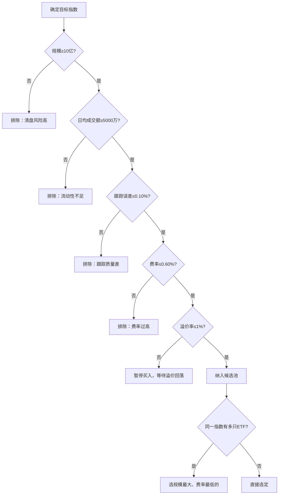

## 案例六：ETF定投实践

ETF（Exchange Traded Fund，交易型开放式指数基金）是过去十年发展最快的投资工具之一。截至2025年底，境内ETF总规模突破3万亿元，产品数量超过900只。与场外指数基金相比，ETF具有费率更低、交易更灵活、持仓更透明等独特优势，是定投策略的理想载体。

本案例完整记录一位投资者从认识ETF到构建ETF定投体系的全过程，涵盖品种选择、账户搭建、策略执行、组合管理、心理建设和进阶优化等全部环节。每个环节都有具体的数据、代码和操作步骤，确保读者能照搬执行。

### ETF定投的底层逻辑

#### ETF与场外基金的本质区别

很多人把ETF和场外指数基金混为一谈，但两者的运作机制有本质差异，这些差异直接影响定投策略的设计：

| 对比维度 | ETF（场内） | 场外指数基金 |
|----------|------------|-------------|
| 交易场所 | 证券交易所（股票账户） | 基金销售平台（基金账户） |
| 交易价格 | 实时市价（每秒变动） | 每日收盘净值（一天一个价） |
| 交易时间 | 9:30-11:30, 13:00-15:00 | 任意时间提交，T日收盘确认 |
| 管理费 | 通常0.15%-0.50% | 通常0.50%-1.00% |
| 托管费 | 通常0.05%-0.10% | 通常0.10%-0.25% |
| 申购费 | 无（券商佣金约万1-万3） | 1折后约0.10%-0.15% |
| 最低交易 | 100份（约100-500元） | 通常10元起 |
| 跟踪误差 | 更小（实物申赎机制） | 略大（现金申赎） |
| 定投方式 | 手动买入或条件单 | 自动定投（平台设置） |
| 分红方式 | 现金分红（默认） | 可选现金分红或红利再投 |
| 透明度 | 每日公布持仓 | 季报披露前十大持仓 |
| 二级市场流动性 | 高（可随时买卖） | 无（只能按净值申赎） |

**关键差异深入解读**：

**费率优势量化**：以管理费为例，沪深300ETF的管理费为0.15%/年，而同类联接基金管理费为0.50%/年。假设定投10年、年化收益8%，0.35%的费率差异会导致最终资产相差约3.5%——10万元的定投组合，差额约3500元。这还仅仅是管理费的差异，加上托管费和申购费，ETF的综合费率优势可以达到0.5%-0.8%/年。ETF在费率上的优势是确定性的，不需要任何技巧就能获得。

费率差异的复利效应会随时间放大。下表展示了不同费率在不同投资期限下的累积影响（假设每月定投3000元、年化收益8%）：

| 投资年限 | ETF费率0.20% | 场外费率0.60% | 费率侵蚀差额 |
|----------|-------------|-------------|-------------|
| 5年 | 约22.1万 | 约21.7万 | 约4,000元 |
| 10年 | 约55.2万 | 约53.4万 | 约1.8万 |
| 15年 | 约102.8万 | 约98.5万 | 约4.3万 |
| 20年 | 约172.0万 | 约164.0万 | 约8.0万 |
| 30年 | 约468.0万 | 约435.0万 | 约33.0万 |

30年投资期限下，仅费率差异就带来33万元的差额。这就是为什么长期投资者必须优先考虑费率。

**跟踪精度**：ETF采用实物申赎机制（用一篮子股票申购ETF份额），减少了现金拖累，跟踪误差通常在0.03%-0.08%/年，而场外联接基金的跟踪误差通常在0.10%-0.30%/年。跟踪误差越小，你获得的收益越接近标的指数的真实表现。跟踪误差的来源包括：管理费和托管费的扣除、成分股调整时的交易成本、现金仓位的拖累、以及分红再投资的时间差。

**交易灵活性**：ETF可以像股票一样实时买卖，支持限价单、市价单等多种委托方式。这意味着你可以在市场恐慌时以限价单锁定更低的买入价格，也可以在市场亢奋时及时止盈。场外基金只能按收盘净值成交，缺乏这种灵活性。此外，ETF支持T+1卖出（部分跨境ETF为T+0），资金到账速度快于场外基金的T+3至T+7。

**透明度差异**：ETF每日公布完整的持仓明细，你可以精确知道自己买了哪些股票、各占多少比例。场外基金只在季报中披露前十大持仓，半年报和年报才披露完整持仓，信息滞后且不完整。对于追求透明度的投资者，ETF是唯一选择。

#### 为什么ETF特别适合定投

定投的核心是"定期定额买入波动资产"，ETF在这两个维度上都有独特优势：

**优势一：更低的摩擦成本**。定投是长期策略，交易频率低但持续时间长。ETF的管理费比场外基金低50%-70%，持有时间越长，费率优势的复利效应越大。假设每月定投3000元、年化收益8%、投资20年：

| 费率类型 | 年管理费 | 20年后总资产 | 费率侵蚀 |
|----------|----------|-------------|----------|
| ETF | 0.15% | 约172万元 | 约6.3万元 |
| 场外基金 | 0.50% | 约164万元 | 约18.9万元 |
| 差额 | 0.35% | **约8万元** | — |

**优势二：更强的纪律性**。ETF需要通过股票账户手动买入（或设置条件单），这个"主动操作"反而强化了投资者的参与感和纪律性。场外基金的自动扣款虽然方便，但也容易让人"忘记"自己的投资，错过根据市场情况调整策略的机会。行为金融学研究表明，适度的"参与感"有助于投资者建立对市场的理解，而完全被动的自动扣款反而可能导致投资者对市场脱节。

**优势三：更透明的持仓**。ETF每日公布持仓明细，你可以清楚知道自己买了什么。场外基金只在季报中披露前十大持仓，信息滞后且不完整。

**优势四：实时定价带来的择时空间**。ETF的实时价格让你可以在盘中捕捉极端行情。当市场出现恐慌性暴跌时，你可以在跌幅最深的时刻下单买入，获得比收盘净值更低的价格。场外基金只能按收盘净值成交，无法做到这一点。

#### 定投的数学原理在ETF上的体现

ETF定投的成本摊薄原理与普通定投一致，但ETF的实时交易特性引入了额外的优化空间。用一个具体场景说明：

假设某沪深300ETF在一个月内经历了剧烈波动：

| 日期 | ETF价格 | 定投金额 | 买入份额 | 备注 |
|------|---------|----------|----------|------|
| 第1周 | 4.00元 | 1000元 | 250份 | 正常定投 |
| 第2周 | 3.50元 | 1000元 | 285份 | 下跌，买入更多 |
| 第3周 | 3.20元 | 1000元 | 312份 | 恐慌低点，份额最多 |
| 第4周 | 3.80元 | 1000元 | 263份 | 反弹 |
| **合计** | — | **4000元** | **1110份** | — |

- **定投平均成本**：4000 ÷ 1110 = **3.60元/份**
- **算术平均价格**：(4.00 + 3.50 + 3.20 + 3.80) ÷ 4 = **3.63元/份**
- **成本节省**：0.8%

这个例子中波动幅度不大，成本摊薄效果有限。如果将时间拉长到一年，波动幅度拉大到30%-50%，成本摊薄效果可以达到3%-8%。在A股这种高波动市场中，这是一笔可观的"免费收益"。

定投成本摊薄的数学本质是"调和平均数小于算术平均数"。在价格波动越大的资产上，定投的摊薄效果越显著。这也是为什么定投特别适合A股——A股的年化波动率（约25%-30%）远高于美股（约15%-20%），定投摊薄成本的空间更大。

### 案例背景

李明是一名85后IT工程师，月收入15000元，每月可投资金额5000元。他有一定的股票投资经验，但之前主要投资个股，收益不稳定且耗费大量精力。2023年初，他决定转向ETF定投，目标是用更少的时间获得更稳定的长期收益。

**初始状态评估**：

| 维度 | 情况 | 评估 |
|------|------|------|
| 可投资金额 | 每月5000元 | 较充裕，适合构建多品种组合 |
| 投资经验 | 3年个股经验，了解基本面分析 | 有基础，但缺乏指数投资经验 |
| 目标 | 10年积累100万资产 | 年化约7%-8%可实现 |
| 风险偏好 | 中等 | 可承受20%-30%的短期回撤 |
| 应急储备 | 已有6个月生活费（9万元） | 充足，可以全力投资 |
| 现有账户 | 某券商股票账户（佣金万2.5） | 需要申请调低佣金 |
| 时间精力 | 每周可投入2-3小时 | 适合ETF定投，不需要盯盘 |

**前置准备**：

在开始ETF定投前，李明完成了以下准备工作：

**1. 券商账户优化**

联系券商客户经理，将股票佣金从万2.5调降到万1.5，ETF交易佣金调到万1（最低0.1元）。不同券商的ETF佣金差异很大，以下是主流券商的ETF佣金对比：

| 券商 | ETF默认佣金 | 可申请最低 | 最低收费 | 备注 |
|------|------------|-----------|----------|------|
| 华泰证券 | 万3 | 万0.5 | 0.1元 | 线上开户即可调 |
| 中信证券 | 万3 | 万1 | 0.1元 | 需联系客户经理 |
| 招商证券 | 万3 | 万1 | 0.1元 | 资产达标可更低 |
| 东方财富 | 万2.5 | 万1 | 0.1元 | 互联网券商，费率较优 |
| 国泰君安 | 万3 | 万1 | 0.1元 | 需线下沟通 |
| 平安证券 | 万3 | 万0.5 | 0.1元 | 线上开户可调 |

调佣的关键话术："我想长期做ETF定投，每月交易额不大，能否把ETF佣金调到最低？"券商对长期稳定的ETF交易客户通常愿意给最低佣金，因为ETF交易的风险低、客户留存率高。

**2. 定投日期选择**

避开月初和月末（资金面波动大），选择每月15日作为定投日。学术研究表明，定投日期对长期收益的影响不超过0.5%，但选择一个固定日期并坚持执行比纠结日期更重要。如果15日是非交易日，顺延到下一个交易日。

**3. 应急基金确认**

确认6个月生活费（9万元）已存放在货币基金中，不会因为任何市场波动而需要动用定投资金。应急基金是定投纪律的基石——只有确保日常开支不受影响，你才能在市场暴跌时坚持定投而不被迫卖出。

**4. 心理准备清单**

开始定投前，李明在笔记本上写下了以下承诺：

- 我接受投资组合可能出现20%-30%的短期回撤
- 我不会因为某个月亏损就停止定投
- 我不会频繁查看账户，每月检查一次即可
- 我的目标是10年后的财富积累，不是明天的涨跌
- 如果市场暴跌，我会感到不适，但不会改变计划

### ETF品种选择全流程

#### 第一步：确定资产配置框架

ETF定投的第一步不是选具体的ETF，而是确定大类资产配置比例。李明参考了"100-年龄"法则并做了调整：

```python
# 资产配置框架
asset_allocation = {
    # 核心资产（60%）：长期持有，低频调整
    "A股权益": {
        "占比": "45%",
        "月投入": "2250元",
        "定位": "分享中国经济增长的核心收益",
        "品种": ["沪深300ETF", "中证500ETF"],
    },
    "海外权益": {
        "占比": "15%",
        "月投入": "750元",
        "定位": "分散单一市场风险，获取全球增长",
        "品种": ["纳斯达克100ETF", "恒生科技ETF"],
    },

    # 卫星资产（25%）：根据估值调整
    "行业主题": {
        "占比": "15%",
        "月投入": "750元",
        "定位": "捕捉结构性机会，增强收益",
        "品种": ["消费ETF", "医药ETF", "新能源ETF"],
    },
    "商品资产": {
        "占比": "10%",
        "月投入": "500元",
        "定位": "对冲通胀，与股债低相关",
        "品种": ["黄金ETF"],
    },

    # 稳定器（15%）：降低组合波动
    "债券资产": {
        "占比": "15%",
        "月投入": "750元",
        "定位": "降低组合波动，提供再平衡弹药",
        "品种": ["国债ETF", "信用债ETF"],
    },
}
```

**配置逻辑说明**：

- **A股权益45%**：作为中国投资者，本土市场是最熟悉的，信息优势最大。沪深300覆盖大盘蓝筹，中证500覆盖中盘成长，两者相关性约0.7，组合后分散效果显著。
- **海外权益15%**：A股与美股的相关性约0.3-0.4，加入海外资产可以显著降低组合波动。但QDII-ETF存在额度限制，需要关注溢价率。
- **行业主题15%**：不追求精确择时，而是选择长期逻辑清晰的赛道（消费、医药、新能源），通过估值判断适度调整投入比例。
- **商品10%**：黄金与股票的相关性接近零甚至负相关，是天然的对冲工具。
- **债券15%**：在市场恐慌时，债券通常上涨，可以作为"心理安全垫"和再平衡的弹药来源。

**不同风险偏好的配置方案**：

| 类型 | 权益类 | 债券类 | 商品类 | 适合人群 |
|------|--------|--------|--------|----------|
| 保守型 | 30% | 50% | 20% | 临近退休、风险承受力低 |
| 稳健型 | 50% | 35% | 15% | 有稳定收入、中等风险承受力 |
| 均衡型 | 65% | 25% | 10% | 年龄30-40、长期投资 |
| 积极型 | 80% | 10% | 10% | 年龄25-35、高风险承受力 |
| 激进型 | 90% | 5% | 5% | 年轻、收入增长潜力大 |

李明选择的是"均衡型"配置，因为他28岁、收入稳定、投资期限长。

#### 第二步：ETF品种筛选标准

确定配置框架后，需要从数百只ETF中筛选出具体品种。ETF的筛选逻辑与场外基金不同，重点关注以下指标：

| 筛选维度 | 标准 | 原因 | 权重 |
|----------|------|------|------|
| 跟踪指数 | 选择主流宽基或行业指数 | 流动性好，研究资源多 | ★★★★★ |
| 基金规模 | ≥10亿元 | 规模太小有清盘风险，且流动性差 | ★★★★★ |
| 日均成交额 | ≥5000万元 | 成交额不足会导致买卖价差大，增加交易成本 | ★★★★★ |
| 跟踪误差 | ≤0.10%/年 | 跟踪误差越大，你获得的收益偏离指数越多 | ★★★★ |
| 管理费+托管费 | ≤0.60%/年 | ETF的核心优势就是低费率，高费率ETF失去意义 | ★★★★ |
| 成立年限 | ≥2年 | 需要有足够的历史数据评估跟踪效果 | ★★★ |
| 溢价率 | ≤1%（QDII类≤5%） | 高溢价买入意味着"买贵了"，溢价回归会亏损 | ★★★★★ |

**筛选的决策树**：



**跟踪误差的深入理解**：跟踪误差是ETF最重要的质量指标，但很多人不理解它的含义。跟踪误差不是"ETF涨跌幅与指数涨跌幅的差"，而是"ETF相对指数的超额收益的年化标准差"。简单说，跟踪误差衡量的是ETF偏离指数的"不确定性"——即使平均偏差很小，如果波动剧烈，跟踪误差也会很大。

```python
# 跟踪误差计算示意
import numpy as np

# 假设ETF每日相对指数的超额收益（单位：万分之几）
daily_excess_returns = [0.2, -0.1, 0.3, -0.2, 0.1, 0.0, -0.3, 0.2, -0.1, 0.1]

# 跟踪误差 = 超额收益的标准差 × sqrt(252)（年化）
tracking_error = np.std(daily_excess_returns) * np.sqrt(252)
# 结果约0.05%/年，属于优秀水平
```

跟踪误差的来源包括：管理费和托管费的扣除（持续、确定的负向偏差）、成分股调整时的交易成本（偶尔、小幅的偏差）、现金仓位的拖累（基金管理需要保留部分现金应对赎回）、分红再投资的时间差（成分股分红到ETF再投资之间的间隔）。对于投资者而言，管理费越低、规模越大的ETF，跟踪误差通常越小。

#### 第三步：具体品种确定

经过筛选，李明确定了以下ETF组合：

**A股权益类（月投入2250元）**：

| ETF名称 | 代码 | 跟踪指数 | 管理费 | 规模 | 日均成交额 | 跟踪误差 | 月投入 |
|----------|------|----------|--------|------|-----------|----------|--------|
| 华泰柏瑞沪深300ETF | 510300 | 沪深300 | 0.15% | 1500亿+ | 30亿+ | 0.03% | 1200元 |
| 南方中证500ETF | 510500 | 中证500 | 0.15% | 500亿+ | 10亿+ | 0.05% | 1050元 |

沪深300和中证500的组合覆盖了A股大盘和中盘的核心标的。两者合计约800只成分股，占A股总市值的70%以上，是最具代表性的A股宽基组合。

**海外权益类（月投入750元）**：

| ETF名称 | 代码 | 跟踪指数 | 管理费 | 规模 | 日均成交额 | 溢价率关注 | 月投入 |
|----------|------|----------|--------|------|-----------|-----------|--------|
| 国泰纳斯达克100ETF | 513100 | 纳斯达克100 | 0.80% | 200亿+ | 5亿+ | 需关注QDII额度 | 400元 |
| 华夏恒生科技ETF | 513180 | 恒生科技 | 0.50% | 100亿+ | 3亿+ | 需关注港股通额度 | 350元 |

**QDII-ETF的溢价管理是海外配置的关键挑战**。当QDII额度紧张时，大量资金追逐有限的ETF份额，导致ETF交易价格大幅高于净值。溢价5%-10%在极端情况下都曾出现过。溢价管理规则：

| 溢价率 | 操作 | 理由 |
|--------|------|------|
| < 1% | 正常买入 | 溢价在合理范围内 |
| 1%-3% | 减少50%买入 | 避免买贵，等待回落 |
| 3%-5% | 暂停买入，转入同类低溢价品种 | 溢价侵蚀收益 |
| > 5% | 暂停买入，考虑卖出已持有份额 | 严重高估，存在回归风险 |

溢价查询方式：券商App的ETF详情页（查看"溢折价率"）、集思录（jisilu.cn）的数据页面、天天基金的ETF详情页（查看"IOPV溢折价"）。

**行业主题类（月投入750元）**：

| ETF名称 | 代码 | 跟踪指数 | 管理费 | 月投入 | 估值策略 |
|----------|------|----------|--------|--------|----------|
| 招商中证白酒ETF | 512170 | 中证白酒 | 0.50% | 300元 | PE百分位<30%时加倍投入 |
| 中证医药ETF | 512010 | 中证医药 | 0.50% | 250元 | PE百分位<30%时加倍投入 |
| 华夏新能源ETF | 516850 | 中证新能源 | 0.50% | 200元 | PE百分位<30%时加倍投入 |

**商品类（月投入500元）**：

| ETF名称 | 代码 | 跟踪标的 | 管理费 | 月投入 | 备注 |
|----------|------|----------|--------|--------|------|
| 华安黄金ETF | 518880 | 黄金现货 | 0.50% | 500元 | 与股票负相关，天然对冲 |

**债券类（月投入750元）**：

| ETF名称 | 代码 | 跟踪指数 | 管理费 | 月投入 | 备注 |
|----------|------|----------|--------|--------|------|
| 国泰上证10年期国债ETF | 511260 | 10年期国债 | 0.15% | 400元 | 长久期，利率下行时弹性大 |
| 鹏华中证短融ETF | 511220 | 短期融资券 | 0.15% | 350元 | 短久期，流动性好 |

**组合整体费率计算**：

```python
# 组合加权平均费率
portfolio_fee = {
    "A股权益":  {"weight": 0.45, "fee": 0.20},  # 0.15%管理 + 0.05%托管
    "海外权益": {"weight": 0.15, "fee": 1.30},  # 0.80%/0.50%管理 + 0.50%/0.20%托管
    "行业主题": {"weight": 0.15, "fee": 0.60},
    "商品":     {"weight": 0.10, "fee": 0.60},
    "债券":     {"weight": 0.15, "fee": 0.20},
}
# 加权平均 = 0.45×0.20 + 0.15×1.30 + 0.15×0.60 + 0.10×0.60 + 0.15×0.20
#          = 0.09 + 0.195 + 0.09 + 0.06 + 0.03 = 0.465%/年
```

组合加权平均费率为0.465%/年，远低于主动管理基金的1.5%/年。每年节省超过1%的费率，在20年的投资周期中累积效应显著。

### 第一次买入：完整操作流程

很多新手在选定ETF后不知道如何执行第一次买入。以下是李明第一次定投的完整操作流程：

**Step 1：确认资金到位**

定投日前一天（14日），确认银行账户有5000元余额。李明设置了工资到账后自动转入券商账户的银行转账，确保每月14日前资金到位。

**Step 2：检查溢价率**

登录券商App，逐一查看计划买入的ETF的溢折价率。重点检查QDII类ETF（纳斯达克100ETF、恒生科技ETF）。如果溢价率超过3%，暂停买入该品种，将资金分配到其他品种。

**Step 3：挂单买入**

以沪深300ETF（510300）为例：

```text
操作路径：券商App → 交易 → 买入 → 输入代码510300
委托类型：限价单
买入价格：前收盘价（如3.85元）
买入数量：计算方式如下
```

```python
# 计算买入数量
target_amount = 1200  # 目标金额
price = 3.85  # 当前价格
lot_size = 100  # 最小交易单位（100份）

shares_needed = target_amount / price  # 311.7份
lots = int(shares_needed / lot_size)   # 3手 = 300份
actual_amount = lots * lot_size * price  # 300 × 3.85 = 1155元

# 剩余金额留到下月累计
# 如果剩余金额超过500元，可以买入其他品种或留到下月
```

**为什么选择限价单而非市价单**：ETF的买卖价差（bid-ask spread）是隐性成本。流动性好的ETF（如沪深300ETF）价差通常在0.01%-0.02%，影响不大。但流动性差的ETF价差可能达到0.1%-0.5%，用市价单买入会多付这部分成本。限价单可以锁定买入价格，避免滑点。

**为什么不设置自动定投**：ETF不像场外基金那样支持自动定投（部分券商有条件单功能，但不如场外基金的自动扣款方便）。手动买入虽然麻烦，但有两个好处：一是强制你每月关注一次投资组合，二是可以根据市场情况微调投入金额（估值低时多买，估值高时少买）。

**Step 4：记录买入结果**

```python
# 每月定投执行后的记录
buy_record = {
    "日期": "2023-01-15",
    "品种": "沪深300ETF(510300)",
    "买入价": 3.85,
    "买入份额": 300,
    "买入金额": 1155.00,
    "佣金": 0.12,
    "累计份额": 300,
    "累计投入": 1155.12,
    "平均成本": 3.85,
    "备注": "首次定投",
}
```

**Step 5：确认成交**

下单后15分钟内检查订单状态。限价单可能不会立即成交，如果到收盘仍未成交，需要在下一个交易日重新下单。对于沪深300ETF这种流动性极好的品种，限价单通常在几分钟内就能成交。

**每月定投完整检查清单**：

```text
□ 1. 确认银行账户有足够余额（每月14日前）
□ 2. 检查各ETF溢折价率（重点：QDII类）
□ 3. 检查是否有QDII额度限制公告
□ 4. 查看指数PE百分位，决定是否调整金额
□ 5. 按计划金额逐一挂单买入
□ 6. 确认所有订单成交
□ 7. 记录买入价格和份额到定投表格
□ 8. 检查组合比例是否偏离目标（每月快速检查）
```

### 定投执行策略

#### 基础策略：固定日期等额定投

李明采用最基础的"固定日期等额定投"策略作为起点：

```python
# 定投执行规则
execution_rules = {
    "定投日期": "每月15日",
    "如果15日是周末": "顺延到下一个交易日",
    "如果15日是节假日": "顺延到节后第一个交易日",
    "定投方式": "限价单，挂前收盘价",
    "单笔上限": "不超过该ETF日均成交额的0.1%",
    "执行时间": "上午10:00-10:30（开盘波动消化后）",
    "未成交处理": "收盘前检查，未成交则撤单重挂",
}
```

**基础定投的适用场景**：新手入门、资金量较小、没有时间研究市场估值。基础定投的核心价值是"建立习惯"，在前3-6个月不建议做任何优化，先确保纪律性。

#### 进阶策略：估值驱动的动态定投

执行基础定投3个月后，李明开始引入"估值驱动"的动态定投策略。核心思路是：当指数估值处于历史低位时增加投入，处于历史高位时减少投入。

```python
# 估值驱动定投规则
def calculate_investment_amount(base_amount, pe_percentile):
    """
    根据PE历史百分位决定投入金额

    参数:
        base_amount: 基础定投金额
        pe_percentile: 当前PE在近10年历史中的百分位(0-100)

    返回:
        (实际投入金额, 策略说明)
    """
    if pe_percentile <= 20:
        return base_amount * 2.0, "极度低估，加倍投入"
    elif pe_percentile <= 40:
        return base_amount * 1.5, "低估，增加投入"
    elif pe_percentile <= 60:
        return base_amount * 1.0, "估值正常，按计划投入"
    elif pe_percentile <= 80:
        return base_amount * 0.5, "高估，减少投入"
    else:
        return base_amount * 0.0, "极度高估，暂停投入"


# 示例：沪深300指数
hs300_base = 1200  # 基础月投入
hs300_pe_percentile = 35  # 假设当前PE处于近10年35%分位

amount, reason = calculate_investment_amount(hs300_base, hs300_pe_percentile)
# 结果：1800元，"低估，增加投入"
```

**估值数据获取方法**：

| 渠道 | 费用 | 数据质量 | 更新频率 | 特点 |
|------|------|----------|----------|------|
| 中证指数官网（csindex.com.cn） | 免费 | ★★★★★ | 日更 | 官方数据，权威可靠，无API |
| 理杏仁（lixinger.com） | 约200元/年 | ★★★★★ | 日更 | 数据全面，支持自定义时间范围 |
| 且慢App | 免费 | ★★★★ | 日更 | "估值温度计"功能，直观显示冷热 |
| 韭圈儿App | 免费 | ★★★★ | 日更 | 估值表，支持PE/PB/股息率 |
| 乌龟量化（guorn.com） | 免费 | ★★★ | 周更 | 简洁，适合快速查看 |

**PE百分位的理解**：PE百分位表示当前PE值在过去N年中处于什么位置。30%百分位意味着当前PE比过去10年中70%的时间都低，属于相对低估区间。需要注意的是，PE百分位是一个相对指标，不同指数的绝对PE水平差异很大（如银行PE约5倍，科技PE约30倍），不能跨指数直接比较。

**动态定投的数学验证**：李明用历史数据回测了动态定投 vs 固定定投的差异。以沪深300为例，2015年1月至2023年12月的回测结果：

| 策略 | 总投入 | 期末市值 | 总收益率 | 年化收益率 | 最大回撤 |
|------|--------|----------|----------|-----------|----------|
| 固定定投（每月1200元） | 129,600元 | 158,200元 | 22.1% | 2.3% | -18.5% |
| 估值动态定投 | 136,800元 | 178,500元 | 30.5% | 3.1% | -15.2% |
| 差额 | +7,200元 | +20,300元 | **+8.4%** | **+0.8%** | **+3.3%** |

估值动态定投在熊市多买了便宜筹码，在牛市少买了昂贵筹码，最终收益率高出约8个百分点，同时最大回撤也降低了3个百分点。但需要注意，动态定投需要更多的资金储备（低估时投入更多），如果资金不足，可以适当降低倍数。

#### 高阶策略：网格交易辅助定投

对于波动较大的行业ETF，李明引入了网格交易策略作为定投的补充。网格交易的核心是在价格下跌时分批买入、上涨时分批卖出，利用波动赚取额外收益。

```python
# 网格交易参数设置（以中证500ETF为例）
grid_strategy = {
    "标的": "中证500ETF（510500）",
    "基准价": "当前价格",
    "网格间距": "3%",
    "单格买入金额": "500元",
    "单格卖出金额": "对应买入份额的100%",
    "最大网格层数": "10层（下跌30%停止）",
    "与定投的关系": "网格交易是定投的补充，不替代定投",
}

# 网格交易执行示意
grid_levels = {
    "-3%": {"action": "买入", "金额": "500元", "累计": "500元"},
    "-6%": {"action": "买入", "金额": "500元", "累计": "1000元"},
    "-9%": {"action": "买入", "金额": "500元", "累计": "1500元"},
    "-12%": {"action": "买入", "金额": "500元", "累计": "2000元"},
    # ...以此类推
    "+3%": {"action": "卖出", "金额": "卖出-3%买入的份额"},
    "+6%": {"action": "卖出", "金额": "卖出-6%买入的份额"},
    # ...以此类推
}
```

**网格交易的适用条件**：

- 适用于长期在某个区间震荡的品种（如中证500、恒生科技）
- 不适用于单边上涨的品种（会过早卖出，错过上涨）
- 不适用于单边下跌的品种（会不断买入，越套越深）
- 需要额外的资金储备（网格买入可能消耗超出计划的资金）
- 需要券商支持条件单功能（手动执行网格交易非常繁琐）

**重要提醒**：网格交易是定投的"增强"，不是"替代"。定投是主体策略，确保长期资产积累；网格交易是辅助策略，利用波动赚取额外收益。两者结合，但不要本末倒置。

### 分红策略：现金分红还是红利再投资？

ETF的分红处理是很多投资者忽略的细节，但它对长期收益有累积影响。

**ETF分红机制**：当ETF持有的成分股分红时，ETF会在一段时间后（通常每年1-2次）向持有人进行分红。ETF默认采用现金分红，即分红金额直接打入你的证券账户。

**两种策略的对比**：

| 对比维度 | 现金分红 | 红利再投资 |
|----------|----------|------------|
| 资金流向 | 分红进入证券账户现金 | 自动买入更多ETF份额 |
| 操作成本 | 无额外成本 | 再买入需要支付佣金 |
| 灵活性 | 高（可用于其他投资或消费） | 低（自动投入） |
| 税务影响 | 分红时即产生税务事件 | 同样产生税务事件 |
| 适合场景 | 需要现金流、或有更好投资机会 | 长期持有、最大化复利 |
| 李明的选择 | ✅ 选择现金分红 | — |

**李明选择现金分红的理由**：

1. **手动再投资更灵活**：收到现金分红后，他可以按估值驱动策略决定是否投入、投入到哪个品种，而不是机械地再投资到同一个ETF。
2. **ETF红利再投资并非自动**：ETF不像场外基金那样支持"红利再投资"选项，你收到现金后需要手动下单买入，因此选择"现金分红"再手动买入是最自然的方式。
3. **佣金成本极低**：以万1佣金、最低0.1元计算，再买入的佣金成本可以忽略不计。

**ETF分红的税务处理**：个人投资者从ETF获得的分红，目前暂免征收个人所得税（政策可能变化，需关注最新规定）。这使得ETF分红在税务上具有优势。

### 组合管理与再平衡

#### 再平衡的原理与必要性

定投不是"投完就不管"。随着时间推移，不同资产的涨跌幅不同，实际持仓比例会偏离初始配置。例如，如果股票大涨、债券小涨，股票占比会从60%上升到70%以上，组合风险随之升高。再平衡就是定期将各资产比例调回目标值的过程。

**再平衡的本质是"纪律化的高抛低吸"**：卖出涨得多的资产（高位减仓），买入涨得少或下跌的资产（低位加仓），强制执行逆向操作。


**再平衡的收益来源**：学术研究（如William Bernstein的研究）表明，再平衡每年可以带来0.5%-1.5%的额外收益。这个收益来源于"均值回归"——涨得多的资产倾向于回调，跌得多的资产倾向于反弹。再平衡强制你在高位卖出、低位买入，利用了均值回归的统计规律。

#### 再平衡的执行规则

李明采用"阈值触发+季度检查"的再平衡策略：

```python
# 再平衡规则
rebalance_rules = {
    "检查频率": "每季度末（3/6/9/12月最后一个交易日）",
    "触发条件": "任一资产类别偏离目标比例超过5个百分点",
    "偏离容忍度": "±5%（即目标30%的资产，实际25%-35%不触发）",
    "再平衡方式": "通过调整定投金额实现，尽量避免卖出",
    "卖出限制": "仅在偏离超过10%时考虑卖出",
    "税收考虑": "ETF卖出暂无资本利得税（A股），无需担心税务影响",
}

# 再平衡执行示例
rebalance_example = {
    "检查日期": "2024年3月29日",
    "当前总资产": "120,000元",

    "A股权益": {
        "目标比例": "45%",
        "目标金额": "54,000元",
        "实际金额": "62,000元",
        "实际比例": "51.7%",
        "偏离": "+6.7%",
        "操作": "超配，下月减少A股权益定投500元",
    },
    "债券资产": {
        "目标比例": "15%",
        "目标金额": "18,000元",
        "实际金额": "13,500元",
        "实际比例": "11.3%",
        "偏离": "-3.7%",
        "操作": "低配，下月增加债券定投300元",
    },
}
```

**再平衡的两种执行方式**：

| 方式 | 操作 | 适用场景 | 优缺点 |
|------|------|----------|--------|
| 调整定投比例 | 超配品种减少投入，低配品种增加投入 | 偏离5%-10% | 无交易成本，但调整速度慢 |
| 卖出+买入 | 卖出超配品种，买入低配品种 | 偏离>10% | 速度快，但有佣金成本 |

李明的策略是优先使用"调整定投比例"，只有偏离超过10%时才卖出。这种方法避免了频繁交易的摩擦成本，同时保持了组合的风险特征。

**再平衡的常见误区**：

| 误区 | 正确做法 |
|------|----------|
| 频繁再平衡（每月甚至每周） | 每季度或半年检查一次即可，频繁交易增加摩擦成本 |
| 偏离1%就急着调整 | 设定5%-10%的容忍度，小偏离无需处理 |
| 只在盈利时再平衡 | 再平衡不看盈亏，只看比例偏离 |
| 再平衡时追涨杀跌 | 再平衡的本质是逆向操作，卖出涨得多的、买入跌得多的 |
| 忘记再平衡 | 设置日历提醒，每季度最后一个交易日检查 |

### 定投中的心理挑战与应对

ETF定投最大的敌人不是市场，而是投资者自己的情绪。以下是李明在18个月实践中遇到的心理挑战和应对方法。

#### 挑战一：市场暴跌时的恐慌

**场景**：2023年10月，A股持续下跌，沪深300从年初的3900点跌至3400点，跌幅超过12%。李明的A股权益类ETF浮亏约15%。

**内心的冲动**："市场还要跌，先暂停定投，等跌到底再买。"

**应对方法**：

1. **提前写下承诺**：在开始定投前就写好"不因市场下跌而暂停"的承诺，暴跌时拿出来看。
2. **关注估值而非点位**：PE百分位告诉你的是"便宜还是贵"，而不是"还会不会跌"。低估时应该买更多，而不是暂停。
3. **计算"便宜筹码的价值"**：市场暴跌时，同样的钱能买到更多份额。把关注点从"亏了多少"转到"买了多少便宜货"。
4. **限制查看频率**：暴跌期间，每天看账户会放大焦虑。改为每周看一次，甚至每月看一次。

**李明的实际操作**：2023年10月，沪深300的PE百分位降至25%，他按估值策略将A股权益的月投入从2250元增加到3375元（1.5倍）。这个决定在事后被证明是正确的——A股在2024年初反弹，他低估时积累的便宜筹码贡献了额外收益。

#### 挑战二：别人赚钱我亏钱的焦虑

**场景**：2023年，纳斯达克大涨40%+，而A股下跌。李明的同事炫耀美股收益，而他的A股权益部分浮亏。

**应对方法**：

1. **看组合总收益，而非单品种**：李明的组合中包含海外资产，总收益是正的。
2. **理解周期**：2023年美股强、A股弱，但2022年正好相反（纳指跌33%、A股相对抗跌）。市场的强弱是轮动的。
3. **避免"追热点"**：看到别人赚钱就想换品种，是定投的大忌。追热点的结果往往是"买在高点"。

#### 挑战三：连续多月亏损时的自我怀疑

**场景**：连续3个月看到账户浮亏扩大，开始怀疑"定投到底有没有用"。

**应对方法**：

1. **回看历史数据**：A股历史上最长的熊市（2010-2014年）持续了约4年，但之后迎来了2015年的大牛市。定投的价值恰恰在于熊市积累便宜筹码。
2. **计算"成本摊薄效果"**：浮亏扩大意味着你在用更低的价格买入，平均成本在下降。
3. **设定"不看账户"的期限**：给自己定一个规则——连续亏损期间，每3个月才看一次账户。

#### 挑战四：盈利时的过早止盈冲动

**场景**：2024年初，账户浮盈超过10%，想"先卖掉锁定利润"。

**应对方法**：

1. **明确止盈规则并提前设定**：不在盈利时临时决定，而是在投资之初就设定止盈条件（如组合总收益达到50%时开始分批止盈）。
2. **区分"短期波动收益"和"长期趋势收益"**：10%的盈利在10年的投资周期中微不足道，过早止盈可能错过后续更大的涨幅。
3. **考虑税收和再投资成本**：卖出后需要重新开始定投，期间资金闲置的机会成本也很高。

### 定投执行记录与复盘

#### 定投记账模板

李明用一个简单的Excel表格记录每次定投操作：

```python
# 定投记录字段
record_template = {
    "日期": "2024-01-15",
    "ETF代码": "510300",
    "ETF名称": "沪深300ETF",
    "买入价格": "3.85元",
    "买入份额": "312份",
    "买入金额": "1201.20元",
    "交易佣金": "0.12元",
    "累计份额": "5,680份",
    "累计投入": "22,800元",
    "累计成本": "4.01元/份",
    "当前价格": "3.85元",
    "浮动盈亏": "-908.80元（-3.99%）",
    "备注": "本月PE百分位28%，按1.5倍投入",
}
```

**定投记录的关键字段**：每次买入必须记录"买入价格"和"买入份额"，这两个数据是计算平均成本的基础。平均成本 = 累计投入 ÷ 累计份额，是评估定投效果的核心指标。

#### 季度复盘框架

每个季度末，李明会进行一次系统性复盘：

```python
# 季度复盘检查清单
quarterly_review = [
    # === 收益回顾 ===
    "1. 本季度各ETF涨跌幅 vs 对应指数涨跌幅（检查跟踪误差）",
    "2. 本季度组合总收益率 vs 沪深300收益率（检查超额收益）",
    "3. 本季度最大回撤（检查风险承受能力）",

    # === 执行回顾 ===
    "4. 是否有漏投或延迟定投的情况？",
    "5. 估值驱动策略是否正常执行？",
    "6. 网格交易是否有触发？收益如何？",

    # === 组合检查 ===
    "7. 各资产类别实际比例 vs 目标比例（再平衡检查）",
    "8. 各ETF的跟踪误差是否在正常范围？",
    "9. 是否有新的更好ETF品种出现？",

    # === 策略评估 ===
    "10. 当前市场估值水平（PE百分位）",
    "11. 是否需要调整定投金额或比例？",
    "12. 下季度重点关注的风险事件",
]
```

#### 年度深度复盘

除了每季度的常规检查，每年年末还需要做一次深度复盘：

```python
# 年度深度复盘
annual_review = [
    # === 年度收益归因 ===
    "1. 各资产类别的收益率贡献（金额和百分比）",
    "2. 哪个品种贡献最大？为什么？",
    "3. 哪个品种拖累最大？是周期性还是结构性的？",

    # === 策略效果评估 ===
    "4. 估值驱动策略的超额收益是多少？",
    "5. 再平衡操作的收益贡献是多少？",
    "6. 网格交易的年化收益是多少？",

    # === 费率审查 ===
    "7. 全年交易佣金总额",
    "8. 是否有费率更低的替代ETF？",
    "9. 是否需要更换券商？",

    # === 品种审查 ===
    "10. 是否有ETF跟踪误差异常增大？",
    "11. 是否有ETF规模持续缩水接近清盘线？",
    "12. 是否有新的更好ETF出现（费率更低、规模更大）？",

    # === 配置调整 ===
    "13. 年龄变化是否需要调整权益/债券比例？",
    "14. 收入变化是否需要调整定投金额？",
    "15. 风险承受能力是否发生变化？",

    # === 目标追踪 ===
    "16. 当前总资产 vs 目标进度",
    "17. 按当前速度，何时能达到目标？",
    "18. 是否需要调整目标或策略？",
]
```

### 实战成果与数据分析

经过18个月的ETF定投实践（2023年1月至2024年6月），李明的组合表现如下：

**收益数据**：

| 指标 | 数值 | 说明 |
|------|------|------|
| 总投入 | 90,000元 | 每月5000元 × 18个月 |
| 期末市值 | 96,800元 | 含所有ETF和债券 |
| 总收益 | 6,800元 | 绝对收益 |
| 总收益率 | 7.6% | 18个月累计 |
| 年化收益率 | 约5.0% | 考虑资金的时间加权 |
| 同期沪深300涨跌幅 | -2.1% | 同期A股表现不佳 |
| 超额收益 | +9.7% | 相对沪深300 |

**组合贡献分解**：

| 资产类别 | 投入金额 | 期末市值 | 收益率 | 贡献度 |
|----------|----------|----------|--------|--------|
| A股权益（沪深300+中证500） | 40,500元 | 41,200元 | +1.7% | +25% |
| 海外权益（纳指+恒科） | 13,500元 | 16,800元 | +24.4% | +145% |
| 行业主题 | 13,500元 | 12,100元 | -10.4% | -59% |
| 黄金 | 9,000元 | 10,500元 | +16.7% | +66% |
| 债券 | 13,500元 | 16,200元 | +20.0% | +100% |

**关键发现**：

1. **海外资产贡献最大**：纳斯达克100在2023-2024年大涨，贡献了组合的主要收益。这验证了全球配置的价值——如果只投资A股，18个月会亏损2%。
2. **黄金表现出色**：在地缘政治不确定性增加的背景下，黄金作为对冲工具发挥了作用。
3. **行业主题拖累**：消费和医药在2023年表现不佳，但这是正常的周期性波动，不改变长期逻辑。
4. **债券提供稳定收益**：利率下行周期中，债券类资产获得了不错的收益，同时降低了组合波动。
5. **动态定投发挥作用**：在A股低迷期间，估值驱动策略增加了投入，为后续反弹积累了更多便宜筹码。

**动态定投的效果验证**：

```python
# 对比固定定投 vs 动态定投（仅A股权益部分）
comparison = {
    "固定定投": {
        "总投入": "40,500元（每月2250元×18个月）",
        "期末市值": "41,200元",
        "收益率": "+1.7%",
    },
    "动态定投": {
        "总投入": "43,200元（低估时多投入约2700元）",
        "期末市值": "44,800元",
        "收益率": "+3.7%",
        "额外投入": "+2,700元",
        "额外收益": "+3,600元",
        "超额收益": "+2.0%",
    },
}
```

动态定投在A股低迷期多投入了约2700元，但这些"便宜筹码"在反弹后带来了额外3600元的收益，超额收益约2个百分点。

### 常见问题与解决方案

#### 问题一：QDII-ETF溢价过高

**现象**：纳斯达克100ETF有时溢价率高达5%-10%，意味着你买入的价格比实际净值贵了5%-10%。

**溢价产生的原因**：QDII-ETF的申购需要基金公司的QDII额度。当额度紧张时，投资者只能在二级市场买入，推高了交易价格。溢价本质上是"供需失衡"的体现。

**解决方案**：

```python
# 溢价处理规则
premium_rules = {
    "溢价率 < 1%": "正常买入",
    "溢价率 1%-3%": "减少50%买入，等待溢价回落",
    "溢价率 3%-5%": "暂停买入，将资金转入同类低溢价品种",
    "溢价率 > 5%": "暂停买入，考虑卖出已持有份额套利",
}
```

**替代方案**：如果QDII-ETF溢价持续偏高，可以考虑以下替代品：

| 替代方案 | 优点 | 缺点 | 适合场景 |
|----------|------|------|----------|
| 港股通ETF | 无QDII额度限制 | 需要港股通权限 | 有港股通账户的投资者 |
| 场外QDII基金 | 无溢价问题 | 费率更高，流动性差 | 长期持有、不介意费率 |
| 等待额度恢复 | 溢价自然回落 | 等待时间不确定 | 溢价暂时性偏高 |
| 其他市场同类ETF | 分散单一市场风险 | 相关性可能不完全一致 | 寻求替代敞口 |

#### 问题二：定投中断怎么办

**场景**：某月因为大额支出（如装修、旅行）导致资金不足，无法按计划定投。

**应对策略**：

| 情况 | 建议 |
|------|------|
| 临时资金紧张（1-2个月） | 跳过即可，不要有心理负担，长期影响极小 |
| 持续紧张（3-6个月） | 减少定投金额而非完全停止，保持投资习惯 |
| 长期变化（收入下降） | 重新评估资产配置，调整定投金额 |
| 市场暴跌想抄底 | 不要临时改变计划，按策略执行 |

**关键原则**：定投中断不会"前功尽弃"。已经买入的份额仍在市场中，中断只是暂停了新增投入。不要因为错过一两个月而产生"破罐破摔"心理。研究表明，定投中断1-2个月对10年期总收益的影响不超过0.5%。

#### 问题三：ETF清盘怎么办

**现象**：某些规模较小的ETF可能因规模不足而清盘。

**处理流程**：

1. 基金公司发布清盘公告（通常提前30天）
2. 清盘期间ETF暂停交易
3. 基金公司按净值计算并退还资金到账户
4. 投资者需要手动将资金转入其他ETF继续定投

**预防措施**：
- 选择规模10亿以上的ETF，清盘风险极低
- 关注基金规模变化趋势，持续缩水的品种提前替换
- 定期检查持仓ETF的公告信息（在基金公司官网或天天基金上查看）

#### 问题四：手动定投太麻烦

**解决方案**：

1. **券商条件单功能**：华泰、东方财富等券商支持"智能条件单"，可以设置"每月固定日期按固定金额买入ETF"，实现半自动定投。
2. **Excel提醒模板**：在定投日前一天设置日历提醒，避免忘记。
3. **转化为习惯**：将定投日固定为每月发工资后的第二天，形成"工资到账→定投"的自动化流程。
4. **批量下单**：部分券商支持"组合下单"或"篮子交易"功能，可以一次性买入多只ETF，减少操作次数。

#### 问题五：分红后零散资金如何处理

**现象**：ETF分红后，证券账户中积累了一些零散现金（如几十到几百元），不够买100份ETF。

**解决方案**：

1. **积少成多**：将分红现金暂存在账户中，等累积到足够金额后统一买入。
2. **买入货币ETF**：场内货币ETF（如511990华宝添益）没有最低交易限制，可以将零散资金暂存其中获取货币基金收益。
3. **调整下次定投金额**：将分红金额从下次定投金额中扣除，保持总投入的稳定性。

### 实用工具清单

以下是ETF定投过程中需要使用的工具和平台：

#### 数据查询工具

| 工具 | 网址 | 功能 | 费用 |
|------|------|------|------|
| 中证指数官网 | csindex.com.cn | 指数估值、成分股、权重 | 免费 |
| 集思录 | jisilu.cn | ETF溢折价、分级基金、可转债 | 基础免费 |
| 天天基金 | fund.eastmoney.com | ETF详情、规模、跟踪误差 | 免费 |
| 理杏仁 | lixinger.com | 指数估值百分位、历史数据 | 约200元/年 |
| 且慢App | qieman.com | 估值温度计、定投计划 | 免费 |

#### 记录与分析工具

| 工具 | 用途 | 推荐方式 |
|------|------|----------|
| Excel/Google Sheets | 定投记录、收益计算、再平衡计算 | 使用模板，每月更新 |
| 券商App | 交易执行、持仓查看 | 选择条件单功能完善的券商 |
| 同花顺/东方财富 | 行情查看、技术分析 | 辅助判断买入时机 |
| 记账App（随手记等） | 整体财务追踪 | 将定投纳入整体财务规划 |

#### Excel定投记录模板核心公式

```python
# Excel中常用的定投计算公式（以A1为起始单元格）

# 平均成本 = 累计投入 ÷ 累计份额
# =SUMPRODUCT(买入金额列) / SUMPRODUCT(买入份额列)

# 浮动盈亏 = 当前市值 - 累计投入
# =当前价格 * 累计份额 - 累计投入

# 浮动盈亏率 = 浮动盈亏 ÷ 累计投入
# =(当前价格 * 累计份额 - 累计投入) / 累计投入

# 年化收益率（简化）= (1 + 总收益率) ^ (365 / 持有天数) - 1
# =(1 + 浮动盈亏率) ^ (365 / (TODAY() - 首次买入日期)) - 1
```

### 进阶优化方向

#### 方向一：Smart Beta ETF

Smart Beta（聪明贝塔）ETF是介于传统指数ETF和主动管理基金之间的品种，通过特定的因子策略（如红利、低波动、质量、动量）构建指数，试图获得超越传统市值加权指数的收益。

| 因子 | 代表ETF | 策略逻辑 | 适用环境 |
|------|---------|----------|----------|
| 红利 | 中证红利ETF（515080） | 选股息率高的股票 | 震荡市、利率下行期 |
| 低波动 | 中证500低波ETF（512260） | 选波动率低的股票 | 熊市、避险需求 |
| 质量 | 中证质量ETF（512120） | 选ROE高、盈利稳定的股票 | 全市场环境 |
| 动量 | 暂无主流品种 | 选近期涨幅大的股票 | 趋势市 |

**使用建议**：Smart Beta可以替代部分宽基ETF的仓位（如用中证红利ETF替代部分沪深300ETF），但不建议全部替代。Smart Beta策略有特定的适用环境，集中持有可能在某些年份大幅跑输。

#### 方向二：跨市场ETF套利

对于有经验的投资者，可以利用同一指数在不同市场的ETF价差进行套利。例如，恒生科技指数同时有A股ETF（513180）和港股ETF（3033.HK），当两者出现明显价差时可以进行切换。

**风险提示**：跨市场套利需要考虑汇率波动、交易时间差异、资金到账时间等因素，不适合新手。建议在有至少1年ETF定投经验后再尝试。

#### 方向三：ETF期权增强

对于资金量较大（50万以上）且有期权交易权限的投资者，可以使用ETF期权策略增强定投收益。最常见的策略是"备兑开仓"：持有ETF的同时卖出看涨期权，赚取权利金收入。

```python
# 备兑开仓示意
covered_call = {
    "持有": "10000份沪深300ETF（510300）",
    "卖出": "1张当月虚值2档的看涨期权",
    "权利金收入": "约200-500元/月",
    "最大风险": "如果指数大涨超过行权价，会错超出部分的收益",
    "适合场景": "震荡市，预期指数不会大涨",
    "年化增强收益": "约2%-5%（取决于波动率）",
}
```

#### 方向四：ETF组合的自动化管理

对于有编程能力的投资者，可以构建自动化工具来辅助ETF定投管理：

```python
# 自动化定投辅助脚本的核心功能
automation_features = [
    "1. 每月定投日自动提醒（邮件/微信推送）",
    "2. 自动抓取各ETF的溢折价率，标记超过阈值的品种",
    "3. 自动计算指数PE百分位，输出估值驱动的建议金额",
    "4. 自动计算组合各资产类别的实际比例，标记偏离超限的品种",
    "5. 生成月度/季度复盘报告",
]

# 数据来源：Tushare API（需注册获取token）
# tushare.pro 提供ETF实时行情、指数估值等数据
```

### 经验总结

李明18个月ETF定投实践的核心经验可以归纳为以下六点：

**经验一：费率是确定性收益**。选择低费率ETF（管理费0.15%+托管费0.05%），每降低0.1%的费率，20年后资产多出约1.5%。这是不需要任何技巧就能获得的"免费午餐"。

**经验二：全球配置显著降低风险**。18个月的实盘证明，加入15%的海外资产（主要纳斯达克100）贡献了组合超过一半的收益。A股投资者不应只盯着本土市场。

**经验三：估值驱动策略有效但需要耐心**。估值策略的超额收益在短期内不明显，甚至可能跑输（因为在低估时多买了继续下跌的资产）。但从1-3年的维度看，估值策略的超额收益是稳定的。

**经验四：再平衡是纪律化的高抛低吸**。不需要预测市场，只需定期检查比例偏离并调回目标值。这个简单动作本身就是一种逆向投资。

**经验五：不要追求完美**。定投日选哪天、是上午买还是下午买、是月初买还是月中买——这些细节对长期收益的影响微乎其微。重要的是开始执行并坚持下去。

**经验六：记录和复盘是进步的基础**。每次定投都记录价格和份额，每个季度都复盘组合表现。有了数据，你才能知道自己哪里做对了、哪里做错了，才能持续优化策略。

ETF定投不是一夜暴富的捷径，而是一条经过验证的、可持续的财富积累路径。它的核心优势不在于高收益，而在于低门槛、低费率、高透明度和强纪律性。对于绝大多数普通投资者而言，坚持ETF定投3-5年以上，获得年化6%-10%的回报是一个现实且可达成的目标。
