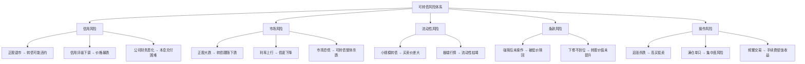
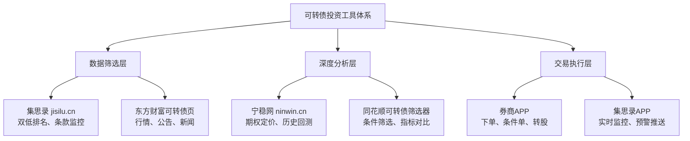
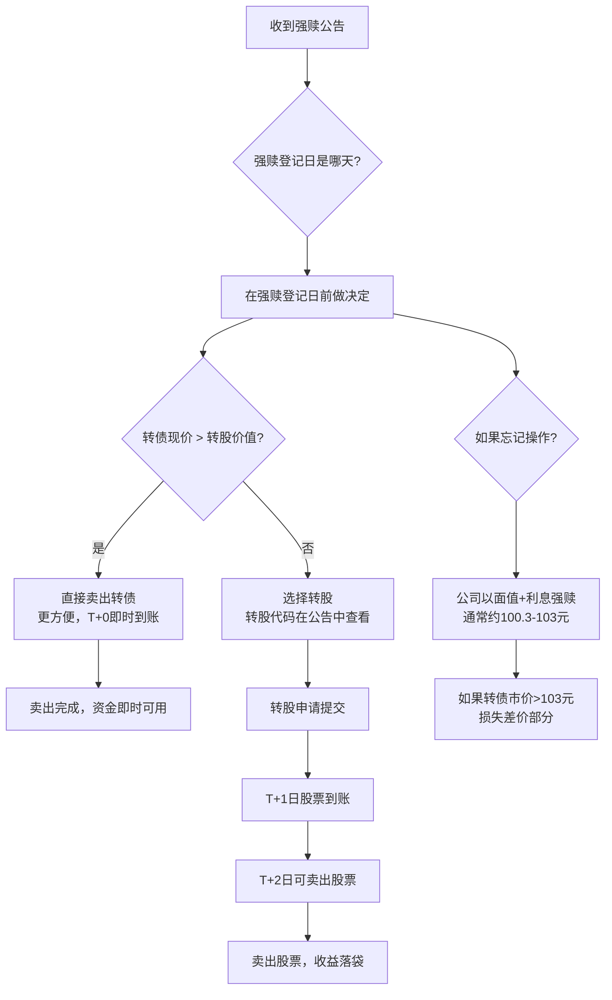

## 案例七：可转债投资入门——从开户到第一笔交易的全流程实操

本案例以一位可转债零基础投资者的视角，完整演示如何利用集思录、宁稳网、券商APP等工具，完成从开户、筛选、分析到交易、监控的全流程操作。如果你从未接触过可转债，跟着这个案例走一遍，就能独立完成第一笔可转债投资。

> **前置阅读建议：** 可转债的三大核心条款（下修、回售、赎回）、双低策略原理、定价逻辑等理论知识，请参阅第6章实战案例四《可转债投资——下有保底上有弹性》。本案例聚焦"工具怎么用"，不再重复理论。

---

### 一、案例背景

#### 1.1 投资者画像

| 项目 | 信息 |
|------|------|
| 年龄 | 28岁，互联网公司运营岗 |
| 投资经验 | 买过余额宝和银行理财，从未接触过证券类投资 |
| 可投资资金 | 8万元（每月工资结余积累） |
| 风险偏好 | 保守型，不能接受本金亏损超过5% |
| 时间精力 | 每天可投入20分钟，周末1小时 |
| 学习目标 | 学会用工具筛选和交易可转债，建立稳健的投资体系 |

#### 1.2 为什么从可转债入门

对于投资新手来说，可转债是A股市场中风险收益比最友好的入门品种：

| 对比维度 | 股票 | 可转债 | 银行理财 |
|---------|------|--------|---------|
| 下跌空间 | 理论上无底 | 有债底保护（到期赎回价105-115元） | 极低（R1-R2产品） |
| 上涨空间 | 无上限 | 跟随正股，有弹性 | 年化2%-4%封顶 |
| 交易方式 | T+1 | T+0（当天可买卖） | 定期锁定 |
| 起投金额 | 1手≈几百到几万元 | 1手≈1000元 | 1元-1万元 |
| 学习门槛 | 需要理解财报、估值 | 只需理解几个核心条款 | 几乎为零 |
| 适合人群 | 风险承受能力强 | 既想要安全又想要收益 | 纯保守型 |

可转债的核心优势在于"不对称性"：下跌有限（有债底），上涨有空间（跟随正股）。这正是新手投资者最需要的——先保住本金，再争取收益。

#### 1.3 可转债的风险全景图

在开始实操之前，必须先建立完整的风险认知。很多新手只关注"下有保底"，却忽略了可转债同样存在亏损的可能：



**关键认知：** 可转债的"保底"是建立在"公司不违约"的前提下的。2023年以来，已有搜特转债、蓝盾转债等案例证明，正股退市后转债同样面临违约风险。因此，信用分析是可转债投资中不可跳过的一环。

---

### 二、开户与权限开通

#### 2.1 证券账户开立

可转债交易需要证券账户。开户流程已全面线上化，10分钟即可完成：

**开户准备材料：**
- 身份证原件（需在有效期内）
- 银行借记卡（用于绑定三方存管）
- 手机号码（接收验证码）
- 本人手持身份证照片（部分券商需要）

**推荐券商选择标准：**

| 评估维度 | 关键指标 | 说明 |
|---------|---------|------|
| 佣金费率 | 可转债佣金万1-万3 | 可转债无印花税，佣金是唯一交易成本 |
| APP体验 | 操作流畅度、条件单功能 | 可转债交易频率较高，APP体验很重要 |
| 条件单支持 | 是否支持价格条件单、止盈止损单 | T+0交易需要灵活的条件单辅助 |
| 数据展示 | 可转债专区、溢价率显示 | 部分券商APP可转债数据展示不完善 |
| 转股操作 | 是否支持一键转股 | 强赎时需要快速转股 |

**开户操作步骤（以华泰证券涨乐财富通为例）：**

```text
第一步：下载"涨乐财富通"APP
  ├── 应用商店搜索"涨乐财富通"
  ├── 下载安装并打开
  └── 点击首页"开户"

第二步：身份验证
  ├── 输入手机号，获取验证码
  ├── 上传身份证正反面照片（自动识别）
  └── 进行视频见证（回答几个简单问题）

第三步：选择营业部和佣金方案
  ├── 选择就近营业部（影响不大）
  ├── 选择佣金方案（建议选万1.5以下）
  └── 设置交易密码和资金密码

第四步：绑定银行卡
  ├── 选择常用银行的借记卡
  ├── 输入卡号和预留手机号
  └── 完成三方存管绑定

第五步：风险测评
  ├── 如实填写风险承受能力问卷
  ├── 可转债交易要求C3（平衡型）及以上
  └── 如果测评结果为C1/C2，需要重新测评

第六步：等待审核
  ├── 通常1-2个工作日审核通过
  ├── 收到短信通知后即可交易
  └── 首次登录建议修改初始密码
```

#### 2.2 可转债交易权限

2022年6月18日起，交易所对可转债交易设置了准入门槛：

| 条件 | 要求 | 说明 |
|------|------|------|
| 交易经验 | 参与证券交易满24个月 | 从首次股票交易算起 |
| 资产要求 | 申请前20个交易日日均资产≥10万元 | 包括股票、基金、现金等 |
| 风险等级 | 风险测评为C4（积极型）及以上 | 在券商APP中重新测评 |
| 签署风险揭示书 | 线上签署《可转债风险揭示书》 | 通常在交易权限开通页面 |

**重要说明：** 2022年6月18日前已开通可转债权限的投资者不受影响。如果你是新开户且不满足上述条件，可以先通过以下方式积累：
- 先交易ETF基金（无门槛要求），积累交易经验
- 通过购买场外基金等方式满足资产要求
- 等待24个月交易经验到期后再申请

#### 2.3 交易费用计算

可转债的交易费用比股票低很多，这是它适合频繁操作的重要原因：

```text
可转债交易费用 = 佣金（唯一成本）

股票交易费用 = 佣金 + 印花税（卖出0.05%）+ 过户费

对比示例：买入10万元可转债
├── 可转债佣金（万2）：100000 × 0.0002 = 20元
├── 印花税：0元（可转债免征）
└── 总成本：20元

对比：买入10万元股票
├── 佣金（万2）：100000 × 0.0002 = 20元
├── 过户费：100000 × 0.00001 = 1元
└── 买入总成本：21元
├── 卖出时额外缴纳印花税：100000 × 0.0005 = 50元
└── 买卖总成本：71元

结论：可转债交易成本仅为股票的28%左右
```

**佣金谈判技巧：**
- 开户时主动要求降低可转债佣金，万1-万2是合理区间
- 如果APP默认佣金高于万3，联系客服或客户经理申请调低
- 部分券商对可转债佣金有单独的优惠方案，需要主动询问

#### 2.4 可转债税务须知

可转债涉及的税务问题容易被忽视，但会直接影响实际收益：

| 税种 | 适用情况 | 税率 | 说明 |
|------|---------|------|------|
| 交易佣金 | 买卖双向收取 | 万1-万3 | 唯一的常规交易成本 |
| 印花税 | 不适用 | 0% | 可转债免征印花税 |
| 利息所得税 | 持有到期获得利息 | 20% | 由发行公司代扣代缴 |
| 转股差价税 | 转股后卖出股票的差价 | 暂免征收 | 政策性优惠，可能变动 |
| 强赎差价税 | 强赎价格与买入价的差价 | 暂免征收 | 同上 |

**实操提示：** 利息所得税是唯一需要注意的税种。例如某转债到期赎回价108元，你买入价105元，看似赚3元，但利息部分（约8元）需缴纳20%税（1.6元），实际收益只有1.4元。因此到期收益率(YTM)的计算需要考虑税收影响，实际YTM = 账面YTM × (1-20%)。不过对于双低策略投资者来说，主要靠买卖差价获利，利息税影响较小。

---

### 三、核心工具平台详解

可转债投资需要三个层次的工具配合使用：



#### 3.1 集思录（jisilu.cn）——可转债投资的"主战场"

集思录是国内最专业的可转债数据平台，几乎所有可转债投资者都将它作为主要的筛选和监控工具。

**注册与基础设置：**

```text
第一步：注册账号
  ├── 访问 jisilu.cn 或下载集思录APP
  ├── 手机号注册（推荐，方便接收推送）
  └── 完善个人信息

第二步：进入可转债页面
  ├── 网页版：首页 → 数据 → 可转债
  └── APP版：底部导航 → 可转债

第三步：熟悉核心页面
  ├── 转债列表：所有可转债的实时数据
  ├── 双低排名：按双低值排序的排名表
  ├── 待发转债：即将上市的新债信息
  └── 强赎/下修/回售：条款触发进度监控
```

**可转债列表页核心字段解读：**

| 字段名 | 含义 | 投资参考价值 |
|--------|------|------------|
| 代码/名称 | 转债的交易代码和简称 | 用于在券商APP中搜索交易 |
| 现价 | 当前交易价格（元/张） | 核心指标，围绕100元面值波动 |
| 溢价率 | 转股溢价率，衡量转债与正股的联动性 | 越低联动性越强，越高越像纯债 |
| 双低值 | 现价 + 溢价率×100 | 双低策略的核心排序指标 |
| 到期收益率(YTM) | 持有到期的年化收益率 | 正值表示有保底，越高越安全 |
| 剩余年限 | 距离到期日的年数 | 太短利息少，太长不确定性大 |
| 剩余规模 | 尚未转股的转债总金额 | 太小（<3000万）流动性差 |
| 评级 | 信用评级（AAA/AA+/AA/A+/A等） | 越高越安全，建议选A+以上 |
| 正股名称 | 对应的上市公司股票 | 需要关注正股基本面 |
| 正股PE | 正股的市盈率 | 估值参考 |
| 下修/回售/强赎 | 条件触发进度百分比 | 关键事件监控 |

**双低排名实操：**

进入集思录可转债页面后，点击"双低"列标题进行排序，即可看到所有可转债按双低值从低到高的排名。这是双低策略的核心操作。

```text
双低排名页面操作指南：

1. 默认排序：点击"双低"列标题，升序排列
   ├── 排名前10-20的转债是候选标的
   └── 双低值<130的转债通常值得关注

2. 筛选过滤：
   ├── 点击"筛选"按钮
   ├── 设置条件：评级≥A+、剩余规模≥3000万
   ├── 排除已公告强赎的转债（标记为"强赎"）
   └── 排除正股被ST的转债

3. 查看详情：
   ├── 点击任意转债名称进入详情页
   ├── 查看条款触发进度（下修/回售/强赎）
   ├── 查看正股基本面数据
   └── 查看历史价格走势
```

**条款监控功能：**

集思录最有价值的功能之一是条款触发进度的实时监控：

```text
下修监控：
├── 显示每只转债距离下修触发价的百分比
├── 当正股价接近下修触发价时标红提醒
├── 可以筛选"即将触发下修"的标的
└── 重点关注：剩余年限<3年 + 即将触发下修 的组合

强赎监控：
├── 显示每只转债距离强赎触发价的百分比
├── 当正股价接近强赎触发价时标绿提醒
├── 已公告强赎的转债会有特殊标记
└── 关键操作：强赎公告后尽快卖出或转股

回售监控：
├── 显示距离回售期开始的倒计时
├── 显示当前是否满足回售条件
└── 回售期临近时，公司下修意愿通常更强
```

**集思录会员是否值得购买：**

| 功能 | 免费版 | 付费版（约300元/年） |
|------|--------|---------------------|
| 双低排名 | ✅ | ✅ |
| 基础筛选 | ✅ | ✅ |
| 条件触发进度 | ✅ | ✅ |
| 历史回测 | ❌ | ✅ |
| 期权定价模型 | ❌ | ✅ |
| 高级筛选条件 | 有限 | 完整 |
| 数据导出 | ❌ | ✅ |
| 推送提醒 | 有限 | 完整 |

**建议：** 刚入门时免费版完全够用。当你持仓达到5只以上、需要系统化管理时，再考虑付费版。300元/年对于管理8万元资金来说，成本率仅0.375%，性价比很高。

#### 3.2 宁稳网（ninwin.cn）——深度分析利器

宁稳网是可转债深度分析的补充工具，功能侧重于定价模型和历史数据。

**核心功能：**

| 功能 | 用途 | 适合场景 |
|------|------|---------|
| 期权定价 | 用Black-Scholes模型计算转债的理论价值 | 判断转债是高估还是低估 |
| 到期收益率计算 | 精确计算持有到期的年化收益 | 低价策略选标的 |
| 历史回测 | 回测双低、低价等策略的历史表现 | 验证策略有效性 |
| 条款分析 | 详细展示每只转债的条款细则 | 研究下修/回售条件 |
| 正股分析 | 正股的估值、财务、技术指标 | 判断正股走势 |

**宁稳网使用场景示例：**

```text
场景：你在集思录双低排名中发现一只转债，双低值118，看起来很便宜。
      但你不确定这个便宜是否反映了真正的风险。

使用宁稳网验证：
1. 在宁稳网搜索该转债代码
2. 查看期权定价 → 理论价值是否与市场价格接近
   ├── 如果市价远低于理论价值 → 可能是机会
   └── 如果市价接近理论价值 → 双低值低可能是因为正股风险
3. 查看正股财务指标
   ├── 资产负债率是否过高（>70%需警惕）
   ├── 经营现金流是否为正
   ├── 是否有退市风险预警
   └── 信用评级变动历史
4. 综合判断：是真便宜还是"价值陷阱"
```

**宁稳网高级用法——回测验证策略：**

宁稳网的历史回测功能可以帮你验证策略的有效性，避免"幸存者偏差"：

```text
回测操作步骤：
1. 进入宁稳网 → 策略回测
2. 选择策略类型：双低策略
3. 设置回测参数：
   ├── 起始日期：建议至少回测3年
   ├── 双低阈值：<130（或自定义）
   ├── 持仓数量：10只
   ├── 轮动频率：每周/每两周/每月
   └── 评级要求：A+及以上
4. 查看回测结果：
   ├── 年化收益率：历史平均约8%-15%
   ├── 最大回撤：最大亏损幅度
   ├── 夏普比率：风险调整后收益
   └── 胜率：盈利轮动次数占比
5. 对比不同参数组合，找到最适合自己的策略
```

#### 3.3 东方财富可转债页面——免费的全能选手

东方财富网的可转债页面是免费工具中功能最全面的，适合日常信息获取和新闻监控。

**访问路径：** 东方财富网 → 数据中心 → 可转债 → 可转债行情

**核心功能：**

```text
东方财富可转债页面功能清单：

行情数据：
├── 全部可转债实时行情（价格、涨跌幅、成交量）
├── 转股价值和转股溢价率
├── 到期收益率
└── 正股联动行情（点击正股列跳转）

公告信息：
├── 强赎公告：第一时间推送
├── 下修公告：公司提议下修转股价
├── 回售公告：回售期开始通知
├── 发行公告：新债申购信息
└── 评级变动：信用评级调整通知

数据筛选：
├── 按价格区间筛选（如90-110元）
├── 按溢价率筛选（如<20%）
├── 按评级筛选（如AA以上）
├── 按行业筛选
└── 按到期年限筛选

新闻资讯：
├── 可转债专题新闻
├── 个券分析文章
├── 市场评论
└── 政策解读
```

#### 3.4 同花顺可转债筛选器——条件筛选的利器

同花顺的"问财"功能支持自然语言筛选可转债，使用门槛极低。

**使用方法：**

在同花顺APP或网页版搜索框中输入自然语言条件，例如：

```text
筛选示例（直接在问财中输入）：

基础筛选：
"可转债 双低值小于130 评级AA以上 剩余规模大于1亿"

低价筛选：
"可转债 价格小于110 到期收益率大于0 剩余年限2-4年"

低溢价筛选：
"可转债 溢价率小于10% 日均成交额大于500万"

下修博弈筛选：
"可转债 正股价低于转股价85% 剩余年限小于3年"

综合筛选：
"可转债 双低值小于125 评级A+以上 剩余规模大于5000万 
 非ST 剩余年限大于1年"
```

**问财筛选的局限性：**
- 数据更新可能有15分钟延迟
- 复杂的交叉筛选条件可能无法完全表达
- 筛选结果需要手动到集思录验证

#### 3.5 券商APP——交易执行与条件单

券商APP是最终执行交易的地方。对于可转债投资来说，条件单功能尤为重要。

**可转债条件单设置清单：**

| 条件单类型 | 触发条件 | 执行操作 | 使用场景 |
|-----------|---------|---------|---------|
| 强赎预警 | 正股价 ≥ 转股价×1.25 | 推送提醒 | 提前准备卖出 |
| 止损单 | 转债价 ≤ 买入价×0.92 | 卖出全部 | 亏损超8%自动止损 |
| 止盈单 | 转债价 ≥ 买入价×1.15 | 卖出一半 | 盈利15%分批止盈 |
| 价格回落 | 从最高点回落5% | 卖出全部 | 保护已有利润 |
| 价格突破 | 转债价突破115元 | 推送提醒 | 关注强赎风险 |

**华泰证券条件单设置示例（以止损为例）：**

```text
操作路径：涨乐财富通 → 交易 → 条件单 → 新建条件单

第一步：选择标的
  ├── 输入转债代码（如123xxx）
  └── 确认转债名称

第二步：设置触发条件
  ├── 条件类型：价格条件
  ├── 触发方向：小于等于
  ├── 触发价格：买入价 × 0.92（如买入价105元，则设为96.6元）
  └── 有效期：长期有效（或自定义截止日期）

第三步：设置委托信息
  ├── 委托方向：卖出
  ├── 委托价格：买一价（确保快速成交）
  ├── 委托数量：全部持仓
  └── 确认下单

第四步：确认并提交
  ├── 核对条件单信息
  ├── 点击"确认创建"
  └── 在"我的条件单"中查看已创建的条件单
```

**条件单常见陷阱：**

| 陷阱 | 说明 | 解决方案 |
|------|------|---------|
| 条件单过期 | 部分券商条件单有效期最长3个月 | 定期检查并续期 |
| 价格跳空 | 开盘跳空直接越过条件单价格 | 条件单价格留出余量 |
| 委托失败 | 流动性差的转债可能无法成交 | 选择"对手价"而非"限价" |
| 条件冲突 | 止盈和止损条件单可能同时触发 | 使用"价格回落"条件单替代 |

---

### 四、完整实操流程：从筛选到交易

以下演示一个完整的可转债投资操作流程，从零开始到完成第一笔交易。

#### 4.1 第一步：用集思录筛选标的

```text
操作时间：周六上午（非交易时间做研究）
工具：集思录网页版

具体操作：
1. 打开 jisilu.cn → 数据 → 可转债
2. 点击"双低"列，按升序排列
3. 应用筛选条件：
   ├── 评级：A+及以上
   ├── 剩余规模：≥ 5000万元
   ├── 排除：已公告强赎的转债
   └── 排除：正股被ST/*ST的转债
4. 从排名前20的转债中，初步选出10只候选标的
5. 逐一点击查看详情：
   ├── 检查正股基本面（不能有重大诉讼、债务危机）
   ├── 检查剩余年限（2-5年为宜）
   ├── 检查日均成交额（≥100万元）
   └── 检查条款触发进度
6. 最终确定5-8只标的作为买入候选
```

**筛选结果示例（模拟数据）：**

| 排名 | 转债代码 | 转债名称 | 现价 | 溢价率 | 双低值 | 评级 | 剩余年限 | 到期收益率 |
|------|---------|---------|------|--------|--------|------|---------|-----------|
| 1 | 123xxx | 转债A | 103.5 | 12.3% | 115.8 | AA | 3.2年 | 2.1% |
| 2 | 127xxx | 转债B | 105.2 | 11.8% | 117.0 | AA+ | 4.1年 | 1.8% |
| 3 | 113xxx | 转债C | 102.8 | 15.2% | 118.0 | A+ | 2.8年 | 3.2% |
| 4 | 128xxx | 转债D | 106.1 | 13.5% | 119.6 | AA | 3.5年 | 1.5% |
| 5 | 123xxx | 转债E | 104.3 | 16.7% | 121.0 | AA | 2.5年 | 2.8% |

#### 4.2 第二步：用宁稳网验证标的

```text
操作时间：筛选完成后
工具：宁稳网

对每只候选标的执行以下验证：
1. 在宁稳网搜索转债代码
2. 查看期权定价模型：
   ├── 理论价值 vs 市场价格
   └── 偏差在±10%以内为正常
3. 查看正股财务数据：
   ├── 资产负债率（<70%为安全）
   ├── 近3年净利润趋势（不能持续大幅下滑）
   ├── 经营现金流净额（应为正）
   └── 是否有退市风险警示
4. 查看信用评级历史：
   ├── 是否有评级下调记录
   └── 评级展望是否为"稳定"或"正面"

验证结果：
├── 通过验证 → 保留在候选列表
├── 存疑 → 标记风险，降低仓位或剔除
└── 不通过 → 从候选列表中删除
```

#### 4.3 第三步：用券商APP下单买入

```text
操作时间：周一开盘日
工具：券商APP（以华泰涨乐财富通为例）

买入前准备：
├── 确认候选标的列表和目标仓位
├── 计算每只转债的买入金额（总资金8万，买5-8只，每只1-1.6万）
└── 确认账户资金充足

下单操作（以买入转债A为例）：
1. 打开涨乐财富通 → 交易 → 买入
2. 输入转债代码：123xxx
3. 系统显示：转债A，现价103.50
4. 设置委托价格：
   ├── 限价单：103.50元（与现价相同）
   └── 或设置为"对手价"（买一价）确保快速成交
5. 设置委托数量：
   ├── 可转债最小交易单位：10张（1手）
   ├── 103.50元/张 × 10张 = 1,035元
   ├── 计划买入1.6万元 → 16000 ÷ 1035 ≈ 15手 = 150张
   └── 输入数量：150
6. 确认委托信息：
   ├── 标的：转债A（123xxx）
   ├── 价格：103.50元
   ├── 数量：150张
   ├── 预计金额：15,525元
   └── 预计佣金：15525 × 0.0002 = 3.1元
7. 点击"买入"提交委托
8. 等待成交回报（通常几秒到几分钟内成交）
```

**T+0交易的灵活操作：**

可转债支持T+0交易，当天买入当天可以卖出。这在以下场景中非常有用：

```text
场景一：买入后发现判断错误
├── 上午10:00买入转债A，103.50元
├── 10:30发现正股发布了利空公告
├── 立即卖出，103.20元
├── 亏损：0.30元/张 × 150张 = 45元 + 佣金
└── 教训：以后买入前先检查公告

场景二：日内波动中的波段操作
├── 9:35买入转债B，105.00元
├── 10:30转债B涨到106.50元（涨1.4%）
├── 卖出锁定利润
├── 收益：1.50元/张 × 100张 = 150元
└── 注意：日内波段需要经验，新手不建议频繁操作

场景三：打新中签后快速卖出
├── 可转债打新中签（1000元/签）
├── 上市首日卖出
├── 首日无涨跌幅限制，可能涨20%-50%
└── 通常是新手的第一笔可转债收益
```

#### 4.4 第四步：设置条件单和监控

```text
买入完成后立即设置条件单：

1. 止损条件单
   ├── 触发条件：转债价 ≤ 买入价 × 0.92
   ├── 以转债A为例：≤ 103.50 × 0.92 = 95.22元
   ├── 执行操作：卖出全部150张
   └── 有效期：长期有效

2. 止盈条件单（分批止盈）
   ├── 第一档：转债价 ≥ 115元 → 卖出50张（1/3仓位）
   ├── 第二档：转债价 ≥ 125元 → 再卖出50张
   └── 剩余50张持有等待强赎或更高价位

3. 强赎预警
   ├── 正股价 ≥ 转股价 × 1.25 → 推送提醒
   └── 收到提醒后密切关注，准备卖出

日常监控清单（每天15分钟）：
├── 9:25-9:30：查看持仓转债的开盘价
├── 9:30-9:35：检查是否有新的公告（强赎/下修/回售）
├── 14:50-15:00：检查收盘价和溢价率变动
└── 异常情况：正股涨停/跌停时关注转债联动
```

#### 4.5 第五步：定期轮动（每周一次）

```text
轮动操作（每周五下午30分钟）：

1. 打开集思录 → 双低排名
2. 导出当前排名前20的标的
3. 对比自己的持仓：
   ├── 持仓中排名滑出前30的 → 计划卖出
   ├── 新进入前15的标的 → 计划买入
   └── 排名在15-30之间的 → 继续持有
4. 下周一执行交易：
   ├── 卖出排名下滑的转债
   ├── 等资金到账后（T+0即时到账）
   └── 买入新进入名单的转债
5. 更新投资记录表
```

**投资记录表模板：**

```text
┌──────────────────────────────────────────────────────────────────────┐
│ 可转债投资记录表                                                      │
├────────┬────────┬───────┬───────┬───────┬───────┬────────┬──────────┤
│ 日期    │ 代码    │ 名称   │ 买/卖  │ 价格   │ 数量   │ 金额    │ 盈亏     │
├────────┼────────┼───────┼───────┼───────┼───────┼────────┼──────────┤
│ 06-02  │ 123xxx │ 转债A  │ 买入   │ 103.50│ 150张  │ 15,525 │ -        │
│ 06-02  │ 127xxx │ 转债B  │ 买入   │ 105.20│ 100张  │ 10,520 │ -        │
│ 06-09  │ 123xxx │ 转债A  │ 卖出   │ 108.30│ 150张  │ 16,245 │ +720     │
│ 06-09  │ 128xxx │ 转债D  │ 买入   │ 106.10│ 150张  │ 15,915 │ -        │
└────────┴────────┴───────┴───────┴───────┴───────┴────────┴──────────┘

月度统计：
├── 本月交易次数：12次
├── 本月总收益：+1,850元
├── 本月收益率：+2.3%
├── 胜率：67%（8笔盈利/12笔交易）
└── 最大单笔亏损：-320元（止损执行）
```

---

### 五、可转债打新：零成本的入门收益

可转债打新是新手最容易获得正收益的方式，操作简单且几乎零成本。

#### 5.1 打新操作流程

```text
第一步：了解打新时间
├── 新债发行时，东方财富APP会推送提醒
├── 集思录"待发转债"页面可查看即将发行的转债
└── 通常每周有1-3只新债可申购

第二步：申购操作
├── 打开券商APP → 交易 → 新股/新债申购
├── 选择可转债申购
├── 点击"全部申购"（顶格申购10000张）
├── 实际中签通常只有10张（1手），金额约1000元
└── 确认申购

第三步：等待中签结果
├── 申购后T+2日公布中签结果
├── 券商APP会推送中签通知
├── 中签后确保账户内有足够资金（至少1000元）
└── 系统自动扣款

第四步：上市首日卖出
├── 新债通常在申购后15-30天上市
├── 上市首日无涨跌幅限制
├── 大多数新债上市首日涨幅在10%-30%
├── 建议新手在上市首日9:30-9:35直接卖出
└── 卖出操作与正常可转债交易相同
```

#### 5.2 打新收益统计

```text
2024年可转债打新收益统计（模拟数据）：

全年可申购新债数量：约120只
假设每只都顶格申购：
├── 平均中签率：约0.01%-0.1%（每只）
├── 全年中签约：10-15只
├── 平均每只收益：约150-300元
├── 全年打新收益：约2000-4500元
└── 所需资金：申购时0元，中签后1000元/只

年化收益率（以1000元资金占用计算）：
├── 如果全年中签12只，平均每只赚200元
├── 总收益 = 12 × 200 = 2,400元
├── 资金占用：1000元 × 平均15天 × 12次 = 180,000元·天
└── 年化收益率 ≈ 48%（按资金占用天数计算）

注意：打新收益不是持续性的，需要配合主动投资策略
```

#### 5.3 打新避坑指南

| 常见错误 | 后果 | 正确做法 |
|---------|------|---------|
| 中签后忘记缴款 | 连续12次弃购将被限制打新半年 | 中签后立刻检查账户余额，确保≥1000元 |
| 上市首日不卖，等更高价 | 部分新债上市后一路下跌 | 新手坚持首日卖出策略，落袋为安 |
| 盲目申购所有新债 | 遇到破发新债亏损 | 申购前查看正股基本面和转股溢价率 |
| 用多个账户打新提高中签率 | 同一身份证下多个账户只算一次 | 用家人身份证开独立账户（需本人操作） |

---

### 六、信用风险评估：避开"价值陷阱"

这是可转债投资中最容易被新手忽视，却最致命的环节。

#### 6.1 信用风险的量化评估框架

```text
信用风险评估清单（每只转债必查）：

一、财务健康度（权重40%）
├── 资产负债率：<60%为安全，60%-70%需警惕，>70%排除
├── 流动比率：>1.5为安全，<1.0排除
├── 经营现金流：连续2年为正，最近1年为正
├── 净利润趋势：近3年不能持续大幅下滑
└── 商誉占比：>净资产30%需警惕

二、信用评级（权重25%）
├── 当前评级：A+及以上（最低要求）
├── 评级展望：稳定或正面（负面展望排除）
├── 评级变动：近1年是否有下调记录
└── 担保情况：有担保优于无担保

三、经营风险（权重20%）
├── 行业景气度：避免夕阳行业
├── 大股东质押率：>80%需警惕
├── 诉讼/仲裁：重大诉讼需排除
├── 监管处罚：近1年有重大处罚需排除
└── 审计意见：标准无保留意见

四、退市风险（权重15%）
├── 股价：连续20日低于1元需警惕
├── 营收：连续亏损需警惕
├── 净资产：为负需排除
└── 退市预警：有*ST标记需排除
```

#### 6.2 信用风险快速筛查流程

```text
第一步：集思录筛选时排除高风险标的
├── 排除评级<A的转债
├── 排除正股被ST/*ST的转债
├── 排除剩余规模<3000万的转债（流动性风险）
└── 排除已公告强赎的转债

第二步：宁稳网深度验证
├── 查看正股财务数据
├── 查看信用评级历史
├── 查看是否有退市风险预警
└── 查看期权定价模型（市价是否异常低于理论价值）

第三步：东方财富信息补充
├── 搜索正股近期公告
├── 查看是否有重大诉讼/处罚
├── 查看大股东质押情况
└── 查看行业景气度
```

#### 6.3 信用风险案例分析

```text
案例：某转债信用评级从AA下调至A+

背景：
├── 正股公司连续2年净利润下滑
├── 资产负债率从55%上升至72%
├── 大股东质押率达到85%
└── 信用评级机构发布评级下调公告

转债价格变化：
├── 评级下调前：105元（双低值118）
├── 评级下调当日：98元（跌幅6.7%）
├── 一周后：95元（累计跌幅9.5%）
└── 一个月后：92元（累计跌幅12.4%）

教训：
├── 双低值低不代表安全，可能是"价值陷阱"
├── 信用评级下调是重要预警信号
├── 需要定期检查持仓转债的信用状况
└── 设置信用风险预警（集思录付费版支持）
```

---

### 七、常见问题与避坑指南

#### 7.1 新手最常犯的10个错误

| 错误 | 后果 | 正确做法 |
|------|------|---------|
| 只看双低值不看基本面 | 买到暴雷转债亏损严重 | 必须检查正股财务和信用评级 |
| 忘记设置止损条件单 | 单只亏损超过20%才反应过来 | 买入后立刻设置8%止损 |
| 强赎公告后不及时操作 | 被强赎价（面值+利息）回收，损失巨大 | 强赎公告后3天内卖出或转股 |
| 全仓买一只转债 | 该转债暴雷导致重大亏损 | 分散持有5-8只，单只不超10% |
| 日内频繁交易 | 手续费累积侵蚀收益 | 轮动频率控制在每周1次 |
| 追涨130元以上的转债 | 接近强赎价位，下行风险大 | 双低策略只买130元以下的转债 |
| 忽略流动性 | 想卖卖不掉，只能低价出 | 只买日均成交额>100万元的转债 |
| 盲信"可转债不会亏" | 没有风控意识，亏损时不知所措 | 理解信用风险，做好最坏打算 |
| 不做投资记录 | 不知道自己总体是赚是亏 | 每笔交易都记录，每月统计收益 |
| 打新中签后忘记缴款 | 连续12次弃购将被限制打新半年 | 中签后立刻检查账户余额 |

#### 7.2 强赎应对流程图



#### 7.3 关键概念速查表

| 概念 | 定义 | 计算公式 | 参考值 |
|------|------|---------|--------|
| 转股价值 | 转债转换成股票后的市场价值 | 100 × 正股价 ÷ 转股价 | >100为溢价状态 |
| 转股溢价率 | 转债价格相对于转股价值的溢价幅度 | (转债价 - 转股价值) ÷ 转股价值 × 100% | <20%联动性强 |
| 双低值 | 综合衡量转债性价比的指标 | 转债价 + 溢价率 × 100 | <130值得关注 |
| 纯债价值 | 假设不转股时的债券价值 | 由票面利率、到期价、剩余年限折算 | 转债价格的"地板" |
| 到期收益率(YTM) | 持有到期的年化收益率 | (到期赎回价-现价+剩余利息) ÷ (现价×剩余年限) | >0有保底 |
| 剩余规模 | 尚未转股的转债总额 | 发行总额 - 已转股金额 | <3000万流动性差 |

#### 7.4 市场极端情况应对

可转债市场偶尔会出现整体性的恐慌杀跌，新手需要提前了解应对方法：

```text
极端情况一：可转债整体大跌（跌幅>3%）
├── 原因：正股市场大跌、流动性收紧、政策变化
├── 应对：检查持仓转债的信用状况，无问题则持有
├── 禁忌：恐慌性抛售（通常在底部）
└── 机会：低价买入优质转债（双低值<110）

极端情况二：单只转债暴雷（跌幅>10%）
├── 原因：正股退市风险、信用评级大幅下调
├── 应对：立即检查是否需要止损
├── 操作：如果触发止损条件单，自动执行
└── 教训：加强信用风险筛查

极端情况三：强赎潮（多只转债同时公告强赎）
├── 原因：正股市场上涨，多只转债触发强赎条件
├── 应对：逐一检查持仓，按强赎流程操作
├── 注意：强赎登记日可能不同，不要混淆
└── 机会：卖出后资金可用于买入新的双低转债
```

---

### 八、第一个月行动计划

#### 8.1 第一周：学习与开户

| 天数 | 任务 | 预计时间 | 完成标志 |
|------|------|---------|---------|
| Day 1 | 阅读第6章可转债案例，理解核心条款 | 1小时 | 能说出下修/回售/强赎的触发条件 |
| Day 2 | 下载集思录APP，注册并浏览可转债页面 | 30分钟 | 能找到双低排名页面 |
| Day 3 | 选择券商并提交开户申请 | 30分钟 | 开户申请已提交 |
| Day 4 | 开户审核等待期间，继续学习集思录功能 | 30分钟 | 能使用筛选功能 |
| Day 5 | 开户通过，入金5000元（先小额试水） | 15分钟 | 账户有可用资金 |
| Day 6-7 | 参加可转债打新（如有新债发行） | 10分钟/次 | 已提交申购 |

#### 8.2 第二周：模拟筛选与小额试水

| 天数 | 任务 | 预计时间 | 完成标志 |
|------|------|---------|---------|
| Day 8 | 用集思录筛选双低排名前10的转债 | 30分钟 | 拿到一份候选标的清单 |
| Day 9 | 用宁稳网/东方财富验证候选标的 | 30分钟 | 完成5只标的的验证 |
| Day 10 | 买入第一只可转债（1手=10张，约1000元） | 10分钟 | 持仓中有可转债 |
| Day 11 | 设置止损条件单（买入价×0.92） | 5分钟 | 条件单已创建 |
| Day 12 | 观察持仓转债的日常波动 | 10分钟 | 记录当日涨跌幅 |
| Day 13 | 继续观察，感受T+0交易的灵活性 | 10分钟 | 理解T+0的优势 |
| Day 14 | 周末复盘：总结本周操作和学习心得 | 30分钟 | 完成第一周投资记录 |

#### 8.3 第三至四周：逐步建仓

| 周数 | 任务 | 资金分配 |
|------|------|---------|
| 第三周 | 根据双低策略买入3-4只转债 | 再入金1万元，总持仓约1.5万元 |
| 第四周 | 完善持仓至5-6只，设置所有条件单 | 再入金1万元，总持仓约2.5万元 |
| 月末 | 完成第一次月度复盘，统计收益 | 更新投资记录表 |

**第一个月资金分配建议：**

```text
总投入资金：25,000元（8万元的31%，先小后大）

资金分配：
├── 双低策略持仓：17,500元（5-6只，每只约3000元）
├── 打新备用金：1,000元（中签扣款用）
├── 机动资金：6,500元（等待更好的买入机会）
└── 总计：25,000元

第一个月目标：
├── 学会使用集思录、券商APP等核心工具
├── 完成第一笔可转债交易
├── 建立投资记录习惯
├── 理解双低策略的执行流程
└── 不追求收益，追求流程正确
```

---

### 九、工具使用效率优化

#### 9.1 日常15分钟操作流程

将每天的可转债管理工作标准化为固定流程，减少决策消耗：

```text
每日15分钟可转债管理流程（建议时间：9:25-9:40）

9:25-9:30（开盘前5分钟）：
├── 打开集思录APP
├── 快速浏览持仓转债的昨收价和溢价率
└── 检查是否有新的公告（强赎/下修/回售）

9:30-9:35（开盘5分钟）：
├── 观察持仓转债的开盘价
├── 如果有强赎公告的转债，立刻安排卖出
└── 如果有下修公告，评估是否需要调仓

9:35-9:40（快速检查）：
├── 检查条件单状态（是否已触发）
├── 浏览正股的涨跌幅（异常波动需关注）
└── 记录需要在轮动日（周五）处理的事项

14:55-15:00（收盘前5分钟，可选）：
├── 检查收盘价
├── 确认没有遗漏的强赎操作
└── 更新投资记录
```

#### 9.2 信息源整合

避免信息过载，只关注必要的信息源：

```text
必须关注（每天）：
├── 集思录APP推送（强赎/下修/回售通知）
├── 券商APP推送（持仓异动、条件单触发）
└── 东方财富APP推送（持仓正股公告）

建议关注（每周）：
├── 集思录双低排名变动
├── 可转债市场整体成交额
└── 转债相关监管政策新闻

可以忽略：
├── 股吧/论坛中的情绪化言论
├── 短期涨跌的"预测"帖
├── 付费荐债群/课程（多数不可靠）
└── 日内分时图的过度解读
```

#### 9.3 自动化辅助工具

对于有一定编程基础的投资者，可以通过以下方式提升效率：

```text
方案一：集思录API（付费版）
├── 自动获取双低排名数据
├── 自动筛选符合条件的标的
├── 自动推送筛选结果到手机
└── 适合：有Python基础的投资者

方案二：券商条件单组合
├── 设置多个条件单覆盖不同场景
├── 止损+止盈+强赎预警组合使用
├── 定期检查条件单状态
└── 适合：所有投资者

方案三：Excel/Google Sheets模板
├── 手动输入持仓数据
├── 自动计算收益率、胜率等指标
├── 生成月度/季度投资报告
└── 适合：喜欢手动管理的投资者
```

---

### 十、从新手到进阶：3个月成长路径

#### 10.1 第二个月：深化策略理解

```text
学习目标：
├── 理解不同市场环境下双低策略的表现
├── 学会根据市场调整双低阈值
├── 掌握下修博弈的基本逻辑
└── 建立自己的投资记录分析体系

实操目标：
├── 持仓扩展到8-10只转债
├── 总投入资金增加到5万元
├── 完成第一次策略回测（宁稳网）
└── 月度收益率目标：1%-3%
```

#### 10.2 第三个月：建立系统化投资体系

```text
学习目标：
├── 理解可转债与正股的联动机制
├── 学会简单的正股基本面分析
├── 掌握信用风险的量化评估方法
└── 了解可转债市场的周期性规律

实操目标：
├── 持仓资金达到8万元（满仓）
├── 形成稳定的周度轮动节奏
├── 建立完整的投资记录和分析体系
└── 月度收益率目标：2%-5%
```

#### 10.3 长期进阶方向

| 进阶方向 | 学习内容 | 适合人群 |
|---------|---------|---------|
| 下修博弈 | 研究公司下修转股价的动机和规律 | 对公司行为分析感兴趣 |
| 低溢价策略 | 重点配置低溢价率转债，跟随正股 | 看好正股市场 |
| 行业轮动 | 根据行业景气度选择转债 | 对行业研究有基础 |
| 量化策略 | 用程序化方法筛选和交易 | 有编程基础 |

---

> **本案例核心启示：** 可转债投资的工具使用并不复杂，核心就是三件套——集思录做筛选和监控、宁稳网/东方财富做深度验证、券商APP做交易执行。新手最容易犯的错误不是不会用工具，而是急于求成跳过学习阶段。第一周花时间学好集思录的使用方法，比立刻投几万元重要得多。记住：工具是放大器，先确保你的投资逻辑是正确的，工具才能帮你放大收益而不是放大错误。
