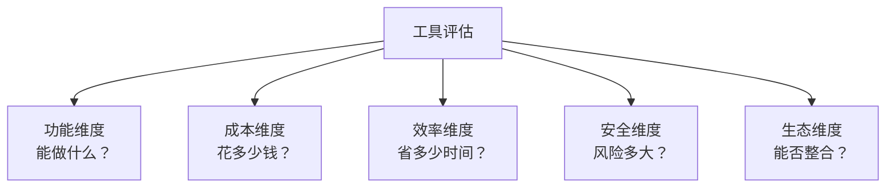
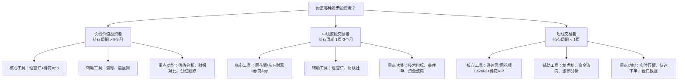
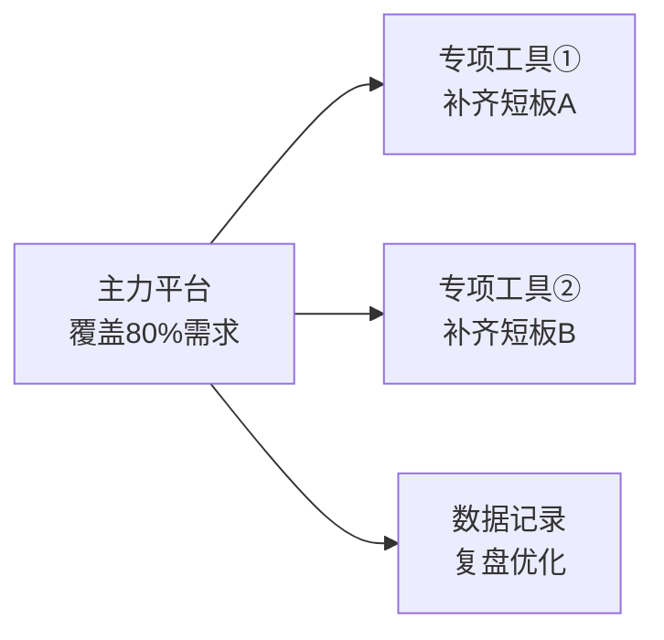
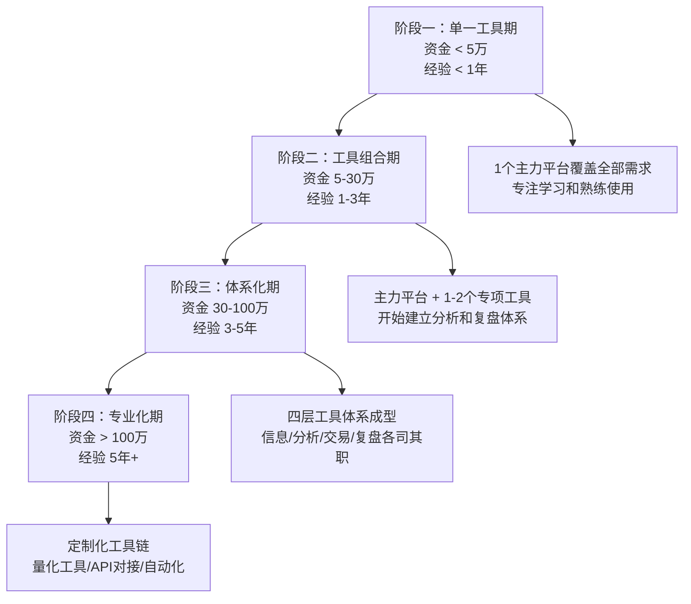

## 投资工具选择总结

经过前面八个实战案例的完整演练——从股票到基金、从房产到量化交易、从加密货币到ETF、从可转债到海外投资——你已经分别体验了每种投资品种的工具使用全流程。本节的核心任务不是重复"某个工具怎么用"，而是把碎片化的经验整合成一个**可复用的工具选择决策框架**。

当你面对一个全新的投资品种或工具时，这套框架能帮你独立判断三个关键问题：

- **值不值得用**——这个工具是否值得投入时间学习和使用
- **怎么用**——如何将它融入现有的投资流程
- **怎么评估**——用了之后怎么判断它是否真正提升了投资效率

### 一、工具选择的底层逻辑

#### 1.1 四步决策模型

所有投资工具的选择，都遵循同一个底层范式：


每一步对应不同类型的工具需求：

| 决策环节 | 核心问题 | 工具类型 | 关键评估指标 | 常见误区 |
|----------|----------|----------|-------------|----------|
| 信息获取 | 数据从哪里来？够不够全、够不够快？ | 行情软件、新闻聚合、研报平台、RSS订阅 | 数据覆盖度、更新延迟、信息噪音比、信源可信度 | 把"信息多"等同于"信息好"，陷入信息过载 |
| 分析决策 | 怎么把原始数据变成买卖信号？ | 技术分析工具、基本面分析工具、估值模型、回测平台 | 指标丰富度、分析深度、可视化能力、回测可靠性 | 过度依赖单一指标，忽视多维度交叉验证 |
| 交易执行 | 下单够不够快、条件单够不够灵活？ | 券商App、交易平台、API接口 | 执行速度、订单类型丰富度、费率水平、稳定性 | 只看佣金不看滑点，只看费率不看执行质量 |
| 复盘优化 | 怎么知道策略赚在哪里、亏在哪里？ | 交易记录工具、组合分析平台、Excel/飞书表格 | 记录完整度、分析维度、归因能力、导出能力 | 从不复盘，或者只看盈亏不分析原因 |

**关键认知**：大多数投资者只关注"交易执行"这一环——选个佣金低的券商就完事了。但真正拉开差距的是"信息获取"和"复盘优化"：

- **信息质量决定决策上限**：同样的技术分析能力，一个能看到资金流向、机构持仓变化、产业链数据的投资者，决策准确率天然高于只能看K线的投资者
- **复盘能力决定进步速度**：没有复盘的投资者，同一个错误可能犯十次；有系统化复盘的投资者，同一个错误最多犯两次——一次犯错，一次复盘确认

**实战验证**：以案例一中小李的经历为例，他从"凭感觉炒股"到"用系统投资"的核心转变，不是换了一个更好的行情软件，而是建立了完整的信息获取→分析判断→条件单执行→记录复盘的闭环。工具是流程的载体，流程才是核心。

#### 1.2 三个选择原则

**原则一：适合原则——匹配你的投资阶段**

| 投资阶段 | 时间跨度 | 核心需求 | 工具选择策略 | 典型错误 | 纠正方法 |
|----------|----------|----------|-------------|----------|----------|
| 新手期 | 0-1年 | 学习基础知识，建立投资纪律 | 选择界面友好、学习资源丰富的工具，功能够用即可 | 上来就用专业级工具，被复杂功能吓退，反而放弃学习 | 从一个主力平台开始，把核心功能用熟再扩展 |
| 成长期 | 1-3年 | 形成自己的投资体系，提高分析深度 | 增加专业分析工具，开始尝试条件单和组合管理 | 工具太多太散，每个只用20%功能，切换成本高 | 做工具审计，砍掉低频工具，集中精力用好核心组合 |
| 成熟期 | 3年以上 | 优化策略、扩展品种、提高效率 | 构建分层工具体系，考虑量化工具和海外投资 | 固守旧工具，拒绝尝试新工具，错过效率提升机会 | 每年做一次工具评估，关注行业新工具但不盲目切换 |

**原则二：效率原则——熟练度优先于功能数**

案例一中小李的教训非常典型：同时使用同花顺、东方财富、通达信、理杏仁、雪球五个平台，每个只用了20%的功能。切换平台本身就在消耗时间——每次切换至少损失3-5分钟的注意力重建时间，一天切换10次就是30-50分钟的隐性成本。信息分散在不同平台上反而降低了决策效率，因为他经常在A平台看到的信息和B平台的信息产生矛盾，反而增加了决策焦虑。

**正确的工具精简三步法**：

```text
第一步：选定一个"主力平台"（覆盖80%日常需求）
  - 评估标准：界面习惯、数据覆盖、交易入口、学习成本
  - 选择周期：花一周时间试用2-3个平台，然后选定一个
  - 选定后至少使用3个月再考虑更换

第二步：根据主力平台的短板，补充1-2个"专项工具"
  - 识别短板：主力平台做不了或做不好的事情是什么？
  - 补充原则：每个专项工具必须有至少一个"不可替代"的功能
  - 示例：同花顺基本面分析较弱→补充理杏仁；同花顺快讯不够快→补充财联社

第三步：定期审视，砍掉使用频率低于每周一次的工具
  - 审视周期：每季度做一次
  - 审视方法：记录两周内每个工具的使用次数和具体用途
  - 砍掉标准：使用频率<1次/周 且 没有其他工具可替代其核心功能
```

**原则三：成本原则——免费工具通常够用**

| 工具层级 | 月费范围 | 适合人群 | 性价比评估 | 典型代表 |
|----------|----------|----------|------------|----------|
| 免费基础版 | 0元 | 所有新手，大部分个人投资者 | ★★★★★ 功能覆盖日常需求的80%以上 | 同花顺免费版、天天基金、雪球 |
| 基础付费版 | 30-100元/月 | 有明确分析需求的进阶投资者 | ★★★★ 需要明确功能需求再付费 | 理杏仁Pro、同花顺Level-2 |
| 专业付费版 | 100-500元/月 | 高频交易者、专业分析需求 | ★★★ 必须确保付费功能确实能提高收益 | 通达信付费版、Wind终端 |
| 机构级工具 | 500元+/月 | 专业机构、量化团队 | ★★ 个人投资者通常不需要 | Bloomberg、Refinitiv |

**一个关键数据**：费率差异对长期收益的影响远大于工具费用。以100万资金为例，每年1%的费率差异在30年复利作用下会导致资产差距超过35万。选工具时，交易佣金（万2.5 vs 万1，差距可达每年数千元）、基金管理费（主动基金1.5% vs 指数基金0.15%，差距可达每年上万元）、申购赎回费等费率因素比工具订阅费重要得多。

#### 1.3 五维工具评估框架

面对任何投资工具，都可以用以下五个维度快速评估：



| 评估维度 | 核心问题 | 评分标准（1-5分） | 权重 |
|----------|----------|------------------|------|
| 功能维度 | 该工具能否解决你的核心需求？是否覆盖你80%以上的使用场景？ | 5分=完全覆盖且有增值功能；3分=覆盖核心需求；1分=只能覆盖部分需求 | 30% |
| 成本维度 | 直接费用（订阅费+交易费）和间接成本（学习时间+切换成本）各是多少？ | 5分=免费且学习成本低；3分=费用合理；1分=费用高且学习成本高 | 20% |
| 效率维度 | 使用该工具后，你的投资决策效率能提升多少？ | 5分=显著提升（节省50%+时间）；3分=有提升；1分=几乎没有提升 | 25% |
| 安全维度 | 数据安全、资金安全、平台稳定性如何？ | 5分=大平台+多重安全验证+良好安全记录；3分=基本安全；1分=有安全隐患 | 15% |
| 生态维度 | 能否与现有工具链无缝整合？数据能否导入导出？ | 5分=开放API+标准数据格式；3分=有限整合；1分=完全封闭 | 10% |

**评分方法**：每个维度打1-5分，加权求和。4分以上值得使用，3-4分需要权衡，3分以下不建议投入时间。

### 二、按投资品种的工具选择决策树

#### 2.1 股票投资工具选择



| 投资风格 | 行情工具 | 分析工具 | 交易工具 | 月均成本 | 核心痛点解决方案 |
|----------|----------|----------|----------|----------|-----------------|
| 长线价值投资 | 雪球（免费） | 理杏仁（基础版免费） | 普通券商App | 0元 | 痛点：估值判断→理杏仁PE/PB分位数解决 |
| 中线波段交易 | 同花顺（免费版） | 理杏仁+通达信（免费版） | 条件单功能强的券商 | 0-30元 | 痛点：择时→技术指标+条件单解决 |
| 短线交易 | 同花顺Level-2（30元/月） | 通达信付费版 | VIP快速通道券商 | 50-150元 | 痛点：速度+信息→Level-2+龙虎榜解决 |

**案例一关键启示**：小李的转变过程——从同时用5个平台（同花顺+东方财富+通达信+理杏仁+雪球）每个只用20%，到最终精简为"同花顺（主力）+理杏仁（基本面）+财联社（快讯）"三件套，用到80%以上功能。核心改变不是工具数量，而是建立了清晰的信息获取→分析判断→条件单执行→记录复盘的完整流程。

#### 2.2 基金投资工具选择

基金投资的工具选择比股票简单得多，核心决策集中在两个问题上：

**问题一：选哪个平台？**

| 平台类型 | 代表平台 | 费率 | 产品覆盖 | 功能丰富度 | 适合人群 | 选择建议 |
|----------|----------|------|----------|------------|----------|----------|
| 基金公司直销 | 各基金公司App/官网 | 最低（部分免申购费） | 仅自家产品 | 中等 | 认准某几家基金公司的长期投资者 | 如果你只买某2-3家基金公司的产品，直销最划算 |
| 银行代销 | 各银行App | 较高（通常4折起） | 较少 | 较低 | 习惯银行操作的老年投资者 | 费率不划算，除非有特殊折扣 |
| 第三方平台 | 天天基金、蚂蚁财富、蛋卷、且慢 | 最低（1折起） | 最全 | 最丰富 | **大多数投资者的最佳选择** | 产品全+费率低+功能丰富，没有理由不选 |

**问题二：用什么筛选基金？**

```text
基金筛选四维度法（案例二实战总结）：

第一维度：业绩筛选
  - 近3年、近5年收益率排名同类前30%
  - 年化收益率跑赢基准指数
  - 注意：不要只看短期业绩（近1年排名前列可能是风格漂移或运气）
  - 技巧：在天天基金"基金排行"中设置多时间维度排序，取交集

第二维度：风险筛选
  - 最大回撤不超过同类平均的1.5倍
  - 夏普比率同类前50%（衡量每承担一单位风险获得的超额收益）
  - 波动率可接受范围内
  - 技巧：晨星网的"风险评估"页签可以直观看到这些数据

第三维度：基金经理筛选
  - 任职年限 ≥ 3年（太短无法验证穿越牛熊的能力）
  - 管理规模适中（10-100亿为佳，太小流动性差，太大调仓困难）
  - 历史业绩稳定，非押注型选手（查看持仓集中度和换手率）
  - 技巧：理杏仁可以看到基金经理的历史业绩曲线

第四维度：费率筛选
  - 管理费 + 托管费综合比较（主动基金通常1.5%+0.25%，指数基金0.15%+0.05%）
  - 同类基金中选择费率较低的（长期持有差异显著）
  - C类份额适合持有期 < 1年，A类适合长期持有（分界线约为1-2年）
  - 技巧：在天天基金购买页面可以对比A/C类份额的费用差异
```

**定投工具选择要点**：

| 功能 | 天天基金 | 蚂蚁财富 | 蛋卷基金 | 且慢 | 选择建议 |
|------|----------|----------|----------|------|----------|
| 普通定投 | ✅ | ✅ | ✅ | ✅ | 所有平台都支持，不是差异化因素 |
| 智能定投（估值法） | ✅ | ✅ | ✅ | ✅（长赢计划） | 估值法定投比普通定投年化高1-3%，强烈推荐 |
| 智能定投（均线法） | ✅ | ✅ | ❌ | ❌ | 均线法定投效果因人而异，可选 |
| 止盈提醒 | ✅ | ✅ | ✅ | ✅ | 设定止盈目标是纪律的关键，必须有 |
| 组合定投 | ❌ | ❌ | ✅ | ✅ | 同时定投多只基金，适合配置型投资者 |
| 基金诊断 | ✅ | ✅ | ✅ | ✅ | 帮助理解基金风格和持仓特征 |
| 费率折扣 | 1折 | 1折 | 1折 | 1折 | 费率基本相同，不是选择因素 |

#### 2.3 房产投资工具选择

房产投资和金融投资有本质区别：交易频率极低（一套房可能持有5-10年）、单笔金额巨大（通常百万级）、信息不对称严重（卖家掌握的信息远多于买家）。因此工具选择的重点不在"交易执行"，而在**信息获取**和**分析决策**。

**核心工具组合**：

| 需求 | 工具 | 用途 | 费用 | 关键使用技巧 |
|------|------|------|------|-------------|
| 房源信息 | 贝壳找房、链家、安居客 | 查看挂牌价、历史成交价、小区信息 | 免费 | 同时查看多个平台，交叉验证房源真实性 |
| 历史成交数据 | 贝壳成交记录、当地住建局官网 | 验证实际成交价，判断议价空间 | 免费 | 贝壳的"成交记录"可以看到同小区近半年的真实成交价 |
| 房贷计算 | 贝壳房贷计算器、银行官网计算器 | 对比等额本息/等额本金，计算月供 | 免费 | 等额本息月供固定适合收入稳定者；等额本金总利息少适合收入较高者 |
| 租金回报分析 | 自建Excel模型 | 计算毛租金回报率、净租金回报率 | 免费 | 毛回报率=年租金/房价；净回报率需扣除物业费、维修、空置期、税费 |
| 区域规划信息 | 当地规划局官网、城市总体规划文件 | 判断区域发展潜力 | 免费 | 重点关注地铁规划、学校规划、商业配套规划 |
| 学区信息 | 教育局官网、学区房查询工具 | 验证学区划分 | 免费 | 学区划分每年可能调整，必须查最新年份的文件 |

**案例三关键启示**：房产投资分析的核心工具就是一个Excel表格。把挂牌价、历史成交价、月供、租金、物业费、维修基金、税费全部量化计算后，才能得出真实的持有成本和投资回报率。不要凭感觉判断"这个房子值不值"，要用数据说话。一个实用的Excel模板至少包含以下字段：

```text
房产投资分析Excel模板核心字段：
  基础信息：小区名称、面积、楼层、朝向、房龄
  价格信息：挂牌价、预估成交价、同小区近期成交均价
  持有成本：首付、贷款金额、利率、月供、物业费、维修基金
  租金信息：同户型租金、空置率、装修投入
  税费计算：契税、增值税、个税、中介费
  收益计算：毛租金回报率、净租金回报率、年化收益率（含房价涨幅假设）
  风险评估：房价下跌10%/20%/30%的亏损金额、月供压力测试
```

#### 2.4 加密货币工具选择

加密货币投资的工具选择有一个独特挑战：**工具本身的安全性就是风险的一部分**。传统金融工具背后有监管机构兜底（券商有投资者保护基金，银行有存款保险），加密货币工具则需要你自己承担安全责任——交易所被盗、钱包私钥丢失、智能合约漏洞，每一种都可能导致资产永久损失。

**工具分层架构**：

```text
第一层：行情与信息（入门必备）
  ├── CoinMarketCap / CoinGecko（全球行情，英文）
  │   用途：查看币种市值排名、交易量、价格走势
  │   特点：数据全面、更新及时，是行业标准数据源
  ├── 非小号（中文行情，国内用户友好）
  │   用途：中文界面查看行情，适合不习惯英文的用户
  │   特点：数据覆盖不如CoinMarketCap全面，但中文社区数据更丰富
  └── CoinGlass（合约数据、资金费率）
      用途：查看多空比、爆仓数据、资金费率
      特点：合约交易者必备，帮助判断市场情绪

第二层：交易平台（核心工具）
  ├── 中心化交易所（CEX）：Binance、OKX、Coinbase
  │   优势：流动性好、操作简单、支持法币入金
  │   风险：平台风险（参考FTX暴雷事件，用户资产无法追回）
  │   安全建议：不在交易所存放超过交易需要的金额，大额资产转入钱包
  └── 去中心化交易所（DEX）：Uniswap、dYdX
      优势：无需KYC、资金自管、无法被平台冻结
      风险：操作门槛高、Gas费波动、智能合约可能有漏洞
      安全建议：只使用经过审计的主流DEX，交易前检查合约地址

第三层：钱包（安全核心）
  ├── 热钱包：MetaMask、Trust Wallet（日常使用）
  │   特点：方便但有网络攻击风险
  │   安全规则：只放日常交易金额（建议不超过总资产的10-20%）
  ├── 冷钱包：Ledger、Trezor（大额存储）
  │   特点：私钥离线存储，安全性最高
  │   安全规则：大额资产必须用硬件钱包，备份助记词并物理安全存储
  └── 安全核心规则：
      - 助记词（12/24个单词）手写在纸上，存放在安全位置
      - 绝不在任何网站、App中输入助记词
      - 使用多个钱包分散风险（不要把所有资产放在一个钱包）

第四层：链上分析（进阶）
  ├── Etherscan（基础链上查询）
  │   用途：查询交易记录、地址余额、合约信息
  ├── Dune Analytics（自定义数据看板）
  │   用途：自定义查询链上数据，构建分析仪表板
  ├── Nansen（聪明钱追踪）
  │   用途：追踪大户地址的动向，发现"聪明钱"的行为模式
  └── Glassnode（链上指标分析）
      用途：MVRV、NUPL等链上指标，判断市场周期
```

**交易所选择决策矩阵**：

| 评估维度 | Binance | OKX | Coinbase | 选择建议 |
|----------|---------|-----|----------|----------|
| 币种数量 | 最多（600+） | 多（400+） | 较少（200+） | 想交易小市值币种选Binance/OKX |
| 合约交易 | ✅ 深度最好 | ✅ 功能丰富 | 有限 | 合约交易选Binance/OKX |
| 法币入金 | 支持C2C | 支持C2C | 最方便（海外） | 国内用户C2C入金，海外用户Coinbase最方便 |
| 中文支持 | 好 | 最好 | 差 | 中文用户首选OKX |
| 安全记录 | 有被盗历史（2019年7000BTC） | 良好 | 良好 | 三家都有储备金证明（PoR），建议启用所有安全验证 |
| 手续费 | 0.1%（BNB抵扣后0.075%） | 0.08-0.1% | 0.5%（基础） | 费率敏感选Binance/OKX |
| 提币费用 | 链上Gas费 | 链上Gas费 | 链上Gas费 | 选择低Gas时段提币可节省费用 |

#### 2.5 量化交易工具选择

量化交易的工具选择和前面所有品种不同——你选择的不是"用哪个App"，而是"用什么技术栈"。这个决策影响的不仅是使用体验，还决定了你的策略能力边界。

**入门路径对比**：

| 方案 | 工具 | 优势 | 劣势 | 适合人群 | 学习曲线 |
|------|------|------|------|----------|----------|
| 在线量化平台 | 聚宽、米筐、优矿 | 无需搭建环境、内置数据、社区支持、快速上手 | 策略受限于平台API、无法实盘自动化、数据可能有延迟 | 编程基础薄弱的新手 | 1-2周 |
| Python本地开发 | Python + pandas + backtrader | 完全自由、可对接实盘、可定制任何策略 | 需要自己搭环境、找数据源、调试代码 | 有编程基础的投资者 | 1-3月 |
| 专业量化软件 | 文华财经WH8、TB交易开拓者 | 可视化策略编辑、支持实盘、中文支持好 | 付费、策略表达能力有限、社区较小 | 不想写代码但想做量化的投资者 | 2-4周 |

**Python量化技术栈推荐**（案例四实战总结）：

```text
数据获取层：
  - Tushare（A股数据，免费用户有调用限制，Pro版年费几百元）
  - AKShare（免费开源数据源，覆盖A股、基金、期货等）
  - yfinance（海外数据，Yahoo Finance的Python接口）
  - baostock（免费A股数据，无调用限制但数据更新较慢）

数据处理层：
  - pandas（数据处理核心，必须掌握）
  - numpy（数值计算，pandas的底层依赖）

策略开发层：
  - backtrader（回测框架，文档完善，社区活跃，适合入门）
  - vnpy（实盘框架，支持CTP接口，适合期货实盘）
  - zipline（Quantopian开源，适合美股回测）

可视化层：
  - matplotlib（基础绑图，学习成本低）
  - plotly（交互式图表，效果更好但学习成本较高）

机器学习层（进阶）：
  - scikit-learn（传统机器学习，适合因子挖掘）
  - pytorch（深度学习，适合复杂非线性模型）
```

**案例四关键启示**：量化交易的门槛不在工具，在于策略逻辑。一个用Excel就能实现的简单均线策略（20日均线上穿60日均线买入，下穿卖出），在2019-2023年的A股沪深300上可能跑赢70%的主动基金。先从简单策略开始验证你的投资逻辑，再考虑用更高级的工具实现。记住：**策略逻辑 > 工具复杂度**。

#### 2.6 ETF/REITs/可转债工具选择

这三种品种共享同一个交易入口（券商App），但筛选和分析工具各有不同：

| 品种 | 筛选工具 | 分析数据来源 | 交易方式 | 关键筛选指标 | 特殊注意 |
|------|----------|-------------|----------|-------------|----------|
| ETF | 同花顺ETF筛选器、晨星网 | 基金公司官网（跟踪误差、规模、持仓） | 场内：券商App；场外：基金平台 | 跟踪误差<0.5%、日均成交额>1000万、规模>2亿 | 流动性差的ETF买卖价差大，隐性成本高 |
| REITs | 同花顺、交易所官网 | 招募说明书、定期报告、分红公告 | 券商App（场内） | 底层资产质量、分红率、存续期、出租率 | REITs在中国市场较新，流动性有限，适合长期持有 |
| 可转债 | 集思录、宁稳网 | 集思录（价格/溢价率/到期收益率） | 券商App | 转股溢价率<30%、到期收益率>0%、正股基本面 | 可转债有"下有保底"特性，但需要关注正股基本面和强赎风险 |

### 三、按投资者画像的工具组合推荐

#### 3.1 画像一：月薪族定投型

**投资者特征**：有稳定工资收入（月薪8K-30K），每月拿出固定金额投资（1K-10K），目标是长期资产增值（5年以上），不追求短期收益，时间精力有限。

**推荐工具组合**：

```text
核心工具（必选）：
  - 天天基金/蚂蚁财富（基金定投平台）
    用途：基金筛选、定投设置、收益跟踪
    为什么选它：费率1折、产品全、智能定投功能好
  - 券商App（场内ETF交易）
    用途：交易ETF（费率比场外更低）
    选择标准：佣金万1以下、条件单功能好
  - 记账App（随手记/MoneyWiz/Excel）
    用途：记录每笔投资，月底核对资产

辅助工具（可选）：
  - 晨星网（基金评级和筛选）
    用途：基金风格分析、风险评估
  - 雪球（投资社区交流）
    用途：学习投资知识、了解市场观点（但不要盲从）

月均成本：0元（全部使用免费版）
```

**配置方案**：

| 投资品种 | 配置比例 | 推荐工具 | 定投频率 | 选择理由 |
|----------|----------|----------|----------|----------|
| 宽基指数基金 | 50-60% | 天天基金定投 | 每月1-2次 | 分散风险、费率最低、长期跑赢大多数主动基金 |
| 行业主题ETF | 20-30% | 券商App场内买入 | 按估值择时 | 估值低时多买、估值高时少买或不买 |
| 债券基金 | 10-20% | 天天基金 | 每月定投 | 降低组合波动，提供稳定收益 |
| 货币基金 | 余量存放 | 支付宝/微信 | 随时存取 | 流动性好，收益高于活期存款 |

**日常操作流程**：

```text
每月发薪日（10分钟）：
  1. 转出固定投资金额到投资账户
  2. 检查定投是否正常执行
  3. 如有行业ETF择时信号，手动买入

每季度（30分钟）：
  1. 检查基金表现，是否需要调整品种
  2. 查看资产配置比例，是否需要再平衡
  3. 更新投资记录

每年（2小时）：
  1. 全面审视投资组合，对比基准收益
  2. 考虑是否需要调整定投金额（随收入增长而增加）
  3. 学习新的投资知识，评估是否需要增加新的投资品种
```

#### 3.2 画像二：主动选股型

**投资者特征**：有时间研究个股（每天30分钟-1小时），愿意承担更高风险换取更高收益，通常有1-3年投资经验，资金量5万-50万。

**推荐工具组合**：

```text
核心工具（必选）：
  - 同花顺/东方财富（行情看盘）
    用途：实时行情、技术分析、资讯浏览
    为什么选它：数据全、功能强、免费版够用
  - 理杏仁（基本面分析、估值查询）
    用途：PE/PB分位数、财报分析、行业对比
    为什么选它：估值数据最专业，免费版基础功能够用
  - 券商App（交易执行、条件单）
    用途：下单交易、条件单自动执行
    选择标准：佣金万1-1.5、条件单种类丰富、App稳定
  - Excel/飞书表格（投资记录和复盘）
    用途：记录每笔交易的逻辑、事后复盘
    为什么必须有：没有记录就没有复盘，没有复盘就没有进步

辅助工具（推荐）：
  - 雪球（社区交流、观点碰撞）
    用途：了解不同投资者的思考角度
    注意：社区观点仅供参考，独立思考最重要
  - 财联社（快讯推送）
    用途：第一时间了解重大消息
    为什么选它：推送速度快、覆盖面广
  - 通达信（技术指标自定义）
    用途：自定义技术指标和选股公式
    适合：对技术分析有深入研究的投资者

月均成本：0-50元
```

**日常操作流程**：

```text
每日（15分钟）：
  08:30  浏览财联社快讯，了解隔夜消息和早盘提示
  09:25  检查条件单是否触发，确认持仓状态
  15:05  记录当日操作和观察（交易理由、市场情绪、自己的判断）

每周（1小时）：
  - 复盘本周交易，更新投资记录
    重点：每笔交易的买入理由是什么？卖出理由是什么？结果如何？
  - 浏览持仓公司公告（同花顺F10可以快速查看）
  - 检查估值分位变化（理杏仁查看持仓公司的PE/PB历史分位）

每月（2小时）：
  - 审视投资组合，检查是否需要再平衡
  - 更新持仓公司的财务数据（季报/年报出来时重点分析）
  - 回顾月度收益，对比基准指数（沪深300/中证500）
  - 总结本月投资心得，记录在投资日记中
```

#### 3.3 画像三：多品种配置型

**投资者特征**：资金量较大（50万以上），需要在多个品种间分散配置，追求风险调整后的最优收益，通常有3年以上投资经验。

**推荐工具组合**：

```text
核心工具（必选）：
  - 同花顺（全品种行情覆盖：A股、港股、基金、期货、外汇）
  - 理杏仁（A股+港美股基本面分析）
  - 券商App（A股/ETF/可转债交易）
  - 天天基金（基金投资）
  - Excel/专业组合管理工具（跨品种组合分析）

按需工具：
  - 贝壳找房（房产投资分析）
  - 富途牛牛/老虎证券（港美股交易）
  - 集思录（可转债筛选和分析）
  - CoinMarketCap + 交易所App（加密货币）

月均成本：50-200元
```

**组合管理工具对比**：

| 工具 | 费用 | 支持品种 | 优势 | 劣势 | 适合场景 |
|------|------|----------|------|------|----------|
| Excel自建 | 免费 | 全部 | 完全自由、可定制任何分析维度 | 需要自己设计、数据手动更新 | 喜欢深度定制的投资者 |
| 雪球组合 | 免费 | A股、港美股、基金 | 自动计算收益、社区展示、数据自动更新 | 不支持房产、加密货币 | A股+基金为主的投资者 |
| 且慢 | 免费 | 基金为主 | 策略组合功能强、自动调仓提醒 | 品种覆盖有限 | 以基金配置为主的投资者 |
| Portfolio Visualizer | $20+/月 | 全球品种 | 功能强大、分析维度多、支持回测 | 英文界面、价格较高 | 全球多品种配置的专业投资者 |

#### 3.4 画像四：技术流量化型

**投资者特征**：有编程基础（Python/Java/JS），希望通过数据和算法驱动投资决策，追求系统化和可回测的投资方法，通常有较强的逻辑思维能力。

**推荐工具组合**：

```text
核心工具（必选）：
  - Python环境（Anaconda/Miniconda）
    用途：策略开发和数据分析的基础环境
    建议：使用conda创建独立虚拟环境，避免包冲突
  - Jupyter Notebook（策略研究和回测）
    用途：交互式开发策略、可视化分析结果
  - backtrader/zipline（回测框架）
    用途：策略回测、参数优化、绩效评估
  - Tushare/AKShare（数据源）
    用途：获取A股历史数据和实时数据
  - 券商API或聚宽模拟盘（策略执行）
    用途：策略从回测到实盘的桥梁

进阶工具：
  - Git（策略版本管理）
    用途：追踪策略修改历史，方便回滚和对比
  - Docker（环境隔离和部署）
    用途：确保回测和实盘环境一致，方便迁移
  - Grafana（策略监控面板）
    用途：实时监控策略运行状态、持仓、收益曲线

月均成本：0-100元（数据源费用）
```

**量化开发最佳实践**：

```text
1. 版本管理：每个策略用Git管理，每次修改都有commit记录
2. 环境隔离：用conda虚拟环境或Docker，确保可复现
3. 回测先行：任何策略必须先回测验证，再考虑实盘
4. 小资金验证：实盘先用小资金（总资金的5-10%）跑3个月
5. 风控前置：在策略代码中硬编码止损规则，不允许手动覆盖
6. 日志记录：策略的每次交易决策都必须记录原因
```

### 四、工具组合的常见搭配模式

#### 4.1 "一主多辅"模式

这是最推荐的工具搭配方式：选一个主力平台覆盖80%的日常需求，再用1-2个专项工具补齐短板。



**示例——股票投资者**：

```text
主力：同花顺（看盘+基础分析+交易入口）
  覆盖：实时行情、技术指标、新闻资讯、条件单、交易入口

辅助①：理杏仁（深度基本面分析）
  补充：同花顺基本面分析较弱的短板
  用途：PE/PB分位数、财报对比、行业分析

辅助②：财联社（快讯推送）
  补充：同花顺消息推送不够快的短板
  用途：重大消息第一时间推送

数据层：Excel投资记录表
  补充：任何平台都无法替代的个性化复盘需求
  用途：记录交易逻辑、复盘分析、收益归因
```

**示例——基金投资者**：

```text
主力：天天基金（基金购买+筛选+定投）
  覆盖：基金筛选、费率对比、智能定投、收益查看

辅助①：晨星网（基金评级）
  补充：天天基金评级维度不够深入的短板
  用途：基金风格分析、风险评估、同类对比

辅助②：券商App（场内ETF交易）
  补充：天天基金只做场外的短板
  用途：场内ETF交易（费率更低、实时成交）
```

#### 4.2 "全品种覆盖"模式

适合资金量较大、需要跨品种配置的投资者。

```text
行情层：同花顺（覆盖A股、港股、基金、期货、外汇）
分析层：理杏仁（A股+港美股基本面）+ 集思录（可转债）+ CoinGlass（加密货币合约数据）
交易层：券商App（A股/ETF/可转债）+ 基金平台（基金）+ 交易所App（加密货币）+ 富途牛牛（港美股）
管理层：Excel自建组合管理表（跨品种汇总）或 Portfolio Visualizer
信息层：雪球（社区）+ 财联社（快讯）+ CoinDesk（加密货币新闻）+ 华尔街见闻（宏观）
```

#### 4.3 "极简主义"模式

适合时间有限、不想在工具上花太多精力的投资者。

```text
方案A（纯基金定投）：
  唯一工具：天天基金/蚂蚁财富
  操作：每月定投宽基指数基金（沪深300+中证500）
  止盈规则：年化收益达到15%时分批止盈
  每月投入时间：10分钟
  适合人群：投资新手、时间极其有限的上班族

方案B（ETF资产配置）：
  唯一工具：券商App
  操作：按配置比例买入3-5只ETF
    示例：50%沪深300ETF + 20%中证500ETF + 20%债券ETF + 10%黄金ETF
  再平衡规则：每季度检查一次，偏离超过5%时再平衡
  每月投入时间：30分钟
  适合人群：有一定投资知识但不想花太多时间的投资者

方案C（智能投顾）：
  唯一工具：且慢/蛋卷的智能投顾产品
  操作：选择一个风险等级匹配的投顾组合，自动跟投
  每月投入时间：5分钟
  适合人群：完全不想自己做决策的投资者
  注意：智能投顾的费用比自己做高0.3-0.5%/年
```

### 五、工具选择中的典型陷阱

#### 5.1 陷阱一：功能焦虑——总觉得自己的工具不够好

**症状**：频繁切换工具，花大量时间比较不同平台的功能差异，总觉得"下一个工具会更好"。每次看到别人推荐新工具就心痒，花几小时研究后发现"也就那样"。

**真相**：工具的差异对投资收益的影响远小于你的投资逻辑和纪律。同花顺和东方财富的差异可能只有5%的功能细节，但你的投资逻辑正确与否可能导致100%的收益差距。一个投资逻辑正确的人，用最简单的工具也能赚钱；一个投资逻辑错误的人，用Bloomberg终端也会亏钱。

**纠正方法**：选定主力工具后，给自己定一个"3个月不换工具"的规则。在这3个月里，专注于把现有工具的功能用到80%以上。3个月后，如果确实发现了现有工具的重大短板，再有目的地寻找替代方案。

#### 5.2 陷阱二：工具堆砌——以为工具多就是专业

**症状**：同时打开5个以上的工具/平台，信息分散在各个窗口中，决策时反而不知道该看哪个数据。桌面被各种窗口占满，注意力被不断分散。

**真相**：工具数量和投资能力不成正比。案例一中小李同时用5个平台，每个只用20%功能，效率反而不如只用1个平台但用到80%功能的投资者。更糟糕的是，不同平台的数据可能存在口径差异（比如两个平台显示的PE值不同），反而增加了决策困惑。

**纠正方法**：做一个"工具审计"——列出你目前使用的所有工具，标注每个工具的使用频率和核心功能。砍掉使用频率低于每周一次、且没有独特功能的工具。目标：将工具数量控制在3-4个以内。

#### 5.3 陷阱三：忽视免费工具——盲目追求付费功能

**症状**：总觉得免费版不够用，付费版一定更好。花了不少订阅费，但实际使用的功能和免费版差不多。甚至有些功能付费后才发现根本用不上。

**真相**：投资工具市场80%的核心功能在免费版中已经提供。付费功能通常是锦上添花（更多指标、更快数据、无广告），而不是雪中送炭。以同花顺为例，免费版已经提供了95%以上的看盘和分析功能，Level-2主要增加了十档行情和逐笔委托——对于非短线交易者，这个功能几乎没有价值。

**纠正方法**：在付费前做一个"功能需求清单"——列出你确实需要但免费版不提供的功能。如果清单上的功能少于3个，大概率不需要付费。如果确实需要付费，先用免费试用期验证这些功能是否真的能提升你的投资效率。

#### 5.4 陷阱四：忽视费率——省了工具费却亏了交易费

**症状**：精心挑选免费工具，但对交易佣金、基金管理费、申购赎回费毫不在意。花了大量时间比较工具功能，却没有花10分钟比较券商费率。

**真相**：以100万资金为例，每年1%的费率差异意味着每年多付1万元。30年复利下来，这个差距可能超过40万。而大多数投资工具的付费版年费不过几百到几千元。费率差异的影响被复利放大后，远超工具费用的影响。

**具体费率优化建议**：

| 费率类型 | 常见费率 | 优化后费率 | 年化节省（100万资金） |
|----------|----------|-----------|---------------------|
| A股交易佣金 | 万2.5 | 万1-万1.5 | 2000-3000元 |
| 基金申购费 | 1.5%（原价） | 0.15%（1折） | 首次申购节省1.35万 |
| 主动基金管理费 | 1.5% | 0.5%（指数基金） | 10000元 |
| 基金托管费 | 0.25% | 0.05%（指数基金） | 2000元 |

**纠正方法**：优先优化交易费率（选择低佣金券商、低费率基金），再考虑是否需要付费工具。费率优化的投入产出比远高于工具升级。花10分钟和券商谈一个更低的佣金率，可能比花10小时研究工具功能更有价值。

#### 5.5 陷阱五：数据安全意识薄弱

**症状**：在公共WiFi下登录交易软件，使用简单密码，不开启二次验证，随意授权第三方工具访问交易账户，多个平台使用相同密码。

**真相**：投资账户直接关联你的资金安全。一次账户被盗可能造成无法挽回的损失——不像银行卡盗刷有银行兜底，投资账户被盗后追回的可能性极低。

**安全检查清单**：

```text
□ 所有投资相关账户使用独立的强密码
  - 16位以上，包含大小写字母+数字+特殊字符
  - 每个平台使用不同的密码
  - 使用密码管理器（如1Password、Bitwarden）管理

□ 必须开启二次验证（2FA）
  - 优先使用Google Authenticator/微软Authenticator（比短信验证更安全）
  - 备份2FA恢复码，存放在安全的离线位置

□ 不在公共网络下进行交易操作
  - 公共WiFi可能被中间人攻击
  - 如必须在外出时交易，使用手机4G/5G网络

□ 定期检查账户安全状态
  - 每月检查一次登录记录（是否有异常登录）
  - 每季度检查一次授权应用（撤销不再使用的第三方授权）

□ 加密货币安全专项
  - 大额资产（超过1万元）必须使用硬件钱包
  - 助记词手写备份，不存储在任何电子设备中
  - 不在任何网站输入助记词（钓鱼攻击最常见的方式）
  - 交易前验证合约地址（防止假币/钓鱼合约）
```

### 六、工具体系的演进路径

投资工具体系不是一次性搭建完成的，而是随着你的投资能力和资金规模逐步演进的：



| 阶段 | 资金规模 | 工具数量 | 核心关注 | 典型月费 | 阶段目标 | 常见卡点 |
|------|----------|----------|----------|----------|----------|----------|
| 单一工具期 | < 5万 | 1-2个 | 熟练使用一个平台 | 0元 | 把一个平台的功能用到80%以上 | 想学太多，反而什么都学不精 |
| 工具组合期 | 5-30万 | 3-4个 | 补充分析和信息工具 | 0-50元 | 建立"信息→分析→执行→复盘"的完整流程 | 工具太多太散，切换成本高 |
| 体系化期 | 30-100万 | 5-8个 | 四层体系完整搭建 | 50-200元 | 跨品种配置、风险分散、系统化决策 | 固守旧工具，不愿尝试新工具 |
| 专业化期 | > 100万 | 8-10个 | 量化工具、API对接、海外工具 | 200-500元 | 自动化执行、策略回测、全球配置 | 工具维护成本过高，需要简化 |

**每个阶段的升级信号**：

- 从阶段一到阶段二：你发现自己在同一个平台上找不到需要的数据或功能
- 从阶段二到阶段三：你的投资品种超过3个，需要跨品种的统一管理
- 从阶段三到阶段四：你的策略逻辑可以被量化，且资金量足以支撑工具成本

### 七、工具迁移与数据安全

#### 7.1 数据可迁移性评估

在选择工具时，一个经常被忽视的因素是**数据可迁移性**——如果你将来要换工具，你的历史数据能不能带走？

| 数据类型 | 可迁移性 | 注意事项 |
|----------|----------|----------|
| 交易记录 | 中等 | 大多数券商支持导出CSV/Excel，但格式可能不统一 |
| 基金持仓 | 较高 | 第三方平台通常可以导出，但自建组合可能无法导出 |
| 分析模板 | 较低 | 大多数分析工具的自定义模板无法跨平台迁移 |
| 回测策略 | 取决于平台 | 在线平台策略通常不可导出；本地代码完全可控 |
| 画线标注 | 低 | 行情软件的画线标注通常无法导出 |
| 自选股/自选基金 | 中等 | 大多数平台支持导出，但需要手动操作 |

**建议**：重要的投资数据定期手动备份到Excel或本地文件，不要完全依赖单一平台。特别是交易记录和投资笔记，这是你最宝贵的资产——比任何工具都重要。

#### 7.2 平台风险评估

任何工具/平台都可能停止运营、更改政策或被收购。选择工具时需要考虑：

```text
平台风险评估清单：
  □ 该平台的商业模式是什么？靠什么盈利？
    - 如果靠用户付费盈利，用户基数大则风险低
    - 如果靠融资烧钱，一旦融资断裂可能关停

  □ 该平台是否有数据导出功能？
    - 没有导出功能的平台，数据完全被锁定
    - 优先选择支持标准格式（CSV/JSON）导出的平台

  □ 该平台是否有替代品？
    - 如果该平台关停，你的工作流能否平滑迁移到其他平台？
    - 优先选择行业标准工具，避免小众独占工具

  □ 该平台的数据安全性如何？
    - 是否有隐私政策？数据是否会被出售？
    - 投资数据属于敏感信息，需要谨慎对待
```

### 八、构建你的个性化工具仪表板

当工具数量增多后，需要一个统一的"仪表板"来整合信息流，避免在多个窗口间频繁切换。

**方案一：浏览器书签栏（最简单）**

```text
书签栏结构：
  [行情] 同花顺Web | 理杏仁 | 集思录
  [交易] 券商App | 天天基金
  [新闻] 财联社 | 雪球
  [数据] Excel在线版 | Google Sheets

优点：零成本、立即可用
缺点：需要手动打开多个页面
```

**方案二：浏览器起始页（推荐）**

```text
使用浏览器起始页工具（如Infinity、Momentum）：
  - 将常用工具按类别分组
  - 设置每日打开的页面组
  - 一键打开所有相关页面

优点：美观、分类清晰、一键打开
缺点：需要花30分钟设置
```

**方案三：自建仪表板（进阶）**

```text
使用Notion/飞书多维表格：
  - 投资组合总览表（所有品种的持仓和收益）
  - 每日待办清单（需要查看的指标和操作）
  - 复盘记录表（每笔交易的逻辑和结果）
  - 工具链接集（所有常用工具的快速入口）

优点：高度定制、数据整合、一目了然
缺点：需要投入时间搭建和维护
```

### 九、本节核心要点回顾

**核心框架**：

| 模块 | 关键要点 | 行动项 |
|------|----------|--------|
| 底层逻辑 | 四步范式（信息→分析→执行→复盘）+ 三原则（适合/效率/成本） | 用四步范式审视你当前的工具链，找出薄弱环节 |
| 品种工具矩阵 | 不同品种有不同的核心工具，但共享"主力+辅助"的搭配逻辑 | 根据你的投资品种，对照选择合适的工具组合 |
| 画像匹配 | 根据投资阶段、时间精力、资金规模选择工具组合 | 确定你属于哪个画像，按推荐配置搭建工具体系 |
| 搭配模式 | 一主多辅（推荐）、全品种覆盖、极简主义 | 选择适合你的搭配模式，精简工具数量 |
| 避坑指南 | 功能焦虑、工具堆砌、盲目付费、忽视费率、安全薄弱 | 对照五个陷阱逐一自检 |
| 演进路径 | 随资金和经验逐步升级，每个阶段有明确的升级信号 | 判断你当前处于哪个阶段，明确下一步升级方向 |
| 数据安全 | 定期备份数据、评估平台风险、确保数据可迁移 | 本周就做一次重要数据的本地备份 |

**一句话总结**：投资工具的选择没有"最好的"，只有"最适合的"。适合你当前投资阶段、投资风格和资金规模的工具组合，就是最好的组合。不要追求功能最全，要追求用得最熟。工具是手段，投资逻辑才是核心。

---

> 延伸阅读：下一节将详细梳理投资工具使用中的常见错误（[投资工具使用常见错误](11-投资工具使用常见错误.md)），帮助你避开前人踩过的坑。配套的实操清单（[投资工具选择实操清单](12-投资工具选择实操清单.md)）提供了可直接使用的工具评估模板。
