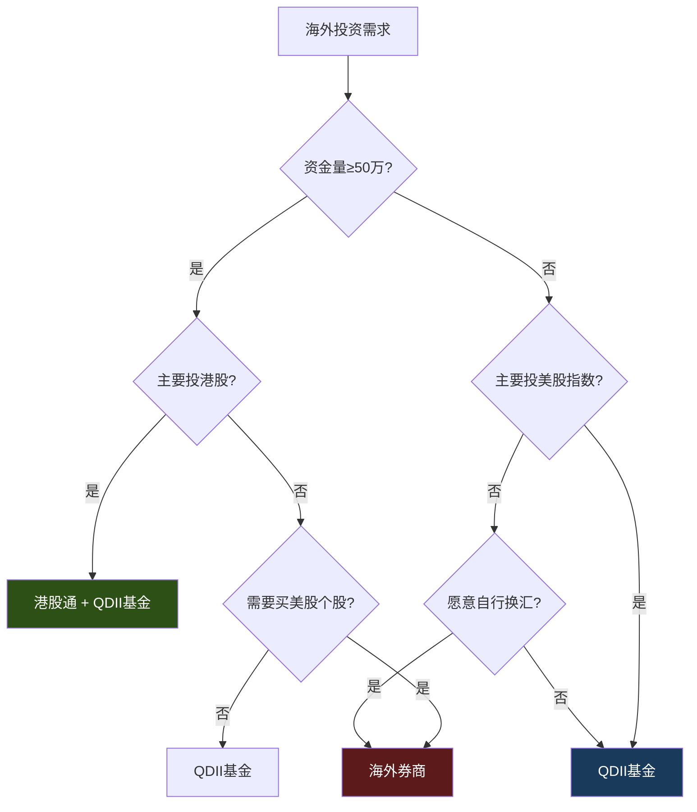

## 案例八：海外投资工具实践

> 本案例以一位真实投资者的海外投资全流程为主线，覆盖渠道选择、账户开设、资产配置、建仓执行、税务规划、汇率管理、风险控制与工具体系搭建，帮助读者从零开始建立完整的海外投资能力。

### 案例背景

老赵，40岁，某互联网公司中层管理者，税后年收入约60万，家庭总资产约250万（含房产）。投资组合长期集中于A股和房产，2024年底A股回调让他的账户缩水15%。这次经历让他意识到单一市场的脆弱性——当A股整体下跌时，几乎没有资产能对冲。

**初始状态**：

| 维度 | 现状 |
|------|------|
| 可投资金额 | 50万（占总资产20%） |
| 海外投资经验 | 零 |
| 风险偏好 | 中等偏保守 |
| 投资目标 | 分散单一市场风险，获取全球经济增长红利 |
| 关注市场 | 美股、港股、越南/印度等新兴市场 |
| 投资期限 | 3-5年以上 |

**老赵的核心诉求**：

1. 不把鸡蛋放在一个篮子里——A股+房产已经过度集中于中国资产
2. 分享全球科技革命的红利——苹果、微软、英伟达这些公司只能在美股买到
3. 新兴市场的高增长机会——越南、印度的人口红利类似20年前的中国
4. 港股的独特标的——腾讯、美团等中国互联网龙头在港股上市

**为什么海外配置不是"有钱人的专利"**：

很多人认为海外投资门槛高、风险大、操作复杂。事实上，QDII基金10元起投，港股通50万门槛可以通过资产归集达标，海外券商无硬性资金门槛。真正的门槛不是钱，而是认知——理解不同市场的运作规则、税务体系和风险管理方法。本案例的意义在于：用一个普通中产的真实经历，证明海外投资是可学习、可执行、可复制的。

### 合规与法律框架

在讨论具体操作之前，必须先厘清合规边界。海外投资涉及中国的外汇管理法规、证券法以及投资目的地的法律体系，任何违规操作都可能带来严重的法律后果。

#### 中国大陆居民海外投资的法律基础

| 法规/政策 | 核心内容 | 对个人投资者的影响 |
|-----------|----------|-------------------|
| 《个人外汇管理办法》（2007年） | 个人年度购汇额度5万美元 | 每年最多换5万美元等值外币，不得用于境外证券投资（资本项目） |
| 《合格境内机构投资者(QDII)管理办法》 | 允许基金公司等机构代客投资海外 | 个人通过QDII基金间接投资海外，不受5万美元限制 |
| 《沪港通/深港通业务实施办法》 | 允许境内投资者通过本地券商买卖港股通标的 | 资金闭环运作，不涉及个人跨境汇款 |
| 《外汇管理条例》 | 禁止非法跨境资金转移 | 通过地下钱庄、虚假贸易等方式转移资金属违法行为 |

**合规要点澄清**：

1. **QDII基金不受5万美元限制**：投资者通过QDII基金投资海外，资金由基金公司统一换汇，不占用个人购汇额度。这是大多数普通投资者出海的合规通道
2. **港股通资金闭环**：通过港股通买卖港股，资金在境内券商账户内结算，由中国结算统一换汇，不涉及个人跨境汇款
3. **海外券商入金的灰色地带**：个人通过银行电汇向海外券商入金，严格来说属于"资本项目"支出，超出经常项目（旅游、留学等）范畴。实际操作中，小额汇款（单次不超过5万美元）通常不会被严格审查，但存在政策收紧的风险
4. **收益汇回的税务义务**：海外投资收益汇回中国时，理论上需要申报并缴纳个人所得税（详见税务规划章节）

**老赵的合规策略**：

- 核心仓位（65%）通过QDII基金和港股通配置，完全合规
- 卫星仓位（15%）通过海外券商配置美股个股，控制在年度5万美元换汇限额内
- 保留完整的换汇和交易记录，以备未来政策变化时举证

### 海外投资渠道全景

#### 四大主流渠道对比

中国大陆居民投资海外市场，合法合规的渠道主要有四种。每种渠道的门槛、产品种类、费用结构和适用场景差异显著：

| 渠道 | 资金门槛 | 可投产品 | 综合费率 | 汇兑方式 | 最佳用途 |
|------|----------|----------|----------|----------|----------|
| 港股通 | 50万（20日日均） | 港股通标的（约500只） | 交易额0.4-0.5% | 自动换汇（中国结算） | 投资港股大盘蓝筹 |
| QDII基金 | 10元起 | 海外指数/主题基金 | 管理费0.5-1.5%/年 | 基金公司代换汇 | 美股指数配置、全球分散 |
| 海外券商 | 无硬性门槛 | 美股/港股/全球股票 | 佣金极低（$0-$1/笔） | 自行换汇+跨境汇款 | 美股个股/期权/ETF |
| 互认基金 | 100元起 | 香港注册的公募基金 | 管理费0.5-1.5%/年 | 基金公司代换汇 | 补充QDII额度不足 |

**渠道选择决策树**：



#### 港股通深度解析

港股通是老赵投资港股的首选渠道，因为它不需要跨境汇款，资金在境内券商账户内闭环运作。

**开户条件详解**：

1. **资产门槛**：证券账户+资金账户内资产（含股票市值）≥50万，需连续20个交易日日均达标。注意：融资融券的负债部分不计入，但持仓市值计入。如果暂时不达标，可以通过转入资金、卖出其他理财产品归集资产
2. **知识测试**：通过券商App内的港股通知识测试（20道选择题，80分及格，可多次重考）。题目覆盖港股通交易规则、交收机制、风险提示等，难度不高，建议提前阅读券商提供的港股通投资者手册
3. **协议签署**：签署《港股通交易风险揭示书》和《港股通委托协议》
4. **时间**：线上办理，T+1生效

**港股通交易成本完整计算**：

港股通的费用结构比A股复杂，涉及港交所、香港政府、中国结算等多个收费主体。很多人只关注佣金，忽略了隐性成本：

```python
def calculate_hk_connect_cost(trade_amount_hkd, commission_rate=0.0003):
    """
    港股通交易成本完整计算器
    trade_amount_hkd: 交易金额（港币）
    """
    costs = {
        # 券商端费用
        "券商佣金": trade_amount_hkd * commission_rate,       # 万三（可协商）
        
        # 港交所/政府费用
        "印花税": trade_amount_hkd * 0.0013,                 # 0.13%（2024年起，向上取整到1元）
        "交易征费": trade_amount_hkd * 0.000027,             # 0.0027%
        "交易费": trade_amount_hkd * 0.0000565,              # 0.00565%
        "过户费": 2.5,                                        # 每手2.5港币（固定）
        
        # 结算费用
        "股份交收费": max(trade_amount_hkd * 0.00002, 2),    # 0.002%，最低2港币
        "组合费": trade_amount_hkd * 0.00002,                # 0.002%（中央结算）
        
        # 汇兑成本
        "换汇点差": trade_amount_hkd * 0.003,                # 约0.3%（中国结算换汇）
    }
    
    total_cost = sum(costs.values())
    cost_ratio = total_cost / trade_amount_hkd
    
    # 对比A股同金额交易
    a_share_cost = trade_amount_hkd * (0.0003 + 0.001 + 0.00002 + 0.00002)  # 佣金+印花税+征费+过户
    
    return {
        "各项费用": {k: round(v, 2) for k, v in costs.items()},
        "总成本": round(total_cost, 2),
        "成本比例": f"{cost_ratio*100:.3f}%",
        "对比A股": f"港股通比A股贵约{(cost_ratio - 0.00134)*100:.2f}个百分点"
    }

# 示例：买入10万港币的腾讯
result = calculate_hk_connect_cost(100000)
# 总成本约497港币（约0.497%）
# 比A股贵约0.36个百分点，主要是换汇点差和印花税差异
```

**港股通的重要限制**：

| 限制项 | 说明 | 应对策略 |
|--------|------|----------|
| 交易日历 | 仅A股和港股同时开市的日子可交易 | 注意两地假期差异，提前查看交易日历 |
| 交易时间 | 9:30-12:00, 13:00-16:00（港股时段） | 9:00-9:30可竞价下单 |
| 标的限制 | 仅恒生综合大中型股+A+H股 | 小盘股需通过海外券商 |
| 涨跌停 | 无涨跌幅限制 | 使用限价单，设置止损 |
| 结算周期 | T+2（港股标准） | 资金到账比A股慢一天 |
| 红利税 | 通过中国结算代扣20%红利税 | H股有税收协定优惠 |

**港股通红利税的坑**：这是很多人忽略的重大成本。通过港股通持有港股，红利税率为20%（中国结算代扣）。但如果直接通过香港券商持有同一股票，内地个人投资者红利税也是20%。然而对于H股（在港上市的内地公司），如果通过港股通持有，红利税可能高达28%（因为中国结算无法享受税收协定优惠）。这是港股通的隐性成本之一。

#### 海外券商开户全流程

对于想直接投资美股个股的老赵，海外券商是必须的。以下以富途证券为例，完整走一遍开户流程：

**券商选择决策要素**：

| 券商 | 监管机构 | 美股佣金 | 港股佣金 | 开户门槛 | 入金方式 | 中文支持 | 适合人群 |
|------|----------|----------|----------|----------|----------|----------|----------|
| 盈透证券(IB) | 美国SEC/FINRA | $0.005/股（$1起） | 0.08%（18港币起） | 无 | 银行电汇 | 一般 | 专业投资者、全球配置 |
| 富途证券 | 香港SFC | $0/笔（免佣） | 0.03%（3港币起） | 无 | 银行转账/edda | 优秀 | 美股新手、中文用户 |
| 老虎证券 | 美国SEC | $0.003/股（$1.99起） | 0.06%（15港币起） | 无 | 银行转账 | 优秀 | 社区活跃、跟单需求 |
| 嘉信理财 | 美国SEC/FINRA | $0/笔 | N/A | 无 | 银行电汇 | 一般 | 纯美股长期持有 |
| 长桥证券 | 香港SFC | $0/笔 | 0.03%（3港币起） | 无 | 银行转账/edda | 优秀 | 低佣美股+港股 |

**券商选择的核心考量**：

选择海外券商不能只看佣金。以下是老赵实际调研后总结的优先级排序：

1. **监管牌照**：优先选择持有多地牌照的券商（如盈透同时持有美国SEC和英国FCA牌照）。持牌券商受监管机构监督，客户资产隔离存放，即使券商破产，客户资产也有保护
2. **资金安全**：确认券商是否实行客户资产隔离制度。美国券商通常受SIPC保护（每位客户最高50万美元证券+25万美元现金）；香港券商受投资者赔偿基金保护（最高50万港币）
3. **出入金便利性**：入金速度和手续费直接影响操作体验。富途支持eDDA快捷入金（需香港银行卡），资金实时到账；银行电汇通常需要1-3个工作日
4. **交易平台稳定性**：美股交易量大、波动剧烈时，平台是否会出现卡顿或崩溃。富途和盈透在2024年多次美股暴跌中表现稳定

**富途证券开户实操步骤**：

```markdown
# 富途证券开户全流程（约3-5个工作日）

## 第一步：准备材料
- 本人有效身份证（正反面照片）
- 内地银行卡（用于身份验证，不用于出入金）
- 手机号码（接收验证码）
- 地址证明（水电煤账单或银行对账单，3个月内）

## 第二步：线上申请（30分钟）
1. 下载"富途牛牛"App 或访问 futunn.com
2. 选择"开户" → "香港账户"
3. 填写个人信息（姓名、身份证号、职业、收入等）
4. 上传身份证正反面照片
5. 进行人脸识别验证
6. 填写投资经验和风险承受能力问卷
7. 签署开户协议和风险揭示书
8. 提交申请

## 第三步：等待审核（1-3个工作日）
- 收到短信/App通知审核通过
- 获取证券账户号码

## 第四步：入金（首次建议5万港币以上）
方式一：银行转账（推荐）
  - 在富途App获取收款银行信息
  - 通过内地银行购汇（港币）→ 跨境汇款到富途指定银行账户
  - 汇款备注填写证券账号
  - 到账时间：1-3个工作日

方式二：eDDA快捷入金（需香港银行卡）
  - 绑定香港银行卡
  - 实时到账

方式三：FPS转数快（需香港银行卡）
  - 免手续费
  - 即时到账

## 第五步：填写W-8BEN表格（必做！）
- 开户后App会提示填写W-8BEN表格
- 这是非美国居民享受美国税收优惠的关键表格
- 不填：美股红利预扣税30%
- 填了：美股红利预扣税降至10%（中美税收协定）
- 有效期3年，到期需重新填写
```

**W-8BEN表格的重要性**：这是海外投资中最容易被忽略的税务文件。作为中国税务居民，填写W-8BEN后可享受中美税收协定的优惠税率：美股分红的预扣税从30%降至10%。以持有10万美元苹果股票为例，年分红约0.5%（500美元），不填W-8BEN多扣150美元/年。对于长期持有高分红股的投资者，这个差异会随时间累积成可观的金额。

#### 互认基金：被忽视的出海通道

互认基金是内地与香港基金互认安排下的产品，允许香港注册的公募基金在内地销售（反之亦然）。对内地投资者而言，互认基金是QDII基金的重要补充，尤其在QDII额度紧张时。

**互认基金 vs QDII基金对比**：

| 维度 | 互认基金 | QDII基金 |
|------|----------|----------|
| 额度来源 | 基金规模的50%（北上） | 外汇局批给基金公司的QDII额度 |
| 额度充足度 | 通常较充足 | 热门基金常限购 |
| 产品类型 | 香港市场的股票/债券/混合基金 | 以指数基金为主，主动管理型少 |
| 费率 | 管理费0.5-1.5%，可能有申购费 | 管理费0.5-1.5%，申购费常打折 |
| 购买渠道 | 天天基金、银行等 | 天天基金、支付宝等 |
| 信息披露 | 按香港标准，可能无中文季报 | 按内地标准，中文披露 |

**代表性的互认基金**：

- **摩根亚洲总收益债券基金**：投资亚洲债券市场，年化收益4-6%，波动较小，适合作为海外债券配置
- **惠理价值基金**：由香港知名价值投资机构惠理集团管理，聚焦大中华区股票
- **行健宏扬中国基金**：投资A股和港股，由行健资产管理管理

**互认基金的购买注意点**：

1. 互认基金的份额分为"人民币份额"和"美元/港币份额"。人民币份额自动换汇，但可能存在换汇点差；美元份额需要用外币购买
2. 赎回时间通常为T+5至T+10，比QDII基金更慢
3. 互认基金不占用QDII额度，但有自己的销售比例限制（北上基金的内地销售规模不超过基金总资产的50%）

#### QDII基金深度选择

QDII（Qualified Domestic Institutional Investor，合格境内机构投资者）基金是大多数普通投资者出海的最便捷通道——不需要换汇、不需要海外账户、没有50万门槛。

**QDII基金的优势与劣势**：

| 维度 | 优势 | 劣势 |
|------|------|------|
| 门槛 | 10元起投，人人可参与 | 额度有限，热门基金常限购 |
| 操作 | 在天天基金/支付宝等平台直接买 | 无法买个股，只能买指数/主题 |
| 费用 | 不需要自行换汇 | 管理费+托管费年化0.5-1.5% |
| 税务 | 基金公司处理 | 分红需缴个人所得税 |
| 时效 | 分散投资一步到位 | 申购赎回T+2至T+10不等 |

**精选QDII基金对比**：

| 基金类型 | 代表基金 | 跟踪标的 | 年费率 | 跟踪误差 | 适合场景 |
|----------|----------|----------|--------|----------|----------|
| 美股标普500 | 博时标普500ETF联接A | S&P 500 | 0.85% | 0.3%以内 | 美股大盘配置 |
| 纳斯达克100 | 广发纳斯达克100ETF联接A | NASDAQ 100 | 0.80% | 0.4%以内 | 科技成长股 |
| 全球股票 | 南方全球精选配置 | 全球分散 | 1.20% | N/A | 一键全球配置 |
| 恒生科技 | 华夏恒生科技ETF | 恒生科技指数 | 0.80% | 0.5%以内 | 中国科技龙头 |
| 越南市场 | 天弘越南市场A | 越南VN30 | 1.50% | 1.0%以内 | 新兴市场高增长 |
| 印度市场 | 工银印度基金LOF | 印度NIFTY50 | 1.50% | 1.2%以内 | 人口红利 |
| 全球债券 | 易方达中短期美元债A | 中短久期美元债 | 0.60% | N/A | 降低组合波动 |
| 黄金 | 华安黄金ETF联接A | 黄金现货 | 0.60% | 0.2%以内 | 避险/抗通胀 |

**QDII基金的三个坑**：

1. **额度限购**：QDII基金有外汇额度限制，牛市时热门基金经常暂停申购或限制大额申购。应对：同时备选2-3只同类基金，建立"备选清单"
2. **溢价风险**：QDII-ETF在二级市场交易时，可能因供不应求出现10%甚至20%以上的溢价。此时买入等于多付了溢价部分。应对：关注溢折价率，溢价超过2%时暂停买入，改用场外申购
3. **汇率损益**：QDII基金的净值包含了汇率波动。人民币升值期间，基金净值会因汇率损失而跑输标的指数。这不是基金本身的问题，而是汇率对冲的自然结果

**QDII基金筛选的四步法**：

```python
def evaluate_qdii_fund(fund_info):
    """
    QDII基金评估框架
    """
    score = 0
    details = []
    
    # 第一步：跟踪误差（指数基金核心指标）
    if fund_info["跟踪误差"] < 0.5:
        score += 25
        details.append("跟踪误差优秀(<0.5%)")
    elif fund_info["跟踪误差"] < 1.0:
        score += 15
        details.append("跟踪误差可接受")
    else:
        details.append("跟踪误差偏大，可能有额外风险")
    
    # 第二步：费率（长期持有费率影响巨大）
    if fund_info["综合费率"] < 0.8:
        score += 25
        details.append("费率较低")
    elif fund_info["综合费率"] < 1.2:
        score += 15
        details.append("费率中等")
    else:
        score += 5
        details.append("费率偏高，需评估超额收益能否覆盖")
    
    # 第三步：规模（太小有清盘风险，太大可能影响跟踪效果）
    if 1e8 < fund_info["规模"] < 1e11:
        score += 25
        details.append("规模适中")
    elif fund_info["规模"] < 1e8:
        score += 5
        details.append("规模偏小，有清盘风险")
    else:
        score += 15
        details.append("规模较大，注意跟踪效果")
    
    # 第四步：限购状态
    if not fund_info.get("限购", False):
        score += 25
        details.append("无限购，可正常申购")
    else:
        score += 10
        details.append("限购中，需关注额度恢复时间")
    
    return {"总分": score, "评级": "优秀" if score >= 80 else "良好" if score >= 60 else "一般", "详情": details}
```

### 资产配置方案设计

#### 配置理念

老赵的海外配置遵循三个原则：

1. **核心-卫星策略**：70%配置宽基指数（核心），30%配置行业/地区主题（卫星）。核心仓位追求市场平均收益，卫星仓位追求超额收益
2. **发达+新兴搭配**：美股港股（发达市场）占70%，越南印度（新兴市场）占30%。发达市场提供稳定性，新兴市场提供增长弹性
3. **股债平衡**：股票80%+债券20%，降低组合波动。债券在股市下跌时提供缓冲，同时美元债本身也是美元资产配置

**为什么选择这个比例而不是其他比例**：

老赵最初考虑过50%美股+50%港股的方案，但这样做的问题是：港股和A股的相关性较高（同为中国资产），分散效果有限。最终采用的方案将美股提高到40%，是为了增加与A股低相关性的资产比例。全球债券只占10%，是因为老赵的A股组合中已有大量低风险资产（银行理财、货币基金），海外配置可以更偏进攻性。

#### 最终配置方案

```python
# 老赵的海外资产配置方案（总投入50万元人民币）
portfolio = {
    "美股市场（40%，20万）": {
        "标普500指数基金": {"金额": 100000, "工具": "博时标普500ETF联接(QDII)", "目的": "美股大盘底仓"},
        "纳斯达克100基金": {"金额": 50000,  "工具": "广发纳斯达克100ETF联接(QDII)", "目的": "科技成长"},
        "苹果个股":         {"金额": 25000,  "工具": "富途证券", "目的": "核心个股"},
        "微软个股":         {"金额": 25000,  "工具": "富途证券", "目的": "核心个股"},
    },
    "港股市场（30%，15万）": {
        "腾讯控股": {"金额": 50000, "工具": "港股通", "目的": "互联网龙头"},
        "美团":     {"金额": 30000, "工具": "港股通", "目的": "消费科技"},
        "汇丰控股": {"金额": 30000, "工具": "港股通", "目的": "金融对冲"},
        "港交所":   {"金额": 40000, "工具": "港股通", "目的": "交易所龙头"},
    },
    "新兴市场（20%，10万）": {
        "越南市场基金": {"金额": 50000, "工具": "天弘越南市场A(QDII)", "目的": "制造业转移红利"},
        "印度市场基金": {"金额": 50000, "工具": "工银印度基金LOF(QDII)", "目的": "人口红利"},
    },
    "全球债券（10%，5万）": {
        "中短期美元债": {"金额": 50000, "工具": "易方达中短期美元债A(QDII)", "目的": "降低波动+美元资产"},
    },
}

# 配置逻辑说明
# - 美股40%：全球市值最大的市场，科技巨头集中地
# - 港股30%：中国优质资产在海外的定价市场，估值通常低于A股
# - 新兴市场20%：高增长潜力，但波动大，控制比例
# - 全球债券10%：负相关资产，股市下跌时提供缓冲
```

**配置的多元化维度分析**：

| 维度 | 分散情况 | 说明 |
|------|----------|------|
| 地区 | 美国40%+中国30%+越南10%+印度10%+全球10% | 避免单一国家风险 |
| 货币 | 美元50%+港币40%+越南盾5%+印度卢比5% | 多币种对冲汇率 |
| 行业 | 科技35%+金融15%+消费10%+综合40% | 行业分散 |
| 资产类别 | 股票90%+债券10% | 股债平衡 |
| 投资工具 | QDII 55%+港股通30%+海外券商15% | 渠道分散 |

**与"全球股市"的相关性分析**：

老赵的配置与A股（沪深300）的相关系数约0.35，这意味着当A股下跌时，海外组合大概率不会同步下跌——这正是"不把鸡蛋放在一个篮子里"的数学体现。相比之下，如果全部配置港股，与A股的相关系数可能高达0.7以上，分散效果大打折扣。

### 执行过程

#### 第1阶段：账户准备（第1-2周）

**港股通开通**：

老赵原本的A股券商是华泰证券。开通港股通的步骤：
1. 打开华泰"涨乐财富通"App → 业务办理 → 港股通
2. 系统自动校验20日日均资产是否≥50万（老赵刚好达标）
3. 在线完成港股通知识测试（题目不难，提前看一遍港股通规则即可，80分及格）
4. 签署电子协议，T+1生效

**富途证券开户**：

按前述流程完成开户。关键注意点：
- 入金时银行汇款备注必须填写证券账号
- 首次入金建议5万港币以上，避免频繁小额汇款产生手续费
- 开户后第一时间填写W-8BEN表格

**QDII基金准备**：

在天天基金App注册并完成风险测评。老赵设置了两只基金的自动定投：
- 博时标普500ETF联接：每周一自动扣款2000元
- 广发纳斯达克100ETF联接：每周一自动扣款1000元

#### 第2阶段：分批建仓（第1-9周）

一次性投入50万的风险在于可能买在阶段高点。老赵采用分批建仓策略，每2周投入约10万：

```python
def batch_invest_plan(total_amount, batch_count, interval_days):
    """
    分批建仓策略生成器
    total_amount: 总投入金额
    batch_count: 分批次数
    interval_days: 每批间隔天数
    """
    batch_amount = total_amount / batch_count
    
    plan = []
    for i in range(batch_count):
        day = i * interval_days
        plan.append({
            "批次": i + 1,
            "金额": f"¥{batch_amount:,.0f}",
            "建仓日": f"第{day}天",
            "累计投入": f"¥{batch_amount * (i + 1):,.0f}",
            "投入进度": f"{(i + 1) / batch_count * 100:.0f}%"
        })
    return plan

# 50万分5批，每批10万，间隔14天
plan = batch_invest_plan(500000, 5, 14)
```

**实际建仓记录**：

| 批次 | 时间 | 买入标的 | 金额 | 汇率(USD/CNY) | 备注 |
|------|------|----------|------|---------------|------|
| 1 | 第1周 | 标普500基金(2万)+腾讯(5万)+越南基金(3万) | 10万 | 6.85 | 先建底仓 |
| 2 | 第3周 | 纳指基金(1.5万)+美团(3万)+印度基金(2万)+微软(1.5万) | 8万 | 6.82 | 科技+新兴 |
| 3 | 第5周 | 苹果(2.5万)+越南基金(2万)+腾讯(加仓2万)+港交所(2万) | 8.5万 | 6.88 | 加仓核心 |
| 4 | 第7周 | 标普基金(加仓3万)+汇丰(3万)+纳指(加仓1.5万) | 7.5万 | 6.90 | 均衡配置 |
| 5 | 第9周 | 标普(加仓5万)+全球债券基金(5万)+港交所(加仓2万) | 12万 | 6.86 | 补齐比例 |

**建仓过程中的关键决策**：

1. **第3周美股大跌3%**：老赵原计划犹豫是否暂停，最终决定按计划执行。事后证明这是个正确决策——那次下跌恰好是阶段性底部。纪律性执行的价值在于：它消除了情绪化决策的干扰
2. **第5周港股通腾讯突破前高**：没有追涨，改为先建仓苹果和越南基金。这体现了"买跌不买涨"的纪律
3. **第7周人民币小幅升值**：汇率从6.88降到6.90，意味着换汇成本略增，但幅度可控。分批换汇的优势在此体现——汇率波动被摊平了

#### 第3阶段：持有与再平衡（持续进行）

建仓完成后，进入长期持有阶段。海外投资比A股更需要耐心——因为信息差、时差、汇率波动都增加了焦虑感。

**定期检视体系**：

```text
每月检视（约1小时）
├── 检查各持仓市值变化（富途+港股通+天天基金三个平台）
├── 对标业绩基准：MSCI全球指数、恒生指数、沪深300
├── 阅读持仓公司季报/重大新闻
├── 检查QDII基金是否有限购/暂停申购通知
└── 更新投资记录表

每季度检视（约半天）
├── 计算各市场/资产类别的实际配比
├── 与目标配比对比，偏离超过5%则触发再平衡
├── 评估汇率变动对组合的影响
├── 检查W-8BEN是否即将过期
├── 评估是否需要调整新兴市场仓位
└── 复盘本季度交易决策

每年检视（约1天）
├── 整体收益归因分析（个股贡献+汇率贡献+择时贡献）
├── 税务筹划（是否有需要申报的境外收入）
├── 评估是否需要增减市场（如新兴市场泡沫化则减仓）
├── 更新投资政策声明（IPS）
└── 评估工具和渠道是否需要更换
```

**再平衡策略**：

当任一资产类别的实际配比偏离目标配比超过5个百分点时，触发再平衡。再平衡的本质是"卖出涨多的、买入涨少的"，这在心理上很难执行（因为你在卖出赚钱的资产），但长期来看它能系统性地实现"高抛低吸"。

```python
def check_rebalance(portfolio_target, portfolio_actual, threshold=0.05):
    """
    检查是否需要再平衡
    portfolio_target: 目标配比 {"美股": 0.40, "港股": 0.30, ...}
    portfolio_actual: 实际配比
    threshold: 偏离阈值（默认5%）
    """
    rebalance_needed = {}
    for asset, target in portfolio_target.items():
        actual = portfolio_actual.get(asset, 0)
        deviation = abs(actual - target)
        if deviation > threshold:
            rebalance_needed[asset] = {
                "目标": f"{target*100:.0f}%",
                "实际": f"{actual*100:.1f}%",
                "偏离": f"{deviation*100:.1f}%",
                "操作": "减仓" if actual > target else "加仓"
            }
    return rebalance_needed if rebalance_needed else "无需再平衡"

# 示例：6个月后实际配比
target = {"美股": 0.40, "港股": 0.30, "新兴市场": 0.20, "全球债券": 0.10}
actual = {"美股": 0.45, "港股": 0.28, "新兴市场": 0.18, "全球债券": 0.09}
# 结果：美股偏离5%，触发减仓信号
```

**再平衡的实操技巧**：

1. **优先用新增资金再平衡**：卖出会产生交易成本和可能的税务事件。如果有新的闲置资金，直接买入低配资产比卖出高配资产更优
2. **利用QDII基金的定投修改**：如果美股配比过高，可以暂停美股QDII的定投，增加其他市场的定投金额，用时间换空间
3. **避免频繁再平衡**：5%的阈值不是死规定。如果美股涨到46%是因为AI行业持续向好，可以适当放宽到8%。但如果偏离是因为某个市场暴跌（如新兴市场从20%跌到12%），需要警惕是否应该减仓而非加仓

### 税务规划

海外投资的税务问题是大多数投资者最容易忽略、也最容易踩坑的领域。中国税务居民投资海外资产，涉及中国税法、投资目的地税法、以及双边税收协定三个层面。

#### 税务全景

| 收入类型 | 中国税务处理 | 美国预扣税 | 香港处理 | 实际税负 |
|----------|-------------|-----------|----------|----------|
| 美股分红 | 个税20%（理论上） | 10%（W-8BEN） | N/A | 10%（已缴美国部分可抵免） |
| 美股资本利得 | 个税20%（理论上） | 0% | N/A | 理论20%，实际执行宽松 |
| 港股分红（港股通） | 个税20%（中国结算代扣） | N/A | 无 | 20% |
| 港股资本利得 | 个税20%（理论上） | N/A | 无 | 理论20%，实际执行宽松 |
| QDII基金分红 | 个税20%（基金代扣） | N/A | N/A | 20% |
| QDII基金赎回收益 | 免个税（目前政策） | N/A | N/A | 0% |

**关键税务知识点**：

1. **美股红利税**：中国居民持有美股，分红需缴纳10%的美国预扣税（填写W-8BEN后适用中美税收协定税率，不填则为30%）。这笔税在分红时直接扣除，无需自行申报
2. **资本利得税**：中国税法理论上对境外资本利得征收20%个税，但实际操作中，对于个人通过海外券商获得的股票买卖差价，目前并无强制申报和征管机制。这不意味着免税，而是征管尚未到位。随着CRS（共同申报准则）的推进，未来政策可能收紧
3. **港股通红利税**：中国结算在发放红利时代扣20%个人所得税。对于H股，由于无法享受税收协定优惠，红利税可能更高（最高28%）
4. **QDII基金税务**：基金分红时扣缴20%个税，但基金赎回产生的资本利得目前暂免个税。这是QDII基金相对于直接持有海外股票的一个税务优势

**CRS与海外资产申报**：

CRS（Common Reporting Standard，共同申报准则）是OECD推动的全球税务信息自动交换机制。中国已于2018年9月首次与其他CRS参与国交换税务信息。这意味着：

- 中国税务机关可以获取中国税务居民在海外金融机构的账户信息（包括余额、利息、股息等）
- 目前主要用于信息收集，尚未大规模用于个人征管
- 但未来政策收紧的可能性存在，建议保留完整的海外投资记录

**税务筹划建议**：

- 优先使用QDII基金获取海外收益（赎回收益暂免个税）
- 美股务必填写W-8BEN（预扣税从30%降至10%）
- 高分红股票（如汇丰控股）考虑放在QDII基金中持有，而非直接持有
- 资本利得暂时无需主动申报，但保留完整交易记录以备未来政策变化
- 每年导出各平台的年度对账单，建立个人税务档案

### 汇率风险管理

汇率是海外投资中绕不开的变量。同样的美股涨幅，人民币升值时收益被"吃掉"，贬值时收益被"放大"。

#### 汇率影响量化分析

```python
def calculate_currency_impact(investment_return, exchange_rate_change):
    """
    计算汇率变动对投资收益的影响
    
    investment_return: 以外币计价的投资收益率（如美股涨15%则为0.15）
    exchange_rate_change: USD/CNY汇率变动率
        - 正数 = 美元升值/人民币贬值（如+0.02表示美元升值2%）
        - 负数 = 美元贬值/人民币升值（如-0.02表示人民币升值2%）
    
    公式：本币总收益 = (1 + 外币收益) × (1 + 汇率变动) - 1
    
    原理：你用人民币换美元投资，再换回人民币。
    如果美元升值（exchange_rate_change > 0），换回的人民币更多，收益被放大。
    如果人民币升值（exchange_rate_change < 0），换回的人民币更少，收益被削弱。
    """
    total_return = (1 + investment_return) * (1 + exchange_rate_change) - 1
    currency_contribution = total_return - investment_return
    
    if exchange_rate_change > 0:
        currency_desc = f"+{exchange_rate_change*100:.1f}%(美元升值/人民币贬值)"
    elif exchange_rate_change < 0:
        currency_desc = f"{exchange_rate_change*100:.1f}%(美元贬值/人民币升值)"
    else:
        currency_desc = "0%(汇率不变)"
    
    return {
        "外币收益率": f"{investment_return*100:.1f}%",
        "汇率变动": currency_desc,
        "本币总收益": f"{total_return*100:.1f}%",
        "汇率贡献": f"{currency_contribution*100:+.1f}%",
    }

# 场景1：美股涨15%，人民币升值2%（收益被削弱）
print(calculate_currency_impact(0.15, -0.02))
# 外币收益15.0%，本币总收益12.7%，汇率贡献-2.3%

# 场景2：美股涨15%，人民币贬值3%（收益被放大）
print(calculate_currency_impact(0.15, 0.03))
# 外币收益15.0%，本币总收益18.5%，汇率贡献+3.5%

# 场景3：美股跌5%，人民币贬值3%（美元升值部分抵消股票损失）
print(calculate_currency_impact(-0.05, 0.03))
# 外币收益-5.0%，本币总收益-2.2%，汇率贡献+2.9%

# 场景4：美股跌5%，人民币升值2%（人民币升值放大损失）
print(calculate_currency_impact(-0.05, -0.02))
# 外币收益-5.0%，本币总收益-6.9%，汇率贡献-1.9%
```

**汇率影响的四象限矩阵**：

|  | 美股上涨 | 美股下跌 |
|--|----------|----------|
| **人民币贬值（美元升值）** | 收益被放大（双赢） | 损失被对冲（缓冲） |
| **人民币升值（美元贬值）** | 收益被削弱（可惜） | 损失被放大（双杀） |

这个矩阵揭示了一个重要规律：人民币贬值对海外投资者有利（无论涨跌），人民币升值则不利。因此，海外投资本质上也是一笔"做空人民币"的仓位——如果你看好人民币长期稳定或贬值，海外配置的吸引力更大。

#### 汇率对冲策略

| 策略 | 操作方式 | 成本 | 效果 | 适合人群 |
|------|----------|------|------|----------|
| 自然对冲 | 配置多币种资产（美元+港币+新兴市场货币） | 无 | 分散单一货币风险 | 所有投资者 |
| 时机选择 | 人民币强势时换汇，弱势时换回 | 无 | 降低平均换汇成本 | 有择时能力的投资者 |
| 定投均摊 | 通过定期定额投资摊平汇率波动 | 无 | 长期接近平均汇率 | 普通投资者 |
| 货币基金 | 配置美元货币基金 | 0.3%/年 | 锁定美元收益 | 暂时观望的投资者 |
| 远期合约 | 与银行签订远期结汇协议 | 点差1-2% | 锁定未来汇率 | 大资金（50万美元以上） |

**老赵的汇率管理方式**：采用"自然对冲+定投均摊"的组合策略。通过配置美元资产（美股+美元债）和港币资产（港股）各占约一半，不集中于单一外币。同时通过分批建仓和基金定投，将换汇时间分散在9周内，自然摊平了汇率波动。

**汇率焦虑的正确认知**：

很多新手投资者每天盯着USD/CNY汇率，看到人民币升值就焦虑"海外投资亏了"。这种焦虑源于一个认知误区：把短期汇率波动等同于投资损失。实际上：

1. **汇率是均值回归的**：过去20年，USD/CNY在6.0-7.3之间波动，没有单边趋势。短期升值或贬值不代表长期方向
2. **你持有的是资产，不是货币**：你持有的是苹果的股票、腾讯的股票，它们的价值来源于公司盈利能力，不是汇率。汇率只影响你"换回人民币"时的数字
3. **如果你不需要换回人民币**：长期来看，海外资产可以用于海外消费（留学、旅游、购房），汇率波动对你没有实际影响

### 风险管理体系

#### 海外投资特有风险识别

海外投资的风险不仅包含市场风险，还有A股投资不涉及的跨境风险：

| 风险类型 | 具体描述 | 严重程度 | 应对措施 |
|----------|----------|----------|----------|
| 汇率风险 | 人民币升值侵蚀海外收益 | ★★★★ | 多币种配置+定投摊平 |
| 时差风险 | 美股开盘是北京时间21:30 | ★★★ | 使用限价单+止损单 |
| 信息不对称 | 海外公司研报和新闻语言障碍 | ★★★ | 关注Bloomberg/WSJ中文版 |
| 监管差异 | 不同市场的交易规则、停牌规则不同 | ★★ | 开仓前学习目标市场基本规则 |
| 税务复杂 | 跨境税务处理、税收协定适用 | ★★★ | 咨询税务顾问+保留完整记录 |
| 政策风险 | 外汇管制收紧可能影响出入金 | ★★★★ | 不将全部资金转移海外 |
| 平台风险 | 海外券商破产或跑路 | ★★ | 选择持牌券商+了解投资者保护 |
| 流动性风险 | 新兴市场基金可能暂停赎回 | ★★ | 控制新兴市场仓位≤20% |

**时差与交易时间管理**：

```text
主要市场交易时间（北京时间）

美股（夏令时 3月-11月）：
  盘前：16:00-21:30
  正常：21:30-04:00
  盘后：04:00-08:00

美股（冬令时 11月-3月）：
  盘前：17:00-22:30
  正常：22:30-05:00
  盘后：05:00-09:00

港股：
  早盘：09:30-12:00
  午盘：13:00-16:00
  收盘竞价：16:00-16:10

越南股市：
  早盘：09:00-11:30
  午盘：13:00-14:45
```

实操建议：美股交易在开盘后1小时内（北京时间21:30-22:30）下单，流动性最好。如果无法盯盘，提前设好限价单和止损单，避免在盘前盘后流动性差的时段操作。

#### 心理建设：海外投资的情绪管理

海外投资比A股更容易引发焦虑，原因有三：时差导致的"睡着了市场在动"的不安感、信息差导致的"看不懂"的恐惧感、汇率波动导致的"白赚了/白亏了"的错失感。

**老赵的心理管理方法**：

1. **写投资日志**：每次感到焦虑时，写下焦虑的原因和预期。一个月后回头看，会发现大部分焦虑都是多余的。第3周美股大跌3%时老赵想暂停建仓，但翻开日志看到自己写下的"分批建仓就是为了应对波动"，最终按计划执行
2. **设定"不看盘日"**：美股在深夜交易，老赵给自己定了规矩：周一到周三不看美股行情（避免影响睡眠），只在周五收盘后统一查看。大多数短期波动在一周尺度上会被平滑
3. **区分"噪音"和"信号"**：每天的涨跌是噪音，季度财报和行业趋势是信号。老赵只在季度检视时做决策，日常波动不触发任何操作
4. **接受"不完美"**：不可能买在最低点、卖在最高点。第1周建仓后市场跌了2%，第5周建仓后市场涨了3%——这些都是正常的。分批建仓的目的不是优化每一批的价格，而是降低整体的择时风险

#### 仓位管理规则

老赵给自己设定的纪律性规则：

```text
# 海外投资仓位管理规则

1. 单一市场不超过总海外资产的40%
   → 已执行：美股40%（刚好卡线）

2. 单一个股不超过总海外资产的10%
   → 已执行：腾讯10%、苹果5%、微软5%

3. 新兴市场合计不超过总海外资产的25%
   → 已执行：越南10%+印度10%=20%

4. 任何单一持仓浮亏达20%时触发复盘
   → 不是无条件止损，而是重新评估基本面

5. 每季度至少保留10%现金仓位
   → 用于应对突发机会或紧急赎回需求

6. 汇率波动超过5%时评估是否调整配比
   → 人民币大幅贬值时可适当减配美元资产
```

**为什么是"复盘"而不是"止损"**：

很多投资建议说"浮亏20%就止损"，这对个股可能是对的，但对指数基金和蓝筹股来说，20%的回调往往是买入机会而非卖出信号。老赵的规则是"触发复盘"——重新审视持仓逻辑是否改变。如果基本面没变（比如苹果的iPhone销量依然强劲），20%的下跌反而是加仓机会；如果基本面恶化（比如新兴市场出现系统性风险），则考虑减仓。

### 12个月投资成果

**整体表现**：

| 指标 | 数据 | 说明 |
|------|------|------|
| 总投入 | ¥500,000 | 5批分9周完成建仓 |
| 期末市值 | ¥568,000 | 含汇率影响 |
| 总收益 | ¥68,000 | |
| 投资收益率 | 13.6% | 年化 |
| 最大回撤 | -12% | 发生在第6个月美股回调期间 |
| 夏普比率 | 约0.85 | 风险调整后收益尚可 |

**各市场分项表现**：

| 市场 | 投入 | 期末市值 | 收益率 | 主要驱动因素 |
|------|------|----------|--------|-------------|
| 美股 | ¥200,000 | ¥240,000 | +20% | AI热潮推动科技股上涨 |
| 港股 | ¥150,000 | ¥156,000 | +4% | 港股整体估值修复缓慢 |
| 新兴市场 | ¥100,000 | ¥112,000 | +12% | 越南制造业转移受益 |
| 全球债券 | ¥50,000 | ¥52,000 | +4% | 美联储降息预期支撑债市 |

**汇率影响**：

| 项目 | 数据 |
|------|------|
| 建仓期平均汇率 | 6.86 |
| 期末汇率 | 6.76（人民币小幅升值） |
| 汇率对收益的影响 | -1.5% |
| 扣除汇率后收益率 | 12.1% |

汇率在这一年里让老赵损失了约1.5%的收益，但通过多币种配置和分批建仓，这个影响被控制在可接受范围内。如果集中在一个时间点全部换汇，汇率波动的影响可能更大。

**收益归因分析**：

```python
# 收益归因分解
return_attribution = {
    "资产配置贡献": "约8%（分散配置带来稳定收益）",
    "个股选择贡献": "约3%（苹果和微软跑赢指数）",
    "汇率影响": "-1.5%（人民币小幅升值）",
    "再平衡贡献": "约0.5%（第8个月减仓美股锁利）",
    "交易成本": "-0.4%（佣金+汇兑成本）",
    "合计": "约13.6%"
}
```

### 工具体系总览

经过一年实践，老赵建立了以下海外投资工具体系：

```text
老赵的海外投资工具体系
│
├── 交易执行层
│   ├── 华泰证券·港股通（港股蓝筹交易，资金闭环境内）
│   ├── 富途证券（美股个股+ETF，免佣）
│   └── 天天基金App（QDII基金申购/赎回/定投）
│
├── 行情与分析层
│   ├── TradingView（技术分析，免费版够用）
│   ├── 富途牛牛App（港股/美股实时行情）
│   ├── Morningstar晨星（基金评级和筛选）
│   └── 理杏仁（港股估值数据）
│
├── 信息获取层
│   ├── 华尔街见闻App（全球财经资讯，中文）
│   ├── Bloomberg/WSJ（英文原版新闻）
│   ├── 雪球App（海外板块社区讨论）
│   └── Seeking Alpha（美股个股深度分析）
│
├── 汇率与换汇
│   ├── 各银行App（购汇、跨境汇款）
│   ├── XE.com（实时汇率查询）
│   └── 中国结算官网（港股通换汇参考价）
│
├── 税务管理
│   ├── 富途App内W-8BEN表格（美股预扣税优惠）
│   ├── 交易记录导出（各平台年度对账单）
│   └── Excel税务计算表（汇总各市场收益和已缴税款）
│
└── 记录与复盘
    ├── Excel投资记录表（持仓明细、成本价、收益率）
    ├── 投资日志（每季度复盘笔记）
    └── 年度收益归因分析表
```

**工具选择的原则**：

老赵没有追求"最贵最好"的工具，而是遵循"够用即可、免费优先"的原则。TradingView免费版提供足够的技术分析功能；富途免佣降低了交易成本；华尔街见闻中文版解决了信息差问题。工具不是越复杂越好——复杂的工具反而会增加操作失误的概率。

### 经验总结与常见错误

#### 成功关键因素

1. **分批建仓而非一次性投入**：9周分5批建仓，避免了将50万全部投入在第1周的阶段性高点。实际效果：平均买入成本比第1周低约2%
2. **跨市场分散配置**：美股涨20%弥补了港股仅涨4%的遗憾。如果全部投入港股，收益将大幅缩水
3. **纪律性再平衡**：第8个月美股配比涨到46%，触发减仓信号，卖出部分苹果转入债券基金。这次再平衡锁定了部分科技股利润
4. **汇率不焦虑**：人民币升值1.5%只吃掉了约10%的收益。长期来看，汇率波动是均值回归的，不必过度关注
5. **合规操作**：始终在5万美元年度换汇限额内操作，通过QDII基金的自动换汇机制绕过了个人换汇限制

#### 常见错误与纠正

| 错误 | 后果 | 正确做法 |
|------|------|----------|
| 全仓美股 | 错过其他市场的增长，且集中于美元资产 | 发达+新兴+债券分散配置 |
| 忽视W-8BEN | 美股分红多扣20%税（30%→10%的差额） | 开户后第一时间填写 |
| 频繁换仓追热点 | 每次换仓损失0.5%的汇兑成本+交易佣金 | 年换手率控制在50%以内 |
| 溢价买QDII-ETF | 买入时已多付10-20%溢价 | 关注溢折价率，溢价>2%暂停 |
| 忽视QDII限购 | 热门基金突然暂停申购打乱计划 | 备选2-3只同类基金 |
| 不了解港股通红利税 | 实际到手分红比预期少20% | 高分红股通过QDII基金持有 |
| 超额换汇 | 违反外汇管理规定，可能被纳入关注名单 | 个人年度5万美元限额内操作 |
| 不保留交易记录 | 未来税务申报时无法提供成本依据 | 每年导出并备份各平台对账单 |
| 深夜盯盘影响睡眠 | 睡眠质量下降，白天工作效率降低 | 设定"不看盘日"，用限价单和止损单替代盯盘 |
| 跟风买入中概股 | 中概股受政策风险影响大，波动剧烈 | 控制中概股仓位，优先选择港股通标的 |

### 进阶优化方向

经过一年实践，老赵识别出以下可优化方向：

**1. 引入期权策略**（需在富途证券开通期权权限）

持有大量美股头寸后，可以卖出covered call获取额外收入。例如持有100股苹果，可以卖出1张1个月到期、行权价高于当前价10%的call option，收取约1-2%的权利金。即使被行权，也是在盈利10%时卖出，不亏。这个策略的前提是：你愿意在目标价位卖出股票，且持有至少100股（美股期权的最小单位）。

**2. 关注中概股回归港股**

随着中美审计监管合作的推进，部分中概股可能回归港股双重上市。在港股通标的范围内买入这些股票，既享受港股的估值优势，又避免了美股的政策风险。但需要注意：中概股回归港股后，流动性和估值可能与美股有差异。

**3. 建立"全球宏观-行业-个股"三层研究框架**

从全球宏观（美联储政策、地缘政治）到行业趋势（AI、新能源、生物科技）再到个股选择（财务指标、竞争优势），建立系统化的研究框架，减少拍脑袋决策。老赵计划每季度花2天时间做全球宏观分析，每月花半天时间跟踪行业动态，每周花1小时阅读个股研报。

**4. 探索更多新兴市场工具**

随着QDII产品线的丰富，可以关注沙特阿拉伯、巴西、日本等市场的QDII基金，进一步扩大全球配置的广度。日本市场值得关注：日元贬值使日本出口企业受益，日本股市在2024年创历史新高。

**5. 建立海外投资知识库**

老赵计划建立一个个人知识库（可以用Notion或Obsidian），记录每个市场的交易规则、税务政策、历史收益数据、以及自己的投资决策逻辑。这个知识库的价值在于：当市场波动让你焦虑时，翻看过去的记录和分析，可以帮助你做出理性决策。

---

> 海外投资不是简单的"买美股"，而是一套涉及合规框架、渠道选择、资产配置、税务规划、汇率管理、风险控制和心理建设的系统工程。老赵的案例表明：即使是零经验的投资者，只要遵循"合规先行、分批建仓、分散配置、长期持有、纪律再平衡"的原则，也能在一年内建立起运转良好的海外投资体系。关键不是追求最高收益，而是建立可持续的投资框架——让系统替你做决策，让纪律替你对抗情绪。海外投资的本质是用全球化视野对冲单一市场风险，用长期主义对抗短期波动，用系统化方法替代主观判断。
