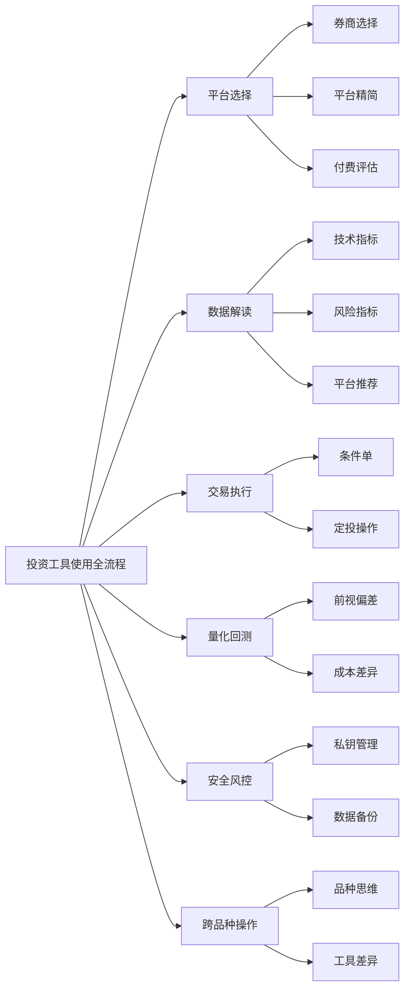
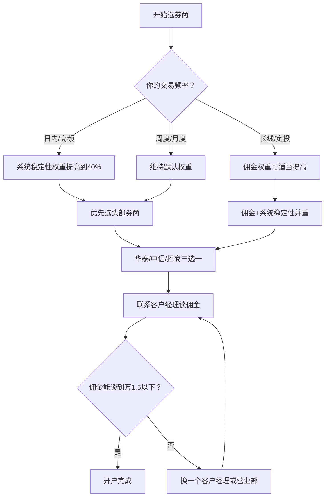
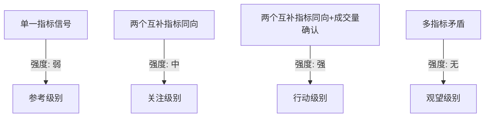
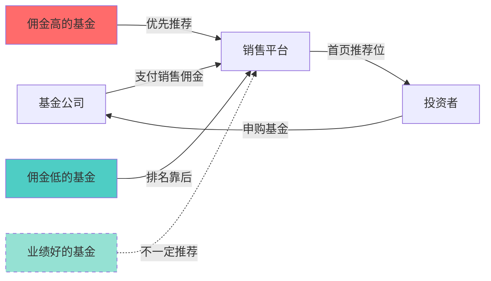
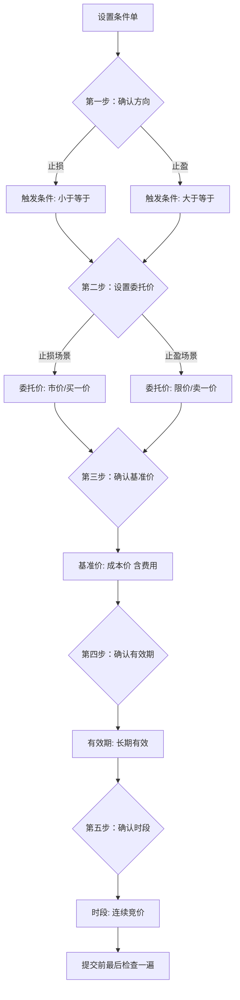
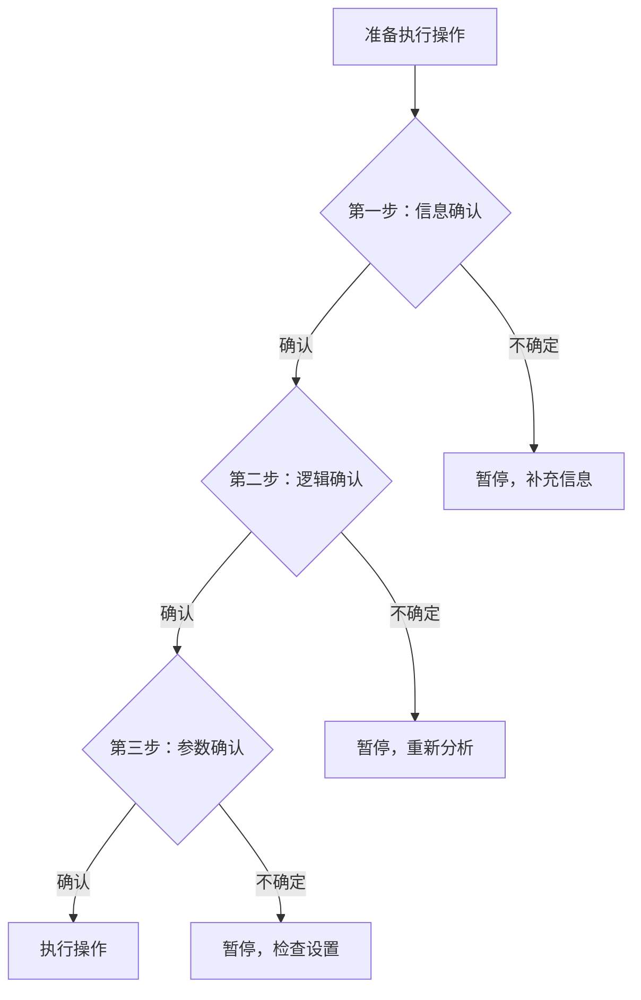
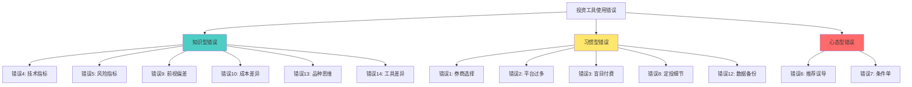

## 投资工具使用常见错误

> **本章定位**：前面的实战案例展示了投资工具的"正确姿势"，但投资者更容易记住的是"踩过的坑"。本文件系统梳理投资工具使用中最常见的**操作级错误**——不是理论层面的认知偏差（那是章节概览§4的内容），而是**你明天打开软件就可能犯的具体错误**。

### 为什么"工具使用错误"值得单独成章

大多数投资亏损归因于"选股不好"或"择时失误"，但有一类隐性亏损常常被忽略——**工具使用不当造成的损失**。这类损失的特点是：

1. **分散且不易察觉**：每次损失可能只有几十到几百元，但日积月累非常可观
2. **完全可避免**：不涉及投资判断，纯粹是操作层面的错误
3. **重复发生率高**：因为不知道自己犯了错，所以会反复犯

根据某券商2023年的内部统计，其客户因"条件单设置错误"导致的额外滑点损失，人均每年约2,400元；因"基金申赎操作不当"产生的额外费用，人均每年约1,800元。这些钱完全可以省下来。

每个错误按**"错误描述→为什么会犯→真实后果→正确做法→自检清单"**五层展开，确保你不仅能识别错误，还能建立预防机制。



---

### 一、平台选择阶段的常见错误

平台选择是投资的"基础设施"，选错了后面所有操作都会受影响。这个阶段的错误特点是：**短期看不出问题，长期持续消耗你**。

#### 错误1：开户时只看佣金，忽略券商综合实力

**错误描述**：很多投资者选择券商的唯一标准是"佣金最低"，花大量时间在网上搜索"万一佣金开户"，却完全不考虑券商的交易系统稳定性、研报质量、客服响应速度和增值服务。

**为什么会犯**：佣金是显性成本，每笔交易都能看到扣了多少。而系统稳定性、数据质量是隐性成本，只有在出问题时才会感受到。人脑天生更关注显性成本——行为经济学称之为"显著性偏见"（Salience Bias）。

从数学角度理解：假设年交易额100万，万1和万1.5的佣金差异是500元/年。而一次系统卡顿导致的滑点损失，可能就超过1,500元。**隐性成本是显性成本的3-10倍**，但因为不是每次都能感知到，所以被忽略了。

**真实后果**：

某投资者为了万1佣金选择了一家小型券商。2023年某天市场大幅波动时，该券商的交易系统出现拥堵，委托单延迟了15分钟才报到交易所。当天他想止损的一只股票，在延迟期间又多跌了3%，5万元的持仓多亏了1,500元——一次系统延迟的损失，比他一年省下的佣金还多。

更隐蔽的问题是数据质量。部分小型券商的行情推送存在1-3秒的延迟，对于做短线交易的投资者来说，这个延迟足以让你的条件单在错误的价格触发。

**2024-2025年券商系统稳定性实测数据**（来源：各券商年报及用户社区反馈）：

| 券商 | 系统可用率 | 大行情延迟 | 条件单功能 | 云端条件单 | 最低佣金 |
|------|-----------|-----------|-----------|-----------|---------|
| 华泰证券 | 99.97% | <0.5s | 完整 | ✅ 支持 | 万1.0 |
| 中信证券 | 99.95% | <0.5s | 完整 | ✅ 支持 | 万1.2 |
| 招商证券 | 99.93% | <0.8s | 完整 | ✅ 支持 | 万1.0 |
| 国泰君安 | 99.91% | <1.0s | 完整 | ✅ 支持 | 万1.2 |
| 中小券商A | 98.5% | 2-5s | 基础 | ❌ 不支持 | 万0.8 |
| 中小券商B | 97.2% | 3-8s | 基础 | ❌ 不支持 | 万0.85 |

**正确做法**：

选择券商时，按以下优先级排序：

| 优先级 | 考量因素 | 权重 | 说明 |
|--------|---------|------|------|
| 1 | 交易系统稳定性 | 30% | 大行情时不卡顿、不掉线 |
| 2 | 佣金费率 | 25% | 万1.5以内即可，差距不大 |
| 3 | 研报和资讯质量 | 15% | 免费研报的数量和质量 |
| 4 | 条件单/智能委托功能 | 15% | 是否支持止损止盈、价格条件单、云端条件单 |
| 5 | App体验和数据质量 | 10% | 界面流畅度、数据更新速度 |
| 6 | 客服和服务 | 5% | 出问题时能否快速解决 |

**券商选择决策流程**：



**头部券商推荐**（截至2025年）：华泰证券（涨乐财富通）、中信证券（信e投）、招商证券（智远一户通）。这三家的系统稳定性和功能完整度在行业中处于第一梯队，佣金均可谈到万1.5以下。

**谈判佣金的技巧**：
1. 直接联系券商的线上客户经理（非营业部柜台），线上渠道的佣金权限通常更大
2. 明确告知你的资金量和预期交易频率——资金量越大、交易越频繁，谈判筹码越多
3. 如果已有其他券商的低佣金截图，可以作为谈判依据
4. 新开户的前3个月是佣金谈判的"黄金期"，过了一般就难改了

**自检清单**：
- [ ] 是否在大行情日测试过券商App的响应速度？
- [ ] 是否了解该券商条件单的具体功能（是否支持云端条件单）？
- [ ] 佣金是否已经和客户经理谈判过？
- [ ] 是否知道券商的"绿色通道"客服电话（比普通客服快得多）？

---

#### 错误2：注册太多平台，每个都浅尝辄止

**错误描述**：看到别人推荐什么平台就注册什么——同花顺装了，东方财富也装了，雪球注册了，理杏仁也开通了，Wind终端甚至咬牙买了一年。结果每个平台都只用了最基础的功能，核心功能一个都没吃透。

**为什么会犯**：投资社区中存在严重的"工具推荐焦虑"——每个人都在推荐自己觉得好用的工具，你总觉得"别人用的工具比我的好"。加上注册免费平台没有成本，导致平台越积越多。

这种现象在心理学上叫"选择过载"（Choice Overload）——选项越多，反而越难做出好决策，且对已做决策的满意度越低。投资工具的选择也遵循这个规律。

**真实后果**：

一位投资者的手机上同时安装了6个投资App。他的投资分析流程变成了：在同花顺看技术面→切到东方财富看资金面→切到理杏仁看基本面→切到雪球看市场情绪→切到集思录看可转债数据→回到券商App下单。一次完整的分析需要在6个App之间来回切换8-10次，耗时40分钟。

更严重的是**信息分散**：他在同花顺上标记的自选股分组、在理杏仁上保存的估值模型、在雪球上写的投资笔记，分散在三个平台上，无法形成统一的投资档案。当他需要回顾某只股票的完整投资逻辑时，需要在三个平台之间翻找。

对比之下，另一位投资者只用同花顺+理杏仁两个平台。同花顺负责行情、技术分析和交易，理杏仁负责深度基本面分析。两个平台之间的数据通过CSV文件互通。他的分析流程只需15分钟，且所有投资记录集中管理。

**正确做法**：

遵循"1+1+N"原则：

| 层级 | 定位 | 数量 | 推荐平台 | 核心功能 |
|------|------|------|---------|---------|
| 核心平台 | 80%日常操作 | 1个 | 同花顺/券商App | 行情查看、交易执行、自选股管理 |
| 分析平台 | 深度分析 | 1个 | 理杏仁（基本面）/通达信（技术面） | 估值分析、财报对比、技术回测 |
| 辅助工具 | 特定场景 | ≤3个 | 按需选择 | 可转债、基金评级、数据API等 |

**各平台的核心优势对比**：

| 平台 | 最强功能 | 适合人群 | 免费版够用？ |
|------|---------|---------|------------|
| 同花顺 | 行情速度、条件单、智能盯盘 | 大多数投资者 | ✅ 完全够用 |
| 东方财富 | 资金流向、龙虎榜、社区互动 | 关注资金面的投资者 | ✅ 完全够用 |
| 理杏仁 | 估值分析、财报对比、分红数据 | 价值投资者 | 基础版够用，深度分析需付费 |
| 通达信 | 公式编写、自定义指标、选股器 | 技术分析派 | ✅ 完全够用 |
| 集思录 | 可转债数据、套利机会、低风险策略 | 可转债/套利投资者 | 基础版够用 |
| 雪球 | 投资社区、投资组合跟踪 | 喜欢交流的投资者 | ✅ 完全够用 |
| 晨星网 | 基金独立评级、风格分析 | 基金投资者 | ✅ 基础评级免费 |

**工具精简决策树**：

```text
你当前有N个投资工具 → 
  对每个工具问：过去30天我用了几次？
    → 0次：立即卸载/注销
    → 1-3次：功能是否能被核心平台替代？
      → 能：合并到核心平台
      → 不能：保留，但标注为"辅助工具"
    → 4次以上：保留并深入学习
```

**工具精简的操作步骤**：
1. 打开手机设置→应用管理，统计每个投资App过去30天的使用时长
2. 按使用时长排序，低于30分钟的标记为"待清理"
3. 对每个"待清理"App，检查其功能是否已被核心平台覆盖
4. 能覆盖的直接卸载；不能覆盖的降级为"网页版"（不装App，需要时浏览器打开）

**自检清单**：
- [ ] 手机上投资App是否超过3个？
- [ ] 每个App过去30天的使用频率是多少？
- [ ] 有没有功能重叠的平台可以合并？
- [ ] 你的分析数据是否分散在多个平台上？

---

#### 错误3：盲目购买付费功能，不做免费版评估

**错误描述**：看到"专业版"、"Level-2行情"、"VIP研报"等付费功能，直觉认为"付费=更好"，不做评估就直接购买。结果发现80%的付费功能根本用不上。

**为什么会犯**：两个心理机制在作祟——"价格-质量启发"（贵的一定好）和"沉没成本效应"（买了就要用）。平台的产品经理深谙此道，故意把免费版做得"够用但不爽"，诱导你升级。

**真实后果**：

某投资者购买了同花顺Level-2行情（约30元/月），初衷是看逐笔委托数据来判断主力动向。使用3个月后发现：他每天花20分钟看Level-2数据，但根据Level-2数据做的交易决策，胜率并没有比看普通K线时更高。原因很简单——散户看到的Level-2数据是延迟的，机构的算法交易速度远超人眼的反应速度。3个月花了90元，投资决策质量没有提升，反而增加了每天20分钟的无效盯盘时间。

另一个常见陷阱是**基金平台的"智能推荐"功能**。天天基金、蚂蚁财富等平台会根据你的浏览记录推荐基金，但这些推荐的排序逻辑往往与基金的佣金分成挂钩，而非与基金质量挂钩。你以为是"AI推荐"，实际上是"广告推荐"。

**正确做法**：

购买任何付费功能前，执行"14天免费评估"：

| 步骤 | 具体操作 | 判断标准 |
|------|---------|---------|
| 1. 记录需求 | 列出你"想要"这个付费功能的3个具体场景 | 场景必须具体，不能是"可能有用" |
| 2. 免费替代 | 确认这些场景是否真的无法用免费功能解决 | 80%的需求其实免费版能满足 |
| 3. 试用期 | 如果有免费试用期，严格在14天内每天记录使用次数和实际价值 | 每天记录：用了几次？解决了什么问题？ |
| 4. 决策 | 14天后，如果使用次数≥10次且确实提升了效率，再付费 | 次数不够或价值不明显→不买 |

**付费价值速查表**：

| 付费功能 | 值得付费的场景 | 不值得付费的场景 | 参考价格 | 替代方案 |
|---------|--------------|----------------|---------|---------|
| Level-2行情 | 做T+0日内交易的活跃交易者 | 中长线投资者 | 30元/月 | 免费版五档行情足够 |
| 理杏仁专业版 | 需要10年财报对比的价值投资者 | 只看当季数据的投资者 | 300元/年 | 免费版+手动查财报 |
| Tushare Pro | 需要API做量化回测的投资者 | 手动分析的投资者 | 0-2000元/年 | AKShare（免费开源） |
| 晨星网高级版 | 需要基金风格分析和归因的投资者 | 只看收益率排名的投资者 | 免费基础版足够 | — |
| Wind终端 | 机构研究员、全职交易者 | 个人投资者 | 数万元/年 | 东方财富Choice（便宜10倍） |
| 同花顺i问财 | 需要自然语言选股的投资者 | 用传统筛选器就够的投资者 | 198元/年 | 同花顺免费筛选器 |

**一个判断付费功能值不值的公式**：

```text
付费价值 = (该功能节省的时间 × 你的时薪) + (该功能避免的损失 × 发生概率) - 付费成本

如果付费价值 > 0，值得购买
如果付费价值 ≤ 0，不值得购买
```

举例：Level-2行情，30元/月。如果你的时薪是100元/小时，它每月至少要为你节省18分钟（30÷100×60=18分钟）才回本。实际上对大多数中长线投资者来说，它不会节省任何时间，反而增加盯盘时间。

**自检清单**：
- [ ] 购买前是否用过免费版至少14天？
- [ ] 是否能列出3个付费功能解决的具体痛点？
- [ ] 这些痛点每月出现的频率是否≥10次？
- [ ] 是否计算过付费功能的投资回报率？

---

### 二、数据解读阶段的常见错误

数据是投资决策的燃料，但如果"燃料"理解错了，决策引擎就会把你带偏。这个阶段的错误特点是：**看起来很专业，实际上是自我欺骗**。

#### 错误4：混淆技术指标的信号含义

**错误描述**：在行情软件上叠加了MACD、RSI、布林带、KDJ四五个指标，看到某个指标发出"买入信号"就急于操作，却不理解每个指标的数学原理和适用条件。

**为什么会犯**：技术指标的界面设计给你一种"科学仪表盘"的错觉——红绿柱子、金叉死叉、超买超卖区域，看起来很"专业"。但大多数投资者不知道，这些指标都是基于**历史价格**计算的滞后指标，它们描述的是"已经发生了什么"，而非"将要发生什么"。

更深层的问题是"指标幻觉"——当你在图表上叠加5个指标时，总能找到至少一个指标"支持"你的观点。这不是指标在帮你分析，而是你在用指标为自己的偏见找借口。

**真实后果**：

某投资者在同花顺上同时观察MACD和RSI两个指标。某天MACD出现金叉（看涨信号），但RSI处于75以上（超买区域）。他选择相信MACD金叉，满仓买入。结果股价在小幅上涨后快速回落，亏损8%。

问题出在哪里？MACD金叉在**趋势行情**中有效，RSI超买在**震荡行情**中有效。当两个指标矛盾时，说明市场处于**趋势与震荡的过渡阶段**，此时最理性的做法是观望，而非选一个自己更喜欢的信号来执行。

**各指标的适用条件和局限性**：

| 指标 | 计算原理 | 适用场景 | 失效场景 | 核心局限 |
|------|---------|---------|---------|---------|
| MA（均线） | N日收盘价平均值 | 趋势行情中判断方向 | 震荡行情中反复假突破 | 滞后性强，信号延迟 |
| MACD | 快慢均线之差 | 趋势的确认和动量变化 | 盘整期频繁金叉死叉 | 无法预测趋势拐点 |
| RSI | N日涨跌幅比率 | 震荡行情中判断超买超卖 | 强趋势中长期处于超买/超卖 | 超买≠要跌，超卖≠要涨 |
| 布林带 | 均线±2倍标准差 | 判断价格波动区间 | 趋势突破时沿上轨持续运行 | 收口后不一定向上突破 |
| KDJ | 价格在N日区间的位置 | 短线买卖时机 | 趋势行情中频繁钝化 | 信号过于频繁，噪音大 |
| 成交量 | 当日成交股数/金额 | 确认价格突破的有效性 | 无法单独使用 | 放量可以是买也可以是卖 |

**指标信号强度分级**：



**正确做法**：

建立"指标组合逻辑"而非"指标叠加逻辑"：

1. **先判断市场状态**（趋势还是震荡），再选择对应有效的指标
   - 趋势行情特征：价格持续创新高/新低，均线多头/空头排列
   - 震荡行情特征：价格在某个区间内反复，均线纠缠
2. **最多同时使用2个指标**，且它们的原理应互补而非重叠。推荐组合：
   - 趋势行情：MA（判断方向）+ MACD（确认动量）
   - 震荡行情：RSI（判断超买超卖）+ 布林带（判断波动区间）
3. **任何指标信号都需要成交量确认**。放量突破比缩量突破的可靠性高得多
4. **建立"信号冲突时的决策规则"**：当两个指标矛盾时，默认选择"不操作"

**快速判断市场状态的方法**：

```python
# 用20日均线判断趋势/震荡
# 价格在均线上方+均线向上 = 上升趋势
# 价格在均线下方+均线向下 = 下降趋势
# 价格围绕均线反复穿越 = 震荡

import pandas as pd

def judge_market_state(df, period=20):
    """判断市场状态：趋势还是震荡"""
    ma = df['close'].rolling(period).mean()
    ma_slope = ma.diff(5) / ma.shift(5) * 100  # 5日均线斜率(%)
    
    # 价格相对均线位置
    above_ma = df['close'] > ma
    
    # 近10日穿越均线的次数
    crossings = (above_ma != above_ma.shift(1)).rolling(10).sum()
    
    if ma_slope.iloc[-1] > 1 and above_ma.iloc[-1]:
        return "上升趋势", "使用MA+MACD组合"
    elif ma_slope.iloc[-1] < -1 and not above_ma.iloc[-1]:
        return "下降趋势", "使用MA+MACD组合"
    elif crossings.iloc[-1] >= 4:
        return "震荡", "使用RSI+布林带组合"
    else:
        return "过渡期", "建议观望"
```

**自检清单**：
- [ ] 你使用的每个技术指标，能否解释其数学公式？
- [ ] 你是否知道每个指标在什么市场状态下有效、什么状态下失效？
- [ ] 当多个指标信号矛盾时，你是否有明确的决策规则？
- [ ] 你是否先判断了市场状态，再选择指标？

---

#### 错误5：只看收益率，不看风险指标

**错误描述**：在筛选基金或评估策略时，眼睛只盯着"年化收益率"这个数字，完全忽略最大回撤、夏普比率、波动率等风险指标。

**为什么会犯**：收益率是最直观、最容易理解的指标——"赚了多少钱"一目了然。而风险指标需要一定的金融知识才能理解，且它们描述的是"可能发生什么"而非"已经发生了什么"，人脑天生不擅长处理概率性信息。

一个更深层的原因是"幸存者偏差"——你看到的基金排行榜，展示的都是表现好的基金。那些因为高波动、高回撤而被清盘或边缘化的基金，根本不会出现在你的视野里。这给你造成了一种错觉："高收益基金很常见"。

**真实后果**：

两位投资者在2023年初各选了一只基金：

| 基金 | 2022年收益 | 2023年收益 | 最大回撤 | 波动率 | 夏普比率 |
|------|-----------|-----------|---------|--------|---------|
| 基金A | +35% | -42% | -55% | 32% | 0.45 |
| 基金B | +18% | +5% | -15% | 12% | 1.20 |

只看2022年收益，基金A（+35%）远胜基金B（+18%）。但基金A的波动率是基金B的2.7倍，最大回撤是3.7倍。2023年基金A暴跌42%，投资者不仅吐回了2022年的全部收益，还倒亏了7%。而基金B的投资者虽然2022年赚得少，但2023年依然正收益，两年累计收益23%。

基金A之所以2022年收益高，是因为它重仓了某个热门行业。但集中持仓意味着高波动——涨的时候猛，跌的时候也猛。只看收益率选基金，就像只看最高时速选车——你还需要知道刹车距离。

**各风险指标的含义和计算**：

| 指标 | 含义 | 计算公式 | 合格标准 | 查看工具 |
|------|------|---------|---------|---------|
| 最大回撤 | 历史最大亏损幅度 | (峰值-谷值)/峰值 | ≤你能承受的最大心理亏损 | 理杏仁、晨星 |
| 夏普比率 | 每承担1单位风险获得的超额收益 | (策略收益-无风险收益)/策略波动率 | ≥1为良好，≥2为优秀 | 理杏仁、天天基金 |
| 波动率 | 收益的上下波动幅度 | 日收益标准差×√252 | 越低越稳定 | 理杏仁、晨星 |
| 胜率 | 盈利交易次数占比 | 盈利次数/总交易次数 | ≥50%为基本合格 | 交易记录统计 |
| 盈亏比 | 平均盈利/平均亏损 | 平均盈利金额/平均亏损金额 | ≥1.5为良好 | 交易记录统计 |
| 索提诺比率 | 只惩罚下行风险的夏普比率 | (策略收益-无风险收益)/下行波动率 | ≥2为良好 | 专业分析工具 |

**如何评估自己的风险承受能力**：

```text
做一个"压力测试"：
1. 假设你当前持仓的市值一天跌了10%
2. 你能不操作（不卖出）吗？
   → 能：你的风险承受能力OK
   → 不能：说明你的仓位超出了风险承受能力
3. 如果跌了20%呢？
4. 跌到多少你会失眠？
   → 这个数字就是你的"最大可承受回撤"
```

**在天天基金/蚂蚁财富上查看风险指标的步骤**：
1. 搜索目标基金，进入基金详情页
2. 点击"基金分析"或"特色数据"
3. 查看"最大回撤"、"夏普比率"、"标准差"等指标
4. 与同类基金的平均水平对比

**用Python计算风险指标的代码**：

```python
import numpy as np

def calc_risk_metrics(returns, risk_free_rate=0.03):
    """计算常用风险指标
    returns: 日收益率序列 (array-like)
    risk_free_rate: 年化无风险收益率 (默认3%)
    """
    returns = np.array(returns)
    
    # 年化收益率
    annual_return = np.mean(returns) * 252
    
    # 年化波动率
    annual_vol = np.std(returns) * np.sqrt(252)
    
    # 夏普比率
    sharpe = (annual_return - risk_free_rate) / annual_vol
    
    # 最大回撤
    cumulative = np.cumprod(1 + returns)
    peak = np.maximum.accumulate(cumulative)
    drawdown = (peak - cumulative) / peak
    max_drawdown = np.max(drawdown)
    
    # 胜率
    win_rate = np.sum(returns > 0) / len(returns)
    
    # 盈亏比
    avg_win = np.mean(returns[returns > 0]) if np.sum(returns > 0) > 0 else 0
    avg_loss = np.mean(np.abs(returns[returns < 0])) if np.sum(returns < 0) > 0 else 1
    profit_loss_ratio = avg_win / avg_loss if avg_loss > 0 else float('inf')
    
    return {
        '年化收益率': f'{annual_return:.2%}',
        '年化波动率': f'{annual_vol:.2%}',
        '夏普比率': f'{sharpe:.2f}',
        '最大回撤': f'{max_drawdown:.2%}',
        '胜率': f'{win_rate:.2%}',
        '盈亏比': f'{profit_loss_ratio:.2f}'
    }
```

**自检清单**：
- [ ] 你持有的每只基金，能否说出其最大回撤是多少？
- [ ] 你是否知道自己的"最大可承受回撤"是多少？
- [ ] 你是否用夏普比率而非单纯的收益率来比较基金？
- [ ] 你是否理解"高收益必然伴随高风险"这个基本原理？

---

#### 错误6：被基金平台的"推荐算法"误导

**错误描述**：在天天基金、蚂蚁财富等平台的"推荐基金"、"热销基金"、"金选基金"中选择投资标的，以为这些推荐是基于基金质量的客观排序。

**为什么会犯**：平台的推荐界面设计得像"专家精选"，使用了"金选"、"精选"、"严选"等暗示高质量的词汇。用户自然认为平台替自己做了专业筛选。但实际上，基金销售平台的核心商业模式是**赚取销售佣金**——它们推荐的基金，往往是给平台佣金分成最高的基金，而非业绩最好的基金。

这在金融行业叫"卖方研究"模式——谁给钱就推谁的产品。而投资者误以为是"买方顾问"模式——站在投资者角度推荐最优产品。两种模式的利益方向完全相反。

**真实后果**：

某投资者在蚂蚁财富首页看到一只"金选基金"，宣传页面显示"近一年收益45%"。他没有多想就买入了5万元。买入后才发现：这只基金近一年的高收益是因为重仓了某个暴涨的行业板块，但该板块已经处于高位。买入后3个月，板块回调，基金净值下跌25%，亏损1.25万。

事后他查看基金的招募说明书才发现，这只基金的管理费是1.5%/年，申购费1.2%，而同类指数基金的综合费率只有0.2%。即使基金不亏不赚，每年也要交750元管理费。平台之所以"精选"这只基金，是因为基金公司给平台的销售佣金高达申购费的70%。

**基金销售平台的"暗箱"机制**：



**正确做法**：

1. **区分"推荐"和"筛选"**：平台推荐是广告，筛选是工具。用平台的筛选功能（按费率、规模、历史业绩、基金经理任期等条件筛选），而不是看推荐位
2. **查看费率而非收益**：同类基金中，优先选择费率最低的。长期来看，费率差异对收益的影响远大于业绩差异
3. **交叉验证**：在晨星网（Morningstar）上查看基金的独立评级，而非依赖销售平台的推荐
4. **警惕"近一年收益"**：这个指标受近期行情影响极大，不代表未来表现。看3年、5年的长期业绩更有参考价值

**基金筛选实操流程**：

```text
第一步：确定投资方向（如沪深300指数）
第二步：在天天基金/蚂蚁财富用筛选器找出所有跟踪该指数的基金
第三步：按费率从低到高排序
第四步：在晨星网查看排名前三的基金的评级和风险指标
第五步：选择晨星评级≥4星、费率最低、规模≥2亿的基金
```

**费率对长期收益的影响**（假设年化收益8%，投资10万元，持有20年）：

| 基金类型 | 综合费率 | 20年后资产 | 与最低费率的差距 |
|---------|---------|-----------|---------------|
| 指数基金（低费率） | 0.2%/年 | 457,600元 | — |
| 主动基金（中费率） | 1.2%/年 | 373,300元 | -84,300元 |
| 主动基金（高费率） | 2.0%/年 | 320,700元 | -136,900元 |

**1%的费率差距，20年就是8.4万的差异。** 这就是为什么费率比业绩更重要——业绩有波动，但费率每年都在扣。

**自检清单**：
- [ ] 你持有的基金，是通过平台推荐买的，还是通过筛选比较选的？
- [ ] 你是否知道每只基金的管理费、托管费、申购费分别是多少？
- [ ] 你是否在至少两个独立平台上验证过基金信息？
- [ ] 你是否比较过同类基金的费率差异？

---

### 三、交易执行阶段的常见错误

分析做得再好，执行环节出了问题也是白搭。交易执行的错误特点是：**直接影响真金白银**。

#### 错误7：条件单设置参数错误

**错误描述**：使用券商App的条件单功能时，因为不理解参数含义而设置错误，导致条件单在不该触发时触发，或在该触发时未触发。

**为什么会犯**：券商App的条件单界面对新手不够友好。"价格条件"、"止盈止损"、"回落卖出"等功能的参数设置，需要理解"触发价"和"委托价"的区别、"最新价"和"成交价"的区别等概念。这些概念在券商的App说明中往往只有一句话的解释，新手根本看不懂。

**真实后果**：

**场景一：止损单的"触发价"与"委托价"混淆**

某投资者持有某股票，成本价10元，想在跌到9元时止损。他在券商App中设置了条件单：触发价9元，委托价也填了9元。结果股价快速下跌时，从9.05元直接跳到8.92元，穿过了9元但没有在9元精确成交。条件单触发后以9元委托卖出，但此时卖一价已经是8.92元，委托单排队等待成交。最终以8.85元成交，比预期多亏了1.67%。

**正确设置**：触发价9元，委托价设为"买一价"或"市价委托"。这样触发后立即以当前最优价格成交，避免因价格跳空导致的额外滑点。

**场景二：止盈单的百分比基准错误**

某投资者买入基金后想设置"涨20%止盈"。他设置条件单时，基准价选了"买入价"而非"成本价"。但"买入价"是净值，不包含申购费用。实际成本比买入净值高1.2%（申购费），导致净值涨了20%时实际只赚了18.8%就触发了止盈——少赚了1.2%的利润。虽然金额不大，但这个错误在每次交易中都会重复发生。

**场景三：条件单在集合竞价时段误触发**

某投资者设置了"股价跌破10元卖出"的条件单。某天集合竞价阶段（9:15-9:25），股价被大单打到9.8元然后迅速拉回10.2元开盘。条件单在9:18分触发，以市价委托卖出，成交价9.85元。但开盘后股价一路走高，收盘10.5元。条件单被集合竞价的"假摔"骗走了筹码。

**正确做法**：对条件单设置"连续N分钟低于触发价才执行"的过滤条件（部分券商支持），或设置条件单仅在连续竞价时段（9:30-11:30, 13:00-15:00）生效。

**常见条件单参数错误汇总**：

| 错误类型 | 错误设置 | 正确设置 | 影响 |
|---------|---------|---------|------|
| 止损滑点 | 触发价=委托价（相同价格） | 委托价=买一价或市价 | 避免价格跳空时无法成交 |
| 止盈基准 | 基准=买入净值 | 基准=成本价（含费用） | 避免费用侵蚀利润 |
| 监控价格 | 用"最新价"监控 | 用"成交价"监控 | 避免盘口报价与实际成交的差异 |
| 有效期 | 设为"当日有效" | 设为"长期有效" | 避免每天重新设置的麻烦和遗忘风险 |
| 触发条件 | "大于等于"触发价 | "小于等于"触发价（止损场景） | 避免方向设反导致反向操作 |
| 集合竞价 | 全时段生效 | 仅连续竞价时段生效 | 避免被集合竞价"假摔"骗走筹码 |

**条件单参数设置的完整检查流程**：



**正确做法**：

1. **首次使用条件单前，用100股的小仓位做测试**。设一个远离当前价格的条件（如当前价10元，设一个15元的止盈单），确认条件单的触发逻辑和执行流程
2. **理解"触发价"和"委托价"的关系**。触发价是"什么时候启动"，委托价是"以什么价格挂单"。两者可以不同，也应该不同
3. **止损单用市价委托，止盈单用限价委托**。止损时最重要的是"能成交"而非"精确价格"；止盈时可以等待更好的价格
4. **定期检查条件单状态**。有些券商的云端条件单有有效期限制（如30天），过期后自动失效但不会通知你

**自检清单**：
- [ ] 你是否测试过条件单的触发和执行流程？
- [ ] 止损单的委托价是否设置了市价或买一价？
- [ ] 条件单的有效期是否设为长期有效？
- [ ] 你是否知道条件单在集合竞价时段的行为？

---

#### 错误8：基金定投的操作细节错误

**错误描述**：基金定投看似"设置好就不用管"，但实际操作中有大量细节错误会影响最终收益。

**为什么会犯**：定投被宣传为"懒人投资法"，投资者以为只要设定好扣款金额和日期就万事大吉。但定投的收益受扣款日期、分红方式、止盈策略等细节影响巨大。

**真实后果**与**正确做法**：

**错误8a：选择错误的分红方式**

默认设置通常是"现金分红"。但对于定投期间的投资者，"红利再投资"才是正确选择——分红自动买入更多份额，享受复利效应。

以每月定投1000元、年化分红率2%计算：

| 分红方式 | 10年后累计份额 | 10年后总资产（假设净值不变） | 差异 |
|---------|--------------|---------------------------|------|
| 现金分红 | 120,000份 | 120,000元 | 基准 |
| 红利再投资 | 122,440份 | 122,440元 | +2,440元（+2%） |

看似2%的差异不大，但在复利作用下，30年的差距会扩大到约8%。而且红利再投资免申购费，相当于"免费"获得更多份额。

**设置方法**：在基金平台的"分红设置"中，将所有定投基金的分红方式改为"红利再投资"。

**特殊情况**：如果你已经退休且需要定期现金流，或者你投资的是债券基金（分红金额较大），那么选择"现金分红"更合适。分红方式不是一成不变的，要根据人生阶段调整。

**错误8b：定投日选择不当**

很多投资者随意选择定投日期（如每月1号），不知道A股市场存在"月初效应"——每月前几个交易日因为资金面紧张，市场往往表现较弱。

虽然日期选择对长期收益的影响有限（定投的核心优势是平均成本），但如果你非要优化，选择每月15日或25日扣款，历史回测显示略优于月初。

更重要的错误是**定投日设置在工资日之前**。如果银行卡余额不足导致扣款失败，该期定投就"断投"了。连续断投2-3次后，很多投资者干脆放弃定投——这才是最大的损失。

**正确设置**：定投日设在工资日后2-3天，确保账户余额充足。同时开通银行App的扣款提醒，确认每期扣款成功。

**错误8c：没有止盈策略**

"定投不需要择时"是一个被过度简化的说法。定投确实不需要择时买入，但**必须择时卖出**。没有止盈策略的定投，本质上是在"坐过山车"——涨了不卖，跌了继续投，收益永远在纸面上。

**推荐的止盈方法——目标收益率止盈法**：
1. 设定目标收益率（如年化10%或累计20%）
2. 达到目标后全部赎回，落袋为安
3. 赎回后立即开始新一轮定投（不要等"跌了再买"，因为你无法预测什么时候跌）

**进阶止盈策略——估值止盈法**：

```python
# 基于PE百分位的估值止盈法
# 当指数PE处于历史高估区域（>80%百分位）时分批止盈

def valuation_based_sell(pe_percentile, current_position):
    """
    pe_percentile: 当前PE在历史中的百分位 (0-100)
    current_position: 当前持仓比例 (0-1)
    """
    if pe_percentile > 90:
        return "卖出全部持仓"
    elif pe_percentile > 80:
        return "卖出50%持仓"
    elif pe_percentile > 70:
        return "卖出30%持仓"
    else:
        return "继续持有，继续定投"

# PE百分位数据可在理杏仁网站上免费查询
```

**错误8d：频繁调整定投计划**

有些投资者看到市场跌了就暂停定投（怕继续跌），看到市场涨了就加大定投（怕错过行情）。这完全是定投的反面——定投的核心优势就是"不择时"，通过固定金额在不同价格买入来摊平成本。频繁调整等于放弃了这个优势，变成了"手动择时"——而手动择时的胜率通常不到50%。

**自检清单**：
- [ ] 你定投基金的分红方式是否设为"红利再投资"？
- [ ] 定投扣款日是否在工资日之后？
- [ ] 你是否有明确的止盈目标和执行规则？
- [ ] 你是否在市场波动时暂停过定投？

---

### 四、量化交易中的常见错误

量化交易看起来很"科学"——用数据和代码做决策，应该不会犯错。但实际上，量化交易中的错误比手动交易更隐蔽，因为代码中的bug不会像手动操作错误那样立即被感知到。

#### 错误9：回测中的"偷看未来"（前视偏差）

**错误描述**：在编写量化策略时，无意中使用了回测时间点之后才产生的数据来做出交易决策。这是量化交易中最常见也最隐蔽的错误。

**为什么会犯**：编程时的数据处理逻辑很容易引入这个问题。比如用当天收盘价计算信号，但在收盘前就执行了交易——实际交易时你不可能提前知道收盘价。

前视偏差之所以难以发现，是因为它不会导致程序报错。代码运行正常，回测结果看起来很好，你甚至会为自己的"好策略"感到兴奋。直到实盘运行后收益大幅缩水，你才会开始怀疑。

**真实后果**：

某投资者用Python编写了一个均线策略：

```python
# 错误示例：使用当天收盘价产生信号，但假设在收盘前执行
df['signal'] = np.where(df['close'] > df['ma20'], 1, 0)
# 实际上，你在收盘前无法知道今天的收盘价是多少
```

这个策略在回测中年化收益25%，因为每次交易都"提前知道"了收盘价的方向。但实盘运行时，年化收益只有3%——回测中22%的"超额收益"完全是前视偏差制造的幻觉。

**前视偏差的常见来源**：

| 来源 | 错误做法 | 正确做法 |
|------|---------|---------|
| 价格数据 | 用当天收盘价产生信号 | 用前一日收盘价或当天开盘价 |
| 财务数据 | 用Q2财报数据在Q1做决策 | 财报发布后延迟1-2天再使用 |
| 统计量 | 用全样本均值做标准化 | 用滚动窗口（rolling）统计量 |
| 参数优化 | 在同一样本上反复调参 | 分训练集和测试集 |
| 指数成分 | 用当前成分股回测历史 | 用当时的成分股 |

**正确做法**：

```python
# 正确做法1：信号延迟一天执行
df['signal'] = df['signal'].shift(1)

# 正确做法2：用开盘价产生信号（开盘价在交易开始时已知）
df['signal'] = np.where(df['open'] > df['ma20'].shift(1), 1, 0)

# 正确做法3：用T-1日数据计算信号，T日开盘执行
df['ma20'] = df['close'].rolling(20).mean()
df['signal'] = np.where(df['close'].shift(1) > df['ma20'].shift(1), 1, 0)
# T日的信号基于T-1日的收盘价和均线
```

**前视偏差检查清单**：
- [ ] 策略中使用的每个数据字段，在交易决策时点是否已经产生？
- [ ] 是否使用了未来财务数据（如用Q2财报数据在Q1做决策）？
- [ ] 因子计算是否使用了全样本统计量（如用全历史均值做标准化）？
- [ ] 是否对参数进行了过度优化（在同一样本上反复调参直到好看）？
- [ ] 是否使用了当前指数成分股来回测历史表现？

---

#### 错误10：忽略回测与实盘之间的成本差异

**错误描述**：回测中的交易成本计算过于乐观，忽略了滑点、冲击成本、停牌限制等现实约束，导致回测收益远高于实盘。

**为什么会犯**：回测平台默认的成本设置通常只包含佣金和印花税，不包含滑点和冲击成本。而且回测假设"信号产生时立即以当前价格成交"，但实盘中挂单到成交有时间差。

**真实后果**：

某量化策略回测显示年化收益18%。投资者用50万实盘运行一年后，实际收益只有6%。差距分析：

| 成本项 | 回测是否计入 | 实际影响 | 说明 |
|--------|------------|---------|------|
| 佣金（万1.5） | ✅ 已计入 | -0.3% | 正常计算 |
| 印花税（0.05%） | ✅ 已计入 | -0.1% | 正常计算 |
| 滑点（0.1%） | ❌ 未计入 | -2.0% | 年交易20次，每次0.1%滑点 |
| 冲击成本 | ❌ 未计入 | -0.5% | 50万资金买入小盘股的价格影响 |
| 停牌限制 | ❌ 未计入 | -0.3% | 停牌股票无法卖出 |
| 涨跌停限制 | ❌ 未计入 | -0.5% | 极端行情无法成交 |
| **合计** | | **-3.7%** | |

18%的回测收益 - 3.7%的真实成本差距 - 8.3%的策略本身衰减 = 6%的实盘收益。

**正确做法**：

回测时必须计入以下成本：

| 成本项 | 建议计入比例 | 说明 |
|--------|------------|------|
| 滑点 | 0.05%-0.15%/笔 | 根据资金量和标的流动性调整 |
| 冲击成本 | 0.1%-0.5% | 资金量越大、标的流动性越差，比例越高 |
| 延迟执行 | 信号次日执行 | 模拟真实场景的延迟 |
| 停牌/涨跌停 | 排除这些交易日 | 这些标的在实盘中无法交易 |

**滑点估算公式**：

```python
def estimate_slippage(capital, daily_volume, price):
    """
    估算单笔交易的滑点
    capital: 交易金额
    daily_volume: 标的日均成交额
    price: 标的价格
    """
    # 你的交易量占日均成交额的比例
    volume_ratio = capital / daily_volume
    
    # 滑点与成交占比正相关
    if volume_ratio < 0.01:    # 占比<1%
        slippage = 0.02 / 100  # 0.02%
    elif volume_ratio < 0.05:  # 占比1%-5%
        slippage = 0.05 / 100  # 0.05%
    elif volume_ratio < 0.10:  # 占比5%-10%
        slippage = 0.10 / 100  # 0.10%
    else:                      # 占比>10%
        slippage = 0.20 / 100  # 0.20%
    
    return slippage

# 示例：50万买入日均成交额2000万的股票
# volume_ratio = 50万/2000万 = 2.5%
# 滑点 ≈ 0.05%
```

**一个简单的规则**：回测收益打7折，大约就是实盘能达到的收益。如果你的回测年化18%，实盘能到12-13%就说明策略还不错。如果实盘只有5-6%，说明策略本身就有问题（不只是成本差异）。

**自检清单**：
- [ ] 回测是否计入了滑点（至少0.1%）？
- [ ] 策略是否在信号日的下一个交易日才执行？
- [ ] 是否排除了停牌和涨跌停的交易日？
- [ ] 回测使用的资金规模是否与实盘一致？
- [ ] 你的回测收益是否打了7折后再评估？

---

### 五、安全与风控阶段的常见错误

投资赚钱是加法，安全风控是乘法——安全出问题，前面赚的全部归零。

#### 错误11：加密货币私钥管理失误

**错误描述**：加密货币投资中，私钥管理是最关键也是最容易出错的环节。常见的错误包括：将私钥截图存在手机相册、用备忘录记录助记词、在交易所不设置提币白名单、将所有资产存放在交易所热钱包。

**为什么会犯**：传统金融体系中，密码忘了可以找回。但加密货币的去中心化特性意味着——私钥丢了，资产就永远丢失了，没有任何"找回密码"的选项。这个认知转变需要刻意建立。

**真实后果**：

| 错误操作 | 后果 | 损失案例 |
|---------|------|---------|
| 助记词存在手机备忘录 | 手机被盗/中毒后助记词泄露 | 2023年某用户丢失12 BTC（约300万元） |
| 所有资产存交易所 | 交易所被黑或跑路 | FTX暴雷，用户资产冻结 |
| 未设置提币白名单 | 账户被盗后资产被提走 | 无法追回 |
| 私钥截图存云盘 | 云盘账号被盗 | 无法追回 |
| 使用弱密码 | 账户被暴力破解 | 无法追回 |

**正确做法**：

**硬件钱包选择指南**：

| 硬件钱包 | 价格 | 支持币种 | 安全芯片 | 适合人群 |
|---------|------|---------|---------|---------|
| Ledger Nano S Plus | ~500元 | 5,500+ | ✅ CC EAL5+ | 入门用户 |
| Ledger Nano X | ~1,000元 | 5,500+ | ✅ CC EAL5+ | 需要蓝牙的用户 |
| Trezor Model One | ~400元 | 1,000+ | ❌ | 预算有限的用户 |
| Trezor Model T | ~1,200元 | 1,000+ | ❌ | 需要触摸屏的用户 |

**私钥管理的"3-2-1原则"**：
- **3份备份**：助记词至少备份3份
- **2种介质**：至少使用2种不同的存储介质（纸质+金属板）
- **1份异地**：至少1份存放在与日常住所不同的物理位置

**交易所安全设置清单**：
1. ✅ 开启Google Authenticator（不用短信验证，短信可被SIM卡劫持）
2. ✅ 设置提币白名单（只有白名单地址才能提币）
3. ✅ 开启提币邮件确认
4. ✅ 设置登录IP白名单
5. ✅ 开启反钓鱼码（验证邮件/网站的真伪）
6. ❌ 不要用与其他网站相同的密码

**自检清单**：
- [ ] 助记词是否用手写方式存储在物理安全位置？
- [ ] 大额资产是否已从交易所转移到硬件钱包？
- [ ] 交易所是否开启了提币白名单和Google Authenticator？
- [ ] 助记词是否有至少2份不同介质的备份？

---

#### 错误12：忽视平台的数据导出能力

**错误描述**：在某个平台上积累了大量交易记录、自选股标记、分析笔记后，才发现该平台不支持数据导出。当需要切换平台或做年度投资复盘时，所有历史数据无法迁移。

**为什么会犯**：注册平台时很少有人关注"数据导出"功能。而且平台有意弱化这个功能——你的数据锁在它的平台上，你就越难离开。这就是商业上所谓的"数据锁定效应"（Data Lock-in）。

**真实后果**：

某投资者在某第三方基金平台上记录了3年的定投数据（包括每笔买入的价格、金额、分红再投资的份额）。当他想切换到费率更低的平台时，发现该平台不支持导出历史交易记录。他面临两个选择：要么放弃3年的历史数据（意味着无法准确计算真实收益率和成本基础），要么继续在高费率平台上交易。

**正确做法**：

1. **选平台时优先考虑数据导出能力**。支持CSV/Excel导出的平台优先
2. **定期备份**：每月导出一次交易记录和持仓数据，存放在本地或云盘
3. **建立独立的投资记录表**（Excel/Google Sheets），不要完全依赖平台的数据。关键字段包括：交易日期、标的代码、买卖方向、价格、数量、费用、交易理由
4. **截图存档**：对于不支持数据导出的平台，至少每月截图保存一次关键页面

**投资记录表模板**：

```python
# Python + pandas 自动化投资记录管理
import pandas as pd

# 投资记录表结构
columns = [
    '交易日期',    # 2024-01-15
    '标的代码',    # 510300
    '标的名称',    # 沪深300ETF
    '买卖方向',    # 买入/卖出
    '成交价格',    # 3.85
    '成交数量',    # 1000
    '成交金额',    # 3850
    '交易费用',    # 5.78
    '交易理由',    # 定投/止损/止盈/调仓
    '备注',        # 其他信息
]

def add_trade(date, code, name, direction, price, quantity, fee, reason, note=''):
    """添加一笔交易记录"""
    amount = price * quantity
    return {
        '交易日期': date,
        '标的代码': code,
        '标的名称': name,
        '买卖方向': direction,
        '成交价格': price,
        '成交数量': quantity,
        '成交金额': amount,
        '交易费用': fee,
        '交易理由': reason,
        '备注': note,
    }

def export_monthly(df, year, month):
    """导出某月的交易记录"""
    mask = (df['交易日期'].dt.year == year) & (df['交易日期'].dt.month == month)
    monthly = df[mask]
    filename = f'交易记录_{year}年{month:02d}月.csv'
    monthly.to_csv(filename, index=False, encoding='utf-8-sig')
    print(f'已导出 {len(monthly)} 条记录到 {filename}')
```

**自检清单**：
- [ ] 你使用的投资平台，是否支持导出历史交易记录？
- [ ] 你是否有独立于平台的投资记录表？
- [ ] 最近一次导出/备份是什么时候？
- [ ] 你的投资记录是否包含"交易理由"字段？

---

### 六、跨品种操作中的常见错误

当你的投资从单一品种扩展到多品种时，新的错误类型就会出现。这些错误的根源是：**用旧品种的思维和工具去操作新品种**。

#### 错误13：用股票思维做基金投资

**错误描述**：把基金当股票炒——频繁买卖、追涨杀跌、看K线图决定买卖时机。这种操作方式在基金投资中不仅无效，还会因为更高的申赎费用而额外亏损。

**为什么会犯**：很多投资者是从股票投资过渡到基金投资的，他们的操作习惯（盯盘、看技术指标、频繁交易）被不加修改地带入了基金投资。

**真实后果**：

| 操作方式 | 股票成本 | 基金成本（A类场外） | 说明 |
|---------|---------|------------------|------|
| 买入 | 佣金万1.5 | 申购费1.2%-1.5% | 基金申购费是股票佣金的10倍 |
| 卖出 | 佣金万1.5+印花税0.05% | 赎回费0-1.5%（持有＜7天收1.5%） | 短期持有基金赎回费极高 |
| 一买一卖总成本 | 约0.08% | 约1.5%-3.0% | 基金交易成本是股票的20-40倍 |

某投资者用股票的思路做基金，一年内交易了12次（月度波段操作）。假设平均每次买卖总成本2%，12次交易的累计成本就是24%——即使基金净值涨了20%，他也净亏4%。而如果他买入后持有不动，只需要支付一次1.2%的申购费。

**正确做法**：

基金和股票是完全不同的投资品种，操作逻辑也完全不同：

| 维度 | 股票操作 | 基金操作 |
|------|---------|---------|
| 交易频率 | 可以较高（日内到月度） | 应该很低（季度到年度） |
| 择时 | 需要一定的择时能力 | 不需要择时买入（定投），但需要择时卖出（止盈） |
| 分析重点 | 个股基本面+技术面 | 基金经理能力+持仓风格+费率 |
| 持有周期 | 灵活 | 建议至少1年以上（降低赎回费） |
| 交易工具 | 券商App | 基金平台（天天基金、蚂蚁财富） |
| 关注频率 | 可以每天看 | 每月看一次足够 |
| 止损逻辑 | 个股可能退市，需要止损 | 基金不会"退市"，不需要止损（指数基金尤其如此） |

**关键原则**：
- 场外基金**持有不到7天赎回要收1.5%惩罚性费用**，这是铁律
- 基金的合理持有周期至少1年（赎回费降为0）
- 用定投替代择时买入，用目标收益率止盈替代频繁卖出
- 指数基金不需要"止损"——你止损的是什么？是不看好中国经济吗？如果不看好，当初就不该买；如果看好，跌了反而是加仓机会

**自检清单**：
- [ ] 你过去一年基金交易了几次？如果超过6次，频率可能过高
- [ ] 你持有基金的平均时间是否超过1年？
- [ ] 你是否知道每只基金不同持有期的赎回费率？
- [ ] 你是否用定投而非一次性买入的方式投资基金？

---

#### 错误14：跨品种投资时忽略工具差异

**错误描述**：投资者在A股、基金、可转债、ETF等多个品种之间切换时，使用同一套工具和分析方法，忽略了不同品种的交易规则和分析工具差异。

**为什么会犯**：当投资者开始从单一品种扩展到多品种投资时，倾向于把原有品种的工具和方法"平移"到新品种。比如用分析股票的方法分析可转债（忽略债底保护和转股溢价率），或者用场外基金的思维买ETF（不知道ETF是场内实时交易的）。

**真实后果**：

**案例一：用股票方法分析可转债**

某投资者在集思录上看到一只可转债的转股溢价率高达80%，但因为"正股基本面好"就买入了。他不知道的是：可转债的收益来源主要不是正股上涨，而是债底保护+转股期权价值。转股溢价率80%意味着可转债几乎没有转股价值，它的价格主要由债底决定。正股涨50%，可转债可能只涨5%。

**案例二：用场外基金思维买ETF**

某投资者想买沪深300ETF，在天天基金上搜索后直接"申购"了。但他不知道，ETF是场内交易品种，应该在券商App上像买卖股票一样操作（实时价格、佣金费率），而非在基金平台上申购（有申购费、以净值成交、T+1确认）。在基金平台买ETF，不仅多了申购费，还少了场内交易的价格灵活性。

**各品种的核心工具差异**：

| 品种 | 应使用的平台 | 关键分析指标 | 常见工具错误 |
|------|------------|------------|------------|
| A股股票 | 券商App | PE/PB/ROE、技术指标 | 用基金平台看股票数据 |
| 场外基金 | 天天基金/蚂蚁财富 | 基金经理、持仓风格、费率 | 用K线图分析基金净值 |
| ETF | 券商App（场内买卖） | 跟踪误差、流动性、折溢价 | 在基金平台用净值申购 |
| 可转债 | 集思录/券商App | 转股溢价率、到期收益率、债底 | 用股票方法只看正股 |
| REITs | 券商App | 分派率、底层资产质量 | 当股票做波段 |

**各品种的"核心一句"**：

- **股票**：看公司基本面和估值，用券商App交易
- **基金**：看基金经理和费率，用基金平台定投
- **ETF**：像股票一样交易，但关注跟踪误差和流动性
- **可转债**：看债底保护和转股溢价率，用集思录筛选
- **REITs**：看底层资产和分派率，长期持有为主

**自检清单**：
- [ ] 你在新品种投资前，是否了解了该品种的交易规则？
- [ ] 你是否使用了对应品种的专用分析工具？
- [ ] 你是否知道ETF和场外基金在交易方式上的本质区别？
- [ ] 你是否了解各品种的特有风险指标？

---

### 七、错误预防的系统化方法

前面14个错误，每个都给了自检清单。但如果你只靠"记住所有错误"来预防，效果一定不好——太多了记不住，而且人总有疏忽的时候。

真正有效的错误预防，是建立一个**系统化的防错机制**。

#### 建立"工具使用日志"

预防错误的最有效方法不是记住所有可能犯的错误（太多了记不住），而是建立一个**记录-复盘-改进**的闭环系统。

**工具使用日志模板**：

```text
日期：____年__月__日
操作类型：□买入 □卖出 □调仓 □分析 □设置条件单
标的：________
使用的工具：________
操作依据：________（写下你的决策理由，不要只写"感觉要涨"）
实际结果：________
操作后复盘：
  - 工具使用是否正确？□是 □否，具体问题：________
  - 有无更好的工具/方法？________
  - 下次如何改进？________
```

**每月复盘检查项**：
1. 本月使用了哪些投资工具？频率如何？
2. 有没有因为工具使用错误导致的损失？
3. 有没有发现新的工具使用技巧？
4. 当前工具体系是否需要调整？

#### 错误预防的"三步确认法"

对于任何重要的投资操作（买入、卖出、设置条件单），执行以下三步确认：



**第一步：信息确认**——我看到的数据是最新的吗？数据来源可靠吗？

**第二步：逻辑确认**——我的操作理由是什么？如果理由不成立，我还做吗？

**第三步：参数确认**——价格、数量、方向、条件单参数都正确吗？（提交前最后看一眼）

#### 建立"投资工具使用手册"

把你的工具使用经验系统化记录下来，形成个人版的"工具使用手册"。内容包括：

1. **工具清单**：你正在使用的所有投资工具及其用途
2. **操作流程**：每种操作的标准流程（如定投设置、条件单设置）
3. **踩坑记录**：每次犯错的记录和纠正方法
4. **优化建议**：发现的效率提升方法

这份手册不需要很精致，一个Excel或Markdown文件就行。关键是**持续更新**。

---

### 八、常见错误速查表

| 序号 | 错误名称 | 发生阶段 | 严重程度 | 一句话纠正 |
|------|---------|---------|---------|-----------|
| 1 | 只看佣金选券商 | 平台选择 | ⭐⭐ | 系统稳定性比佣金差异重要10倍 |
| 2 | 注册太多平台 | 平台选择 | ⭐⭐ | 遵循1+1+N原则，核心平台不超过2个 |
| 3 | 盲目购买付费功能 | 平台选择 | ⭐⭐ | 先免费评估14天再决定 |
| 4 | 混淆技术指标信号 | 数据解读 | ⭐⭐⭐ | 先判断市场状态，再选对应指标 |
| 5 | 只看收益率不看风险 | 数据解读 | ⭐⭐⭐ | 收益率+最大回撤+夏普比率三者缺一不可 |
| 6 | 被平台推荐算法误导 | 数据解读 | ⭐⭐ | 平台推荐是广告，用筛选功能自己选 |
| 7 | 条件单参数设置错误 | 交易执行 | ⭐⭐⭐ | 首次使用用小仓位测试 |
| 8 | 定投细节错误 | 交易执行 | ⭐⭐ | 红利再投资+工资日后扣款+设止盈目标 |
| 9 | 量化回测前视偏差 | 量化交易 | ⭐⭐⭐⭐ | 信号延迟一天执行，排除未来数据 |
| 10 | 忽略回测与实盘成本差 | 量化交易 | ⭐⭐⭐ | 回测必须计入滑点和冲击成本 |
| 11 | 加密货币私钥管理失误 | 安全风控 | ⭐⭐⭐⭐⭐ | 手写助记词+硬件钱包+交易所只放10% |
| 12 | 忽视平台数据导出能力 | 安全风控 | ⭐⭐ | 每月导出一次交易记录做备份 |
| 13 | 用股票思维做基金 | 跨品种操作 | ⭐⭐⭐ | 基金交易成本是股票的20倍，降低频率 |
| 14 | 跨品种忽略工具差异 | 跨品种操作 | ⭐⭐⭐ | 新品种投资前先学习专用工具和指标 |

---

### 总结：从"犯错"到"防错"的认知升级

投资工具使用中的错误，本质上可以分为三类：



1. **知识型错误**（错误4、5、9、10、13、14）——因为不了解工具原理或品种特性而犯的错。解决方法：学习。本章的理论基础篇和核心技巧篇就是为了解决这类错误。

2. **习惯型错误**（错误1、2、3、8、12）——因为操作习惯不当而犯的错。解决方法：建立标准化流程和检查清单。本节提供的自检清单就是你的"防错工具"。

3. **心态型错误**（错误6、7）——因为心理偏误而犯的错。解决方法：用机制对抗人性。条件单是机制，投资日志是机制，"三步确认法"也是机制。

**最重要的认知是：犯错不可怕，重复犯同一个错才可怕。**

每次犯错后，用工具使用日志记录下来，分析根因，建立预防机制。当你的日志中的错误类型越来越少时，你的投资工具使用能力就在持续提升。

**最后的建议**：不要试图一次性记住所有14个错误。选择与你当前阶段最相关的3-5个，先建立预防机制。等这些成为习惯后，再扩展到其他错误。投资能力的提升是一个渐进的过程，工具使用能力的提升也是如此。
