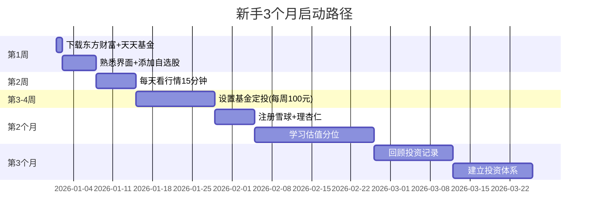
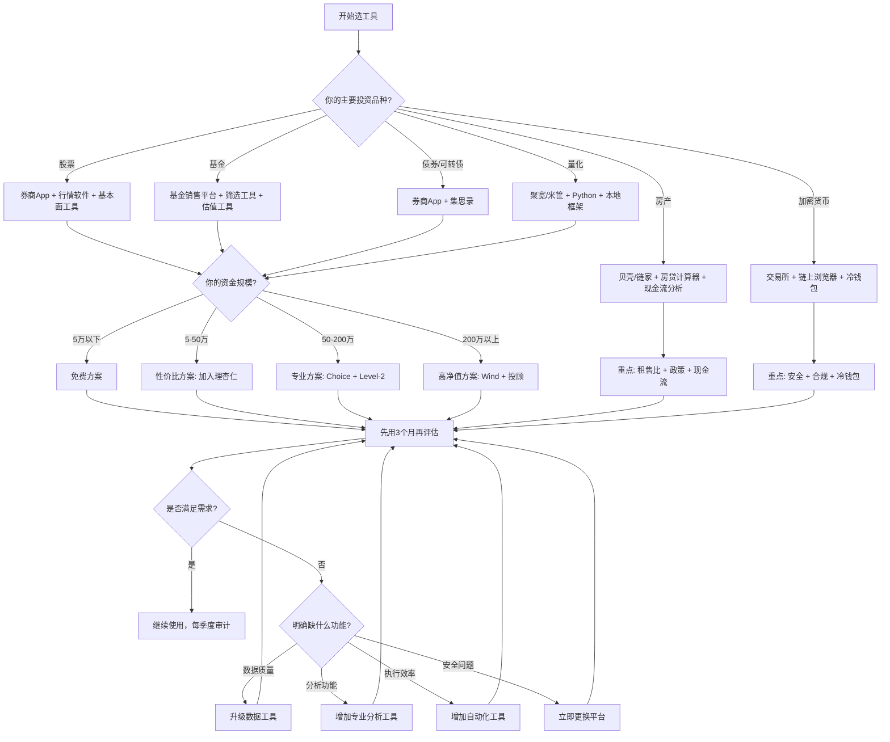
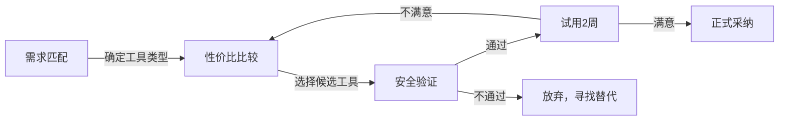

## 投资工具选择实操清单

选对投资工具，等于在起跑线上领先一步。工具选错了，再好的策略也会打折扣——手续费吃掉收益、数据延迟错过时机、功能缺失导致分析偏差，这些问题在投资初期往往被忽视，等发现时已经交了不少学费。

本清单是一份**可直接执行的操作手册**。它不是工具推荐列表，而是一套系统化的选择方法论：从自评到选型、从试用到部署、从日常使用到定期审计，覆盖投资工具的完整生命周期。按照本清单操作，你可以在每个投资品种上找到最适合自己的工具组合，避免常见的选择陷阱。

> **与本章其他文件的关系**：本清单是实战案例篇的收官之作，综合了理论基础篇的评估框架和核心技巧篇的实操方法。如果你还没有阅读前面的案例，建议先完成对应品种的案例学习，再用本清单做系统化整合。

### 一、自评：量化你的投资画像

选工具之前，先搞清楚自己是谁。不同投资阶段、不同资金规模、不同投资风格，对工具的需求完全不同。这一节提供一套可量化的自评方法，帮你精确匹配工具层级。

#### 1.1 投资阶段精准定位

很多投资者对自己的定位是模糊的——"我觉得自己算入门吧"。模糊的定位导致模糊的工具选择。下面用四个可量化的指标帮你精准定位：

| 评估维度 | 入门期 | 成长期 | 成熟期 | 高净值 |
|----------|--------|--------|--------|--------|
| **可投资资金** | 5万以下 | 5-50万 | 50-200万 | 200万以上 |
| **投资年限** | 0-1年 | 1-3年 | 3-7年 | 7年以上 |
| **投资品种数** | 1-2种 | 2-4种 | 4-6种 | 6种以上 |
| **日均研究时间** | 30分钟以内 | 30-60分钟 | 1-2小时 | 2小时以上 |
| **核心需求** | 看行情、学基础、模拟交易 | 基本面分析、组合管理、定投 | 多品种配置、风控系统、税务规划 | 全球配置、另类投资、家族信托 |
| **工具复杂度** | 简单易上手 | 中等功能 | 专业级 | 定制化方案 |

**自评实操**：拿出纸笔，回答以下五个问题，每个答案对应一个分数：

```text
═══════════════════════════════════════════════════
投资画像自评问卷（共5题，每题1-4分）
═══════════════════════════════════════════════════

Q1. 你目前可投资的总金额是多少？
    □ 5万以下(1分)  □ 5-50万(2分)  □ 50-200万(3分)  □ 200万以上(4分)

Q2. 你能承受的最大单笔亏损金额是多少？
    □ 1000元以下(1分)  □ 1000-1万(2分)  □ 1-10万(3分)  □ 10万以上(4分)

Q3. 你每天愿意花在投资研究上的时间是多少？
    □ 15分钟以下(1分)  □ 15-60分钟(2分)  □ 1-2小时(3分)  □ 2小时以上(4分)

Q4. 你目前持有的投资品种有多少种？
    □ 1种(1分)  □ 2-3种(2分)  □ 4-5种(3分)  □ 6种以上(4分)

Q5. 你对以下术语的理解程度如何？
    （K线、PE/PB、MACD、夏普比率、回撤、Beta）
    □ 完全不懂(1分)  □ 了解2-3个(2分)  □ 了解4-5个(3分)  □ 全部理解(4分)

总分：____分
═══════════════════════════════════════════════════
```

**评分解读**：
- **5-8分（入门期）**：你的首要目标是学习和试错，工具选择以"免费+易用"为原则。不要急于上专业工具，先把基础功能用熟。
- **9-13分（成长期）**：你需要效率工具来提升分析质量，可以引入1-2个付费工具（年费控制在500元以内）。
- **14-17分（成熟期）**：你需要专业级工具支持多品种管理，付费工具年费预算3000-5000元是合理的。
- **18-20分（高净值）**：你需要定制化的工具组合，可能需要专业投顾辅助，工具不是瓶颈，策略和执行才是。

#### 1.2 投资风格判定

不同风格对工具的侧重点差异很大。风格不匹配的工具就像穿错尺码的鞋——能用，但每一步都不舒服。

| 投资风格 | 核心特征 | 关键工具需求 | 推荐工具组合 |
|----------|----------|-------------|-------------|
| **价值投资者** | 长期持有、关注估值、忽略短期波动 | 强大的财务数据查询、估值计算、分红追踪 | 理杏仁（估值分析）+ 东方财富Choice（财务数据）+ 巨潮资讯（公告原文） |
| **趋势交易者** | 跟随趋势、技术分析为主、中短线操作 | 实时行情、技术分析图表、条件单、回测功能 | 通达信（技术分析）+ 同花顺iFinD（量化回测）+ 券商条件单 |
| **定投执行者** | 定期定额、长期投入、纪律执行 | 自动定投、费率比较、收益统计、估值定投 | 天天基金（基金定投）+ 蛋卷基金（智能定投）+ 理杏仁（估值判断） |
| **量化开发者** | 策略驱动、数据密集、程序化执行 | 编程接口、历史数据、回测框架、实盘API | 聚宽（Python量化）+ 米筐（策略回测）+ Tushare/AKShare（数据源） |
| **资产配置者** | 多品种分散、定期再平衡、风险预算 | 组合分析、相关性计算、再平衡提醒 | Excel/Google Sheets（自建模板）+ 且慢/蛋卷（组合跟踪）+ 晨星网（基金评价） |

**风格判定实操**：回顾你过去半年的投资行为，回答以下问题：

1. 你持有的最长时间的一笔投资是多久？（A: 超过1年 → 价值/配置；B: 1-6个月 → 趋势；C: 按周/月固定买入 → 定投）
2. 你做投资决策时，主要依据什么？（A: 财务数据和估值 → 价值；B: K线和技术指标 → 趋势；C: 固定计划不看行情 → 定投；D: 数据模型和回测 → 量化）
3. 你每周查看投资账户的频率？（A: 1次以下 → 价值/定投；B: 每天多次 → 趋势；C: 策略自动执行 → 量化）

如果你的答案主要是A，你是价值投资者或资产配置者；主要是B，你是趋势交易者；主要是C，你是定投执行者；主要是D，你是量化开发者。大多数人是混合型——比如"价值投资为主，定投指数基金为辅"。这时候你需要为每种风格分别配置工具。

#### 1.3 技术能力评估

工具的复杂度必须匹配你的技术能力。给一个不懂编程的人推荐Python量化平台，和给一个程序员推荐傻瓜式App，都是错误的匹配。

| 能力等级 | 特征描述 | 推荐工具类型 | 典型工具 |
|----------|----------|-------------|----------|
| **小白** | 不懂K线，只买过余额宝 | 图文教程+傻瓜式App | 支付宝基金、天天基金 |
| **入门** | 能看懂K线，了解基本指标 | 可视化工具为主 | 同花顺、东方财富 |
| **进阶** | 会用Excel建模，懂基本编程 | 专业终端+脚本辅助 | 通达信、理杏仁、Excel |
| **专业** | 熟练使用Python/R，有编程经验 | 量化平台+API接口 | 聚宽、米筐、本地量化框架 |

**关键原则**：从你当前的能力等级开始，不要跳级。小白直接上通达信会被海量功能淹没，专业投资者只用支付宝会觉得功能受限。每个等级至少稳定使用3个月再考虑升级。

### 二、评估框架：工具选择的六维评分法

每个投资工具都可以从六个维度来评估。这个评估框架不是拍脑袋的，而是基于工具的核心价值（信息获取、分析决策、交易执行、风险管理）推导出来的。

#### 2.1 六维评分标准

| 维度 | 权重 | 5分（优秀） | 3分（合格） | 1分（较差） |
|------|------|-------------|-------------|-------------|
| **数据质量** | 高 | 实时推送、准确无误、覆盖全品种、有历史回溯 | 延迟<5秒、主流品种覆盖、偶有小错 | 延迟>30秒、数据经常出错、品种覆盖不全 |
| **功能完整** | 高 | 满足90%以上需求、有进阶功能、支持自定义 | 满足核心需求、操作流程完整 | 功能缺失严重、核心流程不闭环 |
| **使用体验** | 中 | 界面清晰、操作流畅、新手引导完善、多端同步 | 基本可用、学习曲线平缓 | 界面混乱、操作卡顿、频繁闪退 |
| **费用合理** | 中 | 免费或性价比极高（年费/资金量<0.1%） | 费用与价值匹配（0.1%-0.5%） | 收费高但价值低（>0.5%且无明显优势） |
| **安全合规** | 高 | 持牌机构、资金第三方托管、全站HTTPS、2FA | 有基本安全保障、无重大安全事故 | 合规存疑、无牌照、资金流向不明 |
| **学习成本** | 低 | 即学即用、有完善教程 | 需要1-2天学习、有基本文档 | 需要数周才能上手、文档缺失 |

总分30分，评分标准：
- **24分以上**：优秀，可以放心使用
- **18-23分**：合格，适合当前阶段使用
- **18分以下**：建议更换

**一票否决项**："数据质量"和"安全合规"两项中任何一项低于3分，无论其他维度多优秀都不建议使用。数据不准的分析工具和不安全的交易平台，是投资中最大的隐患。

#### 2.2 评分实操示例

以"同花顺"和"通达信"的对比为例，演示如何使用这个评估框架：

```text
═══════════════════════════════════════════════════
工具评分实操：同花顺 vs 通达信
═══════════════════════════════════════════════════

评估人画像：成长期投资者，资金20万，技术分析为主

               同花顺（免费版）          通达信（免费版）
数据质量：      4分（实时、主流品种全）    4分（实时、技术数据强）
功能完整：      5分（功能最全、90%券商接入） 4分（技术分析最强，但生态略窄）
使用体验：      4分（界面清晰、移动端好）   3分（界面偏老、学习曲线陡）
费用合理：      5分（免费版够用）          5分（免费版够用）
安全合规：      4分（上市公司、持牌）      4分（老牌软件、稳定）
学习成本：      4分（新手引导好）          2分（需要1-2周适应）

同花顺总分：26分 ✓ 优秀
通达信总分：22分 ✓ 合格

结论：对于成长期技术分析投资者，
  - 如果重视易用性和生态：选同花顺作主力
  - 如果重视技术分析深度：选通达信作主力
  - 最佳方案：同花顺作日常看盘 + 通达信作深度分析
═══════════════════════════════════════════════════
```

**实操建议**：对你的候选工具逐一打分，制作对比表格。不要只看总分——如果你是技术分析型投资者，"功能完整"中的技术分析功能权重应该更高；如果你是价值投资者，"数据质量"中的财务数据准确性权重应该更高。根据你的风格调整权重。

### 三、分品种工具选择清单

#### 3.1 A股股票投资工具组合

**必备工具（基础三件套）**：

**1. 券商交易App**（选一个）

券商App的核心功能是下单交易，选择标准按优先级排序：佣金费率 > App体验 > 研报质量 > 营业部距离。

| 券商 | 佣金费率 | App体验 | 特色功能 | 适合人群 |
|------|----------|---------|----------|----------|
| 华泰证券（涨乐财富通） | 万1.3起 | ★★★★★ | 条件单完善、ETF费率低 | 大多数投资者首选 |
| 东方财富证券 | 万1.5起 | ★★★★ | 与东方财富生态打通、数据丰富 | 东方财富重度用户 |
| 中信证券（信e投） | 万2起 | ★★★★ | 研究资源强、机构级服务 | 中高端用户 |
| 招商证券 | 万1.5起 | ★★★★ | 服务质量好、客服响应快 | 注重服务的投资者 |

**选择实操**：不要只看宣传的佣金费率——实际费率取决于你的资金量和谈判能力。开户前联系券商客户经理，明确问三个问题：（1）实际佣金费率是多少？（2）有没有最低5元的限制？（3）ETF和可转债的费率是多少？把答案记下来，作为选择依据。

**2. 行情分析软件**（选一个主力+一个辅助）

| 软件 | 核心优势 | 免费版功能 | 付费版价值 | 适合人群 |
|------|----------|-----------|-----------|----------|
| 同花顺 | 功能最全、90%券商接入 | 行情、资讯、基础分析 | Level-2十档行情约30元/月 | 大多数投资者 |
| 东方财富 | 社区活跃、信息量大 | 行情、股吧、资金流向 | 高级数据终端 | 喜欢社区讨论的散户 |
| 通达信 | 技术分析最强、自定义指标 | 技术指标、选股器 | 更多指标和选股条件 | 职业交易者、技术分析派 |

辅助工具：雪球（社区讨论+模拟组合）、财联社（7×24快讯，信息速度最快）。

**3. 基本面分析工具**（选一个）

| 工具 | 核心优势 | 费用 | 适合人群 |
|------|----------|------|----------|
| 理杏仁 | PE/PB/股息率历史分位一目了然、估值数据最专业 | 年费约200元 | 个人投资者性价比最高 |
| 东方财富Choice | 数据最全面、行业数据、机构级品质 | 年费3000-5000元 | 深度研究、机构用户 |
| 巨潮资讯网 | 官方公告来源、信息最权威 | 免费 | 所有投资者（基础数据源） |
| Wind终端 | 全球金融数据、最专业 | 年费数万元 | 机构投资者 |

**进阶工具组合**：

- **量化回测**：聚宽（JoinQuant）提供免费的研究环境和A股历史数据，适合有Python基础的投资者验证策略。具体用法见案例四。
- **条件单/智能交易**：大部分头部券商已内置，核心功能包括价格条件单（股价达到X元自动买入/卖出）、时间条件单（尾盘自动下单）、止盈止损单（自动执行止盈止损计划）。
- **财务造假识别**：关注现金流与利润的偏离度——如果一家公司连续3年净利润为正但经营性现金流为负，需要高度警惕。理杏仁和Choice都可以设置相关预警。
- **资金流向分析**：同花顺和东方财富都提供主力资金流向数据，但要注意：资金流向数据的准确性有限，只能作为参考，不能作为决策依据。

#### 3.2 基金投资工具组合

**核心工具矩阵**：

| 工具 | 定位 | 核心优势 | 费率 | 最佳使用场景 |
|------|------|----------|------|-------------|
| 天天基金 | 基金超市 | 品种最全（8000+只）、定投功能完善、数据全面 | 申购费1折起 | 日常基金购买和定投 |
| 蛋卷基金 | 智能定投 | 估值定投（低估多买、高估少买）、组合投资 | 申购费1折起 | 智能定投、组合投资 |
| 晨星网 | 基金评价 | 评级权威（全球标准）、数据专业、风格分析 | 基础免费 | 基金筛选和深度评价 |
| 好买基金 | 高端理财 | 私募产品、资产配置建议、投顾服务 | 按产品收费 | 高净值用户、私募投资 |
| 且慢 | 组合跟踪 | 策略组合、自动跟投、收益归因分析 | 免费 | 跟踪策略组合 |

**基金筛选五步法**：

1. **用晨星网初筛**：筛选3年/5年评级4星以上的基金，排除规模小于2亿的迷你基金（清盘风险高）
2. **用天天基金精筛**：查看基金规模（2-100亿为宜）、成立时间（3年以上）、基金经理任职时间（2年以上）、最大回撤（同类排名前50%）
3. **用理杏仁估值确认**：查看对应指数的估值分位，确认当前是否在低估区间（PE分位<30%为低估，30%-70%为合理，>70%为高估）
4. **费率对比**：对比天天基金、蛋卷基金、支付宝的申购费率，选择最低的渠道。注意区分A类份额（适合长期持有，有申购费但无销售服务费）和C类份额（适合短期持有，无申购费但有销售服务费）
5. **设置定投**：扣款日选择发工资后第2-3天（确保账户有余额），定投金额=月结余的30%-50%（剩余部分留作应急资金和机会资金）

**费率陷阱排查清单**：

- [ ] 确认申购费率是否有折扣（正常应为1折，即0.12%-0.15%；如果高于此费率，说明渠道不对）
- [ ] 确认赎回费率和持有时间的关系（持有7天以内赎回费1.5%——这是监管规定的惩罚性费率，务必避免短线操作基金）
- [ ] 确认是否有销售服务费（C类份额收取，通常0.4%-0.8%/年，适合持有期<1年的投资者）
- [ ] 确认管理费和托管费（同类基金中选较低的，差异0.1%-0.5%/年看似不大，但长期复利影响显著）
- [ ] 确认是否有隐性费用（如基金转换费——同一基金公司旗下基金互转通常有优惠，不同公司之间没有）
- [ ] 确认分红方式（默认现金分红，建议改为红利再投——享受复利效应）

#### 3.3 房产投资工具组合

**数据查询工具**：

| 工具 | 数据类型 | 数据质量 | 费用 |
|------|----------|----------|------|
| 贝壳找房/链家 | 挂牌价、成交价、小区详情、户型图、VR看房 | ★★★★★（数据最全面） | 免费 |
| 中国房价行情网 | 宏观趋势、城市均价、涨跌幅度 | ★★★★（国家统计局数据） | 免费 |
| 各城市住建局官网 | 网签数据、预售信息、政策公告 | ★★★★★（官方数据） | 免费 |
| 安居客 | 挂牌价、小区信息 | ★★★（数据质量略低于贝壳） | 免费 |

**重要提醒**：永远以**真实成交价**而非挂牌价作为决策依据。同一小区的挂牌价和成交价可能相差10%-20%。贝壳找房有"成交记录"功能，可以看到近半年的真实成交数据。

**分析计算工具**：

- **房贷计算器**（贝壳/链家内置）：对比等额本息和等额本金两种还款方式。以100万贷款、利率3.5%、30年期为例：
  - 等额本息：月供4,490元，总利息61.7万
  - 等额本金：首月5,694元（逐月递减），总利息52.6万
  - 差异：等额本金总利息少9.1万，但前期月供压力大1,200元/月

- **租售比计算器**：月租金÷房价×100%。国际标准认为年租售比5%以上有投资价值（即月租售比0.42%以上）。但国内一线城市通常在1.5%-2.5%，需要结合房价涨幅综合判断。

- **现金流分析模板**（Excel）：必须考虑以下项目——租金收入（扣除空置期，通常按10-11个月/年计算）、贷款月供、物业费、维修基金、房屋折旧、税费（契税、增值税、个税、中介费）。

**房产投资决策检查清单**：

- [ ] 查询该小区近6个月的真实成交价（非挂牌价），计算价格趋势
- [ ] 计算租售比，判断租金回报率是否跑赢同期国债收益率（2025年约2.5%）
- [ ] 查询该区域的城市规划（地铁规划、学校划片、商业配套、产业导入）
- [ ] 了解该城市的限购政策、贷款政策（首付比例、利率、贷款年限）
- [ ] 评估自身现金流能否覆盖6个月以上的月供（含空置期和突发维修费用）
- [ ] 咨询当地税费政策：契税（1%-3%）、增值税（满2年免征）、个税（满5唯一免征）、中介费（1%-2%）
- [ ] 实地看房至少3次：工作日白天（采光、噪音）、工作日晚上（入住率、停车）、周末（社区氛围）

#### 3.4 债券与可转债工具组合

**国债/企业债投资工具**：

| 工具 | 功能 | 适合场景 |
|------|------|----------|
| 券商App（场内债券） | 买卖国债逆回购、企业债 | 短期现金管理、低风险配置 |
| 银行App（储蓄国债） | 购买电子式/凭证式国债 | 长期持有、保本保息 |
| 中国债券信息网 | 债券行情、收益率曲线 | 债券市场分析 |

**可转债专用工具**：

| 工具 | 核心功能 | 费用 |
|------|----------|------|
| 集思录 | 可转债筛选、溢价率分析、到期收益率计算、双低排名 | 基础免费，高级版约200元/年 |
| 宁稳网 | 可转债定价模型、期权价值分析 | 免费 |
| 同花顺可转债板块 | 行情、涨跌、成交量 | 免费 |

**可转债筛选实操**：用集思录的"双低排名"（转债价格+溢价率×100的和），选择双低值排名前20的可转债，分散买入5-10只，持有到期或强赎卖出。这个策略的回测年化收益约8%-15%，但需要承受期间的波动。详见案例七。

#### 3.5 REITs投资工具组合

公募REITs（不动产投资信托基金）在国内2021年才正式推出，工具生态还在发展中：

| 工具 | 功能 | 说明 |
|------|------|------|
| 券商App | 认购和交易 | 与股票交易方式相同，通过券商App即可操作 |
| 交易所官网 | 公告、招募说明书、定期报告 | 最权威的信息来源 |
| 基金公司官网 | 项目详情、分红记录 | 了解底层资产状况 |

**REITs分析要点**：关注三个核心指标——（1）分派率（类似股息率，越高越好但需可持续性验证）；（2）底层资产质量（产业园、高速公路、仓储物流等不同资产类型的风险收益特征不同）；（3）扩募能力（是否有优质资产注入的预期）。

#### 3.6 加密货币工具组合

**行情与数据**：

| 工具 | 功能 | 特点 | 费用 |
|------|------|------|------|
| CoinMarketCap | 市值排名、价格、交易量、流通量 | 全球最权威的加密货币数据源 | 免费 |
| CoinGecko | 与CMC类似，数据略有差异 | 去中心化数据、无广告、社区评分 | 免费 |
| 非小号 | 中文加密货币数据 | 适合国内用户、项目评分体系 | 免费 |

**链上分析工具**：

| 工具 | 功能 | 费用 | 适合人群 |
|------|------|------|----------|
| Etherscan | 以太坊区块浏览器：查看交易、合约、代币 | 免费 | 所有ETH用户 |
| Dune Analytics | 自定义SQL查询链上数据、制作可视化看板 | 免费（基础） | 数据分析爱好者 |
| Nansen | 聪明钱追踪、地址标签分析、资金流向 | $49-799/月 | 专业交易者 |
| Glassnode | 链上指标（MVRV、NUPL、SOPR等） | 免费（基础）/ $39/月 | 链上分析师 |

**交易所选择标准**（按优先级排序）：

1. **合规性**：是否有当地金融牌照？优先选择受监管的交易所（如Coinbase受美国SEC监管、香港持牌交易所）
2. **安全性**：历史是否有被盗记录？是否有保险基金？（Binance的SAFU基金、OKX的风险准备金）
3. **流动性**：主流币种的买卖价差（spread）越小越好。可以在CoinMarketCap上查看各交易所的流动性评分
4. **费率**：Maker/Taker费率对比。主流交易所通常0.1%左右，使用平台币抵扣可降至0.075%
5. **支持币种**：是否支持你想要交易的币种。主流交易所覆盖度差异不大，小众币种需要看具体支持情况

**安全操作清单**：

- [ ] 启用双重验证（2FA），优先使用硬件密钥（YubiKey）或Authenticator App（Google Authenticator/Authy），**绝对不要用短信验证**（SIM卡劫持攻击已多次发生）
- [ ] 设置提币白名单地址，新地址添加后需等待24-48小时才能生效（防止即时盗提）
- [ ] 大额资产（超过总持仓的50%）转入冷钱包（Ledger/Trezor硬件钱包），交易所只保留交易用的资金
- [ ] 定期检查API密钥权限，仅授予必要权限（交易权限，不要给提币权限）
- [ ] 不在公共WiFi下操作交易所，不用公共电脑登录
- [ ] 助记词用金属板刻录（不存电子设备、不拍照、不截图），存放在安全的物理位置
- [ ] 每笔大额转账前先发一笔小额测试交易（$10左右）确认地址正确

#### 3.7 量化交易工具组合

**入门平台对比**：

| 平台 | 编程语言 | 数据覆盖 | 免费版限制 | 付费版价格 | 适合人群 |
|------|----------|----------|-----------|-----------|----------|
| 聚宽（JoinQuant） | Python | A股全量历史数据 | 回测次数有限、不能实盘 | 约1000-3000元/年 | Python初学者 |
| 米筐（RiceQuant） | Python | A股+港股 | 回测速度有上限 | 约1000-3000元/年 | 机构用户较多 |
| 优矿（Uqer） | Python | 通联数据、质量高 | 免费版限制较多 | 按需定价 | 数据质量要求高 |

**本地量化方案**：

对于有一定编程基础的投资者，本地部署更灵活：

```text
数据获取层：Tushare（免费积分制）/ AKShare（完全免费）
策略框架层：Backtrader（最流行）/ Zipline（Quantopian遗产）
回测分析层：pyfolio（收益归因）/ empyrical（风险指标）
实盘执行层：券商API（华泰XTP、中泰XTP）/ easytrader（开源）
```

**量化工具选型决策树**：

1. 你会编程吗？
   - 不会 → 先用天天基金/蛋卷的智能定投功能（零代码），同时学习Python基础（推荐《Python for Finance》，约需2-3个月）
   - 会 → 继续下一步
2. 你的资金量是多少？
   - 50万以下 → 使用聚宽免费版回测，手动下单执行信号（回测验证策略可行性，手动执行控制风险）
   - 50万以上 → 考虑付费版+实盘接口（自动化执行减少情绪干扰）
3. 你的策略类型？
   - 低频（月度调仓）→ 聚宽/米筐足够
   - 高频（日内交易）→ 需要本地部署+专业行情接口+低延迟网络

#### 3.8 保险理财与银行理财工具

**保险理财工具**：

| 工具 | 功能 | 使用场景 |
|------|------|----------|
| 保险比价平台（慧择、蜗牛保险） | 产品对比、保费计算、智能推荐 | 选购保险产品 |
| 各保险公司官网 | 产品详情、费率表、理赔流程 | 了解具体产品 |
| 保险经纪平台 | 多家产品对比、专业咨询 | 需要专业建议时 |

**银行理财工具**：

| 工具 | 功能 | 使用场景 |
|------|------|----------|
| 各银行App | 理财产品购买、收益查询 | 日常操作 |
| 中国理财网（chinawealth.com.cn） | 全市场银行理财产品查询、产品编码验证 | 产品验证、跨行比较 |
| 收益计算器 | 年化收益换算、复利计算 | 收益对比 |

**银行理财产品选择要点**：（1）认准"理财编码"，在中国理财网验证产品真伪；（2）区分"保本"和"非保本"——2022年资管新规后，银行理财已全面净值化，不再承诺保本；（3）关注"业绩比较基准"而非"预期收益率"——前者是参考，后者已不允许使用。

#### 3.9 海外投资工具组合

**港股/美股投资渠道**：

| 券商 | 市场 | 佣金 | 开户门槛 | 特色 |
|------|------|------|----------|------|
| 富途牛牛 | 港股+美股 | 港股0.03%（最低3港元）、美股$0.005/股 | 无门槛 | 中文体验最好、社区活跃 |
| 老虎证券 | 港股+美股 | 与富途类似 | 无门槛 | 美股深度数据强 |
| 雪盈证券 | 港股+美股 | 港股万5、美股$0.005/股 | 无门槛 | 背靠雪球生态 |

**海外投资额外注意事项**：
- **汇率风险**：人民币兑美元/港币的波动直接影响你的实际收益。过去5年人民币兑美元汇率波动幅度约10%。
- **税务处理**：美股股息预扣10%税（中美税收协定税率），港股无股息税。年终需要在中国申报海外收入。
- **入金方式**：需要境外银行卡或通过跨境汇款，注意每人每年5万美元的外汇额度限制。
- **时差问题**：美股交易时间是北京时间21:30-次日4:00（夏令时），需要适应夜间交易节奏。

### 四、工具组合方案（按预算分级）

#### 4.1 零成本方案（完全免费）

适合入门期投资者，月投入资金5万以下。

| 用途 | 工具 | 费用 | 替代方案 |
|------|------|------|----------|
| 行情查看 | 东方财富App | 免费 | 同花顺App |
| 基金定投 | 天天基金/支付宝 | 免费（费率1折） | 蛋卷基金 |
| 基本面数据 | 巨潮资讯+东方财富网页版 | 免费 | 上交所/深交所官网 |
| 社区讨论 | 雪球 | 免费 | 东方财富股吧 |
| 信息追踪 | 财联社App | 免费 | 新浪财经 |
| 记账统计 | Excel/WPS表格 | 免费 | Google Sheets |

**局限性分析**：免费方案的核心局限在于三个方面——（1）数据不够实时（延迟5-30秒，对短线交易有影响但对长线投资无影响）；（2）缺少深度分析功能（无法查看PE历史分位、无法做技术指标自定义）；（3）没有条件单功能（需要手动盯盘执行交易计划）。但对于入门投资者，这些局限在3-6个月内不会构成实质障碍。

#### 4.2 性价比方案（年费500元以内）

适合成长期投资者，资金5-50万。

| 用途 | 工具 | 费用 | 核心升级价值 |
|------|------|------|-------------|
| 交易 | 低佣金券商App（万1.3） | 佣金 | 年交易100万可省约700元佣金 |
| 行情分析 | 同花顺/通达信免费版 | 免费 | 功能足够，暂不需升级 |
| 估值分析 | 理杏仁 | 约200元/年 | **核心升级**——PE/PB历史分位帮你判断买卖时机 |
| 基金筛选 | 晨星网 | 免费 | 权威评级体系 |
| 量化研究 | 聚宽免费版 | 免费 | 策略回测验证 |
| 信息追踪 | 财联社App | 免费 | 7×24快讯 |
| 可转债分析 | 集思录基础版 | 免费 | 双低排名筛选 |

**核心升级点分析**：理杏仁的200元年费是性价比最高的投资工具支出。它的估值分位数据能帮你回答一个关键问题："现在是买入的好时机吗？"。以沪深300指数为例，如果你在PE分位<20%时开始定投，在PE分位>80%时停止定投并逐步卖出，长期收益将显著优于无脑定投。一次避免在高点买入节省的钱，可能是年费的几十倍。

#### 4.3 专业方案（年费5000元以内）

适合成熟期投资者，资金50-200万。

在性价比方案基础上增加：

| 升级项 | 工具 | 费用 | 价值分析 |
|--------|------|------|----------|
| 数据终端 | 东方财富Choice | 约3000元/年 | 机构级财务数据、行业数据、深度报告 |
| 高级行情 | 同花顺Level-2 | 约1000元/年 | 十档行情、逐笔成交、大单监控 |
| 量化平台 | 聚宽/米筐付费版 | 约1000-3000元/年 | 更长回测周期、实盘模拟、更多数据 |
| 链上分析 | Nansen基础版 | 约$49/月 | 聪明钱追踪（仅限加密货币投资者） |

**费用合理性判断**：当你的投资资金达到50万时，5000元的工具年费占资金量的1%。如果这些工具能帮你每年提升1%的收益（或者减少1%的亏损），就已经完全覆盖了成本。关键是要**真正使用**这些工具——很多人买了付费工具后使用频率很低，变成了沉没成本。

#### 4.4 高净值方案（年费2万元以上）

适合高净值投资者，资金200万以上。

| 升级项 | 工具/服务 | 费用 | 价值 |
|--------|----------|------|------|
| 全球数据终端 | Wind/Bloomberg | 数万-数十万元/年 | 全球市场覆盖、最专业数据 |
| 专业投顾服务 | 券商投顾/独立投顾 | 按资产规模收费（0.5%-1%） | 个性化投资建议 |
| 家族信托/海外架构 | 信托公司/律所 | 按架构复杂度收费 | 资产隔离、税务规划、传承 |
| 私募产品 | 好买/诺亚/私募排排网 | 认购费+管理费+业绩报酬 | 另类投资机会 |

**高净值投资者的工具使用原则**：在高净值阶段，工具本身的费用已不是核心考量。重点是工具能否帮你解决三个问题——（1）全球资产配置的信息整合；（2）税务优化的计算和规划；（3）资产传承的法律架构。这些需求通常需要专业投顾+法律+税务的综合服务，单一工具无法满足。

### 五、工具部署与切换流程

#### 5.1 新工具上线四步法

当你决定启用一个新工具时，按以下流程操作。不要跳步——跳步的代价往往是数据丢失、资金风险或时间浪费。

**第一步：安全验证（1天）**

- [ ] 确认工具提供商的资质：是否有金融牌照？公司注册地在哪里？股东背景是什么？
- [ ] 搜索安全事件历史：搜索"XX + 安全事故 / 数据泄露 / 跑路"，查看是否有负面记录
- [ ] 检查隐私政策：你的数据会被如何使用？是否会被卖给第三方？
- [ ] 确认资金托管：交易类工具的资金是否由第三方银行托管？（如果资金直接进入平台公司账户，风险极高）
- [ ] 检查App权限：是否要求了不合理的权限（如通讯录、短信、相册）？

**第二步：功能测试（3-5天）**

- [ ] 用模拟账户或小资金（100-1000元）测试核心功能
- [ ] 对比数据准确性：与官方数据源（巨潮资讯、交易所官网）交叉验证至少3组数据
- [ ] 测试网络稳定性：在WiFi和4G/5G环境下分别测试，观察行情推送的延迟
- [ ] 测试客服响应：提一个技术问题，记录响应时间和回答质量
- [ ] 测试极端场景：在开盘高峰期（9:30-10:00）测试下单速度和系统稳定性

**第三步：逐步迁移（1-2周）**

- [ ] 新旧工具并行使用至少1周，确保新工具覆盖旧工具的核心功能
- [ ] 对比两个工具的分析结果，确认一致性
- [ ] 导出旧工具的历史数据（持仓记录、交易记录、自选股列表），做好备份
- [ ] 更新自己的投资操作手册，记录新工具的使用方法和快捷键
- [ ] 通知可能受影响的协作方（如果你和他人共享投资信息）

**第四步：正式切换（第3周起）**

- [ ] 确认新工具完全满足需求后，逐步停用旧工具
- [ ] 保留旧工具的账号至少3个月（防止需要查阅历史数据）
- [ ] 在新工具上建立完整的工作流（日常看盘→分析研究→下单交易→记录复盘）
- [ ] 第一个月每周回顾一次新工具的使用体验，记录问题和改进建议

#### 5.2 工具切换的时机判断

以下信号表明你可能需要更换工具。注意：不是每个信号都必须立刻切换——要综合评估切换成本和预期收益。

| 信号 | 具体表现 | 紧急程度 | 处理方式 |
|------|----------|----------|----------|
| **费用不合理** | 同类工具中有性价比明显更高的选择，年省500元以上 | 中 | 做好对比评估后择机切换 |
| **数据频繁出错** | 一个月内发现3次以上数据错误 | 高 | 立即开始寻找替代工具 |
| **功能瓶颈** | 当前工具无法满足新增需求（如从只买基金扩展到股票+基金） | 中 | 先尝试工具组合方案，再考虑替换 |
| **安全事件** | 工具提供商发生数据泄露或安全事故 | 极高 | 立即修改密码、启用2FA、开始迁移 |
| **服务恶化** | 客服响应变慢、功能更新停滞超过6个月 | 低 | 观察3个月，如果持续恶化再行动 |
| **合规风险** | 工具提供商被监管处罚或牌照被吊销 | 极高 | 立即停止使用，资金尽快转出 |

### 六、多账户管理实战

随着投资品种增加，你可能同时使用5-10个不同的工具和平台。管理不善会导致信息碎片化、操作遗漏和安全风险。

#### 6.1 账户清单管理

建立一份完整的账户清单，定期更新：

```text
═══════════════════════════════════════════════════
投资账户清单（模板）
═══════════════════════════════════════════════════

| 序号 | 平台名称 | 用途 | 账号 | 注册时间 | 2FA状态 | 备注 |
|------|----------|------|------|----------|---------|------|
| 1    | 华泰证券  | A股交易 | 手机号 | 2024-01 | 已开启 | 万1.3佣金 |
| 2    | 天天基金  | 基金定投 | 手机号 | 2024-01 | 已开启 | 自动定投 |
| 3    | 理杏仁    | 估值分析 | 邮箱  | 2024-03 | 已开启 | 年费200元 |
| 4    | Binance   | 加密货币 | 邮箱  | 2024-06 | 硬件密钥 | 仅交易用 |
| ...  | ...      | ...   | ...  | ...      | ...     | ...  |

更新日期：____年____月____日
═══════════════════════════════════════════════════
```

**管理原则**：
- 每个平台使用**不同的强密码**（16位以上，含大小写+数字+特殊字符）
- 使用密码管理器（1Password年费$36、Bitwarden免费版）统一管理
- 每季度检查一次所有账户的安全状态
- 不再使用的平台及时注销账号，删除绑定的银行卡信息

#### 6.2 数据同步与备份

| 数据类型 | 备份频率 | 备份方式 | 保留时间 |
|----------|----------|----------|----------|
| 持仓记录 | 每次交易后 | Excel手动更新+截图 | 永久 |
| 交易记录 | 每月导出 | 平台导出CSV+本地存储 | 永久 |
| 分析模板 | 每次修改后 | 本地文件+云盘同步 | 永久 |
| 账户信息 | 每季度更新 | 加密文档（离线存储） | 永久 |
| 工具配置 | 每次修改后 | 截图+文字记录 | 至少1年 |

**备份的3-2-1原则**：至少3份备份，存储在2种不同介质上，其中1份存放在异地。例如：本地硬盘1份 + 云盘1份 + 移动硬盘1份（存放在不同地点）。

### 七、工具选择五大误区

#### 误区一：功能越多越好

很多人选工具时贪大求全，恨不得一个App解决所有问题。实际上，专注于某个领域的工具往往比"什么都有"的工具做得更好。这是工具设计的基本规律——专注带来深度，全面带来平庸。

**反面案例**：某投资者用同花顺做所有事——看行情、买基金、做技术分析、看研报、管理组合。结果每个功能都只是"能用"的水平，基金筛选不如晨星专业，组合管理不如且慢系统，研报质量不如Wind深入。

**正确做法**：每个领域选1-2个专业工具，组合使用。工具之间的数据可以通过Excel或脚本打通。一个好的工具组合通常包含4-6个工具，而不是试图找一个"万能工具"。

#### 误区二：只看免费不看价值

"免费的才是最贵的"——这句话在投资工具领域尤为适用。

**量化分析**：假设你投资50万，理杏仁年费200元。如果理杏仁的估值数据帮你避免了一次在市场高点（PE分位>80%）的大额买入，或者帮你在低估区间（PE分位<20%）多买了20%，对收益的影响可能是数千甚至数万元。200元的投资回报率可以达到1000%-10000%。

**正确做法**：计算工具的"投资回报率"。公式：工具ROI = 工具带来的额外收益（或避免的损失） ÷ 工具年费。如果ROI > 5倍，果断付费；如果ROI < 2倍，用免费替代方案。

#### 误区三：盲目跟风大V推荐

很多投资大V推荐的工具背后有推广佣金（CPA/CPS），推荐理由可能并不客观。而且大V的资金规模、投资风格、技术能力与你可能完全不同——一个管理千万资金的量化交易者推荐的工具，对一个刚入门的5万投资者来说可能是过度配置。

**正确做法**：参考推荐，但用自己的需求去验证。具体方法：（1）查看推荐是否有推广链接（带ref/affiliate参数的URL）；（2）在知乎/雪球搜索该工具的真实用户评价；（3）先用免费版或试用期亲自体验至少1周。

#### 误区四：忽视数据安全

投资账户密码和其他网站用同一个密码、不在交易所开启2FA、在多个不可信平台留下银行卡信息——这些看似小事，一旦出问题就是真金白银的损失。

**真实案例**：2023年，某投资者因在多个平台使用相同密码，其中一个论坛数据库泄露后，攻击者通过"撞库"登录了他的券商账户，将持仓全部卖出并转出资金。损失超过30万元。

**正确做法**：投资账户使用独立的强密码（密码管理器生成），启用所有可用的安全验证方式（TOTP > 硬件密钥 > 短信），定期检查账户活动记录，不在公共设备上登录投资账户。

#### 误区五：设置后不管

很多人把定投、条件单设置好就再也不看了。市场环境在变（牛熊转换）、工具在更新（功能变化、费率调整）、你的财务状况也在变（收入增加、风险承受能力变化），半年不检查可能会出大问题。

**常见问题**：定投扣款银行卡余额不足导致连续扣款失败但没有通知；条件单的价格设置已远离当前价格形同虚设；基金分红方式默认现金分红但你本意是红利再投。

**正确做法**：每季度做一次工具审计——检查定投是否正常执行、条件单是否需要调整、费率是否有更优选择、安全设置是否需要更新。详见第八节的审计模板。

### 八、信息流整合与效率提升

#### 8.1 建立个人投资信息中枢

不要在多个App之间来回切换，这会消耗大量注意力。建立自己的信息中枢：

| 方案 | 实现方式 | 适合人群 | 每日耗时 |
|------|----------|----------|----------|
| **方案一（简单）** | 微信/飞书订阅各平台公众号推送，每天固定时间集中阅读 | 入门投资者 | 15-30分钟 |
| **方案二（进阶）** | RSS阅读器（Inoreader/Feedly）订阅各大财经网站RSS源 | 成长期投资者 | 30-60分钟 |
| **方案三（专业）** | Python爬虫+Grafana搭建自研信息聚合面板 | 专业投资者 | 1-2小时（搭建后日常15分钟） |

**方案一实操**：关注以下公众号/频道——财联社（快讯）、券商中国（行业动态）、雪球（深度分析）、理杏仁（估值周报）。每天早上8:00-8:30集中阅读，形成习惯。

#### 8.2 自动化降低重复劳动

| 重复任务 | 自动化方案 | 具体工具 | 节省时间 |
|----------|------------|----------|----------|
| 每日看盘 | 设置价格预警推送 | 同花顺/通达信预警功能（支持股价、涨跌幅、成交量触发） | 每天30分钟 |
| 基金定投 | 自动扣款 | 天天基金/支付宝自动定投 | 每月30分钟 |
| 持仓记录 | 自动同步 | 券商App持仓截图+OCR识别（微信小程序"持仓截图"） | 每次交易后10分钟 |
| 收益统计 | 自动计算 | Excel模板（公式自动更新）或且慢App | 每月1小时 |
| 研报筛选 | 关键词订阅 | 财联社/Wind研报订阅（关键词触发推送） | 每天20分钟 |
| 数据更新 | 脚本定时拉取 | Python + Tushare/AKShare定时获取数据 | 每天15分钟 |

#### 8.3 移动端与桌面端的分工

| 任务类型 | 推荐设备 | 原因 |
|----------|----------|------|
| 看行情、快速浏览 | 移动端（手机） | 随时随地、碎片时间利用 |
| 执行交易 | 移动端为主 | 速度快、即时操作 |
| 接收预警推送 | 移动端 | 第一时间响应 |
| 阅读快讯/新闻 | 移动端 | 适合碎片化阅读 |
| 深度财务分析 | 桌面端（电脑） | 需要多窗口并行、大屏幕展示数据 |
| 技术分析/画图 | 桌面端 | 指标叠加、画线工具更精准 |
| 量化回测 | 桌面端 | 编程环境、计算密集 |
| Excel建模 | 桌面端 | 复杂公式、多表联动 |
| 组合分析 | 桌面端 | 需要同时查看多维度数据 |

**核心原则**：涉及数据分析和策略回测的任务，一定要用电脑——屏幕大、操作精准、多窗口并行，效率差距是数量级的。不要试图在手机上完成所有工作。

### 九、年度工具审计模板

每年至少做一次完整的工具审计（建议在年初或你的生日那天做，容易记住）。以下模板可直接复制使用：

```text
═══════════════════════════════════════════════════════════
投资工具年度审计表
═══════════════════════════════════════════════════════════

审计日期：____年____月____日
当前总投资规模：________万元
过去一年投资收益：________万元（收益率：____%）

【一、工具清单与评分】
| 工具名称 | 用途 | 年费用 | 使用频率 | 满意度(1-5) | 是否继续 |
|----------|------|--------|----------|-------------|---------|
|          |      |        |          |             |         |
|          |      |        |          |             |         |
|          |      |        |          |             |         |
工具年费总计：________元
工具费用/投资规模比：________%

【二、费率检查】
- 券商佣金费率：____‰（市场最低参考：万1.2）
- 基金申购费率折扣：____折
- 基金管理费加权平均：____%/年
- 其他费用变化：________________

【三、安全检查】
- [ ] 所有投资账户密码已更新（最近90天内）
- [ ] 所有交易所/券商已启用2FA
- [ ] 未发现异常登录记录
- [ ] API密钥权限已审核
- [ ] 已注销不再使用的平台账号
- [ ] 备份文件完整性已验证

【四、需求变化评估】
- 过去一年新增了哪些投资品种？________________
- 现有工具是否覆盖新品种？□是 □否
- 是否有新的投资策略需要工具支持？□是 □否
- 资金规模变化：去年____万 → 今年____万
- 投资风格是否发生变化？□是（____） □否

【五、优化计划】
- 需要新增的工具：________________
- 需要替换的工具：________________（原因：________________）
- 需要升级的工具：________________（预计费用：________）
- 需要降级/取消的工具：________________（原因：________________）
- 下一年工具预算：________元

【六、行动清单】
- [ ] 1. ____________________
- [ ] 2. ____________________
- [ ] 3. ____________________
- [ ] 完成日期：____月____日前

═══════════════════════════════════════════════════════════
```

**审计的核心指标**：
- **工具费用/投资规模比**：入门期<1%、成长期<0.5%、成熟期<0.3%为合理
- **工具使用率**：付费工具如果月使用次数<4次，考虑降级或取消
- **安全合规率**：所有账户必须100%开启2FA，密码90天更新一次

### 十、新手快速启动指南

如果你是完全的新手，不想看那么多内容，以下是最快启动路径：



**第1天**：下载东方财富App + 天天基金App，注册账号，花30分钟熟悉界面。重点关注三个功能：行情列表、个股详情页、自选股管理。

**第1周**：在东方财富App中添加10只你感兴趣的股票到自选股（建议覆盖不同行业：消费、科技、金融、医药、新能源各选2只）。每天花15分钟看行情变化，重点观察：涨跌幅、成交量、资金流向。不需要做任何交易决策，只是培养"看盘"的习惯和感觉。

**第2周**：继续每天看盘15分钟。新增任务：每只自选股点进去看"F10"资料，了解这家公司是做什么的、主营业务是什么、最近一年的营收和利润变化。建立"看公司"的意识。

**第3-4周**：在天天基金中挑选2-3只宽基指数基金（沪深300、中证500、创业板指各一只），设置每周100元的自动定投（总投入300元/周）。扣款日选择发工资后第2天。**设定后不要频繁查看收益**——定投的核心是纪律，不是择时。

**第2个月**：注册雪球账号，关注3-5个优质的投资博主（推荐：有深度分析能力的、不推荐只晒收益的）。每天花15分钟阅读分析文章，学习他们的分析框架。同时注册理杏仁（免费试用），学习看估值分位图——理解"低估买入、高估卖出"的基本逻辑。

**第3个月**：回顾前两个月的投资记录。问自己三个问题：（1）我的定投执行了几次？有没有漏扣？（2）我看的分析文章中，哪些是有价值的、哪些是噪音？（3）我对"好公司"和"好价格"的理解有没有变化？开始建立自己的投资操作手册（一个简单的Word/笔记文档即可），记录你的投资规则和决策依据。

**这个路径的总投入**：0元（全部使用免费工具），时间投入约100小时（3个月，每天30分钟-1小时）。完成后，你将拥有完整的投资工具认知框架、实操经验和初步的投资体系。

### 十一、工具选择决策流程图



### 十二、工具使用中的常见问题与排障

#### 12.1 行情数据延迟怎么办？

| 可能原因 | 排查方法 | 解决方案 |
|----------|----------|----------|
| 网络问题 | 切换WiFi/4G测试 | 使用稳定的网络环境 |
| 软件设置 | 检查是否开启了"省流模式" | 关闭省流模式，允许后台刷新 |
| 免费版限制 | 确认当前使用的是否为免费版 | 如有需要，升级到Level-2行情 |
| 服务器问题 | 查看平台官方公告 | 等待修复或切换到备用工具 |

#### 12.2 券商App无法登录怎么办？

紧急程度：**极高**（如果此时你需要交易）

处理流程：
1. 检查网络连接是否正常
2. 尝试清除App缓存后重新登录
3. 检查是否有系统维护公告
4. 如果仍然无法登录，**立即使用电话委托**（提前记录券商电话委托号码）
5. 联系券商客服热线报故障

**预防措施**：提前开通电话委托功能，记录委托电话号码和操作流程，保存在手机备忘录中。同时在另一个券商开户作为备用。

#### 12.3 基金定投扣款失败怎么办？

| 常见原因 | 解决方案 |
|----------|----------|
| 银行卡余额不足 | 确保扣款日前1天账户有足够余额 |
| 银行卡限额 | 提高快捷支付限额，或更换银行卡 |
| 银行卡状态异常 | 联系银行确认卡片状态 |
| 基金暂停申购 | 确认基金是否处于封闭期或暂停申购状态 |
| 平台系统问题 | 联系平台客服，手动补投 |

**关键提醒**：连续3次扣款失败通常会导致定投计划自动终止。每月检查一次定投执行状态。

#### 12.4 量化回测结果与实盘差异大怎么办？

回测结果优于实盘是常见现象，主要原因和解决方案：

| 差异来源 | 影响程度 | 解决方案 |
|----------|----------|----------|
| 滑点（成交价与预期价的差异） | 中 | 在回测中加入0.1%-0.3%的滑点假设 |
| 交易成本（佣金+印花税） | 中 | 确保回测中计入所有交易成本 |
| 幸存者偏差（回测数据只包含现存股票） | 高 | 使用包含退市股票的全量数据集 |
| 过拟合（策略过度拟合历史数据） | 高 | 用样本外数据验证、减少参数数量 |
| 流动性限制（小盘股无法按回测价成交） | 中 | 在回测中加入成交量限制 |

### 十三、从入门到精通的学习路径

投资工具的学习不是一次性的，而是一个持续迭代的过程。下面给出三个阶段的学习路径：

#### 第一阶段：基础操作（1-3个月）

**目标**：能独立完成"看行情→分析→下单→记录"的完整流程。

| 周次 | 学习内容 | 实操任务 | 预期成果 |
|------|----------|----------|----------|
| 第1周 | 行情软件基础操作 | 安装同花顺/东方财富，添加自选股，学会看K线图 | 能看懂个股行情页面的每个数据含义 |
| 第2周 | 基金平台基础操作 | 安装天天基金，学习基金分类，设置一个定投 | 完成首次基金定投 |
| 第3-4周 | 基本面入门 | 学习PE/PB/ROE的含义，用东方财富F10查看 | 能说出自选股中3只股票的基本面特征 |
| 第5-8周 | 实盘体验 | 用小资金（<1万元）实际操作，每周复盘 | 完成10次以上真实交易，记录决策依据 |

#### 第二阶段：效率提升（3-6个月）

**目标**：建立系统化的分析框架，工具使用效率显著提升。

| 学习内容 | 实操任务 | 预期成果 |
|----------|----------|----------|
| 理杏仁深度使用 | 学习估值分位、行业对比、财报分析 | 能独立判断一只股票/指数的估值水平 |
| 条件单使用 | 设置3个不同场景的条件单 | 理解条件单的原理和局限性 |
| 信息流整合 | 建立RSS订阅或公众号列表 | 每天30分钟完成信息摄入 |
| Excel建模 | 搭建持仓管理表和收益统计表 | 自动计算持仓收益、资产配置比例 |

#### 第三阶段：专业进阶（6-12个月）

**目标**：掌握专业级工具，能够独立构建和管理投资体系。

| 学习内容 | 实操任务 | 预期成果 |
|----------|----------|----------|
| 量化入门 | 用聚宽编写一个简单的均线策略并回测 | 完成从数据获取到策略评估的全流程 |
| 组合管理 | 搭建包含3+品种的投资组合 | 用工具进行资产配置和再平衡 |
| Choice/Wind使用 | 学习专业数据终端的操作 | 能进行行业级的深度研究 |
| 工具体系建设 | 搭建完整的四层工具体系 | 形成个人化的投资工具工作流 |

### 十四、总结

投资工具选择的核心逻辑可以用一句话概括：**先匹配需求，再比较性价比，最后验证安全性**。



**记住以下优先级**：**安全合规 > 数据质量 > 功能匹配 > 费用合理 > 使用体验**。任何时候安全都是第一位的，收益再高也不值得用一个不安全的平台。

**不要追求最贵或最全的工具**。一个免费的东方财富App配合理杏仁200元的年费，已经能满足90%个人投资者的需求。工具是手段不是目的——把时间花在理解投资逻辑上，比花在研究工具功能上更有价值。

**最后的建议**：不要等到"完全准备好"才开始使用工具。投资工具的学习曲线是"做中学"——先用起来，在使用中发现问题、解决问题、优化流程。一个正在使用免费工具实践投资的人，比一个研究了半年工具评测但从未真正投资的人，更有可能获得好的投资回报。

> **相关章节参考**：工具背后的理论原理见本章理论基础篇（§1-§13），各品种工具的详细使用技巧见核心技巧篇（§1-§14），真实场景的操作演示见本节其他案例文件（案例一至案例八）。
