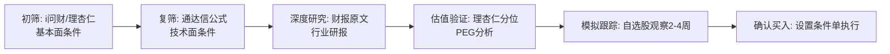
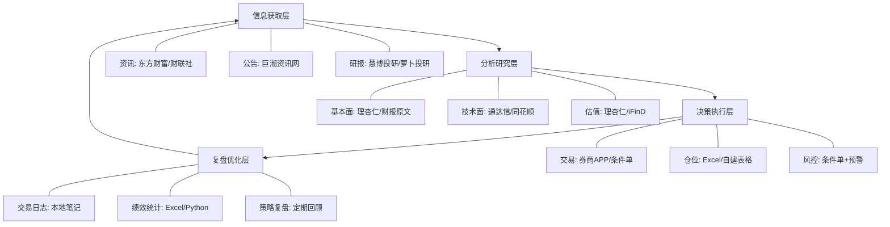

## 一、股票投资工具使用技巧

股票投资工具是投资者获取市场信息、分析行情、执行交易的核心载体。工具本身不产生收益，但工具的使用水平直接决定了信息获取的效率、分析判断的质量和交易执行的精度。

一个完整的股票投资流程可以概括为四个环节：**信息获取→分析研究→决策执行→复盘优化**。每个环节都有对应的工具支撑，工具之间不是孤立的，而是形成一个闭环系统。本节从工具选择、行情软件操作、技术分析工具、基本面分析工具、条件单与自动化、选股工具、量化平台与Python工具、AI辅助分析、移动端与桌面端协同、常见误区、个人工具体系构建、安全与数据保护共十二个维度，系统讲解股票投资工具的使用方法与进阶技巧。

### 1.1 行情软件选择与配置

#### 1.1.1 主流行情软件对比

国内股票行情软件市场经过多年竞争，形成了几个主要产品各有侧重的格局。选择行情软件不能只看"哪个好用"，而要根据自己的投资风格、信息需求和技术水平来匹配。

| 软件 | 核心优势 | 适合人群 | 数据覆盖 | 免费功能 | 付费版本 |
|------|----------|----------|----------|----------|----------|
| 同花顺 | 界面友好，功能全面，AI选股 | 新手到中级投资者 | A股、港股、美股、期货 | 基础行情、K线、资讯 | iFinD（机构级，年费数千元） |
| 东方财富 | 资讯最全，股吧社区，一站式 | 信息驱动型投资者 | A股、港股、基金、理财 | 全功能免费，广告变现 | Choice数据终端 |
| 通达信 | 技术分析最强，公式系统开放 | 技术派、程序化交易者 | A股为主 | 基础行情+公式系统 | 付费版增加高级指标 |
| 雪球 | 深度内容，社区质量高 | 价值投资者 | A股、港股、美股 | 组合跟踪、讨论区 | 雪球Pro（数据增强） |
| 大智慧 | 历史数据全，机构版功能强 | 老股民、机构用户 | A股全历史 | 基础看盘 | 超赢机构版 |
| 聚宽 | 量化回测，Python接口 | 量化交易者 | A股全历史+因子数据 | 基础回测 | 付费增加算力和数据 |

**各软件核心差异深度解析**：

**同花顺**是目前国内用户量最大的行情软件，其优势在于"全"——从看盘、交易、资讯到智能选股，一站式覆盖。它的"问财"功能支持自然语言选股（如输入"ROE连续3年大于15%且PE低于20的股票"），是其他软件不具备的差异化能力。但同花顺的免费版有广告，部分高级功能需要付费解锁。

**东方财富**的核心竞争力在于"生态"——它不仅是一个行情软件，更是一个集成了资讯（东方财富网）、社区（股吧）、基金销售（天天基金）、券商（东方财富证券）的金融生态平台。如果你是东方财富证券的客户，可以直接在APP内完成开户、交易、银证转账等操作，体验非常流畅。其免费功能最为慷慨，几乎所有看盘功能都不收费。

**通达信**是技术分析派的首选工具。它的核心优势在于公式系统——投资者可以使用通达信公式语言（类似简化的编程语言）编写自定义技术指标和条件选股公式。通达信的公式社区积累了数万个用户贡献的指标公式，几乎涵盖了所有主流技术分析方法。此外，通达信支持券商定制版，很多券商的交易软件底层就是通达信。

**选择决策流程**：

1. **明确投资风格**：价值投资选雪球/理杏仁，技术分析选通达信，量化选聚宽/掘金
2. **评估信息需求**：需要全面资讯选东方财富，需要深度研究选Wind/Choice
3. **考虑学习成本**：新手从同花顺或东方财富入门，熟悉后再扩展工具链
4. **测试实际体验**：每个软件下载试用一周，感受操作流畅度和数据呈现方式

#### 1.1.2 高效工具组合方案

单一软件无法满足所有需求，成熟的投资者通常采用"主力+辅助"的组合模式。

**新手入门组合**（零成本）：

- 主力：同花顺（日常看盘、交易）
- 辅助：东方财富（资讯阅读、股吧参考）
- 研究：理杏仁免费版（基础估值数据）

**进阶投资者组合**（年费200-500元）：

- 主力：通达信（自定义公式、技术分析）
- 辅助：同花顺（交易执行、条件单）
- 研究：理杏仁Pro（完整估值、行业对比）
- 社区：雪球（投资逻辑验证）

**专业投资者组合**（年费1000元以上）：

- 主力：通达信/同花顺付费版
- 数据：Wind/Choice终端
- 量化：聚宽/掘金量化
- 研究：理杏仁+巨潮资讯网（年报原文）

**券商选择建议**：行情软件和券商账户是分开的。选择券商时重点考虑以下因素：佣金费率（目前主流券商可做到万分之1.5-2.5）、条件单功能是否完善、是否支持量化接口（PTrade/QMT）、APP体验是否流畅。建议同时开通两家券商——一家佣金低的用于日常交易，一家功能强的用于条件单和量化。

#### 1.1.3 行情软件基础配置

安装行情软件后，不要急于看行情，先完成以下基础配置，否则后续使用效率会大打折扣。

**自选股分组管理**：

合理的自选股分组是高效看盘的基础。建议按以下逻辑分组：

```text
自选股分组结构：
├── 核心持仓（持有的股票，每日必看）
├── 观察池（正在研究、等待买点的股票）
├── 行业龙头（各行业代表性公司，用于感知市场温度）
├── 指数ETF（沪深300、中证500、创业板指等）
└── 异动监控（近期有特殊事件的股票）
```

**自选股数量控制**：自选股不是越多越好。核心持仓组建议不超过10只，观察池不超过20只。过多的自选股会导致注意力分散，反而降低分析质量。定期清理不再关注的标的，保持自选股列表的"干净度"。

**行情界面布局**：

通达信和同花顺都支持自定义界面布局。推荐以下四窗口布局：

| 区域 | 内容 | 用途 |
|------|------|------|
| 左上 | K线图（日K+成交量） | 主要分析区域 |
| 右上 | 分时图 | 盘中实时跟踪 |
| 左下 | 自选股列表 | 快速切换标的 |
| 右下 | 资讯/委托窗口 | 信息获取和交易 |

对于使用多显示器的投资者，可以将通达信设置为多屏模式：一个屏幕专门显示大盘指数和板块热力图，一个屏幕显示个股K线分析，一个屏幕显示交易委托和条件单管理。

**快捷键设置**：

掌握常用快捷键能将看盘效率提升50%以上。以下是通达信/同花顺通用的高频快捷键：

| 快捷键 | 功能 | 使用场景 |
|--------|------|----------|
| F5 | 切换K线/分时 | 最高频操作 |
| F10 | 公司基本面资料 | 快速查看公司信息 |
| Ctrl+F | 公式管理器 | 编写/修改指标公式 |
| Ctrl+D | 系统设置 | 调整显示参数 |
| 数字+. | 切换分时/K线周期 | 1.=1分钟，D=日K，W=周K，M=月K |
| / | 切换技术指标 | 在MACD、KDJ、RSI等之间切换 |
| Ctrl+Q | 标记股票 | 对自选股添加标记/备注 |
| .900 | 进入条件单设置 | 快速设置条件单 |

### 1.2 技术分析工具深度使用

#### 1.2.1 K线图的多层次解读

K线图是技术分析的基础工具，但大多数投资者只停留在"红涨绿跌"的层面。真正有效的K线分析需要从时间周期、形态识别、量价关系三个维度综合判断。

**多周期分析法**：

不同时间周期的K线反映不同层级的趋势，单一周期分析容易产生误判。正确的做法是"大周期定方向，小周期找时机"。

| 周期 | 反映的趋势 | 适合的交易周期 | 关键参考价值 |
|------|-----------|---------------|-------------|
| 月K | 长期趋势（1年以上） | 长线持有 | 判断牛熊大势 |
| 周K | 中期趋势（1-6个月） | 波段操作 | 判断中期方向 |
| 日K | 短期趋势（1-4周） | 短线波段 | 判断买卖时机 |
| 60分钟 | 超短线（数天） | 短线交易 | 精确入场点 |
| 15分钟/5分钟 | 日内波动 | 日内T+0 | 盘中高抛低吸 |

**实际操作流程**：先看月K确认大趋势方向，再看周K确定中期位置，然后在日K上寻找具体的买入/卖出信号，最后用60分钟或30分钟K线精确入场时机。如果月K和周K方向矛盾，说明市场处于转折期，此时应减小仓位或观望。

**关键K线形态识别**：

以下是实战中最具参考价值的K线形态，按信号强度排序：

| 形态名称 | 出现位置 | 信号含义 | 可靠度 | 确认条件 |
|----------|----------|----------|--------|----------|
| 锤子线 | 下跌末期 | 看涨反转 | 高 | 次日收阳，放量 |
| 吞没形态 | 趋势末端 | 强反转信号 | 高 | 成交量明显放大 |
| 十字星 | 趋势中途/末端 | 方向不明/反转 | 中 | 需后续K线确认 |
| 三连阳 | 底部区域 | 多头启动 | 中高 | 量能逐步放大 |
| 乌云盖顶 | 上涨末期 | 看跌反转 | 高 | 次日继续下跌确认 |
| 早晨之星 | 下跌末期 | 强看涨反转 | 高 | 第三根阳线实体超过第一根阴线一半 |
| 黄昏之星 | 上涨末期 | 强看跌反转 | 高 | 第三根阴线实体超过第一根阳线一半 |
| 红三兵 | 底部或回调结束 | 多头强势启动 | 中高 | 三根阳线实体逐渐增大 |

**形态识别的注意事项**：K线形态不是100%可靠的信号，必须结合位置、成交量、市场环境综合判断。同一个形态出现在不同位置，含义完全不同。例如，十字星在上涨趋势末端是反转信号，在上涨中途则只是短暂休整。判断形态时，要问自己三个问题：这个形态出现在什么位置？成交量是否配合？大周期趋势是什么方向？

**量价关系分析**：

成交量是验证价格信号真实性的关键指标。以下是量价配合的基本规律：

- **量增价涨**：多头强势，趋势健康，可以继续持有
- **量增价跌**：空头释放，可能恐慌出逃，注意止损
- **量缩价涨**：上涨乏力，后续动力不足，警惕回调
- **量缩价跌**：下跌动能衰竭，可能接近底部
- **天量天价**：阶段性顶部信号，考虑减仓
- **地量地价**：阶段性底部信号，关注是否企稳

**成交量的进阶分析——换手率**：换手率是成交量与流通股本的比值，比绝对成交量更有参考意义。不同市值的股票，同样的成交量含义完全不同。一般来说：日换手率低于1%说明交投清淡，3%-7%属于正常活跃，超过10%说明有大资金在激烈博弈，超过20%则需要高度警惕——可能是主力出货的信号。

#### 1.2.2 常用技术指标使用详解

技术指标是将价格和成交量数据通过数学公式计算后得出的衍生数据。指标的价值在于将复杂的市场信息浓缩为可量化的信号，但每个指标都有其适用条件和局限性。

**均线系统（MA）**：

均线是最基础也最实用的趋势指标。核心原理是通过计算一段时间内的平均价格来平滑价格波动，揭示趋势方向。

| 均线组合 | 用途 | 参数设置 | 信号规则 |
|----------|------|----------|----------|
| MA5 + MA10 | 短线趋势 | 5日和10日 | 金叉买入，死叉卖出 |
| MA5 + MA20 + MA60 | 中短结合 | 5/20/60日 | 三线多头排列为强势 |
| MA120 + MA250 | 长期趋势 | 半年线和年线 | 站上年线为牛市特征 |

**均线使用要点**：

- 均线适合趋势行情，震荡市中会频繁出现假信号（均线缠绕）
- 价格远离均线时（乖离率过大），有向均线回归的倾向
- 均线斜率比均线位置更重要——向上倾斜的MA20比向下倾斜的MA60更有支撑力
- 不同股票的"性格"不同，有些股票天然贴近MA20运行，有些则习惯沿着MA10运行，需要观察后调整参数

**均线实战技巧——葛兰碧八大法则**：葛兰碧（Granville）提出的均线交易法则是均线应用的经典框架。核心思想是：价格与均线的关系会产生八种交易信号——四个买入信号（均线向上时的回调不破均线、突破均线、超跌反弹至均线附近、跌破均线后快速收回）和四个卖出信号（均线向下时的反弹不过均线、跌破均线、超涨回落至均线附近、突破均线后快速回落）。在实际使用中，重点掌握"均线向上+价格回调至均线附近=买入机会"和"均线向下+价格反弹至均线附近=卖出机会"这两个核心场景。

**MACD指标**：

MACD（指数平滑异同移动平均线）是最经典的中线指标，由DIF线、DEA线和柱状图组成。

| 信号类型 | 具体表现 | 操作建议 | 注意事项 |
|----------|----------|----------|----------|
| 金叉 | DIF上穿DEA | 买入信号 | 零轴上方金叉强于零轴下方 |
| 死叉 | DIF下穿DEA | 卖出信号 | 零轴下方死叉强于零轴上方 |
| 顶背离 | 价格新高，MACD不创新高 | 顶部预警 | 需要其他信号确认 |
| 底背离 | 价格新低，MACD不创新低 | 底部预警 | 连续背离后信号更强 |
| 红柱放大 | 多头动能增强 | 趋势加速 | 注意顶部放量滞涨 |
| 绿柱缩小 | 空头动能衰减 | 可能企稳 | 配合价格止跌确认 |

**MACD进阶用法——多周期共振**：

当日K的MACD出现金叉时，如果周K的MACD也在零轴上方或即将金叉，则信号的可靠性大幅提升。反之，如果日K金叉但周K处于死叉下行状态，这个金叉大概率是反弹而非反转。

**MACD进阶用法——零轴的分水岭意义**：零轴是MACD的灵魂。DIF在零轴上方运行，说明中短期均线在长期均线上方，市场处于多头格局；DIF在零轴下方运行，说明市场处于空头格局。零轴上方的金叉是"多头回调后的再次启动"，可靠性远高于零轴下方的金叉（那可能只是空头趋势中的反弹）。实战中，零轴上方的金叉配合放量突破，是最可靠的中期买入信号之一。

**RSI指标**：

RSI（相对强弱指标）衡量一段时间内上涨幅度与下跌幅度的比值，反映市场的超买超卖状态。

- RSI > 80：超买区域，短期有回调风险
- RSI 50-80：多头区域，趋势偏强
- RSI 20-50：空头区域，趋势偏弱
- RSI < 20：超卖区域，短期有反弹可能

**RSI使用陷阱**：在强势上涨行情中，RSI可以长期维持在70以上运行，此时"超买"信号反而意味着趋势强劲，不应盲目做空。同理，在恐慌性下跌中，RSI可以长期处于30以下。RSI的超买超卖信号在震荡市中最有效，在趋势市中容易"抄底抄在半山腰"。

**RSI的背离用法**：RSI背离比超买超卖信号更可靠。当价格创新高但RSI未能创新高（顶背离），说明上涨动能在衰减，是比RSI单纯进入超买区更强的卖出信号。背离的级别越高（周线级别背离比日线级别背离更可靠），信号越强。连续两次甚至三次背离后，反转的概率显著增加。

**布林带（BOLL）**：

布林带由中轨（MA20）、上轨（MA20+2倍标准差）、下轨（MA20-2倍标准差）组成，反映价格的波动区间。

- 价格触及上轨：短期可能回调，但强势突破上轨则为"开口"信号
- 价格触及下轨：短期可能反弹，但跌破下轨则为恐慌信号
- 布林带收窄（缩口）：市场波动率降低，即将出现大行情（方向待定）
- 布林带扩张（开口）：行情启动信号，配合成交量判断方向

**布林带实战技巧**：布林带缩口是最重要的信号之一。当布林带上轨和下轨的距离收窄到极致时（通常持续5-15个交易日），说明市场经历了长时间的窄幅震荡，多空双方力量趋于平衡。一旦价格放量突破布林带上轨，大概率开启一波上涨行情；反之，跌破下轨则可能开始下跌。缩口时间越长、开口幅度越大，后续行情的力度通常越强。

**KDJ指标**：

KDJ（随机指标）是比RSI更敏感的短线摆动指标，由K线、D线、J线三条线组成。KDJ的优势在于对价格变化的反应速度快，适合捕捉短线买卖点。

- K值和D值在20以下金叉：短线买入信号
- K值和D值在80以上死叉：短线卖出信号
- J值超过100：极度超买，回调概率大
- J值低于0：极度超卖，反弹概率大

KDJ的缺点是信号过于频繁，在趋势行情中容易出现大量假信号。因此KDJ最好配合趋势指标（如均线）使用——只有在均线系统显示趋势向上时，才参考KDJ的超卖金叉作为买入信号。

**指标组合使用原则**：

单一指标的胜率通常在50%-60%之间，通过合理的指标组合可以提高判断的准确度。核心原则是"不同类型指标搭配使用"：

| 指标类型 | 代表指标 | 擅长判断 | 常见搭配 |
|----------|----------|----------|----------|
| 趋势指标 | MA、MACD | 趋势方向 | +摆动指标确认入场 |
| 摆动指标 | RSI、KDJ | 超买超卖 | +趋势指标过滤方向 |
| 波动指标 | 布林带、ATR | 波动率变化 | +成交量确认突破 |
| 量能指标 | 成交量、OBV | 资金流向 | +价格形态验证 |

最佳的组合方式是：一个趋势指标（判断方向）+ 一个摆动指标（判断时机）+ 成交量（验证信号）。例如：MA（趋势）+ RSI（时机）+ 成交量（验证）。

### 1.3 基本面分析工具使用

#### 1.3.1 理杏仁深度使用

理杏仁是国内最受欢迎的个股基本面数据平台，其核心价值在于将复杂的财务数据可视化，并提供历史分位数分析。

**估值分析核心用法**：

理杏仁的估值页面提供了PE、PB、PS、股息率等多个估值指标的历史走势图和分位数分布。使用时要注意以下要点：

1. **选择正确的估值指标**：
   - 盈利稳定的公司（消费、公用事业）：用PE（市盈率）
   - 重资产行业（银行、地产、钢铁）：用PB（市净率）
   - 高成长但暂未盈利的公司：用PS（市销率）
   - 高分红的成熟公司：用股息率
   - 互联网/SaaS公司：用PS或EV/Revenue（企业价值/收入）
   - 周期性行业（有色、化工、猪肉）：用"PB+利润周期"联合判断，不能只看PB低就买入

2. **设置合理的时间窗口**：
   - 查看PE分位时，默认的5年/10年窗口可能不包含完整的牛熊周期
   - 建议至少覆盖一个完整的牛熊周期（A股通常7-8年）
   - 对于行业周期性强的公司，需要覆盖至少两个完整周期

3. **分位数解读标准**：

| PE分位 | 估值状态 | 操作建议 | 补充说明 |
|--------|----------|----------|----------|
| < 10% | 极度低估 | 重点关注买入机会 | 需确认基本面没有恶化 |
| 10%-30% | 低估 | 可以分批建仓 | 安全边际较高 |
| 30%-50% | 合理偏低 | 小仓位试探 | 适合定投开始 |
| 50%-70% | 合理 | 持有观望 | 不加不减 |
| 70%-90% | 高估 | 逐步减仓 | 锁定部分利润 |
| > 90% | 极度高估 | 考虑清仓 | 泡沫风险大 |

**重要提醒**：分位数只是历史参考，不能机械套用。如果一家公司的基本面发生了根本性变化（如行业被颠覆、核心竞争力丧失），历史估值分位就失去了参考意义。估值分析必须结合对公司基本面的判断来使用。

**理杏仁的PEG分析**：PEG = PE / 未来3-5年的预期盈利增长率。PEG是连接估值和成长性的桥梁指标。PEG < 1说明估值相对于成长性偏低（有吸引力），PEG在1-1.5之间属于合理范围，PEG > 2则可能估值过高。使用PEG时要注意：预期增长率是关键假设，不同来源的预期可能差异很大，建议用自己的保守估计而非券商的乐观预测。

**行业对比功能**：

理杏仁的行业对比功能可以将目标公司与同行业其他公司在PE、PB、ROE、毛利率等指标上进行横向对比。使用方法：

1. 在个股页面找到"行业对比"标签
2. 重点关注ROE排名靠前但PE排名靠后的公司——这可能是被低估的优质公司
3. 注意排除异常值：如果某公司PE极低，要检查是否因为一次性收益导致利润暴增

**财务健康度检查**：

在理杏仁上查看以下关键财务指标，可以快速判断一家公司的财务健康度：

| 指标 | 健康标准 | 危险信号 | 查看位置 |
|------|----------|----------|----------|
| 资产负债率 | < 60%（非金融） | > 70%且持续上升 | 资产负债表 |
| 经营现金流 | 持续为正，且 > 净利润 | 连续为负或远低于净利润 | 现金流量表 |
| ROE | > 15%且稳定 | 持续下滑或< 8% | 杜邦分析 |
| 毛利率 | 稳定或上升 | 持续下降 | 利润表 |
| 应收账款周转天数 | 稳定 | 大幅增加 | 运营能力 |
| 商誉占净资产比 | < 20% | > 50% | 资产负债表 |
| 有息负债率 | < 30% | > 50%且持续上升 | 负债明细 |

**商誉风险排查**：商誉是企业并购时支付的溢价。如果一家公司的商誉占净资产比例超过30%，就需要高度警惕——一旦被并购的公司业绩不达预期，就会触发商誉减值（俗称"暴雷"），直接吞噬利润。在理杏仁上查看商誉占净资产比的趋势变化，如果逐年上升，说明公司持续高溢价并购，风险在累积。

#### 1.3.2 财报阅读工具

理杏仁提供的是数据汇总，但真正深入的基本面分析需要阅读原始财报。以下是高效阅读财报的工具和方法。

**巨潮资讯网**（cninfo.com.cn）：证监会指定信息披露网站，所有上市公司年报、季报、公告的原始PDF都可以在这里找到。

**财报阅读顺序**（以年报为例）：

1. **管理层讨论与分析（MD&A）**：管理层对公司经营状况的自我评价，重点关注"核心竞争力分析"和"未来展望"
2. **财务报表附注**：会计政策、关联交易、重大合同等细节
3. **利润表**：收入构成、成本结构、费用变化
4. **资产负债表**：资产质量、负债结构、股东权益
5. **现金流量表**：经营/投资/筹资三大现金流的匹配关系

**财报阅读的"三张表交叉验证"方法**：不要孤立地看任何一张财务报表。利润表上的"净利润"需要与现金流量表上的"经营现金流"交叉验证——如果一家公司连续多年净利润为正但经营现金流为负，说明利润可能是"纸面利润"（应收账款堆积、收入确认激进等）。同理，资产负债表上的"固定资产"增长要与现金流量表上的"购建固定资产支出"对应，如果固定资产大幅增长但没有对应的资本支出，可能存在资产虚增。

**AI辅助财报分析**：

利用大语言模型辅助阅读财报是近年来的新趋势。具体方法：

- 将财报PDF上传到支持长文档的AI工具（如Kimi、Claude、DeepSeek）
- 用结构化提示词引导分析："请分析这份年报的以下方面：1）收入增长的主要驱动力；2）毛利率变化的原因；3）现金流与净利润的匹配度；4）主要风险因素"
- 人工验证AI的分析结论，特别关注数据引用是否准确
- 可以让AI对比同行业多家公司的财报，生成行业横向对比分析

**AI辅助分析的局限性**：AI工具擅长快速提取和整理信息，但不能替代投资者的独立判断。AI可能遗漏财报中的"隐藏信息"（如附注中的关联交易、或有负债），也可能过度依赖表面数据而忽视定性信息。最有效的使用方式是：先用AI快速了解财报全貌和关键数据，再人工深入阅读管理层讨论、附注等需要判断力的部分。

#### 1.3.3 其他基本面分析工具

**Wind金融终端**：国内最专业的金融数据终端，覆盖全球市场数据，是机构投资者的标配。提供宏观经济数据、行业数据、公司财务数据、债券数据、衍生品数据等全品类数据。年费约3-5万元，个人投资者通常使用不起，但可以关注Wind免费的"Wind资讯"公众号获取部分宏观数据和行业研报。

**Choice金融终端**：东方财富旗下的专业数据终端，功能介于Wind和理杏仁之间，价格也介于两者之间（年费约3000-8000元）。对于个人投资者来说，Choice是性价比最高的专业数据工具，特别适合需要频繁查看行业数据和研报的投资者。

**慧博投研/萝卜投研**：研报聚合平台。券商研报是了解行业和公司的重要信息来源，但研报分散在各家券商的系统中。慧博和萝卜投研将所有券商研报整合在一个平台上，支持关键词搜索和分类浏览。免费版可以查看研报摘要，付费版可以下载完整研报。

### 1.4 条件单与自动化交易工具

#### 1.4.1 条件单类型与设置

条件单是券商交易软件提供的自动化委托功能，当满足预设条件时系统自动下单。条件单的核心价值是帮助投资者克服情绪干扰，严格执行预设的交易计划。

**条件单类型详解**：

| 类型 | 功能描述 | 典型场景 | 设置要点 |
|------|----------|----------|----------|
| 价格条件单 | 价格触及目标时触发 | 止损、止盈、突破买入 | 设置触发价和委托价，两者可以不同 |
| 时间条件单 | 指定时间自动执行 | 尾盘操作、定时定投 | 注意避开集合竞价时段 |
| 涨跌幅条件单 | 涨跌幅达到阈值时触发 | 追涨、杀跌保护 | 阈值不宜设得过小，避免频繁触发 |
| 累计涨跌幅条件单 | 多日累计涨跌幅触发 | 波段跟踪 | 适合趋势跟踪策略 |
| 新股申购条件单 | 新股自动申购 | 打新 | 一键申购所有新股 |
| 开板卖出条件单 | 涨停板打开时卖出 | 打新中签后卖出 | 防止忘记卖出中签新股 |
| 定时埋单 | 指定时间以指定价格下单 | 尾盘抢筹、开盘抢卖 | 提前设置，到时间自动提交 |
| 持仓止损单 | 基于持仓成本价设置止损 | 保护已有利润 | 按成本价的百分比设置 |

**价格条件单实战设置示例**：

场景：以25.50元买入某股票，计划止损位24.00元（亏损约6%），止盈位30.00元（盈利约18%）。

止损条件单设置：

```text
触发条件：价格 <= 24.00
委托方向：卖出
委托价格：23.90（低于触发价，确保成交）
委托数量：全部持仓
有效期：30个交易日（需定期续期）
```

止盈条件单设置：

```text
触发条件：价格 >= 30.00
委托方向：卖出
委托价格：29.90（略低于触发价，确保成交）
委托数量：分两档，30元卖出50%，32元卖出剩余50%
```

**分批止盈策略**：不建议一次性全部卖出。将止盈分为2-3档，价格每上一个台阶卖出一部分。这样既能锁定部分利润，又能在股价继续上涨时保持仓位。例如：目标价30元卖出1/3，32元再卖1/3，剩余1/3用移动止盈（价格从最高点回落5%时卖出）保护。

#### 1.4.2 条件单使用注意事项

条件单看似简单，但使用不当可能造成意外损失。以下是关键注意事项：

**常见陷阱与对策**：

| 陷阱 | 具体表现 | 应对方法 |
|------|----------|----------|
| 假突破触发 | 瞬间触及条件价后回落 | 设置"连续N分钟满足条件"的高级条件单 |
| 委托未成交 | 触发但价格已跳过 | 委托价留足余量，或用市价委托 |
| 有效期遗忘 | 条件单过期未续 | 设置日历提醒，每周检查一次 |
| 集合竞价误触发 | 开盘前价格异常 | 避免设置过于接近当前价格的条件 |
| 除权除息干扰 | 送股分红导致价格变动 | 除权日前检查并调整条件单价格 |
| 多券商冲突 | 多个券商条件单同时触发 | 选定一个主力券商设置条件单 |
| 停牌后复牌 | 停牌期间条件单状态异常 | 复牌后第一时间检查条件单状态 |

**条件单不能替代的事情**：

- 条件单不能代替投资决策：先有明确的买卖逻辑，再设置条件单执行
- 条件单不能防范系统性风险：极端行情（如连续跌停）可能无法成交
- 条件单不能替代仓位管理：它是执行工具，不是风控系统
- 条件单不能完全无人值守：至少每周检查一次执行状态

#### 1.4.3 进阶自动化工具

**券商QMT/PTrade系统**：部分券商提供专业的量化交易系统（如恒生PTrade、迅投QMT），支持Python编程实现复杂的交易策略。与普通条件单相比，QMT/PTrade可以实现更复杂的逻辑：多股票联动、动态仓位调整、基于因子的选股+交易一体化策略等。开通门槛通常是资产50万元以上。

**第三方自动化工具**：一些第三方平台（如掘金量化、米筐RiceQuant）提供了从策略开发、回测到实盘交易的一站式解决方案。这些平台通常支持Python编程，提供丰富的金融数据库和回测引擎。使用第三方工具时要注意资金安全——确保资金始终在券商账户中，第三方平台只负责发送交易指令。

### 1.5 选股工具与筛选策略

#### 1.5.1 同花顺i问财选股

i问财（同花顺旗下）是国内最强大的自然语言选股工具，支持用中文描述条件进行股票筛选。

**常用筛选条件组合**：

价值投资选股：

```text
ROE > 15%，连续3年
PE < 20
资产负债率 < 60%
股息率 > 3%
市值 > 100亿
```

成长股选股：

```text
营收增长率 > 20%，连续2年
净利润增长率 > 25%
毛利率 > 30%
研发投入占比 > 5%
市值 50-500亿
```

困境反转选股：

```text
过去1年股价跌幅 > 30%
最新季度营收环比增长 > 10%
机构持仓比例增加
市盈率处于历史低位
```

**i问财高级技巧**：i问财支持非常灵活的自然语言查询。你可以用日常中文描述复杂的筛选条件，比如"毛利率连续3年上升且ROE大于20%的消费行业股票"，或者"最近一个季度社保基金新进且股价在年线附近的股票"。建议多尝试不同的表述方式，i问财的理解能力比你想象的更强。筛选结果可以直接导出为Excel，方便后续分析。

#### 1.5.2 通达信公式选股

通达信的公式系统是技术派选股的利器。通过编写条件选股公式，可以从全市场4000+只股票中快速筛选出符合技术形态的标的。

**基础条件选股公式示例**：

均线多头排列选股：

```text
MA5:=MA(CLOSE,5);
MA10:=MA(CLOSE,10);
MA20:=MA(CLOSE,20);
MA60:=MA(CLOSE,60);
多头排列:=MA5>MA10 AND MA10>MA20 AND MA20>MA60;
今日突破:=CROSS(CLOSE,MA5) AND REF(CLOSE,1)<REF(MA5,1);
选股:多头排列 AND 今日突破;
```

MACD底背离选股：

```text
DIF:=EMA(CLOSE,12)-EMA(CLOSE,26);
DEA:=EMA(DIF,9);
MACD:=(DIF-DEA)*2;
价格新低:=CLOSE<REF(LLV(CLOSE,20),1);
MACD不新低:=DIF>REF(LLV(DIF,20),1);
底背离:价格新低 AND MACD不新低 AND DIF<0;
```

成交量突破选股：

```text
量比:=VOL/REF(MA(VOL,5),1);
价格突破:=CLOSE>REF(HHV(HIGH,20),1);
放量突破:量比>2 AND 价格突破 AND CLOSE>OPEN;
```

**通达信公式进阶技巧**：通达信公式语言虽然简单，但能实现很多实用的选股逻辑。掌握以下几个进阶函数能大幅提升选股能力：`EVERY(X,N)`——连续N天满足条件X；`COUNT(X,N)`——N天内满足条件X的天数；`HHV(X,N)`和`LLV(X,N)`——N天内的最高值和最低值；`BARSLAST(X)`——上次满足条件X到现在的天数。通过组合这些函数，可以编写出非常精准的选股条件。

#### 1.5.3 理杏仁选股器

理杏仁的选股器侧重基本面筛选，适合价值投资者和长期投资者使用。

**使用步骤**：

1. 进入理杏仁"选股器"页面
2. 设置市场范围（沪深A股/创业板/科创板等）
3. 添加估值条件（PE分位、PB分位）
4. 添加财务条件（ROE、毛利率、负债率）
5. 添加成长条件（营收增速、利润增速）
6. 导出结果列表，逐一深入研究

**筛选后的深度研究清单**：

通过选股器筛选出候选股票后，还需要逐一进行深度研究：

- 阅读最近3年年报，了解业务变化
- 查看管理层持股变动（是否增持）
- 了解行业竞争格局和公司护城河
- 查看机构持仓变化趋势
- 分析估值是否合理（不仅仅看分位数）
- 检查是否有重大诉讼、监管处罚等负面事件
- 关注公司的股权质押比例——大股东高比例质押是潜在风险信号

#### 1.5.4 多工具交叉验证选股流程

成熟的选股流程不是单一工具完成的，而是多工具交叉验证的过程：



这个流程的核心思想是"先粗后细、先量后质"——通过量化条件快速缩小范围，再通过深度研究精选标的。整个流程通常需要1-2周时间，不要急于从筛选到买入。

### 1.6 量化平台与Python工具

#### 1.6.1 主流量化平台对比

当投资者的技术分析和基本面分析能力达到一定水平后，量化工具可以将投资策略系统化、可回测化。以下是主流量化平台的对比：

| 平台 | 核心能力 | 编程语言 | 数据覆盖 | 免费额度 | 适合人群 |
|------|----------|----------|----------|----------|----------|
| 聚宽（JoinQuant） | 回测+模拟+实盘 | Python | A股全历史+因子 | 每日有限回测次数 | 入门量化 |
| 掘金量化（MyQuant） | 本地化回测+实盘 | Python/C++ | A股+期货 | 社区版免费 | 有一定编程基础 |
| 米筐（RiceQuant） | 机构级回测 | Python | 全市场 | 免费版功能受限 | 进阶量化 |
| 优矿（Uqer） | 因子分析 | Python | A股+港股 | 基础功能免费 | 因子投资 |
| Backtrader（开源） | 本地回测框架 | Python | 需自备数据 | 完全免费 | 有编程能力的投资者 |
| vnpy（开源） | 量化交易框架 | Python | 需自备数据 | 完全免费 | 程序化交易 |

**平台选择建议**：如果你刚开始接触量化，推荐从聚宽开始——它的社区教程最完善，数据最全，且支持在线编程环境（不需要本地安装Python）。如果你有编程基础且希望更灵活的控制，推荐掘金量化或Backtrader。

#### 1.6.2 Python数据分析基础

Python是量化投资的核心工具语言。以下是股票分析中最常用的Python库：

| 库 | 用途 | 典型应用 |
|----|------|----------|
| pandas | 数据处理 | 读取CSV、处理时间序列、计算指标 |
| numpy | 数值计算 | 矩阵运算、统计计算 |
| matplotlib/seaborn | 数据可视化 | 绘制K线图、收益曲线、热力图 |
| tushare/akshare | 股票数据获取 | 获取A股历史行情、财务数据 |
| backtrader | 策略回测 | 编写交易策略、历史回测 |
| statsmodels | 统计分析 | 回归分析、协整检验 |
| scikit-learn | 机器学习 | 多因子选股、分类预测 |

**tushare使用示例**——获取个股历史数据：

```python
import tushare as ts
import pandas as pd

# 设置token（需在tushare.pro注册获取）
ts.set_token('你的token')
pro = ts.pro_api()

# 获取贵州茅台日线数据
df = ts.pro_bar(
    ts_code='600519.SH',
    start_date='20200101',
    end_date='20241231',
    adj='qfq'  # 前复权
)

# 计算均线
df['MA5'] = df['close'].rolling(5).mean()
df['MA20'] = df['close'].rolling(20).mean()
df['MA60'] = df['close'].rolling(60).mean()

# 计算RSI
delta = df['close'].diff()
gain = delta.where(delta > 0, 0).rolling(14).mean()
loss = (-delta.where(delta < 0, 0)).rolling(14).mean()
df['RSI'] = 100 - (100 / (1 + gain / loss))

print(df.tail())
```

**akshare使用示例**——获取A股实时行情（akshare是免费开源库，无需注册）：

```python
import akshare as ak

# 获取A股实时行情
df = ak.stock_zh_a_spot_em()
print(df.head())

# 获取个股历史K线
df = ak.stock_zh_a_hist(
    symbol="600519",
    period="daily",
    start_date="20200101",
    end_date="20241231",
    adjust="qfq"
)
print(df.tail())
```

#### 1.6.3 策略回测基础流程

量化投资的核心价值在于"先验证、后执行"。以下是一个完整的策略回测流程：

1. **策略构思**：基于投资逻辑形成可量化的交易规则（如"当MA5上穿MA20且成交量放大1.5倍时买入，当MA5下穿MA20时卖出"）
2. **数据准备**：获取历史行情数据，清洗和预处理
3. **编写策略代码**：将交易规则翻译为代码逻辑
4. **回测执行**：在历史数据上模拟交易，计算收益、最大回撤、夏普比率等指标
5. **参数优化**：在合理范围内调整策略参数，但要避免过度拟合
6. **样本外验证**：用策略未见过的数据验证策略有效性
7. **模拟交易**：在模拟环境中运行策略1-3个月，验证实盘可行性
8. **小资金实盘**：用小资金实盘运行，逐步放大仓位

**回测关键指标**：

| 指标 | 含义 | 合格标准 |
|------|------|----------|
| 年化收益率 | 策略的年化回报 | > 15%（A股） |
| 最大回撤 | 最大亏损幅度 | < 25% |
| 夏普比率 | 风险调整后收益 | > 1.0 |
| 胜率 | 盈利交易占比 | > 45%（趋势策略）或 > 55%（均值回归策略） |
| 盈亏比 | 平均盈利/平均亏损 | > 1.5 |
| 交易次数 | 回测期间总交易次数 | > 100次（统计意义） |

**回测的常见陷阱**：

- **过度拟合**：策略参数完美适配历史数据，但在新数据上表现糟糕。解决方法：使用样本外数据验证，参数不宜过多（不超过3个）
- **幸存者偏差**：只用当前存在的股票回测，忽略了已退市的股票。解决方法：使用包含退市股票的全历史数据
- **未来函数**：代码中无意间使用了未来才知道的数据（如用当日收盘价决定当日开盘时是否买入）。解决方法：仔细检查信号触发的时间点
- **忽略交易成本**：未计算佣金、印花税、滑点。A股交易成本约为单边0.15%（佣金+印花税+滑点），频繁交易时成本侵蚀显著

### 1.7 AI辅助分析工具

#### 1.7.1 AI在股票分析中的应用场景

大语言模型（LLM）的快速发展为股票分析提供了新的工具维度。以下是AI在股票分析中的主要应用场景：

| 应用场景 | 具体用法 | 适合的AI工具 | 注意事项 |
|----------|----------|-------------|----------|
| 财报速读 | 上传PDF，提取关键数据和风险点 | Kimi、Claude、DeepSeek | 需人工验证数据准确性 |
| 研报摘要 | 批量总结研报核心观点 | ChatGPT、DeepSeek | 关注一致性结论而非单一观点 |
| 行业分析 | 输入行业关键词，生成分析框架 | 任何LLM | 作为起点，需自行补充数据 |
| 新闻解读 | 分析政策/事件对个股的影响 | DeepSeek、Kimi | AI可能缺乏最新信息 |
| 选股辅助 | 描述投资逻辑，让AI推荐筛选条件 | ChatGPT、Claude | 推荐条件需在专业工具中验证 |
| 交易日志分析 | 汇总分析历史交易记录 | 任何LLM | 发现自己忽视的模式和偏见 |

**AI辅助财报分析的实操模板**：

将以下提示词配合财报PDF一起输入AI工具：

```text
请从以下维度分析这份年度报告：

1. 【核心数据提取】收入、净利润、经营现金流、ROE、资产负债率的同比变化
2. 【收入结构】各业务板块的收入占比和增长情况，哪个板块是主要增长驱动
3. 【盈利能力】毛利率、净利率的变化趋势及原因
4. 【现金流质量】经营现金流与净利润的匹配度，是否存在异常
5. 【风险因素】管理层在"风险"部分提到了哪些风险，你认为哪些最值得关注
6. 【竞争格局】管理层对公司竞争优势的描述是否可信
7. 【总体评价】用一句话总结这份年报的核心信息

请用数据支撑你的分析结论，不要空泛描述。
```

#### 1.7.2 AI选股与量化辅助

AI不仅可以辅助分析，还可以直接参与选股逻辑的构建：

**用AI生成通达信公式**：你可以用自然语言向AI描述选股逻辑，让AI将其翻译为通达信公式代码。例如，告诉AI："帮我写一个通达信条件选股公式，选出最近5天成交量逐日放大、今天收盘价突破20日最高价、且MACD在零轴上方的股票。"AI可以生成可直接使用的公式代码，你只需在通达信中测试验证。

**用AI生成Python选股脚本**：类似地，你可以让AI用Python+tushare/akshare编写选股脚本，实现更复杂的筛选逻辑。AI生成的代码通常需要小幅调试，但能大幅降低编程门槛。

**AI辅助的局限性**：

- AI不能预测股价走势，任何声称AI能预测涨跌的说法都不可信
- AI的分析基于历史数据和文本信息，不具有信息优势
- AI可能产生"幻觉"（编造不存在的数据），必须交叉验证
- AI不适合作为交易决策的唯一依据，它是辅助工具而非决策者

### 1.8 移动端与桌面端协同

#### 1.8.1 各场景的最佳设备选择

| 场景 | 推荐设备 | 原因 | 推荐工具 |
|------|----------|------|----------|
| 日常盯盘 | 手机 | 随时随地，碎片化使用 | 同花顺/东方财富APP |
| 深度研究 | 电脑（大屏） | 多窗口对比，效率最高 | 通达信+浏览器 |
| 交易执行 | 手机或电脑 | 速度优先 | 券商APP（条件单设置） |
| 数据分析 | 电脑 | Excel/Python处理数据 | 理杏仁导出+本地分析 |
| 阅读资讯 | 手机/平板 | 舒适阅读 | 雪球APP/东方财富 |
| 量化回测 | 电脑 | 编程和计算需求 | 聚宽/Jupyter Notebook |

#### 1.8.2 高效协同工作流

成熟的投资者会建立一套跨设备的协同工作流，确保信息不断层：

**晨间流程**（开盘前30分钟）：

1. 手机打开东方财富APP，快速浏览隔夜资讯和外盘表现
2. 电脑打开通达信，检查自选股的开盘竞价情况
3. 确认条件单状态，有无除权除息需要调整

**盘中流程**：

1. 手机保持同花顺分时图页面，监控核心持仓
2. 设置价格预警（而非一直盯盘），触发时再详细分析
3. 重大异动时切换到电脑端深入分析

**盘后流程**：

1. 电脑端复盘当日行情，记录交易日志
2. 使用理杏仁更新估值数据
3. 在雪球阅读目标公司的深度分析文章
4. 更新次日的条件单和价格预警

**周末深度研究流程**：

周末是深度研究的最佳时间，不受盘中行情干扰：

1. 周六上午：阅读本周未读完的券商研报，更新行业认知
2. 周六下午：使用理杏仁/i问财进行选股筛选，更新观察池
3. 周日上午：阅读财报（如果有新的季报/年报发布）
4. 周日下午：复盘本周交易，更新交易日志，制定下周计划

### 1.9 投资工具使用的常见误区

#### 1.9.1 技术分析工具误区

| 误区 | 错误表现 | 正确认知 |
|------|----------|----------|
| 指标越多越好 | 屏幕上叠加10+个指标 | 3个不同类型指标足够，过多反而矛盾 |
| 追求精确预测 | 试图通过指标精确预测价格 | 指标提供概率判断，不是确定性预测 |
| 忽视市场环境 | 在震荡市用趋势指标 | 不同市况选择不同指标 |
| 过度优化参数 | 反复调整参数拟合历史 | 标准参数最稳健，过度优化是"曲线拟合" |
| 只看技术面 | 完全忽视基本面 | 技术面决定时机，基本面决定方向 |
| 忽视时间周期 | 只看一个周期的K线 | 多周期共振的信号才可靠 |
| 形态教条化 | 看到锤子线就买 | 形态必须结合位置和成交量判断 |

#### 1.9.2 基本面分析工具误区

| 误区 | 错误表现 | 正确认知 |
|------|----------|----------|
| 盲信低PE | PE低就是便宜 | 低PE可能反映市场对前景的悲观预期 |
| 忽视现金流 | 只看利润不看现金流 | 利润可以粉饰，现金流更难造假 |
| 静态看估值 | 用当前PE判断贵贱 | 应该用动态PE（预期盈利）和PEG判断 |
| 忽视行业差异 | 用同一标准套所有行业 | 不同行业有不同的估值逻辑 |
| 数据滞后性 | 直接用季报数据做决策 | 财报数据有滞后，需要结合最新经营数据判断 |
| 迷信历史分位 | PE分位低就买入 | 公司基本面变化后历史分位失去参考意义 |
| 忽视商誉风险 | 不检查商誉占比 | 高商誉是定时炸弹，必须排查 |

#### 1.9.3 条件单使用误区

| 误区 | 错误表现 | 正确认知 |
|------|----------|----------|
| 设置后不管 | 条件单到期忘记续期 | 每周检查一次条件单状态 |
| 过于频繁 | 每天调整条件单参数 | 给策略足够的时间验证 |
| 一刀切止损 | 所有股票同一个止损比例 | 根据个股波动率设置差异化止损 |
| 依赖条件单炒股 | 设完条件单就不管市场了 | 条件单是执行工具，不是决策替代 |

#### 1.9.4 量化工具误区

| 误区 | 错误表现 | 正确认知 |
|------|----------|----------|
| 回测收益=实盘收益 | 回测年化50%就认为能赚50% | 实盘有滑点、延迟、流动性等影响，通常打6-7折 |
| 参数越多越好 | 用10个参数拟合出完美曲线 | 参数越少越稳健，3个以内为佳 |
| 忽视交易成本 | 回测不计手续费 | A股单边成本约0.15%，频繁交易时影响巨大 |
| 数据窥探偏差 | 反复在同一数据上优化 | 必须留出样本外数据做验证 |
| 盲信AI选股 | 直接用AI推荐的股票买入 | AI是辅助工具，最终决策需要人工判断 |

### 1.10 进阶：构建个人投资工具体系

#### 1.10.1 工具体系架构

当投资经验积累到一定程度，应该从"使用单个工具"升级为"构建工具体系"。一个完整的个人投资工具体系包括四个层次：



#### 1.10.2 交易日志模板

持续记录交易日志是提升投资能力的最有效方法之一。以下是一个实用的交易日志模板：

```markdown
## 交易记录 - YYYY-MM-DD

### 买入操作
- 股票：XXX（代码）
- 买入价格：XX.XX元
- 买入数量：XXX股
- 买入理由：（具体描述买入逻辑，至少3点）
  1. 基本面：...
  2. 技术面：...
  3. 估值面：...
- 预期目标价：XX.XX元
- 止损价：XX.XX元
- 计划持有周期：X周/X月

### 盘后复盘
- 今日市场环境：（大盘表现、板块轮动）
- 持仓表现：（各持仓盈亏情况）
- 操作反思：（有没有冲动操作？有没有执行计划？）
- 明日计划：（需要关注的事项）
```

**交易日志的进阶用法**：交易日志不是写完就扔的，定期回顾才能发挥价值。建议每月做一次交易复盘：

1. 统计本月交易次数、胜率、盈亏比
2. 分析盈利交易和亏损交易的共同特征
3. 检查是否有重复犯的错误（如追涨杀跌、不执行止损）
4. 对照月初的计划，评估执行纪律
5. 将发现的问题转化为下月的改进目标

#### 1.10.3 进阶学习路径

| 阶段 | 学习内容 | 推荐资源 | 预计时间 |
|------|----------|----------|----------|
| 入门 | K线基础、均线、成交量 | 《日本蜡烛图技术》 | 1-2个月 |
| 初级 | MACD、RSI、布林带、形态学 | 《技术分析精论》 | 2-3个月 |
| 中级 | 基本面分析、估值方法 | 《聪明的投资者》《估值》 | 3-6个月 |
| 高级 | 量化基础、Python数据分析 | 聚宽社区教程 | 6-12个月 |
| 精通 | 多因子模型、策略回测 | 《主动投资组合管理》 | 持续学习 |

**学习建议**：不要同时学习所有工具，按照"先基本面后技术面、先手动后自动"的顺序逐步深入。每个阶段集中掌握1-2个核心工具，达到熟练使用后再扩展。工具是为投资逻辑服务的，没有清晰的投资逻辑，再好的工具也是摆设。

### 1.11 工具安全与数据保护

#### 1.11.1 账户安全

股票交易涉及真金白银，工具使用的安全性不容忽视：

- **券商账户**：开启双因素认证（短信+交易密码），不使用简单密码，定期更换密码（至少每季度一次）
- **行情软件**：不保存登录密码，定期清理缓存，不使用破解版软件（可能植入木马）
- **条件单**：定期检查是否有被篡改的条件单
- **网络安全**：不在公共WiFi环境下交易，使用手机4G/5G网络
- **钓鱼防范**：不点击来路不明的"牛股推荐"链接，券商APP只从官方渠道下载
- **密码管理**：不同平台使用不同密码，建议使用密码管理器（如1Password、Bitwarden）
- **设备安全**：交易电脑/手机安装杀毒软件，不安装来路不明的APP

#### 1.11.2 数据备份

- 定期导出自选股列表和条件单设置（至少每月一次）
- 交易日志同步到云端（但注意不要上传包含账户信息的文件）
- 通达信自定义公式导出备份（公式管理器→导出公式）
- 理杏仁的收藏和筛选条件定期截图保存
- 量化策略代码使用Git版本管理，推送到私有仓库
- 重要研报和分析报告本地存档，不要只依赖在线平台（平台可能下架内容）

#### 1.11.3 隐私保护

- 不在公共论坛/社交媒体公开自己的持仓和交易记录
- 使用理杏仁/通达信等工具时，注意隐私设置（部分软件默认分享用户行为数据）
- 券商APP的隐私权限设置：关闭不必要的定位、通讯录等权限
- 不要将券商账户的登录信息保存在浏览器中（浏览器密码管理的安全性低于专业密码管理器）

### 本节要点回顾

1. **工具选择**：根据投资风格匹配工具，采用"主力+辅助"组合模式
2. **技术分析**：多周期分析、多指标共振、量价配合是三大核心原则
3. **基本面分析**：理杏仁估值分位只是参考，必须结合公司基本面判断
4. **条件单**：是执行工具不是决策替代，需定期检查和维护
5. **选股工具**：i问财适合快速筛选，通达信公式适合技术选股，理杏仁适合基本面选股
6. **量化平台**：聚宽适合入门，Python是量化核心语言，回测必须考虑交易成本和过度拟合
7. **AI辅助**：AI是分析助手而非决策者，必须交叉验证AI的输出
8. **工具体系**：从单点工具升级为信息→分析→执行→复盘的完整闭环
9. **安全意识**：账户安全、数据备份和隐私保护是容易被忽视但极其重要的环节
