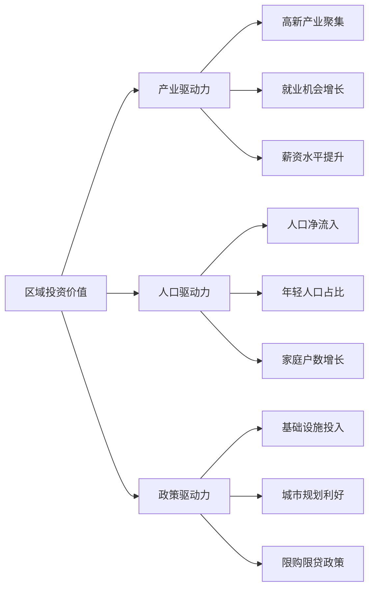
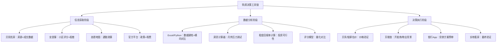

## 三、房产投资工具使用技巧

房产是中国家庭资产配置中占比最大的单项资产。根据央行2019年调查，中国城镇居民家庭住房资产占总资产的59.1%。面对如此大体量的资产决策，仅凭"感觉"和"中介推荐"远远不够。本节系统讲解房产投资中各类工具的使用技巧，帮助你从"凭直觉看房"升级为"用数据决策"。

### 3.1 房产信息平台使用技巧

#### 3.1.1 贝壳找房：深度挖掘成交数据

贝壳找房是国内最主流的房产信息平台，其核心价值不在于"看房源"，而在于**成交数据的深度分析**。大多数人只会在贝壳上刷挂牌房源，但实际上贝壳提供了远比挂牌价更有价值的数据维度。

**技巧一：从"在售房源"切换到"成交记录"**

打开任意小区详情页，找到"成交记录"标签页。这里展示的是真实成交数据，包含成交面积、楼层、成交价、成交周期等关键信息。这是判断真实市场价格最可靠的免费数据源。

具体操作步骤：

1. 在贝壳App中搜索目标小区名称
2. 进入小区详情页，向下滑动找到"成交"或"历史成交"板块
3. 记录近6-12个月所有成交数据：面积、楼层、成交单价、成交日期
4. 将数据导入Excel，计算均价、中位数、标准差

**技巧二：挂牌价与成交价差距分析**

挂牌价和成交价之间的差距是判断市场热度的关键指标：

| 差距幅度 | 市场信号 | 策略建议 |
|----------|----------|----------|
| 5%以内 | 市场活跃，卖方强势 | 快速决策，议价空间小 |
| 5%-10% | 市场正常，买卖均衡 | 合理议价，预留谈判空间 |
| 10%-15% | 偏买方市场 | 可以较大胆地压价 |
| 15%以上 | 明显买方市场 | 充分议价，但需警惕价格虚挂的房源 |

计算方法：在同一小区中，取近6个月所有挂牌房源的挂牌均价，再取同期所有成交房源的成交均价，两者做差。如果该小区数据量不足，可以扩大到同板块类似小区。

**技巧三：带看量趋势判断**

贝壳的小区详情页通常会显示近30天的带看次数。带看量是一个领先指标：

- 带看量持续上升（连续3周增长）→ 预示成交量即将放大，价格可能企稳
- 带看量持续下降 → 买方观望情绪浓厚，价格可能进一步下行
- 带看量突然放大（环比增长50%以上）→ 可能有政策利好或价格调整

建议每周记录一次目标小区的带看量数据，建立自己的趋势表。

**技巧四：利用贝壳估价工具做交叉验证**

贝壳的"房屋估价"功能基于历史成交数据的机器学习模型。使用时注意：

1. 输入准确的小区名称、面积、楼层、朝向
2. 得到估值后，与链家估价对比，偏差在5%以内为可信
3. 估价结果仅作参考，不能替代实际成交数据分析
4. 对于特殊房源（顶层、底层、临街、异形户型），估价偏差可能较大

#### 3.1.2 链家：经纪人信息与独立估价

链家与贝壳共享数据源（贝壳脱胎于链家），但链家有两个独特的使用价值。

**技巧一：通过经纪人评价筛选信息源**

房产交易中，一个靠谱的经纪人价值巨大。链家的经纪人评价系统可以帮你筛选：

| 筛选维度 | 优质经纪人特征 | 警惕信号 |
|----------|---------------|----------|
| 从业年限 | 3年以上，对目标区域熟悉 | 频繁更换服务区域 |
| 客户评分 | 4.7分以上 | 低于4.5分或评价数量过少 |
| 专业标签 | 持有"社区专家"等认证 | 无任何专业认证 |
| 响应速度 | 30分钟内回复 | 经常已读不回或回复敷衍 |
| 信息质量 | 主动提供成交数据和区域分析 | 只会说"这套很好赶紧买" |

选择2-3个评分高、从业年限长的经纪人建立长期联系。他们的价值不仅在于带看，更在于提供市场一线信息——哪些业主急售、哪些小区有隐性问题、哪些板块即将有利好。

**技巧二：链家估价工具的正确使用**

链家的房屋估价功能基于海量成交数据训练，可以作为独立的价格验证工具：

1. 对同一房源分别在贝壳和链家查询估价
2. 两个平台的估价偏差在3%以内 → 数据可信度高
3. 偏差超过5% → 需要进一步核实，可能该房源数据量不足或有特殊情况
4. 永远不要把任何单一平台的估价作为最终决策依据

#### 3.1.3 安居客：小区综合评分体系

安居客的核心价值在于其小区维度的综合评分体系，适合做初筛。

**小区评分使用方法**：

安居客的小区评分涵盖环境、物业、配套、交通四个维度。使用策略：

- 总分8分以上 → 品质小区，值得重点关注
- 总分7-8分 → 中等偏上，需结合其他因素判断
- 总分6-7分 → 一般，存在明显短板
- 总分6分以下 → 直接排除

特别注意各维度的均衡性。一个总分7.5分但物业只有4分的小区，住进去后可能问题不断。

**配套地图的实战用法**：

安居客的周边配套地图可以帮你快速建立"15分钟生活圈"清单：

1. 打开目标小区的配套地图
2. 标记步行15分钟范围内的地铁站、学校、医院、商超
3. 用高德/百度地图实测步行时间（线上距离≠步行时间）
4. 制作对比表格，横向比较候选小区的配套便利度

#### 3.1.4 官方数据平台：不可替代的权威来源

商业平台的数据存在利益相关性，官方数据是独立验证的基石。

**核心官方数据源**：

| 平台 | 数据内容 | 访问方式 | 更新频率 |
|------|----------|----------|----------|
| 各地住保房管局 | 新房/二手房网签数据 | 官网公示或公众号 | 每日/每周 |
| 国家统计局 | 70城房价指数 | 统计局官网 | 每月15日 |
| 中国土地市场网 | 土地出让信息 | landchina.com | 实时更新 |
| 央行 | LPR利率 | 央行官网 | 每月20日 |
| 各地公积金中心 | 公积金贷款政策 | 官网或12329热线 | 政策调整时 |
| 各市规划和自然资源局 | 城市规划、用地变更 | 官网公示 | 不定期 |

**使用技巧**：

- 住建局的网签数据是真实成交的官方记录，可以用来验证贝壳/链家的成交数据是否准确
- 土地出让数据可以预判未来1-2年的供应量——某板块集中出让大量住宅用地，意味着未来供应增加，对该区域现有房价有压制作用
- LPR利率变化直接影响房贷月供，每月20日关注央行公告

### 3.2 房贷计算工具使用技巧

房贷是房产投资中最大的成本项。贷款100万、30年期，仅利息就可能超过60-80万。精确计算和优化贷款方案，是房产投资工具使用的基本功。

#### 3.2.1 两种还款方式的实操对比

**等额本息**：每月还款金额固定，前期利息占比高、本金占比低，后期逐渐反转。

**等额本金**：每月偿还的本金固定，利息逐月递减，因此月供逐月降低。

以贷款100万、利率3.5%、30年期为例：

| 对比维度 | 等额本息 | 等额本金 |
|----------|----------|----------|
| 首月月供 | 4,490元 | 5,694元 |
| 末月月供 | 4,490元 | 2,786元 |
| 总利息 | 61.7万 | 52.6万 |
| 利息差额 | 基准 | 节省9.1万 |
| 前5年月供压力 | 稳定可预测 | 高出约27% |
| 适合人群 | 收入稳定、偏好确定性 | 前期收入较高、希望省息 |

**选择建议**：

- 如果月供占家庭收入比例超过30%，优先选等额本息，保证每月现金流稳定
- 如果月供占收入比例低于20%，且前期收入较高，等额本金可以节省近10万利息
- 如果计划5-10年内提前还清或置换，两种方式的利息差异会大幅缩小

#### 3.2.2 提前还款的决策计算

提前还款并非总是划算。需要计算的核心指标是：**节省的利息是否大于资金的机会成本**。

```python
def evaluate_prepayment(loan_amount, annual_rate, total_months,
                        prepay_month, prepay_amount, alt_return_rate=0.03):
    """
    评估提前还款是否划算
    
    参数:
        loan_amount: 贷款总额
        annual_rate: 年利率
        total_months: 贷款总月数
        prepay_month: 第几个月提前还款
        prepay_amount: 提前还款金额
        alt_return_rate: 资金替代收益率（如理财年化收益）
    """
    monthly_rate = annual_rate / 12
    
    # 原方案月供
    monthly_payment = loan_amount * monthly_rate * (1 + monthly_rate)**total_months / \
                      ((1 + monthly_rate)**total_months - 1)
    
    # 计算提前还款时的剩余本金
    remaining = loan_amount
    for i in range(prepay_month):
        interest = remaining * monthly_rate
        remaining -= (monthly_payment - interest)
    
    # 提前还款后的剩余本金
    new_remaining = remaining - prepay_amount
    remaining_months = total_months - prepay_month
    
    # 节省的利息 = 原方案剩余利息 - 新方案剩余利息
    original_remaining_interest = monthly_payment * remaining_months - remaining
    
    if new_remaining > 0:
        new_monthly = new_remaining * monthly_rate * (1 + monthly_rate)**remaining_months / \
                      ((1 + monthly_rate)**remaining_months - 1)
        new_remaining_interest = new_monthly * remaining_months - new_remaining
    else:
        new_remaining_interest = 0
    
    interest_saved = original_remaining_interest - new_remaining_interest
    
    # 资金机会成本：这笔钱如果不还贷，而是去理财
    months_invested = remaining_months
    opportunity_cost = prepay_amount * alt_return_rate * (months_invested / 12)
    
    net_benefit = interest_saved - opportunity_cost
    
    return {
        "节省利息": round(interest_saved, 2),
        "机会成本": round(opportunity_cost, 2),
        "净收益": round(net_benefit, 2),
        "建议": "建议提前还款" if net_benefit > 0 else "不建议提前还款"
    }

# 示例：贷款100万，利率3.5%，30年期，第36个月提前还款20万
result = evaluate_prepayment(1000000, 0.035, 360, 36, 200000)
# 结果：节省利息约18.2万，机会成本约15.3万，净收益2.9万 → 建议提前还款
```

**提前还款的关键判断规则**：

1. **贷款前期还款更划算**：等额本息前期利息占比高，前10年内提前还款节省的利息最多。超过贷款期限一半后再提前还款，意义不大。
2. **利率高于理财收益率时才划算**：如果房贷利率3.5%，而你能稳定获得4%以上的理财收益，提前还款反而亏了。
3. **注意违约金**：部分银行规定贷款前1-3年内提前还款需支付违约金（通常为还款金额的1%-3%），需要将此成本纳入计算。
4. **缩短年限 vs 减少月供**：提前还款后通常有两种选择——保持月供不变缩短年限，或保持年限不变减少月供。前者节省更多利息，后者减轻每月压力。

#### 3.2.3 组合贷优化技巧

组合贷（公积金贷款+商业贷款）通常比纯商贷利率更低，但操作更复杂。

**组合贷的利率优势**（以2024年为例）：

| 贷款类型 | 利率范围 | 100万/30年总利息 |
|----------|----------|-----------------|
| 纯公积金贷款 | 3.1% | 53.7万 |
| 纯商业贷款 | 3.5%-4.2% | 61.7万-76.0万 |
| 组合贷（公积金120万+商贷80万） | 综合约3.2%-3.6% | 56.5万-63.8万 |

**使用技巧**：

1. 优先用满公积金额度：各地公积金贷款上限不同（如北京120万、上海个人50万/夫妻100万、杭州个人50万/夫妻100万），先用满公积金额度，剩余部分再用商贷
2. 注意组合贷审批周期：通常需要2-3个月，比纯商贷长1-2个月。购房时间线需要预留足够空间
3. 公积金缴存额度影响贷款额度：贷款额度通常与公积金账户余额和缴存年限挂钩，提前规划公积金缴存

#### 3.2.4 房贷计算器的选择与交叉验证

不同平台的房贷计算器可能存在微小差异，建议交叉验证：

| 工具 | 优势 | 局限 |
|------|------|------|
| 贝壳房贷计算器 | 支持组合贷试算，操作简便 | 默认利率可能非最新LPR |
| 链家月供计算器 | 支持提前还款模拟 | 仅限链家合作银行利率 |
| 各银行官网计算器 | 利率最准确 | 操作界面较复杂 |
| Excel/Python自建模型 | 完全可控，可自定义场景 | 需要一定计算能力 |

**验证方法**：用至少两个计算器计算同一贷款方案，月供结果差异在10元以内为正常（四舍五入导致），差异超过100元需要检查利率或贷款参数是否输入正确。

### 3.3 租金回报率分析工具

租金回报率是衡量房产投资价值的核心指标，但计算方式的不同会得出截然不同的结论。

#### 3.3.1 三种租金回报率的计算与区别

**毛租金回报率（Gross Rental Yield）**：

$$毛租金回报率 = \frac{年租金总额}{购房总价} \times 100\%$$

这是最简单的计算方式，但忽略了所有持有成本，参考价值有限。

**净租金回报率（Net Rental Yield）**：

$$净租金回报率 = \frac{年租金总额 - 年度持有成本}{购房总价} \times 100\%$$

年度持有成本包括：物业费、维修基金、房屋保险、房产税（如有）、管理费（如委托出租）。

**实际租金回报率（实际到手收益率）**：

$$实际回报率 = \frac{年租金 \times (1 - 空置率) - 年度持有成本}{购房总价 + 购房税费} \times 100\%$$

这是最接近真实收益的计算方式，考虑了空置损失和购房税费。

```python
def comprehensive_rental_yield(purchase_price, monthly_rent,
                                annual_property_fee, annual_maintenance,
                                annual_insurance, purchase_tax,
                                vacancy_rate=0.08, management_fee_rate=0.0):
    """
    综合租金回报率计算
    
    参数:
        purchase_price: 购房总价
        monthly_rent: 月租金
        annual_property_fee: 年物业费
        annual_maintenance: 年维修基金/日常维修
        annual_insurance: 年保险费
        purchase_tax: 购房税费（契税+中介费等一次性支出）
        vacancy_rate: 空置率（默认8%，即每年约1个月空置）
        management_fee_rate: 委托管理费率（如通过中介出租的佣金比例）
    """
    annual_rent = monthly_rent * 12
    effective_rent = annual_rent * (1 - vacancy_rate)
    management_fee = effective_rent * management_fee_rate
    total_annual_cost = annual_property_fee + annual_maintenance + annual_insurance + management_fee
    net_annual_income = effective_rent - total_annual_cost
    total_investment = purchase_price + purchase_tax
    
    gross_yield = annual_rent / purchase_price * 100
    net_yield = net_annual_income / total_investment * 100
    
    return {
        "毛租金回报率": f"{gross_yield:.2f}%",
        "净租金回报率(含税费)": f"{net_yield:.2f}%",
        "年净收入": f"{net_annual_income:.0f}元",
        "月均净收入": f"{net_annual_income/12:.0f}元"
    }
```

#### 3.3.2 租金数据的获取方法

准确的租金数据是计算回报率的前提。获取方法按可靠性排序：

1. **贝壳/链家成交租金**：最可靠，但数据量有限，部分城市不展示租金成交数据
2. **贝壳/链家挂牌租金**：参考价值较高，但需打8-9折估算实际成交租金
3. **58同城/安居客租金**：覆盖面广，但虚假房源较多，需大量筛选
4. **实地询问**：向小区物业、周边中介询问当前租金水平，最接地气
5. **自如/蛋壳等长租平台**：适合参考一居室和两居室的标准化租金

**获取技巧**：同一小区至少收集10条以上租金数据，剔除最高和最低各10%，取中间值作为参考。

#### 3.3.3 租金回报率的判断标准

不同城市、不同类型的房产，合理的租金回报率差异很大：

| 回报率区间 | 评级 | 投资逻辑 | 典型场景 |
|------------|------|----------|----------|
| 1%-2% | 低回报 | 纯靠增值，租金只是补贴 | 一线城市核心区 |
| 2%-3% | 一般回报 | 需结合增值预期综合判断 | 一线城市非核心区、强二线核心区 |
| 3%-5% | 较好回报 | 租金+增值双轮驱动 | 二线城市成熟区域 |
| 5%-7% | 高回报 | 租金收益可观 | 三四线城市、商业地产 |
| 7%以上 | 极高回报 | 需警惕风险 | 特殊区域、公寓类产品 |

**重要提醒**：在中国一二线城市，2%-3%的租金回报率是常态。这不意味着不值得投资，而是投资逻辑必须包含**资产增值**维度，不能只看租金回报。

### 3.4 房产估值与比价工具

#### 3.4.1 在线估价工具的使用与局限

主流平台都提供在线估价功能，核心原理是基于同小区/同板块历史成交数据的回归分析。

| 估价工具 | 数据基础 | 准确度 | 适用场景 |
|----------|----------|--------|----------|
| 贝壳估价 | 贝壳成交数据库 | 较高（偏差5%-10%） | 普通住宅快速估值 |
| 链家估价 | 链家成交数据库 | 较高（偏差5%-10%） | 与贝壳交叉验证 |
| 银行评估价 | 银行内部评估模型 | 最高（决定贷款额度） | 贷款审批阶段 |
| 中指研究院 | 机构级数据 | 高 | 区域级/城市级分析 |

**使用局限**：

1. 在线估价无法考虑房屋的具体装修状况、楼层朝向的细微差异
2. 对于特殊户型（复式、跃层、异形）估价偏差较大
3. 数据滞后性：估价基于历史成交，无法反映最新市场变化
4. 不同平台的估价算法不同，结果可能差异较大

**正确用法**：将在线估价作为初步参考，最终定价必须结合近6个月实际成交数据和实地调研。

#### 3.4.2 建立个人比价数据库

高效的房产投资者会建立自己的比价数据库，而不是每次临时查询。

**Excel数据库模板**：

```markdown
## 房产比价数据库结构

### Sheet 1：房源明细
字段：小区名称 | 面积(㎡) | 楼层 | 朝向 | 挂牌价(万) | 单价(元/㎡) 
      | 数据来源 | 记录日期 | 备注

### Sheet 2：成交记录
字段：小区名称 | 面积(㎡) | 楼层 | 成交价(万) | 成交单价(元/㎡) 
      | 成交周期(天) | 数据来源 | 成交日期

### Sheet 3：小区概况
字段：小区名称 | 建成年份 | 总户数 | 物业费(元/㎡/月) | 物业公司 
      | 安居客评分 | 地铁距离(m) | 区域

### Sheet 4：租金数据
字段：小区名称 | 户型 | 面积(㎡) | 月租金(元) | 数据来源 | 记录日期

### Sheet 5：自动计算
- 各小区近6月成交均价（自动汇总Sheet2）
- 挂牌价与成交价差距百分比
- 毛租金回报率
- 与区域均价的偏差百分比
```

**维护节奏**：每周更新一次目标区域的数据，每月做一次全面分析。数据积累3个月以上后，你对目标区域的价格感知会远超普通购房者。

### 3.5 政策与税费计算工具

#### 3.5.1 购房税费的完整计算

购房税费是很多人忽略的隐性成本，可能占到购房总价的3%-8%。

**买方主要税费**：

| 税费项目 | 计算方式 | 示例（200万房产） |
|----------|----------|-------------------|
| 契税 | 首套90㎡以下1%，90㎡以上1.5%；二套3% | 首套140㎡：3万 |
| 中介费 | 成交价的1%-3%（可协商） | 2%：4万 |
| 贷款服务费 | 部分银行收取，0-3000元 | 2000元 |
| 评估费 | 评估价的0.1%-0.5% | 0.3%：6000元 |
| 权属登记费 | 固定80元 | 80元 |
| 抵押登记费 | 固定80元 | 80元 |

**卖方主要税费**（影响卖方报价和你的议价空间）：

| 税费项目 | 条件 | 税率 |
|----------|------|------|
| 增值税 | 不满2年出售 | 全额5.3% |
| 增值税 | 满2年出售 | 免征（普通住宅） |
| 个人所得税 | 满五唯一 | 免征 |
| 个人所得税 | 不满足满五唯一 | 差额的20%或全额的1% |

**税费计算工具推荐**：

1. **贝壳税费计算器**：输入城市、面积、价格、套数，自动计算买卖双方税费
2. **各城市税务局官网**：提供官方税率表和计算公式
3. **自行建表**：用Excel建立税费计算模板，输入参数自动汇总

**实战技巧**：

- "满五唯一"的房源在税费上有显著优势，议价时可以此为筹码——卖方省下的个税可以部分让渡给买方
- 不满2年的房源增值税高达5.3%，如果卖方不降价覆盖这部分成本，实际购买成本会大幅增加
- 中介费是最大的可协商项，通常可以谈到1%-1.5%，尤其是在买方市场

#### 3.5.2 限购限贷政策的查询方法

房产政策因地而异、因时而变，必须以官方渠道为准。

**查询路径**：

1. **限购政策**：各城市住建局官网 → 搜索"限购"或"购房资格"
2. **限贷政策**：各城市公积金中心官网 + 各银行官网
3. **最新变化**：关注"XX住建"官方微信公众号，政策调整通常第一时间发布
4. **综合查询**：贝壳/链家的政策汇总页面（更新较快，但以官方为准）

**需要关注的核心参数**：

| 政策维度 | 关键参数 | 对购房的影响 |
|----------|----------|-------------|
| 限购套数 | 首套/二套/三套限制 | 决定是否有购房资格 |
| 首付比例 | 首套20%-30%，二套40%-80% | 直接影响首期资金需求 |
| 贷款利率 | LPR+加点 | 影响月供和总利息 |
| 公积金贷款额度 | 个人/夫妻上限 | 影响组合贷方案 |
| 认房认贷 | 认房不认贷/认贷不认房/认房又认贷 | 影响首付和利率认定 |
| 税费优惠 | 契税减免、个税免征条件 | 影响交易成本 |

### 3.6 实地调研与数据验证工具

#### 3.6.1 通勤时间的精确测算

线上地图的通勤时间估算通常偏乐观。正确的测算方法：

1. **选择正确的时间段**：在工作日早高峰（7:30-9:00）实测，而非周末或非高峰时段
2. **多种交通方式对比**：地铁、公交、驾车分别测算，考虑换乘和等车时间
3. **预留缓冲时间**：在实测结果上增加15-20分钟作为日常通勤的保守估计
4. **使用导航App的"出发时间"功能**：高德和百度地图都支持设定出发时间，模拟不同时段的通勤情况

**实测模板**：

```markdown
## 通勤实测记录

| 出发地 | 目的地 | 交通方式 | 出发时间 | 到达时间 | 用时 | 备注 |
|--------|--------|----------|----------|----------|------|------|
| 小区A | 公司 | 地铁 | 8:00 | 8:42 | 42分钟 | 含步行8分钟 |
| 小区A | 公司 | 驾车 | 8:00 | 8:55 | 55分钟 | 早高峰拥堵 |
| 小区B | 公司 | 地铁+公交 | 8:00 | 9:05 | 65分钟 | 需换乘一次 |
```

#### 3.6.2 实地看房的数据采集

实地看房不仅是"感受"，更应该是有结构的数据采集。

**看房Checklist（每次看房必带）**：

| 检查项目 | 具体内容 | 记录方式 |
|----------|----------|----------|
| 采光 | 各房间不同时段日照情况，前楼遮挡程度 | 拍照+文字记录 |
| 噪音 | 临街/临地铁/临学校，开窗实测分贝 | 手机分贝仪App |
| 户型 | 动线是否合理，有无浪费面积 | 带卷尺实测关键尺寸 |
| 装修 | 是否需要重装，预估装修成本 | 拍照记录现状 |
| 小区环境 | 绿化率、人车分流、物业管理水平 | 观察+拍照 |
| 入住率 | 通过夜间亮灯率判断 | 晚间观察 |
| 公共区域 | 楼道、电梯、大堂的维护状态 | 拍照 |
| 周边实测 | 步行到地铁/学校/商超的真实时间 | 计时+拍照 |

**手机工具推荐**：

| 工具 | 用途 | 说明 |
|------|------|------|
| 分贝仪App | 测量环境噪音 | 正常室内噪音应低于40分贝 |
| 指南针App | 判断朝向 | 确认是否真正南北通透 |
| 激光测距仪/手机测量App | 测量房间尺寸 | 验证得房率 |
| 手机相机 | 记录现状 | 建立照片档案，方便后续对比 |

### 3.7 房产投资分析的进阶工具

#### 3.7.1 区域投资价值分析框架

超越单套房源，从区域维度判断投资价值。

**区域分析的三个核心驱动力**：



**数据获取与分析方法**：

| 分析维度 | 数据来源 | 分析方法 |
|----------|----------|----------|
| 产业聚集度 | 天眼查/企查查：统计目标区域注册企业数量和行业分布 | 高科技/互联网企业占比高 → 租金承受力强 |
| 人口流入 | 各市统计局年度公报 | 连续3年净流入 → 需求支撑 |
| 土地供应 | 中国土地市场网 | 大量供地 → 未来竞争加剧；供地稀缺 → 价格有支撑 |
| 基础设施 | 各市发改委/规划局公示 | 地铁规划、学校新建、医院扩建等 |
| 成交活跃度 | 贝壳/链家成交数据 | 月成交量/挂牌量比值 > 10% → 市场活跃 |

#### 3.7.2 房产投资评分模型

建立量化评分体系，将主观判断转化为可比较的数值。

**评分模型模板（满分100分）**：

| 评分维度 | 权重 | 评分标准 | 数据来源 |
|----------|------|----------|----------|
| 位置（地铁/通勤） | 25分 | 地铁500m内=25分，1km内=20分，>1km=10分 | 高德地图 |
| 价格（vs区域均价） | 20分 | 低于均价10%以上=20分，持平=15分，高于10%=5分 | 贝壳成交数据 |
| 租金回报 | 15分 | 3%以上=15分，2%-3%=10分，<2%=5分 | 租金数据分析 |
| 流动性 | 15分 | 平均成交周期<30天=15分，30-60天=10分，>60天=5分 | 贝壳成交记录 |
| 增值潜力 | 15分 | 有地铁/学校/产业规划=15分，无明确利好=5分 | 规划局公示 |
| 生活配套 | 10分 | 15分钟生活圈完善=10分，基本满足=7分，欠缺=3分 | 安居客配套地图 |

**使用方法**：对每个候选房源打分，80分以上为强烈推荐，60-80分为推荐，60分以下为谨慎。

#### 3.7.3 房产投资现金流分析

对于以出租为目的的房产投资，现金流分析比收益率更重要。

```python
def cash_flow_analysis(purchase_price, down_payment_ratio, annual_rate,
                       loan_months, monthly_rent, annual_costs,
                       annual_rent_growth=0.03):
    """
    房产投资10年现金流分析
    
    参数:
        purchase_price: 购房总价
        down_payment_ratio: 首付比例
        annual_rate: 贷款年利率
        loan_months: 贷款月数
        monthly_rent: 初始月租金
        annual_costs: 年度持有成本（物业费+维修+保险）
        annual_rent_growth: 年租金增长率（默认3%）
    """
    loan_amount = purchase_price * (1 - down_payment_ratio)
    down_payment = purchase_price * down_payment_ratio
    monthly_rate = annual_rate / 12
    monthly_payment = loan_amount * monthly_rate * (1 + monthly_rate)**loan_months / \
                      ((1 + monthly_rate)**loan_months - 1)
    
    results = []
    cumulative_cash_flow = -down_payment  # 初始投入
    
    for year in range(1, 11):
        rent = monthly_rent * 12 * (1 + annual_rent_growth) ** (year - 1)
        loan_payment = monthly_payment * 12
        net_cash_flow = rent - loan_payment - annual_costs
        cumulative_cash_flow += net_cash_flow
        
        results.append({
            "年份": year,
            "年租金": round(rent),
            "年月供": round(loan_payment),
            "年持有成本": round(annual_costs),
            "年净现金流": round(net_cash_flow),
            "累计现金流": round(cumulative_cash_flow)
        })
    
    return results

# 示例：200万房产，首付30%，利率3.5%，30年，月租金4000，年成本1.5万
# 结果：前5年每年净现金流约-3.2万（需要额外补贴），第8年左右转正
```

**关键洞察**：大多数中国一二线城市的房产投资在前几年都是负现金流（租金无法覆盖月供+持有成本）。投资者需要确保有足够的现金流储备来覆盖这个"亏损期"。

### 3.8 房产投资工具使用的常见误区

#### 误区一：只看挂牌价就做决策

挂牌价是卖方的期望价格，而非市场价格。在很多城市，挂牌价比实际成交价高10%-20%。

**正确做法**：以近6个月同小区成交均价为基准，挂牌价仅作参考。建立"挂牌价-成交价差距"的跟踪表，了解目标区域的议价空间。

#### 误区二：忽略持有成本，只算购房价格

一套200万的房产，贷款30年的利息可能超过60万。加上物业费、维修、空置损失、机会成本，真实持有成本远超购房价格。

**正确做法**：计算5年或10年的总持有成本，包括贷款利息、物业费、维修基金、保险、空置损失、装修折旧、资金机会成本。只有当预期增值+租金收入超过总持有成本时，投资才有正收益。

#### 误区三：过度依赖经纪人的信息

经纪人的收入来自成交佣金，他们的激励结构天然偏向促成交易，而非帮你找到最优选择。

**正确做法**：将经纪人作为信息渠道之一，但所有关键数据必须自己用工具验证。选择经纪人时优先考虑评分高、从业年限长的"社区专家"型经纪人。

#### 误区四：不做实地验证

线上平台无法展示采光、噪音、气味、邻里环境、物业管理水平等关键因素。

**正确做法**：至少花2个周末、看10套以上的房子。每个目标小区至少看3套不同楼层、不同朝向的房源。在不同时段（上午、下午、晚间）各看一次。

#### 误区五：忽视流动性

很多购房者只关注"住着舒不舒服"，不考虑未来出售的难度。流动性差的房产（如远郊大盘、小产权房、商住公寓）可能在需要变现时大幅折价。

**正确做法**：购房前评估该小区的流动性指标——近6个月成交量、平均成交周期、在售/成交比。流动性好的小区平均成交周期在30-60天，超过90天说明流动性较差。

#### 误区六：用单一平台的数据做决策

不同平台的数据覆盖范围、更新频率、计算口径都有差异。单一平台可能存在数据偏差或信息盲区。

**正确做法**：建立"至少两个独立数据源交叉验证"的习惯。例如，价格数据用贝壳+链家对比，小区评分用安居客+实地调研验证，政策信息以官方渠道为准。

### 3.9 工具组合的最佳实践

#### 3.9.1 购房决策工具链

房产投资不是使用单一工具，而是将多个工具串联成决策链路。



#### 3.9.2 不同阶段的工具优先级

| 购房阶段 | 核心工具 | 目的 |
|----------|----------|------|
| 初步了解 | 贝壳+安居客 | 建立区域认知，了解价格范围 |
| 深度筛选 | 贝壳成交数据+Excel建档 | 量化分析，缩小候选范围 |
| 方案评估 | 房贷计算器+租金回报计算 | 评估财务可行性 |
| 实地验证 | 高德地图+实地看房+分贝仪 | 验证线上数据，发现隐性问题 |
| 决策谈判 | 评分模型+估价工具+税费计算 | 量化比较，制定谈判策略 |
| 交易执行 | 银行预审+官方政策查询 | 确保贷款和交易流程顺畅 |

#### 3.9.3 工具使用的效率建议

1. **建立固定的信息更新节奏**：每周花1小时更新目标区域的数据，而非购房时临时突击
2. **模板化重复工作**：将数据建档、税费计算、通勤测算等做成Excel模板或Python脚本
3. **区分"日常监测"和"深度分析"**：日常用贝壳/安居客快速浏览，重大决策前做完整的数据建档和评分
4. **记录每次看房的结构化数据**：建立看房档案，方便后续对比和复盘
5. **保持工具的更新**：平台功能和政策经常变化，定期检查工具是否仍然有效
