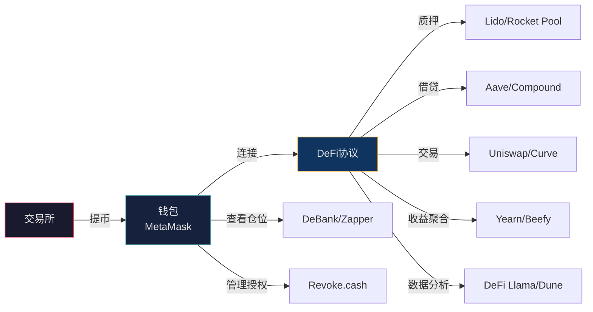

## 四、加密货币工具使用技巧

加密货币投资工具与传统金融工具有本质区别——链上资产由私钥控制、交易 7×24 小时不间断、Gas 费随网络拥堵实时波动、DeFi 协议的智能合约风险无法通过分散持仓消除。这些特性决定了加密货币工具的使用技巧既需要掌握通用的投资工具方法论，又需要理解区块链世界独有的操作范式。本节从交易所进阶操作、钱包工具实战、链上数据分析、DeFi 工具链、组合追踪与风控、安全工具体系六个维度，系统讲解加密货币工具的使用方法与进阶技巧。

### 4.1 交易所进阶操作技巧

#### 4.1.1 交易所选择的深层逻辑

选择交易所不能只看"哪个手续费低"，而要从安全性、流动性、功能完整度、法币通道和合规程度五个维度综合评估。以下是截至 2024 年主流交易所的核心参数对比：

| 维度 | Binance（币安） | OKX（欧易） | Bybit | Coinbase | Gate.io |
|------|-----------------|-------------|-------|----------|---------|
| 成立时间 | 2017 | 2017（前身2013） | 2018 | 2012 | 2013 |
| 安全事件 | 2019年被盗7000BTC后全额赔付 | 2020年私钥负责人失联后恢复 | 零重大事故 | 零重大事故 | 2019年部分资产被盗 |
| 现货Maker/Taker | 0.1%/0.1%（BNB抵扣后0.075%） | 0.08%/0.1%（OKB折扣） | 0.1%/0.1% | 0.4%/0.6% | 0.2%/0.2% |
| 合约Maker/Taker | 0.02%/0.04% | 0.02%/0.05% | 0.02%/0.055% | 不提供 | 0.015%/0.05% |
| 现货币种数 | 600+ | 400+ | 500+ | 250+ | 1700+ |
| 法币入金 | C2C（P2P） | C2C | C2C | 信用卡/银行转账 | C2C |
| 理财功能 | 活期/定期/DeFi挖矿/Launchpad | 活期/定期/DeFi/Jumpstart | 活期 | 质押 | 活期/借贷 |
| 适合人群 | 全球用户、活跃交易者 | 亚洲用户、合约交易者 | 合约/衍生品 | 美国用户、纯新手 | 寻找小市值币种 |

**双交易所策略**：至少注册两个交易所。单一交易所存在单点故障风险——临时维护、被黑客攻击或限制提币时，你需要另一条路操作。推荐主力交易所（Binance 或 OKX）加一个备用交易所。

#### 4.1.2 费率优化的六种方法

交易所手续费看似只有 0.1%，但在频繁交易中会显著侵蚀收益。以下是系统化的费率优化策略：

| 方法 | 原理 | 节省幅度 | 操作步骤 |
|------|------|---------|---------|
| 持有平台币抵扣 | Binance 用 BNB、OKX 用 OKB 支付手续费享受折扣 | 25% | 在账户设置中开启"使用平台币抵扣手续费" |
| 提升VIP等级 | 30天交易量达标后自动升级，费率递减 | 20%-60% | 集中交易量到一个交易所，避免分散 |
| 使用限价单（Maker） | Maker费率通常低于Taker | 10%-50% | 挂限价单等待成交，而非市价单直接吃单 |
| 参与返佣计划 | 邀请好友注册交易，获得其手续费返佣 | 10%-40% | 生成邀请链接分享给有交易需求的朋友 |
| 使用L2网络提币 | 提币到L2网络手续费远低于主网 | 80%-95% | 提币时选择Arbitrum/Optimism网络 |
| 批量操作减少交易次数 | 合并小额交易，减少总交易笔数 | 因人而异 | 每周集中调仓而非每天频繁操作 |

**手续费计算实例**：

假设每月交易 10 万元（买入+卖出合计），未优化时的年手续费：

```text
未优化：100,000 × 0.1% × 2（买+卖） × 12月 = 2,400元/年
优化后：100,000 × 0.075%（BNB抵扣） × 2 × 12月 = 1,800元/年
节省：600元/年（25%）
```

对于合约交易者，差距更大——合约的杠杆倍数会放大手续费：

```text
10倍杠杆，10万名义价值，月交易50次：
未优化：100,000 × 0.05% × 50 × 12 = 30,000元/年
优化后（VIP1+BNB抵扣）：100,000 × 0.03% × 50 × 12 = 18,000元/年
节省：12,000元/年
```

#### 4.1.3 订单类型深度解析

交易所提供的订单类型远比"买入/卖出"复杂。理解每种订单类型的适用场景，是提升交易效率的关键。

| 订单类型 | 工作原理 | 适用场景 | 设置要点 | 常见陷阱 |
|----------|---------|---------|---------|---------|
| 限价单（Limit） | 指定价格挂单，达到价格才成交 | 不急的买卖、大额交易 | 委托价留足余量，避免差一分钱不成交 | 流动性差的币种可能长时间不成交 |
| 市价单（Market） | 以当前最优价格立即成交 | 急需成交、小额交易 | 注意滑点，大额市价单会吃掉多个价位 | 极端行情下滑点可能高达5%-10% |
| 止盈止损单（TP/SL） | 价格触发后自动下单 | 设定目标价和止损位 | 触发价和委托价可以不同 | 交易所维护期间可能不触发 |
| 追踪止损（Trailing Stop） | 从最高点回撤一定比例后卖出 | 牛市锁定利润 | 设置回撤比例（通常5%-15%） | 横盘震荡时容易被"震出来" |
| 冰山单（Iceberg） | 大单拆分为多笔小单执行 | 大额交易避免冲击市场 | 设置每笔显示量和总量 | 执行时间较长，价格可能变动 |
| OCO单（One-Cancels-Other） | 两个订单联动，一个成交另一个自动取消 | 同时设止盈和止损 | 同时设置止盈价和止损价 | 需要手动设置两个方向 |

**止盈止损单实战设置**：

以买入 BTC 价格 350,000 元为例：

```text
方案一：OCO 单（止盈止损同时设置）
├── 止盈单：价格 >= 420,000 元时卖出（+20%）
│   └── 委托价：418,000 元（略低于触发价，确保成交）
├── 止损单：价格 <= 315,000 元时卖出（-10%）
│   └── 委托价：313,000 元（略低于触发价）
└── 有效期：30天（需定期检查续期）

方案二：追踪止损（适合牛市）
├── 追踪比例：从最高点回撤 15% 触发卖出
├── 激活价格：380,000 元（涨到这个价才开始追踪）
└── 优势：能吃到更多涨幅，自动跟踪新高
```

#### 4.1.4 高级交易功能

**网格交易**：

网格交易是适合横盘震荡行情的自动化策略。在设定的价格区间内，系统自动在每个网格线位置买入或卖出，赚取波段差价。

```text
网格交易参数设置示例（BTC/USDT）
│
├── 价格区间：300,000 - 400,000 元
├── 网格数量：20 格
├── 每格间距：5,000 元
├── 总投入：10,000 元
├── 每格投入：500 元
│
├── 运行逻辑：
│   ├── 价格每下跌 5,000 元 → 自动买入 500 元
│   ├── 价格每上涨 5,000 元 → 自动卖出对应数量
│   └── 循环执行，赚取每个波段的差价
│
├── 预期收益（假设每月 30 次触发）：
│   ├── 每格利润 ≈ 500 × 1.67% = 8.35 元
│   ├── 月收益 ≈ 8.35 × 30 = 250.5 元
│   └── 月化收益率 ≈ 2.5%（年化约 30%，但不稳定）
│
└── 适用条件：
    ├── 市场处于横盘震荡期（非单边行情）
    ├── 波动率足够（每天至少有 1%-2% 的波动）
    └── 不适合暴涨暴跌行情（会提前耗尽资金或币种）
```

**需要注意的风险**：网格交易在单边下跌行情中会持续买入直到资金耗尽，在单边上涨行情中会过早卖出错过涨幅。它最适合震荡市，不适合趋势市。

**定投功能（DCA）**：

多数交易所内置定投功能，可设置定时自动买入：

```text
交易所定投设置清单
│
├── 币种选择
│   ├── BTC（50%）—— 核心仓位，波动相对较小
│   ├── ETH（30%）—— 生态基础设施
│   ├── SOL（10%）—— 高性能公链
│   └── BNB（10%）—— 交易所生态+手续费折扣
│
├── 频率设置
│   ├── 推荐：每月 2 次（1日和15日），分散时间风险
│   ├── 进阶：每周 1 次，进一步平滑成本
│   └── ❌ 不推荐每天（频率过高，手续费占比大）
│
├── 金额设置
│   ├── 月收入的 5%-15%（不影响生活质量）
│   ├── 设置后不轻易改变金额
│   └── 只在 BTC 月跌幅 > 20% 时考虑加倍（前提是有余力）
│
└── 注意事项
    ├── 开启"使用平台币抵扣手续费"
    ├── 定投后将资产提到自己的钱包（不要长期放交易所）
    ├── 记录每次定投的价格和数量（计算成本基础）
    └── 定投不等于"不用管"——每季度评估一次配置是否合理
```

### 4.2 钱包工具实战技巧

#### 4.2.1 钱包类型与选择策略

"不是你的私钥，就不是你的币"（Not your keys, not your coins）是加密世界最重要的安全原则。钱包的选择直接决定了你对资产的控制权。

| 钱包类型 | 代表产品 | 私钥控制 | 安全等级 | 便利性 | 费用 | 适合场景 |
|----------|---------|---------|---------|--------|------|---------|
| 交易所钱包 | Binance/OKX内置 | 交易所持有 | 中（依赖交易所） | 最高 | 免费 | 小额、频繁交易 |
| 浏览器插件钱包 | MetaMask/Rabby | 用户持有（设备中） | 中高 | 高 | 免费 | DeFi交互、日常使用 |
| 手机钱包 | Trust Wallet/imToken | 用户持有（设备中） | 中高 | 高 | 免费 | 移动端管理、多链 |
| 桌面钱包 | Exodus/Electrum | 用户持有（设备中） | 中高 | 中 | 免费 | 桌面操作、特定链 |
| 硬件钱包 | Ledger/Trezor/OneKey | 用户持有（安全芯片中） | 最高 | 中低 | 500-1,500元 | 大额长期存储（>1万元） |
| 多签钱包 | Gnosis Safe | 多人共同持有 | 最高 | 低 | 免费（Gas费除外） | 团队资金、超大额 |
| 纸钱包 | 离线生成的密钥对 | 用户持有（纸上） | 高（如果不联网） | 最低 | 免费 | 极长期存储（不推荐新手） |

**资产存储分配建议**（以 5 万元加密资产为例）：

```text
5万元加密资产存储方案
│
├── 交易所（20%）：10,000 元
│   ├── 主力交易所（15%）：7,500 元 → 交易和定投执行
│   └── 备用交易所（5%）：2,500 元 → 保持少量余额
│
├── 软件钱包（40%）：20,000 元
│   ├── MetaMask 主钱包 → 不参与 DeFi 的资产
│   ├── MetaMask DeFi 专用钱包 → 只放参与 DeFi 的资金
│   └── Trust Wallet → 多链管理（BTC、SOL 等非 EVM 链）
│
└── 硬件钱包（40%）：20,000 元
    └── Ledger Nano S Plus → BTC + ETH 长期存储
        ├── 存入大部分 BTC 和 ETH
        └── 只在需要调仓时才连接电脑
```

**为什么 DeFi 要用单独钱包？** DeFi 操作需要与智能合约交互，授权合约使用你的代币。如果合约有漏洞或被攻击，只有该钱包中的资产受影响。主钱包从不与合约交互，保持"干净"状态。

#### 4.2.2 MetaMask 进阶使用技巧

MetaMask 是使用最广泛的以太坊生态钱包，但大多数人只用了它 10% 的功能。

**创建钱包关键步骤**：

```text
MetaMask 创建钱包流程
│
├── 第一步：只从 metamask.io 官网下载
│   ├── ❌ 不从搜索引擎广告链接下载（可能下载到假冒插件）
│   ├── ✅ 验证开发者信息：Consensys Software Inc.
│   └── ✅ 验证下载量和评论数（Chrome Web Store 中应为数百万下载）
│
├── 第二步：创建新钱包
│   ├── 设置高强度密码（至少 12 位，混合大小写+数字+特殊字符）
│   └── 这个密码只保护本地设备上的钱包，不是私钥本身
│
├── 第三步：备份助记词（最关键的一步）
│   ├── 显示 12 个英文单词
│   ├── ⚠️ 不要截屏、不要拍照、不要复制到剪贴板
│   ├── 用纸笔按顺序抄写，然后抄写第二份
│   ├── 验证：MetaMask 会要求你按顺序点击单词
│   └── 将抄写好的助记词存放在两个不同的物理位置（如保险柜+父母家）
│
└── 第四步：首次使用检查
    ├── 确认钱包地址格式正确（0x 开头的 42 位字符串）
    ├── 切换到正确的网络（默认以太坊主网）
    └── 将地址发给自己的另一个设备，核对无误
```

**添加自定义网络**：

MetaMask 默认只有以太坊主网。添加 L2 网络可以大幅降低交易费用。推荐两种方式：

方式一：Chainlist 自动添加（推荐新手）
1. 访问 `chainlist.org`
2. 搜索目标网络名称（如"Arbitrum One"）
3. 点击"Connect Wallet" → 确认添加

方式二：手动添加常用网络

| 参数 | Arbitrum One | Optimism | Polygon | BSC |
|------|-------------|----------|---------|-----|
| 网络名称 | Arbitrum One | OP Mainnet | Polygon Mainnet | BNB Smart Chain |
| RPC URL | `https://arb1.arbitrum.io/rpc` | `https://mainnet.optimism.io` | `https://polygon-rpc.com` | `https://bsc-dataseed.binance.org` |
| 链 ID | 42161 | 10 | 137 | 56 |
| 符号 | ETH | ETH | MATIC | BNB |
| 区块浏览器 | `arbiscan.io` | `optimistic.etherscan.io` | `polygonscan.com` | `bscscan.com` |
| 单笔交易费 | ~$0.1-0.5 | ~$0.1-0.5 | <$0.01 | ~$0.05-0.2 |

**安全设置强化**：

```text
MetaMask 安全强化清单
│
├── 设置 → 安全与隐私
│   ├── 开启"使用 Blockaid 检测恶意交易"（MetaMask 内置安全扫描）
│   ├── 开启"显示十六进制数据"（查看交易原始数据）
│   └── 关闭"自动检测代币"（防止恶意代币自动显示）
│
├── 设置 → 高级
│   ├── 关闭"使用第三方 API 获取交易历史"（减少数据泄露）
│   └── 设置自定义 Gas 上限（防止 Gas 费意外飙升）
│
├── 账户管理
│   ├── 至少创建 2 个账户：主账户 + DeFi 专用账户
│   ├── 给每个账户设置清晰的名称
│   └── 不需要的账户不要删除（删除后恢复较复杂）
│
└── 浏览器安全
    ├── 将 MetaMask 锁定时间设为 5 分钟
    ├── 不在公共电脑上使用 MetaMask
    └── 每次操作前检查浏览器地址栏是否正确
```

#### 4.2.3 硬件钱包操作要点

硬件钱包是大额资产存储的首选方案。它的核心安全优势是私钥永远不接触互联网——即使连接到被病毒感染的电脑，私钥也不会泄露。

**Ledger 操作全流程**：

```text
Ledger 硬件钱包从零到用
│
├── 购买
│   ├── 只从官网 (ledger.com) 购买
│   ├── ❌ 不从淘宝/闲鱼/第三方购买（可能被预植入恶意固件）
│   └── 收到后检查包装是否完好、有无拆封痕迹
│
├── 初始化
│   ├── 设置 4-8 位 PIN 码（不要用生日等容易猜到的数字）
│   ├── 生成 24 词助记词（比 MetaMask 的 12 词更安全）
│   ├── 用附带的纸张抄写，或使用金属助记词板
│   ├── 完成设备验证（Ledger Live 会验证设备真伪）
│   └── 安装所需币种的应用（BTC、ETH 等）
│
├── 日常使用
│   ├── 收款：在 Ledger Live 中生成地址（不需要连接设备）
│   ├── 发送：需要在 Ledger 设备上物理确认每笔交易
│   ├── 查看余额：Ledger Live 自动同步（只读模式）
│   └── 连接 DeFi：通过 WalletConnect 或 MetaMask 硬件钱包模式
│
└── 安全维护
    ├── 固件更新：只通过 Ledger Live 官方更新
    ├── 助记词验证：每半年用助记词恢复测试一次
    ├── 物理安全：存放在防火保险柜中
    └── 紧急恢复：Ledger 丢失后，用助记词在新设备上恢复
```

**助记词备份最佳实践**：

| 方法 | 成本 | 防火 | 防水 | 耐久性 | 推荐度 |
|------|------|------|------|--------|--------|
| 纸笔手抄 | 0元 | ✗ | ✗ | 中（受潮损坏） | 入门可用 |
| 金属助记词板（Cryptosteel/Keystone） | 200-500元 | ✓ | ✓ | 最高（耐1000°C以上） | 强烈推荐 |
| 分片备份（Shamir's Secret Sharing） | 0元 | 取决于存储位置 | 取决于存储位置 | 高（冗余设计） | 大额资产推荐 |
| 多地点分散 | 0元 | 降低单点风险 | 降低单点风险 | 高 | 必须做 |

**分片备份方法**：将 24 个助记词分成 3 组（每组 16 个词，有 8 个重叠），分别存放在 3 个不同物理位置。任意 2 组都可以恢复完整助记词，即使一处被毁也不会丢失资产。

#### 4.2.4 链上转账操作规范

从交易所提币到钱包是每个加密投资者必须掌握的操作。选错网络 = 资产永久丢失。

**提币操作检查清单**：

```text
交易所提币到钱包的完整流程
│
├── 第一步：确认钱包地址
│   ├── 复制地址后手动核对前 6 位和后 6 位
│   ├── ⚠️ 警惕剪贴板劫持恶意软件（自动替换为你自己的地址）
│   ├── 最佳做法：先发一笔极小金额（如 0.001 ETH）测试
│   └── 测试到账后再发大额
│
├── 第二步：选择正确的网络
│   ├── ⚠️ 网络必须和钱包地址匹配！选错网络 = 资产丢失
│   ├── ETH 地址（0x开头）可以接收 ETH主网、Arbitrum、Optimism、BSC 上的资产
│   ├── BTC 地址（1/3/bc1开头）只能接收 BTC 主网资产
│   ├── SOL 地址完全不同格式，只能接收 SOL 网络资产
│   └── 不确定时，先小额测试
│
├── 第三步：确认手续费和到账时间
│   ├── ETH主网：$5-15，5-15分钟
│   ├── Arbitrum/Optimism：$0.5-2，1-5分钟
│   ├── BSC：$0.3-1，1-3分钟
│   ├── Polygon：<$0.1，1-3分钟
│   └── BTC主网：$2-10，10-60分钟（取决于拥堵程度）
│
├── 第四步：安全验证
│   ├── 输入邮箱验证码
│   ├── 输入 2FA 验证码
│   ├── 首次提币到新地址可能需要 24 小时冷却期
│   └── 大额提币可能需要人工审核
│
└── 第五步：到账确认
    ├── 在钱包中查看余额变化
    ├── 在区块浏览器上查看交易状态（Etherscan/Arbiscan 等）
    ├── 确认到账后记录交易哈希（TX Hash）
    └── 如果长时间未到账，用 TX Hash 在区块浏览器查询状态
```

**常见网络选择错误及后果**：

| 错误操作 | 后果 | 能否找回 |
|----------|------|---------|
| 用 ETH 地址接收 BSC 上的 BNB | 资产到达 BSC 上的同地址 | 能（在 MetaMask 中添加 BSC 网络即可看到） |
| 用 ETH 地址接收 BTC | 资产丢失 | 不能（不同链的地址格式不兼容） |
| 发送到合约地址而非钱包地址 | 资产被合约锁定 | 大多数情况不能（除非合约有回收功能） |
| 选择 ERC-20 网络发送到 BEP-20 地址 | 取决于交易所是否支持 | 部分情况可以找回（联系交易所客服） |

### 4.3 链上数据分析工具

#### 4.3.1 区块链浏览器使用技巧

区块链浏览器是查看链上所有交易、地址、合约信息的基础工具。每个主链都有对应的浏览器：

| 链 | 区块浏览器 | 网址 | 核心功能 |
|------|----------|------|---------|
| Ethereum | Etherscan | etherscan.io | 交易查询、地址分析、Gas追踪、合约验证 |
| BSC | BscScan | bscscan.com | 同Etherscan，BSC链专用 |
| Arbitrum | Arbiscan | arbiscan.io | L2交易查询 |
| Polygon | PolygonScan | polygonscan.com | Polygon链交易查询 |
| Solana | Solscan | solscan.io | Solana交易、代币、NFT查询 |
| Bitcoin | Mempool.space | mempool.space | BTC交易、区块、手续费估算 |

**Etherscan 核心用法**：

```text
Etherscan 实用功能清单
│
├── 交易查询
│   ├── 粘贴 TX Hash 查看交易状态（成功/失败/待确认）
│   ├── 查看交易的 Gas 费（实际消耗 vs 预估）
│   ├── 查看交易调用了哪些合约函数
│   └── 查看交易的内部交易（Internal Transactions）
│
├── 地址分析
│   ├── 粘贴任何地址查看其所有交易历史
│   ├── 查看地址的代币持有情况
│   ├── 查看地址的 DeFi 仓位（Token Approvals）
│   └── 用途：验证交易所提币地址是否正确
│
├── Gas 追踪
│   ├── Gas Tracker 页面显示当前网络拥堵程度
│   ├── 显示低/中/高三档 Gas 价格和对应确认时间
│   ├── 用途：选择合适的时机发起交易
│   └── 推荐：非紧急交易选择"低"档，等待时间较长但省钱
│
├── 合约验证
│   ├── 查看合约源码是否已验证（绿色勾表示已验证）
│   ├── 查看合约创建时间和创建者地址
│   ├── 查看合约持币人数和交易数量
│   └── 用途：判断一个代币/协议是否可信
│
└── 代币追踪
    ├── 查看 ERC-20 代币的持有者分布
    ├── 查看大户（前100持有者）的持仓变化
    ├── 查看代币的转账记录和流动性
    └── 用途：判断代币是否高度集中（庄股风险）
```

#### 4.3.2 链上数据平台使用指南

链上数据平台提供比区块浏览器更高维度的分析功能，适合判断市场周期和发现投资机会。

| 平台 | 核心功能 | 费用 | 适合人群 | 数据深度 |
|------|---------|------|---------|---------|
| CoinGecko | 价格、市值、交易量、流通量 | 免费 | 所有投资者 | 基础 |
| CoinMarketCap | 综合市场数据、交易所排名、空投 | 免费 | 所有投资者 | 基础 |
| DeFi Llama | TVL、收益率、协议对比 | 免费 | DeFi 用户 | 中级 |
| Dune Analytics | 自定义链上数据查询和可视化 | 免费 | 数据分析师 | 高级 |
| Glassnode | MVRV、NUPL、SOPR等链上指标 | 免费版有限/$29/月起 | 周期判断者 | 高级 |
| CryptoQuant | 交易所流入流出、矿工数据 | 免费版有限/$29/月起 | 趋势交易者 | 高级 |
| Nansen | 聪明钱追踪、钱包标签分析 | $150/月起 | 专业交易者 | 最高 |
| Arkham Intelligence | 实体标签、资金流向追踪 | 免费 | 调查分析师 | 高级 |

**链上指标解读——判断市场周期的温度计**：

| 指标 | 含义 | 读法标准 | 数据来源 | 使用注意 |
|------|------|---------|---------|---------|
| MVRV（市值/已实现市值） | 市场整体盈亏状态 | >3.5过热（卖出区间），<1低估（买入区间） | Glassnode | 长周期指标，不适合短线 |
| NUPL（净未实现盈亏） | 持有者的浮盈浮亏比例 | >0.75极度贪婪，<0恐惧投降 | Glassnode | 与恐惧贪婪指数配合使用 |
| SOPR（已花费产出利润率） | 当天卖出者的盈亏状态 | >1盈利卖出，<1亏损卖出 | Glassnode | 短期指标，需要连续观察 |
| 交易所净流入 | 流入=准备卖出，流出=准备持有 | 大量流入是危险信号 | CryptoQuant | 结合价格位置判断 |
| 稳定币供应比率（SSR） | 比特币市值/稳定币市值 | 越低说明购买力越强 | CoinMetrics | 短期指标 |
| 活跃地址数 | 网络使用活跃度 | 持续上升=牛市特征 | Glassnode | 长期观察趋势 |
| 巨鲸持仓变化 | 持有1000+BTC的地址 | 巨鲸大量增持=底部信号 | Glassnode | 数据有滞后，需结合其他指标 |

**链上数据不是交易信号，而是市场温度计**——当 MVRV>3 且交易所大量流入时，提醒自己不要追高；当 NUPL<0 且恐惧贪婪指数<20 时，提醒自己这是定投的好时机。

#### 4.3.3 DeFi Llama 实操技巧

DeFi Llama 是 DeFi 领域最重要的免费数据分析工具，核心功能是追踪各协议的 TVL（总锁仓量）和收益率。

```text
DeFi Llama 核心功能使用
│
├── TVL 排行榜
│   ├── 按链查看：以太坊、BSC、Solana、Arbitrum 等
│   ├── 按类别查看：借贷、DEX、质押、桥接等
│   ├── 查看 TVL 变化趋势（7天/30天/90天）
│   └── 用途：判断协议的市场认可度和安全性
│
├── 收益率对比（Yields）
│   ├── 筛选稳定币收益率（低风险）
│   ├── 筛选蓝筹代币收益率（中风险）
│   ├── 查看 TVL 和收益率的匹配关系
│   ├── ⚠️ 高收益率 + 低 TVL = 高风险信号
│   └── 用途：寻找合理的 DeFi 收益机会
│
├── 协议对比
│   ├── 选择同类协议（如 Aave vs Compound）对比 TVL、收益率
│   ├── 查看协议的链分布（单链 vs 多链）
│   └── 查看协议的历史 TVL 走势
│
└── 空投追踪
    ├── 查看哪些协议还未发币
    ├── 查看协议的使用量和 TVL 增长
    └── 用途：筛选潜在空投机会（高风险高回报）
```

### 4.4 DeFi 工具使用技巧

#### 4.4.1 DeFi 协议工具链

DeFi 操作需要一系列工具配合使用。以下是完整的 DeFi 工具链：



#### 4.4.2 DEX（去中心化交易所）使用技巧

Uniswap 是以太坊生态最大的 DEX，其操作逻辑与中心化交易所完全不同。

**Uniswap 交易操作要点**：

| 参数 | 说明 | 推荐设置 | 风险 |
|------|------|---------|------|
| 滑点容忍度 | 价格可接受的最大偏差 | 蓝筹币：0.5%-1%；小币：2%-5% | 设置过低交易失败，设置过高被套利 |
| 交易截止时间 | 交易自动取消的时间 | 20分钟 | 网络拥堵时设长一些 |
| Gas 费 | 交易的网络手续费 | 非紧急交易选"低"档 | Gas过低交易长时间不确认 |
| 交易路由 | 自动选择最优交易路径 | 保持默认（Auto Router） | 大额交易可手动拆分路由 |

**滑点设置的学问**：

```text
滑点容忍度设置指南
│
├── 蓝筹代币（BTC、ETH、BNB等）
│   ├── 流动性充足，价格波动小
│   ├── 推荐滑点：0.5%
│   └── 交易失败概率低
│
├── 中等市值代币
│   ├── 流动性一般，价格波动中等
│   ├── 推荐滑点：1%-2%
│   └── 可能需要重试 1-2 次
│
├── 小市值/新代币
│   ├── 流动性差，价格波动大
│   ├── 推荐滑点：3%-5%
│   ├── ⚠️ 高滑点意味着你可能被"三明治攻击"（sandwich attack）
│   └── 建议：使用 MEV 保护的 RPC（如 Flashbots Protect）
│
└── 稳定币互换（USDC↔USDT）
    ├── 价格几乎不变
    ├── 推荐使用 Curve 而非 Uniswap（Curve 专门为稳定币优化）
    ├── 推荐滑点：0.1%
    └── Curve 的手续费更低，滑点更小
```

**MEV 保护**：在以太坊上，矿工/验证者可以通过重新排列交易顺序来获利（称为 MEV），常见形式是"三明治攻击"——在你的交易前后插入自己的交易，让你以更差的价格成交。使用 Flashbots Protect RPC 或 MEV Blocker 可以避免被攻击。

#### 4.4.3 质押工具操作指南

质押（Staking）是 DeFi 中风险最低的收益方式。以下是以 Lido 为核心的质押操作流程：

```text
Lido ETH 质押操作流程
│
├── 前置准备
│   ├── MetaMask 中有足够 ETH（建议至少 0.1 ETH）
│   ├── 切换到以太坊主网
│   └── 确保有额外 ETH 支付 Gas 费（约 $5-15）
│
├── 操作步骤
│   ├── 1. 访问 stake.lido.io（从书签访问）
│   ├── 2. 点击"Connect Wallet" → 选择 MetaMask
│   ├── 3. 输入要质押的 ETH 数量
│   ├── 4. 点击"Submit" → MetaMask 弹出交易确认
│   │   ├── 检查交易详情：目标合约地址、Gas 费
│   │   ├── Gas 费过高时可等待低峰期
│   │   └── 确认无误后点击"确认"
│   ├── 5. 等待交易确认（1-5分钟）
│   └── 6. 在 MetaMask 中添加 stETH 代币显示
│
├── 质押后管理
│   ├── stETH 每天自动增加（质押奖励复投）
│   ├── stETH 可在 Aave 中作为抵押品借出其他资产
│   ├── stETH 可在 Curve 中兑换回 ETH（有轻微滑点）
│   └── 用 Zapper.fi 查看所有 DeFi 仓位
│
└── 赎回操作
    ├── 访问 stake.lido.io → 选择"Withdrawals"
    ├── 提交赎回请求
    ├── 等待 1-5 天处理期
    └── 到账后在钱包中确认
```

**质押平台对比**：

| 平台 | 支持资产 | 年化收益 | 费用 | 锁定期 | 安全审计 |
|------|---------|---------|------|--------|---------|
| Lido | ETH | 3%-4.5% | 奖励的10% | 无（赎回需1-5天） | 多次审计，TVL第一 |
| Rocket Pool | ETH | 3%-4.5% | 奖励的5%-20% | 无 | 多次审计，去中心化程度更高 |
| Binance Staking | ETH/BTC/SOL等 | 1%-8% | 0% | 灵活/定期 | 中心化，依赖交易所 |
| Marinade Finance | SOL | 6%-8% | 奖励的2% | 无 | Solana生态首选 |

#### 4.4.4 授权管理——最容易被忽视的安全隐患

每次与 DeFi 协议交互时，都需要"授权"（Approve）合约使用你的代币。授权了"无限额度"意味着该合约可以随时转走你的所有该种代币。

**授权管理最佳实践**：

```text
授权管理操作框架
│
├── 首次交互
│   ├── ❌ 不要使用"无限授权"（Approve Unlimited）
│   ├── ✅ 只授权当次操作需要的金额
│   └── 如果协议只支持无限授权，操作完成后立即撤销
│
├── 定期检查（每月一次）
│   ├── 访问 revoke.cash
│   ├── 连接钱包（只读模式，不需要签名）
│   ├── 查看所有已授权的合约和额度
│   ├── 对不再使用的协议：点击"撤销"（需支付少量 Gas 费）
│   └── 对仍在使用的协议：将无限授权改为精确额度
│
├── DeFi 钱包特别注意
│   ├── DeFi 专用钱包的授权比主钱包多
│   ├── 更要勤检查（建议每两周一次）
│   └── 撤销不再使用的授权可以降低风险
│
└── 紧急情况
    ├── 发现可疑授权 → 立即将资产转移到新钱包
    ├── 不要试图先撤销授权再转移（可能来不及）
    └── 新钱包创建后，旧钱包的资产转空即可，授权可以不管
```

### 4.5 投资组合追踪与管理工具

#### 4.5.1 组合追踪工具矩阵

当资产分布在交易所、多个钱包和 DeFi 协议中时，手动追踪变得不可能。以下是核心追踪工具：

| 工具 | 核心功能 | 费用 | 支持平台 | 最佳用途 |
|------|---------|------|---------|---------|
| DeBank | 钱包资产聚合、DeFi仓位、授权管理 | 免费 | 200+链 | DeFi用户首选追踪工具 |
| Zapper.fi | 钱包资产聚合、DeFi仓位、NFT展示 | 免费 | 150+链 | DeFi用户备选 |
| Koinly | 交易记录导入、盈亏计算、税务报告 | 免费版有限/$49起 | 交易所+钱包 | 需要税务报告的用户 |
| CoinGecko Portfolio | 手动添加持仓、价格追踪 | 免费 | 所有主流币种 | 简单持仓追踪 |
| Rotki | 开源的加密资产追踪 | 免费 | 交易所+钱包+DeFi | 注重隐私的用户 |

**DeBank 核心功能实操**：

```text
DeBank 日常使用流程
│
├── 资产总览
│   ├── 连接一个钱包地址即可查看所有链的资产
│   ├── 支持 EVM 兼容链（ETH、BSC、Arbitrum、Optimism 等）
│   ├── 显示每个协议中的仓位详情
│   └── 显示 NFT 持有情况
│
├── 授权管理
│   ├── 查看所有已授权的合约和额度
│   ├── 一键撤销不需要的授权
│   └── 每月检查一次
│
├── 交易历史
│   ├── 查看所有链上交易记录
│   ├── 按时间/类型/金额筛选
│   └── 导出 CSV 用于记录和税务
│
└── 收益追踪
    ├── 查看 DeFi 收益（质押奖励、借贷利息等）
    ├── 查看收益率变化趋势
    └── 对比不同协议的收益表现
```

#### 4.5.2 交易记录与税务合规

无论市场是否处于监管灰色地带，保留完整的交易记录都是明智之举。

**交易记录模板**（建议用 Excel 或 Google Sheets 维护）：

| 日期 | 操作类型 | 币种 | 数量 | 单价（元） | 总金额（元） | 手续费（元） | 平台 | 交易哈希 | 备注 |
|------|---------|------|------|-----------|-------------|-------------|------|---------|------|
| 2024-01-01 | 买入 | BTC | 0.00857 | 350,000 | 3,000 | 3 | 币安定投 | 0xabc... | 1月定投 |
| 2024-01-15 | 买入 | ETH | 0.1667 | 18,000 | 3,000 | 3 | 币安定投 | 0xdef... | 1月定投 |
| 2024-02-01 | 质押 | ETH→stETH | 0.5 | — | — | 8 | Lido | 0xghi... | Gas费 |
| 2024-03-15 | 卖出 | BTC | 0.003 | 400,000 | 1,200 | 1.2 | 币安 | 0xjkl... | 部分止盈 |

**导出交易所交易记录**：

- Binance：钱包 → 交易历史 → 导出
- OKX：资产 → 账单 → 导出
- 通用格式：CSV 文件，包含交易对、数量、价格、时间

#### 4.5.3 定投策略自动化

定投（DCA）是加密市场中最适合普通人的策略。以下是用 Python 实现的定投记录和再平衡工具：

```python
"""
加密货币定投记录与再平衡检查工具

功能：
1. 记录每次定投的币种、数量、价格
2. 计算持仓成本和收益率
3. 检查是否需要再平衡
"""

class CryptoPortfolio:
    def __init__(self, target_allocation: dict):
        """
        初始化投资组合

        参数:
            target_allocation: 目标配置比例
            如 {"BTC": 0.50, "ETH": 0.30, "SOL": 0.10, "BNB": 0.10}
        """
        self.target = target_allocation
        self.trades = []
        self.holdings = {}  # {coin: total_amount}
        self.cost_basis = {}  # {coin: total_cost_cny}

    def record_buy(self, coin: str, amount: float, price: float, fee: float = 0):
        """记录一笔买入"""
        cost = amount * price + fee
        self.trades.append({
            "type": "buy", "coin": coin,
            "amount": amount, "price": price, "fee": fee
        })
        self.holdings[coin] = self.holdings.get(coin, 0) + amount
        self.cost_basis[coin] = self.cost_basis.get(coin, 0) + cost

    def get_value(self, prices: dict) -> dict:
        """计算组合当前价值"""
        result = {}
        total_value = 0
        total_cost = 0
        for coin, amount in self.holdings.items():
            value = amount * prices.get(coin, 0)
            cost = self.cost_basis.get(coin, 0)
            pnl = (value - cost) / cost * 100 if cost > 0 else 0
            result[coin] = {
                "amount": round(amount, 8),
                "cost": round(cost, 2),
                "value": round(value, 2),
                "pnl_pct": round(pnl, 2),
            }
            total_value += value
            total_cost += cost
        result["total"] = {
            "cost": round(total_cost, 2),
            "value": round(total_value, 2),
            "pnl_pct": round((total_value - total_cost) / total_cost * 100, 2)
            if total_cost > 0 else 0,
        }
        return result

    def check_rebalance(self, prices: dict, threshold: float = 0.05) -> list:
        """
        检查是否需要再平衡

        参数:
            threshold: 偏离阈值（默认5%）
        返回:
            需要调整的币种列表
        """
        total_value = sum(
            self.holdings[c] * prices[c] for c in self.holdings
        )
        actions = []
        for coin, target in self.target.items():
            if coin not in self.holdings:
                continue
            actual = (self.holdings[coin] * prices[coin]) / total_value
            deviation = actual - target
            if abs(deviation) > threshold:
                action = "卖出" if deviation > 0 else "买入"
                amount_cny = abs(deviation) * total_value
                actions.append({
                    "coin": coin,
                    "target": f"{target*100:.0f}%",
                    "actual": f"{actual*100:.1f}%",
                    "action": action,
                    "amount_cny": round(amount_cny, 2),
                })
        return actions


# 使用示例
portfolio = CryptoPortfolio({
    "BTC": 0.50, "ETH": 0.30, "SOL": 0.10, "BNB": 0.10
})

# 记录定投
portfolio.record_buy("BTC", 0.00857, 350000, fee=3)
portfolio.record_buy("ETH", 0.1667, 18000, fee=3)
portfolio.record_buy("SOL", 0.375, 800, fee=1)
portfolio.record_buy("BNB", 0.12, 2500, fee=1)

# 查看组合价值
current_prices = {"BTC": 380000, "ETH": 20000, "SOL": 950, "BNB": 2700}
value = portfolio.get_value(current_prices)
for coin, data in value.items():
    print(f"{coin}: 成本{data['cost']}元, 市值{data['value']}元, 收益率{data['pnl_pct']}%")

# 检查再平衡
actions = portfolio.check_rebalance(current_prices)
if actions:
    print("\n需要再平衡:")
    for a in actions:
        print(f"  {a['coin']}: {a['action']} {a['amount_cny']}元 "
              f"(当前{a['actual']}, 目标{a['target']})")
else:
    print("\n无需再平衡")
```

### 4.6 安全工具与风险防范体系

#### 4.6.1 安全工具矩阵

加密货币安全是一个体系，不是单一工具能解决的。以下是完整的安全工具链：

| 工具/措施 | 防护对象 | 费用 | 必要性 | 说明 |
|----------|---------|------|--------|------|
| Google Authenticator/Authy | 交易所账户 | 免费 | 必须 | 替代短信验证，防止SIM卡劫持 |
| YubiKey 硬件密钥 | 交易所/邮箱 | 100-300元 | 强烈推荐 | 物理安全密钥，最高安全等级 |
| Bitwarden/1Password | 密码管理 | 免费/$3/月 | 强烈推荐 | 每个网站使用独立的高强度密码 |
| MetaMask/Rabby Wallet | 链上操作 | 免费 | 必须 | 交易模拟、恶意网站检测 |
| Revoke.cash | 合约授权 | 免费 | 必须 | 定期检查和撤销授权 |
| Pocket Universe | 交易安全 | 免费 | 推荐 | 浏览器插件，交易前预检风险 |
| Etherscan Gas Tracker | Gas 费用 | 免费 | 推荐 | 选择合适的交易时机 |
| hardware wallet（Ledger/Trezor） | 大额存储 | 500-1500元 | 大额必须 | 私钥物理隔离 |

#### 4.6.2 两步验证（2FA）完整配置

```text
2FA 安全配置方案
│
├── 交易所 2FA
│   ├── 首选：Google Authenticator 或 Authy
│   │   ├── 安装后立即备份 16 位种子码
│   │   ├── 种子码抄写在纸上，存保险柜
│   │   └── 不要只存手机（手机丢了 2FA 就没了）
│   ├── 进阶：YubiKey 硬件密钥
│   │   ├── 至少购买 2 个（一个日常使用，一个备份）
│   │   ├── 两个密钥都注册到交易所
│   │   └── 备份密钥存放在不同物理位置
│   └── ❌ 不要只用短信验证
│       ├── SIM 卡可以被克隆攻击（SIM Swapping）
│       ├── 社会工程学攻击可以欺骗运营商转移号码
│       └── 短信验证码可以被拦截
│
├── 邮箱 2FA
│   ├── 交易所的注册邮箱也必须开启 2FA
│   ├── 推荐使用 Gmail（安全功能最完善）
│   ├── 开启"高级保护计划"（Advanced Protection Program）
│   └── 邮箱是所有账户的"根"——邮箱被攻破，所有账户都不安全
│
└── 2FA 恢复计划
    ├── 记录每个账户的 2FA 恢复码
    ├── 恢复码和种子码分开存放
    ├── 定期测试恢复流程是否可行
    └── 手机丢失后的应急流程：
        ├── 1. 用备份种子码在新手机上恢复 Authy/GA
        ├── 2. 如果没有备份，用恢复码联系交易所客服
        └── 3. 客服验证身份后关闭旧 2FA（可能需要 24-72 小时）
```

#### 4.6.3 常见骗局识别与防范

| 骗局类型 | 具体手法 | 识别方法 | 防范措施 |
|----------|---------|---------|---------|
| 钓鱼网站 | 仿冒交易所/DeFi网站，URL只差一个字符 | 检查URL，只从书签访问 | 书签存储所有常用网址 |
| 假空投 | "恭喜你获得XXX代币空投，点击领取" | 真空投不需要你先转钱 | 不与不明代币交互 |
| 假客服 | Telegram/Discord主动联系你提供"帮助" | 真客服不会主动私信你 | 只通过官网联系客服 |
| 助记词诈骗 | "输入助记词恢复/升级钱包" | 任何要求输入助记词的都是骗局 | 助记词永远不输入到任何网站 |
| 授权钓鱼 | 让你签署恶意授权交易 | 签名前仔细阅读交易详情 | 使用 Pocket Universe 预检 |
| 假APP | 在应用商店上传假冒钱包APP | 只从官网链接下载 | 验证开发者信息和下载量 |
| 社交工程 | 通过社交媒体/论坛获取你的信息后定向攻击 | 不在公开场合透露持仓信息 | 使用匿名账户讨论加密投资 |
| Rug Pull | 项目方卷款跑路 | 检查流动性是否锁定、合约是否开源 | 只参与TVL大、审计过的协议 |

#### 4.6.4 安全操作日常检查清单

```text
加密资产安全月度检查清单
│
├── 每周检查
│   ├── □ 交易所账户登录记录（是否有异常IP登录）
│   ├── □ 钱包余额是否正常
│   └── □ 关注安全事件新闻（PeckShield、SlowMist 推特）
│
├── 每月检查
│   ├── □ DeFi 授权管理（revoke.cash）
│   ├── □ 交易所提现地址白名单
│   ├── □ 2FA 设备状态（是否正常工作）
│   ├── □ 密码是否需要更新（每 3 个月一次）
│   └── □ 硬件钱包固件是否需要更新
│
├── 每季度检查
│   ├── □ 助记词备份验证（用备份恢复测试）
│   ├── □ 安全策略复盘（是否有新的安全威胁）
│   ├── □ 资产配置再平衡
│   └── □ 交易记录整理和备份
│
└── 紧急响应计划
    ├── 发现可疑交易 → 立即将资产转移到新钱包
    ├── 交易所账户异常 → 立即冻结账户+修改密码+更换2FA
    ├── 钱包被攻击 → 立即撤销所有授权+转移剩余资产
    └── 设备丢失 → 立即在新设备上恢复钱包+修改关联密码
```

### 4.7 信息获取与学习工具

#### 4.7.1 信息源精选策略

加密货币领域的信息噪音极高。信息过载会导致焦虑和冲动交易。建议精选 3-5 个高质量信息源，定时查看而非实时追踪。

**分层信息获取体系**：

| 层级 | 信息类型 | 推荐来源 | 查看频率 | 目的 |
|------|---------|---------|---------|------|
| 宏观层 | 市场周期、监管政策 | Bankless、The Defiant | 每周 1-2 次 | 把握大方向 |
| 数据层 | 链上数据、TVL变化 | Glassnode周报、DeFi Llama | 每周 1 次 | 用数据验证判断 |
| 协议层 | 项目更新、安全事件 | 各协议官方Discord/Twitter | 关注时查看 | 了解持仓项目的动态 |
| 社区层 | 讨论、分析 | Crypto Twitter 精选列表 | 每天 15-30 分钟 | 获取不同视角 |
| 学习层 | 深度文章、研究报告 | Binance Academy、Messari | 每周 2-3 篇 | 持续学习 |

**中文信息源推荐**：

| 来源 | 平台 | 优势 | 适合阶段 |
|------|------|------|---------|
| Binance Academy 中文 | 网站 | 系统性教程，入门最佳 | 入门 |
| 律动BlockBeats | 公众号/Twitter | 快讯及时，行业覆盖广 | 所有阶段 |
| 深潮TechFlow | 公众号/Twitter | DeFi 深度分析 | 进阶 |
| PANews | 公众号/Twitter | 数据驱动的行业分析 | 进阶 |
| 各交易所研报 | Binance/OKX 研究 | 系统性市场分析 | 进阶 |

#### 4.7.2 常见误区速查

| 误区 | 错误表现 | 正确认知 | 后果 |
|------|---------|---------|------|
| 助记词存云盘 | 截图存iCloud/百度网盘 | 金属板/手抄，物理保管 | 被盗取，资产归零 |
| 只用短信2FA | 只绑定手机验证码 | GA/Authy+硬件密钥 | SIM卡劫持，账户被盗 |
| 从搜索引擎进交易所 | 点击搜索结果中的链接 | 只从书签访问 | 进入钓鱼网站 |
| 使用无限授权 | DeFi操作时选"无限" | 精确授权+操作后撤销 | 合约漏洞导致资产被盗 |
| 所有资产放交易所 | 图方便不提币 | 交易所只放交易资金 | 交易所暴雷血本无归 |
| 追涨杀跌 | 看涨就买，看跌就卖 | 严格执行定投计划 | 高买低卖反复亏损 |
| 信息过载 | 同时关注20个群50个KOL | 精选3-5个高质量源 | 焦虑、冲动交易 |
| 不做测试直接大额操作 | 第一次就转大额 | 先100元测试，确认无误再加仓 | 操作失误大额损失 |
| 忽视Gas费 | 不看网络拥堵就操作 | 用L2，选低峰期操作 | 小额操作被Gas费吃掉 |
| 参与"保证收益"项目 | 相信固定高回报 | 天下没有保证收益的投资 | 100%是骗局 |
| 不记录交易 | 操作完不记录 | 每笔交易记录在表格中 | 算不清成本和收益 |
| 频繁换仓 | 每天调仓 | 定投+季度再平衡 | 手续费吃掉利润 |
