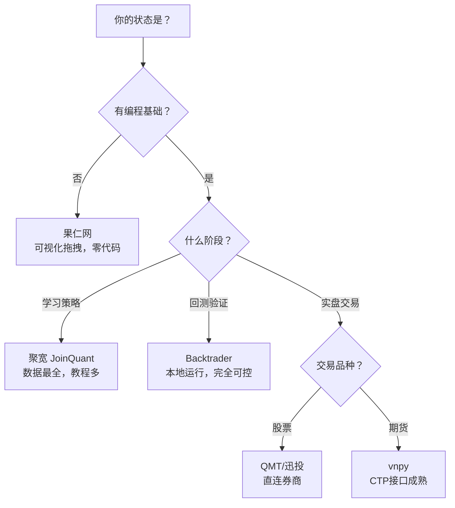
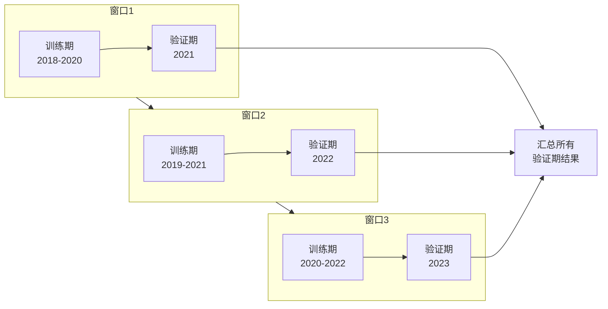
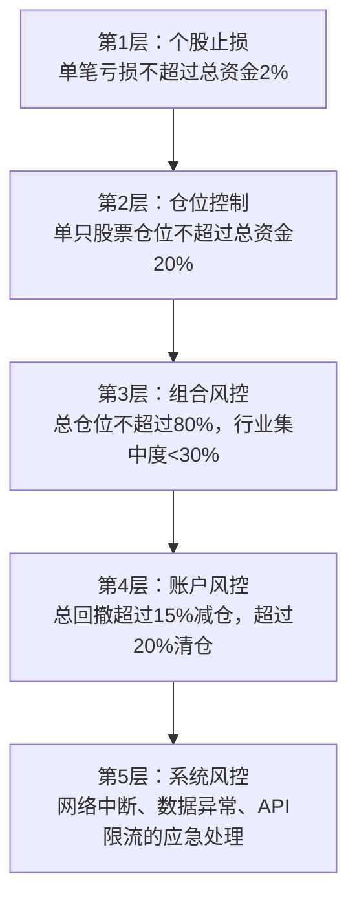
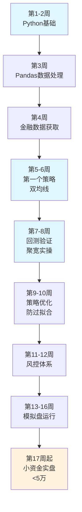

## 五、量化交易入门技巧

量化交易的核心思想是**把投资决策从"人脑判断"转化为"规则执行"**。人会贪婪、恐惧、犹豫、冲动，程序不会。但量化也不是万能的——它不会让差策略变好，只会让好策略执行得更稳定、更纪律。

本节聚焦实操技巧：你需要学什么语言、用什么平台、写什么策略、怎么验证、怎么控制风险。每一个环节都有可直接使用的代码和具体操作步骤。

---

### 5.1 Python量化编程基础

Python是量化交易的事实标准语言。不是因为Python本身有多优秀，而是因为整个量化生态都建立在Python之上——数据源、回测框架、机器学习库、可视化工具，全部是Python优先。

#### 5.1.1 量化开发必备的Python技能

量化开发不需要你成为Python专家，但以下技能是绝对的基础线：

| 技能层级 | 具体内容 | 量化中的用途 | 学习时间 |
|----------|----------|-------------|----------|
| 基础语法 | 变量、条件判断、循环、函数定义 | 编写策略逻辑的骨架 | 1周 |
| 数据结构 | 列表、字典、元组、集合 | 存储和查询交易数据 | 3天 |
| 面向对象 | 类的定义、继承、方法 | Backtrader策略必须用类实现 | 3天 |
| 文件操作 | CSV/JSON读写、SQLite操作 | 数据存储和策略日志 | 2天 |
| 异常处理 | try/except、日志记录 | 实盘中网络中断、数据异常的容错 | 1天 |
| Pandas | DataFrame操作、时间序列、滚动窗口 | **量化开发的核心工具**，每天都在用 | 1-2周 |
| NumPy | 数组运算、向量化计算 | 技术指标计算、矩阵运算 | 3天 |
| Matplotlib | 折线图、K线图、子图布局 | 回测结果可视化、策略分析 | 3天 |

**关键认知**：Pandas是量化开发中使用频率最高的库，没有之一。以下操作你每天都会用到：

```python
import pandas as pd
import numpy as np

# 1. 读取股票数据（假设已从Tushare/AKShare获取）
df = pd.read_csv('stock_data.csv', parse_dates=['trade_date'], index_col='trade_date')

# 2. 计算技术指标——滚动窗口是量化中最常用的操作
df['ma5'] = df['close'].rolling(window=5).mean()      # 5日均线
df['ma20'] = df['close'].rolling(window=20).mean()    # 20日均线
df['vol_ma5'] = df['volume'].rolling(window=5).mean() # 成交量5日均线

# 3. 计算收益率
df['daily_return'] = df['close'].pct_change()          # 日收益率
df['cum_return'] = (1 + df['daily_return']).cumprod()  # 累计收益率

# 4. 生成交易信号（金叉/死叉）
df['signal'] = 0
df.loc[df['ma5'] > df['ma20'], 'signal'] = 1   # 多头信号
df.loc[df['ma5'] < df['ma20'], 'signal'] = -1  # 空头信号
df['signal_change'] = df['signal'].diff()       # 信号变化点

# 5. 按时间范围筛选数据
df_2023 = df.loc['2023-01-01':'2023-12-31']    # 筛选2023年数据

# 6. 按频率重采样（日线转周线）
weekly = df['close'].resample('W').agg({'open': 'first', 'high': 'max', 
                                         'low': 'min', 'close': 'last'})
```

#### 5.1.2 量化开发环境搭建

不要用系统Python直接装包，必须用虚拟环境隔离。量化项目经常需要特定版本的依赖，版本冲突是新手最常见的绊脚石。

```bash
# 创建量化专用虚拟环境（Python 3.9-3.11最佳，3.12部分包兼容性差）
python3 -m venv ~/quant-env
source ~/quant-env/bin/activate

# 使用国内镜像加速安装（默认PyPI在国内很慢）
pip config set global.index-url https://pypi.tuna.tsinghua.edu.cn/simple

# 安装量化核心依赖
pip install pandas numpy matplotlib
pip install backtrader           # 本地回测框架
pip install tushare              # A股数据源（需注册token）
pip install akshare              # 备用数据源（免注册）

# 验证安装
python -c "import backtrader; import tushare; import akshare; print('环境就绪')"
```

**环境问题速查**：

| 问题 | 原因 | 解决方案 |
|------|------|----------|
| `pip install` 超时 | PyPI连接慢 | 加 `-i https://pypi.tuna.tsinghua.edu.cn/simple` |
| Pandas版本冲突 | Backtrader对Pandas版本敏感 | `pip install pandas==2.0.3`（兼容性最好） |
| Matplotlib中文乱码 | 缺少中文字体配置 | 在代码开头加 `plt.rcParams['font.sans-serif'] = ['SimHei']` |
| Tushare报token无效 | 未设置或token过期 | 在 tushare.pro 重新获取，执行 `ts.set_token('your_token')` |
| Backtrader报KeyError | DataFrame列名不规范 | 确保列名为 `open/high/low/close/volume`，全小写 |

#### 5.1.3 金融数据获取实战

数据是量化的燃料。数据质量差，再好的策略也白搭。推荐两个互补的数据源：

```python
# ===== 数据源一：Tushare Pro（推荐，数据质量好） =====
import tushare as ts
ts.set_token('你的token')  # 在 tushare.pro 注册获取
pro = ts.pro_api()

# 获取个股日线数据（前复权）
df = pro.daily(ts_code='000001.SZ', start_date='20200101', end_date='20231231')

# 获取沪深300指数
hs300 = pro.index_daily(ts_code='000300.SH', start_date='20200101', end_date='20231231')

# 获取成分股列表（用于选股）
constituents = pro.index_weight(index_code='399300.SZ', start_date='20231201')

# ===== 数据源二：AKShare（免注册，接口丰富） =====
import akshare as ak

# 获取个股日线（自动前复权）
df = ak.stock_zh_a_hist(symbol="000001", period="daily", 
                         start_date="20200101", end_date="20231231", adjust="qfq")

# 获取实时行情（盘中使用）
realtime = ak.stock_zh_a_spot_em()  # 全市场实时行情
```

**数据处理三大铁律**：

1. **必须做复权处理**。分红送股会导致价格不连续，不复权的话均线计算全错。量化回测通常用前复权（`adjust="qfq"`）——它把历史价格调低到当前基准，回答"以当前价格买入，历史收益是多少"。

2. **必须处理停牌数据**。停牌期间没有交易，不能用停牌前的价格填充（那会让均线"冻结"，复牌后产生虚假信号）。正确做法是跳过停牌日。

3. **必须检查幸存者偏差**。你获取的数据通常只包含当前还在交易的股票，退市/被收购的股票数据缺失。只用"活下来"的股票回测，结果天然偏乐观。Tushare的 `stock_basic(list_status='D')` 可以获取已退市股票列表。

```python
# 数据清洗标准流程
def clean_stock_data(df):
    """清洗日线数据，返回可用的DataFrame"""
    original_len = len(df)
    
    # 删除价格异常（为0或负数）
    df = df[(df['close'] > 0) & (df['open'] > 0)]
    
    # 删除停牌日（成交量为0）
    df = df[df['volume'] > 0]
    
    # 删除重复记录
    df = df.drop_duplicates(subset=['trade_date'], keep='last')
    
    # 按日期排序
    df = df.sort_values('trade_date').reset_index(drop=True)
    
    print(f"数据清洗: {original_len}条 → {len(df)}条")
    return df
```

---

### 5.2 主流量化平台使用技巧

#### 5.2.1 平台选择决策树

不同阶段用不同平台，不要一上来就选最复杂的：



#### 5.2.2 聚宽（JoinQuant）入门实操

聚宽是量化入门的最佳起点：数据免费、教程丰富、社区活跃。以下是快速上手的操作流程：

**第一步：注册与环境熟悉**

1. 访问 joinquant.com 注册账号（免费版每天8次回测，够用）
2. 进入"研究"环境，这是一个在线Jupyter Notebook，可以直接写代码
3. 进入"策略"环境，这是回测和模拟交易的地方

**第二步：编写第一个策略**

聚宽的策略框架由两个核心函数组成：

```python
# 聚宽策略模板——理解这个框架就能写任何策略
from jqdata import *

def initialize(context):
    """
    初始化函数，在策略开始时运行一次。
    设置：股票池、基准、手续费、滑点等
    """
    # 设置基准（策略收益会和它比较）
    set_benchmark('000300.XSHG')  # 沪深300
    
    # 设置手续费
    set_order_cost(
        OrderCost(
            open_tax=0,          # 买入印花税
            close_tax=0.001,     # 卖出印花税0.1%
            open_commission=0.0003,  # 买入佣金万三
            close_commission=0.0003, # 卖出佣金万三
            close_today_commission=0, # 今日平仓佣金（股票无）
            min_commission=5     # 最低佣金5元
        ),
        type='stock'
    )
    
    # 设置滑点（模拟实际成交价偏差）
    set_slippage(PriceRelatedSlippage(0.002))  # 0.2%滑点
    
    # 策略参数
    context.fast_period = 10
    context.slow_period = 30
    context.stock = '000300.XSHG'
    
    # 定时任务：每个交易日开盘时运行
    run_daily(trade, time='open')


def trade(context):
    """
    交易函数，每个交易日执行一次。
    这里写策略的核心逻辑。
    """
    stock = context.stock
    
    # 获取历史数据
    hist = attribute_history(stock, context.slow_period + 5, '1d', ['close'])
    
    # 计算均线
    ma_fast = hist['close'][-context.fast_period:].mean()
    ma_slow = hist['close'][-context.slow_period:].mean()
    
    # 获取当前持仓
    position = context.portfolio.positions[stock]
    
    # 交易逻辑
    if ma_fast > ma_slow and position.total_amount == 0:
        # 金叉且无持仓 → 买入（使用95%资金）
        order_target_value(stock, context.portfolio.total_value * 0.95)
        log.info(f"买入 {stock}，快线{ma_fast:.2f} > 慢线{ma_slow:.2f}")
    
    elif ma_fast < ma_slow and position.total_amount > 0:
        # 死叉且有持仓 → 卖出
        order_target(stock, 0)
        log.info(f"卖出 {stock}，快线{ma_fast:.2f} < 慢线{ma_slow:.2f}")
```

**第三步：回测配置**

在聚宽的回测页面，设置以下参数：

| 参数 | 推荐值 | 说明 |
|------|--------|------|
| 起止时间 | 至少3年 | 覆盖牛熊市，太短无法验证策略稳定性 |
| 初始资金 | 100,000 | 不需要真实资金，但要和未来实盘一致 |
| 频率 | 每日 | 日线级别策略，分钟级策略选分钟 |
| 基准 | 000300.XSHG | 沪深300，最常见的业绩基准 |

**第四步：分析回测结果**

聚宽会自动生成回测报告，重点关注以下指标：

| 指标 | 及格线 | 优秀线 | 含义 |
|------|--------|--------|------|
| 年化收益率 | >8% | >15% | 跑赢通胀和存款利率 |
| 最大回撤 | <20% | <10% | 期间最大浮亏，越小越好 |
| 夏普比率 | >1.0 | >2.0 | 风险调整后收益，越高越好 |
| 胜率 | >40% | >55% | 盈利交易占比（趋势策略通常不高） |
| 盈亏比 | >1.5:1 | >3:1 | 平均盈利/平均亏损，越大越好 |
| 交易频率 | 视策略 | - | 太频繁说明假信号多 |

#### 5.2.3 Backtrader本地回测

当策略在聚宽验证通过后，搬到Backtrader做本地回测。好处是：数据自己掌控、回测可复现、不受平台限制、可以接入更多数据源。

```python
import backtrader as bt

# Backtrader回测的标准流程（5步）
cerebro = bt.Cerebro()                              # 1. 创建引擎
cerebro.addstrategy(YourStrategy)                    # 2. 添加策略
cerebro.adddata(bt.feeds.PandasData(dataname=df))   # 3. 加载数据
cerebro.broker.setcash(100000)                       # 4. 设置初始资金
cerebro.broker.setcommission(commission=0.0003)      # 5. 设置手续费

# 添加分析器（衡量策略表现）
cerebro.addanalyzer(bt.analyzers.SharpeRatio, _name='sharpe', riskfreerate=0.03)
cerebro.addanalyzer(bt.analyzers.DrawDown, _name='drawdown')
cerebro.addanalyzer(bt.analyzers.Returns, _name='returns')
cerebro.addanalyzer(bt.analyzers.TradeAnalyzer, _name='trades')

# 运行回测
results = cerebro.run()
strat = results[0]

# 输出结果
print(f"最终资金: {cerebro.broker.getvalue():,.0f}")
print(f"年化收益: {strat.analyzers.returns.get_analysis()['rnorm100']:.2f}%")
print(f"最大回撤: {strat.analyzers.drawdown.get_analysis()['max']['drawdown']:.2f}%")
print(f"夏普比率: {strat.analyzers.sharpe.get_analysis()['sharperatio']:.2f}")

# 绘制回测图（K线+均线+买卖点+资金曲线）
cerebro.plot(style='candlestick', volume=True, figsize=(16, 10))
```

---

### 5.3 五种经典量化策略详解

以下五种策略覆盖了量化交易最主流的策略类型。入门者应从双均线开始，逐步学习其他策略，理解不同策略的适用场景和局限性。

#### 5.3.1 策略一：双均线交叉策略（入门必学）

**原理**：短期均线反映近期趋势，长期均线反映中期趋势。短期上穿长期（金叉）表示趋势转强，买入；短期下穿长期（死叉）表示趋势转弱，卖出。

**为什么有效**：动量效应——Jegadeesh和Titman(1993)的经典研究表明，股票收益率存在3-12个月的短期动量，过去涨的短期内倾向继续涨。均线交叉本质上就是捕捉动量方向的转换。

**局限**：A股60-70%时间处于震荡市，均线会反复交叉产生假信号，导致频繁止损。基础版胜率通常只有40-45%。

```python
import backtrader as bt

class DualMA(bt.Strategy):
    """
    双均线策略（基础版）
    
    买入条件：MA_fast 上穿 MA_slow（金叉）
    卖出条件：MA_fast 下穿 MA_slow（死叉）
    止损条件：浮亏超过8%强制卖出
    """
    params = (
        ('fast_period', 10),  # 短期均线
        ('slow_period', 30),  # 长期均线
        ('stop_loss', 0.08),  # 止损线8%
    )
    
    def __init__(self):
        self.fast_ma = bt.indicators.SMA(self.data.close, period=self.p.fast_period)
        self.slow_ma = bt.indicators.SMA(self.data.close, period=self.p.slow_period)
        self.crossover = bt.indicators.CrossOver(self.fast_ma, self.slow_ma)
        self.buy_price = None
    
    def next(self):
        if not self.position:
            # 无持仓：金叉时买入
            if self.crossover > 0:
                size = int(self.broker.getcash() * 0.95 / self.data.close[0])
                size = (size // 100) * 100  # A股最小100股
                if size > 0:
                    self.buy(size=size)
                    self.buy_price = self.data.close[0]
        else:
            # 有持仓：死叉卖出或止损
            if self.crossover < 0:
                self.sell(size=self.position.size)
                self.buy_price = None
            elif self.buy_price:
                loss = (self.data.close[0] - self.buy_price) / self.buy_price
                if loss < -self.p.stop_loss:
                    self.sell(size=self.position.size)
                    self.buy_price = None
```

**参数选择参考**：

| 参数组合 | 适用场景 | 特点 |
|----------|----------|------|
| MA5/MA20 | 短线交易 | 信号灵敏，假信号多，交易频率高 |
| MA10/MA30 | 中线交易 | 平衡灵敏度和稳定性，最常用 |
| MA20/MA60 | 中长线 | 信号少但质量高，适合趋势明显的市场 |
| MA50/MA200 | 长线投资 | "黄金交叉/死亡交叉"，判断牛熊转换 |

#### 5.3.2 策略二：MACD策略（技术分析经典）

**原理**：MACD（Moving Average Convergence Divergence，指数平滑异同移动平均线）由三部分组成：
- **DIF线**：快速EMA（12日）与慢速EMA（26日）的差值
- **DEA线**：DIF的9日EMA（信号线）
- **MACD柱**：DIF与DEA的差值（红绿柱）

DIF上穿DEA为金叉买入信号，DIF下穿DEA为死叉卖出信号。MACD柱由负转正表示多头动能增强。

**比双均线好在哪**：MACD用EMA（指数移动平均）替代SMA（简单移动平均），对近期价格更敏感；同时引入柱状图，能量化趋势的强弱程度。

```python
class MACDStrategy(bt.Strategy):
    """
    MACD策略
    
    买入：DIF上穿DEA（金叉）且DIF在零轴附近或上方
    卖出：DIF下穿DEA（死叉）
    过滤：MACD柱持续放大时才入场（趋势确认）
    """
    params = (
        ('fast_period', 12),    # 快速EMA周期
        ('slow_period', 26),    # 慢速EMA周期
        ('signal_period', 9),   # 信号线周期
        ('stop_loss', 0.08),    # 止损8%
    )
    
    def __init__(self):
        self.macd = bt.indicators.MACD(
            self.data.close,
            period_me1=self.p.fast_period,
            period_me2=self.p.slow_period,
            period_signal=self.p.signal_period
        )
        self.dif = self.macd.macd        # DIF线
        self.dea = self.macd.signal      # DEA线（信号线）
        self.crossover = bt.indicators.CrossOver(self.dif, self.dea)
        self.buy_price = None
    
    def next(self):
        if not self.position:
            # 买入条件：金叉 + MACD柱为正（趋势向上）
            if self.crossover > 0 and (self.dif[0] - self.dea[0]) > 0:
                size = int(self.broker.getcash() * 0.95 / self.data.close[0])
                size = (size // 100) * 100
                if size > 0:
                    self.buy(size=size)
                    self.buy_price = self.data.close[0]
        else:
            if self.crossover < 0:
                self.sell(size=self.position.size)
                self.buy_price = None
            elif self.buy_price:
                loss = (self.data.close[0] - self.buy_price) / self.buy_price
                if loss < -self.p.stop_loss:
                    self.sell(size=self.position.size)
                    self.buy_price = None
```

**MACD的进阶用法**：

| 信号 | 含义 | 可靠性 |
|------|------|--------|
| 零轴上方金叉 | 强势市场中的买入机会 | 高 |
| 零轴下方金叉 | 弱势市场中的反弹信号 | 中低 |
| 零轴上方死叉 | 强势市场转弱的预警 | 中 |
| 零轴下方死叉 | 弱势市场继续走弱 | 高 |
| 顶背离（价格新高但MACD没有新高） | 上涨动能衰竭 | 高（反转信号） |
| 底背离（价格新低但MACD没有新低） | 下跌动能衰竭 | 高（反转信号） |

#### 5.3.3 策略三：布林带均值回归策略（震荡市利器）

**原理**：布林带由三条线组成——中轨（20日均线）、上轨（中轨+2倍标准差）、下轨（中轨-2倍标准差）。价格在统计学上约95%的时间在布林带内运行。当价格触及下轨时"超卖"，反弹概率大；触及上轨时"超超买"，回落概率大。

**与趋势策略的互补关系**：双均线/MACD是趋势跟踪策略，在趋势市赚钱、震荡市亏钱；布林带是均值回归策略，在震荡市赚钱、趋势市亏钱。两者组合使用，可以在不同市场环境下互补。

```python
class BollingerMeanReversion(bt.Strategy):
    """
    布林带均值回归策略
    
    买入：价格触及下轨 + RSI超卖
    卖出：价格触及上轨 或 回到中轨（均值回归完成）
    """
    params = (
        ('period', 20),         # 布林带周期
        ('devfactor', 2.0),     # 标准差倍数
        ('rsi_period', 14),     # RSI周期
        ('rsi_oversold', 30),   # RSI超卖阈值
        ('rsi_overbought', 70), # RSI超买阈值
        ('stop_loss', 0.05),    # 止损5%
    )
    
    def __init__(self):
        self.boll = bt.indicators.BollingerBands(
            self.data.close, period=self.p.period, devfactor=self.p.devfactor
        )
        self.rsi = bt.indicators.RSI(self.data.close, period=self.p.rsi_period)
        self.buy_price = None
    
    def next(self):
        if not self.position:
            # 买入：价格触下轨 + RSI超卖
            if self.data.close[0] < self.boll.lines.bot[0] and self.rsi[0] < self.p.rsi_oversold:
                size = int(self.broker.getcash() * 0.95 / self.data.close[0])
                size = (size // 100) * 100
                if size > 0:
                    self.buy(size=size)
                    self.buy_price = self.data.close[0]
        else:
            # 卖出：价格触上轨，或回到中轨（均值回归完成）
            if self.data.close[0] > self.boll.lines.top[0]:
                self.sell(size=self.position.size)
                self.buy_price = None
            elif self.data.close[0] > self.boll.lines.mid[0]:
                # 回到中轨，获利了结
                if self.buy_price and self.data.close[0] > self.buy_price:
                    self.sell(size=self.position.size)
                    self.buy_price = None
            # 止损
            elif self.buy_price:
                loss = (self.data.close[0] - self.buy_price) / self.buy_price
                if loss < -self.p.stop_loss:
                    self.sell(size=self.position.size)
                    self.buy_price = None
```

**布林带策略的关键细节**：
- 布林带收窄（上下轨距离缩小）往往预示着大行情即将到来，但方向不确定
- 单独使用布林带在强趋势中会"抄底抄在半山腰"，必须配合趋势过滤或止损
- 参数2倍标准差覆盖约95%的价格分布，可根据标的波动率调整为1.5或2.5倍

#### 5.3.4 策略四：海龟交易策略（经典趋势跟踪）

**原理**：海龟交易法则是1983年传奇交易员Richard Dennis教给一批"海龟"学员的系统化交易方法。核心思想极其简单：突破N日最高价买入，跌破N日最低价卖出，用ATR控制仓位大小。

**为什么经典**：这套规则完全机械化，没有任何主观判断，却在实盘中创造了年化80%+的传奇收益。它证明了一个道理——**严格执行简单规则，比复杂的主观判断更有效**。

```python
class TurtleStrategy(bt.Strategy):
    """
    海龟交易策略
    
    入场：价格突破20日最高价买入
    出场：价格跌破10日最低价卖出
    仓位：用ATR动态计算，波动大时少买，波动小时多买
    止损：2倍ATR
    """
    params = (
        ('entry_period', 20),      # 入场通道周期
        ('exit_period', 10),       # 出场通道周期
        ('atr_period', 20),        # ATR计算周期
        ('atr_stop_mult', 2.0),    # ATR止损倍数
        ('risk_per_trade', 0.02),  # 单笔风险2%
    )
    
    def __init__(self):
        self.highest = bt.indicators.Highest(self.data.high, period=self.p.entry_period)
        self.lowest = bt.indicators.Lowest(self.data.low, period=self.p.exit_period)
        self.atr = bt.indicators.ATR(self.data, period=self.p.atr_period)
        self.entry_price = None
        self.highest_since_entry = None
    
    def next(self):
        if not self.position:
            # 入场：突破20日最高价
            if self.data.close[0] > self.highest[-1]:
                self._calculate_and_buy()
        else:
            # 出场条件1：跌破10日最低价
            if self.data.close[0] < self.lowest[-1]:
                self.sell(size=self.position.size)
                self.entry_price = None
                return
            
            # 出场条件2：ATR跟踪止损
            if self.data.close[0] > self.highest_since_entry:
                self.highest_since_entry = self.data.close[0]
            
            stop_price = self.highest_since_entry - self.atr[0] * self.p.atr_stop_mult
            if self.data.close[0] < stop_price:
                self.sell(size=self.position.size)
                self.entry_price = None
    
    def _calculate_and_buy(self):
        """用ATR计算仓位大小——海龟法则的核心"""
        risk_amount = self.broker.getvalue() * self.p.risk_per_trade
        risk_per_share = self.atr[0] * self.p.atr_stop_mult
        
        if risk_per_share <= 0:
            return
        
        size = int(risk_amount / risk_per_share / 100) * 100
        
        if size > 0 and self.broker.getcash() >= size * self.data.close[0]:
            self.buy(size=size)
            self.entry_price = self.data.close[0]
            self.highest_since_entry = self.data.close[0]
```

**ATR仓位管理的直觉解释**：

| 股票 | 价格 | ATR | 每股风险(ATR×2) | 100万资金应买股数 |
|------|------|-----|-----------------|-------------------|
| A（低波动） | 50元 | 2元 | 4元 | 5,000股(25万) |
| B（高波动） | 50元 | 5元 | 10元 | 2,000股(10万) |

两只股票价格相同，但因为波动率不同，仓位差了2.5倍。这就是ATR仓位管理的价值——让每笔交易承担的风险金额相等，避免波动大的股票一笔亏掉太多。

#### 5.3.5 策略五：多因子选股策略（量化投资核心）

**原理**：不依赖单一技术指标，而是综合多个"因子"（如估值、成长性、盈利能力、动量等）给股票打分，选择综合得分最高的股票构建组合。这是机构量化基金最常用的策略框架。

**因子分类**：

| 因子类别 | 具体因子 | 选股逻辑 | 有效性 |
|----------|----------|----------|--------|
| 价值因子 | PE、PB、PCF | 低估值股票长期跑赢高估值 | 长期有效，短期可能失效 |
| 成长因子 | 营收增速、利润增速 | 高成长公司股价上涨潜力大 | 有效但波动大 |
| 质量因子 | ROE、毛利率、资产负债率 | 优质公司更抗跌 | 防守型有效 |
| 动量因子 | 过去3/6/12个月涨幅 | 强者恒强 | 中短期有效 |
| 波动因子 | 历史波动率、换手率 | 低波动股票长期表现更好 | 长期有效 |

```python
def multi_factor_stock_selection(stock_list, date):
    """
    多因子选股：综合打分
    
    步骤：
    1. 获取各因子数据
    2. 对每个因子进行标准化（消除量纲差异）
    3. 加权求和得到综合得分
    4. 选择得分最高的N只股票
    """
    import tushare as ts
    import pandas as pd
    import numpy as np
    
    pro = ts.pro_api()
    
    # 获取基本面数据
    df = pro.daily_basic(trade_date=date, ts_code=','.join(stock_list),
                          fields='ts_code,pe_ttm,pb,ps_ttm,dv_ratio,total_mv')
    
    # 获取动量数据（过去60日涨幅）
    momentum_data = []
    for code in stock_list[:50]:  # 限制数量避免API限流
        hist = pro.daily(ts_code=code, start_date='20230901', end_date=date)
        if len(hist) >= 60:
            ret = (hist['close'].iloc[-1] / hist['close'].iloc[-60]) - 1
            momentum_data.append({'ts_code': code, 'momentum_60d': ret})
    mom_df = pd.DataFrame(momentum_data)
    
    # 合并数据
    df = df.merge(mom_df, on='ts_code', how='inner')
    df = df.dropna()
    
    # 因子标准化（Z-Score）
    factors = ['pe_ttm', 'pb', 'momentum_60d', 'dv_ratio']
    for f in factors:
        df[f'{f}_zscore'] = (df[f] - df[f].mean()) / df[f].std()
    
    # 加权求和（注意：PE/PB是反向因子，越低越好）
    df['score'] = (
        -0.3 * df['pe_ttm_zscore'] +    # 低PE（负号表示反向）
        -0.2 * df['pb_zscore'] +          # 低PB
        +0.3 * df['momentum_60d_zscore'] + # 高动量
        +0.2 * df['dv_ratio_zscore']       # 高股息
    )
    
    # 选择得分最高的10只
    top_stocks = df.nlargest(10, 'score')
    return top_stocks[['ts_code', 'score', 'pe_ttm', 'pb', 'momentum_60d']]
```

**多因子策略的关键注意点**：
- 因子之间不能高度相关（比如PE和PB相关性很高，选一个就行）
- 因子权重需要定期再平衡，不同市场环境下有效因子不同
- 需要做行业中性化处理，避免选出的全是同一行业
- 回测时必须考虑换仓成本（每月换仓一次，交易成本约0.3-0.5%）

---

### 5.4 回测方法论与常见陷阱

回测是量化交易的核心环节，但也是最容易"自欺欺人"的环节。一个在回测中表现完美的策略，实盘可能亏得一塌糊涂。

#### 5.4.1 回测的六大陷阱

| 陷阱 | 表现 | 后果 | 防范方法 |
|------|------|------|----------|
| **未来函数** | 用了当天收盘价做当天的交易决策 | 回测收益虚高，实盘不可能实现 | 信号只能用历史数据，用`close[-1]`而非`close[0]` |
| **过拟合** | 参数调到最优，历史表现完美 | 换个时间段收益就崩 | Walk-Forward优化，参数不超过3个 |
| **幸存者偏差** | 只用当前上市的股票回测 | 结果天然偏乐观 | 用包含退市股票的全历史数据库 |
| **忽略交易成本** | 不算手续费、印花税、滑点 | 实际收益比回测低1-3% | 佣金万三+印花税千一+滑点0.1-0.3% |
| **忽略流动性** | 买卖不受限 | 小盘股实际成交不了 | 过滤日均成交额<1000万的标的 |
| **数据窥探** | 反复在同一段数据上优化 | 本质上是过拟合 | 留出最后1-2年数据做最终验证 |

#### 5.4.2 Walk-Forward优化（防过拟合的标准方法）

Walk-Forward（滚动窗口优化）是业界公认的防过拟合标准方法。核心思想：用历史数据优化参数，用未来数据验证，反复滚动。



**判断标准**：
- 样本外夏普比率衰减不超过50% → 可接受
- 所有窗口的样本外收益都为正 → 策略稳健
- 最优参数在不同窗口间保持相对稳定 → 可信度高
- 如果某个窗口样本外严重亏损 → 该市场环境下策略失效，需要加条件过滤

#### 5.4.3 回测结果的正确解读

不要只看收益率。一个完整的回测分析应该包含：

```python
def analyze_backtest_result(strat):
    """完整分析回测结果"""
    
    # 1. 收益指标
    returns = strat.analyzers.returns.get_analysis()
    print(f"年化收益率: {returns['rnorm100']:.2f}%")
    
    # 2. 风险指标
    dd = strat.analyzers.drawdown.get_analysis()
    print(f"最大回撤: {dd['max']['drawdown']:.2f}%")
    print(f"最大回撤持续天数: {dd['max']['len']}")
    
    # 3. 风险调整指标
    sharpe = strat.analyzers.sharpe.get_analysis()
    print(f"夏普比率: {sharpe['sharperatio']:.2f}")
    
    # 4. 交易统计
    trades = strat.analyzers.trades.get_analysis()
    total = trades.get('total', {}).get('total', 0)
    won = trades.get('won', {}).get('total', 0)
    lost = trades.get('lost', {}).get('total', 0)
    win_rate = won / total if total > 0 else 0
    
    print(f"总交易次数: {total}")
    print(f"盈利次数: {won}, 亏损次数: {lost}")
    print(f"胜率: {win_rate:.1%}")
    
    # 5. 盈亏比
    avg_win = trades.get('won', {}).get('pnl', {}).get('average', 0)
    avg_loss = abs(trades.get('lost', {}).get('pnl', {}).get('average', 1))
    profit_loss_ratio = avg_win / avg_loss if avg_loss > 0 else 0
    print(f"盈亏比: {profit_loss_ratio:.2f}")
    
    # 6. 期望收益（判断策略是否值得继续）
    expected = win_rate * avg_win - (1 - win_rate) * avg_loss
    print(f"每笔期望收益: {expected:.0f}元")
    print(f"结论: {'策略可行' if expected > 0 else '策略不可行'}")
```

---

### 5.5 风控体系设计

风控是量化的生命线。一个没有风控的量化策略，和赌博没有本质区别。

#### 5.5.1 五层风控架构



**每层风控的具体实现**：

```python
class RiskManager:
    """风控管理器"""
    
    def __init__(self, total_capital):
        self.total_capital = total_capital
        self.max_single_loss = 0.02      # 单笔最大亏损2%
        self.max_position_pct = 0.20     # 单只最大仓位20%
        self.max_total_position = 0.80   # 总仓位上限80%
        self.max_drawdown_warning = 0.15 # 回撤15%预警
        self.max_drawdown_stop = 0.20    # 回撤20%清仓
    
    def check_single_trade(self, price, stop_loss_price, portfolio_value):
        """第1层：检查单笔风险"""
        risk_per_share = price - stop_loss_price
        max_risk_amount = portfolio_value * self.max_single_loss
        max_shares = int(max_risk_amount / risk_per_share / 100) * 100
        return max_shares
    
    def check_position_limit(self, stock_value, portfolio_value):
        """第2层：检查仓位限制"""
        return stock_value / portfolio_value < self.max_position_pct
    
    def check_drawdown(self, current_value, peak_value):
        """第4层：检查回撤"""
        drawdown = (peak_value - current_value) / peak_value
        if drawdown >= self.max_drawdown_stop:
            return 'STOP'   # 清仓
        elif drawdown >= self.max_drawdown_warning:
            return 'WARNING'  # 减仓
        return 'OK'
```

#### 5.5.2 止损方法对比

| 止损方法 | 规则 | 优点 | 缺点 | 适用场景 |
|----------|------|------|------|----------|
| 固定比例止损 | 亏损X%就卖 | 简单明确 | 不考虑波动率差异 | 新手入门 |
| ATR止损 | 亏损超过N倍ATR就卖 | 自适应波动率 | 需要计算ATR | 趋势策略 |
| 均线止损 | 跌破某条均线就卖 | 跟随趋势 | 止损幅度可能很大 | 中长线策略 |
| 时间止损 | 持仓N天后不盈利就卖 | 控制资金占用 | 可能错过大行情 | 短线策略 |
| 跟踪止损 | 从最高点回落X%就卖 | 能锁定利润 | 震荡市容易被洗出 | 趋势策略 |

**ATR跟踪止损**是最推荐的止损方法，因为它能自适应市场波动率：波动大时止损空间大（避免被震出去），波动小时止损空间小（及时锁定利润）。

---

### 5.6 量化交易常见误区

| 误区 | 真相 | 后果 |
|------|------|------|
| "回测年化50%的策略就是好策略" | 很可能是过拟合，实盘跑不出 | 实盘大幅亏损 |
| "参数越多越精确" | 参数越多越容易过拟合 | 策略在新数据上失效 |
| "胜率越高越好" | 胜率60%盈亏比0.5:1不如胜率40%盈亏比3:1 | 只看胜率忽略盈亏比 |
| "量化就是高频交易" | 个人做不了高频，中低频才是正道 | 花大量时间在不可能的事上 |
| "一个策略适合所有市场" | 趋势市和震荡市需要不同策略 | 在错误的市场环境下交易 |
| "量化不需要理解市场" | 不理解市场就无法设计好的策略逻辑 | 策略缺乏经济学基础 |
| "回测赚钱就能实盘" | 回测到实盘还有巨大的鸿沟 | 未经验证直接上实盘 |
| "AI/机器学习一定能提高收益" | 在小数据量的金融领域，ML容易过拟合 | 过度复杂化简单问题 |

**最重要的认知**：量化交易的本质是**纪律执行**，不是**预测未来**。一个好的量化系统 = 正期望值的策略 + 严格的风控 + 纪律性的执行。三者缺一不可。

---

### 5.7 从入门到进阶的学习路径



**每个阶段的核心任务**：

| 阶段 | 时间 | 核心任务 | 产出 | 常见卡点 |
|------|------|----------|------|----------|
| Python基础 | 1-2周 | 语法+Pandas+文件操作 | 能用Pandas处理CSV数据 | 不需要精通，够用就行 |
| 数据获取 | 1周 | Tushare/AKShare实操 | 能获取并清洗A股数据 | token注册、数据格式不熟悉 |
| 第一个策略 | 2周 | 双均线策略完整实现 | 一个能跑通的回测 | Backtrader框架不理解 |
| 回测分析 | 2周 | 聚宽+Backtrader回测 | 完整的回测报告 | 不会解读回测结果 |
| 策略优化 | 4周 | 趋势过滤+ATR止损+Walk-Forward | 优化后的策略 | 过拟合是最常见问题 |
| 风控设计 | 2周 | 五层风控实现 | 风控模块代码 | 风控太松或太紧 |
| 模拟盘 | 4周 | 策略在模拟盘运行 | 模拟盘运行记录 | 模拟盘和回测结果差异 |
| 小资金实盘 | 持续 | <5万实盘，观察策略表现 | 实盘交易日志 | 执行纪律 |

**给入门者的三个忠告**：

1. **先用模拟盘跑3个月再上实盘**。模拟盘和回测的差距可能超出你的想象——滑点、延迟、情绪都会影响结果。3个月的模拟盘记录能帮你发现策略在实盘中的真实问题。

2. **初始资金不超过5万**。不是因为钱少就不用认真，而是因为量化交易有一个陡峭的学习曲线，前6个月大概率会交学费。5万的学费你承受得起，50万可能让你心态崩掉。

3. **保持手动交易的习惯**。量化不是万能的，有些行情（比如政策突发、黑天鹅事件）程序处理不了。保持对市场的感知能力，在极端情况下手动干预是必要的。
