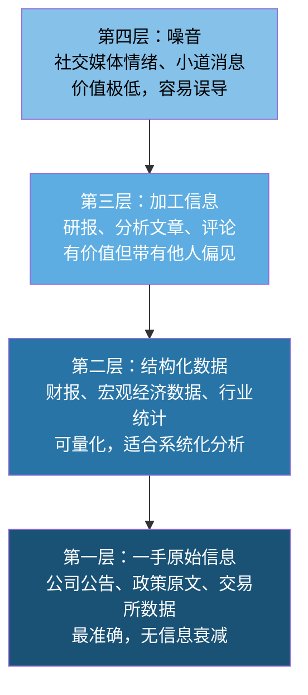
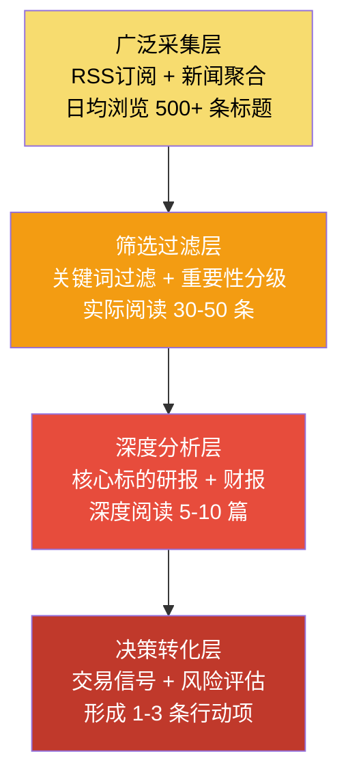
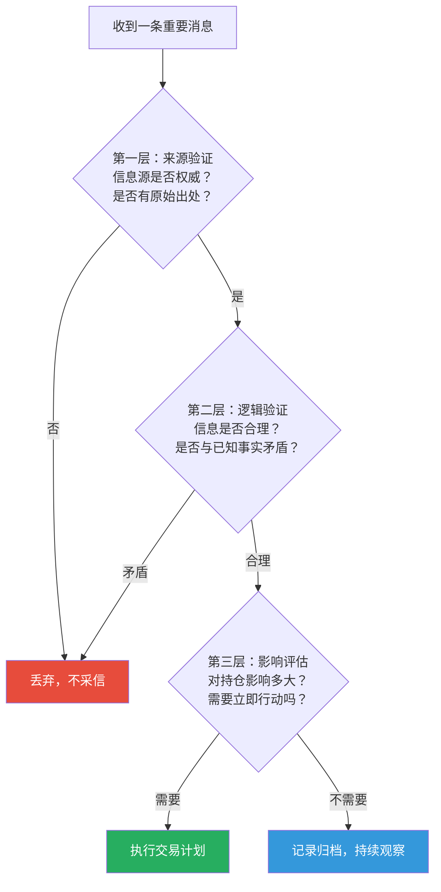
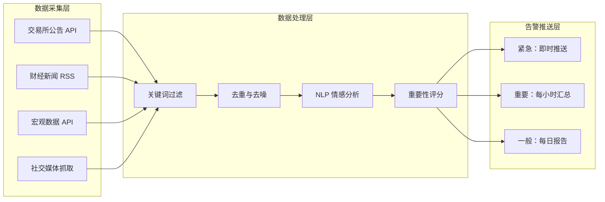

## 六、信息获取技巧

投资市场是一个信息驱动的生态系统。谁先获取有效信息、谁更善于从噪声中提炼信号，谁就拥有决策优势。本节系统讲解投资者如何构建自己的信息获取体系——从信息源的选择与鉴别，到数据的采集与处理，再到信息到决策的转化流程，帮助你在信息洪流中建立属于自己的"雷达系统"。

### 6.1 为什么信息获取是投资的核心能力

#### 6.1.1 信息不对称：投资收益的根本来源

金融市场中，信息不对称是客观存在的结构性现象。掌握更多信息或更早获取信息的投资者，往往能够获得超额收益。这并非鼓励内幕交易——法律边界必须严守——而是说，公开信息的获取效率、解读深度和反应速度，构成了普通投资者之间最大的差异。

信息不对称体现在三个层面：

| 层面 | 含义 | 普通投资者的应对 |
|------|------|------------------|
| **时间差** | 机构比散户更早看到数据 | 关注一手数据源，减少信息传递层级 |
| **解读差** | 同样的数据，不同人解读不同 | 提升财务分析和行业认知能力 |
| **覆盖差** | 机构覆盖面远超个人 | 用工具扩展监控范围，聚焦核心标的 |

#### 6.1.2 信息过载的陷阱

与信息匮乏相对的另一个极端是信息过载。一个普通投资者每天面对的信息量：

- **财经新闻**：主流财经网站日均发布 200-500 条资讯
- **研报**：券商研究所日均发布 50-100 篇研究报告
- **社交媒体**：雪球、微博等平台的投资讨论帖数以万计
- **公告**：A 股上市公司日均公告数百条

如果试图全部阅读，不仅不可能，还会导致"分析瘫痪"——信息越多，决策越难。因此，信息获取的核心不是"看得多"，而是"看得准"。

#### 6.1.3 信息获取的四层金字塔



高效投资者的工作模式是：**优先从第一层获取，用第二层做量化分析，选择性参考第三层的观点，主动屏蔽第四层的噪音**。

### 6.2 信息源分类与推荐

#### 6.2.1 官方权威数据源

这类信息源的特征是数据准确、更新及时、无主观偏见，是所有投资分析的基石。

**证券交易所**

| 平台 | 网址 | 主要数据 |
|------|------|----------|
| 上海证券交易所 | www.sse.com.cn | 上市公司公告、交易数据、指数信息 |
| 深圳证券交易所 | www.szse.cn | 深市公司公告、交易统计、创业板数据 |
| 北京证券交易所 | www.bse.cn | 北交所上市公司信息、新三板数据 |
| 港交所 | www.hkex.com.hk | 港股通数据、港股公告、上市规则 |
| 中国证监会 | www.csrc.gov.cn | 政策法规、行政处罚、审批信息 |

**宏观经济数据**

| 数据源 | 主要内容 | 更新频率 |
|------|----------|----------|
| 国家统计局 (www.stats.gov.cn) | GDP、CPI、PPI、PMI、社融、M2 | 月度/季度 |
| 中国人民银行 (www.pbc.gov.cn) | 货币政策、LPR、外汇储备、黄金储备 | 月度/实时 |
| 海关总署 (www.customs.gov.cn) | 进出口数据、贸易差额 | 月度 |
| 财政部 (www.mof.gov.cn) | 财政收支、国债发行、地方债 | 月度 |
| 美联储 (www.federalreserve.gov) | 利率决议、FOMC纪要、褐皮书 | 不定期 |
| 美国劳工统计局 (www.bls.gov) | 非农就业、CPI、PPI | 月度 |

#### 6.2.2 专业金融数据终端

数据终端提供结构化数据、图表分析和筛选功能，是从"看新闻"到"做研究"的分水岭。

**免费/低成本终端**

- **东方财富 Choice**：功能全面的免费终端，覆盖 A 股、港股、基金、债券数据，提供基础的财务筛选和行业对比功能。适合入门到中级投资者。
- **同花顺 iFinD**：数据覆盖面广，技术分析功能强，免费版能满足大部分个人投资者需求。
- **雪球**：社区+数据结合模式，个股页面提供完整的财务数据、估值指标和机构持仓变化。
- **理杏仁**：专注于估值数据，提供PE/PB/PS的历史百分位、股息率等核心指标，界面简洁高效。

**付费专业终端**

- **Wind 万得**：机构级数据终端，覆盖面最广、数据最全，单用户年费约 2-3 万元。适合全职投资者和机构从业者。
- **Choice 专业版**：东方财富旗下付费版，年费约 3000-5000 元，性价比高，适合进阶个人投资者。
- **Tushare Pro**：Python 金融数据接口，免费基础版 + 付费高级版，适合有编程能力的量化投资者。

#### 6.2.3 研报与分析平台

**券商研报获取渠道**

| 平台 | 特点 | 费用 |
|------|------|------|
| 慧博投研 | 研报最全的第三方平台 | 基础免费，VIP约500元/年 |
| 东方财富研报中心 | 主流券商研报汇总 | 免费 |
| 万得研报 | 与Wind终端联动 | 需Wind账号 |
| 萝卜投研 | AI辅助研报阅读 | 基础免费 |
| 发现报告 | 研报搜索和分类 | 免费+付费 |

**研报阅读的正确姿势**

1. **先看结论，再看逻辑**：直接翻到投资评级和目标价，判断是否与自己的持仓相关
2. **关注数据来源**：优质研报会标注数据来源，便于你独立验证
3. **区分事实和观点**：研报中的数据部分（财务数据、行业统计）价值最高；观点部分（目标价、评级）参考即可
4. **注意时间戳**：研报发布日期很重要，过时的研报参考价值大幅下降
5. **交叉验证**：同一标的至少看 2-3 家券商的研报，对比分歧点

#### 6.2.4 财经媒体与资讯平台

**国内主流财经媒体**

- **财新网**（www.caixin.com）：深度调查报道见长，宏观经济和政策分析质量高，付费墙但值得订阅
- **第一财经**（www.yicai.com）：覆盖面广，更新速度快，电视+网络+APP全渠道
- **经济观察报**：偏宏观和产业分析，深度报道质量稳定
- **证券时报**：证监会指定信息披露媒体，公告解读权威
- **中国基金报**：基金行业专业报道，产品分析深入

**国际财经媒体**

- **Bloomberg**（www.bloomberg.com）：全球金融数据和新闻的标杆
- **Reuters**（www.reuters.com）：新闻速度和覆盖面领先
- **Financial Times**（www.ft.com）：深度分析和评论质量极高
- **Wall Street Journal**（www.wsj.com）：美国市场覆盖最全面
- **Seeking Alpha**（seekingalpha.com）：众包式股票分析平台，有大量深度个股分析

#### 6.2.5 社交与社区平台

| 平台 | 定位 | 适合场景 | 信息质量 |
|------|------|----------|----------|
| 雪球 | 投资社区 | 个股讨论、投资理念交流 | 参差不齐，需筛选 |
| 集思录 | 低风险投资 | 可转债、套利、分级基金 | 高，用户专业度强 |
| 东方财富股吧 | 散户情绪 | 观察市场情绪指标 | 低，主要作反向指标 |
| 知乎 | 深度讨论 | 投资理念、方法论 | 中等，需辨别 |
| Twitter/X | 全球视角 | 海外市场、加密货币 | 参差不齐 |

> **关键提醒**：社区平台的核心价值不是获取"别人的结论"，而是获取"不同的视角"和"自己遗漏的信息点"。任何人的买卖建议都不应成为你的决策依据。

### 6.3 信息采集的实操方法

#### 6.3.1 构建个人投资信息工作流

高效的信息获取不是随机浏览，而是一个有结构的工作流。推荐采用"漏斗模型"：



#### 6.3.2 RSS 订阅：最高效的信息聚合方式

RSS（Really Simple Syndication）是最被低估的信息获取工具。它将多个信息源的内容聚合到一个阅读器中，避免你在多个网站之间跳转。

**推荐 RSS 阅读器**

- **Inoreader**：功能最全的在线RSS阅读器，免费版支持150个订阅源，支持规则过滤
- **Feedly**：界面美观，AI辅助分类，适合入门用户
- **Miniflux**：自托管方案，极简设计，适合有技术能力的用户
- **NetNewsWire**：macOS/iOS 原生客户端，免费开源

**值得订阅的 RSS 源**

```text
# 宏观经济
- 国家统计局数据发布：http://www.stats.gov.cn/rss/
- 央行公告：需通过第三方工具抓取

# 财经新闻
- 财新网：https://rsshub.app/caixin/latest
- 第一财经：https://rsshub.app/yicai/brief

# 研报与分析
- 慧博投研策略报告：https://rsshub.app/hibor/report

# 国际视角
- Bloomberg Markets：https://feeds.bloomberg.com/markets/news.rss
- Reuters Business：https://www.reutersagency.com/feed/

# 技术与数据
- GitHub 量化项目 Trending：https://rsshub.app/github/trending/daily/python
```

> **提示**：很多国内财经网站不提供官方RSS，可以使用 [RSSHub](https://docs.rsshub.app) 这类开源工具自建RSS源。部署一个自己的RSSHub实例（Docker一键部署），几乎可以为任何网站生成RSS。

#### 6.3.3 关键词监控与预警

设置关键词监控，让重要信息主动找到你，而不是你去找它。

**Google Alerts**（适用于国际市场）

```text
# 设置示例
关键词："A股" OR "沪深300"  →  频率：每天一次  →  邮箱：your@email.com
关键词："美联储" AND "利率"  →  频率：实时  →  邮箱：your@email.com
关键词：你的持仓标的名称  →  频率：实时  →  邮箱：your@email.com
```

**国内替代方案**

- **百度资讯监控**：百度搜索 → 资讯标签 → 设置时间提醒
- **微信公众号监控**：使用 Wechatsogou 或 WeRSS 订阅关键公众号
- **企业公告监控**：交易所官网支持公告关键词订阅邮件推送
- **Wind/Choice 预警**：付费终端自带的条件预警功能，可设置价格、公告、财务指标等多维度触发条件

#### 6.3.4 财报日历与事件跟踪

重要经济事件和财报发布时间是信息获取的关键节点。

**核心日历**

```text
# 月度固定事件
每月1日-15日   → 上市公司上月经营数据公告（自愿披露）
每月10日前后   → CPI、PPI 数据公布
每月15日前后   → 社融、M2、新增信贷数据
每月20日       → LPR 报价（1年期和5年期）
每月末         → PMI 数据（官方+财新）

# 季度事件
4月/7月/10月   → 上一季报集中披露期
3月/4月        → 年报集中披露期
每季度末       → 央行货币政策报告
每年3月        → 两会政策信号
每年12月       → 中央经济工作会议
```

**实操建议**：用日历工具（Google Calendar、Outlook）建立专属的"投资事件日历"，提前标注你的持仓标的的财报发布日期，在这些日期前后加强信息监控。

#### 6.3.5 Python 自动化信息采集

对于有编程能力的投资者，可以用 Python 构建自动化信息采集脚本。

**示例：自动抓取上市公司公告**

```python
import tushare as ts
import pandas as pd
from datetime import datetime, timedelta

# 初始化 Tushare（需要注册获取 token）
pro = ts.pro_api('你的TOKEN')

# 获取最近3天的重大公告
today = datetime.now().strftime('%Y%m%d')
three_days_ago = (datetime.now() - timedelta(days=3)).strftime('%Y%m%d')

# 按股票代码获取公告
announcements = pro.anns(
    start_date=three_days_ago,
    end_date=today,
    fields='ts_code,ann_date,title,content'
)

# 过滤关键词
keywords = ['业绩预告', '增持', '回购', '分红', '股权激励', '重大合同']
for kw in keywords:
    matched = announcements[announcements['title'].str.contains(kw, na=False)]
    if not matched.empty:
        print(f"\n=== 含「{kw}」的公告 ===")
        for _, row in matched.iterrows():
            print(f"  {row['ts_code']} | {row['ann_date']} | {row['title']}")
```

**示例：监控经济数据发布**

```python
import requests
from datetime import datetime

def check_macro_data():
    """检查今日是否有重要宏观数据发布"""
    important_indicators = ['CPI', 'PPI', 'PMI', 'M2', '社融', 'GDP']
    today = datetime.now().strftime('%Y-%m-%d')

    # 使用 akshare 获取宏观经济日历
    import akshare as ak
    macro_calendar = ak.macro_china_qyspjg()

    if today in str(macro_calendar.values):
        print(f"⚠️ 今天有重要宏观数据发布，请关注！")
        print(macro_calendar[macro_calendar['日期'].str.contains(today)])
    else:
        print(f"✅ 今天无重要宏观数据发布")

check_macro_data()
```

**示例：自动追踪北向资金**

```python
import akshare as ak
import pandas as pd

def track_northbound_flow():
    """追踪北向资金（沪股通+深股通）净买入情况"""
    # 获取近20个交易日的北向资金数据
    df = ak.stock_hsgt_north_net_flow_in_em()

    recent = df.tail(20)
    latest = recent.iloc[-1]

    print(f"日期: {latest['date']}")
    print(f"当日净买入: {latest['value']:.2f} 亿元")
    print(f"近5日累计: {recent.tail(5)['value'].sum():.2f} 亿元")
    print(f"近20日累计: {recent['value'].sum():.2f} 亿元")

    # 异常信号检测
    mean_flow = recent['value'].mean()
    std_flow = recent['value'].std()
    if abs(latest['value'] - mean_flow) > 2 * std_flow:
        direction = "大幅流入" if latest['value'] > 0 else "大幅流出"
        print(f"⚠️ 北向资金{direction}异常（超过2个标准差），请关注！")

track_northbound_flow()
```

### 6.4 信息分析与解读框架

#### 6.4.1 信息分级：从噪声到信号

不是所有信息都值得你花时间。建立一个信息分级系统，将有限的注意力分配给最有价值的信息。

**SABCD 五级分类**

| 级别 | 定义 | 响应时间 | 示例 |
|------|------|----------|------|
| **S 级** | 直接影响持仓的重大事件 | 立即 | 持仓公司重大资产重组、黑天鹅事件 |
| **A 级** | 影响持仓行业的政策/数据 | 当日 | 行业监管政策变化、关键经济数据 |
| **B 级** | 影响投资框架的重要信息 | 本周 | 央行货币政策转向、重要行业趋势变化 |
| **C 级** | 值得了解但不紧急的信息 | 本月 | 非持仓行业动态、宏观研究报告 |
| **D 级** | 娱乐性/情绪性信息 | 不主动 | 名人观点、市场段子、情绪化评论 |

#### 6.4.2 消息面分析的三层验证法

当你看到一条可能影响投资决策的信息时，不要立即行动。使用三层验证法：



#### 6.4.3 宏观数据解读要点

看到一个宏观经济数据发布时，关注以下维度：

1. **绝对值 vs 预期值**：市场已经 Price-in 了预期，超预期或不及预期才是关键
2. **同比 vs 环比**：同比反映趋势方向，环比反映短期动能
3. **领先指标 vs 滞后指标**：PMI、社融是领先指标，GDP、失业率是滞后指标
4. **分项数据**：CPI 总量不变但食品和非食品分化，可能意味着结构性变化
5. **与政策的关系**：数据变化是否会触发政策调整

**实例：2024年某月PMI数据解读**

```text
官方PMI：49.1（前值49.4，预期49.3）

解读框架：
├── 绝对值：49.1 < 50，处于收缩区间 → 不利
├── vs 预期：49.1 < 49.3，低于预期 → 不利
├── 趋势：49.1 < 前值49.4，继续下滑 → 不利
├── 分项：新订单 49.0↓，生产 49.8↓，原材料库存 47.6↓
│   └── 需求端和生产端同步收缩，库存去化
└── 政策含义：PMI连续收缩，可能触发逆周期调节政策出台
    → 关注后续是否降准降息
```

#### 6.4.4 财报阅读的速读框架

面对一份年报或季报，不需要逐字阅读。按优先级关注以下内容：

```text
阅读顺序（重要性递减）：

1. 【关键财务指标】
   - 营收增速（同比增长率）
   - 净利润增速（扣非归母净利润）
   - 毛利率变化趋势
   - 现金流（经营性现金流 vs 净利润）
   - ROE 变化

2. 【管理层讨论与分析（MD&A）】
   - 管理层对未来的展望
   - 风险提示中是否有新增内容
   - 核心竞争力描述是否变化

3. 【业务分拆】
   - 各业务线的营收和利润贡献
   - 哪些业务在增长，哪些在萎缩

4. 【资产负债表异常项】
   - 应收账款增速是否远超营收增速（可能的坏账风险）
   - 存货增速是否异常（可能的产品滞销）
   - 商誉是否大幅变动（减值风险）

5. 【股东信息】
   - 前十大流通股东变化
   - 机构持仓变动
   - 大股东/高管增减持
```

### 6.5 信息噪音的过滤策略

#### 6.5.1 识别常见的信息噪音类型

| 噪音类型 | 特征 | 应对方式 |
|----------|------|----------|
| **标题党** | 标题震惊，内容空洞 | 直接跳过，只看正文数据 |
| **事后解读** | 涨了找利好，跌了找利空 | 认识到这是叙事谬误，不采信 |
| **情绪宣泄** | "大涨必跌"/"国运论" | 屏蔽发布者 |
| **利益相关方观点** | 券商推自己承销的股票 | 查看利益冲突声明 |
| **过时信息** | 旧闻当新闻发 | 检查原始发布时间 |
| **未经证实的传言** | "据悉"/"知情人士透露" | 等待官方确认再行动 |

#### 6.5.2 建立"信息断舍离"清单

定期审视你的信息源，执行以下清理动作：

1. **取关长期提供低质量内容的公众号/大V**：如果你连续10篇都没获得有价值的洞察，果断取关
2. **退出充斥噪音的投资群聊**：99%的群聊信息对投资决策没有帮助
3. **降低财经新闻APP的推送频率**：从"实时推送"改为"每日汇总"
4. **设定"无信息时段"**：交易日开盘前30分钟和收盘后30分钟，不看任何消息，避免情绪干扰
5. **每周做一次"信息复盘"**：回顾本周获取的信息中，哪些真正帮助了决策，哪些浪费了时间

#### 6.5.3 避免"确认偏误"的信息获取模式

确认偏误（Confirmation Bias）是投资者最容易犯的信息获取错误——只关注支持自己已有观点的信息，忽略反面证据。

**对抗确认偏误的实操方法**

1. **主动搜索反面观点**：每次研究一个标的时，花同等时间搜索"看空"的理由
2. **设立"魔鬼代言人"**：假设你要卖出这只股票，你会基于什么理由？
3. **记录决策日志**：写下当时买入的理由，定期回顾这些理由是否仍然成立
4. **建立检查清单**：每次做决策前，过一遍包含正面和负面因素的标准化清单

### 6.6 信息安全与合规

#### 6.6.1 内幕信息的法律红线

中国《证券法》明确规定，以下行为属于违法行为：

- 利用内幕信息进行证券交易（内幕交易）
- 编造、传播虚假信息扰乱市场
- 利用未公开的重大信息建议他人买卖
- 非法获取、买卖公民个人信息

**内幕信息的典型场景**

```text
❌ 违法：
- 在公司正式公告前，通过亲友获知重组消息并买入
- 作为审计人员，在年报发布前泄露关键财务数据
- 参与并购谈判的律师，在公告前交易相关股票

✅ 合法：
- 通过公开的财报分析发现公司价值被低估
- 根据行业公开数据判断景气度上升
- 阅读已发布的研报形成投资观点
- 通过公开的专利数据库发现公司的技术突破
```

#### 6.6.2 个人信息安全防护

在使用各类投资平台时，注意保护个人信息：

1. **密码管理**：每个平台使用不同密码，使用密码管理器（如 Bitwarden、1Password）
2. **双重认证**：所有投资账户开启两步验证（2FA）
3. **警惕钓鱼**：不要点击来路不明的"打新股""基金分红"链接
4. **数据权限**：谨慎授权第三方APP读取你的证券账户信息
5. **公共WiFi**：不要在公共WiFi环境下登录证券账户或进行交易

### 6.7 进阶：构建自动化信息监控系统

#### 6.7.1 系统架构概览

对于技术能力较强的投资者，可以构建一套完整的信息监控系统：



#### 6.7.2 技术栈推荐

| 层级 | 推荐工具 | 说明 |
|------|----------|------|
| 数据采集 | Tushare / AKShare / Scrapy | Python 生态最成熟的数据采集工具 |
| 消息队列 | Redis / RabbitMQ | 异步处理，避免数据丢失 |
| 数据存储 | SQLite（轻量）/ PostgreSQL（正式） | 结构化存储历史数据 |
| 文本处理 | jieba + SnowNLP | 中文分词和情感分析 |
| 告警推送 | 企业微信机器人 / 钉钉机器人 / Server酱 | 即时通知到手机 |
| 定时任务 | cron / APScheduler | 周期性执行采集任务 |

#### 6.7.3 企业微信机器人推送示例

```python
import requests
import json

def send_wecom_alert(webhook_url, title, content, level="info"):
    """通过企业微信机器人推送投资监控信息"""
    color_map = {
        "info": "#36a64f",     # 绿色
        "warning": "#ff9900",  # 橙色
        "critical": "#ff0000"  # 红色
    }

    payload = {
        "msgtype": "markdown",
        "markdown": {
            "content": f"""<font color="{color_map[level]}">**{title}**</font>
> {content}
> 时间：{datetime.now().strftime('%Y-%m-%d %H:%M:%S')}"""
        }
    }

    resp = requests.post(webhook_url, json=payload)
    return resp.status_code == 200

# 使用示例
WEBHOOK = "https://qyapi.weixin.qq.com/cgi-bin/webhook/send?key=YOUR_KEY"
send_wecom_alert(
    WEBHOOK,
    "⚠️ 持仓预警",
    "贵州茅台(600519) 当前价1580元，较前日收盘下跌3.2%，触发止损关注线",
    level="warning"
)
```

### 6.8 常见误区与纠正

| 误区 | 正确认知 |
|------|----------|
| 看的新闻越多，投资越准 | 信息质量远比数量重要，过度关注短期新闻会干扰长期判断 |
| 大V说的一定有道理 | 大V也有利益驱动和认知盲区，任何观点都需要独立验证 |
| 研报的目标价就是合理估值 | 目标价是分析师基于假设的计算结果，假设变化则结论完全改变 |
| 股吧里的消息能提前知道走势 | 股吧主要是散户情绪，是反向指标而非正向指标 |
| 用更多屏幕就能更快获取信息 | 关键是信息处理流程，不是硬件数量 |
| 量化信号能替代所有信息获取 | 量化擅长处理结构化数据，但无法捕捉政策意图和突发事件 |
| 免费信息没有价值 | 官方数据源几乎全部免费，免费和付费的区别是便捷性而非准确性 |

### 6.9 本节核心要点回顾

```text
信息获取的核心原则：

1. 金字塔原则：优先获取一手数据，加工信息作为补充
2. 漏斗模型：广泛采集 → 筛选过滤 → 深度分析 → 决策转化
3. 断舍离原则：定期清理低质量信息源，保护注意力
4. 验证原则：任何信息至少经过来源验证、逻辑验证、影响评估三层过滤
5. 合规原则：严守法律红线，所有信息必须来自合法渠道
6. 自动化原则：用工具替代人工重复劳动，让人专注于分析和决策
```

> **下一步行动建议**：选择一个RSS阅读器，订阅3-5个核心信息源；设置你的第一个关键词监控；建立一个投资事件日历。从小处开始，逐步完善你的信息获取体系。
