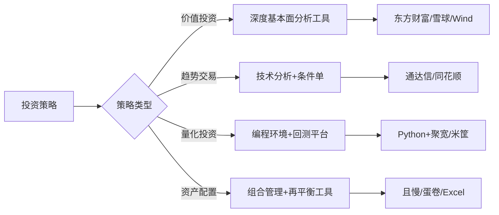

## 七、本节总结

前六节分别讲解了股票、基金、房产、加密货币、量化交易和信息获取六大类投资工具的使用技巧。本节对这些内容进行系统性回顾和提炼，帮助读者建立完整的投资工具认知框架，同时为后续ETF、REITs、可转债等进阶工具的学习做好衔接。

### 7.1 六大工具核心要点回顾

#### 7.1.1 股票投资工具

股票工具是所有投资工具中功能最完善、生态最成熟的体系。核心要点如下：

**工具选择逻辑**：不同行情软件服务不同投资风格。同花顺适合新手入门（界面友好、AI选股），东方财富适合信息驱动型投资者（资讯最全、社区活跃），通达信适合技术派（公式系统开放、支持自定义指标），雪球适合价值投资者（深度内容、高质量讨论）。选择工具不是选"最好的"，而是选"最匹配自己投资风格的"。

**技术分析工具的正确使用**：K线图、均线、MACD、RSI等技术指标是辅助判断工具，不是预测工具。技术指标的核心价值在于帮助投资者量化市场行为、设定买卖纪律，而非"看懂未来"。使用技术指标必须理解其计算原理和适用场景，盲目叠加多个指标反而会导致信号冲突。

**条件单与自动化**：条件单是普通投资者最容易忽视但价值最高的功能。设定止损条件单可以在市场剧烈波动时自动执行卖出，避免情绪干扰。关键参数包括：触发价格、委托价格（限价/市价）、有效期。建议所有持仓都设置止损条件单，即使你是长期投资者。

**基本面分析工具**：财务数据查询（同花顺iFinD、东方财富Choice、巨潮资讯）是价值投资的基础。重点关注三大财务报表中的关键指标：营收增长率、净利润率、ROE、资产负债率、经营性现金流。免费工具中，东方财富的数据覆盖已经足够满足个人投资者需求。

#### 7.1.2 基金投资工具

**平台选择逻辑**：基金投资的核心差异不在收益（同一只基金各平台收益相同），而在费率、便捷性和附加服务。天天基金数据最全适合研究，蚂蚁财富最便捷适合新手，蛋卷基金和且慢提供组合投资和策略跟投功能。

**基金筛选的关键维度**：

| 维度 | 核心指标 | 参考标准 |
|------|----------|----------|
| 业绩 | 近1年/3年/5年收益率 | 跑赢同类平均+业绩基准 |
| 风险 | 最大回撤、夏普比率 | 回撤<同类平均，夏普>1 |
| 基金经理 | 任职年限、管理规模 | 任职>3年，规模适中 |
| 费率 | 管理费、托管费、申购费 | 同类中选择费率较低者 |
| 持仓 | 前十大持仓集中度 | 不过度集中于单一行业 |

**定投工具的使用要点**：定投的核心不是"无脑投"，而是"有纪律地投"。智能定投（根据估值调整金额）优于普通定投。具体策略：估值低时加倍投入（如PE百分位<30%时投2倍），估值高时减半或暂停（PE百分位>70%时投0.5倍）。支付宝、天天基金均支持智能定投设置。

#### 7.1.3 房产投资工具

**数据分析工具**：链家、贝壳找房提供真实成交数据，是房产投资分析的基础。关键数据包括：小区成交均价走势、挂牌量与成交量比值（反映供需）、租金回报率（年租金/房价）。租金回报率低于2%的城市，房产投资的现金流价值很低，主要依赖资本增值。

**贷款计算工具**：房贷计算器（各银行官网、链家APP）用于比较等额本息和等额本金两种还款方式。核心决策逻辑：如果投资回报率>贷款利率，选择等额本息（留更多资金用于投资）；如果追求低利息总额且现金流充裕，选择等额本金。

**房产投资的工具局限**：与金融资产不同，房产是非标准化资产，工具只能提供宏观数据和参考价格，无法替代实地考察。房产投资决策必须结合地段、学区、交通、物业等线下信息，工具数据仅作为价格谈判和趋势判断的参考。

#### 7.1.4 加密货币工具

**交易平台选择**：头部交易所（币安、OKX、Coinbase）在安全性、流动性和币种覆盖上远优于小平台。选择标准：是否有合规牌照、是否有安全审计、日交易量是否充足、是否支持法币出入金。

**钱包工具**：热钱包（MetaMask、Trust Wallet）适合频繁交易，冷钱包（Ledger、Trezor）适合长期存储。核心原则：大额资产必须用冷钱包，交易所只放短期交易所需的资金。私钥和助记词必须离线备份，任何要求你输入私钥的网站都是钓鱼。

**链上分析工具**：Etherscan（以太坊浏览器）、Dune Analytics（链上数据可视化）、DeFiLlama（DeFi协议TVL追踪）是链上分析的三驾马车。通过链上数据可以观察大户动向、资金流入流出、协议健康度等关键信息。

**加密货币工具的特殊风险**：加密市场7×24小时交易、波动剧烈、监管不确定。工具层面的风险控制包括：设置价格警报（避免错过关键时刻）、使用止损单（限制单笔亏损）、启用二次验证（防止账户被盗）。

#### 7.1.5 量化交易入门

**技术栈选择**：Python是量化交易的首选语言，核心库包括Pandas（数据处理）、NumPy（数值计算）、Matplotlib（可视化）、backtrader/zipline（回测框架）。入门路径：Python基础（2周）→ Pandas数据处理（1周）→ 金融数据获取（1周）→ 简单策略编写（2周）。

**回测的核心逻辑**：回测是用历史数据验证交易策略的过程。关键注意事项：

- **避免过拟合**：策略在历史数据上表现完美不代表未来有效。检验方法：将数据分为训练集和测试集，只在训练集上优化参数，在测试集上验证效果。
- **考虑交易成本**：佣金、印花税、滑点会显著侵蚀收益。A股单边交易成本约0.1%（佣金+印花税），高频策略必须精确计算。
- **样本外验证**：用不同时间段、不同市场环境的数据反复测试策略稳健性。

**数据获取途径**：

| 数据源 | 类型 | 费用 | 适用场景 |
|--------|------|------|----------|
| Tushare | A股基本面+行情 | 免费/付费分级 | 入门学习、基本面分析 |
| AKShare | 多市场行情 | 完全免费 | 全市场数据获取 |
| 聚宽JQData | 因子+行情 | 按量付费 | 因子研究、策略开发 |
| Wind | 全品种金融数据 | 机构级收费 | 专业研究 |

#### 7.1.6 信息获取技巧

**信息层级体系**：投资信息按照可靠性和及时性分为四层：

1. **官方信息源**（最可靠）：上市公司公告（巨潮资讯）、监管政策（证监会/央行官网）、宏观经济数据（统计局）。这些信息免费、权威，但需要投资者具备解读能力。
2. **专业数据终端**（高质量）：Wind、Choice、iFinD。数据经过清洗和结构化，适合系统性分析，但有成本。
3. **财经媒体**（中等质量）：财新、第一财经、证券时报。提供深度分析和解读，但可能有立场偏差。
4. **社交媒体/论坛**（需筛选）：雪球、东方财富股吧、Twitter。信息量大但噪音多，适合感知市场情绪，不适合直接作为决策依据。

**信息处理的核心能力**：不是获取更多信息，而是从海量信息中提取有价值的信号。具体方法：

- 建立自己的信息筛选清单：只关注直接影响持仓的信息，忽略噪音。
- 区分事实和观点：公告数据是事实，分析师推荐是观点。投资决策应基于事实，观点仅作参考。
- 设置信息获取的时间窗口：盘前30分钟看隔夜消息，盘后1小时复盘当日行情，避免全天盯盘。

### 7.2 工具选择的底层逻辑

#### 7.2.1 匹配原则：工具服务于策略

投资工具的选择不是"功能越多越好"，而是"与自己的投资策略最匹配"。不同的投资策略对工具的需求截然不同：



**新手常见误区**：花大量时间研究各种工具的功能，却不清楚自己的投资策略是什么。正确顺序是：先确定投资策略 → 再选择匹配的工具 → 最后深入学习工具使用。

#### 7.2.2 成本效益分析

工具不是免费的，即使标称"免费"的工具也隐含成本（广告时间、数据延迟、功能限制）。需要评估的成本包括：

| 成本类型 | 具体内容 | 评估标准 |
|----------|----------|----------|
| 直接费用 | 软件订阅费、数据费 | 是否超出投资本金的1% |
| 时间成本 | 学习工具的时间 | 学习时间是否能通过收益补偿 |
| 机会成本 | 在工具上花时间而非研究 | 工具是否真正提升了决策质量 |
| 隐性成本 | 广告干扰、数据延迟 | 免费版的限制是否影响关键决策 |

**经验法则**：投资本金<10万元时，免费工具（东方财富+天天基金+Tushare）已完全够用。投资本金>50万元且有成熟策略时，可以考虑付费专业工具（iFinD/Choice）提升效率。

#### 7.2.3 工具组合的协同效应

单一工具很难满足所有需求，成熟投资者通常会构建工具组合。典型的工具组合架构：

```text
信息层：巨潮资讯（公告）+ 财联社（快讯）+ 雪球（讨论）
分析层：东方财富（基本面）+ 通达信（技术面）+ Excel（自定义计算）
交易层：券商APP（下单）+ 条件单（自动化）
管理层：记账APP（持仓记录）+ 组合分析工具（绩效评估）
```

各层之间需要信息流通顺畅。例如，分析层发现的机会需要能快速在交易层执行，交易层的结果需要反馈到管理层进行绩效评估。

### 7.3 工具使用的关键原则

#### 7.3.1 原则一：工具是手段，策略是目的

工具再强大，也不能替代投资策略的制定。很多投资者陷入"工具陷阱"——不断尝试新工具、新指标，却从不认真思考自己的投资逻辑。记住：一个简单的策略配合严格的执行，远胜于复杂的工具配合随意的操作。

**自检问题**：
- 你能用一句话说清楚自己的投资策略吗？
- 你知道自己为什么买这只股票/基金吗？
- 你有明确的卖出条件吗？

如果三个问题中有任何一个回答不上来，说明你需要的不是更好的工具，而是更清晰的策略。

#### 7.3.2 原则二：先精通一个，再扩展多个

新手最常犯的错误是同时学习多个工具，结果每个都只会基础功能。正确的方法是：

1. **选择一个核心工具**：根据自己的投资风格，选择一个主工具（如技术派选通达信，价值派选东方财富）。
2. **深度学习2-3个月**：掌握该工具80%的功能，包括快捷键、自定义设置、高级功能。
3. **建立工作流**：用这个工具形成固定的投资分析流程（盘前看什么、盘中关注什么、盘后分析什么）。
4. **按需扩展**：当核心工具无法满足某个需求时，再引入新工具补充。

#### 7.3.3 原则三：数据驱动，而非感觉驱动

工具的核心价值在于将投资决策从"感觉"升级为"数据"。具体体现：

- **买入决策**：不是"感觉这只股票会涨"，而是"PE处于历史低位、营收连续增长、技术面出现买入信号"。
- **卖出决策**：不是"感觉赚够了"，而是"达到目标价"或"触发止损条件"或"基本面恶化"。
- **仓位管理**：不是"感觉这只更看好"，而是"根据风险收益比和相关性计算最优仓位"。

#### 7.3.4 原则四：定期复盘，持续优化

工具的使用水平需要通过复盘不断提升。建议每月进行一次工具使用复盘：

1. 回顾本月的投资决策，哪些是基于工具数据分析做出的，哪些是凭感觉。
2. 分析工具提供的信息中，哪些真正帮助了决策，哪些是噪音。
3. 检查是否有工具功能被忽视，可能提升效率。
4. 评估当前工具组合是否仍然适合自己的投资策略。

### 7.4 不同阶段投资者的工具使用建议

#### 7.4.1 入门期（0-6个月）

**目标**：建立基础认知，形成投资纪律。

**推荐工具**：
- 券商APP（任意一家主流券商，如华泰、中信、国泰君安）
- 天天基金/蚂蚁财富（基金投资）
- 东方财富APP（免费行情+资讯）

**使用重点**：
- 学会看K线图、成交量、均线三个基础指标
- 掌握条件单设置（止损/止盈）
- 了解基金筛选的基本方法
- 建立投资笔记习惯（记录每笔交易的理由）

**投入时间**：每天30分钟学习工具使用，周末1小时复盘。

#### 7.4.2 成长期（6-24个月）

**目标**：形成自己的分析框架，提升工具使用深度。

**推荐工具升级**：
- 技术派：通达信（自定义公式、多窗口布局）
- 价值派：东方财富Choice基础版（深度财务数据）
- 基金派：蛋卷基金/且慢（组合投资）

**使用重点**：
- 学习2-3个核心技术指标的计算原理和适用场景
- 建立自己的股票筛选体系（设定筛选条件组合）
- 开始使用Excel/Google Sheets做投资组合分析
- 关注信息源的质量而非数量

**投入时间**：每天1小时分析，周末2小时深度研究。

#### 7.4.3 成熟期（2年以上）

**目标**：工具使用自动化，决策流程化。

**推荐工具体系**：
- 构建个人工具组合（信息层+分析层+交易层+管理层）
- 考虑付费数据终端（Wind/Choice/iFinD）提升效率
- 量化投资者：搭建Python开发环境

**使用重点**：
- 将重复性分析工作自动化（Excel模板、Python脚本）
- 建立系统化的投资检查清单
- 定期评估和优化工具组合
- 开始关注另类数据源（产业链数据、舆情数据）

### 7.5 后续章节预告

本节总结覆盖了六大基础投资工具的核心技巧。后续章节将深入讲解更多进阶投资工具：

| 章节 | 主题 | 核心价值 |
|------|------|----------|
| 第八节 | ETF投资工具详解 | 场内基金的交易技巧和套利策略 |
| 第九节 | REITs投资工具 | 不动产投资信托的分析方法 |
| 第十节 | 可转债投资工具 | 下有保底、上不封顶的投资品种 |
| 第十一节 | 投资组合管理工具 | 资产配置和再平衡的实操方法 |
| 第十二节 | 常见误区 | 工具使用中的典型错误和纠正方法 |
| 第十三节 | 学习路径 | 从入门到精通的系统化学习规划 |
| 第十四节 | 常见问题解答 | 工具使用中的高频疑问解答 |

### 7.6 本节核心公式与速查表

将前六节的关键知识点浓缩为速查表，方便随时查阅：

**股票工具速查**：

| 场景 | 推荐工具 | 关键操作 |
|------|----------|----------|
| 看行情 | 同花顺/东方财富 | 设置自选股、多窗口布局 |
| 选股票 | 东方财富条件选股 | 设置PE<20、ROE>15%、营收增长>10% |
| 技术分析 | 通达信 | MA+MACD+成交量三指标组合 |
| 下单交易 | 券商APP | 设置条件单（止损-7%、止盈+20%） |
| 查公告 | 巨潮资讯 | 按代码搜索，关注定期报告和重大事项 |

**基金工具速查**：

| 场景 | 推荐工具 | 关键操作 |
|------|----------|----------|
| 选基金 | 天天基金 | 筛选：近3年同类前1/3、夏普>1、规模5-100亿 |
| 定投 | 蚂蚁财富 | 智能定投：PE百分位<30%投2倍，>70%投0.5倍 |
| 组合管理 | 蛋卷基金 | 配置：股票型60%+债券型30%+货币型10% |
| 基金对比 | 天天基金对比功能 | 同类基金横向对比收益、风险、费率 |

**信息获取速查**：

| 信息类型 | 首选来源 | 频率 |
|----------|----------|------|
| 宏观政策 | 央行/统计局官网 | 每周 |
| 公司公告 | 巨潮资讯 | 持仓公司发布时 |
| 行业动态 | 财联社/第一财经 | 每日 |
| 市场情绪 | 雪球/东方财富股吧 | 每日（但不作为决策依据） |
| 财务数据 | 东方财富/同花顺 | 季报发布后 |

### 7.7 关键提醒

**工具不等于能力**：拥有最好的行情软件不代表你能选出好股票，拥有最全的基金数据不代表你能做出好的资产配置。工具放大的是你已有的能力——如果你的投资逻辑是错误的，工具只会帮你更快地犯错。

**警惕工具依赖症**：当发现自己每天花大量时间盯盘、频繁切换各种指标、不断尝试新工具却很少独立思考时，可能已经患上了工具依赖症。解决方法：强制自己在做任何操作前先写下投资逻辑（为什么买/卖），操作后再复盘结果。

**工具迭代是常态**：金融工具在不断进化，今天的最佳工具可能两年后就被替代。保持学习新工具的能力比精通某个特定工具更重要。关注金融科技领域的发展趋势，定期评估自己的工具组合是否仍然最优。
