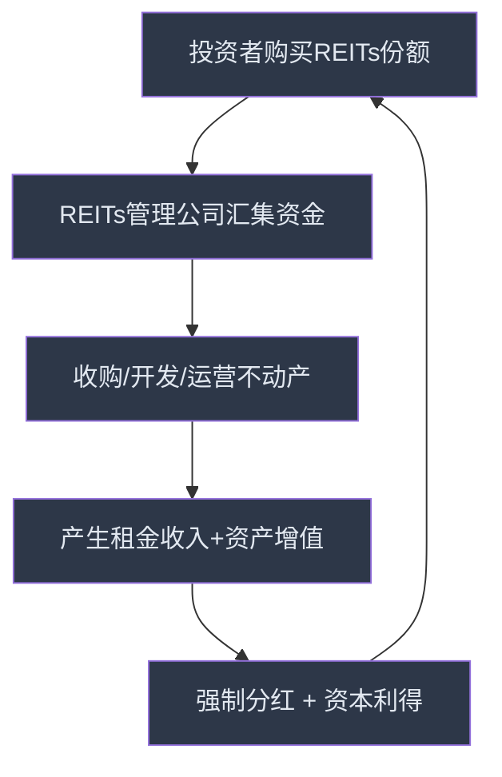
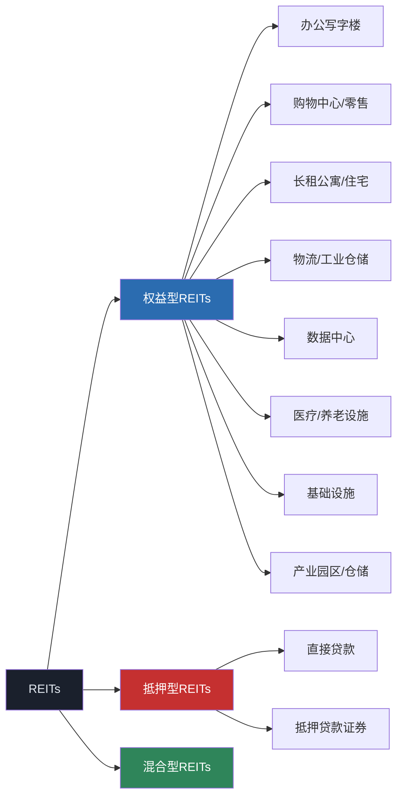
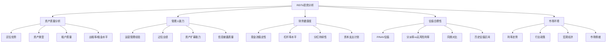

## 九、REITs投资工具

### 9.1 什么是REITs：从底层资产到投资逻辑

#### 9.1.1 REITs的本质定义

REITs（Real Estate Investment Trusts，房地产投资信托基金）是一种将房地产资产证券化的金融产品。简单来说，REITs让普通投资者能够像买卖股票一样投资大型商业地产项目，而无需直接购买整栋写字楼、购物中心或物流仓库。

REITs的核心机制如下：



与传统房地产投资相比，REITs具有以下关键特征：

| 特征 | 直接购买房产 | 投资REITs |
|------|-------------|----------|
| 最低投资门槛 | 数十万至数百万元 | 几百元起（公募REITs） |
| 流动性 | 极差，成交周期数月 | 良好，T+1交易（场内） |
| 分散化 | 通常只有1-2套房产 | 可投资多个项目组合 |
| 管理责任 | 需自行维护、出租 | 专业团队管理，被动持有 |
| 分红要求 | 无强制要求 | 法律要求强制高比例分红 |
| 杠杆使用 | 通常需要贷款 | 通常不使用杠杆（公募） |
| 税务处理 | 涉及多种税费 | 分红税（境内20%） |

#### 9.1.2 REITs的法律与税务本质

REITs之所以成为独立资产类别，在于其独特的法律结构：

**法律结构**：REITs通常以公司制或信托制设立，将不动产的所有权、经营权、收益权三权分离。投资者持有REITs份额，即享有对应不动产的收益权，但不直接参与管理。

**强制分红制度**：这是REITs最核心的制度设计。多数国家要求REITs将至少90%的应税收入以分红形式分配给投资者。中国的公募REITs要求每年分配金额不低于合并基金年度可供分配金额的90%。这一制度确保投资者能够获得稳定的现金流回报。

**穿透税制**：在成熟市场（如美国），REITs层面可以免征企业所得税，只要满足分红比例要求。投资者层面才缴纳个人所得税。这避免了传统房地产投资中的"双重征税"问题。中国的公募REITs目前采用较为简单的税务结构，分红环节暂不征收所得税（个人投资者）。

#### 9.1.3 REITs的收益来源

REITs的收益来自三个维度：

**租金收入（分红收益）**：REITs底层资产产生的租金现金流，按份额比例分配给投资者。这是REITs最稳定、最主要的收益来源。中国公募REITs的预期现金分红率通常在4%-8%之间。

**资产增值（资本利得）**：随着底层不动产价值的上涨或市场对REITs估值的提升，REITs份额价格上升带来的收益。这部分波动较大，受宏观经济、利率环境、市场情绪等多重因素影响。

**再投资复利**：将分红收入持续再投资购买新的REITs份额，通过复利效应实现长期资产增长。以年化分红率6%计算，再投资10年后的累计收益约为单利的1.4倍。

---

### 9.2 REITs的完整分类体系

#### 9.2.1 按底层资产类型分类

不同类型的REITs底层资产差异巨大，直接影响收益特征和风险属性：



**权益型REITs**（占全球REITs市场90%以上）：直接拥有并运营不动产资产，收入主要来自租金。中国公募REITs全部为权益型。

**抵押型REITs**（mREITs）：不直接拥有不动产，而是向房地产开发商或业主提供贷款，或购买抵押贷款支持证券（MBS），收入来自利息差。主要存在于美国市场，中国公募REITs中不存在此类型。

**混合型REITs**：同时拥有不动产资产和抵押贷款资产，兼具两者特征。

#### 9.2.2 按底层资产行业分类详解

**产业园区/仓储物流类**：包括物流园区、产业园区、标准厂房、仓储设施等。受益于电商物流和制造业升级，租金增长稳定。典型代表：中金普洛斯REIT（508056）、红土盐田港REIT（180301）。

**保障性租赁住房类**：以保障性租赁住房和市场化长租公寓为底层资产。政策支持力度大，需求刚性强，但租金定价受政策约束。典型代表：华夏北京保障房REIT（508068）、中金厦门安居REIT（508058）。

**高速公路/交通类**：以收费公路、桥梁、港口等交通基础设施为底层资产。现金流极其稳定，受经济周期影响小，但增长空间有限。典型代表：浙商沪杭甬REIT（508001）、华夏越秀高速REIT（180202）。

**能源基础设施类**：包括光伏发电、风电、天然气管网、污水处理等。受"双碳"政策驱动，增长前景明确，但受自然条件影响较大。典型代表：鹏华深圳能源REIT（180401）、中航京能光伏REIT（508096）。

**生态环保类**：以污水处理厂、垃圾焚烧发电厂等环保基础设施为底层资产。现金流稳定，政策确定性强。典型代表：富国首创水务REIT（508006）。

**购物中心/商业类**：在成熟市场是REITs的核心类别，但中国公募REITs中尚未大规模放开，目前仅有少量商业综合体作为底层资产的项目。此类资产受消费景气度影响较大。

**数据中心类**：受益于数字化转型和AI算力需求爆发，全球增长最快的REITs细分赛道。美国市场已有Equinix、Digital Realty等巨头，中国市场尚未有公募REITs上市。

**医疗/养老设施类**：以医院、养老院、医疗办公大楼为底层资产。人口老龄化推动长期需求增长，现金流稳定但增速较慢。

#### 9.2.3 中国公募REITs vs 海外REITs

| 对比维度 | 中国公募REITs | 美国REITs | 中国香港REITs | 新加坡REITs |
|----------|-------------|----------|--------------|------------|
| 上市时间 | 2021年6月 | 1960年代 | 2005年 | 2002年 |
| 市场规模 | ~1200亿元（2024年） | ~1.3万亿美元 | ~2000亿港元 | ~1000亿新元 |
| 产品数量 | ~40只 | ~200只 | ~12只 | ~40只 |
| 主要资产类型 | 基础设施为主 | 多元化（全行业覆盖） | 以商业地产为主 | 多元化 |
| 分红率 | 4%-8% | 3%-5% | 4%-7% | 5%-8% |
| 交易场所 | 沪深交易所 | NYSE/NASDAQ | 港交所 | 新交所 |
| 最低投资 | ~100元 | 1股（~$20-$200） | 1手（~数千港元） | 1手（~数百新元） |
| 杠杆限制 | 借款/担保不超过净资产140% | 无硬性限制 | 资产价值45%以内 | 资产价值50%以内 |

---

### 9.3 中国公募REITs实操指南

#### 9.3.1 账户开立与交易规则

**账户要求**：中国公募REITs通过沪深交易所交易，需要普通A股证券账户即可，无需额外开通权限。场外（通过银行/第三方基金销售平台）也可申购，但流动性远不如场内。

**交易规则详解**：

| 规则项 | 具体内容 |
|--------|---------|
| 交易时间 | 周一至周五 9:30-11:30, 13:00-15:00 |
| 交易方式 | 竞价交易、大宗交易 |
| 涨跌幅限制 | 上市首日±30%，非上市首日±10% |
| 最小交易单位 | 100份（1手） |
| 交割方式 | T+1 |
| 交易费用 | 佣金万分之3-5（可协商），无印花税 |
| 认购方式 | 场内现金认购、场外现金认购、战略配售 |

**特别注意事项**：
- 公募REITs不是股票、不是债券、不是传统基金，三者的分析框架不能直接套用
- 公募REITs上市后封闭运作，不开放申购赎回，只能在二级市场买卖
- 不存在"打新"稳赚的逻辑——中国公募REITs上市后有涨有跌，不能盲目追新

#### 9.3.2 场内交易操作流程

**第一步：开通证券账户**

选择一家支持公募REITs交易的券商，完成开户。主流券商如华泰证券、中信证券、国泰君安等均支持。开户时注意确认佣金费率，公募REITs的佣金通常可以谈到万分之3甚至更低。

**第二步：认购新发REITs**

当有新REITs发行时，可以通过以下渠道认购：
- 场内认购：在券商APP中找到"REITs认购"入口，输入代码和金额
- 场外认购：通过天天基金、蚂蚁基金等第三方平台申购
- 战略配售：仅限机构投资者和原始权益人

认购期间需要关注的核心信息：
- 底层资产的质量和区位
- 预期现金分派率（分红率）
- 管理人的过往业绩
- 募集规模和战略配售比例
- 网下询价倍数（反映机构认可度）

**第三步：二级市场买卖**

上市后，直接在券商APP中像买卖股票一样操作：
1. 搜索REITs代码（如508056）
2. 输入买入价格和数量（100份起）
3. 确认下单，等待撮合成交
4. 成交后T+1日可卖出

#### 9.3.3 关键财务指标解读

投资REITs不能用传统的PE、PB估值法，需要掌握以下专属指标：

**可供分配金额（Distributable Amount）**

这是REITs分红的基础。计算公式：

```text
可供分配金额 = EBITDA - 资本性支出 - 偿还借款本金 + 利息收入 + 其他调整项
```

其中EBITDA = 营业收入 - 运营成本（不含折旧摊销和利息）。投资者需要关注的是"调整后的可供分配金额"，它剔除了一次性收入和非经常性支出。

**现金分派率（Distribution Yield）**

```text
现金分派率 = 年度实际分红金额 / 买入价格 × 100%
```

注意区分"预期分派率"和"实际分派率"。前者是基于招募说明书的预测，后者是实际分红结果。持续跟踪每季度/半年度的分红公告，评估分红的稳定性和增长趋势。

**P/NAV（价格/净资产价值比率）**

```text
P/NAV = REITs市场价格 / 每份净资产公允价值
```

- P/NAV < 1：市场价格低于资产实际价值，可能存在低估
- P/NAV = 1：价格与价值匹配
- P/NAV > 1：市场给予了溢价，需要更高增长预期支撑

净资产公允价值（NAV）需要评估机构定期出具，通常在年报和半年报中披露。

**出租率与租金增长率**

- 出租率：底层资产的实际出租面积占可出租面积的比例。产业园区类REITs理想的出租率在85%以上，物流仓储类在95%以上
- 租金增长率：同比租金变化幅度。长期租金增长率超过CPI的REITs具有抗通胀属性
- 租约到期分布：集中到期的租约带来再租赁风险，需要关注

**杠杆率与偿债能力**

```text
杠杆率 = 有息负债 / 总资产 × 100%
```

中国公募REITs的杠杆率上限为净资产的140%。投资者应关注：
- 杠杆率水平：过高意味着利息负担重，侵蚀分红
- 利息覆盖率：EBITDA/利息支出，越高越安全
- 债务到期结构：短期债务集中到期会带来再融资风险

#### 9.3.4 完整的REITs分析框架



**资产质量分析（权重约30%）**

区位是不动产价值的第一决定因素。一线城市核心地段的物流园区、产业园区，其租金增长潜力和抗风险能力远强于三四线城市的同类资产。具体评估维度：

- **交通便利性**：高速公路入口距离、港口/机场距离、铁路专用线等
- **产业集聚度**：周边同类型企业密度、上下游配套完善程度
- **供需关系**：所在区域同类型物业的新增供应量和需求增速
- **租户集中度**：单一租户收入占比不超过30%为宜，过度集中意味着单点风险
- **租约剩余期限**：加权平均剩余租期越长，现金流可预测性越强

**管理人能力（权重约25%）**

管理人是REITs价值创造的核心驱动力。评估要点：

- **原始权益人实力**：是否有大量可注入的优质储备资产，这是未来资产扩募的基础
- **运营管理团队**：是否具备不动产运营管理专业能力，而不仅仅是金融产品设计
- **历史运营数据**：出租率是否持续提升、租金是否稳步增长、运营成本是否有效控制
- **扩募能力**：历史上是否成功完成过资产扩募，扩募资产的质量如何
- **信息透明度**：季度运营数据公告的及时性、详细程度、口径一致性

**财务健康度分析（权重约25%）**

- 现金流是否稳定且可预测，波动幅度是否在合理范围内
- 杠杆率是否处于合理水平（建议关注50%以下的标的）
- 分红是否持续、稳定，有无中断或大幅波动
- 是否有大额资本支出计划（如翻新改造），这会影响短期分红

**估值合理性（权重约20%）**

- P/NAV是否低于1或处于历史低位
- 当前分派率是否高于同期限国债收益率200个基点以上
- 与同类REITs相比，估值是否处于合理区间

---

### 9.4 投资策略与组合构建

#### 9.4.1 四种核心投资策略

**策略一：高分红收益策略（稳健型）**

适合人群：追求稳定现金流的投资者，如退休人群或保守型投资者。

操作要点：
- 筛选预期分派率6%以上的标的
- 优先选择出租率95%以上、租约剩余期限5年以上的资产
- 重点关注高速公路、水务、能源管网等特许经营类资产
- 持有周期：至少1年以上，享受完整年度分红

**策略二：价值发现策略（进取型）**

适合人群：有一定研究能力、追求超额收益的投资者。

操作要点：
- 寻找P/NAV低于0.9的标的，分析被低估的原因
- 关注新上市REITs的"破发"机会——基本面优秀但因市场情绪被错杀的标的
- 在利率上行周期末期布局，利率下行周期获利
- 持有周期：1-3年，等待估值修复

**策略三：行业轮动策略（专业型）**

适合人群：对宏观经济和行业趋势有深入理解的投资者。

操作要点：
- 根据经济周期在不同资产类型之间轮动
- 经济复苏期：配置物流仓储、产业园区（受益于企业扩张）
- 经济过热期：配置基础设施、能源类（受益于通胀）
- 经济衰退期：配置保障房、水务（需求刚性最强）
- 利率下行期：全面加配REITs（分派率吸引力提升）

**策略四：核心-卫星配置策略（平衡型）**

适合人群：大多数投资者的推荐方案。

操作要点：
- 核心仓位（60%-70%）：分散配置于3-5只不同资产类型的REITs
- 卫星仓位（30%-40%）：集中配置1-2只高确定性标的
- 核心仓位追求稳定分红，卫星仓位追求超额收益
- 定期（季度）再平衡，维持目标配置比例

#### 9.4.2 REITs在资产配置中的角色

REITs在整体投资组合中的合理配置比例取决于投资者的风险偏好和投资目标：

| 风险偏好 | REITs建议配置 | 股票 | 债券 | 现金 |
|----------|-------------|------|------|------|
| 保守型 | 10%-15% | 20% | 50%-60% | 10%-15% |
| 稳健型 | 15%-20% | 35%-40% | 30%-35% | 5%-10% |
| 平衡型 | 15%-25% | 40%-50% | 20%-25% | 5%-10% |
| 进取型 | 10%-15% | 55%-65% | 15%-20% | 5%-10% |

REITs在组合中的核心价值：

**降低组合波动**：REITs与股票、债券的相关性较低。在传统的60/40股债组合中加入10%-20%的REITs，可以降低组合整体波动率约2-3个百分点，同时不显著降低预期收益。

**提供通胀保护**：底层不动产的租金通常随通胀调整，REITs天然具有抗通胀属性。在CPI同比增速超过3%的环境下，REITs的表现通常优于债券。

**增强现金流**：相比股票分红（通常2%-3%），REITs的分红率更高（4%-8%），能够显著提升组合的整体现金流水平。

#### 9.4.3 择时与建仓策略

**择时信号（买入时机）**：

- 10年期国债收益率见顶回落的拐点——利率下行直接提升REITs的估值
- REITs板块整体P/NAV低于0.9——市场普遍低估的时机
- 新REITs上市后连续下跌后企稳——恐慌情绪释放后的价值回归
- 基本面出现拐点信号（如物流园区出租率从低位回升）

**建仓方法**：

不建议一次性满仓，推荐分批建仓：
1. 首批建仓：在目标信号出现时投入30%资金
2. 第二批加仓：确认趋势后追加30%资金
3. 第三批补仓：回调至前低附近时追加20%资金
4. 保留20%资金作为机动仓位，应对极端行情

**卖出信号**：

- P/NAV超过1.3且无增长催化剂支撑
- 底层资产出租率连续两个季度下降超过5个百分点
- 管理人发生重大变更或暴露治理问题
- 分红率低于同期限国债收益率（意味着REITs已不具吸引力）
- 需要资金配置更高确定性的投资机会

---

### 9.5 风险识别与管理

#### 9.5.1 六大核心风险

**利率风险（最大系统性风险）**

REITs对利率变动高度敏感。当利率上升时：
- 固定收益类资产的吸引力增强，资金从REITs流出
- REITs的融资成本上升，侵蚀可供分配金额
- 资产估值模型的折现率上升，NAV下降

应对策略：
- 密切跟踪央行货币政策动向和国债收益率走势
- 利率上行期减配REITs，利率下行期增配
- 优先选择固定利率贷款占比高、再融资压力小的标的

**经营风险**

底层资产的实际经营可能低于预期：
- 经济下行导致租户退租或拖欠租金
- 区域竞争加剧导致空置率上升
- 资产老化需要大额资本支出维持竞争力

应对策略：
- 分析租户行业分布，避免过度集中于周期性行业
- 关注租约到期分布，集中到期风险更高
- 评估资产的剩余经济使用寿命

**流动性风险**

中国公募REITs的二级市场流动性相对有限，部分产品的日均成交额不足1000万元。大额买卖可能导致较大的价格冲击。

应对策略：
- 优先选择日均成交额在2000万元以上的标的
- 大额交易使用分笔下单策略
- 避免在市场恐慌性下跌时急于卖出

**政策风险**

中国公募REITs仍处于发展初期，政策变动可能产生重大影响：
- 底层资产类型的扩容或收缩
- 分红税收政策的调整
- 扩募规则的变更
- 基础设施收费定价机制的改革

应对策略：
- 持续关注监管政策动态
- 优先选择政策支持力度大的资产类型（如保障房、新能源）
- 保持组合的分散化

**估值风险**

公募REITs的估值依赖于资产评估机构的判断，存在主观性：
- 评估假设过于乐观（如租金增长率假设偏高）
- 折现率选择不合理
- 市场情绪导致价格大幅偏离NAV

应对策略：
- 自行测算合理估值区间，不完全依赖评估报告
- 关注P/NAV的历史波动区间
- 在P/NAV超过1.2时保持谨慎

**管理人风险**

REITs的价值创造高度依赖管理人的能力：
- 运营管理不善导致资产价值下降
- 扩募注入劣质资产摊薄投资者利益
- 利益输送或关联交易

应对策略：
- 选择原始权益人实力雄厚、运营团队经验丰富的标的
- 关注管理人的历史扩募记录
- 审查关联交易的公平性和必要性

#### 9.5.2 风险评估检查清单

在投资每一只REITs之前，对照以下清单逐项检查：

```text
□ 底层资产类型是否理解？
□ 资产区位是否具有竞争优势？
□ 当前出租率是否高于行业平均？
□ 加权平均剩余租期是否超过3年？
□ 前5大租户收入占比是否低于50%？
□ 租户行业分布是否足够分散？
□ 当前杠杆率是否低于50%？
□ 利息覆盖率是否高于3倍？
□ 最近两个报告期分红是否稳定？
□ 当前P/NAV是否低于1.1？
□ 当前分派率是否高于同期国债收益率200bp以上？
□ 管理人是否有良好的运营记录？
□ 是否有明确的资产扩募计划？
□ 底层资产是否有重大资本支出计划？
□ 所在行业是否有明确的政策支持？
```

---

### 9.6 实战工具与平台

#### 9.6.1 信息查询与研究平台

**上交所/深交所官网**

获取公募REITs最权威的信息来源：
- 上交所REITs专区：http://www.sse.com.cn/——搜索"REITs"
- 深交所REITs专区：http://www.szse.cn/——搜索"基础设施基金"
- 可以查看招募说明书、定期报告、分红公告、运营数据公告等全部公告文件

**天天基金/蚂蚁基金**

场外申购渠道，也是查询REITs信息的便利工具：
- 查看REITs净值、涨跌幅、分红记录
- 对比不同REITs的基本信息
- 支持场外份额的申购和赎回（如有）

**Wind/Choice金融终端**

专业研究工具，适合深度研究的投资者：
- 全面的REITs数据库，支持多维度筛选和排序
- NAV测算工具和估值模型
- 同类对比分析
- 历史分红数据追踪
- Wind：机构版收费（数万元/年），个人精简版约2000-5000元/年
- Choice：东财旗下，个人版约1000-3000元/年

**券商研报**

定期跟踪头部券商的REITs研究报告：
- 中金公司：公募REITs研究最为系统全面
- 华泰证券：量化分析能力强
- 国泰君安：行业覆盖广泛
- 广发证券：对高速公路和物流类有深度研究

研报获取途径：券商APP的研究报告板块、萝卜投研、慧博投研等。

#### 9.6.2 估值与筛选工具

**REITs估值对比表（自行维护Excel）**

建议投资者自行维护一个包含以下字段的Excel跟踪表：

| 字段 | 说明 | 数据来源 |
|------|------|---------|
| 代码 | REITs代码 | 交易所 |
| 名称 | REITs简称 | 交易所 |
| 资产类型 | 产业园区/物流/高速公路等 | 招募说明书 |
| 市场价格 | 最新收盘价 | 行情软件 |
| 每份NAV | 最新评估净值 | 定期报告 |
| P/NAV | 市价/NAV | 自行计算 |
| 预期分派率 | 基于招募说明书 | 招募说明书 |
| 实际分派率 | 最近一年实际分红/市价 | 分红公告 |
| 出租率 | 最新出租率 | 运营数据公告 |
| 杠杆率 | 有息负债/总资产 | 定期报告 |
| 日均成交额 | 最近20个交易日平均 | 行情软件 |
| 管理人 | 基金管理人 | 招募说明书 |
| 原始权益人 | 资产原始持有方 | 招募说明书 |

**简单筛选模型**

使用以下条件快速筛选投资标的：

```python
# REITs筛选伪代码逻辑
def filter_reits(reits_list):
    candidates = []
    for r in reits_list:
        # 基本面筛选
        if r.occupancy_rate >= 85:           # 出租率不低于85%
            if r.leverage_ratio <= 50:        # 杠杆率不超过50%
                if r.p_nav <= 1.1:            # P/NAV不超过1.1
                    if r.yield_rate >= 5:      # 分派率不低于5%
                        if r.daily_volume >= 10_000_000:  # 日均成交额不低于1000万
                            candidates.append(r)
    
    # 按分派率/P/NAV比值排序，越高越有性价比
    candidates.sort(key=lambda x: x.yield_rate / x.p_nav, reverse=True)
    return candidates
```

#### 9.6.3 跟踪与监控模板

建议投资者建立以下跟踪机制：

**每周例行（5分钟）**：
- 检查持仓REITs的周涨跌幅
- 关注是否有重大公告（分红、扩募、运营数据）
- 记录市场价格，更新P/NAV

**每月例行（30分钟）**：
- 查看各标的运营数据公告（出租率、租金水平变化）
- 更新估值跟踪表
- 对比同类标的的相对表现

**每季度例行（2小时）**：
- 深度阅读季度/半年度报告
- 评估分红是否符合预期
- 检查杠杆率和偿债能力变化
- 评估是否需要调仓

---

### 9.7 常见误区与纠正

#### 误区一：REITs是"类固收"产品

**错误认知**：REITs分红稳定，跟买债券差不多。

**事实**：REITs是权益类资产，价格波动显著。以美国REITs为例，在2022年加息周期中，VNQ（Vanguard房地产ETF）全年下跌约26%，远超债券的跌幅。中国公募REITs在2023年下半年也经历了普遍下跌，部分标的跌幅超过20%。

**正确认知**：REITs提供稳定的分红现金流，但价格本身具有波动性，应将其视为权益类资产来管理风险，而非债券的替代品。

#### 误区二：分红率越高越好

**错误认知**：选分红率最高的REITs就对了。

**事实**：异常高的分红率可能是陷阱。当REITs价格大幅下跌时，用过去12个月的分红除以当前低价，会算出一个虚高的"静态分派率"。但分红本身可能面临下降风险——底层资产经营恶化、大额资本支出、租户流失都可能削减未来的分红金额。

**正确认知**：应关注分红的可持续性和增长趋势，而非单一时点的分红率。分析可供分配金额的变化趋势，判断未来分红是否有保障。

#### 误区三：REITs可以对冲股票风险

**错误认知**：REITs和股票走势相反，买REITs可以对冲股票下跌。

**事实**：在流动性危机或经济衰退中，REITs和股票往往同向下跌。二者的相关性在危机时期会显著上升。2020年3月新冠疫情冲击期间，全球REITs和股票同步暴跌。REITs只能在正常市场环境下提供一定程度的分散化，不能在极端环境下起到对冲作用。

**正确认知**：REITs在长期组合中起到分散化作用，但不能作为短期对冲工具。

#### 误区四：只看招募说明书就够了

**错误认知**：招募说明书里写什么就是什么。

**事实**：招募说明书中的"预期分派率"是基于一系列假设的测算结果，实际运营可能大幅偏离。租金增长率假设过高、运营费用假设过低、入住率假设过于乐观，都会导致实际分红不及预期。

**正确认知**：招募说明书是投资分析的起点，不是终点。需要持续跟踪实际运营数据，与招募说明书中的假设进行对比验证。

#### 误区五：公募REITs适合短期炒作

**错误认知**：公募REITs是新品种，上市后肯定会涨，可以短线炒作。

**事实**：中国公募REITs上市以来，既有上市首日大涨30%的案例，也有上市后持续下跌破净的案例。短期价格波动受市场情绪驱动，与基本面关系不大。过度交易还会增加佣金成本，侵蚀分红收益。

**正确认知**：REITs是长期持有型资产，短期投机的风险收益比很差。建议持有周期不低于1年。

---

### 9.8 进阶：全球REITs配置与税务优化

#### 9.8.1 跨境配置路径

成熟投资者可以考虑全球REITs配置，以获取更广泛的资产类型和更高的流动性：

**路径一：通过QDII基金投资全球REITs**

- 广发美国房地产指数基金（000179/000180）：跟踪美国REITs指数
- 诺安全球收益不动产基金（320017）：投资全球REITs
- 鹏华美国房地产基金（206011）：聚焦美国市场
- 优点：门槛低、操作简单、无需海外账户
- 缺点：管理费较高（1%-1.5%）、汇率风险、可能有限购

**路径二：通过港股通投资香港REITs**

- 港交所上市的REITs可以通过港股通购买
- 代表性标的：领展房产基金（00823.HK）、置富产业信托（00778.HK）
- 优点：无外汇管制限制（港股通额度内）、交易便利
- 缺点：香港REITs选择有限、需缴纳港股通分红税（20%）

**路径三：直接开设海外账户**

- 通过美国券商（如Interactive Brokers、Firstrade）直接投资美国REITs
- 可投资的标的最为丰富，包括个股和ETF（如VNQ、SCHH等）
- 优点：标的丰富、交易成本低
- 缺点：涉及外汇管制、申报义务、税务处理复杂

#### 9.8.2 税务优化要点

**中国公募REITs的税务处理**：

| 环节 | 个人投资者 | 机构投资者 |
|------|----------|----------|
| 认购/买入 | 无税费 | 无税费 |
| 持有分红 | 暂不征收个人所得税 | 并入应税所得 |
| 卖出 | 无资本利得税 | 并入应税所得 |
| 交易佣金 | 万分之3-5 | 万分之3-5 |

**跨境投资的税务考量**：

投资海外REITs时，分红收入通常在源头就被扣税：
- 美国REITs：非居民投资者分红预扣税30%（中美税收协定可降至10%，但需提供W-8BEN表格）
- 香港REITs：无分红预扣税
- 新加坡REITs：非居民分红预扣税10%

在计算实际到手收益时，必须扣除源头预扣税，否则会高估真实收益率。

#### 9.8.3 高级估值方法

**FFO（Funds From Operations）估值法**

FFO是美国REITs行业最核心的估值指标：

```text
FFO = 净利润 + 折旧摊销 - 资产出售收益
```

FFO剔除了折旧摊销对利润的扭曲（不动产的折旧并不反映真实经济损耗），更能反映REITs的真实盈利能力。

**P/FFO比率**：类似股票的PE比率，美国REITs的历史平均P/FFO约为15-18倍。低于12倍可能被低估，高于20倍需要更强的增长预期支撑。

**AFFO（Adjusted FFO）**

```text
AFFO = FFO - 维持性资本支出 - 直线法租金调整
```

AFFO进一步剔除了维持资产正常运营所需的资本支出，是最接近"自由现金流"的指标。AFFO对分红可持续性的预测能力优于FFO。

**DCF折现模型**

对REITs进行DCF估值时，关键假设：
- 折现率（WACC）：通常在6%-9%之间，取决于资产风险
- 永续增长率：通常设定在1%-3%，不应超过GDP长期增速
- 现金流预测期：通常为10年，之后按永续增长模型计算终值

---

### 9.9 实战案例分析

#### 案例一：中金普洛斯REIT（508056）深度分析

**基本信息**：
- 底层资产：7个现代物流仓储园区，分布于北京、广州、重庆等核心城市
- 资产面积：总建筑面积约70万平方米
- 管理人：中金基金，原始权益人：普洛斯（GLP）

**投资亮点分析**：
- **区位优势**：物流园区均位于一二线城市核心物流节点，交通便利
- **租户质量**：头部电商和物流企业为主，租约稳定
- **行业趋势**：受益于电商渗透率提升和供应链升级，物流仓储需求长期增长
- **管理人能力**：普洛斯是全球最大的物流地产运营商，运营管理经验丰富

**风险点**：
- 物流仓储市场竞争加剧，新增供应可能压制租金增长
- 经济下行可能影响电商物流需求
- 部分资产剩余土地使用年限需要关注

**估值分析**（以2024年某时点数据为例）：
- 市场价格：约4.5元/份
- 每份NAV：约4.8元/份
- P/NAV：约0.94（折价约6%）
- 预期分派率：约5.5%
- 杠杆率：约30%

结论：物流仓储类REITs中的标杆产品，估值处于合理偏低区间，适合作为核心配置。

#### 案例二：高速公路REITs的投资逻辑

以浙商沪杭甬REIT（508001）为例，分析高速公路类REITs的特殊性：

**底层资产特征**：
- 杭徽高速公路浙江段特许经营权
- 特许经营权有明确到期日（区别于永久产权资产）
- 车流量受经济活动和出行需求双重驱动

**投资逻辑**：
- 现金流极其稳定，受经济周期影响相对较小
- 特许经营权到期后资产价值归零——这是最大的风险
- 随着到期日临近，NAV会持续下降
- 适合追求确定性现金流的投资者，不适合追求资产增值的投资者

**估值陷阱**：
高速公路REITs不能简单用P/NAV来评估。由于特许经营权的摊销性质，NAV会随时间自然下降。需要关注的是剩余经营年限内的总分红回报能否覆盖当前买入价格。

#### 案例三：保障房REITs的政策逻辑

以华夏北京保障房REIT（508068）为例：

**政策背景**：
- 国家大力推进保障性租赁住房建设
- 租金定价受政策约束（通常为市场租金的70%-90%）
- 入住率有政策保障（政府优先推荐）

**投资特征**：
- 分红率相对较低（约3.5%-4.5%），但增长确定性强
- 政策风险最低，受到各级政府重点支持
- 适合极度保守的投资者，或作为组合中的"压舱石"

**关键风险**：
- 租金增长空间受政策限制
- 底层资产可能面临改造升级的资本支出
- 退出时资产处置可能受限

---

### 9.10 总结：REITs投资的核心原则

**原则一：理解底层资产是第一要务**

REITs的价值最终取决于底层不动产的质量和经营状况。不理解底层资产就买入REITs，等同于盲目投资。每一只REITs都值得花至少2小时深度阅读招募说明书和运营数据。

**原则二：分红可持续性优于分红率高低**

选择分红可持续且有增长潜力的标的，而非单纯追求最高的当期分红率。高分红率如果不可持续，终将导致价格下跌和分红削减的"戴维斯双杀"。

**原则三：分散化是免费的午餐**

不要把所有资金集中于单一REITs或单一资产类型。跨资产类型、跨管理人、跨区域的分散配置，能够在不降低预期收益的前提下显著降低风险。

**原则四：长期持有，避免频繁交易**

REITs的核心价值在于长期稳定的分红回报和资产增值。频繁交易不仅增加成本，还容易被短期市场情绪左右判断。建议持有周期不低于1年，理想情况下3-5年。

**原则五：持续学习，跟踪变化**

REITs市场在中国仍处于发展初期，制度规则、资产类型、市场生态都在不断演变。保持对政策动态、行业趋势、个券基本面的持续跟踪，才能在市场中保持优势。
