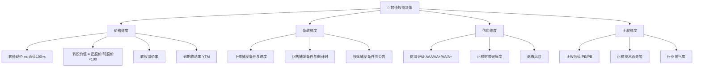
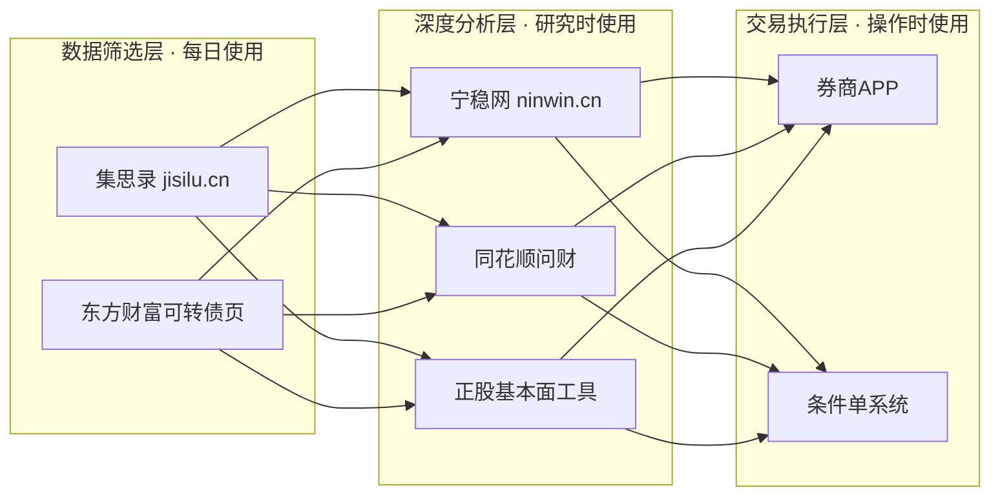
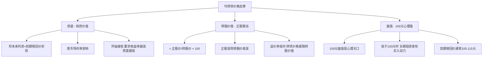
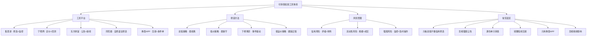

## 十、可转债投资工具

可转债（Convertible Bond）是A股市场中独特的投资品种——它同时具备债券的"下有保底"和股票的"上有弹性"，被称为"进可攻、退可守"的投资工具。但这种不对称收益结构的实现，高度依赖正确的工具选择和使用方法。本节从可转债的定价原理出发，系统讲解投资可转债所需的核心工具、筛选方法、交易策略和常见误区。

> **前置知识：** 可转债的三大核心条款（下修、回售、赎回）的详细解析，请参阅第6章实战案例四《可转债投资——下有保底上有弹性》。本节聚焦"工具怎么选、怎么用"，假设你已了解基本条款逻辑。

---

### 一、可转债投资的工具需求分析

#### 1.1 为什么可转债需要专门的工具

可转债不同于股票和普通债券，它的投资决策涉及多个维度的交叉分析：



一只可转债的完整分析至少需要同时考虑**价格、条款、信用、正股**四个维度。单靠券商APP的行情页面远远不够——它通常只展示价格和基本溢价率，缺少条款触发进度、双低排名、到期收益率计算等关键数据。这就是为什么可转债投资者需要专业工具。

#### 1.2 可转债投资的核心指标体系

在选择工具之前，先明确你需要工具帮你算出和展示哪些指标：

| 指标名称 | 计算公式 | 投资含义 | 工具支持情况 |
|----------|----------|----------|-------------|
| **转股价值** | 正股价 ÷ 转股价 × 100 | 如果立即转股，每张转债值多少钱 | 所有平台均支持 |
| **转股溢价率** | (转债价 - 转股价值) ÷ 转股价值 × 100% | 转债相对转股价值的溢价程度。越低说明转债与正股联动越强 | 所有平台均支持 |
| **双低值** | 转债现价 + 转股溢价率 × 100 | 双低策略的核心排序指标。值越低，"便宜+联动"的综合表现越好 | 集思录、东方财富支持 |
| **到期收益率(YTM)** | 根据买入价、票面利率、到期赎回价、剩余年限计算的年化收益率 | 保底能力的量化指标。YTM>0表示即使不转股，持有到期也不亏 | 集思录、宁稳网支持 |
| **纯债价值** | 将转债未来现金流（利息+赎回价）按市场利率折现 | 转债作为纯债的价值底线 | 宁稳网、部分专业工具支持 |
| **期权价值** | 转债价 - 纯债价值（或用B-S模型计算） | 转股权的时间价值和波动价值 | 宁稳网支持 |
| **下修触发价** | 转股价 × 下修比例（通常为85%-90%） | 正股跌到什么价位，公司可能提议下修转股价 | 集思录、宁稳网支持 |
| **回售触发价** | 转股价 × 回售比例（通常为70%） | 正股跌到什么价位，投资者有权将转债回售给公司 | 集思录支持 |
| **强赎触发价** | 转股价 × 强赎比例（通常为130%） | 正股涨到什么价位，公司有权强制赎回转债 | 集思录支持 |
| **剩余规模** | 尚未转股的转债总金额 | 规模太小（<3000万）流动性差，买卖价差大 | 所有平台均支持 |

---

### 二、核心工具平台详解

可转债投资的工具体系分为三层：**数据筛选层**（找标的）、**深度分析层**（做判断）、**交易执行层**（下单操作）。



#### 2.1 集思录——可转债投资的"主战场"

集思录（jisilu.cn）是国内最专业的可转债数据平台，几乎所有活跃的可转债投资者都将它作为首选工具。

**为什么集思录是第一选择：**

集思录在可转债领域的核心优势是**数据完整性和实时性**。它将所有可转债的关键指标（价格、溢价率、双低值、YTM、条款触发进度）集中在一个页面上，省去了投资者手动计算和跨平台比对的麻烦。其他平台（如东方财富）虽然也提供可转债数据，但在条款监控的深度和筛选的灵活性上不如集思录。

**核心功能模块：**

| 功能模块 | 具体内容 | 使用频率 | 免费/付费 |
|----------|----------|----------|----------|
| **转债列表** | 所有可转债的实时数据（价格、溢价率、双低值、YTM、评级、剩余规模等） | 每日查看 | 免费 |
| **双低排名** | 按双低值升序排列的排名表，双低策略的核心操作页面 | 每日查看 | 免费 |
| **条款监控** | 下修/回售/强赎的触发进度百分比，即将触发的标红提醒 | 每日查看 | 免费 |
| **待发转债** | 即将发行和上市的新债信息，含申购日期、转股价、评级 | 有新债时查看 | 免费 |
| **历史回测** | 双低、低价等策略在历史数据上的回测结果 | 制定策略时使用 | 付费(约300元/年) |
| **期权定价** | 用Black-Scholes模型计算转债理论价值 | 深度分析时使用 | 付费 |
| **数据导出** | 将筛选结果导出为Excel | 量化分析时使用 | 付费 |
| **高级筛选** | 自定义多条件组合筛选 | 精细化选标的 | 付费 |

**集思录关键页面操作指南：**

```text
双低排名页面（核心操作）：
├── 进入路径：首页 → 数据 → 可转债 → 双低
├── 排序方式：点击"双低"列标题，升序排列
├── 关键筛选：
│   ├── 评级 ≥ A+（排除低评级标的）
│   ├── 剩余规模 ≥ 3000万（排除流动性差的）
│   ├── 排除已公告强赎的转债（标记为"强赎"）
│   └── 排除正股被ST的转债
└── 关注重点：双低值 < 130 的标的值得重点关注

条款监控页面：
├── 下修监控：显示每只转债距离下修触发价的百分比
│   ├── 当正股价接近下修触发价时标红提醒
│   └── 重点关注：剩余年限 < 3年 + 即将触发下修 的组合
├── 强赎监控：显示每只转债距离强赎触发价的百分比
│   ├── 当正股价接近强赎触发价时标绿提醒
│   └── 已公告强赎的转债有特殊标记
└── 回售监控：显示距离回售期开始的倒计时
    └── 回售期临近时，公司下修意愿通常更强
```

**集思录会员是否值得购买的判断标准：**

- **不建议购买的情况：** 刚入门，持仓少于5只，主要使用双低策略。免费版的双低排名、基础筛选、条款监控已能满足日常需求。
- **建议购买的情况：** 持仓5只以上需要系统化管理；需要回测验证策略有效性；需要自定义复杂筛选条件导出数据做量化分析。300元/年对于管理10万元以上可转债资金来说，成本率不到0.3%，性价比很高。

#### 2.2 宁稳网——深度分析利器

宁稳网（ninwin.cn）是可转债深度分析的补充工具，核心优势在于**期权定价模型和历史回测**。

**宁稳网 vs 集思录的分工：**

| 分析维度 | 集思录优势 | 宁稳网优势 |
|----------|----------|----------|
| 数据覆盖面 | 全，实时更新 | 侧重定价和回测 |
| 条款监控 | 详细，进度百分比 | 基础展示 |
| 双低排名 | 核心功能 | 支持但非强项 |
| 期权定价 | 付费功能，较简单 | 免费，模型更完整 |
| 历史回测 | 付费功能 | 免费，参数更灵活 |
| 正股财务数据 | 基础展示 | 更详细的财务指标 |
| 学习曲线 | 低，开箱即用 | 中等，需要理解模型 |

**宁稳网的核心使用场景——判断"真便宜"还是"价值陷阱"：**

```text
场景：你在集思录双低排名中发现一只转债，双低值118，看起来很便宜。
      但你不确定这个便宜是否反映了真正的风险。

使用宁稳网验证的步骤：

1. 在宁稳网搜索该转债代码，查看期权定价
   ├── 市场价格 vs 理论价值的对比
   │   ├── 市价远低于理论价值 → 可能是机会
   │   └── 市价接近理论价值 → 双低值低可能是因为正股风险大
   └── 期权价值占比（期权价值/转债价格）
       ├── 占比高 → 市场对其转股前景看好
       └── 占比低 → 更像纯债，上涨空间有限

2. 查看正股财务指标
   ├── 资产负债率：>70% 需警惕偿债能力
   ├── 经营现金流：持续为负说明造血能力差
   ├── 净利润趋势：连续亏损可能触发退市风险
   └── 信用评级变动：近期是否被下调

3. 综合判断
   ├── 财务健康 + 双低值低 → 大概率是机会
   ├── 财务恶化 + 双低值低 → 可能是价值陷阱
   └── 信用评级下调 + 双低值低 → 高风险，回避
```

**宁稳网回测功能——验证策略有效性：**

在用真金白银执行任何可转债策略之前，先用历史数据回测验证。回测能帮你了解策略在不同市场环境下的表现，避免"幸存者偏差"。

```text
回测操作步骤：

1. 进入宁稳网 → 策略回测
2. 选择策略类型：双低策略
3. 设置回测参数：
   ├── 起始日期：建议至少回测3年（覆盖牛熊周期）
   ├── 双低阈值：< 130（经典参数）
   ├── 持仓数量：10只（分散风险）
   ├── 轮动频率：每两周或每月（平衡交易成本和时效性）
   └── 评级要求：A+ 及以上
4. 关注回测结果中的关键指标：
   ├── 年化收益率：历史平均约8%-15%（因市场环境差异大）
   ├── 最大回撤：最大亏损幅度，保守型投资者关注此指标
   ├── 夏普比率：风险调整后收益，越高越好
   └── 胜率：盈利轮动次数占比
5. 对比不同参数组合：
   ├── 双低阈值125 vs 130 vs 135
   ├── 持仓5只 vs 10只 vs 20只
   └── 轮动频率周 vs 双周 vs 月
```

#### 2.3 东方财富可转债页面——免费的全能信息源

东方财富网的可转债页面是免费工具中功能最全面的，适合日常信息获取和新闻监控。

**访问路径：** 东方财富网 → 数据中心 → 可转债 → 可转债行情

**核心功能清单：**

```text
行情数据：
├── 全部可转债实时行情（价格、涨跌幅、成交量）
├── 转股价值和转股溢价率
├── 到期收益率
└── 正股联动行情（点击正股列跳转）

公告信息（这是东方财富的核心优势）：
├── 强赎公告：第一时间推送
├── 下修公告：公司提议下修转股价
├── 回售公告：回售期开始通知
├── 发行公告：新债申购信息
└── 评级变动：信用评级调整通知

数据筛选：
├── 按价格区间筛选（如90-110元）
├── 按溢价率筛选（如<20%）
├── 按评级筛选（如AA以上）
├── 按行业筛选
└── 按到期年限筛选
```

**东方财富 vs 集思录的使用场景对比：**

| 场景 | 推荐工具 | 原因 |
|------|----------|------|
| 每日筛选可转债标的 | 集思录 | 双低排名和条款监控更专业 |
| 查看强赎/下修公告 | 东方财富 | 公告推送速度快，信息整合好 |
| 了解可转债市场新闻 | 东方财富 | 新闻资讯板块内容丰富 |
| 深度定价分析 | 宁稳网 | 期权模型更专业 |
| 日常盯盘和行情查看 | 东方财富 | 界面友好，数据全面 |

#### 2.4 同花顺问财——自然语言筛选可转债

同花顺的"问财"功能支持用自然语言筛选可转债，使用门槛极低，适合不熟悉复杂筛选条件的投资者。

**使用方法：** 在同花顺APP或网页版搜索框中直接输入自然语言条件。

**实用筛选语句模板：**

```text
基础双低筛选（入门必用）：
"可转债 双低值小于130 评级AA以上 剩余规模大于1亿"

低价保底筛选（保守型）：
"可转债 价格小于110 到期收益率大于0 剩余年限2-4年"

低溢价跟踪筛选（进攻型）：
"可转债 溢价率小于10% 日均成交额大于500万"

下修博弈筛选（事件驱动型）：
"可转债 正股价低于转股价85% 剩余年限小于3年"

综合精选筛选（多条件组合）：
"可转债 双低值小于125 评级A+以上 剩余规模大于5000万 
 非ST 剩余年限大于1年"
```

**问财筛选的局限性（必须了解）：**

| 局限性 | 影响 | 应对方法 |
|--------|------|----------|
| 数据更新延迟约15分钟 | 可能错过盘中快速变化 | 盘中实时盯盘用券商APP或集思录 |
| 复杂条件表达有限 | 无法做"排除已公告强赎"等精细筛选 | 结果需手动到集思录二次验证 |
| 无条款触发进度数据 | 无法直接看到下修/强赎进度 | 筛选后到集思录查看条款详情 |
| 无历史回测功能 | 无法验证筛选条件的历史表现 | 用宁稳网回测验证 |

#### 2.5 券商APP——交易执行与条件单

券商APP是最终执行交易的地方。对于可转债T+0交易来说，**条件单功能**是券商APP最重要的差异化特性。

**券商选择标准（可转债专用）：**

| 评估维度 | 关键指标 | 说明 |
|----------|----------|------|
| 佣金费率 | 可转债佣金万1-万3 | 可转债无印花税，佣金是唯一交易成本。高于万3不划算 |
| 条件单支持 | 价格条件单、止盈止损单 | T+0交易必须有条件单辅助 |
| APP体验 | 操作流畅度、数据展示 | 可转债交易频率较高，卡顿的APP会严重影响操作 |
| 可转债专区 | 溢价率、双低值等数据展示 | 部分券商APP可转债数据展示不完善 |
| 转股操作 | 是否支持一键转股 | 强赎时需要快速转股，操作不便可能导致损失 |

**可转债条件单设置清单：**

| 条件单类型 | 触发条件 | 执行操作 | 使用场景 |
|-----------|---------|---------|---------|
| 止损单 | 转债价 ≤ 买入价 × 0.92 | 卖出全部 | 亏损超8%自动止损 |
| 止盈单 | 转债价 ≥ 买入价 × 1.15 | 卖出一半 | 盈利15%分批止盈 |
| 价格回落 | 从最高点回落5% | 卖出全部 | 保护已有利润 |
| 强赎预警 | 正股价 ≥ 转股价 × 1.25 | 推送提醒 | 提前准备卖出或转股 |
| 价格突破 | 转债价突破130元 | 推送提醒 | 关注是否进入强赎区间 |

**条件单常见陷阱及应对：**

| 陷阱 | 具体表现 | 解决方案 |
|------|----------|----------|
| 条件单过期 | 部分券商条件单有效期最长3个月，过期后不再触发 | 每月检查条件单状态，及时续期 |
| 价格跳空 | 开盘跳空直接越过条件单价格，条件单可能无法成交 | 条件单价格留出余量，或使用"对手价"委托 |
| 委托失败 | 流动性差的转债可能挂单无法成交 | 选择"对手价"（买一/卖一价）而非限价 |
| 条件冲突 | 止盈和止损条件单同时存在可能冲突 | 使用"价格回落"条件单替代简单的止盈+止损组合 |

---

### 三、可转债筛选方法与工具配合

#### 3.1 双低策略——最经典的可转债筛选方法

双低策略是可转债投资中经过最长时间验证、使用最广泛的策略。其核心逻辑是：**同时买入价格低（便宜）和溢价率低（与正股联动强）的可转债**，兼顾安全性和上涨弹性。

**双低值的含义拆解：**

```text
双低值 = 转债现价 + 转股溢价率 × 100

拆解示例：
├── 转债A：现价105元，溢价率15% → 双低值 = 105 + 15 = 120（优秀）
├── 转债B：现价130元，溢价率5% → 双低值 = 130 + 5 = 135（一般）
├── 转债C：现价95元，溢价率40% → 双低值 = 95 + 40 = 135（一般）
└── 转债D：现价110元，溢价率25% → 双低值 = 110 + 25 = 135（一般）

关键理解：
- 转债A价格不高（安全），溢价率也不高（弹性好）→ 双低值最低
- 转债B虽然溢价率极低，但价格太高（安全垫薄）→ 双低值反而高
- 转债C虽然价格很低，但溢价率太高（正股涨转债不跟）→ 双低值反而高
- 双低策略的核心是找"价格+溢价率"综合最优的标的
```

**双低策略的完整操作流程：**

```text
第一步：用集思录筛选（每日操作，约5分钟）
├── 打开集思录 → 可转债 → 双低排名
├── 设置筛选条件：
│   ├── 双低值 < 130（经验值，可根据市场调整）
│   ├── 评级 ≥ A+（排除低评级标的）
│   ├── 剩余规模 ≥ 3000万（排除流动性差的）
│   ├── 排除已公告强赎的转债
│   └── 排除正股被ST的转债
└── 得到候选标的列表（通常10-30只）

第二步：用宁稳网验证（选中标的后，每只约3分钟）
├── 查看期权定价 → 判断是否真便宜
├── 查看正股财务指标 → 排除价值陷阱
└── 确认标的质量 → 进入候选池

第三步：用券商APP执行交易
├── 将候选池标的等分为N份（建议持仓8-15只）
├── 设置止损条件单（买入价×0.92）
└── 设置价格回落条件单（从高点回落5%卖出）

第四步：定期轮动（每两周或每月操作一次）
├── 重新用集思录跑双低排名
├── 卖出不在候选池中的持仓
├── 买入新进入候选池的标的
└── 注意控制交易成本（佣金是唯一成本）
```

#### 3.2 低价策略——更保守的选择

低价策略适合风险承受能力较低的投资者，核心逻辑是**只买价格低于到期赎回价的可转债**，确保即使不转股，持有到期也不亏。

```text
低价策略筛选条件：
├── 转债价格 < 到期赎回价（通常105-115元）
├── 到期收益率(YTM) > 0
├── 剩余年限 2-4年（太短利息少，太长不确定性大）
├── 评级 ≥ AA
└── 排除正股被ST的标的

工具配合：
├── 集思录：按YTM排序，筛选符合条件的标的
├── 宁稳网：验证纯债价值，确认保底是否可靠
└── 东方财富：查看正股近期是否有退市风险
```

**低价策略的优缺点：**

| 维度 | 优势 | 劣势 |
|------|------|------|
| 安全性 | 极高，有到期赎回价保底 | 仍需关注信用风险 |
| 收益性 | 低，主要靠利息和小幅差价 | 错过正股上涨带来的转股收益 |
| 持仓体验 | 好，波动小，心理压力小 | 可能长期"横盘"不动 |
| 适合人群 | 极保守型、大资金稳健配置 | 不适合追求高收益的投资者 |

#### 3.3 下修博弈策略——事件驱动型

下修博弈策略的核心逻辑是：**买入即将触发下修条件的可转债，博弈公司提议下修转股价**。下修成功后，转股价值大幅提升，转债价格通常会跟随上涨。

```text
下修博弈筛选条件（用集思录或同花顺问财）：
├── 正股价 < 转股价 × 85%（接近下修触发条件）
├── 剩余年限 < 3年（公司下修意愿更强）
├── 回售期临近（公司面临回售压力时下修概率更高）
├── 评级 ≥ A+
└── 公司现金流不足以应对回售（增加下修概率）

关键注意事项：
├── 下修不是必然的——公司可以选择不下修
├── 下修可能不到位——可能只下修一部分
├── 下修博弈成功率约40%-60%——不是稳赚策略
└── 需要分散持仓（至少5-10只）来对冲失败风险
```

#### 3.4 策略选择决策矩阵

| 策略 | 风险等级 | 预期年化收益 | 适合市场环境 | 核心工具 | 适合人群 |
|------|----------|-------------|-------------|----------|----------|
| 双低策略 | 中等 | 8%-15% | 各类市场均适用 | 集思录双低排名 | 大多数投资者 |
| 低价策略 | 低 | 3%-8% | 熊市、震荡市 | 集思录YTM排序 | 保守型投资者 |
| 下修博弈 | 中高 | 10%-30%（波动大） | 熊市末期、正股持续下跌 | 集思录条款监控 | 有经验的投资者 |
| 低溢价策略 | 中高 | 跟随正股波动 | 牛市、正股趋势向上 | 东方财富溢价率筛选 | 看好正股的投资者 |

---

### 四、可转债定价原理与工具辅助

#### 4.1 可转债的"底"在哪里

理解可转债的价格底线，是使用工具做判断的基础。可转债的价格受三重"底"支撑：



**用工具查看三重底：**

| 价格底 | 工具 | 查看方法 |
|--------|------|----------|
| 纯债价值 | 宁稳网 | 搜索转债代码 → 查看"纯债价值"字段 |
| 转股价值 | 集思录/东方财富 | 转债列表页的"转股价值"列 |
| 面值/赎回价 | 集思录 | 转债详情页的"到期赎回价"字段 |

#### 4.2 溢价率的深层含义

溢价率是可转债分析中最容易被误解的指标。很多新手认为"溢价率越低越好"，但实际情况更复杂：

```text
溢价率的四种典型情况：

1. 低溢价率（<10%）+ 高转股价值（>100）
   含义：转债紧随正股，已接近"股性"
   适合：看好正股的进攻型投资者
   风险：正股下跌时转债也跌得快

2. 低溢价率（<10%）+ 低转股价值（<100）
   含义：转债和正股都在低位，联动强
   适合：双低策略的候选标的
   风险：正股可能继续下跌

3. 高溢价率（>30%）+ 低转股价值（<100）
   含义：正股远低于转股价，转债更像纯债
   适合：保底型投资者
   风险：上涨弹性极差，正股涨转债可能不跟

4. 高溢价率（>30%）+ 高转股价值（>100）
   含义：转债价格远高于转股价值，可能被炒作
   适合：不建议普通投资者参与
   风险：泡沫破裂时暴跌
```

**用工具判断溢价率是否合理：**

- **集思录：** 直接查看溢价率列，按溢价率排序可以快速找到低溢价标的
- **宁稳网：** 查看期权定价，对比理论溢价率和实际溢价率的差异
- **东方财富：** 查看溢价率的行业分布，了解当前市场整体溢价水平

#### 4.3 到期收益率(YTM)的计算与应用

到期收益率是可转债"保底"能力的量化指标。YTM > 0意味着即使公司不促成转股、你持有到期拿回赎回价和利息，也不会亏钱。

```text
YTM的简化计算逻辑：

假设条件：
├── 买入价：P（元/张）
├── 票面利率：逐年递增（第一年0.4%，第二年0.6%，...，第六年2%）
├── 到期赎回价：110元（含最后一年利息）
└── 剩余年限：N年

简化公式：
YTM ≈ (赎回价 + 剩余利息总和 - 买入价) ÷ 买入价 ÷ N × 100%

示例：
├── 买入价102元，赎回价110元，剩余3年，剩余利息约1.8元
├── YTM ≈ (110 + 1.8 - 102) ÷ 102 ÷ 3 × 100% ≈ 3.2%
└── 意味着即使不转股，年化收益约3.2%

工具使用：
├── 集思录：直接显示每只转债的YTM，无需手动计算
├── 宁稳网：提供更精确的YTM计算（考虑税收影响）
└── 注意：利息收入需缴纳20%所得税，实际YTM = 账面YTM × 0.8
```

---

### 五、可转债新债申购工具与流程

#### 5.1 新债申购——低风险的收益来源

可转债打新（申购新发行的可转债）是A股市场中少有的"免费彩票"——不需要持有股票市值，只需要有证券账户即可参与。中签后通常能获得10%-30%的首日涨幅收益。

**新债申购的工具流程：**

```text
第一步：获取新债信息（信息来源）
├── 集思录"待发转债"页面：最完整的新债信息
│   ├── 发行日期、申购日期、上市日期
│   ├── 转股价、评级、规模
│   └── 预估中签率和首日涨幅
├── 东方财富"可转债发行"页面
└── 券商APP推送通知（需开启可转债提醒）

第二步：评估是否值得申购
├── 关注评级：AA以上的大规模转债更值得申购
├── 关注转股价：转股价越低，上市时转股价值越高
├── 关注正股质量：正股近期走势良好，上市涨幅更高
└── 一般规则：评级A+以上且规模>2亿的，都值得申购

第三步：申购操作（在券商APP中）
├── 路径：交易 → 买入 → 输入申购代码
├── 数量：选择"满额申购"（通常100万元）
│   └── 注意：满额申购不代表要交那么多钱
│       实际中签金额通常只有1000元（1手）
├── 确认下单，等待中签结果
└── 中签后确保账户有足够余额缴款

第四步：上市后操作
├── 上市首日卖出：大多数情况下是最优选择
├── 设置条件单：上市当日以"开盘价×0.9"止损
└── 如果看好正股：可以持有等待更高价位
```

#### 5.2 新债申购的关键指标

| 指标 | 含义 | 判断标准 |
|------|------|----------|
| 中签率 | 申购后被抽中的概率 | 通常0.01%-0.1%，大规模转债中签率更高 |
| 首日涨幅 | 上市首日相对面值的涨幅 | 10%-30%为正常，低于5%说明市场不看好 |
| 转股价值 | 上市时正股价/转股价×100 | >100说明正股高于转股价，首日涨幅通常更高 |
| 信用评级 | 发行公司的信用等级 | AAA最安全，A+以下需谨慎 |

---

### 六、可转债风险管理工具

#### 6.1 信用风险监控

2023年以来，搜特转债、蓝盾转债等案例证明，正股退市后转债同样面临违约风险。信用分析是可转债投资中不可跳过的一环。

**信用风险监控工具和方法：**

```text
每日监控清单（用集思录 + 东方财富）：

1. 检查持仓转债的信用评级变动
   ├── 路径：集思录 → 转债列表 → 评级列
   ├── 重点关注：评级被下调的标的
   └── 评级下调至A以下 → 考虑卖出

2. 检查正股是否有退市风险
   ├── 路径：东方财富 → 搜索正股 → 风险提示
   ├── 关注指标：净利润是否连续亏损、营收是否<3亿
   └── 正股被ST → 立即卖出对应转债

3. 检查正股财务健康度
   ├── 路径：宁稳网 → 正股分析 → 财务指标
   ├── 关注指标：
   │   ├── 资产负债率 > 70% → 偿债压力大
   │   ├── 经营现金流持续为负 → 造血能力差
   │   ├── 短期借款 / 货币资金 > 3 → 短期偿债风险高
   │   └── 审计意见非"标准无保留" → 财务可能有水分
   └── 任一指标异常 → 降低该转债仓位或清仓
```

#### 6.2 流动性风险管理

流动性差的可转债在极端行情下可能出现"想卖卖不掉"的情况：

| 流动性指标 | 安全标准 | 警戒标准 | 工具查看方式 |
|-----------|----------|----------|-------------|
| 剩余规模 | > 1亿 | < 3000万 | 集思录转债列表 |
| 日均成交额 | > 500万 | < 100万 | 东方财富转债行情 |
| 买卖价差 | < 0.5元 | > 1元 | 券商APP盘口数据 |

#### 6.3 强赎风险管理

强赎是可转债投资者最常犯的操作失误——公司公告强赎后，如果不在规定时间内卖出或转股，转债将被以强赎价（通常100-103元）赎回，导致大幅亏损。

```text
强赎风险防控流程：

1. 日常监控（集思录强赎监控页面）
   ├── 每日检查持仓转债的强赎触发进度
   ├── 当正股价接近转股价×130%时，开始关注
   └── 设置券商APP的强赎预警条件单

2. 强赎公告发布后（第一时间响应）
   ├── 立即计算：转债现价 vs 强赎价
   │   ├── 转债现价 > 130元 → 卖出（省事）
   │   └── 转债现价 < 130元 → 转股（可能更划算）
   ├── 关注最后交易日和最后转股日
   └── 在截止日前完成操作

3. 常见错误
   ├── 忘记操作 → 被低价赎回（强赎价通常100-103元）
   ├── 转股后正股大跌 → 转股不如卖出
   └── 强赎公告后继续持有 → 看着转债价格回落到强赎价附近
```

---

### 七、可转债投资的常见工具使用误区

#### 误区一：只看双低值，不做信用筛选

**错误表现：** 机械地按双低值排序买入排名前10的转债，不检查信用评级和正股财务状况。

**为什么错：** 双低值低的转债，可能正是因为正股基本面差（评级低、财务恶化），市场给予了折价。这种折价不是"便宜"，而是"合理的风险定价"。

**正确做法：** 双低筛选只是第一步，必须叠加信用筛选（评级≥A+、正股无ST风险、资产负债率合理）。

#### 误区二：忽视强赎公告

**错误表现：** 持有转债后不关注强赎公告，被公司以100-103元的低价赎回。

**为什么错：** 强赎公告发布后，转债价格通常会从130元以上逐步回落到强赎价附近。如果不及时卖出或转股，将损失20%-30%的收益。

**正确做法：** 在集思录设置强赎监控，每天花1分钟检查持仓转债的强赎触发进度。触发后立即操作。

#### 误区三：满仓单只转债

**错误表现：** 把所有资金集中在一只看起来"最便宜"的转债上。

**为什么错：** 可转债的"保底"建立在公司不违约的前提下。如果这只转债对应的正股暴雷退市，你将面临严重亏损。分散持仓是可转债投资的基本纪律。

**正确做法：** 至少持有8-15只转债，单只转债仓位不超过总资金的15%。

#### 误区四：频繁短线交易

**错误表现：** 利用T+0特性，每天在可转债上做多次买卖，试图赚取日内差价。

**为什么错：** 可转债的日内波动通常很小（1%-3%），频繁交易的手续费累积会侵蚀大部分收益。更重要的是，频繁交易会导致心态浮躁，做出非理性决策。

**正确做法：** 可转债的最优持仓周期是2周到3个月（双低策略的轮动周期）。过于频繁的交易不如持有等待。

#### 误区五：只用一个工具

**错误表现：** 只用券商APP看可转债行情，不做专业筛选和分析。

**为什么错：** 券商APP通常不提供双低排名、条款触发进度、到期收益率计算等关键数据。只用券商APP就像蒙着眼睛开车——你可能不会撞墙，但一定会走弯路。

**正确做法：** 建立"集思录筛选 → 宁稳网验证 → 券商APP交易"的三层工具体系。

#### 误区六：忽视税收影响

**错误表现：** 计算到期收益率时不考虑利息所得税，高估了实际收益。

**为什么错：** 可转债的利息收入需缴纳20%所得税。虽然对于主要靠买卖差价获利的双低策略来说影响较小，但对于低价策略（持有到期型）的投资者来说，税收会显著拉低实际YTM。

**正确做法：** 在宁稳网查看税后YTM，或手动计算：实际YTM ≈ 账面YTM × 0.8（利息部分）+ 买卖差价收益（免税）。

---

### 八、工具使用的进阶技巧

#### 8.1 用Excel/Google Sheets建立自己的可转债跟踪表

当你的持仓超过10只时，建议建立一个电子表格来系统化管理：

```text
跟踪表的核心列设计：

基础信息列：
├── 转债代码（用于券商APP快速搜索）
├── 转债名称
├── 买入日期
├── 买入价格
└── 持仓数量

关键指标列（从集思录手动或API更新）：
├── 当前价格（每日更新）
├── 转股溢价率（每日更新）
├── 双低值（每日更新）
├── 到期收益率（每日更新）
├── 信用评级
└── 剩余年限

条款监控列：
├── 下修触发进度
├── 强赎触发进度
├── 是否已公告强赎
└── 回售期倒计时

盈亏分析列：
├── 浮动盈亏（金额）
├── 浮动盈亏（百分比）
├── 止损价（买入价×0.92）
└── 条件单状态（已设置/未设置）
```

#### 8.2 利用集思录API批量获取数据（进阶）

对于有编程基础的投资者，可以通过集思录的网页接口批量获取可转债数据，实现自动化筛选和监控：

```python
# 示例：用Python获取集思录可转债数据的基本思路
# 注意：需要登录集思录账号，且接口可能随时变化

import requests
import pandas as pd

# 登录集思录（需要你的账号密码）
session = requests.Session()
login_url = "https://www.jisilu.cn/webapi/login"
session.post(login_url, data={"username": "your_username", "password": "your_password"})

# 获取可转债列表数据
cb_url = "https://www.jisilu.cn/data/cbnew/cb_list"
response = session.get(cb_url)
data = response.json()

# 转为DataFrame进行筛选
df = pd.DataFrame(data["rows"])
df["dbl_low"] = df["price"] + df["premium_rt"]  # 计算双低值

# 筛选条件
filtered = df[
    (df["dbl_low"] < 130) &
    (df["rating_cd"] >= "A+") &
    (df["curr_iss_amt"] >= 3000)  # 剩余规模>=3000万
]

print(filtered[["bond_nm", "price", "premium_rt", "dbl_low", "ytm_rt"]])
```

> **提示：** 集思录的接口参数和认证方式可能变化，以上代码仅为思路演示。实际使用时需要参考最新的接口文档。同时注意遵守平台的使用条款。

#### 8.3 条件单的进阶组合策略

单个条件单只能控制一种场景，但多个条件单的组合可以构建更完整的交易系统：

```text
可转债自动化交易条件单组合示例：

买入条件（手动在集思录筛选后执行）：
├── 在集思录找到双低值<130的标的
├── 用宁稳网验证财务健康
└── 在券商APP以限价单买入

持仓管理（条件单自动执行）：
├── 条件单1：止损
│   ├── 触发：价格 ≤ 买入价 × 0.92
│   └── 执行：卖出全部
├── 条件单2：分批止盈
│   ├── 触发：价格 ≥ 买入价 × 1.15
│   └── 执行：卖出50%
├── 条件单3：保护利润（替代止盈后剩余仓位的止损）
│   ├── 触发：价格从止盈后的最高点回落5%
│   └── 执行：卖出全部
└── 条件单4：强赎预警
    ├── 触发：正股价 ≥ 转股价 × 1.30
    └── 执行：推送提醒（需要手动决定卖出还是转股）
```

---

### 九、可转债投资工具学习路径

#### 9.1 新手阶段（第1-2周）

```text
学习目标：理解可转债基本概念，完成第一笔交易

第1天：理论学习
├── 阅读第6章案例四（可转债条款和原理）
├── 理解转股价值、溢价率、双低值的含义
└── 了解下修/回售/强赎三大条款

第2-3天：工具熟悉
├── 注册集思录账号，浏览可转债列表
├── 熟悉双低排名页面的操作
└── 了解各字段的含义

第4-5天：模拟筛选
├── 用集思录做一次完整的双低筛选
├── 用宁稳网验证筛选结果
└── 记录候选标的清单

第6-7天：首次交易
├── 确保已开通可转债交易权限
├── 选择1-2只标的小金额买入（1000-3000元）
├── 设置止损条件单
└── 体验T+0交易的节奏

第2周：巩固
├── 每日花5分钟查看集思录双低排名
├── 关注持仓转债的条款触发进度
├── 尝试使用同花顺问财做筛选
└── 阅读本节的"常见误区"章节
```

#### 9.2 进阶阶段（第3-8周）

```text
学习目标：建立系统化的可转债投资体系

第3-4周：策略深入
├── 用宁稳网回测双低策略（不同参数组合）
├── 学习低价策略和下修博弈策略
├── 建立Excel跟踪表管理持仓
└── 开始关注信用分析（正股财务指标）

第5-6周：组合构建
├── 将持仓扩展到8-10只
├── 设置完整的条件单组合
├── 建立定期轮动纪律（每两周检查一次）
└── 开始关注新债申购

第7-8周：复盘优化
├── 回顾过去6周的交易记录
├── 分析盈亏原因，优化筛选条件
├── 对比自己的收益与双低策略回测结果
└── 建立适合自己的投资纪律
```

#### 9.3 精通阶段（持续）

```text
精通标志：
├── 能在5分钟内完成一次完整的标的筛选和验证
├── 能独立判断一只转债是"真便宜"还是"价值陷阱"
├── 能根据市场环境调整策略参数
├── 年化收益稳定在8%以上，最大回撤控制在10%以内
└── 形成适合自己的可转债投资体系
```

---

### 十、本节核心要点回顾



**速查口诀：**

- **工具五件套：** 集思录筛、宁稳验、东财看公告、问财快筛、券商下单
- **筛选四步法：** 双低排序 → 信用过滤 → 定价验证 → 分散买入
- **风控三防线：** 信用检查（不买低评级）→ 分散持仓（8-15只）→ 条件单保护（止损+止盈）
- **轮动两纪律：** 定期（每两周）检查 + 严格执行

---

> **实操建议：** 如果你是第一次接触可转债，建议先阅读实战案例七《可转债投资入门》，跟着完整的操作流程走一遍，再回来参考本节的工具详解和策略分析。案例是"怎么做"，本节是"为什么这么做"——两者结合才能形成完整的投资能力。
