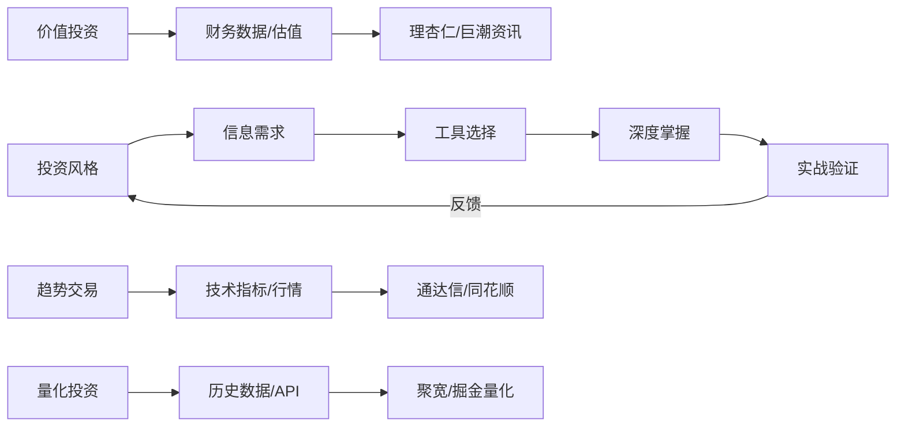
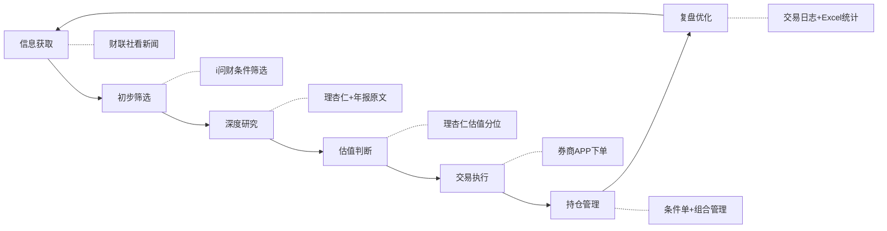

## 十三、投资工具学习路径

投资工具数量众多、功能各异，新手面对同花顺、通达信、理杏仁、聚宽、天天基金等几十个平台时，最常见的反应是"不知道从哪里开始"和"学了很多工具但用不上"。这两个问题的根源相同——缺乏系统的学习路径。本节提供一套从零基础到专业级的投资工具学习框架，帮助你在不同阶段把有限的时间投入到最该学的工具上，避免"工具焦虑"和"学而不用"两大陷阱。

### 13.1 投资工具学习的核心原则

#### 13.1.1 工具服务于策略，而非相反

学习投资工具最常见的错误是"为学工具而学工具"——花三个月学会了通达信公式编写，却从来没有一套清晰的交易策略。正确的顺序是：

1. **先确定投资风格**：你是价值投资者、趋势交易者、还是量化策略开发者？
2. **再明确信息需求**：你需要什么类型的数据？基本面、技术面、资金面、还是情绪面？
3. **最后匹配工具**：根据需求选择最合适的工具，而不是学遍所有工具



#### 13.1.2 二八法则：掌握20%的功能解决80%的问题

每个投资软件都有上百个功能，但真正高频使用的核心功能通常不超过20%。以通达信为例：

| 功能类别 | 功能数量 | 日常使用频率 | 学习优先级 |
|----------|----------|-------------|-----------|
| K线查看与切换 | 5个 | 极高（每次看盘） | ★★★★★ |
| 自选股管理 | 3个 | 极高（每天使用） | ★★★★★ |
| 技术指标切换 | 10个 | 高（分析时用） | ★★★★☆ |
| 条件选股公式 | 50+个 | 中（选股时用） | ★★★☆☆ |
| 交易系统公式 | 30+个 | 低（进阶用） | ★★☆☆☆ |
| 扩展数据管理 | 20+个 | 极低（专业用） | ★☆☆☆☆ |

**学习建议**：先花1-2周掌握高频功能（标记为★★★★★），能够独立完成日常看盘和基本分析。然后再根据自己的投资风格，逐步学习中频功能。低频功能留到有明确需求时再学，不要提前囤积知识。

#### 13.1.3 学以致用：每学一个工具就用它做一次完整分析

投资工具的学习效果取决于"是否在真实场景中使用过"。只看教程不动手，一周后遗忘率超过80%。正确的做法是：学完一个工具的核心功能后，立刻用它对一只真实股票（或基金）做一次完整的分析。例如：

- 学完理杏仁的估值功能 → 用它分析贵州茅台的PE历史分位
- 学完通达信的条件选股 → 编写一个均线多头排列选股公式并在全市场运行
- 学完天天基金的筛选功能 → 用它筛选出3只符合条件的指数基金并记录筛选逻辑

### 13.2 分阶段学习路线图

投资工具的学习不是一蹴而就的，需要按照"先广后深、先易后难"的原则分阶段推进。以下路线图覆盖从完全零基础到专业级的完整学习路径。

#### 13.2.1 总体路线图

```mermaid
graph TD
    subgraph 第一阶段：基础入门 1-2个月
        A1[券商APP开户与基本操作]
        A2[行情软件安装与基础看盘]
        A3[基金平台注册与定投设置]
    end
    
    subgraph 第二阶段：技能构建 3-6个月
        B1[技术分析工具深度使用]
        B2[基本面分析工具入门]
        B3[条件单与自动化工具]
        B4[信息获取渠道建立]
    end
    
    subgraph 第三阶段：体系成型 6-12个月
        C1[多工具协同工作流]
        C2[数据导出与本地分析]
        C3[投资组合管理工具]
        C4[交易日志与复盘系统]
    end
    
    subgraph 第四阶段：专业进阶 12个月+
        D1[量化交易入门]
        D2[API数据获取与处理]
        D3[策略回测与优化]
        D4[跨市场工具整合]
    end
    
    A1 --> A2 --> A3
    A3 --> B1 --> B2 --> B3 --> B4
    B4 --> C1 --> C2 --> C3 --> C4
    C4 --> D1 --> D2 --> D3 --> D4
```

#### 13.2.2 第一阶段：基础入门（1-2个月）

**目标**：能够独立完成开户、看盘、买卖基金这三个最基本的操作。

**核心任务清单**：

| 序号 | 任务 | 具体操作 | 预计耗时 | 完成标志 |
|------|------|---------|---------|---------|
| 1 | 开通证券账户 | 选择佣金低的互联网券商（华泰、东方财富等），线上开户 | 1天 | 成功登录券商APP |
| 2 | 熟悉券商APP | 搞懂买入/卖出/撤单/查询持仓这四个核心操作 | 3天 | 能独立完成模拟交易 |
| 3 | 安装行情软件 | 下载同花顺或东方财富APP，添加5-10只自选股 | 1天 | 自选股分组完成 |
| 4 | 学会看K线 | 理解红绿K线含义、成交量柱状图、分时图 | 1周 | 能说出任意一天的开盘/收盘/最高/最低价 |
| 5 | 开通基金账户 | 在支付宝/天天基金注册，绑定银行卡 | 1天 | 能搜索并查看基金详情 |
| 6 | 设置第一笔定投 | 选择一只沪深300指数基金，设置每周100元定投 | 30分钟 | 定投计划生效 |

**第一阶段的学习资源**：

- **券商APP自带教程**：每个券商APP的新手引导都值得完整看一遍，特别是交易规则、委托类型、资金到账时间等基础信息
- **同花顺投资学院**：免费的视频课程，覆盖K线基础、均线入门等知识点
- **《手把手教你读财报》**（唐朝著）：虽然不直接讲工具，但帮你建立财报思维，为后续使用理杏仁等工具打基础

**第一阶段的常见陷阱**：

| 陷阱 | 表现 | 正确做法 |
|------|------|---------|
| 急于实盘交易 | 开户第二天就重仓买入 | 先用模拟盘或极小金额（1000元以下）练习 |
| 装太多软件 | 一次下载10个APP | 先用好1个主力软件，需要时再扩展 |
| 追求高级功能 | 上来就学公式编写 | 先掌握基础操作，高级功能后面再说 |
| 忽视交易规则 | 不了解T+1、涨跌停限制 | 开户后第一件事是阅读交易规则说明 |

#### 13.2.3 第二阶段：技能构建（3-6个月）

**目标**：掌握技术分析和基本面分析的核心工具，建立条件单使用习惯，形成稳定的信息获取渠道。

**技能模块一：技术分析工具（4-6周）**

学习顺序和时间分配：

| 周次 | 学习内容 | 核心工具 | 实操任务 |
|------|---------|---------|---------|
| 第1周 | K线形态识别 | 通达信/同花顺K线图 | 识别5种以上经典K线形态，记录出现位置和后续走势 |
| 第2周 | 均线系统 | MA指标（5/10/20/60/120/250日） | 在3只股票上观察均线金叉/死叉的历史表现 |
| 第3周 | MACD指标 | MACD的DIF/DEA/柱状图 | 找出3个MACD底背离和顶背离的实际案例 |
| 第4周 | RSI与KDJ | RSI超买超卖、KDJ金叉死叉 | 对比RSI和KDJ在同一行情中的信号差异 |
| 第5周 | 成交量分析 | 量价关系、量比、换手率 | 找出3个"放量突破"和3个"缩量回调"的实际案例 |
| 第6周 | 指标组合使用 | 趋势+摆动+量能的组合 | 用MA+RSI+成交量组合分析一只股票，写出完整的分析报告 |

**技术分析工具的学习要点**：

学习技术指标时，最重要的是理解指标的**计算原理**和**适用条件**，而不是死记硬背信号规则。以MACD为例：

- **计算原理**：MACD = 12日EMA - 26日EMA，本质上是两条均线的差值，反映短期趋势相对于中期趋势的强弱
- **适用条件**：趋势行情中效果好，震荡行情中频繁出现假信号
- **关键限制**：MACD是滞后指标，信号出现时价格已经走了一段，不能用来精确抄底逃顶

**技能模块二：基本面分析工具（3-4周）**

| 周次 | 学习内容 | 核心工具 | 实操任务 |
|------|---------|---------|---------|
| 第1周 | 理杏仁基础功能 | PE/PB/PS查询、历史分位数 | 查询10只蓝筹股的PE历史分位，判断估值高低 |
| 第2周 | 理杏仁进阶功能 | 行业对比、杜邦分析、财务健康度 | 对同一行业的3家公司进行横向对比分析 |
| 第3周 | 财报原文阅读 | 巨潮资讯网下载年报PDF | 完整阅读1份上市公司年报，提取关键信息 |
| 第4周 | 研报阅读 | 慧博投研/萝卜投研 | 阅读5份券商研报，学习研报的分析框架 |

**技能模块三：条件单与自动化（2-3周）**

| 周次 | 学习内容 | 核心工具 | 实操任务 |
|------|---------|---------|---------|
| 第1周 | 条件单基础 | 券商APP条件单功能 | 设置止损和止盈条件单各1个 |
| 第2周 | 条件单进阶 | 价格/时间/涨跌幅条件单 | 为3只持仓设置不同的条件单策略 |
| 第3周 | 定投工具 | 天天基金/蚂蚁财富智能定投 | 设置估值定投策略（低估多投、高估少投） |

**技能模块四：信息获取渠道（贯穿整个阶段）**

建立稳定的信息获取渠道比学会任何单一工具都重要。建议按以下结构搭建：

| 信息类型 | 推荐渠道 | 使用频率 | 注意事项 |
|----------|---------|---------|---------|
| 实时行情 | 同花顺/东方财富APP | 盘中随时 | 设置价格预警，不要一直盯盘 |
| 公司公告 | 巨潮资讯网 | 每周2-3次 | 重点关注年报、季报、重大事项公告 |
| 行业研报 | 慧博投研/萝卜投研 | 每周1-2次 | 看结论和逻辑，不盲信目标价 |
| 投资社区 | 雪球/淘股吧 | 每天15-30分钟 | 学习分析框架，不跟风抄作业 |
| 宏观数据 | 国家统计局/央行网站 | 每月1次 | 关注CPI、PMI、社融等关键指标 |
| 财经新闻 | 财联社/第一财经 | 每天早盘前 | 区分噪音和有效信息 |

#### 13.2.4 第三阶段：体系成型（6-12个月）

**目标**：从"会用单个工具"升级为"能用多个工具协同工作"，建立完整的投资分析和决策流程。

**核心能力一：多工具协同工作流**

成熟的投资者不会只用一个工具完成所有工作，而是让不同工具各司其职。以下是一个典型的价值投资者工作流：



**核心能力二：数据导出与本地分析**

在线工具的数据展示方式是固定的，但你的分析需求是个性化的。学会将数据导出到本地进行二次处理，是投资能力进阶的关键一步。

**常用数据导出方法**：

| 工具 | 导出格式 | 导出方法 | 适用场景 |
|------|---------|---------|---------|
| 理杏仁 | CSV/Excel | 个股页面→导出数据 | 估值数据批量分析 |
| 通达信 | TXT/Excel | 系统→数据导出 | 历史行情数据 |
| 天天基金 | CSV | 基金详情页→历史净值 | 基金业绩回测 |
| i问财 | Excel | 筛选结果→导出 | 选股结果分析 |
| 东方财富 | Excel | 财务数据→导出 | 财务指标对比 |

**Excel基础分析模板**：

导出数据后，至少应该掌握以下Excel技能：

1. **数据透视表**：按行业、按时间维度汇总估值数据
2. **条件格式**：将PE分位低于30%的标标记为绿色（低估），高于70%标记为红色（高估）
3. **基础图表**：折线图展示估值趋势、柱状图对比行业数据
4. **VLOOKUP/INDEX-MATCH**：跨表关联不同来源的数据

如果具备Python基础，可以用pandas进行更灵活的数据处理：

```python
# 示例：批量计算A股主要指数的PE历史分位
import akshare as ak
import pandas as pd

# 获取沪深300指数PE数据
pe_data = ak.stock_zh_index_value_csindex(symbol="000300")
pe_data['日期'] = pd.to_datetime(pe_data['日期'])
pe_data = pe_data.sort_values('日期')

# 计算当前PE在历史中的分位
current_pe = pe_data['市盈率1'].iloc[-1]
percentile = (pe_data['市盈率1'] < current_pe).mean() * 100
print(f"沪深300当前PE: {current_pe:.2f}, 历史分位: {percentile:.1f}%")
```

**核心能力三：交易日志与复盘系统**

交易日志是投资能力提升的"飞轮"。没有记录就没有复盘，没有复盘就没有改进。

**交易日志的核心字段**：

| 字段 | 说明 | 示例 |
|------|------|------|
| 日期 | 操作日期 | 2025-06-15 |
| 标的 | 股票/基金名称 | 贵州茅台（600519） |
| 方向 | 买入/卖出 | 买入 |
| 价格 | 成交均价 | 1650.00元 |
| 数量 | 成交数量 | 100股 |
| 买入逻辑 | 为什么买（至少3点） | 1.PE分位25%，低估；2.季报营收增长15%；3.日线MACD底背离 |
| 目标价 | 计划卖出价格 | 1900元（+15%） |
| 止损价 | 最大可接受亏损 | 1500元（-9%） |
| 实际结果 | 最终盈亏 | 持有中 / 盈利12% / 亏损5% |
| 复盘反思 | 做对了什么/做错了什么 | 买入逻辑正确，但止损设置过宽 |

**复盘频率建议**：

- **每日复盘**（5分钟）：记录当日操作，检查条件单状态
- **每周复盘**（30分钟）：回顾本周所有交易，检查是否严格执行计划
- **每月复盘**（1-2小时）：统计月度收益率，分析盈亏原因，调整下月策略
- **每季复盘**（半天）：全面回顾投资组合表现，评估工具使用效率，优化工具组合

#### 13.2.5 第四阶段：专业进阶（12个月以上）

**目标**：掌握量化交易基础，能够用程序化方法获取数据、回测策略、辅助决策。

**适合进入第四阶段的前提条件**：

- 已经有1年以上的实盘投资经验
- 对技术分析和基本面分析工具都能熟练使用
- 有基本的编程能力（Python入门水平即可）
- 投资资金已经达到一定规模（至少10万元以上），量化工具的投入产出比才合理

**量化工具学习路径**：

| 阶段 | 学习内容 | 推荐工具 | 预计时间 | 实操目标 |
|------|---------|---------|---------|---------|
| 入门 | Python基础+数据处理 | 菜鸟教程+《利用Python进行数据分析》 | 4-6周 | 能用pandas处理CSV格式的股票数据 |
| 初级 | 数据获取+简单策略 | AKShare/Tushare+Matplotlib | 4-6周 | 能获取A股历史数据并绘制K线图 |
| 中级 | 策略回测框架 | 聚宽/掘金量化/Backtrader | 6-8周 | 能回测一个双均线策略并分析回测报告 |
| 高级 | 因子分析+组合优化 | 聚宽研究平台/自建框架 | 持续学习 | 能构建多因子选股模型并进行样本外测试 |

**聚宽平台入门实操**：

聚宽（JoinQuant）是国内最成熟的量化研究平台之一，提供免费的研究环境和A股全历史数据。入门步骤：

1. **注册并熟悉环境**：访问joinquant.com注册账号，进入"研究"环境（类似Jupyter Notebook）
2. **获取第一份数据**：

```python
# 在聚宽研究环境中运行
import jqdata

# 获取贵州茅台的日线数据
df = jqdata.get_price(
    '600519.XSHG',
    start_date='2024-01-01',
    end_date='2025-01-01',
    frequency='daily',
    fields=['open', 'close', 'high', 'low', 'volume']
)
print(df.tail(10))
```

3. **编写第一个策略**：在"策略"环境中编写双均线策略

```python
# 双均线策略框架
def initialize(context):
    set_benchmark('000300.XSHG')  # 沪深300作为基准
    set_order_cost(OrderCost(close_tax=0.001), type='stock')
    g.stock = '600519.XSHG'
    g.short_period = 5
    g.long_period = 20

def handle_data(context, data):
    close_data = attribute_history(g.stock, g.long_period, '1d', ['close'])
    ma5 = close_data['close'][-g.short_period:].mean()
    ma20 = close_data['close'].mean()
    
    current_position = context.portfolio.positions[g.stock]
    
    if ma5 > ma20 and current_position.total_amount == 0:
        order_value(g.stock, context.portfolio.total_value * 0.8)
    elif ma5 < ma20 and current_position.total_amount > 0:
        order_target(g.stock, 0)
```

4. **运行回测并分析结果**：设置回测时间段（建议至少3年）、初始资金（100万）、频率（每日），运行后重点看：年化收益率、最大回撤、夏普比率、胜率

### 13.3 不同投资风格的工具组合推荐

投资风格不同，需要的工具组合也完全不同。以下是四种典型投资风格的工具组合推荐。

#### 13.3.1 价值投资者工具组合

价值投资者的核心需求是：找到被低估的优质公司，长期持有等待价值回归。

| 功能 | 推荐工具 | 用途 | 优先级 |
|------|---------|------|--------|
| 估值分析 | 理杏仁 | PE/PB历史分位、行业对比 | ★★★★★ |
| 财报阅读 | 巨潮资讯网 | 下载年报/季报原文PDF | ★★★★★ |
| 数据筛选 | i问财 | 按财务指标批量筛选 | ★★★★☆ |
| 深度研究 | 雪球 | 阅读深度分析文章 | ★★★★☆ |
| 研报参考 | 慧博投研 | 券商研究报告 | ★★★☆☆ |
| 交易执行 | 券商APP | 低频交易，条件单辅助 | ★★★☆☆ |

**典型工作流**：理杏仁发现低估标的 → 巨潮资讯网读年报验证基本面 → 雪球看社区讨论补充视角 → 券商APP下单 → 长期持有，每季度复查估值

#### 13.3.2 趋势交易者工具组合

趋势交易者的核心需求是：识别趋势方向，在趋势启动时入场，在趋势反转时离场。

| 功能 | 推荐工具 | 用途 | 优先级 |
|------|---------|------|--------|
| 技术分析 | 通达信 | 自定义公式、多周期分析 | ★★★★★ |
| 行情监控 | 同花顺 | 实时行情、价格预警 | ★★★★★ |
| 条件单 | 券商APP | 自动化止损止盈 | ★★★★★ |
| 板块监控 | 通达信/同花顺 | 行业轮动、资金流向 | ★★★★☆ |
| 选股筛选 | 通达信公式选股 | 技术形态筛选 | ★★★★☆ |
| 辅助验证 | 理杏仁 | 避免选到基本面恶化的股票 | ★★★☆☆ |

**典型工作流**：通达信公式筛选技术形态 → 同花顺看盘确认信号 → 条件单自动执行 → 每日复盘调整策略

#### 13.3.3 基金定投者工具组合

基金定投者的核心需求是：选择合适的基金，设定合理的定投计划，坚持执行并适时止盈。

| 功能 | 推荐工具 | 用途 | 优先级 |
|------|---------|------|--------|
| 基金筛选 | 天天基金 | 多维度筛选、业绩对比 | ★★★★★ |
| 定投执行 | 蚂蚁财富/天天基金 | 自动定投、智能定投 | ★★★★★ |
| 估值参考 | 且慢/蛋卷 | 指数估值、策略跟投 | ★★★★☆ |
| 组合管理 | 蛋卷基金 | 资产配置、一键组合 | ★★★★☆ |
| 费率比较 | 天天基金 | 对比A/C类份额费率 | ★★★☆☆ |
| 行情辅助 | 同花顺 | 查看指数走势 | ★★☆☆☆ |

**典型工作流**：天天基金筛选目标基金 → 蚂蚁财富设置智能定投 → 且慢参考估值判断加减仓 → 蛋卷基金管理整体配置比例 → 每半年复查一次基金表现

#### 13.3.4 量化投资者工具组合

量化投资者的核心需求是：获取高质量数据，编写和回测策略，用程序化方式执行交易。

| 功能 | 推荐工具 | 用途 | 优先级 |
|------|---------|------|--------|
| 策略开发 | 聚宽/掘金量化 | 在线研究环境、回测引擎 | ★★★★★ |
| 数据获取 | AKShare/Tushare | Python接口获取A股数据 | ★★★★★ |
| 本地回测 | Backtrader/vnpy | 本地策略回测框架 | ★★★★☆ |
| 数据分析 | Python+pandas+matplotlib | 数据处理和可视化 | ★★★★★ |
| 实盘交易 | QMT/掘金实盘 | 程序化下单 | ★★★★☆ |
| 因子研究 | 聚宽研究平台 | 多因子模型构建 | ★★★☆☆ |

**典型工作游**：AKShare获取数据 → Jupyter Notebook做因子分析 → 聚宽平台回测策略 → QMT连接实盘 → 定期监控策略表现

### 13.4 学习效率提升方法

#### 13.4.1 费曼学习法在投资工具学习中的应用

费曼学习法的核心是"用自己的话解释给别人听"。应用到投资工具学习中：

1. **选择一个工具功能**（例如：理杏仁的PE分位数功能）
2. **假装向一个完全不懂投资的朋友解释**：什么是PE？什么是分位数？怎么看分位数判断贵贱？
3. **发现自己解释不清楚的地方**，回去重新学习
4. **简化语言，用类比帮助理解**：PE就像"几年回本"，分位数就像"考试排名百分比"

如果你能把一个工具的功能向非专业人士解释清楚，说明你真正理解了它。

#### 13.4.2 建立个人工具使用手册

每个投资者都应该维护一份自己的"工具使用手册"，记录以下内容：

```markdown
# 我的投资工具手册

## 理杏仁
- 网址：lixinger.com
- 账号：（记录登录方式，不记录密码）
- 常用功能：
  1. 个股估值查看路径：搜索股票 → 估值分析 → 选择PE/PB → 设置时间窗口
  2. 行业对比路径：个股页面 → 行业对比 → 选择对比指标
- 我的使用心得：（记录个人发现的技巧和注意事项）
- 常见问题：（记录使用中遇到的问题和解决方法）

## 通达信
- 安装路径：C:\new_tdx
- 我的自定义公式：（记录自己编写的公式和用途）
- 快捷键备忘：（记录自己习惯的快捷键设置）
```

这份手册的价值在于：当你隔了一段时间没用某个工具时，不需要重新摸索，打开手册就能快速上手。

#### 13.4.3 利用社区加速学习

投资工具的学习不必闭门造车，善用社区资源可以大幅加速学习进度：

| 社区/平台 | 适合学习的内容 | 使用建议 |
|-----------|---------------|---------|
| 雪球 | 投资逻辑、分析框架 | 关注高质量的长文作者，学习他们的分析方法 |
| 聚宽社区 | 量化策略、Python代码 | 大量开源策略可以学习和改编 |
| 通达信公式论坛 | 技术指标公式 | 学习别人的公式思路，逐步自己编写 |
| B站 | 工具操作教程 | 搜索"理杏仁教程""通达信公式入门"等关键词 |
| 知乎 | 工具对比评测 | 搜索"XX和YY哪个好"获取真实用户评价 |

**社区学习的注意事项**：

- **学方法，不学结论**：社区里别人的买卖建议不可靠，但他们的分析方法值得学习
- **验证信息**：社区里的工具使用技巧可能过时或有误，实际操作前先验证
- **贡献内容**：把自己学到的工具使用技巧分享出来，教是最好的学

### 13.5 常见学习路径错误与纠正

#### 13.5.1 典型错误模式

| 错误模式 | 具体表现 | 后果 | 纠正方法 |
|----------|---------|------|---------|
| 工具焦虑 | 同时学习10+个工具，每个都只会皮毛 | 没有一个工具能真正用好 | 按阶段路线图，每个阶段只聚焦2-3个核心工具 |
| 功能猎奇 | 沉迷于探索软件的冷门功能 | 忽视了最核心的高频功能 | 先用好20%的核心功能，再探索进阶功能 |
| 纸上谈兵 | 看了100篇教程但从未实盘操作 | 学了就忘，用时还是不会 | 每学一个功能就用它分析一只真实股票 |
| 忽视复盘 | 只管交易不管记录和反思 | 同样的错误反复犯 | 建立交易日志制度，每周复盘一次 |
| 一步到位 | 新手就想学量化交易 | 基础不牢，写出的策略漏洞百出 | 严格按阶段路线图推进，先有实盘经验再学量化 |
| 信息过载 | 每天阅读大量研报和新闻 | 信息焦虑，决策效率反而下降 | 建立固定的信息获取渠道和时间，过滤噪音 |

#### 13.5.2 学习瓶颈的突破方法

**瓶颈一：学了技术分析工具但实战中不知道怎么用**

原因：只学了单个指标的信号规则，没有学"多指标综合判断"和"不同市况下的指标选择"。

突破方法：
1. 选一只你熟悉的股票，用MACD+RSI+成交量三个指标做一次完整的分析
2. 写下你的判断（看涨/看跌/观望），然后跟踪后续走势
3. 每周做3次这样的练习，一个月后你会建立起"指标感觉"

**瓶颈二：学了基本面工具但看不懂财报**

原因：财务知识储备不足，工具能展示数据但不能替代理解。

突破方法：
1. 先读一本财报入门书（《手把手教你读财报》或《财务诡计》）
2. 选一家业务简单的消费品公司（如伊利股份），从头到尾读一遍年报
3. 在理杏仁上对照年报数据，理解每个指标的含义
4. 重复读3家不同行业的年报，你会发现共性规律

**瓶颈三：学了条件单但总是设置不当**

原因：对市场波动特性缺乏感知，止损止盈设置不合理。

突破方法：
1. 先观察不操作：选5只股票，记录它们在过去3个月的最大回撤和最大涨幅
2. 根据观察数据设置条件单：止损位设在"历史最大回撤的1.2倍"附近
3. 用模拟盘验证1个月，再用实盘小资金验证1个月
4. 根据实际触发情况调整参数

### 13.6 学习资源推荐

#### 13.6.1 书籍推荐（按学习阶段排序）

| 阶段 | 书名 | 作者 | 主要内容 | 与工具学习的关系 |
|------|------|------|---------|----------------|
| 入门 | 《手把手教你读财报》 | 唐朝 | 财报基础知识 | 为使用理杏仁等基本面工具打基础 |
| 入门 | 《日本蜡烛图技术》 | 史蒂夫·尼森 | K线形态分析 | 为使用K线图工具打基础 |
| 初级 | 《聪明的投资者》 | 本杰明·格雷厄姆 | 价值投资理念 | 建立使用估值工具的正确思维框架 |
| 初级 | 《技术分析精论》 | 马丁·普林格 | 技术分析系统方法 | 为使用技术指标工具提供理论支撑 |
| 中级 | 《估值》 | 达摩达兰 | 公司估值方法论 | 深度理解理杏仁估值数据背后的逻辑 |
| 中级 | 《主动投资组合管理》 | 格里纳德&卡恩 | 量化投资方法 | 为使用量化工具提供理论基础 |
| 高级 | 《Python for Finance》 | Yves Hilpisch | Python金融编程 | 为自建量化工具提供编程能力 |

#### 13.6.2 在线学习资源

| 资源 | 网址 | 内容 | 费用 |
|------|------|------|------|
| 聚宽量化课堂 | joinquant.com/education | 量化投资入门到进阶 | 免费 |
| 理杏仁帮助中心 | lixinger.com/help | 理杏仁功能使用教程 | 免费 |
| 同花顺投资学院 | 10jqka.com.cn | 股票投资基础课程 | 免费 |
| B站"量化投资"频道 | bilibili.com | 各类工具操作视频 | 免费 |
| Coursera金融工程 | coursera.org | 金融工程与量化方法 | 部分免费 |

### 13.7 学习效果自检清单

完成每个阶段的学习后，用以下清单检验自己的掌握程度。

#### 第一阶段自检（基础入门）

- [ ] 能独立完成股票/基金的买入和卖出操作
- [ ] 能看懂K线图，说出开盘价、收盘价、最高价、最低价
- [ ] 理解成交量的含义，能判断放量和缩量
- [ ] 已设置至少1个基金定投计划
- [ ] 理解T+1交易规则、涨跌停限制、手续费构成

#### 第二阶段自检（技能构建）

- [ ] 能用MACD、RSI、均线判断一只股票的短期趋势
- [ ] 能在理杏仁上查询一只股票的PE历史分位并判断估值高低
- [ ] 已经阅读过至少1份完整的上市公司年报
- [ ] 能设置价格条件单用于止损和止盈
- [ ] 有固定的信息获取渠道（每天花15-30分钟看财经资讯）

#### 第三阶段自检（体系成型）

- [ ] 能用"行情软件+基本面工具+条件单"完成一次完整的投资决策流程
- [ ] 能从理杏仁导出数据到Excel做基础分析
- [ ] 有持续记录的交易日志，至少记录了20笔以上的交易
- [ ] 能进行每周复盘，分析盈亏原因
- [ ] 清楚自己的投资风格，并能说出为什么选择这个风格

#### 第四阶段自检（专业进阶）

- [ ] 能用Python获取A股历史数据并绘制K线图
- [ ] 能在聚宽平台上编写并回测一个简单策略
- [ ] 能看懂回测报告中的年化收益率、最大回撤、夏普比率等指标
- [ ] 理解过拟合的概念，知道如何避免策略过拟合
- [ ] 有至少1个经过回测验证的量化策略

### 本节要点回顾

1. **学习原则**：工具服务于策略，先确定投资风格再选择工具；用二八法则聚焦核心功能；每学一个工具就用它做一次真实分析
2. **阶段路线**：基础入门（1-2月）→ 技能构建（3-6月）→ 体系成型（6-12月）→ 专业进阶（12月+），不可跳级
3. **风格匹配**：价值投资者重点学理杏仁和财报阅读，趋势交易者重点学通达信和条件单，基金定投者重点学天天基金和智能定投，量化投资者重点学Python和聚宽
4. **效率方法**：费曼学习法检验理解程度，个人工具手册防止遗忘，社区学习加速进步
5. **避坑指南**：避免工具焦虑（同时学太多）、功能猎奇（沉迷冷门功能）、纸上谈兵（只看不练）、一步到位（新手直接学量化）
6. **复盘为王**：工具学习的终极目标不是"会用多少工具"，而是"用工具做出更好的投资决策"，交易日志和定期复盘是连接工具使用和投资能力提升的关键桥梁
