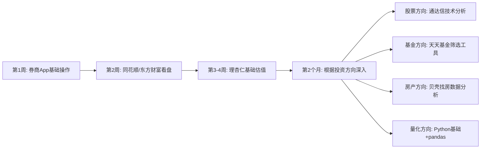

# 十四、常见问题解答

本节汇集核心技巧篇（§1-§13）学习和实操过程中最常遇到的问题。与理论基础篇的FAQ（§10）侧重"是什么"和"为什么"不同，本节聚焦"怎么做"——当你真正动手使用工具时，哪些地方容易卡住、哪些操作容易出错、哪些细节容易忽略。每个问题都给出具体的操作步骤和解决方案，而非泛泛而谈。

> **阅读方式**：本节按投资品种和工具类型分组，你可以直接跳转到与自己相关的板块。建议先浏览目录，找到与当前痛点最匹配的问题精读。

## 一、股票工具使用高频问题

### Q1：同花顺和通达信能不能同时安装？数据会冲突吗？

**可以同时安装，数据不会冲突。** 两个软件各自独立运行，行情数据分别从各自的服务器获取，互不干扰。实际上，很多职业投资者同时使用两者：通达信做技术分析（自编公式功能最强），同花顺做交易执行和资讯阅读（券商接入最全、条件单功能好用）。

**同时使用的配置建议**：

| 用途 | 推荐工具 | 原因 |
|------|----------|------|
| 技术分析、选股公式 | 通达信 | 自编公式语法最完善，运行速度最快 |
| 日常看盘、资讯阅读 | 同花顺 | 界面友好，资讯聚合全面 |
| 交易下单 | 券商App | 直连交易系统，延迟最低 |
| 基本面研究 | 理杏仁网页版 | 估值数据可视化最强 |

**注意事项**：如果你的券商同时支持同花顺和通达信下单，建议只在一个软件中绑定交易账户，避免两个软件同时登录同一券商账户时出现互踢（部分券商会限制同一账户的并发登录数）。

### Q2：Level 2行情到底值不值得买？

**对大多数个人投资者来说，不值得。** Level 2行情的核心增量信息是十档买卖挂单和逐笔成交数据。这些数据在以下场景中有实际价值：

- **打板策略**（追涨停板）：需要看涨停价位的封单量变化
- **T+0日内回转交易**：需要实时感知买卖盘力量对比
- **高频量化策略**：需要逐笔成交数据做微观结构分析

对于中长线投资者（持有周期超过1周），Level 2的增量信息对决策几乎没有帮助。30元/月（约360元/年）的费用虽然不高，但如果你的投资本金只有5万元，这笔费用相当于0.72%的年化损耗——比很多基金的管理费还高。

**判断标准**：如果你不能明确说出"我需要Level 2数据来执行XX具体策略"，那你就不需要它。免费的Level 1行情对95%的个人投资者完全够用。

### Q3：通达信自编公式总是写错，有没有快速入门的方法？

通达信公式语言的语法接近Excel函数，入门门槛并不高。以下是最快上手的学习路径：

**第一步：掌握5个核心函数**（覆盖80%的常用场景）

```text
MA(X, N)     -- N日移动平均，如 MA(CLOSE, 20) 表示20日均线
CROSS(A, B)  -- A上穿B，如 CROSS(MA5, MA20) 表示5日线上穿20日线
REF(X, N)    -- N日前的值，如 REF(CLOSE, 1) 表示昨日收盘价
HHV(X, N)    -- N日内最高值，如 HHV(HIGH, 60) 表示60日内最高价
COUNT(X, N)  -- N日内满足条件X的天数
```

**第二步：从"改公式"开始，不要从"写公式"开始**

通达信自带了大量系统公式。打开"功能→公式系统→公式管理器"，找到一个接近你需求的系统公式，复制到自定义区域，然后逐行修改参数。比如把MA(CLOSE, 5)改成MA(CLOSE, 10)，观察效果变化。改10个公式比从零写1个公式学到的东西更多。

**第三步：善用公式测试功能**

在公式编辑器中点击"测试公式"按钮，系统会自动检查语法错误并给出提示。常见的错误包括：中文标点符号混入（必须用英文标点）、变量名与系统函数重名、缺少分号结尾。

**第四步：建立公式笔记**

把你写过的每一个公式记录在笔记本中，标注用途、参数含义和测试结果。三个月后你会发现，大部分新需求都可以通过组合已有公式快速实现。

### Q4：理杏仁免费版和付费版差距大吗？什么时候该升级？

**免费版已经能满足60%的基本面分析需求。** 免费版提供近3年的PE/PB历史走势图和基础财务数据，对于初学者建立估值概念完全够用。

**需要升级付费版（约199元/年）的明确信号**：

1. 你需要查看5年以上的估值历史——判断一只股票当前估值处于长期历史的什么位置，3年数据太短，容易被短期极端值误导
2. 你需要做行业横向对比——同时比较5家以上同行业公司的关键指标，免费版有对比数量限制
3. 你需要杜邦分析拆解——将ROE拆解为净利率×资产周转率×权益乘数，理解ROE的驱动来源
4. 你需要指数估值数据——用于指数基金定投的估值判断（如沪深300当前PE分位是多少）

**不需要升级的情况**：如果你主要投资指数基金而非个股，天天基金App的指数估值功能可以部分替代理杏仁。如果你的投资周期在1年以上且不频繁调仓，免费版的3年数据窗口足够做出买入/持有/卖出的判断。

### Q5：i问财的自然语言选股结果可以直接用来买股票吗？

**绝对不可以。** i问财是一个**筛选工具**，不是**决策工具**。它的作用是从4000多只A股中帮你快速缩小候选范围，但筛选结果只是"通过了量化条件的名单"，不等于"值得买入的股票"。

i问财筛选结果的三个致命局限：

1. **基于历史数据**：筛选条件如"连续3年ROE>15%"描述的是过去，不能保证未来。公司可能在第四年业绩变脸
2. **忽略定性因素**：管理层能力、行业竞争格局、技术壁垒、政策风险等因素无法通过财务指标量化
3. **存在幸存者偏差**：你设定的条件恰好匹配了过去几年表现好的股票，但这些股票的高ROE可能是周期性的（如周期股在景气顶点时ROE极高）

**正确使用方式**：把i问财当作"第一步"——用它生成候选名单（通常筛选出20-50只）。然后对每只候选股票进行人工深度分析：阅读最近3年的年报、了解公司的商业模式和竞争优势、判断行业前景。最终从50只候选中精选3-5只纳入投资组合。

## 二、基金工具使用高频问题

### Q6：A类份额和C类份额到底怎么选？

这是基金投资中最实用但最容易被忽略的问题。核心原则只有一条：**持有时间决定份额类型。**

| 持有时间 | 推荐份额 | 原因 |
|----------|----------|------|
| < 7天 | 都不推荐 | 赎回费率高达1.5%，短线交易基金成本极高 |
| 7天-30天 | A类或C类差异不大 | A类申购费已打折，C类有销售服务费但按天计算 |
| 30天-1年 | C类 | C类无申购费，销售服务费（约0.4%/年）按天计提，短期持有更划算 |
| 1年以上 | A类 | A类申购费一次性支付（1折后约0.12%-0.15%），长期持有后摊薄成本远低于C类的持续销售服务费 |

**临界点计算公式**：

```text
A类总费率 = 申购费（1折后） + 赎回费（随持有时间递减）
C类总费率 = 销售服务费 × 持有天数/365 + 赎回费

当 A类总费率 < C类总费率 时选A类，反之选C类
```

**实操示例**：某基金A类申购费1折后0.12%，持有超过1年赎回费为0；C类销售服务费0.4%/年，持有超过30天赎回费为0。临界点 = 0.12% ÷ 0.4% = 0.3年 ≈ 4个月。即持有超过4个月选A类更划算。

**快速判断**：如果你是定投（每月买入、长期持有），选A类。如果你是短期择时（计划几个月内卖出），选C类。如果你不确定持有时间，选A类——因为A类的长期成本确定性更高。

### Q7：天天基金、蚂蚁财富、蛋卷基金，到底用哪个？

三个平台的基金申购费率都是1折起，核心差异在于功能侧重：

| 你的需求 | 最佳选择 | 原因 |
|----------|----------|------|
| 自己研究选基金 | 天天基金 | 数据工具最全面：基金筛选器支持20+维度、持仓分析、业绩归因、经理评价 |
| 追求操作便捷 | 蚂蚁财富 | 支付宝内置，无需额外开户，界面简洁 |
| 喜欢组合一键配置 | 蛋卷基金 | 提供现成的资产配置组合，一键买入 |
| 想跟投专业策略 | 且慢 | 盈米基金旗下，策略跟投功能成熟 |
| 主要买指数基金 | 任意平台均可 | 指数基金的跟踪误差很小，平台差异影响不大 |

**不建议频繁跨平台操作**：在多个平台分散购买基金会增加管理复杂度。建议选定一个主平台，把所有基金集中在同一平台上管理。跨平台转移基金（转托管）流程繁琐且耗时（通常需要3-7个工作日），所以一开始就选好主平台很重要。

### Q8：基金定投应该设在每周几？每月几号？

**从统计数据看，周几/几号定投对长期收益的影响微乎其微。** 多项回测研究表明，按日、按周、按月定投在3年以上的持有周期中，年化收益差异不超过0.3%。这说明定投的核心价值在于"纪律性"和"平均成本效应"，而非"择时"。

**但有两个实操建议**：

1. **避开月初和月末**：大量定投计划设定在每月1号或月底，这两天的交易量集中可能导致基金净值确认稍有延迟。选月中（如每月15号）更稳妥
2. **发工资后第二天定投**：确保银行账户有足够余额。定投扣款失败不仅影响投资纪律，部分平台连续失败3次会自动终止定投计划

**智能定投是否值得用？** 天天基金和蚂蚁财富都提供"智能定投"功能（基于均线偏离法或估值法动态调整定投金额）。回测数据显示，智能定投在震荡市中比普通定投收益高5%-15%，但在单边牛市中反而可能跑输普通定投（因为牛市中估值持续偏高，智能定投会持续减少投入）。如果你是长期投资者（5年以上），普通定投足够；如果你愿意花时间理解估值，手动智能定投效果更好。

### Q9：基金赎回时"先进先出"和"后进先出"有什么区别？

基金赎回遵循"先进先出"原则，即你最早买入的份额最先被赎回。这个规则在实际操作中有两个重要影响：

**影响一：赎回费率取决于持有时间**

因为先进先出，你赎回的份额对应的持有时间是从最早买入日开始计算的。假设你6个月前开始定投，每月买入1000元，现在想赎回5000元——赎回的是6个月前的第一笔（30天以上费率较低）和后面几笔的组合，整体赎回费率按各笔分别计算。

**影响二：定投后的赎回需要计算**

如果你定投了2年，现在想赎回一半——被赎回的份额是最早12个月买入的部分。这些份额持有超过2年，赎回费通常为0。但如果定投只有6个月就想赎回一半，最早买入的份额持有不足1年，赎回费会较高。

**实操建议**：赎回前在基金平台的"持有明细"中查看每笔买入的持有时间和对应赎回费率。优先赎回持有时间最长、赎回费率最低的份额。如果平台支持"指定份额赎回"（部分平台支持），可以精确选择赎回哪些份额。

## 三、房产工具使用高频问题

### Q10：贝壳找房上的挂牌价和真实成交价差距有多大？

**通常差距在5%-15%之间，市场低迷期差距更大。** 贝壳找房的"成交价"功能（在小区详情页中可以查看历史成交记录）是最有参考价值的数据。挂牌价受卖家心理预期影响，波动很大；成交价才是市场真实出清价格。

**使用贝壳找房的三个关键技巧**：

1. **看"近90天成交"而非"在售房源"**：在售房源反映的是卖家预期，成交数据反映的是市场真实价格。两者差距越大，说明卖方市场越弱，议价空间越大
2. **关注"带看量"和"成交周期"**：带看量高但成交周期长的房子，说明买家看过后普遍觉得不值。成交周期超过90天的房源，通常有明显的价格或条件问题
3. **用"同户型历史成交"做价格锚定**：在贝壳的小区详情页中筛选同户型的历史成交记录，按时间排序，观察价格趋势。如果最近3个月同户型成交价持续走低，当前挂牌价大概率需要下调

### Q11：房贷选等额本息还是等额本金？用什么工具算？

**先回答核心问题**：等额本息每月还款金额固定，前期利息占比高、本金占比低；等额本金每月还款金额递减，前期还款压力大但总利息少。

| 维度 | 等额本息 | 等额本金 |
|------|----------|----------|
| 月供特点 | 每月相同 | 逐月递减 |
| 总利息 | 较高 | 较低（约少10%-20%） |
| 前期压力 | 较小 | 较大 |
| 适合人群 | 收入稳定、前期资金紧张 | 收入较高、希望少付利息 |

**推荐工具**：

- **最便捷**：贝壳找房App内置房贷计算器，输入总价、首付比例、利率即可自动计算两种方案的月供和总利息
- **最全面**：各大银行官网的房贷计算器（如工商银行、建设银行），支持公积金+商贷组合计算
- **最灵活**：Excel自制房贷计算表，可以用PMT函数（`=PMT(月利率, 还款月数, 贷款金额)`）精确计算

**一个重要提醒**：2024年以来LPR（贷款市场报价利率）持续下行，如果你是浮动利率贷款，每年1月1日会根据最新LPR调整月供。用房贷计算器时，不要用当前利率计算未来30年的总利息——利率是会变的。更务实的做法是计算"利率不变时的总利息"作为上限参考。

## 四、加密货币工具使用高频问题

### Q12：CEX和DEX应该用哪个？

**新手用CEX（中心化交易所），进阶用户配合DEX。**

| 维度 | CEX（Binance/OKX/Coinbase） | DEX（Uniswap/dYdX） |
|------|---------------------------|---------------------|
| 易用性 | 类似股票App，界面友好 | 需要连接钱包，操作门槛高 |
| 资产种类 | 主流币种为主 | 包含大量新币、小币种 |
| 交易速度 | 秒级成交 | 受区块链确认速度影响，几秒到几分钟 |
| 安全性 | 资产由交易所托管（有被盗风险） | 资产在自己钱包中（有私钥丢失风险） |
| 费用 | 交易手续费0.05%-0.1% | Gas费（网络拥堵时可能很高）+ 交易手续费 |
| 监管 | 受各国金融监管 | 去中心化，监管覆盖有限 |
| KYC | 需要身份验证 | 通常不需要 |

**核心原则**：交易所只是"通道"，不是"银行"。无论用CEX还是DEX，大额资产（超过总资产的20%）都应该转移到自己的钱包中。2022年FTX暴雷事件的教训是：交易所的"余额"只是一个数字，只有在你自己的钱包里的资产才是真正属于你的。

### Q13：硬件钱包有必要买吗？怎么选？

**如果你的加密货币资产超过5万元人民币，强烈建议购买硬件钱包。** 硬件钱包将私钥存储在离线设备中，即使电脑被黑客入侵，私钥也不会泄露。

| 硬件钱包 | 价格 | 支持币种 | 特点 |
|----------|------|----------|------|
| Ledger Nano S Plus | 约500元 | 5500+ | 性价比最高，适合入门 |
| Ledger Nano X | 约1000元 | 5500+ | 支持蓝牙，可连手机 |
| Trezor Model One | 约400元 | 1000+ | 开源固件，安全透明 |
| Trezor Model T | 约1500元 | 1000+ | 触摸屏操作，体验更好 |

**购买注意事项**：

1. **只从官网购买**：不要在淘宝、闲鱼等第三方渠道购买，存在被篡改固件的风险
2. **收到后检查包装**：确保封条完好、设备未被初始化。如果设备已经预设了助记词，100%是骗局
3. **助记词用金属板刻录**：不要存在手机备忘录、电脑文件或云盘中。金属板（如Cryptosteel）防火防水，比纸质记录可靠得多
4. **分散存储助记词**：将24个助记词分成3组（每组8个），分别存放在3个不同地点。即使一处被盗或损毁，资产仍然安全

## 五、量化交易高频问题

### Q14：完全不会编程，能学量化交易吗？

**能，但需要做好3-6个月的学习准备。** 量化交易的编程门槛没有想象中那么高。你需要掌握的不是"软件工程"级别的编程能力，而是"数据处理脚本"级别的Python基础。

**最低学习路径**（按优先级排序）：

| 阶段 | 学习内容 | 所需时间 | 能做到的事 |
|------|----------|----------|-----------|
| 第1阶段 | Python基础语法、pandas数据处理 | 4-6周 | 读取CSV数据、计算均线、筛选条件 |
| 第2阶段 | matplotlib可视化、基本统计 | 2-3周 | 画K线图、计算收益率和波动率 |
| 第3阶段 | 回测框架（backtrader或聚宽） | 4-6周 | 编写简单策略、回测历史表现 |
| 第4阶段 | 实盘接口（券商API） | 2-4周 | 小资金实盘运行策略 |

**如果编程确实学不会的替代方案**：

1. **聚宽/米筐的可视化策略编辑器**：部分平台提供拖拽式策略构建，无需写代码
2. **Excel量化**：用Excel的IF/VLOOKUP等函数可以实现简单的条件选股和回测
3. **条件单功能**：券商App的条件单可以实现"股价跌破XX元自动卖出"等简单规则，不需要编程
4. **跟投量化基金**：直接购买量化策略公募基金（如华泰柏瑞量化增强），让专业团队帮你做量化

### Q15：回测年化收益50%的策略，实盘能赚多少？

**通常只有10%-20%，甚至亏损。** 回测收益与实盘收益之间存在系统性差距，原因如下：

| 差距来源 | 说明 | 影响幅度 |
|----------|------|----------|
| 交易成本 | 回测中常忽略佣金、印花税、滑点 | 减少5%-15% |
| 过度拟合 | 策略参数恰好匹配历史数据的噪声 | 可能导致实盘完全失效 |
| 幸存者偏差 | 回测使用的股票池不包含已退市的股票 | 高估3%-10% |
| 流动性限制 | 小盘股在实盘中无法以回测价格成交 | 高估5%-20% |
| 市场冲击 | 大资金交易会推动价格变化 | 资金越大影响越大 |

**验证策略可靠性的三个方法**：

1. **样本外测试**：用2015-2020年数据训练策略，用2021-2024年数据验证。如果样本外收益接近样本内收益的60%以上，策略有一定可靠性
2. **加入交易成本**：回测时设置佣金万分之三、印花税千分之一（卖出）、滑点千分之一。如果扣除成本后仍然盈利，策略才有实盘价值
3. **模拟盘运行至少3个月**：在聚宽/米筐的模拟盘上运行策略，观察实际信号和收益曲线是否与回测一致

### Q16：聚宽、米筐、优矿，选哪个做量化回测？

| 维度 | 聚宽（JoinQuant） | 米筐（RiceQuant） | 优矿（Uqer） |
|------|-------------------|-------------------|---------------|
| 免费额度 | 每天5次回测 | 每天3次回测 | 有限试用 |
| 数据质量 | A股全量+期货+基金 | A股全量+宏观 | 机构级数据 |
| 社区活跃度 | 最高，策略分享多 | 中等 | 较低 |
| 编程语言 | Python | Python | Python |
| 实盘对接 | 支持（需付费） | 支持（需付费） | 机构级 |
| 适合人群 | 入门学习、社区交流 | 快速验证想法 | 专业/机构用户 |

**建议**：入门阶段用聚宽——社区策略分享最多，遇到问题容易找到参考。快速验证一个想法用米筐——回测速度快，界面简洁。深入学习量化后在本地搭建backtrader——完全可控，不受平台限制，数据可以自由定制。

## 六、ETF/REITs/可转债工具高频问题

### Q17：ETF和普通基金有什么区别？用什么工具买？

ETF（交易型开放式指数基金）和普通开放式基金的核心区别在于交易方式：

| 维度 | ETF（场内） | 普通开放式基金（场外） |
|------|------------|----------------------|
| 交易方式 | 像股票一样实时买卖 | 按当日收盘净值申购/赎回 |
| 交易费用 | 券商佣金（万1-万3） | 申购费（1折后约0.12%-0.15%） |
| 最低金额 | 1手=100份（通常几十到几百元） | 通常10元起 |
| 到账时间 | T+1（卖出后次日可取） | T+3到T+7（赎回后到账慢） |
| 定投 | 不支持自动定投（需手动操作） | 支持自动定投 |
| 跟踪误差 | 较小（直接在交易所买卖） | 略大（需要应对申赎的现金拖累） |

**购买工具**：

- **场内ETF**：必须通过券商App购买，在交易页面输入ETF代码即可买卖
- **场外ETF联接基金**：天天基金、蚂蚁财富等平台均可购买，支持自动定投

**实操建议**：如果你需要定投，买场外ETF联接基金（如沪深300ETF联接A）；如果你有一笔闲钱想一次性配置，买场内ETF（费率更低、实时成交）。很多投资者采用"场外定投积累 + 场内择时补仓"的组合策略。

### Q18：集思录上的可转债数据怎么看？

集思录（jisilu.cn）是可转债投资者最核心的工具网站。以下是关键指标的解读：

| 指标 | 含义 | 使用方法 |
|------|------|----------|
| 转股价值 | 可转债转换成股票后的价值 | 转股价值 > 转债价格 → 有转股套利空间 |
| 转股溢价率 | 转债价格相对转股价值的溢价程度 | 溢价率越低，转债的"股性"越强 |
| 纯债价值 | 如果不转股，作为债券的价值 | 纯债价值是转债价格的"安全垫" |
| 到期收益率 | 按当前价格买入并持有到期的年化收益率 | 到期收益率为正 → 下跌空间有限 |
| 双低值 | 转债价格 + 转股溢价率×100 | 双低值 < 130 的转债通常性价比较高 |

**入门策略**：在集思录中按"双低值"排序，筛选双低值 < 130、到期收益率为正、剩余规模 > 1亿元的可转债。这个筛选条件选出的标的通常"下有保底（到期收益率为正）、上不封顶（正股上涨时转债跟随上涨）"。但要注意：信用评级低于AA的可转债存在违约风险，新手建议只选AA及以上评级。

## 七、组合管理工具高频问题

### Q19：用Excel管理投资组合，应该记录哪些字段？

一个实用的投资组合管理表格至少需要以下字段：

| 字段 | 说明 | 示例 |
|------|------|------|
| 资产类别 | 股票/基金/债券/现金/其他 | 股票 |
| 标的代码 | 交易代码 | 600519.SH |
| 标的名称 | 全称 | 贵州茅台 |
| 买入日期 | 首次买入日期 | 2025-01-15 |
| 买入均价 | 加权平均成本 | 1680.00 |
| 持有数量 | 当前持有份额/股数 | 100 |
| 当前价格 | 最新价格（定期更新） | 1750.00 |
| 持仓市值 | =持有数量×当前价格 | 175,000 |
| 浮动盈亏 | =持仓市值-买入均价×持有数量 | 7,000 |
| 盈亏比例 | =浮动盈亏/(买入均价×持有数量) | 4.17% |
| 占比 | =持仓市值/总市值 | 15.2% |
| 止损价 | 预设止损价位 | 1500.00 |
| 止盈价 | 预设止盈价位 | 2000.00 |
| 备注 | 买入逻辑、持有观察点 | 高端白酒龙头，关注批价走势 |

**进阶字段**（适合有经验的投资者增加）：

- 行业分类：用于分析行业集中度
- 预期持有周期：短/中/长
- 下次关注事件：如财报发布日、分红除权日
- 最近一次操作：买入/卖出/加仓/减仓及日期

**更新频率建议**：当前价格可以每周更新一次（不需要每天，避免过度关注短期波动）。每月做一次完整的持仓复盘，检查各标的的占比是否偏离目标配置。

### Q20：投资组合需要多久做一次再平衡？

**建议每半年做一次再平衡，或者在某类资产占比偏离目标超过5个百分点时触发。**

再平衡的本质是"卖高买低"——卖出涨得多的资产、买入跌得多的资产，让组合回到目标配置比例。这个操作天然具有"逆人性"的特点，但长期来看能提升1%-2%的年化收益。

**再平衡的三种方式**：

1. **定期再平衡**：每半年或每年固定日期执行一次。简单机械，适合大多数人
2. **阈值再平衡**：当某类资产占比偏离目标超过5%时触发。更灵活，但需要持续监控
3. **现金流再平衡**：不主动卖出，而是将新增资金（工资结余、分红收入）投入到占比偏低的资产中。没有卖出成本，但需要持续有新增资金

**工具选择**：

- **最简单**：Excel手动计算各资产占比，与目标比例对比，手动操作
- **半自动**：且慢App的"策略跟投"功能可以自动提示再平衡信号
- **全自动**：部分智能投顾平台（如支付宝的"帮你投"）提供自动再平衡服务

## 八、信息获取与工具安全高频问题

### Q21：每天应该花多少时间看盘和获取信息？

**根据投资风格给出具体建议**：

| 投资风格 | 建议看盘时间 | 信息获取方式 | 每日总时间 |
|----------|-------------|-------------|-----------|
| 长期价值投资 | 不需要盯盘 | 每周读1-2篇深度研报 | 30分钟/天 |
| 中线波段（持有1-4周） | 开盘/收盘各看15分钟 | 关注行业新闻和资金流向 | 1小时/天 |
| 短线交易 | 盘中持续关注 | 实时新闻+盘口数据 | 4小时+（全职） |
| 基金定投 | 完全不需要看盘 | 每月花30分钟检查定投执行情况 | 5分钟/天 |

**信息过载的危害**：行为金融学研究表明，频繁查看账户和行情会增加"短视损失厌恶"——看到短期亏损时焦虑，导致非理性卖出。Terrance Odean的研究发现，交易越频繁的投资者，净收益越低。对于长线投资者来说，每天看一次行情的频率已经过高了。

**推荐的信息获取节奏**：

- **每天**：浏览一次财经新闻标题（5分钟），只关注与自己持仓相关的重大事件
- **每周**：花1小时阅读1-2篇持仓相关的深度分析
- **每月**：花2小时做持仓复盘，检查基本面是否发生变化
- **每季度**：在财报季阅读持仓公司的季报，验证投资逻辑是否仍然成立

### Q22：投资平台的账户密码怎么管理最安全？

**核心原则：一个平台一个密码，用密码管理器自动生成和存储。**

| 安全措施 | 具体操作 | 优先级 |
|----------|----------|--------|
| 密码管理器 | 使用1Password或Bitwarden，为每个投资平台生成不同的16位随机密码 | ★★★★★ |
| 二次验证（2FA） | 所有投资平台开启Google Authenticator或Authy的TOTP验证 | ★★★★★ |
| 不用短信验证 | 短信验证码可被SIM卡劫持攻击截获（SIM Swap），安全性远低于TOTP | ★★★★☆ |
| 设备隔离 | 投资操作只在专用设备上进行，不安装来路不明的软件 | ★★★★☆ |
| 网络安全 | 不在公共WiFi下进行交易操作 | ★★★☆☆ |

**一个常见但危险的习惯**：很多人所有投资平台使用同一个密码，或者用"平台名+生日"的简单规律生成密码。2023年某券商发生数据泄露事件后，大量使用相同密码的投资者在其他平台也遭到"撞库"攻击。密码管理器是目前最安全也最方便的解决方案——你只需要记住一个主密码，其余所有密码由管理器自动生成和填充。

### Q23：条件单在极端行情中会失效吗？

**会。条件单不是万能的，以下场景中条件单可能无法按预期执行**：

| 极端场景 | 条件单表现 | 应对方案 |
|----------|-----------|----------|
| 连续跌停 | 触发卖出但无法成交（没有买盘） | 无完美方案，只能等待跌停板打开 |
| 涨停开盘 | 触发买入但无法成交（没有卖盘） | 设置"涨停价买入"条件单排队等待 |
| 停牌 | 条件单长期挂起不触发 | 定期检查条件单状态，停牌后手动管理 |
| 券商系统故障 | 条件单触发但信号未发送到交易所 | 开通两个券商账户，关键条件单设置备份 |
| 集合竞价异常 | 价格瞬间穿透条件单价位但未成交 | 在条件单中设置"对手价"而非"限价" |

**实操建议**：

1. 不要把所有风险控制都寄托在条件单上。条件单是"最后一道防线"，你的"第一道防线"应该是仓位管理——永远不要把全部资金集中在一只股票上
2. 关键止损位的条件单设置后，同时在手机日历中设置提醒，每周检查一次条件单是否仍在有效状态
3. 部分券商的条件单有效期最长为30天或90天，到期需要手动续期。到期未续期的条件单不会自动恢复

## 九、工具学习路径高频问题

### Q24：新手应该先学哪个工具？

**第一步永远是券商App**。理由很简单：券商App是你投资操作的"终端"——所有分析最终都要通过券商App执行买入/卖出。先熟悉下单操作、资金转入转出、持仓查看等基础功能，建立对投资操作的"体感"。

**推荐的学习顺序**：



**关键原则**：每个工具学到"能解决当前问题"的程度就够了，不要追求一步到位。用20%的学习时间掌握80%的常用功能，剩余的高级功能在实际使用中逐步学习。

### Q25：工具太多管不过来怎么办？

**执行"工具审计"，精简到5个以内。**

具体操作步骤：

1. **列出你当前使用的所有投资工具**（包括App、网站、Excel表格）
2. **标注过去30天每个工具的使用次数**
3. **按使用频率排序，保留前5个，其余全部停用**

通常保留的5个工具是：

| 序号 | 角色 | 典型工具 | 使用频率 |
|------|------|----------|----------|
| 1 | 交易执行 | 券商App | 每次交易时 |
| 2 | 行情查看 | 同花顺/东方财富 | 每天 |
| 3 | 深度分析 | 理杏仁/晨星网 | 每周 |
| 4 | 信息获取 | 雪球/财联社 | 每天浏览 |
| 5 | 记录管理 | Excel/Notion | 每月复盘 |

超过5个工具时，你会花大量时间在"切换工具"而非"使用工具"上。精简工具不是降低标准，而是提高效率——把有限的精力集中在少数工具的深度使用上，效果远好于在多个工具间浅尝辄止。

## 本节总结

本节覆盖了核心技巧篇（§1-§13）实操中最常遇到的25个问题。以下是按优先级排列的关键要点：

| 优先级 | 问题 | 核心结论 |
|--------|------|----------|
| ★★★★★ | A类vs C类份额（Q6） | 持有超1年选A类，不足1年选C类 |
| ★★★★★ | 账户安全（Q22） | 密码管理器+TOTP二次验证，不用短信验证 |
| ★★★★★ | 回测vs实盘收益差距（Q15） | 回测50%→实盘10%-20%，务必做样本外验证 |
| ★★★★☆ | Level 2是否值得买（Q2） | 95%的个人投资者不需要 |
| ★★★★☆ | 条件单的局限性（Q23） | 极端行情可能失效，不能替代仓位管理 |
| ★★★★☆ | 工具精简（Q25） | 核心工具不超过5个，宁少勿多 |
| ★★★☆☆ | 看盘时间（Q21） | 长线投资者每天30分钟足矣，频繁看盘有害 |
| ★★★☆☆ | 量化入门（Q14） | 不会编程也能做量化，但需3-6个月准备 |
| ★★★☆☆ | 再平衡频率（Q20） | 每半年一次，或偏离目标超5%时触发 |

**最后的建议**：工具问题是"术"层面的问题，永远不要让工具焦虑影响你的投资心态。一个用免费工具但投资逻辑清晰的人，长期收益一定优于一个订阅了所有付费工具但投资逻辑混乱的人。先建立正确的投资认知框架（道），再选择合适的工具（器），这才是正确的顺序。
