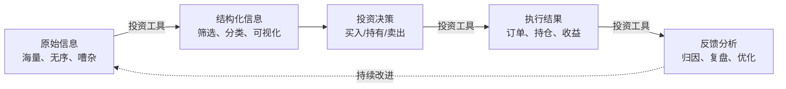
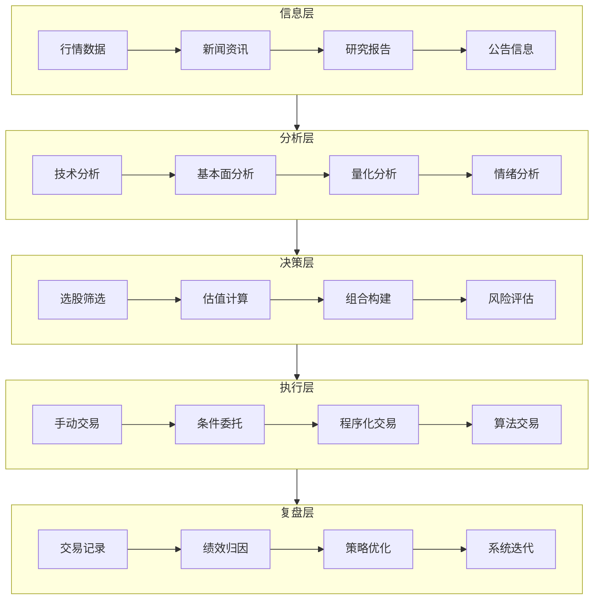
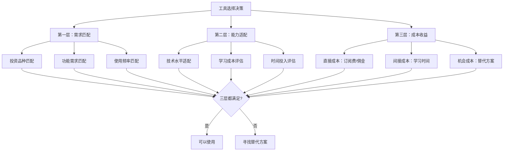
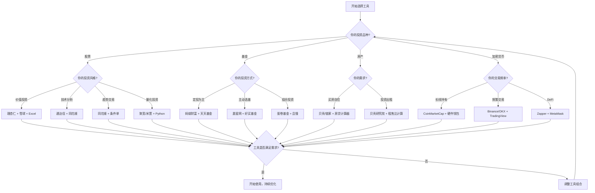
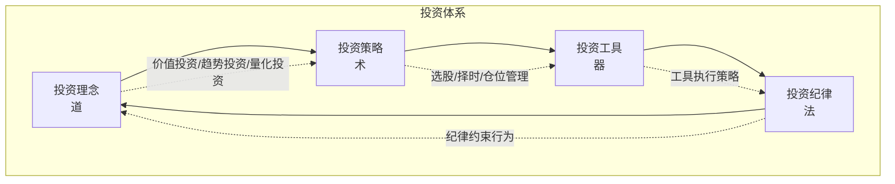

## 一、投资工具的本质

> 工具是人类能力的延伸。投资工具，则是投资者认知能力、信息处理能力和执行能力的系统性延伸。

很多投资者对工具的态度呈现两极分化：一极是"工具无用论"——认为投资靠的是眼光和心态，工具不过是花架子；另一极是"工具万能论"——不断追逐最新的量化平台、AI选股系统，仿佛换一个工具就能扭转亏损。两种观点都误解了投资工具的本质。

要真正用好投资工具，首先要理解它是什么、为什么存在、如何与投资者的认知和决策过程协同工作。

### 1.1 投资工具的定义与本质

#### 1.1.1 什么是投资工具

投资工具是指**辅助投资者完成信息收集、分析研判、交易执行和风险管理等环节的软件、平台、系统和方法论的总称**。它不仅包括我们日常使用的行情软件和交易平台，还涵盖数据分析模型、决策框架、自动化脚本，甚至一张精心设计的Excel表格。

从系统论的角度看，投资工具在投资系统中扮演的是**"放大器"和"过滤器"的双重角色**：

- **放大器**：将投资者的分析能力放大——一个人不可能同时跟踪3000只A股的财务数据，但借助工具可以做到
- **过滤器**：将海量信息中的噪音过滤掉——市场每天产生数万条新闻，工具帮助你只看到与持仓相关的那20条

#### 1.1.2 工具与投资者的关系：延伸而非替代

这是理解投资工具最关键的一点：**工具延伸能力，但不替代判断**。

一个类比：望远镜延伸了天文学家的视力，但不能替代天文学家对天体运行规律的理解。同样，最好的行情软件也不能替代你对市场本质的理解。

这个关系可以用一个公式表达：

> **投资决策质量 = 投资者认知 × 工具效能**

两者是乘法关系，不是加法关系。这意味着：
- 认知为零，工具效能再高，结果也是零（不会用工具的人，给他彭博终端也没用）
- 工具为零，认知再高，效率极低（纯手工分析3000家公司是不现实的）
- 两者都提升，效果是指数级的

#### 1.1.3 投资工具的四个本质属性

| 属性 | 含义 | 举例 |
|------|------|------|
| **信息压缩** | 将海量数据压缩为可理解的信号 | K线图将一天的交易压缩为一个蜡烛图 |
| **模式识别辅助** | 帮助人类发现肉眼难以察觉的模式 | 均线金叉/死叉、财务异常检测 |
| **执行标准化** | 将决策过程标准化，减少情绪干扰 | 条件单自动止损、定投自动执行 |
| **认知外化** | 将投资逻辑外化为可复用的系统 | 量化策略、投资清单、检查表 |

### 1.2 为什么需要投资工具

#### 1.2.1 信息不对称：投资者面临的核心困境

金融市场本质上是一个**信息不对称**的博弈场。专业机构拥有 Bloomberg Terminal（年费约2万美元）、Wind金融终端（年费数万人民币）、数十人的研究团队，而个人投资者通常只有一部手机。

这种不对称体现在四个层面：

**1. 信息获取的不对称**

机构投资者在上市公司公布财报的第一时间就能完成数据解析，而个人投资者可能要等到第二天才能在财经App上看到简化版数据。在高频交易领域，这种时间差甚至以微秒计算——光是交易所的物理距离就能决定谁先获得价格信息。

**2. 信息处理能力的不对称**

一家对冲基金的分析师团队可以在一周内深度研究50家公司的财报，建立复杂的财务模型。个人投资者要达到同样的分析深度，可能需要几个月。

**3. 信息解读能力的不对称**

同一条新闻"央行下调存款准备金率0.5个百分点"，专业投资者能在几秒内判断这对银行股、地产股、债券市场的不同影响，而新手投资者可能完全不理解这意味着什么。

**4. 执行能力的不对称**

机构可以同时在多个市场、多个品种之间进行套利交易，个人投资者通常只能在单一市场手动操作。

**投资工具的核心价值，就是在这四个层面帮助个人投资者缩小与机构的差距。**

#### 1.2.2 认知偏差：人脑不是为投资设计的

行为金融学的研究已经充分证明，人类大脑在投资决策中存在系统性的认知偏差。这些偏差不是"不聪明"导致的，而是数百万年进化形成的本能反应，在原始环境中有利于生存，但在金融市场中会导致持续亏损。

| 认知偏差 | 表现 | 工具如何纠正 |
|----------|------|-------------|
| **损失厌恶** | 亏损100元的痛苦是盈利100元快乐的2.5倍 | 自动止损单，不给你犹豫的机会 |
| **锚定效应** | 买入价成为"锚"，影响后续判断 | 工具显示的是当前价值，不是买入成本 |
| **确认偏差** | 只关注支持自己观点的信息 | 多空双向分析工具，强制看反面观点 |
| **过度自信** | 高估自己的判断准确率 | 交易记录工具显示真实胜率 |
| **处置效应** | 过早卖出盈利股，过久持有亏损股 | 组合分析工具显示持仓盈亏分布 |
| **从众心理** | 看到别人赚钱就跟风 | 独立分析工具，减少社交噪音 |
| **近因偏差** | 过度关注近期事件，忽视长期趋势 | 长周期数据图表，拉长视角 |

以**损失厌恶**为例：假设你持有的一只股票已经下跌了15%，按照你的止损规则应该卖出。但你的大脑会告诉你"再等等，也许会涨回来"——这是损失厌恶在起作用。如果你设置了自动止损单，系统会在触发条件时自动执行，完全绕过了你的情绪决策。

#### 1.2.3 没有工具的投资：一个思想实验

想象一下完全不使用任何投资工具的场景：

**场景一：选股**

你需要从A股3000多家上市公司中选择投资标的。没有工具的话，你需要：
- 手动翻阅每家公司的年报（每份50-200页）
- 手动计算市盈率、市净率、ROE等指标
- 手动对比同行业公司的财务数据
- 仅这一步，保守估计需要数年时间

**场景二：盯盘**

你持有多只股票，需要关注它们的价格变动。没有工具的话：
- 你需要同时打开多个网页刷新价格
- 你需要自己记住每只股票的买入价和止损位
- 你需要自己计算浮盈浮亏
- 任何一只股票的异动都可能被你错过

**场景三：复盘**

你需要回顾过去一年的投资表现。没有工具的话：
- 你需要从交易记录中手动计算每笔交易的盈亏
- 你需要自己计算年化收益率
- 你需要自己分析哪些决策是正确的、哪些是错误的
- 数据量大的时候，错误几乎不可避免

**结论很明确：现代投资已经不可能脱离工具进行。问题不是"要不要用工具"，而是"如何选择和使用工具"。**

### 1.3 投资工具的分类体系

投资工具可以从多个维度进行分类。理解分类体系有助于你建立全局视角，知道自己需要哪些类型的工具。

#### 1.3.1 按功能环节分类

投资是一个完整的工作流，工具覆盖了工作流的每个环节：

| 环节 | 核心任务 | 代表工具 | 免费方案 | 付费方案 |
|------|----------|----------|----------|----------|
| **信息收集** | 获取实时行情、新闻、公告 | 同花顺、东方财富、Wind | 同花顺免费版 | Wind终端（数万/年） |
| **分析研判** | 技术面、基本面、量化分析 | 通达信、理杏仁、聚宽 | 通达信免费版 | 理杏仁（几百/年） |
| **决策制定** | 选股、估值、组合构建 | Excel、Python、专业平台 | Excel/Google Sheets | Portfolio Visualizer |
| **交易执行** | 下单、条件单、自动化 | 券商App、QMT | 券商App | QMT（资金门槛） |
| **风险管理** | 仓位控制、止损、对冲 | 组合分析工具 | 雪球组合 | 专业风控系统 |
| **复盘优化** | 交易记录、绩效分析 | 雪球、Excel | 雪球实盘记录 | 专业归因系统 |

#### 1.3.2 按投资品种分类

不同投资品种有其特殊性，对应的工具生态也不同：

**A股投资工具生态**

| 功能 | 工具 | 特点 |
|------|------|------|
| 行情 | 同花顺、东方财富 | 免费、数据全、用户多 |
| 选股 | 通达信、i问财 | 条件选股、自然语言选股 |
| 基本面 | 理杏仁、巨潮资讯 | 财务数据标准化、可对比 |
| 社区 | 雪球、淘股吧 | 投资者交流、观点碰撞 |
| 交易 | 各券商App | 同质化严重，选费率低的 |
| 量化 | 聚宽、米筐 | Python编程、回测框架 |

**基金投资工具生态**

| 功能 | 工具 | 特点 |
|------|------|------|
| 基金筛选 | 天天基金、晨星网 | 多维度筛选、评级体系 |
| 基金分析 | 且慢、好买基金 | 持仓分析、风格归因 |
| 基金购买 | 蚂蚁财富、天天基金 | 费率优惠、定投方便 |
| 组合管理 | 蛋卷基金、且慢 | 组合投资、一键跟投 |

**加密货币投资工具生态**

| 功能 | 工具 | 特点 |
|------|------|------|
| 行情 | CoinMarketCap、CoinGecko | 全球币种行情、市值排名 |
| 链上分析 | Dune Analytics、Etherscan | 链上数据、地址追踪 |
| 交易 | Binance、OKX | 中心化交易所、流动性好 |
| DeFi | Zapper、DeBank | DeFi资产聚合、收益追踪 |
| 安全 | 硬件钱包（Ledger/Trezor） | 私钥离线存储 |

**全球资产配置工具**

| 功能 | 工具 | 特点 |
|------|------|------|
| 美股行情 | Yahoo Finance、TradingView | 免费、图表功能强大 |
| 全球数据 | Bloomberg、Refinitiv | 机构级、价格昂贵 |
| 组合分析 | Portfolio Visualizer | 回测、有效前沿分析 |
| 宏观数据 | FRED、Wind | 经济指标、利率数据 |

#### 1.3.3 按技术架构分类

| 类型 | 特点 | 优势 | 劣势 | 代表 |
|------|------|------|------|------|
| **桌面软件** | 安装在电脑上 | 功能强大、速度快 | 不便携、兼容性问题 | 通达信、Wind终端 |
| **手机App** | 移动端使用 | 随时随地、通知推送 | 屏幕小、功能受限 | 同花顺App、券商App |
| **网页版** | 浏览器访问 | 无需安装、跨平台 | 依赖网络、速度一般 | 理杏仁、聚宽 |
| **API接口** | 程序化调用 | 自动化、可编程 | 需要编程能力 | Tushare、AKShare |
| **本地部署** | 自建服务器 | 数据私有、完全可控 | 维护成本高 | 自建量化系统 |

### 1.4 工具选择的决策框架

#### 1.4.1 三层评估模型

选择投资工具不是"哪个功能多选哪个"，而是一个系统性决策。推荐使用**需求-能力-成本**三层评估模型：

**第一层：需求匹配——这个工具是否解决你的问题？**

很多投资者犯的第一个错误是"被功能吸引"而非"被需求驱动"。一个做长期价值投资的人，不需要实时盯盘功能；一个只买指数基金的人，不需要复杂的选股工具。

需求匹配的三个维度：

1. **品种匹配**：你投资的品种是否被这个工具支持？（有些工具只支持A股，不支持港股通）
2. **功能匹配**：你需要的功能是否被覆盖？（比如你需要股息率筛选，但某个选股工具没有这个字段）
3. **频率匹配**：你多久用一次？每天用的工具值得投入时间精通，一年用一次的工具简单了解即可

**第二层：能力适配——你能否有效使用这个工具？**

工具的效能 = 工具本身的能力 × 使用者的运用能力。一个功能强大但你不会用的工具，实际效能可能为零。

评估维度：

1. **技术水平**：需要编程能力吗？需要理解金融工程吗？如果需要，你是否具备或愿意学习？
2. **学习成本**：从零开始到熟练使用需要多长时间？一周？一个月？三个月？
3. **时间投入**：日常使用需要投入多少时间？如果你每天只有30分钟看盘，一个需要2小时分析的工具就不适合

**第三层：成本收益——使用这个工具的总成本是否合理？**

投资工具的成本不仅仅是订阅费：

| 成本类型 | 具体内容 | 举例 |
|----------|----------|------|
| **直接成本** | 订阅费、佣金、数据费 | 理杏仁年费几百元、Wind年费数万元 |
| **学习成本** | 学习使用工具的时间和精力 | 学习Python量化可能需要3-6个月 |
| **维护成本** | 更新、调试、故障排除的时间 | 自建量化系统的日常维护 |
| **迁移成本** | 从旧工具切换到新工具的成本 | 数据迁移、重新学习 |
| **机会成本** | 使用这个工具而放弃的其他选择 | 花时间学通达信，就没时间学TradingView |

#### 1.4.2 工具选择的四个原则

**原则一：适合原则——没有最好的工具，只有最适合的工具**

"最好的工具"是一个伪命题。一个短线交易者眼中的最佳工具，在价值投资者看来可能是多余的；一个量化分析师的必备工具，在技术分析者看来可能过于复杂。

适合原则要求你先回答三个问题：
- 我的投资风格是什么？（价值投资/成长投资/趋势交易/量化投资）
- 我的技术水平如何？（纯小白/会用Excel/会编程/专业开发者）
- 我的时间精力有多少？（全职投资/兼职投资/偶尔关注）

**原则二：效率原则——熟练使用一个工具，胜过浅尝十个工具**

"工具焦虑"是投资者的常见问题：看到别人用某个工具赚钱了，就赶紧去学；过几天又看到另一个工具，又去学。结果每个工具都只学了皮毛，没有一个能真正发挥作用。

正确的做法是：选择1-2个核心工具，深入学习，达到精通。当你能用一个工具解决80%的问题时，再考虑补充其他工具。

**原则三：成本原则——免费工具通常够用，付费要看性价比**

对于大多数个人投资者，免费工具已经能满足大部分需求：
- 看行情：同花顺免费版足够
- 选股：i问财免费版足够
- 基本面：巨潮资讯免费
- 记录：雪球免费

需要付费的场景：
- 需要更高质量的数据（如理杏仁的标准化财务数据）
- 需要自动化交易功能（如QMT，通常有资金门槛）
- 需要机构级数据（如Wind，个人投资者通常不需要）

**原则四：迭代原则——工具组合随投资能力的提升而进化**

投资工具的选择不是一劳永逸的，应该随着你投资能力的提升而迭代：

| 阶段 | 投资能力 | 工具组合 | 重点 |
|------|----------|----------|------|
| **入门期**（0-1年） | 基础概念学习 | 券商App + 雪球 | 用最简单的工具，专注学习 |
| **成长期**（1-3年） | 形成投资框架 | 同花顺 + 理杏仁 + Excel | 开始系统化分析 |
| **成熟期**（3-5年） | 有稳定策略 | 专业分析工具 + API | 提升分析效率 |
| **进阶期**（5年+） | 有成熟体系 | 自建系统 + 量化平台 | 自动化和系统化 |

#### 1.4.3 投资工具选择决策流程图

### 1.5 投资工具的演进历史

理解工具的演进历史，有助于你判断未来趋势，避免对工具产生不切实际的期望。

#### 1.5.1 四个时代

**时代一：纸质时代（1990年以前）**

投资者获取信息的主要渠道是报纸（《上海证券报》等）、电话委托交易、营业部现场看大屏幕。信息延迟以天计算，交易需要打电话给券商经纪人。

这个时代，投资工具就是一支笔、一个计算器、一本笔记本。巴菲特至今仍然坚持阅读纸质年报，这并非守旧，而是深度阅读的习惯。

**时代二：PC时代（1990-2005年）**

互联网普及带来了行情软件（钱龙、大智慧、通达信）和在线交易系统。信息延迟从天缩短到秒，个人投资者第一次能够实时看到行情。

这个时代诞生了技术分析的黄金期——K线图、均线、MACD等技术指标在PC上可以实时计算和显示。

**时代三：移动时代（2005-2020年）**

智能手机普及，投资从"坐在电脑前"变成"随时随地"。同花顺、东方财富等App成为主流。社交投资平台（雪球、微博大V）兴起，信息传播速度进一步加快。

这个时代的特点是**信息过载**——投资者不是缺信息，而是被信息淹没。工具的价值从"获取信息"转向"筛选信息"。

**时代四：智能时代（2020年至今）**

AI和大数据技术开始深度渗透投资领域。智能选股、AI研报解读、量化策略超市等新形态出现。ChatGPT等大语言模型甚至可以直接回答投资问题。

这个时代的核心挑战是**辨别信息质量**——AI生成的内容看起来很专业，但可能包含错误或偏见。工具的价值进一步转向"验证信息"。

#### 1.5.2 演进趋势

| 趋势 | 含义 | 对投资者的影响 |
|------|------|---------------|
| **数据民主化** | 以前只有机构能获取的数据，现在个人也能获取 | 信息不对称在缩小，但分析能力的差距在拉大 |
| **工具平民化** | 专业工具的价格持续下降，功能持续增强 | 个人投资者的工具水平在接近机构 |
| **决策自动化** | 越来越多的决策环节可以由工具自动完成 | 人需要做的不是执行，而是设计系统 |
| **平台生态化** | 单一工具向平台生态演进 | 工具之间的集成和数据流通变得更重要 |

### 1.6 常见误区与纠正

#### 误区一：工具越多越好

**症状**：手机上装了20个投资App，电脑上有5个行情软件，每天在不同工具之间切换，反而没有时间深入分析。

**纠正**：工具在精不在多。建议的核心组合是**2-3个核心工具 + 若干辅助工具**。核心工具是你每天使用的、功能覆盖最全的；辅助工具是在特定场景下补充核心工具不足的。

**推荐的核心组合模式**：

| 投资风格 | 核心工具 | 辅助工具 |
|----------|----------|----------|
| 价值投资 | 理杏仁 + Excel | 雪球（社区）+ 巨潮资讯（公告） |
| 技术分析 | 通达信 + 同花顺 | TradingView（全球） |
| 基金定投 | 蚂蚁财富 + 天天基金 | 晨星网（筛选）|
| 量化投资 | Python + 聚宽 | AKShare（数据）+ Wind（宏观） |

#### 误区二：付费工具一定比免费工具好

**症状**：花了大价钱订阅Wind终端，但90%的功能用不到，实际用到的数据在免费工具上也能获取。

**纠正**：付费工具的优势在于**数据质量、更新速度和功能深度**，但这些优势只有在你需要它们的时候才有价值。对于大多数个人投资者，免费工具的数据质量已经足够。只有当你需要以下功能时，才值得考虑付费：

- 标准化、可对比的财务数据（理杏仁）
- 机构级实时数据和深度分析（Wind）
- 自动化交易接口（QMT，通常有资金门槛）
- 专业级图表和技术分析（TradingView Pro）

#### 误区三：追求最新、最炫的工具

**症状**：看到新的AI选股工具就去试，看到新的量化平台就去注册，时间都花在学习新工具上，没有时间真正做投资。

**纠正**：工具的稳定性比先进性更重要。一个你已经熟练使用了3年的工具，其实际效能往往高于一个你刚接触的"更先进"的工具。除非新工具能解决你现有工具无法解决的核心痛点，否则不要轻易切换。

#### 误区四：把工具当策略

**症状**：认为只要用了某个量化平台或AI选股工具就能赚钱，把"用什么工具"等同于"用什么策略"。

**纠正**：**工具是器，策略是术，认知是道。** 一个简单的均线策略，用Excel执行和用量化平台执行，逻辑是一样的。工具提升的是执行效率和数据处理能力，而不是策略本身的盈利能力。如果你的策略在纸上都不赚钱，用再好的工具也不会赚钱。

#### 误区五：忽视数据质量

**症状**：在免费工具上看到的数据直接用于决策，不验证数据的准确性、完整性和时效性。

**纠正**：数据质量是投资决策的基础。垃圾数据输入，必然导致垃圾决策输出（GIGO原则：Garbage In, Garbage Out）。关键数据（如财务数据、估值数据）应该至少用两个来源交叉验证。

数据质量的四个维度：

| 维度 | 含义 | 验证方法 |
|------|------|----------|
| **准确性** | 数据是否正确 | 与原始来源（如年报）对比 |
| **完整性** | 数据是否遗漏 | 检查缺失值、异常值 |
| **时效性** | 数据是否最新 | 检查更新时间戳 |
| **一致性** | 不同来源的数据是否一致 | 用多个工具交叉验证 |

### 1.7 工具与投资体系的协同

投资工具不是孤立存在的，它需要与你的投资体系协同工作。一个完整的投资体系包括：

**道-法-术-器的四层结构**：

| 层次 | 含义 | 举例 | 工具的角色 |
|------|------|------|-----------|
| **道** | 投资的本质认知 | "买股票就是买公司" | 工具无法替代 |
| **法** | 投资的原则和纪律 | "单只股票不超过总仓位20%" | 工具帮助执行纪律 |
| **术** | 具体的投资策略 | "低PE+高ROE+连续5年分红" | 工具帮助筛选和计算 |
| **器** | 具体的工具和平台 | 理杏仁选股、通达信看图 | 工具本身 |

**关键认知**：大多数投资者的问题不在"器"的层面，而在"道"和"法"的层面。你用什么工具并不重要，重要的是你是否有清晰的投资理念和严格的执行纪律。

### 1.8 本章导读

本章将从工具的本质出发，系统介绍投资工具的选择、使用和进阶方法：

- **本节**（投资工具的本质）：理解工具的定义、分类、选择框架和常见误区
- **第二节**（数据获取与处理工具）：如何获取和处理投资数据
- **第三节**（分析与决策工具）：如何用工具进行投资分析
- **第四节**（交易平台与执行工具）：如何用工具执行交易
- **第五节**（自动化与量化工具）：如何用工具实现投资自动化

每一节都会遵循"道法术器"的框架，从理论到实操，从入门到进阶，确保你能真正理解和使用这些工具。

---

> **本节核心要点**
> 1. 投资工具是投资者能力的延伸，它放大能力但不替代判断
> 2. 投资工具的核心价值：缩小信息不对称、纠正认知偏差、提升执行效率
> 3. 工具选择遵循需求-能力-成本三层评估模型
> 4. 工具在精不在多，熟练使用比功能多更重要
> 5. 工具是"器"，需要与投资体系的"道-法-术"协同工作
> 6. 工具选择应该随投资能力的提升而迭代进化
