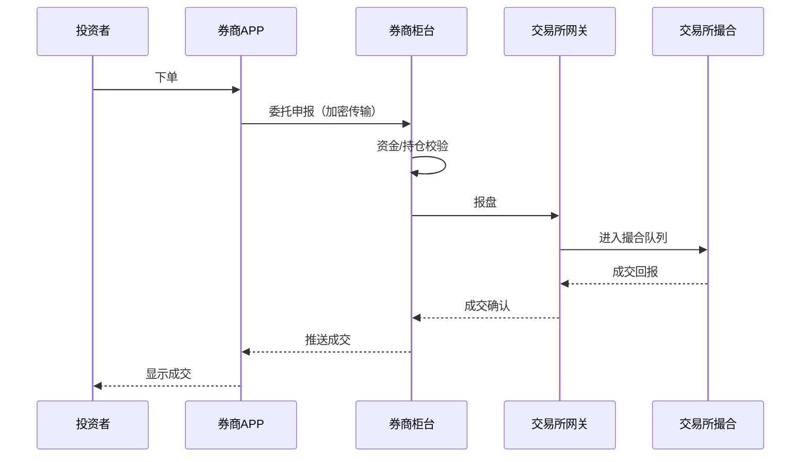
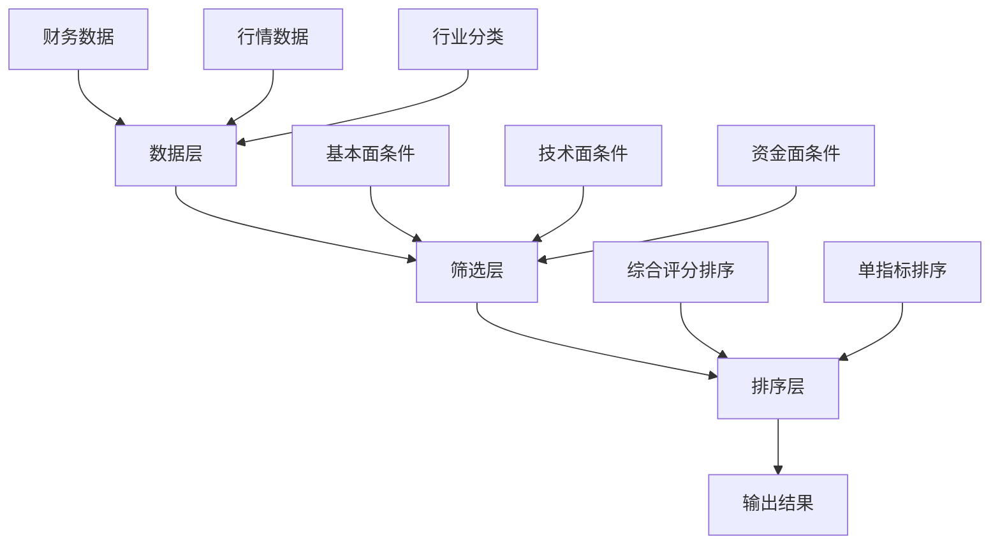
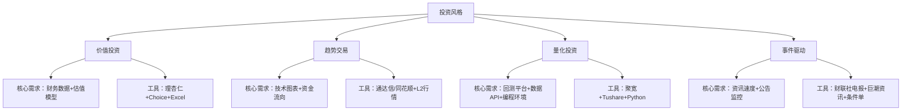

## 二、股票投资工具理论

股票投资工具是投资者与资本市场之间的桥梁。从手动翻阅报纸行情到如今的智能量化平台，工具的演进深刻改变了投资的效率边界和能力上限。本章从理论层面系统梳理股票投资工具的分类体系、核心功能、评估标准与选择逻辑，为后续的实操章节奠定认知基础。

---

### 1. 股票投资工具的本质与分类体系

#### 1.1 工具的本质定义

股票投资工具并非单一的"炒股软件"，而是一个覆盖投资全流程的工具链。从信息获取、分析决策、交易执行到持仓管理，每个环节都有对应的工具支撑。

理解工具本质的三个关键认知：

- **工具是能力的延伸**：人类肉眼无法同时监控3000+只A股，但选股器可以在毫秒内完成筛选。工具放大的是你已有的判断力，而非替代判断本身。
- **工具是信息的过滤器**：资本市场每天产生海量信息，工具帮助你从噪声中提取信号。选择不同的工具，本质上是选择不同的信息过滤策略。
- **工具是纪律的执行者**：人性的贪婪与恐惧是投资最大的敌人。条件单、止盈止损等工具功能，能将预设策略强制执行，减少情绪干扰。

#### 1.2 按投资流程分类


| 流程环节 | 核心功能 | 典型工具 |
|----------|----------|----------|
| 信息获取 | 行情数据、新闻资讯、公告研报 | 东方财富、同花顺、Wind、Choice |
| 研究分析 | 基本面分析、技术分析、量化回测 | 通达信、大智慧、聚宽、RiceQuant |
| 决策交易 | 下单执行、条件单、算法交易 | 券商APP、PTrade、QMT |
| 持仓管理 | 资产组合、盈亏统计、风险监控 | 雪球、蛋卷基金、自建Excel |
| 复盘优化 | 交易记录、绩效归因、策略迭代 | 自建交易日志、Python分析脚本 |

#### 1.3 按分析方法分类

**基本面分析工具**

专注于企业内在价值的评估，核心数据包括财务报表、行业数据、宏观经济指标。

- **财务数据源**：巨潮资讯网（官方公告）、东方财富Choice（结构化财务数据）、Wind（机构级终端，年费数万元）
- **估值模型**：DCF计算器、PE/PB历史分位、杜邦分析拆解工具
- **行业研究**：各券商研究所的行业报告（慧博投研资讯可批量获取）、行业协会统计数据

**技术分析工具**

通过历史价格和成交量数据，寻找市场行为的规律性。

- **图表系统**：K线图、分时图、多周期切换（日/周/月/季/年）
- **指标体系**：均线系统（MA5/10/20/60/120/250）、MACD、KDJ、RSI、布林带、成交量指标
- **画线工具**：趋势线、支撑阻力线、斐波那契回调、通道线
- **选股公式**：通达信公式系统、同花顺i问财自然语言选股

**量化分析工具**

将投资逻辑转化为可回测、可优化的数学模型。

- **回测平台**：聚宽（JoinQuant）、米筐（RiceQuant）、优矿（Uqer）、掘金量化
- **编程语言**：Python（pandas+numpy+matplotlib）、R、MATLAB
- **数据API**：Tushare Pro、AKShare、BaoStock（免费开源）
- **因子库**：聚宽因子库、国泰安CSMAR数据库

#### 1.4 按使用者层级分类

| 层级 | 特征 | 推荐工具类型 | 典型组合 |
|------|------|-------------|----------|
| 入门级 | 资金<5万，刚接触股市 | 券商APP自带功能 | 华泰涨乐财富通 + 东方财富网页版 |
| 进阶级 | 资金5-50万，有1-3年经验 | 专业行情软件+基础分析工具 | 同花顺/通达信 + Choice金融终端 |
| 专业级 | 资金50万+，3年以上经验 | 多工具协同+量化辅助 | Wind + QMT/PTrade + Python |
| 机构级 | 基金/资管/自营 | 全功能终端+自研系统 | Bloomberg + 自研交易系统 |

---

### 2. 核心工具详解：行情与数据系统

#### 2.1 Level 1行情与Level 2行情

Level 1行情是最基础的市场数据，包含最新价、买卖五档、成交量等。国内券商APP免费提供，更新频率约3-6秒。

Level 2行情（沪深交易所增值数据）提供更深层的市场微观结构信息：

- **十档买卖盘**：L1只有五档，L2展示十档，能看到更远价位的挂单分布
- **逐笔成交**：L1展示的是汇总后的成交，L2展示每一笔原始成交记录，能识别大单拆分
- **买卖队列**：显示买一和买一价位上所有委托单的数量和顺序
- **委托总量**：实时统计市场总委买量和总委卖量

Level 2行情的实战价值：

```text
场景：某股票买一价10.00元，挂单量5000手

L1视角：看起来买盘很强
L2视角：拆开后发现是200笔25手的小单，而非几笔大单

结论：L2揭示的"散单堆叠"与"主力大单"有本质区别，
     前者支撑力度远不如后者。
```

费用参考：Level 2行情通常由券商或数据商提供，年费在800-3000元不等。东方财富的Choice Level 2约1500元/年，同花顺深度分析版约1200元/年。

#### 2.2 数据终端对比

| 维度 | Wind万得 | Choice东方财富 | iFinD同花顺 | Tushare Pro |
|------|----------|---------------|-------------|-------------|
| 定位 | 机构标配 | 性价比之选 | 同花顺生态 | 开发者友好 |
| 年费 | 3-6万元 | 3000-8000元 | 2000-5000元 | 免费/积分制 |
| 数据覆盖 | 全球金融数据 | A股+港股+基金 | A股+港股 | A股为主 |
| API接口 | 有（Python/VBA） | 有（Python） | 有（Python） | 有（Python） |
| 宏观数据 | 极其全面 | 较全面 | 基础覆盖 | 有限 |
| 历史深度 | 1990年至今 | 1990年至今 | 较深 | 2000年至今 |
| 适合人群 | 机构研究员 | 个人投资者 | 同花顺老用户 | 量化开发者 |

#### 2.3 免费数据源的合理利用

并非所有投资都需要付费数据终端。以下免费数据源对个人投资者已足够：

- **巨潮资讯网**（cninfo.com.cn）：上市公司公告原文下载，法定披露渠道，数据最权威
- **国家统计局**（stats.gov.cn）：GDP、CPI、PMI等宏观数据
- **中国人民银行**：货币政策报告、社融数据、外汇储备
- **东方财富网**：免费行情、F10资料、资金流向
- **理杏仁**（lixinger.com）：估值历史分位（部分功能免费）
- **Tushare Pro**：注册即获200积分，每天可调用约200次基础数据接口，适合个人量化

---

### 3. 核心工具详解：交易执行系统

#### 3.1 券商交易系统架构

理解券商交易系统的底层架构，有助于判断交易延迟和安全性。



关键延迟环节：

- **投资者→券商APP**：取决于网络质量，WiFi/4G约10-50ms
- **券商柜台→交易所**：这是最关键的环节，大券商通常有专线直连，延迟<1ms；小券商可能经过中转，延迟5-20ms
- **交易所撮合**：沪深交易所采用集中竞价，每3秒撮合一次（集合竞价阶段），连续竞价阶段按价格优先、时间优先原则逐笔撮合

#### 3.2 条件单与智能委托

条件单是将交易策略预设为触发条件的委托方式，是实现纪律化交易的重要工具。

常见条件单类型：

| 类型 | 逻辑 | 适用场景 |
|------|------|----------|
| 价格条件单 | 价格触及预设值时触发 | 止盈止损、突破买入 |
| 时间条件单 | 到达预设时间时触发 | 尾盘买入、开盘卖出 |
| 涨跌幅条件单 | 日涨跌幅达到阈值时触发 | 追涨杀跌策略的纪律约束 |
| 网格条件单 | 按固定价格间距自动高抛低吸 | 震荡行情中的自动化操作 |
| 定投条件单 | 按固定时间间隔自动买入 | 定期定额投资 |

条件单使用的注意事项：

- **触发≠成交**：条件单触发后以市价或限价提交，但在极端行情中可能无法成交（如跌停板无法卖出）
- **有效期管理**：大部分券商条件单有效期为当日或一个月，需定期检查和更新
- **模拟测试**：首次使用时先用模拟盘测试条件单的触发逻辑是否符合预期

#### 3.3 量化交易接口

对于需要程序化交易的投资者，以下是国内主要的量化交易接口：

**券商端接口（需开通权限）**

- **QMT（迅投QMT）**：多家券商提供，支持Python策略编写，可直接调用券商账户下单，资金门槛通常50万元
- **PTrade（恒生PTrade）**：类似QMT，策略编写更偏可视化，适合不擅长编程的投资者
- **miniQMT**：QMT的精简版，纯Python驱动，更适合量化开发者

**第三方接口**

- **聚宽（JoinQuant）**：在线回测+模拟交易，可对接部分券商实盘
- **掘金量化（MyQuant）**：本地部署，支持多策略多账户管理
- **vn.py**：开源量化交易框架，支持CTA、套利、做市等多种策略类型

选择量化接口的核心考量：

1. **延迟要求**：高频策略需要券商直连专线（co-location），普通策略对延迟不敏感
2. **数据质量**：接口自带的数据是否干净、是否有复权处理、是否支持tick级数据
3. **回测真实性**：是否考虑了滑点、手续费、涨跌停限制、停牌处理等真实约束
4. **运维稳定性**：7×24小时运行的策略需要接口有断线重连、异常恢复机制

---

### 4. 核心工具详解：选股与筛选系统

#### 4.1 选股器的工作原理

选股器的本质是将投资者的筛选逻辑转化为数据库查询。理解其工作原理，能避免"看起来很厉害但选不出好股票"的常见困境。

选股器的三层架构：



#### 4.2 多因子选股模型

多因子选股是目前最主流的量化选股方法。其核心思想是：找到那些能持续解释股票收益差异的"因子"，然后按因子打分筛选。

A股市场经过验证的主要因子类别：

| 因子类别 | 代表因子 | 理论依据 | A股有效性 |
|----------|----------|----------|----------|
| 价值因子 | PE、PB、EV/EBITDA | 低估值股票长期跑赢高估值 | 中等，但近年风格轮动明显 |
| 成长因子 | 营收增速、净利润增速、ROE变化 | 高成长企业获得更高估值 | 较强，但需注意增速拐点 |
| 质量因子 | ROE、毛利率、资产负债率 | 优质企业有持续竞争优势 | 较强且稳定 |
| 动量因子 | 过去3/6/12个月涨幅 | 趋势延续效应 | A股短期反转、中期动量 |
| 波动因子 | 历史波动率、特异性波动率 | 低波动股票风险调整后收益更高 | 较强，与散户偏好矛盾 |
| 流动性因子 | 换手率、成交量、买卖价差 | 低流动性有流动性溢价 | 中等 |
| 情绪因子 | 分析师预期变化、资金流向 | 市场情绪驱动短期价格 | 短期有效 |

#### 4.3 自然语言选股的兴起

近年来，部分平台开始支持自然语言选股，大幅降低了选股的技术门槛。

**同花顺i问财**：支持用中文描述选股条件，系统自动解析并执行。

示例查询语句：

```text
"连续3年ROE大于15%且PE低于20倍且市值大于100亿"

"近5日北向资金净买入超过1亿且股价突破60日均线"

"所属行业为半导体且2024年营收增速超过30%且机构持仓比例上升"
```

**优势**：无需学习编程或公式语法，直觉化操作
**局限**：复杂逻辑表达能力有限，组合条件过多时解析可能出错

---

### 5. 工具评估框架

#### 5.1 评估维度

选择投资工具不是功能越多越好，而是要匹配自己的投资风格和实际需求。以下是系统化的评估框架：

| 评估维度 | 权重建议 | 评估要点 |
|----------|----------|----------|
| 数据准确性 | 极高 | 数据是否及时更新、有无错误、复权是否正确 |
| 功能匹配度 | 高 | 是否覆盖你的投资方法所需的核心功能 |
| 学习成本 | 中高 | 上手难度、文档质量、社区活跃度 |
| 费用性价比 | 中 | 年费/月费与你投资规模是否匹配 |
| 系统稳定性 | 高 | 是否有卡顿、崩溃、数据丢失等问题 |
| 数据安全 | 高 | 是否有资质、隐私政策、历史安全事件 |
| 扩展性 | 中 | 是否支持API、插件、与其他工具联动 |

#### 5.2 常见工具选型陷阱

**陷阱一：功能堆砌症**

症状：购买了功能最全的专业终端，但80%的功能从未使用。
纠正：先明确自己的投资方法，再找匹配的工具。价值投资者不需要tick级行情，技术交易者不需要深度财务建模。

**陷阱二：免费替代幻觉**

症状：认为所有付费工具都能找到免费替代品。
现实：免费工具的数据质量、时效性、完整性通常有明显差距。在投资决策中，一个错误的数据点可能导致远超工具费用的损失。

**陷阱三：工具依赖症**

症状：过度依赖某个工具的信号，丧失独立判断能力。
提醒：所有技术指标都是历史数据的数学变换，不预测未来。工具是辅助决策的参考，不是决策本身。

**陷阱四：多工具冗余**

症状：同时使用3-4个行情软件，每天在不同平台间切换，信息过载。
建议：确定一个主力分析平台+一个备用平台即可。主力平台用于日常分析决策，备用平台用于主力平台故障时的应急。

---

### 6. 工具与投资方法论的匹配

#### 6.1 不同投资风格的工具需求



#### 6.2 资金规模与工具投入的合理比例

工具投入应与投资规模保持合理比例。一个粗略的参考标准：

| 投资资金规模 | 年度工具预算建议 | 说明 |
|-------------|-----------------|------|
| <5万元 | 0元 | 使用券商APP免费功能即可，资金应优先积累 |
| 5-20万元 | 500-2000元 | Level 2行情+一个专业行情软件 |
| 20-100万元 | 2000-8000元 | Choice/同花顺专业版+条件单功能 |
| 100万元以上 | 8000-30000元 | Wind或等效终端+量化接口+专业数据源 |

核心原则：工具费用不应超过年预期收益的5%。如果你的策略年化预期收益是10%，投资100万元年收益10万元，那么工具预算控制在5000元以内是合理的。

---

### 7. A股市场的工具生态特殊性

#### 7.1 交易制度对工具的影响

A股市场有若干独特的交易制度，直接影响工具的设计和使用：

- **T+1交易制度**：当日买入的股票次日才能卖出。这意味着日内回转交易策略在A股正股上无法实施，但ETF和可转债有T+0交易的品种
- **涨跌停板制度**：主板±10%，科创板/创业板±20%，北交所±30%，ST股±5%。涨跌停时条件单可能无法触发成交
- **集合竞价制度**：9:15-9:25为开盘集合竞价，14:57-15:00为收盘集合竞价。此期间的委托规则与连续竞价不同，工具显示的信息也有差异
- **印花税单边征收**：卖出时收取成交金额的0.05%（2023年8月减半后的税率）。佣金方面行业普遍在万1-万3之间

#### 7.2 中国特色数据指标

以下指标在国际市场上没有对应物或表现形式不同，是中国股票工具的独特组成部分：

- **北向资金（沪深港通）**：外资通过香港交易所买卖A股的数据，被视为"聪明钱"的风向标。东方财富和同花顺都有实时北向资金监控页面
- **融资融券数据**：反映杠杆资金的方向和力度。融资余额增加通常被视为市场看多信号
- **龙虎榜**：每日涨跌幅偏离值达7%、换手率达20%的股票，交易所会披露买卖前五名的营业部信息，用于追踪游资动向
- **限售股解禁日历**：大股东解禁期满后的抛售压力，是影响短期股价的重要因素

#### 7.3 信息获取的速度分层

在A股市场，信息到达不同投资者的时间存在天然差异，这直接影响工具选择策略：

| 速度层级 | 时间差 | 信息来源 | 工具要求 |
|----------|--------|----------|----------|
| 第一层 | 毫秒级 | 交易所Level 3数据（机构独享） | 专线co-location |
| 第二层 | 秒级 | Level 2行情+算法新闻 | 专业终端+程序化交易 |
| 第三层 | 分钟级 | 财联社电报、微博快讯 | 资讯APP推送+条件单 |
| 第四层 | 小时级 | 券商研报、论坛讨论 | 行情软件+社区平台 |
| 第五层 | 天级 | 报纸、电视财经节目 | 传统媒体 |

个人投资者通常处于第三到第五层。与其追求不可能达到的第一层速度，不如将精力放在深度分析和长期视角上——这正是工具能发挥最大价值的地方。

---

### 8. 常见误区与纠偏

#### 误区一：工具越专业，收益越高

**现实**：工具的专业程度与投资收益之间没有线性关系。巴菲特至今不用彭博终端，但这不妨碍他成为史上最成功的投资者之一。工具能提升信息处理效率，但投资收益的来源是对企业价值的深刻理解和对市场情绪的逆向把握，这些能力无法通过购买更贵的工具获得。

#### 误区二：过度优化技术指标参数

**现实**：许多投资者花大量时间在通达信中调试MACD、KDJ等指标的参数，试图找到"最优"参数组合。这本质上是过度拟合——在历史数据上表现好的参数，未来未必有效。与其优化参数，不如理解指标背后的市场逻辑，并结合多种指标交叉验证。

#### 误区三：忽视工具的隐性成本

**现实**：工具的成本不仅是购买费用，还包括学习时间、维护精力和决策干扰。一个功能繁多的复杂工具可能让你花更多时间摆弄功能而非分析投资。最贵的工具不一定是最适合的，最合适的工具才是最好的。

#### 误区四：轻信"指标金叉/死叉"等机械信号

**现实**：没有任何单一技术指标能持续稳定地预测股价走势。"MACD金叉买入、死叉卖出"在某些行情中有效，在另一些行情中反复打脸。指标的意义在于辅助判断市场状态（趋势/震荡/超买/超卖），而非发出机械指令。

#### 误区五：把模拟盘的收益当作实盘预期

**现实**：模拟盘忽略了三个关键的实盘约束——滑点成本（实际成交价与预期价格的偏差）、流动性限制（大单无法按当前价全部成交）、情绪影响（虚拟资金无恐惧感）。模拟盘策略通常比实盘表现好20-50%。

---

### 9. 工具学习路径建议

#### 9.1 入门阶段（0-6个月）

目标：能独立完成基本的看盘和交易操作。

学习清单：
1. 熟练使用券商APP的下单、查询、条件单功能
2. 学会看K线图、均线、成交量三个最基本的技术要素
3. 了解F10资料的结构（公司概况、财务数据、股东信息、公告列表）
4. 学会在东方财富/同花顺上查询个股的基本信息

#### 9.2 进阶阶段（6-24个月）

目标：能使用专业工具进行独立分析。

学习清单：
1. 掌握一款专业行情软件（通达信或同花顺）的核心功能
2. 学会使用选股器进行多条件筛选
3. 了解主要技术指标的计算方法和适用场景
4. 学会阅读现金流量表、利润表、资产负债表的关键科目
5. 掌握估值的基本方法（PE/PB/DCF）

#### 9.3 专业阶段（2年以上）

目标：能构建自己的分析体系和工具链。

学习清单：
1. Python基础 + pandas数据处理 + matplotlib可视化
2. Tushare/AKShare等数据API的使用
3. 在聚宽/米筐等平台编写和回测交易策略
4. 建立个人的股票数据库和分析模板
5. 条件单与程序化交易的结合使用

---

### 10. 本章小结

股票投资工具的核心价值在于：**提升信息效率、强化决策纪律、降低操作成本**。

记住三个原则：

1. **匹配原则**：工具的复杂度应与你的投资方法和资金规模匹配，不追求功能溢出
2. **聚焦原则**：精通2-3个核心工具，远胜于浅尝辄止10个工具
3. **迭代原则**：随着投资能力的提升，逐步升级工具链，而非一步到位

工具是投资体系的一部分，而非全部。最好的工具配上传统的投资智慧，才是持续盈利的正道。
