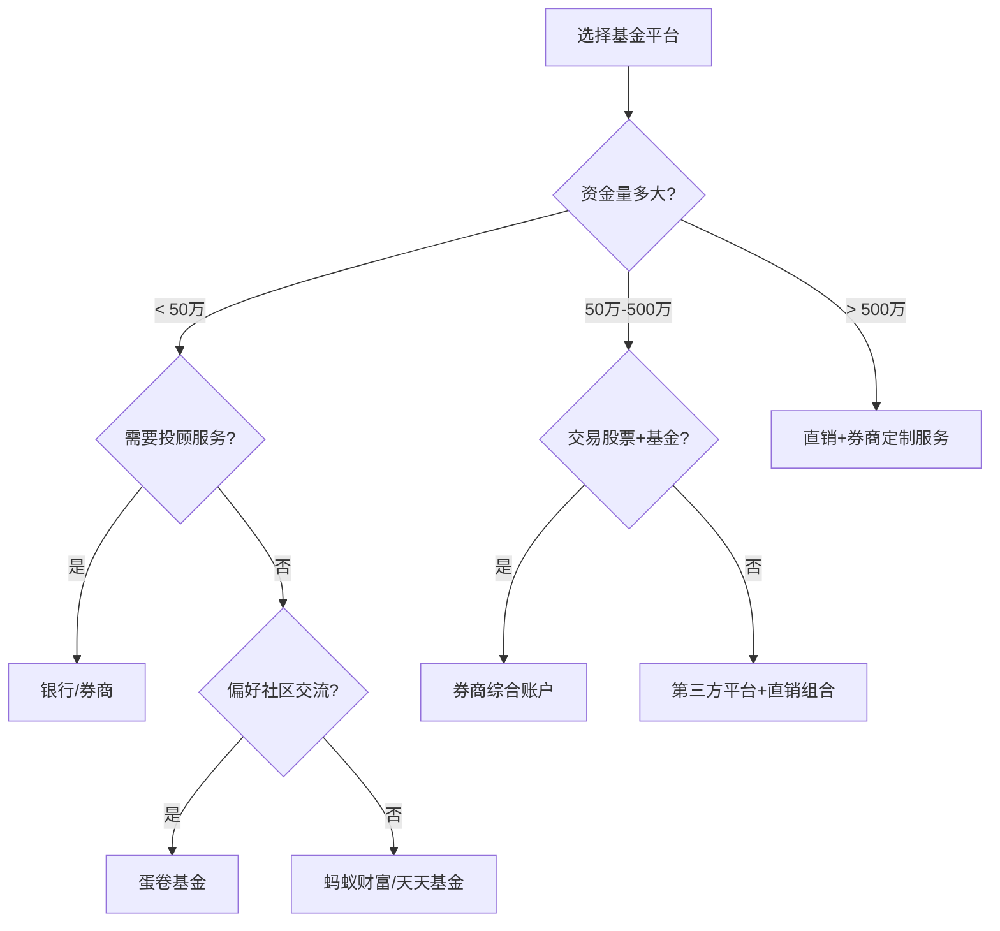

## 三、基金投资工具理论

基金投资工具是连接投资者与资本市场的桥梁。理解这些工具的底层逻辑，不仅能帮你选对平台、省下真金白银的费用，更能让你建立起系统化的投资分析框架，避免在信息洪流中迷失方向。本章从平台选择、分析工具、定投系统三个维度，构建完整的基金投资工具知识体系。

### 3.1 基金销售平台的分类与选择

#### 3.1.1 三类平台的本质区别

基金销售渠道本质上分为三类：直销、代销、第三方平台。它们的核心差异不在"卖什么"，而在"谁控制客户关系"和"费率结构如何设计"。

**直销平台**：基金公司自建的官网或App，投资者直接与基金公司交易。费率最低，通常申购费打0折（即免申购费），因为省去了中间商的分销成本。但局限性明显——只能购买该公司旗下的产品，无法跨公司对比和配置。适合已经明确目标基金、追求极致费率的投资者。

**代销平台**：银行和证券公司作为持牌代销机构，销售多家基金公司的产品。银行的优势在于网点覆盖广、有理财顾问面对面服务，但费率通常不打折（申购费1.5%原价收取），且理财顾问的推荐可能受佣金驱动，并非完全中立。券商的优势在于可以同时交易场内ETF和场外基金，账户整合度高，部分券商对自家代销的基金提供费率折扣。

**第三方平台**：以天天基金（东方财富旗下）、蚂蚁财富（支付宝旗下）、蛋卷基金（雪球旗下）为代表。这类平台的核心竞争力是产品丰富度（通常覆盖数千只基金）和费率优惠（申购费普遍1折，即0.15%）。此外，它们通常提供强大的数据工具——基金筛选器、业绩对比、持仓分析、社区讨论等，帮助投资者做出更理性的决策。

#### 3.1.2 平台费率结构深度解析

费率是影响基金长期收益的隐形杀手。以申购费为例，假设投资10万元：

| 费率档位 | 申购费率 | 申购费用 | 实际投入金额 |
|---------|---------|---------|------------|
| 原价（银行常见） | 1.50% | 1,500元 | 98,500元 |
| 4折（部分银行网银） | 0.60% | 600元 | 99,400元 |
| 1折（第三方平台） | 0.15% | 150元 | 99,850元 |
| 0折（直销平台） | 0.00% | 0元 | 100,000元 |

单次看差异不大，但基金投资是长期行为。假设每年申购4次、累计投资20年，原价和1折的总费用差距可达10万元以上。这还不包括赎回费、转换费等其他交易成本。

**各平台隐性成本对比**：

除了申购费，还需关注以下隐性成本：

- **赎回费**：大部分平台执行统一标准（持有不足7天收取1.5%惩罚性赎回费，持有超过2年免赎回费），但部分平台对自家产品有赎回费优惠。
- **基金转换费**：同一平台内将A基金转换为B基金，通常比先赎回再申购便宜。第三方平台的转换功能覆盖范围差异较大。
- **资金到账时间**：货币基金通常T+0（快速取现有额度限制），股票型基金赎回通常T+3到T+7。部分平台提供"极速赎回"服务（平台先行垫付），但可能有额度和时间限制。
- **账户管理费**：正规平台不收取账户管理费，但需警惕某些不规范平台的隐性收费。

#### 3.1.3 平台选择决策框架

选择平台不是"选最好的"，而是"选最适合自己的"。以下是基于不同需求场景的决策矩阵：

| 需求场景 | 推荐平台类型 | 典型平台 | 核心理由 |
|---------|------------|---------|---------|
| 追求极致费率 | 直销平台 | 各基金公司官方App | 申购费为零 |
| 一站式管理多只基金 | 第三方平台 | 蚂蚁财富、天天基金 | 产品全、费率低、工具强 |
| 需要专业投顾服务 | 银行/券商 | 招行、中信证券 | 有持牌顾问面对面服务 |
| 同时交易股票和基金 | 券商 | 华泰证券、中信证券 | 场内场外账户合一 |
| 偏好社区交流学习 | 第三方平台 | 蛋卷基金、天天基金 | 投资社区活跃 |
| 资金量极大（>500万） | 直销+券商 | 基金公司直销+头部券商 | 专属服务、费率可谈 |

**实操建议**：不必局限于单一平台。常见策略是用第三方平台（如天天基金）作为主力——产品丰富、费率低、数据工具强；同时在券商开户用于ETF场内交易（免申购费、实时成交）；对长期重仓持有的核心基金，直接在基金公司直销平台购买以享受最低费率。

#### 3.1.4 平台安全性评估

资金安全是底线。判断平台是否安全的三个核心标准：

1. **牌照合规**：平台必须持有中国证监会颁发的《经营证券期货业务许可证》或《基金销售业务资格证书》。可在证监会官网（www.csrc.gov.cn）查询。
2. **资金托管**：投资者的资金必须由独立的商业银行托管，平台本身不能触碰资金。正规平台会在开户时要求绑定银行卡，资金从银行账户直接划转到基金托管账户。
3. **信息加密**：平台应采用SSL/TLS加密传输，支持短信验证码、指纹/人脸识别等多重身份验证。

**高危信号**：承诺保本保收益、要求将资金转入个人账户或非托管账户、无法查到正规牌照信息、客服无法提供合规证明——遇到任何一条，立即远离。

### 3.2 基金分析工具的理论与应用

#### 3.2.1 基金评级体系详解

基金评级是专业机构基于历史数据对基金进行的综合评分，是投资者筛选基金的重要参考。但评级不是万能的——它基于过去的表现，不能保证未来。

**全球主流评级机构**：

**晨星评级（Morningstar Rating）**：全球最权威的基金评级体系，采用星级评定（1-5星）。其核心方法论是"风险调整后收益"——不仅看赚了多少，还要看承担了多少风险。具体计算方式是：将基金的超额收益（相对于无风险利率）除以"晨星风险系数"（衡量下行风险的指标），然后在同类基金中排序，前10%获得5星，接下来22.5%获得4星，以此类推。晨星评级的最大优势是方法论透明、全球可比，但其局限在于完全依赖历史数据，且对不同市场环境的适应性不足。

**理柏评级（Lipper Rating）**：路透社旗下，侧重风险调整收益的多个维度。与晨星不同，理柏从四个独立维度分别评级：总回报（Total Return）、稳定回报（Consistent Return）、保本能力（Preservation）、费用（Expense）。这意味着一只基金可能在总回报上获得最高评级，但在保本能力上评级较低，投资者可以根据自己的优先级选择。理柏评级的优势是维度更细、颗粒度更高，但在中国市场的覆盖度不如晨星。

**济安金信评级**：国内最具影响力的基金评级机构之一，由中国社科院金融研究所支持。其特色是针对中国市场的特殊性进行了方法论调整——例如考虑了中国基金的风格漂移问题、基金经理变更的影响等。济安金信的"济安评级"采用九维度评价体系，包括盈利能力、抗风险能力、选股能力、择时能力等，维度更全面。

**三大评级对比**：

| 维度 | 晨星 | 理柏 | 济安金信 |
|-----|------|------|---------|
| 评级方法 | 风险调整后收益排序 | 四维度独立评级 | 九维度综合评价 |
| 评级周期 | 3年/5年/10年 | 3年/5年/10年 | 1年/2年/3年 |
| 覆盖范围 | 全球 | 全球 | 中国 |
| 优势 | 全球可比、方法论透明 | 维度细、可按需选择 | 本土化、维度全面 |
| 局限 | 纯历史数据 | 中国市场覆盖度有限 | 国际影响力较小 |
| 适用场景 | 跨市场比较 | 风险偏好匹配 | 中国基金深度分析 |

**使用评级的注意事项**：

1. **评级是筛选起点，不是终点**。5星基金不一定适合你，1星基金不一定不能买。评级只反映历史风险调整收益，不反映基金的当前持仓、基金经理的投资理念、市场环境的变化。
2. **关注评级变动趋势**。一只基金从5星降到3星，可能意味着其策略在当前市场环境下失效了；从3星升到5星，可能意味着基金经理调整了策略或市场风格转向。持续跟踪评级变化比单一时点的评级更有价值。
3. **同类比较才有意义**。不要拿股票型基金的评级和债券型基金比——它们的风险收益特征完全不同。评级只在同类基金内部排序。

#### 3.2.2 基金筛选的六维模型

系统化的基金筛选应覆盖六个核心维度，每个维度都有具体的量化指标和判断标准：

**维度一：业绩表现**

业绩是最直观的筛选指标，但也是最容易被误读的。

- **绝对收益率**：近1年、近3年、近5年的累计收益率。注意区分"成立以来"收益率（受成立时间影响大）和"滚动区间"收益率。
- **同类排名百分比**：在同类基金中的排名位置。前25%为优秀，前50%为合格。一只基金如果连续3年排名在同类前30%，比某一年排名第一、其他年份排名后50%更值得关注。
- **业绩持续性检验**：用"滚动生成"方法——计算所有可能的1年期、3年期收益分布，观察胜率。胜率超过60%的基金，业绩持续性较好。

**维度二：风险控制**

收益和风险是一枚硬币的两面。只看收益不看风险，就像只看油门不看刹车。

- **最大回撤（Maximum Drawdown）**：从历史最高点到最低点的最大跌幅。最大回撤30%意味着基金净值曾经从1元跌到0.7元。投资者需要问自己：如果我的10万元变成7万元，我能承受吗？不同投资者的风险承受能力不同，最大回撤是匹配风险偏好的关键指标。
- **年化波动率（Annualized Volatility）**：衡量基金净值的波动幅度。波动率越高，净值波动越剧烈。偏股型基金的年化波动率通常在15%-30%，债券型基金在3%-8%。
- **夏普比率（Sharpe Ratio）**：每承担一单位风险所获得的超额收益。计算公式为：（基金收益率 - 无风险利率）/ 基金波动率。夏普比率大于1为优秀，大于2为卓越，小于0.5为较差。这是衡量"性价比"的核心指标。
- **卡玛比率（Calmar Ratio）**：年化收益率 / 最大回撤。卡玛比率大于1意味着收益能够覆盖最大回撤，大于2为优秀。这个指标对保守型投资者尤其重要。

**维度三：基金经理**

在中国市场，基金经理的个人能力对基金业绩的影响远大于海外市场。评估基金经理需要关注：

- **从业年限**：至少经历过一轮完整的牛熊周期（约5-7年）。从业3年以下的基金经理，其业绩可能只是市场beta的体现，而非真正的alpha。
- **管理规模**：管理规模过大（超过300亿）可能导致"船大难掉头"，影响操作灵活性；管理规模过小（低于2亿）可能面临清盘风险。最佳规模区间取决于策略类型——价值型策略可容纳更大规模，交易型策略则需要较小规模。
- **投资风格一致性**：通过基金季报的持仓变化，判断基金经理是否坚持自己的投资风格。频繁切换风格（从价值到成长、从大盘到小盘）的基金经理，其业绩很难持续。
- **历史业绩归因**：区分业绩来源——是市场整体上涨（beta）带来的，还是基金经理的选股/择时能力（alpha）带来的。可以在天天基金等平台查看"超额收益"指标。

**维度四：费率结构**

费率直接影响净收益。同类基金中，费率差异可能达到0.5%-1%/年，长期复利效应下差距巨大。

- **管理费**：股票型基金通常1.5%/年，指数型基金0.5%/年，ETF更低（0.15%-0.5%/年）。
- **托管费**：通常0.25%/年，ETF约0.1%/年。
- **申购费**：第三方平台1折后约0.15%，直销平台可能为零。
- **赎回费**：与持有时间挂钩，持有超过2年通常免赎回费。
- **销售服务费**：C类份额收取（约0.4%-0.8%/年），替代申购费，适合短期持有。

**A类与C类份额选择**：这是一个被很多投资者忽略的重要决策。A类份额收取申购费但无销售服务费，C类份额无申购费但按年收取销售服务费。分界点通常在1-2年——持有超过1-2年选A类更划算，短期持有选C类更划算。具体计算公式：A类总费用 = 申购费 + 持有年数 × (管理费 + 托管费)；C类总费用 = 持有年数 × (管理费 + 托管费 + 销售服务费)。当两者相等时的持有年数即为临界点。

**维度五：基金公司**

基金公司的整体实力影响旗下所有产品的运作质量。

- **投研团队规模**：大型基金公司（如易方达、华夏、广发）拥有上百人的投研团队，覆盖各行业各板块，研究深度远超小公司。
- **合规风控体系**：查看基金公司是否有过重大违规记录（可在证监会网站查询处罚信息）。
- **产品线完整度**：产品线完整的公司，投资者可以在同一平台内进行基金转换，降低交易成本。

**维度六：持仓分析**

基金的季报/半年报/年报披露了持仓信息，这是判断基金实际风格的最可靠依据。

- **前十大重仓股集中度**：集中度高（>60%）意味着基金经理有较强的个股信心，但风险也更集中；集中度低（<40%）意味着更分散的配置。
- **行业分布**：是否与基金宣称的投资方向一致。一只号称"消费主题"的基金，如果重仓了大量科技股，就存在风格漂移问题。
- **换手率**：年换手率超过500%意味着基金经理在频繁交易，可能增加交易成本和冲击成本；低于100%意味着持股较稳定。

#### 3.2.3 主流分析工具平台

**天天基金网（fund.eastmoney.com）**：数据最全面的免费基金分析平台。核心功能包括：基金筛选器（支持多维度组合筛选）、基金比较工具（最多5只基金并列对比）、基金经理档案、持仓分析、业绩归因。进阶功能包括"基金诊断"（综合评估基金的盈利能力、抗风险能力、稳定性等）和"定投计算器"（回测不同定投策略的历史收益）。

**晨星中国（cn.morningstar.com）**：国际评级方法论的中国落地。核心功能包括晨星星级评定、基金风格箱（将基金按市值和风格分为九宫格：大盘价值/大盘平衡/大盘成长/中盘价值/中盘平衡/中盘成长/小盘价值/小盘平衡/小盘成长）、投资组合透视。晨星的独特价值在于其全球视野——如果你需要投资QDII基金（投资海外市场的基金），晨星的海外基金数据是其他平台无法替代的。

**理杏仁（lixinger.com）**：面向进阶投资者的数据平台。特色功能包括指数估值分析（PE/PB/股息率的历史百分位）、行业估值对比、宏观经济数据。理杏仁的核心价值在于帮你判断"现在是贵还是便宜"——通过历史百分位，你可以知道当前估值处于过去10年的什么位置，从而辅助定投决策。

**Choice金融终端（东方财富旗下）**：专业级数据终端，适合重度研究用户。提供全面的基金持仓穿透、业绩归因分析、基金经理跟踪等功能。免费版功能有限，付费版（约2000元/年）提供完整功能。对于管理金额超过50万的投资者，这个投入是值得的。

### 3.3 定投工具的理论基础与进阶策略

#### 3.3.1 定投的数学原理

定投（定期定额投资）的核心机制是"平均成本法"（Dollar-Cost Averaging, DCA）。其数学原理是：在波动市场中，固定金额的投资在低价时买入更多份额、高价时买入更少份额，从而降低平均持仓成本。

用一个简化例子说明：

假设每月定投1000元购买某基金：

| 月份 | 基金净值 | 买入份额 | 累计投入 | 累计份额 | 平均成本 |
|-----|---------|---------|---------|---------|---------|
| 1月 | 1.00元 | 1,000份 | 1,000元 | 1,000份 | 1.00元 |
| 2月 | 0.80元 | 1,250份 | 2,000元 | 2,250份 | 0.89元 |
| 3月 | 0.60元 | 1,667份 | 3,000元 | 3,917份 | 0.77元 |
| 4月 | 0.80元 | 1,250份 | 4,000元 | 5,167份 | 0.77元 |
| 5月 | 1.00元 | 1,000份 | 5,000元 | 6,167份 | 0.81元 |
| 6月 | 1.20元 | 833份 | 6,000元 | 7,000份 | 0.86元 |

6个月后，基金净值从1.00元涨到1.20元（涨幅20%），但定投的平均成本仅为0.86元，实际收益率为 (1.20 - 0.86) / 0.86 = 39.5%，远高于简单的"买入持有"策略的20%收益率。这就是定投在波动市场中的"微笑曲线"效应——市场下跌时积累低成本筹码，市场回升时获得超额收益。

**定投的适用条件**：

1. **市场有波动**：如果市场一路上涨，定投反而不如一次性投入；如果市场一路下跌，定投也会持续亏损。定投最适合的是"先跌后涨"或"震荡上行"的市场形态。
2. **投资期限足够长**：定投需要时间来发挥"平均成本"的效果。建议至少坚持3年以上，5-10年效果更佳。
3. **选择有长期增长逻辑的标的**：定投不是万能的，如果标的本身没有长期增长逻辑（如夕阳行业的基金），再怎么定投也无法获得好收益。宽基指数基金（如沪深300、中证500）是最适合定投的标的。

#### 3.3.2 智能定投策略深度解析

传统定投是"定时定额"——每月固定日期投入固定金额。智能定投在此基础上引入了"择时"元素，根据市场状态动态调整投入金额，旨在进一步优化收益。

**策略一：均线偏离法**

核心思路：以某条均线（通常选250日均线，即年线）为基准，当指数低于均线时多投，高于均线时少投。

具体操作规则（以沪深300指数为例）：
- 指数低于均线10%以上：投入基准金额的150%（加大抄底力度）
- 指数低于均线5%-10%：投入基准金额的120%
- 指数在均线附近（±5%）：投入基准金额的100%（正常定投）
- 指数高于均线5%-10%：投入基准金额的80%
- 指数高于均线10%以上：投入基准金额的50%（减少追高）

均线偏离法的优势是逻辑清晰、执行简单，但局限在于均线是"后视镜"指标——它告诉你过去一年的平均成本，但不预测未来。

**策略二：估值法**

核心思路：基于指数的估值水平（通常用PE市盈率）判断市场贵贱，在低估时多投、高估时少投或不投。

具体操作规则（以沪深300指数PE百分位为例）：
- PE百分位 < 20%（极度低估）：投入基准金额的200%
- PE百分位 20%-40%（低估）：投入基准金额的150%
- PE百分位 40%-60%（适中）：投入基准金额的100%
- PE百分位 60%-80%（高估）：投入基准金额的50%
- PE百分位 > 80%（极度高估）：停止定投，开始分批止盈

PE百分位的含义：当前PE在过去10年所有交易日中的排名位置。20%意味着当前估值比过去80%的时间都便宜。这个数据可以在理杏仁、且慢等平台查到。

估值法的理论基础是"均值回归"——估值不会永远在极端位置，最终会回归到历史均值附近。但需注意：不同行业的估值中枢不同（银行股PE长期在5-8倍，消费股PE在20-30倍），不能跨行业简单比较。

**策略三：目标市值法**

核心思路：设定一个"目标持仓市值"的增长路径（例如每月增加5000元市值），每次定投时根据当前持仓市值与目标市值的差额决定投入金额。

具体操作：
1. 设定每月目标增加市值M（如5000元）
2. 每月定投日，计算：目标持仓市值 = M × 已定投月数
3. 计算当前实际持仓市值 = 持有份额 × 当前净值
4. 投入金额 = 目标持仓市值 - 当前实际持仓市值
5. 如果投入金额为负（即持仓市值已超过目标），则不投入或少量投入

目标市值法的优势是强制在市场下跌时"补仓"、在市场上涨时"减仓"，执行纪律性最强。但需要每月手动计算或使用支持该策略的平台（如蛋卷基金的目标盈）。

**三大策略对比**：

| 维度 | 均线偏离法 | 估值法 | 目标市值法 |
|-----|----------|-------|----------|
| 核心指标 | 价格均线 | PE百分位 | 持仓市值 |
| 理论基础 | 趋势跟踪 | 均值回归 | 资产配置纪律 |
| 操作复杂度 | 低 | 中 | 高 |
| 适用标的 | 宽基指数 | 宽基/行业指数 | 任意基金 |
| 优势 | 简单直观 | 逻辑扎实 | 纪律性最强 |
| 局限 | 滞后性 | 行业适用性差异 | 计算复杂 |
| 推荐平台 | 蚂蚁财富智投 | 且慢、蛋卷 | 蛋卷基金 |

#### 3.3.3 定投的进阶优化

**止盈策略**：定投不止要"会买"，更要"会卖"。常见的止盈方法包括：

1. **目标收益率止盈**：设定一个目标（如年化15%），达到后全部或部分赎回。简单直接，但可能错过后续上涨。
2. **估值止盈**：当指数PE百分位超过80%时开始分批止盈。与估值定投配合使用效果最佳。
3. **动态回撤止盈**：从最高点回撤一定比例（如10%）时止盈。能够"吃到"大部分上涨，同时避免大幅回撤。
4. **分批止盈**：将持仓分成若干份，在不同价位分批赎回。例如达到目标收益后赎回1/3，每上涨5%再赎回1/3。

**定投频率的选择**：周定投还是月定投？从历史数据回测看，两者收益率差异极小（通常在0.5%以内）。周定投在波动较大的市场中略有优势（更多机会在低位买入），但操作频率更高。建议：如果手动操作，选月定投更省心；如果平台支持自动扣款，选周定投略优。

**定投的"心理关"**：定投最大的敌人不是市场，而是投资者自己的心理。在市场持续下跌时（如2018年、2022年），坚持定投需要极强的纪律性。以下是克服心理障碍的方法：

1. **自动化**：设置自动扣款，避免每次手动操作时的犹豫。
2. **不看账户**：在市场大跌时减少查看账户的频率，避免情绪化操作。
3. **回顾历史**：每一次大跌最终都回来了。2008年金融危机后，坚持定投沪深300的投资者在2015年获得了超过100%的收益。
4. **小额开始**：如果心理压力大，先从每月500元开始，逐渐增加。

### 3.4 基金组合构建工具

#### 3.4.1 核心-卫星策略

基金投资不是"选一只最好的基金"，而是构建一个组合。最经典的组合策略是"核心-卫星"（Core-Satellite）：

- **核心仓位（60%-80%）**：配置宽基指数基金（如沪深300ETF、中证500ETF），获取市场平均收益（beta）。核心仓位的要求是：费率低、跟踪误差小、流动性好。
- **卫星仓位（20%-40%）**：配置行业/主题基金或主动管理基金，追求超额收益（alpha）。卫星仓位的要求是：与核心仓位的相关性低、基金经理有可验证的alpha能力。

**相关性分析**：组合构建的关键是"低相关性"——当A基金下跌时，B基金不一定下跌甚至上涨。相关系数范围从-1到+1，+1表示完全同涨同跌，-1表示完全反向。理想的组合中，各基金的相关系数应低于0.5。可在晨星等平台查看基金之间的相关性数据。

#### 3.4.2 资产配置再平衡

组合建好后不是一劳永逸的。随着市场波动，各基金的实际占比会偏离目标配置。例如，目标配置是60%股票基金+40%债券基金，一年后股票基金涨了30%、债券基金涨了5%，实际占比变为约67%+33%。再平衡就是定期（通常每季度或每半年）将配置恢复到目标比例。

再平衡的本质是"卖高买低"——卖掉涨得多的（高位减仓），买入涨得少的（低位加仓）。学术研究表明，定期再平衡可以在不降低收益的情况下显著降低组合波动率。

**再平衡的执行方式**：

1. **日历再平衡**：每季度/半年/一年固定日期执行。简单但可能错过最优时机。
2. **阈值再平衡**：当任一资产偏离目标比例超过一定阈值（如5%或10%）时触发。更灵活但需要持续监控。
3. **现金流再平衡**：不主动卖出，而是通过新增资金的配置方向来调整。例如股票基金占比过高时，新增资金全部买入债券基金。适合持续有现金流投入的投资者。

### 3.5 常见误区与纠正

**误区一："五星基金一定好"**

纠正：晨星五星只代表过去3-5年的风险调整收益在同类前10%，不代表未来会继续优秀。研究表明，五星基金在接下来3年保持五星的概率不到30%。评级是筛选起点，不是决策终点。

**误区二："费率越低越好"**

纠正：费率重要但不是唯一标准。一只管理费1.5%但长期年化收益15%的主动基金，净收益远高于管理费0.5%但年化收益8%的指数基金。应该关注"费率后收益"（net-of-fee return），而非费率本身。

**误区三："定投不需要择时"**

纠正：定投解决了"什么时候买"的问题（通过分散买入时间），但没有解决"买什么"和"什么时候卖"的问题。在估值极度高估时开始定投（如2007年6000点），可能需要很多年才能回本。估值法定投就是对"传统定投不择时"的改进。

**误区四："基金经理换人了赶紧跑"**

纠正：需要区分情况。如果原基金经理是因业绩优秀被提拔（如升任投资总监），新接任者可能是团队中同样优秀的人才。如果原基金经理是因业绩差被撤换，那确实需要警惕。关键是看新任基金经理的历史业绩和投资风格是否与基金定位匹配。

**误区五："规模越大的基金越安全"**

纠正：基金规模大≠基金安全。规模过大的基金可能面临"大象难跳舞"的问题——可投资标的有限、调仓冲击成本高、难以获得超额收益。部分明星基金经理在规模膨胀后业绩明显下滑，就是这个原因。对主动管理基金，20-100亿通常是最佳规模区间。

### 3.6 实操案例：从零构建基金组合

以一个具体的案例展示如何运用本章知识：

**投资者画像**：30岁，月收入15000元，每月可投资5000元，风险承受能力中等（能接受最大30%的回撤），投资目标是10年后的子女教育金。

**第一步：选择平台**

主力平台选天天基金（费率1折、数据工具强），辅助平台开一个券商账户（用于ETF交易）。

**第二步：确定资产配置**

采用"100-年龄"法则作为起点：100-30=70%权益类资产，30%固收类资产。考虑到中等风险承受能力，调整为65%权益+35%固收。

**第三步：选择具体基金**

| 仓位 | 类型 | 基金选择 | 配比 | 月投金额 |
|-----|------|---------|-----|---------|
| 核心 | 沪深300指数 | 易方达沪深300ETF联接A | 30% | 1,500元 |
| 核心 | 中证500指数 | 南方中证500ETF联接A | 20% | 1,000元 |
| 卫星 | 消费主题 | 易方达消费行业股票 | 15% | 750元 |
| 固收 | 纯债基金 | 广发纯债债券A | 25% | 1,250元 |
| 固收 | 货币基金 | 天弘余额宝（活期备用） | 10% | 500元 |

**第四步：设置智能定投**

- 沪深300和中证500采用估值法定投：PE百分位低于30%时加倍投入，高于70%时减半投入
- 消费主题基金采用普通月定投
- 债券基金和货币基金一次性买入或简单月定投

**第五步：再平衡与检视**

- 每半年检视一次组合，偏离目标比例超过5%时再平衡
- 每年评估一次基金是否需要替换（连续2年排名同类后50%则考虑更换）
- 每年根据收入变化调整定投金额

**预期收益测算**（基于历史数据回测，不构成收益承诺）：

假设权益类资产年化收益8%、固收类资产年化收益4%，加权年化收益约6.6%。每月定投5000元，10年后：
- 累计投入：60万元
- 预期总值：约83万元（含复利）
- 预期收益：约23万元

这个案例展示了如何将本章的平台选择、基金筛选、定投策略、组合构建等知识串联成一个完整的投资方案。实际操作中，需要根据市场变化和个人情况持续调整。
