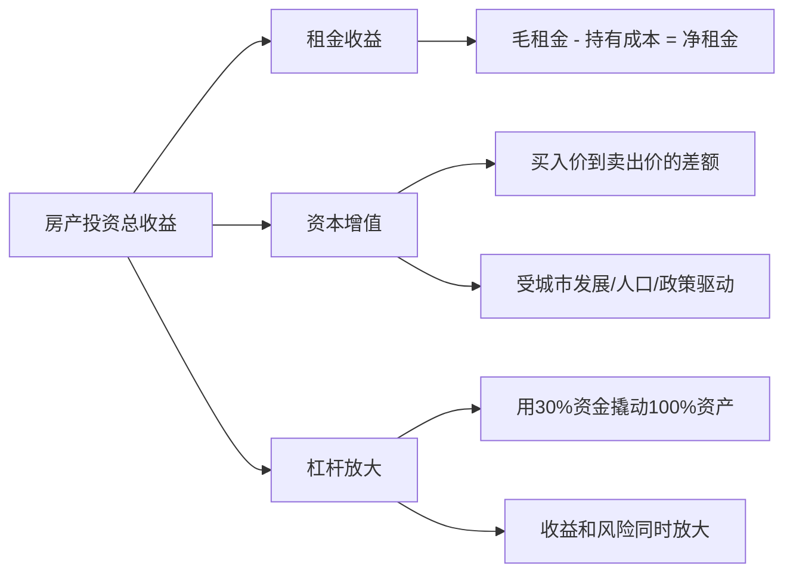

## 四、房产投资工具理论

房产是中国家庭财富的核心组成部分——央行2019年调查显示，中国家庭住房资产占总资产的59.1%，远高于美国的25.2%。掌握房产投资工具不仅是"会看房"，更是理解一套从信息获取、数据分析、估值建模到风险管理的完整决策系统。

本节从"道法术器"四个层面展开：先讲清房产投资的本质逻辑和风险框架（道），再建立系统化的分析方法论（法），然后逐一拆解具体工具和平台的使用技巧（术），最后给出可落地的计算代码和决策模板（器）。

### 4.1 房产投资的本质认知

#### 4.1.1 房产资产的核心特征

房产与股票、债券等金融资产有本质区别，理解这些差异是一切分析的前提。

| 特征维度 | 房产 | 股票 | 债券 |
|----------|------|------|------|
| 流动性 | 极低，成交周期通常3-6个月 | 高，T+1交易 | 中等 |
| 单笔金额 | 高，通常需百万以上 | 低，几百元起 | 中等 |
| 杠杆属性 | 天然杠杆（首付20%-30%） | 融资杠杆（需额外申请） | 无杠杆 |
| 使用价值 | 有（可居住/办公） | 无 | 无 |
| 持有成本 | 高（物业费、维修、折旧） | 低（仅交易佣金） | 无 |
| 信息透明度 | 低，信息不对称严重 | 高，上市公司强制披露 | 中等 |
| 标准化程度 | 极低，每套房都不同 | 高，同股同权 | 高 |
| 抗通胀能力 | 中等偏强 | 中等 | 弱（固定收益被通胀侵蚀） |

这些特征决定了房产投资的工具需求与股票投资完全不同：房产更依赖线下信息、更需要估值建模工具、更强调现金流分析，而不是K线图和技术指标。

#### 4.1.2 房产投资的收益来源

房产投资的总收益由三部分构成，工具分析时必须拆开看：



**关键认知**：中国一线城市的房产投资收益主要来自资本增值而非租金——北京2010-2020年房价年均涨幅约8%-12%，而租金回报率仅1.5%-2%。这意味着如果房价停止上涨，纯租金角度的回报率甚至不如银行理财。因此，房产分析工具的核心任务之一就是区分"自住刚需"和"投资增值"两种完全不同的决策逻辑。

#### 4.1.3 房产投资的主要风险

在使用任何工具之前，必须清楚房产投资面临的风险类型：

1. **流动性风险**：急需用钱时可能需要大幅降价才能快速出售。2022-2023年市场下行期间，部分城市二手房平均成交周期延长至180天以上。
2. **政策风险**：限购、限贷、限售、房产税等政策随时可能变化。2021年"三条红线"政策导致大量开发商暴雷，期房交付风险骤增。
3. **利率风险**：房贷利率上浮直接增加持有成本。以100万贷款30年为例，利率从4.0%升至5.0%，月供增加约580元，总利息增加约21万。
4. **区域衰退风险**：人口流出城市的房产可能长期阴跌。鹤岗、阜新等城市的房价已经跌至几千元每平米。
5. **黑天鹅风险**：烂尾楼、房屋质量问题、物业管理恶化等不可预见事件。

### 4.2 房产信息平台体系

#### 4.2.1 平台分类与功能矩阵

房产信息平台按功能可分为六大类，每类解决不同的决策信息需求：

| 功能类别 | 具体内容 | 代表平台 | 数据特点 |
|----------|----------|----------|----------|
| 综合房源 | 位置、面积、户型、挂牌价、VR看房 | 贝壳找房、链家、安居客 | 房源全但挂牌价≠成交价 |
| 成交数据 | 真实成交价、成交周期、价格走势 | 贝壳成交记录、链家历史 | 最有分析价值的数据源 |
| 小区详情 | 配套设施、物业评分、居住环境、业主评价 | 安居客、房天下 | 需要交叉验证 |
| 土地市场 | 土地出让、楼面价、溢价率、规划用途 | 中国土地市场网、中指研究院 | 反映未来供给和开发商预期 |
| 政策信息 | 限购限贷、公积金政策、税费变化、落户政策 | 各地住建局官网、公积金中心 | 权威但分散，需主动跟踪 |
| 专业分析 | 区域研报、市场趋势、库存去化周期 | 克而瑞、中指研究院、贝壳研究院 | 付费为主，适合深度研究 |

#### 4.2.2 信息获取的三层模型

不同投资阶段需要不同深度的信息，盲目追求高阶信息反而浪费时间：

```text
第一层：公开免费信息（入门必用）
  ├── 房源挂牌价和基本信息：贝壳找房、安居客
  ├── 历史成交记录：贝壳APP"成交"板块、各地住建局官网
  ├── 政策公告和税费计算：政府网站、公积金中心
  └── 适用场景：初步了解市场行情、筛选目标区域

第二层：结构化数据（进阶必备）
  ├── 区域成交趋势和价格分布：贝壳研究院报告
  ├── 土地出让和楼面价数据：中指研究院
  ├── 库存去化周期和供需分析：克而瑞月报
  └── 适用场景：区域投资分析、买点判断

第三层：深度洞察（高净值/机构级）
  ├── 城市规划内部信息和控制性详规
  ├── 开发商资金链和项目交付风险评估
  ├── 宏观经济与房产关联模型
  └── 适用场景：大规模投资决策、商业地产业分析
```

#### 4.2.3 贝壳找房深度使用技巧

贝壳找房是目前国内数据最全、信息最透明的房产平台。以下是核心功能的使用方法：

**成交数据查询**：贝壳APP → 搜索小区名 → 点击"成交"标签 → 可查看近半年的真实成交记录。关键字段包括成交单价、成交总价、挂牌时长、调价次数。这些数据是估值分析的基础。

**价格趋势分析**：在小区详情页可以看到该小区近1年、3年、5年的均价走势图。结合同板块其他小区的价格变化，可以判断该小区的价格是"跟涨"还是"补涨"。

**关键信息验证**：不要只看挂牌价。同一小区的挂牌价和成交价差距通常在5%-15%，市场下行期差距更大。应重点看"已成交"数据而非"在售"数据。

**常见误区**：贝壳的"估价"功能仅供参考，算法基于历史成交的回归模型，无法考虑房屋装修、楼层、朝向等个性化因素，误差可达10%-20%。

### 4.3 房贷计算与融资决策

#### 4.3.1 两种主流还款方式的数学原理

**等额本息**：每月还款金额固定，前期利息占比高、本金占比低，后期逐渐反转。

$$月供 = 贷款本金 \times \frac{月利率 \times (1+月利率)^{还款月数}}{(1+月利率)^{还款月数} - 1}$$

**等额本金**：每月归还的本金固定，利息随剩余本金递减，因此月供逐月降低。

$$每月还款 = \frac{贷款本金}{还款月数} + (贷款本金 - 已还本金累计) \times 月利率$$

**实际案例对比**（贷款100万，利率4.2%，30年360期）：

| 对比维度 | 等额本息 | 等额本金 | 差异说明 |
|----------|----------|----------|----------|
| 首月还款 | 4,890元 | 6,278元 | 等额本金首月多出1,388元 |
| 末月还款 | 4,890元 | 2,787元 | 等额本金末月少2,103元 |
| 总利息 | 76.0万 | 63.2万 | 等额本金节省12.8万 |
| 第5年末剩余本金 | 88.2万 | 83.3万 | 等额本金还本更快 |
| 适合人群 | 收入稳定、月供压力敏感 | 前期收入高、希望省息 | 无绝对优劣，看个人现金流 |

#### 4.3.2 LPR机制与利率选择

2019年10月起，新增房贷利率以LPR（贷款市场报价利率）为定价基准，取代了原来的贷款基准利率。

**LPR机制要点**：
- LPR每月20日报价一次，由18家报价行去掉最高和最低后取平均
- 个人房贷利率 = LPR + 银行加点（加点一旦确定，整个合同期不变）
- 房贷每年1月1日（或贷款发放日）根据最新LPR重新定价
- 选择"固定利率"则在整个合同期内不受LPR变化影响

**重定价周期选择**：如果预期利率下行，选择1年重定价更有利（更快享受降息）；如果预期利率上行，固定利率或更长重定价周期更有利。2023-2025年期间，5年期LPR从4.20%降至3.60%，选择浮动利率的借款人月供明显下降。

#### 4.3.3 提前还款的量化决策

提前还款并非总是划算，需要综合计算。以下是完整的决策框架：

```python
def calculate_prepayment_savings(loan_amount, annual_rate, months,
                                  prepay_month, prepay_amount):
    """
    计算提前还款后的利息节省

    参数:
        loan_amount: 贷款总额（元）
        annual_rate: 年利率（如0.042表示4.2%）
        months: 贷款总月数
        prepay_month: 第几个月提前还款（从1开始）
        prepay_amount: 提前还款金额（元）
    返回:
        字典包含原始总利息、节省利息、新还款方案等
    """
    monthly_rate = annual_rate / 12

    # 原方案每月还款额
    original_monthly = loan_amount * monthly_rate * (1 + monthly_rate)**months / \
                       ((1 + monthly_rate)**months - 1)
    original_total = original_monthly * months

    # 计算到提前还款月时的剩余本金
    remaining_principal = loan_amount
    for i in range(prepay_month):
        interest = remaining_principal * monthly_rate
        principal_paid = original_monthly - interest
        remaining_principal -= principal_paid

    # 扣除提前还款金额后的本金
    new_principal = remaining_principal - prepay_amount
    remaining_months = months - prepay_month

    # 新方案计算
    if new_principal > 0:
        new_monthly = new_principal * monthly_rate * (1 + monthly_rate)**remaining_months / \
                      ((1 + monthly_rate)**remaining_months - 1)
        new_total = original_monthly * prepay_month + prepay_amount + \
                    new_monthly * remaining_months
    else:
        new_total = original_monthly * prepay_month + remaining_principal

    savings = original_total - new_total
    return {
        "original_total_interest": round(original_total - loan_amount, 2),
        "savings": round(savings, 2),
        "new_remaining_months": remaining_months if new_principal > 0 else 0
    }

# 示例：第60个月提前还款20万
result = calculate_prepayment_savings(
    loan_amount=1000000, annual_rate=0.042, months=360,
    prepay_month=60, prepay_amount=200000
)
# 输出：节省利息约18.3万，剩余还款期缩短约36个月
```

**提前还款的决策规则**：

| 条件 | 建议 | 理由 |
|------|------|------|
| 房贷利率 > 理财收益率 | 优先提前还款 | 还贷的"无风险收益"高于理财 |
| 还款未超过总期限1/3 | 提前还款划算 | 等额本息前期利息占比高 |
| 还款已超过总期限1/2 | 不建议提前还款 | 大部分利息已还清，节省有限 |
| 有更好的投资渠道 | 不提前还款 | 资金用于更高收益投资 |
| 公积金利率（3.1%） | 不建议提前还款 | 利率已低于多数理财收益 |

### 4.4 租金回报率分析框架

#### 4.4.1 三层回报率指标

不同层次的回报率指标适用于不同的分析目的：

**毛租金回报率**（Gross Rental Yield）——快速筛选指标：

$$毛租金回报率 = \frac{年租金}{购房总价} \times 100\%$$

优点是计算简单，缺点是忽略了所有持有成本。只适合在大量房源中做初筛。

**净租金回报率**（Net Rental Yield）——核心决策指标：

$$净租金回报率 = \frac{年租金 - 年度持有成本}{购房总价} \times 100\%$$

年度持有成本包括：物业费（通常2-5元/㎡/月）、维修基金（购房时一次性缴纳）、空置损失（按当地平均空置期计算，通常每年1-2个月）、房屋保险、贷款利息（如果使用杠杆）、管理费（如果委托中介托管）。

**现金回报率**（Cash-on-Cash Return）——杠杆投资者必看：

$$现金回报率 = \frac{年净现金流}{实际投入资金} \times 100\%$$

实际投入资金 = 首付 + 税费 + 装修费用 + 其他初始投入。这个指标考虑了杠杆效应，更能反映真实的投资效率。

#### 4.4.2 回报率判断标准

| 回报率区间 | 评级 | 投资建议 | 典型场景 |
|------------|------|----------|----------|
| 1.5%以下 | 极低 | 纯投资不建议，除非有明确的政策利好预期 | 北京、上海核心区 |
| 1.5%-2.5% | 偏低 | 需依赖年均5%+的房价涨幅才能获得合理回报 | 大多数新一线城市 |
| 2.5%-4% | 一般 | 需结合城市发展潜力和升值预期综合判断 | 多数二线城市 |
| 4%-6% | 较好 | 即使房价不涨也能获得合理回报，可以考虑投资 | 部分三四线城市、公寓 |
| 6%以上 | 优秀 | 值得重点研究，但需警惕高回报背后的风险因素 | 特殊区域、商办物业 |

**重要提醒**：2023年以来，中国主要城市的租金回报率普遍在1.5%-2.5%之间，这意味着纯靠租金很难覆盖房贷利息（4%+）。投资者必须认识到，在当前市场环境下，房产投资的核心逻辑已从"租金+增值"转向"自住需求+保值"，盲目追求租金回报可能导致错误决策。

#### 4.4.3 房价收入比与购买力评估

房价收入比是国际通用的衡量房价合理性的指标：

$$房价收入比 = \frac{住房总价}{家庭年可支配收入}$$

| 区间 | 判定 | 含义 |
|------|------|------|
| 3-6倍 | 合理 | 大多数家庭可在5-10年内购房 |
| 6-9倍 | 偏高 | 购房压力较大，需要长期储蓄或家庭支持 |
| 9-15倍 | 过高 | 普通家庭购房极为困难 |
| 15倍以上 | 严重泡沫 | 投资风险极高 |

中国各城市房价收入比差异极大：深圳约35倍、北京约25倍、上海约22倍，而长沙约7倍、重庆约9倍。这个指标在做城市间横向比较时非常有价值——同样是省会城市，长沙的房价收入比仅为厦门的1/4，投资风险和居住成本完全不同。

#### 4.4.4 房价租售比的逆向应用

租售比是租金回报率的倒数，表示"多少年的租金才能收回购房成本"：

$$房价租售比 = \frac{住房总价}{年租金}$$

国际警戒线：租售比超过200:1（即租金回报率低于0.5%）被认为存在严重泡沫。中国一线城市租售比普遍在500:1-700:1，即需要40-60年的租金才能收回购房成本。这个数字本身并不意味着"泡沫"——因为中国的房价逻辑从来不是纯租金驱动，而是城市化进程、土地稀缺性和货币超发共同作用的结果。但在做投资决策时，必须把这个数字作为风险参考。

### 4.5 房产估值方法论

#### 4.5.1 市场比较法

市场比较法是最常用的房产估值方法，核心逻辑是用近期类似房产的成交价格作为参照。

**操作步骤**：

1. **选取可比案例**：同小区或相邻小区、同户型、同楼层段、近6个月成交的房源，至少3-5个案例
2. **建立调整系数**：对每个可比案例按楼层、朝向、装修、面积、楼龄等因素进行修正
3. **计算加权估值**：根据可比性（相似度越高权重越大）加权平均

```python
def comparable_valuation(target_property, comparables):
    """
    市场比较法估值

    参数:
        target_property: 目标房产属性字典
        comparables: 可比案例列表，每个包含成交价和属性
    返回:
        估值结果
    """
    # 各因素调整权重
    adjustment_factors = {
        'floor': 0.10,      # 楼层差异，每层约0.5%-1%
        'orientation': 0.08, # 朝向差异，南向溢价5%-10%
        'renovation': 0.12,  # 装修差异，精装vs毛坯差10%-20%
        'area': 0.05,        # 面积差异，小户型单价通常更高
        'age': 0.08,         # 楼龄差异，每年折旧约0.5%-1%
        'view': 0.05,        # 景观差异
    }

    adjusted_prices = []
    for comp in comparables:
        base_price = comp['transaction_price']  # 成交单价（元/㎡）

        # 逐一调整
        floor_adj = (target_property['floor_ratio'] - comp['floor_ratio']) * adjustment_factors['floor']
        orient_adj = (target_property['orientation_score'] - comp['orientation_score']) * adjustment_factors['orientation']
        reno_adj = (target_property['renovation_score'] - comp['renovation_score']) * adjustment_factors['renovation']
        age_adj = (comp['building_age'] - target_property['building_age']) * adjustment_factors['age']

        total_adj = 1 + floor_adj + orient_adj + reno_adj + age_adj
        adjusted_price = base_price * total_adj
        adjusted_prices.append(adjusted_price)

    avg_price = sum(adjusted_prices) / len(adjusted_prices)
    return {
        "estimated_unit_price": round(avg_price, 0),
        "estimated_total": round(avg_price * target_property['area'], 0),
        "comparable_count": len(comparables),
        "price_range": (round(min(adjusted_prices), 0), round(max(adjusted_prices), 0))
    }
```

**常见错误**：使用挂牌价而非成交价进行比较——挂牌价通常比成交价高5%-15%，在市场下行期差距更大。必须用贝壳或链家的"已成交"数据。

#### 4.5.2 收益法（资本化率法）

收益法适用于出租型房产，核心公式：

$$房产价值 = \frac{年净租金收入}{资本化率}$$

其中资本化率（Cap Rate）= 净运营收入 / 房产市场价值，反映了在不使用杠杆的情况下，房产投资的年化回报率要求。

**资本化率的确定**：通常参考同区域类似物业的实际成交数据反推。中国主要城市的住宅资本化率约在1.5%-3%，商业物业在4%-7%，工业物流在5%-8%。

#### 4.5.3 成本法

成本法从"重建成本"角度估值，适用于特殊用途房产或市场数据不足的情况：

$$房产价值 = 土地价值 + 建造成本 - 折旧 + 合理利润$$

在实际应用中，成本法更多用于自建房评估、拆迁补偿谈判等场景，普通商品房投资中使用较少。

### 4.6 房产投资决策模型

#### 4.6.1 多维度评分模型

一个完整的房产投资评分模型应该覆盖位置、价格、收益、流动性、增值潜力五个核心维度：

```python
def calculate_property_score(property_data):
    """
    房产投资综合评分模型（满分100分）

    评分维度：
    - 位置（30分）：地铁、学校、商业配套
    - 价格（25分）：与区域均价的偏离程度
    - 租金回报（20分）：年租金回报率
    - 流动性（15分）：平均成交周期
    - 增值潜力（10分）：规划利好
    """
    score = 0
    details = {}

    # 1. 位置评分（30分）
    location_score = 0
    # 地铁距离：500米以内满分，每多500米减2分
    subway_dist = property_data.get('distance_to_subway', 9999)
    if subway_dist <= 500:
        location_score += 10
    elif subway_dist <= 1000:
        location_score += 8
    elif subway_dist <= 1500:
        location_score += 5
    elif subway_dist <= 2000:
        location_score += 3

    # 学区评分：按当地学校排名
    school_rating = property_data.get('school_rating', 0)
    if school_rating >= 8:
        location_score += 10
    elif school_rating >= 6:
        location_score += 7
    elif school_rating >= 4:
        location_score += 4
    else:
        location_score += 1

    # 商业成熟度：周边商业配套
    commercial = property_data.get('commercial_maturity', 0)
    if commercial >= 8:
        location_score += 10
    elif commercial >= 6:
        location_score += 7
    elif commercial >= 4:
        location_score += 4
    else:
        location_score += 1

    score += location_score
    details['location'] = location_score

    # 2. 价格评分（25分）
    price_score = 0
    price_ratio = property_data['price'] / property_data['area_avg_price']
    if price_ratio < 0.85:
        price_score = 25  # 严重低估，可能是捡漏机会
    elif price_ratio < 0.95:
        price_score = 20  # 低于市场价
    elif price_ratio < 1.05:
        price_score = 15  # 合理区间
    elif price_ratio < 1.15:
        price_score = 10  # 略高于市场
    else:
        price_score = 3   # 明显溢价
    score += price_score
    details['price'] = price_score

    # 3. 租金回报评分（20分）
    rental_yield = property_data['annual_rent'] / property_data['price'] * 100
    if rental_yield >= 5:
        rental_score = 20
    elif rental_yield >= 3.5:
        rental_score = 15
    elif rental_yield >= 2.5:
        rental_score = 10
    elif rental_yield >= 1.5:
        rental_score = 5
    else:
        rental_score = 2
    score += rental_score
    details['rental'] = rental_score

    # 4. 流动性评分（15分）
    avg_days = property_data.get('avg_days_on_market', 180)
    if avg_days < 30:
        liquidity_score = 15
    elif avg_days < 60:
        liquidity_score = 12
    elif avg_days < 90:
        liquidity_score = 8
    elif avg_days < 120:
        liquidity_score = 5
    else:
        liquidity_score = 2
    score += liquidity_score
    details['liquidity'] = liquidity_score

    # 5. 增值潜力评分（10分）
    appreciation_score = 0
    if property_data.get('planned_subway', False):
        appreciation_score += 3  # 规划地铁
    if property_data.get('urban_renewal', False):
        appreciation_score += 3  # 城市更新
    if property_data.get('new_business_district', False):
        appreciation_score += 2  # 新商圈
    if property_data.get('population_inflow', False):
        appreciation_score += 2  # 人口净流入
    score += min(appreciation_score, 10)
    details['appreciation'] = min(appreciation_score, 10)

    # 推荐等级
    if score >= 80:
        recommendation = "强烈推荐"
    elif score >= 65:
        recommendation = "推荐"
    elif score >= 50:
        recommendation = "中性"
    elif score >= 35:
        recommendation = "谨慎"
    else:
        recommendation = "不建议"

    return {
        "total_score": score,
        "details": details,
        "recommendation": recommendation,
        "risk_level": "低" if score >= 65 else "中" if score >= 45 else "高"
    }
```

#### 4.6.2 现金流分析模型

对于出租型房产，现金流分析比估值评分更重要：

```python
def rental_cashflow_analysis(property_price, down_payment_ratio, loan_rate,
                              loan_years, monthly_rent, annual_appreciation,
                              holding_years=5):
    """
    出租型房产现金流分析

    参数:
        property_price: 房产总价（元）
        down_payment_ratio: 首付比例（如0.3表示30%）
        loan_rate: 贷款年利率
        loan_years: 贷款年限
        monthly_rent: 月租金（元）
        annual_appreciation: 预期年房价涨幅（如0.05表示5%）
        holding_years: 持有年限
    """
    # 初始投入
    down_payment = property_price * down_payment_ratio
    tax_and_fees = property_price * 0.03  # 税费约3%
    total_initial = down_payment + tax_and_fees

    # 贷款计算
    loan_amount = property_price * (1 - down_payment_ratio)
    monthly_rate = loan_rate / 12
    total_months = loan_years * 12
    monthly_payment = loan_amount * monthly_rate * (1 + monthly_rate)**total_months / \
                      ((1 + monthly_rate)**total_months - 1)

    # 年持有成本
    annual_property_tax = property_price * 0.004  # 房产税（试点城市）
    annual_maintenance = property_price * 0.005   # 维修维护
    annual_insurance = property_price * 0.001     # 保险
    vacancy_loss = monthly_rent * 1.5             # 按1.5个月空置计算

    # 持有期间现金流
    annual_rent = monthly_rent * 12
    annual_loan_payment = monthly_payment * 12
    annual_cost = annual_property_tax + annual_maintenance + annual_insurance + vacancy_loss
    annual_net_cashflow = annual_rent - annual_loan_payment - annual_cost

    # 卖出时收益
    future_price = property_price * (1 + annual_appreciation)**holding_years
    selling_costs = future_price * 0.05  # 卖出成本约5%（中介+税费）
    net_sale_proceeds = future_price - selling_costs

    # 剩余贷款（简化计算）
    remaining_loan = loan_amount
    for _ in range(holding_years * 12):
        interest = remaining_loan * monthly_rate
        principal_paid = monthly_payment - interest
        remaining_loan -= principal_paid

    net_profit = net_sale_proceeds - remaining_loan

    # 总回报
    total_cashflow = annual_net_cashflow * holding_years
    total_return = total_cashflow + net_profit
    total_return_rate = total_return / total_initial * 100
    annualized_return = ((total_return / total_initial + 1) ** (1/holding_years) - 1) * 100

    return {
        "initial_investment": round(total_initial, 0),
        "monthly_cashflow": round(annual_net_cashflow / 12, 0),
        "annual_cashflow": round(annual_net_cashflow, 0),
        "total_cashflow": round(total_cashflow, 0),
        "sale_profit": round(net_profit, 0),
        "total_return": round(total_return, 0),
        "total_return_rate": round(total_return_rate, 1),
        "annualized_return": round(annualized_return, 1),
        "cash_on_cash_yield": round(annual_net_cashflow / total_initial * 100, 2)
    }
```

### 4.7 房产投资的税费工具

#### 4.7.1 交易税费计算

房产交易涉及的税费是投资成本的重要组成部分，不同情况差异巨大：

**买入税费**（买方承担）：

| 税费项目 | 住宅 | 非住宅（商铺/写字楼） |
|----------|------|----------------------|
| 契税 | 首套90㎡以下1%，90㎡以上1.5%；二套3% | 3% |
| 印花税 | 免征（住宅） | 0.05% |
| 中介费 | 1%-2% | 1%-3% |
| 评估费 | 0.1%-0.5%（贷款时需要） | 同左 |

**卖出税费**（卖方承担，实际常转嫁给买方）：

| 税费项目 | 满五唯一 | 满二不唯一 | 不满二 |
|----------|----------|------------|--------|
| 增值税 | 免征 | 免征 | 5.3%（全额或差额） |
| 个人所得税 | 免征 | 1%或差额20% | 1%或差额20% |
| 印花税 | 免征（住宅） | 免征 | 免征 |

**"满五唯一"的威力**：一套200万的房产，不满二需要缴纳增值税约10.6万+个税2万，合计约12.6万税费。而满五唯一只需缴纳契税3万（二套）。差额近10万，相当于房价的5%。这就是为什么"满五唯一"房源在市场上更受欢迎。

#### 4.7.2 租金收入的税务处理

个人出租住房的税费相对优惠：
- 增值税：按1.5%征收率减按优惠（月租金10万以下免征）
- 个人所得税：按10%优惠税率征收
- 房产税：按4%税率征收
- 实际综合税负约5%-8%

### 4.8 数据可靠性与工具陷阱

#### 4.8.1 数据验证四步法

房产数据的可靠性直接影响决策质量，必须建立系统的验证习惯：

1. **多平台交叉验证**：同一小区在贝壳、链家、安居客的数据对比，差异超过10%需要进一步核实
2. **样本量检查**：成交数据至少覆盖近6个月，样本量少于5个的统计结论不可靠
3. **异常值识别**：剔除明显偏离的极端数据（如"阴阳合同"导致的异常低价），但要记录剔除原因
4. **时效性确认**：政策变化（如限购放松、利率调整）后的数据需要标注时间节点

#### 4.8.2 常见工具陷阱

| 陷阱类型 | 具体表现 | 应对方法 |
|----------|----------|----------|
| 挂牌价≠成交价 | 挂牌价比实际成交价高5%-15% | 只用"已成交"数据做分析 |
| 贝壳估价偏差 | 算法忽略装修、楼层、朝向等因素 | 估价仅做参考，核心用比较法 |
| 中介话术误导 | "这套房很抢手""马上要涨" | 用数据验证，不信口头承诺 |
| 历史数据外推 | 过去涨≠未来涨，过度拟合历史趋势 | 结合人口、政策、经济基本面 |
| 幸存者偏差 | 只看到成功案例，忽视亏损案例 | 关注全市场数据而非个案 |
| 信息滞后 | 平台数据更新延迟1-3个月 | 关注住建局官方数据和近期成交 |

### 4.9 房产投资的宏观分析工具

#### 4.9.1 城市选择的核心指标

投资房产首先要选对城市，以下指标用于城市间的横向比较：

| 指标 | 数据来源 | 判断标准 | 权重 |
|------|----------|----------|------|
| 人口净流入 | 各市统计局、七普数据 | 连续3年净流入为正 | 高 |
| GDP增速 | 国家统计局 | 高于全国平均 | 中 |
| 人均可支配收入 | 各市统计局 | 持续增长且排名上升 | 中 |
| 土地供给 | 中国土地市场网 | 供不应求（去化周期<12个月） | 高 |
| 库存去化周期 | 克而瑞 | <12个月为健康，>18个月为过剩 | 高 |
| 房价收入比 | 计算得出 | <10为合理区间 | 中 |
| 产业支撑 | 经济普查数据 | 有主导产业而非纯房地产驱动 | 高 |

#### 4.9.2 周期判断框架

房地产市场存在明显的周期性，判断当前处于哪个周期阶段对投资时机至关重要：


| 周期阶段 | 特征表现 | 工具信号 | 策略建议 |
|----------|----------|----------|----------|
| 复苏期 | 成交量回升、库存下降、政策放松 | 去化周期<12个月、利率下行 | 果断买入，选择流动性好的标的 |
| 繁荣期 | 量价齐升、地王频出 | 成交量创新高、溢价率上升 | 持有为主，谨慎加仓 |
| 过热期 | 成交量见顶回落、价格仍在上涨 | 库存开始回升、政策收紧信号 | 开始卖出流动性差的标的 |
| 衰退期 | 量价齐跌、观望情绪浓厚 | 成交量萎缩、挂牌量上升 | 现金为王，等待机会 |

### 4.10 新兴房产投资渠道

#### 4.10.1 公募REITs

不动产投资信托基金（REITs）让投资者以低门槛参与大型不动产项目：

**中国公募REITs要点**：
- 2021年6月首批上市，底层资产包括产业园、高速公路、仓储物流、保障性租赁住房
- 购买方式：通过证券账户在二级市场买卖，或参与网下/网上认购
- 收益来源：分红收益（强制分配不低于可供分配金额的90%）+ 二级市场价格波动
- 当前收益率：产权类REITs分红率约3%-5%，经营权类约6%-10%
- 优势：门槛低（几百元起）、流动性好（T+1交易）、分散化投资
- 劣势：二级市场价格波动大、底层资产透明度有限、中国REITs市场尚不成熟

#### 4.10.2 房产众筹与份额化投资

部分平台提供房产份额化投资，让投资者以小额资金参与单套房产的买卖或出租收益。但这类产品在中国监管尚不完善，存在较高的合规风险和流动性风险，普通投资者应谨慎参与。

### 4.11 实践指南与常见误区

#### 4.11.1 建立个人房产数据库

系统化地跟踪和记录信息是做出理性决策的基础：

**建议跟踪的数据维度**：
- 目标区域的月度成交均价和成交量（来源：贝壳成交记录）
- 关注小区的挂牌量变化（反映业主预期）
- 当地土地出让信息和楼面价（反映开发商预期）
- 人口和经济数据的季度变化
- 房贷利率和政策的每次调整

**记录工具**：可以用Excel或Google Sheets建立跟踪表，每月更新一次。关键是保持数据的连续性——单月数据没有意义，趋势才有价值。

#### 4.11.2 房产投资的十大误区

1. **"房子永远涨"**：人口负增长和城市化放缓意味着普涨时代已结束，分化才是未来主旋律
2. **"买房抗通胀"**：只有核心城市的优质房产才有抗通胀能力，三四线城市的房产可能跑输通胀
3. **"学区房只涨不跌"**：多校划片、教师轮岗等政策正在削弱学区房溢价
4. **"租金能覆盖月供"**：在一线城市，租金通常只能覆盖月供的50%-70%
5. **"房价跌了就是买入机会"**：下跌可能是长期趋势的开始，而非反弹的起点
6. **"地段决定一切"**：物业管理、户型设计、社区品质同样影响长期价值
7. **"新房比二手房好"**：期房有烂尾风险，二手房的确定性更高
8. **"贷款越多越好"**：杠杆放大收益也放大风险，月供不应超过家庭收入的40%
9. **"投资商铺稳赚"**：电商冲击下，大量商铺租金下跌、空置率上升
10. **"跟着大V买房"**：网红推荐的"价值洼地"可能是他们需要解套的标的

#### 4.11.3 不同投资策略的工具配置

| 投资策略 | 核心工具 | 关键指标 | 风险等级 |
|----------|----------|----------|----------|
| 自住+保值 | 贝壳找房、房贷计算器 | 房价收入比、月供压力 | 低 |
| 租金投资 | 租金回报计算器、58同城租金数据 | 净租金回报率、空置率 | 中 |
| 趋势投资 | 城市数据对比、政策跟踪 | 人口流入、库存去化周期 | 中高 |
| 旧改投资 | 城市更新政策文件、规划局信息 | 拆迁概率、补偿标准 | 高 |
| 商业地产 | 商圈人流量数据、租赁市场分析 | Cap Rate、租约稳定性 | 高 |
| REITs投资 | 证券行情软件、基金公告 | 分红率、NAV折溢价 | 中 |

***

房产投资是家庭最大的一笔财务决策，工具的价值在于帮助我们降低信息不对称、做出更理性的判断。但工具只是辅助，真正的投资能力来自于对城市发展的理解、对市场周期的把握、以及对自身风险承受能力的清醒认知。在使用任何分析工具时，始终记住一点：数据是过去的，决策是面向未来的。
