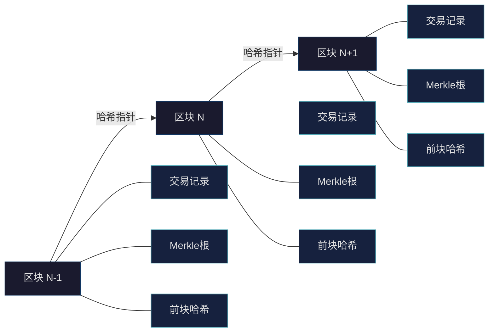
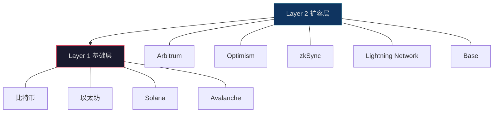
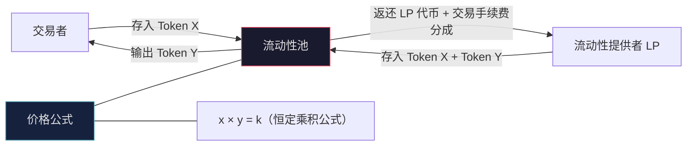
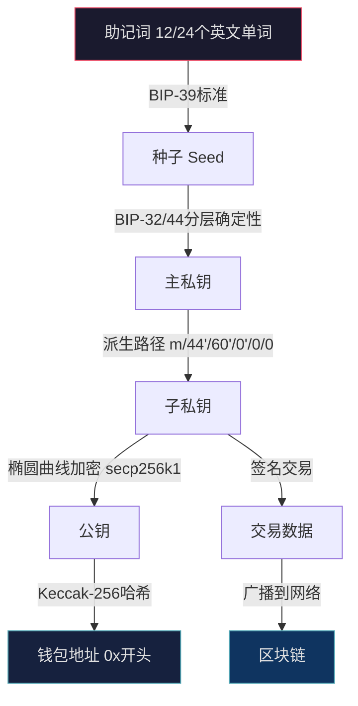
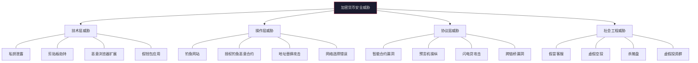
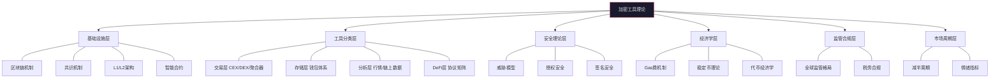

## 五、加密货币工具理论

加密货币工具与传统金融工具存在本质差异。传统金融工具运行在中心化基础设施之上——银行账本由银行维护，股票交易由券商撮合，基金净值由基金公司计算。而加密货币工具运行在区块链这一去中心化基础设施上，交易记录由全球数千个节点共同维护，资产由密码学私钥控制，智能合约替代了中心化的中介角色。理解这些底层差异，是正确使用加密货币工具的前提。

### 5.1 区块链：加密工具的基础设施

#### 5.1.1 区块链的核心机制

区块链是一个由区块按时间顺序链接而成的分布式账本。每个区块包含一批交易记录，通过哈希指针与前一个区块相连，形成不可篡改的链式结构。



**区块链的四个核心属性**：

| 属性 | 含义 | 对工具的影响 |
|------|------|-------------|
| 去中心化 | 没有单一控制方，数据分布在数千个节点 | 工具不需要信任单一机构，但需要连接到节点才能获取数据 |
| 不可篡改 | 交易一旦上链就无法修改或删除 | 转账操作不可逆，发送到错误地址无法撤回 |
| 透明性 | 所有交易记录对所有人公开可查 | 链上分析工具可以追踪任何地址的资金流向 |
| 可编程性 | 智能合约可以自动执行预设逻辑 | DeFi 工具、NFT 市场等都建立在智能合约之上 |

这四个属性直接决定了加密货币工具的设计逻辑。传统券商的交易系统是封闭的黑箱，你无法查看其他用户的交易记录；而区块链上的每一笔交易都可以通过区块浏览器查看，这催生了链上分析工具这一全新的品类。

#### 5.1.2 共识机制与工具的关系

共识机制决定了区块链如何在没有中心化权威的情况下达成一致。它直接影响工具的使用体验：

| 共识机制 | 代表链 | 出块时间 | 交易确认 | 对用户的影响 |
|----------|--------|----------|----------|-------------|
| PoW（工作量证明） | 比特币 | 约 10 分钟 | 6 个确认约 60 分钟 | 提币到账慢，适合大额不急的操作 |
| PoS（权益证明） | 以太坊 | 约 12 秒 | 32 个确认约 6 分钟 | 到账较快，日常使用体验好 |
| DPoS（委托权益证明） | EOS、TRON | 约 0.5-3 秒 | 几乎即时 | 高频操作友好，但去中心化程度较低 |
| BFT 类 | Solana、Avalanche | 约 0.4-2 秒 | 几乎即时 | 速度快但偶尔网络中断 |

**实际影响**：当你在交易所提币时，到账时间取决于目标链的共识机制和网络拥堵程度。比特币网络在拥堵时，确认时间可能从 10 分钟延长到数小时，矿工费也会飙升。以太坊在 2022 年完成合并（The Merge）从 PoW 转向 PoS 后，能耗降低了 99.95%，但出块时间从约 13 秒缩短到约 12 秒，用户体验略有改善。

#### 5.1.3 Layer 1 与 Layer 2：分层架构

理解区块链的分层架构，是理解加密工具生态的基础。



**Layer 1（基础层）**是独立运行的区块链，拥有自己的共识机制、节点网络和安全模型。比特币、以太坊、Solana 都是 Layer 1。Layer 1 的问题是"不可能三角"——去中心化、安全性、可扩展性三者最多同时满足两个。比特币和以太坊优先保证了去中心化和安全性，导致交易处理速度有限（比特币每秒约 7 笔，以太坊约 15-30 笔）。

**Layer 2（扩容层）**建立在 Layer 1 之上，将大量交易在链下处理，定期将结果提交到 Layer 1 进行最终确认。这大幅降低了交易费用和确认时间，同时继承了 Layer 1 的安全性。

**为什么这对工具选择很重要？** 以太坊主网上的 DeFi 操作 Gas 费可能高达 10-50 美元一笔，而在 Arbitrum 上同样的操作只需 0.1-1 美元。如果你的单笔交易金额低于 1,000 美元，在主网上操作可能因为 Gas 费而完全不划算。选择在哪个链上操作，直接决定了工具的使用成本。

#### 5.1.4 智能合约：可编程的金融协议

智能合约是存储在区块链上的程序，在满足预设条件时自动执行。它是 DeFi、NFT、DAO 等应用的技术基础。

```solidity
// 简化的智能合约示例：一个最简单的转账合约
// 用于说明智能合约的基本逻辑，实际合约远比这复杂

contract SimpleTransfer {
    mapping(address => uint256) public balances;
    
    // 存入资金
    function deposit() public payable {
        balances[msg.sender] += msg.value;
    }
    
    // 转账：满足条件时自动执行
    function transfer(address to, uint256 amount) public {
        require(balances[msg.sender] >= amount, "余额不足");
        balances[msg.sender] -= amount;
        balances[to] += amount;
    }
}
```

**智能合约对工具使用者的意义**：

1. **DeFi 协议的本质就是智能合约**。Uniswap（去中心化交易所）、Aave（借贷协议）、Lido（质押协议）都是部署在以太坊上的智能合约集合。当你在这些平台上操作时，你是在与智能合约交互，而不是与公司交互。
2. **智能合约的风险是代码风险**。传统金融中，银行出问题有监管机构兜底；智能合约出漏洞，资金可能被永久锁定或被盗，且没有追回机制。2022 年 DeFi 领域因合约漏洞损失超过 30 亿美元。
3. **合约审计是安全的基本保障**。经过 CertiK、Trail of Bits、OpenZeppelin 等知名审计公司审计的合约，安全性显著高于未经审计的合约。但审计也不是万无一失的——审计过的合约也可能被攻击。

### 5.2 加密货币工具的分类体系

加密货币工具生态已经发展得相当庞大。从功能角度，可以将其分为以下六大类：

```mermaid
graph TD
    A[加密货币工具生态] --> B[交易层]
    A --> C[存储层]
    A --> D[分析层]
    A --> E[DeFi层]
    A --> F[开发层]
    A --> G[合规层]
    
    B --- B1[中心化交易所 CEX]
    B --- B2[去中心化交易所 DEX]
    B --- B3[聚合器]
    
    C --- C1[托管钱包]
    C --- C2[非托管钱包]
    C --- C3[硬件钱包]
    
    D --- D1[行情数据]
    D --- D2[链上分析]
    D --- D3[社交情绪]
    
    E --- E1[借贷协议]
    E --- E2[流动性挖矿]
    E --- E3[质押服务]
    E --- E4[衍生品]
    
    F --- F1[区块浏览器]
    F --- F2[开发框架]
    F --- F3[节点服务]
    
    G --- G1[税务工具]
    G --- G2[合规监控]
    G --- G3[身份验证]
    
    style A fill:#1a1a2e,stroke:#e94560,color:#e0e0e0
    style B fill:#16213e,stroke:#0f3460,color:#e0e0e0
    style C fill:#16213e,stroke:#0f3460,color:#e0e0e0
    style D fill:#16213e,stroke:#0f3460,color:#e0e0e0
    style E fill:#16213e,stroke:#0f3460,color:#e0e0e0
    style F fill:#16213e,stroke:#0f3460,color:#e0e0e0
    style G fill:#16213e,stroke:#0f3460,color:#e0e0e0
```



#### 5.2.1 交易层工具

交易层是用户与加密市场直接交互的入口，分为中心化和去中心化两大类。

**中心化交易所（CEX）的运行原理**：

中心化交易所采用订单簿（Order Book）模式。交易所维护一个买卖订单列表，买方出价（Bid），卖方要价（Ask），当买卖价格匹配时成交。交易所充当交易双方的对手方和资产托管方。

| 运作环节 | 具体机制 | 用户感知 |
|----------|----------|----------|
| 挂单（Maker） | 用户提交限价单，进入订单簿等待匹配 | 设置买入/卖出价格后等待成交 |
| 吃单（Taker） | 用户提交市价单，立即与已有订单匹配 | 点击"市价买入"立即成交 |
| 资产托管 | 用户资产存入交易所热钱包/冷钱包 | 充值后在"现货账户"看到余额 |
| 结算 | 交易所内部记账，不产生链上交易 | 卖出后立刻看到法币/USDT 余额 |
| 提币 | 交易所发起链上转账 | 提币后等待区块确认 |

**中心化交易所的核心风险**：

1. **托管风险**：交易所持有你的私钥，如果交易所被黑客攻击或内部挪用资金，你的资产可能损失。2022 年 FTX 暴雷导致约 80 亿美元用户资产无法提取。
2. **监管风险**：交易所可能因监管政策变化限制某些功能或关闭服务。2021 年中国全面禁止加密货币交易后，火币、OKX 等交易所清退了中国大陆用户。
3. **系统风险**：在极端行情下，交易所可能出现宕机、插针（价格异常波动）、无法平仓等问题。

**去中心化交易所（DEX）的运行原理**：

DEX 不依赖中心化的订单簿，而是通过自动做市商（AMM，Automated Market Maker）机制实现交易。AMM 的核心是流动性池（Liquidity Pool）——用户提供代币对存入池中，交易者直接与池子交互完成兑换。



AMM 最经典的公式是 Uniswap V2 的恒定乘积公式 x × y = k。其中 x 和 y 分别是流动性池中两种代币的数量，k 是常数。当交易者用 Token X 换取 Token Y 时，池中 x 增加、y 减少，Token Y 的价格自动上涨。这种机制的优点是无需对手方即可交易，缺点是大额交易会产生显著的价格滑点（Slippage）。

**CEX 与 DEX 的对比**：

| 维度 | CEX（中心化交易所） | DEX（去中心化交易所） |
|------|-------------------|---------------------|
| 资产控制 | 交易所托管 | 用户自持私钥 |
| 交易机制 | 订单簿撮合 | AMM 自动做市 |
| 身份验证 | 强制 KYC | 无需 KYC |
| 交易速度 | 极快（毫秒级） | 取决于区块链确认速度 |
| 费用 | 手续费 0.02%-0.6% | Gas 费 + 0.01%-0.3% |
| 流动性 | 高（主流币种） | 中低（长尾代币流动性差） |
| 可用币种 | 数百到数千种 | 数十万种（含大量垃圾代币） |
| 审查风险 | 可能被冻结账户 | 无人可以冻结你的账户 |
| 适合人群 | 新手、大额交易者 | 有经验的用户、DeFi 参与者 |

**聚合器（Aggregator）**是连接多个 DEX 的智能路由工具。当用户在 1inch 或 Paraswap 上交易时，聚合器会自动在 Uniswap、SushiSwap、Curve 等多个 DEX 中寻找最优价格，将交易拆分到不同池子以减少滑点。聚合器的价值在于：用户不需要逐个比较各个 DEX 的价格，工具自动完成最优路由。

#### 5.2.2 存储层工具：钱包体系

钱包是管理私钥的工具，而不是存放资产的"容器"——资产始终在区块链上，钱包只是管理访问这些资产的密码。

**钱包的技术原理**：



BIP-39（Bitcoin Improvement Proposal 39）定义了助记词标准。12 个英文单词从 2,048 个候选词中选出，提供 128 位熵（加上 4 位校验码），总共 132 位。这 12 个单词可以确定性地生成所有私钥——只需要备份这 12 个词，就可以在任何兼容的钱包软件中恢复所有资产。

BIP-32 定义了分层确定性（HD）钱包结构，允许从一个种子派生出无限多个子私钥。这意味着你可以为每次交易使用不同的地址，提高隐私性，但只需要备份一个助记词。

**钱包类型的技术差异**：

| 类型 | 私钥存储位置 | 签名过程 | 安全边界 | 典型产品 |
|------|-------------|----------|----------|----------|
| 热钱包（浏览器/手机） | 设备本地存储 | 在联网设备上签名 | 软件层面隔离 | MetaMask、Trust Wallet |
| 冷钱包（硬件） | 安全芯片（SE）中 | 在离线设备上签名，签名后通过 USB/蓝牙 传输 | 物理隔离 | Ledger、Trezor |
| 多签钱包 | 多个私钥持有者分别保管 | 需要 M-of-N 个签名才能执行 | 多人制衡 | Gnosis Safe |
| 智能合约钱包 | 合约逻辑控制 | 可编程（社交恢复、日限额等） | 合约代码安全 | Argent、Safe |
| 托管钱包 | 第三方机构持有 | 第三方代为签名 | 机构信用 | 交易所钱包 |

**硬件钱包的安全模型**：硬件钱包的核心是安全芯片（Secure Element），与银行卡芯片类似。私钥生成和存储在安全芯片中，永远不会离开设备。当需要签名交易时，交易数据通过 USB 或蓝牙发送到硬件钱包，在芯片内部完成签名，签名结果返回电脑/手机。即使电脑被黑客控制，黑客也只能看到交易数据，无法获取私钥。

**助记词的安全理论**：12 个助记词的安全性等价于 128 位随机数。暴力破解需要尝试 2^128 种可能，以目前最强的超级计算机计算，所需时间远超宇宙年龄。因此，助记词泄露的主要风险不是暴力破解，而是物理泄露（被人看到）、钓鱼攻击（被骗输入）和存储不当（存到联网设备）。

#### 5.2.3 分析层工具

分析层工具帮助用户理解市场状态和投资标的，是做出理性决策的基础。

**行情数据工具的原理**：

行情数据工具（如 CoinGecko、CoinMarketCap）通过 API 从数百个交易所采集价格数据，计算加权平均价格、市值、交易量等指标。它们不直接参与交易，而是提供数据聚合和展示服务。

行情数据的关键指标：

| 指标 | 计算方式 | 使用场景 |
|------|----------|----------|
| 价格 | 多交易所加权平均 | 了解代币当前价值 |
| 市值 | 价格 × 流通供应量 | 判断代币的市场规模 |
| 完全稀释市值 | 价格 × 总供应量 | 判断代币的潜在估值上限 |
| 24 小时交易量 | 过去 24 小时所有交易所的成交总额 | 判断流动性活跃程度 |
| 流通量 | 当前已发行且在市场流通的代币数量 | 判断实际供给 |
| 总供应量 | 已发行的代币总量（含锁仓） | 判断长期通胀压力 |
| 最大供应量 | 代币理论上限 | 判断是否有硬顶限制 |

**链上分析工具的原理**：

区块链的透明性使得链上分析成为可能。链上分析工具从区块链节点获取原始交易数据，通过地址标签识别、资金流图谱构建、指标计算等手段，将原始数据转化为有意义的分析结论。

主要链上指标的理论基础：

| 指标 | 理论基础 | 预测逻辑 |
|------|----------|----------|
| MVRV（市值/已实现市值） | 已实现市值 = 每枚代币最后一次移动时的价格 × 数量。当 MVRV 远高于 1，说明持有者整体浮盈大，有获利了结动机 | MVRV > 3.5 时市场过热概率高，< 1 时市场底部概率高 |
| NUPL（净未实现盈亏） | 未实现盈亏 = 当前市值 - 已实现市值。NUPL 将这个值标准化到 0-1 区间 | NUPL > 0.75 表示极度贪婪，< 0 表示持有者整体亏损（恐惧投降） |
| SOPR（已花费产出利润率） | 衡量当天链上移动的代币，卖出者平均是盈利还是亏损 | SOPR 持续 < 1 说明持有者在亏损割肉，通常是市场底部信号 |
| 交易所净流入 | 流入交易所的代币量 - 流出交易所的代币量。流入通常意味着准备卖出 | 大量净流入是短期看跌信号 |
| 活跃地址数 | 每日参与交易的独立地址数量 | 活跃地址增加通常伴随价格上涨 |
| 巨鲸持仓变化 | 持有大量代币的地址（通常 > 1,000 BTC）的持仓变化 | 巨鲸持续增持通常是中长期看涨信号 |

**链上分析的局限性**：链上数据是客观的，但解读是主观的。MVRV 在 2021 年 2 月达到 3.0 后市场继续上涨到 4 月才见顶；仅凭单一指标做交易决策是危险的。链上指标更适合作为"温度计"——判断市场处于什么阶段，而不是精确的买卖信号。

#### 5.2.4 DeFi 工具

DeFi（Decentralized Finance，去中心化金融）是加密货币工具中最复杂也最具创新性的类别。DeFi 协议通过智能合约在链上重建了传统金融的核心功能——借贷、交易、保险、衍生品——但没有中心化的中介。

**DeFi 的核心协议类型**：

| 协议类型 | 代表项目 | 核心机制 | 收益来源 | 主要风险 |
|----------|----------|----------|----------|----------|
| 去中心化交易所（DEX） | Uniswap、Curve | AMM 流动性池 | 交易手续费分成 | 无常损失、智能合约漏洞 |
| 借贷协议 | Aave、Compound | 超额抵押借贷 | 利息收入 | 清算风险、合约漏洞 |
| 流动性质押 | Lido、Rocket Pool | 质押 ETH 获得 stETH | 质押奖励 | 脱锚风险、罚没风险 |
| 稳定币 | MakerDAO（DAI）、USDC | 超额抵押或法币储备 | 稳定性 | 脱锚风险、监管风险 |
| 收益聚合器 | Yearn Finance | 自动寻找最优收益策略 | 策略收益 | 策略风险、合约漏洞 |
| 衍生品 | GMX、dYdX | 永续合约、期权 | 交易手续费/权利金 | 高杠杆爆仓、预言机操纵 |

**流动性挖矿的经济模型**：

流动性挖矿是 DeFi 的核心激励机制。协议通过发行治理代币来奖励为协议提供流动性或使用协议的用户。其经济逻辑是：协议需要流动性 → 用户提供流动性获得代币奖励 → 代币赋予治理权和价值捕获 → 流动性推动协议增长 → 协议增长提升代币价值。

但这个模型存在"死亡螺旋"风险：如果代币价格下跌 → 挖矿收益率下降 → 流动性撤出 → 协议功能受损 → 代币价格进一步下跌。2022 年多个 DeFi 协议经历了这种螺旋崩溃。

**无常损失（Impermanent Loss）理论**：

无常损失是 AMM 流动性提供者面临的特有风险。当你向 Uniswap 的 ETH/USDC 池提供流动性时，你需要同时存入 ETH 和 USDC。当 ETH 价格上涨时，AMM 会自动卖出 ETH 买入 USDC 以维持恒定乘积，导致你的持仓 ETH 数量减少。如果你只是持有 ETH 而不提供流动性，你的收益会更高。这个差异就是无常损失。

无常损失的数学关系：

| 价格变动幅度 | 无常损失（相对持有） |
|-------------|-------------------|
| 1.25x（涨 25%） | -0.6% |
| 1.50x（涨 50%） | -2.0% |
| 2x（涨 100%） | -5.7% |
| 3x（涨 200%） | -13.4% |
| 5x（涨 400%） | -25.5% |

只有当交易手续费收入 > 无常损失时，提供流动性才是划算的。这就是为什么高波动性的代币对往往提供更高的手续费率——补偿更高的无常损失风险。

#### 5.2.5 区块浏览器

区块浏览器是区块链的"搜索引擎"，用于查询交易记录、地址余额、合约信息等链上数据。它是最基础、最常用的加密工具之一。

| 区块浏览器 | 覆盖链 | 核心功能 |
|-----------|--------|----------|
| Etherscan | 以太坊及 EVM 链 | 交易查询、合约验证、Gas 追踪、Token 分析 |
| Blockchain.com | 比特币 | 交易查询、地址余额、区块信息 |
| Solscan | Solana | 交易查询、代币分析、NFT 追踪 |
| Arbiscan | Arbitrum | 以太坊 L2 的交易和合约查询 |
| OKLink | 多链 | 跨链查询、地址标签、资金流图谱 |

**区块浏览器的进阶用法**：

1. **合约验证**：在 Etherscan 上查看智能合约源代码是否已验证。已验证的合约可以查看完整源代码，未验证的只能看到编译后的字节码。投资前应优先选择已验证合约的项目。
2. **Token 追踪**：查看特定代币的持有者分布。如果前 10 个地址持有 90% 的代币，说明持仓高度集中，存在"拉盘砸盘"的风险。
3. **Gas 追踪**：查看当前 Gas 价格和历史趋势，选择 Gas 较低的时段执行交易以节省费用。
4. **内部交易**：查看合约之间的调用关系，分析复杂的 DeFi 操作实际发生了什么。

### 5.3 加密货币工具的安全理论

#### 5.3.1 威胁模型分析

加密货币领域的安全威胁与传统金融完全不同。传统金融中，银行承担了大部分安全责任；加密货币中，用户是自己资产的唯一守护者。

**威胁分类**：



**每类威胁的具体机制**：

| 威胁类型 | 攻击方式 | 防御措施 |
|----------|----------|----------|
| 私钥泄露 | 恶意软件扫描设备上的助记词/私钥文件 | 助记词只离线存储，使用硬件钱包 |
| 剪贴板劫持 | 恶意程序将复制的地址替换为攻击者的地址 | 转账前手动核对地址前 4 位和后 4 位 |
| 钓鱼网站 | 仿造交易所/钱包官网，诱导输入助记词或连接钱包 | 只从书签访问，检查 SSL 证书和域名 |
| 授权钓鱼 | 诱导用户签署恶意的 Token 授权（approve），授权攻击者转移资产 | 仔细阅读签名请求内容，使用 Revoke.cash 定期清理授权 |
| 闪电贷攻击 | 在一个交易内借入大量资金操纵价格或治理投票 | 不参与未经审计的协议，理解闪电贷机制 |
| 预言机操纵 | 通过操纵价格预言机触发不当清算或套利 | 使用多源预言机的协议（如 Chainlink） |
| 假冒客服 | 在社交媒体上冒充交易所/项目方客服，诱导提供信息 | 正规客服不会主动联系你，不会索要助记词 |

#### 5.3.2 授权模型与风险管理

以太坊及 EVM 链的 Token 授权（ERC-20 approve）是 DeFi 交互中最容易被忽视的安全风险。当你在 DEX 上交易时，你需要先授权 DEX 合约使用你的代币。如果授权的是"无限额度"（unlimited approve），该合约在未来任何时候都可以转走你的全部该代币。

**授权风险的演进**：

1. **无限授权（legacy approve）**：授权合约可以使用你的全部代币余额。这是最危险的模式，但许多 DApp 默认使用。
2. **精确授权（exact approve）**：只授权本次交易需要的数量。更安全但需要每次交易前重新授权，增加 Gas 成本。
3. **EIP-2612（permit）**：通过签名（而非链上交易）完成授权，支持授权过期时间。这是最新的标准，兼顾安全和便利。

**授权管理实践**：

使用 Revoke.cash（`revoke.cash`）或 Etherscan 的 Token Approvals 工具定期检查和清理你的授权。建议每月清理一次，撤销不再使用的 DApp 授权。对于大额资产（超过 1,000 美元），使用专门的 DeFi 钱包与主钱包隔离。

#### 5.3.3 交易签名的安全理论

每一笔区块链交易都需要用私钥签名才能被网络接受。理解签名的安全含义，是防止资产被盗的最后一道防线。

**签名请求的类型**：

| 签名类型 | 含义 | 风险等级 | 示例 |
|----------|------|----------|------|
| ETH Transfer | 发送 ETH | 低（金额明确） | 向某地址转 1 ETH |
| ERC-20 Transfer | 发送代币 | 低（金额明确） | 向某地址转 100 USDT |
| ERC-20 Approve | 授权合约使用代币 | 中高（可能无限授权） | 授权 Uniswap 使用你的 USDC |
| Permit | 离线授权 | 中（可能无限授权） | 授权 DEX 使用你的代币 |
| Sign Message | 签名一条消息 | 低（不涉及资产转移） | 登录 DApp、投票 |
| Contract Interaction | 调用合约函数 | 高（行为取决于合约逻辑） | 质押、借贷、交易 |

**签名安全的核心原则**：

1. **永远不要签署你不理解的交易**。如果钱包弹出的签名请求你无法理解其含义，拒绝签署。
2. **检查交易详情**。MetaMask 等钱包会显示交易的详细信息——发送地址、金额、Gas 费等。确认每一项都符合预期。
3. **警惕"SetApprovalForAll"**。这是 NFT 领域最危险的授权，授权合约可以转移你的所有 NFT。除非是可信的交易平台，否则不要签署。
4. **使用硬件钱包**。硬件钱包在物理设备上显示交易详情，即使电脑被感染，恶意软件也无法篡改硬件屏幕上显示的内容。

### 5.4 加密货币工具的经济学原理

#### 5.4.1 Gas 费机制

Gas 费是用户为使用区块链网络支付的费用。它补偿验证者处理和存储交易的计算成本。理解 Gas 费机制，是控制交易成本的关键。

**以太坊 EIP-1559 费用模型**：

2021 年 8 月以太坊伦敦升级引入了 EIP-1559 费用机制，将 Gas 费拆分为两部分：

```text
总费用 = (Base Fee + Priority Fee) × Gas Used

├── Base Fee（基础费）
│   ├── 由网络根据拥堵程度自动调整
│   ├── 每个区块最多变化 12.5%
│   ├── 这部分费用被销毁（burned），不归矿工/验证者
│   └── 以太坊在网络活跃时处于通缩状态
│
├── Priority Fee（优先费/小费）
│   ├── 用户自愿支付，用于激励验证者优先处理
│   ├── 通常 1-3 Gwei 即可
│   └── 网络拥堵时需要提高
│
└── Gas Used（实际消耗的 Gas）
    ├── 简单转账：21,000 Gas
    ├── ERC-20 转账：约 65,000 Gas
    ├── DEX 交易：约 150,000-300,000 Gas
    └── 复杂 DeFi 操作：500,000+ Gas
```

**Gas 费优化策略**：

| 策略 | 原理 | 节省幅度 |
|------|------|----------|
| 选择低峰时段交易 | 基础费在周末和亚洲夜间通常较低 | 20%-50% |
| 使用 L2 网络 | L2 的 Gas 费远低于 L1 | 90%-99% |
| 设置 Gas 上限 | 在钱包中手动设置低于推荐值的 Gas 价格 | 10%-30%（但可能延长确认时间） |
| 批量交易 | 通过合约一次执行多笔操作 | 30%-60% |
| 使用限价单而非市价单 | 等待 Gas 费低时自动执行 | 取决于市场条件 |

#### 5.4.2 稳定币理论

稳定币是加密货币工具生态的基础设施。它是价值相对稳定的加密代币，通常锚定美元（1 稳定币 ≈ 1 美元）。稳定币解决了加密货币价格波动大的问题，使得加密工具可以用于日常支付、DeFi 借贷、交易对计价等场景。

**稳定币的三种模型**：

| 模型 | 机制 | 代表 | 优点 | 缺点 |
|------|------|------|------|------|
| 法币抵押 | 1:1 美元储备支持 | USDC、USDT | 价格最稳定 | 中心化、需要信任发行方、监管风险 |
| 加密货币超额抵押 | 150%+ 加密资产抵押 | DAI（MakerDAO） | 去中心化 | 资本效率低、抵押物波动风险 |
| 算法稳定币 | 算法调节供应量 | UST（已崩盘）、FRAX | 资本效率高 | 死亡螺旋风险、UST 崩盘损失 400 亿美元 |

**稳定币风险的教训**：2022 年 5 月 UST/LUNA 崩盘是加密史上最大的系统性风险事件之一。UST 是一种算法稳定币，通过与 LUNA 的铸造/销毁机制维持锚定。当市场信心动摇、大量 UST 被抛售时，铸造出的 LUNA 数量暴增导致 LUNA 价格暴跌，进一步削弱 UST 的锚定信心，形成死亡螺旋。3 天内 UST 从 1 美元跌至 0.1 美元以下，LUNA 从 80 美元跌至几乎为零。

这个案例说明：稳定币的选择不是无关紧要的工具选择，而是影响资产安全的重大决策。优先选择经过市场验证、审计透明、有充足储备的稳定币。

#### 5.4.3 代币经济学（Tokenomics）

理解代币经济学是评估加密项目投资价值的基础。代币经济学决定了代币的供给、分配和价值捕获机制。

**代币经济学的核心维度**：

| 维度 | 关键问题 | 分析方法 |
|------|----------|----------|
| 供给机制 | 通缩还是通胀？有没有硬顶？ | 查看白皮书的货币政策章节 |
| 分配方案 | 团队/投资人/社区各占多少？ | 查看代币分配饼图和解锁时间表 |
| 解锁计划 | 何时释放大量代币？ | 查看 Token Unlocks 等工具的解锁日历 |
| 价值捕获 | 协议收入如何回流到代币持有者？ | 分析手续费分配、回购销毁机制 |
| 治理权 | 持有代币能做什么决定？ | 查看治理论坛和提案历史 |
| 质押收益 | 质押能获得多少收益？ | 考虑通胀稀释后的实际收益 |

**代币解锁的影响**：大量代币解锁（如团队/投资人份额解锁）通常会对价格产生下行压力。2023 年多个项目的代币解锁后价格下跌 20%-50%。投资者应提前查看解锁日历，在大额解锁前评估是否需要调整仓位。

### 5.5 加密货币工具的监管框架

#### 5.5.1 全球监管格局

加密货币监管在全球范围内差异巨大。理解监管环境是合规使用加密工具的前提。

| 地区 | 监管态度 | 关键政策 | 对用户的影响 |
|------|----------|----------|-------------|
| 美国 | 严格监管 | SEC 将多数代币视为证券；CFTC 监管衍生品 | 交易所强制 KYC，税务申报义务严格 |
| 欧盟 | 系统性监管 | MiCA（加密资产市场法规）2024 年生效 | 统一监管框架，交易所需持牌运营 |
| 日本 | 友好但严格 | 交易所需获得 FSA 牌照 | 安全性高但可选币种较少 |
| 新加坡 | 开放 | MAS 发放支付牌照 | 亚太地区的加密金融中心 |
| 中国大陆 | 全面禁止 | 2021 年 9 月全面禁止加密货币交易和挖矿 | 无法直接通过国内平台交易，需使用境外平台 |
| 中国香港 | 逐步开放 | 2023 年发放首批零售交易牌照 | 合规交易所可向零售用户开放 |

**中国大陆用户的合规要点**：

1. 个人持有加密货币不违法，但交易所和挖矿活动被禁止。
2. C2C（P2P）交易存在灰色地带，银行账户可能因频繁加密货币相关转账被风控。
3. 出金时需要注意资金来源合法性，避免收到涉案资金导致银行卡冻结。
4. 加密货币收益是否需要缴纳个税，目前法律没有明确规定，但存在被追缴的风险。

#### 5.5.2 税务合规理论

在大多数国家和地区，加密货币交易收益需要纳税。税务处理方式因国家而异，但普遍遵循以下原则：

| 事件类型 | 税务处理（以美国为例） | 中国参考 |
|----------|----------------------|----------|
| 持有 | 不产生应税事件 | 无明确规定 |
| 卖出获利 | 资本利得税（持有 < 1 年为短期，> 1 年为长期） | 无明确规定 |
| 币币交换 | 视为卖出原币 + 买入新币，产生应税事件 | 无明确规定 |
| 质押收益 | 视为收入，按收到时的市价计入 | 无明确规定 |
| 空投 | 视为收入，按收到时的市价计入 | 无明确规定 |
| DeFi 收益 | 复杂，不同司法管辖区处理不同 | 无明确规定 |

**税务工具**：Koinly、CoinTracker、TokenTax 等工具可以自动导入交易所和钱包的交易记录，计算应税收益，生成税务报告。这些工具支持对接主流交易所 API 和区块链地址，大幅降低了手动计算的复杂度。

### 5.6 加密货币工具的市场周期理论

#### 5.6.1 比特币减半周期

比特币的供给由协议硬编码：每 210,000 个区块（约 4 年），区块奖励减半。这个机制创造了一个可预测的供给冲击周期。

| 减半时间 | 区块奖励 | 减半后价格走势 |
|----------|----------|---------------|
| 2012 年 11 月 | 50 → 25 BTC | 减半后 12 个月涨至 1,000 美元（+8,000%） |
| 2016 年 7 月 | 25 → 12.5 BTC | 减半后 18 个月涨至 20,000 美元（+3,000%） |
| 2020 年 5 月 | 12.5 → 6.25 BTC | 减半后 12 个月涨至 64,000 美元（+600%） |
| 2024 年 4 月 | 6.25 → 3.125 BTC | 进行中 |

减半周期对工具使用的影响：在减半前后的牛市阶段，交易所注册量激增、Gas 费飙升、新项目集中上线。工具的基础设施承载能力受到考验——2021 年牛市期间，多个交易所出现宕机。投资者应提前做好工具配置，在市场冷却期完成开户、安全设置、钱包安装等准备工作，而不是在市场狂热期才开始。

#### 5.6.2 恐惧贪婪指数

恐惧贪婪指数（Crypto Fear & Greed Index）是一个 0-100 的综合指标，衡量加密市场的整体情绪。

| 分数区间 | 情绪状态 | 历史表现 |
|----------|----------|----------|
| 0-25 | 极度恐惧 | 通常是中长期买入机会 |
| 25-45 | 恐惧 | 市场处于下行或盘整阶段 |
| 45-55 | 中性 | 市场方向不明确 |
| 55-75 | 贪婪 | 市场处于上行阶段 |
| 75-100 | 极度贪婪 | 短期过热风险高 |

恐惧贪婪指数的计算因子：波动性（25%）、市场动量和交易量（25%）、社交媒体情绪（15%）、比特币主导地位（10%）、Google 趋势（10%）。

**逆向投资理论**：恐惧贪婪指数的核心价值在于逆向思维——当所有人都极度恐惧时，资产往往被低估；当所有人都极度贪婪时，资产往往被高估。沃伦·巴菲特的名言"在别人恐惧时贪婪，在别人贪婪时恐惧"在加密市场同样适用，但需要结合其他分析工具综合判断。

### 5.7 加密货币工具的选型框架

#### 5.7.1 工具选择的决策矩阵

面对数千种加密工具，如何选择适合自己的工具组合？以下是一个系统的选型框架：

| 评估维度 | 初级用户 | 中级用户 | 高级用户 |
|----------|----------|----------|----------|
| 交易所 | 1 个主流 CEX（币安或 OKX） | 2 个 CEX + 1 个 DEX | CEX + 多个 DEX + 聚合器 |
| 钱包 | 交易所内置钱包 | 1 个软件钱包（MetaMask） | 软件钱包 + 硬件钱包 + 多签 |
| 行情 | CoinGecko 或 CoinMarketCap | TradingView + CoinGecko | TradingView + Glassnode + Dune |
| 链上查询 | 交易所自带记录 | Etherscan | 多链浏览器 + Nansen |
| 安全 | 2FA + 强密码 | 2FA + 地址白名单 + 助记词备份 | 硬件钱包 + 多签 + 定期审计授权 |
| DeFi | 不参与 | 1-2 个主流协议（Aave、Lido） | 多协议组合策略 |
| 税务 | 手动记录 | Koinly 等工具辅助 | 专业税务顾问 + 自动化工具 |

#### 5.7.2 常见工具选型误区

| 误区 | 纠正 |
|------|------|
| 只看手续费选交易所 | 安全性和流动性比手续费更重要——便宜的交易所可能在关键时刻宕机或限制提币 |
| 把所有资产放在交易所 | FTX 教训：交易所不是银行，没有存款保险。大额资产应转移到自持钱包 |
| 使用多个钱包增加安全性 | 钱包越多，管理复杂度越高，助记词泄露风险越大。2-3 个钱包足够 |
| 免费工具一定比付费工具差 | 大多数免费工具（CoinGecko、Etherscan、DeFi Llama）质量极高，付费工具只在专业需求时才有必要 |
| 用手机短信做 2FA | SIM 卡可被克隆攻击（SIM Swap），应使用 Google Authenticator 或硬件密钥 |
| 追逐新工具和新功能 | 熟练掌握少量核心工具，比浅尝辄止大量工具有价值得多 |

### 5.8 加密货币工具的发展趋势

#### 5.8.1 账户抽象（Account Abstraction）

传统加密钱包基于外部拥有账户（EOA），用户必须管理私钥和助记词，每次交易都需要手动签名和支付 Gas 费。这是加密货币被普通用户广泛采用的最大障碍之一。

账户抽象（ERC-4337）允许用户使用智能合约作为主账户，实现：

| 功能 | EOA 钱包（现状） | 智能合约钱包（账户抽象） |
|------|-----------------|------------------------|
| 账户恢复 | 只能通过助记词 | 社交恢复（指定信任的人帮助恢复） |
| Gas 支付 | 必须用 ETH | 可以用任意代币支付，或由项目方代付 |
| 交易授权 | 每笔交易都要手动签名 | 可设置规则自动执行（如日限额内自动签名） |
| 批量交易 | 不支持 | 多笔操作合并为一笔交易 |
| 多因素认证 | 不支持 | 可设置多签或生物识别 |

账户抽象将大幅降低新手使用加密工具的门槛，但目前仍处于早期阶段。

#### 5.8.2 跨链互操作性

当前加密生态存在数百条独立的区块链，资产和数据在不同链之间转移需要通过跨链桥。跨链桥是加密生态中最脆弱的环节之一——2022 年跨链桥攻击造成的损失超过 20 亿美元。

未来趋势是跨链互操作协议（如 Chainlink CCIP、LayerZero）提供更安全的跨链通信，以及意图（Intent）驱动的交易模式——用户只需表达"我要把 Arbitrum 上的 ETH 换成 Solana 上的 SOL"，协议自动寻找最优的跨链路径。

#### 5.8.3 AI 与加密工具的融合

AI 技术正在与加密工具深度融合：

| 应用场景 | 现状 | 发展方向 |
|----------|------|----------|
| 交易策略 | 基于规则的量化策略 | AI 驱动的自适应策略 |
| 链上分析 | 手动查询和解读数据 | AI 自动识别异常模式和投资机会 |
| 安全防护 | 人工审计合约 | AI 自动检测可疑交易和恶意合约 |
| 用户体验 | 手动操作每一步 | AI 助手自动完成复杂 DeFi 操作 |
| 风险评估 | 基于历史数据的简单模型 | AI 综合多维度数据的实时风险评估 |

### 5.9 本节小结

加密货币工具理论的核心认知框架：



**关键要点**：

1. **理解基础设施再使用工具**。区块链的分层架构、共识机制、智能合约原理直接影响工具的使用方式和成本。不理解这些基础，在使用中会犯低级错误（如选错网络导致资产丢失）。
2. **安全是第一优先级**。加密货币领域的安全威胁与传统金融完全不同。私钥管理、授权控制、签名安全是每个用户必须掌握的基本功。一次安全失误可能导致永久性的资产损失，没有客服可以帮你追回。
3. **工具选择匹配自身阶段**。初学者应从最简单的工具组合开始（1 个 CEX + 1 个行情工具），随着经验增长逐步扩展工具栈。过早使用复杂工具（如 DeFi 协议、量化交易）只会增加风险。
4. **关注经济学原理而非价格**。Gas 费机制、稳定币模型、代币经济学决定了工具的长期可持续性。价格是短期波动的表象，经济模型才是价值的根基。
5. **监管环境持续演变**。全球加密监管正在从"无序"走向"有序"。合规使用工具不仅是法律要求，也是保护自身权益的基础。
