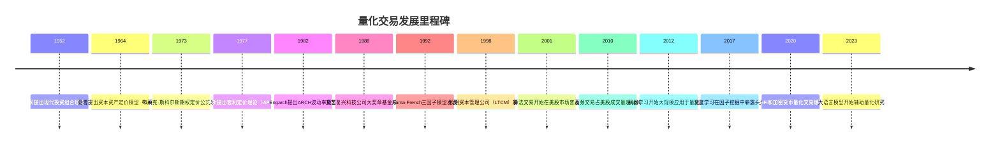
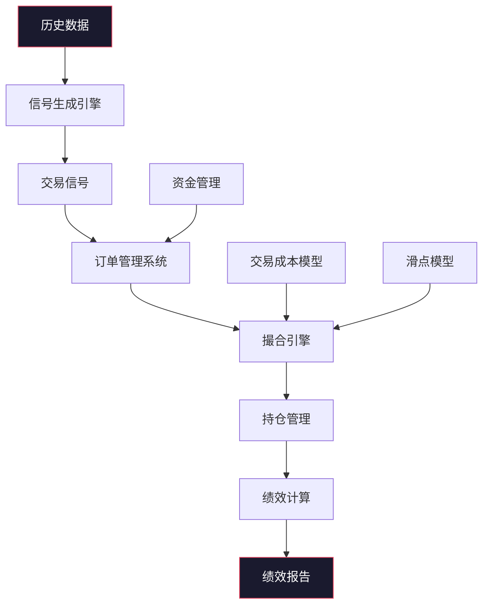
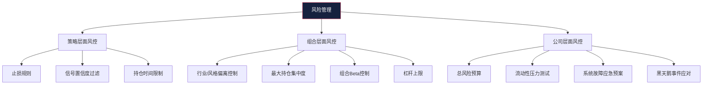
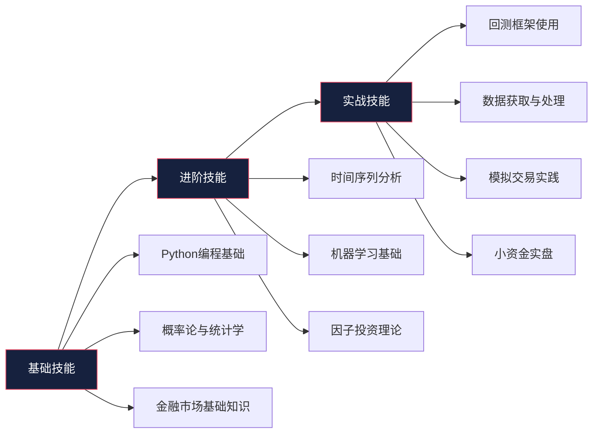

## 六、量化交易理论

### 1. 量化交易的本质与定义

量化交易（Quantitative Trading）是指以数学模型和计算机算法为核心工具，通过对历史数据和实时数据的系统性分析，生成交易信号并执行交易决策的投资方式。它与传统的主观交易（Discretionary Trading）形成鲜明对比——后者依赖交易者的经验、直觉和主观判断，而量化交易追求的是**可重复、可验证、可回测**的系统化决策流程。

量化交易的核心哲学可以浓缩为一句话：**用数据说话，让概率站在自己这边**。单笔交易的盈亏并不重要，重要的是交易系统在大量交易中是否具有正期望值（Positive Expectancy）。

#### 1.1 量化交易与主观交易的本质区别

| 维度 | 量化交易 | 主观交易 |
|------|----------|----------|
| 决策依据 | 数学模型与数据驱动 | 经验、直觉、盘感 |
| 可重复性 | 高，相同输入产生相同信号 | 低，受情绪和状态影响 |
| 回测验证 | 可用历史数据严格回测 | 难以回测，依赖记忆偏差 |
| 情绪影响 | 低，程序自动执行 | 高，贪婪与恐惧干扰判断 |
| 容量上限 | 取决于策略类型和市场流动性 | 取决于个人精力和注意力 |
| 学习曲线 | 需要编程和数学基础 | 需要长期市场经验 |
| 适合市场 | 流动性好、数据完善的市场 | 所有市场，包括新兴市场 |
| 典型持仓周期 | 从毫秒到数月不等 | 通常较灵活 |

#### 1.2 量化交易不等于"全自动炒股"

很多初学者对量化交易存在误解，认为它就是写一个程序自动买卖股票。实际上，量化交易是一个完整的体系，包括：

- **研究阶段**：策略构思、假设形成、数据收集
- **开发阶段**：模型构建、编程实现、参数优化
- **验证阶段**：回测检验、样本外测试、蒙特卡洛模拟
- **执行阶段**：实盘交易、滑点控制、订单管理
- **监控阶段**：绩效跟踪、风险监控、策略迭代

自动化执行只是其中一环，而且并非所有量化交易都追求完全自动化。许多量化基金采用"半自动"模式——模型生成信号，交易员审核后执行。

### 2. 量化交易的发展历程

#### 2.1 从理论到实践的演进

量化交易的发展与金融理论的进步密不可分。理解这段历史，有助于把握量化交易的理论根基。



#### 2.2 中国量化交易的发展

中国量化交易起步较晚，但发展迅猛：

- **2005—2010年**：萌芽期。ETF套利、权证量化等策略出现，参与者以海归量化人才为主。
- **2010—2015年**：成长期。股指期货上市（2010年4月），Alpha策略和期现套利兴起，量化私募开始涌现。
- **2015—2019年**：调整期。股指期货受限（2015年股灾后），量化策略被迫转型，CTA策略和股票多头量化成为主流。
- **2019年至今**：爆发期。股指期货逐步松绑，量化私募规模突破万亿，量化策略百花齐放。幻方量化、九坤投资、明汯投资等头部量化私募管理规模达数百亿。

### 3. 量化交易的理论基础

量化交易并非空中楼阁，它建立在多个学科的理论基础之上。理解这些理论，是设计和评估量化策略的前提。

#### 3.1 现代投资组合理论（MPT）

1952年，哈里·马科维茨（Harry Markowitz）在其博士论文中提出了现代投资组合理论，奠定了量化投资的理论基石。该理论的核心思想是：**投资者不应孤立地看待单个资产的风险和收益，而应关注资产组合的整体风险和收益**。

**核心公式：**

组合预期收益率：
$$E(R_p) = \sum_{i=1}^{n} w_i E(R_i)$$

组合方差（风险）：
$$\sigma_p^2 = \sum_{i=1}^{n} \sum_{j=1}^{n} w_i w_j \sigma_i \sigma_j \rho_{ij}$$

其中：$w_i$ 为资产 $i$ 的权重，$E(R_i)$ 为资产 $i$ 的预期收益率，$\sigma_i$ 为资产 $i$ 的标准差，$\rho_{ij}$ 为资产 $i$ 和 $j$ 的相关系数。

**MPT对量化交易的启示：**

- 分散化可以降低非系统性风险，但不能消除系统性风险
- 存在一条"有效前沿"（Efficient Frontier），在这条曲线上，给定风险水平下收益最大
- 相关性是构建组合的关键——低相关甚至负相关的资产组合在一起，可以在不降低预期收益的情况下降低风险

#### 3.2 资本资产定价模型（CAPM）

威廉·夏普（William Sharpe）在1964年提出的CAPM模型，描述了单个资产的预期收益与系统性风险之间的线性关系：

$$E(R_i) = R_f + \beta_i (E(R_m) - R_f)$$

其中：$R_f$ 为无风险利率，$\beta_i$ 为资产 $i$ 的贝塔系数（衡量系统性风险），$E(R_m)$ 为市场组合的预期收益率。

**CAPM对量化交易的意义：**

- 将资产收益分解为Alpha（超额收益）和Beta（市场收益）两部分
- 量化交易的核心目标之一就是获取Alpha——超越市场的超额收益
- Beta可以通过被动投资（如指数基金）获取，成本低廉；Alpha才是量化策略的价值所在

#### 3.3 套利定价理论（APT）

斯蒂芬·罗斯（Stephen Ross）在1977年提出的APT模型，是CAPM的扩展。APT认为资产收益由多个风险因子共同决定：

$$E(R_i) = R_f + \beta_{i1}F_1 + \beta_{i2}F_2 + \cdots + \beta_{ik}F_k$$

其中：$F_1, F_2, \ldots, F_k$ 为风险因子的预期溢价，$\beta_{ij}$ 为资产 $i$ 对因子 $j$ 的敏感度。

APT比CAPM更加灵活，它不假设市场组合是唯一的定价因子，而是允许多个因子同时影响资产收益。这为后来的多因子量化策略奠定了理论基础。

#### 3.4 Fama-French三因子模型与后续扩展

尤金·法玛（Eugene Fama）和肯尼斯·弗伦奇（Kenneth French）在1992年提出了著名的三因子模型：

$$R_i - R_f = \alpha_i + \beta_1(R_m - R_f) + \beta_2 \cdot SMB + \beta_3 \cdot HML + \epsilon_i$$

- **市场因子（$R_m - R_f$）**：市场组合的超额收益
- **规模因子（SMB，Small Minus Big）**：小市值股票相对大市值股票的超额收益
- **价值因子（HML，High Minus Low）**：高账面市值比（价值股）相对低账面市值比（成长股）的超额收益

后来扩展为五因子模型（2015年），加入了盈利能力因子（RMW）和投资因子（CMA）。

**三因子模型的量化应用：**

- 解释了"小市值效应"和"价值效应"，为因子投资提供了理论依据
- 如果一个策略的收益可以被三因子完全解释，说明它只是承担了已知的风险溢价，并没有真正的Alpha
- 只有在控制了已知因子后仍然存在的超额收益，才是策略真正的Alpha

#### 3.5 有效市场假说（EMH）与量化交易的关系

尤金·法玛提出的有效市场假说将市场效率分为三个层次：

| 层次 | 含义 | 对量化交易的影响 |
|------|------|------------------|
| 弱式有效 | 历史价格信息已完全反映在当前价格中 | 纯技术分析策略无效 |
| 半强式有效 | 所有公开信息已反映在价格中 | 基本面分析策略也无效 |
| 强式有效 | 所有信息（含内幕）都已反映 | 任何主动策略都无效 |

量化交易的存在本身就是对强式有效市场的挑战。量化交易者认为市场并非完全有效——市场存在各种**异象**（Anomalies），如动量效应、反转效应、盈余公告后漂移等，这些异象为量化策略提供了获利机会。

同时，量化交易者也承认市场大体上是半强式有效的，因此量化策略追求的不是"战胜市场"的绝对收益，而是在特定约束下获取**经过风险调整后的超额收益**。

### 4. 主流量化策略体系

量化策略种类繁多，按逻辑框架可以分为以下几大类。

#### 4.1 趋势跟踪策略（Trend Following）

**核心思想：** 市场价格存在趋势性，当趋势形成后，大概率会延续一段时间。趋势跟踪策略的本质是"追涨杀跌"——在上升趋势中做多，在下降趋势中做空。

**主要方法：**

- **移动均线系统**：当短期均线上穿长期均线时做多，下穿时做空。经典的"双均线系统"使用如MA5/MA20、MA10/MA60等组合。
- **通道突破策略**：如唐奇安通道（Donchian Channel）——当价格突破N日最高价时入场做多，跌破N日最低价时入场做空。海龟交易法则使用的正是20日和55日唐奇安通道。
- **动量指标策略**：使用RSI、MACD、布林带等技术指标识别趋势强度和方向。

**优势：** 逻辑简单透明，在趋势明显的市场中表现优异；不依赖于对基本面的判断。

**劣势：** 在震荡市中频繁止损，产生大量交易成本；回撤可能较大；信号滞后。

**适用场景：** 商品期货、外汇、股指等趋势性较强的市场。

```python
# 经典双均线趋势跟踪策略示例
import pandas as pd
import numpy as np

def dual_ma_strategy(prices: pd.Series, short_window: int = 10, long_window: int = 60) -> pd.Series:
    """
    双均线趋势跟踪策略
    返回：信号序列，1=做多，0=空仓，-1=做空
    """
    short_ma = prices.rolling(window=short_window).mean()
    long_ma = prices.rolling(window=long_window).mean()

    signals = pd.Series(0, index=prices.index)
    signals[short_ma > long_ma] = 1   # 短期均线在长期均线之上 → 做多
    signals[short_ma < long_ma] = -1  # 短期均线在长期均线之下 → 做空

    # 仅在信号变化时交易（减少换手）
    signals = signals.diff().apply(lambda x: 1 if x > 0 else (-1 if x < 0 else 0)).cumsum()
    return signals
```

#### 4.2 均值回归策略（Mean Reversion）

**核心思想：** 价格围绕其"内在价值"波动，当价格偏离均值过远时，大概率会回归均值。均值回归策略的本质是"低买高卖"——在价格低于均值时买入，高于均值时卖出。

**主要方法：**

- **统计均值回归**：计算价格相对于移动均线的偏离程度（Z-score），当偏离超过阈值时反向交易。
- **配对交易（Pairs Trading）**：找到两只高度相关的股票，当价差偏离历史均值时，做多被低估的、做空被高估的，等待价差回归。配对交易是统计套利的经典形式。
- **Bollinger Bands策略**：当价格触及下轨时买入，触及上轨时卖出。

**均值回归的前提条件——协整关系：**

配对交易中，并非任意两只相关股票都适合做配对。两只股票的价格序列必须满足**协整**（Cointegration）关系——即虽然各自是非平稳序列，但它们的线性组合是平稳序列。常用协整检验方法包括Engle-Granger两步法和Johansen检验。

```python
# 配对交易协整检验示例
import statsmodels.api as sm
from statsmodels.tsa.stattools import coint

def test_pairs_cointegration(stock_a: pd.Series, stock_b: pd.Series) -> dict:
    """
    检验两只股票是否具有协整关系
    返回：协整检验结果和对冲比率
    """
    # Engle-Granger协整检验
    score, p_value, _ = coint(stock_a, stock_b)

    # 计算对冲比率（OLS回归斜率）
    X = sm.add_constant(stock_a)
    model = sm.OLS(stock_b, X).fit()
    hedge_ratio = model.params.iloc[1]

    # 计算价差序列
    spread = stock_b - hedge_ratio * stock_a
    spread_mean = spread.mean()
    spread_std = spread.std()

    return {
        'coint_score': score,
        'p_value': p_value,
        'is_cointegrated': p_value < 0.05,
        'hedge_ratio': hedge_ratio,
        'spread_mean': spread_mean,
        'spread_std': spread_std
    }
```

**优势：** 胜率较高（价格回归均值的概率大于持续偏离的概率），与趋势策略负相关，组合配置可降低整体风险。

**劣势：** 均值可能发生变化（如基本面恶化导致股价永久下跌），"回归"变成"接飞刀"；极端行情中回归可能极慢。

#### 4.3 统计套利策略（Statistical Arbitrage）

统计套利是均值回归的扩展和泛化，它不限于两只股票的配对，而是在更广泛的资产池中寻找定价偏差。

**主要方法：**

- **多股票配对/篮子交易**：在数百只股票中寻找统计关系，构建多空组合
- **ETF套利**：利用ETF价格与净值之间的偏差进行套利
- **跨期套利**：利用同一商品不同到期月份期货合约之间的价差进行交易
- **跨市场套利**：利用同一资产在不同市场（如A股和H股）之间的价差进行交易

**统计套利的数学框架：**

统计套利通常依赖主成分分析（PCA）或因子模型来识别资产收益中的共同成分和特质成分。策略做多被低估的特质成分、做空被高估的特质成分，赚取的是市场微观结构中的定价偏差收益。

#### 4.4 因子投资策略（Factor Investing）

因子投资是当前量化投资中最为广泛使用的策略框架之一。其核心思想是：**股票收益可以被若干风险因子解释，通过暴露于特定的风险因子来获取因子溢价**。

**主流因子及其经济学解释：**

| 因子 | 现象描述 | 经济学解释 | 典型度量 |
|------|----------|------------|----------|
| 价值因子 | 低估值股票长期跑赢高估值股票 | 财务困境风险补偿 | 市净率倒数、市盈率倒数 |
| 规模因子 | 小市值股票长期跑赢大市值股票 | 流动性风险和信息不对称 | 总市值对数的负数 |
| 动量因子 | 过去表现好的股票继续表现好 | 投资者反应不足和羊群效应 | 过去12个月收益（去掉最近1个月） |
| 质量因子 | 高盈利质量股票跑赢低盈利质量 | 市场对可持续盈利能力的低估 | ROE、毛利率、现金流/利润 |
| 低波动因子 | 低波动股票长期跑赢高波动股票 | 彩票偏好、杠杆约束 | 日收益率标准差的倒数 |
| 红利因子 | 高股息率股票长期表现优异 | 稳定现金流的确定性溢价 | 股息率 |

**因子构建方法：**

1. **排序法（Ranking）**：按因子值对所有股票排序，做多排名前N%的股票，做空排名后N%的股票
2. **分层法（Quintile/Decile Sort）**：将股票按因子值分为5组或10组，比较各组的收益差异
3. **回归法（Cross-sectional Regression）**：在截面上对股票收益与因子值进行回归，系数即为因子溢价
4. **优化法（Optimization）**：在最大化因子暴露的同时控制其他因子暴露和风险

**多因子模型的组合构建：**

实际的量化基金通常同时使用多个因子。多因子组合的关键步骤：

- **因子正交化**：消除因子之间的共线性，避免重复暴露
- **因子加权**：等权、IC加权（按因子预测能力加权）、风险平价等
- **组合优化**：在目标函数（最大化因子暴露、最小化跟踪误差等）和约束条件（行业偏离、个股上限、换手率限制等）下求解最优权重

#### 4.5 高频交易策略（High-Frequency Trading, HFT）

高频交易是量化交易中技术门槛最高、对基础设施要求最苛刻的分支。其特点是持仓时间极短（从毫秒到数小时），交易频率极高（日均数千到数百万笔交易），单笔利润极薄但交易量巨大。

**主要HFT策略：**

- **做市策略（Market Making）**：同时挂出买单和卖单，赚取买卖价差（Bid-Ask Spread）。核心挑战是在提供流动性的同时控制库存风险。
- **订单簿分析（Order Book Analysis）**：通过分析订单簿的深度、变化速度和不平衡程度来预测短期价格方向。
- **延迟套利（Latency Arbitrage）**：利用不同交易所或不同数据源之间的微小时间差获取无风险利润。这需要极低延迟的硬件和网络。
- **事件驱动高频**：在宏观数据发布（如非农就业数据、利率决议）的毫秒级窗口内快速交易。

**高频交易的技术要求：**

| 要求 | 说明 |
|------|------|
| 延迟 | 网络延迟<1微秒（co-location），下单延迟<10微秒 |
| 硬件 | FPGA加速卡、万兆网卡、高性能服务器 |
| 数据 | 实时行情数据（Level 2/Level 3），纳秒级时间戳 |
| 编程语言 | C/C++为主，Rust为新趋势 |
| 网络 | 直连交易所机房（co-location），专用微波链路 |

**对中国投资者的说明：** 高频交易在中国受到更严格的监管限制。2015年股灾后，中金所对股指期货实施了严格的交易限制（包括提高保证金、限制开仓手数、收取高额手续费），大幅压缩了高频交易的空间。此外，中国市场的T+1制度（股票）也限制了高频策略的应用。目前中国市场上的高频策略主要集中在期货和ETF领域。

#### 4.6 机器学习与深度学习策略

近年来，机器学习（ML）和深度学习（DL）在量化交易中的应用呈爆发式增长。

**ML在量化中的主要应用场景：**

- **收益预测**：使用分类模型预测股票涨跌方向，或使用回归模型预测收益率
- **因子挖掘**：使用特征工程和自动机器学习（AutoML）从海量数据中发现新的有效因子
- **风险预测**：使用GARCH族模型或LSTM预测波动率和尾部风险
- **订单执行优化**：使用强化学习优化大额订单的拆单和执行策略
- **另类数据处理**：使用NLP处理新闻、社交媒体、财报文本，提取情绪和事件信号

**常用ML模型及适用场景：**

| 模型 | 优势 | 劣势 | 典型应用 |
|------|------|------|----------|
| 线性回归/岭回归 | 可解释性强，不易过拟合 | 无法捕捉非线性关系 | 因子收益预测 |
| 随机森林 | 处理非线性，抗噪声 | 对时序数据处理较弱 | 因子筛选、分类 |
| XGBoost/LightGBM | 精度高，速度快 | 需要细致调参 | 多因子选股 |
| LSTM/GRU | 捕捉时序依赖 | 训练慢，易过拟合 | 价格序列预测 |
| Transformer | 长距离依赖，注意力机制 | 数据需求大，可解释性差 | 多资产关联预测 |
| 强化学习 | 端到端优化执行策略 | 训练不稳定，现实差距大 | 订单执行、组合再平衡 |

**ML量化策略的关键挑战：**

- **过拟合**：金融数据信噪比极低（噪声远大于信号），模型极易过拟合历史数据。严格的交叉验证和样本外测试至关重要。
- **非平稳性**：金融市场的统计特性随时间变化（regime change），过去有效的模型可能在未来失效。
- **数据窥探偏差（Data Snooping Bias）**：反复在同一批数据上测试多个策略，总会找到看起来有效的策略，但这种"有效性"是虚假的。
- **交易成本**：ML模型可能产生高换手率的信号，扣除交易成本后净收益可能为负。

```python
# 使用LightGBM进行多因子选股的简化示例
import lightgbm as lgb
import pandas as pd
import numpy as np
from sklearn.model_selection import TimeSeriesSplit

def train_factor_model(factor_df: pd.DataFrame, forward_return_col: str = 'ret_20d') -> lgb.Booster:
    """
    使用LightGBM训练多因子选股模型
    factor_df: 包含因子特征和未来收益率的DataFrame
    """
    feature_cols = [col for col in factor_df.columns if col not in
                    ['stock_code', 'date', forward_return_col, 'industry']]

    X = factor_df[feature_cols]
    y = factor_df[forward_return_col]

    # 时序交叉验证——绝对不能用随机分割
    tscv = TimeSeriesSplit(n_splits=5)

    params = {
        'objective': 'regression',
        'metric': 'mse',
        'learning_rate': 0.05,
        'num_leaves': 31,
        'min_child_samples': 100,  # 较大的min_child_samples防止过拟合
        'subsample': 0.8,
        'colsample_bytree': 0.8,
        'reg_alpha': 0.1,
        'reg_lambda': 0.1,
        'verbose': -1
    }

    # 使用最后一折训练最终模型
    for train_idx, val_idx in tscv.split(X):
        train_data = lgb.Dataset(X.iloc[train_idx], y.iloc[train_idx])
        val_data = lgb.Dataset(X.iloc[val_idx], y.iloc[val_idx])

    model = lgb.train(
        params, train_data,
        num_boost_round=500,
        valid_sets=[val_data],
        callbacks=[lgb.early_stopping(50), lgb.log_evaluation(100)]
    )
    return model
```

### 5. 量化交易的数据体系

数据是量化交易的"原材料"。数据的质量和广度直接决定了策略的上限。

#### 5.1 数据类型分类

| 数据类别 | 具体内容 | 频率 | 典型来源 |
|----------|----------|------|----------|
| 行情数据 | 开盘价、最高价、最低价、收盘价、成交量、成交额 | 日/分钟/Tick | 交易所、Wind、Tushare |
| 财务数据 | 三大财务报表、财务比率 | 季度 | 巨潮资讯、东方财富 |
| 宏观数据 | GDP、CPI、PMI、社融、M2 | 月度/季度 | 国家统计局、央行 |
| 公司公告 | 年报、半年报、临时公告 | 不定期 | 交易所官网、巨潮资讯 |
| 分析师数据 | 一致预期、评级调整 | 不定期 | Wind、东方财富Choice |
| 另类数据 | 卫星图像、社交舆情、电商数据、信用卡消费 | 多样化 | 第三方数据供应商 |
| 高频数据 | Level 2行情（逐笔委托/逐笔成交） | 毫秒级 | 交易所Level 2行情 |

#### 5.2 数据处理的关键环节

**数据清洗：**

- **缺失值处理**：股票停牌期间无交易数据，需要用前值填充或标记为缺失
- **异常值处理**：涨跌停导致的价格异常、除权除息导致的价格跳变需要正确处理
- **复权处理**：使用前复权或后复权价格，保证价格序列的连续性
- **幸存者偏差**：必须包含已退市的股票数据，否则回测结果会虚高

**数据对齐：**

- 不同数据源的时间戳可能不一致，需要统一到同一时钟
- 财务数据存在"前视偏差"（Look-ahead Bias）——财报在发布后才能使用，回测时必须使用"可获得"的数据
- 使用`point-in-time`数据库可以有效避免前视偏差

```python
# 避免前视偏差的财务数据处理示例
def align_financial_data(price_df: pd.DataFrame, fin_df: pd.DataFrame) -> pd.DataFrame:
    """
    将财务数据对齐到价格数据的日期上，避免前视偏差
    关键：财报只能在实际发布日期之后才能被使用
    """
    fin_df = fin_df.sort_values('announce_date')
    price_df = price_df.sort_values('date')

    # 使用merge_asof——只使用在该日期之前已发布的财报数据
    aligned = pd.merge_asof(
        price_df, fin_df,
        left_on='date', right_on='announce_date',
        direction='backward',  # 只往前找，不用未来数据
        by='stock_code'
    )
    return aligned
```

#### 5.3 中国A股常用数据源

| 数据源 | 类型 | 费用 | 特点 |
|--------|------|------|------|
| Tushare Pro | API | 基础免费/高级付费 | 覆盖面广，社区活跃，适合个人研究 |
| AKShare | API | 免费 | 开源，数据源多样 |
| Wind万得 | 终端/API | 年费数万元 | 机构标准，数据质量最高 |
| 东方财富Choice | 终端 | 年费数千元 | 性价比较高，适合中小机构 |
| 巨潮资讯 | 网站 | 免费 | 官方信息披露平台 |
| 聚宽JQData | API | 有免费额度 | 量化平台配套，格式标准化 |

### 6. 回测系统与绩效评估

回测（Backtesting）是量化策略开发的核心环节。一个策略在实盘之前，必须经过严格的回测检验。但回测也充满了陷阱，错误的回测方法会导致"回测很好、实盘亏损"的典型问题。

#### 6.1 回测系统的基本架构



#### 6.2 回测中的常见陷阱

| 陷阱 | 说明 | 应对方法 |
|------|------|----------|
| 前视偏差 | 使用了未来才能获得的信息 | 严格按时间顺序处理数据，使用point-in-time |
| 幸存者偏差 | 只包含存续标的，忽略已退市标的 | 使用包含退市股票的全量数据集 |
| 过拟合 | 策略过度拟合历史噪声 | 样本外测试、交叉验证、简化模型 |
| 交易成本低估 | 忽略滑点、冲击成本、税费 | 建立合理的交易成本模型 |
| 数据窥探 | 反复在同一数据上测试多个策略 | 预留最终测试集，减少测试次数 |
| 流动性假设 | 假设可以任意成交量成交 | 加入成交量限制（如不超过日成交量的10%） |

#### 6.3 绩效评估核心指标

| 指标 | 计算方式 | 含义 | 参考标准 |
|------|----------|------|----------|
| 年化收益率 | $(1+总收益)^{252/交易天数}-1$ | 策略的绝对回报能力 | >无风险利率+通胀 |
| 最大回撤 | 峰值到谷底的最大跌幅 | 策略承受的最大损失 | <20%为佳 |
| 夏普比率 | $(年化收益-无风险利率)/年化波动率$ | 单位风险的超额收益 | >1为佳，>2优秀 |
| 索提诺比率 | $(年化收益-无风险利率)/下行波动率$ | 只惩罚下行风险的夏普比率 | >1.5为佳 |
| 卡玛比率 | 年化收益/最大回撤 | 收益与回撤的比值 | >2为佳 |
| 信息比率 | 超额收益/跟踪误差 | 相对于基准的主动管理能力 | >0.5为佳 |
| 胜率 | 盈利交易次数/总交易次数 | 单笔交易的盈利概率 | 因策略而异 |
| 盈亏比 | 平均盈利/平均亏损 | 盈利交易与亏损交易的幅度比 | >1.5为佳 |
| 换手率 | 日均交易金额/持仓市值 | 策略的交易频率 | 越低交易成本越低 |

#### 6.4 蒙特卡洛模拟

除了传统的回测，蒙特卡洛模拟是评估策略鲁棒性的重要工具。其基本思路是：将历史交易收益序列随机重排，生成数千条模拟权益曲线，从而估计策略在不同市场条件下的表现分布。

```python
import numpy as np

def monte_carlo_simulation(returns: np.ndarray, n_simulations: int = 10000,
                           n_days: int = 252) -> dict:
    """
    蒙特卡洛模拟：随机重排历史收益序列
    评估策略的收益分布和极端风险
    """
    terminal_values = []
    max_drawdowns = []

    for _ in range(n_simulations):
        # 随机重排收益序列
        shuffled = np.random.choice(returns, size=n_days, replace=True)

        # 计算权益曲线
        equity = np.cumprod(1 + shuffled)
        terminal_values.append(equity[-1])

        # 计算最大回撤
        peak = np.maximum.accumulate(equity)
        drawdown = (equity - peak) / peak
        max_drawdowns.append(np.min(drawdown))

    return {
        'median_terminal': np.median(terminal_values),
        'percentile_5': np.percentile(terminal_values, 5),
        'percentile_95': np.percentile(terminal_values, 95),
        'median_max_drawdown': np.median(max_drawdowns),
        'worst_drawdown_5pct': np.percentile(max_drawdowns, 5),
        'prob_loss': np.mean(np.array(terminal_values) < 1.0)
    }
```

### 7. 风险管理框架

量化交易中的风险管理不是事后补救，而是策略设计的一部分。一个没有完善风控的量化策略，无论回测表现多好，都不应该上线实盘。

#### 7.1 风险管理的层次结构



#### 7.2 关键风控指标

- **VaR（Value at Risk）**：在给定置信水平下，组合在特定时间内的最大可能损失。例如，95% VaR = 2%表示有95%的概率，单日损失不超过2%。
- **CVaR / Expected Shortfall**：VaR之外的尾部平均损失，比VaR更能反映极端风险。
- **Beta控制**：控制组合对市场整体方向的暴露。市场中性策略要求组合Beta接近于0。
- **集中度限制**：单个标的持仓不超过组合总值的某个比例（如5%），单个行业暴露不超过基准的±5%。

#### 7.3 止损策略设计

止损是量化策略中最基础也最重要的风控手段。常见的止损方法：

- **固定比例止损**：单笔交易亏损达到预设比例（如-2%）时平仓
- **波动率自适应止损**：止损幅度根据标的近期波动率动态调整（如2倍ATR）
- **时间止损**：持仓超过预设时间（如20个交易日）仍未盈利则平仓
- **策略级止损**：策略累计回撤达到阈值（如-10%）时暂停策略运行

### 8. 量化交易的技术架构

#### 8.1 个人量化交易的技术栈

对于个人投资者，不需要像机构那样追求极致的低延迟，一套合理的技术栈即可支撑策略研究和中低频交易。

**Python生态（研究与回测）：**

| 工具 | 用途 | 说明 |
|------|------|------|
| pandas/numpy | 数据处理 | 基础数据操作 |
| scipy/statsmodels | 统计分析 | 协整检验、回归分析 |
| scikit-learn/lightgbm | 机器学习 | 因子模型、分类预测 |
| backtrader | 回测框架 | 功能完善的开源回测引擎 |
| zipline | 回测框架 | Quantopian开源，适合美股 |
| vnpy | 交易框架 | 国内开源量化交易框架，支持CTP |
| QMT/MiniQMT | 交易终端 | 迅投科技，支持Python策略交易 |
| AkShare/Tushare | 数据获取 | 免费/低价数据API |

**实盘交易的接入方式：**

- **券商API**：部分券商提供程序化交易接口（如华泰MATIC、国信TradeStation）
- **QMT（Quantitative Model Trading）**：支持Python策略的量化交易终端，已有多家券商接入
- **CTP接口**：期货程序化交易的标准接口，通过vnpy等框架封装后使用
- **第三方平台**：聚宽、米筐、优矿等平台提供从研究到实盘的一站式服务

#### 8.2 策略开发的典型流程

```text
策略构思 → 数据准备 → 因子构建 → 信号生成 → 回测验证
    ↓           ↓          ↓          ↓          ↓
文献调研    数据清洗    因子检验    参数优化    样本外测试
灵感来源    数据对齐    因子筛选    风险控制    交易成本
                                     ↓
                              模拟交易（纸上交易）
                                     ↓
                              小资金实盘验证
                                     ↓
                              逐步放大资金
```

### 9. 常见误区与纠正

#### 误区一：量化交易=稳赚不赔

**真相：** 量化交易只是将交易决策系统化，并不能保证盈利。即使是顶级量化基金也会经历亏损期。文艺复兴科技的大奖章基金（Medallion Fund）号称年化收益66%（费前），但其外部基金RIEF的业绩就平庸得多。量化交易降低的是"人为错误"的概率，而非市场风险。

#### 误区二：回测收益高=实盘收益高

**真相：** 回测和实盘之间存在巨大鸿沟。回测中的理想假设（无滑点、无限流动性、即时成交）在实盘中不成立。通常，实盘收益会比扣除合理交易成本后的回测收益低20%—50%。如果回测中出现了"年化100%+"的策略，大概率存在过拟合或数据错误。

#### 误区三：越复杂的模型越好

**真相：** 在金融领域，简单的模型往往比复杂的模型更稳健。原因在于金融数据的信噪比极低，复杂模型更容易过拟合噪声。西蒙斯（Jim Simons）的文艺复兴科技确实使用复杂的数学模型，但他们的核心优势在于数据质量和执行系统，而不仅仅是模型复杂度。

#### 误区四：只关注收益不关注风险

**真相：** 夏普比率=2、年化20%的策略，远比夏普比率=0.5、年化50%的策略更有价值。因为后者意味着巨大的波动和回撤，可能在某个时刻导致灾难性亏损。量化交易的精髓在于**风险调整后的收益**，而非绝对收益。

#### 误区五：找到一个"圣杯"策略就能一劳永逸

**真相：** 市场是动态变化的，任何策略都有其生命周期。今天有效的策略可能在明天失效，因为市场参与者的结构、监管环境、技术条件都在变化。量化交易者需要持续研究新策略、迭代旧策略，并构建多策略组合来分散风险。

#### 误区六：忽视交易成本

**真相：** 交易成本是量化策略的"隐形杀手"。以A股为例，单边交易成本约为：

| 成本项 | 比例 |
|--------|------|
| 佣金（万2.5） | 0.025% |
| 印花税（卖出） | 0.05% |
| 过户费 | 0.001% |
| 滑点（估计） | 0.05%—0.2% |
| **单边合计** | **约0.08%—0.28%** |

一个日均换手100%的策略（即每天都换一遍持仓），仅交易成本就可能消耗年化20%—70%的收益。因此，降低换手率是策略优化中至关重要的一环。

### 10. 进阶专题

#### 10.1 市场微观结构

市场微观结构研究的是交易机制如何影响价格形成。对于量化交易者，理解微观结构有助于优化订单执行和设计高频策略。

**关键概念：**

- **买卖价差（Bid-Ask Spread）**：做市商的风险补偿，流动性越差价差越大
- **市场冲击（Market Impact）**：大额订单对价格的推动作用，是隐性交易成本的主要来源
- **订单簿动态**：订单的提交、修改、撤单反映了市场参与者的意图和信息
- **价格发现**：新信息如何通过交易过程被反映到价格中

#### 10.2 另类数据的应用

传统量化使用的价格、财务数据已经被广泛挖掘，超额收益日渐稀薄。另类数据（Alternative Data）为量化交易提供了新的信息来源：

- **文本数据**：新闻报道、社交媒体（微博/雪球/股吧）、分析师研报、公司公告——通过NLP提取情绪和事件信号
- **卫星数据**：通过卫星图像监测工厂开工率、停车场车辆数、油罐存储量等
- **消费数据**：电商平台的销售数据、信用卡消费数据
- **网络数据**：App下载量、网站流量、招聘数据
- **供应链数据**：上下游企业的交易和物流数据

#### 10.3 行为金融学与量化交易

行为金融学揭示了投资者的系统性认知偏差，这些偏差导致了市场的可预测模式，为量化策略提供了获利机会：

- **反应不足（Under-reaction）**：投资者对新信息的反应速度不够快，导致价格漂移——这是动量策略的理论基础
- **过度反应（Over-reaction）**：投资者对极端事件反应过度，导致价格超调——这是反转策略的理论基础
- **处置效应（Disposition Effect）**：投资者倾向于过早卖出盈利股票、过久持有亏损股票——这导致赢家继续涨、输家继续跌
- **羊群效应（Herding）**：投资者盲目跟随他人，放大了趋势和泡沫

### 11. 量化交易入门路径建议

#### 11.1 技能学习路线



#### 11.2 推荐学习资源

**经典书籍：**

| 书名 | 作者 | 侧重领域 | 适合阶段 |
|------|------|----------|----------|
| 《主动投资组合管理》 | Grinold & Kahn | 因子投资、组合构建 | 进阶 |
| 《量化投资策略与技术》 | 丁鹏 | 中国市场量化实践 | 入门 |
| 《打开量化投资的黑箱》 | Rishi Narang | 量化策略全景概述 | 入门 |
| 《Advances in Financial ML》 | Marcos López de Prado | 机器学习在金融中的应用 | 高级 |
| 《Algorithmic Trading》 | Ernest Chan | 中低频量化策略实战 | 入门—进阶 |
| 《动态对冲》 | Nassim Taleb | 期权与风险管理 | 进阶 |

#### 11.3 实践建议

1. **从简单策略开始**：先用均线策略或动量策略走通"数据→信号→回测→评估"全流程，再逐步尝试更复杂的策略。
2. **先模拟再实盘**：用模拟账户运行策略至少3个月，确认策略在实盘环境中的表现与回测一致。
3. **小资金验证**：实盘初期用可承受损失的小资金运行，逐步验证策略的各个环节。
4. **记录交易日志**：每一笔交易都记录信号来源、执行情况、盈亏和反思，这是改进策略的第一手资料。
5. **持续学习**：量化交易是一个快速进化的领域，新的理论、数据源、工具和策略层出不穷，保持学习是必须的。
6. **敬畏市场**：任何模型都是对现实的简化，永远为"模型失效"准备应急方案。

---

> **本节要点回顾：** 量化交易是以数学模型和计算机算法为核心的系统化投资方式，其理论基础涵盖现代投资组合理论、CAPM/APT、多因子模型等经典金融理论。主流量化策略包括趋势跟踪、均值回归、统计套利、因子投资、高频交易和机器学习策略。成功的量化交易需要高质量的数据、严格的回测验证、完善的风险管理，以及对常见误区的清醒认识。量化交易不是"圣杯"，而是一种将投资决策科学化、系统化的方法论。
