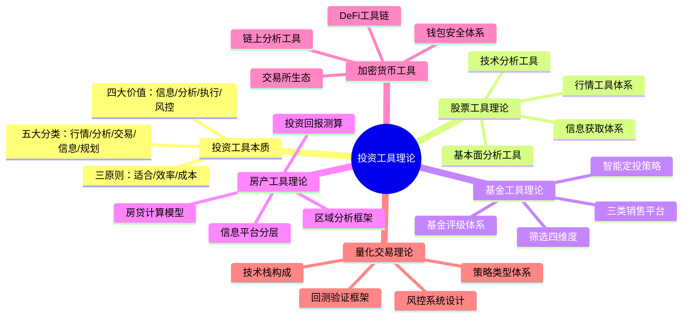
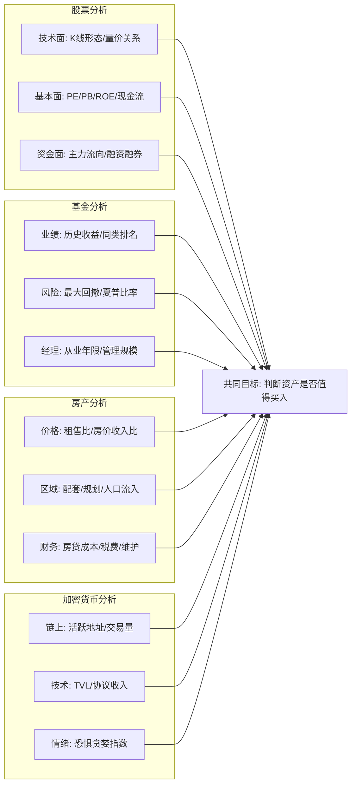
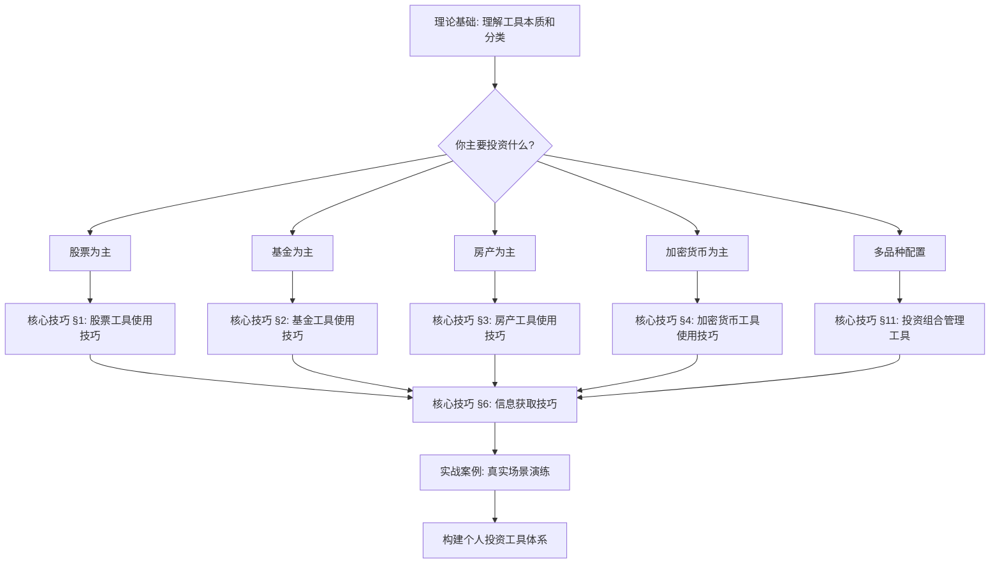

## 七、本节总结：投资工具理论全景图

前面六节分别从投资工具的本质、股票工具、基金工具、房产工具、加密货币工具和量化交易六个维度，构建了投资工具的理论体系。本节不是简单的要点罗列，而是将这些分散的知识点编织成一张完整的认知网络——帮你建立"投资工具思维"，让你在面对任何投资场景时，都能快速判断需要什么工具、如何选择、如何组合。

### 7.1 六大理论板块的核心知识图谱



### 7.2 贯穿各板块的四大核心原理

无论你投资的是股票、基金、房产还是加密货币，所有工具都围绕四个核心功能运转。理解这四个功能，就掌握了投资工具的底层逻辑。

#### 原理一：信息获取——从"不知道"到"知道"

**本质**：投资是信息不对称的游戏。工具的第一个价值，就是帮你缩小信息差距。

| 信息层级 | 股票领域 | 基金领域 | 房产领域 | 加密货币领域 |
|----------|----------|----------|----------|-------------|
| **公开免费** | 行情软件实时数据、公司公告 | 基金净值、排名、持仓披露 | 贝壳挂牌价、政府成交数据 | CoinMarketCap行情、项目白皮书 |
| **结构化付费** | 财务数据库、研报平台 | 晨星评级、好买研报 | 贝壳研究院成交明细、中指院土地数据 | Nansen链上分析、Glassnode指标 |
| **深度洞察** | 机构路演、产业链调研 | 基金经理访谈、策略路演 | 城市规划内部信息、开发资金链 | 巨鲸钱包追踪、项目方内部沟通 |

**关键认知**：信息的价值不在于多，而在于**及时性**和**结构化**。免费信息已经能满足80%的个人投资需求，付费信息的价值在于帮你节省时间、提供结构化视角。初学者不应在信息工具上过度投入，先把免费工具用透。

#### 原理二：分析决策——从"知道"到"判断"

**本质**：有了信息之后，工具帮你把原始数据转化为可操作的决策依据。

**分析工具的三类范式**：

| 范式 | 核心逻辑 | 适用场景 | 典型工具 |
|------|----------|----------|----------|
| **技术分析** | 历史价格和成交量包含所有信息，通过图表模式预测未来走势 | 短线交易、趋势跟踪 | 通达信公式、TradingView指标、MACD/KDJ/RSI |
| **基本面分析** | 价格终将回归价值，通过财务数据和行业分析判断合理估值 | 中长期价值投资、选股选基 | 理杏仁财务数据、晨星基金分析、贝壳区域数据 |
| **量化分析** | 用数学模型消除人为情绪干扰，通过统计规律寻找超额收益 | 系统化投资、策略验证 | 聚宽回测、Python+Pandas、因子分析框架 |

**跨品种分析对比**：



#### 原理三：交易执行——从"判断"到"行动"

**本质**：再好的分析，如果执行环节出了问题，都会功亏一篑。工具帮你快速、准确、低成本地完成交易。

**各品种交易执行特点对比**：

| 维度 | 股票 | 基金 | 房产 | 加密货币 |
|------|------|------|------|----------|
| **交易频率** | 高（可日内） | 低（定投为主） | 极低（数年一次） | 极高（24/7） |
| **执行速度** | 秒级 | T+1确认 | 数周到数月 | 秒级 |
| **交易成本** | 佣金+印花税 | 申购赎回费+管理费 | 中介费+税费+贷款利息 | 交易手续费+Gas费 |
| **自动化程度** | 条件单、程序化 | 定投自动扣款 | 无法自动化 | API交易、智能合约 |
| **执行工具** | 券商App/交易终端 | 基金平台自动定投 | 线下中介+线上签约 | 交易所App/DApp |

**关键认知**：交易执行工具的选择，直接影响你的投资收益。频繁交易的品种（股票、加密货币），执行工具的**速度**和**成本**至关重要；低频交易的品种（房产），执行工具的**可靠性**和**合规性**更重要。

#### 原理四：风险管理——从"行动"到"控制"

**本质**：投资工具的终极价值不是帮你赚更多，而是帮你**少亏**。风控工具贯穿投资的全流程。

**风控工具矩阵**：

| 风控环节 | 股票工具 | 基金工具 | 房产工具 | 加密货币工具 |
|----------|----------|----------|----------|-------------|
| **事前风控** | 仓位计算器、选股筛选器 | 基金风险评级、组合分析 | 房贷压力测试、租售比计算器 | 仓位管理工具、止损设置 |
| **事中监控** | 实时盈亏、持仓集中度预警 | 组合净值跟踪、偏离度监控 | 月供提醒、市场行情追踪 | 价格预警、清算监控 |
| **事后复盘** | 交易记录分析、收益归因 | 定投收益计算、策略回测 | 持有成本核算、退出时机评估 | 链上交易记录、盈亏分析 |

### 7.3 各投资品种工具体系对比总览

将六大板块的工具体系横向对比，帮你建立全局视野：

| 对比维度 | 股票工具 | 基金工具 | 房产工具 | 加密货币工具 | 量化工具 |
|----------|----------|----------|----------|-------------|----------|
| **入门门槛** | 低（开户即可） | 最低（10元起投） | 高（首付门槛） | 中（需注册交易所） | 高（需编程能力） |
| **学习曲线** | 中等 | 平缓 | 陡峭 | 陡峭 | 非常陡峭 |
| **工具成熟度** | 非常成熟 | 成熟 | 中等 | 快速发展中 | 专业级 |
| **免费工具够用度** | 80%够用 | 90%够用 | 70%够用 | 60%够用 | 50%够用 |
| **工具迭代速度** | 慢（稳定） | 慢（稳定） | 中等 | 极快（日新月异） | 快 |
| **信息不对称程度** | 中等 | 低 | 高 | 极高 | 低（开源生态） |
| **监管工具要求** | 严格（实名制） | 严格（合规销售） | 严格（限购限贷） | 松散（各国不同） | 有（程序化交易报备） |

### 7.4 工具选择的决策框架

#### 第一步：明确你的投资品种

不要一开始就纠结"用哪个工具"，先确定你**要投什么**。不同品种的工具生态差异巨大，跨品种学习工具效率极低。

#### 第二步：评估你的投资风格

| 投资风格 | 核心特征 | 工具需求重点 | 推荐工具组合 |
|----------|----------|-------------|-------------|
| **被动长期型** | 低频交易、长期持有、追求市场平均收益 | 定投功能、组合管理、费率低 | 基金定投平台（蚂蚁财富）+ 指数估值工具 |
| **主动选股型** | 深入研究个股、中长期持有 | 基本面分析、财务数据、研报 | 雪球 + 理杏仁 + 券商研究报告 |
| **趋势交易型** | 跟踪趋势、中短线操作 | 技术分析、实时行情、条件单 | 通达信 + 券商条件单 + 财联社快讯 |
| **量化策略型** | 数据驱动、系统化交易 | 编程环境、回测框架、历史数据 | 聚宽/掘金 + Python + 因子库 |
| **综合配置型** | 多品种分散配置、定期再平衡 | 资产配置工具、组合追踪、再平衡提醒 | Excel/专业组合管理工具 + 各品种专用工具 |

#### 第三步：从最小工具集开始

**新手推荐的最小工具集**（零成本起步）：

```text
股票：券商App（交易）+ 雪球（信息社区）+ 同花顺（行情）
基金：蚂蚁财富或天天基金（一站式平台）
房产：贝壳找房（房源+数据）+ 房贷计算器小程序
加密货币：CoinMarketCap（行情）+ Binance/OKX（交易）
```

**原则**：先用好1-2个工具，再逐步扩展。工具不在多，在于精。

### 7.5 各板块知识要点速查

#### 投资工具的本质（第一节）

- **四大价值**：信息获取、分析决策、交易执行、风险管理
- **五大分类**：行情工具、分析工具、交易工具、信息工具、规划工具
- **三原则**：适合原则（匹配自身需求）、效率原则（功能够用即可）、成本原则（免费工具通常够用）
- **核心认知**：工具是"术"和"器"，投资知识是"道"和"法"。没有知识支撑的工具，就像没有瞄准镜的枪——有火力但打不中目标

#### 股票投资工具（第二节）

- **行情工具层次**：Level 1基础行情（免费）→ Level 2深度行情（付费）→ 机构级数据终端（专业）
- **技术分析工具**：K线形态识别、技术指标（MACD/KDJ/RSI/BOLL）、量价关系分析
- **基本面分析工具**：财务数据查询（理杏仁）、估值模型（PE/PB/DCF）、行业对比分析
- **信息获取体系**：官方渠道（交易所公告、证监会）→ 媒体渠道（财联社、新浪财经）→ 社区渠道（雪球、淘股吧）
- **工具组合原则**：行情+分析+交易+信息，四类工具缺一不可，但不必追求单一工具的"大而全"

#### 基金投资工具（第三节）

- **三类销售平台**：直销平台（费率最低但产品单一）、代销平台（银行券商，服务好但费率高）、第三方平台（产品丰富且费率1折）
- **基金评级体系**：晨星评级（全球权威）、理柏评级（侧重风险调整）、济安金信（国内机构）
- **筛选四维度**：业绩（历史收益+同类排名）、风险（最大回撤+波动率+夏普比率）、基金经理（从业年限+管理规模+历史业绩）、费率（管理费+托管费+申购赎回费）
- **智能定投策略**：均线偏离法（均线以下多投）、估值法（低估值多投）、目标市值法（定期调整至目标）
- **关键认知**：基金工具的核心不是"选到最好的基金"，而是"建立系统化的投资纪律"

#### 房产投资工具（第四节）

- **信息三层模型**：公开信息（挂牌价、政策公告）→ 结构化数据（成交明细、土地数据）→ 深度洞察（城市规划、开发商资金链）
- **房贷计算核心**：等额本息（月供固定，总利息高）vs 等额本金（月供递减，总利息低）；提前还款需计算实际节省利息
- **区域分析框架**：人口流入/流出、产业支撑、配套设施、政策导向、土地供应
- **投资回报测算**：租售比、房价收入比、持有成本（贷款利息+物业费+维修基金+折旧）、退出成本（税费+中介费）
- **关键认知**：房产是信息不对称最严重的投资品种，工具的价值在于帮你穿透信息迷雾

#### 加密货币工具（第五节）

- **交易所生态**：中心化交易所（Binance/OKX，便捷但需信任）vs 去中心化交易所（Uniswap/dYdX，自主但复杂）
- **钱包安全体系**：热钱包（便捷但风险高）vs 冷钱包（安全但不便捷）；私钥管理是核心
- **链上分析工具**：Etherscan（交易查询）、Dune Analytics（数据看板）、Nansen（巨鲸追踪）
- **DeFi工具链**：收益聚合器、流动性挖矿、借贷协议、衍生品协议
- **关键认知**：加密货币工具迭代极快，不要追求掌握所有工具，聚焦你实际使用的2-3个核心平台

#### 量化交易理论（第六节）

- **策略类型**：趋势跟踪（动量策略）、均值回归（统计套利）、因子投资（多因子模型）、高频交易（微观结构）
- **回测框架**：历史数据→策略逻辑→回测引擎→绩效评估→参数优化→样本外验证
- **技术栈**：Python（核心语言）+ Pandas/NumPy（数据处理）+ 回测框架（聚宽/Backtrader）+ 数据源（Tushare/AKShare）
- **风控系统**：仓位管理、最大回撤控制、单日亏损限制、策略相关性监控
- **关键认知**：量化交易的门槛不在编程，而在**策略思维**和**风控纪律**。会写代码但不懂市场的人，量化只会亏得更快

### 7.6 投资工具的进阶认知

#### 认知一：工具是能力的放大器，不是能力的替代品

很多人陷入"工具焦虑"——总觉得用了更好的工具就能赚更多钱。事实是：**一个投资认知清晰的人，用最简单的工具也能赚钱；一个投资认知混乱的人，用最顶级的工具也会亏钱。**

工具放大的是你已有的能力：
- 有分析能力 → 工具帮你分析得更快更全面
- 有执行纪律 → 工具帮你执行得更及时更准确
- 有风控意识 → 工具帮你监控得更全面更及时

如果你发现自己一直在研究工具但投资收益没有改善，问题大概率不在工具，而在投资认知本身。

#### 认知二：工具的隐性成本比你想象的高

| 成本类型 | 具体表现 | 如何控制 |
|----------|----------|----------|
| **学习成本** | 学习新工具需要时间，切换工具需要重新适应 | 选定后坚持使用，不频繁更换 |
| **注意力成本** | 过多工具导致信息过载，反而干扰决策 | 精简工具数量，聚焦核心 |
| **订阅成本** | 付费工具的年费累积可观 | 先用免费版，确认能产生价值再付费 |
| **路径依赖** | 习惯某个工具后不愿切换，即使有更好选择 | 定期评估工具性价比 |
| **数据安全成本** | 注册过多平台增加信息泄露风险 | 用专门的邮箱和密码管理器 |

#### 认知三：工具生态正在被AI重塑

2024年以来，AI正在深刻改变投资工具的形态：

| 变化维度 | 传统模式 | AI赋能模式 |
|----------|----------|------------|
| **信息获取** | 主动搜索、逐条阅读 | AI摘要、智能推送、自然语言问答 |
| **数据分析** | 手动设置指标、人工解读 | AI自动识别模式、生成分析报告 |
| **策略开发** | 人工编写策略逻辑 | AI辅助策略生成、自动参数优化 |
| **风险管理** | 规则触发预警 | AI预测风险、动态调整仓位 |
| **投资教育** | 阅读书籍和教程 | AI个性化学习路径、模拟实战 |

**行动建议**：关注AI投资工具的发展，但不要盲目追新。在AI工具成熟度不够的阶段，传统工具仍然是可靠的主力。

### 7.7 理论基础到核心技巧的过渡

理论基础解决的是"为什么"和"是什么"的问题——为什么需要投资工具？各类工具的原理和分类是什么？如何从理论上理解工具的价值？

接下来的**核心技巧篇**，将解决"怎么做"的问题——具体到每个工具如何操作、如何配置、如何组合使用。理论是地基，技巧是建筑。没有理论的技巧是空中楼阁，没有技巧的理论是纸上谈兵。

**建议的学习路径**：



### 7.8 本节关键术语表

| 术语 | 定义 | 出处章节 |
|------|------|----------|
| **行情工具** | 提供实时或延迟的市场价格和成交量数据的软件 | §1 投资工具本质 |
| **基本面分析** | 通过财务数据、行业状况、宏观经济来评估资产内在价值的方法 | §2 股票工具理论 |
| **技术分析** | 通过历史价格和成交量图表模式来预测未来价格走势的方法 | §2 股票工具理论 |
| **夏普比率** | 衡量每承担一单位风险所获得的超额收益，公式为（收益率-无风险利率）/波动率 | §3 基金工具理论 |
| **最大回撤** | 从历史最高点到最低点的最大跌幅，衡量最坏情况下的亏损幅度 | §3 基金工具理论 |
| **等额本息** | 每月还款金额固定的房贷还款方式，前期利息占比高，后期本金占比高 | §4 房产工具理论 |
| **等额本金** | 每月偿还相同本金、利息递减的房贷还款方式，总利息低于等额本息 | §4 房产工具理论 |
| **租售比** | 月租金与房价的比值，国际警戒线为1:300（即25年回本） | §4 房产工具理论 |
| **冷钱包** | 不联网的加密货币存储设备，安全性高但使用不便 | §5 加密货币工具 |
| **DeFi** | 去中心化金融，基于区块链智能合约构建的金融服务协议 | §5 加密货币工具 |
| **回测** | 用历史数据验证交易策略有效性的过程 | §6 量化交易理论 |
| **夏普比率** | 量化策略的核心评估指标，大于1为可接受，大于2为优秀 | §6 量化交易理论 |
| **因子** | 能解释资产收益差异的系统性变量，如价值因子、动量因子、规模因子 | §6 量化交易理论 |

***

> **一句话总结**：投资工具的本质是将"信息→分析→执行→风控"四个环节自动化、高效化。不同投资品种的工具生态各有特点，但底层逻辑相通。掌握这个底层逻辑，你就能在面对任何新工具时快速判断其价值，而不是被花哨的功能所迷惑。工具服务于投资认知，而非替代投资认知。
