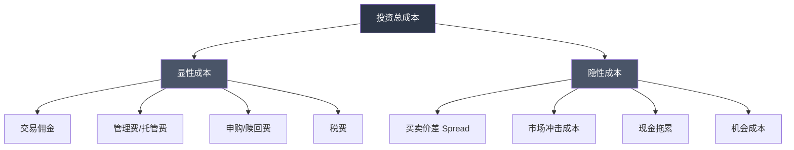
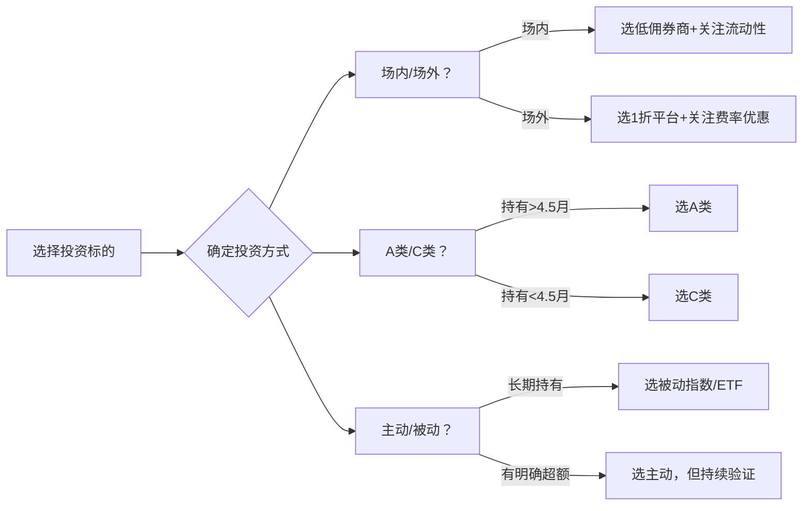

## 八、费率深度分析

> "投资中唯一确定的，就是你付出的成本。" ——约翰·博格尔（先锋集团创始人）

很多人只盯着收益率看，却忽略了费率这个"隐形杀手"。一个年化收益8%的产品，如果费率2%，实际到手只有6%——这2%的差距，复利30年后意味着你的最终资产相差超过40%。理解费率结构，是每个投资者的必修课。

本章从股票、基金、债券、期货、海外投资等各个维度拆解费率结构，帮你建立完整的费率认知框架，并给出可落地的优化方案。



---

### 8.1 股票交易费率构成

#### A股交易费率明细

| 费率项目 | 费率 | 收取方 | 收取方向 | 说明 |
|----------|------|--------|----------|------|
| 佣金 | 万1-万3 | 券商 | 买卖双向 | 最低5元/笔，可谈判 |
| 印花税 | 0.05% | 国家税务 | 仅卖出 | 2023年8月28日起由0.1%下调至0.05% |
| 过户费 | 0.001% | 中国结算 | 买卖双向 | 沪深两市统一标准 |
| 规费 | 含在佣金中 | 交易所+证监会 | — | 证管费0.002% + 经手费0.00341% |
| 转托管费 | 约30-50元/笔 | 券商 | 单次 | 跨券商转股票时收取 |

**关键区分：全佣 vs 净佣**

- **全佣（含规费）**：佣金费率已包含交易所规费，实际券商收入 = 佣金 - 规费。如万2全佣，券商实收约万1.46
- **净佣（不含规费）**：佣金费率不含规费，实际总成本 = 净佣 + 规费。如万1净佣，实际成本约万1.54

开户时务必确认是"全佣"还是"净佣"，同一数字含义完全不同。

#### 佣金谈判策略

佣金并非固定不变，完全可以谈判：

| 资金量 | 通常可谈佣金 | 谈判筹码 |
|--------|-------------|----------|
| 10万以下 | 万2-万2.5 | 线上新开户活动 |
| 10-50万 | 万1.5-万2 | 多家比价、威胁转户 |
| 50-100万 | 万1-万1.5 | 资金规模 + 交易频率 |
| 100万以上 | 万0.8-万1 | 大客户专属、可要求客户经理 |
| 500万以上 | 万0.5-万0.8 | 机构级费率 |

**谈判话术参考**：
1. 先在其他券商APP查到更低费率截图
2. 打给当前券商客服说："我看到XX券商给新客户万1费率，我作为老客户能否调低？"
3. 如果客服说无法调整，要求转接客户经理或投诉部门
4. 实在不行，直接在新券商开户转户，操作很简单

#### 费率对收益的实际影响

费率的影响不是线性的，而是复利放大的。我们用具体数字来看：

**场景一：短线交易者（月均交易10次）**

假设每次交易金额10万元：
- 佣金万3：年佣金 = 10万 × 0.03% × 2（买卖） × 10次 × 12月 = **7,200元**
- 佣金万1：年佣金 = 10万 × 0.01% × 2 × 10 × 12 = **2,400元**
- 仅佣金差额：**4,800元/年**
- 加上印花税：10万 × 0.05% × 10 × 12 = **6,000元/年**
- 总交易成本（万1佣金）：2,400 + 6,000 + 过户费 ≈ **8,600元/年**

如果你的账户是100万，年交易成本就吃掉了0.86%的收益。这意味着你必须每年跑赢大盘近1个百分点才能打平。

**场景二：长线投资者（月均交易2次）**

同样10万元本金：
- 佣金万1：年佣金 = 10万 × 0.01% × 2 × 2 × 12 = **480元**
- 印花税：10万 × 0.05% × 2 × 12 = **1,200元**
- 总成本 ≈ **1,700元/年**

差距一目了然——交易频率是影响费率成本的最大变量。

**长期复利效应**：

假设两个人初始资金都是100万，年化收益都是10%，但A的费率成本是0.5%/年，B的是1.5%/年：

| 年限 | A资产（低费率） | B资产（高费率） | 差额 | 差额占A比例 |
|------|----------------|----------------|------|------------|
| 10年 | 236万 | 206万 | 30万 | 12.7% |
| 20年 | 560万 | 427万 | 133万 | 23.8% |
| 30年 | 1,586万 | 1,006万 | 580万 | 36.6% |

1%的费率差距，30年后就是580万的差距。这就是为什么费率值得深入研究。

#### 港股通与北向资金费率

港股通（内地投资者买港股）的费率结构：

| 费率项目 | 费率 | 说明 |
|----------|------|------|
| 佣金 | 万1-万3 | 券商收取 |
| 交易征费 | 0.0027% | 证监会收取 |
| 交易费 | 0.00565% | 联交所收取 |
| 印花税 | 0.13% | 买卖双向，按成交金额 |
| 中央结算费 | 0.002%（最低2港元，最高100港元） | 香港结算 |
| 股份交收费 | 0.5港元/笔 | — |
| 汇率差 | 约0.3%-0.5% | 换汇时银行买入卖出价差 |

**港股通综合交易成本约0.3%-0.5%/次**，远高于A股。频繁交易港股通的成本极高。

---

### 8.2 基金费率构成

基金费率比股票复杂，因为它包含多个层级——基金公司收费、销售渠道收费、托管银行收费，层层叠加。

#### 主要费率类型

| 费率类型 | 主动股票型 | 指数型（场外） | ETF（场内） | 货币基金 | QDII基金 |
|----------|------------|----------------|-------------|----------|----------|
| 管理费 | 1.2%-1.5% | 0.5% | 0.15%-0.5% | 0.15%-0.3% | 0.8%-1.5% |
| 托管费 | 0.25% | 0.1% | 0.05%-0.1% | 0.05%-0.1% | 0.2%-0.35% |
| 申购费 | 1.5%（1折0.15%） | 1%（1折0.1%） | 无（佣金万1-万3） | 0 | 1.5%（1折0.15%） |
| 赎回费 | 0-1.5% | 0-0.5% | 无（佣金万1-万3） | 0 | 0-1.5% |
| 销售服务费 | 0-0.8% | 0-0.4% | 0 | 0.25% | 0-0.8% |

**费率叠加计算示例**：

一只主动股票基金的年度持有成本：
- 管理费1.5% + 托管费0.25% + 销售服务费0%（A类） = **1.75%/年**
- 如果通过第三方平台1折申购：申购费0.15%
- 持有2年赎回（赎回费0）：总费率 = 0.15% + 1.75%×2 = **3.65%**

而一只ETF的年度持有成本：
- 管理费0.15% + 托管费0.05% = **0.20%/年**
- 交易佣金万1×2 = **0.02%**
- 持有2年总费率 = 0.02% + 0.20%×2 = **0.42%**

**同样的指数投资，ETF的持有成本只有场外基金的约1/9。**

#### A类 vs C类份额深度对比

很多投资者看到C类"免申购费"就选C类，但C类每年多收销售服务费。这是一个典型的信息不对称陷阱。

**判断公式**：

$$\text{临界持有天数} = \frac{\text{A类申购费}}{\text{C类年销售服务费}} \times 365$$

具体对比：

| 持有时间 | A类总费率 | C类总费率 | 更优选择 |
|----------|----------|----------|---------|
| 30天 | 0.15% + 赎回费1.5% = 1.65% | 0 + 0.4%/12 + 赎回费1.5% = 1.53% | C类 |
| 90天 | 0.15% + 赎回费0.5% = 0.65% | 0 + 0.4%×3/12 + 赎回费0.5% = 0.60% | C类 |
| 180天 | 0.15% + 赎回费0 = 0.15% | 0 + 0.4%×6/12 + 0 = 0.20% | A类 |
| 1年 | 0.15% | 0.40% | A类 |
| 3年 | 0.15% | 1.20% | A类 |

**结论**：持有超过约4.5个月选A类更划算。定投、长线投资者应优先选择A类份额。

#### 指数增强基金的费率陷阱

"指数增强"基金通常收取1.5%的主动管理费，但跟踪的只是指数基金0.5%的费率水平。增强部分能否覆盖1%的费率差？

**真实数据统计（2015-2025）**：
- 3年期：约35%的指数增强基金跑赢对应ETF
- 5年期：约28%的指数增强基金跑赢对应ETF
- 10年期：约22%的指数增强基金跑赢对应ETF

只有约30%的指数增强基金能持续跑赢基准，且这个比例随时间延长而下降。选择指数增强基金前，务必审视其超额收益的持续性和稳定性。

#### ETF的隐性成本

ETF表面费率低（管理费0.15%-0.5%），但有隐性成本：

**1. 买卖价差（Bid-Ask Spread）**

| ETF类型 | 典型价差 | 年化影响（假设月换手1次） |
|---------|---------|----------------------|
| 沪深300ETF（大品种） | 0.01%-0.02% | 约0.12%-0.24% |
| 中证500ETF | 0.02%-0.05% | 约0.24%-0.60% |
| 行业ETF（冷门） | 0.05%-0.20% | 约0.60%-2.40% |
| 跨境ETF | 0.05%-0.30% | 约0.60%-3.60% |

**2. 折溢价**

ETF价格可能偏离净值。极端情况下：
- 溢价买入 = 额外成本（如QDII-ETF在额度紧张时溢价可达3%-5%）
- 折价买入 = 看似占便宜，但可能反映底层资产流动性问题

**查看折溢价的方法**：在集思录、天天基金等平台查看ETF实时折溢价率。

**3. 现金拖累**

ETF需要保留一定现金应对赎回，这部分现金不产生投资收益。跟踪误差中的一部分就是现金拖累造成的。

#### 费率节省的实操方法

**方法一：选择低费率渠道**

| 渠道 | 申购费折扣 | 优势 | 劣势 |
|------|----------|------|------|
| 支付宝/蚂蚁财富 | 1折 | 操作便捷，产品齐全 | 部分基金无折扣 |
| 天天基金 | 1折 | 基金数据全面 | APP体验一般 |
| 券商APP | 1折-4折 | 可场内外切换 | 折扣力度不一 |
| 银行柜台/APP | 无折扣或4折 | 信任感强 | 费率最高 |
| 基金公司直销 | 0折-1折 | 费率最低 | 只能买本公司产品 |

**方法二：选择费率更低的产品**

同样跟踪沪深300，费率差异显著：

| 产品 | 管理费 | 托管费 | 合计 | 10年费率成本（10万本金） |
|------|--------|--------|------|------------------------|
| 某增强型沪深300 | 1.5% | 0.25% | 1.75% | 17,500元 |
| 普通沪深300指数 | 0.5% | 0.1% | 0.60% | 6,000元 |
| 低费率沪深300ETF | 0.15% | 0.05% | 0.20% | 2,000元 |
| 最低费率沪深300ETF | 0.15% | 0.05% | 0.20% | 2,000元 |

长期持有，选择低费率的纯被动指数基金通常更优。

**方法三：利用基金转换功能**

基金转换比"赎回+申购"更省费率：
- 赎回再申购：赎回费 + 新申购费
- 基金转换：转出基金赎回费 + 申购补差费（通常低于直接申购）

同一基金公司旗下产品之间的转换通常更便宜。

---

### 8.3 券商选择费率对比

券商费率差异不大，但选对了能省钱：

| 券商 | 股票佣金 | ETF佣金 | 融资利率 | 可转债佣金 | 特色 |
|------|----------|---------|----------|-----------|------|
| 华泰证券 | 万1.3 | 万0.5 | 5.8% | 万0.4 | 涨乐财富通APP体验好 |
| 东方财富 | 万2.5 | 万0.5 | 6.0% | 万0.4 | 资讯全面，社区活跃 |
| 中信证券 | 万3 | 万0.6 | 6.5% | 万0.5 | 研报质量高，投行资源强 |
| 招商证券 | 万2 | 万0.5 | 6.0% | 万0.4 | 客户服务好 |
| 国泰君安 | 万2 | 万0.5 | 6.0% | 万0.5 | 综合实力强 |

**选券商的关键考量**：

1. **佣金可以谈**：50万以上资金通常可以谈到万1-万1.5，不要接受默认费率
2. **APP体验很重要**：你每天都要用，不好用很痛苦。开户前先下载试用
3. **增值服务**：研报、打新额度、融资融券利率等
4. **系统稳定性**：行情火爆时别宕机。关注券商在极端行情下的表现记录
5. **营业部距离**：有些业务（如开通创业板、期权）需要临柜办理
6. **多券商策略**：可以开多个券商账户（目前一人可开3个沪A账户），分别用于不同策略

---

### 8.4 债券投资费率

#### 国债

| 类型 | 购买渠道 | 费率 | 说明 |
|------|---------|------|------|
| 记账式国债 | 交易所/银行间 | 佣金万1-万3 | 交易所买卖，费率同股票 |
| 储蓄国债（电子式） | 银行 | 0 | 无任何费用 |
| 储蓄国债（凭证式） | 银行柜台 | 0 | 无任何费用 |

国债是费率最低的投资品种之一，储蓄国债零费率。

#### 企业债/公司债

| 费率项目 | 费率 | 说明 |
|----------|------|------|
| 交易佣金 | 万1-万2 | 交易所场内 |
| 印花税 | 0 | 债券交易免征 |
| 过户费 | 0.001% | 极低 |

#### 债券基金

| 类型 | 管理费 | 托管费 | 申购费（1折） | 赎回费 |
|------|--------|--------|-------------|--------|
| 纯债基金 | 0.3%-0.6% | 0.1% | 0.06%-0.08% | 0-0.1% |
| 一级债基 | 0.6%-0.8% | 0.15% | 0.08% | 0-0.1% |
| 二级债基 | 0.6%-1.0% | 0.15%-0.2% | 0.08%-0.1% | 0-1.5% |

---

### 8.5 期货与期权费率

#### 商品期货

| 费率项目 | 说明 | 典型费率 |
|----------|------|---------|
| 交易所手续费 | 按固定金额或按比例 | 螺纹钢约3.5元/手，白银约万分之0.5 |
| 期货公司加收 | 在交易所基础上加收 | 通常加收0.5-3倍交易所费率 |
| 交割费 | 实物交割时收取 | 品种不同差异大 |

**期货费率谈判空间很大**：高频交易者或大资金客户可以谈到交易所费率+0.01元/手的极低水平。

#### 股指期货

| 品种 | 交易所手续费 | 平今仓手续费 | 说明 |
|------|-------------|-------------|------|
| IF（沪深300） | 约万分之0.23 | 约万分之3.45 | 平今仓费率是开仓的15倍 |
| IH（上证50） | 约万分之0.23 | 约万分之3.45 | 同上 |
| IC（中证500） | 约万分之0.23 | 约万分之3.45 | 同上 |

**注意**：股指期货平今仓（当天开当天平）费率极高，这是监管抑制过度投机的手段。

#### 期权

| 费率项目 | 费率 | 说明 |
|----------|------|------|
| 交易佣金 | 2-5元/张 | 每张合约10000份标的 |
| 行权手续费 | 0.6元/张 | 行权时收取 |
| 印花税 | 0 | 期权交易免征 |

---

### 8.6 海外投资费率

#### 港股（直接开户）

| 费率项目 | 费率 | 说明 |
|----------|------|------|
| 佣金 | 万3-万5 | 互联网券商更低（如富途万3） |
| 平台费 | 0-15港元/笔 | 部分券商收取 |
| 交易征费 | 0.0027% | 证监会 |
| 交易费 | 0.00565% | 联交所 |
| 印花税 | 0.13% | 买卖双向 |
| 中央结算费 | 0.002% | 最低2港元 |
| 股息税 | 20% | 内地个人投资者通过港股通 |

#### 美股

| 费率项目 | 费率 | 说明 |
|----------|------|------|
| 佣金 | 0-0.005美元/股 | 多数互联网券商已免佣 |
| SEC费 | 约0.0008% | 仅卖出 |
| FINRA费 | 约0.000166美元/股 | 仅卖出 |
| 平台费 | 0-1美元/笔 | 部分券商收取 |
| 汇率转换费 | 0.3%-1.0% | 换汇成本 |
| 股息预扣税 | 10%-30% | 中美税收协定10%，需填W-8BEN表格 |
| 资本利得税 | 0% | 非美国居民免征 |

**美股"零佣金"的真相**：

看似免费的美股交易，实际成本藏在以下环节：
1. **订单流付款（PFOF）**：券商将你的订单卖给做市商，做市商在买卖价差中获利。你可能拿到稍差的成交价
2. **汇率转换费**：每次入金出金都有汇率损失，累计不低
3. **融资利率**：美股券商融资利率差异巨大（3%-9%），这才是很多券商的真正利润来源

---

### 8.7 其他投资工具的费率

#### 银行理财

| 类型 | 管理费 | 托管费 | 销售服务费 | 合计 |
|------|--------|--------|-----------|------|
| 固收类（R1-R2） | 0.05%-0.15% | 0.02%-0.03% | 0.1%-0.2% | 0.17%-0.38% |
| 固收+类（R2-R3） | 0.15%-0.40% | 0.03%-0.05% | 0.15%-0.3% | 0.33%-0.75% |
| 混合类（R3-R4） | 0.3%-0.8% | 0.05%-0.1% | 0.2%-0.4% | 0.55%-1.3% |

**注意**：银行理财自2022年资管新规全面落地后不承诺保本，净值型产品可能亏损。费率虽低，但收益也低，风险收益比需要综合评估。

#### 保险理财

| 产品类型 | 初始费用 | 管理费 | 退保费用 | 流动性 |
|----------|---------|--------|---------|--------|
| 万能险 | 1%-3%（首年） | 0.5%-1% | 前5年退保扣2%-5% | 极差 |
| 投连险 | 1%-2% | 1%-2% | 买卖差价0.5%-1% | 较差 |
| 年金险 | 含在精算定价中 | 隐性约1%-2% | 现金价值远低于已交保费 | 极差 |

**保险理财的真实成本极高**：以万能险为例，首年初始费用就可能扣掉3%，加上每年管理费，前5年的实际年化成本可能超过2%。很多万能险宣传的"保底利率"（如2.5%）是扣除费用后的净收益，但实际上前几年的实际收益率远低于宣传水平。

#### 信托

| 类型 | 管理费 | 超额收益分成 | 门槛 | 说明 |
|------|--------|------------|------|------|
| 固定收益类 | 无显性（含在收益中） | 无 | 100万起 | 实际费率约0.5%-1% |
| 股权类 | 1%-2% | 20%-30% | 100万起 | 高风险高费率 |
| 家族信托 | 0.5%-1%/年 | 视约定 | 1000万起 | 定制化服务 |

#### 私募基金

| 费率项目 | 典型费率 | 说明 |
|----------|---------|------|
| 管理费 | 1.5%-2%/年 | 不论盈亏都收 |
| 业绩报酬 | 20% | 超过基准收益部分 |
| 认购费 | 1% | 部分产品免收 |
| 赎回费 | 0-2% | 封闭期内不可赎回 |

**私募费率的真实影响**：

假设私募基金年化收益15%，管理费2%，业绩报酬20%（基准8%）：
- 管理费扣除后：13%
- 超额收益：13% - 8% = 5%
- 业绩报酬：5% × 20% = 1%
- 投资者实际收益：13% - 1% = **12%**

看似15%的收益，实际到手12%，费率吃掉了3个百分点。

#### 公募REITs

| 费率项目 | 费率 | 说明 |
|----------|------|------|
| 管理费 | 0.1%-0.5% | 因底层资产类型而异 |
| 托管费 | 0.01%-0.05% | 极低 |
| 交易佣金 | 万1-万3 | 场内交易 |
| 印花税 | 0 | REITs免征 |

---

### 8.8 智能投顾（Robo-Advisor）费率

智能投顾的费率通常包含三层：

| 费率层 | 费率范围 | 说明 |
|--------|---------|------|
| 平台管理费 | 0.3%-0.5%/年 | 智能投顾服务费 |
| 底层基金费率 | 0.2%-0.8%/年 | ETF或基金的管理费+托管费 |
| 交易成本 | 视调仓频率 | 买卖价差、佣金等 |
| **合计** | **0.5%-1.3%/年** | — |

**对比**：直接买ETF自行配置，总费率可低至0.2%/年。智能投顾多出的0.3%-1%是否值得，取决于其资产配置能力能否带来对应的超额收益。

---

### 8.9 费率优化的底层逻辑

费率优化的核心原则：**在同等投资目标下，选择总成本最低的方案**。

#### 费率优化决策矩阵



#### 费率优化的四大误区

**误区一：费率越低越好**

如果一个主动基金能持续跑赢指数5个百分点，多收1%管理费完全值得。关键是比较"费后收益"而非费率本身。

**误区二：忽略隐性成本**

只看管理费而忽略买卖价差、市场冲击、现金拖累等隐性成本，可能导致实际成本远高于预期。特别是对于交易频繁的策略，隐性成本可能是显性成本的数倍。

**误区三：为了省费率改变投资决策**

先选投资标的，再选低费率的实现方式。不要因为ETF费率低就放弃真正适合你的主动基金。

**误区四：忽略费率的时间维度**

短期费率优惠（如申购费0折）吸引力大，但长期持有中管理费和托管费才是大头。选择产品时应关注长期综合成本。

#### 费率是确定的，收益是不确定的

这是费率分析最核心的认知：省下的费率是确定的收益。在收益不确定的市场中，降低确定性成本是提高长期回报的最可靠手段之一。

---

### 8.10 费率计算工具与模板

#### 年度费率汇总计算模板

建议每年做一次费率审计：

```text
投资组合年度费率审计
====================

1. 股票账户
   - 账户总市值：________万元
   - 年度佣金总额：________元
   - 年度印花税总额：________元
   - 年度交易成本率 = (佣金+印花税+过户费) ÷ 平均市值 × 100%
   - 目标：交易成本率 < 0.5%（长线）或 < 2%（短线）

2. 基金账户
   - 各基金名称 | 管理费 | 托管费 | 销售服务费 | 申购费（摊销） | 合计
   - 平均费率 = 加权平均（按持仓金额加权）
   - 目标：纯被动指数 < 0.3%，主动 < 1.5%

3. 其他投资
   - 银行理财：________
   - 保险理财：________
   - 其他：________

4. 综合费率
   - 总投资资产：________万元
   - 年度总费率成本：________元
   - 综合费率 = 总费率成本 ÷ 总投资资产 × 100%
   - 行业基准参考：< 0.5%（优秀），0.5%-1%（合理），> 1%（偏高）
```

#### 在线费率比较工具

| 工具 | 功能 | 网址 |
|------|------|------|
| 天天基金 | 基金费率对比、费率计算器 | fund.eastmoney.com |
| 集思录 | ETF折溢价、分级基金费率 | jisilu.cn |
| 蛋卷基金 | 基金组合费率计算 | danjuanfunds.com |
| 且慢 | 组合费率、跟投费率 | qieman.com |

---

### 8.11 费率趋势与政策变化

#### 近年费率下降趋势

中国市场费率持续下降是大趋势：

| 年份 | 主动基金管理费 | ETF管理费 | 股票佣金 | 印花税 |
|------|--------------|----------|---------|--------|
| 2015 | 1.5% | 0.5% | 万3-万5 | 0.1% |
| 2018 | 1.5% | 0.5% | 万2-万3 | 0.1% |
| 2020 | 1.5% | 0.5%→0.15% | 万1.5-万2.5 | 0.1% |
| 2023 | 1.2%-1.5% | 0.15% | 万1-万2 | 0.05% |
| 2025 | 1.0%-1.2% | 0.15% | 万0.8-万1.5 | 0.05% |

费率下降对投资者是长期利好，但需要主动跟进——已持有的老产品不会自动降费，需要投资者主动转换到低费率产品。

#### 监管政策方向

证监会近年推动的费率改革：
1. **公募基金费率改革（2023年）**：主动基金管理费上限从1.5%降至1.2%，托管费从0.25%降至0.2%
2. **佣金改革**：推动券商佣金进一步下降
3. **ETF降费**：鼓励ETF降费让利，头部ETF管理费已降至0.15%
4. **费率透明化**：要求基金公司更清晰披露费率信息

---

### 8.12 实操清单

| 序号 | 检查项 | 操作方法 | 预期收益 |
|------|--------|---------|---------|
| 1 | 检查券商佣金 | 打开交割单计算实际佣金率，高于万2就谈判或换券商 | 年省数百至数千元 |
| 2 | 检查基金费率 | 同类产品选费率最低的，长期持有选A类 | 年省0.3%-1% |
| 3 | 减少不必要交易 | 每笔交易前算"预期收益能否覆盖成本" | 大幅降低交易摩擦 |
| 4 | 用ETF替代场外基金 | 同类指数投资优先选ETF | 费率降低60%-80% |
| 5 | 定期审视费率 | 每年做一次费率审计 | 持续优化 |
| 6 | 关注费率新政 | 留意基金公司降费公告，及时转换 | 享受行业降费红利 |
| 7 | 开通港股/美股前算总账 | 包含汇率成本、税费等全部费用 | 避免隐性成本侵蚀收益 |
| 8 | 审视保险理财 | 计算前几年真实收益率 | 避免被高费率产品套牢 |

> **合规提示**：费率信息以各机构最新公告为准，本文数据为示例性质。投资者应仔细阅读产品合同和费率说明，了解所有费用项目后再做投资决策。费率优惠可能有时效性，需关注最新政策变化。费率数据统计截至2025年，实际费率可能因市场环境和监管政策调整而变化。
