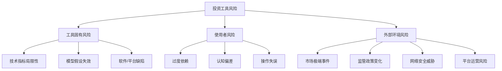
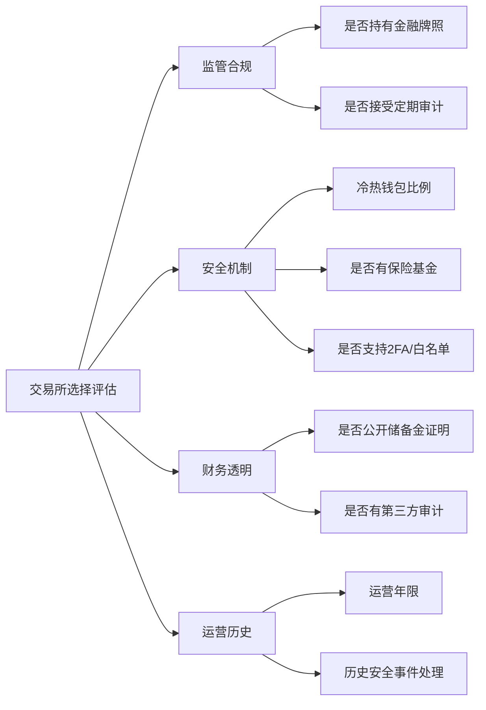
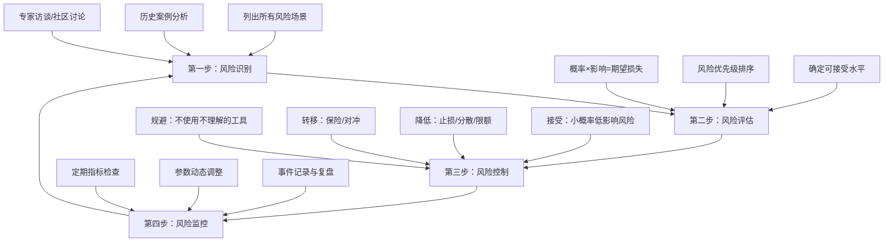

## 九、投资工具风险提示

投资工具是辅助决策的利器，但工具本身并非零风险。正如本杰明·格雷厄姆所言："投资中最大的风险，是你以为自己没有风险。"本节从工具依赖、数据与平台、网络安全、加密货币、量化交易、心理偏差、监管合规七个维度，系统拆解投资工具使用中需要警惕的风险类型，提供可落地的防控框架。

### 9.1 风险总览与分类体系

在深入具体风险之前，先建立一个完整的风险分类框架。投资工具风险可以按照"来源"和"影响"两个维度进行划分：



| 风险类别 | 典型表现 | 可控程度 | 潜在损失等级 |
|----------|----------|----------|-------------|
| 工具固有风险 | 指标失灵、模型偏差 | 中等——可通过多元化对冲 | 中 |
| 使用者风险 | 过度依赖、操作失误 | 高——通过纪律和流程控制 | 高 |
| 外部环境风险 | 黑天鹅、政策突变 | 低——只能提前防御 | 极高 |
| 网络安全风险 | 账户被盗、数据泄露 | 中高——通过安全措施降低 | 高 |
| 平台运营风险 | 交易所倒闭、数据商断供 | 低——依赖平台选择 | 极高 |

理解这个分类框架后，下面逐一展开每个风险维度的具体内容和防控方法。

### 9.2 工具依赖风险

#### 9.2.1 过度依赖技术指标

技术指标是基于历史数据的统计工具。它们反映的是过去的价格行为模式，而非未来的确切走势。每一本严肃的技术分析教材都会在开篇强调这一点——技术指标是概率工具，不是水晶球。

**技术指标为何会"失灵"？**

技术指标建立在三个关键假设之上，而每个假设在现实中都会被打破：

| 假设 | 理想状态 | 现实情况 | 后果 |
|------|----------|----------|------|
| 历史会重复 | 市场参与者行为模式稳定 | 市场结构、参与者、规则持续变化 | 历史规律可能完全失效 |
| 价格反映一切 | 所有信息都已体现在价格中 | 信息不对称、内幕交易客观存在 | 价格信号可能被操纵 |
| 趋势具有惯性 | 一旦形成趋势会持续 | 趋势随时可能因突发事件反转 | 趋势跟踪策略突然失效 |

**常见误区与正确理解**：

| 误区 | 正确理解 | 实际影响 |
|------|----------|----------|
| "金叉一定涨" | 金叉只是概率信号，在震荡市中频繁出现假信号 | 盲目追涨导致反复止损 |
| "背离一定反转" | 背离信号需要价格确认，单次背离可能演变为多次背离 | 过早抄底被套牢 |
| "支撑位一定有效" | 支撑位是概率区域而非精确价位，会被突破 | 止损设置过于精确而被扫 |
| "均线多头排列一定涨" | 均线是滞后指标，反映的是已发生的趋势 | 在趋势末期才发出信号 |
| "RSI超买就要跌" | 强势市场中RSI可长期维持在超买区间 | 卖出强势股错失利润 |
| "放量突破一定有效" | 假突破是常见现象，需要时间和回踩确认 | 追突破被套在高点 |

**防控方法**：

1. **多指标交叉验证**：至少使用3个独立维度的指标（趋势类+动量类+成交量类）指向同一方向时才做决策。例如：均线多头排列（趋势）+ MACD金叉（动量）+ 成交量放大（量能）三者共振。
2. **多周期确认**：日线信号需要周线方向一致来确认。如果日线看多但周线处于下降趋势，信号的可靠性会大打折扣。
3. **结合基本面过滤**：技术分析必须与基本面分析结合。当技术信号与基本面逻辑矛盾时，宁可放弃交易。
4. **设置机械止损**：任何信号都可能失败。止损不是可选项，而是交易系统的必要组成部分。止损幅度应根据标的波动率动态调整。
5. **定期复盘统计**：每季度统计各指标信号的成功率、盈亏比、最大连续亏损次数。用数据而非感觉来评估指标的有效性。

#### 9.2.2 数据滞后与延迟

实时行情数据存在固有的延迟链路，理解这些延迟对于选择合适的交易策略至关重要：

```text
数据延迟的完整链路：
交易所撮合引擎
  └── 交易所数据发布（Level 1快照: 3秒间隔; Level 2逐笔: 实时）
      └── 行情供应商转发（卫星/专线: 50-200ms; 互联网: 200-500ms）
          └── 终端软件解析（取决于软件架构: 10-100ms）
              └── 屏幕渲染（60Hz=16ms, 144Hz=7ms）
                  └── 人眼识别+大脑处理（150-300ms）
                      └── 下单操作（手动: 500ms-2s; 程序化: <1ms）
```

**不同交易风格对延迟的敏感度**：

| 交易风格 | 可容忍延迟 | 延迟导致的典型损失 | 所需数据级别 |
|----------|-----------|-------------------|-------------|
| 长线投资（月度调仓） | 分钟级 | 几乎无影响 | Level 1 免费行情足够 |
| 波段交易（持仓数天） | 秒级 | 可能错过当日最佳买卖点 | Level 1 即时行情 |
| 日内交易（当天平仓） | 百毫秒级 | 滑点成本显著增加 | Level 2 逐笔数据 |
| 高频交易（秒级持仓） | 微秒级 | 策略完全失效 | 交易所直连、专线 |

**防控措施**：

- 长线投资者无需担心延迟问题，使用免费行情即可
- 短线交易者应使用付费Level 2行情，并确保网络连接稳定
- 量化交易者应考虑机房托管（Co-location），将服务器部署在交易所机房内
- 所有人都应准备备用行情源（至少两个不同供应商），当主源异常时切换

#### 9.2.3 系统故障风险

交易系统故障可能导致无法交易、错误交易或数据丢失，严重时直接造成资金损失：

| 故障类型 | 发生概率 | 影响程度 | 典型案例 | 应对措施 |
|----------|----------|----------|----------|----------|
| 本地网络中断 | 中等（月均1-2次） | 无法下单、无法看盘 | 运营商线路故障 | 准备4G/5G移动热点作为备用网络 |
| 交易软件崩溃 | 低（季度1次） | 无法操作 | 软件版本bug、内存溢出 | 安装至少2个不同品牌的交易软件 |
| 券商系统宕机 | 极低（年度1次） | 完全无法操作 | 2020年多次券商系统崩溃 | 开通至少2家券商账户 |
| 行情数据错误 | 低 | 导致错误决策 | K线数据异常、复权错误 | 交叉验证不同数据源 |
| 操作系统崩溃 | 极低 | 所有交易工具不可用 | 蓝屏、系统更新失败 | 保持手机交易APP可用 |

**建立应急交易体系**：

1. **主备网络**：主力使用有线宽带，备用使用4G/5G热点，确保至少一个可用
2. **主备终端**：电脑端为主力，手机APP为备用，两者都能独立完成交易
3. **主备券商**：主力券商和备用券商分别开户，资金适度分散
4. **主备电源**：对于量化交易，配备UPS不间断电源，防止停电导致策略中断
5. **定期演练**：每季度进行一次"灾难恢复演练"——模拟主力系统不可用，使用备用方案完成交易

#### 9.2.4 信息过载

过多的工具和信息反而会干扰决策。诺贝尔经济学奖得主赫伯特·西蒙（Herbert Simon）早就指出："信息的丰富意味着注意力的贫乏。"在投资领域，这个道理尤为深刻。

**信息过载的典型症状**：

- 同时打开10个以上技术指标，窗口占满整个屏幕
- 频繁切换不同的分析软件，试图找到"更准"的工具
- 纠结于相互矛盾的信号——MACD看多但KDJ看空，不知如何决策
- 订阅了十几个财经频道和公众号，每天花3小时以上阅读资讯
- 决策瘫痪：明明有交易机会，却因为"还没看完所有信息"而错过
- 事后归因偏差：亏损时怪"没有关注某个指标"，然后又增加一个工具

**认知科学解释**：

人类工作记忆容量约为7±2个信息块（Miller's Law）。当同时处理的信息超过这个容量时，决策质量不是线性下降，而是断崖式崩溃。研究表明，当分析师面对超过8个变量时，其预测准确率反而低于只使用3个核心变量的简单模型。

**系统化解决方案**：

1. **精简工具集**：只保留3-5个经过验证的核心工具。问自己："如果只能保留3个工具，我会选哪3个？"其余全部隐藏。
2. **建立决策清单**：明确每个工具的使用场景和触发条件。例如：
   - 均线系统：判断趋势方向
   - 成交量：确认趋势强度
   - RSI：识别超买超卖
   - 其余指标：仅在上述三个给出矛盾信号时作为辅助参考
3. **设定信息源上限**：每天只关注固定的信息渠道，总时间控制在1小时以内
4. **时间隔离**：开盘前30分钟完成分析，盘中不做新分析，避免被盘中波动干扰
5. **定期清理**：每季度审视一次工具集和信息源，删除3个月内没有帮助决策的工具和订阅

### 9.3 数据与平台风险

#### 9.3.1 数据质量问题

投资决策的质量不可能超过输入数据的质量。"垃圾进，垃圾出"（Garbage In, Garbage Out）是计算机科学的基本原理，在投资领域同样适用。

**常见的数据质量问题**：

| 数据问题 | 表现形式 | 影响场景 | 识别方法 |
|----------|----------|----------|----------|
| 数据缺失 | K线缺失、停牌期间数据丢失 | 回测结果失真 | 检查数据连续性 |
| 数据错误 | 价格为0或异常值、成交量为负 | 指标计算错误 | 设置合理范围校验 |
| 复权错误 | 前复权/后复权不一致 | 长周期分析失准 | 与多个数据源对比 |
| 时间戳错误 | 数据时间与实际交易时间不匹配 | 日内策略失效 | 核对交易所交易日历 |
| 幸存者偏差 | 只包含当前存续的标的 | 回测收益虚高 | 使用包含退市标的的全量数据 |

**数据质量检查流程**：

```python
import pandas as pd
import numpy as np

def check_data_quality(df: pd.DataFrame, symbol: str) -> dict:
    """投资数据质量检查函数
    
    对输入的行情数据进行全面质量检查，返回问题清单。
    
    Args:
        df: 包含 OHLCV 列的 DataFrame
        symbol: 标的代码，用于日志记录
    
    Returns:
        包含各项检查结果的字典
    """
    issues = []
    
    # 1. 检查缺失值
    missing = df.isnull().sum()
    if missing.any():
        issues.append(f"缺失值: {missing[missing > 0].to_dict()}")
    
    # 2. 检查价格合理性
    if (df['close'] <= 0).any():
        issues.append("存在价格<=0的异常数据")
    
    # 3. 检查涨跌幅是否超出限制（A股10%，创业板/科创板20%）
    returns = df['close'].pct_change()
    if (returns.abs() > 0.22).any():  # 留一定容差
        issues.append("存在单日涨跌幅超过22%的异常数据")
    
    # 4. 检查成交量
    if (df['volume'] < 0).any():
        issues.append("存在负成交量")
    if (df['volume'] == 0).sum() > len(df) * 0.1:
        issues.append("超过10%的交易日成交量为0")
    
    # 5. 检查数据连续性
    trading_days = pd.bdate_range(df.index.min(), df.index.max())
    missing_days = len(trading_days) - len(df)
    if missing_days > len(trading_days) * 0.05:
        issues.append(f"缺失{missing_days}个交易日数据")
    
    # 6. 检查日期顺序
    if not df.index.is_monotonic_increasing:
        issues.append("日期未按升序排列")
    
    return {
        "symbol": symbol,
        "total_rows": len(df),
        "date_range": f"{df.index.min()} ~ {df.index.max()}",
        "issues": issues,
        "quality_score": max(0, 100 - len(issues) * 15)
    }
```

#### 9.3.2 API与数据供应商风险

依赖第三方API和数据供应商的投资者面临"供应商锁定"和"断供"风险：

**历史教训**：

- 2022年，某知名免费行情API突然关闭，导致大量依赖该API的量化策略失效
- 多个财经数据供应商在政策调整后停止提供Level 2行情数据
- 部分数据供应商在数据格式变更时未通知用户，导致解析错误

**防控措施**：

1. **多源备份**：至少对接2-3个数据供应商，实现无缝切换
2. **本地缓存**：关键数据本地存储，不完全依赖实时API
3. **版本监控**：关注API版本变更公告，及时适配
4. **合同保障**：付费数据签订服务水平协议（SLA），明确数据延迟和可用性指标

#### 9.3.3 交易平台风险

交易平台是投资者与市场之间的桥梁，平台本身的风险往往被忽视：

| 风险类型 | 说明 | 典型案例 | 防控建议 |
|----------|------|----------|----------|
| 平台倒闭 | 证券/期货公司经营不善 | 个别中小券商被接管 | 选择头部券商，关注评级 |
| 操作风险 | 平台系统升级导致交易异常 | 某券商升级后下单功能瘫痪 | 保留备用交易平台 |
| 费用变更 | 平台单方面调整费率 | 隐性费用增加 | 定期核对交割单 |
| 数据篡改 | 平台提供的数据与交易所不一致 | K线数据异常 | 与交易所官方数据交叉验证 |
| 隐私泄露 | 用户交易数据被泄露或贩卖 | 精准诈骗电话 | 关注平台隐私政策 |

### 9.4 网络安全风险

#### 9.4.1 账户安全威胁

投资账户直接关联资金，是黑客攻击的重点目标：

**常见攻击方式**：

| 攻击方式 | 技术手段 | 防御措施 |
|----------|----------|----------|
| 钓鱼网站 | 伪造券商/交易所登录页面 | 手动输入网址，不点击邮件链接 |
| 钓鱼邮件 | 伪装成券商通知诱导点击 | 验证发件人域名，不下载附件 |
| 恶意软件 | 键盘记录器窃取密码 | 安装杀毒软件，定期全盘扫描 |
| 中间人攻击 | 在公共WiFi下截获通信 | 使用VPN，避免在公共网络交易 |
| SIM卡劫持 | 补办手机号获取验证码 | 使用硬件密钥而非短信验证 |
| 暴力破解 | 自动尝试常见密码组合 | 使用强密码+双因素认证 |

**账户安全加固清单**：

1. **密码管理**：
   - 每个平台使用不同的强密码（16位以上，包含大小写字母、数字、特殊字符）
   - 使用密码管理器（如1Password、Bitwarden）统一管理
   - 每90天更换一次核心账户密码
   
2. **双因素认证（2FA）**：
   - 优先使用硬件密钥（YubiKey等），安全性最高
   - 次选TOTP认证器（Google Authenticator、Authy）
   - 短信验证码是最低安全级别，仅作为兜底

3. **设备安全**：
   - 交易专用设备不安装无关软件
   - 操作系统和安全软件保持最新版本
   - 启用全盘加密（BitLocker/FileVault）

4. **网络安全**：
   - 家庭网络使用WPA3加密
   - 交易时使用有线连接而非WiFi
   - 避免在公共WiFi下进行任何交易操作

#### 9.4.2 加密货币特有安全风险

加密货币领域的安全风险比传统金融更为严峻，因为交易不可逆、缺乏中心化保障：

**智能合约风险**：

DeFi（去中心化金融）的核心是智能合约，而智能合约一旦部署就难以修改，代码漏洞可能造成永久性资金损失：

| 攻击类型 | 原理 | 典型案例 | 损失金额 |
|----------|------|----------|----------|
| 重入攻击 | 合约在更新状态前允许重复提款 | The DAO事件（2016） | 6000万美元 |
| 闪电贷攻击 | 利用单笔交易内借贷操纵价格 | Harvest Finance（2020） | 3400万美元 |
| 预言机操纵 | 操纵价格喂料数据 | Mango Markets（2022） | 1.14亿美元 |
| 跨链桥漏洞 | 攻击跨链桥合约窃取锁定资产 | Ronin Bridge（2022） | 6.25亿美元 |
| 逻辑漏洞 | 合约业务逻辑存在设计缺陷 | Wormhole（2022） | 3.2亿美元 |

**DeFi安全使用指南**：

1. **审计报告**：只使用经过至少2家知名审计公司（如Trail of Bits、OpenZeppelin、Certik）审计的协议
2. **TVL观察**：协议总锁仓量（TVL）低于1000万美元的谨慎参与
3. **时间检验**：上线不足6个月的新协议，先用小额资金测试
4. **分散风险**：单一协议的投入不超过总资产的10%
5. **及时撤出**：发现协议出现异常交易时，立即撤出资金

**MEV（最大可提取价值）风险**：

MEV是指区块生产者通过重新排序、插入或审查交易来提取的额外价值。对于普通用户来说，MEV意味着：

- **三明治攻击**：你的交易被夹在两笔大额交易之间，导致成交价格恶化
- **抢跑交易**：你的买单被机器人看到后，机器人先买入推高价格再卖给你
- **清算狙击**：你的杠杆仓位接近清算线时，机器人故意推动价格触发清算

防控措施：使用Flashbots Protect等MEV保护工具，设置合理的滑点容忍度，避免在网络拥堵时段进行大额交易。

### 9.5 加密货币交易风险

#### 9.5.1 交易所风险

加密货币交易所是中心化机构，存在固有的运营风险和信任风险。与传统证券交易所受到严格监管不同，加密货币交易所的监管覆盖度参差不齐。

**历史重大交易所事件**：

| 时间 | 交易所 | 事件性质 | 详细描述 | 损失规模 |
|------|--------|----------|----------|----------|
| 2014 | Mt.Gox | 被盗+破产 | 当时全球最大交易所，因安全漏洞被盗85万BTC后申请破产 | 约4.5亿美元（按当时价格） |
| 2016 | Bitfinex | 被盗 | 安全漏洞导致近12万BTC被盗，用户资产强制减记36% | 约7200万美元 |
| 2019 | Binance | 被盗 | 黑客利用API漏洞和钓鱼攻击盗取7000BTC | 约4000万美元 |
| 2022 | FTX | 挪用资金 | FTX交易所挪用客户资金至关联公司Alameda Research | 约80亿美元 |
| 2022 | Celsius | 流动性危机 | 高收益产品不可持续，挤兑导致破产 | 约47亿美元 |
| 2022 | Voyager | 连锁破产 | 向三箭资本的贷款违约引发连锁反应 | 约6.5亿美元 |
| 2023 | FTX Japan | 偿还 | FTX日本子公司因日本监管要求隔离客户资产，用户获全额偿还 | — |

**交易所安全评估框架**：



**实操防控措施**：

1. **分散存放**：不要把所有加密资产放在一个交易所。建议分布至少在2-3个合规交易所
2. **大小分离**：日常交易资金放在交易所，大额长期持有资产转移到硬件钱包
3. **定期提现**：交易所存放的资产不超过总资产的20-30%
4. **关注预警信号**：交易所延迟提币、高管密集离职、负面新闻频出时，立即撤出资金
5. **优先选择合规交易所**：在日本、新加坡、美国等有明确监管框架的地区运营的交易所

#### 9.5.2 私钥管理风险

私钥是加密资产的唯一凭证。在去中心化体系中，"Not your keys, not your coins"（不是你的私钥，就不是你的币）是铁律。丢失私钥等于永久失去资产，没有任何找回机制。

**私钥安全等级与适用场景**：

| 存储方式 | 安全性 | 便利性 | 成本 | 适合场景 | 代表产品 |
|----------|--------|--------|------|----------|----------|
| 交易所托管 | 低 | 最高 | 免费 | 小额频繁交易 | 币安、OKX |
| 移动钱包APP | 中低 | 高 | 免费 | 日常小额支付 | Trust Wallet |
| 桌面钱包 | 中 | 中 | 免费 | 日常管理 | Exodus、Electrum |
| 硬件钱包 | 高 | 低 | 500-2000元 | 大额长期持有 | Ledger、Trezor |
| 多签钱包 | 最高 | 最低 | 取决于方案 | 机构/团队共同管理 | Gnosis Safe |

**助记词（Seed Phrase）备份最佳实践**：

助记词通常为12个或24个英文单词，是恢复私钥的唯一方式。备份要求极为严格：

1. **物理备份**：将助记词抄写在专用的金属助记词板上（防火防水），而非纸质记录
2. **多重备份**：至少3份物理备份，存储在不同的物理位置（家中保险箱、银行保险柜、信任的亲属处）
3. **加密保护**：如果使用数字备份（不推荐作为唯一备份），必须使用强加密
4. **定期检查**：每6个月检查一次备份是否可读，确保金属板没有腐蚀、纸质没有褪色
5. **分割备份（Shamir方案）**：将助记词分成N份，任意M份即可恢复（如3-of-5方案），防止单点泄露
6. **绝不拍照**：不要将助记词拍照存在手机或云相册中，这是最常见的泄露途径
7. **绝不输入**：不要在任何网站或APP中输入助记词，除非是你完全信任的钱包恢复界面

#### 9.5.3 市场操纵风险

加密货币市场的监管覆盖度远低于传统金融市场，操纵行为更为普遍：

**常见操纵手法详解**：

| 操纵手法 | 具体操作 | 识别特征 | 保护措施 |
|----------|----------|----------|----------|
| 拉高出货（Pump and Dump） | 庄家先低价吸筹，然后通过社交媒体造势拉高价格，高位出货 | 社交媒体突然出现大量推荐、价格短时间内暴涨100%+ | 不追涨突然放量的小市值币种 |
| 虚假交易量（Wash Trading） | 自买自卖制造虚假交易量，营造活跃假象 | 交易量与活跃地址数不匹配、交易量曲线过于平滑 | 使用Nomics等过滤虚假交易量的数据源 |
| 庄家控盘 | 少数地址持有大量代币，可操控价格 | 前10地址持仓超过总量50% | 查看区块链浏览器的持仓分布 |
| 内幕交易 | 项目方在重大消息发布前提前交易 | 链上大额异动先于公告 | 关注链上数据监控工具 |
| 貂蝉陷阱（Bear Trap/ Bull Trap） | 制造假突破诱导交易者跟风后反向运动 | 突破后快速回落且成交量不大 | 等待突破确认（收盘站稳+回踩不破） |

**实用识别方法**：

1. **代币分布分析**：使用Etherscan等区块链浏览器查看前100地址的持仓比例，前10地址持仓超过50%需高度警惕
2. **交易量分析**：对比CoinGecko和CoinMarketCap的交易量数据，差异巨大说明存在虚假交易量
3. **社交媒体监控**：使用LunarCrush等工具监控社交媒体情绪，异常一致的看多/看空情绪可能是操纵信号
4. **链上数据分析**：使用Glassnode、Nansen等工具监控大户钱包动向

#### 9.5.4 DeFi与NFT特有风险

去中心化金融（DeFi）和非同质化代币（NFT）带来了新的风险维度：

**DeFi特有风险**：

| 风险类型 | 说明 | 发生概率 | 防控建议 |
|----------|------|----------|----------|
| 无常损失 | 流动性提供者因价格变化而遭受的损失 | 高 | 理解无常损失计算器，选择稳定币对 |
| 清算风险 | 抵押品价值下降触发强制清算 | 中 | 保持抵押率在安全线以上（>200%） |
| 协议治理攻击 | 恶意提案通过治理投票改变协议规则 | 低 | 关注治理提案，参与投票 |
| Rug Pull | 项目方卷走流动性池资金 | 中高（新项目） | 只参与知名、已审计的协议 |

**NFT特有风险**：

1. **流动性风险**：NFT市场流动性极低，可能长时间无法卖出
2. **估值风险**：NFT价格完全由市场情绪驱动，缺乏基本面支撑
3. **版权风险**：购买NFT不等于获得版权，很多人混淆这一点
4. **假项目风险**：仿冒知名项目的NFT诈骗极为常见

### 9.6 量化交易风险

#### 9.6.1 过拟合（Overfitting）

过拟合是量化交易中最常见、最致命的陷阱。很多初学者的量化策略在回测中表现出色（年化50%+），但一上实盘就亏损，根本原因就是过拟合。

**过拟合的本质**：

过拟合的本质是模型学习了数据中的噪声（随机波动）而非真实规律（可重复的模式）。可以用公式直观理解：

```text
总误差 = 偏差² + 方差 + 不可约噪声

偏差（Bias）：模型过于简单，无法捕捉真实规律
  → 表现：训练集和测试集表现都不好
  → 解决：增加模型复杂度

方差（Variance）：模型过于复杂，拟合了噪声
  → 表现：训练集表现极好，测试集表现差
  → 解决：简化模型、增加数据量

不可约噪声：市场本身的随机性，无法消除
```

**过拟合的典型特征**：

| 特征 | 正常策略 | 过拟合策略 |
|------|----------|-----------|
| 回测vs实盘 | 差异在10-20%以内 | 差异超过50%，甚至方向相反 |
| 参数数量 | 3-5个核心参数 | 10个以上参数 |
| 收益曲线 | 平滑上升，有合理回撤 | 几乎直线上升 |
| 样本外测试 | 与样本内表现接近 | 显著低于样本内 |
| 逻辑可解释性 | 每个参数都有经济学逻辑 | 参数组合缺乏合理解释 |

**系统化防控方法**：

1. **样本划分**：将数据严格分为训练集（60%）、验证集（20%）、测试集（20%）。测试集在最终评估前绝不使用。
2. **K折交叉验证**：使用5折或10折交叉验证评估策略在不同时间段的稳定性
3. **参数简化**：核心参数不超过5个。如果需要更多参数才能盈利，策略很可能过拟合
4. **Walk-forward分析**：使用滚动窗口优化——在历史数据上训练，在后续数据上验证，模拟真实决策过程
5. **逻辑检查**：策略逻辑是否符合经济学常识？如果一个策略告诉你"每周二下午2点买入"，那它大概率是过拟合
6. **蒙特卡洛检验**：将策略应用于随机生成的数据上，如果在随机数据上也能盈利，说明策略可能只是在拟合噪声
7. **实盘验证**：小资金实盘验证至少6个月，实盘收益达到回测收益的60%以上才考虑加仓

#### 9.6.2 黑天鹅事件与尾部风险

极端行情超出模型预期，可能导致灾难性亏损。纳西姆·塔勒布在《黑天鹅》一书中指出：金融市场的风险分布不是正态分布，而是"肥尾分布"——极端事件的发生概率远高于正态分布的预测。

**历史黑天鹅事件对量化策略的冲击**：

| 事件 | 时间 | 市场影响 | 量化策略表现 | 根本原因 |
|------|------|----------|-------------|----------|
| A股股灾 | 2015年6-8月 | 上证指数跌幅超40% | 连续跌停无法止损，CTA策略大幅回撤 | 杠杆资金踩踏+流动性枯竭 |
| 英国脱欧公投 | 2016年6月 | 英镑单日暴跌超10% | 趋势跟踪策略短期获利但快速回吐 | 预期反转的速度超出模型假设 |
| 原油负价格 | 2020年4月 | WTI原油期货跌至-37美元 | 多头策略爆仓，部分投资者倒欠期货公司 | 实物交割机制+存储成本>原油价值 |
| GameStop事件 | 2021年1月 | GME股价从20美元涨至483美元 | 做空策略损失惨重 | 散户抱团+做空过度集中 |
| 英国养老金危机 | 2022年9月 | 英国国债收益率飙升 | LDI策略集体爆仓，被迫抛售资产 | 利率上升→抵押品不足→抛售→进一步下跌的死亡螺旋 |
| 硅谷银行倒闭 | 2023年3月 | 美国银行业恐慌 | 债券策略大幅亏损 | 利率上升→债券浮亏→挤兑→破产 |

**量化风险控制框架**：

```python
class QuantRiskManager:
    """量化交易风控管理器
    
    实现多层次风险控制：单笔交易→组合层面→账户层面→极端情景。
    每一层都是独立的防线，确保不会因为单一层面的失效导致灾难性损失。
    """
    
    def __init__(self, config: dict):
        # 单笔交易限制
        self.max_position_pct = config.get('max_position_pct', 0.10)  # 单一标的最大仓位
        self.max_order_value = config.get('max_order_value', 100000)  # 单笔最大金额
        
        # 组合层面限制
        self.max_drawdown = config.get('max_drawdown', 0.15)  # 最大回撤限制
        self.max_sector_exposure = config.get('max_sector_exposure', 0.30)  # 行业集中度
        self.max_correlation = config.get('max_correlation', 0.70)  # 持仓相关性上限
        
        # 账户层面限制
        self.daily_loss_limit = config.get('daily_loss_limit', 0.03)  # 日亏损限制
        self.weekly_loss_limit = config.get('weekly_loss_limit', 0.06)  # 周亏损限制
        
        # 极端情景控制
        self.volatility_threshold = config.get('volatility_threshold', 2.0)  # 波动率异常倍数
        self.circuit_breaker = config.get('circuit_breaker', True)  # 熔断机制
    
    def pre_trade_check(self, order, portfolio) -> tuple[bool, str]:
        """下单前风控检查"""
        # 仓位集中度检查
        current_weight = portfolio.get_weight(order.symbol)
        if current_weight + order.weight > self.max_position_pct:
            return False, f"仓位超限: {order.symbol} 当前{current_weight:.1%}+新增{order.weight:.1%}"
        
        # 日亏损限制检查
        if portfolio.daily_pnl < -self.daily_loss_limit * portfolio.nav:
            return False, "日内亏损已达限制，停止交易"
        
        # 波动率异常检查
        if portfolio.realized_vol > portfolio.normal_vol * self.volatility_threshold:
            return False, f"波动率异常({portfolio.realized_vol:.1%})，建议降低仓位"
        
        return True, "风控通过"
    
    def emergency_stop(self, portfolio) -> str:
        """紧急止损逻辑"""
        # 回撤触发
        if portfolio.current_drawdown > self.max_drawdown:
            return "触发最大回撤止损，建议全部平仓"
        
        # 连续亏损触发
        if portfolio.consecutive_losses >= 5:
            return "连续5次亏损，暂停交易24小时"
        
        return "正常"
```

#### 9.6.3 模型衰减（Model Decay）

量化策略不是一劳永逸的。随着市场结构变化、参与者行为演变、监管规则调整，曾经有效的策略会逐渐失效——这就是模型衰减。

**模型衰减的原因**：

| 衰减类型 | 原因 | 典型周期 | 预警信号 |
|----------|------|----------|----------|
| Alpha衰减 | 越来越多的交易者发现并使用同一策略 | 6-24个月 | 策略夏普比率持续下降 |
| 市场机制变化 | 交易规则、涨跌停制度、T+0/T+1等规则变化 | 不可预测 | 策略在特定条件下表现突变 |
| 参与者结构变化 | 散户占比下降、机构占比上升 | 1-3年 | 策略依赖的市场特征消失 |
| 宏观环境切换 | 低利率→高利率、低波动→高波动 | 3-10年 | 策略在不同市场环境下表现差异巨大 |

**应对措施**：

1. **持续监控**：每日跟踪策略的滚动夏普比率、胜率、最大回撤等关键指标
2. **预警阈值**：当策略夏普比率从历史均值下降超过2个标准差时触发预警
3. **定期再优化**：每季度使用最新数据重新优化参数，但避免过度优化
4. **策略池管理**：维护5-10个策略的策略池，根据市场环境动态分配权重
5. **及时退役**：当策略连续3个月表现低于基准，认真评估是否退役

#### 9.6.4 执行风险

再好的策略，如果执行不到位，也难以盈利。执行风险是很多量化交易者忽视的环节：

**执行风险清单**：

| 风险类型 | 说明 | 影响程度 | 防控措施 |
|----------|------|----------|----------|
| 滑点 | 实际成交价与预期价格的差异 | 年化1-3%收益损失 | 使用限价单而非市价单 |
| 交易成本 | 佣金、印花税、过户费 | 年化1-5%（取决于换手率） | 优化策略降低换手率 |
| 冲击成本 | 大额交易推动市场价格 | 大资金尤为明显 | 拆单执行，使用TWAP/VWAP算法 |
| 订单失败 | 网络异常导致订单未发送 | 交易机会丢失 | 实现订单重试和状态监控 |
| 重复下单 | 程序bug导致重复发送订单 | 超出预期仓位 | 实现幂等性检查 |

### 9.7 心理风险

#### 9.7.1 认知偏差对工具使用的影响

投资工具的使用者是人，而人的决策受认知偏差的深刻影响。行为金融学的研究表明，即使拥有最先进的工具，投资者仍然会系统性地犯错。

| 认知偏差 | 定义 | 在工具使用中的表现 | 实际案例 | 纠正方法 |
|----------|------|-------------------|----------|----------|
| 确认偏差 | 倾向于寻找支持自己观点的信息 | 只关注工具中支持自己持仓方向的信号 | 持有多头时只看RSI超卖信号 | 强制自己列出3个反对理由 |
| 过度自信 | 高估自己的判断准确率 | 认为自己的工具组合"不会出错" | 重仓单一标的 | 记录每次预测的实际结果并计算准确率 |
| 损失厌恶 | 对损失的痛苦感是同等收益快感的2-2.5倍 | 不愿止损，死扛亏损仓位 | 亏损20%不止损，期望回本 | 设定机械止损规则，到价必执行 |
| 锚定效应 | 被初始信息过度影响 | 以买入价格作为判断标准而非当前价值 | "我48买的，跌到40不卖，等涨回来" | 关注当前基本面而非买入成本 |
| 近因效应 | 过度重视最近的信息 | 连续盈利后加大仓位 | 刚赚了一笔就重仓下一笔 | 仓位管理不受近期结果影响 |
| 从众心理 | 跟随大多数人的行为 | 大家都说某个工具好就跟着用 | 跟风使用热门量化指标 | 独立验证工具的有效性 |
| 沉没成本谬误 | 考虑已经投入的成本做决策 | 在付费工具上坚持使用即使效果不好 | "已经花了1年订阅费，不用可惜" | 只看未来收益，忽略已付成本 |
| 禀赋效应 | 高估自己拥有物品的价值 | 对自己开发的策略过度自信 | 坚持使用自研策略即使持续亏损 | 用客观数据评估而非情感 |

#### 9.7.2 情绪管理与工具纪律

工具再好，如果使用者情绪失控，也会一败涂地。建立情绪管理机制与建立交易系统同等重要：

**情绪失控的触发场景及应对**：

| 场景 | 情绪反应 | 典型错误决策 | 应对机制 |
|------|----------|-------------|----------|
| 连续亏损 | 焦虑、急于翻本 | 加大仓位、放弃止损 | 暂停交易，复盘策略 |
| 大额盈利 | 贪婪、过度自信 | 加杠杆、重仓出击 | 按计划减仓，锁定利润 |
| 市场暴跌 | 恐惧、恐慌 | 恐慌性清仓 | 预设应急预案，按计划执行 |
| 错过行情 | 后悔、焦虑 | 追高入场 | 接受"错过不等于亏损" |
| 被市场打脸 | 愤怒、报复心理 | 频繁交易试图证明自己 | 离开屏幕至少30分钟 |

**建立交易纪律清单**：

```text
交易纪律检查表（每次下单前必须通过）：
├── 1. 入场逻辑
│   ├── 是否符合策略信号？（是/否）
│   ├── 是否有至少3个独立确认信号？（是/否）
│   └── 当前市场环境是否适合该策略？（是/否）
├── 2. 仓位管理
│   ├── 单笔仓位是否在限制以内？（是/否）
│   ├── 总仓位是否在限制以内？（是/否）
│   └── 止损金额是否可承受？（是/否）
├── 3. 风控设置
│   ├── 止损价是否已设置？（是/否）
│   ├── 止盈价是否已设置？（是/否）
│   └── 是否在交易日志中记录了入场理由？（是/否）
└── 4. 情绪状态
    ├── 当前情绪是否正常？（是/否）
    ├── 是否在报复性交易？（否/是）
    └── 是否在追涨杀跌？（否/是）

所有项必须通过才能下单。任何一项为"否"，暂停交易。
```

### 9.8 监管与合规风险

#### 9.8.1 各国监管差异

不同国家和地区对投资工具的监管差异巨大，跨境投资者必须了解相关法规：

| 地区 | 股票/基金 | 加密货币 | 量化交易 | 主要监管机构 |
|------|----------|----------|----------|-------------|
| 中国大陆 | 严格监管 | 禁止交易 | 需备案 | 证监会、银保监会 |
| 中国香港 | 持牌经营 | 持牌交易所合法 | 有限监管 | SFC |
| 美国 | 严格监管 | 逐步规范 | 有规则约束 | SEC、CFTC |
| 日本 | 严格监管 | 持牌合法 | 有限监管 | FSA |
| 新加坡 | 适度监管 | 持牌制度 | 适度监管 | MAS |
| 欧盟 | 严格监管 | MiCA框架 | 严格监管 | ESMA |

#### 9.8.2 合规风险清单

1. **税务合规**：投资收益需要依法纳税，不同国家税率和申报要求不同。加密货币交易在多数国家也需要纳税申报。
2. **反洗钱（AML）**：大额交易和频繁交易可能触发反洗钱审查，需要配合提供资金来源证明。
3. **跨境投资限制**：部分国家限制居民投资境外证券，违规可能面临法律处罚。
4. **信息报告义务**：持有境外金融账户超过一定金额需要向税务机关报告（如美国FATCA、OECD CRS）。

### 9.9 综合风险防控框架

#### 9.9.1 风险管理四步法

将上述所有风险类型整合到一个统一的管理框架中：



**四步法详解**：

**第一步：风险识别**

列出你使用的所有投资工具，逐一分析每个工具可能面临的风险。使用前面各节的分类框架作为检查清单。

**第二步：风险评估**

对每种风险计算"期望损失 = 发生概率 × 潜在损失金额"，并按照期望损失排序。重点关注期望损失排在前5的风险。

**第三步：风险控制**

针对高优先级风险，选择合适的控制策略：

| 控制策略 | 适用场景 | 具体措施 | 成本 |
|----------|----------|----------|------|
| 规避 | 不理解的工具、风险过高 | 不使用该工具 | 机会成本 |
| 转移 | 可保险的风险 | 购买保险、使用对冲工具 | 保费/对冲成本 |
| 降低 | 大多数可控风险 | 设置止损、分散投资、仓位限制 | 时间和纪律 |
| 接受 | 小概率、低影响的风险 | 预留应急资金 | 预留资金的机会成本 |

**第四步：风险监控**

风险不是一次性评估的。市场在变、工具在变、你在变，风险也在变。必须建立持续的监控机制：

1. **每日检查**：仓位集中度、日内亏损、止损触发情况
2. **每周复盘**：策略表现、风控指标、异常事件
3. **每月评估**：工具有效性、风险参数合理性
4. **每季度审计**：全面审视风控框架、更新风险清单

#### 9.9.2 风险预算管理

"风险预算"（Risk Budget）是专业投资机构常用的风险管理工具。核心思想是：你愿意承担的总风险是有限的，需要在不同投资工具和策略之间分配。

```text
风险预算分配示例（假设总可承受年化波动率为15%）：

总风险预算：15%
├── 股票投资：8%（占比53%）
│   ├── 大盘蓝筹：4%
│   ├── 中小盘成长：3%
│   └── 行业主题：1%
├── 债券投资：3%（占比20%）
│   ├── 国债：2%
│   └── 信用债：1%
├── 另类投资：3%（占比20%）
│   ├── 商品：1%
│   ├── 加密货币：1%
│   └── REITs：1%
└── 现金储备：1%（占比7%，作为应急缓冲）
```

### 9.10 风险提示清单

使用任何投资工具前，请对照检查以下清单。这不是一次性检查，而是每次重大决策前的必经流程：

**工具评估清单**：

- [ ] 我理解这个工具的工作原理，能向他人清楚解释
- [ ] 我知道这个工具的局限性和适用边界
- [ ] 我了解这个工具在极端市场条件下的表现
- [ ] 我有应对工具故障的备选方案
- [ ] 我验证过数据源的准确性和可靠性

**风控设置清单**：

- [ ] 我设置了合理的止损规则，且会严格执行
- [ ] 我的仓位在可控范围内，单一标的不超过总资金的10%
- [ ] 我不会把所有资产依赖于单一工具或单一平台
- [ ] 我预留了足够的应急资金（至少6个月生活费）
- [ ] 我了解自己的最大可承受亏损金额

**持续改进清单**：

- [ ] 我会定期复盘工具的使用效果，用数据而非感觉
- [ ] 我保持理性，不被工具的华丽界面和复杂功能迷惑
- [ ] 我会持续学习新的风险类型和防控方法
- [ ] 我建立了交易日志，记录每笔交易的决策过程和情绪状态
- [ ] 我有一个可信赖的投资社区或导师，可以交流风控经验

**紧急预案清单**：

- [ ] 我知道如何在主力系统不可用时进行交易
- [ ] 我有券商和交易所的紧急联系电话
- [ ] 我知道如何手动平仓所有持仓
- [ ] 我与家人沟通过投资账户的基本信息和应急操作

### 9.11 本节小结

投资工具风险提示的核心可以归结为三句话：

1. **工具是辅助，不是决策者**：任何工具都不能替代独立思考和风险管理
2. **风险无处不在，但可管理**：通过系统化的识别、评估、控制和监控，可以将风险控制在可接受范围内
3. **最大的风险是不知道自己在承担什么风险**：持续学习、保持警惕、建立纪律，是应对风险的终极武器

正如巴菲特所说："风险来自于你不知道自己在做什么。"理解并尊重每一个投资工具的风险，才能真正驾驭它们，让它们为你服务，而非成为你的陷阱。
