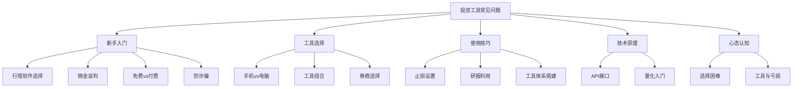
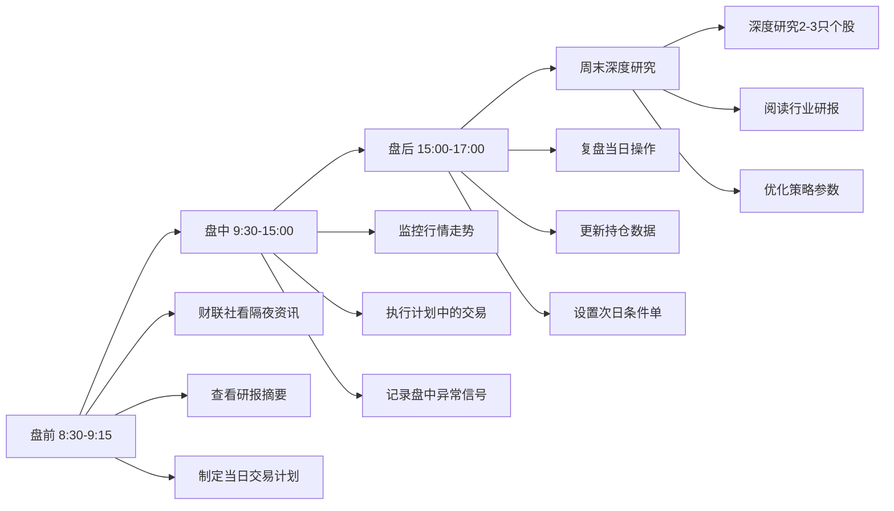
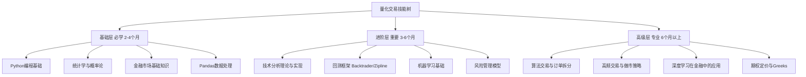
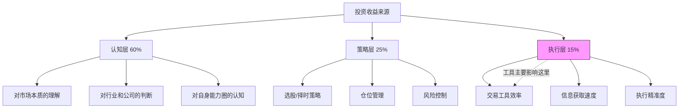

## 十、常见问题解答

投资工具从入门到精通的过程中，不同阶段的投资者会遇到截然不同的困惑。新手纠结"用什么"，中级投资者困惑"怎么用好"，高级投资者思考"如何构建体系"。本节将这些问题按**新手入门 → 工具选择 → 使用技巧 → 技术原理 → 心态认知**五大类系统梳理，每个问题不仅给出答案，更解释**为什么这样选择**背后的逻辑。



### 10.1 新手入门类问题

新手阶段的核心矛盾是**信息过载与决策困难**——市面上数百款投资工具，每款都声称自己最好。以下是新手最常问的四个问题，帮助你快速建立正确的起点认知。

#### Q1：新手应该用什么软件看行情？

行情软件是投资者最基本的工具，选择标准不是"功能最强"，而是**"上手最快、信息噪音最少"**。新手阶段最重要的是理解K线、成交量、均线这些基础指标的含义，而不是追求高级功能。

**主流行情软件对比**：

| 软件 | 核心优势 | 主要劣势 | 适合人群 | 月活用户（参考） |
|------|----------|----------|----------|-----------------|
| 同花顺 | 界面友好、功能全面、社区活跃、智能选股 | 广告较多、部分高级功能收费 | 纯新手入门 | 约6000万 |
| 东方财富 | 数据全面、资讯丰富、免费Level 2行情、自选股管理强 | 界面信息密度大，初看稍复杂 | 有一定基础的投资者 | 约4000万 |
| 雪球 | 社区讨论氛围好、价值投资圈层、组合跟踪 | 行情功能较弱、技术分析工具有限 | 价值投资者、喜欢交流 | 约2000万 |
| 通达信 | 速度快、可定制性强、公式编写灵活、券商版广泛 | 界面老旧、学习曲线陡 | 技术分析爱好者 | 约3000万 |
| 大智慧 | 历史悠久、数据积累深、机构版功能强 | 更新迭代慢、免费版功能缩水 | 老股民、机构用户 | 约1000万 |

**新手建议路线**：

1. **第1-2周**：先用同花顺手机版熟悉基本操作——看K线、查个股基本面、看涨跌排行
2. **第3-4周**：同步使用东方财富网页版，学习看研报、查财务数据
3. **第2个月**：根据自己的投资风格选择主力工具——偏价值投资选雪球，偏技术分析选通达信
4. **第3个月起**：开通券商账户，使用券商自带软件下单，主力行情软件用于分析

**为什么不能一开始就用通达信？** 通达信虽然强大，但其界面设计停留在2000年代，新手面对密密麻麻的指标和菜单会产生畏难感。先用同花顺建立基本认知，再迁移到通达信效率更高。

#### Q2：券商佣金可以谈到多少？

佣金是投资者最容易忽视、但长期累积影响巨大的成本。以10万元本金、每月交易4次计算，万3佣金年费用约1,440元，万1佣金年费用仅480元，差额近1,000元。本金越大、交易越频繁，佣金差异越显著。

**佣金谈判的关键因素是资金量和交易频率**：

| 资金量 | 默认佣金 | 可谈判范围 | 谈判筹码 |
|--------|----------|------------|----------|
| 10万以下 | 万3 | 万2-万3 | 线上新开户优惠、对比竞品 |
| 10-50万 | 万2.5 | 万1.5-万2 | 展示交易频率、承诺资金留存 |
| 50-100万 | 万2 | 万1.2-万1.5 | 对比多家券商报价、要求专属服务 |
| 100万以上 | 万1.5 | 万1-万1.2 | 要求配备客户经理、增值服务 |
| 500万以上 | 万1 | 万0.8-万1 | VIP专属服务、研报、线下活动 |

**佣金构成揭秘**：

很多人不知道佣金并非全部归券商。实际构成如下：

- **券商净佣金**：券商实际收取的部分（可谈判的部分）
- **规费**（约万0.687）：包含经手费（万0.341）+ 证管费（万0.2）+ 过户费（万0.1，沪深都收后降为万0.05）+ 印花税（卖出时千1，2023年减半为千0.5）

**注意**：有些券商说的"万1佣金"是**全佣**（含规费），有些是**净佣金**（不含规费）。谈判时务必确认是哪种口径。全佣万1.1左右基本就是当前市场的底线了。

**实战谈判话术**：

> "我在XX券商目前是万1.5的佣金，最近看到你们的新客活动，如果我转入50万资金，能否给我万1.2的全佣？我每月大概交易10-15次。"

谈判要点：
1. **有竞品报价**：永远让券商知道你在对比
2. **明确资金量**：资金量越大，谈判空间越大
3. **强调交易频率**：高频交易者是券商的优质客户
4. **选对时机**：券商季度末冲业绩时（3月、6月、9月、12月底）谈判成功率更高

#### Q3：免费工具够用吗？

这是新手最常问的问题之一。答案是：**取决于你的投资方式和所处阶段**。90%的普通投资者用免费工具完全足够，但当你的策略复杂度提升到一定层次，付费工具带来的信息优势和效率提升确实值得投入。

**分场景详细分析**：

| 投资类型 | 免费工具是否够用 | 缺什么 | 建议投入 | 推荐组合 |
|----------|------------------|--------|----------|----------|
| 长线价值投资（持有1年以上） | 完全够用 | 基本不缺 | 0元 | 雪球+东方财富+巨潮资讯 |
| 中线波段操作（1周-3月） | 基本够用 | Level 2行情可增强盘感 | 0-300元/年 | 同花顺+券商软件 |
| 短线交易（日内-3天） | 明显不足 | 缺快速行情、盘口深度 | 500-2000元/年 | 通达信Level 2+快速通道 |
| 量化交易 | 必须付费 | 缺历史数据、回测平台 | 2000-10000元/年 | Wind/Choice+聚宽 |
| 期权交易 | 部分付费 | 缺期权分析工具、Greeks计算 | 500-3000元/年 | 汇点期权+期权分析工具 |

**免费工具推荐组合详解**：

- **行情看盘**：同花顺/东方财富（覆盖面广，更新及时）
- **即时资讯**：财联社（7×24快讯，速度接近付费）/ 华尔街见闻（深度分析）
- **研报阅读**：萝卜投研（免费研报聚合最全）/ 慧博投研（行业研报质量高）
- **社区讨论**：雪球（价值投资圈）/ 集思录（可转债、低风险投资专业社区）
- **官方数据**：国家统计局（宏观数据）/ 巨潮资讯（上市公司公告）/ 中国人民银行（货币政策）
- **财务分析**：理杏仁（基本面数据，部分免费）/ 乌龟量化（估值分析）

**什么时候该升级付费？** 当你发现自己在以下场景中频繁受阻时：
- 需要的历史数据超过免费版的下载限制
- 研报总是比别人晚半天看到
- 盘口变化太快，免费行情延迟让你错过关键价位
- 需要同时监控50只以上股票

#### Q4：如何避免投资工具相关的诈骗？

投资诈骗是新手面临的最大风险之一。据公安部数据，2023年全国投资理财类诈骗案件造成损失超过200亿元。诈骗者利用的正是投资者"急于求成"和"信息不对称"的心理。

**六大常见诈骗形式深度解析**：

| 诈骗类型 | 典型话术 | 运作机制 | 识别方法 | 损失规模（常见） |
|----------|----------|----------|----------|-----------------|
| 假冒券商App | "官方升级，请重新下载" | 仿冒界面骗取登录凭证 | 只从官网或应用商店下载，核对开发者信息 | 几万-几百万 |
| 荐股软件 | "AI选股，月收益30%" | 先给甜头再收割 | 任何承诺收益的都是骗局 | 几千-几十万 |
| 代理操盘 | "交给我，保证赚钱" | 获取账户后频繁交易赚佣金或直接转走 | 永远不把账号密码给别人 | 几万-几百万 |
| 虚假交易平台 | "原油/贵金属/外汇，杠杆100倍" | 对赌盘，平台就是对手方 | 查验平台是否有正规监管牌照 | 几万-几千万 |
| 内幕消息群 | "主力即将拉升，速进" | 骗会员费或配合庄家出货 | 内幕交易是刑事犯罪 | 几千-几十万 |
| 杀猪盘 | "我在XX平台赚了很多" | 养熟后引导到虚假平台 | 网上认识的投资"朋友"99%是骗子 | 几万-几千万 |

**防诈四原则**：

1. **不贪**：任何年化收益超过10%且声称"稳赚"的项目，都需要高度警惕。巴菲特长期年化收益约20%，如果一个软件能稳定月收益3%，它不需要卖给你
2. **不急**：任何要求你"今天必须决定"、"名额有限"的，都是制造紧迫感的套路。正规投资机会不会因为多考虑一天就消失
3. **不给**：不给陌生人账号、密码、验证码。正规券商工作人员绝不会索要你的交易密码
4. **核实**：通过中国证券业协会官网（www.sac.net.cn）查询券商和从业人员资质，通过中国证监会官网查验平台合法性

**遭遇疑似诈骗的处理流程**：

1. 立即停止转账和操作
2. 截图保存所有聊天记录、转账凭证、平台界面
3. 拨打110或到当地派出所报案
4. 拨打反诈热线96110咨询
5. 如涉及券商假冒，同时向中国证监会12386热线举报

### 10.2 工具选择类问题

选择工具的核心原则是**匹配需求**而非追求功能最多。一个量化交易者和一个长线价值投资者的工具需求完全不同，强行使用不适合自己风格的工具只会增加认知负担。

#### Q5：手机App和电脑软件哪个更好？

这不是"哪个更好"的问题，而是**什么场景用什么设备**的问题。成熟的投资者通常是双端协同使用。

**逐维度深度对比**：

| 维度 | 手机App | 电脑软件 | 最佳实践 |
|------|---------|----------|----------|
| 便捷性 | 随时随地查看，碎片时间利用 | 必须坐在电脑前 | 日常监控用手机 |
| 功能完整度 | 基础功能齐全，高级功能受限 | 功能最全面，无阉割 | 深度分析用电脑 |
| 操作效率 | 单屏幕，切换频繁 | 多窗口并行，快捷键丰富 | 交易执行看场景 |
| 多屏监控 | 最多分屏看2个 | 多显示器可看8+个窗口 | 盘中监控用电脑 |
| 图表分析 | 小屏限制，指标叠加有限 | 大屏可同时看多周期、多指标 | 技术分析用电脑 |
| 通知推送 | 实时弹窗提醒 | 需要额外设置 | 价格预警用手机 |
| 交易速度 | 网络依赖性强 | 有线网络更稳定 | 高频交易用电脑 |
| 数据导出 | 通常不支持 | 支持CSV/Excel导出 | 数据分析用电脑 |

**典型使用场景**：

```text
场景1：上班族（朝九晚六）
├── 通勤路上：手机App查看持仓、设置价格预警
├── 工作间隙：手机快速扫一眼大盘走势
├── 午休时间：手机执行预先计划好的交易
└── 晚上回家：电脑复盘、研究个股、调整策略

场景2：全职投资者
├── 盘前（8:30-9:15）：电脑看资讯、研报，制定当日计划
├── 盘中（9:30-15:00）：电脑为主监控行情，手机为辅
├── 盘后（15:00-17:00）：电脑复盘、数据导出分析
└── 晚间：手机浏览社区讨论、设置次日预警

场景3：长线价值投资者
├── 日常：手机App偶尔查看持仓，设置大幅波动提醒
├── 季报期：电脑仔细阅读财报、对比历史数据
└── 交易日：手机或电脑均可，操作频率低
```

#### Q6：需要同时使用多个工具吗？

需要，但**数量要克制**。核心原则是"一主多辅"——一个主力工具承担80%的工作，2-3个辅助工具补足剩余20%的特定需求。工具太多会导致注意力分散，反而降低投资效率。

**工具组合策略**：

```text
核心层（1-2个，每天使用）
├── 券商交易软件 → 下单执行（必备，无法替代）
└── 主流行情软件 → 看盘分析（同花顺/东方财富/通达信 选一个主力）

辅助层（2-3个，按需使用）
├── 资讯工具 → 快讯获取（财联社/华尔街见闻）
├── 研报工具 → 深度研究（萝卜投研/慧博投研）
└── 社区工具 → 观点参考（雪球/集思录）

专业层（按投资类型选配）
├── 量化平台 → 策略开发（聚宽/米筐/RiceQuant）
├── 数据终端 → 专业数据（Wind/Choice/万得）
├── 财务分析 → 基本面研究（理杏仁/乌龟量化）
└── 期权工具 → 期权分析（汇点/期权帮）
```

**工具过多的三大危害**：

1. **信息过载**：同一时间收到多个App的推送和资讯，反而不知道该看什么
2. **精力分散**：花大量时间在不同工具之间切换，减少真正思考的时间
3. **信号冲突**：不同工具给出矛盾信号时，反而增加决策困难

**精简工具的判断标准**：如果一个工具超过两周没有打开过，删掉它。等真正需要时再装回来。

#### Q7：应该选择哪个券商？

券商是投资者与市场之间的桥梁，选择标准应该**按优先级排序**，而不是追求面面俱到。

**券商选择六维评估模型**：

| 维度 | 权重 | 评估方法 | 注意事项 |
|------|------|----------|----------|
| 佣金费率 | 25% | 直接询问客户经理，对比全佣口径 | 注意区分全佣和净佣金 |
| 交易软件 | 25% | 下载试用1-2周，体验下单速度和稳定性 | 券商版通达信/同花顺体验差异大 |
| 研报质量 | 15% | 查看近半年研报的准确率和深度 | 头部券商研报质量明显领先 |
| 服务质量 | 15% | 咨询客服响应速度和专业度 | 有专属客户经理体验好很多 |
| 营业部便利 | 10% | 附近是否有网点（开通两融、期权需临柜） | 线上开户时代重要性降低 |
| 增值服务 | 10% | Level 2行情、智能条件单、打新额度 | 部分服务需要资产门槛 |

**2024-2025年头部券商特点**：

| 券商 | 核心优势 | 适合人群 | 佣金参考 |
|------|----------|----------|----------|
| 中信证券 | 研究实力最强、机构业务领先 | 机构投资者、高净值 | 万1.5-万2.5 |
| 华泰证券 | 金融科技领先、涨乐财富通体验好 | 科技型投资者、中小资金 | 万1-万2 |
| 国泰君安 | 服务全面、线下网点最多 | 需要线下服务的投资者 | 万1.5-万2.5 |
| 招商证券 | 财富管理强、高端客户服务好 | 高净值客户 | 万1.5-万3 |
| 中信建投 | 研报质量高、投行业务强 | 关注新股和研报的投资者 | 万1.2-万2 |
| 东方财富证券 | 互联网券商、费率低、开户便捷 | 线上为主的年轻投资者 | 万1-万1.5 |

**选择建议**：

- **资金50万以下**：优先选东方财富证券或华泰证券，佣金低、线上体验好
- **资金50-300万**：选头部券商（中信/国君/招商），研报和增值服务有优势
- **需要两融/期权**：选网点多的券商，临柜办理方便
- **量化交易者**：确认券商是否提供API接口（部分券商不开放）

### 10.3 使用技巧类问题

掌握工具的基本操作只是第一步，真正的效率提升来自于**将工具融入完整的投资流程**中。以下三个问题涵盖了止损执行、研报分析和体系搭建三个核心技巧。

#### Q8：如何在工具中设置有效的止损？

止损是投资中最重要的风险控制手段，但很多投资者要么不设止损，要么设了不执行。工具可以帮助你**将止损从"心理承诺"变成"系统执行"**。

**四种主流止损方法深度对比**：

| 止损方法 | 计算方式 | 适用场景 | 优点 | 缺点 | 推荐指数 |
|----------|----------|----------|------|------|----------|
| 固定比例止损 | 亏损X%即止损 | 新手、短线交易 | 简单明确，易于执行 | 不考虑个股波动率差异 | ★★★★☆ |
| 技术位止损 | 跌破关键支撑位止损 | 技术分析交易者 | 符合市场逻辑，止损空间合理 | 可能被假突破触发 | ★★★★★ |
| ATR止损 | 买入价 - N倍ATR | 波动率交易 | 自适应市场波动，科学性强 | 需要计算，不够直观 | ★★★★☆ |
| 时间止损 | 持有X天未达预期即卖出 | 机会成本管理 | 避免资金长期被套 | 可能刚好在启动前卖出 | ★★★☆☆ |

**ATR止损计算详解**：

ATR（Average True Range，平均真实波幅）是衡量市场波动率的经典指标。用ATR设定止损的好处是**让止损幅度自动适应市场波动**——波动大的股票止损空间大，波动小的股票止损空间小。

```python
def calculate_stop_loss(entry_price, method="fixed", **kwargs):
    """
    计算止损价格
    
    参数：
    - entry_price: 入场价格
    - method: 止损方法 (fixed/atr/support/time)
    - kwargs: 各方法的特定参数
    
    返回：止损价格
    """
    if method == "fixed":
        # 固定比例止损：默认8%止损
        ratio = kwargs.get("ratio", 0.08)
        stop_price = entry_price * (1 - ratio)
        return round(stop_price, 2)
    
    elif method == "atr":
        # ATR止损：入场价 - N倍ATR
        # 适合中线波段交易，N通常取2-3
        atr = kwargs.get("atr")  # 14日ATR值
        multiplier = kwargs.get("multiplier", 2)
        stop_price = entry_price - atr * multiplier
        return round(stop_price, 2)
    
    elif method == "support":
        # 支撑位止损：跌破支撑位再留2%缓冲
        support = kwargs.get("support_price")
        buffer = kwargs.get("buffer", 0.02)
        stop_price = support * (1 - buffer)
        return round(stop_price, 2)

    elif method == "trailing":
        # 移动止损：从最高价回撤X%止损
        # 适合趋势行情中保护利润
        highest_price = kwargs.get("highest_price")
        trail_ratio = kwargs.get("trail_ratio", 0.10)
        stop_price = highest_price * (1 - trail_ratio)
        return round(stop_price, 2)


# 使用示例
entry = 50.00
print(f"固定8%止损: {calculate_stop_loss(entry, 'fixed', ratio=0.08)}")  
# 输出: 46.00
print(f"ATR止损(2倍ATR, ATR=1.5): {calculate_stop_loss(entry, 'atr', atr=1.5, multiplier=2)}")  
# 输出: 47.00
print(f"支撑位止损(支撑48元): {calculate_stop_loss(entry, 'support', support_price=48)}")  
# 输出: 47.04
print(f"移动止损(最高55元, 回撤10%): {calculate_stop_loss(entry, 'trailing', highest_price=55, trail_ratio=0.10)}")  
# 输出: 49.50
```

**券商条件单设置（实战操作）**：

大部分券商软件支持"条件单"功能，可以在股价触及止损价时自动触发卖出委托：

1. **华泰证券（涨乐财富通）**：交易 → 条件单 → 价格条件 → 设置触发价和委托价
2. **东方财富**：交易 → 智能条件单 → 止损止盈 → 设置条件
3. **同花顺**：交易 → 条件单 → 新建条件单

**止损的三个关键纪律**：

1. **买入前就设好止损位**：不要等亏损了再想止损点
2. **到了止损位必须执行**：不要心存侥幸"再等等看"
3. **止损后不要立即回补**：止损意味着你的判断可能有误，冷静观察

#### Q9：如何有效利用研报？

研报是专业分析师的研究成果，是普通投资者获取机构级分析的重要途径。但大多数人读研报的方式是错误的——只看结论不看逻辑，只看目标价不看假设条件。

**研报阅读的五层分析法**：

1. **看机构**：头部券商（中金、中信、华泰、国君等）的研报质量明显高于小券商。行业深度报告的质量通常高于个股报告
2. **看分析师**：跟踪新财富/水晶球评选中获奖的明星分析师，他们的分析框架和判断准确率更高
3. **看逻辑**：这是最重要的——关注分析框架和推理过程，而非结论本身。一个好的分析框架比一个正确的结论更有价值
4. **看数据**：验证数据来源是否权威（Wind/Choice vs 网络搜索），计算方法是否合理
5. **看假设**：每份研报的估值模型都建立在一系列假设上（增速、利润率、折现率等），理解这些假设才能判断结论的可靠性

**研报获取渠道深度对比**：

| 渠道 | 费用 | 研报覆盖范围 | 质量 | 更新速度 | 特色功能 |
|------|------|-------------|------|----------|----------|
| 萝卜投研 | 免费 | 全行业、个股 | 中高 | 快（延迟半天） | 盈利预测汇总、行业对比 |
| 慧博投研 | 免费 | 全行业 | 中高 | 快 | 策略报告齐全 |
| 东方财富Choice | 付费（约3000元/年） | 全面 | 高 | 实时 | 数据关联分析 |
| Wind万得 | 付费（约2-5万/年） | 最全面 | 最高 | 实时 | 专业终端、自定义报表 |
| 券商自有App | 免费（开户后） | 本券商研报 | 因券商而异 | 快 | 专属客户经理解读 |

**研报的正确使用流程**：

```text
第一步：快速筛选（每天15分钟）
├── 浏览研报标题，筛选与自己持仓/关注相关的
├── 优先阅读行业深度报告和策略周报
└── 跳过"维持买入评级"的例行报告

第二步：深度阅读（每周2-3篇）
├── 阅读完整的分析逻辑和假设条件
├── 对比同一公司不同券商的观点
├── 记录关键数据和判断依据
└── 形成自己的独立判断

第三步：跟踪验证（每月复盘）
├── 回顾之前阅读的研报预测
├── 对比实际走势与研报预测的偏差
├── 总结哪些分析师/机构的判断更准确
└── 优化自己的研报阅读筛选标准
```

#### Q10：如何建立自己的投资工具体系？

工具体系不是工具的简单堆砌，而是一套**与你的投资风格、分析流程、执行习惯深度绑定的系统**。好的工具体系能让投资决策效率提升3-5倍。

**三步建立法详解**：

**第一步：明确投资风格（这是工具选择的前提）**

不同投资风格对工具的核心需求截然不同：

| 投资风格 | 核心需求 | 重点工具类型 | 不太需要的 |
|----------|----------|-------------|-----------|
| 价值投资 | 财务数据、估值分析、长期趋势 | 基本面分析工具、研报平台 | 高频行情、技术指标 |
| 趋势投资 | 技术指标、趋势线、量价关系 | 技术分析软件、多周期图表 | 深度财务分析 |
| 量化投资 | 历史数据、回测平台、编程接口 | 数据API、回测框架、编程环境 | 社区讨论、主观分析 |
| 事件驱动 | 快讯速度、公告监控、舆情分析 | 资讯聚合、新闻监控 | 长期趋势分析 |

**第二步：选择核心工具（宁精勿多）**

```text
必备层（人人需要）
├── 券商交易软件 → 下单执行，无法替代
└── 1个主力行情软件 → 80%的看盘需求

核心层（按风格选1-2个）
├── 价值投资者：理杏仁/乌龟量化 + 萝卜投研
├── 趋势投资者：通达信/同花顺高级版
├── 量化投资者：聚宽/米筐 + Tushare/AKShare
└── 事件驱动：财联社/Wind资讯终端

可选层（特定需求）
├── 期权交易者：汇点期权 + 期权分析工具
├── 基金投资者：天天基金/蚂蚁财富 + 晨星评级
├── 海外投资者：富途/老虎 + TradingView
└── 组合管理：且慢/蛋卷基金
```

**第三步：建立使用流程（工具要嵌入流程才有效）**



### 10.4 技术类问题

技术类问题是很多投资者想问但不太好意思问的——API是什么？量化交易到底要学什么？这些问题的答案决定了你能否从"手动操作"升级到"系统化投资"。

#### Q11：API接口是什么？普通人需要吗？

**API（Application Programming Interface，应用程序编程接口）** 是不同软件程序之间通信的桥梁。通俗地说，如果手动操作是在券商App上点"买入"按钮，API就是让你的程序自动发送"买入"指令。

**需要API的场景**：

| 场景 | 为什么需要API | 替代方案（不用API） |
|------|-------------|-------------------|
| 量化交易 | 策略自动执行，人工无法同时监控上百只股票 | 无替代，量化必须用API |
| 自动化监控 | 定时抓取数据，触发条件后自动提醒 | 手动设置条件单（功能有限） |
| 批量数据获取 | 一次获取几千只股票的历史数据 | 手动导出（极慢且有限制） |
| 多账户管理 | 同时管理多个账户的交易和持仓 | 分别登录操作（效率极低） |
| 自定义报表 | 生成符合自己需求的投资报表 | Excel手动整理 |

**不需要API的场景**：

- 只做手动交易，每月操作不超过10次
- 投资标的不超过20只
- 不需要自动化策略
- 对编程完全没兴趣

**主流数据API对比**：

| API服务 | 数据范围 | 费用 | 调用限制 | 适合谁 |
|---------|---------|------|----------|--------|
| Tushare Pro | A股全量数据、基金、期货 | 积分制（免费基础+付费高级） | 按积分等级限频 | 入门量化 |
| AKShare | A股、港股、美股、宏观数据 | 完全免费 | 无硬性限制（需合理使用） | 数据探索 |
| 聚宽JQData | A股专业数据、因子数据 | 付费（约1000元/年起） | 按套餐限频 | 专业量化 |
| Wind API | 全市场最全面数据 | 付费（2-5万元/年） | 按套餐限频 | 机构/专业 |
| 券商API | 交易接口+行情 | 需申请（有资金门槛） | 因券商而异 | 程序化交易 |

```python
# 使用 AKShare 获取A股数据示例（完全免费）
import akshare as ak

# 获取个股历史行情
df = ak.stock_zh_a_hist(
    symbol="000001",    # 股票代码
    period="daily",      # 日线
    start_date="20240101",
    end_date="20241231",
    adjust="qfq"         # 前复权
)
print(df.tail())  # 查看最近5条数据

# 获取实时行情
realtime = ak.stock_zh_a_spot_em()
print(realtime[realtime['代码'] == '000001'][['名称', '最新价', '涨跌幅']])
```

#### Q12：量化交易需要学什么？

量化交易是用数学模型和计算机程序来做投资决策的方式。它不是"躺赚"，而是**将投资逻辑从主观判断转变为可量化、可回测、可执行的系统**。

**量化交易技能树详解**：



**各阶段学习内容与资源**：

| 阶段 | 学习内容 | 推荐资源 | 学习时长 | 里程碑 |
|------|----------|----------|----------|--------|
| 基础1 | Python基础语法、数据结构 | 《Python编程从入门到实践》 | 4-6周 | 能独立写100行程序 |
| 基础2 | Pandas、NumPy、Matplotlib | 《利用Python进行数据分析》 | 3-4周 | 能处理CSV数据并画图 |
| 基础3 | 统计学基础、概率分布 | 可汗学院统计学课程 | 3-4周 | 理解均值、方差、相关性 |
| 基础4 | 金融市场基础、交易规则 | 《漫步华尔街》+ 券商投教 | 2-3周 | 理解K线、均线、成交量 |
| 进阶1 | 技术指标实现（MA/RSI/MACD） | TA-Lib库 + 《技术分析》 | 4-6周 | 能用Python计算技术指标 |
| 进阶2 | 回测框架使用 | Backtrader官方文档 | 3-4周 | 能回测一个简单策略 |
| 进阶3 | 策略评估指标 | 夏普比率、最大回撤、胜率 | 2-3周 | 能评估策略好坏 |
| 高级1 | 机器学习应用 | 《Hands-On ML》+ 金融案例 | 3-6个月 | 能用ML做因子挖掘 |
| 高级2 | 实盘交易系统搭建 | 券商API + 风控系统 | 3-6个月 | 能跑实盘策略 |

**一个最简单的量化策略示例**（双均线交叉）：

```python
import backtrader as bt

class DualMA(bt.Strategy):
    """双均线交叉策略：
    - 短期均线上穿长期均线 → 买入
    - 短期均线下穿长期均线 → 卖出
    """
    params = (
        ('fast_period', 5),   # 短期均线周期
        ('slow_period', 20),  # 长期均线周期
    )
    
    def __init__(self):
        self.fast_ma = bt.indicators.SMA(period=self.p.fast_period)
        self.slow_ma = bt.indicators.SMA(period=self.p.slow_period)
        self.crossover = bt.indicators.CrossOver(self.fast_ma, self.slow_ma)
    
    def next(self):
        if self.crossover > 0:     # 金叉
            if not self.position:
                self.buy()
        elif self.crossover < 0:   # 死叉
            if self.position:
                self.sell()
```

**新手量化的三个忠告**：

1. **先学好基础再跑策略**：不要急着实盘，先在回测中验证逻辑
2. **回测不等于实盘**：回测中没有滑点、冲击成本、流动性问题，实盘表现通常比回测差20-40%
3. **简单策略往往比复杂策略更稳健**：参数越少、逻辑越简单的策略，过拟合风险越低

### 10.5 心态认知类问题

工具能提升效率，但**不能替代正确的投资认知**。以下两个问题是投资者最容易陷入的认知陷阱。

#### Q13：工具推荐太多，不知道怎么选？

选择困难的本质不是选项太多，而是**没有建立自己的筛选标准**。当你不清楚自己需要什么时，所有工具看起来都"可能有用"。

**选择困难的深层原因与解决方案**：

| 深层原因 | 表现 | 解决方案 |
|----------|------|----------|
| 投资风格未明确 | 什么工具都想试试 | 先花1个月确定自己的投资风格 |
| 信息焦虑 | 总觉得别人的工具更好 | 限制信息源，专注自己的体系 |
| 完美主义 | 想找到"最好的"工具 | 接受"够用就好"，没有完美工具 |
| 逃避决策 | 用"研究工具"代替"实际投资" | 设定deadline，到时间必须做决定 |

**极简工具组合方案**：

```text
入门级（投资经验<1年，资金<10万）
├── 券商App（下单）
├── 同花顺（看盘+资讯）
└── 雪球（社区+学习）
→ 总成本：0元

进阶级（投资经验1-3年，资金10-100万）
├── 东方财富（全面看盘+研报）
├── 雪球（深度讨论）
├── 萝卜投研（免费研报）
└── 集思录（特定品种分析）
→ 总成本：0-500元/年

专业级（投资经验3年以上，资金100万+）
├── 通达信/同花顺Level 2（深度行情）
├── Choice/Wind（专业数据）
├── 聚宽/米筐（量化回测）
└── 自建监控系统
→ 总成本：5000-50000元/年
```

**选择工具的决策流程**：

1. **列出需求**：写下你投资中遇到的具体痛点（不是"我想看更多数据"，而是"我想知道哪些股票被机构增持"）
2. **寻找最小方案**：这个痛点能否用现有免费工具解决？
3. **试用验证**：选定2-3个候选工具，每个试用1周
4. **果断决策**：试用结束后，选择体验最好的那个，其他的删掉
5. **定期清理**：每季度检查一次工具使用情况，删除不用的

#### Q14：用了工具还是亏损，怎么办？

这是投资中最扎心的问题。答案是：**工具从来不保证盈利，它只提升你做出正确决策的概率和执行效率**。

**工具与投资收益的关系**：



工具主要影响的是**执行层**（约15%的收益贡献），而决定投资成败的核心是**认知层**（约60%）和**策略层**（约25%）。用最好的工具做错误的决策，结果只会更快地亏损。

**使用工具仍亏损的四大诊断**：

| 可能原因 | 自检方法 | 解决方案 | 预期改善时间 |
|----------|----------|----------|-------------|
| 工具使用不当 | 复盘最近20笔交易，检查是否利用了工具的关键功能 | 系统学习工具的高级功能 | 2-4周 |
| 策略本身有缺陷 | 统计策略的历史胜率和盈亏比，回测看是否长期为正 | 用量化工具回测，调整或更换策略 | 1-3个月 |
| 执行纪律问题 | 检查是否有"计划卖出但犹豫了"、"该止损没止损"的情况 | 使用条件单自动化执行，减少人为干预 | 立刻改善 |
| 市场环境变化 | 对比策略在牛市/熊市/震荡市的表现差异 | 建立多策略体系，适应不同市场环境 | 3-6个月 |

**最根本的认知转变**：

> 工具是放大器，不是印钞机。它放大你的能力——如果你能力强，工具帮你赚更多；如果你能力弱，工具帮你亏更快。投资成功的关键路径是：**正确的认知 → 合理的策略 → 严格的纪律 → 趁手的工具**。这个顺序不能颠倒。

**从"工具依赖"到"体系驱动"的升级路径**：

1. **第一阶段**（新手期）：依赖工具的推荐功能和社区观点，亏钱概率高 → 这是学费
2. **第二阶段**（学习期）：开始理解工具背后的数据和逻辑，不盲目跟从 → 开始建立独立判断
3. **第三阶段**（实践期）：形成自己的分析框架，工具成为执行助手 → 从"被工具带着走"变为"用工具做自己的事"
4. **第四阶段**（成熟期）：建立完整的投资体系，工具只是系统的一个环节 → 投资决策不依赖任何单一工具

每个投资者都需要经历这四个阶段，没有人能跳过。**亏损本身不是问题，在同一个地方反复亏损才是问题**。每次亏损后问自己三个问题：

1. 这次亏损是因为认知不足、策略错误、执行偏差，还是单纯的运气不好？
2. 我的工具在哪个环节发挥了作用，哪个环节没有发挥作用？
3. 下次遇到类似情况，我能做得更好吗？

如果每次亏损都能回答这三个问题，你的投资能力就在持续进步。工具只是让这个学习过程更高效，它不能替代学习本身。
