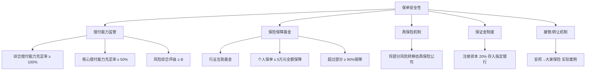
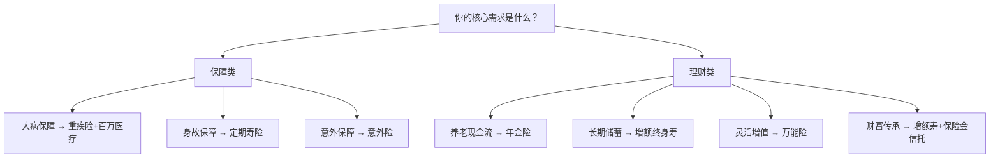
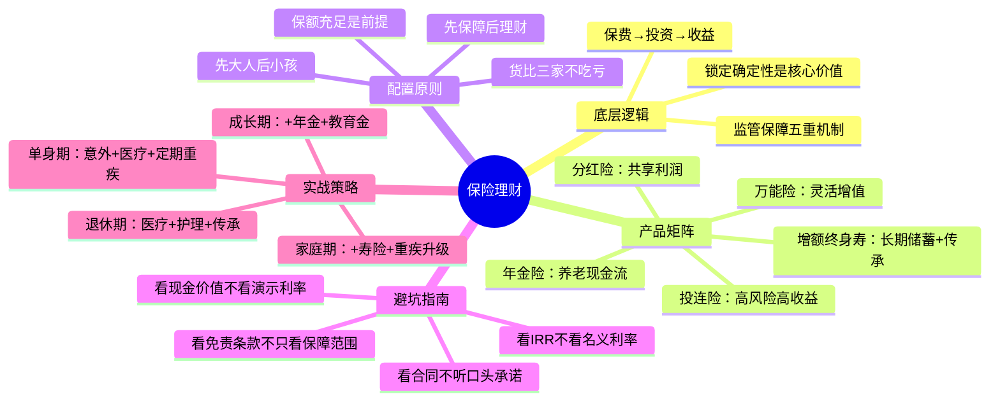

## 十一、保险理财工具

保险在多数人的认知中是"花钱买平安"的消费品，但它同时也是全球金融体系中规模最庞大的资金池之一。2025年中国保险业总资产突破30万亿元，保险公司是债券市场最大的机构投资者，是基础设施建设的核心出资方，也是养老第三支柱的关键载体。理解保险理财，不是为了"靠保险发财"，而是为了在资产配置中合理利用保险独有的**安全性、确定性、长期性和法律功能**，补齐其他金融工具无法覆盖的短板。

本章从保险理财的底层逻辑出发，逐一拆解主流产品形态，给出可量化的选择方法，最后落到不同人生阶段的实战配置方案。

---

### 11.1 保险理财的底层逻辑

#### 11.1.1 保费去哪了——保险公司的资金运作

保险产品之所以能产生收益，根本原因在于保险公司将收取的保费进行投资。保险公司属于持牌金融机构，受到银保监会（现国家金融监督管理总局）的严格监管，其投资范围和比例受到明确限制：

| 资产类别 | 配置比例上限 | 收益特征 | 与保单利益的关系 |
|----------|-------------|----------|-----------------|
| 国债、政策性金融债 | 无硬性上限 | 稳定收益，信用风险极低 | 构成保证利率的底层资产 |
| 企业债券（AA+以上） | ≤50% | 收益略高于国债 | 提升整体投资回报 |
| 银行存款 | 视配置需要 | 流动性强，收益低 | 满足退保和理赔的流动性需求 |
| 股票/基金 | ≤30%（权益类） | 波动大，长期回报较高 | 支撑万能险/分红险的浮动收益 |
| 基础设施债权计划 | ≤30% | 长期稳定，与负债期限匹配 | 年金险长期给付的核心支撑 |
| 不动产 | ≤30% | 抗通胀，现金流稳定 | 分散投资风险 |

理解这个资金链条至关重要：**保证利率对应的是债券和存款等固收资产，浮动收益对应的是权益和另类资产**。当市场利率下行时，新发债券收益率下降，保险公司的投资收益承压，这就是为什么近年来万能险结算利率持续走低的根本原因。

#### 11.1.2 保险理财 vs 其他理财工具——本质差异

很多投资者纠结"保险理财收益太低，不如买基金"。这种比较忽略了工具的本质定位差异：

| 维度 | 保险理财 | 银行理财 | 债券基金 | 股票基金 |
|------|---------|---------|---------|---------|
| 核心功能 | 保障+确定性收益 | 稳健增值 | 固收增强 | 资本增值 |
| 安全性 | ★★★★★（合同保证） | ★★★★☆（资管新规后不保本） | ★★★☆☆ | ★★☆☆☆ |
| 收益确定性 | ★★★★★（写入合同） | ★★☆☆☆ | ★★★☆☆ | ★☆☆☆☆ |
| 流动性 | ★☆☆☆☆（退保有损失） | ★★★★☆ | ★★★★☆ | ★★★★★ |
| 收益上限 | ★★☆☆☆（2.5%-3.5%） | ★★★☆☆ | ★★★★☆ | ★★★★★ |
| 法律功能 | ★★★★★（债务隔离、指定受益人） | ☆☆☆☆☆ | ☆☆☆☆☆ | ☆☆☆☆☆ |
| 适合场景 | 养老、传承、强制储蓄 | 短期理财 | 中长期稳健投资 | 长期财富增长 |

**关键结论**：保险理财不是用来"赚钱"的，而是用来"锁定确定性"的。在利率下行周期中，一份锁定终身2.5%复利的增额终身寿，其价值远超表面收益率——因为同期银行定存利率可能已经跌到1%以下。

#### 11.1.3 监管框架与安全保障机制

中国保险业拥有全球最严格的监管体系之一，保单安全性由五重机制保障：



**实际案例**：2018年安邦保险被接管，后重组为大家保险，所有保单正常兑付，投保人利益未受任何影响。这是中国保险保障机制有效运作的最佳证明。

---

### 11.2 主流保险理财产品详解

#### 11.2.1 年金险——养老规划的核心工具

年金险是将"一笔钱"转化为"持续现金流"的金融工具，是最纯粹的保险理财形态。

**产品机制**：

```text
缴费期（3-30年）──→ 积累期（可选）──→ 领取期（终身/固定期限）
    │                    │                    │
 定期缴费            现金价值复利增长       按月/年领取年金
```

**年金险的分类**：

| 分类维度 | 类型 | 特点 | 适合人群 |
|---------|------|------|---------|
| 领取时间 | 即期年金 | 缴费后立即领取 | 临近退休者 |
| 领取时间 | 延期年金 | 缴费后等若干年再领取 | 中青年养老规划 |
| 收益方式 | 定额年金 | 每期领取金额固定 | 追求确定性的人 |
| 收益方式 | 变额年金 | 每期领取金额与投资账户挂钩 | 能承受波动的人 |
| 给付期限 | 终身年金 | 活多久领多久 | 担心长寿风险的人 |
| 给付期限 | 定期年金 | 领取固定年限（如20年） | 有明确规划周期的人 |
| 附加功能 | 万能型年金 | 年金进入万能账户二次增值 | 追求灵活性的人 |

**收益计算——拆解"复利幻觉"**：

很多销售人员用"复利3.5%"来宣传年金险，但这个数字需要仔细拆解：

```python
def calculate_annuity_irr(annual_premium, payment_years, 
                          annual_payout, payout_years):
    """
    计算年金险的真实内部收益率(IRR)
    
    真正有意义的不是"保证利率"，而是IRR——
    即你实际付出的钱和实际领回的钱之间的年化回报率。
    
    参数:
        annual_premium: 年缴保费（元）
        payment_years: 缴费年数
        annual_payout: 每年领取金额（元）
        payout_years: 领取年数
    """
    # 构建现金流：缴费期为负，领取期为正
    cashflows = []
    for i in range(payment_years):
        cashflows.append(-annual_premium)
    for i in range(payout_years):
        cashflows.append(annual_payout)
    
    # 用牛顿法求IRR
    def npv(rate, cfs):
        return sum(cf / (1 + rate) ** i for i, cf in enumerate(cfs))
    
    def npv_derivative(rate, cfs):
        return sum(-i * cf / (1 + rate) ** (i + 1) for i, cf in enumerate(cfs))
    
    rate = 0.03  # 初始猜测
    for _ in range(100):
        f = npv(rate, cashflows)
        fp = npv_derivative(rate, cashflows)
        if abs(fp) < 1e-12:
            break
        rate_new = rate - f / fp
        if abs(rate_new - rate) < 1e-10:
            rate = rate_new
            break
        rate = rate_new
    
    total_in = annual_premium * payment_years
    total_out = annual_payout * payout_years
    
    return {
        "总投入": f"¥{total_in:,.0f}",
        "总领取": f"¥{total_out:,.0f}",
        "领取/投入比": f"{total_out / total_in:.2f}",
        "真实IRR": f"{rate * 100:.2f}%",
        "说明": "IRR才是衡量年金险真实收益的核心指标"
    }

# 示例：30岁男性，年缴10万×10年，60岁起每年领12万×终身（按30年计）
result = calculate_annuity_irr(100000, 10, 120000, 30)
# 总投入：100万
# 总领取：360万（按30年计）
# 真实IRR：约2.8%-3.2%（取决于具体产品）
```

**年金险选择的核心指标**：

1. **看IRR而非名义利率**：销售人员说的"3.5%复利"是保额增长率，不等于你的投资回报率。真正有意义的是IRR（内部收益率），需要自己算或要求经纪人算。
2. **看领取金额占已交保费的比例**：年领取金额 ÷ 总已交保费 = 直观的回报率。
3. **看现金价值曲线**：退保时能拿回多少钱。有些产品现金价值极低，意味着你的钱被锁死了。
4. **看保证领取年限**：部分产品有"保证领取20年"条款，即使被保人去世，剩余年份的年金也会给到受益人。
5. **看万能账户保底利率**：如果年金进入万能账户二次增值，保底利率决定了最坏情况。

#### 11.2.2 增额终身寿险——利率下行期的"时间胶囊"

增额终身寿险（简称"增额寿"）是近五年最受欢迎的保险理财产品，本质是一份**保额和现金价值按合同约定利率终身增长**的寿险。

**运作原理**：

```text
保额每年按约定比例递增（如3.0%）
        ↓
现金价值随之增长（前期低于已交保费，后期超过已交保费）
        ↓
可通过"减保"（部分退保）取出部分现金价值
        ↓
剩余部分继续按约定利率增长
```

**收益特征——时间是最好的朋友**：

| 持有年限 | 现金价值/已交保费 | 折算年化收益 | 与同期银行定存对比 |
|----------|-------------------|-------------|-------------------|
| 1年 | 50%-70% | -30%~-50% | 定存约2%，差距巨大 |
| 3年 | 80%-90% | -3%~-5% | 定存约2%，差距缩小 |
| 5年 | 95%-105% | -1%~1% | 基本持平 |
| 10年 | 120%-140% | 1.8%-3.4% | 开始超越定存 |
| 20年 | 170%-210% | 2.6%-3.8% | 显著超越（定存可能已跌至1%） |
| 30年 | 250%-330% | 3.1%-4.1% | 复利优势充分体现 |

**核心价值不在于收益率高低，而在于"锁定"**：在你投保那一刻，未来几十年的利率就确定了。如果未来中国像日本一样进入零利率甚至负利率时代，这份保单就成了极其珍贵的"利率时间胶囊"。

**增额寿的隐藏功能——减保取现**：

增额终身寿最大的灵活性在于"减保"：你可以随时取出一部分现金价值，剩余部分继续增长。这使得它可以充当：

- **教育金账户**：孩子18岁时减保取现交学费
- **应急储备金**：急需用钱时减保而非退保
- **养老金补充**：退休后每年减保取现作为生活费
- **婚嫁金**：子女结婚时一次性减保

**增额寿选择的五个关键点**：

1. **现金价值回本时间**：越早回本越好（通常第4-7年）
2. **长期现金价值增速**：看第20年、第30年的现金价值，而非第5年
3. **减保规则**：有些产品减保无限制，有些每年最多减保20%，差异巨大
4. **是否支持保单贷款**：现金价值的80%可以贷款，不退保也能用钱
5. **投保人豁免**：投保人发生意外/重疾，后续保费免交

**2024-2025年监管变化**：监管要求将增额终身寿的预定利率从3.5%下调至3.0%，部分产品进一步降至2.5%。这意味着早期投保的客户手中握有的是"稀缺资产"，利率越低，旧保单的价值越高。

#### 11.2.3 万能险——灵活但透明度最低的品种

万能险（Universal Life）是一种兼具保障和投资功能的保险产品，特点是有一个"万能账户"，资金在账户中按结算利率增值。

**万能险的收益结构**：

```text
万能险账户价值 = 累计保费 - 各项费用 + 结算收益

结算利率 = 保底利率（写入合同，1.75%-3%）+ 浮动部分
         ↓
    每月公布一次（官网可查）
    近年趋势：从5%+持续下降至3%-3.5%
```

**万能险费用结构——隐性成本不低**：

| 费用类型 | 典型比例 | 扣除时点 | 影响 |
|---------|---------|---------|------|
| 初始费用 | 首年3%-5%，次年起1%-3% | 缴入时立即扣除 | 降低实际投入本金 |
| 退保费用 | 第1年5%，逐年递减，第6年为0 | 退保时扣除 | 5年内退保有损失 |
| 保单管理费 | 0-50元/月 | 按月扣除 | 长期累积不可忽视 |
| 保障成本（风险保费） | 按年龄和保额查表 | 按月从账户扣除 | 年龄越大扣费越多 |

**一个关键公式——追加保费的实际价值**：

很多万能险允许"追加保费"（额外往万能账户里存钱），追加部分的初始费用通常很低（1%甚至0%），这意味着追加的资金几乎全额进入账户增值。如果你已经持有一份万能险且保底利率≥2.5%，追加保费可能是当前市场上最优的"存款替代"方案之一。

**万能险选择要点**：

1. **保底利率**：这是你最差情况下的收益，越高越好。2024年后新产品的保底利率多为2%，早期产品有的高达3%甚至3.5%。
2. **实际结算利率**：反映保险公司的投资能力和"让利意愿"。但要注意，结算利率可以下调，保底利率不能。
3. **费用结构**：重点看初始费用和退保费用，差异巨大。
4. **追加规则**：是否允许追加、追加上限、追加费用，决定了产品的灵活性。

#### 11.2.4 分红险——与保险公司"共享利润"

分红险是指保险公司在每个会计年度结束后，将该类分红保险的可分配盈余按一定比例分配给保单持有人的产品。

**分红的来源**：

```text
可分配盈余 = 死差益 + 费差益 + 利差益

死差益：实际死亡率 < 预定死亡率 → 节省的赔付金
费差益：实际运营费用 < 预定费用 → 节省的管理费
利差益：实际投资收益 > 预定利率 → 超额投资回报
```

**分红的两种方式**：

| 方式 | 含义 | 适合人群 |
|------|------|---------|
| 现金分红 | 直接领取现金或抵缴保费 | 需要现金流的人 |
| 增额分红（保额分红） | 红利转为增加的保额，继续参与分红 | 追求长期复利增长的人 |

**重要提醒**：分红是不保证的。保险公司可以不分红，也可以少分红。销售人员演示的"中档"和"高档"分红只是假设，不代表实际收益。**选择分红险时，应以"保证利益"部分作为决策基础，分红视为锦上添花**。

#### 11.2.5 投连险——最接近基金的保险产品

投资连结保险（投连险）是保险产品中风险最高、潜在收益也最高的品种，本质是"保险+基金账户"。

**投连险的账户结构**：

```text
投连险账户
├── 激进型账户（股票为主，波动大）
├── 平衡型账户（股债混合）
├── 稳健型账户（债券为主）
└── 保守型账户（货币市场工具为主）

投保人可自由选择账户配置比例，也可随时转换
```

**投连险 vs 直接买基金**：

| 对比维度 | 投连险 | 直接买基金 |
|---------|-------|-----------|
| 保障功能 | 有（身故保额=账户价值×105%-110%） | 无 |
| 费用结构 | 初始费用高（3%-5%），管理费1.5%-2% | 申购费0-1.5%，管理费1%-1.5% |
| 灵活性 | 账户间转换通常免费 | 赎回后可自由再投资 |
| 税收 | 暂无明确税收优惠 | 同 |
| 适合场景 | 需要保障+投资一体化 | 纯投资目的 |

**投连险适合的人群**：有一定投资经验、能够承受净值波动、需要在保障和投资之间取得平衡的人。对于纯投资目的，直接买基金通常更优。

#### 11.2.6 主流产品全景对比

| 维度 | 年金险 | 增额终身寿 | 万能险 | 分红险 | 投连险 |
|------|-------|-----------|-------|-------|-------|
| 收益确定性 | 高（保证领取） | 高（现金价值写入合同） | 中（保底+浮动） | 低（分红不保证） | 无（完全随市场） |
| 典型年化收益 | 2.5%-3.5% | 2.5%-3.5% | 保底2%+浮动 | 保证部分1.5%-2% | -20%~+30% |
| 流动性 | 低（领取前退保有损失） | 中（减保较灵活） | 中（5年后无退保费用） | 低 | 高（随时赎回） |
| 核心用途 | 养老现金流 | 长期储蓄/传承 | 灵活增值 | 保障+收益 | 保障+投资 |
| 风险等级 | 极低 | 极低 | 低 | 低-中 | 中-高 |
| 适合人群 | 养老规划者 | 长期储蓄者 | 追求灵活性者 | 稳健保守者 | 有投资经验者 |

---

### 11.3 保障型保险——理财前的"地基"

在讨论保险理财之前，必须先厘清保障型保险，因为没有保障的理财是空中楼阁。

#### 11.3.1 社会保险 vs 商业保险

| 保障类型 | 社保覆盖 | 社保缺口 | 商业保险补充 |
|---------|---------|---------|------------|
| 医疗 | 报销60%-90%，有起付线和封顶线 | 进口药、靶向药、ICU不报 | 百万医疗险（年费200-1000元） |
| 重疾 | 无 | 收入中断、康复费用 | 重疾险（一次性给付） |
| 意外 | 工伤有保障，非工伤保障有限 | 伤残等级赔付差异大 | 意外险（年费100-300元） |
| 身故 | 丧葬费+抚恤金（约几万元） | 无法覆盖家庭负债和收入缺口 | 定期寿险（年费500-2000元） |
| 养老 | 替代率约40%-60% | 养老金可能不够用 | 年金险/增额终身寿 |

**一个直观的比喻**：社保是"毛坯房"，能遮风挡雨但不够舒适；商业保险是"精装修"，补上社保覆盖不到的缺口。

#### 11.3.2 四大保障型保险详解

**① 意外险——杠杆率最高的保险**

意外险是所有保险中性价比最高的品种，年费100-300元即可获得50-100万保额。

选购要点：
- 意外身故/伤残保额：建议≥年收入的10倍
- 意外医疗：不限社保用药 > 限社保用药
- 猝死保障：部分产品含猝死责任（现代人必备）
- 住院津贴：按天给付，锦上添花

**② 百万医疗险——大病的"保护伞"**

百万医疗险是报销型产品，年费200-1000元（30岁），保额200-600万。

选购要点：
- 保证续保年限：20年 > 6年 > 1年（越长越好）
- 免赔额：通常1万元，家庭共享免赔额更优
- 外购药/靶向药：必须包含
- 质子重离子治疗：加分项
- 增值服务：就医绿通、住院垫付、术后护理

**③ 重疾险——收入损失的"补偿器"**

重疾险的核心不是"治病钱"（那是医疗险的事），而是"养病钱"——确诊即赔一笔钱，覆盖治疗期间的收入损失、康复费用和生活开支。

选购要点：
- 保额：年收入 × 3-5倍（最低30万，建议50万+）
- 保障期限：预算充足选终身，预算有限选定期（保至70岁）
- 赔付次数：单次 vs 多次分组 vs 多次不分组（不分组最优）
- 轻症/中症：包含轻症和中症赔付更全面
- 投保人豁免：投保人出险，后续保费免交

**④ 定期寿险——家庭责任的"备份"**

定期寿险保的是"你在经济上对家庭的责任"。如果你不在了，这笔钱替你完成未尽的责任：还房贷、养孩子、赡养父母。

保额计算公式：

```python
def calculate_term_life_need(annual_income, years_to_retire,
                              mortgage_balance, children_ages,
                              annual_parents_support, spouse_income,
                              years_of_support=10):
    """
    计算定期寿险需求
    
    核心逻辑：你需要多少钱，才能让你的家人在你离开后
    维持现有生活水平直到经济独立？
    """
    # 1. 未来收入缺口（到退休）
    income_gap = annual_income * years_to_retire
    
    # 2. 负债总额
    total_debt = mortgage_balance
    
    # 3. 子女教育金（每个孩子到22岁）
    education_per_child = 80000  # 每年8万教育支出（含学费+生活费）
    children_edu = sum(max(0, 22 - age) * education_per_child 
                       for age in children_ages)
    
    # 4. 父母赡养费
    parents_total = annual_parents_support * years_of_support
    
    # 5. 减去配偶可承担的部分
    spouse_contribution = spouse_income * years_to_retire * 0.5
    
    # 总保额
    total_need = (income_gap * 0.5 + total_debt + children_edu + 
                  parents_total - spouse_contribution)
    
    return max(total_need, 1000000)  # 最低100万

# 示例：30岁，年收入30万，房贷150万，1个孩子（3岁），赡养费5万/年，配偶年收入15万
need = calculate_term_life_need(
    annual_income=300000, years_to_retire=30,
    mortgage_balance=1500000, children_ages=[3],
    annual_parents_support=50000, spouse_income=150000
)
# 约需要 250-300万 定期寿险保额
```

保障期限选择：保到孩子成年独立（如保至55-60岁）即可，不需要保终身——因为退休后你已不再是家庭经济支柱。

---

### 11.4 保险理财的优缺点深度分析

#### 11.4.1 核心优势——其他工具无法替代的功能

**优势一：合同锁定的确定性**

在所有金融工具中，只有保险能将未来几十年的收益写入合同、刚性兑付。银行理财已经打破刚兑，信托暴雷频发，唯有保险合同中的保证利益仍然"说到做到"。

**优势二：法律层面的独特功能**

| 法律功能 | 具体机制 | 适用场景 |
|---------|---------|---------|
| 债务隔离 | 人寿保险金不属于遗产（《保险法》第42条），理论上不用于偿还被保险人生前债务 | 企业主风险隔离 |
| 指定受益人 | 保险金直接给付指定受益人，不经过遗产分配程序 | 避免家庭遗产纠纷 |
| 婚姻财产隔离 | 婚前投保并交清保费，保单属于个人财产 | 婚前财产保护 |
| 税务优势 | 保险赔款免征个人所得税；税延养老险缴费税前扣除 | 合法税务筹划 |
| 信托结合 | 保险金信托：身故保险金进入信托，按约定分配 | 高净值家庭传承 |

**优势三：强制储蓄与纪律性**

保险的缴费机制天然形成了"强制储蓄"效果：
- 定期扣款，避免消费冲动
- 退保损失构成"惩罚机制"，降低提前支取诱惑
- 长期锁定，实现真正的跨周期储蓄

**优势四：税收优惠**

| 保险类型 | 税收政策 | 优惠力度 |
|---------|---------|---------|
| 税延养老保险 | 缴费税前扣除（上限1000元/月），领取时按3%缴税 | 对高税率人群节税明显 |
| 企业年金/职业年金 | 单位缴费税前扣除，个人缴费≤4%工资税前扣除 | 退休后税率通常低于在职 |
| 商业健康险（税优） | 每年2400元（每月200元）税前扣除 | 优惠力度有限 |
| 保险赔款 | 免征个人所得税 | 所有保险均适用 |

#### 11.4.2 核心劣势——必须正视的代价

**劣势一：流动性差——最大的"紧箍咒"**

| 持有年限 | 退保可得（占已交保费） | 损失程度 | 建议 |
|---------|---------------------|---------|------|
| 1年内 | 30%-50% | 严重亏损 | 绝对不要退 |
| 2-3年 | 60%-80% | 明显亏损 | 尽量不退 |
| 4-5年 | 85%-95% | 轻微亏损 | 权衡后决定 |
| 5年以上 | 100%-110% | 开始回本 | 视情况而定 |
| 10年以上 | 120%-150% | 持续增值 | 不建议退 |

**应对策略**：投保前做好资金规划，确保这笔钱5年内不会用到。如果担心流动性，可以利用保单贷款功能（现金价值的80%，利率约5%）。

**劣势二：收益率天花板**

保险理财的收益率上限在3%-3.5%左右，远低于股票、基金等权益类资产。但需要理解：**保险解决的不是"收益最大化"问题，而是"确定性最大化"问题**。

**劣势三：产品复杂，信息不对称严重**

保险产品是所有金融产品中最难比较的：条款复杂、利益演示方式不统一、销售人员话术套路多。普通消费者很难仅凭自己做出最优选择。

**应对策略**：
- 利用银保监会官网查询产品备案信息
- 使用独立第三方平台（如深蓝保、奶爸保）获取客观评测
- 不要当场做决定，至少对比3家以上产品
- 重点关注现金价值表和保险责任条款，而非销售人员的口头承诺

---

### 11.5 保险理财的六步实战选择法

#### 第一步：明确你的核心需求



#### 第二步：确定预算

保险总预算建议控制在家庭年收入的5%-10%。分配原则：

| 优先级 | 保险类型 | 建议预算占比 | 说明 |
|-------|---------|------------|------|
| 1 | 意外险 | 5%-10% | 便宜且杠杆率高 |
| 2 | 百万医疗险 | 10%-15% | 解决大额医疗费 |
| 3 | 定期寿险 | 15%-20% | 覆盖家庭负债 |
| 4 | 重疾险 | 30%-40% | 保费最贵但核心 |
| 5 | 理财型保险 | 剩余预算 | 保障充足后再考虑 |

#### 第三步：计算保额

保额不足等于白买。以下是各类保险的保额参考：

| 保险类型 | 保额计算方式 | 最低参考值 |
|---------|------------|-----------|
| 意外险 | 年收入 × 10 | 50万 |
| 百万医疗 | 统一保额 | 200万（实际赔付以医疗费为准） |
| 重疾险 | 年收入 × 3-5 | 30万（建议50万+） |
| 定期寿险 | 负债+教育金+赡养费-配偶收入 | 100万 |

#### 第四步：选择产品

选产品的核心维度：

1. **保障范围**：病种数量（28种高发重疾必须覆盖）、赔付条件、免责条款
2. **性价比**：同等保障下保费最低者优
3. **公司实力**：偿付能力充足率（≥150%为优）、综合评级（A类最优）
4. **理赔服务**：理赔速度、获赔率、线上理赔便捷度
5. **附加服务**：就医绿通、二次诊疗、海外就医

#### 第五步：投保注意事项

- **如实告知健康状况**：这是理赔的基础，隐瞒将导致拒赔
- **仔细阅读免责条款**：哪些情况不赔，必须清楚
- **确认等待期**：通常90-180天，等待期内出险不赔
- **选择缴费期限**：保障型保险选最长缴费期（30年），理财型保险看资金安排
- **指定受益人**：不指定则为法定继承人，可能引发家庭纠纷

#### 第六步：定期检视与调整

保险配置不是一劳永逸的，需要随人生阶段变化而调整：

- **每年检视一次**：保额是否还够、产品是否过时
- **重大事件触发调整**：结婚、生子、买房、升职、创业
- **适时退旧换新**：如果新产品保障更好且价格更低，可以考虑替换（注意等待期衔接）

---

### 11.6 保险理财常见误区深度拆解

#### 误区一："保险是骗人的"

**真相**：保险产品本身不是骗人的，问题出在销售环节。保险合同是法律文件，所有保证利益都受法律保护。骗人的是不专业的销售人员——他们可能夸大收益、隐瞒免责条款、误导投保人。

**防范方法**：
- 不听口头承诺，只看合同条款
- 要求销售人员出具利益演示表并签字确认
- 犹豫期内（通常10-20天）可以无条件全额退保

#### 误区二："有社保就够了"

**真相**：社保是基础保障，覆盖范围有限。以医保为例：
- 进口药、靶向药、自费药不报
- ICU费用报销比例低
- 年度封顶线通常20-50万
- 异地就医报销比例降低

一场大病的总费用（治疗+康复+收入损失）轻松突破100万，社保只能覆盖其中30%-50%。

#### 误区三："给孩子买保险最重要"

**真相**：大人才是孩子最大的"保险"。大人出险 → 家庭收入中断 → 孩子失去经济来源。正确顺序：先大人后小孩，先经济支柱后其他成员。

#### 误区四："保险越贵越好"

**真相**：保险的价格差异主要来自品牌溢价和渠道成本，而非保障质量。同类产品之间，价格可能相差30%-50%，但保障内容差异很小。

#### 误区五："返还型保险比消费型划算"

**真相**：返还型保险的"返还"来自于你多交的保费。保险公司用你多交的钱去投资，到期后把本金（可能加少量收益）还给你。从资金效率看，消费型保险+自行投资通常更优：

```python
# 对比：消费型 vs 返还型重疾险
# 消费型：年缴3000元，保至70岁
# 返还型：年缴8000元，保至70岁，70岁返还已交保费

annual_diff = 8000 - 3000  # 每年多交5000元
years = 40  # 缴费40年

# 如果每年多交的5000元自行投资，年化收益5%
investment_value = 0
for year in range(years):
    investment_value = (investment_value + annual_diff) * 1.05
    
# 返还型70岁返还金额
return_value = 8000 * years  # 32万

# 自行投资结果
# investment_value 约60-65万
# 结论：消费型+自行投资收益更高
```

#### 误区六："买了保险就不用管了"

**真相**：保险需要定期"体检"。以下情况需要调整：
- 通货膨胀导致保额不足
- 家庭结构变化（结婚、生子、离婚）
- 收入变化（大幅增长需要增加保额）
- 产品迭代（新产品性价比可能更高）
- 医疗技术进步（新疗法可能不在旧保单覆盖范围内）

---

### 11.7 不同人生阶段的保险配置方案

#### 11.7.1 单身期（22-28岁）

**特征**：收入不高，父母健在，无负债，身体健康

| 保险类型 | 建议保额 | 年费参考 | 优先级 |
|---------|---------|---------|-------|
| 意外险 | 50-100万 | 150-300元 | ★★★★★ |
| 百万医疗 | 200万 | 200-400元 | ★★★★★ |
| 定期重疾 | 30万（保至70岁） | 2000-3000元 | ★★★★☆ |
| 定期寿险 | 50万 | 300-500元 | ★★★☆☆ |
| **年总预算** | | **3000-4000元** | |

#### 11.7.2 家庭形成期（28-35岁）

**特征**：结婚买房，背负房贷，有孩子，收入上升期

| 保险类型 | 建议保额 | 年费参考 | 优先级 |
|---------|---------|---------|-------|
| 意外险 | 100万 | 200-400元 | ★★★★★ |
| 百万医疗 | 200万×2（夫妻） | 500-1000元 | ★★★★★ |
| 重疾险 | 50万（终身） | 6000-10000元 | ★★★★★ |
| 定期寿险 | 200-300万 | 2000-4000元 | ★★★★★ |
| 少儿意外+医疗 | 20万+200万 | 500-800元 | ★★★★☆ |
| **年总预算** | | **1-1.5万元** | |

#### 11.7.3 家庭成长期（35-50岁）

**特征**：收入高峰期，子女教育压力，父母年迈

| 保险类型 | 建议保额 | 年费参考 | 优先级 |
|---------|---------|---------|-------|
| 维持前期保障 | 已配置则续保 | 视已有保单 | ★★★★★ |
| 教育金/年金险 | 视教育规划 | 1-3万 | ★★★★☆ |
| 养老年金 | 视养老目标 | 2-5万 | ★★★★☆ |
| 增额终身寿 | 视资产规模 | 灵活 | ★★★☆☆ |
| **年总预算（含理财型）** | | **3-8万元** | |

#### 11.7.4 退休期（50岁+）

**特征**：收入下降，医疗需求增加，财富传承需求

| 保险类型 | 建议保额 | 年费参考 | 优先级 |
|---------|---------|---------|-------|
| 百万医疗（或防癌医疗） | 200万 | 1000-3000元 | ★★★★★ |
| 意外险（含骨折） | 30-50万 | 300-500元 | ★★★★★ |
| 年金险（如已配置） | 已配置则领取 | — | ★★★★★ |
| 长期护理险 | 视健康状况 | 2000-5000元 | ★★★★☆ |
| 保险金信托 | 视资产规模 | 灵活 | ★★★☆☆ |

---

### 11.8 进阶话题

#### 11.8.1 保险金信托——财富传承的高级工具

保险金信托是"保险+信托"的结合体，解决的是保险金一次性给付可能带来的问题（子女挥霍、婚姻分割、债务追偿）。

运作流程：
1. 投保人购买大额终身寿险或年金险
2. 将保险金请求权设立信托
3. 被保险人身故后，保险金进入信托而非直接给受益人
4. 信托按约定条件（如子女满25岁、考上大学等）分期给付

门槛通常在100万保额或总保费30万以上，适合有传承需求的中高净值家庭。

#### 11.8.2 保单贷款——流动性问题的变通方案

当你急需用钱但不想退保时，保单贷款是最优解：

| 维度 | 说明 |
|------|------|
| 贷款额度 | 现金价值的70%-80% |
| 贷款利率 | 4.5%-6%（低于信用贷） |
| 贷款期限 | 通常6个月，可续贷 |
| 到账速度 | 1-3个工作日 |
| 对保单影响 | 不影响保障和收益，贷款期间正常计息 |

关键优势：贷款期间，保单的现金价值仍按原利率增长。如果增长速度超过贷款利率，你实际上在"无成本"使用这笔钱。

#### 11.8.3 1035换保——保单升级的合法途径

如果你持有旧保单但发现了性价比更高的新产品，可以通过"1035换保"（以旧换新）实现保单升级：

- 旧保单的现金价值转入新保单
- 无需补交保费差价（或补交较少）
- 新保单的等待期重新计算
- 需要在旧保单的犹豫期后、新保单的等待期前完成衔接

#### 11.8.4 利率下行周期中的保险策略

2023-2025年，中国保险业预定利率从3.5%下调至3.0%再至2.5%，万能险结算利率从5%+降至3%左右。在这一趋势下：

1. **锁定利率**：如果有长期储蓄需求，在利率进一步下调前锁定当前利率
2. **旧保单不要轻易退**：早期3.5%预定利率的保单是稀缺资产
3. **追加万能账户**：如果持有保底利率≥2.5%的万能险，追加是优选
4. **降低收益预期**：2.5%-3%的确定性收益在零利率时代将是奢侈品

---

### 11.9 实用工具与资源推荐

| 工具/平台 | 功能 | 费用 | 说明 |
|-----------|------|------|------|
| 深蓝保 | 产品测评、方案推荐、投保攻略 | 免费 | 内容质量高，客观中立 |
| 奶爸保 | 家庭保险规划、1对1咨询 | 免费咨询 | 适合需要个性化方案的人 |
| 蜗牛保险 | 保险知识体系学习 | 免费 | 适合系统学习保险知识 |
| 慧择网 | 保险产品比价、在线投保 | 免费 | 产品丰富，支持在线理赔 |
| 国家金融监督管理总局官网 | 保险公司偿付能力、处罚信息查询 | 免费 | 官方权威数据 |
| 保险公司官网 | 产品详情、费率查询、结算利率公示 | 免费 | 第一手产品信息 |
| 精算视觉（公众号） | 保险精算分析、产品拆解 | 免费 | 深度技术分析 |
| 保单管理APP（如保险师） | 保单整理、续期提醒、理赔协助 | 免费/付费 | 多保单管理必备 |

---

### 11.10 核心要点回顾



保险理财的本质不是"赚更多的钱"，而是"确保该有的钱一定有"。在一个充满不确定性的世界里，确定性本身就是最大的价值。理解这一点，你就理解了保险在资产配置中不可替代的角色。
