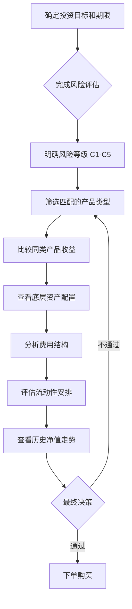
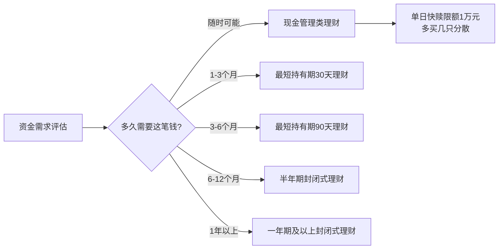
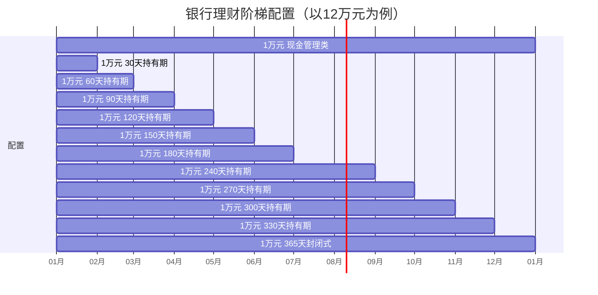
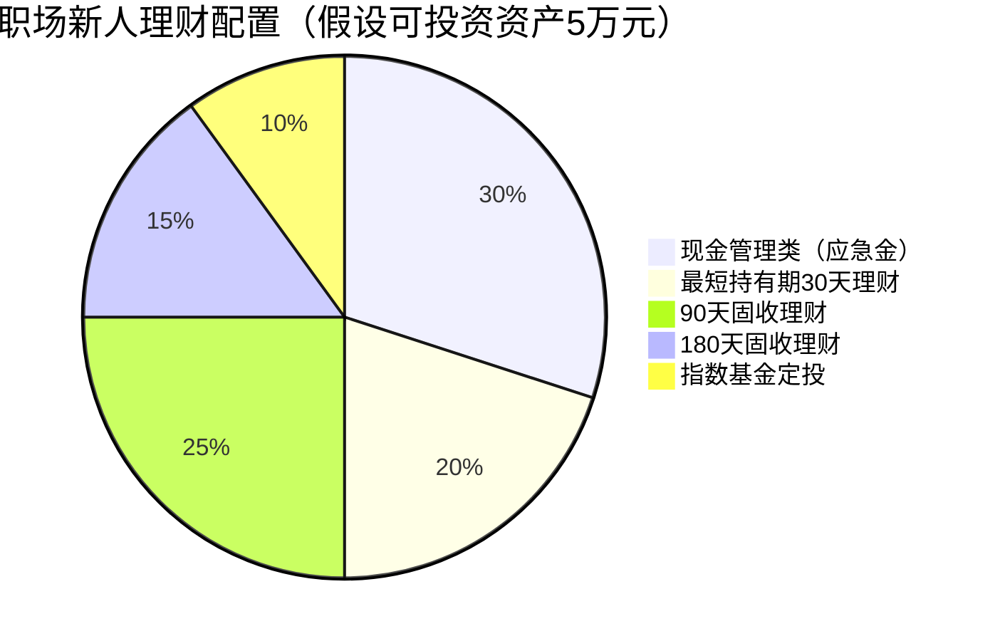
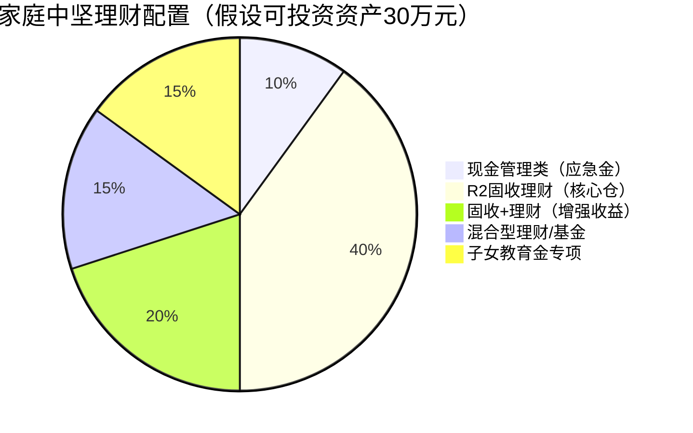
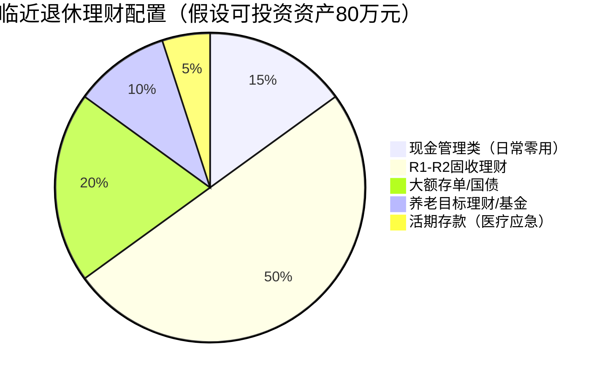

## 十二、银行理财工具

银行理财是中国居民最熟悉的理财方式之一，也是中国资产管理行业中规模最大的细分领域。截至2025年末，银行理财市场存续规模约30万亿元，投资者数量突破1.2亿。然而，2022年资管新规全面落地后，银行理财已经彻底告别"保本保息"时代，进入净值化管理的新纪元。这意味着投资者必须真正理解产品机制、学会自主判断风险，才能在银行理财中获得稳健回报。

本节从产品分类与风险评估、选择方法与决策流程、费用结构与税务处理、实操策略与组合构建、常见误区与纠正方法、工具资源与未来趋势六大维度，系统讲解银行理财的完整知识体系。

### 12.1 银行理财产品的分类体系

#### 按产品形态分类

| 类型 | 特点 | 起投金额 | 流动性 | 收益特征 | 适合场景 |
|------|------|----------|--------|----------|----------|
| 封闭式理财 | 固定封闭期，到期自动赎回，期间无法赎回 | 1万元 | 差 | 相对较高，封闭溢价约0.3%-0.5% | 确定不用的资金 |
| 定期开放式理财 | 按固定周期开放申购赎回（如每月/每季） | 1万元 | 中 | 中等 | 有计划的中期资金 |
| 现金管理类理财 | 类似货币基金，T+0/T+1赎回，单日限额1万元快赎 | 0.01元 | 极好 | 较低，年化1.5%-2.5% | 应急资金、日常零用 |
| 最短持有期理财 | 买入后需持有最短天数（如30天/60天/90天），之后随时赎回 | 1万元 | 中高 | 中等偏高 | 灵活中期资金 |
| 净值型理财 | 按净值申购赎回，无预期收益，净值可涨可跌 | 1万元 | 视产品而定 | 浮动 | 能接受波动的投资者 |

> **关键变化**：资管新规后，"最短持有期"产品成为主流形态，它兼顾了封闭期带来的收益溢价和持有到期后的灵活赎回，是目前银行理财子公司的主力产品类型。

#### 按投资方向分类

```text
银行理财产品
├── 固定收益类（R1-R2）——占比约80%
│   ├── 纯债型：100%投资债券，追求稳健收益
│   │   ├── 利率债为主：国债、政策性金融债，风险最低
│   │   ├── 信用债为主：企业债、公司债，收益略高
│   │   └── 短久期策略：控制利率风险，波动更小
│   ├── 存款增强型：以存款+短债为主，类现金管理
│   │   └── 底层：银行存款（30%-50%）+ 短融债（30%-50%）+ 同业存单
│   └── "固收+"型：以债券打底，小仓位参与权益或另类资产
│       ├── +股票：配置5%-20%权益仓位
│       ├── +可转债：可转债兼具债性和股性
│       └── +打新/定增：参与新股申购增厚收益
│
├── 混合类（R3）——占比约15%
│   ├── 偏债混合：债券60%-80%，股票20%-40%
│   ├── 平衡混合：债券和股票各占40%-60%
│   └── 偏股混合：股票60%-80%，债券20%-40%
│
├── 权益类（R4-R5）——占比约3%
│   ├── 主动管理型：基金经理自主选股
│   ├── 指数跟踪型：跟踪沪深300、中证500等指数
│   └── 量化策略型：用量化模型选股
│
└── 结构性存款（R1-R2）——占比约2%
    ├── 利率挂钩型：收益与SHIBOR/LPR利率走势挂钩
    │   └── 例：观察期内利率维持在1.5%-3%，则获得高挡收益
    ├── 汇率挂钩型：收益与人民币汇率走势挂钩
    │   └── 例：USD/CNY在7.0-7.3区间内，获得高挡收益
    └── 商品挂钩型：收益与黄金、原油等商品价格挂钩
        └── 例：黄金在2000-2200美元区间内，获得高挡收益
```

> **注意**：结构性存款名义上是"存款"，实际收益是浮动的。它将本金存入银行（保本部分），用利息投资金融衍生品（浮动收益部分）。因此结构性存款保本但不保收益，且中间档收益才是大概率事件，不要被最高收益宣传误导。

#### 风险等级详解（R1-R5五级分类）

银行理财产品的风险等级由产品管理人根据产品投资范围、资产配置比例、流动性安排等因素评定，投资者在首次购买前必须完成银行的风险承受能力评估（C1-C5五级），两者必须匹配。

| 风险等级 | 名称 | 投资范围限制 | 本金风险 | 收益区间 | 适合投资者 |
|----------|------|------------|----------|----------|-----------|
| R1 | 谨慎型 | 国债、央票、政策性金融债、银行存款、货币市场工具 | 极低，接近保本 | 2%-3% | C1保守型及以上 |
| R2 | 稳健型 | R1范围+信用债（AA+以上）、高等级同业存单 | 低，极少亏损 | 3%-4.5% | C2稳健型及以上 |
| R3 | 平衡型 | R2范围+信用债（AA以上）、非标资产、少量权益 | 中等，可能小幅亏损 | 4%-6% | C3平衡型及以上 |
| R4 | 进取型 | R3范围+股票（比例较高）、商品、衍生品 | 较高，可能亏损10%-20% | 6%-10% | C4进取型及以上 |
| R5 | 激进型 | 无明确限制，可大量投资高风险资产 | 高，可能亏损20%以上 | 10%+ | C5激进型 |

**风险等级的实际含义**：R2级产品历史上年化亏损概率约1%-3%，R3级约5%-15%，R4级约20%-40%。R1级虽然极少亏损，但在极端市场（如2022年底债市调整）也曾出现短暂净值回撤。

#### 银行理财子公司：现在的主角

2019年起，各大银行陆续将理财业务剥离至独立的理财子公司。截至2025年，全国已有32家银行理财子公司开业，管理规模占银行理财总规模的85%以上。

| 子公司 | 母行 | 管理规模（约） | 特色优势 |
|--------|------|---------------|----------|
| 招银理财 | 招商银行 | 2.5万亿 | 固收投资能力强，"招睿"系列口碑好 |
| 兴银理财 | 兴业银行 | 2.2万亿 | "天天利"现金管理类产品规模大 |
| 信银理财 | 中信银行 | 1.8万亿 | 权益类产品布局较早 |
| 建信理财 | 建设银行 | 1.6万亿 | 国有大行背景，信用债配置稳健 |
| 工银理财 | 工商银行 | 1.5万亿 | 规模最大的国有行理财子公司 |
| 农银理财 | 农业银行 | 1.4万亿 | 产品线全面，网点覆盖广 |
| 中银理财 | 中国银行 | 1.3万亿 | 外币理财产品有优势 |
| 光大理财 | 光大银行 | 1.2万亿 | "阳光碧"系列现金管理产品活跃 |
| 交银理财 | 交通银行 | 1.0万亿 | 养老理财产品试点较早 |
| 平银理财 | 平安银行 | 0.9万亿 | 科技赋能，App体验好 |

> **购买建议**：不同理财子公司产品收益差异可达0.5%-1%，不要只看母行品牌。招银理财、兴银理财等股份行理财子公司的产品收益率普遍高于国有大行理财子公司，信用风险管理能力也不逊色。

### 12.2 银行理财选择的系统方法

#### 决策流程图



#### 第一步：风险承受能力自测

银行开户时必须完成的风险评估问卷通常包含以下维度。提前了解这些维度，可以避免临场"拍脑袋"导致评估结果失真：

```python
def assess_risk_tolerance(age, income_stability, investment_experience,
                          loss_tolerance, investment_horizon):
    """
    综合评估风险承受能力，返回适合的风险等级

    评分逻辑：各维度满分5分，总分25分
    - 13分以下：R1-R2
    - 13-17分：R2-R3
    - 17-21分：R3-R4
    - 21分以上：R4-R5
    """
    score = 0

    # 年龄因素（生命周期理论：越年轻风险承受能力越强）
    # 逻辑：(60-年龄)/10，最低1分，最高5分
    age_score = max(1, min(5, (60 - age) / 10))
    score += age_score

    # 收入稳定性
    income_scores = {
        "失业/无固定收入": 1,
        "自由职业/收入波动大": 2,
        "较稳定（有基本保障）": 3,
        "稳定（体制内/大型企业）": 4,
        "非常稳定且持续增长": 5
    }
    score += income_scores.get(income_stability, 3)

    # 投资经验（认知风险的能力）
    exp_scores = {
        "纯新手，从未投资过": 1,
        "买过货币基金/存款": 2,
        "有基金/股票投资经验1-3年": 3,
        "经验3-5年，理解风险收益关系": 4,
        "5年以上，穿越过完整牛熊周期": 5
    }
    score += exp_scores.get(investment_experience, 2)

    # 亏损承受度（心理承受能力）
    loss_scores = {
        "不能接受任何亏损": 1,
        "可接受亏损5%以内": 2,
        "可接受亏损5%-15%": 3,
        "可接受亏损15%-30%": 4,
        "可接受亏损30%以上": 5
    }
    score += loss_scores.get(loss_tolerance, 2)

    # 投资期限（时间越长，承受波动的能力越强）
    horizon_scores = {
        "随时可能用": 1,
        "6个月以内": 2,
        "6个月-2年": 3,
        "2-5年": 4,
        "5年以上": 5
    }
    score += horizon_scores.get(investment_horizon, 2)

    # 映射到风险等级
    if score <= 10:
        return {"等级": "R1-谨慎型", "总分": score, "建议": "以存款类和国债类产品为主"}
    elif score <= 13:
        return {"等级": "R2-稳健型", "总分": score, "建议": "以高等级债券类产品为主"}
    elif score <= 17:
        return {"等级": "R3-平衡型", "总分": score, "建议": "可配置债券+少量权益"}
    elif score <= 21:
        return {"等级": "R4-进取型", "总分": score, "建议": "可大幅配置权益类产品"}
    else:
        return {"等级": "R5-激进型", "总分": score, "建议": "可接受高波动追求高收益"}

# 示例：28岁、稳定收入、3年投资经验、可接受15%亏损、投资3年
result = assess_risk_tolerance(28, "稳定（体制内/大型企业）",
                               "有基金/股票投资经验1-3年",
                               "可接受亏损5%-15%",
                               "2-5年")
print(result)
# 输出：{'等级': 'R3-平衡型', '总分': 17, '建议': '可配置债券+少量权益'}
```

> **重要提示**：风险评估结果有效期为一年。如果你的财务状况发生重大变化（如失业、大额支出、收入大幅增加），应主动要求重新评估。刻意选择与自身情况不符的风险等级来购买高收益产品，最终承受损失的还是自己。

#### 第二步：历史业绩深度分析

查看历史业绩时，不能只看"近一年收益率"这个表面数字，需要从多个维度交叉验证：

| 分析维度 | 关注指标 | 判断标准 | 数据来源 |
|----------|----------|----------|----------|
| 收益水平 | 近3个月/6个月/1年/成立以来年化收益 | 同类产品排名前30%为优秀 | 各银行App、中国理财网 |
| 收益稳定性 | 月度收益标准差 | 越小越好，R2级产品标准差<1%为佳 | 产品净值历史数据 |
| 最大回撤 | 成立以来最大净值回撤 | R2级<2%，R3级<5%为佳 | 产品净值历史数据 |
| 夏普比率 | 风险调整后收益 | >1为较好，>2为优秀 | 需自行计算或查看第三方评价 |
| 胜率 | 正收益月占比 | R2级>95%，R3级>80%为佳 | 产品净值历史数据 |
| 回撤修复时间 | 从最大回撤恢复到前高的天数 | 越短越好 | 产品净值历史数据 |

```python
import numpy as np

def analyze_performance(nav_series):
    """
    分析银行理财产品的历史净值数据

    参数：nav_series - 月度净值序列（列表或数组）
    返回：关键绩效指标字典
    """
    # 计算月度收益率
    returns = np.diff(nav_series) / nav_series[:-1]

    # 年化收益
    total_return = nav_series[-1] / nav_series[0] - 1
    years = len(returns) / 12
    annual_return = (1 + total_return) ** (1 / years) - 1

    # 收益稳定性（月度标准差，年化）
    monthly_std = np.std(returns)
    annual_std = monthly_std * np.sqrt(12)

    # 最大回撤
    cumulative = np.cumprod(1 + returns)
    running_max = np.maximum.accumulate(cumulative)
    drawdowns = (cumulative - running_max) / running_max
    max_drawdown = np.min(drawdowns)

    # 夏普比率（假设无风险利率2%）
    sharpe = (annual_return - 0.02) / annual_std if annual_std > 0 else 0

    # 胜率
    win_rate = np.sum(returns > 0) / len(returns)

    # 回撤修复时间（简化计算：最大回撤后多久回到前高）
    peak_idx = np.argmax(cumulative[:np.argmin(drawdowns)])
    recovery_idx = None
    peak_value = cumulative[peak_idx]
    for i in range(np.argmin(drawdowns), len(cumulative)):
        if cumulative[i] >= peak_value:
            recovery_idx = i
            break
    recovery_months = (recovery_idx - peak_idx) if recovery_idx else None

    return {
        "年化收益": f"{annual_return*100:.2f}%",
        "年化波动率": f"{annual_std*100:.2f}%",
        "最大回撤": f"{max_drawdown*100:.2f}%",
        "夏普比率": f"{sharpe:.2f}",
        "月度胜率": f"{win_rate*100:.1f}%",
        "回撤修复月数": f"{recovery_months}个月" if recovery_months else "未修复"
    }
```

> **反面教训**：2022年11-12月的"理财赎回潮"中，大量R2级银行理财产品出现1%-3%的净值回撤，部分产品最大回撤达到5%。这提醒投资者：即使是"稳健型"产品，短期也可能亏损。如果你在回撤时恐慌赎回，就会把浮亏变成实亏。持有到2023年中，大部分产品都修复了回撤。

#### 第三步：费用结构全解析

银行理财产品的费用不像基金那样透明，很多投资者从未仔细看过产品说明书中的费用条款。以下是完整的费用结构：

| 费用类型 | 收取方式 | 常见范围 | 对收益的影响 |
|----------|----------|----------|------------|
| 管理费 | 每日从净值中扣除 | 0.15%-0.50%/年 | 持有10万元，每年扣150-500元 |
| 托管费 | 每日从净值中扣除 | 0.02%-0.05%/年 | 持有10万元，每年扣20-50元 |
| 销售服务费 | 每日从净值中扣除 | 0-0.30%/年 | 部分产品收取，进一步侵蚀收益 |
| 认购/申购费 | 买入时一次性扣除 | 0（大部分产品免收） | 少数产品收取0.5%-1% |
| 赎回费 | 赎回时一次性扣除 | 0-0.5% | 持有期限越短费率越高 |
| 超额业绩报酬 | 净值超过基准时提取 | 超额部分的20%-30% | 部分高收益产品收取 |
| 浮动管理费 | 与业绩挂钩 | 0-0.2%/年 | 少数产品收取 |

**实际收益计算**：

```python
def calculate_net_return(gross_return, management_fee, custody_fee,
                         sales_fee, holding_years, excess_fee_rate=0,
                         excess_threshold=0):
    """
    计算扣除全部费用后的实际收益

    参数：
        gross_return - 产品毛收益（年化，小数形式）
        management_fee - 管理费率（年化）
        custody_fee - 托管费率（年化）
        sales_fee - 销售服务费率（年化）
        holding_years - 持有年数
        excess_fee_rate - 超额业绩报酬比例（对超过基准的部分收取）
        excess_threshold - 业绩比较基准（年化）
    """
    # 固定费用合计
    fixed_fee = management_fee + custody_fee + sales_fee

    # 扣除固定费用后的收益
    after_fixed = gross_return - fixed_fee

    # 超额业绩报酬
    excess_bonus = 0
    if excess_fee_rate > 0 and after_fixed > excess_threshold:
        excess = after_fixed - excess_threshold
        excess_bonus = excess * excess_fee_rate

    # 最终净收益
    net_annual = after_fixed - excess_bonus
    net_total = (1 + net_annual) ** holding_years - 1
    gross_total = (1 + gross_return) ** holding_years - 1
    fee_impact = gross_total - net_total

    return {
        "毛收益（年化）": f"{gross_return*100:.2f}%",
        "固定费用合计": f"{fixed_fee*100:.2f}%",
        "超额报酬": f"{excess_bonus*100:.2f}%",
        "净收益（年化）": f"{net_annual*100:.2f}%",
        f"{holding_years}年毛总收益": f"{gross_total*100:.2f}%",
        f"{holding_years}年净总收益": f"{net_total*100:.2f}%",
        f"{holding_years}年费用侵蚀": f"{fee_impact*100:.2f}%"
    }

# 示例1：普通固收产品，年化4.2%，管理费0.25%，托管费0.03%，销售费0.10%
r1 = calculate_net_return(0.042, 0.0025, 0.0003, 0.001, 1)
print("普通固收：", r1)
# 净收益（年化）：3.82%

# 示例2：带超额报酬的产品，年化6%，基准3.5%，超额提成20%
r2 = calculate_net_return(0.06, 0.003, 0.0003, 0.0015, 3,
                          excess_fee_rate=0.20, excess_threshold=0.035)
print("超额报酬产品：", r2)
# 3年毛总收益：19.10%，净总收益：17.26%，费用侵蚀：1.84%
```

> **省钱技巧**：同一产品在不同渠道（银行柜台、手机银行、理财子公司直销）的费率可能不同。手机银行通常费率最低，部分产品还会推出费率优惠活动。购买前比较同一产品在不同渠道的费率。

#### 第四步：流动性评估

流动性决定了你在急需用钱时能多快拿到资金。不同产品的流动性差异巨大：

| 赎回方式 | 到账时间 | 单日限额 | 适合场景 | 代表产品 |
|----------|----------|----------|----------|----------|
| T+0实时到账 | 秒级 | 单产品1万元（监管上限） | 应急资金、日常消费 | 现金管理类理财 |
| T+1到账 | 1个工作日 | 一般无限制 | 短期闲置资金 | 短债理财、货币基金 |
| 定期开放赎回 | 开放日当天或次日 | 视产品而定 | 有计划的中期资金 | 定开型理财 |
| 最短持有期后赎回 | 持有期后随时赎回，T+1到账 | 一般无限制 | 中期理财 | 最短持有期理财 |
| 到期赎回 | 到期后1-3个工作日 | 到期全额 | 确定期限的资金 | 封闭式理财 |

**流动性陷阱**：部分产品虽然标注"开放式"，但实际赎回有额度限制。比如某产品总规模100亿，单日赎回上限可能只有规模的10%（10亿）。如果遇到市场恐慌，大量投资者同时赎回，可能出现"赎回受限"甚至"延期兑付"的情况。2022年底就发生过类似事件。



#### 第五步：底层资产穿透分析

底层资产决定了产品的真正风险水平。银行理财产品说明书的"投资范围"条款通常写得非常宽泛（如"投资于债券、存款、非标资产等"），真正需要关注的是"投资比例限制"和实际持仓报告：

| 资产类型 | 风险特征 | 收益水平 | 透明度 | 需要关注的点 |
|----------|----------|----------|--------|------------|
| 国债/政策性金融债 | 极低风险，信用风险几乎为零 | 2%-3% | 高 | 主要是利率风险，久期越长波动越大 |
| 同业存单 | 低风险，银行信用 | 2%-3% | 高 | 流动性好，是现金管理类产品主要配置 |
| 高等级信用债（AAA/AA+） | 低风险 | 3%-4% | 中高 | 关注发债主体信用资质 |
| 中低等级信用债（AA及以下） | 中等风险 | 4%-6% | 中 | 需要关注违约风险，2020年以来信用债违约增多 |
| 非标资产 | 中高风险 | 5%-8% | 低 | 流动性差、估值不透明，资管新规后比例受限（不超过35%） |
| 股票/可转债 | 高风险 | 浮动大 | 高 | 权益仓位占比直接决定波动程度 |

**怎么看产品持仓**：银行理财产品按季度披露季度报告（部分产品按月披露），在报告的投资组合部分可以看到实际的资产配置比例。重点关注：信用债占比、非标资产占比、权益资产占比——这三个数字直接决定了产品的风险水平。

#### 第六步：发行机构选择

不同银行的理财子公司在投研能力、风控水平、产品丰富度上存在显著差异：

| 银行类型 | 收益水平 | 产品丰富度 | 风控水平 | 服务体验 | 适合人群 |
|----------|---------|-----------|---------|---------|---------|
| 国有大行理财子 | 中低（3%-4.5%） | 全面 | 最严格 | 网点多但App体验一般 | 极度保守的投资者 |
| 股份行理财子 | 中高（3.5%-5.5%） | 丰富，创新多 | 严格 | App体验好 | 大多数投资者的优选 |
| 城商行理财子 | 高（4%-6%） | 较丰富 | 参差不齐 | 本地网点多 | 当地居民，需注意风控 |
| 互联网银行理财 | 中高（3.5%-5%） | 以固收为主 | 中等 | 极致便捷 | 追求便利的年轻投资者 |

> **选购原则**：不要盲目追求高收益。城商行理财产品收益高，往往是因为底层资产配置了更多信用下沉的债券或非标资产，风险补偿是对应的。建议80%的资金配置在股份行或国有行理财子公司，20%可以尝试城商行产品以提高收益。

### 12.3 银行理财 vs 其他理财产品深度对比

#### 多维度对比表

| 维度 | 银行理财 | 货币基金 | 债券基金 | 股票基金 | 信托 | 银行存款 |
|------|----------|----------|----------|----------|------|----------|
| 起投金额 | 1万元（现金管理类0.01元） | 0.01元 | 10元 | 10元 | 30万-100万 | 50元（活期）/ 1万（大额存单） |
| 预期年化收益 | 2.5%-6% | 1.5%-2.5% | 3%-6% | -10%-20% | 5%-8% | 1%-2.8% |
| 风险等级 | R1-R5 | R1 | R2-R3 | R4-R5 | R3-R4 | 无风险（50万内） |
| 流动性 | 中 | 高 | 高 | 高 | 极低 | 活期极高/定期低 |
| 透明度 | 中低 | 高 | 高 | 高 | 低 | 极高 |
| 费用水平 | 低（隐含） | 极低 | 中（1%-1.5%/年） | 高（1.5%-2%/年） | 高（1%-2%） | 无 |
| 税收 | 免税 | 免税 | 分红免税 | 分红免税 | 应税 | 利息税20%（暂免） |
| 存款保险 | 无 | 无 | 无 | 无 | 无 | 50万以内保障 |
| 监管机构 | 金融监管总局 | 证监会 | 证监会 | 证监会 | 金融监管总局 | 金融监管总局 |

#### 不同资金用途的选择矩阵

| 资金用途 | 首选 | 备选 | 不推荐 | 核心逻辑 |
|----------|------|------|--------|----------|
| 应急备用金（3-6个月支出） | 现金管理类理财/货币基金 | 银行活期存款 | 任何封闭期产品 | 流动性第一 |
| 短期目标（3-12个月） | 最短持有期理财 | 短债基金 | 股票基金 | 确定性收益 |
| 中期目标（1-3年） | 固收类银行理财/债券基金 | "固收+"理财 | 纯权益产品 | 收益与安全平衡 |
| 长期目标（3年以上） | 混合型理财+指数基金 | 养老目标基金 | 纯存款/现金管理类 | 时间平滑风险 |
| 养老储备 | 养老目标基金/年金险 | 养老理财（试点） | 高波动产品 | 长期锁定、纪律投资 |
| 子女教育金 | 教育年金+固收理财 | 定投指数基金 | 高风险产品 | 安全性+确定性 |

### 12.4 银行理财的税务与隐性成本

#### 税收政策

银行理财产品的税收处理比很多人想象的复杂：

| 收益类型 | 税种 | 税率 | 说明 |
|----------|------|------|------|
| 银行理财收益 | 个人所得税 | 目前暂免征收 | 政策可能调整，需关注 |
| 结构性存款收益 | 个人所得税 | 存款部分免税，收益部分暂免 | 与普通存款类似 |
| 理财分红 | 个人所得税 | 暂免 | 与基金分红政策一致 |
| 理财转让（二级市场） | 个人所得税 | 应税，但实操中较少征管 | 政策灰色地带 |

> **实操要点**：虽然目前银行理财收益暂免个税，但这是一个可能被调整的政策。在银行理财收益持续走低的背景下，未来恢复征税并非不可能。进行投资决策时，建议预留10%-20%的税收缓冲。

#### 容易被忽略的隐性成本

除了明面上的管理费、托管费，还有几个隐性成本值得注意：

1. **资金站岗成本**：产品到期到新产品起息之间的"空档期"，资金通常只享受活期利率（约0.2%）。如果空档期有3天，持有10万元损失约2.5元。一年滚动12次，损失约30元。金额不大，但可以通过提前预约续接产品来避免。

2. **机会成本**：封闭期内如果市场出现更好的投资机会，你的资金被锁定无法调整。这就是为什么不能把所有资金都放入封闭式产品。

3. **通胀侵蚀**：如果理财年化收益3.5%，而实际通胀率约4%（CPI可能低估），你的购买力实际上在缩水。这就是为什么纯粹依赖银行理财无法实现财富增值，只能保值。

4. **预期收益与实际收益的差距**：业绩比较基准不等于承诺收益。以某R2产品为例，业绩比较基准3.8%，但实际到手可能只有3.2%-3.5%，差距来自市场波动和费用扣除。

### 12.5 实操策略：从入门到精通

#### 策略一：阶梯式配置法（入门）

将资金按期限分散配置，每个月都有一笔资金到期，兼顾收益和流动性：



**操作方法**：
1. 将总资金分为12份
2. 1份放入现金管理类（应急）
3. 其余11份分别配置30天到365天的不同持有期产品
4. 每份到期后，续接一年期产品（收益最高）
5. 12个月后，每月都有一笔一年期产品到期，流动性与收益兼得

**预期效果**：综合年化收益约3.5%-4.5%，比全部买活期高1%-2%，比全部买封闭式灵活得多。

#### 策略二：核心-卫星配置法（进阶）

将资金分为"核心仓"（稳定收益）和"卫星仓"（增强收益）：

| 仓位 | 占比 | 产品类型 | 目标 | 风险等级 |
|------|------|----------|------|----------|
| 核心仓 | 60%-70% | R2固收类理财 | 提供稳定基础收益 | 低 |
| 卫星仓-1 | 15%-20% | "固收+"理财或债券基金 | 增强收益 | 中低 |
| 卫星仓-2 | 10%-15% | 混合型理财或指数基金 | 追求超额收益 | 中 |
| 机动仓 | 5%-10% | 现金管理类理财 | 灵活应对突发需求 | 极低 |

**核心仓选择标准**：
- 理财子公司管理规模>5000亿（投研实力保障）
- 产品存续规模>10亿（避免流动性风险）
- 成立时间>1年（有历史业绩可查）
- 最大回撤<1.5%（R2级别正常水平）
- 年化收益跑赢同类中位数

**卫星仓选择标准**：
- 核心仓选好后再配置
- 单只产品占比不超过总资金的10%
- 设定止损线（如亏损5%时评估是否继续持有）
- 定期再平衡（每季度检视一次）

#### 策略三：利率周期配置法（高级）

银行理财产品收益率与市场利率正相关。在利率下行周期中，应尽早锁定长期限、高收益产品；在利率上行周期中，应选择短期限产品以便到期后享受更高收益：

```python
def rate_cycle_strategy(current_rate, rate_trend, current_holdings):
    """
    根据利率环境给出配置建议

    参数：
        current_rate: 当前10年期国债收益率（如0.025表示2.5%）
        rate_trend: "下行"/"上行"/"震荡"
        current_holdings: 当前持仓列表 [{产品, 到期日, 收益率}, ...]
    """
    advice = []

    if rate_trend == "下行":
        advice.append("利率下行期：提前锁定长期限高收益产品")
        advice.append("策略：将到期资金配置1年以上封闭式产品")
        advice.append("关注：长久期债券类产品（利率下行时债券价格上涨）")
        advice.append("避免：过短持有期（到期后可能找不到同等收益产品）")

    elif rate_trend == "上行":
        advice.append("利率上行期：保持短久期，等待更高收益")
        advice.append("策略：配置30-90天短期产品，灵活滚动")
        advice.append("关注：浮动利率产品、短债产品")
        advice.append("避免：长期封闭式（锁定了当前较低利率）")

    else:  # 震荡
        advice.append("利率震荡期：均衡配置，保持灵活性")
        advice.append("策略：阶梯式配置，长短期搭配")
        advice.append("关注：结构性存款（可能提供超额收益）")
        advice.append("避免：极端集中于某一期限")

    # 判断利率水平
    if current_rate < 0.025:
        advice.append(f"当前利率水平偏低（{current_rate*100:.1f}%），"
                      "银行理财收益可能继续走低，建议锁定较高收益产品")
    elif current_rate > 0.035:
        advice.append(f"当前利率水平偏高（{current_rate*100:.1f}%），"
                      "是配置中长期产品的好时机")

    return advice

# 示例：利率下行期，当前利率2.3%
for tip in rate_cycle_strategy(0.023, "下行", []):
    print(f"  → {tip}")
```

#### 理财到期续接策略

产品到期后的"无缝衔接"直接影响全年收益：

```text
T-7（到期前1周）：
├── 查看即将到期产品净值和实际收益
├── 在银行App筛选在售产品（关注起息日）
├── 比较2-3个候选产品的收益率和风险等级
└── 选定续接产品，部分银行支持"自动续接"

T-1（到期前1天）：
├── 确认续接产品的最低持有金额
├── 确认是否需要重新签署风险揭示书
└── 如有闲置零头，转入现金管理类

T+0（到期当日）：
├── 确认资金到账
├── 立即购买续接产品
└── 确认购买成功、起息日和到期日

T+1（到期后1天）：
├── 确认新产品的净值已开始计算
└── 更新个人理财记录表
```

> **续接损失计算**：假设10万元年化4%的产品到期后空档3天，空档期间只享受活期0.2%，则损失 = 100000 × (4% - 0.2%) / 365 × 3 = 31.2元。看起来不多，但如果每次到期都空档3天，一年滚动4次就损失约125元。养成提前预约的习惯可以完全避免。

### 12.6 银行理财常见误区与纠正

#### 八大误区深度解析

**误区1："银行理财保本"**

资管新规过渡期于2021年底正式结束。2022年1月1日起，所有银行理财产品均为净值型，不再有保本保息的承诺。即使R1级产品，理论上也可能亏损（只是概率极低）。

真相：唯一保本的银行产品是**存款**（50万以内受存款保险保障）和**国债**。如果你不能接受任何本金损失，请选择存款或国债，而不是银行理财。

**误区2："业绩比较基准就是预期收益"**

业绩比较基准是管理人设定的一个参考目标，不构成收益承诺。产品实际收益可能高于或低于这个数字。

真相：2023年以来，大量R2级产品的实际收益低于业绩比较基准0.2%-0.5%。原因是债券市场收益率持续走低，产品配置的债券利息收入不及预期。

**误区3："大银行的产品更安全"**

产品安全性取决于底层资产和投资策略，而非发行银行的规模。大银行的R3产品和小银行的R3产品，面临的风险类型是一样的。

真相：2022年理财赎回潮中，大银行理财子公司的产品同样出现了净值回撤。安全性的决定因素是风险等级和底层资产，不是品牌。

**误区4："短期理财更灵活更好"**

频繁购买短期产品会导致大量资金站岗（空档期），实际年化收益被拉低。而且短期产品的收益率通常低于中长期产品。

真相：如果你6个月不需要用钱，买一个90天持有期的产品滚动两次，不如直接买一个180天封闭式产品。后者收益更高，且没有空档期损失。

**误区5："净值低于1就是亏了"**

产品初始净值通常设为1，但净值可能因为分红、拆分等原因调整。净值低于1不代表产品亏损——需要看"累计净值"或"复权净值"。

真相：关注"成立以来年化收益率"和"累计净值"，而非单一时间点的净值数字。

**误区6："银行推荐的产品就是好产品"**

银行客户经理有销售任务和考核指标，推荐的产品可能不是最适合你的，而是当期主推的或佣金较高的。

真相：不要只听银行推荐，自己用前面的六步法独立筛选。如果时间有限，至少比较3家以上银行的同类产品。

**误区7："理财产品只能在发行银行买"**

代销渠道已经非常普遍。一家银行的手机App可能代销多家理财子公司的产品。通过比较不同银行App上的产品，可以找到收益更高的选择。

真相：招商银行App代销了多家理财子公司的产品，选择面比只看本行产品宽得多。养成跨行比较的习惯。

**误区8："净值型理财和基金是一回事"**

虽然都是净值化管理，但银行理财在投资范围、信息披露频率、流动性安排、费率结构等方面与公募基金有显著区别。

真相：银行理财投资非标资产的比例可以到35%（基金不能投非标），净值波动通常更小；但信息披露不如基金透明（基金每日披露净值，理财可能每周或每月）。

### 12.7 银行理财趋势与展望

#### 资管新规后的根本性变化

资管新规（2018年发布，2021年底过渡期结束）是中国资产管理行业最重要的制度变革，对银行理财的影响是颠覆性的：

| 维度 | 资管新规前 | 资管新规后 |
|------|----------|----------|
| 产品形式 | 预期收益型产品为主 | 全面净值化 |
| 本金保障 | 刚性兑付（银行兜底） | 买者自负、卖者尽责 |
| 收益形式 | 固定预期收益率 | 净值波动，收益浮动 |
| 投资范围 | 以非标资产为主（可到70%+） | 非标比例受限（≤35%），以标准化资产为主 |
| 期限管理 | 期限错配严重（短期资金投长期资产） | 要求期限匹配或合理错配 |
| 信息披露 | 不透明，投资者不知道底层投了什么 | 定期披露净值、季报、持仓信息 |
| 嵌套层数 | 多层嵌套，资金投向难以穿透 | 禁止多层嵌套，要求穿透管理 |
| 杠杆比例 | 无明确限制 | 总资产/净资产≤140% |
| 分级产品 | 可以发行分级产品 | 禁止份额分级 |
| 独立运作 | 资金池运作，产品间相互调节收益 | 每只产品独立建账、独立核算 |

#### 未来五年的发展趋势

**趋势一：产品精细化分层**

随着竞争加剧，银行理财产品将从"大而全"转向"小而精"。投资者将看到更多针对特定场景的产品：教育金理财、购房储备金理财、退休过渡期理财等。产品设计将更加贴近投资者的实际生命周期需求。

**趋势二：养老理财成为增长极**

2021年起，养老理财产品在10个城市试点，试点规模已超1000亿元。养老理财的特点是：期限长（5年以上）、费率低（管理费通常0.1%以下）、收益稳健、设有平滑基金机制（用历史超额收益弥补未来可能的亏损）。随着中国老龄化加速，养老理财有望成为银行理财规模增长的主要驱动力。

**趋势三：智能化投顾与个性化配置**

银行App正在从"产品货架"升级为"智能投顾平台"。通过分析投资者的收入、支出、风险偏好和投资目标，AI将自动生成个性化的理财组合方案。部分银行（如招商银行的"摩羯智投"、工商银行的"AI投"）已经推出了相关功能，但目前仍处于早期阶段。

**趋势四：费率持续下行**

随着理财子公司之间的竞争加剧，以及投资者费率敏感度的提高，银行理财产品的综合费率将从目前的0.3%-0.5%持续下降至0.15%-0.3%。对投资者而言，每下降0.1%的费率就等于多了0.1%的收益。

**趋势五：ESG与绿色理财**

ESG（环境、社会和治理）主题理财产品正在快速增长。部分产品承诺将一定比例的资金投向绿色债券、碳中和债券等绿色资产。对于关注社会责任投资的投资者，这是一个值得关注的方向。

### 12.8 实用工具与资源

#### 产品查询与比较平台

| 工具/平台 | 功能 | 费用 | 使用场景 |
|-----------|------|------|----------|
| 中国理财网 | 银行理财产品登记信息查询，验证产品真伪 | 免费 | 购买前核实产品是否合法备案 |
| 各银行手机银行App | 产品浏览、购买、净值查询、到期提醒 | 免费 | 日常购买和管理的主要渠道 |
| 普益标准 | 理财产品评价、行业数据、排名 | 部分免费 | 产品比较和筛选 |
| 天天基金/蚂蚁财富 | 比较银行理财与基金产品 | 免费 | 跨品类产品比较 |
| 东方财富Choice | 专业理财产品数据终端 | 付费 | 深度研究和数据分析 |
| 理财子公司官网 | 产品说明书、季度报告、净值公告 | 免费 | 查阅产品详细信息和历史报告 |

#### 必看的产品文件清单

购买任何银行理财产品前，至少要看以下三份文件：

1. **产品说明书**：了解投资范围、风险等级、费用结构、流动性安排
2. **风险揭示书**：了解可能面临的所有风险类型
3. **投资者权益须知**：了解你的权利和投诉渠道

购买后定期查看：
- **季度报告/月度报告**：了解产品实际持仓和收益情况
- **净值公告**：跟踪产品净值变化

#### 理财记录管理模板

建议用一个简单的表格记录你所有理财产品的情况，定期更新：

```python
class PortfolioTracker:
    """
    个人银行理财产品追踪器
    """
    def __init__(self):
        self.holdings = []

    def add_holding(self, product_name, bank, risk_level, amount,
                    annual_rate, purchase_date, maturity_date, product_type):
        """添加一笔持仓"""
        self.holdings.append({
            "产品名称": product_name,
            "发行机构": bank,
            "风险等级": risk_level,
            "金额": amount,
            "业绩比较基准": annual_rate,
            "购买日期": purchase_date,
            "到期日期": maturity_date,
            "产品类型": product_type
        })

    def summary(self):
        """生成持仓摘要"""
        total = sum(h["金额"] for h in self.holdings)
        by_risk = {}
        by_type = {}
        by_bank = {}

        for h in self.holdings:
            # 按风险等级汇总
            by_risk.setdefault(h["风险等级"], 0)
            by_risk[h["风险等级"]] += h["金额"]
            # 按产品类型汇总
            by_type.setdefault(h["产品类型"], 0)
            by_type[h["产品类型"]] += h["金额"]
            # 按银行汇总
            by_bank.setdefault(h["发行机构"], 0)
            by_bank[h["银行"] if "银行" in h else h["发行机构"]] += h["金额"]

        print(f"总持仓金额：{total:,.0f}元")
        print(f"\n按风险等级分布：")
        for k, v in sorted(by_risk.items()):
            print(f"  {k}: {v:,.0f}元 ({v/total*100:.1f}%)")
        print(f"\n按产品类型分布：")
        for k, v in sorted(by_type.items()):
            print(f"  {k}: {v:,.0f}元 ({v/total*100:.1f}%)")
        print(f"\n按发行机构分布：")
        for k, v in sorted(by_bank.items()):
            print(f"  {k}: {v:,.0f}元 ({v/total*100:.1f}%)")

    def upcoming_maturity(self, within_days=30):
        """查看即将到期的产品"""
        from datetime import datetime, timedelta
        today = datetime.now()
        cutoff = today + timedelta(days=within_days)
        upcoming = []
        for h in self.holdings:
            mat = datetime.strptime(h["到期日期"], "%Y-%m-%d")
            if today <= mat <= cutoff:
                days_left = (mat - today).days
                upcoming.append((h["产品名称"], h["金额"], days_left))
        return sorted(upcoming, key=lambda x: x[2])

# 使用示例
tracker = PortfolioTracker()
tracker.add_holding("招睿天添金", "招银理财", "R2", 50000, 0.035,
                    "2026-01-15", "2026-07-15", "固收类")
tracker.add_holding("兴银稳利恒盈", "兴银理财", "R2", 30000, 0.038,
                    "2026-03-01", "2026-09-01", "固收类")
tracker.add_holding("工银鑫稳利", "工银理财", "R3", 20000, 0.052,
                    "2026-02-01", "2027-02-01", "混合类")
tracker.summary()
```

#### 投诉与维权渠道

如果遇到理财产品纠纷（如信息披露不充分、销售误导、延期兑付等），按以下顺序逐级维权：

1. **银行客服热线**：拨打发行银行客服电话投诉，要求书面回复
2. **银行网点投诉**：向网点负责人或合规部门书面投诉
3. **12378银行保险消费者投诉热线**：银保监会（现金融监管总局）投诉热线，15个工作日内回复
4. **金融监管总局官网在线投诉**：通过官方网站提交投诉材料
5. **金融纠纷调解中心**：各地银行业纠纷调解机构，免费调解
6. **法院诉讼**：最后手段，适合金额较大或涉及销售误导的案件

> **维权关键**：保留所有购买时的录音、截图、产品说明书、风险揭示书、银行推荐话术等证据。特别是如果存在"销售误导"（如口头承诺保本、夸大收益），录音是最有力的证据。

### 12.9 不同人生阶段的银行理财配置方案

#### 案例一：25-30岁职场新人（月入8000-15000元）



**配置逻辑**：
- 前期以建立应急储备为主（3-6个月支出）
- 从短期产品开始，逐步积累理财经验
- 小比例尝试权益投资，培养风险意识
- 每月工资到账后先存后花，利用自动转入功能

#### 案例二：30-40岁家庭中坚（月入20000-40000元，有房贷）



**配置逻辑**：
- 应急资金覆盖6个月家庭支出（含房贷月供）
- 核心仓提供稳定收益，选择收益较高的股份行产品
- "固收+"增厚收益，但控制单只产品占比
- 子女教育金单独账户、长期定投

#### 案例三：50-60岁临近退休（月入15000-30000元）



**配置逻辑**：
- 大比例配置低风险产品，确保本金安全
- 大额存单锁定当前利率（利率下行期尤为重要）
- 预留足够的流动性应对医疗等突发需求
- 小比例配置养老目标产品，追求长期购买力保值

***

> **本节核心要点**：银行理财是大多数人资产配置的"基本盘"，但绝不意味着可以"闭眼买"。资管新规后，投资者必须：（1）了解产品的真实风险等级和底层资产；（2）比较不同银行、不同渠道的产品差异；（3）根据资金期限和人生阶段选择合适的产品类型；（4）关注费用对实际收益的侵蚀；（5）做好到期续接，避免资金站岗。做到这五点，银行理财可以成为你资产组合中可靠的收益来源。
