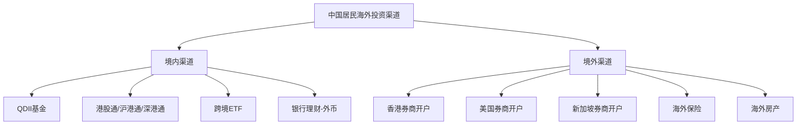
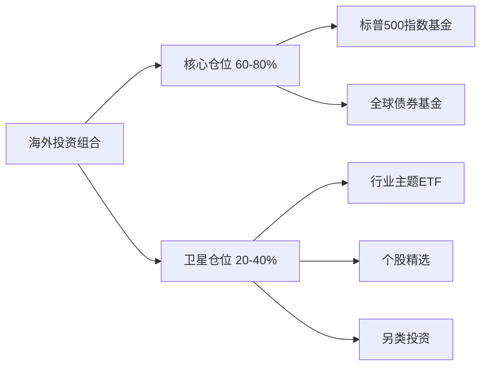

## 十三、海外投资工具

### 1. 为什么要进行海外投资

#### 1.1 单一市场的风险集中

中国居民的资产高度集中于人民币计价资产：房产占家庭总资产约 70%，股票基金以 A 股为主，存款以人民币银行账户为主。这种配置面临三重风险：

- **系统性风险**：当国内经济下行或政策调整时，所有人民币资产可能同时承压。2015 年 A 股从 5178 点跌至 2850 点，多数投资者无处可避。
- **汇率风险**：人民币兑美元汇率波动显著。2015 年"811汇改"后人民币一次性贬值约 3%，持有纯人民币资产的购买力在海外消费时缩水。
- **通胀侵蚀**：若国内通胀高于存款利率，实际购买力持续下降。

#### 1.2 海外投资的核心价值

- **分散化**：不同市场的相关性较低。A 股与美股的相关系数长期在 0.3-0.5 之间，同时持有可以平滑收益曲线。
- **获取全球增长红利**：苹果、微软、英伟达等全球科技巨头的主战场在海外，仅投资 A 股会错失这些机会。
- **货币对冲**：持有多种货币资产天然对冲单一货币贬值风险。
- **制度性差异**：不同市场的监管制度、交易机制、投资者结构各异，提供了多样化的获利机会。

#### 1.3 适合海外投资的人群

| 人群特征 | 海外投资的必要性 | 建议配置比例 |
|----------|----------------|-------------|
| 家庭资产 >500 万人民币 | 高——单一市场风险集中 | 20%-40% |
| 有子女留学/移民计划 | 高——提前储备外币资产 | 30%-50% |
| 科技/互联网从业者 | 中高——收入与国内经济高度相关 | 15%-30% |
| 普通工薪阶层 | 中——小额配置即可 | 5%-15% |
| 退休人士 | 中低——以稳健为主 | 10%-20% |

### 2. 海外投资的主要渠道

#### 2.1 渠道全景图

#### 2.2 境内渠道详解

##### QDII 基金（合格境内机构投资者）

QDII 是普通投资者最便捷的海外投资方式，无需换汇、无需境外开户，直接用人民币申购即可。

**运作机制**：基金公司获得 QDII 额度后，将募集的人民币资金兑换为外币，投资于境外股票、债券、商品等资产。

**主流 QDII 基金分类**：

| 类型 | 代表基金 | 跟踪标的 | 年管理费 | 适合人群 |
|------|---------|---------|---------|---------|
| 美股宽基 | 博时标普500ETF联接(050025) | 标普500 | 0.60% | 长期配置核心 |
| 美股宽基 | 国泰纳斯达克100(160213) | 纳斯达克100 | 0.80% | 看好科技股 |
| 港股宽基 | 华夏恒生ETF联接(000071) | 恒生指数 | 0.60% | 港股配置 |
| 全球债券 | 易方达中短期美元债(007360) | 中资美元债 | 0.50% | 稳健配置 |
| 全球股票 | 工银全球股票(486001) | 全球精选 | 1.60% | 一站式全球配置 |
| 商品 | 华安黄金ETF联接(000216) | 黄金 | 0.50% | 避险配置 |

**QDII 的优势与局限**：

优势：
- 操作简单，支付宝、天天基金等平台即可购买
- 无需个人换汇，不受个人年度 5 万美元额度限制
- 专业基金经理管理，适合不熟悉海外市场的新手

局限：
- 额度紧张时会限购甚至暂停申购（2020-2021 年大量 QDII 基金限购）
- 汇率由基金公司统一处理，个人无法选择换汇时机
- 管理费+托管费+申赎费综合成本较高
- 品种不如海外市场丰富，部分细分领域无对应产品

##### 港股通（沪港通/深港通）

2014 年启动的互联互通机制，允许 A 股投资者直接买卖港股。

**开通条件**：
- 证券账户及资金账户余额合计不低于 50 万元人民币
- 通过券商的风险测评和知识测试（通常为线上答题）
- 签署港股通风险揭示书

**交易规则要点**：
- 交易时间：遵循港股交易时间（上午 9:30-12:00，下午 13:00-16:00）
- 结算：T+0 交易，T+2 交收
- 以港币报价，人民币结算
- 无涨跌停限制（与 A 股最大的不同之一）
- 可投资标的：恒生综合大型股、中型股、小型股（市值 ≥50 亿港元）

**港股通 vs 直接开港股账户的对比**：

| 维度 | 港股通 | 直接开港股账户 |
|------|--------|--------------|
| 资金门槛 | 50 万人民币 | 无硬性门槛 |
| 开户便利性 | 在线即可 | 需赴港或邮寄资料 |
| 可投范围 | 有限制（约 500+只） | 全部港股+新股+窝轮 |
| 打新股 | 不支持 | 支持 |
| 融资融券 | 不支持 | 支持 |
| 股息税 | 20% 个人所得税（通过中国结算） | 通常 0-10% |
| 资金路径 | 直接人民币 | 需先换汇入金 |

##### 跨境 ETF

在 A 股上市、跟踪境外指数的 ETF，是间接海外投资的高效工具。

**代表性产品**：

| ETF名称 | 代码 | 跟踪指数 | 规模（亿元） | 年费率 |
|---------|------|---------|-------------|--------|
| 纳指ETF | 513100 | 纳斯达克100 | ~200 | 0.80% |
| 标普500ETF | 513500 | 标普500 | ~150 | 0.60% |
| 恒生科技ETF | 513180 | 恒生科技 | ~100 | 0.60% |
| 日经ETF | 513880 | 日经225 | ~30 | 0.55% |
| 德国DAXETF | 513030 | 德国DAX | ~10 | 0.55% |

**注意事项**：跨境 ETF 可能因 QDII 额度不足出现溢价，即场内交易价格高于实际净值。溢价超过 3% 时需谨慎，溢价超过 5% 时不建议买入。可通过基金公司官网查看实时溢折价率。

#### 2.3 境外渠道详解

##### 香港券商开户

香港是大陆居民境外投资最便利的跳板。

**主流互联网券商对比**：

| 券商 | 持牌机构 | 最低入金 | 佣金（美股/港股） | 特色 |
|------|---------|---------|------------------|------|
| 富途牛牛(Futu) | 香港证监会 | 0 | $0.99/股+平台费 | 界面友好，社区活跃 |
| 老虎证券(Tiger) | 香港/美国牌照 | 0 | $0.005/股（最低$1） | 衍生品丰富 |
| 长桥(Longbridge) | 香港证监会 | 0 | 港股免佣/美股低佣 | 免佣策略激进 |
| 盈透证券(IBKR) | 全球多牌照 | $0（IBKR Lite） | $0（Lite）/ $0.005/股（Pro） | 全球市场最全，专业级 |

**开户流程**（以互联网券商为例）：

1. 下载 APP，注册账号
2. 上传身份证/护照正反面照片
3. 填写个人信息（职业、收入、投资经验等）
4. 进行视频见证或电子签名（部分券商已简化为仅需人脸识别）
5. 审核通过（通常 1-3 个工作日）
6. 入金：通过银行电汇或 FPS 转数快（需有香港银行账户）

**入金方式**：

| 方式 | 到账时间 | 手续费 | 汇率 |
|------|---------|--------|------|
| 香港银行账户 FPS | 即时 | 免费 | 银行汇率 |
| 香港银行账户电汇 | 1-2小时 | 免费 | 银行汇率 |
| 大陆银行跨境汇款 | 1-3工作日 | 80-300元+中间行费 | 银行汇率 |
| 第三方换汇（Wise等） | 1-2工作日 | 0.5%-1.5% | 接近中间价 |

##### 美国券商开户

直接持有美国券商账户可以获得更完整的美股市场接入。

**主流美国券商**：

| 券商 | 最低入金 | 美股佣金 | 特色 | 中文支持 |
|------|---------|---------|------|---------|
| Interactive Brokers(IBKR) | $0 | $0(Lite)/$0.005/股(Pro) | 全球市场，专业工具 | 有中文 |
| Charles Schwab | $0 | $0 | 研究资源丰富 | 有限中文 |
| Firstrade | $0 | $0 | 完全免佣 | 中文界面 |
| Webull(微牛) | $0 | $0 | 移动端体验好 | 中文APP |

**美国券商的核心优势**：
- 可投资美股个股、ETF、期权、期货、债券等全品类
- 无 QDII 额度限制
- 部分券商提供碎股交易（Fractional Shares），1 美元即可买入高价股
- 融资利率低（IBKR 目前约 5.8%-6.8%，远低于国内两融）

**开户要点**：
- 需要护照（身份证不被美国券商接受）
- 需填写 W-8BEN 表格（非美国居民税务身份声明），可免除美国资本利得税
- 股息预扣税 10%（中美税收协定优惠税率，非协定国为 30%）

##### 新加坡券商

近年崛起的新兴选择，尤其适合关注东南亚市场的投资者。

| 券商 | 特色 | 佣金 |
|------|------|------|
| Tiger Trade(老虎) | 与港股/美股同一APP | 与港股美股相同 |
| Moomoo(富途国际版) | 全球多市场 | 低佣 |
| Saxo Bank(盛宝) | 欧洲老牌，产品极全 | 略高 |
| CGS-CIMB | 新加坡本土，东南亚股票全 | 较低 |

#### 2.4 其他海外投资渠道

##### 海外保险

香港保险是大陆居民最传统的海外资产配置方式之一。

**主流产品类型**：
- **储蓄分红险**：长期持有 15-20 年 IRR 可达 5%-6%，美元/港元计价
- **万用寿险**：兼具保障和投资功能，可灵活调整保额和保费
- **重疾险**：保障范围通常比内地更广，保费相对较低

**注意事项**：
- 必须本人亲赴香港签署保单（内地签署的香港保单不受法律保护）
- 需用香港银行账户或现金缴费
- 退保早期损失较大（前 2 年现金价值极低）
- 理赔需邮寄材料到香港，流程比内地慢

##### 海外房产投资

通过购买境外房产实现资产的实物配置。

**热门目的地对比**：

| 地区 | 均价（美元/平米） | 租金回报率 | 购房限制 | 主要风险 |
|------|----------------|-----------|---------|---------|
| 日本东京 | 5,000-15,000 | 4%-6% | 无限制 | 汇率、自然灾害 |
| 泰国曼谷 | 2,000-5,000 | 5%-7% | 外国人可买公寓 | 政治稳定性 |
| 美国 | 3,000-15,000 | 3%-5% | 无限制 | 税负重（房产税1%-3%） |
| 英国伦敦 | 8,000-20,000 | 2%-4% | 无限制 | 脱欧影响、印花税高 |
| 澳大利亚悉尼 | 6,000-12,000 | 2%-4% | FIRB审批+附加税 | 外国人限购新房 |

### 3. 资金出境的合规路径

#### 3.1 个人外汇额度

中国居民每人每年享有等值 5 万美元的购汇额度。这是最基础的资金出境方式。

**使用方式**：
- 银行柜台或手机银行直接购汇
- 用途填写"因私旅游"或"境外就医"等
- 购汇后可汇至本人境外账户或直系亲属境外账户

**重要限制**：
- 不得用于境外证券投资（购汇时用途选择很重要）
- 同一人当日累计取现不超过等值 1 万美元
- 不得借用他人额度（"蚂蚁搬家"行为会被列入关注名单）

#### 3.2 合规资金出境路径

| 路径 | 额度 | 速度 | 成本 | 合规性 |
|------|------|------|------|--------|
| 个人年度购汇 5 万美元 | 5 万美元/年/人 | 1-2 工作日 | 电报费+中间行费约 200-500 元 | 完全合规 |
| 港股通（50 万门槛） | 无硬性上限 | 即时 | 佣金+汇兑差 | 完全合规 |
| QDII 基金 | 无个人额度限制 | T+1 至 T+7 | 管理费+申购费 | 完全合规 |
| 境外刷卡消费+退税 | 无硬性上限 | 即时 | 汇率差 1%-2% | 合规 |
| 香港银行开户后跨境汇款 | 5 万美元/年 | 1-3 工作日 | 同上 | 合规 |

#### 3.3 风险提示

以下行为属于违规，可能导致行政处罚甚至刑事责任：

- **蚂蚁搬家**：将大额资金拆分为多笔 5 万美元以下，借用多人额度汇出。外汇局会通过大数据监测，一旦发现将列入"关注名单"，取消两年购汇资格。
- **虚假申报**：购汇时填写虚假用途（如旅游但实际用于投资）。
- **地下钱庄**：通过非法渠道换汇，涉嫌洗钱罪。
- **虚构贸易**：通过虚假进出口合同转移资金。

### 4. 海外投资的核心知识体系

#### 4.1 美股市场基础

##### 交易机制

| 要素 | 说明 |
|------|------|
| 交易时间 | 美东时间 9:30-16:00（北京时间 21:30-4:00，夏令时 21:30-5:00） |
| 盘前盘后 | 盘前 4:00-9:30，盘后 16:00-20:00（部分券商支持） |
| 结算制度 | T+2 交割 |
| 最小单位 | 1 股（部分券商支持碎股） |
| 涨跌停 | 无涨跌停限制，但有熔断机制（标普500 跌 7%/13%/20% 触发） |
| 做空 | 普通账户可做空，需先借入股票 |
| 期权 | 1 张期权 = 100 股标的 |

##### 主要指数

| 指数 | 成分股 | 特点 | 适合场景 |
|------|--------|------|---------|
| 标普500 | 500 家大型股 | 市值加权，覆盖约 80% 美股总市值 | 核心配置 |
| 纳斯达克100 | 100 家非金融科技股 | 科技属性强，波动大 | 看好科技 |
| 道琼斯30 | 30 家蓝筹股 | 价格加权，传统行业偏重 | 稳健配置 |
| 罗素2000 | 2000 家小盘股 | 小盘股代表性 | 经济复苏期 |

##### 税务要点

- **股息预扣税**：中美税收协定优惠税率 10%（填写 W-8BEN 后生效）
- **资本利得税**：非美国居民免征美国资本利得税（但需在本国申报）
- **遗产税**：非美国居民在美资产超过 6 万美元需缴纳遗产税（税率 18%-40%），这是大额持仓者需要警惕的风险

#### 4.2 港股市场基础

##### 交易机制

| 要素 | 说明 |
|------|------|
| 交易时间 | 上午 9:30-12:00，下午 13:00-16:00 |
| 半日市 | 9:30-12:00（圣诞前夕、新年前夕、农历新年前夕） |
| 结算制度 | T+2 交割 |
| 最小单位 | 1 手（不同股票每手股数不同，腾讯 100 股/手，汇丰 400 股/手） |
| 涨跌停 | 无涨跌停限制 |
| 做空 | 需在可卖空名单内，且需融券 |
| 衍生品 | 涡轮(Warrants)、牛熊证(CBBCs)极其丰富 |

##### 港股的独特特征

- **低估值常态**：恒生指数市盈率长期在 8-12 倍，远低于标普500 的 18-25 倍
- **高股息率**：银行、地产、公用事业股股息率普遍 4%-8%
- **AH 股溢价**：同一家公司 A 股和 H 股存在价差，A 股通常溢价 20%-50%
- **老千股风险**：部分小盘股通过供股、合股等手段掏空小股东利益，需避免市值过小、频繁合股供股的标的

#### 4.3 其他市场简介

| 市场 | 特色 | 关注点 |
|------|------|--------|
| 日本股市 | 日元贬值推动外资流入，日经225创历史新高 | 日元汇率、央行货币政策 |
| 欧洲股市 | 汽车、奢侈品、制药行业强势 | 欧元汇率、ECB 利率决策 |
| 印度股市 | 人口红利、经济增长强劲 | 外资持股限制、估值偏高 |
| 越南股市 | 新兴市场，增长潜力大 | 流动性不足、监管不完善 |

### 5. 海外投资的实操策略

#### 5.1 核心-卫星策略

对于大部分投资者，推荐"核心-卫星"配置方案：

**核心仓位**：低费率、被动跟踪、长期持有
- 标普500 ETF（如 VOO、IVV）：费率 0.03%
- 全球债券 ETF（如 BND、AGG）：费率 0.03%-0.05%
- 全球股票 ETF（如 VT）：费率 0.07%

**卫星仓位**：主动选择、适度择时
- 行业 ETF（半导体、AI、生物医药等）
- 个股（深入研究后的集中持仓）
- 另类资产（REITs、大宗商品等）

#### 5.2 定投策略

定投是海外投资最适合大众的方式，尤其适合波动较大的美股科技股。

**定投的数学逻辑**：

假设每月定投 5000 元人民币到标普500：

| 定投年限 | 累计投入 | 假设年化 8% 的终值 | 假设年化 10% 的终值 |
|---------|---------|------------------|-------------------|
| 5 年 | 30 万 | 36.6 万 | 38.8 万 |
| 10 年 | 60 万 | 89.4 万 | 102.0 万 |
| 15 年 | 90 万 | 164.3 万 | 198.5 万 |
| 20 年 | 120 万 | 274.6 万 | 362.1 万 |
| 30 年 | 180 万 | 680.3 万 | 1,036.2 万 |

**定投的执行要点**：
- 频率：建议月定投（周定投在美股市场并未显著优于月定投）
- 时机：固定日期自动扣款，不择时
- 加仓规则：当指数从高点回撤 10% 以上时加倍定投金额
- 止盈规则：达到目标收益率后分批止盈（如 +50% 卖出 30%，+100% 再卖出 30%）

#### 5.3 汇率管理策略

海外投资的收益由"资产收益"和"汇率变动"两部分组成。

**场景分析**（假设美股涨 10%）：

| 人民币走势 | 实际人民币收益 | 说明 |
|-----------|-------------|------|
| 人民币贬值 5% | +15.5% | 资产升值+汇率收益双重获益 |
| 人民币稳定 | +10% | 仅获得资产收益 |
| 人民币升值 5% | +4.5% | 资产收益被汇率损失部分抵消 |
| 人民币升值 10% | 0% | 完全被汇率损失抵消 |

**应对策略**：
- 不做汇率对冲：长期来看，汇率波动趋于均值回归，持有 5 年以上汇率影响减小
- 分批换汇：不要一次性将所有资金换为外币，在不同汇率水平分批换入
- 自然对冲：如有外币收入或消费支出，可天然对冲汇率风险

### 6. 风险管理

#### 6.1 海外投资的主要风险

| 风险类型 | 具体表现 | 应对措施 |
|---------|---------|---------|
| 市场风险 | 外围市场大幅下跌 | 资产配置分散、定投平滑成本 |
| 汇率风险 | 人民币升值侵蚀收益 | 分批换汇、长期持有 |
| 政策风险 | 外汇管制收紧 | 保留多条合规通道 |
| 流动性风险 | QDII 限购、跨境 ETF 溢价 | 多渠道配置，避免单一依赖 |
| 税务风险 | 未申报海外收入被追税 | 如实申报，利用税收协定 |
| 平台风险 | 券商破产、系统故障 | 选择持牌大型券商、资产分散 |
| 信息不对称 | 对海外市场了解不足 | 学习基础知识、从指数基金起步 |

#### 6.2 爆仓与极端风险防范

- **杠杆使用**：美股保证金账户通常提供 2 倍杠杆，期权可以放大 10-100 倍。新手绝对不建议使用杠杆。
- **黑天鹅事件**：2020 年 3 月美股 4 次熔断，标普500 单月跌幅 34%。保持至少 20% 的现金或债券仓位作为缓冲。
- **个股退市风险**：美股退市后股票可能归零（不同于 A 股退到三板市场），分散持仓至关重要。
- **券商破产**：美国 SIPC 保险覆盖每位客户 50 万美元证券+25 万美元现金。选择头部券商并关注其财务状况。

### 7. 税务合规

#### 7.1 中国居民的海外收入纳税义务

根据中国税法，中国税务居民需就全球收入缴纳个人所得税。

| 收入类型 | 美国预扣税 | 中国应纳税 | 是否需要补税 |
|---------|-----------|-----------|-------------|
| 美股股息 | 10% | 20% | 需补缴 10% 差额 |
| 美股资本利得 | 0% | 20%（财产转让所得） | 需全额缴纳 |
| 港股股息 | 0% | 20% | 需全额缴纳 |
| 港股资本利得 | 0% | 20% | 需全额缴纳 |
| QDII 基金分红 | — | 20%（暂免征收，以公告为准） | 政策有变化，需关注 |

**实际操作建议**：
- 目前税务机关对个人海外投资收益的征管力度有限，但趋势是趋严
- 大额交易（单笔超过等值 50 万元人民币）建议主动咨询税务师
- 保留所有交易记录、对账单，以备税务核查
- CRS（共同申报准则）已覆盖 100+ 个国家/地区，海外账户信息会自动交换给中国税务机关

#### 7.2 CRS 信息交换

自 2018 年起，中国已与 100+ 个国家/地区实施 CRS 信息自动交换。这意味着：

- 在香港、新加坡、美国等地开设的金融账户信息会被自动报送给中国税务机关
- 包括：账户余额、利息、股息、出售金融资产的收益等
- 隐瞒海外资产和收入的风险正在显著增加

### 8. 工具与资源

#### 8.1 信息获取渠道

| 渠道 | 用途 | 推荐 |
|------|------|------|
| Yahoo Finance | 美股行情、新闻、财报 | 免费，基础数据全面 |
| Bloomberg | 全球市场专业数据 | 付费，专业人士首选 |
| 雪球 | 港美股讨论社区 | 中文社区，氛围活跃 |
| Seeking Alpha | 美股深度分析 | 英文，分析质量高 |
| 东方财富-全球 | 全球市场行情 | 中文，数据免费 |
| 巨潮资讯/港交所披露易 | 上市公司公告 | 官方渠道 |

#### 8.2 数据分析工具

| 工具 | 功能 | 费用 |
|------|------|------|
| Portfolio Visualizer | 回测资产配置组合 | 免费基础版 |
| TradingView | 图表分析、技术指标 | 免费基础版/付费 Pro |
| 理杏仁 | 港美股估值数据 | 付费 |
| Wind 万得 | 专业金融终端 | 机构级，价格高 |

#### 8.3 记账与税务工具

- **Stockcard**：支持多券商持仓同步、收益计算
- **雪盈证券自带报表**：自动导出交易记录用于报税
- **Excel/Google Sheets**：自建投资跟踪表，灵活但需手动更新

### 9. 常见误区与纠正

| 误区 | 真相 | 纠正方法 |
|------|------|---------|
| 海外投资=高风险 | 指数基金的风险低于多数个股 | 从标普500指数基金起步 |
| 需要大资金才能开始 | 部分券商支持碎股，1 美元起投 | 选择支持碎股的券商 |
| 时差导致无法盯盘 | 定投策略无需盯盘 | 设定自动定投，每月检查一次 |
| QDII 基金就够了 | QDII 有额度限制和品种局限 | 港股通+QDII+跨境ETF 多渠道并行 |
| 美股只买科技股 | 科技股波动大，单一行业风险高 | 核心仓位配置宽基指数 |
| 换汇一次到位最好 | 一次换汇承担全部汇率风险 | 分 6-12 次分批换入 |
| 海外投资不用交税 | 中国税务居民需申报全球收入 | 了解 CRS 规则，必要时咨询税务师 |
| 港股估值低就一定安全 | 低估值可能是"价值陷阱" | 关注基本面，避免老千股 |

### 10. 进阶：全球化资产配置框架

当海外投资金额超过 100 万元人民币时，建议采用更系统的全球资产配置框架。

#### 10.1 全天候策略（All Weather）

由桥水基金瑞·达利欧提出的理念，核心是构建在任何经济环境下都能稳定运行的组合：

| 资产类别 | 配置比例 | 经济环境受益 |
|---------|---------|-------------|
| 美国长期国债 | 40% | 通缩、衰退 |
| 股票（全球） | 30% | 经济增长 |
| 黄金 | 15% | 通胀、货币贬值 |
| 大宗商品 | 7.5% | 通胀 |
| 中期国债 | 7.5% | 稳健收益 |

该策略在 1984-2013 年间的年化收益约 9.7%，最大回撤仅 12%，夏普比率 0.5+。

#### 10.2 个人投资者的简化版本

| 资产 | 配置 | 具体工具 |
|------|------|---------|
| 美股宽基 | 35% | VOO/IVV（标普500） |
| 全球股票 | 15% | VT（全市场） |
| 美国长期国债 | 20% | TLT（20年+国债ETF） |
| 黄金 | 15% | GLD/IAU |
| 现金/短期国债 | 15% | SHV/BIL |

**再平衡规则**：每半年检查一次，当任何资产偏离目标配置超过 5 个百分点时再平衡。

### 11. 本章小结

海外投资不是有钱人的专利，也不应被视为高风险的投机行为。它是现代资产配置中不可或缺的一环。

**入门路径**：
1. 先通过 QDII 基金或跨境 ETF 建立海外市场的基础认知（0 门槛）
2. 积累经验后开通港股通，接触个股和更丰富的投资标的（50 万门槛）
3. 如有更大需求，开设香港/美国券商账户，全面接入全球市场

**核心原则**：
- 从指数基金开始，不急于个股
- 长期持有，避免频繁交易
- 分散配置，不押注单一市场
- 合规操作，不触碰灰色地带
- 持续学习，理解你投资的每一个标的

海外投资是一场马拉松，不是短跑。复利的力量在长期才能充分显现——每月定投 5000 元，年化 8%，30 年后是 680 万元。从今天开始，比什么都重要。
