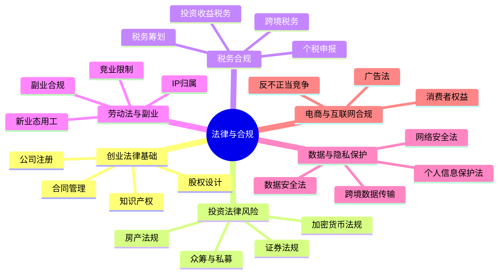
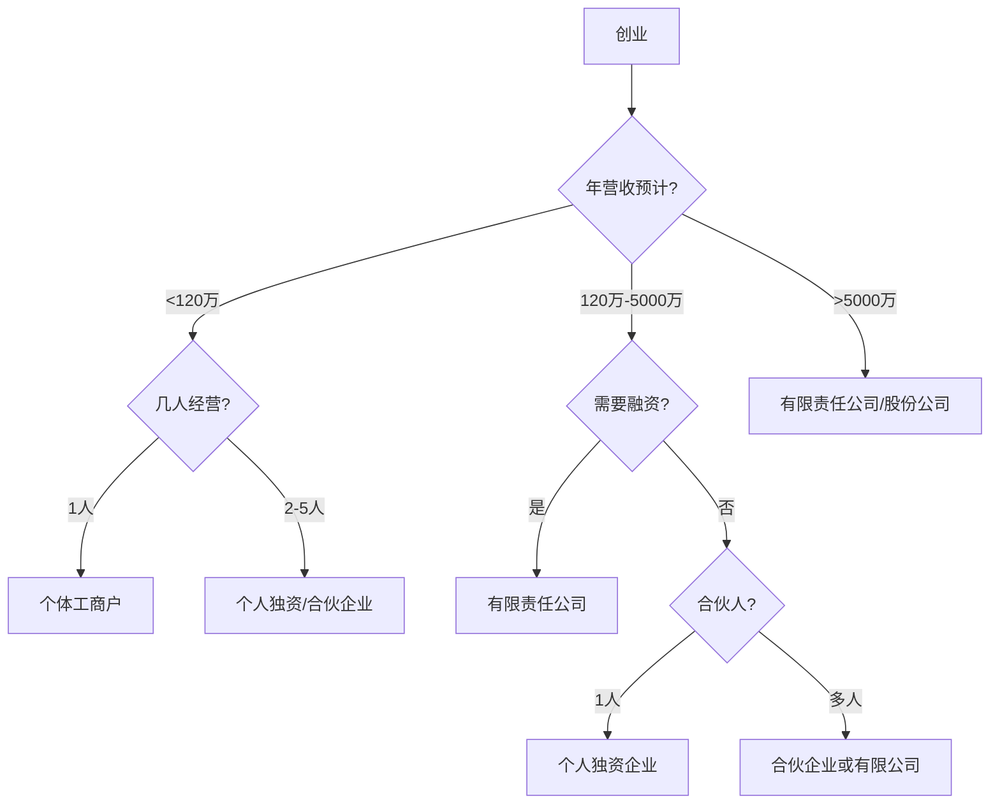
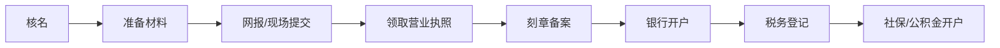
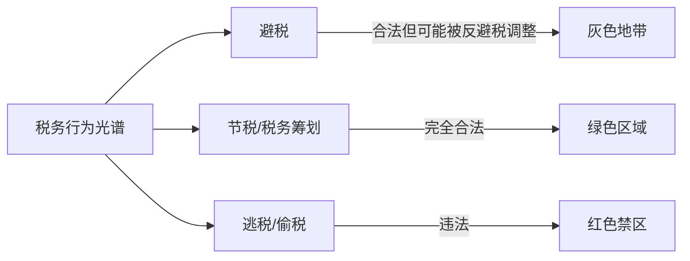
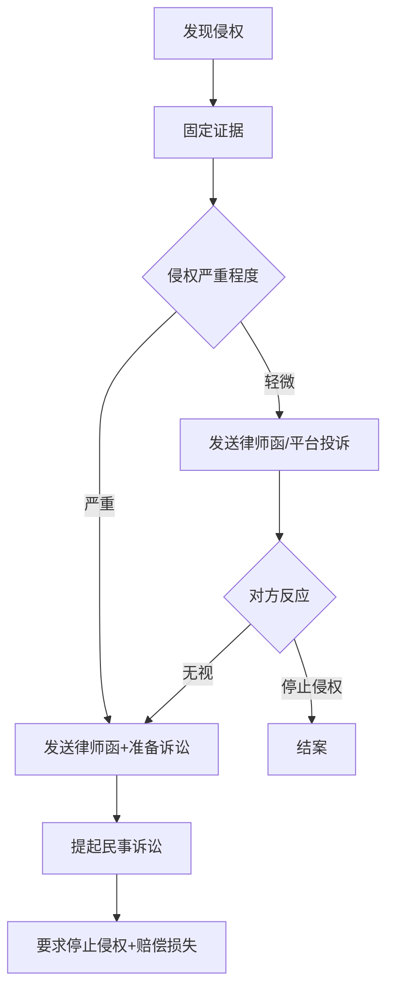

# 第十五章：法律与合规

> "法律是治国之重器，良法是善治之前提。" —— 古语

搞钱的路上，法律是底线，合规是护城河。很多人一门心思研究怎么赚钱，却忽略了法律风险——等到出了问题，轻则赔钱，重则入刑。本章不是法律教科书，而是**搞钱者的法律生存手册**：从创业注册到合同管理，从投资合规到税务筹划，从副业红线到数据保护，帮你建立完整的法律风险意识。

---

## 15.1 创业法律基础

创业第一步不是写商业计划书，而是搞清楚法律架构。选错了公司类型、股权设计不合理、合同有漏洞——任何一个都能让辛苦打拼的事业一夜归零。

### 15.1.1 公司类型选择

中国法律体系下，创业者可选择的主体类型有五种，各有优劣：

| 类型 | 注册难度 | 责任范围 | 税务特点 | 适用场景 |
|------|---------|---------|---------|---------|
| 个体工商户 | ★☆☆☆☆ | 无限责任 | 核定征收，税负低 | 小店、自媒体、自由职业 |
| 个人独资企业 | ★★☆☆☆ | 无限责任 | 核定征收，可开专票 | 个人品牌、工作室 |
| 普通合伙企业 | ★★★☆☆ | GP无限责任 | 穿透征税 | 律所、会计师事务所、投资基金 |
| 有限责任公司 | ★★★☆☆ | 以出资额为限 | 企业所得税25%+分红20% | 大多数创业公司 |
| 股份有限公司 | ★★★★☆ | 以股份为限 | 同上，可上市 | 规模较大、计划上市 |

**关键决策树：**

**个体工商户的隐藏优势**：很多创业者忽视个体户，但它有几个杀手级优势——可以核定征收（综合税负可低至1.5%-3%）、不需要建账（月营收10万以下免增值税）、注销简单。如果你是自媒体、电商小店、自由职业者，个体户往往是最优解。

**有限公司的"有限责任"陷阱**：有限公司的"有限责任"是有条件的。如果存在以下情形，法院可能"刺破公司面纱"，要求股东承担连带责任：
- 公司财产与个人财产混同（用公司账户付个人消费）
- 抽逃出资（注册后把资金转走）
- 一人有限公司不能证明财产独立（一人公司举证责任倒置）

**实操建议**：一人有限公司务必保持公私账目完全分离，每年做审计报告，否则等于白注册。

### 15.1.2 注册流程与注意事项

**完整注册流程：**

**核名技巧**：
- 在"国家企业信用信息公示系统"（gsxt.gov.cn）先查重
- 准备3-5个备选名称，按优先级排列
- 避免使用禁用词（"中国""国家"等需要国务院批准）
- 名称格式：行政区划+字号+行业+组织形式，如"北京星辰科技有限公司"
- 字号建议2-4个字，太长不好记，太短容易重名

**注册资本的学问**：
2014年实行认缴制后，注册资本不需要实缴，但**不代表可以随便填**：
- 注册资本=股东承担的最大责任上限。填1000万，公司破产欠债1000万，股东最多赔1000万
- 部分行业有最低注册资本要求（劳务派遣200万、金融类更高）
- 太高的注册资本会让合作方质疑实力真实性
- 建议：一般科技/咨询公司填50-100万，贸易公司100-500万

**经营范围的坑**：
- 经营范围不是越多越好，应围绕主营业务
- 第一项经营范围决定了公司的行业属性和税率
- 需要前置审批的行业（食品、医疗、教育等）必须先拿到许可证
- 后期可以变更经营范围，但每次变更都需工商备案

### 15.1.3 股权结构设计

股权设计是创业公司的"地基工程"，地基不稳，楼盖得越高塌得越惨。

**股权比例的法律意义**：

| 持股比例 | 法律效力 | 说明 |
|---------|---------|------|
| ≥67% | 绝对控制权 | 可通过修改章程、增减注册资本等重大决议 |
| ≥51% | 相对控制权 | 可通过普通决议（过半数即可） |
| ≥34% | 一票否决权 | 可阻止重大事项通过（需2/3以上表决的事项） |
| ≥10% | 临时提案权 | 可提议召开临时股东会 |
| ≥3% | 提案权 | 可向股东大会提出议案 |

**最常见的股权死局——50:50**：

两个人各占50%是创业公司最常见的股权结构，也是最危险的。一旦两人意见不合，任何决议都通不过，公司陷入僵局，最终只能解散。真功夫、西少爷等知名案例都栽在这个坑里。

**推荐的股权设计模板**：

方案一：核心创始人主导型
- 创始人A：67%（绝对控制）
- 联合创始人B：18%
- 期权池：15%

方案二：双创始人型
- 创始人A：51%（相对控制）
- 创始人B：34%
- 期权池：15%

方案三：多人创业型
- 创始人A：40%
- 创始人B：25%
- 创始人C：20%
- 期权池：15%

**期权池为什么要预留？** 后续引入投资人时，投资人通常要求期权池已存在（投资前稀释），如果不预留，创始人的股份会被二次稀释。早期预留15%-20%是行业惯例。

**股权代持的风险**：有些人因为身份限制（公务员、国企员工等）不能直接持股，选择让别人代持。但代持协议只在内部有效，不能对抗善意第三人。代持人如果擅自转让股权，实际出资人可能血本无归。

### 15.1.4 合同管理

合同是商业活动的基石，90%的商业纠纷源于合同不规范。

**四类核心合同要点**：

**买卖合同**：
- 必须明确：标的物名称/规格/数量/质量标准/单价/总价
- 交付条款：交付时间、地点、运输方式、运费承担
- 验收条款：验收标准、验收期限、异议期限
- 付款条款：付款时间、付款方式、发票类型
- 违约条款：违约金比例（一般不超过合同总额的30%）、损失赔偿范围
- 争议解决：仲裁还是诉讼？仲裁一裁终局效率高，但费用也高

**服务合同**：
- 服务范围：用SOW（工作说明书）明确界定，越细越好
- 服务标准：可量化的KPI或验收标准
- 服务期限：起止时间+续约条件
- 知识产权：服务成果的IP归属（这是最容易扯皮的地方）
- 保密条款：双方的保密义务和保密期限

**劳动合同**：
- 必须在用工之日起1个月内签订，否则需支付双倍工资
- 试用期：合同期1年以下最多1个月，1-3年最多2个月，3年以上最多6个月
- 违约金：只有两种情况可以约定违约金——培训服务期和竞业限制

**租赁合同**：
- 租赁期限最长20年，超过部分无效
- 押金条款：退还条件、扣除标准要写清楚
- 转租权：是否允许转租，需书面同意
- 维修责任：大修归房东，小修归租客（除非另有约定）

**合同审查的"五看法则"**：

1. **看主体**：对方是否真实存在、是否有签约资格、是否需要授权书
2. **看标的**：商品/服务描述是否清晰、数量和质量标准是否明确
3. **看钱**：金额、付款时间、付款条件、发票类型、税费承担
4. **看责任**：违约责任是否对等、违约金是否过高或过低
5. **看退出**：解约条件、提前终止的后果、争议解决方式

**电子合同的法律效力**：根据《电子签名法》，可靠的电子签名与手写签名具有同等法律效力。使用e签宝、法大大、上上签等平台签署的电子合同在司法实践中已被广泛认可。但涉及不动产转让、公用事业服务等情形除外。

**合同纠纷的诉讼时效**：
- 一般合同纠纷：3年（从知道或应当知道权利被侵害之日起）
- 国际货物买卖合同：4年
- 租赁合同租金：1年
- **关键**：诉讼时效可以中断，每次催告（要保留证据！）都能重新计算3年

### 15.1.5 知识产权保护

知识产权是搞钱者的核心资产，尤其对于内容创作者、技术开发者、品牌经营者。

**商标注册**：

注册流程约需9-12个月：
1. 商标查询（1天）→ 2. 提交申请（1天）→ 3. 形式审查（1个月）→ 4. 实质审查（6-9个月）→ 5. 公告期（3个月）→ 6. 下证

费用：官费300元/类（网上申请），代理费500-1000元/类。

**商标注册的三大坑**：
- **坑1：先做品牌再注册**。等你做出知名度再注册，可能已被抢注。小米在印度就曾因商标被抢注付出巨大代价。建议：品牌名确定后立刻注册。
- **坑2：只注册当前业务类别**。商标分45类，只注册核心类别等于给竞对留空间。建议：核心类别+关联类别+防御类别，至少注册5-8个类别。
- **坑3：忽略商标续展**。商标有效期10年，到期前12个月内需续展，宽展期6个月。过期不续展，商标失效，被别人注册了就白搭。

**专利申请**：

| 类型 | 保护对象 | 审查周期 | 保护期限 | 费用（官费） |
|------|---------|---------|---------|------------|
| 发明专利 | 产品/方法的技术方案 | 18-36个月 | 20年 | 3450元 |
| 实用新型 | 产品形状/构造 | 6-8个月 | 10年 | 500元 |
| 外观设计 | 产品外观 | 3-6个月 | 15年 | 500元 |

**专利申请的关键策略**：
- 发明专利和实用新型可以同日申请（双报策略），先用实用新型快速获得保护
- 申请前一定要做专利检索，避免白花钱申请已有技术
- 专利申请前不要公开发表论文或在社交媒体展示，否则丧失新颖性
- 委托代理机构撰写，自己写的申请文件通过率极低

**版权保护**：

版权自作品创作完成之日起自动产生，不需要登记。但**登记是维权的前提**——没有登记证书，法院立案都有困难。

保护方式对比：

| 方式 | 成本 | 效力 | 适用场景 |
|------|------|------|---------|
| 版权登记 | 免费/300元 | 官方证书，司法采信 | 所有作品 |
| 时间戳 | 免费 | 辅助证据 | 代码、文档 |
| 区块链存证 | 几元到几十元 | 司法采信（部分平台） | 创意作品、设计稿 |
| 公证 | 200-1000元 | 最强证据力 | 重要作品、诉讼前固定证据 |
| 邮件自证 | 免费 | 辅助证据 | 日常记录（发邮件给自己） |

**AI生成内容的版权问题**：这是一个新兴的法律灰色地带。2023年中国法院判决（北京互联网法院）认定：AI生成的图片如果体现了使用者的独创性选择（如精心设计提示词、多次调整参数），可以构成作品受版权保护。但纯AI一键生成、没有人类独创性贡献的内容，版权归属尚不明确。建议：使用AI辅助创作时，保留提示词设计、修改调整的记录，证明自己的独创性贡献。

---

## 15.2 投资法律风险

投资不只是看收益率，更要懂法律边界。很多看似高收益的投资机会，背后可能是非法集资、内幕交易或庞氏骗局。

### 15.2.1 证券法规

**内幕交易——搞钱者的高压线**：

内幕交易是指知悉证券交易内幕信息的人员，在信息公开前买卖证券或泄露信息。中国证监会近年加大打击力度，2023年内幕交易案件罚没金额超过20亿元。

**什么算"内幕信息"？**
- 公司重大投资、重大合同、重大亏损
- 公司经营方针、经营范围重大变化
- 公司财务状况重大变化
- 公司股权结构重大变化
- 公司高管重大变动
- 公司分红、增资计划

**什么算"内幕人员"？**
- 公司董事、监事、高级管理人员
- 持股5%以上股东及其董事、监事、高管
- 因职务便利可以获取内幕信息的人（投行、律所、会计师事务所等）
- 上述人员的配偶、父母、子女

**真实案例**：某上市公司高管在业绩预告前告诉妻子，妻子买入股票获利30万元。结果：没收违法所得30万+罚款90万，高管被市场禁入5年。**教训：饭桌上的一句话，可能让你倾家荡产。**

**操纵市场——散户的噩梦**：

操纵市场的常见手段：
- **连续交易操纵**：集中资金优势连续买卖，人为制造价格走势
- **对倒操纵**：自己卖给自己（用不同账户），制造交易量假象
- **虚假申报（幌骗）**：挂大单制造假象，诱导别人跟风后撤单
- **蛊惑交易**：散布虚假信息影响股价

法律后果：行政处罚（没收违法所得+罚款）、刑事处罚（操纵证券市场罪，最高10年有期徒刑）、民事赔偿。

**投资者保护**：如果因为上市公司虚假陈述导致投资损失，投资者可以提起证券虚假陈述民事诉讼。2022年《最高人民法院关于审理证券市场虚假陈述侵权民事赔偿案件的若干规定》取消了行政处罚前置程序，投资者可以直接起诉。

### 15.2.2 房产投资法规

**购房合同审查要点**：

- **五证审查**：国有土地使用证、建设用地规划许可证、建设工程规划许可证、建筑工程施工许可证、商品房预售许可证。缺任何一个都可能办不了产权证。
- **面积条款**：建筑面积vs套内面积、公摊比例、面积误差处理方式（误差超过3%可以退房）
- **交付标准**：毛坯还是精装修？装修标准要写进合同，不能只看样板间
- **违约条款**：开发商延期交房的违约金标准（行业惯例是日万分之一到万分之三）
- **补充协议陷阱**：开发商的补充协议往往排除自己的责任，要逐条审查

**产权纠纷高频场景**：

| 纠纷类型 | 高发原因 | 防范措施 |
|---------|---------|---------|
| 一房多卖 | 开发商资金链断裂 | 签约后立即网签备案 |
| 共有产权争议 | 夫妻/家庭共有未明确 | 婚前财产公证、明确份额 |
| 小产权房 | 价格便宜但无产权证 | 绝对不买小产权房 |
| 继承纠纷 | 未立遗嘱 | 提前立遗嘱并公证 |
| 借名买房 | 限购政策下借他人名义 | 不建议借名买房，风险极大 |

**房产投资的税务成本**：

| 税种 | 税率 | 免征条件 |
|------|------|---------|
| 契税 | 1%-3% | 首套90㎡以下1%，90㎡以上1.5% |
| 增值税 | 5.3% | 满2年免征（普通住宅） |
| 个人所得税 | 1%或差额20% | 满5年且唯一住房免征 |
| 中介费 | 1%-3% | 无免征 |

**房产税试点**：2021年起，上海和重庆试点房产税。上海按人均60㎡免征面积、超出部分按0.6%征收；重庆对独栋别墅和高档住房征收。全国性房产税立法仍在推进中，投资者需关注政策动向。

### 15.2.3 加密货币法规

**中国现行政策（截至2025年）**：

| 时间 | 文件 | 核心内容 |
|------|------|---------|
| 2017.9.4 | 七部委公告 | 禁止ICO，交易所退出中国 |
| 2021.9.24 | 十部委通知 | 全面禁止加密货币交易和挖矿 |
| 2021至今 | 持续执法 | 定期通报典型案例，打击OTC洗钱 |

**现行定性**：虚拟货币不具有法定货币地位，相关业务活动属于非法金融活动。但**个人持有虚拟货币本身并不违法**，法律保护的是虚拟货币作为虚拟财产的属性（2023年多起民事判例确认）。

**实际风险点**：
- **OTC交易风险**：场外交易容易收到赃款，银行卡可能被冻结（"冻卡"），严重的涉嫌帮信罪（帮助信息网络犯罪活动罪，最高3年有期徒刑）
- **挖矿**：全面禁止，存量矿机需清退，违反者面临断电、罚款
- **宣传推广**：为虚拟货币项目做推广宣传可能涉嫌非法经营或诈骗共犯
- **跨境转移**：通过虚拟货币进行资金跨境转移涉嫌逃汇

**海外合规框架**：

| 地区 | 监管机构 | 核心法规 | 合规要求 |
|------|---------|---------|---------|
| 美国 | SEC/CFTC/FinCEN | 证券法/商品交易法/银行保密法 | 牌照+KYC/AML+税务申报 |
| 欧盟 | 各国央行+ESMA | MiCA法规（2024年生效） | 统一牌照+白皮书披露+投资者保护 |
| 新加坡 | MAS | 支付服务法 | 牌照+AML/CFT+技术风险管理 |
| 日本 | FSA | 资金结算法 | 注册+资产分离+信息安全 |
| 香港 | SFC | 证券及期货条例 | VASP牌照（2023年起） |

### 15.2.4 众筹与私募法规

**股权众筹**：中国目前没有专门的股权众筹法规，实践中大部分股权众筹平台已转型或关闭。通过互联网向不特定对象公开募集资金，极容易触碰"非法集资"红线。如果你参与众筹项目，务必确认平台是否有合法资质。

**私募基金**：
- 合格投资者标准：金融资产不低于300万元，或近3年年均收入不低于50万元
- 单只基金最低投资额：100万元
- 私募基金管理人须在中国证券投资基金业协会登记
- **常见骗局**：承诺保本保收益、向不合格投资者募集、资金池运作、挪用基金财产
- **验证方式**：在基金业协会官网（amac.org.cn）查询管理人和产品备案信息

---

## 15.3 税务合规

税务是搞钱路上最被低估的法律风险。很多人的印象是"税务局不管小虾米"，但随着金税四期上线、大数据比对能力提升，个人和小微企业的税务风险正在急剧增加。

### 15.3.1 个人所得税

**综合所得税率表（2024年起适用）**：

| 级数 | 全年应纳税所得额 | 税率 | 速算扣除数 |
|------|----------------|------|-----------|
| 1 | ≤36,000元 | 3% | 0 |
| 2 | 36,000-144,000元 | 10% | 2,520 |
| 3 | 144,000-300,000元 | 20% | 16,920 |
| 4 | 300,000-420,000元 | 25% | 31,920 |
| 5 | 420,000-660,000元 | 30% | 52,920 |
| 6 | 660,000-960,000元 | 35% | 85,920 |
| 7 | >960,000元 | 45% | 181,920 |

**必须办理年度汇算清缴的情况**：
- 年综合所得超过12万元且补税超过400元
- 取得两处以上工资薪金
- 取得劳务报酬、稿酬、特许权使用费
- 有经营所得
- 有财产转让所得

**申报时间**：每年3月1日至6月30日，通过"个人所得税"APP办理。

**专项附加扣除——合法省税利器**：

| 扣除项 | 标准 | 条件 |
|--------|------|------|
| 子女教育 | 2000元/月/孩 | 3岁到博士毕业 |
| 继续教育 | 400元/月 或 3600元/年 | 学历教育或职业资格 |
| 大病医疗 | 最高8万元/年 | 自付超过1.5万元部分 |
| 住房贷款利息 | 1000元/月 | 首套房贷，最长240个月 |
| 住房租金 | 800-1500元/月 | 工作城市无房，按城市等级 |
| 赡养老人 | 3000元/月 | 父母年满60岁 |
| 婴幼儿照护 | 2000元/月/孩 | 3岁以下 |

**案例计算**：小王月薪2万，扣除五险一金4000元，有一个孩子（2000元/月）、赡养老人（3000元/月）、住房贷款（1000元/月）。
- 应纳税所得额 = 20000 - 5000（起征点）- 4000（五险一金）- 2000 - 3000 - 1000 = 5000元/月
- 年应纳税所得额 = 60000元
- 年个税 = 60000 × 10% - 2520 = 3480元
- 如果不扣除专项附加：年个税 = 120000 × 10% - 2520 = 9480元
- **节省**：6000元/年

### 15.3.2 投资收益税务

**各类投资收益税务对照表**：

| 投资类型 | 税种 | 税率 | 说明 |
|---------|------|------|------|
| A股买卖 | 印花税 | 0.05%（卖方） | 2023年8月28日起 |
| A股股息 | 个人所得税 | 0/10%/20% | 持股>1年免税，1月-1年10%，<1月20% |
| 基金买卖 | 个人所得税 | 暂免征收 | 公募基金暂免 |
| 基金分红 | 个人所得税 | 暂免征收 | 公募基金暂免 |
| 银行存款利息 | 个人所得税 | 暂免征收 | 2008年起暂免 |
| 国债利息 | 个人所得税 | 免税 | 国债利息免税 |
| 期货交易 | 个人所得税 | 暂免征收 | 暂免 |
| 股权转让 | 个人所得税 | 20% | 按"财产转让所得" |
| 房产转让 | 个人所得税 | 1%-20% | 见15.2.2房产税务表 |
| 私募基金分红 | 个人所得税 | 20% | 按"利息、股息、红利" |

**股权转让的税务筹划**：
- 直接转让个人股权，按20%缴个人所得税
- 通过有限合伙持股平台转让，税率相同但有地方财政返还（部分地区返还地方留存的40%-80%）
- 递延纳税：符合条件的技术成果投资入股可选择递延至转让股权时纳税
- **红线**：阴阳合同、低价转让、虚假评估等方式逃避股权转让个税，是税务稽查重点

### 15.3.3 税务筹划vs逃税

**合法筹划与非法逃税的边界**：

| 维度 | 合法节税 | 非法逃税 |
|------|---------|---------|
| 本质 | 利用税法规定的优惠和差异 | 隐瞒收入、虚增成本、虚假申报 |
| 方式 | 选择有利的组织形式、交易结构 | 阴阳合同、账外经营、虚开发票 |
| 前提 | 有真实的商业目的和经济实质 | 无真实交易或隐瞒真实交易 |
| 后果 | 合法合规 | 补税+滞纳金+0.5-5倍罚款+刑事责任 |
| 举例 | 利用小微企业优惠税率 | 私户收款不入账 |

**合法节税的常用策略**：

1. **利用小微企业优惠**：年应纳税所得额≤300万元的小微企业，实际税率可低至5%-10%
2. **合理利用地区税收优惠**：海南自由贸易港、西部大开发、横琴/前海等区域有税收优惠
3. **业务拆分**：将大业务拆分为多个小规模纳税人主体，享受增值税免征（月销售额≤10万元）
4. **费用列支**：合理列支业务招待费、广告费、研发费用等，充分利用加计扣除
5. **选择有利的纳税身份**：一般纳税人vs小规模纳税人，根据进项抵扣情况选择

### 15.3.4 金税四期与税务风险管理

**金税四期的核心能力**：
- 银行、市场监管、社保、海关等多部门数据打通
- 大数据比对：发票流、资金流、合同流、物流"四流合一"
- AI风险识别：自动标记异常交易模式

**高风险行为（金税四期重点监控）**：
- 私户收款不入账（个人卡流水异常大）
- 公转私频繁且无合理商业目的
- 长期亏损但持续经营
- 增值税税负率明显低于行业平均水平
- 进销项严重不匹配
- 大量现金交易
- 关联交易价格明显偏低

**税务稽查应对**：
- 日常稽查：税务机关按计划检查，保持账簿完整、凭证齐全即可
- 风险稽查：系统自动预警触发，需要准备充分的业务解释和佐证材料
- 举报稽查：被人举报，需要格外重视，建议立即咨询税务律师
- 专项稽查：针对特定行业或问题，了解检查重点后有的放矢

**被稽查后的应对原则**：
1. 积极配合，不对抗不拖延
2. 准备好完整的账簿、凭证、合同、银行流水
3. 如实陈述，不隐瞒不编造
4. 对有争议的事项，及时提出申辩
5. 必要时聘请税务律师或税务师协助

---

## 15.4 劳动法与副业

越来越多的人在主业之外搞副业，但如果不了解劳动法的边界，副业可能变成"祸业"。

### 15.4.1 竞业限制——副业的紧箍咒

**竞业限制的法律框架**：

竞业限制是指用人单位与劳动者约定，在解除或终止劳动合同后一定期限内，劳动者不得从事与原单位有竞争关系的工作。

**关键规则速查表**：

| 要素 | 规定 | 说明 |
|------|------|------|
| 适用人员 | 高管、高级技术人员、其他负有保密义务的人员 | 普通员工签了也可能无效 |
| 最长期限 | 2年 | 超过2年的部分无效 |
| 经济补偿 | 月工资的30%（不低于最低工资标准） | 用人单位必须按月支付 |
| 支付时间 | 离职后按月支付 | 在职期间工资中包含竞业补偿无效 |
| 违约金 | 由双方约定 | 过高可请求法院调减 |
| 解除权 | 用人单位可随时解除 | 但需额外支付3个月补偿金 |

**竞业限制的常见误区**：

**误区1："签了竞业限制就一定生效"**
错。如果用人单位超过3个月不支付经济补偿，劳动者可以请求法院解除竞业限制。但注意：不是自动解除，需要走法律程序。

**误区2："竞业限制范围可以无限大"**
错。竞业限制的范围、地域、期限必须合理。如果原公司做的是toB企业软件，不能限制你去做toC消费电子。范围过宽的竞业条款可能被法院认定为无效。

**误区3："普通员工也要受竞业限制"**
不一定。竞业限制只适用于高管、高级技术人员和其他负有保密义务的人员。如果公司和前台、行政人员签竞业限制，在司法实践中很可能被认定无效。

**如何判断自己的副业是否违反竞业限制？**
1. 先看劳动合同和竞业限制协议的具体条款
2. 判断副业与原单位业务是否存在"竞争关系"
3. 竞争关系的认定标准：是否生产同类产品、从事同类业务、争夺相同客户群
4. 如果不确定，建议咨询劳动法专业律师

### 15.4.2 副业知识产权归属

**职务作品vs个人作品**：

| 情形 | 知识产权归属 | 说明 |
|------|------------|------|
| 工作任务内的创作 | 原则上归作者，单位有优先使用权 | 如程序员写的技术文档 |
| 利用单位物质条件创作 | 归单位 | 如用公司设备渲染的3D作品 |
| 单位主持、代表单位意志 | 归单位 | 如公司品牌设计 |
| 业余时间、自用设备、与工作无关 | 归个人 | 如晚上在家写的小说 |
| 业余时间、与工作相关 | 有争议 | 如程序员开发的开源工具 |

**职务发明vs个人发明**：

| 情形 | 归属 | 说明 |
|------|------|------|
| 执行本单位任务完成的发明 | 归单位 | 包括本职工作、单位交付的额外任务 |
| 离职后1年内的相关发明 | 归单位 | 与原单位工作相关的发明 |
| 利用单位物质条件完成的发明 | 归单位 | 使用了单位资金、设备、材料 |
| 完全业余时间、自用设备的无关发明 | 归个人 | 需要证明与工作无关 |

**副业前的IP保护清单**：
1. 仔细阅读劳动合同中的知识产权条款
2. 查看公司的知识产权管理制度
3. 副业使用个人设备和网络（不用公司电脑/WiFi）
4. 副业内容与本职工作领域保持差异
5. 保留副业创作过程的完整记录（证明独立创作）
6. 如有疑虑，与公司HR或法务沟通确认

### 15.4.3 新业态用工的法律风险

**灵活用工的三种模式**：

| 模式 | 法律关系 | 社保义务 | 个税处理 | 适用场景 |
|------|---------|---------|---------|---------|
| 全日制劳动 | 劳动关系 | 必须缴纳 | 工资薪金（3%-45%） | 长期稳定用工 |
| 非全日制用工 | 劳动关系 | 仅工伤保险 | 工资薪金 | 每日≤4小时、每周≤24小时 |
| 劳务/承揽 | 民事关系 | 无 | 劳务报酬（20%-40%） | 临时性、一次性项目 |

**平台经济从业者的法律保护**：

外卖骑手、网约车司机、自由设计师等平台从业者，与平台的法律关系一直是争议焦点。2021年人社部等八部门《关于维护新就业形态劳动者劳动保障权益的指导意见》将从业者分为三类：

1. **符合确立劳动关系情形**：适用劳动法全面保护
2. **不完全符合劳动关系情形**（如依托平台接单的骑手）：企业需保障基本权益（劳动报酬、休息、安全等）
3. **个人自主经营**：按民事关系处理

**搞副业的"打工人"自查清单**：
- [ ] 劳动合同是否禁止兼职？
- [ ] 是否签了竞业限制协议？
- [ ] 副业是否与本职工作竞争？
- [ ] 是否使用了公司资源（设备、信息、客户）？
- [ ] 副业成果的IP归属是否明确？
- [ ] 是否影响本职工作的时间和精力？
- [ ] 副业收入是否已申报纳税？

### 15.4.4 劳动合同中的隐藏条款

除了标准条款外，以下条款需要特别注意：

**培训服务期条款**：
- 公司出资培训后可以约定服务期
- 违约金不超过培训费用，且按已服务年限递减
- **注意**：入职培训、岗前培训不算专项培训，不能约定服务期

**保密条款**：
- 保密义务在离职后仍然有效
- 保密期限由双方约定（通常2-5年）
- 保密费不是必须的，但有些法院认为不支付保密费则保密义务不成立

**竞业限制条款**（详见15.4.1）：
- 约定竞业限制必须同时约定经济补偿
- 竞业限制补偿金在离职后按月支付

**调岗条款**：
- 公司不能单方面随意调岗降薪
- 合理调岗需要满足：有经营必要性、不具有侮辱性、薪资待遇不降低、与劳动者能力匹配

---

## 15.5 隐私与数据保护

数据是新时代的石油，但数据合规是悬在每个搞钱者头上的达摩克利斯之剑。从2021年《个人信息保护法》生效以来，数据违规的罚款上限已达到上一年度营业额的5%。

### 15.5.1 个人信息保护法（PIPL）

**个人信息的范围**：

能够识别特定自然人的各种信息都是个人信息，包括但不限于：
- 基本信息：姓名、身份证号、电话号码、住址
- 生物识别：人脸、指纹、虹膜、声纹
- 金融信息：银行账号、交易记录、征信信息
- 行踪轨迹：GPS定位、出行记录
- 网络信息：IP地址、浏览记录、搜索记录、Cookie
- 设备信息：IMEI、MAC地址

**敏感个人信息**（需要单独同意+影响评估）：
- 生物识别、宗教信仰、特定身份、医疗健康、金融账户、行踪轨迹
- 不满14周岁未成年人的个人信息

**处理个人信息的法律基础**：

| 法律基础 | 适用场景 | 举例 |
|---------|---------|------|
| 取得同意 | 最常见 | APP收集用户信息 |
| 为订立/履行合同 | 必要信息 | 电商平台收集收货地址 |
| 履行法定职责 | 依法执行 | 税务机关收集纳税人信息 |
| 应对突发公共卫生事件 | 紧急情况 | 疫情期间收集健康信息 |
| 合理范围内处理已公开信息 | 公开信息 | 处理企业公示的联系人信息 |

**个人的七项核心权利**：
1. **知情权**：有权知道个人信息被如何收集、使用、共享
2. **决定权**：有权决定是否同意处理个人信息
3. **查阅复制权**：有权查阅、复制自己的个人信息
4. **更正补充权**：有权更正不准确的个人信息
5. **删除权**：有权要求删除个人信息（法定事由出现时）
6. **可携带权**：有权将个人信息转移至其他处理者
7. **撤回同意权**：有权随时撤回同意，且不影响撤回前已进行的处理

**企业合规实操要点**：
- 制定隐私政策，用清晰易懂的语言告知用户
- 收集信息前取得明确同意（不能默认勾选、捆绑授权）
- 建立个人信息影响评估制度（处理敏感信息、自动化决策、跨境传输等场景必须做）
- 指定个人信息保护负责人
- 建立用户权利响应机制（收到请求后15个工作日内处理）
- 发生信息泄露时72小时内向监管部门报告

### 15.5.2 数据安全法

**数据分类分级制度**：

| 级别 | 定义 | 示例 | 保护要求 |
|------|------|------|---------|
| 一般数据 | 影响个人/组织合法权益 | 员工通讯录、商品信息 | 基本保护措施 |
| 重要数据 | 可能危害国家安全/公共利益 | 地理信息、人口健康数据、金融数据 | 安全评估+专人管理+审计 |
| 核心数据 | 严重危害国家安全 | 关键基础设施数据 | 最高级别保护 |

**数据安全合规检查清单**：
- [ ] 梳理数据资产清单（有哪些数据、存在哪里、谁在用）
- [ ] 完成数据分类分级
- [ ] 敏感数据加密存储和传输
- [ ] 实施最小权限访问控制
- [ ] 建立数据安全审计日志
- [ ] 制定数据安全应急预案
- [ ] 定期进行数据安全风险评估
- [ ] 涉及重要数据的，完成数据安全评估

### 15.5.3 跨境数据传输

跨境数据传输是出海企业和有海外业务的搞钱者必须面对的合规要求。

**三种合法出境路径**：

| 路径 | 适用场景 | 审批/评估 | 时间 |
|------|---------|----------|------|
| 安全评估 | 关键信息基础设施运营者+处理100万人以上信息+累计出境10万人以上 | 国家网信办审批 | 约60工作日 |
| 标准合同 | 非上述情形的一般出境 | 签订标准合同+备案 | 自行办理 |
| 个人信息保护认证 | 有持续性跨境传输需求 | 第三方认证 | 视认证机构 |

**实操建议**：
- 如果只是偶尔给海外供应商发邮件（含员工姓名等信息），通常不需要走安全评估
- 如果系统性地将用户数据传输到海外服务器，必须评估是否触发安全评估条件
- 2024年3月发布的《促进和规范数据跨境流动规定》大幅放宽了条件，多类数据出境免予申报安全评估

### 15.5.4 网络安全法与等保制度

**网络安全等级保护（等保2.0）**：

| 等级 | 适用对象 | 保护要求 |
|------|---------|---------|
| 第一级 | 一般网络 | 自主保护 |
| 第二级 | 地市级政府网站、一般企业系统 | 指导保护 |
| 第三级 | 省级政府网站、金融/电信/能源系统 | 监督保护 |
| 第四级 | 国防/军事系统 | 强制保护 |
| 第五级 | 国家关键基础设施 | 专控保护 |

**对搞钱者的实际影响**：
- 如果你运营网站或APP，且收集用户个人信息，至少需要完成二级等保
- 如果涉及金融、医疗、教育等领域，通常需要三级等保
- 等保测评由有资质的测评机构执行，费用约5-20万元
- 未完成等保的单位可能面临罚款、停业整顿等处罚

---

## 15.6 电商与互联网合规

如果你通过电商、自媒体、知识付费等方式搞钱，以下法规是你的必修课。

### 15.6.1 广告法合规

**广告法禁用词汇**：

绝对化用语是广告违规的重灾区：
- 禁止使用：最、第一、唯一、顶级、极品、绝无仅有、万能、全网最低
- 安全替代：优质、精选、推荐、热销、人气

**违规后果**：罚款20万起步，情节严重的100万以上。2023年某护肤品品牌因使用"最强修复"被罚200万元。

**特定品类限制**：
- 医疗/药品/医疗器械广告：不能保证治愈率，不能用患者形象做推荐
- 保健食品广告：不能声称有治疗功能，必须标注"本品不能代替药物"
- 教育培训广告：不能对升学、通过率做保证性承诺
- 金融理财广告：不能承诺保本保收益

### 15.6.2 消费者权益保护

**七天无理由退货**：
- 适用于网络购物（不适用于线下实体店）
- 例外：定制商品、鲜活易腐、数字商品（已下载）、报纸期刊
- 商家不能以"已拆封"为由拒绝退货（2022年新规）
- 运费：商品质量问题商家承担，无理由退货消费者承担

**电商平台责任**：
- 平台需对入驻商家进行实名登记和资质审查
- 消费者权益受损时，平台不能提供商家真实信息的，需先行赔付
- 平台知道或应当知道商家侵权但未采取措施的，承担连带责任

### 15.6.3 反不正当竞争

**互联网领域常见不正当竞争行为**：
- 流量劫持：在他人网站插入链接、弹窗
- 恶意不兼容：迫使用户卸载竞争对手产品
- 数据爬取：未经授权爬取竞争对手数据
- 虚假宣传：编造、传播虚假信息损害竞争对手商誉
- 商业诋毁：发布对比测评时恶意贬低竞争对手
- 刷单炒信：虚构交易量和好评

**法律后果**：停止侵权+赔偿损失（最高500万元法定赔偿）+行政处罚

---

## 15.7 知识产权进阶：数字时代的IP策略

### 15.7.1 开源协议合规

如果你的项目使用了开源代码，必须遵守对应的开源协议：

| 协议 | 核心要求 | 商用风险 |
|------|---------|---------|
| MIT | 保留版权声明 | 极低，可闭源商用 |
| Apache 2.0 | 保留声明+标注修改 | 低，可闭源商用 |
| GPL | 修改后必须开源 | 高，强制开源"传染性" |
| LGPL | 动态链接不受影响 | 中，静态链接需开源 |
| AGPL | 网络服务也需开源 | 最高，SaaS也需开源 |
| BSD | 保留版权声明 | 极低，可闭源商用 |

**常见违规场景**：
- 在商业APP中使用GPL代码但不开源
- 使用AGPL组件提供SaaS服务但不公开源码
- 删除开源代码中的版权声明
- 使用Apache 2.0代码但未在产品中标注

### 15.7.2 内容创作的版权保护

**原创内容的侵权维权流程**：

**证据固定方法**：
1. 网页截图+录屏（注意显示完整URL和时间）
2. 公证保全（效力最强）
3. 区块链存证（时间戳+哈希值）
4. 使用"权利卫士""可信时间戳"等专业工具
5. 向平台投诉时保留投诉记录和平台处理结果

---

## 15.8 常见法律风险场景与应对

### 15.8.1 场景速查表

| 场景 | 风险等级 | 核心风险 | 应对建议 |
|------|---------|---------|---------|
| 自媒体接广告 | ★★☆ | 广告法违规、虚假宣传 | 审查广告内容、保留合作证据 |
| 知识付费卖课程 | ★★★ | 虚假宣传、退费纠纷 | 不夸大效果、设置合理退费政策 |
| 电商卖货 | ★★★ | 产品质量、消费者投诉 | 合规进货渠道、购买产品责任险 |
| 做中间人/代理 | ★★★★ | 合同纠纷、佣金纠纷 | 明确代理协议、保留交易记录 |
| 代购/跨境电商 | ★★★★ | 海关法规、税务合规 | 如实申报、依法纳税 |
| 金融产品推荐 | ★★★★★ | 非法荐股、非法集资 | 不承诺收益、不代客理财 |
| 二手交易 | ★★☆ | 商品质量、诈骗风险 | 如实描述、平台交易保留证据 |
| 直播带货 | ★★★★ | 虚假宣传、产品质量 | 选品严格、不夸大功效 |

### 15.8.2 被起诉了怎么办？

**民事诉讼应对流程**：

1. **收到起诉状后**：不要慌，15天内提交答辩状（不提交不影响审理，但失去提前陈述机会）
2. **评估风险**：找专业律师评估胜诉概率和可能的赔偿金额
3. **收集证据**：对自己有利的合同、聊天记录、转账记录、证人证言
4. **考虑调解**：调解比判决省时省钱，且结果通常更灵活
5. **应诉**：按时出庭，不到庭等于放弃抗辩权，法院会缺席判决
6. **上诉**：一审判决后15天内可上诉（裁定是10天）

**找律师的渠道和费用参考**：

| 渠道 | 优点 | 费用参考 |
|------|------|---------|
| 熟人推荐 | 可靠性高 | 按市场价 |
| 律师协会官网 | 有资质保障 | 按市场价 |
| 法律服务平台（如华律、找法） | 选择多 | 咨询免费，代理按标的额 |
| 法律援助中心 | 免费 | 经济困难者适用 |

律师费参考：简单案件5000-20000元，复杂案件按标的额3%-8%，风险代理按回款15%-30%。

---

## 推荐资源

**必读书籍**：
- 《创业公司法律实务》—— 创业者必读的法律指南，覆盖注册、融资、股权、用工全流程
- 《合同审查与风险防范》—— 合同审查的实操手册，含大量模板和案例
- 《企业税务筹划实战》—— 合法节税的系统方法论
- 《个人信息保护法解读》—— PIPL的逐条解析与合规指引

**在线资源**：

| 平台 | 用途 | 网址 |
|------|------|------|
| 中国裁判文书网 | 查询判例、了解司法裁判倾向 | wenshu.court.gov.cn |
| 国家企业信用信息公示系统 | 查企业工商信息、行政处罚 | gsxt.gov.cn |
| 中国商标网 | 商标查询和注册 | sbj.cnipa.gov.cn |
| 中国专利查询系统 | 专利检索 | cpquery.cponline.cnipa.gov.cn |
| 基金业协会 | 查询私募基金管理人和产品备案 | amac.org.cn |
| 信用中国 | 查询企业和个人信用信息 | creditchina.gov.cn |

**实用工具**：

| 工具 | 用途 | 费用 |
|------|------|------|
| 企查查/天眼查 | 企业信息查询、风险监控 | 基础免费，高级版300-2000元/年 |
| e签宝/法大大 | 电子合同签署 | 按份计费，几元到几十元/份 |
| 权利卫士 | 侵权证据固定和存证 | 按次计费 |
| 个税APP | 个人所得税申报和查询 | 免费 |
| 国家政务服务平台 | 各类政务事项在线办理 | 免费 |

**专业服务**：
- **律师事务所**：合同审查（1000-5000元/份）、常年法律顾问（2-10万元/年）
- **会计师事务所**：审计报告（3000-50000元）、代理记账（200-1000元/月）
- **知识产权代理**：商标注册（800-1500元/类）、专利申请（3000-10000元/件）
- **公证处**：证据保全公证（200-1000元/次）

---

**本章小结**：

法律合规不是搞钱路上的绊脚石，而是长久搞钱的基石。关键要点：

1. **创业起步**：选对公司类型、设计合理股权、签好每一份合同
2. **投资理财**：远离内幕交易和操纵市场，了解各类投资的税务成本
3. **税务合规**：用足专项附加扣除等合法节税工具，不碰逃税红线
4. **副业经营**：先检查竞业限制和劳动合同，确保副业合法合规
5. **数据保护**：收集用户信息要合规，跨境传输要走法定路径
6. **持续学习**：法律法规不断更新，关注最新政策动态

> 法律是底线，合规是能力。在法律框架内搞钱，才是真正的高手。
