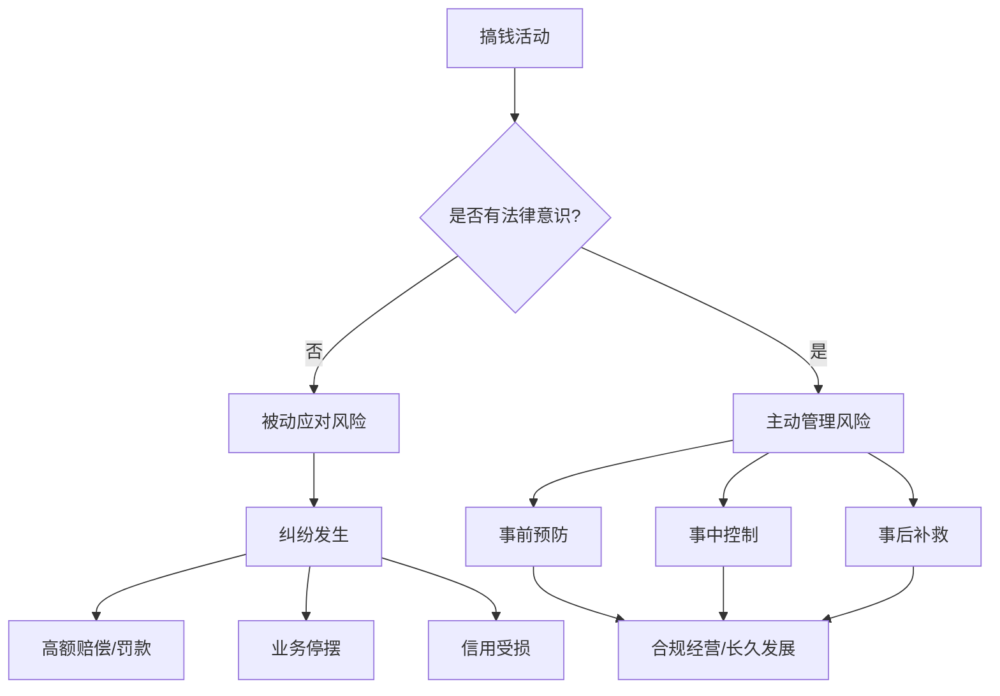
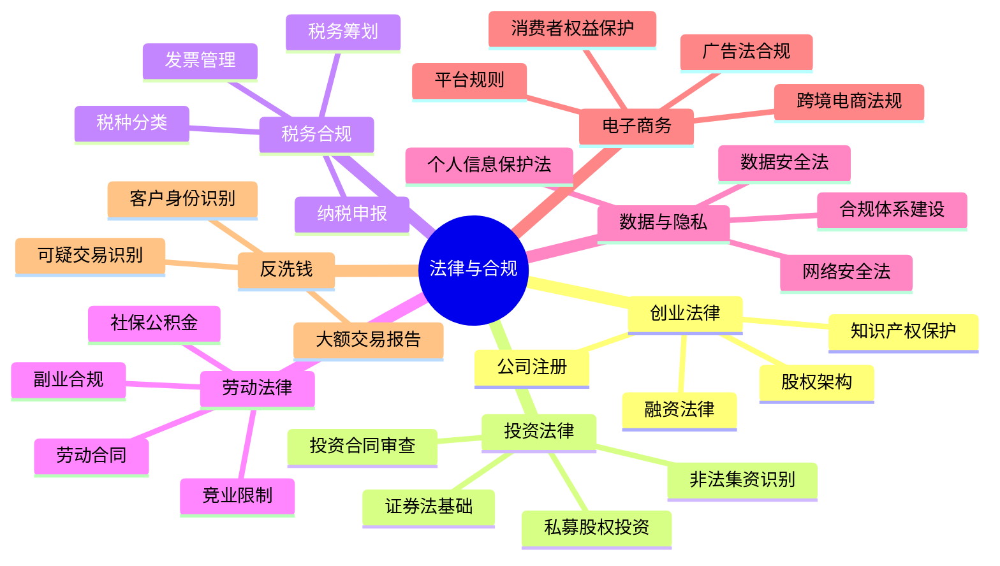
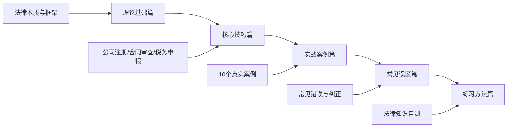
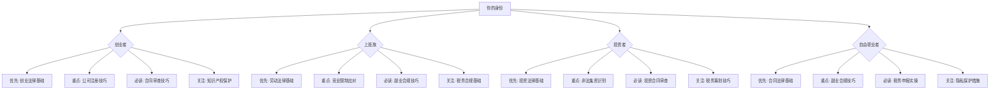
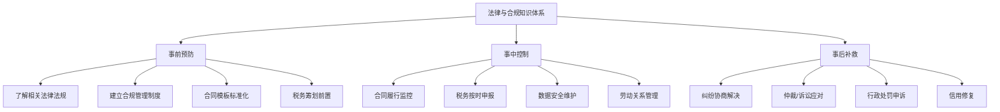

# 第15章 法律与合规

## 为什么搞钱必须懂法律

2023年，中国新增市场主体约2900万户，同年全国法院受理民商事案件约2000万件，其中合同纠纷占比超过50%。这意味着每新增一个市场主体，背后就有接近一个法律纠纷在等着。

这不是危言耸听，而是一个简单的事实：**搞钱的过程中，法律风险无处不在**。

- 你以为签了合同就安全了？合同条款里可能藏着对你不利的违约金条款、知识产权归属条款、竞业限制条款
- 你以为注册公司很简单？选错企业类型可能导致多缴几十万税款
- 你以为做副业没人管？在职期间的竞业限制协议可能让你赔掉全部收入
- 你以为数据不重要？违反《个人信息保护法》最高可罚5000万元或上年度营业额5%

法律不是搞钱的障碍，而是搞钱的基础设施。就像盖房子需要地基一样，没有法律基础的财富大厦，随时可能倒塌。

### 法律风险的真实代价

| 风险类型 | 真实案例 | 代价 |
|---------|---------|------|
| 合同陷阱 | 创始人未约定股权退出机制，被踢出自己创办的公司 | 失去公司控制权 |
| 税务违规 | 个人收入未申报，被税务稽查补税+滞纳金+罚款 | 补缴税款的1-5倍罚款 |
| 竞业限制 | 跳槽后违反竞业协议，被前雇主起诉 | 赔偿金通常为年薪的2-3倍 |
| 知识产权 | 使用未授权字体/图片被起诉 | 每张图片赔偿500-5000元 |
| 数据泄露 | 违规收集用户信息被网信办处罚 | 最高5000万元或年营业额5% |
| 广告违规 | 使用"最好""第一"等极限词 | 罚款20万-100万元 |

### 法律风险的底层逻辑

法律风险的本质是**信息不对称**。你不知道法律规定，而你的对手知道。搞钱的人如果不懂法律，就像不会游泳的人跳进深水区——不是能不能游泳的问题，而是会不会淹死的问题。

## 本章的核心框架

本章不是一本法律教科书，而是一本**搞钱者的法律生存手册**。我们不会教你如何成为律师，但会教你如何不被法律问题搞垮。

### 知识体系全景图

### 内容结构与学习路径

本章分为五个部分，每个部分都遵循"理论→方法→实操→案例"的递进结构：

#### 理论基础篇（11个子章节）

从法律的本质讲起，逐步覆盖创业、合同、知识产权、投资、税务、劳动、隐私、电子商务、反洗钱九大领域。每个领域都提供：

- **法律框架**：相关法律法规清单，让你知道有哪些法要遵守
- **核心概念**：必须理解的法律术语和原则
- **适用场景**：这些法律在什么情况下会影响你的搞钱活动

| 子章节 | 核心内容 | 解决的问题 |
|--------|---------|-----------|
| 法律与合规的本质 | 法律风险分类、合规管理体系 | 为什么搞钱必须懂法律？ |
| 创业法律基础 | 公司类型、注册流程、股权架构 | 创业要遵守哪些法律？ |
| 合同法律基础 | 合同要素、效力、违约责任 | 签合同要注意什么？ |
| 知识产权法律基础 | 专利、商标、著作权、商业秘密 | 如何保护自己的创意？ |
| 投资法律基础 | 证券法、私募规则、非法集资 | 投资有哪些法律红线？ |
| 税务法律基础 | 税种、税率、申报流程 | 怎么做到合法纳税？ |
| 劳动法律基础 | 劳动合同、竞业限制、社保 | 副业和主业怎么平衡？ |
| 隐私与数据保护 | 个保法、数据安全法、网安法 | 收集用户数据要注意什么？ |
| 电子商务法律基础 | 电商法、广告法、消保法 | 线上卖货有哪些法律要求？ |
| 反洗钱与反恐怖融资 | 大额交易、可疑交易、KYC | 什么行为可能被认定为洗钱？ |

#### 核心技巧篇（10个子章节）

理论讲完了，该学实操了。这部分提供具体的、可执行的操作指南：

- **公司注册技巧**：从核名到领取营业执照的全流程，包括选企业类型、确定注册资本、准备材料清单
- **合同审查技巧**：20个必须检查的合同条款，附审查清单模板
- **税务合规技巧**：增值税、企业所得税、个人所得税的申报实操，发票管理要点
- **竞业限制应对技巧**：如何判断竞业协议是否有效，如何降低竞业限制的影响
- **副业合规技巧**：在职期间做副业的法律边界，如何避免违反劳动合同
- **隐私保护技巧**：企业隐私合规体系建设步骤，个人隐私保护实操
- **法律纠纷处理技巧**：纠纷发生后的处理流程，诉讼vs仲裁vs调解的选择
- **税务筹划实战技巧**：合法节税的10种方法，不同企业类型的税负对比
- **合同签订的法律风险防范**：签订前、中、后的风险控制要点
- **本节总结**：核心技巧速查表

#### 实战案例篇（12个子章节）

通过10个真实案例，展示法律风险在不同场景下的具体表现：

| 案例 | 核心教训 |
|------|---------|
| 创业股权纠纷 | 股权代持的风险与防范 |
| 合同纠纷 | 合同条款不明确的代价 |
| 税务稽查 | 税务筹划与偷逃税的界限 |
| 劳动争议 | 竞业限制协议的效力认定 |
| 竞业限制纠纷 | 跳槽后的法律风险 |
| 数据泄露事件 | 企业数据安全责任 |
| 知识产权侵权 | 著作权侵权的赔偿标准 |
| 电子商务法律纠纷 | 电商平台的法律责任 |
| 广告法违规案例 | 极限词与虚假宣传 |
| 个人信息泄露维权 | 个人维权的法律途径 |

此外还包括**法律合规检查清单**（可直接使用的自检工具）和**案例总结**（提炼通用教训）。

#### 常见误区篇

揭示搞钱过程中最常见的法律错误，每个误区都提供：
- 误区描述：大家通常怎么想
- 真实情况：法律规定是什么
- 正确做法：应该怎么做
- 真实案例：因为这个误区吃亏的案例

#### 练习方法篇

提供一套从法律知识学习到合规实践的训练体系：
- 法律知识自测题（检验学习效果）
- 合同审查练习（实操能力训练）
- 合规检查清单（日常使用工具）
- 法律风险评估框架（系统化思维工具）

## 学习路径建议

不同背景的读者，学习重点不同。以下是针对性的学习路径：

### 按身份分类的学习路径

### 按紧急程度分类

| 紧急程度 | 适用场景 | 推荐学习内容 |
|---------|---------|-------------|
| **立即学习** | 正在创业/签合同/做副业 | 对应领域的核心技巧篇 + 相关案例 |
| **尽快学习** | 计划创业/投资/跳槽 | 对应领域的理论基础 + 核心技巧 |
| **系统学习** | 想建立完整的法律意识 | 从理论基础篇开始，按顺序学习 |
| **查阅参考** | 遇到具体法律问题 | 直接查阅对应章节 + 常见误区 |

### 学习时间规划

| 阶段 | 时间 | 内容 | 目标 |
|------|------|------|------|
| 第1天 | 2小时 | 本章概览 + 法律与合规的本质 | 建立法律风险意识 |
| 第2-3天 | 每天2小时 | 与你最相关的2-3个理论基础章节 | 掌握相关法律框架 |
| 第4-5天 | 每天2小时 | 对应的核心技巧章节 | 学会具体操作方法 |
| 第6天 | 2小时 | 相关实战案例 + 常见误区 | 通过案例加深理解 |
| 第7天 | 2小时 | 练习方法 + 法律合规检查清单 | 检验学习效果，形成工具 |
| 持续 | 每月1小时 | 关注法律法规更新 | 保持法律知识时效性 |

## 本章的知识图谱

学习本章后，你应该建立起如下的法律知识框架：

## 法律资源速查表

遇到法律问题时，以下是常用的官方资源和工具：

| 资源类型 | 名称 | 用途 | 网址 |
|---------|------|------|------|
| 法律查询 | 国家法律法规数据库 | 查询现行法律法规 | flk.npc.gov.cn |
| 裁判查询 | 中国裁判文书网 | 查询类似案例判决 | wenshu.court.gov.cn |
| 企业查询 | 国家企业信用信息公示系统 | 查询企业注册信息 | www.gsxt.gov.cn |
| 税务办理 | 电子税务局 | 纳税申报、发票管理 | 各省税务局官网 |
| 知识产权 | 中国及多国专利审查信息查询 | 查询专利信息 | cpquery.cponline.cnipa.gov.cn |
| 劳动仲裁 | 12333劳动保障热线 | 劳动法律咨询 | 12333 |
| 法律援助 | 中国法律服务网 | 免费法律咨询 | www.12348.gov.cn |
| 数据合规 | 中国网信网 | 数据安全政策查询 | www.cac.gov.cn |
| 裁判文书 | 中国庭审公开网 | 观看庭审直播 |tingshen.court.gov.cn |

### 法律服务获取渠道

当自助无法解决问题时，需要寻求专业法律帮助：

| 渠道 | 适用场景 | 费用范围 | 优缺点 |
|------|---------|---------|--------|
| 法律援助中心 | 经济困难的公民 | 免费 | 门槛高，需符合经济困难条件 |
| 12348热线 | 简单法律咨询 | 免费 | 只能咨询，不能代理案件 |
| 律师事务所 | 复杂法律事务 | 500-5000元/小时 | 专业度高，费用也高 |
| 法律科技平台 | 合同模板、法律咨询 | 99-999元/年 | 便捷低成本，但个性化不足 |
| 企业法务 | 企业日常法律事务 | 月薪1-3万 | 持续服务，但人力成本高 |
| 法律顾问 | 企业重大决策 | 2-20万/年 | 定期服务，性价比适中 |

## 重要提醒

> **免责声明**：本章提供的是法律基础知识和框架性指导，旨在帮助读者建立法律风险意识、了解基本法律概念。本章内容不能替代专业法律意见。遇到具体法律问题，尤其是涉及诉讼、行政处罚、重大合同签订等情况时，**强烈建议咨询专业律师**。
>
> 法律法规会不断更新，本章内容基于2024年现行法律编写。读者在实际应用时，应核实相关法规的最新版本。

### 学习心态建议

1. **不要恐慌**：了解法律风险不是为了让你害怕，而是为了让你更好地保护自己
2. **不要侥幸**：法律风险不会因为你不知道就不存在，侥幸心理是最大的敌人
3. **不要过度**：合规是必要的，但不要因为过度担心法律风险而不敢行动
4. **持续学习**：法律在不断更新，保持学习的习惯比一次性掌握所有知识更重要
5. **善用专业资源**：本章是入门指南，复杂问题一定要找专业人士

## 章节导航

- [理论基础篇](./理论基础/) — 法律框架与核心概念
- [核心技巧篇](./核心技巧/) — 实操方法与工具
- [实战案例篇](./实战案例/) — 真实案例与教训
- [常见误区篇](./04-常见误区.md) — 常见错误与纠正
- [练习方法篇](./05-练习方法.md) — 学习检验与工具
- [本章小结](./06-本章小结.md) — 核心要点回顾
- [深度拓展](./07-深度拓展.md) — 进阶知识与前沿话题
