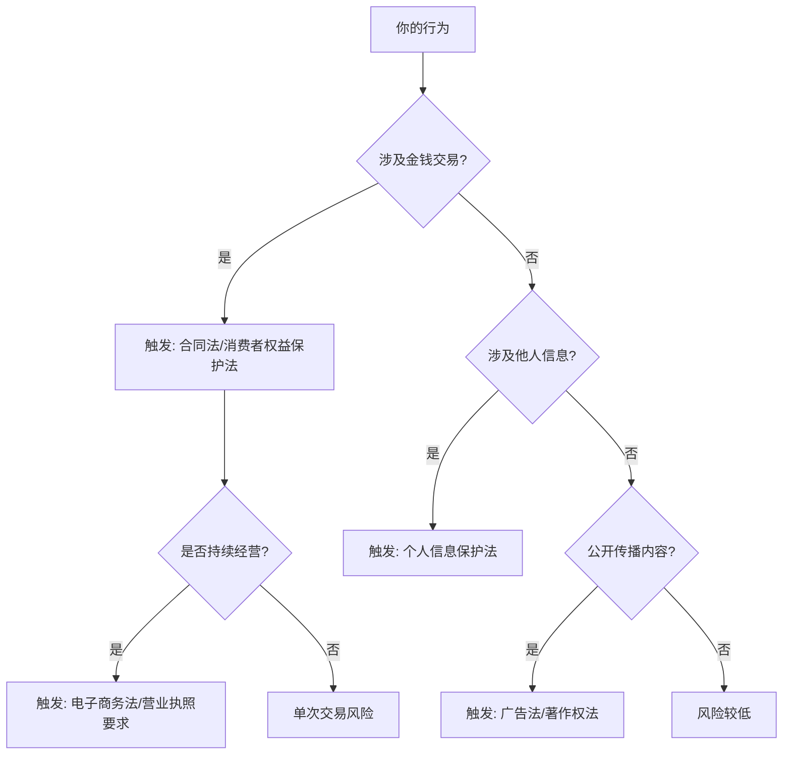
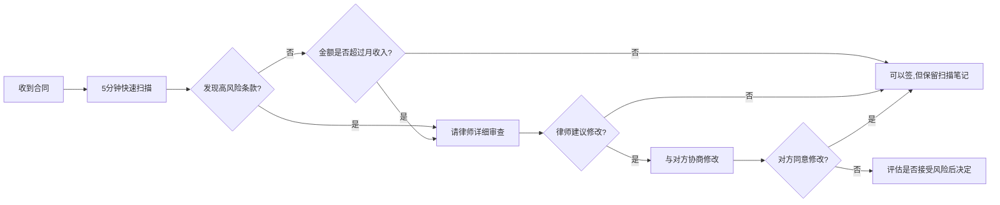
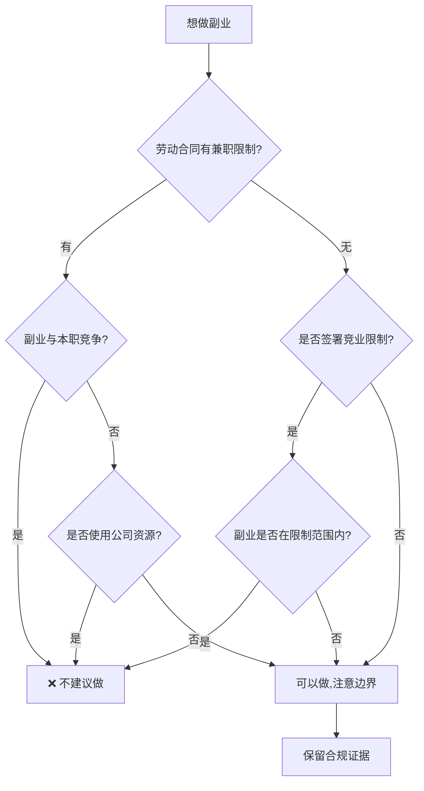
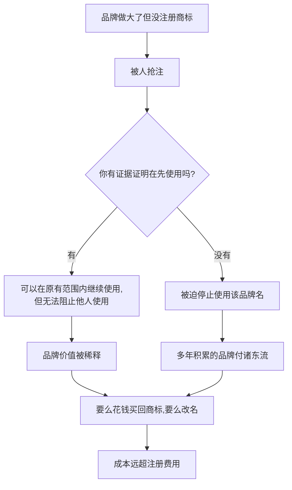
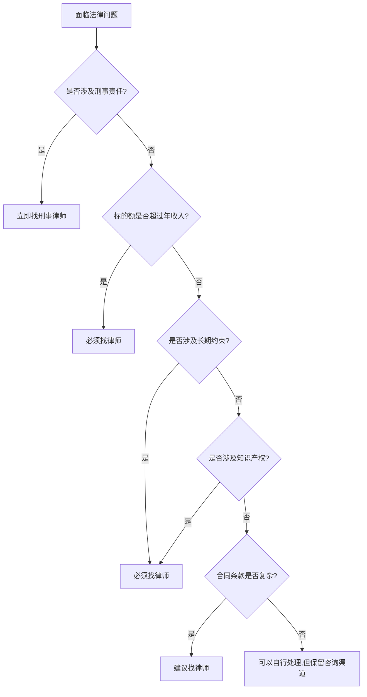
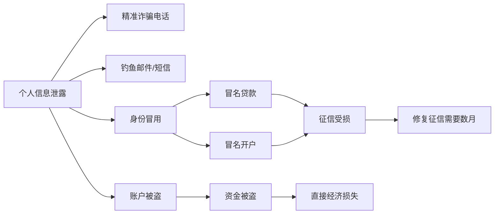
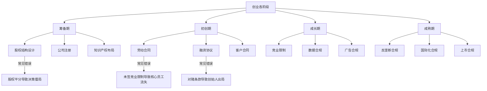
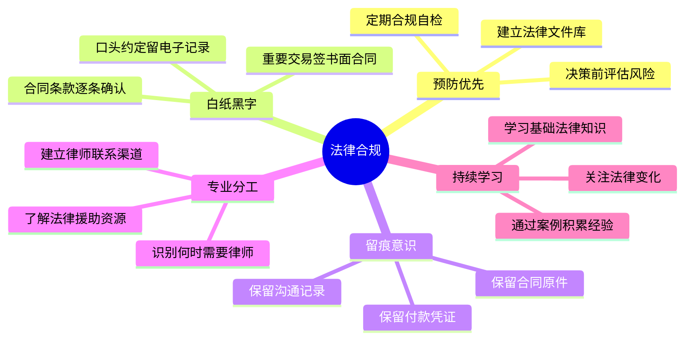

# 第15章 法律与合规——常见误区

法律合规领域的误区具有极强的隐蔽性：它们往往以"常识"的面貌出现，让人在不知不觉中踩入陷阱。与技术能力不同，法律认知的缺陷不会在日常中暴露，只在关键时刻才显现——而那时往往已经来不及补救。

本章逐一拆解10个最常见的法律合规误区。每个误区不仅告诉你"错在哪里"，还给出具体的风险场景、法律依据、正确做法和自检工具。读完本章后，你将拥有一套完整的法律合规自检框架，能够在实际操作中主动规避风险。

## 误区一：法律风险是大公司的事，跟我没关系

### 误区描述

很多个人创业者、自由职业者和上班族持有这样的想法：

- "我就是做个副业，又不开公司，法律管不着我。"
- "法律风险是大企业才需要操心的事，我就赚点小钱。"
- "我的业务规模太小，不会有人来查。"

### 误区分析

**为什么这是误区**

法律风险的触发与业务规模无关，而与行为性质有关。《民法典》《税收征收管理法》《个人信息保护法》等法律对个人和企业的约束是并行的。一个年收入5万元的自由职业者，如果存在偷税行为，其违法性质与年收入5000万的企业完全相同——区别仅在于处罚金额的绝对值。

**典型风险场景**

| 场景 | 看似无害的行为 | 实际法律后果 |
|------|----------------|--------------|
| 自由接单 | 个人微信收款不开票 | 补税+滞纳金+0.5-5倍罚款（《税收征管法》第63条） |
| 朋友圈卖货 | 无照销售食品 | 没收违法所得+最高10倍罚款（《食品安全法》第122条） |
| 代购海淘 | 个人代购逃避关税 | 走私普通货物罪，最高无期徒刑（《刑法》第153条） |
| 知识付费 | 未标注转载来源 | 侵犯著作权，赔偿500-500元/千字（《著作权法》第54条） |
| 闲鱼卖二手 | 频繁交易被视为经营 | 补办营业执照+补税（《电子商务法》第10条） |

**真实案例：朋友圈卖自制食品被罚8万**

2023年，浙江一位宝妈在朋友圈销售自制糕点，未办理食品经营许可证。消费者投诉后，市场监管部门依据《食品安全法》没收违法所得2.3万元，并处罚款8万元。她的辩解"就是做着玩的，没想到这么严重"无法成为免责理由。

### 正确认知

**法律风险的触发条件**

法律风险不取决于你的主观意图（"我只是随便做做"），而取决于客观行为是否落入法律规制范围。以下任何一个条件成立，你就面临法律风险：

1. **有偿行为**：只要涉及金钱交易，就触发消费者权益保护、税务、合同等法律
2. **涉及他人信息**：收集、使用他人个人信息，就触发个人信息保护法
3. **公开传播**：在公开渠道发布内容，就触发广告法、著作权法
4. **持续性经营**：反复从事同类交易，就可能被认定为经营行为



### 实践建议

**自检清单**

- [ ] 梳理你目前所有的收入来源（包括现金、转账、平台提现）
- [ ] 检查每个收入来源是否需要营业执照
- [ ] 确认每个收入来源是否已依法纳税
- [ ] 检查你收集的他人信息（客户姓名、电话、地址）是否合规
- [ ] 检查你发布的内容（广告文案、产品图片）是否符合广告法

**成本效益分析**

| 行动 | 成本 | 不做的风险 |
|------|------|-----------|
| 办理个体工商户执照 | 0元（免费）+ 半天时间 | 被认定无照经营，罚款500-5000元 |
| 开具发票 | 税率1%-3% | 补税+滞纳金+0.5-5倍罚款 |
| 食品经营许可证 | 500-2000元 + 1-2周 | 没收违法所得+5-10倍罚款 |
| 法律咨询（1次） | 500-2000元 | 可能面临数万甚至数十万损失 |

---

## 误区二：合同太长不想看，签了就行

### 误区描述

- "合同几十页，谁看得完？"
- "对方是大公司/知名企业，合同肯定没问题。"
- "签了就签了，出了问题再说。"
- "都是格式合同，没得谈的。"

### 误区分析

**为什么这是误区**

合同是权利义务的法律载体。签字即表示你对合同全部条款的认可，"没看过"不能成为免责理由。《民法典》第496条明确规定：提供格式条款的一方应当采取合理方式提示对方注意与其有重大利害关系的条款。但如果对方已经做了提示（比如加粗标红），而你没有仔细看，法律上你仍然受约束。

**常见合同陷阱清单**

| 陷阱类型 | 典型表述 | 实际后果 |
|----------|----------|----------|
| 无限连带责任 | "乙方对项目全部债务承担连带清偿责任" | 项目失败时，你个人资产可能被执行 |
| 单方面解约权 | "甲方有权随时解除合同，无需承担违约责任" | 对方随时可以终止合作，你投入的成本全部损失 |
| 知识产权全让渡 | "乙方在合同期内产生的一切知识产权归甲方所有" | 你在工作之余做的个人项目也可能被主张权利 |
| 竞业限制扩大化 | "离职后2年内不得从事互联网行业" | 限制范围过宽，可能导致你无法在本行业就业 |
| 高额违约金 | "违约方需支付合同总金额200%的违约金" | 一次违约可能导致倾家荡产 |
| 管辖权不利 | "争议由甲方所在地法院管辖" | 纠纷发生时，你需要到对方所在地打官司，成本大增 |
| 自动续约条款 | "合同到期前30天未书面异议则自动续约" | 忘记通知就被绑进新一轮合同 |

**真实案例：签了"格式合同"损失67万**

2022年，北京一位创业者与某孵化器签订入驻协议，未仔细审查"自动续约"和"违约金"条款。因业务调整提前搬出时，被要求支付2年租金+违约金共67万元。法院审理认为，虽然合同中有格式条款，但已用加粗字体标注，签约人应当注意，最终判决创业者败诉。

### 正确认知

**合同审查的"5分钟快速扫描法"**

不是每份合同都需要请律师审查，但每份合同都需要至少做一次快速扫描。以下是5分钟内完成的快速审查流程：

**第1分钟：看主体**
- 合同对方是谁？营业执照是否有效？
- 签约代表是否有授权？（查看授权委托书）
- 对方是否被列入失信被执行人名单？（中国执行信息公开网查询）

**第2分钟：看标的**
- 合同的交易内容是什么？描述是否具体明确？
- 数量、质量、价格是否明确？
- 交付/验收标准是否清晰？

**第3分钟：看钱**
- 付款条件、付款方式、付款时间
- 发票类型和税率
- 保证金、押金的退还条件

**第4分钟：看风险**
- 违约责任条款——双方是否对等？
- 解除合同的条件——你是否有退出机制？
- 保密条款和竞业限制——范围是否合理？

**第5分钟：看争议**
- 争议解决方式——仲裁还是诉讼？
- 管辖法院或仲裁机构——对你是否有利？
- 适用法律——是否为中国法律？



### 实践建议

**合同审查自检表**

每次签合同前，用以下清单逐项确认：

- [ ] 对方主体信息已核实（营业执照、授权书）
- [ ] 合同标的描述具体、可量化
- [ ] 付款条件和时间明确
- [ ] 违约责任对双方公平
- [ ] 有合理的退出/解除机制
- [ ] 保密和竞业限制范围合理
- [ ] 管辖法院/仲裁机构对我方不构成过高成本
- [ ] 所有口头承诺已写入合同
- [ ] 已在中国执行信息公开网查询对方信用
- [ ] 金额超过月收入的合同已请律师审查

**谈判话术**

当发现不公平条款时，不要直接说"这个条款我不接受"，而是用以下话术：

- "这个条款我们理解是为了保障贵方利益，但目前的表述范围较宽，能否在____方面做更具体的限定？"
- "关于违约金条款，行业惯例通常是合同金额的20%-30%，目前约定的200%可能不太合理，能否调整到____？"
- "关于管辖权条款，考虑到双方都在____城市，能否改为由合同履行地法院管辖？"

---

## 误区三：少报点收入没人知道

### 误区描述

- "现金交易没有记录，税务机关查不到。"
- "平台提现到个人账户，不用报税。"
- "我就赚了几万块，税务局不会管这么小的金额。"
- "别人都是这么做的，没事的。"

### 误区分析

**为什么这是误区**

中国的税收征管已经全面进入大数据时代。金税四期系统（2024年全面上线）实现了银行、税务、市场监管、社保等多部门数据的互联互通。以下数据源都可能触发税务稽查：

| 数据源 | 监控内容 | 触发条件 |
|--------|----------|----------|
| 银行账户 | 大额交易、频繁交易 | 单笔5万以上现金、个人账户频繁对公转账 |
| 第三方支付 | 微信/支付宝收款 | 年收款超过一定金额（各地区标准不同） |
| 电商平台 | 店铺销售额 | 平台数据与申报收入不一致 |
| 社保系统 | 多地参保、异常缴费 | 在多家公司同时缴纳社保 |
| 不动产登记 | 房产交易、持有 | 购房资金来源与收入不匹配 |
| 海关系统 | 进出口记录 | 代购未申报关税 |
| 发票系统 | 进销项匹配 | 进项与销项金额长期不匹配 |

**偷税的法律后果梯度**

```text
情节严重程度          法律后果
────────────────────────────────────────
首次且金额较小        → 补缴税款 + 滞纳金（日万分之五）
                      + 0.5倍罚款

金额较大(10万+)       → 补缴税款 + 滞纳金
                      + 0.5-5倍罚款

金额巨大(50万+)       → 补缴税款 + 滞纳金
                      + 5倍罚款
                      + 可能移送公安机关

金额特别巨大(250万+)   → 逃税罪：3-7年有期徒刑
                      + 罚金
```

**真实案例：网红偷逃税被罚13.41亿**

2021年，薇娅（黄薇）通过设立多家个人独资企业和合伙企业，将个人收入转换为企业经营所得，偷逃税款6.43亿元。税务机关依法追缴税款、加收滞纳金并处罚款，共计13.41亿元。这个案例说明，即使通过复杂的税务架构进行避税，只要实质是偷逃税款，大数据都能穿透识别。

### 正确认知

**合法节税 vs 违法逃税的边界**

| 维度 | 合法节税 | 违法逃税 |
|------|----------|----------|
| 本质 | 利用法律允许的优惠政策 | 伪造、隐瞒收入 |
| 方式 | 专项附加扣除、公积金、公益捐赠 | 虚开发票、隐匿收入、阴阳合同 |
| 依据 | 有明确法律条文支持 | 违反税收征管法 |
| 后果 | 合法减少税负 | 补税+罚款+刑事责任 |
| 识别 | 税务机关认可并鼓励 | 税务机关稽查并处罚 |

**个人合法节税的具体方法**

**方法一：充分利用专项附加扣除**

2024年个人所得税专项附加扣除标准：

| 扣除项目 | 标准（元/月） | 条件 |
|----------|---------------|------|
| 子女教育 | 2000/子女 | 满3岁至博士毕业 |
| 继续教育 | 400（学历）或3600/年（职业资格） | 在学或取得证书当年 |
| 大病医疗 | 实际支出超1.5万部分，上限8万/年 | 医保目录内自付部分 |
| 住房贷款利息 | 1000 | 首套房贷，最长240个月 |
| 住房租金 | 800-1500（按城市） | 在工作城市无自有住房 |
| 赡养老人 | 3000 | 父母年满60岁 |
| 3岁以下婴幼儿照护 | 2000/婴幼儿 | 满3岁前 |

**方法二：公积金最大化**

住房公积金缴存比例可在5%-12%之间选择。公积金缴存金额免征个人所得税，且可用于购房、租房、装修等。如果你的公司允许，选择12%的缴存比例，相当于将一部分收入转化为免税收入。

**方法三：个人养老金**

每年可缴纳个人养老金12000元，在综合所得或经营所得中据实扣除。如果你的边际税率为20%，每年可节税2400元。

**方法四：公益捐赠**

个人通过公益性社会组织的捐赠，不超过应纳税所得额30%的部分可以扣除。

### 实践建议

**年度税务自检清单**

- [ ] 汇总所有收入来源（工资、奖金、稿费、投资收益、副业收入）
- [ ] 确认是否已申报所有应税收入
- [ ] 检查专项附加扣除是否已全部填报
- [ ] 确认公积金缴存比例是否已最大化
- [ ] 确认个人养老金是否已缴纳
- [ ] 检查是否有符合条件的公益捐赠可以扣除
- [ ] 如有多处收入，确认是否需要年度汇算清缴

**如果你已经有未申报收入，怎么办**

根据《税收征收管理法》第62条，纳税人主动补缴税款的，可以从轻处罚。具体步骤：

1. 整理所有未申报收入的明细和凭证
2. 计算应补缴的税款和滞纳金
3. 到主管税务机关办税服务厅主动申报补缴
4. 保留补缴凭证

主动补缴的罚款通常为0.5倍以下，远低于被稽查后的2-5倍罚款。

---

## 误区四：做副业是我的自由，公司管不着

### 误区描述

- "下班时间是我自己的，想做什么做什么。"
- "公司不知道我在做副业。"
- "我又没影响工作，凭什么不能做？"
- "竞业限制就是吓唬人的，不用管。"

### 误区分析

**为什么这是误区**

中国法律对副业的规制是多维度的，并非"下班就是自由人"这么简单。以下是可能约束你做副业的法律和合同条款：

**约束来源一：劳动合同中的兼职条款**

大多数劳动合同都有类似条款："乙方在合同期内不得在外兼职。"根据《劳动合同法》第39条，劳动者同时与其他用人单位建立劳动关系，对完成本单位的工作任务造成严重影响的，或者经用人单位提出拒不改正的，用人单位可以解除劳动合同。

关键点：即使合同没有明确禁止兼职，如果副业影响了本职工作，公司仍然可以解除合同。

**约束来源二：竞业限制协议**

如果你签署了竞业限制协议，离职后在约定期限内（最长2年）不得从事与原公司有竞争关系的业务。竞业限制期间，原公司需按月支付经济补偿（不低于离职前12个月平均工资的30%）。

**约束来源三：忠实义务**

即使没有签署竞业限制协议，《劳动合同法》第39条也规定了劳动者的忠实义务。如果你在在职期间从事与公司有竞争关系的业务，公司可以主张你违反忠实义务。

**约束来源四：知识产权归属**

如果你的副业成果与本职工作相关，公司可能主张该成果属于职务作品或职务发明。《专利法》第6条规定：执行本单位的任务或者主要是利用本单位的物质技术条件所完成的发明创造为职务发明创造，申请专利的权利属于该单位。

**副业合规性评估矩阵**

| 评估维度 | 低风险 | 中风险 | 高风险 |
|----------|--------|--------|--------|
| 与本职工作的关系 | 完全不同领域 | 有交叉但不竞争 | 直接竞争 |
| 使用的时间 | 业余时间 | 部分占用工作时间 | 大量占用工作时间 |
| 使用的资源 | 完全个人资源 | 偶尔使用公司资源 | 系统性使用公司资源 |
| 客户关系 | 与公司客户无关 | 有少量重叠 | 直接利用公司客户 |
| 信息使用 | 不涉及公司信息 | 使用公开信息 | 使用公司商业秘密 |
| 竞业限制 | 未签署 | 已签署但副业不冲突 | 已签署且副业可能冲突 |

**真实案例：在职做竞品被判赔83万**

2023年，上海某互联网公司产品经理在职期间开发了一款与公司产品高度相似的App，并利用公司内部数据进行用户画像分析。公司发现后，以违反竞业限制和侵犯商业秘密为由起诉。法院判决该员工赔偿公司经济损失83万元，并停止开发竞品App。

### 正确认知

**副业合规的四步自检法**

**第一步：查合同**

翻开你的劳动合同和入职时签署的所有文件，重点关注：
- 是否有禁止兼职的条款
- 是否有竞业限制协议
- 是否有知识产权归属条款
- 竞业限制的范围、地域、期限

**第二步：判性质**

评估你的副业是否与本职工作构成竞争关系：
- 同一行业、同一客户群 = 高度竞争
- 相关行业、部分客户重叠 = 中度竞争
- 完全不同行业 = 无竞争

**第三步：划边界**

确保副业满足以下条件：
- 不使用工作时间（严格在业余时间进行）
- 不使用公司资源（电脑、网络、软件、数据）
- 不利用公司客户关系
- 不接触公司商业秘密
- 不以公司名义或身份从事副业

**第四步：留证据**

保留以下证据，证明副业的合规性：
- 副业工作时间记录（证明在业余时间进行）
- 使用个人设备的记录
- 副业与本职工作无关联的说明



### 实践建议

- 仔细阅读劳动合同中关于兼职和竞业限制的条款
- 评估副业与本职工作的关系，确保不构成竞争
- 严格使用业余时间和个人资源从事副业
- 如果竞业限制协议存在且副业可能冲突，咨询劳动法律师

---

## 误区五：注册商标太麻烦，以后再说

### 误区描述

- "我的品牌还小，没人会来抢注。"
- "注册商标要一年，太慢了。"
- "等做大了再注册也不迟。"
- "我用了这个名字这么久，自然就是我的。"

### 误区分析

**为什么这是误区**

中国商标注册遵循"申请在先"原则（《商标法》第31条），而非"使用在先"。这意味着：谁先申请，商标就归谁，不管谁先使用。你以为"用久了就是你的"在法律上是错误的。

**商标被抢注的连锁反应**



**真实案例：茶饮品牌"鹿角巷"商标争夺战**

"鹿角巷"茶饮品牌因未及时注册商标，在走红后遭到大量仿冒和抢注。创始人花费数百万元进行商标维权，历时3年才逐步收回部分商标权益。如果在品牌创立之初就进行商标注册（官费仅300元/类），这些损失完全可以避免。

### 正确认知

**商标注册的投入产出分析**

| 项目 | 费用 | 说明 |
|------|------|------|
| 商标注册官费 | 300元/类 | 通过商标局网上服务系统提交 |
| 代理费（可选） | 500-1500元 | 委托商标代理机构办理 |
| 注册周期 | 6-9个月 | 2024年商标审查周期已大幅缩短 |
| 保护期限 | 10年 | 到期可续展，续展费500元 |
| 抢注后买回成本 | 5000-50万+ | 视品牌知名度而定 |
| 维权成本 | 数万-数百万 | 包括律师费、诉讼费、时间成本 |

**注册商标的正确时机**

以下任何一个条件成立，你就应该注册商标：
- 你已经开始使用该品牌名对外经营
- 你计划在未来6个月内开始使用该品牌名
- 你已经有了客户群体并产生了品牌认知
- 你在社交媒体上以该品牌名运营账号

**商标注册的类别选择**

商标分为45个类别（商品34类+服务11类）。你需要选择与你的业务相关的类别。建议：
- 核心类别：你的主营业务所在类别
- 关联类别：与主营业务相关的上下游类别
- 防御类别：可能被他人抢注后对你造成影响的类别

### 实践建议

- 使用中国商标网（sbj.cnipa.gov.cn）查询商标是否已被注册
- 至少在核心类别上注册商标
- 如果预算有限，优先注册文字商标（品牌名），其次考虑图形商标
- 注册后定期监控商标公告，发现近似商标及时提出异议
- 保留商标使用的证据（发票、合同、广告材料），防止被他人以"连续三年不使用"为由申请撤销

---

## 误区六：口头说好了就行，签合同伤感情

### 误区描述

- "我们关系这么好，不需要签合同。"
- "口头协议也是合同，有法律效力。"
- "签合同显得不信任对方。"
- "先做着，细节以后再谈。"

### 误区分析

**为什么这是误区**

口头协议在法律上确实可以成立（《民法典》第469条），但问题在于：一旦发生纠纷，你如何证明口头协议的内容？

**口头协议的举证困境**

《民事诉讼法》规定"谁主张谁举证"。如果你主张对方承诺了某个条件，你需要提供证据。口头协议的证据形式通常只有：

| 证据类型 | 证明力 | 常见问题 |
|----------|--------|----------|
| 录音 | 中等 | 可能被质疑是否经过剪辑；对方可能否认 |
| 微信聊天记录 | 中等 | 需要证明聊天对象就是对方本人 |
| 证人证言 | 较弱 | 证人可能与一方有利害关系 |
| 转账记录 | 较弱 | 只能证明金钱往来，不能证明具体约定 |
| 实际履行行为 | 中等 | 只能证明部分事实，不能证明全部约定 |

对比书面合同：
| 证据类型 | 证明力 | 说明 |
|----------|--------|------|
| 书面合同 | 极强 | 直接证明双方约定的全部内容 |
| 签字/盖章 | 极强 | 证明双方真实意思表示 |

**真实案例：合伙人反目，口头约定无法举证**

2022年，两位朋友口头约定合伙开餐厅，各出资50万，利润五五分成。餐厅盈利后，一方主张自己出资70万应分70%利润。由于没有书面协议，出资多的一方只有银行转账记录能证明自己出资50万，而对方出资的50万是现金交付，无任何凭证。法院最终按照各自的举证情况，判决出资有凭证的一方获得60%份额。双方不仅损失了金钱，还失去了十几年的友谊。

### 正确认知

**口头协议的法律效力层级**

```text
法律效力：书面合同 > 电子邮件/微信确认 > 口头协议 > 无约定

证明难度：书面合同(极低) < 电子记录(低) < 口头协议(极高) < 无约定(无法证明)
```

**什么情况下必须签书面合同**

根据中国法律，以下合同类型必须采用书面形式，否则不成立或效力受限：
- 不动产买卖合同
- 租赁期限6个月以上的租赁合同
- 建设工程合同
- 技术开发合同
- 担保合同
- 劳动合同

即使法律没有强制要求书面形式，以下场景也强烈建议签订书面合同：
- 金额超过你月收入的交易
- 涉及知识产权（作品、代码、设计）的合作
- 合伙创业
- 借款（无论金额大小）
- 委托代理
- 任何涉及分期付款的交易

**简易合同模板**

对于金额较小的交易，不需要复杂的法律文书，以下模板即可：

```text
合同编号：[编号]
签订日期：[日期]

甲方：[姓名/公司名]，身份证号/统一社会信用代码：[号码]
乙方：[姓名/公司名]，身份证号/统一社会信用代码：[号码]

一、合作内容
[具体描述合作内容，越详细越好]

二、费用及支付
总费用：[金额]元
支付方式：[一次性/分期]
支付时间：[具体日期或条件]

三、交付标准
[具体描述交付物和验收标准]

四、违约责任
任何一方违约，应向对方支付合同总金额的[X]%作为违约金。

五、争议解决
本合同发生争议，双方协商解决。协商不成的，提交[甲方/乙方]所在地人民法院诉讼解决。

甲方签字：__________ 乙方签字：__________
```

### 实践建议

- 任何金额超过月收入的交易，签订书面合同
- 即使不方便签正式合同，至少通过微信/邮件确认关键条款
- 合同中明确写入：合作内容、费用、交付标准、违约责任
- 转账时在备注中注明用途（如"借款-张三-20240101"）
- 保留所有沟通记录（微信、邮件、短信）

---

## 误区七：出了问题再找律师

### 误区描述

- "律师费太贵了，请不起。"
- "我自己看看法律条文就行。"
- "等出了问题再找律师，现在找了也白花钱。"
- "法律问题没那么复杂，我能处理。"

### 误区分析

**为什么这是误区**

法律服务的核心价值不在于"打官司"，而在于"预防官司"。这就像医疗：体检的成本远低于手术，早期发现的治疗成本远低于晚期。

**法律服务的成本对比**

| 阶段 | 服务内容 | 典型费用 | 对比 |
|------|----------|----------|------|
| 预防阶段 | 合同审查、法律咨询 | 500-3000元/次 | 最低 |
| 早期介入 | 律师函、调解 | 2000-8000元 | 较低 |
| 诉讼阶段 | 代理诉讼 | 标的额的3%-8% | 较高 |
| 执行阶段 | 强制执行申请 | 额外费用 | 最高 |
| 刑事阶段 | 刑事辩护 | 5万-50万+ | 极高 |

**时间成本对比**

| 场景 | 预防方式 | 成本 | 纠纷后处理 | 成本 |
|------|----------|------|-----------|------|
| 合同纠纷 | 签约前律师审查 | 1000元 + 1天 | 诉讼 | 3-10万 + 6-18个月 |
| 劳动纠纷 | 入职时咨询劳动法 | 500元 + 2小时 | 仲裁+诉讼 | 1-5万 + 3-12个月 |
| 税务问题 | 年度税务自查 | 2000元 + 1天 | 稽查+补缴+罚款 | 税款的1-5倍 |
| 知识产权 | 注册商标/版权 | 300-3000元 + 1天 | 维权诉讼 | 5-50万 + 1-3年 |

**真实案例：省了3000元律师费，赔了47万**

2023年，深圳一位电商卖家在与供应商签订采购合同时，为了省3000元律师审查费，自己草拟了合同。合同中遗漏了质量异议期限和退换货条款。收到劣质货物后，供应商以"未在约定时间内提出异议"为由拒绝退款。卖家起诉后，因合同条款对自己不利，最终不仅损失了47万货款，还承担了3万多元诉讼费。

### 正确认知

**什么时候必须找律师**

以下场景必须咨询专业律师，不要尝试自行处理：



**必须找律师的场景**：
- 被公安机关传唤或拘留
- 涉及刑事犯罪的任何情况
- 合同标的额超过你的年收入
- 竞业限制协议的签署或纠纷
- 离婚涉及财产分割
- 公司股权纠纷
- 知识产权侵权诉讼
- 劳动仲裁

**如何找到合适的律师**

| 渠道 | 优点 | 缺点 | 适合场景 |
|------|------|------|----------|
| 12348法律援助热线 | 免费 | 仅提供基础咨询 | 简单法律问题 |
| 当地司法局法律援助中心 | 免费或低价 | 有收入门槛 | 经济困难群体 |
| 律师协会推荐 | 专业对口 | 需要付费 | 复杂法律问题 |
| 熟人推荐 | 可靠性高 | 不一定专业对口 | 有一定了解的领域 |
| 线上法律平台 | 方便快捷 | 质量参差不齐 | 简单咨询 |

**律师费的几种收费方式**

| 收费方式 | 说明 | 适合场景 |
|----------|------|----------|
| 计时收费 | 200-3000元/小时 | 法律咨询 |
| 固定收费 | 一次性付清 | 合同审查、文书起草 |
| 风险代理 | 胜诉后按比例收费 | 经济纠纷诉讼 |
| 法律顾问 | 年费制 | 企业或高频法律需求个人 |

### 实践建议

- 至少认识一位可以咨询的律师（不一定马上聘请）
- 了解当地法律援助的条件和流程
- 重要合同（金额超过月收入）签约前请律师审查
- 保存律师的联系方式，紧急时能快速联系
- 考虑购买法律服务保险（部分商业保险包含法律援助）

---

## 误区八：我的数据不重要，安全措施太麻烦

### 误区描述

- "我又不是名人，谁会来黑我？"
- "密码用生日就行，记不住复杂的。"
- "隐私条款太长了，直接点同意。"
- "App要求什么权限就给什么权限。"

### 误区分析

**为什么这是误区**

个人信息在黑市上有明确的定价。你以为"不重要"的信息，对犯罪分子来说是可变现的资产：

| 信息类型 | 黑市价格 | 被利用方式 |
|----------|----------|-----------|
| 手机号+姓名 | 0.5-2元/条 | 精准诈骗、骚扰电话 |
| 身份证号+姓名+银行卡号 | 5-20元/条 | 冒名开户、信用卡盗刷 |
| 完整个人信息（含地址） | 10-50元/条 | 精准诈骗、身份冒用 |
| 社交账号+密码 | 1-10元/条 | 撞库攻击、社工诈骗 |
| 企业通讯录 | 0.1-1元/条 | 商业间谍、精准钓鱼 |
| 医疗记录 | 50-200元/条 | 保险欺诈、精准诈骗 |

**个人信息泄露的连锁反应**



**真实案例：一次信息泄露导致19万损失**

2023年，北京一位居民因在不安全的WiFi环境下登录银行App，导致银行账户信息被窃取。犯罪分子利用获取的信息，通过"短信验证码+身份证号"的方式重置了多个平台的密码，最终从银行账户转走19万元。虽然警方最终破案追回部分资金，但整个维权过程耗时8个月。

### 正确认知

**个人信息保护的分层策略**

**第一层：基础防护（所有人必须做到）**

| 措施 | 具体操作 | 重要性 |
|------|----------|--------|
| 强密码 | 12位以上，含大小写字母+数字+特殊符号 | 极高 |
| 密码管理器 | 使用Bitwarden、1Password等工具管理密码 | 极高 |
| 双因素认证 | 为所有重要账户开启2FA | 极高 |
| 密码唯一性 | 不同平台使用不同密码 | 极高 |
| 隐私设置 | 检查并收紧社交媒体隐私设置 | 高 |

**第二层：进阶防护（有一定技术基础的人）**

| 措施 | 具体操作 | 重要性 |
|------|----------|--------|
| 专用邮箱 | 重要账户用专用邮箱，不公开 | 高 |
| 手机号隔离 | 重要账户用独立手机号 | 高 |
| 权限管理 | App只授予必要权限 | 高 |
| 网络安全 | 不在公共WiFi下登录敏感账户 | 高 |
| 定期检查 | 每季度检查账户登录记录 | 中 |

**第三层：高级防护（高价值目标人群）**

| 措施 | 具体操作 | 重要性 |
|------|----------|--------|
| 硬件密钥 | 使用YubiKey等物理密钥 | 高 |
| 专用设备 | 金融操作使用专用设备 | 高 |
| VPN | 使用可信赖的VPN服务 | 中 |
| 信用监控 | 定期查询个人征信报告 | 中 |
| 数据最小化 | 减少在网上留下的个人信息 | 中 |

**App权限管理指南**

| 权限类型 | 风险等级 | 应该授予的App |
|----------|----------|--------------|
| 位置信息 | 高 | 地图、打车、外卖（仅使用时允许） |
| 通讯录 | 高 | 通讯、社交（仅必要App） |
| 相机 | 中 | 相机、社交、支付（仅必要App） |
| 麦克风 | 中 | 通讯、录音（仅必要App） |
| 存储 | 中 | 文件管理、相册（仅必要App） |
| 电话 | 高 | 通讯（仅拨号App） |
| 短信 | 极高 | 仅系统短信App |

### 实践建议

**立即执行的安全清单**

- [ ] 为所有重要账户（银行、支付、邮箱）开启双因素认证
- [ ] 检查并更换所有使用相同密码的账户
- [ ] 安装密码管理器，为每个账户生成唯一强密码
- [ ] 检查手机App权限，关闭不必要的权限
- [ ] 检查社交媒体的隐私设置，限制陌生人可见范围
- [ ] 不再使用的App和网站，注销账户而非仅卸载
- [ ] 定期查询个人征信报告（每年2次免费，通过中国人民银行征信中心）

---

## 误区九：创业只需要好产品，法律以后再说

### 误区描述

- "先把业务做起来，法律的事以后再处理。"
- "小公司不需要法律顾问。"
- "股权平分最公平，不用搞那么复杂。"
- "先跑起来再说，出了问题再补。"

### 误区分析

**为什么这是误区**

创业失败的原因中，法律问题排名靠前。根据中国中小企业协会的数据，约23%的创业公司死于股权纠纷，约15%死于合同纠纷，约8%死于知识产权问题。这些数据说明：法律问题不是"以后再说"的事，而是可能直接导致公司死亡的致命因素。

**创业各阶段的法律风险地图**



**股权平分的致命后果**

50:50股权结构是创业中最常见的"定时炸弹"。当两位创始人意见不一致时，没有任何一方能够做出最终决策，公司陷入僵局。这在法律上称为"公司僵局"，最终往往只能通过诉讼解散公司。

| 股权结构 | 优点 | 缺点 | 建议 |
|----------|------|------|------|
| 50:50 | 看似公平 | 决策僵局 | 强烈不建议 |
| 33:33:34 | 三方制衡 | 任意两方联合即可控制第三方 | 不建议 |
| 70:30 | 有决策者 | 小股东话语权弱 | 可以接受 |
| 67:18:15(期权池) | 有决策者+激励机制 | 需要信任基础 | 强烈建议 |
| AB股结构 | 创始人少量股份也有控制权 | 有限公司无法使用 | 适合融资后 |

**真实案例：股权平分导致公司解散**

2021年，杭州两位大学同学各出资50万，各持50%股份成立科技公司。公司盈利后，一位想扩大规模，另一位想分红，双方无法达成一致。由于各持50%股份，股东会无法形成有效决议。最终一方起诉要求解散公司，法院支持了解散请求。公司以清算价（远低于市场价）被变卖，双方各损失数十万元。

### 正确认知

**创业必备的法律文件清单**

| 阶段 | 文件 | 作用 | 紧迫度 |
|------|------|------|--------|
| 筹备期 | 股东协议 | 明确股东权利义务、退出机制 | 极高 |
| 筹备期 | 公司章程 | 公司治理的基本规则 | 极高 |
| 筹备期 | 竞业限制协议 | 防止核心成员离职后竞争 | 高 |
| 初创期 | 劳动合同模板 | 规范用工关系 | 极高 |
| 初创期 | 客户合同模板 | 规范业务关系 | 高 |
| 初创期 | 保密协议 | 保护商业秘密 | 高 |
| 初创期 | 知识产权归属协议 | 明确职务成果归属 | 高 |
| 成长期 | 融资协议 | 规范投资关系 | 按需 |
| 成长期 | 员工手册 | 规章制度的法律载体 | 中 |
| 成长期 | 数据合规方案 | 个人信息保护合规 | 高 |

**创业法律顾问的性价比**

| 服务方式 | 年费 | 适合阶段 | 包含内容 |
|----------|------|----------|----------|
| 无顾问 | 0 | 仅个人小规模经营 | 自行处理法律问题 |
| 线上法律顾问 | 3000-8000元/年 | 初创期 | 电话咨询+合同审查 |
| 专职法律顾问 | 2-6万/年 | 成长期 | 常年法律支持+诉讼代理 |
| 法务团队 | 20万+/年 | 成熟期 | 全方位法律服务 |

对于大多数初创团队，线上法律顾问（3000-8000元/年）已经足够覆盖日常法律需求，相当于每天不到22元，比一杯咖啡还便宜。

### 实践建议

- 创业前，花1-2天时间确定股权结构，签署股东协议
- 股权结构避免平分，确保有人有最终决策权
- 预留10%-20%的期权池用于员工激励
- 公司成立后，立即建立合同模板库
- 如果预算允许，聘请常年法律顾问
- 所有核心员工签署竞业限制协议和保密协议

---

## 误区十：法律是律师的事，普通人不需要懂

### 误区描述

- "法律太复杂了，我学不会。"
- "出了问题请律师就行了，不用自己懂。"
- "我不打官司，法律跟我没关系。"
- "法律条文太多，记不住。"

### 误区分析

**为什么这是误区**

法律知识不是为了让你成为律师，而是为了让你在日常生活中做出正确的决策。就像你不需要成为医生，但需要知道"发烧超过39度要就医"一样，你不需要成为律师，但需要知道一些基本的法律常识。

**生活中无处不在的法律场景**

| 场景 | 你需要知道的法律知识 | 不知道的后果 |
|------|---------------------|-------------|
| 租房 | 押金退还规则、提前退租的违约责任 | 押金被扣、被要求赔偿 |
| 买车 | 定金vs订金的区别、三包政策 | 定金无法退还 |
| 网购 | 七天无理由退货、假一赔三 | 放弃维权机会 |
| 借钱 | 诉讼时效3年、借条的写法 | 过了时效无法追讨 |
| 就业 | 试用期工资不低于80%、不得扣押证件 | 权益被侵犯不知维权 |
| 投资 | 非法集资的识别方法 | 血本无归 |
| 遗产 | 法定继承顺序、遗嘱的形式要件 | 遗产分配不符合意愿 |

**最常见的法律知识盲区**

**盲区一：诉讼时效**

很多人不知道，权利有"保质期"。《民法典》第188条规定，向人民法院请求保护民事权利的诉讼时效期间为3年。这意味着：如果你的权益被侵犯，但3年内没有采取任何法律行动（包括起诉、发律师函、对方确认债务等），你就可能丧失胜诉权。

**盲区二：定金与订金**

| 类型 | 法律效力 | 能否退还 |
|------|----------|----------|
| 定金 | 担保性质，适用定金罚则 | 买方违约不退，卖方违约双倍返还 |
| 订金 | 预付款性质，无担保效力 | 可以退还 |

一字之差，法律后果完全不同。

**盲区三：电子合同的法律效力**

根据《民法典》第469条和《电子签名法》，数据电文形式的合同与书面合同具有同等法律效力。微信聊天记录、电子邮件、电子签名的合同都是有效的。

### 正确认知

**普通人必备的法律知识清单**

**第一优先级：必须知道**

- 诉讼时效：普通3年，最长20年
- 借条vs欠条的区别和正确写法
- 定金与订金的区别
- 劳动法基本权利（工资、休假、解雇保护）
- 消费者权益（七天无理由退货、假一赔三）
- 交通事故处理流程

**第二优先级：建议知道**

- 合同的基本要素
- 知识产权的基本概念
- 个人所得税的基本计算
- 个人信息保护的权利
- 遗产继承的基本规则
- 租房合同的注意事项

**第三优先级：了解即可**

- 公司注册的基本流程
- 投资的法律风险
- 竞业限制的基本规则
- 广告法的基本红线

**法律学习资源推荐**

| 资源类型 | 推荐 | 说明 |
|----------|------|------|
| 官方网站 | 中国法律服务网(12348.gov.cn) | 免费法律咨询和普法文章 |
| 法律数据库 | 北大法宝、威科先行 | 法律条文检索（部分免费） |
| 普法节目 | 《今日说法》《法治在线》 | 通过案例学习法律知识 |
| 短视频 | 各地法院的官方账号 | 生动易懂的法律知识 |
| 书籍 | 《民法典与日常生活》 | 通俗解读民法典 |
| 咨询热线 | 12348 | 免费法律咨询热线 |

### 实践建议

- 关注当地法院和司法局的官方账号，定期了解法律知识
- 遇到法律问题，先拨打12348免费咨询
- 建立个人法律文件夹，存放重要合同、凭证、保单
- 了解诉讼时效制度，不要让权利"过期"
- 学会区分定金和订金，签合同前确认用词
- 保留所有重要交易的书面记录

---

## 本节总结

### 十大误区速查表

| 序号 | 误区 | 核心纠正 | 第一步行动 |
|------|------|----------|-----------|
| 1 | 法律风险是大公司的事 | 行为性质决定风险，与规模无关 | 梳理所有收入来源，检查合规性 |
| 2 | 合同签了就行 | 签字即认可全部条款，"没看过"不免责 | 掌握5分钟快速扫描法 |
| 3 | 少报收入没人知道 | 金税四期大数据已全面监控 | 汇总所有收入，主动合规申报 |
| 4 | 副业是个人自由 | 劳动合同、竞业限制、忠实义务都可能约束 | 查阅劳动合同中的兼职和竞业条款 |
| 5 | 商标以后再注册 | 中国采用"申请在先"原则 | 立即在中国商标网查询并注册 |
| 6 | 口头协议就够 | 举证困难，"谁主张谁举证" | 重要交易签书面合同或留电子记录 |
| 7 | 出问题再找律师 | 预防成本远低于诉讼成本 | 至少认识一位可以紧急咨询的律师 |
| 8 | 数据安全太麻烦 | 个人信息在黑市有明确定价 | 开启2FA+密码管理器+权限管理 |
| 9 | 创业先跑起来再说 | 23%的创业公司死于股权纠纷 | 签署股东协议，避免股权平分 |
| 10 | 法律是律师的事 | 法律知识是生活决策的基础 | 学习诉讼时效、定金vs订金等基础知识 |

### 法律合规的五个核心原则

**原则一：预防优先**

法律风险的最佳应对方式是预防。在决策之前评估法律风险，远比事后补救更有效、更经济。养成"做之前想一想法律后果"的习惯。

**原则二：白纸黑字**

任何重要的约定都要落到纸面上——可以是正式合同、电子邮件、微信聊天记录，甚至是一张签了字的便条。口头约定在纠纷面前几乎无用。

**原则三：留痕意识**

养成保留证据的习惯：合同原件、付款凭证、沟通记录、工作成果。这些在平时看起来多余的材料，在纠纷发生时可能价值千金。

**原则四：专业分工**

法律问题交给专业律师处理。你自己需要做的是：识别法律风险（什么时候需要找律师），而不是自己当律师。500元的法律咨询可能避免50万元的损失。

**原则五：持续学习**

法律不是一成不变的。关注与你生活和工作相关的法律变化，至少每年做一次法律合规自检。你的法律知识水平，决定了你保护自己权益的能力。



---

> **特别提醒**：本节内容提供的是法律合规的认知框架和实操指引，不能替代专业法律意见。如果你面临具体的法律问题，建议咨询专业律师。法律援助热线：12348（全国免费）。
