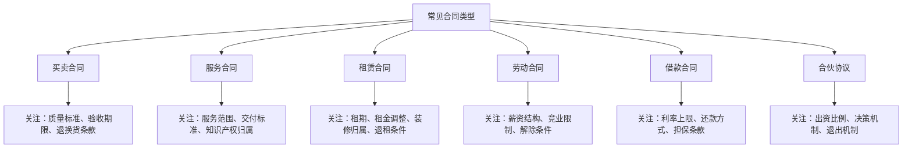
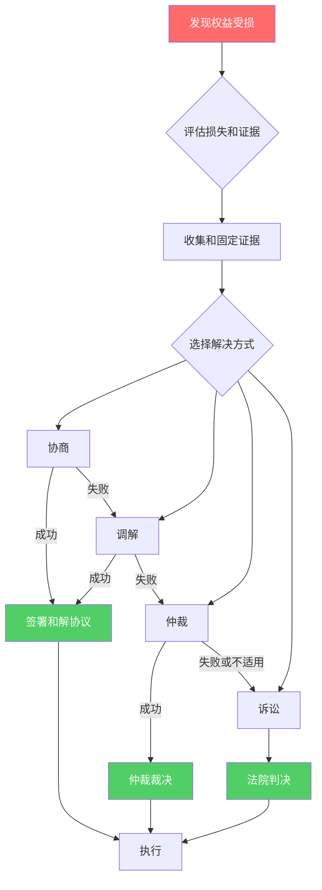
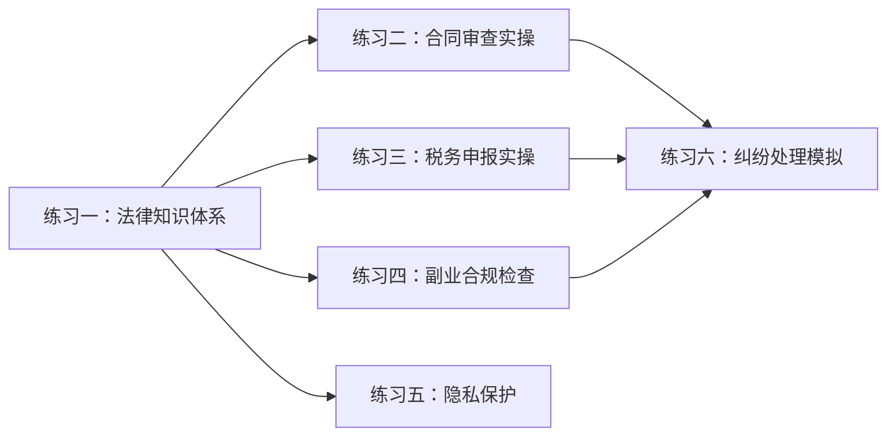

# 第15章 法律与合规——练习方法

法律合规能力不是"知道就行"的知识，而是需要反复实操才能内化的技能。本章设计了六个渐进式练习，从基础法律认知到实际纠纷处理，每个练习都包含完整的操作流程、真实场景模拟和可复用的工具模板。按照3周计划执行完毕后，你将具备独立处理日常法律合规事务的能力。

> 练习设计原则：**先学规则（知道红线在哪）→ 再练操作（会用工具）→ 最后实战（能在真实场景中做出正确判断）**。

---

## 练习一：法律知识体系构建

### 为什么这个练习排第一

很多搞钱的人栽跟头，不是因为能力不够，而是因为踩了法律红线自己却不知道。非法经营、偷税漏税、侵犯知识产权——这些不是"大公司才需要注意的事"，个体户、自由职业者、副业打工人同样会中招。这个练习帮你建立完整的法律知识框架，知道哪些事能做、哪些事碰不得。

### 第1天：创业主体法律

**学习目标**：搞清楚"以什么身份搞钱"这个根本问题。

**核心知识点**：

| 主体类型 | 注册成本 | 税负水平 | 责任范围 | 适合场景 |
|----------|----------|----------|----------|----------|
| 个体工商户 | 0元（免费注册） | 核定征收，综合税负约3-5% | 无限连带责任 | 小规模经营、网店、自媒体 |
| 个人独资企业 | 0-500元 | 可核定征收，综合税负约3-8% | 无限连带责任 | 咨询服务、工作室 |
| 有限责任公司 | 注册资金认缴 | 企业所得税25%+分红20% | 以出资额为限 | 需要融资、多人合伙 |
| 合伙企业 | 0-500元 | 穿透纳税，按合伙人税率 | 普通合伙人无限责任 | 投资基金、专业服务 |
| 股份有限公司 | 较高 | 企业所得税25%+分红20% | 以持股为限 | 规模化经营、上市 |

**实操步骤**：

1. 打开"国家企业信用信息公示系统"（gsxt.gov.cn），搜索你所在行业的3-5家小型企业，查看它们的注册类型、注册资本、经营范围
2. 登录当地市场监督管理局官网，查看个体户和有限公司的注册流程差异
3. 列出你的业务模式，判断适合哪种主体类型

**关键法律条文**：
- 《公司法》第23-25条：有限责任公司设立条件
- 《个体工商户条例》第2-4条：个体户注册要求
- 《市场主体登记管理条例》：统一登记制度

**常见误区**：

> 误区："注册资金写越高越显得有实力"
> 真相：认缴制下注册资金不代表实际出资，但股东以认缴出资额为限承担责任。注册资金写1000万，公司欠债时你最多要承担1000万的出资义务。根据业务规模合理设定，一般小微企业10-100万足够。

> 误区："不注册公司就不用交税"
> 真相：个人收入超过起征点同样要缴纳个人所得税。电商、自媒体、自由职业的收入都属于应税所得。年收入超过一定金额还可能被税务系统自动标记。

### 第2天：合同法律

**学习目标**：掌握合同的核心要素，能看懂合同里的"坑"。

**合同的六大必备要素**（缺任何一个都可能导致合同无效或执行困难）：

1. **当事人信息**：全称、身份证号/统一社会信用代码、地址、联系方式
2. **标的**：要交易的东西或服务是什么，必须具体明确
3. **数量和质量**：多少、什么标准、怎么验收
4. **价款和报酬**：多少钱、怎么付、什么时候付
5. **履行期限和方式**：什么时候交、怎么交、在哪交
6. **违约责任**：谁违约了怎么赔、赔多少

**常见合同类型及其关键条款**：



**实操步骤**：

1. 从网上下载一份标准的服务合同模板（如法律服务合同、软件开发合同）
2. 对照六大要素逐一检查，标记缺失或模糊的条款
3. 用红笔标出所有"甲方有权……"但"乙方应……"的不对等条款
4. 搜索"合同纠纷"相关裁判文书（wenshu.court.gov.cn），看看真实案例中哪些条款最容易产生争议

**关键法律条文**：
- 《民法典》合同编（第463-988条）：合同的基本规则
- 《民法典》第496条：格式条款的提示说明义务
- 《民法典》第506条：合同中无效的免责条款

### 第3天：知识产权

**学习目标**：搞清楚你的创意、作品、品牌怎么保护，以及怎么避免侵犯别人的知识产权。

**知识产权保护体系全景**：

| 保护对象 | 保护方式 | 申请机构 | 保护期限 | 费用（大致） |
|----------|----------|----------|----------|------------|
| 品牌名称/Logo | 商标注册 | 国家知识产权局商标局 | 10年（可续展） | 官费270元/类 |
| 技术方案 | 发明专利 | 国家知识产权局 | 20年 | 官费+代理约5000-15000元 |
| 产品外观 | 外观设计专利 | 国家知识产权局 | 15年 | 官费+代理约1000-3000元 |
| 软件代码 | 软件著作权登记 | 中国版权保护中心 | 自然人终生+50年 | 免费（自行申请） |
| 文章/图片/视频 | 自动获得著作权（登记加强保护） | 中国版权保护中心 | 自然人终生+50年 | 登记约300元 |

**实操步骤**：

1. 访问"中国商标网"（sbj.cnipa.gov.cn），搜索你正在使用或打算使用的品牌名称，查看是否已被注册
2. 访问"中国版权保护中心"（ccopyright.com.cn），了解软件著作权登记流程
3. 如果你有原创作品，立刻做一件事：在作品上标注©+年份+你的名字（如 ©2026 张三），虽然著作权自动产生，但标注能起到公示和威慑作用
4. 如果你有技术方案，访问"佰腾网"（baiten.cn）做一次专利检索，看看你的方案是否已被他人申请

**关键法律条文**：
- 《商标法》第31条：申请在先原则
- 《专利法》第22条：授予专利权的条件（新颖性、创造性、实用性）
- 《著作权法》第2条：著作权自动取得

**常见误区**：

> 误区："公司注册了商标就不会被抢注"
> 真相：商标分45个类别，你只注册了第35类（广告销售），别人可以在第9类（软件）抢注同名商标。核心品牌建议做多类别防御性注册。

> 误区："我在公司做的东西，著作权是我的"
> 真相：职务作品的著作权归属要看具体情况。《著作权法》第18条规定，主要利用单位物质技术条件创作的作品，著作权归单位。自由职业者要注意合同中的知识产权归属条款。

### 第4天：税务法律

**学习目标**：理解个人所得税的核心机制，掌握合法节税的基本方法。

**个人所得税税率表（综合所得，2024年适用）**：

| 级数 | 全年应纳税所得额 | 税率 | 速算扣除数 |
|------|-----------------|------|-----------|
| 1 | 不超过36,000元 | 3% | 0 |
| 2 | 36,000-144,000元 | 10% | 2,520 |
| 3 | 144,000-300,000元 | 20% | 16,920 |
| 4 | 300,000-420,000元 | 25% | 31,920 |
| 5 | 420,000-660,000元 | 30% | 52,920 |
| 6 | 660,000-960,000元 | 35% | 85,920 |
| 7 | 超过960,000元 | 45% | 181,920 |

> 应纳税所得额 = 年收入 - 60,000元（基本减除）- 专项扣除（五险一金）- 专项附加扣除 - 其他扣除

**七项专项附加扣除详解**：

| 扣除项目 | 扣除标准 | 扣除方式 | 需要的材料 |
|----------|----------|----------|-----------|
| 子女教育 | 2,000元/月/孩 | 父母各50%或一方100% | 学籍信息 |
| 继续教育 | 学历400元/月；职业资格3,600元/年 | 本人扣除 | 在学证明/证书 |
| 大病医疗 | 超15,000部分，最高80,000元/年 | 年度汇算时扣除 | 医保报销后自付部分 |
| 住房贷款利息 | 1,000元/月 | 最长240个月，首套房 | 贷款合同 |
| 住房租金 | 800-1,500元/月 | 按城市级别 | 租房合同 |
| 赡养老人 | 3,000元/月 | 独生子女全额；非独生分摊 | 老人身份信息 |
| 3岁以下婴幼儿照护 | 2,000元/月/孩 | 父母各50%或一方100% | 出生证明 |

**合法节税策略**：

1. **充分利用专项附加扣除**：很多人不知道自己符合条件。例如继续教育扣除不仅限于学历教育，取得职业资格证书（如CPA、法律职业资格）当年可扣除3,600元
2. **合理选择计税方式**：年终奖可以选择单独计税或并入综合所得，两种方式税额可能差几千甚至上万元。在个税APP中两种方式都试算一下，选税额低的
3. **商业健康保险扣除**：购买符合规定的商业健康保险，每年可扣除2,400元
4. **个人养老金扣除**：每年缴纳个人养老金最高12,000元可在税前扣除

**实操步骤**：

1. 下载"个人所得税"APP（国家税务总局出品），注册并登录
2. 进入"综合所得年度汇算"，查看你上一年的收入明细和已缴税款
3. 逐一检查七项专项附加扣除，看是否有遗漏未填报的项目
4. 如果有年终奖，分别选择"单独计税"和"合并计税"，对比税额差异

### 第5天：劳动法律

**学习目标**：搞清楚作为劳动者有哪些权利，以及做副业时的法律边界。

**劳动合同核心条款审查要点**：

| 条款 | 合法要求 | 常见违规情况 | 应对策略 |
|------|----------|-------------|---------|
| 试用期 | 合同期1年→试用期≤2个月；3年→≤6个月 | 试用期过长、重复约定试用期 | 对照《劳动合同法》第19条逐项核对 |
| 薪资 | 试用期工资≥约定工资80%，且≥当地最低工资 | 试用期工资过低、随意克扣 | 保留offer和工资条作为证据 |
| 竞业限制 | 期限≤2年，需支付补偿金（≥月均工资30%） | 不给补偿金却要求遵守竞业限制 | 未支付补偿金超过3个月可请求解除 |
| 违约金 | 仅限培训服务期和竞业限制两种情况 | 随意设定违约金条款 | 其他情形下的违约金条款无效 |

**副业合规的关键法律问题**：

1. **劳动合同约定**：很多公司劳动合同中有"不得兼职"条款，但根据《劳动合同法》第39条，只有在兼职"严重影响本职工作"或"经用人单位提出拒不改正"时，用人单位才能解除合同
2. **竞业限制**：如果你签了竞业限制协议，副业不能在限制范围内（竞争对手公司、相同业务领域），否则可能面临高额赔偿
3. **知识产权归属**：很多公司的规章制度规定"员工在职期间的所有发明创造归公司所有"。如果你用个人时间做副业，要确保没有使用公司的设备、资料、商业秘密
4. **税务处理**：副业收入需要申报纳税。如果金额较大，建议注册个体户，可以通过核定征收降低税负

**实操步骤**：

1. 找出你的劳动合同，逐条阅读以下条款：工作时间、兼职限制、竞业限制、知识产权归属、违约责任
2. 如果有竞业限制条款，计算补偿金标准（离职前12个月平均工资的30%），评估限制范围是否合理
3. 用"企查查"或"天眼查"搜索你所在公司的经营范围，明确哪些领域属于竞业限制范围
4. 列出你的副业清单，逐一评估合规风险

### 学习资源

**权威法律数据库**：
- 国家法律法规数据库（flk.npc.gov.cn）：全国人大出品，法律法规全文检索
- 中国裁判文书网（wenshu.court.gov.cn）：真实判决书，搜索关键词+纠纷类型可找到大量案例
- 国家企业信用信息公示系统（gsxt.gov.cn）：查询企业注册信息、行政处罚、经营异常
- 中国商标网（sbj.cnipa.gov.cn）：商标查询和检索

**推荐书籍**（按需选读）：
- 《创业公司法律实务》——针对初创企业的法律风险全指南
- 《劳动合同法实务操作》——HR和员工都该读的劳动法手册
- 《企业知识产权保护实务》——商标、专利、著作权的实操指南
- 《税务筹划实务》——合法节税的系统方法

**免费学习渠道**：
- "中国普法"微信公众号：每天推送法律知识，通俗易懂
- "国家税务总局"微信公众号：税务政策解读和操作指南
- B站搜索"法律科普"：大量律师的免费普法视频

### 成功标准

- [ ] 能说清楚五种企业主体的区别和适用场景
- [ ] 能看懂合同的六大必备要素并识别常见风险条款
- [ ] 能区分商标、专利、著作权的保护范围和申请流程
- [ ] 能计算自己的个人所得税并申报专项附加扣除
- [ ] 能评估自己副业的法律合规风险

---

## 练习二：合同审查实操

### 为什么需要学会审合同

合同是你和交易对手之间的"法律游戏规则"。签之前不看清，出问题时只能认栽。这个练习通过一份完整的合同审查实操，让你掌握合同审查的核心方法论，以后签任何合同都能用上。

### 第1天：建立审查框架

**收集合同样本**：

选择一份你日常最可能遇到的合同类型进行实操。推荐优先级：

1. **劳动合同**（每个打工人都签过，最容易找到）
2. **租房合同**（北上广深几乎人人都签）
3. **服务外包合同**（自由职业者/副业常见）
4. **电商供货合同**（做电商的人必备）

**下载合同模板的渠道**：
- 国家市场监督管理总局官网（标准合同示范文本）
- 各地住建委官网（标准租房合同）
- 法律服务平台如"法大大"、"e签宝"提供的模板

**制作审查清单**（后续步骤通用）：

```text
合同审查清单 v1.0
═══════════════════════════════════════════

一、主体审查
├── [ ] 甲方信息完整（名称/身份证号/地址/联系方式）
├── [ ] 乙方信息完整
├── [ ] 对方是否有签约资格（营业执照/授权书）
├── [ ] 签约代表是否有授权（法人亲自签或有授权委托书）
└── [ ] 对方信用查询（企查查/天眼查/国家企业信用公示系统）

二、标的条款
├── [ ] 标的描述是否具体明确（不能是"相关服务"这种模糊表述）
├── [ ] 数量/规格/质量标准是否量化
└── [ ] 验收标准和流程是否写明

三、价款条款
├── [ ] 总价是否明确
├── [ ] 付款方式和时间节点是否清晰
├── [ ] 发票类型和税率是否约定
├── [ ] 是否有隐性费用（服务费、管理费、违约金之外的费用）
└── [ ] 价格调整机制是否合理

四、履行条款
├── [ ] 履行期限是否明确
├── [ ] 履行方式和地点是否约定
├── [ ] 分期履行的里程碑和交付物是否清晰
└── [ ] 不可抗力条款是否合理

五、违约条款
├── [ ] 违约情形是否列举完整
├── [ ] 违约金比例是否合理（一般不超过合同总额30%）
├── [ ] 赔偿范围是否明确（直接损失/间接损失/可得利益损失）
├── [ ] 解除权条件是否对等
└── [ ] 是否有单方面有利的免责条款

六、争议解决
├── [ ] 约定的管辖法院/仲裁机构是否对自己有利
├── [ ] 是否有协商前置条款
└── [ ] 送达地址条款（防止对方"失联"）

七、其他
├── [ ] 合同份数和持有方式
├── [ ] 附件是否齐全且与正文一致
├── [ ] 签章是否完整（公章+法定代表人签字）
└── [ ] 合同生效条件是否明确
```

### 第2天：主体审查实操

**审查重点**：签约对方是谁？有没有资格跟你签这个合同？

**操作流程**：

1. **核实对方身份**：
   - 如果对方是企业：在企查查/天眼查输入公司全称，核对统一社会信用代码是否与合同一致
   - 如果对方是个人：核对身份证号码，要求提供身份证复印件

2. **查询经营状态**：
   - 在国家企业信用信息公示系统查询对方是否有行政处罚、经营异常、严重违法记录
   - 在中国执行信息公开网（zxgk.court.gov.cn）查询对方是否是失信被执行人（老赖）
   - 在中国裁判文书网搜索对方公司名称，看有没有大量合同纠纷案件

3. **确认签约代表权限**：
   - 法定代表人可以直接签字
   - 非法定代表人签字必须有授权委托书，且委托书上的授权范围要覆盖本次签约事项
   - 委托书要注意有效期和授权范围

**风险预警信号**：
- 对方要求用个人账户收款而非对公账户
- 对方拒绝提供营业执照副本
- 对方急于让你签字，不给你时间审阅
- 合同上的公司名称和公章不一致
- 对方公司成立时间很短或注册资本很低

### 第3天：条款审查实操

**标的条款审查**：

反面案例（模糊写法）：
> "甲方为乙方提供相关技术服务。"

正面写法（具体明确）：
> "甲方为乙方提供微信小程序开发服务，具体包括：用户端小程序开发（含首页、商品列表、商品详情、购物车、订单、个人中心共6个页面）、管理后台开发（含商品管理、订单管理、用户管理、数据统计共4个模块）、以及部署上线后的30天免费Bug修复服务。验收标准：各页面在iOS 14+和Android 10+设备上功能正常、加载时间不超过3秒、无P0级Bug。"

**价款条款审查**：

注意这些陷阱：
- "管理费""服务费""平台使用费"等隐性费用，这些费用加起来可能占总价的10-30%
- "根据实际情况调整价格"——没有上限的调价条款等于没有约定价格
- "预付款不退"——需要看具体情况，如果对方违约导致合同无法履行，预付款应当退还

**违约条款审查**：

关键原则：违约条款要对等。如果合同只约定了你的违约责任而没有约定对方的违约责任，这是不公平的。

违约金合理范围参考：
- 逾期付款：日万分之三至万分之五
- 逾期交货：日万分之三至万分之五
- 整体违约：合同总额的10%-30%
- 超过30%的违约金，法院有权调低

### 第4天：风险识别实操

**格式条款中的常见陷阱**（《民法典》第496条要求提供格式条款的一方必须提示说明）：

| 陷阱类型 | 典型表述 | 风险等级 | 应对方法 |
|----------|----------|---------|---------|
| 单方变更权 | "甲方有权随时修改本合同条款" | 高 | 要求增加"修改需书面通知乙方并经乙方同意" |
| 排除对方主要权利 | "乙方不得以任何理由要求退款" | 高 | 该条款可能无效，但仍要协商修改 |
| 加重对方责任 | "乙方对任何损失承担无限责任" | 高 | 要求限定赔偿上限 |
| 管辖条款有利己方 | "由甲方所在地法院管辖" | 中 | 协商改为"被告所在地"或"合同履行地" |
| 自动续约 | "到期自动续约，乙方未提前30天书面通知则视为同意" | 中 | 改为需要双方书面确认 |
| 送达条款 | "甲方以电子邮件发送即视为送达" | 中 | 增加多种送达方式确认 |

**实操练习**：

拿到合同后，用三种颜色的笔标注：
- 绿色：对己方有利或公平的条款
- 黄色：模糊或需要进一步明确的条款
- 红色：对己方不利或存在风险的条款

统计红黄绿的比例。如果红色条款超过30%，这份合同需要重点谈判。

### 第5天：修改建议和谈判要点

**修改建议的撰写规范**：

不要只说"这条不公平"，要给出具体修改方案：

```text
原条款：
"甲方不承担因乙方使用产品而产生的任何损失。"

修改建议：
"因产品本身质量问题导致乙方直接经济损失的，甲方应承担赔偿责任，
赔偿上限不超过该产品合同金额的100%。因乙方使用不当或第三方原因
导致的损失，甲方不承担责任。"

修改理由：
1. 原条款属于格式条款中排除己方主要义务的条款，根据《民法典》
   第497条可能被认定为无效
2. 修改后的条款既保障了乙方的合理权益，又限定了甲方的赔偿上限，
   双方利益均衡
```

**谈判策略**：

1. 优先级排序：把红色条款按风险从高到低排列，谈判时先解决高风险条款
2. 准备替代方案：每个修改建议至少准备一个备选方案，谈判时灵活应对
3. 引用法律依据：修改建议要引用具体法条，增加说服力
4. 书面记录：谈判结果要以书面形式（邮件/补充协议）确认，口头承诺不算数

### 成功标准

- [ ] 独立完成一份合同的全流程审查
- [ ] 使用审查清单覆盖所有关键条款
- [ ] 至少识别出3个风险条款并给出修改建议
- [ ] 撰写一份完整的合同审查报告

---

## 练习三：税务申报实操

### 为什么要做这个练习

每年3-6月是个人所得税年度汇算期，大多数人要么不知道可以退税，要么操作失误多交了税。这个练习带你走完整个流程，确保不多交一分钱也不少报一分钱。

### 第1天：环境准备和信息核对

**操作步骤**：

1. 在应用商店搜索"个人所得税"下载官方APP（开发者：国家税务总局）
2. 注册账号（支持人脸识别注册，最便捷）
3. 登录后进入"个人中心"→"个人信息"，核对以下信息：
   - 姓名、身份证号是否正确
   - 联系方式是否是最新
   - 银行卡信息是否绑定（退税需要）
4. 进入"收入纳税明细查询"，选择上一年度，查看所有收入记录
   - 工资薪金所得
   - 劳务报酬所得
   - 稿酬所得
   - 特许权使用费所得
5. 逐笔核对收入是否与实际一致。如果有不认识的收入来源（可能是身份信息被盗用），立即申诉

**常见问题处理**：
- 收入信息有误：在APP中点击该笔收入→申诉→选择申诉原因→提交
- 发现"被就业"：说明身份信息被盗用，选择"从未在该单位任职"申诉
- 查不到收入：可能是发放单位未代扣代缴，联系发放单位确认

### 第2天：专项附加扣除填报

**逐一排查七项扣除**：

**子女教育**：
- 条件：子女年满3岁至博士研究生毕业
- 操作：APP→专项附加扣除填报→选择扣除年度→填写子女信息和教育阶段
- 注意：父母双方可约定扣除比例，建议收入高的一方多扣（适用税率高，节税效果更明显）

**继续教育**：
- 学历继续教育：在学期间每月400元，最长48个月
- 职业资格继续教育：取得证书当年一次性扣除3,600元
- 操作：填写教育类型、入学/毕业时间、证书编号

**大病医疗**：
- 条件：医保目录范围内自付部分累计超过15,000元
- 扣除限额：80,000元/年
- 注意：只能在年度汇算时扣除，不能在每月预扣时扣除。可在"国家医保服务平台"APP查询年度自付金额

**住房贷款利息**：
- 条件：首套住房贷款，还款期间每月1,000元，最长240个月
- 注意：首套房的认定标准是"享受首套房贷利率"，不是"只有一套房"。查看贷款合同中的利率条款确认

**住房租金**：
- 按城市级别：直辖市/省会/计划单列市1,500元/月；其他城市1,100元/月或800元/月
- 注意：不能与住房贷款利息同时享受。如果有房贷但在外地租房工作，选择金额高的那个

**赡养老人**：
- 条件：父母年满60岁（含岳父母/公婆）
- 标准：独生子女每月3,000元；非独生子女分摊，每人不超过1,500元
- 注意：被赡养人不需要有赡养支出的发票或凭证

**3岁以下婴幼儿照护**：
- 标准：每个婴幼儿每月2,000元
- 操作：选择婴幼儿出生日期、扣除比例

### 第3天：年度汇算操作

**操作流程**：

1. 进入APP首页→"综合所得年度汇算"
2. 选择汇算年度
3. 确认填报方式：
   - **我需要申报表预填服务**（推荐）：系统自动导入你的收入和扣除数据
   - **我要填报空白申报表**：适用于有境外收入等特殊情况
4. 核对收入数据：
   - 工资薪金：查看每笔是否正确
   - 劳务报酬：自媒体收入、兼职收入通常在这里
   - 稿酬所得：写稿、出版的收入
   - 特许权使用费：专利许可、版权授权的收入
5. 核对扣除数据：
   - 基本减除费用：60,000元（自动计算）
   - 专项扣除：五险一金（自动导入）
   - 专项附加扣除：你填报的七项扣除
   - 其他扣除：商业健康保险、个人养老金等
6. 计算应纳税额

**年终奖计税方式选择**：

这是最容易多交或少交税的环节。系统会提示你选择年终奖的计税方式：

- **单独计税**：年终奖单独按月度税率表计算，适合年终奖金额较大、月薪较低的情况
- **并入综合所得**：年终奖和其他收入合并计算，适合综合所得较低的情况

**操作建议**：两种方式都选一下，看哪种算出来的应纳税额更低，选择金额低的那个。

### 第4天：退税或补税

**退税流程**：

1. 确认应退税额和退税银行卡
2. 提交申报
3. 等待税务机关审核（一般3-15个工作日）
4. 退税到账

**补税流程**：

1. 确认应补税额
2. 选择支付方式（银联、支付宝、微信）
3. 在6月30日前完成补税
4. 超过6月30日未补税，每日加收万分之五的滞纳金

**需要补税但可以豁免的情况**：

根据政策，年度综合所得收入不超过12万元或补税金额不超过400元的，可免于办理汇算。但前提是你平时已经依法预缴了税款。

### 第5天：留存记录和后续管理

**需要留存的资料**（保存期限建议5年）：

- 专项附加扣除相关证明材料（子女学籍、租房合同、贷款合同等）
- 收入证明和完税证明
- 年度汇算申报记录（APP中可下载PDF）

**日常税务管理建议**：

1. 每月初检查上月收入是否已正确申报
2. 每季度核对一次专项附加扣除信息是否需要更新
3. 年底前检查是否有新增扣除项目未填报
4. 保留所有收入相关的合同、发票、银行流水

### 成功标准

- [ ] 在个税APP中完成个人信息核对
- [ ] 填报所有符合条件的专项附加扣除
- [ ] 完成年度汇算申报
- [ ] 成功办理退税或补税
- [ ] 建立个人税务档案，保存相关凭证

---

## 练习四：副业合规性检查

### 为什么做副业前必须做合规检查

副业翻车最常见的三个原因：被公司发现并辞退、侵犯公司知识产权被起诉、税务问题被查处。这个练习帮你系统评估副业的法律风险，在开始做之前就把雷排掉。

### 第1天：劳动合同全面审查

**审查你的劳动合同的以下关键条款**：

1. **工作时间和加班条款**：
   - 标准工时制：每天8小时、每周40小时。副业只能在工作时间之外
   - 不定时工作制：理论上没有固定工作时间，但副业仍不能影响本职工作
   - 综合计算工时制：以周期计算总工时，副业时间安排要更灵活

2. **兼职限制条款**：
   - "不得兼职"条款：大多数公司的标准条款，但法律上不是绝对禁止
   - "不得从事与公司业务相同或相似的工作"：限制范围更窄，只限竞争性业务
   - "经公司书面同意后方可兼职"：最严格，需要提前报备

3. **知识产权归属条款**：
   - "在职期间的所有发明创造归公司所有"：范围非常广
   - "利用公司资源完成的成果归公司所有"：范围较合理
   - "与公司业务相关的发明创造归公司所有"：范围最窄

**操作步骤**：

1. 拿出你的劳动合同和员工手册，用荧光笔标出上述三类条款
2. 如果条款表述模糊，向HR咨询具体的执行口径（建议邮件沟通，保留书面记录）
3. 如果有竞业限制条款，计算限制期限和补偿金金额

### 第2天：竞业限制深度分析

**竞业限制的法律规则**（《劳动合同法》第23-24条）：

| 要素 | 法律规定 | 实际操作要点 |
|------|----------|-------------|
| 适用人员 | 高级管理人员、高级技术人员、其他负有保密义务的人员 | 普通员工签了也可能无效 |
| 限制期限 | 离职后不超过2年 | 超过2年的部分无效 |
| 经济补偿 | 法定标准：月均工资的30%，且不低于当地最低工资 | 不给补偿金的竞业限制可以不遵守（超过3个月未支付可解除） |
| 违约金 | 双方约定 | 过高可请求法院调低 |
| 限制范围 | 地域、行业、具体企业 | 范围过宽可请求法院限缩 |

**评估你的副业是否违反竞业限制**：

1. 列出竞业限制协议中限制的具体企业名单和业务范围
2. 确认你的副业是否与限制范围重叠
3. 如果有重叠，评估重叠程度（完全相同 vs 部分相关）
4. 咨询律师评估风险等级

**风险等级判断**：
- 低风险：副业领域与主业完全不同，不在竞业限制范围内
- 中风险：副业领域与主业有部分关联，但核心业务不同
- 高风险：副业直接竞争对手或同一业务领域

### 第3天：知识产权归属排查

**核心原则**：你的副业成果不能跟公司沾边。

**排查清单**：

| 检查项 | 合规 | 风险 | 处理方法 |
|--------|------|------|---------|
| 是否使用了公司电脑/手机 | 使用个人设备 | 使用公司设备 | 立即更换为个人设备 |
| 是否使用了公司网络 | 使用个人网络 | 使用公司WiFi/VPN | 副业相关操作使用手机热点 |
| 是否使用了公司软件/工具 | 使用个人购买的软件 | 使用公司license | 自行购买或使用开源替代 |
| 是否使用了公司数据/资料 | 完全原创 | 使用了公司客户名单/技术文档 | 立即删除，重新开始 |
| 是否在工作时间做副业 | 仅在休息时间 | 占用工作时间 | 严格限制在下班后和周末 |
| 副业内容是否与公司业务相关 | 完全不同的领域 | 相同或相似领域 | 评估是否需要向公司报备 |

**高危场景举例**：

场景1：你在A公司做后端开发，业余时间帮朋友的B公司写了一个后台管理系统。如果A公司的合同有"在职期间开发的所有软件著作权归公司所有"条款，这个系统的著作权可能属于A公司。

场景2：你在电商公司做运营，业余时间开了一个同类产品的网店。虽然产品不同，但如果使用了公司的供应链资源、客户数据或供应商信息，就可能构成侵犯商业秘密。

### 第4天：时间管理和精力分配

**合规的时间安排原则**：

1. **绝对红线**：不使用工作时间做副业（包括午休时间，除非公司明确允许）
2. **设备隔离**：副业用个人设备和个人网络，物理上与公司设备分开
3. **精力管理**：确保副业不影响本职工作质量。如果因为副业导致工作表现下降，公司可以"严重影响本职工作"为由解除合同
4. **公开透明**：如果公司有报备制度，建议主动报备，隐瞒反而增加风险

**时间分配建议**：

| 时间段 | 可用于副业 | 注意事项 |
|--------|-----------|---------|
| 工作日上班时间 | ❌ 绝对不行 | 午休时间也不建议 |
| 工作日晚上（下班后） | ✅ 可以 | 确保不影响第二天工作状态 |
| 周末 | ✅ 可以 | 最集中的副业时间 |
| 法定节假日 | ✅ 可以 | 注意不要使用公司设备 |
| 年假 | ✅ 可以 | 完全自由支配 |

### 第5天：综合风险评估报告

**撰写你的副业合规报告**：

```text
副业合规风险评估报告
═══════════════════════════════════════════

一、副业基本信息
├── 副业类型：
├── 预计月收入：
├── 所需时间：
└── 涉及领域：

二、劳动合同合规评估
├── 兼职限制条款：有/无
├── 条款内容：
├── 合规结论：合规/需报备/违规
└── 风险等级：低/中/高

三、竞业限制评估
├── 是否签订竞业限制：是/否
├── 限制范围：
├── 副业是否在范围内：是/否
└── 风险等级：低/中/高

四、知识产权评估
├── 是否使用公司设备：是/否
├── 是否使用公司资料：是/否
├── 副业成果是否与公司业务相关：是/否
└── 风险等级：低/中/高

五、税务评估
├── 副业收入类型：
├── 预计年收入：
├── 需要的纳税申报：
└── 建议的主体形式：

六、综合结论
├── 整体风险等级：低/中/高
├── 主要风险点：
├── 风险缓解措施：
└── 是否建议开展：建议/有条件建议/不建议
```

### 成功标准

- [ ] 完成劳动合同条款审查，识别所有限制性条款
- [ ] 完成竞业限制评估，明确副业是否在限制范围内
- [ ] 完成知识产权排查，确保副业成果不会被公司主张权利
- [ ] 制定合规的时间管理和设备隔离方案
- [ ] 撰写完整的副业合规风险评估报告

---

## 练习五：个人数据与隐私保护

### 为什么隐私保护是搞钱者的基本功

你的个人信息就是你的数字资产。信息泄露不仅带来骚扰电话，还可能导致：银行卡被盗刷、身份被冒用注册公司或贷款、社交账号被盗用进行诈骗、个人名誉受损。做副业、做生意的人尤其需要保护好个人信息，因为你的手机号、邮箱、地址往往会在合同、发票、工商注册等场景中被关联到。

### 第1天：密码安全体系搭建

**密码安全等级自测**：

| 检查项 | 安全 | 危险 |
|--------|------|------|
| 密码长度 | ≥12位 | <8位 |
| 密码复杂度 | 大小写+数字+特殊字符 | 纯数字或纯字母 |
| 密码复用 | 每个重要账户不同密码 | 多个账户共用同一密码 |
| 密码存储 | 使用密码管理器 | 浏览器记住密码或写在纸上 |
| 密码更换 | 定期更换（至少每年） | 从创建起从未更换 |

**密码管理器推荐和使用**：

| 工具 | 价格 | 特点 | 适合人群 |
|------|------|------|---------|
| Bitwarden | 免费/付费$10/年 | 开源，跨平台，支持自建 | 技术用户、注重隐私 |
| 1Password | $36/年 | 体验最好，团队功能强 | 苹果生态用户 |
| KeePassXC | 免费开源 | 本地存储，不依赖云端 | 极度注重安全 |
| Chrome密码管理 | 免费 | 浏览器内置，方便 | 安全要求不高 |

**操作步骤**：

1. 选择并安装一个密码管理器
2. 导出浏览器中已保存的密码，导入密码管理器
3. 逐一修改以下高优先级账户的密码：
   - 邮箱（所有账号的密码重置入口）
   - 银行/支付宝/微信支付
   - 主要社交账号
   - 工作相关账号
4. 为每个账户生成随机的强密码（密码管理器自动生成）
5. 删除浏览器中保存的密码，关闭自动保存密码功能

**强密码标准**：
- 至少12位，推荐16位以上
- 包含大小写字母、数字、特殊字符
- 不包含个人信息（生日、手机号、姓名拼音）
- 不使用常见密码（123456、password、qwerty等）
- 不使用字典单词

### 第2天：双重验证（2FA）全面开启

**2FA验证方式安全性排序**：

```text
安全性从高到低：
1. 硬件安全密钥（YubiKey）    ★★★★★ — 物理设备，不可远程窃取
2. TOTP验证器（Google/Microsoft Authenticator） ★★★★ — 基于时间的一次性密码
3. 推送验证（微信/支付宝扫码）  ★★★☆ — 依赖手机安全
4. 短信验证码                   ★★☆☆ — 可被SIM卡劫持
5. 邮箱验证码                   ★★☆☆ — 依赖邮箱安全
```

**必须开启2FA的账户清单**：

| 账户类型 | 推荐2FA方式 | 优先级 |
|----------|------------|--------|
| 主邮箱（Gmail/QQ邮箱） | TOTP验证器 | 最高 |
| 微信/支付宝 | APP内置验证+指纹/面容 | 最高 |
| 银行APP | 短信+生物识别 | 最高 |
| 工作邮箱/VPN | 公司要求的方式 | 高 |
| 社交媒体（微博/抖音等） | TOTP或短信 | 中 |
| 云存储（百度网盘/iCloud） | TOTP | 中 |
| 游戏/娱乐平台 | 短信即可 | 低 |

**操作步骤**：

1. 在手机上安装"Microsoft Authenticator"或"Google Authenticator"
2. 按照上述清单，从最高优先级开始，逐一开启2FA
3. 记录每个账户的备用恢复码（Recovery Code），保存在密码管理器的加密笔记中
4. 设置备用验证方式（如备用手机号、备用邮箱）

### 第3天：隐私设置优化

**社交媒体隐私设置**：

微信：
- 设置→隐私→关闭"允许通过手机号搜索到我"
- 设置→隐私→关闭"允许通过QQ号搜索到我"
- 设置→隐私→朋友圈权限→设置"不让他看"的人
- 设置→个人信息与权限→系统权限管理→逐一检查

支付宝：
- 设置→隐私→关闭"通过手机号找到我"
- 设置→隐私→关闭"公开我的真实姓名"
- 设置→支付设置→免密支付/自动扣款→关闭不必要的免密支付

**APP权限管理**：

| 权限类型 | 风险等级 | 管理建议 |
|----------|---------|---------|
| 位置信息 | 高 | 仅在使用时允许，或仅允许模糊位置 |
| 通讯录 | 高 | 非通讯类APP不应授权 |
| 相机/麦克风 | 中 | 按需授权，不用时关闭 |
| 相册/存储 | 中 | 仅允许访问选定照片 |
| 通知 | 低 | 关闭非必要APP的通知 |
| 后台运行 | 低 | 关闭非必要APP的后台运行 |

**浏览器隐私设置**：

1. 安装广告拦截插件（uBlock Origin）
2. 安装隐私保护插件（Privacy Badger）
3. 关闭第三方Cookie
4. 使用隐私模式浏览敏感信息
5. 搜索引擎切换为DuckDuckGo（不追踪搜索历史）

### 第4天：数据备份和加密

**3-2-1备份原则**：
- 3份数据副本
- 2种不同存储介质
- 1份异地备份

**个人数据备份方案**：

| 数据类型 | 备份方式 | 频率 | 加密建议 |
|----------|---------|------|---------|
| 工作文档 | 云盘+移动硬盘 | 每日 | 云盘启用端到端加密或加密压缩 |
| 照片视频 | NAS/iCloud+移动硬盘 | 每周 | 加密压缩后上传 |
| 密码数据 | 密码管理器云端+导出加密文件 | 每月导出 | 导出文件强密码加密 |
| 财务记录 | 加密U盘 | 每季度 | VeraCrypt加密容器 |
| 合同/证件扫描件 | 加密云盘+加密U盘 | 每次更新 | AES-256加密 |

**加密工具推荐**：
- VeraCrypt：创建加密容器，可以把敏感文件放在里面
- 7-Zip：支持AES-256加密压缩，通用性最强
- Cryptomator：云盘加密，在上传前自动加密

### 第5天：建立安全习惯

**日常安全行为规范**：

1. **不点击不明链接**：
   - 收到银行、公安、社保等短信，不要直接点链接，去官方APP确认
   - 警惕"你的账户异常""你的快递丢失"等诱导性信息
   - 短链接（如t.cn/xxx）用浏览器打开前先在VirusTotal检查

2. **公共WiFi安全**：
   - 不在公共WiFi下登录银行、支付宝等敏感账户
   - 必须使用时开启VPN或使用手机热点
   - 关闭手机的"自动连接WiFi"功能

3. **定期安全检查**：
   - 每月检查一次账户登录记录（邮箱、微信、支付宝都有登录设备管理）
   - 每季度清理一次不再使用的APP和网站账号
   - 每年检查一次个人信息是否泄露（在"我泄露了吗"网站 haveibeenpwned.com 查询邮箱）

4. **社交媒体信息最小化**：
   - 不公开真实姓名、手机号、家庭住址
   - 不在朋友圈晒工资条、机票（含身份证号）、录取通知书（含准考证号）
   - 发照片前关闭照片的EXIF信息（包含GPS位置）

### 成功标准

- [ ] 所有重要账户密码已更换为强密码并存储在密码管理器中
- [ ] 所有高优先级账户已开启双重验证
- [ ] 社交媒体和APP权限已优化
- [ ] 重要数据已完成加密备份
- [ ] 建立了日常安全检查习惯

---

## 练习六：法律纠纷处理模拟

### 为什么需要学会处理纠纷

法律纠纷不是"遇到了再想办法"的事。事前不知道流程，遇到时就会手忙脚乱，错过最佳处理时机，甚至做出对自己不利的决定。这个练习通过模拟三个真实场景，让你掌握纠纷处理的完整方法论。

### 第1天：认识常见纠纷类型

**搞钱过程中最可能遇到的纠纷类型**：

| 纠纷类型 | 发生场景 | 常见争议焦点 | 一般处理方式 |
|----------|---------|-------------|-------------|
| 合同纠纷 | 合作方违约、服务不达标 | 违约认定、赔偿金额 | 协商→调解→仲裁/诉讼 |
| 劳动纠纷 | 欠薪、违法解除、工伤 | 经济补偿金、工伤认定 | 劳动仲裁（前置）→诉讼 |
| 知识产权纠纷 | 商标被抢注、作品被抄袭 | 权利归属、侵权认定 | 行政投诉→协商→诉讼 |
| 消费纠纷 | 买到假货、服务欺诈 | 退货退款、三倍赔偿 | 12315投诉→诉讼 |
| 债务纠纷 | 借钱不还、货款拖欠 | 债务金额、还款期限 | 协商→支付令→诉讼 |
| 网络侵权 | 名誉诽谤、隐私泄露 | 侵权认定、精神损害赔偿 | 平台投诉→律师函→诉讼 |

**纠纷处理的基本流程**：



### 第2天：证据收集实操

**证据的法定类型**（《民事诉讼法》第66条）：

| 证据类型 | 包含内容 | 证明力参考 | 收集要点 |
|----------|---------|-----------|---------|
| 书证 | 合同、邮件、聊天记录、收据 | 高 | 保留原件，重要文件公证 |
| 物证 | 问题商品、损坏物品 | 高 | 保持原状，拍照录像 |
| 视听资料 | 录音、录像、监控 | 中-高 | 录音需一方知情（不能窃听） |
| 电子数据 | 微信记录、邮件、网页截图 | 中 | 截图+录屏+公证保全 |
| 证人证言 | 第三方陈述 | 中 | 证人需要出庭 |
| 鉴定意见 | 专业机构的鉴定报告 | 高 | 委托有资质的鉴定机构 |
| 勘验笔录 | 法院现场勘查记录 | 高 | 由法院主导 |

**电子证据保全实操**：

微信聊天记录保全：
1. 截图：截取完整对话，包含时间戳和头像
2. 录屏：从聊天列表进入对话，滚动浏览关键聊天内容，全程录屏
3. 导出：微信电脑版→备份与恢复→备份聊天记录到电脑
4. 公证：对于金额较大的纠纷，建议到公证处做证据保全公证（费用约200-500元/次）

网页证据保全：
1. 使用浏览器的"保存网页"功能，保存为完整网页（.mhtml格式）
2. 使用录屏软件记录浏览过程
3. 使用公证云（zgzfy.cn）等在线公证平台进行网页公证
4. 使用Wayback Machine（web.archive.org）查看网页历史快照

**证据整理方法**：

按照时间线整理证据，形成完整的证据链：
```text
时间线证据清单
═══════════════════════════════════════
2026.01.15 签订合同（证据：合同原件）
2026.01.20 支付首期款（证据：银行转账记录）
2026.02.15 对方承诺的交付日（证据：微信聊天记录）
2026.02.20 催促交付（证据：微信聊天记录+电话录音）
2026.03.01 对方仍未能交付（证据：微信聊天记录）
2026.03.05 发送律师函（证据：律师函+快递单+签收记录）
```

### 第3天：协商解决技巧

**协商的基本策略**：

1. **先礼后兵**：先友好沟通，明确诉求，给对方合理的解决期限
2. **书面为主**：口头协商的结果一定要书面确认（邮件/微信文字）
3. **底线思维**：协商前确定自己的底线——能接受的最低条件是什么
4. **留有余地**：第一次报价可以适当高于底线，给对方讨价还价的空间
5. **记录过程**：所有沟通都保留记录，作为后续可能的诉讼证据

**协商沟通模板**：

邮件/信函模板：
```text
主题：关于[合同编号/事项]的协商沟通

[对方名称]：

我方与贵方于[日期]签订[合同名称]（编号：[编号]），
约定[主要条款]。

现因[具体问题]，导致[具体影响]。根据合同第[X]条约定
/根据《[相关法律]》第[X]条，我方提出以下解决方案：

1. [方案一]
2. [方案二]

请贵方于[日期]前回复。如未能协商解决，我方将通过
法律途径维护合法权益。

此致
[你的名称/公司名称]
[日期]
```

### 第4天：调解/仲裁/诉讼流程

**四种纠纷解决方式对比**：

| 方式 | 成本 | 周期 | 效力 | 适用场景 |
|------|------|------|------|---------|
| 协商 | 0 | 1天-数周 | 和解协议（可公证加强） | 双方有意愿沟通 |
| 调解 | 几百元 | 1-4周 | 调解协议（可司法确认） | 需要第三方介入 |
| 仲裁 | 按标的额比例 | 2-6个月 | 一裁终局，不可上诉 | 合同有仲裁条款 |
| 诉讼 | 诉讼费+律师费 | 3-12个月 | 可上诉 | 最终手段 |

**劳动仲裁流程**（劳动纠纷必经前置程序）：

1. 准备材料：仲裁申请书、身份证复印件、劳动关系证明、证据材料
2. 到当地劳动人事争议仲裁委员会提交申请
3. 仲裁委5日内决定是否受理
4. 开庭审理（双方举证、质证、辩论）
5. 仲裁裁决（一般45日内，延长不超过60日）
6. 不服裁决可在15日内向法院起诉

**诉讼基本流程**：

1. 确定管辖法院：一般是被告所在地或合同履行地
2. 准备起诉材料：起诉状、证据清单及证据材料、身份证明
3. 到法院立案窗口或通过网上立案系统提交
4. 缴纳诉讼费（按标的额比例，1万以下50元，1-10万按2.5%）
5. 等待法院安排开庭
6. 开庭审理
7. 判决（一审普通程序6个月内，简易程序3个月内）
8. 如不服一审判决，15日内上诉

### 第5天：律师咨询实操

**什么情况下需要请律师**：

| 情况 | 是否需要律师 | 原因 |
|------|-------------|------|
| 标的额<5,000元 | 通常不需要 | 律师费可能超过争议金额 |
| 标的额5,000-50,000元 | 视复杂程度 | 可先咨询再决定 |
| 标的额>50,000元 | 建议请律师 | 专业代理能显著提高胜诉率 |
| 涉及刑事风险 | 必须请律师 | 自己处理风险极大 |
| 劳动纠纷 | 可不请 | 仲裁前置，程序相对简单 |
| 知识产权纠纷 | 建议请律师 | 专业性强，证据要求高 |

**如何选择律师**：

1. 通过当地律师协会官网查询律师执业信息
2. 选择有相关领域经验的律师（合同纠纷找合同律师，劳动纠纷找劳动律师）
3. 多咨询几位律师，对比方案和报价
4. 律师费参考标准：
   - 咨询费：200-1,000元/小时
   - 代理费：一般按标的额的5-15%收取
   - 风险代理：胜诉后按赔偿额的10-30%收取

**咨询律师前的准备**：

1. 整理好所有相关材料（合同、聊天记录、转账记录等）
2. 按时间线梳理事件经过
3. 明确你的诉求：想要什么结果？
4. 准备问题清单，确保不遗漏重要问题

**律师咨询问题模板**：

```text
1. 我这个案子的胜诉概率大概多少？
2. 预计需要多长时间？
3. 总费用大概是多少（律师费+诉讼费+其他费用）？
4. 最好的结果是什么？最坏的结果是什么？
5. 有没有其他解决方式（如协商、调解）可以先尝试？
6. 我目前的证据是否充分？还需要补充哪些证据？
7. 有没有诉讼时效的风险？（普通诉讼时效3年）
```

### 场景模拟练习

**场景一：合同纠纷**

> 你找了一家装修公司装修房子，合同约定总价10万元，工期60天。施工到一半时，装修公司要求加价3万元，否则停工。你不同意，装修公司直接撤场。已支付6万元，工程量只完成了约40%。

练习任务：
1. 评估你的损失（已付金额、未完工部分的差价、可能的租房费用等）
2. 收集证据（合同、付款记录、现场照片、沟通记录）
3. 写一封协商信给装修公司
4. 如果协商失败，确定下一步行动方案

**场景二：劳动纠纷**

> 你在一家公司工作了3年，公司突然以"业务调整"为由要求你主动离职，不给任何经济补偿。HR说"主动离职对你以后找工作有好处"。你不想离职，但也不想撕破脸。

练习任务：
1. 分析公司的真实意图（为什么要你主动离职而非辞退？）
2. 了解你能获得的法定经济补偿金是多少
3. 制定应对策略（如何合法保护自己的权益）
4. 模拟与HR的谈判对话

**场景三：知识产权纠纷**

> 你是一个自媒体博主，经营了2年的账号有50万粉丝。发现另一个账号大量搬运你的原创内容，包括文章和视频，且标注为"原创"。对方的粉丝量已经超过10万。

练习任务：
1. 固定对方侵权的证据（截图、录屏、网页公证）
2. 通过平台投诉渠道举报（各平台的投诉流程）
3. 评估是否需要发送律师函
4. 计算可以主张的赔偿金额

### 成功标准

- [ ] 能区分六种常见纠纷类型及其处理方式
- [ ] 掌握电子证据保全的三种方法
- [ ] 能撰写协商沟通信函
- [ ] 了解调解、仲裁、诉讼的流程和区别
- [ ] 完成三个场景模拟的分析和应对方案

---

## 练习总结与进阶路径

### 六个练习的完整路线图



| 顺序 | 练习 | 时间 | 难度 | 核心收获 |
|------|------|------|------|---------|
| 1 | 法律知识体系构建 | 5天 | ★☆☆ | 建立法律认知框架，知道红线在哪 |
| 2 | 合同审查实操 | 5天 | ★★☆ | 掌握合同审查方法论，能独立审合同 |
| 3 | 税务申报实操 | 5天 | ★★☆ | 完成个人所得税全流程，合法节税 |
| 4 | 副业合规性检查 | 5天 | ★★☆ | 评估副业法律风险，制定合规方案 |
| 5 | 隐私保护设置 | 5天 | ★☆☆ | 建立个人信息安全防护体系 |
| 6 | 法律纠纷处理模拟 | 5天 | ★★★ | 掌握纠纷处理全流程，能应对突发情况 |

### 建议执行计划

**第1周（基础建设）**：
- 周一至周五：练习一（法律知识体系构建）
- 周末：练习五（隐私保护设置）——这个可以在碎片时间完成

**第2周（实操能力）**：
- 周一至周五：练习二（合同审查实操）
- 周末：练习三（税务申报实操）

**第3周（综合应用）**：
- 周一至周五：练习四（副业合规性检查）
- 周末：练习六（法律纠纷处理模拟）

### 持续实践计划

法律合规不是一次性的事，需要建立持续的检查和更新机制：

**每月（5分钟）**：
- 检查一次账户安全设置（有没有异常登录）
- 清理不再使用的APP权限
- 更新一次密码管理器

**每季度（30分钟）**：
- 复查副业合规状态（是否影响本职工作、是否违反竞业限制）
- 检查个人信息是否泄露（haveibeenpwned.com查询邮箱）
- 学习最新的税务政策变化（关注国家税务总局公众号）

**每年（半天）**：
- 完成个人所得税年度汇算
- 更新劳动合同和竞业限制的了解
- 审查所有重要合同是否到期或需要续签
- 更新数据备份
- 学习新出台的法律法规（如《个人信息保护法》配套规定）

### 进阶学习路径

当你完成以上六个练习后，可以根据自己的需求进一步深入：

| 方向 | 学习内容 | 推荐资源 |
|------|---------|---------|
| 创业法律 | 公司治理、股权架构、融资法律 | 《创业公司法律实务》《股权之道》 |
| 税务筹划 | 企业税务、跨境税务、税筹方案 | 《税务筹划实务》、税务师考试教材 |
| 知识产权 | 专利布局、商标战略、版权运营 | 知识产权出版社系列丛书 |
| 数据合规 | 个人信息保护、数据跨境、合规审计 | 《数据合规实务》、CISP认证 |
| 争议解决 | 谈判技巧、仲裁实务、诉讼策略 | 《谈判的艺术》《诉讼可视化》 |

> 法律合规能力的终极目标不是"遇到问题能解决"，而是"在问题发生之前就消除隐患"。当你养成了签合同前先审查、做副业前先评估、收款前先报税的习惯，法律就不再是你的风险，而是你的护城河。
