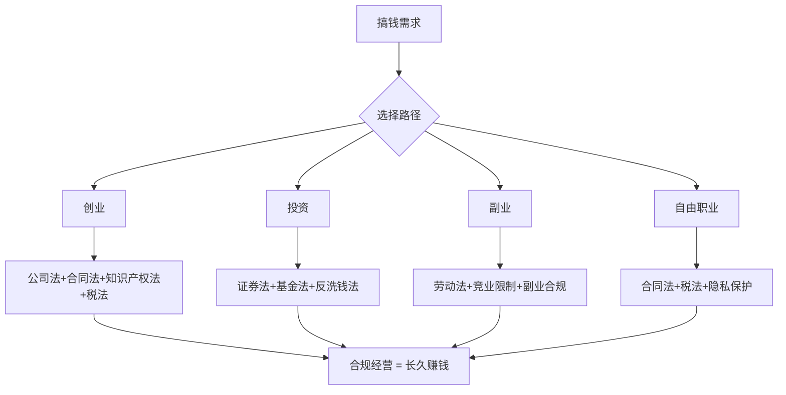
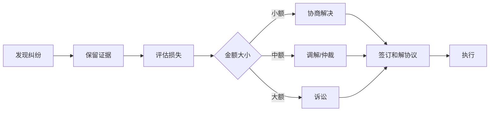

# 第15章 法律与合规——本章小结

本章从理论基础、核心技巧、实战案例三个维度，系统梳理了普通人搞钱路上必须掌握的法律与合规知识。法律不是束缚你的绳索，而是保护你的铠甲。以下是对全章内容的深度回顾、知识体系整合与行动路线图。

## 一、全章知识体系回顾

### 1.1 三层知识架构

本章采用了"道—法—术"的递进结构：

| 层次 | 内容 | 核心价值 |
|------|------|----------|
| **道（理论基础）** | 法律本质、公司法、合同法、知识产权法、税法、劳动法、隐私保护法、投资法律、电商法律、反洗钱法 | 建立法律思维框架，理解"为什么" |
| **法（核心技巧）** | 公司注册实操、合同审查方法、税务申报流程、竞业限制应对、副业合规评估、隐私保护措施、纠纷处理策略、税务筹划、合同风险防范 | 掌握可执行的操作方法，知道"怎么做" |
| **术（实战案例）** | 股权纠纷、合同陷阱、税务稽查、劳动争议、竞业限制、数据泄露、知识产权侵权、电商纠纷、广告违规、个人信息维权 | 从真实场景中吸取教训，明白"踩过什么坑" |

### 1.2 章节逻辑主线

整章围绕一条核心逻辑展开：**搞钱必须在法律框架内进行，合规不是成本而是投资**。

## 二、核心知识点精要

### 2.1 创业法律基础：从注册到经营的法律地图

**公司类型选择的决策逻辑**：

公司类型不是随便选的，它直接决定了你的责任边界、税负水平和融资能力。

| 类型 | 责任范围 | 税负特点 | 融资能力 | 适用场景 |
|------|----------|----------|----------|----------|
| 个体工商户 | 无限责任（个人财产担保） | 核定征收，税负较低 | 极低，无法股权融资 | 小规模试水、个人服务 |
| 个人独资企业 | 无限责任 | 可核定征收 | 低 | 单人小规模经营 |
| 有限责任公司 | 以出资额为限 | 企业所得税25%+个税20%（双重征税） | 高，可引入投资人 | 大多数创业场景 |
| 股份有限公司 | 以持股为限 | 同上 | 最高，可上市 | 规模化经营、准备上市 |
| 合伙企业 | 普通合伙人无限责任，有限合伙人以出资为限 | 穿透征税，无企业所得税 | 中等 | 专业服务、投资基金 |

**关键决策点**：如果你只是副业试水，个体工商户够用；如果要融资、签大客户、保护个人财产，有限责任公司是标配。不要为了省几千块注册费而承担无限责任——一旦出事，个人房子车子都可能被追偿。

**股权结构的三条生命线**：

股权比例不是简单的"分蛋糕"，它决定了公司控制权的归属：

- **67%以上**：绝对控制线。修改公司章程、增减注册资本、合并分立解散等重大事项，需要三分之二以上表决权通过。创始人持股67%以上，意味着对公司拥有绝对话语权。
- **51%以上**：相对控制线。日常经营决策、选举董事监事等过半数即可通过。
- **34%以上**：一票否决线。虽然不能单独通过决议，但可以否决需要三分之二通过的重大事项。

**血泪教训**：很多创业团队在初期因为"兄弟情深"而五五分股，结果在经营理念分歧时陷入僵局，公司无法决策，最终只能散伙清算。50:50是世界上最差的股权结构——谁也说服不了谁，公司陷入瘫痪。

**期权池的预留时机**：在公司估值最低的时候预留期权池（10%-20%），对创始人的股权稀释最小。等到融资前再预留，投资人会要求从创始人份额中扣除，稀释成本翻倍。

### 2.2 合同管理：你的权利义务说明书

**合同审查的四层过滤网**：

第一层——主体审查：签合同的人或公司是否有资格签？营业执照是否在有效期内？法定代表人是否一致？代理人的授权委托书是否齐全？很多纠纷的根源不是条款有问题，而是签合同的主体本身就是假的或者没有授权。

第二层——条款审查：标的是否明确（写清楚具体是什么东西或服务）、数量和质量是否有标准、价款和支付方式是否清晰、履行期限和地点是否确定、违约责任是否对等。特别注意：违约金条款是否双向对等——如果只约束你不约束对方，那就是不平等条约。

第三层——风险审查：有没有"霸王条款"？比如"最终解释权归甲方所有"（这种条款在法律上通常无效，但说明对方在试图占便宜）。有没有隐性的连带责任？有没有不合理的竞业限制？

第四层——争议解决条款审查：约定仲裁还是诉讼？管辖法院在哪里？如果约定在对方所在地法院，你打官司的成本会大幅增加。

**合同管理的黄金法则**：

- **所有口头承诺必须写进合同**。"我们口头说好了"在法律上几乎等于没说。即使口头协议在法律上可以成立，但举证极其困难。
- **保留合同原件和所有往来邮件、微信记录**。电子证据在诉讼中越来越被认可，但原始载体（手机、电脑）中的记录比截图更有证明力。
- **合同变更必须书面确认**。很多人在合同履行过程中达成新的口头约定，事后一方不认账。任何变更，哪怕是一条微信消息的确认，都比什么都没有强。

### 2.3 知识产权：你的无形资产保护罩

**三种核心知识产权的保护策略**：

| 类型 | 保护什么 | 保护条件 | 保护期限 | 注册费用 | 核心策略 |
|------|----------|----------|----------|----------|----------|
| 商标 | 品牌名称、Logo、标语 | 向商标局申请注册 | 10年（可续展） | 300元/类（官费） | 先注册再使用，防御性注册近似商标 |
| 专利 | 发明创造、实用新型、外观设计 | 向专利局申请 | 发明20年，实用新型10年，外观15年 | 发明3450元，实用新型500元 | 技术方案公开换取独占权 |
| 版权 | 文学、艺术、软件代码 | 创作完成自动产生 | 作者终身+死后50年 | 免费（登记另算） | 保留创作过程证据 |

**容易被忽视的版权问题**：你写的公众号文章、拍的短视频、写的代码，从创作完成那一刻起就自动享有版权。但如果别人抄袭了你，你需要证明"我先创作的"。最简单的方法：定期把作品打包发送到自己的邮箱（邮件有时间戳），或者在版权登记中心做免费登记。

**商标抢注的应对**：如果你的品牌已经在使用但没注册，别人抢注了你的商标，你可以在商标公告期内提出异议（3个月），或者在注册后5年内请求宣告无效。但最好的策略永远是——先注册，再推广。

### 2.4 税务合规：依法纳税，合法节税

**个人所得税的税率结构**：

| 所得类型 | 税率 | 计税方式 |
|----------|------|----------|
| 工资薪金 | 3%-45%（七级累进） | 年度综合计税，按月预缴 |
| 劳务报酬 | 20%-40%（预扣） | 并入综合所得年度汇算 |
| 经营所得 | 5%-35%（五级累进） | 按年计算，按月预缴 |
| 稿酬所得 | 实际税负约11.2% | 并入综合所得，享70%优惠 |
| 股息红利 | 20% | 按次计税 |
| 财产转让 | 20% | 按次计税 |

**合法节税的四大工具**：

1. **专项附加扣除**：子女教育（每个子女每月1000元）、继续教育（学历400元/月，技能3600元/年）、大病医疗（超过15000元部分，最高80000元）、住房贷款利息（1000元/月）、住房租金（800-1500元/月）、赡养老人（最高3000元/月）、3岁以下婴幼儿照护（每个婴幼儿每月2000元）。很多人不知道自己可以填报这些扣除，白白多交了税。

2. **公积金最大化**：在政策允许的范围内（最高12%比例），尽量提高公积金缴存比例。公积金缴存是税前扣除的，而且提取时免个税。

3. **个人养老金**：每年缴存上限12000元，缴存金额全额税前扣除。对于适用20%税率的人，每年可节税2400元。

4. **公益捐赠**：通过合规渠道的捐赠，不超过应纳税所得额30%的部分可以税前扣除。

**税务合规的红线**：

- 不申报收入是偷税，不是"避税"。税务机关的大数据比你想象的强大——银行流水、第三方支付记录、不动产登记、车辆登记全部联网。
- 虚开发票是刑事犯罪，即使是帮朋友"走个账"也一样。
- 个体户核定征收曾经是节税利器，但2021年以来各地收紧政策，利用核定征收避税的空间已经大幅缩小。

### 2.5 劳动法与副业：在合规边界内开源

**竞业限制的三个关键条件**：

竞业限制不是公司想用就能用的。根据《劳动合同法》第24条：

1. **适用人员有限制**：只能对高级管理人员、高级技术人员和其他负有保密义务的人员适用。普通员工签的竞业限制条款，效力存疑。
2. **期限有上限**：最长不得超过2年。
3. **必须支付经济补偿**：如果公司要求你遵守竞业限制，必须按月支付经济补偿（通常不低于离职前12个月平均工资的30%）。如果公司超过3个月不支付补偿，你可以请求解除竞业限制。

**副业合规的自检清单**：

在开始任何副业之前，逐项检查：

- [ ] 劳动合同中是否有关于兼职的限制条款？
- [ ] 是否在竞业限制协议的约束范围内？
- [ ] 副业是否与本职工作存在利益冲突？
- [ ] 是否会使用工作时间或单位设备？
- [ ] 是否涉及单位的商业秘密或技术秘密？
- [ ] 副业收入是否需要申报个税？

**特别提醒**：公务员和事业单位工作人员受《公务员法》约束，不得从事营利性活动。国企员工也有类似限制。在这些岗位上做副业，风险比普通企业员工大得多。

### 2.6 隐私与数据保护：数字时代的自我防卫

**个人信息保护法的核心框架**：

2021年11月1日施行的《个人信息保护法》确立了"以告知-同意"为核心的个人信息处理规则。这意味着：

- 任何组织收集你的个人信息，必须告知你收集目的、方式和范围，并取得你的同意。
- 你有权撤回同意，有权要求删除你的个人信息。
- 处理敏感个人信息（生物识别、宗教信仰、特定身份、医疗健康、金融账户、行踪轨迹等）需要取得单独同意。

**个人隐私保护的实操措施**：

| 层面 | 措施 | 重要程度 |
|------|------|----------|
| 密码管理 | 使用密码管理器（如Bitwarden），每个网站不同密码，长度12位以上 | ★★★★★ |
| 双因素认证 | 所有重要账户开启2FA，优先使用TOTP（如Google Authenticator）而非短信验证 | ★★★★★ |
| 隐私设置 | 定期检查社交媒体、APP的隐私权限设置 | ★★★★ |
| 网络安全 | 不在公共WiFi下登录敏感账户，使用HTTPS，不点击不明链接 | ★★★★ |
| 信息最小化 | 注册非必要服务时不填真实信息，使用备用邮箱 | ★★★ |
| 定期检查 | 每季度检查一次个人信息是否泄露（如Have I Been Pwned网站） | ★★★ |

### 2.7 投资法律基础：识别风险，保护资产

**投资领域的法律红线**：

- **非法集资**：承诺保本保息、向社会不特定对象吸收资金、未经批准。P2P暴雷潮就是典型案例。
- **内幕交易**：利用未公开的重大信息进行证券交易，获利或避损。处罚包括没收违法所得、罚款（违法所得1-5倍），情节严重的处五年以下有期徒刑。
- **操纵市场**：通过虚假交易、对倒、对敲等手段影响证券价格。处罚力度与内幕交易相当。

**普通投资者的法律保护**：

- 证券投资者保护基金：如果证券公司被撤销或破产，投资者的交易结算资金有保障。
- 买者自负原则：投资有风险，但如果卖方存在欺诈、误导，投资者可以要求赔偿。
- 适当性管理：金融机构必须将合适的产品卖给合适的人。如果你被推荐了不适合你风险等级的产品，你有权主张赔偿。

## 三、十大误区的纠正与深化

本章"常见误区"部分揭示了十个典型错误。这里将其中最关键的五个进行深度剖析：

### 误区一："出了问题再找律师"

**真相**：预防性法律服务的成本是事后补救的1/10到1/100。一份律师审核过的合同（费用约500-2000元），可能帮你避免几十万的纠纷损失。一个创业前的法律架构设计（费用约5000-20000元），可能帮你避免股权撕裂、税务处罚等致命风险。

**正确做法**：把法律咨询视为保险费，而不是开支。创业前、签重要合同前、做重大投资前，花一点钱咨询律师，是最划算的投资之一。

### 误区二："口头协议也算数"

**真相**：口头协议在法律上确实可以成立，但举证极其困难。《民事诉讼法》规定"谁主张谁举证"，如果你说对方答应了某件事但拿不出证据，法院不会支持你。

**正确做法**：重要约定必须书面化。即使是微信聊天记录，也比口头约定强。关键条款（金额、期限、责任）一定要写清楚。

### 误区三："税务是大公司的事"

**真相**：2019年新个税法实施后，每个人都是纳税人。年度汇算清缴制度意味着你需要主动申报。如果你有多处收入（工资+兼职+稿酬+投资收益），不申报可能被税务机关大数据发现。

**正确做法**：每年3-6月做个税汇算清缴，用"个人所得税"APP操作，10分钟搞定。很多人不仅不需要补税，还能退税。

### 误区四："副业是我的自由"

**真相**：劳动合同中的限制条款、竞业限制协议、保密协议都可能约束你的副业。违反这些条款，轻则被解雇，重则被追偿违约金和损失赔偿。

**正确做法**：做副业前，先翻出劳动合同逐条审查，特别是"劳动纪律""保密义务""竞业限制"相关条款。

### 误区五："法律离我很远"

**真相**：你每天都在和法律打交道——早上点外卖（电子商务法、食品安全法），出门打车（合同法），上班工作（劳动法），发朋友圈（著作权法、肖像权），买东西退货（消费者权益保护法）。法律不是只有打官司才用得上的东西，它是你每天行为的规则手册。

**正确做法**：不需要成为法律专家，但需要知道基本规则。重点掌握与你搞钱路径直接相关的法律——创业的学公司法和合同法，做副业的学劳动法，投资的学证券法和基金法。

## 四、实战案例的核心教训

本章实战案例覆盖了十个真实场景，归纳出以下普适性教训：

### 教训一：证据意识是第一生存技能

案例中的合同纠纷、劳动争议、数据泄露维权，无一例外地强调了证据的重要性。

**证据保全清单**：

- 合同原件（纸质+电子扫描件）
- 沟通记录（邮件、微信、短信，保留原始载体）
- 付款凭证（银行转账记录、收据）
- 履行证据（交付确认、验收记录）
- 时间节点记录（何时做了什么事）

**实操建议**：养成习惯，重要沟通后发一条确认消息："刚才电话确认的内容我总结一下，如有误请指正……"这条消息既是备忘，也是证据。

### 教训二：不要高估关系，不要低估风险

创业股权纠纷案例（两兄弟合伙，口头约定股份比例，最终对簿公堂）、合同纠纷案例（"熟人不用签合同"，最终吃了大亏），都在重复一个道理：**关系再好，也要白纸黑字写清楚**。

### 教训三：合规是持续过程，不是一次性动作

税务稽查案例说明，即使你注册时合法，经营过程中不合规照样会被查。竞业限制案例说明，离职后的合规义务可以持续两年。隐私保护更是需要持续更新——新的APP、新的服务、新的数据泄露事件不断出现。

## 五、法律合规检查清单

### 5.1 创业前检查

| 检查项 | 具体内容 | 完成标志 |
|--------|----------|----------|
| 公司类型确定 | 根据业务规模、责任需求、融资计划选择 | 确定类型并了解注册流程 |
| 股权结构设计 | 确定各股东比例、预留期权池、签署股东协议 | 所有股东签署书面协议 |
| 知识产权预查 | 商标是否可注册、是否有在先权利 | 商标查询报告 |
| 合规框架搭建 | 确定税务登记类型、开立对公账户、建立账务体系 | 银行开户完成 |

### 5.2 经营中检查

| 检查项 | 频率 | 具体内容 |
|--------|------|----------|
| 合同管理 | 每次签约 | 主体审查、条款审查、风险审查 |
| 税务申报 | 月度/季度 | 增值税、企业所得税预缴、个税代扣代缴 |
| 知识产权监控 | 季度 | 商标续展、专利年费、侵权监控 |
| 数据合规 | 半年 | 隐私政策更新、数据安全审计 |
| 劳动合规 | 年度 | 劳动合同续签、社保公积金合规 |

### 5.3 纠纷应对流程

## 六、法律合规能力的成长路径

### 6.1 四阶段成长模型

| 阶段 | 水平 | 能力要求 | 学习方式 |
|------|------|----------|----------|
| **入门期**（1-2周） | 知法 | 了解基本法律概念，知道哪些事不能做 | 阅读本章理论基础、刷法律科普短视频 |
| **实操期**（1-3个月） | 用法 | 能独立完成公司注册、合同审查、税务申报 | 跟着本章核心技巧实操，处理简单的法律事务 |
| **进阶期**（3-12个月） | 懂法 | 能识别法律风险，知道什么时候该找律师 | 研读法规原文、分析真实案例、请教律师 |
| **精通期**（1年+） | 善法 | 能主动设计合规架构，预防法律风险 | 持续更新法律知识、积累实战经验、建立律师资源库 |

### 6.2 法律知识更新机制

法律不是一成不变的。2021年以来的重要变化：

- 《个人信息保护法》（2021年11月）：个人信息处理的全面规范
- 《民法典》（2021年1月）：合同编、物权编的重大更新
- 新个税法改革：专项附加扣除从6项扩展到7项
- 《数据安全法》（2021年9月）：数据分类分级保护制度
- 平台经济反垄断：互联网平台的合规新要求

**保持更新的方法**：

1. 关注"国家法律法规数据库"（flk.npc.gov.cn）的最新法规
2. 关注当地税务局、市场监管局的公众号
3. 每季度花1小时浏览法律资讯网站（如"法律读库""中国法律评论"）
4. 重大法律变更时，主动咨询律师对你的影响

## 七、关键概念速查表

| 概念 | 定义 | 核心要点 | 适用场景 |
|------|------|----------|----------|
| 有限责任 | 以出资额为限承担责任 | 个人财产与公司财产分离 | 公司注册 |
| 控制权比例 | 67%绝对控制/51%相对控制/34%一票否决 | 股权比例决定话语权 | 股权设计 |
| 要约与承诺 | 合同成立的两个基本要素 | 要约到达对方即生效，承诺到达时合同成立 | 合同签订 |
| 优先权 | 商标/专利申请以申请日为准 | 先申请先得，不是先使用先得 | 知识产权注册 |
| 综合所得 | 工资+劳务+稿酬+特许权使用费 | 年度合并计税，多退少补 | 个税申报 |
| 竞业限制 | 离职后不得从事竞争业务 | 最长2年，需支付补偿 | 副业合规 |
| 告知-同意 | 个人信息处理的基本原则 | 收集前必须告知并取得同意 | 隐私保护 |
| 适当性管理 | 金融机构将合适产品卖给合适人 | 不匹配的产品推荐可追责 | 投资保护 |

## 八、行动清单

### 立即行动（今天）

- [ ] 下载"个人所得税"APP，检查年度汇算是否完成
- [ ] 检查7项专项附加扣除是否全部填报（很多人漏掉赡养老人或婴幼儿照护）
- [ ] 打开密码管理器（推荐Bitwarden或1Password），检查重要账户的密码强度
- [ ] 翻出自己的劳动合同，重点看竞业限制和兼职条款

### 短期行动（本周）

- [ ] 为所有重要账户（银行、支付宝、微信、邮箱）开启两步验证（2FA）
- [ ] 如果有副业，用本章的自检清单逐项评估合规性
- [ ] 整理一份个人重要合同清单（劳动合同、租赁合同、借款合同等），确认原件是否齐全
- [ ] 如果有品牌/产品，查询商标是否被抢注（中国商标网 sbj.cnipa.gov.cn）

### 中期行动（本月）

- [ ] 完成年度个税汇算清缴
- [ ] 如果在创业或计划创业，咨询律师做一次法律架构设计
- [ ] 学习《民法典》合同编的核心条款（约2小时）
- [ ] 建立一个律师联络渠道（可以是在线法律咨询平台，如"法律快车""华律网"）

### 长期行动（持续）

- [ ] 每季度检查一次隐私设置和数据安全
- [ ] 每年更新一次法律知识（重点关注新法规）
- [ ] 建立个人法律文件档案（电子+纸质），分类存档
- [ ] 遇到重大决策（创业、融资、大额投资、签大合同）前，习惯性咨询律师

## 九、推荐学习资源

### 法律查询平台

| 平台 | 网址 | 用途 |
|------|------|------|
| 国家法律法规数据库 | flk.npc.gov.cn | 查询最新法律法规全文 |
| 中国裁判文书网 | wenshu.court.gov.cn | 查询真实判决，了解司法实践 |
| 国家企业信用信息公示系统 | gsxt.gov.cn | 查询企业注册信息、行政处罚 |
| 中国商标网 | sbj.cnipa.gov.cn | 商标查询、注册、续展 |
| 中国专利公布公告 | epub.cnipa.gov.cn | 专利查询 |

### 企业信息查询

| 平台 | 特色 |
|------|------|
| 企查查（qcc.com） | 股权穿透、诉讼信息、行政处罚 |
| 天眼查（tianyancha.com） | 关联企业、司法风险、经营异常 |
| 爱企查（aiqicha.baidu.com） | 免费额度较多，基础信息齐全 |

### 法律服务平台

| 类型 | 平台 | 适用场景 |
|------|------|----------|
| 在线咨询 | 法律快车、华律网 | 简单法律问题，费用低 |
| 合同模板 | 国家市场监督管理总局官网 | 下载标准合同示范文本 |
| 法律援助 | 当地法律援助中心（12348热线） | 经济困难者的免费法律服务 |
| 企业法务 | 律所常年法律顾问 | 创业公司的持续法律支持 |

## 十、本章金句

> "法律是治国之重器，良法是善治之前提。" —— 古语

> "法律是底线，合规是保障。" —— 本章核心观点

> "预防比治疗更重要。" —— 法律风险管理的根本原则，适用于合同审查、税务合规、隐私保护等所有场景

> "依法纳税是义务，合法节税是权利。" —— 税务合规的核心要义，两者不矛盾

> "关系再好，也要白纸黑字。" —— 无数创业纠纷、合伙散伙的血泪教训

> "证据意识是第一生存技能。" —— 从合同签订到纠纷维权，贯穿始终

## 下一章预告

在下一章中，我们将深入探讨**人脉与社交资本**，包括：

1. 人脉的本质和价值——为什么人脉是杠杆而非交易
2. 如何建立和维护人脉——从弱关系到强关系的经营方法
3. 社交资本的积累和运用——如何让人脉真正产生价值
4. 人脉变现的方法——合法合规的人脉变现路径
5. 社交陷阱的识别和避免——无效社交和社交绑架的应对

法律合规是搞钱的底线，人脉社交是搞钱的加速器。没有合规基础的人脉是空中楼阁，没有人脉支撑的合规是画地为牢。下一章将教你如何在合规框架内，通过人脉和社交资本加速财富增长。
