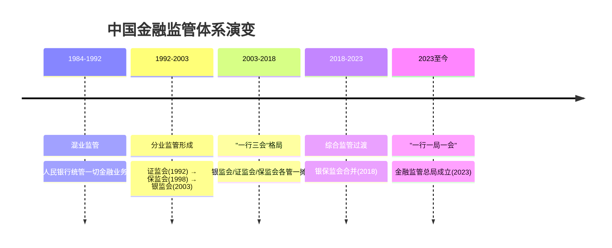
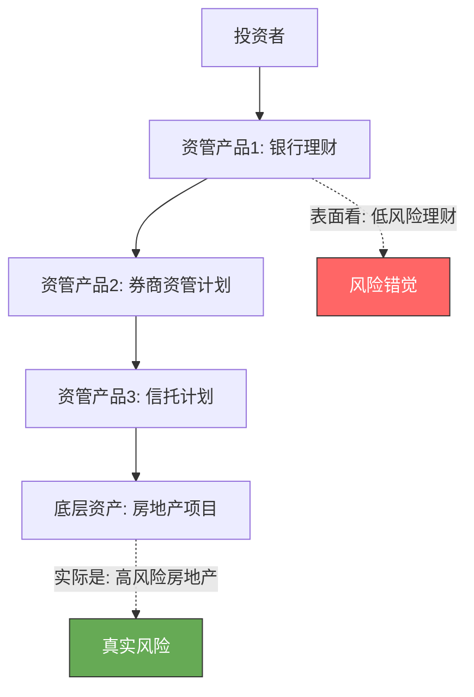
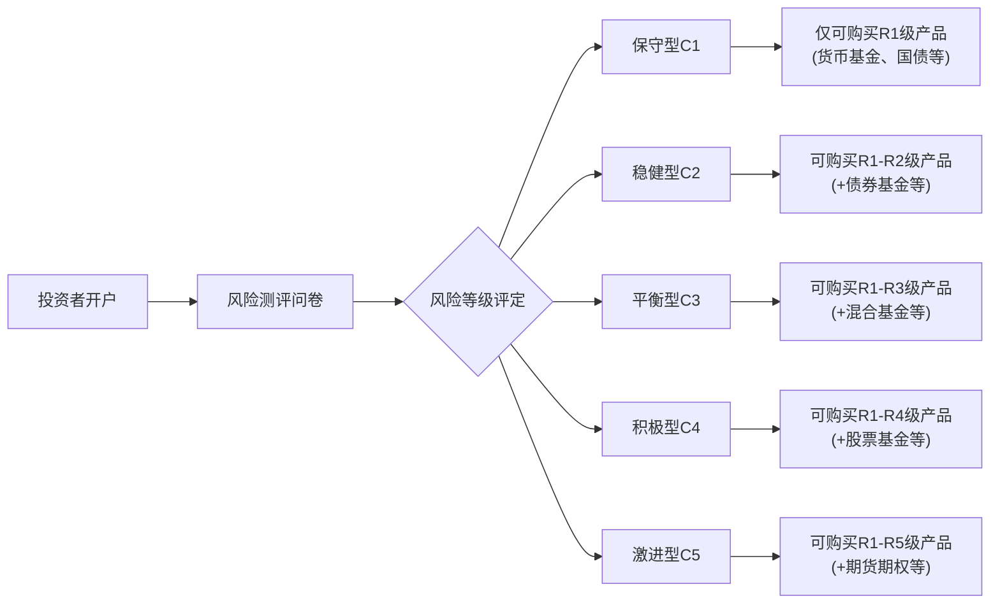
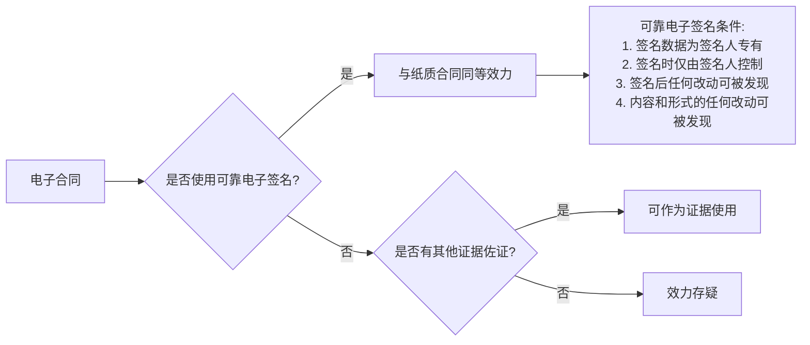
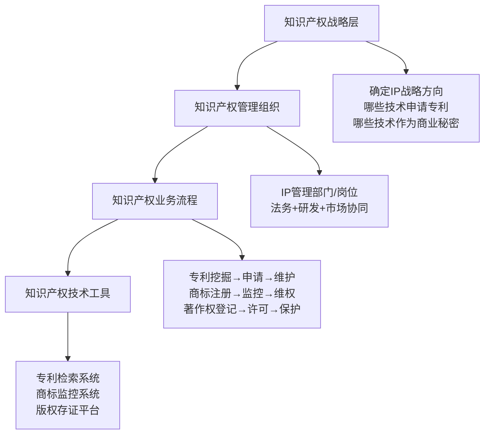
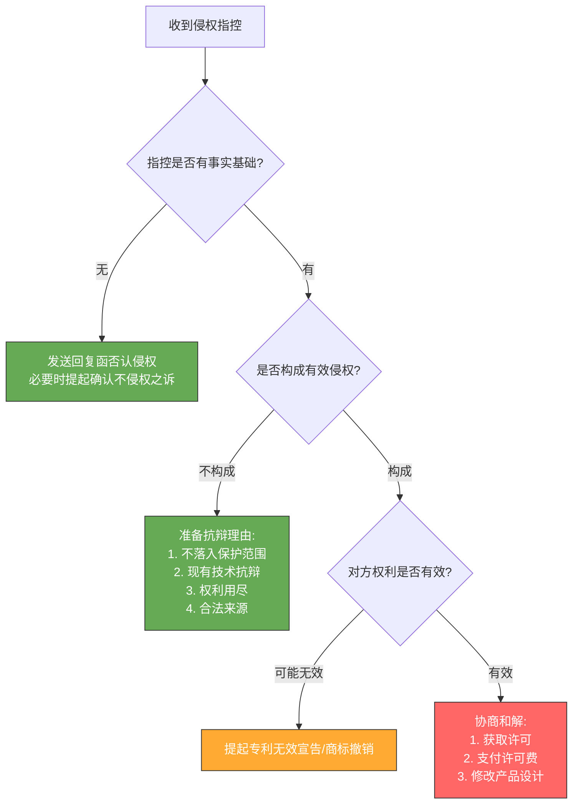
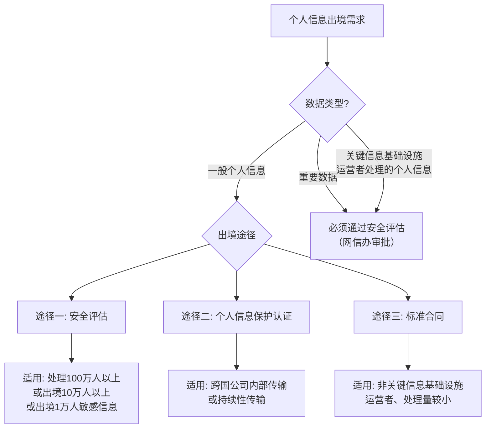
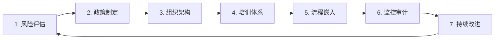
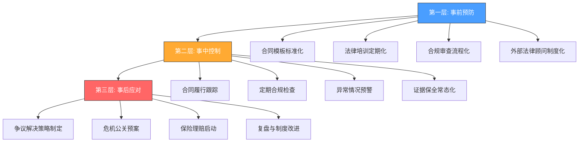

# 第15章 深度拓展：法律与合规的进阶知识

本章是法律与合规知识的"高手区"。前面的理论基础帮你建立法律意识框架，核心技巧教你日常操作层面的合规要点，实战案例让你看到法律纠纷的真实面貌。而本章要做的是把视野拉高——从监管体系的底层逻辑，到投资者保护的制度设计，到合同管理的系统化方法，到知识产权的攻防策略，再到跨境合规的国际视野，最后构建一套完整的法律风险防范体系。

这不是法律科普，而是为认真做生意、管钱、创业的人准备的进阶地图。

---

## 一、金融监管体系深度解析

### 1.1 中国金融监管体系的演变

理解今天的金融监管，必须理解它的来路。中国金融监管体系经历了从混业监管到分业监管，再到综合监管的演变过程。每一次变革都不是凭空发生的，而是由真实的金融风险事件推动的。



**第一阶段（1984-1992）：混业监管时期**

中国人民银行作为唯一的金融监管机构，同时承担货币政策和金融监管职能。这一时期的金融业态简单，主要以银行存贷款为主，混业监管基本够用。但随着证券市场和保险市场的发展，一个机构统管所有金融业务的弊端开始暴露——专业能力不足、监管资源分散、利益冲突难以避免。

**第二阶段（1992-2003）：分业监管初步形成**

推动分业监管的关键事件包括：1990年代初股票市场乱象（深圳"8·10事件"暴露了证券监管缺位的问题）、1997年亚洲金融危机暴露了金融监管协调不足的问题。这些事件直接推动了监管机构的专业化分工：

| 年份 | 事件 | 监管意义 |
|------|------|----------|
| 1992 | 中国证监会成立 | 证券期货市场有了专门监管者 |
| 1997 | 亚洲金融危机 | 暴露金融监管协调不足，催生金融稳定意识 |
| 1998 | 中国保监会成立 | 保险市场从人民银行分离出专门监管 |
| 2003 | 中国银监会成立 | 银行业监管从人民银行分离，人民银行专注货币政策 |

至此形成了"一行三会"（人民银行、银监会、证监会、保监会）的分业监管格局。分业监管的优势是专业化程度高，劣势是容易产生监管真空和监管套利——金融机构可以通过产品创新、跨业经营等方式，将业务转移到监管最宽松的领域。

**第三阶段（2018至今）：综合监管时期**

2015年股灾、2016年险资举牌乱象、P2P网贷大规模暴雷等一系列事件，充分暴露了分业监管的缺陷。一个跨银行、证券、保险的金融产品，可能没有任何一个监管机构对其实施全面监管。

改革路径：
- 2018年：银监会和保监会合并，成立中国银保监会——解决银行和保险之间交叉监管的问题
- 2023年：银保监会撤销，成立国家金融监督管理总局（金融监管总局）——进一步整合监管资源，覆盖除证券业之外的所有金融机构

当前格局：**"一行一局一会"**

| 机构 | 核心职能 | 监管范围 |
|------|----------|----------|
| 中国人民银行 | 货币政策、宏观审慎、金融稳定 | 支付体系、征信、外汇储备 |
| 金融监管总局 | 金融机构监管 | 银行、保险、信托、金融租赁、消费金融等 |
| 中国证监会 | 证券期货市场监管 | 上市公司、证券公司、基金公司、期货公司 |

### 1.2 监管的核心原则

这四项原则不是并列的，而是层层递进的监管逻辑链。

**功能监管原则**——"做什么业务就归谁管"

按照金融业务的功能进行监管，而非按照金融机构的类型。同一功能的金融业务适用相同的监管规则，避免监管套利。举个具体例子：同样是向消费者提供贷款，银行的消费贷受银保监会监管，但互联网平台的"花呗""白条"本质上也在做消费信贷，按功能监管原则也应该适用相同的监管规则。2020年《网络小额贷款业务管理暂行办法》的出台，正是功能监管原则的具体体现。

**行为监管原则**——"不管你是什么机构，做了什么就按什么管"

关注金融机构的经营行为，保护金融消费者的合法权益。这一原则的核心理念是：机构的身份不重要，行为的性质才重要。无论你是银行、证券公司还是互联网金融平台，只要你向消费者销售理财产品，就必须遵守投资者适当性管理、信息披露等行为规范。2023年金融监管总局成立后，行为监管的力度明显加强。

**审慎监管原则**——"别把金融机构搞倒闭了"

关注金融机构的稳健经营，防范系统性风险。审慎监管的核心指标体系：

| 指标类别 | 具体指标 | 标准要求 | 监管目的 |
|----------|----------|----------|----------|
| 资本充足 | 核心一级资本充足率 | ≥5% | 吸收损失的最后防线 |
| 资本充足 | 一级资本充足率 | ≥6% | 一级资本对风险资产的覆盖 |
| 资本充足 | 资本充足率 | ≥8% | 巴塞尔协议III最低要求 |
| 流动性 | 流动性覆盖率(LCR) | ≥100% | 30天内优质流动性资产能否覆盖净现金流出 |
| 流动性 | 净稳定资金比率(NSFR) | ≥100% | 长期资产是否有稳定的资金来源 |
| 杠杆 | 杠杆率 | ≥4% | 一级资本/表内外总资产，防止过度杠杆 |
| 贷款质量 | 不良贷款率 | ≤5%（监管关注线） | 贷款资产的质量 |

中国银行业的资本充足率普遍高于巴塞尔协议III的最低要求。2024年一季度，中国商业银行平均资本充足率为15.43%，远高于8%的国际最低标准。但不同类型银行之间差异显著：大型国有银行资本充足率普遍在16%以上，而部分城商行和农商行可能仅在10%左右。

**穿透式监管原则**——"看穿产品的本质"

透过金融产品的表面形式，识别其本质和最终风险承担者。这是中国金融监管的一大创新。2018年资管新规（《关于规范金融机构资产管理业务的指导意见》）是穿透式监管的标志性文件。

穿透式监管的三层穿透逻辑：



多层嵌套的问题在于：每一层都可能隐匿真实风险。投资者以为自己买的是银行理财产品（低风险），实际上底层资产可能是房地产项目（高风险）。穿透式监管要求无论嵌套多少层，都必须识别底层资产的真实风险。

### 1.3 金融监管的核心工具

**市场准入管理——牌照制度**

中国金融行业实行严格的牌照管理制度。主要金融牌照及其价值：

| 牌照类型 | 审批机构 | 获得难度 | 核心价值 |
|----------|----------|----------|----------|
| 银行牌照 | 金融监管总局 | 极高 | 可吸收公众存款 |
| 证券牌照 | 证监会 | 高 | 可从事证券经纪、承销、自营等 |
| 基金牌照 | 证监会 | 中高 | 可公开募集基金 |
| 保险牌照 | 金融监管总局 | 高 | 可经营保险业务 |
| 支付牌照 | 人民银行 | 中 | 可从事支付结算业务 |
| 征信牌照 | 人民银行 | 中高 | 可从事征信业务 |
| 小贷牌照 | 地方金融监管局 | 中低 | 可发放小额贷款（有地域限制） |

牌照的价值在于它的稀缺性。2015年后，支付牌照、小贷牌照的审批基本收紧，存量牌照的价格水涨船高。一张全国性支付牌照在2020年的交易价格约在5-10亿元。

**资本监管——巴塞尔协议的中国化**

巴塞尔协议是国际银行资本监管的基准框架。中国在巴塞尔协议的基础上，制定了更严格的国内标准：

- 巴塞尔协议III要求核心一级资本充足率≥4.5%，中国要求≥5%
- 中国额外要求储备资本缓冲2.5%、逆周期资本缓冲0-2.5%
- 系统重要性银行还需额外1%的附加资本要求

**投资者适当性管理**

适当性管理的实操流程：



适当性管理的违规案例：2021年，某证券公司因向风险承受能力为C2（稳健型）的投资者销售了R4（中高风险）的私募产品，被证监会责令改正并罚款30万元。投资者因此产生的损失，证券公司需承担相应的赔偿责任。

### 1.4 监管趋势前瞻

**金融科技（FinTech）监管**

2020年以来，金融科技监管进入强监管周期。标志性事件包括：蚂蚁集团IPO暂缓（2020年11月）、平台经济反垄断整治（2021年）、金融控股公司准入管理（2022年）。

当前金融科技监管的核心逻辑：

| 监管维度 | 具体要求 | 典型案例 |
|----------|----------|----------|
| 资本约束 | 金融业务必须有充足的资本支撑 | 蚂蚁集团消费金融公司注册资本增至185亿元 |
| 牌照管理 | 从事金融业务必须持牌经营 | 互联网存款产品下架 |
| 数据合规 | 个人信息收集使用必须合规 | 征信业务必须持牌 |
| 算法透明 | 算法推荐金融产品必须适当 | 算法推荐需向用户说明 |
| 反垄断 | 不得利用市场支配地位排除竞争 | 平台"二选一"被禁止 |

---

## 二、投资者保护法律框架

### 2.1 投资者保护的法律基础

中国投资者保护法律框架以2019年修订的《证券法》为核心支柱。新《证券法》设专章（第六章）规定投资者保护制度，被称为"中国资本市场投资者保护的里程碑"。

**核心法律架构：**

| 法律法规 | 核心保护机制 | 关键条款 |
|----------|------------|----------|
| 《证券法》（2019修订） | 证券市场投资者保护的"母法" | 第六章专章规定投资者保护 |
| 《基金法》 | 基金投资者的信义义务保护 | 基金管理人的忠实义务和注意义务 |
| 《信托法》 | 信托关系中的受托人义务 | 受托人必须为受益人最大利益行事 |
| 《个人信息保护法》 | 金融消费者的信息权益 | 金融机构处理个人信息需取得同意 |
| 《银行保险机构消费者权益保护管理办法》 | 金融消费者权益保护 | 2023年3月起施行 |

### 2.2 投资者保护的核心制度

**证券集体诉讼制度——改变游戏规则的武器**

2019年新《证券法》第95条确立了中国特色的证券集体诉讼制度。这一制度的运行机制如下：

```mermaid
flowchart TD
    A[虚假陈述等违法行为发生] --> B[证监会行政处罚或刑事判决]
    B --> C[投资者保护机构\n(中证中小投资者服务中心)]
    C --> D{是否提起集体诉讼?}
    D -->|是| E[公告征集投资者授权]
    E --> F["50名以上投资者授权"]
    F --> G[投服中心作为代表人起诉]
    G --> H["投资者\"默示加入\"（除非明确声明退出）"]
    H --> I[法院审理并判决]
    I --> J[赔偿金按比例分配给全体投资者]
    
    D -->|否| K[投资者可自行诉讼]
    
    style C fill:#4a9eff,stroke:#333,color:#fff
    style G fill:#4a9eff,stroke:#333,color:#fff
```

这一制度的关键创新在于"默示加入、明示退出"机制——投资者不需要主动起诉，只要没有明确声明退出，就自动被纳入集体诉讼的原告范围。这极大降低了投资者的维权成本。

**标志性案例：康美药业案（2021年）**

这是中国证券集体诉讼第一案，也是至今最具影响力的案例：

- **案情**：康美药业在2016-2018年的年报中虚增营业收入、虚增货币资金，累计虚增货币资金886.81亿元
- **行政处罚**：证监会对康美药业处以60万元罚款（旧《证券法》顶格处罚），对相关责任人处以10万-90万元罚款
- **刑事判决**：原董事长马兴田被判处有期徒刑12年，罚金120万元
- **民事赔偿**：广州中院一审判决康美药业赔偿52037名投资者共24.59亿元。独立董事（年薪仅10万元左右）被判承担5%-10%的连带赔偿责任，金额高达上亿元

这个案例的深远影响在于：独立董事再也不能"只拿钱不干活"了。独立董事必须真正履行监督职责，否则可能面临巨额赔偿。

**先行赔付制度**

先行赔付是指发行人的控股股东、实际控制人、主承销商等主体承诺先行赔偿投资者损失的制度。先行赔付具有速度快（通常在行政处罚后6-12个月内完成赔付）、覆盖广（所有适格投资者均可获得赔偿）的优势。

典型先行赔付案例：
- **万福生科案（2013年）**：平安证券出资3亿元设立先行赔付基金
- **欣泰电气案（2017年）**：兴业证券出资5.5亿元设立先行赔付基金
- **紫晶存储案（2023年）**：中信建投出资10亿元设立先行赔付基金

### 2.3 投资者维权的实操路径

投资者维权不是"告状"那么简单，而是一套有策略、有成本收益分析的系统工程。

**维权路径选择矩阵：**

| 维权方式 | 时间成本 | 经济成本 | 成功率 | 适用场景 |
|----------|----------|----------|--------|----------|
| 协商和解 | 1-3个月 | 低 | 30-50% | 金额较小，双方有和解意愿 |
| 投诉举报 | 1-6个月 | 无 | 视情况 | 金融机构违规行为 |
| 调解 | 1-3个月 | 低 | 40-60% | 双方愿意接受第三方调解 |
| 仲裁 | 3-12个月 | 中 | 60-70% | 合同中有仲裁条款 |
| 单独诉讼 | 6-24个月 | 中高 | 视情况 | 金额较大，证据充分 |
| 集体诉讼 | 12-36个月 | 低（投服中心承担） | 70-80% | 虚假陈述等证券违法行为 |

**投诉举报的实操要点：**

向金融监管部门投诉举报时，投诉材料的质量直接影响处理效果。一份有效的投诉材料应包含：

1. **身份信息**：投诉人姓名、身份证号、联系方式
2. **被投诉对象**：金融机构全称、分支机构名称、涉事人员
3. **事实描述**：时间、地点、经过，按时间顺序叙述
4. **证据清单**：合同、录音、聊天记录、转账凭证等
5. **诉求**：明确你希望达到的结果（退款、赔偿、道歉等）

重要提示：投诉渠道的优先级——12378银行保险消费者投诉热线 > 各地金融监管局网站在线投诉 > 证监会信访渠道 > 现场投诉。电话投诉通常在15个工作日内会收到反馈。

### 2.4 典型投资者保护案例解析

**案例一：赵薇夫妇证券虚假陈述案（2018年）**

- **案情**：龙薇传媒（赵薇持股95%）拟以30.6亿元收购万家文化（现祥源文化）29.135%的股份，但龙薇传媒自有资金仅6000万元，杠杆比例高达51倍。收购公告披露后万家文化股价大涨，随后收购失败股价暴跌
- **处罚**：证监会对龙薇传媒处以60万元罚款，对赵薇、黄有龙各处以30万元罚款，并分别采取5年证券市场禁入措施
- **民事赔偿**：大量投资者起诉要求赔偿，杭州中院判决祥源文化赔偿投资者损失
- **教训**：高杠杆收购的信息披露必须真实、准确、完整。"空手套白狼"式的收购行为会受到严厉处罚

**案例二：瑞幸咖啡财务造假案（2020年）**

- **案情**：瑞幸咖啡在2019年第二至第四季度虚增交易额约22亿元人民币
- **处罚**：在美国面临SEC调查和集体诉讼；在中国，财政部对瑞幸咖啡境内运营主体处以罚款
- **和解**：瑞幸咖啡同意支付1.875亿美元与SEC达成和解；与美国集体诉讼投资者达成2.5亿美元和解
- **教训**：跨境上市的公司面临双重监管压力。财务造假不仅面临行政处罚，还可能面临刑事追诉和天价民事赔偿

---

## 三、合同法在商业中的应用

### 3.1 合同的法律效力层次

不是所有合同都具有相同的法律效力。理解合同效力的层次，是合同管理的基础。

| 效力状态 | 法律后果 | 典型情形 |
|----------|----------|----------|
| 有效合同 | 对双方具有法律约束力 | 主体适格、意思真实、内容合法 |
| 可撤销合同 | 撤销权人可申请撤销 | 重大误解、欺诈、胁迫、显失公平 |
| 效力待定合同 | 需经追认才生效 | 无权代理、限制行为能力人签订 |
| 无效合同 | 自始无效，不产生法律效力 | 违反强制性规定、恶意串通损害他人利益 |

**实务中常见的合同效力问题：**

1. **"阴阳合同"的效力**：为规避税收等目的签订两份不同内容的合同。"阳合同"（用于备案的）因虚假意思表示而无效，"阴合同"（双方实际履行的）如内容合法则有效
2. **格式条款的效力**：提供格式条款的一方未履行提示说明义务的，对方可以主张该条款不成为合同的内容。格式条款中排除对方主要权利、加重对方责任的，该条款无效
3. **"违约金过高"的调整**：违约金超过实际损失30%的，法院一般会认定为"过分高于造成的损失"，可以根据当事人的请求予以适当减少

### 3.2 商业合同的核心条款设计

合同条款的设计不是法律文书写作，而是风险分配机制。每一个条款的背后都是一个"如果出了问题怎么办"的预案。

**标的条款设计要领：**

标的条款是合同的"定海神针"，必须做到"四确定"——确定名称、确定规格、确定数量、确定质量标准。质量标准的约定方式直接影响发生争议时的举证难度：

| 质量标准约定方式 | 优劣分析 | 适用场景 |
|------------------|----------|----------|
| 国家标准/行业标准 | 标准明确，争议少 | 有对应标准的成熟产品 |
| 封样确认 | 直观，不易争议 | 实物产品交易 |
| 详细技术参数表 | 精确，但写起来繁琐 | 技术性产品、设备采购 |
| "达到XX要求" | 笼统，容易争议 | 尽量避免使用 |

**违约责任条款——合同的"牙齿"**

没有违约责任的合同就像没有牙齿的老虎。违约责任条款的设计原则：

1. **违约金要有具体计算方式**：约定"违约方应承担违约责任"是废话，必须明确金额或计算公式。例如："逾期付款的，每逾期一日按未付金额的万分之五支付违约金"
2. **损失赔偿范围要扩大**：除了直接损失，还应约定间接损失、预期利益损失、维权费用（律师费、诉讼费等）由违约方承担
3. **多种违约情形分别约定**：不要用一个笼统的违约条款覆盖所有情形。逾期交货、质量不合格、泄露商业秘密等不同违约行为，应有不同的违约责任
4. **解约权要明确**：在什么条件下守约方有权解除合同，解除合同后如何结算

**争议解决条款——选择战场**

争议解决条款决定了"在哪里打官司"，直接影响诉讼成本和结果。

| 争议解决方式 | 优势 | 劣势 | 选择建议 |
|-------------|------|------|----------|
| 被告住所地法院 | 最常规 | 可能不在本地 | 双方地位对等时 |
| 原告住所地法院 | 己方便利 | 对方可能不接受 | 己方谈判地位强势时 |
| 合同履行地法院 | 与交易相关 | 需明确约定 | 买卖合同常用 |
| 仲裁 | 一裁终局、保密性强 | 费用较高 | 涉外合同、商事合同 |

**实战技巧**：在仲裁条款中，建议约定"败诉方承担胜诉方的律师费和仲裁费"，这样可以有效遏制对方"拖字诀"。同时，仲裁机构的选择也很重要——北京仲裁委员会、上海国际仲裁中心、深圳国际仲裁院等一线仲裁机构的裁决质量较高。

### 3.3 常见合同陷阱与防范

**陷阱一：口头承诺不写入合同**

业务人员在谈判过程中做出的各种承诺（赠送服务、优惠价格、额外保障等），如果没有写入合同，在法律上几乎不可能得到支持。

防范方法：所有承诺必须白纸黑字写入合同或以书面补充协议确认。重要的口头承诺，可以通过邮件或微信确认（保留聊天记录作为证据）。

**陷阱二：合同签订主体与实际履行主体不一致**

常见情形：与A公司签订合同，实际由B公司提供服务或收取款项。一旦发生纠纷，你可能面临"告A公司，A公司说钱不是它收的；告B公司，B公司说合同不是它签的"的困境。

防范方法：
- 核实合同签署人是否有授权（要求出示授权委托书）
- 付款账户必须与合同主体一致
- 如需变更履行主体，签订三方协议

**陷阱三：模糊的验收标准**

"验收合格后付款"——什么是"合格"？如果没有明确的验收标准和验收程序，买方可能永远无法证明货物不合格，或者卖方可能无限期拖延验收。

防范方法：
- 验收标准必须具体、可量化、可操作
- 约定验收期限："收货后X个工作日内完成验收，逾期未提出异议视为验收合格"
- 约定验收不合格的处理方式："买方有权退货/降价/要求换货"

### 3.4 电子合同的法律效力

2020年《民法典》确认了电子合同的法律效力。《电子签名法》规定，可靠的电子签名与手写签名或盖章具有同等法律效力。

**电子合同的法律效力条件：**



实务建议：
- 重要合同仍建议使用纸质合同或经过第三方CA认证的电子合同平台（如e签宝、法大大、契约锁等）
- 电子邮件、微信聊天记录可以作为合同成立和履行的证据，但证据效力弱于正式合同文本
- 合同的变更、补充也要采用书面形式，微信聊天中的变更承诺可能无法得到法院支持

---

## 四、知识产权保护策略

### 4.1 知识产权的类型与保护期限

| 知识产权类型 | 保护对象 | 保护期限 | 获取方式 | 申请费用（参考） |
|-------------|----------|----------|----------|-----------------|
| 发明专利 | 产品/方法的技术方案 | 申请日起20年 | 实质审查授权 | 5,000-15,000元 |
| 实用新型专利 | 产品的形状/构造 | 申请日起10年 | 初步审查授权 | 2,000-5,000元 |
| 外观设计专利 | 产品的外观设计 | 申请日起15年 | 初步审查授权 | 1,000-3,000元 |
| 商标 | 商品/服务的标志 | 注册日起10年，可无限续展 | 注册取得 | 300元/类（官费） |
| 著作权 | 文学/艺术/科学作品 | 作者终生+死后50年 | 自动取得（创作完成即享有） | 登记约300元 |
| 商业秘密 | 技术信息和经营信息 | 无固定期限（保密即保护） | 无需申请 | 无 |

**专利保护期限的计算细节**：

很多人混淆"申请日"和"授权日"。专利保护期从申请日起算，而非授权日。发明专利的审查周期通常为2-3年，这意味着实际获得保护的时间只有17-18年。实用新型和外观设计的审查周期较短（6-12个月），实际保护时间相对充分。

### 4.2 企业知识产权管理体系

知识产权管理不是"申请几个专利"那么简单，而是贯穿研发、生产、销售全流程的系统工程。

**知识产权管理体系的四层架构：**



**专利挖掘的实操方法**：

专利挖掘不是让技术人员写专利申请书，而是一种系统化的创新发现方法。具体步骤：

1. **技术分解**：将产品或技术方案分解为多个技术模块
2. **创新点识别**：对每个技术模块，识别其创新点（解决了什么问题、采用了什么方法、达到了什么效果）
3. **专利性评估**：对每个创新点进行专利检索，评估其新颖性、创造性和实用性
4. **申请策略制定**：根据创新点的重要性和专利性评估结果，确定哪些申请发明专利、哪些申请实用新型、哪些作为技术秘密保留
5. **专利布局**：围绕核心专利，申请外围专利，形成专利壁垒

**专利布局的典型模式：**

| 布局模式 | 说明 | 适用场景 | 典型案例 |
|----------|------|----------|----------|
| 路障式布局 | 在关键技术点上申请专利，阻止竞争对手 | 技术壁垒高的领域 | 高通在通信芯片领域的专利布局 |
| 城墙式布局 | 将所有可能的替代方案都申请专利 | 技术容易被绕开的领域 | 华为在5G标准必要专利的布局 |
| 地毯式布局 | 在某一技术领域大量申请专利 | 竞争激烈、技术迭代快的领域 | 互联网公司的算法专利 |
| 围栏式布局 | 围绕竞争对手的核心专利申请外围专利 | 需要交叉许可谈判时 | 医药行业的仿制药专利策略 |

### 4.3 知识产权侵权的应对策略

**被侵权时的维权路径选择：**

| 维权方式 | 时间 | 成本 | 效力 | 适用场景 |
|----------|------|------|------|----------|
| 发送警告函 | 快 | 低 | 有限 | 初次侵权，对方规模较小 |
| 行政投诉 | 3-6个月 | 低 | 中 | 有明确侵权证据 |
| 民事诉讼 | 6-24个月 | 高 | 强 | 需要赔偿或禁令 |
| 刑事报案 | 6-36个月 | 中 | 最强 | 假冒注册商标、侵犯商业秘密等严重侵权 |
| 平台投诉 | 1-30天 | 低 | 中 | 电商平台上的侵权 |

**警告函的写法要领**：

一封有效的知识产权警告函应包含以下要素：
1. 权利人的身份和权利证明（专利号、商标注册号等）
2. 侵权行为的具体描述（侵权产品的名称、型号、销售渠道等）
3. 侵权对比分析（权利要求与侵权产品的对应关系）
4. 明确的法律依据
5. 具体的停止侵权要求和回复期限
6. 不停止侵权将采取法律措施的警告

注意：警告函不能恶意发送。如果明知自己的权利不成立，仍然向竞争对手的客户发送侵权警告函，可能构成不正当竞争。

**收到侵权指控时的应对策略**：



### 4.4 数字时代的知识产权新挑战

**AI生成内容的著作权归属**

2023年北京互联网法院审理了中国首例AI生成图片著作权案。法院认定：如果用户在使用AI工具时进行了"智力投入"（如详细的提示词设计、参数调整、多次筛选修改），则生成的图片可以作为美术作品受到著作权保护。

这一判决确立的原则是：著作权保护的是人类的智力创造，AI只是工具。关键在于用户是否有足够的"智力投入"——简单的"帮我画一只猫"可能不够，但详细的描述、多轮调整、精心筛选则可能构成。

**开源软件的合规使用**

开源不等于免费、无条件使用。不同开源许可证的义务差异巨大：

| 许可证类型 | 核心义务 | 商业使用风险 | 代表项目 |
|-----------|----------|-------------|----------|
| MIT/BSD | 保留版权声明 | 低 | React, jQuery |
| Apache 2.0 | 保留声明+标注修改 | 低 | Android, Kubernetes |
| LGPL | 修改部分需开源 | 中 | glibc, Qt |
| GPL | 整个项目必须开源 | 高 | Linux内核, MySQL |
| AGPL | 网络使用也需开源 | 最高 | MongoDB(旧版) |

实务建议：使用开源组件前，必须审查其许可证类型。如果产品使用了GPL许可证的组件，整个产品可能都需要以GPL方式开源。很多企业在收购尽调中被发现开源合规问题，导致交易价格下调甚至交易失败。

---

## 五、跨境法律合规

### 5.1 跨境经营的主要法律问题

**数据跨境传输**

数据合规是当前跨境经营中最复杂的法律问题之一。中国《个人信息保护法》对个人信息出境设置了严格的条件：



2023年9月发布的《规范和促进数据跨境流动规定》放宽了部分要求，明确了以下情形可以免予申报安全评估：
- 为订立、履行合同所必需（如跨境电商的订单信息传输）
- 按依法制定的劳动规章制度和集体合同实施跨境人力资源管理所必需
- 紧急情况下为保护自然人生命健康和财产安全所必需
- 预计一年内向境外提供不满10万人（不含敏感信息）的个人信息

**反洗钱与反恐怖融资**

中国《反洗钱法》（2025年修订版）大幅强化了反洗钱义务。对于跨境经营者而言，以下义务需要特别关注：

| 义务类型 | 具体要求 | 违规后果 |
|----------|----------|----------|
| 客户身份识别 | 核实客户身份，了解交易目的和性质 | 罚款20-200万元 |
| 大额交易报告 | 单笔或当日累计现金交易≥5万元需报告 | 罚款20-200万元 |
| 可疑交易报告 | 发现可疑交易需在5个工作日内报告 | 罚款20-200万元 |
| 客户身份资料和交易记录保存 | 保存期限不少于5年 | 罚款20-200万元 |
| 内部控制制度 | 建立反洗钱内控制度 | 罚款20-200万元 |

### 5.2 全球主要合规法规对照

对于有跨境业务的企业，了解全球主要合规法规是基本功：

| 法规 | 适用范围 | 核心要求 | 最高处罚 |
|------|----------|----------|----------|
| EU GDPR | 处理欧盟居民数据的任何组织 | 数据保护、隐私权、数据跨境限制 | 全球年营收4%或2000万欧元 |
| 美国FCPA | 与美国有关联的企业 | 禁止向外国公职人员行贿 | 个人25万美元+5年监禁；企业200万美元 |
| 英国Bribery Act | 与英国有联系的企业 | 全面禁止商业贿赂和公职贿赂 | 个人无限额罚款+10年监禁；企业无限额罚款 |
| 美国OFAC制裁 | 全球（美元交易） | 禁止与制裁对象交易 | 单次违规最高33万美元（民事）或100万美元（刑事） |
| 欧盟CSDDD | 大型欧盟企业及非欧盟母公司 | 供应链人权和环境尽职调查 | 各成员国规定，通常为营收百分比 |

**OFAC制裁的特殊性**：由于美元在全球金融体系中的主导地位，OFAC制裁的影响范围远超美国国境。任何涉及美元结算的交易，理论上都受到OFAC管辖。2023年，某中国出口企业因向被OFAC列入SDN清单的伊朗实体出口货物，其美元收款账户被美国银行冻结，导致数百万美元资金无法收回。

### 5.3 跨境合规体系建设的实操框架

**合规体系七步法：**



**第一步：合规风险评估**

合规风险评估不是"列个清单"，而是要结合企业的具体业务场景进行分析。评估框架：

| 评估维度 | 关键问题 | 评估方法 |
|----------|----------|----------|
| 业务类型 | 涉及哪些受监管的业务？ | 业务清单+法规映射 |
| 交易对手 | 是否涉及制裁对象或高风险地区？ | 交易对手筛查+制裁名单比对 |
| 数据流 | 个人信息如何跨境传输？ | 数据流映射+隐私影响评估 |
| 中介机构 | 代理商、顾问是否有合规风险？ | 尽职调查+合规条款 |
| 付款方式 | 是否涉及高风险付款方式？ | 付款流程审查 |

**第二步：合规政策制定**

合规政策要"可执行"，不能是"抽屉文件"。一份有效的合规政策应包含：
- 明确的禁止行为清单（什么不能做）
- 明确的审批流程（谁来批准、什么情况下需要批准）
- 明确的报告渠道（发现违规行为如何报告）
- 明确的违规后果（违规会受到什么处罚）

---

## 六、法律风险防范体系建设

### 6.1 法律风险的全景识别

法律风险不是"打官司"那么简单。一个企业面临的法律风险是一个多层次、多维度的矩阵。

**法律风险全景图：**

| 风险维度 | 具体风险类型 | 发生概率 | 影响程度 | 典型后果 |
|----------|------------|----------|----------|----------|
| 合同风险 | 合同无效、违约、条款陷阱 | 高 | 中-高 | 经济损失、项目停滞 |
| 知识产权风险 | 侵权、被侵权、IP流失 | 中 | 高 | 赔偿、禁令、商业秘密泄露 |
| 劳动用工风险 | 劳动争议、工伤、社保违规 | 高 | 中 | 赔偿、行政处罚 |
| 税务风险 | 少缴税、虚开发票、税务稽查 | 中 | 极高 | 补税+滞纳金+罚款+刑事责任 |
| 监管合规风险 | 行政处罚、吊销牌照 | 中 | 极高 | 停业整顿、市场禁入 |
| 刑事风险 | 商业贿赂、诈骗、非法集资 | 低 | 极高 | 有期徒刑 |
| 数据安全风险 | 数据泄露、隐私侵权 | 中 | 高 | 罚款、声誉损失 |

**税务风险的特殊关注**：

税务风险是所有法律风险中"性价比"最低的——一旦被查，不仅要补税，还要缴纳每日万分之五的滞纳金（折合年化18.25%），以及0.5-5倍的罚款。最严重的，可能构成逃税罪，面临7年以下有期徒刑。

企业需要特别关注的高风险税务行为：
- **虚开发票**：为他人虚开、为自己虚开、让他人为自己虚开、介绍他人虚开，金额超过5万元即可构成犯罪
- **隐匿收入**：通过个人账户收款、现金交易不入账等方式隐匿收入
- **虚列成本**：虚构业务、虚增成本以减少应纳税所得额
- **转让定价**：关联企业之间的交易价格不公允，被税务机关进行纳税调整

### 6.2 法律风险防范体系的构建方法

**构建法律风险防范体系的三个层次：**



**合同管理标准化实操：**

合同管理标准化是成本最低、效果最显著的法律风险防范措施。具体包括：

1. **合同模板库建设**：针对高频合同类型（买卖合同、服务合同、劳动合同、保密协议、合作协议等），建立标准化模板。模板中已包含完善的违约责任条款、争议解决条款、保密条款等
2. **合同审批流程**：根据合同金额和类型，设定不同的审批层级。例如：10万以下由部门负责人审批；10-100万由法务审核+分管领导审批；100万以上由法务审核+总经理审批
3. **合同签署权限管理**：明确谁有权代表公司签署合同。未经授权签署的合同，公司不承担法律责任（但需证明对方知道或应当知道签署人无授权）
4. **合同履行监控**：建立合同台账，记录每份合同的关键节点（付款期限、交货期限、验收期限等），到期前提醒相关人员

### 6.3 企业合规管理的制度化工具

**合规手册的编制要点：**

一本合格的企业合规手册应包含以下内容：

| 章节 | 内容 | 编写要点 |
|------|------|----------|
| 合规政策声明 | 最高管理层的合规承诺 | 必须由CEO签署，体现"高层基调" |
| 合规组织架构 | 合规管理部门的设置和职责 | 明确汇报关系，确保独立性 |
| 合规风险清单 | 企业面临的主要合规风险 | 按业务线和风险等级分类 |
| 合规操作指南 | 各业务场景的合规操作步骤 | 场景化、流程化、可执行 |
| 合规举报渠道 | 违规行为的举报方式和保护措施 | 匿名举报+反报复保护 |
| 违规处理程序 | 违规行为的调查和处理流程 | 公正、透明、及时 |
| 合规培训计划 | 定期合规培训的安排 | 针对不同岗位设计不同内容 |

**合规培训的实操建议**：

合规培训不是"念PPT"。有效的合规培训应遵循以下原则：
- **案例导向**：用真实案例替代抽象法规条文。例如，讲反商业贿赂时，用"某医药公司向医生行贿被罚2亿"的真实案例
- **场景化**：针对不同岗位设计不同的培训内容。销售人员重点培训反商业贿赂和反不正当竞争；财务人员重点培训反洗钱和税务合规；技术人员重点培训数据安全和知识产权
- **测试验证**：培训后进行测试，确保员工真正理解了合规要求。测试不合格的需要补训
- **频率适当**：全员合规培训至少每年一次，高风险岗位每季度一次

### 6.4 个人法律风险防范的行动清单

法律风险防范不仅是企业的事，个人在日常经济活动中同样面临各种法律风险。

**个人法律风险防范行动清单：**

| 场景 | 风险 | 行动 | 紧迫度 |
|------|------|------|--------|
| 签署任何合同 | 合同陷阱、不利条款 | 仔细阅读每一条，不理解的不签 | ★★★★★ |
| 借钱给别人 | 资金损失 | 写借条（注明金额、利率、还款期限、违约金），转账备注"借款" | ★★★★★ |
| 购买房产 | 产权纠纷、质量缺陷 | 查验产权证明、预售许可证，保留所有交易凭证 | ★★★★★ |
| 创业/合伙 | 股权纠纷、无限责任 | 签订合伙协议/股东协议，明确出资、分工、利润分配、退出机制 | ★★★★★ |
| 网上发表言论 | 名誉侵权、侵犯隐私 | 不传播未经证实的信息，不公开他人个人信息 | ★★★★ |
| 网络购物 | 假货、虚假宣传 | 保留订单截图、聊天记录、快递凭证 | ★★★ |
| 使用他人作品 | 著作权侵权 | 获得授权再使用，注明作者和出处 | ★★★ |
| 个人信息提供 | 信息泄露、电信诈骗 | 最小化提供，定期检查账户安全 | ★★★★ |

**证据保全的实用技巧**：

法律纠纷中，"谁主张谁举证"是基本原则。没有证据，再有理也赢不了官司。证据保全的实操要点：

1. **电子证据的固定**：微信聊天记录、电子邮件、网页内容等电子证据容易被删除或篡改。可以通过公证处公证、区块链存证平台（如蚂蚁链可信存证、腾讯至信链）、录屏截图+时间戳等方式固定
2. **录音录像的合法性**：在自己参与的对话中录音是合法的（不需要对方同意）。但在他人私密空间安装窃听设备是违法的
3. **书面证据的保存**：合同、发票、收据、银行对账单等书面证据要原件保存。复印件的证据效力远低于原件
4. **证人证言的准备**：如果有证人，应提前确认证人愿意出庭作证，并了解证人能证明什么事实

---

## 七、前沿法律议题

法律与科技的关系从未像今天这样紧密。以下议题是未来3-5年内最值得关注的法律前沿领域。

### 7.1 人工智能的法律规制

**全球AI监管立法动向：**

| 国家/地区 | 法规/框架 | 核心内容 | 状态 |
|-----------|----------|----------|------|
| 欧盟 | AI Act（人工智能法） | 按风险等级分类监管AI系统 | 2024年生效 |
| 中国 | 《生成式人工智能服务管理暂行办法》 | 规范生成式AI服务的提供和使用 | 2023年8月施行 |
| 中国 | 《互联网信息服务算法推荐管理规定》 | 算法推荐的透明度和用户权益保护 | 2022年3月施行 |
| 美国 | 行政令+各州立法 | 暂无联邦统一立法，各州各自立法 | 进行中 |

**AI应用中的法律风险：**

1. **AI生成内容的知识产权**：AI生成的文本、图片、代码等是否受著作权保护？目前各国态度不一。中国的趋势是认可有"人类智力投入"的AI辅助创作
2. **AI决策的法律责任**：AI做出的决策（如自动驾驶事故、AI医疗诊断失误）由谁承担责任？是AI开发者、部署者还是使用者？
3. **AI训练数据的合法性**：用受版权保护的作品训练AI是否构成侵权？这一问题在全球范围内仍存在巨大争议

### 7.2 区块链与加密资产的法律框架

中国的立场明确：禁止加密货币交易和挖矿，但鼓励区块链技术的应用。具体法规框架：

| 领域 | 中国态度 | 关键文件 |
|------|----------|----------|
| 加密货币交易 | 禁止 | 《关于进一步防范和处置虚拟货币交易炒作风险的通知》（2021年） |
| 加密货币挖矿 | 禁止 | 《关于整治虚拟货币"挖矿"活动的通知》（2021年） |
| NFT（数字藏品） | 限制性允许 | 无统一法规，各平台自律 |
| 区块链技术应用 | 鼓励 | 《区块链信息服务管理规定》 |
| 数字人民币 | 积极推进 | 人民银行主导的法定数字货币 |

### 7.3 ESG合规的法律化趋势

ESG（环境、社会、公司治理）正从"自愿披露"走向"强制合规"：

- **环境（E）**：碳排放数据造假可能面临行政处罚甚至刑事责任；上市公司需按要求披露环境信息
- **社会（S）**：供应链中的劳工权益、数据隐私保护等社会议题日益受到监管关注
- **治理（G）**：独立董事制度、关联交易管理、反腐败合规等公司治理要求持续强化

---

## 八、本章小结

法律与合规知识的深度拓展不是为了让你成为律师，而是让你建立一套系统化的法律思维框架——在做任何商业决策之前，能够本能地想到"这有什么法律风险"、"如何通过合同安排保护自己"、"出了问题怎么举证和维权"。

本章覆盖的六个核心领域，构成了一幅完整的法律合规地图：

| 领域 | 核心收获 | 行动建议 |
|------|----------|----------|
| 金融监管体系 | 理解监管逻辑，识别监管趋势 | 关注金融监管总局和证监会的政策动向 |
| 投资者保护 | 掌握维权工具和路径 | 了解集体诉讼、先行赔付等制度 |
| 合同法应用 | 学会合同条款设计和风险防范 | 建立个人/企业的合同模板库 |
| 知识产权保护 | 建立IP管理意识和策略 | 梳理自身的知识产权资产 |
| 跨境合规 | 了解全球合规法规框架 | 有跨境业务的企业应做合规风险评估 |
| 法律风险防范 | 构建系统化的风险防范能力 | 落实"证据意识"和"合同意识" |

最后给出一个实用原则：**当法律问题的标的额超过你年收入的10%，或者可能影响你的人身自由时，请务必咨询专业律师。** 在这类问题上，"自己研究"的成本远高于"花钱请律师"的成本。

法律不是约束，而是保护。懂法的人在商业世界里，就像有盔甲的战士——不仅能保护自己不受伤害，还能在规则允许的范围内争取最大的利益。
