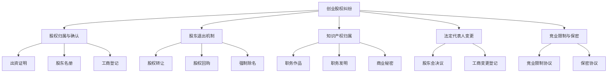
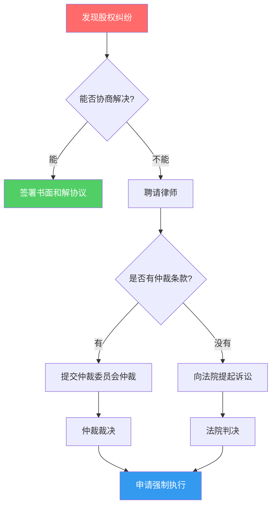

## 案例一：创业股权纠纷

> 股权是创业公司的命脉。分好了，大家齐心协力把蛋糕做大；分不好，公司还没赚钱就已经散伙。本案例通过一个真实场景，拆解创业股权纠纷的全过程，帮你从别人的教训中学到经验。

### 一、案例背景

#### 1.1 人物介绍

2023年初，三位前同事决定辞职创业，成立一家做企业级SaaS的科技公司——"云策科技"：

| 角色 | 姓名 | 背景 | 初始出资 | 承诺贡献 |
|------|------|------|----------|----------|
| CEO/商务 | 张明 | 8年销售经验，有行业人脉 | 40万元 | 负责融资、客户拓展、商务合作 |
| CTO/技术 | 李强 | 全栈工程师，技术能力强 | 10万元 | 负责产品研发、技术团队搭建 |
| COO/运营 | 王丽 | 5年运营经验，擅长用户增长 | 10万元 | 负责运营、市场推广、客户成功 |

三人是多年同事，关系很好，口头约定"一起拼一把"。注册公司时，按照出资比例分配股权：

```text
股权结构（初始）：
┌──────────┬──────────┬──────────┐
│  张明    │  李强    │  王丽    │
│  60%     │  20%     │  20%     │
│  (出资40万)│ (出资10万)│ (出资10万)│
└──────────┴──────────┴──────────┘
```

#### 1.2 创业初期

公司成立后的前6个月，三人配合默契：

- **张明**：谈下了3个种子客户，拿到了50万元天使投资意向
- **李强**：带队完成了MVP（最小可行产品）开发，用户反馈良好
- **王丽**：搭建了运营体系，积累了2000+注册用户

公司估值从60万增长到500万，一切看起来都在正轨上。

#### 1.3 矛盾萌芽

问题从天使轮融资开始显现。投资人提出以下要求：

1. **要求创始人团队必须稳定**——签署4年期股权成熟（Vesting）协议
2. **要求CEO持股不低于51%**——确保决策效率
3. **预留15%期权池**——用于未来核心员工激励

张明认为这很合理，但李强和王丽产生了顾虑：

- 李强认为："产品是我带队做出来的，技术才是核心价值。4年Vesting意味着我现在'拥有'的20%要分4年才能拿到，万一中途被踢出局怎么办？"
- 王丽认为："我的股权本来就少，再预留15%期权池，我的股份会被进一步稀释。"

---

### 二、纠纷爆发

#### 2.1 导火索

融资谈判期间，李强收到了一家大厂的高薪offer（年薪80万+股票期权）。他开始动摇，私下和张明提出：

- 要么把他的股权比例提高到30%
- 要么公司以200万元回购他手中的全部股权
- 否则他就离职去大厂

张明认为这是"要挟"，拒绝了李强的要求。双方关系急剧恶化。

#### 2.2 彻底决裂

李强在没有交接的情况下突然离职，并且：

1. **带走了核心源代码**——声称是自己写的，属于个人知识产权
2. **拒绝配合工商变更**——法定代表人还是李强（注册时图方便让李强当了法人）
3. **要求按出资额的10倍回购股权**——声称公司价值的80%是他创造的
4. **向投资人透露公司内部矛盾**——导致天使轮融资搁浅

张明和王丽陷入了被动局面：

```text
危机状态：
┌─────────────────────────────────────────────┐
│  公司法人是李强 → 无法正常办理工商变更        │
│  核心代码被带走 → 产品迭代停滞               │
│  融资搁浅       → 现金流紧张                 │
│  李强持股20%   → 仍是股东，有知情权和表决权   │
│  没有书面协议   → 法律维权困难               │
└─────────────────────────────────────────────┘
```

---

### 三、法律分析

#### 3.1 本案涉及的核心法律问题



#### 3.2 问题一：股权归属

**法律依据**：《公司法》第32条——有限责任公司应当置备股东名册，记载股东的姓名或名称及住所、出资额、出资证明书编号。公司应当将股东的姓名或名称向公司登记机关登记。

**本案分析**：

李强的20%股权是合法持有的，因为：
- 已实缴出资10万元
- 工商登记显示其为股东
- 没有签署Vesting协议（股权成熟协议）

**关键教训**：没有Vesting协议，股权一经工商登记就完全属于股东，即使该股东中途退出，其股权也不自动丧失。

**正确做法——Vesting条款设计**：

```text
标准Vesting方案（4年期，1年Cliff）：

时间线：
├── 入职0-12个月（Cliff期）：未成熟的股权为0%
├── 满12个月：一次性成熟25%（即5%股权）
├── 之后每月成熟 25%/36 ≈ 0.69%
├── 满48个月：全部成熟（20%）
└── 中途离职：未成熟部分由公司按约定价格回购

成熟进度示例（李强20%股权）：
┌──────────┬──────────┬──────────┐
│   时间    │  成熟比例  │  成熟股权  │
├──────────┼──────────┼──────────┤
│  0-11月   │    0%     │    0%    │
│  满12月   │   25%     │    5%    │
│  满24月   │   50%     │   10%    │
│  满36月   │   75%     │   15%    │
│  满48月   │  100%     │   20%    │
└──────────┴──────────┴──────────┘
```

**如果当初签了Vesting协议**：李强创业6个月后离职，Cliff期未满，0%股权成熟，公司可以按原始出资额（10万元）回购其全部股权。

#### 3.3 问题二：法定代表人变更

**法律依据**：

- 《公司法》第13条——公司法定代表人依照公司章程的规定，由董事长、执行董事或者经理担任，并依法登记。
- 《市场主体登记管理条例》——变更法定代表人需要公司申请，提交相关文件。

**本案困境**：

法定代表人是李强，但李强不配合变更。公司公章、营业执照等可能在李强手中。

**解决方案**：

| 步骤 | 具体操作 | 法律依据 |
|------|----------|----------|
| 第1步 | 召开股东会，形成变更法人的决议 | 《公司法》第37条 |
| 第2步 | 张明（60%）+王丽（20%）= 80%表决权，超过2/3，决议有效 | 《公司法》第43条 |
| 第3步 | 如果李强拒绝交出公章，可以登报声明作废后重新刻制 | 各地公安局规定 |
| 第4步 | 凭股东会决议向市场监管局申请变更登记 | 《市场主体登记管理条例》 |
| 第5步 | 如市监局要求原法人签字，可通过行政诉讼要求履行 | 行政诉讼法 |

**实际操作注意**：部分地区的市场监督管理局在原法定代表人不配合时，可能拒绝办理变更。此时需要通过法院诉讼确认股东会决议的效力，再凭生效判决办理变更。

#### 3.4 问题三：源代码归属

**法律依据**：

- 《著作权法》第18条——自然人为完成法人或者非法人组织工作任务所创作的作品是职务作品，著作权由作者享有，但法人或者非法人组织有权在其业务范围内优先使用。
- 《计算机软件保护条例》第13条——自然人在法人任职期间所开发的软件，如果是针对本职工作中明确指定的开发目标所开发的，著作权归该法人所有。

**本案分析**：

李强在公司任职期间为公司业务开发的软件，属于**职务作品**，著作权（版权）归公司所有，不归李强个人所有。李强"带走在公司写的代码"属于侵犯公司著作权的行为。

**但要注意**：

- 如果李强使用了自己在入职前就拥有的个人代码库（pre-existing IP），那部分代码的著作权仍属于李强
- 需要区分哪些代码是为公司新写的，哪些是复用的个人作品

**正确做法——知识产权归属协议**：

```text
知识产权归属协议核心条款：

1. 入职前已有知识产权：
   附件列明创始人入职前已拥有的知识产权清单
   该部分知识产权许可给公司免费使用

2. 在职期间开发的知识产权：
   全部归公司所有
   包括但不限于：源代码、文档、设计稿、技术方案

3. 离职后的知识产权：
   离职后1年内开发的、与公司业务相关的知识产权
   推定为职务作品，归公司所有

4. 罚则：
   违反知识产权归属条款的
   需支付违约金 XX 万元，并赔偿实际损失
```

#### 3.5 问题四：竞业限制与保密

**法律依据**：

- 《劳动合同法》第23条——用人单位与劳动者可以在劳动合同中约定保守用人单位的商业秘密和与知识产权相关的保密事项。
- 《劳动合同法》第24条——竞业限制的期限不得超过二年。

**本案分析**：

如果没有签署保密协议和竞业限制协议，李强离职后可以自由择业，包括加入竞争对手公司。但即便没有书面协议，李强仍然负有法定的保密义务（《反不正当竞争法》对商业秘密的保护）。

**正确做法——保密与竞业限制协议**：

| 条款 | 建议内容 | 注意事项 |
|------|----------|----------|
| 保密范围 | 客户信息、技术秘密、经营数据、定价策略 | 范围要明确具体，不能过于宽泛 |
| 保密期限 | 在职期间及离职后永久有效 | 商业秘密的保护是永久的 |
| 竞业限制范围 | 不得加入同行业竞争对手或创办竞争企业 | 范围、地域、行业要合理 |
| 竞业限制期限 | 最长2年（法定上限） | 超过2年的部分无效 |
| 竞业限制补偿 | 每月不低于离职前12个月平均工资的30% | 不支付补偿的，竞业限制无效 |
| 违约金 | 竞业限制补偿总额的2-3倍 | 过高可能被法院调低 |

---

### 四、纠纷解决过程

#### 4.1 协商阶段（第1-2周）

张明和王丽尝试与李强协商，提出以下方案：

**方案A**：公司以50万元回购李强的20%股权（对应公司250万估值）

- 李强拒绝，要求至少200万

**方案B**：李强保留股权但签署Vesting协议，继续作为纯财务股东

- 李强拒绝，要求要么提高比例要么高价回购

**方案C**：李强以股权换公司现有现金（约30万）+ 未来营收分成（3年，每年10%）

- 李强拒绝

协商失败。

#### 4.2 律师介入（第3-4周）

张明聘请律师，律师给出以下评估：

```text
法律风险评估：
┌─────────────────────────────────────────────────┐
│ 1. 源代码问题                                    │
│    → 李强带走代码属于侵权，可起诉要求返还并赔偿  │
│    → 但举证需要证明代码属于职务作品               │
│                                                   │
│ 2. 法定代表人问题                                │
│    → 可通过股东会决议变更，但流程较长             │
│    → 建议先公告声明公章作废                       │
│                                                   │
│ 3. 股权回购问题                                  │
│    → 李强有权拒绝以低于市场价的价格转让           │
│    → 但可以股东僵局为由请求法院解散公司           │
│    → 也可行使优先购买权阻止外部转让               │
│                                                   │
│ 4. 融资影响                                      │
│    → 投资人已知内部矛盾，短期内不会投资           │
│    → 建议先解决内部问题再重新接触投资人           │
└─────────────────────────────────────────────────┘
```

#### 4.3 最终解决方案（第5-8周）

经过律师调解，双方最终达成以下和解协议：

| 事项 | 和解方案 | 依据 |
|------|----------|------|
| 股权回购 | 公司以80万元分3期回购李强20%股权 | 公司实际估值约400万 |
| 法定代表人 | 李强配合变更法人为张明 | 和解协议签署后5个工作日内完成 |
| 源代码 | 李强返还所有公司源代码及副本 | 承诺不保留任何副本 |
| 竞业限制 | 李强2年内不得加入竞品公司或创办同类公司 | 公司每月支付竞业补偿金5000元 |
| 保密义务 | 李强对公司的商业秘密永久保密 | 违约金50万元 |
| 分期安排 | 首期30万（签约时），二期25万（满6个月），三期25万（满12个月） | 按期支付，逾期加收年化12%利息 |

---

### 五、深度复盘：这笔账到底亏了多少

#### 5.1 直接经济损失

| 项目 | 金额 | 说明 |
|------|------|------|
| 股权回购款 | 80万元 | 李强出资10万，回购80万，净赚70万 |
| 律师费 | 8万元 | 聘请律师全程代理 |
| 竞业补偿金 | 12万元 | 5000元×24个月 |
| 融资延迟损失 | 约50万元 | 原计划天使轮500万×10%=50万，延迟6个月 |
| **合计** | **约150万元** | 不含团队士气、客户流失等隐性损失 |

#### 5.2 隐性损失

- **团队信任崩塌**：剩余员工人心不稳，2名核心开发离职
- **产品迭代停滞**：3个月没有实质性产品更新，被竞品追赶
- **客户流失**：2个种子客户因公司不稳定而暂停合作
- **融资延迟**：原本计划的天使轮融资推迟了8个月

#### 5.3 如果当初做好了股权规划

假设从第一天就签署了完善的股东协议，情况会完全不同：

```text
理想情况：
┌─────────────────────────────────────────────────┐
│ ✅ 有Vesting协议 → 李强6个月离职只拿回0%股权     │
│ ✅ 有知识产权协议 → 代码归属清晰无争议           │
│ ✅ 法人是CEO → 不存在法定代表人变更问题          │
│ ✅ 有退出机制 → 按约定价格回购，无需谈判         │
│ ✅ 有竞业限制 → 李强不能直接加入竞争对手         │
│                                                   │
│ 预计节省：至少100万元 + 6个月时间               │
└─────────────────────────────────────────────────┘
```

---

### 六、创业股权避坑指南

#### 6.1 股权架构设计的五大原则

| 原则 | 说明 | 反面教训 |
|------|------|----------|
| **控制权集中** | CEO持股≥51%或通过投票权委托实现控制 | 三人平均持股→决策僵局 |
| **按贡献分配** | 不仅看出资，更要看能力、资源、全职投入 | 纯按出资分配→技术合伙人不满 |
| **预留期权池** | 创始之初就预留10-20%期权池 | 后期再留→稀释谁都心疼 |
| **签署Vesting** | 所有创始人都必须签署股权成熟协议 | 没签→李强6个月拿走20%全部股权 |
| **书面协议** | 所有约定必须白纸黑字写下来 | 口头约定→各说各话 |

#### 6.2 创始人必备的法律文件清单

```text
创业第一天就要签的文件：

□ 1. 股东协议（Shareholders' Agreement）
   ├── 股权比例与出资方式
   ├── 各创始人的角色与职责
   ├── 决策机制（哪些事项需要多少比例同意）
   ├── 股权转让限制（优先购买权、随售权、拖售权）
   └── 违约责任

□ 2. 股权成熟协议（Vesting Agreement）
   ├── 成熟期限（通常4年）
   ├── Cliff期（通常1年）
   ├── 成熟方式（按月/按季度）
   ├── 加速成熟条款（公司被收购时）
   └── 离职回购条款与价格

□ 3. 知识产权归属协议（IP Assignment Agreement）
   ├── 入职前已有IP清单
   ├── 在职期间IP归属公司
   ├── 离职后IP归属推定
   └── 违约责任

□ 4. 保密协议（NDA / Confidentiality Agreement）
   ├── 保密范围
   ├── 保密期限
   └── 违约责任

□ 5. 竞业限制协议（Non-Compete Agreement）
   ├── 限制范围（行业、地域、期限）
   ├── 经济补偿标准
   └── 违约责任

□ 6. 公司章程（Articles of Association）
   ├── 与股东协议保持一致
   ├── 明确法定代表人产生方式
   └── 明确股东退出机制
```

#### 6.3 常见股权陷阱与应对

**陷阱1：平均分配股权**

```text
❌ 错误做法：3个创始人各33.3%
→ 后果：没有人有最终决策权，小事也要投票，效率极低
→ 纠纷时：2:1才能形成决议，拉拢战永无止境

✅ 正确做法：
→ CEO 51% + CTO 30% + COO 19%
→ 或CEO 40% + CTO 30% + COO 20% + 期权池10%
→ 确保有一个人能拍板
```

**陷阱2：按出资比例分股权**

```text
❌ 错误做法：出资40万就拿60%股权
→ 后果：只看钱不看人，全职投入的技术合伙人觉得自己亏了
→ 技术合伙人一旦离开，公司就垮了

✅ 正确做法：
→ 出资只决定初始投入，股权分配要综合考虑：
   - 资金贡献（占30%权重）
   - 技术/能力贡献（占30%权重）
   - 全职投入（占20%权重）
   - 资源/人脉贡献（占20%权重）
```

**陷阱3：没有约定退出机制**

```text
❌ 错误做法：只想着一起创业，没想过有人会离开
→ 后果：创始人离职后仍是股东，分红、表决、知情权一样不少
→ 新投资人看到股东名册上有"不干活的老股东"，直接不投

✅ 正确做法：
→ 提前约定退出场景和处理方式：

┌──────────────┬────────────────────────────┐
│   退出场景    │         处理方式            │
├──────────────┼────────────────────────────┤
│ 主动离职      │ 按约定价格回购已成熟股权    │
│ 被动离职(过错)│ 按原始出资回购全部股权      │
│ 被动离职(无过)│ 按约定价格回购已成熟股权    │
│ 死亡/丧失能力 │ 按约定价格由公司或继承人处理 │
│ 公司被收购    │ 加速成熟，按比例分配对价    │
└──────────────┴────────────────────────────┘
```

**陷阱4：让非CEO当法定代表人**

```text
❌ 错误做法：注册时图方便，随便让一个人当法人
→ 后果：法人掌握公章、银行U盾，一旦闹翻，公司运营瘫痪

✅ 正确做法：
→ 法定代表人必须是CEO或实际控制人
→ 公章、财务章、银行U盾分开保管
→ 建立用印审批制度
```

**陷阱5：没有预留期权池**

```text
❌ 错误做法：创始之初把100%股权分完
→ 后果：后期招核心人才没有股权激励，留不住人
→ 再从创始人手里抠股权，谁都不愿意

✅ 正确做法：
→ 创始之初预留15-20%期权池
→ 期权池由CEO代持或设立有限合伙企业持有
→ 明确期权发放标准和行权条件
```

#### 6.4 股权比例与关键表决权对照表

| 持股比例 | 权利/能力 | 法律依据 | 使用场景 |
|----------|-----------|----------|----------|
| **67%以上** | 通过修改公司章程、增减注册资本、合并/分立/解散等特别决议 | 《公司法》第43条 | 绝对控制公司命运 |
| **51%以上** | 通过一般事项的股东会决议 | 《公司法》第42条 | 日常经营决策控制 |
| **34%以上** | 否决特别决议（需要2/3以上通过的事项） | 《公司法》第43条 | 防止被大股东侵害 |
| **10%以上** | 请求召开临时股东会 | 《公司法》第39条 | 小股东保护自己的方式 |
| **1%以上** | 提起股东代表诉讼（有限责任公司） | 《公司法》第151条 | 追究董事/高管责任 |
| **3%以上** | 提出临时提案（股份有限公司） | 《公司法》第102条 | 参与公司治理 |

---

### 七、股权纠纷的维权路径

当股权纠纷已经发生时，可以按以下路径维权：



**常见诉讼类型**：

| 纠纷类型 | 管辖法院 | 诉讼时效 | 举证要点 |
|----------|----------|----------|----------|
| 股权确认纠纷 | 公司住所地 | 3年 | 出资证明、股东名册、工商登记 |
| 股东出资纠纷 | 公司住所地 | 3年 | 银行转账记录、验资报告 |
| 股权转让纠纷 | 被告住所地 | 3年 | 转让协议、股东会决议、工商变更 |
| 公司决议效力纠纷 | 公司住所地 | 决议作出之日起60日内 | 股东会通知、会议记录、表决票 |
| 股东知情权纠纷 | 公司住所地 | 无时效限制 | 股东身份证明 |

**证据收集清单**：

```text
股权纠纷必备证据：

□ 工商登记信息（国家企业信用信息公示系统打印）
□ 公司章程（加盖工商局查询章）
□ 股东会决议/会议记录
□ 出资证明书/银行转账凭证
□ 股东协议/股权转让协议
□ 股权代持协议（如有）
□ 微信/邮件等沟通记录
□ 公司财务报表（用于估值）
□ 专业评估机构的估值报告
□ 证人证言（其他股东、员工、投资人）
```

---

### 八、经验总结

本案例给所有创业者的8条核心教训：

**第1条：先小人后君子**

朋友合伙创业，最忌讳"不好意思谈钱"。越是关系好，越要把规则定清楚。签协议不是不信任，恰恰是保护友谊的最好方式。把丑话说在前面，比闹翻了再打官司强一万倍。

**第2条：股权不是按出资分的**

资金重要，但技术、人脉、全职投入同样重要。股权分配要综合评估每个创始人的贡献，而不是简单地"谁出钱多谁股份多"。

**第3条：Vesting是创始人保护伞**

没有Vesting协议，任何创始人随时可以"带股走人"。4年Vesting + 1年Cliff是行业标准，不签等于在裸奔。

**第4条：控制权必须集中**

"三个和尚没水喝"——创业公司必须有一个能拍板的人。51%或67%的持股比例不是专制，是效率。

**第5条：知识产权必须约定清楚**

技术合伙人写的代码到底归谁？这个问题如果没有书面约定，纠纷一来就是死结。入职第一天就要签IP归属协议。

**第6条：退出机制比进入机制更重要**

创业时大家想的都是"怎么一起把事做大"，但更要想清楚"万一有人要走怎么办"。退出机制是股东协议中最容易被忽略、但最关键的条款。

**第7条：法定代表人不能随便当**

法定代表人掌握公章和银行U盾，是公司的"钥匙"。这把钥匙必须交给最核心、最稳定的人。

**第8条：花小钱请律师，省大钱打官司**

很多创业者觉得请律师贵（一份股东协议3000-10000元），但比起动辄几十万甚至上百万的股权纠纷诉讼费，这点钱是性价比最高的投资。

---

### 九、延伸思考

#### 9.1 股权代持的风险

有些创业者因为各种原因（如公务员不能持股、规避竞业限制等）选择让别人代持股权。这会带来额外的风险：

- 代持人可能否认代持关系
- 代持人的债权人可能查封代持股权
- 代持人可能擅自转让股权

如果必须代持，务必签署书面的**股权代持协议**，明确双方权利义务，并保留出资凭证。

#### 9.2 夫妻共同财产与股权

如果创始人已婚，其持有的股权可能被认定为夫妻共同财产。离婚时，配偶可能要求分割股权，影响公司治理。

**预防措施**：
- 婚前财产公证，明确股权属于个人财产
- 或在公司章程中约定"配偶不因婚姻关系取得股东资格"

#### 9.3 投资人条款中的"陷阱"

天使轮、A轮融资时，投资人通常会要求以下条款，创始人要特别注意：

| 条款 | 含义 | 风险提示 |
|------|------|----------|
| 对赌条款 | 业绩不达标时创始人需回购股权或补偿 | 目标过高可能倾家荡产 |
| 优先清算权 | 公司清算时投资人优先拿回投资 | 剩余才归创始人 |
| 反稀释条款 | 后轮估值降低时投资人获得更多股权 | 创始人股权被大幅稀释 |
| 一票否决权 | 重大事项投资人有否决权 | 可能导致公司决策瘫痪 |
| 领售权 | 投资人出售股权时可要求创始人一起卖 | 被迫卖出自己的公司 |
| 优先购买权 | 股权转让时投资人有权优先购买 | 创始人退出时选择受限 |

---

### 十、自检清单

创业前，请用以下清单逐项确认：

```text
股权架构自检清单：

□ 股权比例是否合理？（有人能拍板？）
□ 是否签署了股东协议？
□ 是否签署了Vesting协议？（4年期+1年Cliff）
□ 是否签署了知识产权归属协议？
□ 是否签署了保密协议？
□ 是否签署了竞业限制协议？（如需要）
□ 法定代表人是否是CEO/实际控制人？
□ 公司章程是否与股东协议一致？
□ 是否预留了期权池？（10-20%）
□ 是否约定了退出机制？（各场景处理方式）
□ 是否约定了争议解决方式？（仲裁/诉讼+管辖地）
□ 夫妻共同财产问题是否已处理？（如需要）
□ 是否存在股权代持？（如有，是否有书面协议）

全部打勾 → 你的股权架构基本安全
有空白项 → 赶紧补上，越拖风险越大
```
