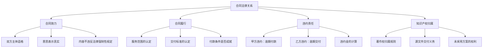
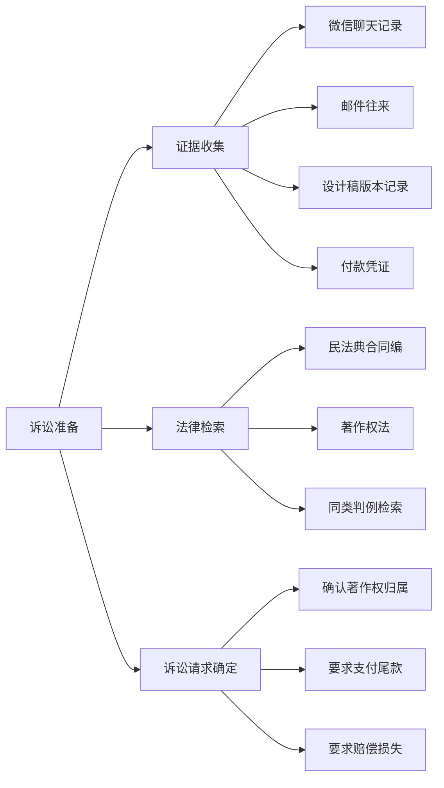
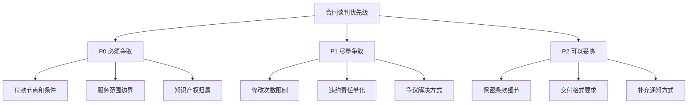

## 案例二：合同纠纷——自由职业者服务合同的签订、履行与争议解决全流程

本案例以一名自由职业设计师与客户之间的真实合同纠纷为主线，完整呈现从合同签订、履行、产生争议到最终解决的全过程。通过这个案例，读者可以掌握合同法律风险的识别、防范和应对方法。

---

### 一、案例背景

#### 1.1 当事人信息

| 角色 | 基本情况 |
|------|----------|
| **甲方（委托方）** | 某餐饮连锁企业，计划在全国开设 20 家新门店，需要统一的品牌视觉设计 |
| **乙方（受托方）** | 张某，独立平面设计师，从业 5 年，有丰富的品牌设计经验，此前通过朋友介绍接单，未注册公司 |
| **合同标的** | 品牌视觉识别系统（VI）全套设计，包括 logo、菜单、门店招牌、员工制服图案、外卖包装等 |
| **合同金额** | 18 万元，分三期支付 |
| **合同签订时间** | 2024 年 3 月 |
| **约定交付时间** | 2024 年 6 月 30 日 |

#### 1.2 合同签订过程

张某通过朋友介绍认识甲方负责人王某。双方口头沟通了需求后，王某发来一份自行拟定的合同，张某简单浏览后签字。合同主要条款如下：

| 条款 | 原合同内容 | 存在的问题 |
|------|-----------|-----------|
| 服务范围 | "品牌视觉识别系统全套设计" | 未明确具体包含哪些项目，"全套"定义模糊 |
| 交付标准 | "甲方满意为准" | 主观标准，无法客观衡量 |
| 付款方式 | 签约付 30%（5.4万），初稿付 30%（5.4万），终稿付 40%（7.2万） | 未定义"初稿""终稿"的具体含义 |
| 修改次数 | 未约定 | 甲方可以无限次要求修改 |
| 知识产权 | "设计成果归甲方所有" | 未明确授权范围、是否包含未采用方案 |
| 违约责任 | "违约方赔偿对方损失" | 未量化违约金，举证困难 |
| 争议解决 | 未约定 | 出现纠纷后双方对管辖法院产生分歧 |

#### 1.3 纠纷起因

合同履行过程中，以下问题逐步暴露：

1. **需求膨胀**：甲方在签约后不断追加设计需求，从最初的 VI 扩展到抖音短视频封面、小红书模板、美团外卖店铺页面等，且认为这些属于"全套"范围
2. **修改无止境**：甲方对 logo 设计前后提出了 17 轮修改意见，且多次推翻之前确认的方案
3. **付款拖延**：张某完成初稿后，甲方以"不满意"为由拒绝支付第二期款项
4. **知识产权争议**：甲方要求张某交出所有设计源文件（包括未被采用的 12 套备选方案），张某认为未采用方案的著作权仍归自己

---

### 二、法律分析

#### 2.1 本案涉及的法律关系

本案属于**承揽合同纠纷**（非劳动合同），适用《民法典》合同编的相关规定。



#### 2.2 关键法律问题逐一解析

**问题一："甲方满意为准"的交付标准如何认定？**

这是自由职业合同中最常见的陷阱。根据《民法典》第五百一十条，合同约定不明确的，可以协议补充；不能达成补充协议的，按照合同相关条款或交易习惯确定。

司法实践中的认定规则：

| 情形 | 法院倾向 |
|------|----------|
| 合同约定"甲方满意"但无具体标准 | 参照行业通常标准，不以甲方主观感受为准 |
| 甲方以"不满意"为由拒付 | 需证明乙方交付成果存在实质性缺陷 |
| 甲方反复修改但不指出具体问题 | 可能被认定为恶意阻止付款条件成就 |

> **核心启示**：在合同中约定客观可量化的交付标准（如"符合行业通行的 VI 设计规范""通过第三方专业机构评审"），避免使用主观判断词。

**问题二：甲方追加的需求是否属于合同范围？**

根据《民法典》第七百七十条，承揽合同的标的应当明确。甲方签约后追加的抖音封面、小红书模板、美团页面等，明显超出了"品牌视觉识别系统"的通常含义。

判断标准：

| 判断维度 | 说明 |
|----------|------|
| 行业惯例 | VI 系统通常包含：logo、标准色、标准字体、辅助图形、应用规范等，不包含新媒体素材 |
| 合同文义 | "全套"应结合签约时双方沟通的具体内容来解释 |
| 交易习惯 | 新增需求应签订补充协议或变更单 |

> **实操建议**：在合同中以附件形式列明具体设计项目清单，约定"超出附件清单范围的需求，双方另行协商费用和工期"。

**问题三：知识产权归属如何认定？**

根据《著作权法》第十九条，受委托创作的作品，著作权归属由双方通过合同约定。合同未明确约定或没有订立合同的，著作权属于受托人（即设计师）。

本案中合同约定"设计成果归甲方所有"，但存在以下争议：

| 争议焦点 | 法律分析 |
|----------|----------|
| "设计成果"是否包含未采用的备选方案？ | 合同未明确。从文义解释，"设计成果"通常指最终交付物，不包含过程稿 |
| 源文件是否必须交付？ | 著作权转让不等于必须交付源文件，需另行约定 |
| 甲方能否将设计成果授权第三方使用？ | 取决于合同约定的是"著作权转让"还是"使用权许可" |

> **关键区分**：著作权转让 vs 使用权许可。转让后甲方成为新的著作权人，可以任意使用、修改、再授权；许可则仅在约定范围内使用。自由职业者应尽量选择"许可"而非"转让"。

#### 2.3 违约责任分析

| 违约行为 | 违约方 | 法律后果 |
|----------|--------|----------|
| 甲方拒付第二期款项 | 甲方 | 应支付设计费 + 逾期利息（按 LPR 计算） |
| 甲方无限次要求修改 | 甲方 | 超出合理次数的修改属于新增需求，应另行付费 |
| 乙方逾期交付（如有） | 乙方 | 应承担违约金或赔偿甲方实际损失 |
| 甲方擅自使用未付款的设计方案 | 甲方 | 侵犯乙方著作权，应支付使用费 + 赔偿金 |

---

### 三、争议解决过程

#### 3.1 协商阶段（2024年7月）

张某多次与甲方沟通，提出以下方案：

1. 甲方支付第二期款项 5.4 万元
2. 超出 VI 范围的新增需求（抖音封面等）另行报价 3 万元
3. 修改次数超过 5 次的部分按每次 2000 元计费

甲方拒绝，理由是"设计不满意不应付费"，并威胁要在网上曝光张某"收钱不干活"。

#### 3.2 调解阶段（2024年8月）

张某向当地消费者协会和行业协会申请调解。调解过程中，调解员指出：

- 甲方的"不满意"不构成拒付的合法理由
- 乙方已完成合同约定的主要工作，有权获得相应报酬
- 双方都有过错：合同约定过于笼统是纠纷根源

调解结果：甲方同意支付第二期款项 4.5 万元（折让 0.9 万元），新增需求另行协商。

#### 3.3 诉讼准备（调解未完全解决部分）

关于知识产权归属和源文件交付问题，双方未能达成一致。张某决定提起诉讼。

**诉讼策略：**



#### 3.4 诉讼结果

法院最终判决：

| 判项 | 内容 |
|------|------|
| **著作权归属** | 最终交付的设计方案著作权归甲方（按合同约定），但未采用的 12 套备选方案著作权归张某 |
| **源文件交付** | 张某需交付最终方案的源文件，无需交付备选方案源文件 |
| **尾款支付** | 甲方应支付尾款 7.2 万元 |
| **修改费** | 超出合理范围的 12 次修改，甲方应补偿张某 1.8 万元 |
| **逾期利息** | 甲方应支付逾期付款利息 0.3 万元 |
| **诉讼费用** | 由甲方承担 70%，乙方承担 30% |

---

### 四、案例复盘与教训总结

#### 4.1 合同签订阶段的教训

| 教训 | 正确做法 |
|------|----------|
| 服务范围定义模糊 | 附件列明具体交付物清单，约定变更流程 |
| 交付标准主观化 | 约定客观标准（行业规范、第三方评审） |
| 修改次数未限制 | 约定免费修改次数（通常 3-5 次），超出部分按次收费 |
| 知识产权条款笼统 | 区分"转让"和"许可"，明确是否包含备选方案 |
| 违约责任不量化 | 约定具体违约金金额或计算方式 |
| 争议解决方式未约定 | 约定管辖法院或仲裁机构 |

#### 4.2 合同履行阶段的教训

| 教训 | 正确做法 |
|------|----------|
| 需求变更无记录 | 所有变更必须书面确认（邮件/补充协议） |
| 修改意见无边界 | 要求甲方提供具体修改意见，拒绝"再想想""感觉不对" |
| 交付过程无留痕 | 使用版本管理系统，每次交付保留时间戳和确认记录 |
| 付款节点模糊 | 约定明确的付款触发条件和付款期限 |

#### 4.3 纠纷处理阶段的教训

| 教训 | 正确做法 |
|------|----------|
| 证据意识薄弱 | 日常工作中养成保留沟通记录的习惯 |
| 调解优先级不明 | 小额纠纷优先调解，降低时间和经济成本 |
| 诉讼策略不清 | 起诉前做好法律检索，明确诉讼请求和证据链 |
| 情绪化沟通 | 保持专业态度，避免在社交媒体上公开对骂 |

---

### 五、自由职业者合同签订实操指南

#### 5.1 必备合同条款清单

以下是自由职业者（尤其是设计、开发、咨询类）服务合同的核心条款：

| 序号 | 条款名称 | 核心要素 | 常见陷阱 |
|------|----------|----------|----------|
| 1 | 服务范围 | 具体交付物清单 + 排除项 | "全套""相关""等"模糊表述 |
| 2 | 交付标准 | 客观可衡量的验收标准 | "甲方满意""符合要求" |
| 3 | 交付时间 | 具体日期 + 里程碑节点 | "尽快""合理时间内" |
| 4 | 修改条款 | 免费修改次数 + 超出部分计费标准 | 未约定修改次数 |
| 5 | 付款方式 | 金额 + 节点 + 期限 + 支付方式 | "验收后付款"但未定义验收 |
| 6 | 知识产权 | 转让或许可 + 是否含备选方案 + 源文件 | "成果归甲方"一刀切 |
| 7 | 保密条款 | 保密范围 + 期限 + 违约责任 | 保密范围过宽 |
| 8 | 违约责任 | 具体违约金或计算方式 | "赔偿损失"无量化标准 |
| 9 | 争议解决 | 管辖法院或仲裁机构 | 未约定导致管辖争议 |
| 10 | 合同变更 | 变更流程 + 书面确认要求 | 口头变更无约束力 |

#### 5.2 合同审查 Checklist

签订合同前，逐项检查以下内容：

```text
□ 甲乙双方信息完整（公司全称/个人姓名、地址、联系方式、身份证号/统一社会信用代码）
□ 服务范围有附件清单，且清单内容具体到每个交付物
□ 交付标准有客观衡量依据
□ 付款金额、节点、期限明确
□ 修改次数和超出部分的计费方式约定清楚
□ 知识产权归属条款区分了转让/许可、正稿/备选方案
□ 违约金有具体金额或计算公式
□ 争议解决方式已约定（法院/仲裁）
□ 合同变更必须书面确认
□ 双方签字盖章，日期完整
```

#### 5.3 常用合同模板条款参考

**服务范围条款示例：**

> 乙方为甲方提供以下设计服务（详见附件一《设计项目清单》）：
> 1. 品牌标志（Logo）设计，含标准制图、标准色、标准字体
> 2. 品牌视觉识别系统（VI）基础部分设计
> 3. VI 应用部分设计（名片、信封、工牌）
> 
> 以下内容不在本合同服务范围内，如甲方需要，双方另行签订补充协议：
> - 新媒体素材设计（社交媒体封面、短视频模板等）
> - 产品包装设计
> - 室内空间设计
> - 任何附件一未列明的项目

**修改条款示例：**

> 1. 乙方为每个设计项目提供 3 次免费修改机会。修改内容以甲方书面（含邮件、即时通讯工具）确认的具体修改意见为准，不含"再调整""再优化"等模糊表述。
> 2. 超出免费修改次数的，每次修改收取设计费总额的 5% 作为修改费。
> 3. 甲方推翻已确认方案重新设计的，视为新项目，费用另行协商。

**知识产权条款示例：**

> 1. 甲方付清全部款项后，获得最终交付设计方案的 [著作权转让 / 非独占使用权许可]。
> 2. 未被甲方采用的备选方案，著作权归乙方所有，甲方不得使用。
> 3. 乙方在付清全款后 5 个工作日内，向甲方交付最终方案的可编辑源文件（PSD/AI 格式）。
> 4. 乙方保留将作品用于个人作品集展示的权利（不含商业用途）。

---

### 六、延伸知识：合同纠纷的常见类型与应对

#### 6.1 合同纠纷类型图谱

| 纠纷类型 | 典型场景 | 占比（参考） | 解决难度 |
|----------|----------|-------------|----------|
| 付款纠纷 | 甲方拒付、拖延付款、压价 | 约 45% | ★★★ |
| 质量纠纷 | 交付物不符合预期、返工争议 | 约 25% | ★★★★ |
| 范围纠纷 | 需求膨胀、变更争议 | 约 15% | ★★★ |
| 知识产权纠纷 | 归属争议、侵权使用 | 约 10% | ★★★★★ |
| 解除纠纷 | 提前终止、退费争议 | 约 5% | ★★★★ |

#### 6.2 各阶段的证据保留要点

| 阶段 | 需保留的证据 | 保留方式 |
|------|-------------|----------|
| 签约前 | 需求沟通记录、报价单、方案提案 | 邮件/聊天记录截图 + 云端备份 |
| 履行中 | 设计稿各版本、修改意见、确认回复 | 版本管理系统 + 时间戳 |
| 交付时 | 交付记录、验收确认、签收单 | 邮件确认 + 电子签章 |
| 付款时 | 转账记录、发票、催款记录 | 银行流水 + 邮件存档 |
| 纠纷时 | 调解记录、律师函、诉讼文书 | 原件留存 + 电子备份 |

#### 6.3 纠纷解决方式对比

| 方式 | 适用场景 | 时间成本 | 经济成本 | 执行力 |
|------|----------|----------|----------|--------|
| **协商** | 金额小、关系可维护 | 1-2 周 | 几乎为零 | 依赖自觉 |
| **调解** | 双方有调解意愿 | 1-3 个月 | 低（免费或几百元） | 调解协议可申请司法确认 |
| **仲裁** | 合同约定仲裁条款 | 3-6 个月 | 中（仲裁费按标的额计算） | 仲裁裁决等同于法院判决 |
| **诉讼** | 争议金额大、协商无果 | 6-18 个月 | 高（律师费+诉讼费） | 最强执行力 |

---

### 七、常见误区与纠正

| 误区 | 真相 | 正确做法 |
|------|------|----------|
| "朋友介绍的不需要签合同" | 朋友关系不构成法律保障，口头合同举证困难 | 再小的项目也要签书面合同 |
| "合同太长客户不愿意签" | 简陋的合同是双方的隐患 | 使用简洁但条款完整的合同模板 |
| "甲方说满意就会付款" | "满意"是主观判断，甲方可以永远说不满意 | 约定客观验收标准 |
| "先干活后签合同也行" | 没有合同约束，完成工作后可能被压价或拒付 | 先签合同再开工 |
| "聊天记录不算证据" | 微信/邮件记录可以作为证据，但需注意完整性 | 重要事项通过邮件确认，定期备份聊天记录 |
| "小金额不值得打官司" | 小额纠纷可以通过小额诉讼程序快速解决 | 5 万元以下可以适用简易程序，诉讼费减半 |

---

### 八、进阶内容：合同风险管理框架

#### 8.1 合同风险评估矩阵

在签订合同前，对每个关键条款进行风险评估：

| 风险维度 | 低风险（1分） | 中风险（2分） | 高风险（3分） |
|----------|-------------|-------------|-------------|
| 服务范围 | 附件清单明确 | 有概括性描述但不具体 | 仅"全套""相关"等模糊词 |
| 交付标准 | 客观可衡量 | 有参考标准但不完全明确 | "甲方满意"等主观标准 |
| 付款方式 | 分期付款且节点清晰 | 分期但节点模糊 | 完成后一次性付款 |
| 知识产权 | 明确区分转让/许可 | 有约定但不完整 | 未约定 |
| 违约责任 | 有具体违约金 | 有条款但未量化 | 未约定 |

**风险等级判定：**
- 5-7 分：低风险，可签约
- 8-11 分：中风险，建议修改后签约
- 12-15 分：高风险，必须修改关键条款后再签约

#### 8.2 合同谈判的优先级策略

当无法让对方接受所有修改时，按以下优先级谈判：



**理由**：付款条件直接决定能否拿到钱，服务范围边界防止需求膨胀，知识产权归属决定长期权益。这三项是自由职业者的核心利益，任何一项让步都可能造成无法挽回的损失。

---

### 九、本案例的核心启示

1. **合同是自由职业者最重要的资产保护工具**。一份好的合同不是不信任对方，而是对双方权利义务的清晰界定，是合作关系健康运行的基石。

2. **模糊条款是纠纷的温床**。"甲方满意""全套设计""合理时间内"这些看似灵活的表述，在纠纷发生时会成为最大的隐患。

3. **证据意识要贯穿始终**。从签约前的沟通记录，到履行中的每一次修改确认，再到付款时的每一条转账记录，都是保护自己的武器。

4. **纠纷解决要理性选择**。不是所有纠纷都需要打官司，协商和调解往往是更高效的选择。但如果核心权益受到侵害，不要因为怕麻烦而放弃法律途径。

5. **合同模板是起点，不是终点**。每次签约前都要根据具体项目情况调整条款，不存在"万能合同模板"。

---

> **延伸阅读**：建议配合阅读本章"合同审查技巧"和"合同签订的法律风险防范"两节，形成从签订、履行到纠纷处理的完整知识体系。
