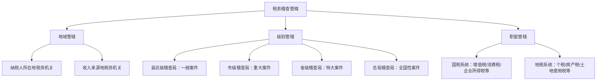
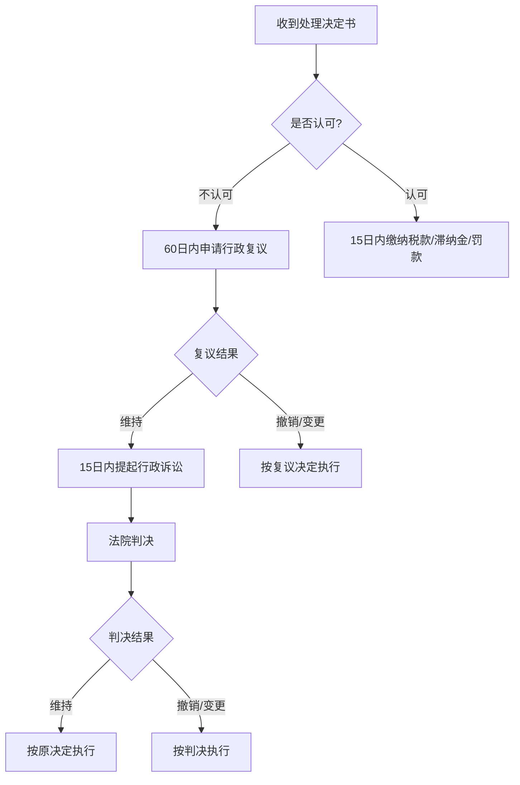
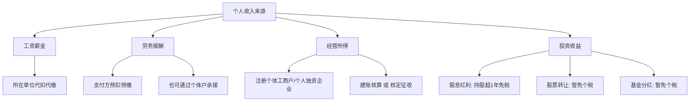

## 案例三：税务稽查

税务稽查是税务机关依法对纳税人、扣缴义务人的纳税情况进行检查和处理的行政执法行为。对于个人收入多元化的今天，无论是工薪族的副业收入、自由职业者的经营所得，还是投资人的资本利得，都可能面临税务稽查的风险。本案例通过多个真实场景，系统剖析税务稽查的触发机制、应对策略和防范措施。

---

### 一、税务稽查的基本认知

#### 1.1 什么是税务稽查

税务稽查是税务机关依据《税收征收管理法》及其实施细则，对纳税人、扣缴义务人履行纳税义务情况进行检查监督的执法活动。稽查局是税务稽查的实施主体，具有独立的执法权。

税务稽查与日常税务管理有本质区别：

| 维度 | 日常管理 | 税务稽查 |
|------|----------|----------|
| 目的 | 督促申报纳税 | 查处税收违法行为 |
| 主体 | 税务分局/所 | 稽查局 |
| 程序 | 简易程序 | 严格法定程序 |
| 后果 | 提醒补正 | 行政处罚乃至刑事追诉 |
| 权力范围 | 有限检查 | 可冻结存款、查封财产 |
| 时限 | 无固定周期 | 立案后60日内结案（可延长） |

#### 1.2 稽查的法律依据

核心法律法规包括：

- **《税收征收管理法》**：第五十四条至第五十八条规定了税务检查的职权范围、程序和被检查人的义务
- **《税务稽查案件办理程序规定》**（国家税务总局令第52号）：规范稽查案件办理全流程
- **《刑法》第二百零一条**：逃税罪，逃避缴纳税款数额较大且占应纳税额10%以上的，处三年以下有期徒刑或者拘役
- **《行政处罚法》**：规范稽查处罚程序
- **各税种单行法**：如《个人所得税法》《增值税暂行条例》等

#### 1.3 稽查的管辖分类



---

### 二、税务稽查的触发机制

理解税务稽查如何被触发，是防范风险的第一步。以下从多个维度分析稽查线索来源。

#### 2.1 大数据分析触发

金税四期（金税工程第四期）上线后，税务机关依托大数据实现了全方位、全流程的税收监控。系统自动比对异常指标，一旦触发预警阈值，即可启动稽查程序。

**常见的数据异常触发点：**

| 异常指标 | 预警逻辑 | 典型场景 |
|----------|----------|----------|
| 收入与消费不匹配 | 银行流水远大于申报收入 | 申报年收入10万但年消费50万 |
| 发票异常 | 进销项不匹配、大额现金发票 | 无实际经营大量开具发票 |
| 社保与收入不一致 | 社保基数远低于实际收入 | 按最低基数缴纳但有高额消费 |
| 关联交易异常 | 关联方之间价格偏离市场 | 低价转让资产给关联企业 |
| 资金流向异常 | 频繁大额个人转账 | 多账户之间资金腾挪 |
| 行业税负率偏差 | 明显低于同行业平均水平 | 同行税负率3%，你仅0.5% |

**金税四期的关键数据接口：**

金税四期打通了以下数据源，形成"以数治税"的监管格局：

- **银行系统**：个人账户大额交易（单笔5万以上、日累计20万以上）自动上报
- **市场监管**：工商登记、股权变更、企业注销等信息实时同步
- **不动产登记**：房产交易、产权变更等信息联网
- **海关系统**：进出口报关数据对接
- **公安系统**：身份信息、出入境记录等
- **社保系统**：社保缴纳数据比对
- **公积金系统**：公积金缴存数据交叉验证

#### 2.2 举报触发

举报是税务稽查的重要线索来源，占比约15%-20%。常见举报人包括：

- **离职员工**：掌握企业内部财务信息，因劳资纠纷举报
- **竞争对手**：商业竞争中掌握对方违规证据
- **商业伙伴**：合作破裂后反目举报
- **知情人**：前配偶、前合伙人等

举报分为实名举报和匿名举报。实名举报必须受理并反馈，匿名举报视证据质量决定是否受理。根据《税收违法行为检举管理办法》，举报人最高可获得实际入库税款10%的奖励，上限不超过10万元。

#### 2.3 专项检查触发

税务机关每年会部署专项检查行动，聚焦特定行业或特定行为：

- **文娱行业**：明星、网红的收入申报合规性（如2021年"清朗行动"）
- **电商行业**：直播带货、平台佣金收入
- **房地产行业**：土地增值税清算、二手房交易
- **高净值人群**：境外收入、股权转让、家族信托
- **灵活用工平台**：虚开发票、虚构用工关系

#### 2.4 关联案件牵连

当税务机关查办A企业时，如果发现与B个人或C企业之间存在异常交易，会顺藤摸瓜延伸稽查。这种"案中案"在虚开发票案件中尤为常见。

---

### 三、个人常见税务稽查场景与案例

#### 3.1 案例A：自由职业者隐匿收入被查

**背景：** 张某是一名自由插画师，年收入约60万元，主要通过微信、支付宝收款，未进行纳税申报。

**触发原因：** 金税四期系统比对发现，张某银行账户年度流入资金约80万元，但个人所得税APP中无任何申报记录。

**稽查过程：**

1. 稽查局向张某发出《税务检查通知书》
2. 调取张某近3年的银行流水、微信支付、支付宝记录
3. 要求张某提供收入来源说明和相关合同
4. 核实客户付款方的账务处理
5. 计算应纳税额及滞纳金

**处理结果：**

| 项目 | 金额 |
|------|------|
| 查补个人所得税（经营所得） | 约12.8万元 |
| 滞纳金（按日万分之五） | 约2.3万元 |
| 罚款（0.5倍） | 约6.4万元 |
| **合计** | **约21.5万元** |

**教训分析：**

张某本可以通过以下方式合法降低税负：

- **注册个体工商户**：适用经营所得5%-35%超额累进税率，可扣除成本费用
- **申请代开发票**：在税务机关代开增值税普通发票，按小规模纳税人享受月收入10万以下免征增值税优惠
- **合理归集成本**：设备采购、软件订阅、工作室租金等可作为成本扣除

如果张某注册为小规模纳税人个体户，年收入60万、成本费用约15万，应纳税所得额约45万，适用30%税率，速算扣除4.05万，个税约9.45万元。加上增值税免征（月均5万，低于10万免征），实际税负约15.8%，远低于被查后的总负担。

#### 3.2 案例B：副业收入未申报引发稽查

**背景：** 李某是某互联网公司程序员，月薪3万元（税后约2.2万）。业余时间在多个技术平台接单，年副业收入约25万元，通过个人账户收款，未申报纳税。

**触发原因：** 李某的客户公司（某科技企业）在年度审计中发现，向李某个人支付的技术服务费未取得发票，无法税前扣除。企业补开发票需求导致税务机关关注到李某的收入。

**稽查过程：**

1. 税务机关调取李某近3年个税申报记录
2. 比对银行流水发现多笔大额个人转入
3. 核实客户公司付款凭证和合同
4. 确认副业收入性质为劳务报酬或经营所得
5. 计算应补税额

**税务处理分析：**

李某的副业收入定性直接影响税负：

| 收入定性 | 税率 | 计算方式 | 25万收入应纳税 |
|----------|------|----------|----------------|
| 劳务报酬 | 20%-40%（预扣），汇算时并入综合所得 | 收入×(1-20%)×税率 | 约3.2-5.6万元 |
| 经营所得（个体户） | 5%-35%超额累进 | (收入-成本费用)×税率 | 约2.1-4.5万元 |

关键区别在于：劳务报酬需并入综合所得汇算，可能推高档次税率；经营所得独立计税，可扣除成本费用。

**最终结果：** 税务机关认定为劳务报酬，补缴个税约4.2万元，加收滞纳金约0.8万元，处以0.5倍罚款约2.1万元，合计约7.1万元。

#### 3.3 案例C：股权转让逃税被查

**背景：** 王某持有某科技公司20%股权（原始出资200万元），2024年将股权转让给第三方，实际成交价1200万元，但在工商变更时申报转让价格为200万元（平价转让），企图逃避个人所得税。

**触发原因：** 税务机关通过工商变更信息发现股权转让行为，结合该公司近3年利润增长情况（年均净利润500万元），判断200万元的转让价格明显偏低且无正当理由。

**稽查过程：**

1. 税务机关要求王某提供股权转让协议、评估报告
2. 委托第三方评估机构对公司净资产进行评估
3. 核实实际成交资金流向（发现通过境外账户支付差价1000万）
4. 认定转让价格偏低，核定应税收入

**处理结果：**

```text
应税收入 = 1200万元（实际成交价）
股权原值 = 200万元
合理费用 = 5万元（评估费、律师费等）
应纳税所得额 = 1200 - 200 - 5 = 995万元
适用税率 = 20%（财产转让所得）
应缴个税 = 995 × 20% = 199万元
滞纳金（12个月）= 199 × 0.05% × 365 ≈ 36.3万元
罚款（1倍）= 199万元
合计 = 约434.3万元
```

如果王某如实申报，仅需缴纳199万元个税。逃税行为导致额外负担235.3万元，且面临刑事追诉风险（逃税数额巨大）。

**合法节税路径：**

- **分期缴纳**：符合条件的可分5年缴纳（财税〔2015〕41号）
- **合理定价**：委托评估机构出具公允价值报告
- **递延纳税**：符合条件的技术成果投资入股可选择递延纳税

#### 3.4 案例D：网红主播收入稽查

**背景：** 某短视频平台主播赵某，粉丝量200万，年直播带货收入约500万元（含坑位费、佣金、打赏），通过设立个人独资企业（某文化传播中心）将收入性质由劳务报酬转化为经营所得，核定征收后实际税负率仅约3.5%。

**触发原因：** 税务总局"文娱领域税收综合治理"专项行动中，赵某被列为重点稽查对象。

**稽查发现：**

1. 赵某的个人独资企业注册在税收洼地（某县产业园区），但实际经营地在北京
2. 企业无实际员工、无固定办公场所
3. 收入全部来源于赵某个人劳动，无实质经营活动
4. 利用核定征收政策将综合所得45%最高边际税率降至3.5%

**处理结果：**

税务机关穿透认定：该个人独资企业不具备经营实质，收入应按"劳务报酬"计入赵某综合所得。

```text
年综合所得：3万×12（工资）+ 500万（劳务报酬）= 536万
劳务报酬预扣：500万 × (1-20%) × 40% - 7000 = 159.3万
工资薪金预扣：约13.2万
已预扣合计：约172.5万
汇算应纳税额（合并计算）：约218.6万
应补税额：约46.1万
滞纳金：约8.4万
罚款：约23.1万
合计额外负担：约77.6万
```

**关键教训：**

利用税收洼地和核定征收进行"税筹"是近年稽查重点。以下行为已被明确打击：

- 在税收洼地设立空壳企业转移利润
- 将劳务报酬伪装为经营所得
- 利用核定征收规避累进税率
- 通过关联交易人为调节利润

---

### 四、税务稽查的完整流程

了解稽查流程，有助于在面对稽查时从容应对。

#### 4.1 稽查四环节


**第一环节：选案**

选案是稽查的起点，通过以下方式确定稽查对象：

- 人工选案：根据举报线索、上级交办、协查转办
- 计算机选案：金税系统自动筛选异常纳税人
- 随机抽查：双随机一公开（随机抽取检查对象、随机选派检查人员）

选案完成后，稽查局制作《税务稽查立案审批表》，经批准后立案。

**第二环节：检查**

检查环节是稽查的核心，检查人员依法行使以下职权：

- 调取账簿、记账凭证、报表和其他有关资料
- 实地检查经营场所和货物存放地
- 询问纳税人、扣缴义务人与纳税有关的情况
- 到车站、码头、机场检查托运、邮寄商品的有关单据
- 查询银行存款账户（需经设区的市以上税务局局长批准）
- 采取税收保全措施（冻结存款、查封扣押财产）

检查期限一般为60日，经批准可延长30日。

**第三环节：审理**

审理环节对检查结果进行法律审核：

- 审查证据的合法性、充分性
- 认定违法行为的性质和情节
- 确定补税金额、滞纳金和罚款幅度
- 制作《税务行政处罚事项告知书》送达纳税人
- 听取纳税人陈述申辩（处罚前必须告知权利）
- 重大案件提交集体审理

**第四环节：执行**

执行环节将处理决定付诸实施：

- 送达《税务处理决定书》和《税务行政处罚决定书》
- 督促纳税人在15日内缴纳税款、滞纳金和罚款
- 逾期不缴纳的，可采取强制执行措施：
  - 书面通知银行从存款中扣缴
  - 查封、扣押、拍卖财产抵缴
- 纳税人对处理决定不服的，可依法申请行政复议或提起行政诉讼

#### 4.2 纳税人的权利与义务

**纳税人在稽查中享有的权利：**

1. **知情权**：有权了解检查的原因、范围和法律依据
2. **陈述申辩权**：对税务机关认定的事实和处理意见有权陈述和申辩
3. **听证权**：对较大数额罚款（个人2000元以上、法人1万元以上）有权要求听证
4. **复议诉讼权**：对处理决定不服有权申请行政复议或提起行政诉讼
5. **保密权**：税务机关对纳税人的商业秘密和个人隐私负有保密义务
6. **赔偿权**：因税务机关违法行使职权造成损失的，有权申请国家赔偿

**纳税人在稽查中的义务：**

1. 接受检查的义务：不得拒绝、阻碍检查
2. 如实提供资料的义务：不得转移、隐匿、销毁账簿
3. 如实回答询问的义务：不得隐瞒、编造虚假信息
4. 按期缴纳税款的义务：处理决定生效后15日内缴纳

---

### 五、应对税务稽查的实战策略

#### 5.1 收到检查通知后的第一步

收到《税务检查通知书》后，不要恐慌，按以下步骤处理：

```text
第1步：确认通知的合法性
  ├── 检查通知书是否加盖稽查局公章
  ├── 检查人员是否持有《税务检查证》
  ├── 检查范围是否明确
  └── 送达程序是否合规

第2步：组建应对团队
  ├── 聘请税务师/税务律师（建议）
  ├── 财务人员整理相关资料
  └── 指定专人对接稽查人员

第3步：自查评估
  ├── 梳理被查年度的收入和纳税情况
  ├── 核对申报数据与账簿是否一致
  ├── 识别潜在的风险点
  └── 准备合理的解释和证据材料

第4步：准备资料
  ├── 账簿、凭证、报表
  ├── 合同、协议、发票
  ├── 银行对账单
  ├── 纳税申报表
  └── 其他相关资料
```

#### 5.2 检查过程中的注意事项

**DO（应该做的）：**

- 如实提供税务机关要求的资料
- 对有疑问的事项积极沟通解释
- 保留所有往来文书的签收回执
- 对检查笔录仔细核对后再签字
- 对不合理的要求书面说明理由

**DON'T（不应该做的）：**

- 不要擅自修改、销毁、转移账簿资料（可能构成犯罪）
- 不要拒绝检查人员进入经营场所
- 不要提供虚假的账簿、凭证
- 不要在未经仔细审核的检查笔录上签字
- 不要试图私下"疏通"关系（可能构成行贿）

#### 5.3 陈述申辩的技巧

陈述申辩是纳税人最核心的防御武器。有效的陈述申辩应注意以下几点：

**时机：** 收到《税务行政处罚事项告知书》之日起3日内提出（听证申请为3日，一般申辩无严格时限但越早越好）。

**内容要点：**

1. **事实层面**：对检查人员认定的事实如有异议，提供相反证据
2. **定性层面**：对违法行为的定性提出不同意见（如是否属于偷税还是计算错误）
3. **金额层面**：对应补税额的计算方法提出异议
4. **情节层面**：提供从轻、减轻处罚的情节（如主动补缴、配合检查等）

**特别注意：** 根据《行政处罚法》第四十四条，行政机关不得因当事人陈述、申辩而给予更重的处罚。因此，积极申辩没有任何风险。

#### 5.4 处理决定后的救济途径



**复议前置原则：** 根据《税收征收管理法》第八十八条，纳税人与税务机关在纳税问题上发生争议时，必须先缴纳税款或提供担保，然后才能申请行政复议。对复议决定不服的，才能提起行政诉讼。

但对税务处罚决定（罚款）不服的，可以直接申请行政复议或提起行政诉讼，无需先缴款。

**复议期限：** 自知道具体行政行为之日起60日内提出。

**诉讼期限：** 对复议决定不服的，自收到复议决定书之日起15日内提起行政诉讼。

---

### 六、滞纳金与罚款的计算规则

#### 6.1 滞纳金计算

滞纳金是对未按期缴纳税款的经济惩戒，按日加收：

```text
滞纳金 = 应缴税款 × 0.05% × 滞纳天数

示例：
应补税款：10万元
滞纳天数：365天（1年）
滞纳金 = 100,000 × 0.05% × 365 = 18,250元
年化滞纳率 = 18.25%（远高于银行贷款利率）
```

**重要提醒：** 滞纳金从税款滞纳之日起算，没有上限。如果拖延数年，滞纳金可能超过税款本身。

#### 6.2 罚款幅度标准

根据《税收征收管理法》第六十三条至第六十九条，罚款标准如下：

| 违法行为 | 罚款幅度 | 法律依据 |
|----------|----------|----------|
| 偷税（虚假申报/不申报） | 50%-5倍 | 第六十三条 |
| 逃避追缴欠税 | 50%-5倍 | 第六十五条 |
| 骗取出口退税 | 1-5倍 | 第六十六条 |
| 抗税 | 1-5倍 | 第六十七条 |
| 未按规定设置账簿 | 2000元以下 | 第六十条 |
| 未按规定期限申报 | 2000元-1万元 | 第六十二条 |
| 编造虚假计税依据 | 5万元以下 | 第六十四条 |
| 未按规定保管发票 | 1万元以下 | 《发票管理办法》 |

**从轻、减轻处罚的情节：**

- 主动补缴税款的
- 配合检查、如实陈述的
- 违法行为轻微、未造成严重后果的
- 首次违法且危害后果轻微的

**从重处罚的情节：**

- 阻碍检查、拒不配合的
- 转移、隐匿、销毁证据的
- 多次违法、屡教不改的
- 造成国家税款重大损失的

---

### 七、预防税务风险的系统方案

#### 7.1 个人税务合规自查清单

定期进行税务自查，将风险消灭在萌芽状态：

```text
□ 1. 所有收入是否已如实申报？
   ├── 工资薪金
   ├── 劳务报酬
   ├── 经营所得
   ├── 利息、股息、红利
   ├── 财产租赁所得
   ├── 财产转让所得
   └── 偶然所得

□ 2. 专项附加扣除是否合规？
   ├── 是否具备扣除资格
   ├── 扣除金额是否准确
   ├── 夫妻间分配是否合理
   └── 是否及时更新信息

□ 3. 发票管理是否规范？
   ├── 是否按规定开具发票
   ├── 是否按规定取得发票
   ├── 发票内容是否真实
   └── 是否存在虚开发票行为

□ 4. 资金流是否清晰？
   ├── 个人账户与经营账户是否分离
   ├── 大额资金流动是否有合理解释
   ├── 是否存在公私混用的情况
   └── 境外收入是否申报

□ 5. 档案管理是否完整？
   ├── 合同、协议是否妥善保管
   ├── 收支凭证是否齐全
   ├── 纳税申报表是否留存
   └── 相关资料保存是否满5年
```

#### 7.2 收入多元化的税务架构设计

对于收入来源多元的个人，合理的税务架构可以有效降低合规风险：



**建议方案：**

1. **稳定副业收入**：注册个体工商户，适用经营所得独立计税
2. **偶发性劳务**：通过税务机关代开发票，支付方预扣预缴
3. **投资收益**：合理利用免税政策（如A股持股超1年免征股息红利个税）
4. **资产转让**：提前规划转让时点和方式，合法降低税负

#### 7.3 税务风险的持续管理

税务合规不是一次性工作，需要建立持续管理机制：

1. **年度税务健康检查**：每年汇算清缴前进行一次全面自查
2. **政策跟踪**：关注税务总局发布的最新政策和稽查动态
3. **专业支持**：年收入超过50万元或收入来源超过3个时，建议聘请专业税务顾问
4. **账务分离**：个人账户与经营性收入严格分离，避免公私混同
5. **凭证管理**：所有收支留存凭证，电子凭证定期备份

---

### 八、相关法律法规速查

| 法律法规 | 核心条款 | 适用场景 |
|----------|----------|----------|
| 《税收征收管理法》 | 第54-58条检查权；第63条偷税认定 | 稽查程序、违法行为认定 |
| 《个人所得税法》 | 第2条所得分类；第6条应纳税所得额 | 收入定性和税额计算 |
| 《刑法》第201条 | 逃税罪 | 逃税数额较大且占比10%以上 |
| 《刑法》第203条 | 逃避追缴欠税罪 | 转移财产逃避欠税 |
| 《行政处罚法》 | 第44条陈述申辩；第63条听证 | 纳税人权利保障 |
| 《税务稽查案件办理程序规定》 | 全文 | 稽查程序规范 |
| 财税〔2018〕164号 | 全年一次性奖金计税 | 年终奖个税计算 |
| 国家税务总局公告2021年第8号 | 代开发票管理 | 发票开具合规 |

---

### 九、常见误区与纠正

| 误区 | 正确认知 |
|------|----------|
| "小额收入不用申报" | 无论金额大小，应税收入都应依法申报。年度汇算时综合计算，多退少补 |
| "个人转账不会被监控" | 金税四期与银行系统联网，大额交易和可疑交易自动上报 |
| "现金交易不留痕迹" | 大额现金存取（5万以上）银行按规定上报，频繁小额现金交易同样会触发预警 |
| "注销企业就没事了" | 企业注销不影响对股东个人的追缴，稽查局可追溯5年（偷税无限期追征） |
| "朋友之间借款不用管" | 无息借款可能被视为赠与或隐性收入，大额资金往来应保留借款协议 |
| "核定征收就是低税负" | 核定征收并非适用于所有情形，不具备经营实质的核定征收会被穿透调整 |
| "税局只查大企业" | 金税四期实现全覆盖监控，个人和小微企业同样在监管范围内 |
| "发票可以随意开" | 虚开发票是刑事犯罪，最高可处无期徒刑 |

---

### 十、延伸阅读：税务稽查的新趋势

#### 10.1 金税四期的监管升级

金税四期相比金税三期的核心升级：

- **数据维度扩展**：从税务数据扩展到银行、工商、社保、海关等多源数据
- **监控对象扩大**：从企业为主扩展到对个人的全方位监控
- **分析能力提升**：引入人工智能和大数据分析，实现智能预警
- **实时性增强**：从事后检查转向事中监控、事前预警

#### 10.2 跨境税务合规

随着CRS（共同申报准则）的实施，中国已与100多个国家和地区实现金融账户信息自动交换。个人在境外的金融资产信息将自动报送给中国税务机关。

需特别关注的跨境税务问题：
- 境外银行账户余额和利息收入
- 境外上市公司股票和分红
- 境外房产租金收入
- 境外设立公司的利润分配
- 移民前的税务清算

#### 10.3 数字资产的税务监管

虚拟货币、NFT等数字资产的税务处理是新兴领域：

- 中国目前禁止虚拟货币交易，但个人持有不违法
- 若通过境外平台交易产生收益，理论上应申报纳税
- 数字资产挖矿所得按"经营所得"征税
- NFT转让所得按"财产转让所得"征税（20%税率）

---

税务稽查不是洪水猛兽，而是税收法治化的必然产物。对于诚实守信的纳税人，稽查是对其合规行为的保护；对于心存侥幸的逃税者，稽查是悬在头顶的达摩克利斯之剑。最好的应对策略永远是：**依法纳税，合规经营，合理筹划，不越红线。**
